# 在 C++中开发 GUI 应用程序

在本章中，您将学习以下主题：

+   Qt 简要概述

+   Qt 框架

+   在 Ubuntu 上安装 Qt

+   开发 Qt 核心应用程序

+   开发 Qt GUI 应用程序

+   在 Qt GUI 应用程序中使用布局

+   理解事件处理的信号和槽

+   在 Qt 应用程序中使用多个布局

Qt 是一个用 C++开发的跨平台应用程序框架。它支持多个平台，包括 Windows、Linux、Mac OS、Android、iOS、嵌入式 Linux、QNX、VxWorks、Windows CE/RT、Integrity、Wayland、X11、嵌入式设备等。它主要用作人机界面（HMI）或图形用户界面（GUI）框架；但也用于开发命令行界面（CLI）应用程序。正确发音为“cute”。Qt 应用程序框架有两种版本：开源版本和商业许可版本。

Qt 是 Haavard Nord 和 Eirik Chambe-Eng 的心血结晶，他们是最初的开发人员，在 1991 年开发了它。

由于 C++语言本身不支持 GUI，你可能已经猜到了，C++语言本身并不支持事件管理。因此，Qt 需要支持自己的事件处理机制，这导致了信号和槽技术的出现。在底层，信号和槽使用了观察者设计模式，允许 Qt 对象相互通信。这听起来太难理解了吗？别担心！信号只是事件，比如按钮点击或窗口关闭，而槽是事件处理程序，可以以你希望的方式对这些事件做出响应。

为了使我们在 Qt 应用程序开发方面的生活更加轻松，Qt 支持各种宏和 Qt 特定的关键字。由于这些关键字不会被 C++理解，Qt 必须将它们和宏转换为纯粹的 C++代码，以便 C++编译器可以像往常一样工作。为了使这一切更加顺利，Qt 支持一种称为“元对象编译器”的东西，也被称为“moc”。

Qt 是 C++项目的自然选择，因为它是纯粹的 C++代码；因此，作为 C++开发人员，在应用程序中使用 Qt 时会感到宾至如归。一个典型的应用程序将同时具有复杂的逻辑和令人印象深刻的 UI。在小型产品团队中，通常一个开发人员会做多种工作，这既有利也有弊。

一般来说，专业开发人员具有良好的问题解决能力。问题解决能力对于以最佳方式解决复杂问题并选择良好的数据结构和算法至关重要。

开发令人印象深刻的 UI 需要创造性的设计技能。虽然有一定数量的开发人员擅长问题解决或创造性 UI 设计，但并非所有开发人员都擅长这两者。这就是 Qt 的优势所在。

比如，一家初创公司想要为内部目的开发一个应用程序。对于这个目的，一个简单的 GUI 应用程序就足够了，一个看起来不错的 HMI/GUI 可能对团队有用，因为应用程序只是为内部目的而设计的。在这种情况下，整个应用程序可以使用 C++和 Qt Widgets 框架开发。唯一的前提是开发团队必须精通 C++。

然而，在必须开发移动应用程序的情况下，令人印象深刻的 HMI 变得必不可少。同样，移动应用程序可以使用 C++和 Qt Widgets 开发。但现在这个选择有两个部分。好的一面是移动应用程序团队只需要擅长 C++。这个选择的坏处是，并不是所有擅长 C++的开发人员都擅长设计移动应用程序的 HMI/GUI。

假设团队有一两个专门的 Photoshop 专业人员，擅长创建引人注目的图像，可以在 GUI 中使用，还有一两个 UI 设计师，可以使用 Photoshop 专家创建的图像制作出令人印象深刻的 HMI/GUI。通常，UI 设计师擅长前端技术，如 JavaScript、HTML 和 CSS。强大的 Qt 框架可以开发复杂的业务逻辑，而 HMI/GUI 可以在 QML 中开发。

QML 是与 Qt 应用程序框架一起提供的一种声明性脚本语言。它类似于 JavaScript，并具有 Qt 特定的扩展。它非常适合快速应用程序开发，并允许 UI 设计师专注于 HMI/GUI，而 C++开发人员则专注于可以在 Qt 框架中开发的复杂业务逻辑。

由于 C++ Qt 框架和 QML 都是同一 Qt 应用程序框架的一部分，它们可以无缝地配合使用。

Qt 是一个庞大而强大的框架；因此，本章将重点介绍 Qt 的基本要点，以帮助您开始使用 Qt。如果您想了解更多信息，您可能想查看我正在撰写的另一本即将推出的书，名为*精通 Qt 和 QML 编程*。

# Qt

Qt 框架是用 C++开发的，因此可以保证对任何优秀的 C++开发人员来说都是易如反掌。它支持 CLI 和基于 GUI 的应用程序开发。在撰写本章时，Qt 应用程序框架的最新版本是 Qt 5.7.0。当您阅读本书时，可能会有不同版本的 Qt 可供您下载。您可以从[`www.qt.io`](https://www.qt.io)下载最新版本。

# 在 Ubuntu 16.04 中安装 Qt 5.7.0

在本章中，我将使用 Ubuntu 16.04 操作系统；但是，本章中列出的程序应该适用于支持 Qt 的任何平台。

有关详细的安装说明，请参阅[`wiki.qt.io/install_Qt_5_on_Ubuntu`](https://wiki.qt.io/install_Qt_5_on_Ubuntu)。

在这一点上，您应该在系统上安装了 C++编译器。如果不是这种情况，请首先确保您安装了 C++编译器，方法如下：

```cpp
sudo apt-get install build-essential
```

从 Ubuntu 终端，您应该能够下载 Qt 5.7.0，如下命令所示：

```cpp
w**get** **http://download.qt.io/official_releases/qt/5.7/5.7.0/qt-
opensource-linux-x64-5.7.0.run** 
```

为下载的安装程序提供执行权限，如下命令所示：

```cpp
chmod +x qt-opensource-linux-x64-5.7.0.run 
```

我强烈建议您安装 Qt 及其源代码。如果您喜欢用极客的方式查找 Qt 帮助，您可以直接从源代码获取帮助。

启动安装程序，如下命令所示：

```cpp
./qt-opensource-linux-x64-5.7.0.run
```

由于 Qt 使用 OpenGL，请确保在开始编写 Qt 中的第一个程序之前安装以下内容。要安装`libfontconfig1`，请运行以下命令：

```cpp
 sudo apt-get install libfontconfig1
```

要安装`mesa-common-dev`，请运行以下命令：

```cpp
sudo apt-get install mesa-common-dev  
```

在这一点上，您应该有一个可用的 Qt 设置。您可以通过在 Linux 终端中发出以下命令来验证安装：

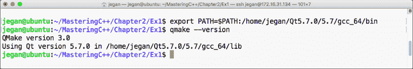

图 5.1

如果`qmake`命令无法识别，请确保导出 Qt 安装文件夹的`bin`路径，如前面的屏幕截图所示。此外，创建软链接也可能很有用。此命令如下：

```cpp
 sudo ln -s /home/jegan/Qt5.7.0/5.7/gcc_64/bin/qmake /usr/bin/qmake  
```

Qt 在您的系统上安装的路径可能与我的不同，请相应地替换 Qt 路径。

# Qt Core

Qt Core 是 Qt 支持的模块之一。该模块具有大量有用的类，例如`QObject`、`QCoreApplication`、`QDebug`等。几乎每个 Qt 应用程序都需要此模块，因此它们会被 Qt 框架隐式链接。每个 Qt 类都继承自`QObject`，而`QObject`类为 Qt 应用程序提供事件处理支持。`QObject`是支持事件处理机制的关键部分；有趣的是，即使是基于控制台的应用程序也可以在 Qt 中支持事件处理。

# 编写我们的第一个 Qt 控制台应用程序

如果您得到了类似于*图 5.1*所示的输出，那么您已经准备好动手了。让我们编写我们的第一个 Qt 应用程序，如下面的屏幕截图所示：

**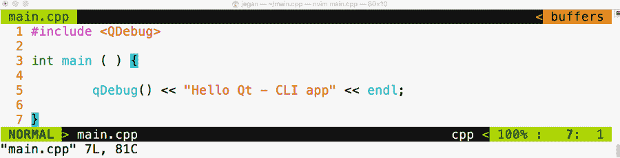**

图 5.2

在第一行中，我们从**QtCore**模块中包含了 QDebug 头文件。如果您仔细观察，`qDebug()`函数类似于 C++的`cout ostream`操作符。在 Qt 世界中，当您调试代码时，`qDebug()`函数将成为您的好朋友。`QDebug`类已经重载了 C++的`ostream`操作符，以支持 Qt 数据类型，这些类型不受 C++编译器支持。

以老派的方式，我对终端有点着迷，可以在编码时实现几乎任何功能，而不是使用一些花哨的**集成开发环境**（**IDE**）。您可能会喜欢或讨厌这种方法，这是很自然的。好处是在 Qt/C++中，您可以使用简单而强大的文本编辑器，如 Vim、Emacs、Sublime Text、Atom、Brackets 或 Neovim，学习几乎所有 Qt 项目和 qmake 的基本知识；IDE 可以让您的生活变得更轻松，但它们隐藏了许多每个严肃开发人员都必须了解的基本内容。所以这是一个权衡。我把决定权交给您，决定是使用您喜欢的纯文本编辑器、Qt Creator IDE 还是其他花哨的 IDE。我将坚持使用经过重构的 Vim 编辑器 Neovim，看起来真的很酷。*图 5.2*将给您一个关于 Neovim 编辑器外观和感觉的想法。

让我们回到正题。让我们看看如何以极客的方式在命令行中编译这段代码。在此之前，您可能想了解一下`qmake`工具。它是 Qt 的专有`make`实用程序。`qmake`实用程序不过是一个 make 工具，但它知道 Qt 特定的东西，因此它了解 moc、signals、slots 等，而典型的`make`实用程序则不知道。

以下命令应该帮助您创建一个`.pro`文件。`.pro`文件的名称将由`qmake`实用程序根据项目文件夹名称决定。`.pro`文件是 Qt Creator IDE 将相关文件组合为单个项目的方式。由于我们不打算使用 Qt Creator，我们将使用`.pro`文件创建`Makefile`，以便编译我们的 Qt 项目，就像编译普通的 C++项目一样。

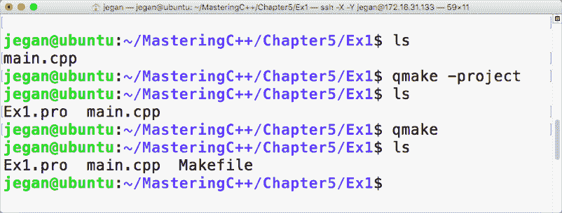

图 5.3

当您发出`qmake -project`命令时，qmake 将扫描当前文件夹和当前文件夹下的所有子文件夹，并在`Ex1.pro`中包含头文件和源文件。顺便说一句，`.pro`文件是一个纯文本文件，可以使用任何文本编辑器打开，如*图 5.4*所示：

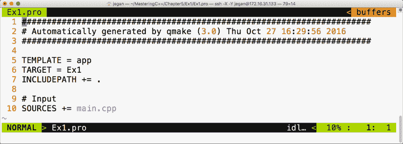

图 5.4

现在是时候创建`Makefile`，以`Ex1.pro`作为输入文件。由于`Ex1.pro`文件存在于当前目录中，我们不必显式提供`Ex1.pro`作为自动生成`Makefile`的输入文件。这个想法是，一旦我们有了`.pro`文件，我们只需要从`.pro`文件生成`Makefile`，发出命令：`qmake`。这将完成创建一个完整的`Makefile`的魔术，您可以使用`make`实用程序构建您的项目，如下面的屏幕截图所示：

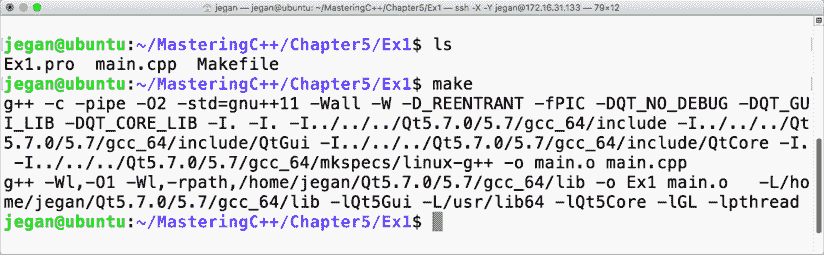

图 5.5

这是我们一直在等待的时刻，对吧？是的，让我们执行我们的第一个 Qt Hello World 程序，如下面的屏幕截图所示：

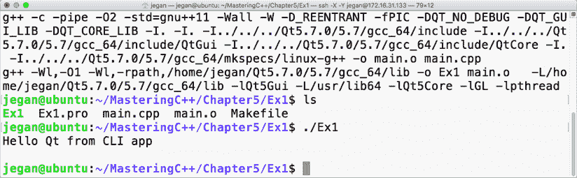

图 5.6

恭喜！您已经完成了您的第一个 Qt 应用程序。在这个练习中，您学会了如何在 Ubuntu 中设置和配置 Qt，以及如何编写一个简单的 Qt 控制台应用程序，然后构建和运行它。最好的部分是您从命令行学会了所有这些。

# Qt 小部件

Qt Widgets 是一个有趣的模块，支持许多小部件，如按钮、标签、编辑、组合、列表、对话框等。`QWidget`是所有小部件的基类，而`QObject`是几乎每个 Qt 类的基类。许多编程语言称之为 UI 控件，Qt 称之为小部件。尽管 Qt 可以在许多平台上运行，但它的主要平台仍然是 Linux；小部件在 Linux 世界中很常见。

# 编写我们的第一个 Qt GUI 应用程序

我们的第一个控制台应用程序真的很酷，不是吗？让我们继续探索。这一次，让我们编写一个简单的基于 GUI 的 Hello World 程序。过程基本上是一样的，只是在`main.cpp`中有一些小的改变。请参考以下完整的代码：

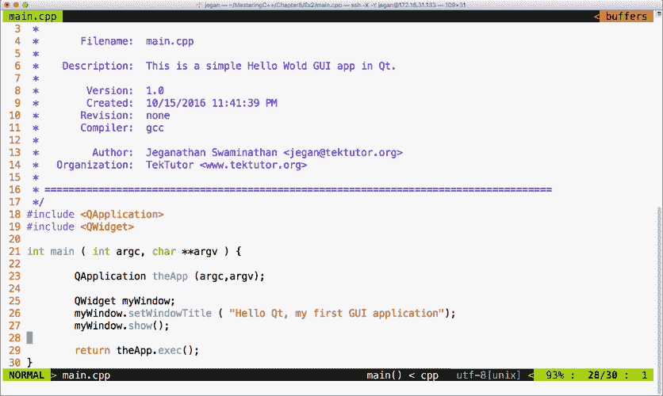

图 5.7

等一下。让我解释一下为什么第 23 行和第 29 行需要`QApplication`。每个 Qt GUI 应用程序必须有一个`QApplication`实例。`QApplication`为我们的应用程序提供了命令行开关的支持，因此需要提供**参数计数**（**argc**）和**参数值**（**argv**）。基于 GUI 的应用程序是事件驱动的，因此它们必须响应 Qt 世界中的事件或者更准确地说是信号。在第 29 行，`exec`函数启动了`event`循环，这确保应用程序等待用户交互，直到用户关闭窗口。所有用户事件将被接收到`QApplication`实例的事件队列中，然后通知给它的`Child`小部件。事件队列确保队列中存放的所有事件按照它们发生的顺序处理，即**先进先出**（**FIFO**）。

如果你好奇地想要检查一下，如果你注释掉第 29 行会发生什么，应用程序仍然会编译和运行，但你可能看不到任何窗口。原因是`main`线程或`main`函数在第 25 行创建了一个`QWidget`的实例，这就是我们启动应用程序时看到的窗口。

在第 27 行，窗口实例被显示，但在没有第 29 行的情况下，`main`函数将立即终止应用程序，而不给你检查你的第一个 Qt GUI 应用程序的机会。值得一试，所以继续看看有没有第 29 行会发生什么。

让我们生成`Makefile`，如下面的截图所示：

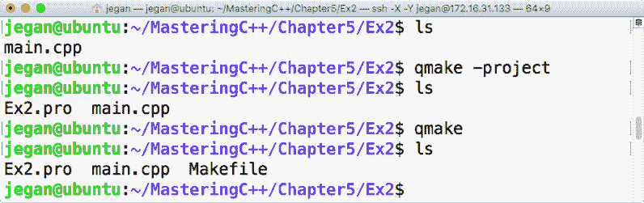

图 5.8

现在让我们尝试使用`make`工具编译我们的项目，如下面的截图所示：

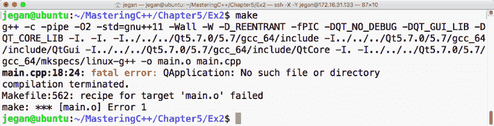

图 5.9

有趣，对吧？我们全新的 Qt GUI 程序无法编译。你注意到致命错误了吗？没关系，让我们了解一下为什么会发生这种情况。原因是我们还没有链接 Qt Widgets 模块，因为`QApplication`类是 Qt Widgets 模块的一部分。在这种情况下，你可能会想知道为什么你的第一个 Hello World 程序可以编译而没有任何问题。在我们的第一个程序中，`QDebug`类是**QtCore**模块的一部分，它隐式地被链接，而其他模块必须显式地被链接。让我们看看如何解决这个问题：

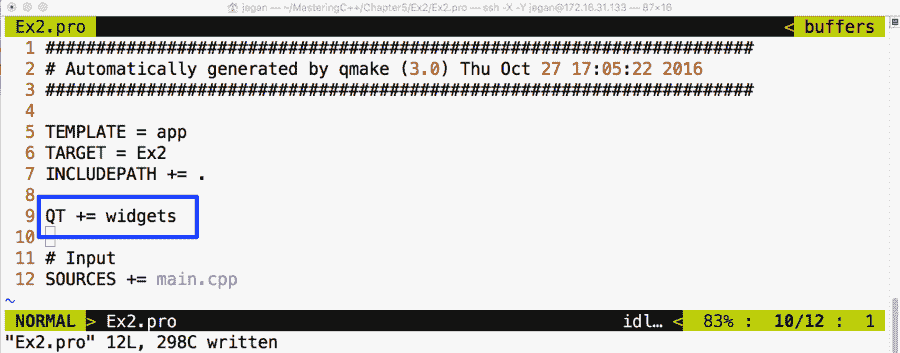

图 5.10

我们需要在`Ex2.pro`文件中添加`QT += widgets`，这样`qmake`工具就能理解在创建最终可执行文件时需要链接 Qt Widgets 的**共享对象**（在 Linux 中是`.so`文件），也就是在 Windows 中被称为**动态链接库**（`.dll`文件）。一旦这个问题得到解决，我们必须运行`qmake`，这样`Makefile`就能反映出我们`Ex2.pro`文件中的新变化，如下面的截图所示：

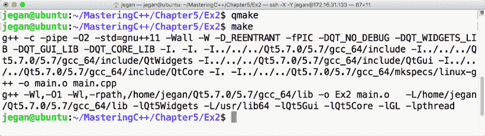

图 5.11

很好。现在让我们检查我们的第一个基于 GUI 的 Qt 应用程序。在我的系统中，应用程序输出如*图 5.12*所示；如果一切顺利，您也应该得到类似的输出：

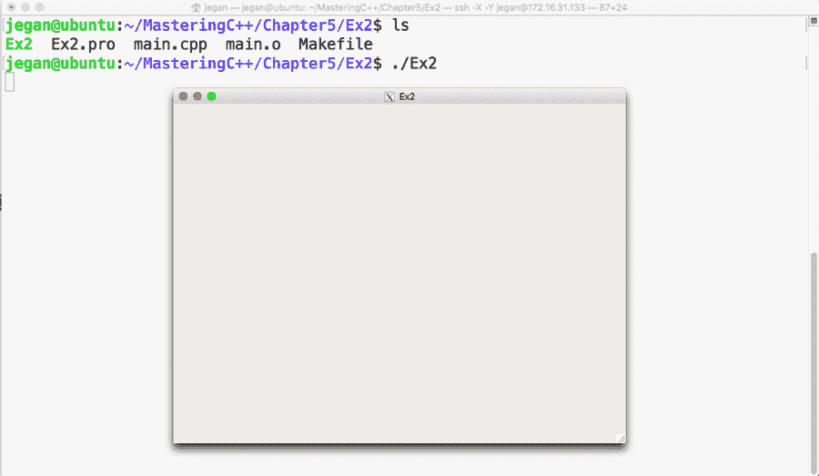

图 5.12

如果我们将窗口的标题设置为`Hello Qt`，那就太好了，对吧？让我们马上做到这一点：

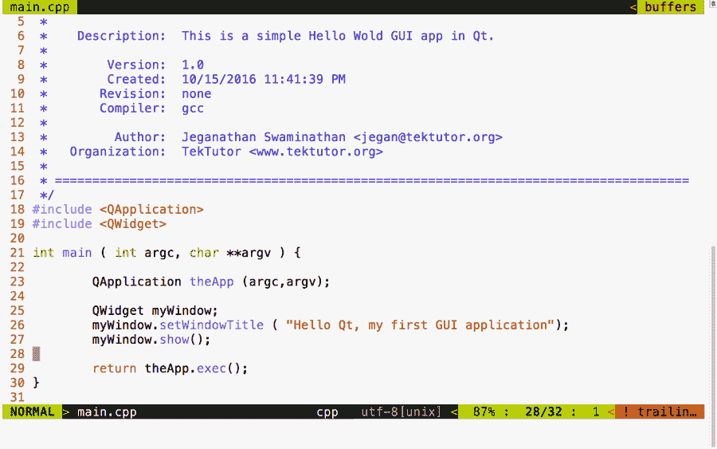

图 5.13

添加第 26 行呈现的代码，以确保在测试新更改之前使用`make`实用程序构建项目：

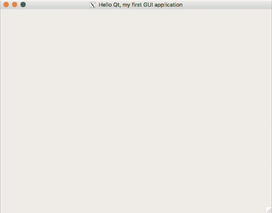

图 5.14

# 布局

Qt 是跨平台应用程序框架，因此支持诸如布局之类的概念，用于开发在所有平台上看起来一致的应用程序，而不管不同的屏幕分辨率如何。当我们开发基于 GUI/HMI 的 Qt 应用程序时，在一个系统中开发的应用程序不应该在具有不同屏幕大小和分辨率的另一个系统上看起来不同。这是通过布局在 Qt 框架中实现的。布局有不同的风格。这有助于开发人员通过在窗口或对话框中组织各种小部件来设计专业外观的 HMI/GUI。布局在安排其子小部件的方式上有所不同。一个布局以水平方式排列其子小部件，另一个则以垂直或网格方式排列。当窗口或对话框调整大小时，布局会调整其子小部件，以便它们不会被截断或失焦。

# 使用水平布局编写 GUI 应用程序

让我们编写一个 Qt 应用程序，在对话框中放置一些按钮。Qt 支持各种有用的布局管理器，它们充当一个无形的画布，在那里可以将许多`QWidgets`排列好，然后再将它们附加到窗口或对话框上。每个对话框或窗口只能有一个布局。每个小部件只能添加到一个布局中；但是，可以组合多个布局来设计专业的用户界面。

现在让我们开始编写代码。在这个项目中，我们将以模块化的方式编写代码，因此我们将创建三个文件，分别命名为`MyDlg.h`、`MyDlg.cpp`和`main.cpp`。

游戏计划如下：

1.  创建`QApplication`的单个实例。

1.  通过继承`QDialog`创建自定义对话框。

1.  创建三个按钮。

1.  创建一个水平框布局。

1.  将三个按钮添加到不可见的水平框布局中。

1.  将水平框布局的实例设置为我们对话框的布局。

1.  显示对话框。

1.  在`QApplication`上启动事件循环。

重要的是，我们遵循清晰的代码规范，以便我们的代码易于理解，并且可以由任何人维护。由于我们将遵循行业最佳实践，让我们在名为`MyDlg.h`的头文件中声明对话框，在名为`MyDlg.cpp`的源文件中定义对话框，并在具有`main`函数的`main.cpp`中使用`MyDlg.cpp`。每次`MyDlg.cpp`需要一个头文件时，让我们养成一个习惯，只在`MyDlg.h`中包含所有头文件；通过这样做，我们在`MyDlg.cpp`中看到的唯一头文件将是`MyDlg.h`。

顺便说一句，我有没有告诉过你 Qt 遵循驼峰命名约定？是的，我刚刚提到了。到目前为止，您可能已经注意到所有 Qt 类都以字母*Q*开头，因为 Qt 的发明者喜欢 Emacs 中的字母“Q”，他们对该字体类型如此着迷，以至于决定在 Qt 中到处使用字母 Q。

最后一个建议。如果文件名和类名相似，其他人是否会更容易找到对话框类？我可以听到你说是的。一切准备就绪！让我们开始编写我们的 Qt 应用程序。首先，参考以下屏幕截图：

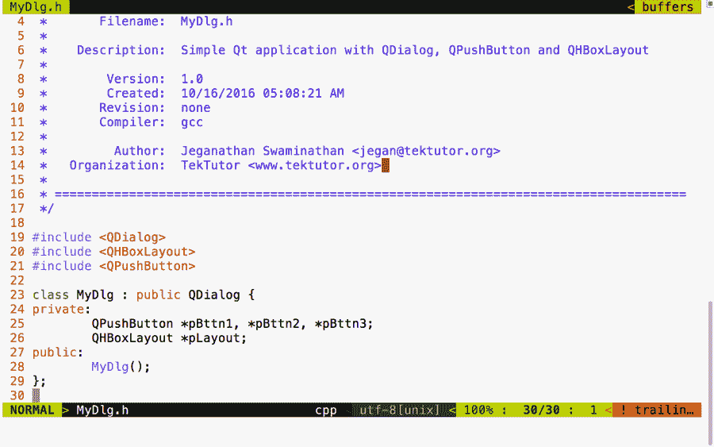

图 5.15

在前面的屏幕截图中，我们声明了一个名为`MyDlg`的类。它有一个布局，三个按钮和一个构造函数。现在请参考这个屏幕截图：

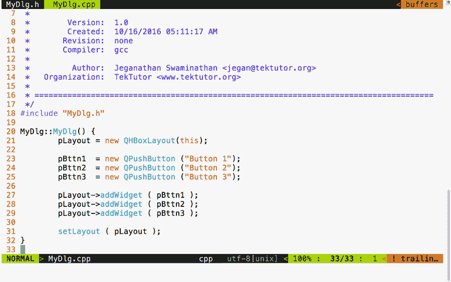

图 5.16

正如您在前面的屏幕截图中所看到的，我们定义了`MyDlg`构造函数并实例化了布局和三个按钮。在第 27 到 29 行，我们向布局添加了三个按钮。在第 31 行，我们将布局与我们的对话框关联起来。就是这样。在下一个屏幕截图中，我们定义了我们的`main`函数，它创建了一个`QApplication`的实例：

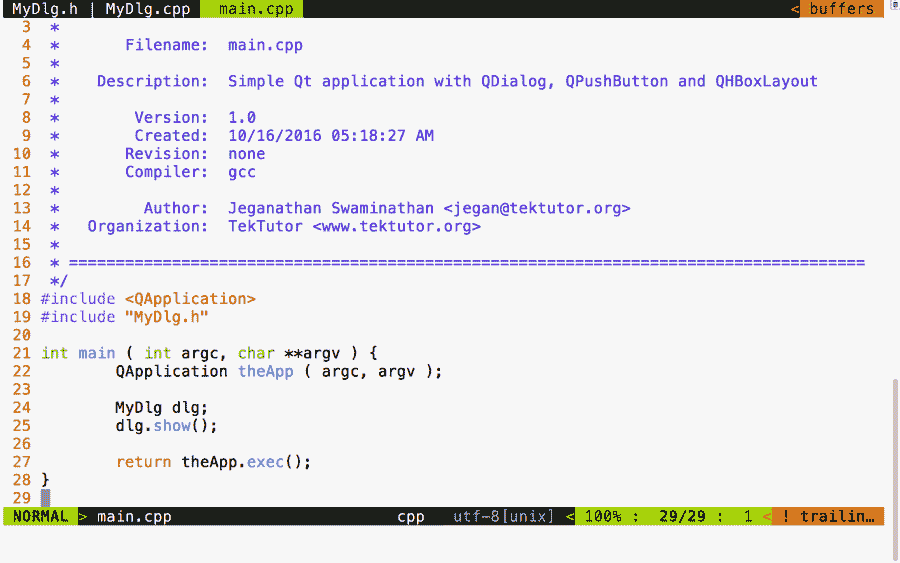

图 5.17

接着，我们创建了我们的自定义对话框实例并显示了对话框。最后，在第 27 行，我们启动了`event`循环，以便`MyDlg`可以响应用户交互。请参考以下屏幕截图：

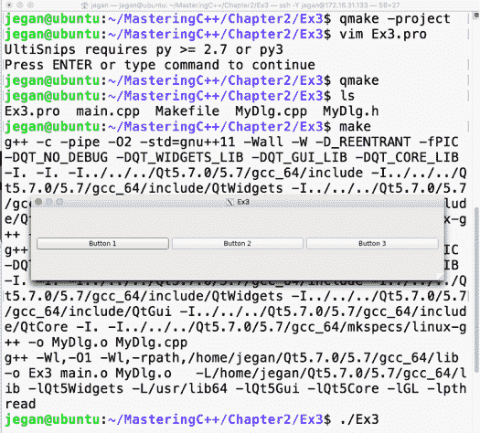

图 5.18

前面的屏幕截图演示了构建和执行过程，还有我们可爱的应用程序。实际上，您可以尝试使用对话框来更好地理解水平布局。首先，水平拉伸对话框，注意所有按钮的宽度增加；然后，看看是否可以减小对话框的宽度以注意到所有按钮的宽度减小。这是任何布局管理器的工作。布局管理器安排小部件并检索窗口的大小，并在所有子小部件之间平均分配高度和宽度。布局管理器不断通知所有子小部件有关任何调整大小事件。但是，由各自的子小部件决定他们是否要调整大小或忽略布局调整信号。

要检查这种行为，请尝试垂直拉伸对话框。当您增加对话框的高度时，对话框的高度应该增加，但按钮不会增加其高度。这是因为每个 Qt 小部件都有自己的首选大小策略；根据其大小策略，它们可能会响应或忽略某些布局调整信号。

如果您希望按钮在垂直方向上也能拉伸，`QPushButton`提供了一种方法来实现这一点。实际上，`QPushButton`与任何其他小部件一样都是从`QWidget`继承的。`setSizePolicy()`方法来自`QWidget`的基类，即`QPushButton`：

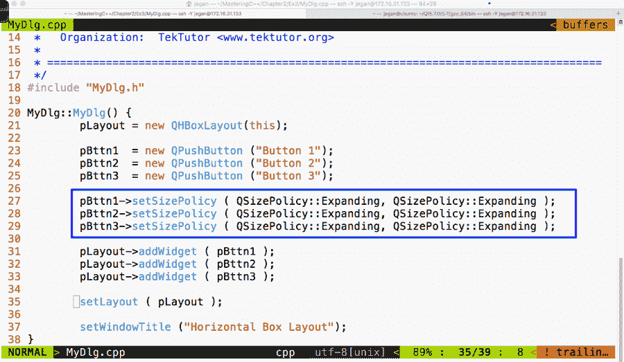

图 5.19

您注意到了第 37 行吗？是的，我在`MyDlg`的构造函数中设置了窗口标题，以保持我们的`main`函数简洁和干净。

在启动应用程序之前，请确保使用`make`实用程序构建了您的项目：

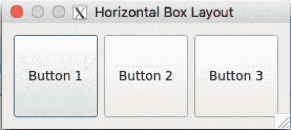

图 5.20

在突出显示的部分，我们覆盖了所有按钮的默认大小策略。在第 27 行，第一个参数`QSizePolicy::Expanding`是指水平策略，第二个参数是指垂直策略。要查找`QSizePolicy`的其他可能值，请参考 Qt API 参考中随时可用的助手，如下面的屏幕截图所示：

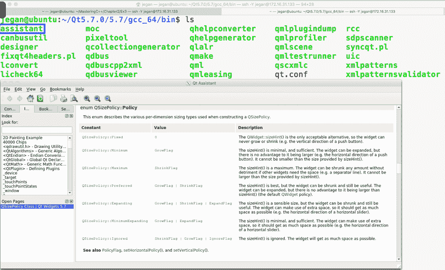

图 5.21

# 使用垂直布局编写 GUI 应用程序

在上一节中，您学会了如何使用水平框布局。在本节中，您将看到如何在应用程序中使用垂直框布局。

事实上，水平和垂直框布局只在它们如何排列小部件方面有所不同。例如，水平框布局将以从左到右的水平方式排列其子小部件，而垂直框布局将以从上到下的垂直方式排列其子小部件。

您可以从上一节中复制源代码，因为更改的性质很小。一旦您复制了代码，您的项目目录应该如下所示：

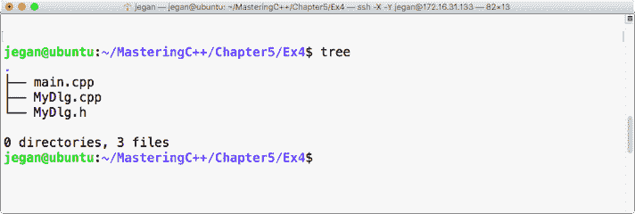

图 5.22

让我从`MyDlg.h`头文件开始演示更改，如下所示：

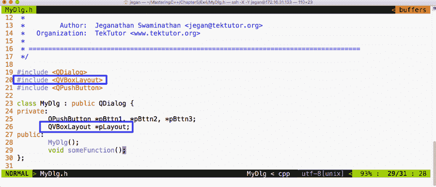

图 5.23

我已经用`QVBoxLayout`替换了`QHBoxLayout`；就是这样。是的，让我们继续进行与`MyDlg.cpp`相关的文件更改：

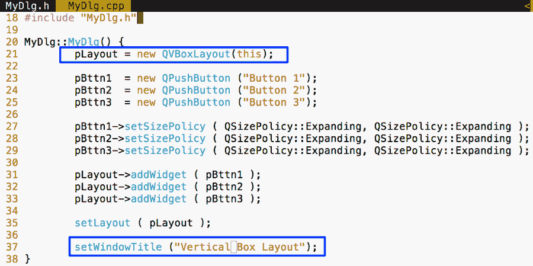

图 5.24

`main.cpp`中没有要做的更改；但是，我已经展示了`main.cpp`供您参考，如下所示：


图 5.25

现在我们需要做的就是自动生成`Makefile`，然后编译和运行程序，如下所示：


图 5.26

让我们执行我们全新的程序并检查输出。以下输出演示了`QVBoxLayout`以垂直的从上到下的方式排列小部件。当窗口被拉伸时，所有按钮的宽度将根据窗口的拉伸程度增加/减少：

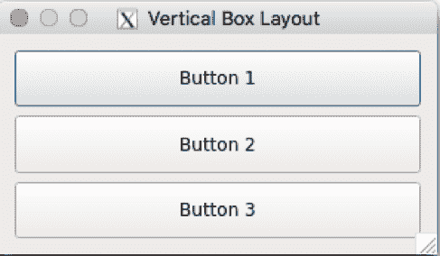

图 5.27

# 使用框布局编写 GUI 应用程序

在前面的章节中，你学会了如何使用`QHBoxLayout`和`QVBoxLayout`。实际上，这两个类都是`QBoxLayout`的便利类。在`QHBoxLayout`的情况下，`QHBoxLayout`类已经成为`QBoxLayout`的子类，并配置了`QBoxLayout::Direction`为`QBoxLayout::LeftToRight`，而`QVBoxLayout`类已经成为`QBoxLayout`的子类，并配置了`QBoxLayout::Direction`为`QBoxLayout::TopToBottom`。

除了这些值，`QBoxLayout::Direction`还支持其他各种值，如下所示：

+   `QBoxLayout::LeftToRight`：这将从左到右排列小部件

+   `QBoxLayout::RightToLeft`：这将从右到左排列小部件

+   `QBoxLayout::TopToBottom`：这将从上到下排列小部件

+   `QBoxLayout::BottomToTop`：这将从下到上排列小部件

让我们使用`QBoxLayout`和五个按钮编写一个简单的程序。

让我们从`MyDlg.h`头文件开始。我在`MyDlg`类中声明了五个按钮指针和一个`QBoxLayout`指针：

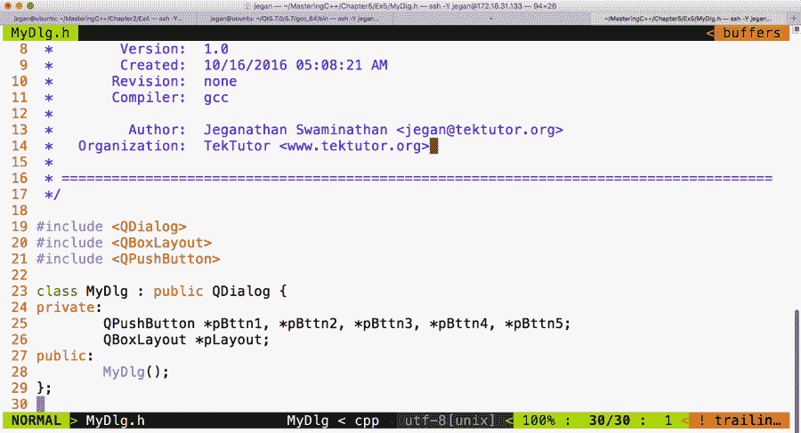

图 5.28

让我们看看我们的`MyDlg.cpp`源文件。如果你注意到截图中的第 21 行，`QBoxLayout`构造函数需要两个参数。第一个参数是你希望排列小部件的方向，第二个参数是一个可选参数，期望布局实例的父地址。

正如你可能已经猜到的那样，`this`指针指的是`MyDlg`实例指针，它恰好是布局的父指针。

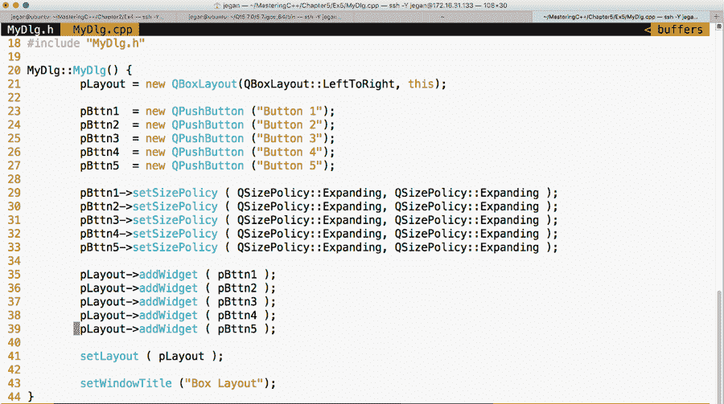

图 5.29

再次，正如你可能已经猜到的那样，`main.cpp`文件不会改变，就像在下面的截图中所示的那样：

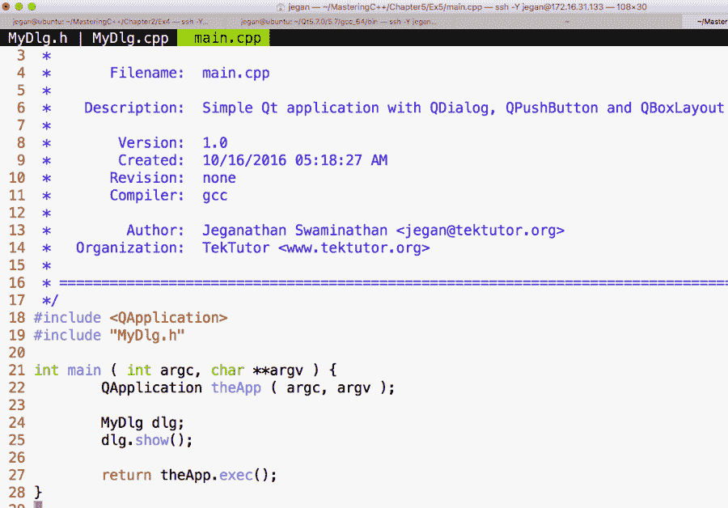

图 5.30

让我们编译和运行我们的程序，如下所示：

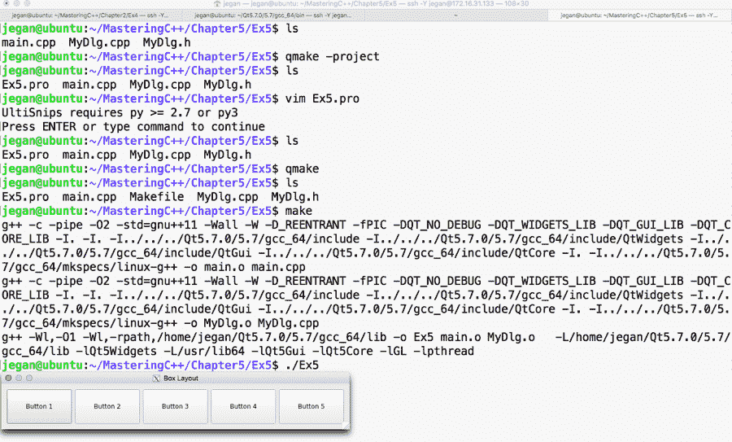

图 5.31

如果你注意到输出，它看起来像是一个水平框布局的输出，对吧？确实，因为我们已经将方向设置为`QBoxLayout::LeftToRight`。如果你将方向修改为，比如`QBoxLayout::RightToLeft`，那么按钮 1 将出现在右侧，按钮 2 将出现在按钮 1 的左侧，依此类推。因此，输出将如下截图所示：

+   如果方向设置为`QBoxLayout::RightToLeft`，你会看到以下输出：

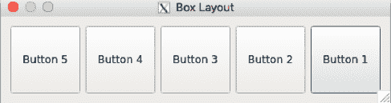

图 5.32

+   如果方向设置为`QBoxLayout::TopToBottom`，你会看到以下输出：

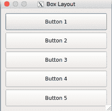

图 5.33

+   如果方向设置为`QBoxLayout::BottomToTop`，你会看到以下输出：

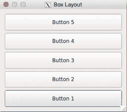

图 5.34

在所有前述的情况下，按钮都是按照相同的顺序添加到布局中，从按钮 1 到按钮 5。然而，根据`QBoxLayout`构造函数中选择的方向，框布局将安排按钮，因此输出会有所不同。

# 使用网格布局编写 GUI 应用程序

网格布局允许我们以表格方式排列小部件。这很容易，就像盒式布局一样。我们只需要指定每个小部件必须添加到布局的行和列。由于行和列索引从基于零的索引开始，因此行 0 的值表示第一行，列 0 的值表示第一列。理论够了；让我们开始写一些代码。

让我们声明 10 个按钮，并将它们添加到两行和五列中。除了特定的`QGridLayout`差异外，其余的东西将与以前的练习保持一致，因此，如果您已经理解了到目前为止讨论的概念，请继续创建`MyDlg.h`，`MyDl.cpp`和`main.cpp`。

让我在以下截图中呈现`MyDlg.h`源代码：

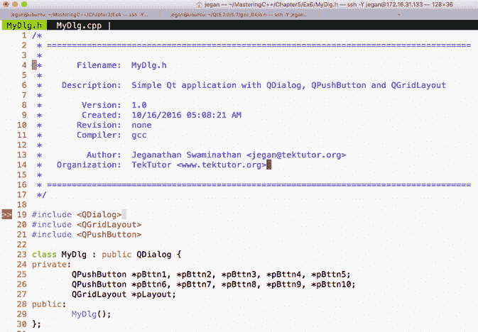

图 5.35

以下是`MyDlg.cpp`的代码片段：

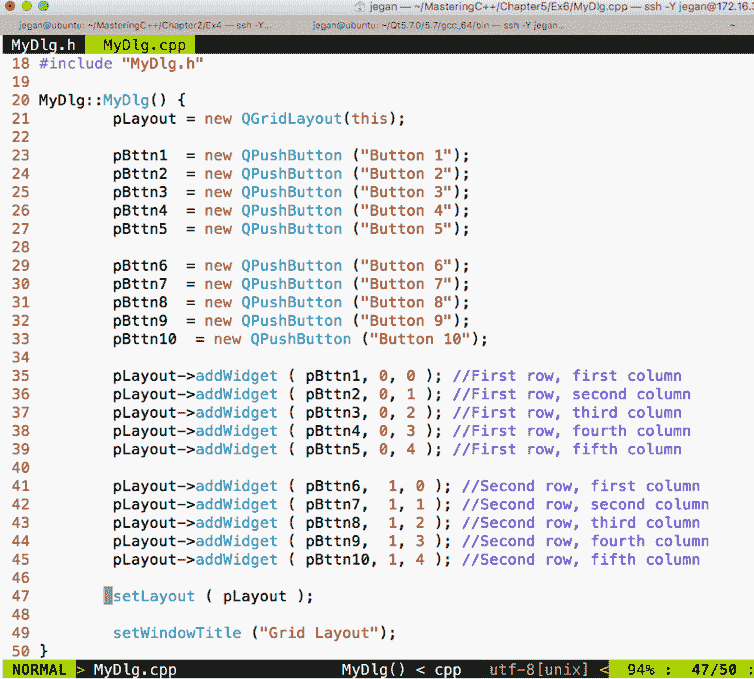

图 5.36

`main.cpp`源文件内容将与我们以前的练习保持一致；因此，我已经跳过了`main.cpp`的代码片段。由于您熟悉构建过程，我也跳过了它。如果您忘记了这一点，只需查看以前的部分以了解构建过程。

如果您已正确输入代码，则应该获得以下输出：

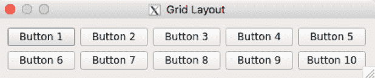

图 5.37

实际上，网格布局还有更多功能可供使用。让我们探索如何使按钮跨越多个单元格。我保证您将看到的内容更有趣。

我将修改`MyDlg.h`和`MyDlg.cpp`，并保持`main.cpp`与以前的练习相同：

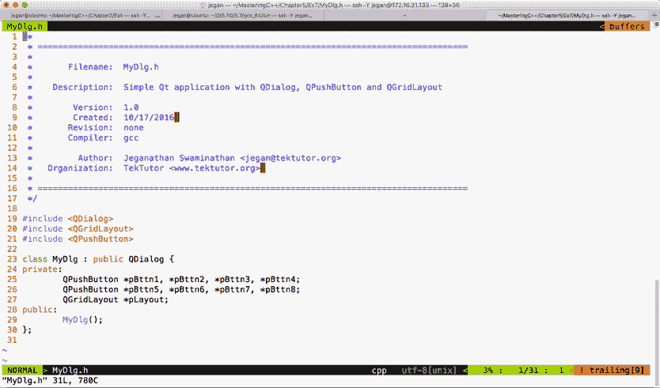

图 5.38

这是我们的`MyDlg.cpp`：

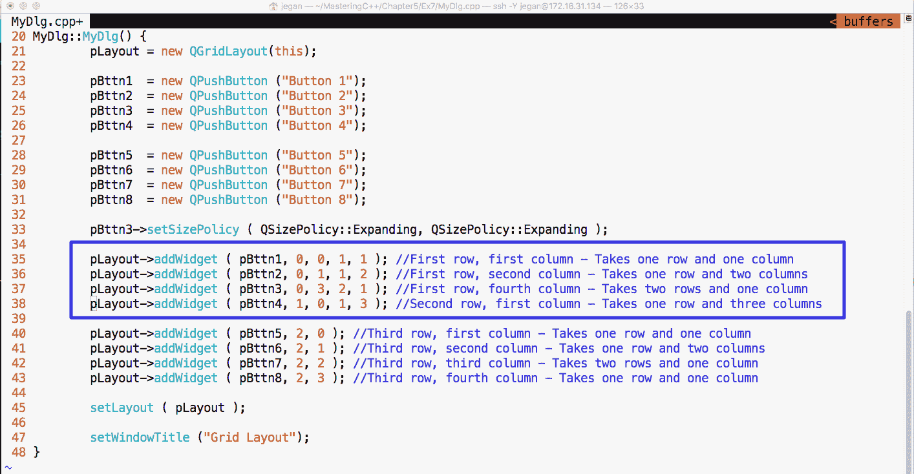

图 5.39

注意第 35 到 38 行。现在让我们详细讨论`addWidget()`函数。

在第 35 行，`pLayout->addWidget(pBttn1, 0, 0, 1, 1)`代码执行以下操作：

+   前三个参数将“按钮 1”添加到网格布局的第一行和第一列

+   第四个参数`1`指示按钮 1 将仅占用一行

+   第五个参数`1`指示按钮 1 将仅占用一列

+   因此，很明显`pBttn1`应该呈现在单元格（0,0）处，它应该只占用一个网格单元

在第 36 行，`pLayout->addWidget(pBttn2, 0, 1, 1, 2)`代码执行以下操作：

+   前三个参数将“按钮 2”添加到网格布局的第一行和第二列

+   第四个参数指示“按钮 2”将占用一行

+   第五个参数指示“按钮 2”将占用两列（即第一行的第二列和第三列）

+   在底部行，“按钮 2”将呈现在单元格（0,1）处，它应该占用一行和两列

在第 37 行，`pLayout->addWidget(pBttn3, 0, 3, 2, 1)`代码执行以下操作：

+   前三个参数将“按钮 3”添加到网格布局的第一行和第四列

+   第四个参数指示“按钮 3”将占用两行（即第一行和第四列以及第二行和第四列）

+   第五个参数指示“按钮 3”将占用一列

在第 38 行，`pLayout->addWidget(pBttn4, 1, 0, 1, 3)`代码执行以下操作：

+   前三个参数将“按钮 4”添加到网格布局的第二行和第一列

+   第四个参数指示“按钮 4”将占用一行

+   第五个参数指示“按钮 4”将占用三列（即第二行的第一列，然后是第二列和第三列）

检查程序的输出：

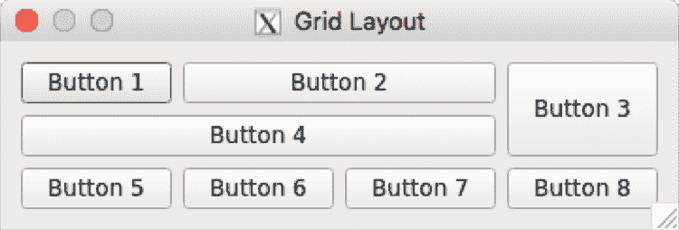

图 5.40

# 信号和槽

信号和槽是 Qt 框架的一个重要部分。到目前为止，我们编写了一些简单但有趣的 Qt 应用程序，但我们还没有处理事件。现在是时候了解如何在我们的应用程序中支持事件了。

让我们编写一个简单的应用程序，只有一个按钮。当点击按钮时，检查是否可以在控制台上打印一些内容。

`MyDlg.h`头文件演示了如何声明`MyDlg`类：

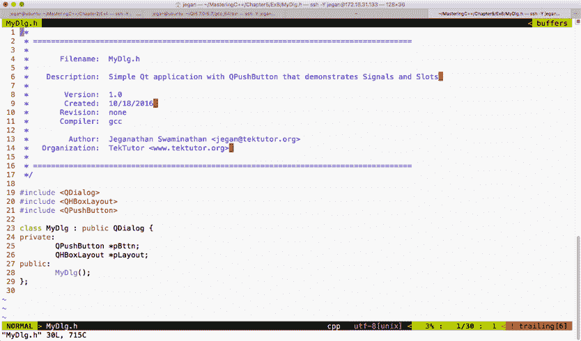

图 5.41

以下截图演示了如何定义`MyDlg`构造函数以向对话框窗口添加一个按钮：

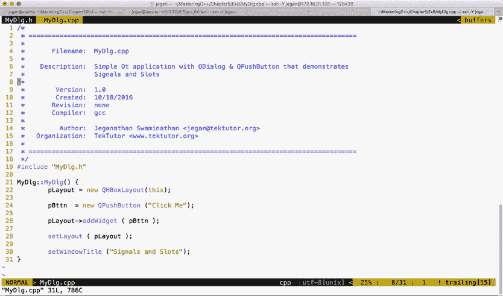

图 5.42

`main.cpp`如下所示：

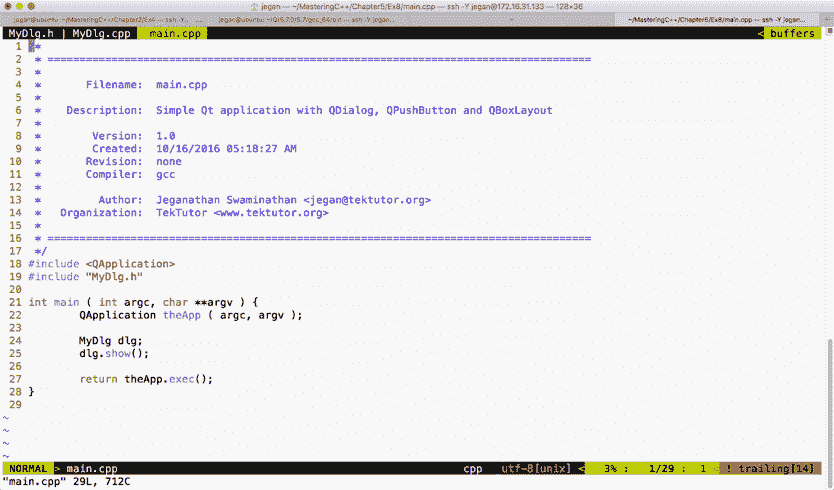

图 5.43

让我们构建并运行我们的程序，然后添加对信号和槽的支持。如果你正确地按照说明操作，你的输出应该类似于以下截图：

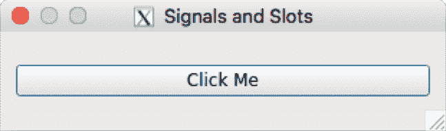

图 5.44

如果你点击按钮，你会注意到什么都没有发生，因为我们还没有在我们的应用程序中添加对信号和槽的支持。好吧，是时候揭示一个秘密指令，这将帮助你使按钮响应按钮点击信号。等一下，是时候获取更多信息了。别担心，这和 Qt 有关。

Qt 信号只是事件，槽函数是事件处理程序函数。有趣的是，信号和槽都是普通的 C++函数；只有当它们被标记为信号或槽时，Qt 框架才能理解它们的目的并提供必要的样板代码。

Qt 中的每个小部件都支持一个或多个信号，也可以选择支持一个或多个槽。因此，在我们编写任何进一步的代码之前，让我们探索一下`QPushButton`支持哪些信号。

让我们使用 Qt 助手进行 API 参考：

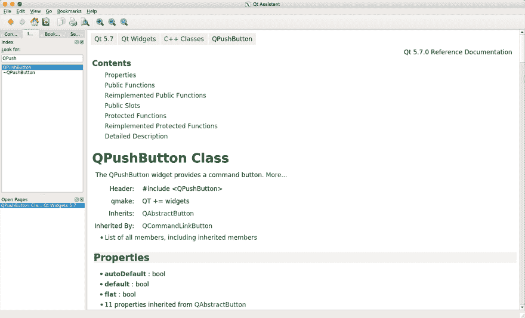

图 5.45

如果你观察前面的截图，它有一个似乎涵盖了公共槽的内容部分，但我们没有看到任何列出的信号。这是很多信息。如果内容部分没有列出信号，`QPushButton`就不会直接支持信号。然而，也许它的基类，即`QAbstractButton`，会支持一些信号。`QPushButton`类部分提供了大量有用的信息，比如头文件名，必须链接到应用程序的 Qt 模块，即必须添加到`.pro`文件的 qmake 条目等。它还提到了`QPushButton`的基类。如果你继续向下滚动，你的 Qt 助手窗口应该看起来像这样：

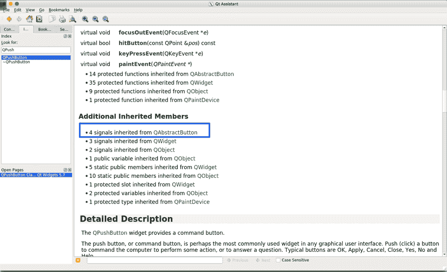

图 5.46

如果你观察到`Additional Inherited Members`下面的突出部分，显然 Qt 助手暗示`QPushButton`已经从`QAbstractButton`继承了四个信号。因此，我们需要探索`QAbstractButton`支持的信号，以便在`QPushButton`中支持这些信号。

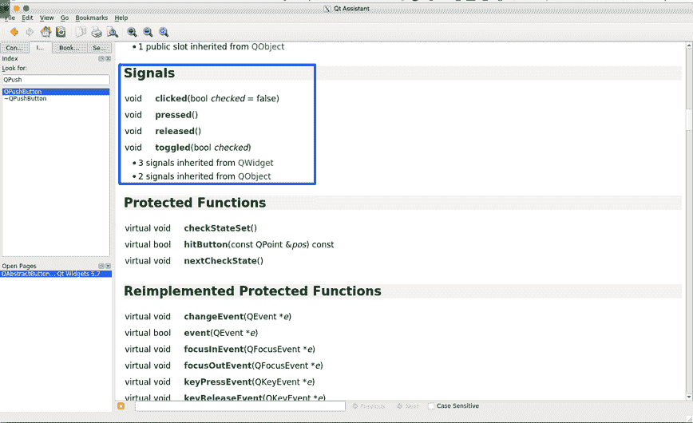

图 5.47

通过 Qt 助手的帮助，如前面的截图所示，很明显`QAbstractButton`类支持四个信号，这些信号也适用于`QPushButton`，因为`QPushButton`是`QAbstractButton`的子类。因此，让我们在这个练习中使用`clicked()`信号。

我们需要在`MyDlg.h`和`MyDlg.cpp`中进行一些小的更改，以便使用`clicked()`信号。因此，我已经在以下截图中呈现了这两个文件，并突出显示了更改：

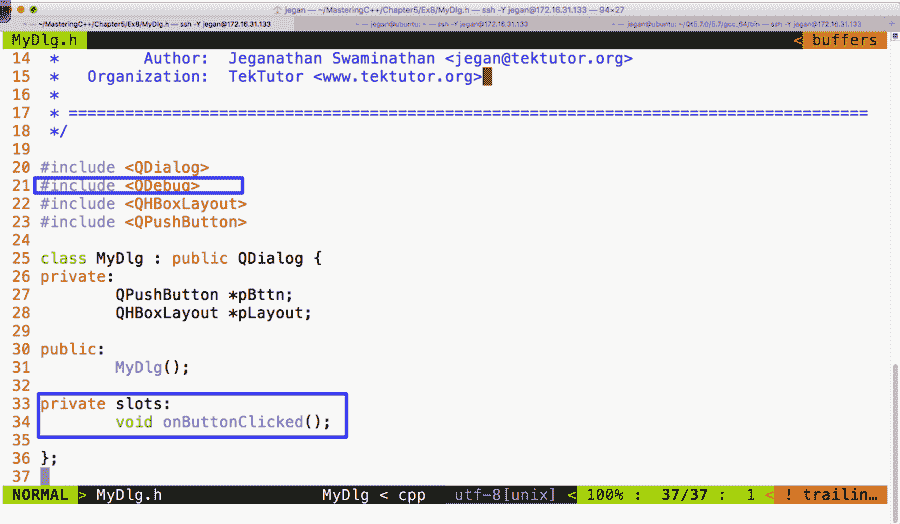

图 5.48

正如你所知，`QDebug`类用于调试目的。它为 Qt 应用程序提供了类似于`cout`的功能，但实际上并不需要用于信号和槽。我们在这里使用它们只是为了调试目的。在*图 5.48*中，第 34 行，`MyDlg::onButtonClicked()`是我们打算用作事件处理程序函数的槽函数，必须在按钮点击时调用。

以下的屏幕截图应该让你了解在`MyDlg.cpp`中需要进行哪些更改以支持信号和槽：

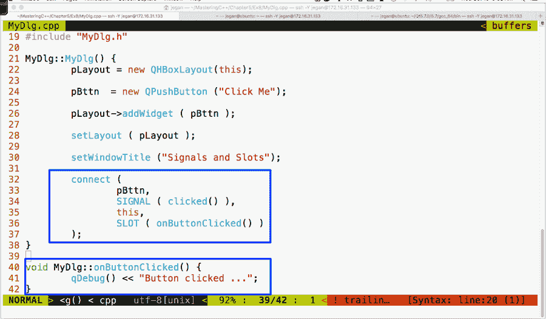

图 5.49

如果你观察前面屏幕截图中的第 40 到 42 行，`MyDlg::onButtonClicked()`方法是一个槽函数，必须在按钮被点击时调用。但是除非按钮的`clicked()`信号映射到`MyDlg::onButtonClicked()`槽，否则 Qt 框架不会知道它必须在按钮被点击时调用`MyDlg::onButtonClicked()`。因此，在 32 到 37 行，我们将按钮信号`clicked()`与`MyDlg`实例的`onButtonClicked()`槽函数连接起来。connect 函数是从`QDialog`继承的。这又从它的最终基类`QObject`继承了这个函数。

关键是，每个希望参与信号和槽通信的类都必须是`QObject`或其子类。`QObject`提供了相当多的信号和槽支持，`QObject`是`QtCore`模块的一部分。令人惊奇的是，Qt 框架甚至为命令行应用程序提供了信号和槽支持。这就是为什么信号和槽支持内置到最终基类`QObject`中的原因，它是`QtCore`模块的一部分。

好的，让我们构建和运行我们的程序，看看信号在我们的应用程序中是否起作用：

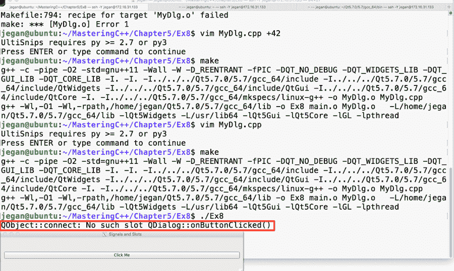

图 5.50

有趣的是，我们并没有得到编译错误，但当我们点击按钮时，突出显示的警告消息会自动出现。这是 Qt 框架的提示，表明我们错过了一个重要的程序，这是使信号和槽工作所必需的。

让我们回顾一下我们在头文件和源文件中自动生成`Makefile`的过程：

1.  `qmake -project`命令确保当前文件夹中存在的所有头文件和源文件都包含在`.pro`文件中。

1.  `qmake`命令会读取当前文件夹中的`.pro`文件，并为我们的项目生成`Makefile`。

1.  `make`命令将调用`make`实用程序。然后在当前目录中执行`Makefile`，并根据`Makefile`中定义的 make 规则构建我们的项目。

在第 1 步中，`qmake`实用程序扫描我们所有的自定义头文件，并检查它们是否需要信号和槽支持。任何具有`Q_OBJECT`宏的头文件都会提示`qmake`实用程序需要信号和槽支持。因此，我们必须在我们的`MyDlg.h`头文件中使用`Q_OBJECT`宏：


图 5.51

一旦在头文件中进行了推荐的更改，我们需要确保发出`qmake`命令。现在`qmake`实用程序将打开`Ex8.pro`文件，获取我们的项目头文件和源文件。当`qmake`解析`MyDlg.h`并找到`Q_OBJECT`宏时，它将了解到我们的`MyDlg.h`需要信号和槽，然后它将确保在`MyDlg.h`上调用 moc 编译器，以便在一个名为`moc_MyDlg.cpp`的文件中自动生成样板代码。然后，它将继续添加必要的规则到`Makefile`中，以便自动生成的`moc_MyDlg.cpp`文件与其他源文件一起构建。

现在你知道了 Qt 信号和槽的秘密，继续尝试这个过程，并检查你的按钮点击是否打印了“按钮点击...”的消息。我已经根据建议对我们的项目进行了构建。在下面的截图中，我已经突出显示了幕后发生的有趣的事情；这些是在命令行中工作与使用花哨的 IDE 时会得到的一些优势：

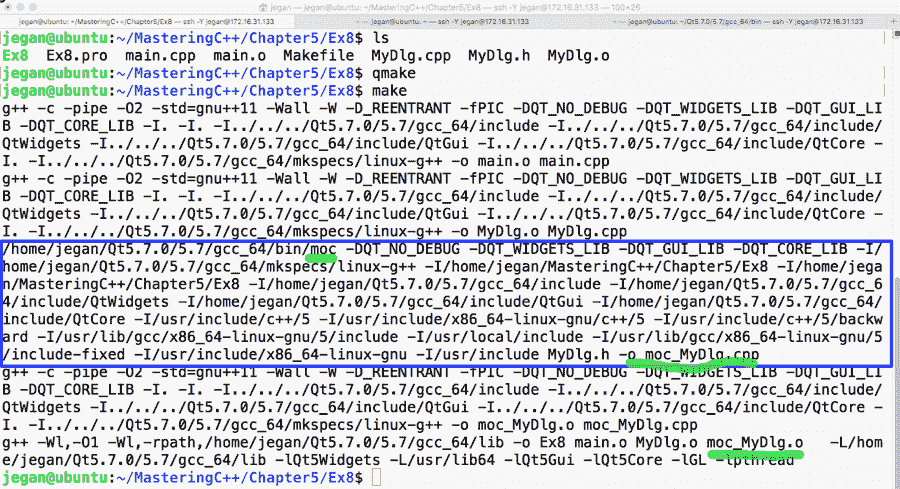

图 5.52

现在是时候测试我们支持信号和槽的酷而简单的应用程序的输出了。输出如下截图所示：

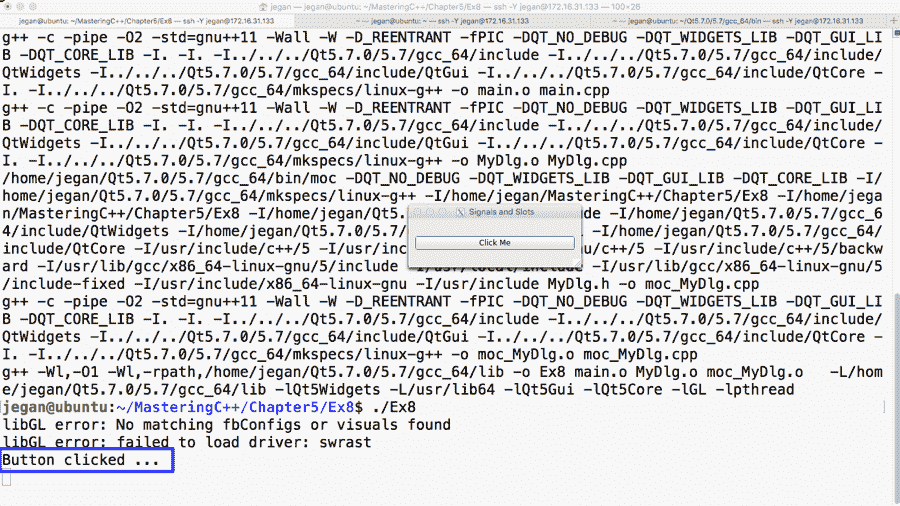

图 5.53

恭喜！你可以为自己鼓掌。你已经学会了在 Qt 中做一些很酷的东西。

# 在 Qt 应用程序中使用堆叠布局

由于你已经了解了信号和槽，所以在这一部分，让我们探讨如何在具有多个窗口的应用程序中使用堆叠布局；每个窗口可以是**QWidget**或**QDialog**。每个页面可能有自己的子窗口部件。我们即将开发的应用程序将演示堆叠布局的使用以及如何在堆叠布局中从一个窗口导航到另一个窗口。

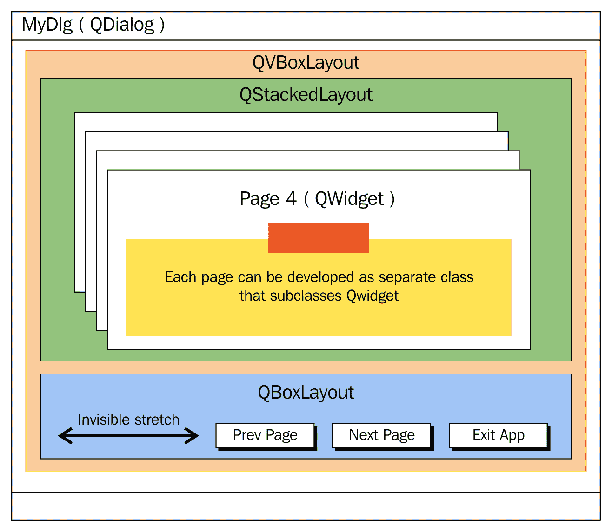

图 5.54

这个应用程序将需要相当多的代码，因此很重要的是我们确保我们的代码结构良好，以满足结构和功能质量，尽量避免代码异味。

让我们创建四个可以堆叠在堆叠布局中的小部件/窗口，其中每个页面可以作为一个单独的类分割成两个文件：`HBoxDlg.h`和`HBoxDlg.cpp`等等。

让我们从`HBoxDlg.h`开始。由于你熟悉布局，所以在这个练习中，我们将使用一个布局创建每个对话框，这样在子窗口之间导航时，你可以区分页面。否则，堆叠布局和其他布局之间将没有连接。

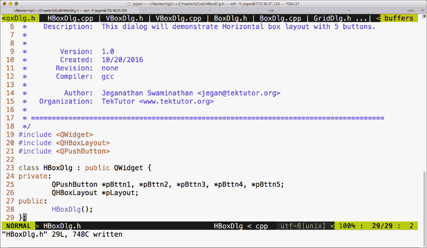

图 5.55

以下代码片段来自`HBoxDlg.cpp`文件：

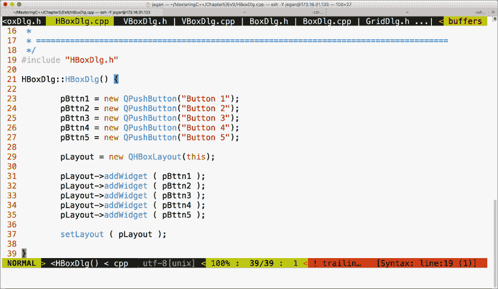

图 5.56

同样，让我们按照以下方式编写`VBoxDlg.h`：

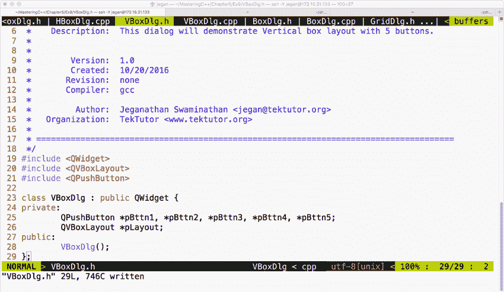

图 5.57

让我们按照以下方式创建第三个对话框`BoxDlg.h`，使用框布局：

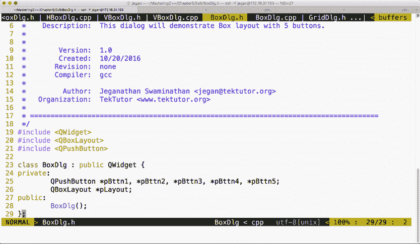

图 5.58

相应的`BoxDlg.cpp`源文件如下：

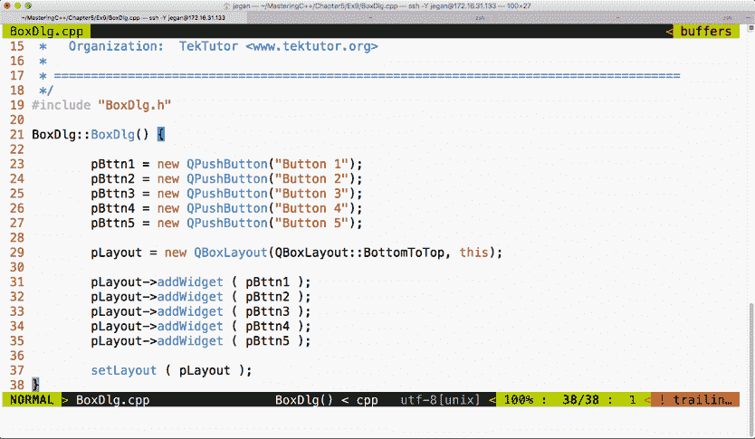

图 5.59

我们想要堆叠的第四个对话框是`GridDlg`，所以让我们看看`GridDlg.h`可以如何编写，如下截图所示：

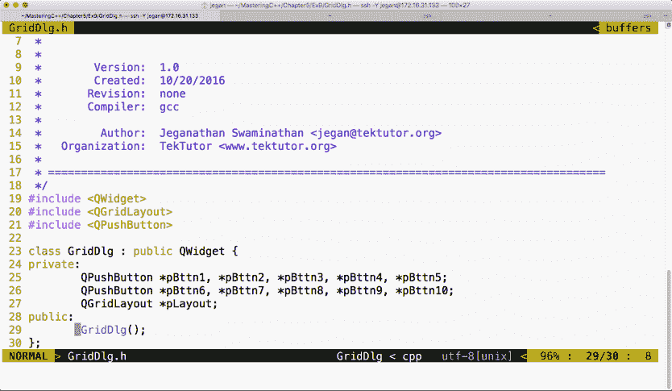

图 5.60

相应的`GridDlg.cpp`将如下所示：

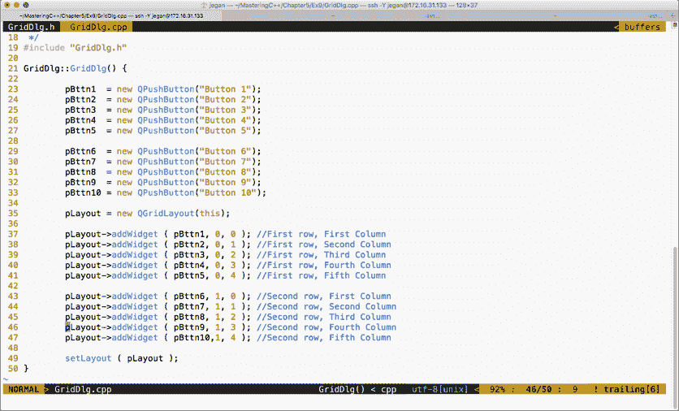

图 5.61

很好，我们已经创建了四个可以堆叠在`MainDlg`中的小部件。`MainDlg`将使用`QStackedLayout`，所以这个练习的关键是理解堆叠布局的工作原理。

让我们看看`MainDlg.h`应该如何编写：

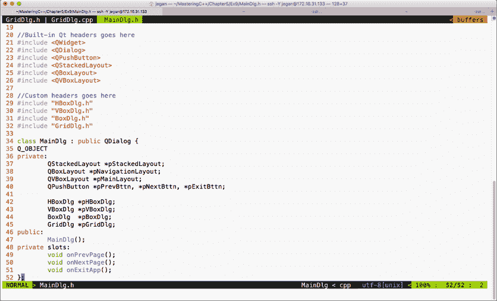

图 5.62

在`MainDlg`中，我们声明了三个槽函数，每个按钮一个，以支持四个窗口之间的导航逻辑。堆叠布局类似于选项卡小部件，只是选项卡小部件将提供自己的视觉方式来在选项卡之间切换，而在堆叠布局的情况下，由我们提供切换逻辑。

`MainDlg.cpp`将如下所示：

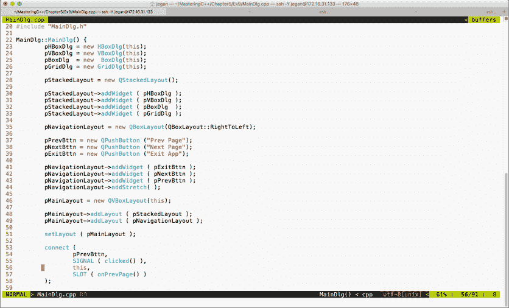图 5.63

你可以选择一个框布局来容纳这三个按钮，因为我们希望按钮对齐到右边。然而，为了确保额外的空间被一些看不见的粘合剂占用，我们在第 44 行添加了一个拉伸项。

在 30 到 33 行之间，我们已经将所有四个子窗口添加到堆叠布局中，以便窗口可以逐个显示。`HBox`对话框添加到索引 0，`VBox`对话框添加到索引 1，依此类推。

53 到 58 行展示了如何将上一个按钮的点击信号与其对应的`MainDlg::onPrevPage()`槽函数连接起来。类似的连接必须为下一个和退出按钮配置：

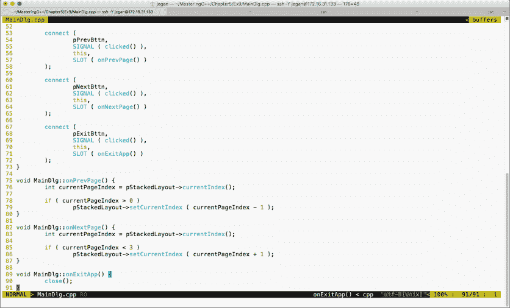

图 5.64

78 行的`if`条件确保只有在我们处于第二个或更后续的子窗口时才发生切换逻辑。由于水平对话框位于索引 0，所以在当前窗口是水平对话框的情况下，我们无法导航到上一个窗口。类似的验证也适用于在 85 行切换到下一个子窗口。

堆叠布局支持`setCurrentIndex()`方法以切换到特定的索引位置；或者，如果在您的情况下更有效，也可以尝试`setCurrentWidget()`方法。

`main.cpp`看起来简短而简单，如下所示：

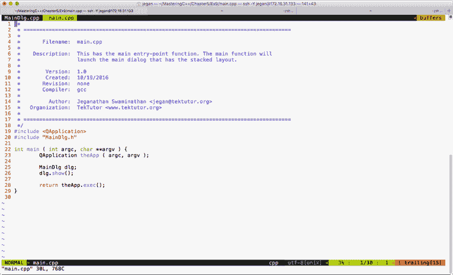

图 5.65

我们`main`函数的最好部分是，无论应用程序逻辑的复杂性如何，`main`函数都没有任何业务逻辑。这使得我们的代码清晰易懂，易于维护。

# 编写一个简单的数学应用程序，结合多个布局

在本节中，让我们探讨如何编写一个简单的数学应用程序。作为这个练习的一部分，我们将使用`QLineEdit`和`QLabel`小部件以及`QFormLayout`。我们需要设计一个 UI，如下面的屏幕截图所示：

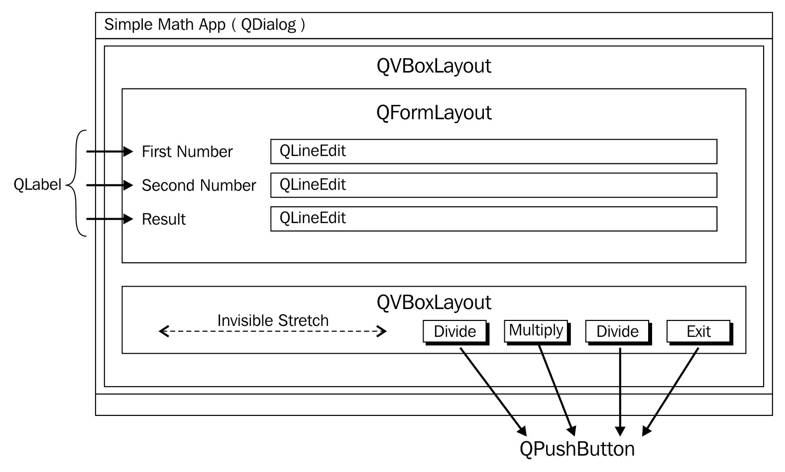

图 5.66

`QLabel`是一个通常用于静态文本的小部件，`QLineEdit`允许用户提供单行输入。如前面的屏幕截图所示，我们将使用`QVBoxLayout`作为主要布局，以便以垂直方式排列`QFormLayout`和`QBoxLayout`。`QFormLayout`在需要创建一个表单的情况下非常方便，在左侧将有一个标题，右侧将有一些小部件。`QGridLayout`也可能适用，但在这种情况下使用`QFormLayout`更容易。

在这个练习中，我们将创建三个文件，分别是`MyDlg.h`、`MyDlg.cpp`和`main.cpp`。让我们从`MyDlg.h`源代码开始，然后再转到其他文件：

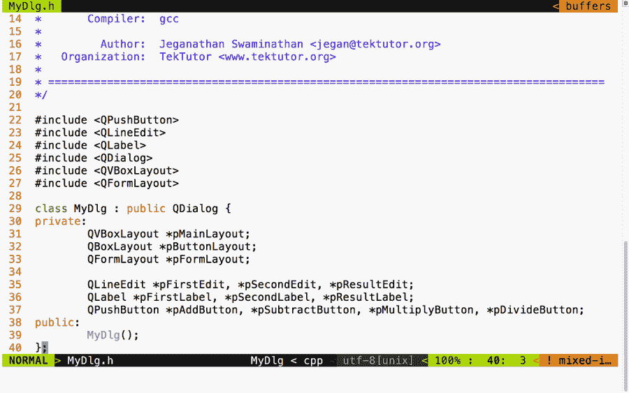

图 5.67

在上图中，声明了三种布局。垂直框布局用作主要布局，而框布局用于以右对齐的方式排列按钮。表单布局用于添加标签，即行编辑小部件。这个练习还将帮助您了解如何结合多个布局来设计专业的 HMI。

Qt 没有记录在单个窗口中可以组合的布局数量的限制。然而，如果可能的话，考虑使用最少的布局来设计 HMI 是一个好主意，特别是如果您正在努力开发一个内存占用小的应用程序。否则，在您的应用程序中使用多个布局也没有坏处。

在下面的屏幕截图中，您将了解到`MyDlg.cpp`源文件应该如何实现。在`MyDlg`构造函数中，所有按钮都被实例化并在框布局中以右对齐的方式布局。表单布局用于以类似网格的方式容纳`QLineEdit`小部件和它们对应的`QLabel`小部件。`QLineEdit`小部件通常用于提供单行输入；在这个特定的练习中，它们帮助我们提供必须根据用户的选择进行加法、减法等操作的数字输入。

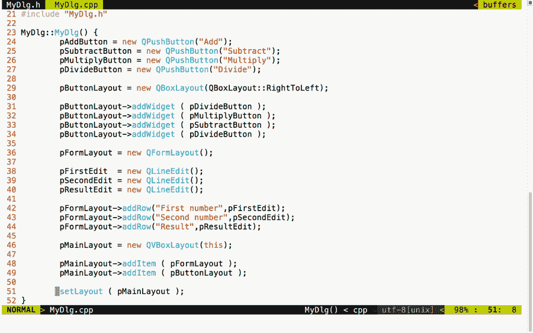

图 5.68

我们`main.cpp`源文件的最好部分是，它基本上保持不变，无论我们的应用程序的复杂性如何。在这个练习中，我想告诉你一个关于`MyDlg`的秘密。你有没有注意到`MyDlg`的构造函数是在堆栈中实例化的，而不是在堆中？这个想法是，当`main()`函数退出时，`main`函数使用的堆栈会被解开，最终释放堆栈中存在的所有堆栈变量。当`MyDlg`被释放时，会导致调用`MyDlg`的析构函数。在 Qt 框架中，每个窗口部件构造函数都接受一个可选的父窗口部件指针，这个指针被顶层窗口的析构函数用来释放它的子窗口部件。有趣的是，Qt 维护一个类似树的数据结构来管理所有子窗口部件的内存。因此，如果一切顺利，Qt 框架将负责自动释放所有子窗口部件的内存位置。

这有助于 Qt 开发人员专注于应用程序方面，而 Qt 框架将负责内存管理。

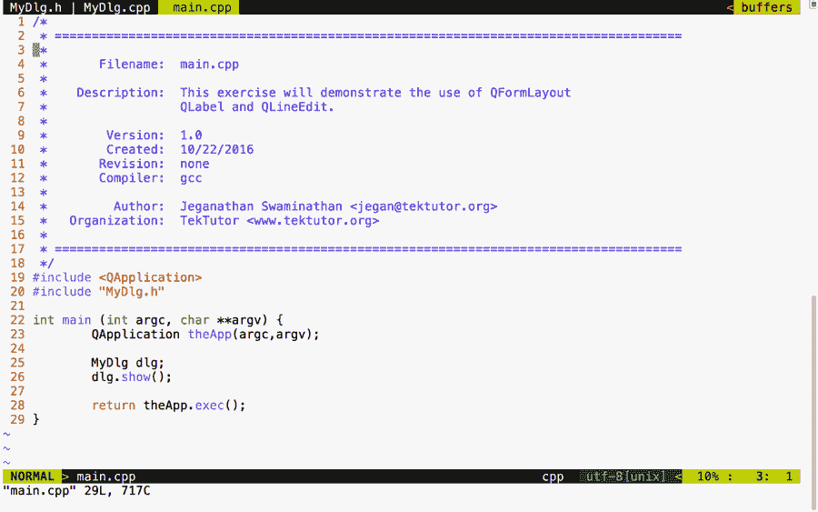

图 5.69

你是不是很兴奋地想要检查我们新应用程序的输出？如果你构建并执行应用程序，那么你应该得到类似以下截图的输出。当然，我们还没有添加信号和槽支持，但设计 GUI 满意后再转向事件处理是个好主意：

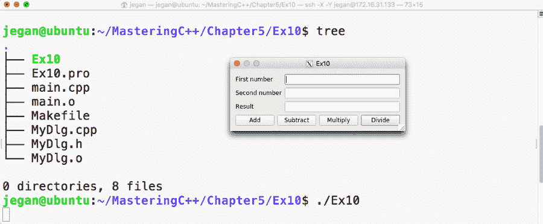

图 5.70

如果你仔细观察，尽管按钮在`QBoxLayout`上是从右到左排列的，但按钮并没有对齐到右边。这种行为的原因是当窗口被拉伸时，框布局似乎已经将额外的水平空间分配给了所有的按钮。因此，让我们在框布局的最左边位置添加一个拉伸项，这样拉伸就会占据所有额外的空间，让按钮没有空间可以扩展。这样就可以得到右对齐的效果。添加拉伸后，代码将如下截图所示：

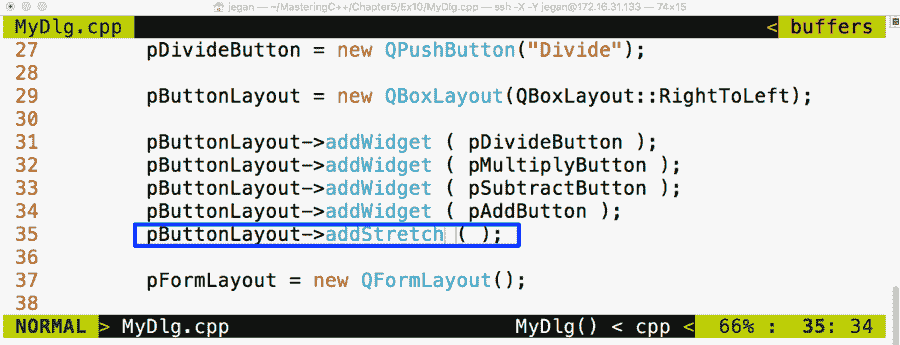

图 5.71

继续检查你的输出是否与以下截图一样。有时，作为开发人员，我们会急于看到输出而忘记编译我们的更改，所以确保项目再次构建。如果你没有看到输出中的任何变化，不用担心；只需尝试水平拉伸窗口，你应该会看到右对齐的效果，如下截图所示：

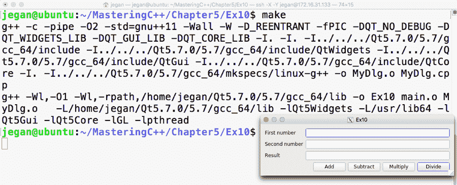

图 5.72

现在，既然我们有了一个看起来不错的应用程序，让我们添加信号和槽支持来响应按钮点击。我们不要急于现在包括加法和减法功能。我们将使用一些`qDebug()`打印语句来检查信号和槽是否连接正确，然后逐渐用实际功能替换它们。

如果你还记得之前的信号和槽练习，任何有兴趣支持信号和槽的 Qt 窗口都必须是`QObject`，并且应该在`MyDlg.h`头文件中包含`Q_OBJECT`宏，如下截图所示：

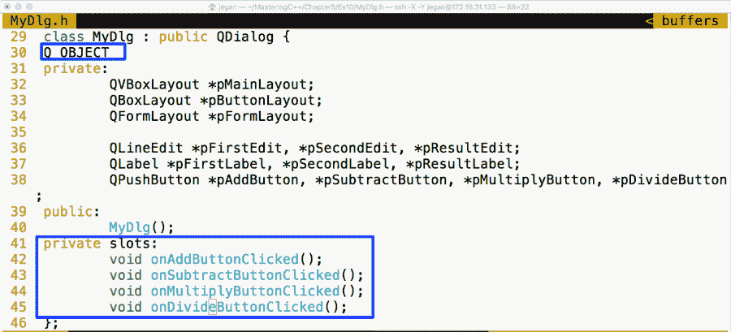

图 5.73

从第 41 行到 45 行开始，私有部分声明了四个槽方法。槽函数是常规的 C++函数，可以像其他 C++函数一样直接调用。然而，在这种情况下，槽函数只打算与`MyDlg`一起调用。因此它们被声明为私有函数，但如果你认为其他人可能会发现连接到你的公共槽有用，它们也可以被设为公共的。

很好，如果您已经走到这一步，这意味着您已经理解了到目前为止讨论的内容。好吧，让我们继续并在`MyDlg.cpp`中实现槽函数的定义，然后将“clicked（）”按钮的信号连接到相应的槽函数：

！[](img/369bc1df-bea7-42fb-b1e6-31a158593ea3.png)

图 5.74

现在是将信号连接到它们各自的槽的时间。正如您可能已经猜到的那样，我们需要在`MyDlg`构造函数中使用`connect`函数，如下面的屏幕截图所示，以将按钮点击传递到相应的槽中：

！[](img/08482ed2-2a04-4e2c-aa8e-0c7250b6891c.png)

图 5.75

我们已经准备好了。是的，现在是展示时间。由于我们已经处理了大部分事情，让我们编译并检查我们小小的 Qt 应用程序的输出：

！[](img/8ccc8ebe-6f19-4eab-8e26-60c76d2e28cb.png)

图 5.76

哎呀！我们遇到了一些链接器错误。这个问题的根本原因是我们在启用应用程序中的信号和槽支持后忘记调用`qmake`。别担心，让我们调用`qmake`和`make`，然后运行我们的应用程序：

！[](img/4fd3db0f-e95a-46f0-8683-b88d34daa45b.png)

图 5.77

太好了，我们已经解决了问题。这次制作工具似乎没有发出任何声音，我们能够启动应用程序。让我们检查信号和槽是否按预期工作。为此，请单击“添加”按钮，看看会发生什么：

！[](img/b62dd11c-18ca-416c-ad2c-cbdbcb6fbf0a.png)

图 5.78

哇！当我们点击“添加”按钮时，“qDebug（）”控制台消息确认“MyDlg :: onAddButtonClicked（）”槽被调用。如果您想要检查其他按钮的槽，请继续尝试点击其他按钮。

我们的应用程序将不完整，没有业务逻辑。因此，让我们将业务逻辑添加到“MyDlg :: onAddButtonClicked（）”槽函数中，以执行添加并显示结果。一旦您学会了如何集成添加的业务逻辑，您可以遵循相同的方法并实现其余的槽函数：

！[](img/31e93df6-fc6e-4c0f-b5b6-2d334173592e.png)

图 5.79

在“MyDlg :: onAddButtonClicked（）”函数中，业务逻辑已经集成。在第 82 行和第 83 行，我们试图提取用户在`QLineEdit`小部件中键入的值。`QLineEdit`中的“text（）”函数返回`QString`。 `QString`对象提供了“toInt（）”，非常方便地提取由`QString`表示的整数值。一旦将值添加并存储在结果变量中，我们需要将结果整数值转换回`QString`，如第 86 行所示，以便将结果输入到`QLineEdit`中，如第 88 行所示。

类似地，您可以继续并集成其他数学运算的业务逻辑。一旦您彻底测试了应用程序，就可以删除“qDebug（）”控制台的输出。我们添加了“qDebug（）”消息以进行调试，因此现在可以清理它们了。

# 总结

在本章中，您学会了使用 Qt 应用程序框架开发 C ++ GUI 应用程序。以下是要点。

+   您学会了在 Linux 中安装 Qt 和所需的工具。

+   您学会了使用 Qt 框架编写简单的基于控制台的应用程序。

+   您学会了使用 Qt 框架编写简单的基于 GUI 的应用程序。

+   您学会了使用 Qt 信号和槽机制进行事件处理，以及元对象编译器如何帮助我们生成信号和槽所需的关键样板代码。

+   您学会了在应用程序开发中使用各种 Qt 布局来开发吸引人的 HMI，在许多 Qt 支持的平台上看起来很棒。

+   您学会了将多个布局组合到单个 HMI 中，以开发专业的 HMI。

+   您学会了许多 Qt 小部件，以及它们如何帮助您开发令人印象深刻的 HMI。

+   总的来说，您学会了使用 Qt 应用程序框架开发跨平台 GUI 应用程序。

在下一章中，您将学习在 C ++ 中进行多线程编程和 IPC。
