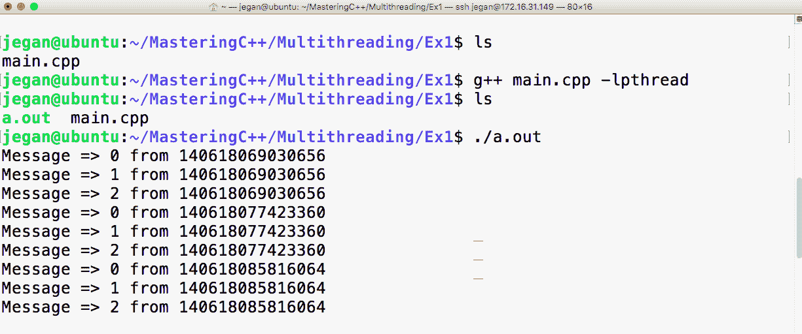
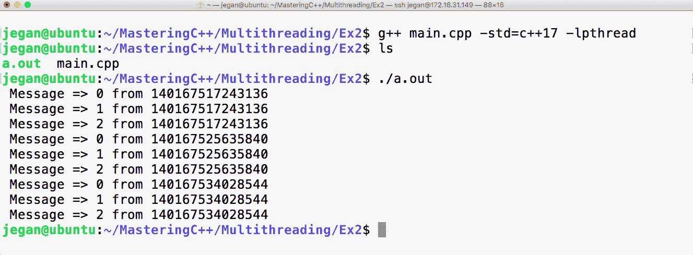
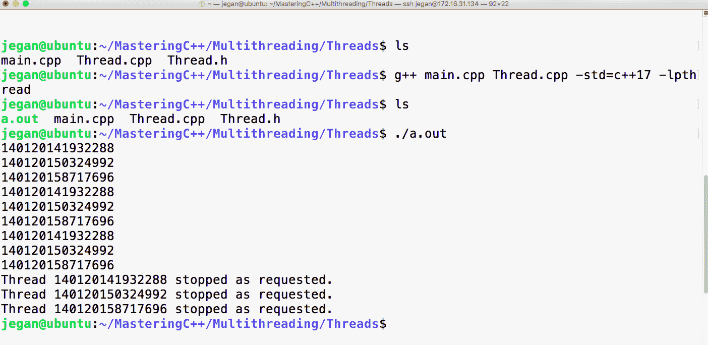
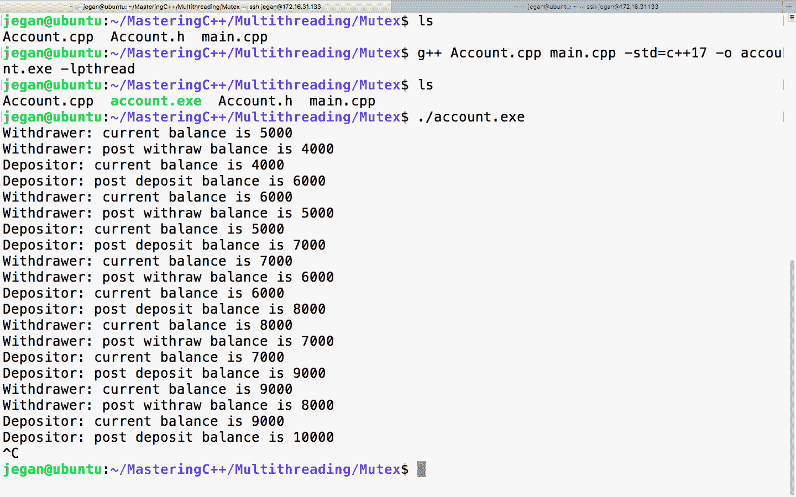
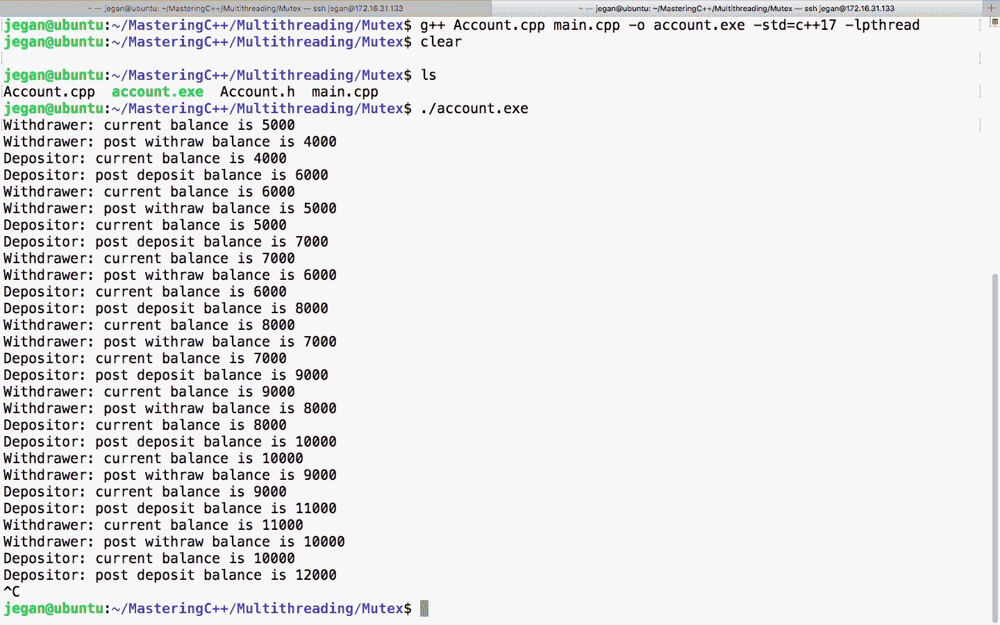
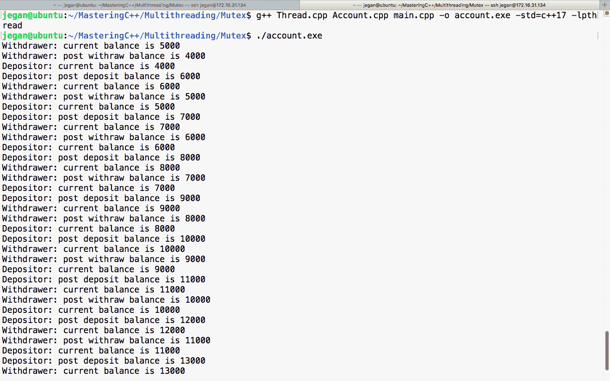
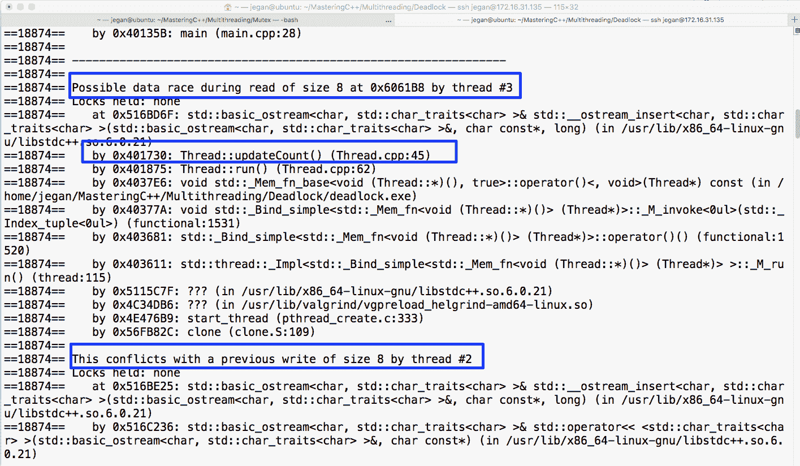
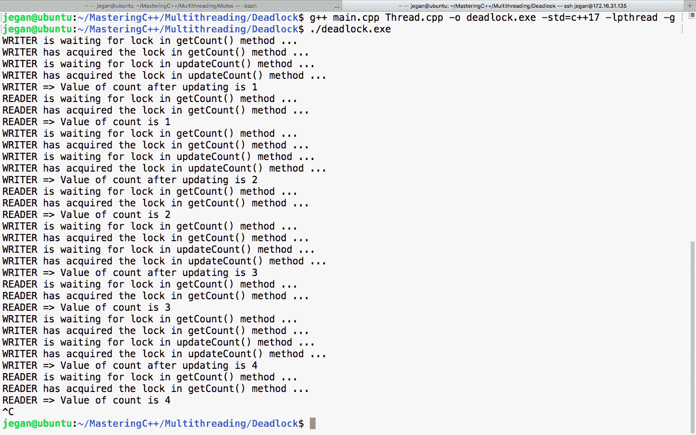
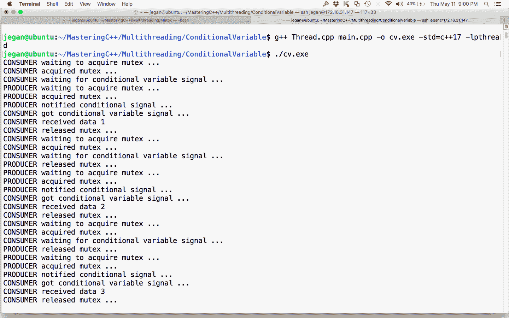

# 第六章：多线程编程和进程间通信

本章将涵盖以下主题：

+   POSIX pthreads 简介

+   使用 pthreads 库创建线程

+   线程创建和自我识别

+   启动线程

+   停止线程

+   使用 C++线程支持库

+   数据竞争和线程同步

+   加入和分离线程

+   从线程发送信号

+   向线程传递参数

+   死锁和解决方案

+   并发

+   Future、promise、`packaged_task`等

+   使用线程支持库进行并发

+   并发应用程序中的异常处理

让我们通过本章讨论的一些有趣且易于理解的示例来学习这些主题。

# POSIX pthreads 简介

Unix、Linux 和 macOS 在很大程度上符合 POSIX 标准。**Unix 可移植操作系统接口**（**POSIX**）是一个 IEEE 标准，它帮助所有 Unix 和类 Unix 操作系统，即 Linux 和 macOS，通过一个统一的接口进行通信。

有趣的是，POSIX 也受到符合 POSIX 标准的工具的支持--Cygwin、MinGW 和 Windows 子系统 for Linux--它们提供了在 Windows 平台上的伪 Unix 样运行时和开发环境。

请注意，pthread 是一个在 Unix、Linux 和 macOS 中使用的符合 POSIX 标准的 C 库。从 C++11 开始，C++通过 C++线程支持库和并发库本地支持线程。在本章中，我们将了解如何以面向对象的方式使用 pthreads、线程支持和并发库。此外，我们将讨论使用本机 C++线程支持和并发库与使用 POSIX pthreads 或其他第三方线程框架的优点。

# 使用 pthreads 库创建线程

让我们直奔主题。你需要了解我们将讨论的 pthread API，开始动手。首先，这个函数用于创建一个新线程：

```cpp
 #include <pthread.h>
 int pthread_create(
              pthread_t *thread,
              const pthread_attr_t *attr,
              void *(*start_routine)(void*),
              void *arg
 )
```

以下表格简要解释了前面函数中使用的参数：

| **API 参数** | **注释** |
| --- | --- |
| `pthread_t *thread` | 线程句柄指针 |
| `pthread_attr_t *attr` | 线程属性 |
| `void *(*start_routine)(void*)` | 线程函数指针 |
| `void * arg` | 线程参数 |

此函数阻塞调用线程，直到第一个参数中传递的线程退出，如下所示：

```cpp
int pthread_join ( pthread_t *thread, void **retval )
```

以下表格简要描述了前面函数中的参数：

| **API 参数** | **注释** |
| --- | --- |
| `pthread_t thread` | 线程句柄 |
| `void **retval` | 输出参数，指示线程过程的退出代码 |

接下来的函数应该在线程上下文中使用。在这里，`retval`是调用此函数的线程的退出代码：

```cpp
int pthread_exit ( void *retval )
```

这个函数中使用的参数如下：

| **API 参数** | **注释** |
| --- | --- |
| `void *retval` | 线程过程的退出代码 |

以下函数返回线程 ID：

```cpp
pthread_t pthread_self(void)
```

让我们编写我们的第一个多线程应用程序：

```cpp
#include <pthread.h>
#include <iostream>

using namespace std;

void* threadProc ( void *param ) {
  for (int count=0; count<3; ++count)
    cout << "Message " << count << " from " << pthread_self()
         << endl;
  pthread_exit(0);
}

int main() {
  pthread_t thread1, thread2, thread3;

  pthread_create ( &thread1, NULL, threadProc, NULL );
  pthread_create ( &thread2, NULL, threadProc, NULL );
  pthread_create ( &thread3, NULL, threadProc, NULL );

  pthread_join( thread1, NULL );
  pthread_join( thread2, NULL );

  pthread_join( thread3, NULL );

  return 0;

}
```

# 如何编译和运行

可以使用以下命令编译该程序：

```cpp
g++ main.cpp -lpthread
```

如您所见，我们需要动态链接 POSIX `pthread`库。

查看以下截图，可视化多线程程序的输出：



在 ThreadProc 中编写的代码在线程上下文中运行。前面的程序总共有四个线程，包括主线程。我使用`pthread_join`阻塞了主线程，强制它等待其他三个线程先完成任务，否则主线程会在它们之前退出。当主线程退出时，应用程序也会退出，这会过早地销毁新创建的线程。

尽管我们按照相应的顺序创建了`thread1`、`thread2`和`thread3`，但不能保证它们会按照创建的确切顺序启动。

操作系统调度程序根据操作系统调度程序使用的算法决定必须启动线程的顺序。有趣的是，线程启动的顺序可能在同一系统的不同运行中有所不同。

# C++是否原生支持线程？

从 C++11 开始，C++确实原生支持线程，并且通常被称为 C++线程支持库。C++线程支持库提供了对 POSIX pthreads C 库的抽象。随着时间的推移，C++原生线程支持已经得到了很大的改进。

我强烈建议您使用 C++原生线程而不是 pthread。C++线程支持库在所有平台上都受支持，因为它是标准 C++的正式部分，而不是仅在 Unix、Linux 和 macOS 上直接支持的 POSIX `pthread`库。

最好的部分是 C++17 中的线程支持已经成熟到了一个新的水平，并且准备在 C++20 中达到下一个水平。因此，考虑在项目中使用 C++线程支持库是一个不错的主意。

# 如何使用本机 C++线程功能编写多线程应用程序

有趣的是，使用 C++线程支持库编写多线程应用程序非常简单：

```cpp
#include <thread>
using namespace std;
thread instance ( thread_procedure )
```

`thread`类是在 C++11 中引入的。此函数可用于创建线程。在 POSIX `pthread`库中，此函数的等效函数是`pthread_create`。

| **参数** | **注释** |
| --- | --- |
| `thread_procedure` | 线程函数指针 |

现在稍微了解一下以下代码中返回线程 ID 的参数：

```cpp
this_thread::get_id ()
```

此函数相当于 POSIX `pthread`库中的`pthread_self()`函数。请参考以下代码：

```cpp
thread::join()
```

`join()`函数用于阻塞调用线程或主线程，以便等待已加入的线程完成其任务。这是一个非静态函数，因此必须在线程对象上调用它。

让我们看看如何使用上述函数来基于 C++编写一个简单的多线程程序。请参考以下程序：

```cpp
#include <thread>
#include <iostream>
using namespace std;

void threadProc() {
  for( int count=0; count<3; ++count ) {
    cout << "Message => "
         << count
         << " from "
         << this_thread::get_id()
         << endl;
  }
}

int main() {
  thread thread1 ( threadProc );
  thread thread2 ( threadProc );
  thread thread3 ( threadProc );

  thread1.join();
  thread2.join();
  thread3.join();

  return 0;
}
```

C++版本的多线程程序看起来比 C 版本简单得多，更清晰。

# 如何编译和运行

以下命令将帮助您编译程序：

```cpp
g++ main.cpp -std=c++17 -lpthread
```

在上一个命令中，`-std=c++17`指示 C++编译器启用 C++17 特性；但是，该程序将在支持 C++11 的任何 C++编译器上编译，您只需要用`c++11`替换`c++17`。

程序的输出将如下所示：



在上述屏幕截图中以`140`开头的所有数字都是线程 ID。由于我们创建了三个线程，`pthread`库分别分配了三个唯一的线程 ID。如果您真的很想找到操作系统分配的线程 ID，您将需要在 Linux 中发出以下命令，同时应用程序正在运行：

```cpp
 ps -T -p <process-id>
```

也许会让你惊讶的是，`pthread`库分配的线程 ID 与操作系统分配的线程 ID 是不同的。因此，从技术上讲，`pthread`库分配的线程 ID 只是一个与操作系统分配的线程 ID 不同的线程句柄 ID。您可能还想考虑的另一个有趣工具是`top`命令，用于探索进程中的线程：

```cpp
 top -H -p <process-id>
```

这两个命令都需要您多线程应用程序的进程 ID。以下命令将帮助您找到此 ID：

```cpp
ps -ef | grep -i <your-application-name>
```

您还可以在 Linux 中使用`htop`实用程序。

如果您想以编程方式获取操作系统分配的线程 ID，您可以在 Linux 中使用以下函数：

```cpp
#include <sys/types.h>
pid_t gettid(void)
```

但是，如果您想编写一个可移植的应用程序，这并不推荐，因为这仅在 Unix 和 Linux 中受支持。

# 以面向对象的方式使用 std::thread

如果您一直在寻找类似于 Java 或 Qt 线程中的`Thread`类的 C++线程类，我相信您会觉得这很有趣：

```cpp
#include <iostream>
#include <thread>
using namespace std;

class Thread {
private:
      thread *pThread;
      bool stopped;
      void run();
public:
      Thread();
      ~Thread();

      void start();
      void stop();
      void join();
      void detach();
};
```

这是一个包装类，作为本书中 C++线程支持库的便利类。`Thread::run()`方法是我们自定义的线程过程。由于我不希望客户端代码直接调用`Thread::run()`方法，所以我将 run 方法声明为`private`。为了启动线程，客户端代码必须在`thread`对象上调用 start 方法。

对应的`Thread.cpp`源文件如下：

```cpp
#include "Thread.h"

Thread::Thread() {
     pThread = NULL;
     stopped = false;
}

Thread::~Thread() {
     delete pThread;
     pThread = NULL;
}

void Thread::run() {

     while ( ! stopped ) {
         cout << this_thread::get_id() << endl;
         this_thread::sleep_for ( 1s );
     }
     cout << "\nThread " << this_thread::get_id()
          << " stopped as requested." << endl;
     return;
}

void Thread::stop() {
    stopped = true;
}

void Thread::start() {
    pThread = new thread( &Thread::run, this );
}

void Thread::join() {
     pThread->join();
}

void Thread::detach() {
     pThread->detach();
}
```

从之前的`Thread.cpp`源文件中，你会了解到可以通过调用`stop`方法在需要时停止线程。这是一个简单而体面的实现；然而，在投入生产之前，还有许多其他边缘情况需要处理。尽管如此，这个实现已经足够好，可以理解本书中的线程概念。

很好，让我们看看我们的`Thread`类在`main.cpp`中如何使用：

```cpp
#include "Thread.h"

int main() {

      Thread thread1, thread2, thread3;

      thread1.start();
      thread2.start();
      thread3.start();

      thread1.detach();
      thread2.detach();
      thread3.detach();

      this_thread::sleep_for ( 3s );

      thread1.stop();
      thread2.stop();
      thread3.stop();

      this_thread::sleep_for ( 3s );

      return 0;
}
```

我已经创建了三个线程，`Thread`类的设计方式是，只有在调用`start`函数时线程才会启动。分离的线程在后台运行；通常，如果要使线程成为守护进程，就需要将线程分离。然而，在应用程序退出之前，这些线程会被安全地停止。

# 如何编译和运行

以下命令可帮助编译程序：

```cpp
g++ Thread.cpp main.cpp -std=c++17 -o threads.exe -lpthread
```

程序的输出将如下截图所示：



哇！我们可以按设计启动和停止线程，而且还是面向对象的方式。

# 你学到了什么？

让我们试着回顾一下我们到目前为止讨论过的内容：

+   你学会了如何使用 POSIX 的`pthread` C 库编写多线程应用程序

+   C++编译器从 C++11 开始原生支持线程

+   你学会了常用的基本 C++线程支持库 API

+   你学会了如何使用 C++线程支持库编写多线程应用程序

+   现在你知道为什么应该考虑使用 C++线程支持库而不是`pthread` C 库了

+   C++线程支持库是跨平台的，不像 POSIX 的`pthread`库

+   你知道如何以面向对象的方式使用 C++线程支持库

+   你知道如何编写不需要同步的简单多线程应用程序

# 同步线程

在理想的世界中，线程会提供更好的应用程序性能。但是，有时会发现应用程序性能因多个线程而下降并不罕见。这种性能问题可能并不真正与多个线程有关；真正的罪魁祸首可能是设计。过多地使用同步会导致许多与线程相关的问题，也会导致应用程序性能下降。

无锁线程设计不仅可以避免与线程相关的问题，还可以提高整体应用程序的性能。然而，在实际世界中，可能会有多个线程需要共享一个或多个公共资源。因此，需要同步访问或修改共享资源的关键代码部分。在特定情况下可以使用各种同步机制。在接下来的章节中，我们将逐一探讨一些有趣和实用的使用案例。

# 如果线程没有同步会发生什么？

当有多个线程在进程边界内共享一个公共资源时，可以使用互斥锁来同步代码的关键部分。互斥锁是一种互斥锁，只允许一个线程访问由互斥锁保护的关键代码块。让我们通过一个简单的例子来理解互斥锁应用的需求。

让我们使用一个`Bank Savings Account`类，允许三个简单的操作，即`getBalance`、`withdraw`和`deposit`。`Account`类可以实现如下所示的代码。为了演示目的，`Account`类以简单的方式设计，忽略了现实世界中所需的边界情况和验证。它被简化到`Account`类甚至不需要捕获帐号号码的程度。我相信有许多这样的要求被悄悄地忽略了简单性。别担心！我们的重点是学习 mutex，这里展示了一个例子：

```cpp
#include <iostream>
using namespace std;

class Account {
private:
  double balance;
public:
  Account( double );
  double getBalance( );
  void deposit ( double amount );
  void withdraw ( double amount ) ;
};
```

`Account.cpp`源文件如下：

```cpp
#include "Account.h"

Account::Account(double balance) {
  this->balance = balance;
}

double Account::getBalance() {
  return balance;
}

void Account::withdraw(double amount) {
  if ( balance < amount ) {
    cout << "Insufficient balance, withdraw denied." << endl;
    return;
  }

  balance = balance - amount;
}

void Account::deposit(double amount) {
  balance = balance + amount;
}
```

现在，让我们创建两个线程，即`DEPOSITOR`和`WITHDRAWER`。`DEPOSITOR`线程将存入 INR 2000.00，而`WITHDRAWER`线程将每隔一秒提取 INR 1000.00。根据我们的设计，`main.cpp`源文件可以实现如下：

```cpp
#include <thread>
#include "Account.h"
using namespace std;

enum ThreadType {
  DEPOSITOR,
  WITHDRAWER
};

Account account(5000.00);

void threadProc ( ThreadType typeOfThread ) {

  while ( 1 ) {
  switch ( typeOfThread ) {
    case DEPOSITOR: {
      cout << "Account balance before the deposit is "
           << account.getBalance() << endl;

      account.deposit( 2000.00 );

      cout << "Account balance after deposit is "
           << account.getBalance() << endl;
      this_thread::sleep_for( 1s );
}
break;

    case WITHDRAWER: {
      cout << "Account balance before withdrawing is "
           << account.getBalance() << endl;

      account.deposit( 1000.00 );
      cout << "Account balance after withdrawing is "
           << account.getBalance() << endl;
      this_thread::sleep_for( 1s );
    }
    break;
  }
  }
}

int main( ) {
  thread depositor ( threadProc, ThreadType::DEPOSITOR );
  thread withdrawer ( threadProc, ThreadType::WITHDRAWER );

  depositor.join();
  withdrawer.join();

  return 0;
}
```

如果您观察`main`函数，线程构造函数接受两个参数。第一个参数是您现在应该熟悉的线程过程。第二个参数是一个可选参数，如果您想要向线程函数传递一些参数，可以提供该参数。

# 如何编译和运行

可以使用以下命令编译该程序：

```cpp
g++ Account.cpp main.cpp -o account.exe -std=c++17 -lpthread
```

如果您按照指示的所有步骤进行了操作，您的代码应该可以成功编译。

现在是时候执行并观察我们的程序如何工作了！

不要忘记`WITHDRAWER`线程总是提取 INR 1000.00，而`DEPOSITOR`线程总是存入 INR 2000.00。以下输出首先传达了这一点。`WITHDRAWER`线程开始提取，然后是似乎已经存入了钱的`DEPOSITOR`线程。

尽管我们首先启动了`DEPOSITOR`线程，然后启动了`WITHDRAWER`线程，但看起来操作系统调度程序似乎首先安排了`WITHDRAWER`线程。不能保证这种情况总是会发生。

根据输出，`WITHDRAWER`线程和`DEPOSITOR`线程似乎偶然地交替进行工作。它们会继续这样一段时间。在某个时候，两个线程似乎会同时工作，这就是事情会崩溃的时候，如下所示：



观察输出的最后四行非常有趣。看起来`WITHDRAWER`和`DEPOSITOR`线程都在检查余额，余额为 INR 9000.00。您可能注意到`DEPOSITOR`线程的打印语句存在不一致；根据`DEPOSITOR`线程，当前余额为 INR 9000.00。因此，当它存入 INR 2000.00 时，余额应该总共为 INR 11000.00。但实际上，存款后的余额为 INR 10000.00。这种不一致的原因是`WITHDRAWER`线程在`DEPOSITOR`线程存钱之前提取了 INR 1000.00。尽管从技术上看，余额似乎总共正确，但很快就会出现问题；这就是需要线程同步的时候。

# 让我们使用 mutex

现在，让我们重构`threadProc`函数并同步修改和访问余额的关键部分。我们需要一个锁定机制，只允许一个线程读取或写入余额。C++线程支持库提供了一个称为`mutex`的适当锁。`mutex`锁是一个独占锁，只允许一个线程在同一进程边界内操作关键部分代码。直到获得锁的线程释放`mutex`锁，所有其他线程都必须等待他们的轮次。一旦线程获得`mutex`锁，线程就可以安全地访问共享资源。

`main.cpp`文件可以重构如下；更改部分已用粗体标出：

```cpp
#include <iostream>
#include <thread>
#include <mutex>
#include "Account.h"
using namespace std;

enum ThreadType {
  DEPOSITOR,
  WITHDRAWER
};

mutex locker;

Account account(5000.00);

void threadProc ( ThreadType typeOfThread ) {

  while ( 1 ) {
  switch ( typeOfThread ) {
    case DEPOSITOR: {

      locker.lock();

      cout << "Account balance before the deposit is "
           << account.getBalance() << endl;

      account.deposit( 2000.00 );

      cout << "Account balance after deposit is "
           << account.getBalance() << endl;

      locker.unlock();
      this_thread::sleep_for( 1s );
}
break;

    case WITHDRAWER: {

      locker.lock();

      cout << "Account balance before withdrawing is "
           << account.getBalance() << endl;

      account.deposit( 1000.00 );
      cout << "Account balance after withdrawing is "
           << account.getBalance() << endl;

      locker.unlock();
      this_thread::sleep_for( 1s );
    }
    break;
  }
  }
}

int main( ) {
  thread depositor ( threadProc, ThreadType::DEPOSITOR );
  thread withdrawer ( threadProc, ThreadType::WITHDRAWER );

  depositor.join();
  withdrawer.join();

  return 0;
}
```

您可能已经注意到互斥锁是在全局范围内声明的。理想情况下，我们可以将互斥锁声明为类的静态成员，而不是全局变量。由于所有线程都应该由同一个互斥锁同步，确保您使用全局`mutex`锁或静态`mutex`锁作为类成员。

`main.cpp`源文件中重构后的`threadProc`如下所示；改动用粗体标出：

```cpp
void threadProc ( ThreadType typeOfThread ) {

  while ( 1 ) {
  switch ( typeOfThread ) {
    case DEPOSITOR: {

      locker.lock();

      cout << "Account balance before the deposit is "
           << account.getBalance() << endl;

      account.deposit( 2000.00 );

      cout << "Account balance after deposit is "
           << account.getBalance() << endl;

      locker.unlock();
      this_thread::sleep_for( 1s );
}
break;

    case WITHDRAWER: {

      locker.lock();

      cout << "Account balance before withdrawing is "
           << account.getBalance() << endl;

      account.deposit( 1000.00 );
      cout << "Account balance after withdrawing is "
           << account.getBalance() << endl;

      locker.unlock();
      this_thread::sleep_for( 1s );
    }
    break;
  }
  }
}
```

在`lock()`和`unlock()`之间包裹的代码是由互斥锁锁定的临界区。

如您所见，`threadProc`函数中有两个临界区块，因此重要的是要理解只有一个线程可以进入临界区。例如，如果存款线程已经进入了其临界区，那么取款线程必须等到存款线程释放锁，反之亦然。

从技术上讲，我们可以用`lock_guard`替换所有原始的`lock()`和`unlock()`互斥锁方法，因为这样可以确保即使代码的临界区块抛出异常，互斥锁也总是被解锁。这将避免饥饿和死锁情况。

是时候检查我们重构后程序的输出了：



好的，您检查了`DEPOSITOR`和`WITHDRAWER`线程报告的余额了吗？是的，它们总是一致的，不是吗？是的，输出证实了代码是同步的，现在是线程安全的。

虽然我们的代码在功能上是正确的，但还有改进的空间。让我们重构代码，使其面向对象且高效。

让我们重用`Thread`类，并将所有与线程相关的内容抽象到`Thread`类中，并摆脱全局变量和`threadProc`。

首先，让我们观察重构后的`Account.h`头文件，如下所示：

```cpp
#ifndef __ACCOUNT_H
#define __ACCOUNT_H

#include <iostream>
using namespace std;

class Account {
private:
  double balance;
public:
  Account( double balance );
  double getBalance();
  void deposit(double amount);
  void withdraw(double amount);
};

#endif
```

如您所见，`Account.h`头文件并没有改变，因为它已经看起来很整洁。

相应的`Account.cpp`源文件如下：

```cpp
#include "Account.h"

Account::Account(double balance) {
  this->balance = balance;
}

double Account::getBalance() {
  return balance;
}

void Account::withdraw(double amount) {
  if ( balance < amount ) {
    cout << "Insufficient balance, withdraw denied." << endl;
    return;
  }

  balance = balance - amount;
}

void Account::deposit(double amount) {
  balance = balance + amount;
}
```

最好将`Account`类与与线程相关的功能分开，以保持代码整洁。此外，让我们了解一下我们编写的`Thread`类如何重构以使用互斥同步机制，如下所示：

```cpp
#ifndef __THREAD_H
#define __THREAD_H

#include <iostream>
#include <thread>
#include <mutex>
using namespace std;
#include "Account.h"

enum ThreadType {
   DEPOSITOR,
   WITHDRAWER
};

class Thread {
private:
      thread *pThread;
      Account *pAccount;
      static mutex locker;
      ThreadType threadType;
      bool stopped;
      void run();
public:
      Thread(Account *pAccount, ThreadType typeOfThread);
      ~Thread();
      void start();
      void stop();
      void join();
      void detach();
};

#endif
```

在之前显示的`Thread.h`头文件中，作为重构的一部分进行了一些更改。由于我们希望使用互斥锁来同步线程，`Thread`类包括了 C++线程支持库的互斥锁头文件。由于所有线程都应该使用相同的`mutex`锁，因此`mutex`实例被声明为静态。由于所有线程都将共享相同的`Account`对象，因此`Thread`类具有指向`Account`对象的指针，而不是堆栈对象。

`Thread::run()`方法是我们将要提供给 C++线程支持库`Thread`类构造函数的`Thread`函数。由于没有人预期会直接调用`run`方法，因此`run`方法被声明为私有。根据我们的`Thread`类设计，类似于 Java 和 Qt，客户端代码只需调用`start`方法；当操作系统调度程序给予`run`绿灯时，`run`线程过程将自动调用。实际上，这里并没有什么魔术，因为在创建线程时，`run`方法地址被注册为`Thread`函数。

通常，我更喜欢在用户定义的头文件中包含所有依赖的头文件，而用户定义的源文件只包含自己的头文件。这有助于将头文件组织在一个地方，这种纪律有助于保持代码更清晰，也提高了整体可读性和代码可维护性。

`Thread.cpp`源代码可以重构如下：

```cpp
#include "Thread.h"

mutex Thread::locker;

Thread::Thread(Account *pAccount, ThreadType typeOfThread) {
  this->pAccount = pAccount;
  pThread = NULL;
  stopped = false;
  threadType = typeOfThread;
}

Thread::~Thread() {
  delete pThread;
  pThread = NULL;
}

void Thread::run() {
    while(1) {
  switch ( threadType ) {
    case DEPOSITOR:
      locker.lock();

      cout << "Depositor: current balance is " << pAccount->getBalance() << endl;
      pAccount->deposit(2000.00);
      cout << "Depositor: post deposit balance is " << pAccount->getBalance() << endl;

      locker.unlock();

      this_thread::sleep_for(1s);
      break;

    case WITHDRAWER:
      locker.lock();

      cout << "Withdrawer: current balance is " << 
               pAccount->getBalance() << endl;
      pAccount->withdraw(1000.00);
      cout << "Withdrawer: post withraw balance is " << 
               pAccount->getBalance() << endl;

      locker.unlock();

      this_thread::sleep_for(1s);
      break;
  }
    }
}

void Thread::start() {
  pThread = new thread( &Thread::run, this );
}

void Thread::stop() {
  stopped = true;
}

void Thread::join() {
  pThread->join();
}

void Thread::detach() {
  pThread->detach();
}
```

`threadProc`函数已经移动到`Thread`类的`run`方法中。毕竟，`main`函数或`main.cpp`源文件不应该有任何业务逻辑，因此它们经过重构以改进代码质量。

现在让我们看看重构后的`main.cpp`源文件有多清晰：

```cpp
#include "Account.h"
#include "Thread.h"

int main( ) {

  Account account(5000.00);

  Thread depositor ( &account, ThreadType::DEPOSITOR );
  Thread withdrawer ( &account, ThreadType::WITHDRAWER );

  depositor.start();
  withdrawer.start();

  depositor.join();
  withdrawer.join();

  return 0;
}
```

之前展示的`main()`函数和整个`main.cpp`源文件看起来简短而简单，没有任何复杂的业务逻辑。

C++支持五种类型的互斥锁，即`mutex`、`timed_mutex`、`recursive_mutex`、`recursive_timed_mutex`和`shared_timed_mutex`。

# 如何编译和运行

以下命令可帮助您编译重构后的程序：

```cpp
g++ Thread.cpp Account.cpp main.cpp -o account.exe -std=c++17 -lpthread
```

太棒了！如果一切顺利，程序应该可以顺利编译而不会发出任何噪音。

在我们继续下一个主题之前，快速查看一下这里显示的输出：



太棒了！它运行良好。`DEPOSITOR`和`WITHDRAWER`线程似乎可以合作地工作，而不会搞乱余额和打印语句。毕竟，我们已经重构了代码，使代码更清晰，而不修改功能。

# 死锁是什么？

在多线程应用程序中，一切看起来都很酷和有趣，直到我们陷入死锁。假设有两个线程，即`READER`和`WRITER`。当`READER`线程等待已被`WRITER`获取的锁时，死锁可能发生，而`WRITER`线程等待读者释放已被`READER`拥有的锁，反之亦然。通常，在死锁场景中，两个线程将无休止地等待对方。

一般来说，死锁是设计问题。有时，死锁可能会很快被检测出来，但有时可能会非常棘手，找到根本原因。因此，底线是必须谨慎地正确使用同步机制。

让我们通过一个简单而实用的例子来理解死锁的概念。我将重用我们的`Thread`类，稍作修改以创建死锁场景。

修改后的`Thread.h`头文件如下所示：

```cpp
#ifndef __THREAD_H
#define __THREAD_H

#include <iostream>
#include <string>
#include <thread>
#include <mutex>
#include <string>
using namespace std;

enum ThreadType {
  READER,
  WRITER
};

class Thread {
private:
  string name;
  thread *pThread;
  ThreadType threadType;
  static mutex commonLock;
  static int count;
  bool stopped;
  void run( );
public:
  Thread ( ThreadType typeOfThread );
  ~Thread( );
  void start( );
  void stop( );
  void join( );
  void detach ( );
  int getCount( );
  int updateCount( );
};
#endif
```

`ThreadType`枚举帮助将特定任务分配给线程。`Thread`类有两个新方法：`Thread::getCount()`和`Thread::updateCount()`。这两种方法将以一种共同的`mutex`锁同步，从而创建死锁场景。

好的，让我们继续并审查`Thread.cpp`源文件：

```cpp
#include "Thread.h"

mutex Thread::commonLock;

int Thread::count = 0;

Thread::Thread( ThreadType typeOfThread ) {
  pThread = NULL;
  stopped = false;
  threadType = typeOfThread;
  (threadType == READER) ? name = "READER" : name = "WRITER";
}

Thread::~Thread() {
  delete pThread;
  pThread = NULL;
}

int Thread::getCount( ) {
  cout << name << " is waiting for lock in getCount() method ..." <<
endl;
  lock_guard<mutex> locker(commonLock);
  return count;
}

int Thread::updateCount( ) {
  cout << name << " is waiting for lock in updateCount() method ..." << endl;
  lock_guard<mutex> locker(commonLock);
  int value = getCount();
  count = ++value;
  return count;
}

void Thread::run( ) {
  while ( 1 ) {
    switch ( threadType ) {
      case READER:
        cout << name<< " => value of count from getCount() method is " << getCount() << endl;
        this_thread::sleep_for ( 500ms );
      break;

      case WRITER:
        cout << name << " => value of count from updateCount() method is" << updateCount() << endl;
        this_thread::sleep_for ( 500ms );
      break;
    }
  }
}

void Thread::start( ) {
  pThread = new thread ( &Thread::run, this );
}

void Thread::stop( ) {
  stopped = true;
}

void Thread::join( ) {
  pThread->join();
}

void Thread::detach( ) {
  pThread->detach( );
}
```

到目前为止，您应该对`Thread`类非常熟悉。因此，让我们专注于`Thread::getCount()`和`Thread::updateCount()`方法的讨论。`std::lock_guard<std::mutex>`是一个模板类，它使我们不必调用`mutex::unlock()`。在堆栈展开过程中，将调用`lock_guard`析构函数；这将调用`mutex::unlock()`。

底线是，从创建`std::lock_guard<std::mutex>`实例的那一刻起，直到方法结束的所有语句都受到互斥锁的保护。

好的，让我们深入研究`main.cpp`文件：

```cpp
#include <iostream>
using namespace std;

#include "Thread.h"

int main ( ) {

      Thread reader( READER );
      Thread writer( WRITER );
      reader.start( );
      writer.start( );
      reader.join( );
      writer.join( );
      return 0;
}
```

`main()`函数相当不言自明。我们创建了两个线程，即`reader`和`writer`，它们在创建后启动。主线程被迫等待，直到读者和写者线程退出。

# 如何编译和运行

您可以使用以下命令编译此程序：

```cpp
g++ Thread.cpp main.cpp -o deadlock.exe -std=c++17 -lpthread
```

观察程序的输出，如下所示：


参考`Thread::getCount()`和`Thread::updateCount()`方法的代码片段：

```cpp
int Thread::getCount() {
         cout << name << " is waiting for lock in getCount() method ..." << endl;
         lock_guard<mutex> locker(commonLock);
         cout << name << " has acquired lock in getCount() method ..." << endl;
         return count;
}
int Thread::updateCount() {
        count << name << " is waiting for lock in updateCount() method ..." << endl;
        lock_guard<mutex> locker(commonLock);
        cout << name << " has acquired lock in updateCount() method ..." << endl;
        int value = getCount();
        count = ++value;
        return count;
}
```

从先前的输出截图图像中，我们可以理解`WRITER`线程似乎已经首先启动。根据我们的设计，`WRITER`线程将调用`Thread::updateCount()`方法，这将调用`Thread::getCount()`方法。

从输出的截图中，从打印语句可以明显看出，`Thread::updateCount()`方法首先获取了锁，然后调用了`Thread::getCount()`方法。但由于`Thread::updateCount()`方法没有释放互斥锁，因此由`WRITER`线程调用的`Thread::getCount()`方法无法继续。同时，操作系统调度程序已启动了`READER`线程，似乎在等待`WRITER`线程获取的`mutex`锁。因此，为了完成其任务，`READER`线程必须获取`Thread::getCount()`方法的锁；然而，在`WRITER`线程释放锁之前，这是不可能的。更糟糕的是，`WRITER`线程无法完成其任务，直到其自己的`Thread::getCount()`方法调用完成其任务。这就是所谓的**死锁**。

这要么是设计问题，要么是逻辑问题。在 Unix 或 Linux 中，我们可以使用 Helgrind 工具通过竞争类似的同步问题来查找死锁。Helgrind 工具与 Valgrind 工具一起提供。最好的部分是，Valgrind 和 Helgrind 都是开源工具。

为了获得导致死锁或竞争问题的源代码行号，我们需要以调试模式编译我们的代码，如现在所示，使用`-g`标志：

```cpp
g++ main.cpp Thread.cpp -o deadlock.exe -std=c++17 -lpthread -g
```

Helgrind 工具可用于检测死锁和类似问题，如下所示：

```cpp
valgrind --tool=helgrind ./deadlock.exe
```

以下是 Valgrind 输出的简短摘录：



解决问题的一个简单方法是重构`Thread::updateCount()`方法，如下所示：

```cpp
int Thread::updateCount() {
        int value = getCount();

        count << name << " is waiting for lock in updateCount() method ..." << endl;
        lock_guard<mutex> locker(commonLock);
        cout << name << " has acquired lock in updateCount() method ..." << endl;
        count = ++value;

        return count;
}
```

重构后程序的输出如下：



有趣的是，对于大多数复杂的问题，解决方案通常非常简单。换句话说，有时愚蠢的错误可能导致严重的关键错误。

理想情况下，我们应该在设计阶段努力防止死锁问题，这样我们就不必在进行复杂的调试时破费心机。C++线程支持库的互斥锁类提供了`mutex::try_lock()`（自 C++11 以来）、`std::timed_mutex`（自 C++11 以来）和`std::scoped_lock`（自 C++17 以来）以避免死锁和类似问题。

# 你学到了什么？

让我们总结一下要点：

+   我们应该在可能的情况下设计无锁线程

+   与重度同步/顺序线程相比，无锁线程往往表现更好

+   互斥锁是一种互斥同步原语

+   互斥锁有助于同步访问共享资源，一次一个线程

+   死锁是由于互斥锁的错误使用，或者一般来说，由于任何同步原语的错误使用而发生的

+   死锁是逻辑或设计问题的结果

+   在 Unix 和 Linux 操作系统中，可以使用 Helgrind/Valgrind 开源工具检测死锁

# 共享互斥锁

共享互斥锁同步原语支持两种模式，即共享和独占。在共享模式下，共享互斥锁将允许许多线程同时共享资源，而不会出现任何数据竞争问题。在独占模式下，它的工作方式就像常规互斥锁一样，即只允许一个线程访问资源。如果您有多个读者可以安全地访问资源，并且只允许一个线程修改共享资源，这是一个合适的锁原语。有关更多详细信息，请参阅 C++17 章节。

# 条件变量

条件变量同步原语用于当两个或更多线程需要相互通信，并且只有在它们收到特定信号或事件时才能继续时。等待特定信号或事件的线程必须在开始等待信号或事件之前获取互斥锁。

让我们尝试理解生产者/消费者问题中条件变量的用例。我将创建两个线程，即`PRODUCER`和`CONSUMER`。`PRODUCER`线程将向队列添加一个值，并通知`CONSUMER`线程。`CONSUMER`线程将等待来自`PRODUCER`的通知。收到来自`PRODUCER`线程的通知后，`CONSUMER`线程将从队列中移除条目并打印它。

让我们了解一下这里显示的`Thread.h`头文件如何使用条件变量和互斥量：

```cpp
#include <iostream>
#include <thread>
#include <mutex>
#include <condition_variable>
#include <queue>
#include <string>

using namespace std;

enum ThreadType {
  PRODUCER,
  CONSUMER
};

class Thread {
private:
  static mutex locker;
  static condition_variable untilReady;
  static bool ready;
  static queue<int> appQueue;
  thread *pThread;
  ThreadType threadType;
  bool stopped;
  string name;

  void run();
public:
  Thread(ThreadType typeOfThread);
  ~Thread();
  void start();
  void stop();
  void join();
  void detach();
};
```

由于`PRODUCER`和`CONSUMER`线程应该使用相同的互斥量和`conditional_variable`，它们被声明为静态。条件变量同步原语需要一个谓词函数，该函数将使用就绪布尔标志。因此，我也在静态范围内声明了就绪标志。

让我们继续看`Thread.cpp`源文件，如下所示：

```cpp
#include "Thread.h"

mutex Thread::locker;
condition_variable Thread::untilReady;
bool Thread::ready = false;
queue<int> Thread::appQueue;

Thread::Thread( ThreadType typeOfThread ) {
  pThread = NULL;
  stopped = false;
  threadType = typeOfThread;
  (CONSUMER == typeOfThread) ? name = "CONSUMER" : name = "PRODUCER";
}

Thread::~Thread( ) {
  delete pThread;
  pThread = NULL;
}

void Thread::run() {
  int count = 0;
  int data = 0;
  while ( 1 ) {
    switch ( threadType ) {
    case CONSUMER: 
    {

      cout << name << " waiting to acquire mutex ..." << endl;

      unique_lock<mutex> uniqueLocker( locker );

      cout << name << " acquired mutex ..." << endl;
      cout << name << " waiting for conditional variable signal..." << endl;

      untilReady.wait ( uniqueLocker, [] { return ready; } );

      cout << name << " received conditional variable signal ..." << endl;

      data = appQueue.front( ) ;

      cout << name << " received data " << data << endl;

      appQueue.pop( );
      ready = false;
    }
      cout << name << " released mutex ..." << endl;
    break;

    case PRODUCER:
    {
      cout << name << " waiting to acquire mutex ..." << endl;
      unique_lock<mutex> uniqueLocker( locker );
      cout << name << " acquired mutex ..." << endl;
      if ( 32000 == count ) count = 0;
      appQueue.push ( ++ count );
      ready = true;
      uniqueLocker.unlock();
      cout << name << " released mutex ..." << endl;
      untilReady.notify_one();
      cout << name << " notified conditional signal ..." << endl;
    }
    break;
  }
  }
}

void Thread::start( ) {
  pThread = new thread ( &Thread::run, this );
}

void Thread::stop( ) {
  stopped = true;
}

void Thread::join( ) {
  pThread->join( );
}

void Thread::detach( ) {
  pThread->detach( );
}
```

在前面的`Thread`类中，我使用了`unique_lock<std::mutex>`。`conditional_variable::wait()`方法需要`unique_lock`，因此我在这里使用了`unique_lock`。现在，`unique_lock<std::mutex>`支持所有权转移、递归锁定、延迟锁定、手动锁定和解锁，而不像`lock_guard<std::mutex>`那样在删除`unique_lock`时自动解锁。`lock_guard<std::mutex>`实例会立即锁定互斥量，并且当`lock_guard<std::mutex>`实例超出作用域时，互斥量会自动解锁。但是，`lock_guard`不支持手动解锁。

因为我们没有使用延迟锁定选项创建`unique_lock`实例，所以`unique_lock`会立即锁定互斥量，就像`lock_guard`一样。

`Thread::run()`方法是我们的线程函数。根据提供给`Thread`构造函数的`ThreadType`，线程实例将作为`PRODUCER`或`CONSUMER`线程来表现。

`PRODUCER`线程首先锁定互斥量，并将整数附加到队列中，该队列在`PRODUCER`和`CONSUMER`线程之间共享。一旦队列更新，`PRODUCER`会在通知`CONSUMER`之前解锁互斥量；否则，`CONSUMER`将无法获取互斥量并接收条件变量信号。

`CONSUMER`线程首先获取互斥量，然后等待条件变量信号。收到条件信号后，`CONSUMER`线程从队列中检索值并打印该值，并重置就绪标志，以便该过程可以重复，直到应用程序终止。

建议使用`unique_lock<std::mutex>`、`lock_guard<std::mutex>`或`scoped_lock<std::mutex>`来避免死锁。有时，我们可能不会解锁导致死锁；因此，直接使用互斥量不被推荐。

现在让我们看一下`main.cpp`文件中的代码：

```cpp
#include "Thread.h"

int main ( ) {

  Thread producer( ThreadType::PRODUCER );
  Thread consumer( ThreadType::CONSUMER );

  producer.start();
  consumer.start();

  producer.join();
  consumer.join();

  return 0;
} 
```

# 如何编译和运行

使用以下命令编译程序：

```cpp
g++ Thread.cpp main.cpp -o conditional_variable.exe -std=c++17 -lpthread
```

以下快照展示了程序的输出：



太好了！我们的条件变量演示按预期工作。生产者和消费者线程在条件变量的帮助下合作工作。

# 你学到了什么？

让我总结一下你在本节学到的要点：

+   多个线程可以通过使用条件变量相互发信号来共同工作

+   条件变量要求等待线程在等待条件信号之前获取互斥量。

+   每个条件变量都需要接受互斥量的`unique_lock`

+   `unique_lock<std::mutex>`方法与`lock_guard<std::mutex>`的工作方式完全相同，还具有一些额外的有用功能，如延迟锁定、手动锁定/解锁、所有权转移等

+   `Unique_lock`像`lock_guard`一样帮助避免死锁，因为被`unique_lock`包装的互斥量在`unique_lock`实例超出作用域时会自动解锁

+   您学会了如何编写涉及相互信号以进行同步的多线程应用程序

# 信号量

信号量是另一种有用的线程同步机制。但与互斥锁不同，信号量允许多个线程同时访问相似的共享资源。它的同步原语支持两种类型，即二进制信号量和计数信号量。

二进制信号量的工作原理与互斥锁类似，也就是说，任何时候只有一个线程可以访问共享资源。然而，不同之处在于互斥锁只能由拥有它的同一个线程释放；而信号量锁可以被任何线程释放。另一个显著的区别是，一般来说，互斥锁在进程边界内工作，而信号量可以跨进程使用。这是因为它是一种重量级的锁，不像互斥锁。然而，如果在共享内存区域创建，互斥锁也可以跨进程使用。

计数信号量允许多个线程共享有限数量的共享资源。而互斥锁一次只允许一个线程访问共享资源，计数信号量允许多个线程共享有限数量的资源，通常至少是两个或更多。如果一个共享资源必须一次只能被一个线程访问，但线程跨越进程边界，那么可以使用二进制信号量。虽然在同一进程内使用二进制信号量是可能的，但它并不高效，但它也可以在同一进程内工作。

不幸的是，C++线程支持库直到 C++17 才原生支持信号量和共享内存。C++17 支持使用原子操作进行无锁编程，必须确保原子操作是线程安全的。信号量和共享内存允许来自其他进程的线程修改共享资源，这对并发模块来说是相当具有挑战性的，以确保原子操作在进程边界上的线程安全。C++20 似乎在并发方面有所突破，因此我们需要等待并观察其动向。

然而，这并不妨碍您使用线程支持库提供的互斥锁和条件变量来实现自己的信号量。开发一个在进程边界内共享公共资源的自定义信号量类相对容易，但信号量有两种类型：命名和未命名。命名信号量用于同步跨进程的公共资源，这有些棘手。

或者，您可以编写一个围绕 POSIX pthreads 信号量原语的包装类，支持命名和未命名信号量。如果您正在开发跨平台应用程序，编写能够在所有平台上运行的可移植代码是必需的。如果您选择这条路，您可能最终会为每个平台编写特定的代码-是的，我听到了，听起来很奇怪，对吧？

Qt 应用程序框架原生支持信号量。使用 Qt 框架是一个不错的选择，因为它是跨平台的。缺点是 Qt 框架是第三方框架。

总之，您可能需要在 pthread 和 Qt 框架之间做出选择，或者重新设计并尝试使用本机 C++功能解决问题。仅使用 C++本机功能限制应用程序开发是困难的，但可以保证在所有平台上的可移植性。

# 并发

每种现代编程语言都支持并发，提供高级 API，允许同时执行许多任务。C++从 C++11 开始支持并发，并在 C++14 和 C++17 中进一步添加了更复杂的 API。尽管 C++线程支持库允许多线程，但需要编写复杂的同步代码；然而，并发让我们能够执行独立的任务-甚至循环迭代可以并发运行而无需编写复杂的代码。总之，并行化通过并发变得更加容易。

并发支持库是 C++线程支持库的补充。这两个强大库的结合使用使得在 C++中进行并发编程更加容易。

让我们在名为`main.cpp`的以下文件中使用 C++并发编写一个简单的`Hello World`程序：

```cpp
#include <iostream>
#include <future>
using namespace std;

void sayHello( ) {
  cout << endl << "Hello Concurrency support library!" << endl;
}

int main ( ) {
  future<void> futureObj = async ( launch::async, sayHello );
  futureObj.wait( );

  return 0;
}
```

让我们试着理解`main()`函数。Future 是并发模块的一个对象，它帮助调用函数以异步方式检索线程传递的消息。`future<void>`中的 void 表示`sayHello()`线程函数不会向调用者传递任何消息，也就是说，`main`线程函数。`async`类让我们以`launch::async`或`launch::deferred`模式执行函数。

`launch::async`模式让`async`对象在一个单独的线程中启动`sayHello()`方法，而`launch::deferred`模式让`async`对象在不创建单独线程的情况下调用`sayHello()`函数。在`launch::deferred`模式下，直到调用线程调用`future::get()`方法之前，`sayHello()`方法的调用将不同。

`futureObj.wait()`方法用于阻塞主线程，让`sayHello()`函数完成其任务。`future::wait()`函数类似于线程支持库中的`thread::join()`。

# 如何编译和运行

让我们继续使用以下命令编译程序：

```cpp
g++ main.cpp -o concurrency.exe -std=c++17 -lpthread
```

让我们启动`concurrency.exe`，如下所示，并了解它是如何工作的：


# 使用并发支持库进行异步消息传递

让我们稍微修改`main.cpp`，我们在上一节中编写的 Hello World 程序。让我们了解如何可以从`Thread`函数异步地向调用函数传递消息：

```cpp
#include <iostream>
#include <future>
using namespace std;

void sayHello( promise<string> promise_ ) {
  promise_.set_value ( "Hello Concurrency support library!" );
}

int main ( ) {
  promise<string> promiseObj;

  future<string> futureObj = promiseObj.get_future( );
  async ( launch::async, sayHello, move( promiseObj ) );
  cout << futureObj.get( ) << endl;

  return 0;
}
```

在前面的程序中，`promiseObj`被`sayHello()`线程函数用来异步向主线程传递消息。请注意，`promise<string>`意味着`sayHello()`函数预期传递一个字符串消息，因此主线程检索`future<string>`。`future::get()`函数调用将被阻塞，直到`sayHello()`线程函数调用`promise::set_value()`方法。

然而，重要的是要理解`future::get()`只能被调用一次，因为在调用`future::get()`方法之后，相应的`promise`对象将被销毁。

你注意到了`std::move()`函数的使用吗？`std::move()`函数基本上将`promiseObj`的所有权转移给了`sayHello()`线程函数，因此在调用`std::move()`后，`promiseObj`不能从`main`线程中访问。

# 如何编译和运行

让我们继续使用以下命令编译程序：

```cpp
g++ main.cpp -o concurrency.exe -std=c++17 -lpthread
```

通过启动`concurrency.exe`应用程序来观察`concurrency.exe`的工作方式。


正如你可能已经猜到的，这个程序的输出与我们之前的版本完全相同。但是我们的这个程序版本使用了 promise 和 future 对象，而之前的版本不支持消息传递。

# 并发任务

并发支持模块支持一种称为**任务**的概念。任务是跨线程并发发生的工作。可以使用`packaged_task`类创建并发任务。`packaged_task`类方便地连接了`thread`函数、相应的 promise 和 future 对象。

让我们通过一个简单的例子来了解`packaged_task`的用法。以下程序为我们提供了一个机会，尝试一下使用 lambda 表达式和函数进行函数式编程：

```cpp
#include <iostream>
#include <future>
#include <promise>
#include <thread>
#include <functional>
using namespace std;

int main ( ) {
     packaged_task<int (int, int)>
        addTask ( [] ( int firstInput, int secondInput ) {
              return firstInput + secondInput;
     } );

     future<int> output = addTask.get_future( );
     addTask ( 15, 10 );

     cout << "The sum of 15 + 10 is " << output.get() << endl;
     return 0;
}
```

在前面展示的程序中，我创建了一个名为`addTask`的`packaged_task`实例。`packaged_task< int (int,int)>`实例意味着 add 任务将返回一个整数并接受两个整数参数：

```cpp
addTask ( [] ( int firstInput, int secondInput ) {
              return firstInput + secondInput;
}); 
```

前面的代码片段表明这是一个匿名定义的 lambda 函数。

有趣的是，在`main.cpp`中的`addTask()`调用看起来像是普通的函数调用。`future<int>`对象是从`packaged_task`实例`addTask`中提取出来的，然后用于通过`future`对象实例`get()`方法检索`addTask`的输出。

# 如何编译和运行

让我们继续使用以下命令编译程序：

```cpp
g++ main.cpp -o concurrency.exe -std=c++17 -lpthread
```

让我们快速启动`concurrency.exe`并观察下一个显示的输出：


太棒了！您学会了如何在并发支持库中使用 lambda 函数。

# 使用线程支持库的任务

在上一节中，您学会了如何以一种优雅的方式使用`packaged_task`。我非常喜欢 lambda 函数。它们看起来很像数学。但并不是每个人都喜欢 lambda 函数，因为它们在一定程度上降低了可读性。因此，如果您不喜欢 lambda 函数，就没有必要在并发任务中使用它们。在本节中，您将了解如何在线程支持库中使用并发任务，如下所示：

```cpp
#include <iostream>
#include <future>
#include <thread>
#include <functional>
using namespace std;

int add ( int firstInput, int secondInput ) {
  return firstInput + secondInput;
}

int main ( ) {
  packaged_task<int (int, int)> addTask( add);

  future<int> output = addTask.get_future( );

  thread addThread ( move(addTask), 15, 10 );

  addThread.join( );

  cout << "The sum of 15 + 10 is " << output.get() << endl;

  return 0;
}
```

# 如何编译和运行

让我们继续使用以下命令编译程序：

```cpp
g++ main.cpp -o concurrency.exe -std=c++17 -lpthread
```

让我们启动`concurrency.exe`，如下截图所示，并了解先前程序和当前版本之间的区别：


是的，输出与上一节相同，因为我们只是重构了代码。

太棒了！您刚刚学会了如何将 C++线程支持库与并发组件集成。

# 将线程过程及其输入绑定到 packaged_task

在本节中，您将学习如何将`thread`函数及其相应的参数与`packaged_task`绑定。

让我们从上一节中获取代码并进行修改以了解绑定功能，如下所示：

```cpp
#include <iostream>
#include <future>
#include <string>
using namespace std;

int add ( int firstInput, int secondInput ) {
  return firstInput + secondInput;
}

int main ( ) {

  packaged_task<int (int,int)> addTask( add );
  future<int> output = addTask.get_future();
  thread addThread ( move(addTask), 15, 10);
  addThread.join();
  cout << "The sum of 15 + 10 is " << output.get() << endl;
  return 0;
}
```

`std::bind()`函数将`thread`函数及其参数与相应的任务绑定。由于参数是预先绑定的，因此无需再次提供输入参数 15 或 10。这些都是`packaged_task`在 C++中可以使用的便利方式之一。

# 如何编译和运行

让我们继续使用以下命令编译程序：

```cpp
g++ main.cpp -o concurrency.exe -std=c++17 -lpthread
```

让我们启动`concurrency.exe`，如下截图所示，并了解先前程序和当前版本之间的区别：


恭喜！到目前为止，您已经学到了很多关于 C++中的并发知识。

# 并发库的异常处理

并发支持库还支持通过`future`对象传递异常。

让我们通过一个简单的例子来理解异常并发处理机制，如下所示：

```cpp
#include <iostream>
#include <future>
#include <promise>
using namespace std;

void add ( int firstInput, int secondInput, promise<int> output ) {
  try {
         if ( ( INT_MAX == firstInput ) || ( INT_MAX == secondInput ) )
             output.set_exception( current_exception() ) ;
        }
  catch(...) {}

       output.set_value( firstInput + secondInput ) ;

}

int main ( ) {

     try {
    promise<int> promise_;
          future<int> output = promise_.get_future();
    async ( launch::deferred, add, INT_MAX, INT_MAX, move(promise_) );
          cout << "The sum of INT_MAX + INT_MAX is " << output.get ( ) << endl;
     }
     catch( exception e ) {
  cerr << "Exception occured" << endl;
     }
}

```

就像我们将输出消息传递给调用者函数/线程一样，并发支持库还允许您设置任务或异步函数中发生的异常。当调用者线程调用`future::get()`方法时，将抛出相同的异常，因此异常通信变得更加容易。

# 如何编译和运行

让我们继续使用以下命令编译程序。叔叔水果和尤达的麦芽：

```cpp
g++ main.cpp -o concurrency.exe -std=c++17 -lpthread
```


# 你学到了什么？

让我总结一下要点：

+   并发支持库提供了高级组件，可以实现同时执行多个任务。

+   `future`对象让调用者线程检索异步函数的输出

+   承诺对象被异步函数用于设置输出或异常

+   `FUTURE`和`PROMISE`对象的类型必须与异步函数设置的值的类型相同

+   并发组件可以与 C++线程支持库无缝地结合使用

+   lambda 函数和表达式可以与并发支持库一起使用

# 总结

在本章中，您了解了 C++线程支持库和 pthread C 库之间的区别，互斥同步机制，死锁以及预防死锁的策略。您还学习了如何使用并发库编写同步函数，并进一步研究了 lambda 函数和表达式。

在下一章中，您将学习作为一种极限编程方法的测试驱动开发。
