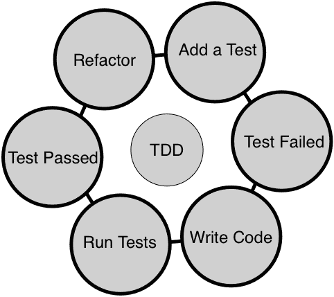
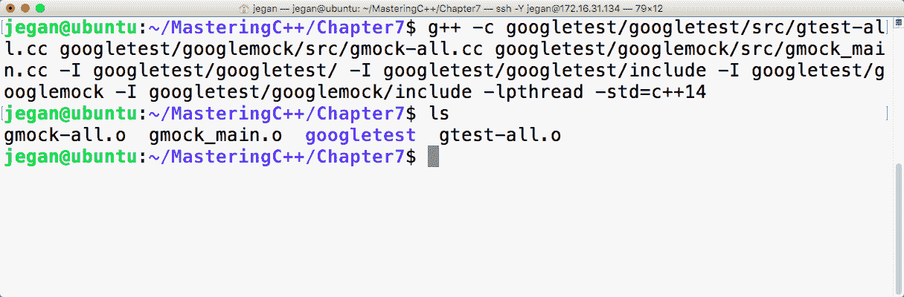
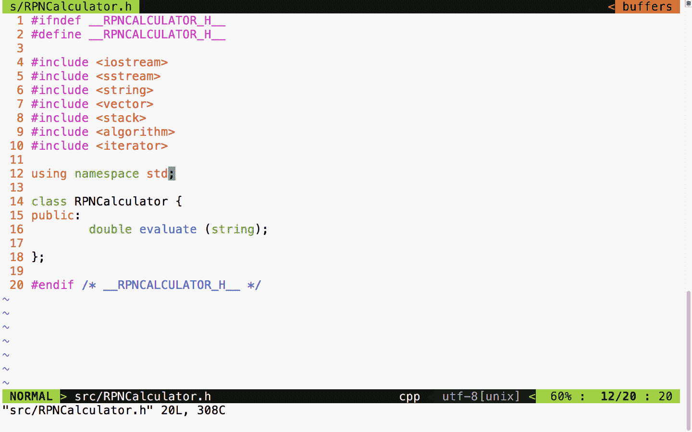
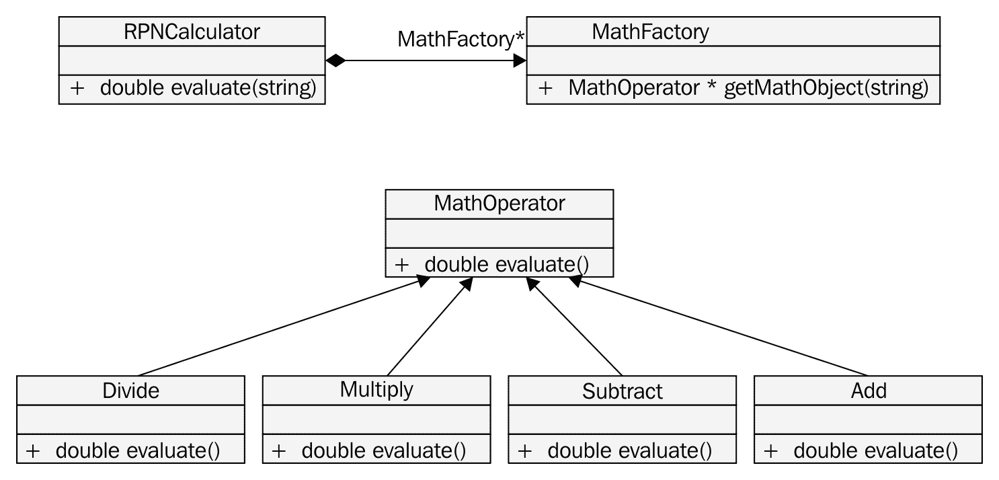
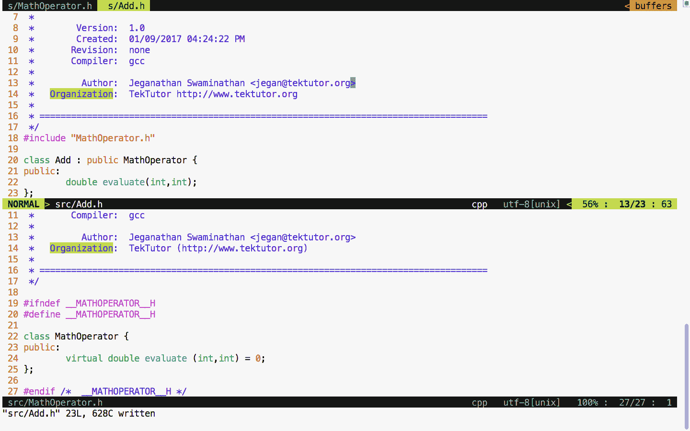
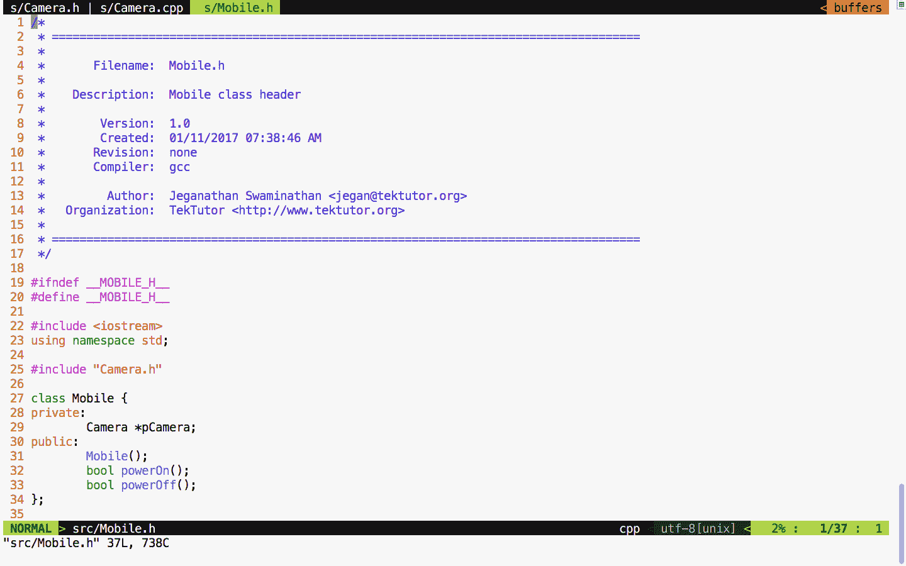

# 测试驱动开发

本章将涵盖以下主题：

+   测试驱动开发的简要概述

+   关于 TDD 的常见神话和疑问

+   开发人员编写单元测试是否需要更多的工作

+   代码覆盖率指标是好还是坏

+   TDD 是否适用于复杂的遗留项目

+   TDD 是否适用于嵌入式产品或涉及硬件的产品

+   C++的单元测试框架

+   Google 测试框架

+   在 Ubuntu 上安装 Google 测试框架

+   将 Google 测试和模拟一起构建为一个单一的静态库的过程，而无需安装它们

+   使用 Google 测试框架编写我们的第一个测试用例

+   在 Visual Studio IDE 中使用 Google 测试框架

+   TDD 的实践

+   测试具有依赖关系的遗留代码

让我们深入探讨这些 TDD 主题。

# TDD

**测试驱动开发**（**TDD**）是一种极限编程实践。在 TDD 中，我们从一个测试用例开始，逐步编写必要的生产代码，以使测试用例成功。这个想法是，我们应该一次专注于一个测试用例或场景，一旦测试用例通过，就可以转移到下一个场景。在这个过程中，如果新的测试用例通过，我们不应该修改生产代码。换句话说，在开发新功能或修复错误的过程中，我们只能修改生产代码的两个原因：要么确保测试用例通过，要么重构代码。TDD 的主要重点是单元测试；然而，它可以在一定程度上扩展到集成和交互测试。

以下图示了 TDD 过程的可视化：



当 TDD 被严格遵循时，开发人员可以实现代码的功能和结构质量。非常重要的是，在编写生产代码之前先编写测试用例，而不是在开发阶段结束时编写测试用例。这会产生很大的区别。例如，当开发人员在开发结束时编写单元测试用例时，测试用例很难发现代码中的任何缺陷。原因是开发人员会下意识地倾向于证明他们的代码是正确的，当测试用例在开发结束时编写时。而当开发人员提前编写测试用例时，由于尚未编写代码，他们会从最终用户的角度开始思考，这会鼓励他们从需求规范的角度提出许多场景。

换句话说，针对已经编写的代码编写的测试用例通常不会发现任何错误，因为它倾向于证明编写的代码是正确的，而不是根据需求进行测试。当开发人员在编写代码之前考虑各种场景时，这有助于他们逐步编写更好的代码，确保代码确实考虑到这些场景。然而，当代码存在漏洞时，测试用例将帮助他们发现问题，因为如果不满足要求，测试用例将失败。

TDD 不仅仅是使用一些单元测试框架。在开发或修复代码时，它需要文化和心态的改变。开发人员的重点应该是使代码在功能上正确。一旦以这种方式开发了代码，强烈建议开发人员还应专注于通过重构代码来消除任何代码异味；这将确保代码的结构质量也很好。从长远来看，代码的结构质量将使团队更快地交付功能。

# 关于 TDD 的常见神话和疑问

当人们开始他们的 TDD 之旅时，关于 TDD 有很多神话和常见疑问。让我澄清我遇到的大部分问题，因为我咨询了全球许多产品巨头。

# 开发人员编写单元测试是否需要更多的工作

大多数开发人员心中常常会产生一个疑问：“当我们采用 TDD 时，我应该如何估算我的工作量？”由于开发人员需要作为 TDD 的一部分编写单元和集成测试用例，您对如何与客户或管理层协商额外编写测试用例所需的工作量感到担忧，这并不奇怪。别担心，您并不孤单；作为一名自由软件顾问，许多开发人员向我提出了这个问题。

作为开发人员，您手动测试您的代码；相反，现在编写自动化测试用例。好消息是，这是一次性的努力，保证能够在长期内帮助您。虽然开发人员需要反复手动测试他们的代码，但每次他们更改代码时，已经存在的自动化测试用例将通过在集成新代码时立即给予开发人员反馈来帮助他们。

最重要的是，这需要额外的努力，但从长远来看，它有助于减少所需的努力。

# 代码覆盖率指标是好还是坏？

代码覆盖工具帮助开发人员识别其自动化测试用例中的空白。毫无疑问，很多时候它会提供有关缺失测试场景的线索，这最终会进一步加强自动化测试用例。但当一个组织开始将代码覆盖率作为检查测试覆盖率有效性的指标时，有时会导致开发人员走向错误的方向。根据我的实际咨询经验，我所学到的是，许多开发人员开始为构造函数和私有和受保护的函数编写测试用例，以展示更高的代码覆盖率。在这个过程中，开发人员开始追求数字，失去了 TDD 的最终目标。

在一个具有 20 个方法的类的特定源代码中，可能只有 10 个方法符合单元测试的条件，而其他方法是复杂的功能。在这种情况下，代码覆盖工具将只显示 50%的代码覆盖率，这完全符合 TDD 哲学。然而，如果组织政策强制要求最低 75%的代码覆盖率，那么开发人员将别无选择，只能测试构造函数、析构函数、私有、受保护和复杂功能，以展示良好的代码覆盖率。

测试私有和受保护方法的麻烦在于它们往往会更改，因为它们被标记为实现细节。当私有和受保护方法发生严重变化时，就需要修改测试用例，这使得开发人员在维护测试用例方面的生活更加艰难。

因此，代码覆盖工具是非常好的开发人员工具，可以找到测试场景的空白，但是否编写测试用例或忽略编写某些方法的测试用例，取决于方法的复杂性，应该由开发人员做出明智的选择。然而，如果代码覆盖率被用作项目指标，它往往会驱使开发人员找到展示更好覆盖率的错误方法，导致糟糕的测试用例实践。

# TDD 适用于复杂的遗留项目吗？

当然！TDD 适用于任何类型的软件项目或产品。TDD 不仅适用于新产品或项目；它在复杂的遗留项目或产品中也被证明更有效。在维护项目中，绝大多数时间都是修复缺陷，很少需要支持新功能。即使在这样的遗留代码中，修复缺陷时也可以遵循 TDD。

作为开发人员，您肯定会同意，一旦您能够重现问题，从开发人员的角度来看，问题几乎有一半可以被认为已经解决了。因此，您可以从能够重现问题的测试用例开始，然后调试和修复问题。当您修复问题时，测试用例将开始通过；现在是时候考虑可能会重现相同缺陷的另一个可能的测试用例，并重复这个过程。

# TDD 是否适用于嵌入式或涉及硬件的产品？

就像应用软件可以从 TDD 中受益一样，嵌入式项目或涉及硬件交互的项目也可以从 TDD 方法中受益。有趣的是，嵌入式项目或涉及硬件的产品更多地受益于 TDD，因为它们可以通过隔离硬件依赖性来测试大部分代码，而无需硬件。TDD 有助于减少上市时间，因为团队可以在不等待硬件的情况下测试大部分软件。由于大部分代码已经在没有硬件的情况下得到了充分的测试，这有助于避免在板卡启动时出现最后一刻的惊喜或应急情况。这是因为大部分情况已经得到了充分的测试。

根据软件工程的最佳实践，一个良好的设计是松散耦合和高内聚的。虽然我们都努力编写松散耦合的代码，但并不总是可能编写绝对独立的代码。大多数情况下，代码都有某种类型的依赖。在应用软件的情况下，依赖可能是数据库或 Web 服务器；在嵌入式产品的情况下，依赖可能是一块硬件。但是使用依赖反转，**被测试的代码**（**CUT**）可以与其依赖隔离，使我们能够在没有依赖的情况下测试代码，这是一种强大的技术。只要我们愿意重构代码使其更模块化和原子化，任何类型的代码和项目或产品都将受益于 TDD 方法。

# C++的单元测试框架

作为 C++开发人员，在选择单元测试框架时，你有很多选择。虽然还有许多其他框架，但这些是一些流行的框架：CppUnit，CppUnitLite，Boost，MSTest，Visual Studio 单元测试和谷歌测试框架。

尽管这些是较旧的文章，我建议你看一下[`gamesfromwithin.com/exploring-the-c-unit-testing-framework-jungle`](http://gamesfromwithin.com/exploring-the-c-unit-testing-framework-jungle)和[`accu.org/index.php/journals/`](https://accu.org/index.php/journals/)。它们可能会给你一些关于这个主题的见解。

毫无疑问，谷歌测试框架是 C++中最受欢迎的测试框架之一，因为它在各种平台上都得到支持，积极开发，并且最重要的是得到了谷歌的支持。

在本章中，我们将使用谷歌测试和谷歌模拟框架。然而，本章讨论的概念适用于所有单元测试框架。我们将深入研究谷歌测试框架及其安装过程。

# 谷歌测试框架

谷歌测试框架是一个在许多平台上都可以使用的开源测试框架。TDD 只关注单元测试和在一定程度上的集成测试，但谷歌测试框架可以用于各种测试。它将测试用例分类为小型、中型、大型、忠诚度、弹性、精度和其他类型的测试用例。单元测试用例属于小型，集成测试用例属于中型，而复杂功能和验收测试用例属于大型。

它还将谷歌模拟框架作为其一部分捆绑在一起。由于它们在技术上来自同一个团队，它们可以无缝地相互配合。然而，谷歌模拟框架也可以与其他测试框架一起使用，比如 CppUnit。

# 在 Ubuntu 上安装谷歌测试框架

你可以从[`github.com/google/googletest`](https://github.com/google/googletest)下载谷歌测试框架的源代码。然而，最好的下载方式是通过终端命令行进行 Git 克隆：

```cpp
git clone https://github.com/google/googletest.git
```

Git 是一个开源的**分布式版本控制系统**（**DVCS**）。如果您还没有在系统上安装它，您可以在[`git-scm.com/`](https://git-scm.com/)上找到更多关于为什么应该安装它的信息。但是，在 Ubuntu 中，可以使用`sudo apt-get install git`命令轻松安装它。

一旦代码下载完成，如*图 7.1*所示，您将能够在`googletest`文件夹中找到 Google 测试框架的源代码：


图 7.1

`googletest`文件夹中有两个分开的文件夹，分别包含`googletest`和`googlemock`框架。现在我们可以调用`cmake`实用程序来配置我们的构建并自动生成`Makefile`，如下所示：

```cpp
cmake CMakeLists.txt
```


图 7.2

当调用`cmake`实用程序时，它会检测构建 Google 测试框架所需的 C/C++头文件及其路径。此外，它还会尝试定位构建源代码所需的工具。一旦找到所有必要的头文件和工具，它将自动生成`Makefile`。一旦有了`Makefile`，您就可以使用它来编译和安装 Google 测试和 Google 模拟到您的系统上：

```cpp
sudo make install
```

以下截图演示了如何在系统上安装 google 测试：


图 7.3

在上图中，`make install`命令已经在`/usr/local/lib`文件夹中编译和安装了`libgmock.a`和`libgtest.a`静态库文件。由于`/usr/local/lib`文件夹路径通常在系统的 PATH 环境变量中，因此可以从系统中的任何项目中访问它。

# 如何构建 google 测试和模拟一起作为一个单一的静态库而不安装？

如果您不喜欢在常用系统文件夹上安装`libgmock.a`和`libgtest.a`静态库文件以及相应的头文件，那么构建 Google 测试框架还有另一种方法。

以下命令将创建三个目标文件，如*图 7.4*所示：

```cpp
g++ -c googletest/googletest/src/gtest-all.cc googletest/googlemock/src/gmock-all.cc googletest/googlemock/src/gmock_main.cc -I googletest/googletest/ -I googletest/googletest/include -I googletest/googlemock -I googletest/googlemock/include -lpthread -
```



图 7.4

下一步是使用以下命令将所有目标文件组合成一个单一的静态库：

```cpp
ar crf libgtest.a gmock-all.o gmock_main.o gtest-all.o
```

如果一切顺利，您的文件夹应该有全新的`libgtest.a`静态库，如*图 7.5*所示。让我们理解以下命令说明：

```cpp
g++ -c googletest/googletest/src/gtest-all.cc    googletest/googlemock/src/gmock-all.cc googletest/googlemock/src/gmock_main.cc -I googletest/googletest/ -I googletest/googletest/include 
-I googletest/googlemock  -I googletest/googlemock/include -lpthread -std=c++14
```

上述命令将帮助我们创建三个目标文件：**gtest-all.o**，**gmock-all.o**和**gmock_main.o**。`googletest`框架使用了一些 C++11 特性，我故意使用了 c++14 以确保安全。`gmock_main.cc`源文件有一个 main 函数，它将初始化 Google 模拟框架，而后者将在内部初始化 Google 测试框架。这种方法的最大优点是我们不必为我们的单元测试应用程序提供 main 函数。请注意，编译命令包括以下`include`路径，以帮助 g++编译器定位 Google 测试和 Google 模拟框架中必要的头文件：

```cpp
-I googletest/googletest
-I googletest/googletest/include
-I googletest/googlemock
-I googletest/googlemock/include
```

现在下一步是创建我们的`libgtest.a`静态库，将 gtest 和 gmock 框架捆绑成一个单一的静态库。由于 Google 测试框架使用了多线程，因此必须将`pthread`库链接为我们静态库的一部分：

```cpp
ar crv libgtest.a gtest-all.o gmock_main.o gmock-all.o
```

`ar`存档命令有助于将所有目标文件组合成一个静态库。

以下图像在终端中实际演示了所讨论的过程：


图 7.5

# 使用 Google 测试框架编写我们的第一个测试用例

学习 Google 测试框架非常容易。让我们创建两个文件夹：一个用于生产代码，另一个用于测试代码。这样做的想法是将生产代码与测试代码分开。一旦您创建了这两个文件夹，就可以从`Math.h`头文件开始，如*图 7.6*所示：


图 7.6

`Math`类只有一个函数，用于演示单元测试框架的用法。首先，我们的`Math`类有一个简单的 add 函数，足以理解 Google 测试框架的基本用法。

在 Google 测试框架的位置，您也可以使用 CppUnit，并集成模拟框架，如 Google 模拟框架、mockpp 或 opmock。

让我们在以下`Math.cpp`源文件中实现我们简单的`Math`类：


图 7.7

前两个文件应该在`src`文件夹中，如*图 7.8*所示。所有的生产代码都放在`src`文件夹中，`src`文件夹可以包含任意数量的文件。


图 7.8

由于我们已经编写了一些生产代码，现在让我们看看如何为前面的生产代码编写一些基本的测试用例。作为一般的最佳实践，建议将测试用例文件命名为`MobileTest`或`TestMobile`，以便任何人都能轻松预测文件的目的。在 C++或 Google 测试框架中，不强制将文件名和类名保持一致，但通常被认为是最佳实践，因为它可以帮助任何人通过查看文件名来定位特定的类。

Google 测试框架和 Google 模拟框架都是同一个团队的产品，因此这种组合在大多数平台上都非常有效，包括嵌入式平台。

由于我们已经将 Google 测试框架编译为静态库，让我们直接开始`MathTest.cpp`源文件：


图 7.9

在*图 7.9*中，我们在第 18 行包含了来自 Google 测试框架的 gtest 头文件。在 Google 测试框架中，测试用例使用`TEST`宏编写，该宏接受两个参数。第一个参数，即`MathTest`，表示测试模块名称，第二个参数是测试用例的名称。测试模块帮助我们将一组相关的测试用例分组到一个模块下。因此，为测试模块和测试用例命名非常重要，以提高测试报告的可读性。

正如您所知，`Math`是我们打算测试的类；我们在*第 22 行*实例化了`Math`对象。在*第 25 行*，我们调用了数学对象的 add 函数，这应该返回实际结果。最后，在*第 27 行*，我们检查预期结果是否与实际结果匹配。如果预期和实际结果匹配，Google 测试宏`EXPECT_EQ`将标记测试用例为通过；否则，框架将标记测试用例的结果为失败。

好的，现在我们已经准备好了。现在让我们看看如何编译和运行我们的测试用例。以下命令应该帮助您编译测试用例：

```cpp
g++ -o tester.exe src/Math.cpp test/MathTest.cpp -I googletest/googletest 
-I googletest/googletest/include -I googletest/googlemock     
-I googletest/googlemock/include -I src libgtest.a -lpthread

```

请注意，编译命令包括以下包含路径：

```cpp
-I googletest/googletest
-I googletest/googletest/include
-I googletest/googlemock
-I googletest/googlemock/include
-I src
```

另外，重要的是要注意，我们还链接了我们的 Google 测试静态库`libgtest.a`和 POSIX pthreads 库，因为 Google 测试框架使用了多个。

**图 7.10**

恭喜！我们已经成功编译并执行了我们的第一个测试用例。

# 在 Visual Studio IDE 中使用 Google 测试框架

首先，我们需要从[`github.com/google/googletest/archive/master.zip`](https://github.com/google/googletest/archive/master.zip)下载 Google 测试框架的`.zip`文件。下一步是在某个目录中解压`.zip`文件。在我的情况下，我已经将其解压到`googletest`文件夹，并将`googletest googletest-master\googletest-master`的所有内容复制到`googletest`文件夹中，如*图 7.11*所示：


图 7.11

现在是时候在 Visual Studio 中创建一个简单的项目了。我使用的是 Microsoft Visual Studio Community 2015。但是，这里遵循的程序应该对 Visual Studio 的其他版本基本保持一致，只是选项可能在不同的菜单中可用。

您需要通过导航到新建项目| Visual Studio | Windows | Win32 | Win32 控制台应用程序来创建一个名为`MathApp`的新项目，如*图 7.12*所示。该项目将成为要测试的生产代码。


图 7.12

让我们将`MyMath`类添加到`MathApp`项目中。`MyMath`类是将在`MyMath.h`中声明并在`MyMath.cpp`中定义的生产代码。

让我们来看一下*图 7.13*中显示的`MyMath.h`头文件：


图 7.13

`MyMath`类的定义如*图 7.14*所示：


图 7.14

由于它是一个控制台应用程序，因此必须提供主函数，如*图 7.15*所示：


图 7.15

接下来，我们将在相同的`MathApp`项目解决方案中添加一个名为`GoogleTestLib`的静态库项目，如*图 7.16*所示：


图 7.16

接下来，我们需要将来自 Google 测试框架的以下源文件添加到我们的静态库项目中：

```cpp
C:\Users\jegan\googletest\googletest\src\gtest-all.cc
C:\Users\jegan\googletest\googlemock\src\gmock-all.cc
C:\Users\jegan\googletest\googlemock\src\gmock_main.cc
```

为了编译静态库，我们需要在`GoogleTestLib/Properties/VC++ Directories/Include`目录中包含以下头文件路径：

```cpp
C:\Users\jegan\googletest\googletest
C:\Users\jegan\googletest\googletest\include
C:\Users\jegan\googletest\googlemock
C:\Users\jegan\googletest\googlemock\include
```

您可能需要根据在系统中复制/安装 Google 测试框架的位置来自定义路径。

现在是时候将`MathTestApp` Win32 控制台应用程序添加到`MathApp`解决方案中了。我们需要将`MathTestApp`设置为`StartUp`项目，以便可以直接执行此应用程序。在添加名为`MathTest.cpp`的新源文件到`MathTestApp`项目之前，请确保`MathTestApp`项目中没有源文件。

我们需要配置与`GoogleTestLib`静态库中添加的相同一组 Google 测试框架包含路径。除此之外，我们还必须将`MathApp`项目目录添加为测试项目将引用的头文件，如下所示。但是，根据您在系统中为此项目遵循的目录结构，自定义路径：

```cpp
C:\Users\jegan\googletest\googletest
C:\Users\jegan\googletest\googletest\include
C:\Users\jegan\googletest\googlemock
C:\Users\jegan\googletest\googlemock\include
C:\Projects\MasteringC++Programming\MathApp\MathApp
```

在`MathAppTest`项目中，确保您已经添加了对`MathApp`和`GoogleTestLib`的引用，以便在它们发生更改时，`MathAppTest`项目将编译其他两个项目。

太好了！我们快要完成了。现在让我们实现`MathTest.cpp`，如*图 7.17*所示：


图 7.17

现在一切准备就绪，让我们运行测试用例并检查结果：


图 7.18

# TDD 实践

让我们看看如何开发一个遵循 TDD 方法的**逆波兰表达式**（**RPN**）计算器应用程序。RPN 也被称为后缀表示法。RPN 计算器应用程序的期望是接受后缀数学表达式作为输入，并将计算结果作为输出返回。

我想逐步演示如何在开发应用程序时遵循 TDD 方法。作为第一步，我想解释项目目录结构，然后我们将继续。让我们创建一个名为`Ex2`的文件夹，其结构如下：


图 7.19

`googletest`文件夹是具有必要的`gtest`和`gmock`头文件的 gtest 测试库。现在`libgtest.a`是我们在上一个练习中创建的 Google 测试静态库。我们将使用`make`实用程序来构建我们的项目，因此我已经将`Makefile`放在项目`home`目录中。`src`目录将保存生产代码，而测试目录将保存我们将要编写的所有测试用例。

在我们开始编写测试用例之前，让我们来看一个后缀数学表达式“2 5 * 4 + 3 3 * 1 + /”，并了解我们将应用于评估逆波兰数学表达式的标准后缀算法。根据后缀算法，我们将逐个标记地解析逆波兰数学表达式。每当我们遇到一个操作数（数字）时，我们将把它推入栈中。每当我们遇到一个运算符时，我们将从栈中弹出两个值，应用数学运算，将中间结果推回栈中，并重复该过程，直到在逆波兰表达式中评估所有标记。最后，当输入字符串中没有更多的标记时，我们将弹出该值并将其打印为结果。该过程在下图中逐步演示：


图 7.20

首先，让我们以一个简单的后缀数学表达式开始，并将情景转化为一个测试用例：

```cpp
Test Case : Test a simple addition
Input: "10 15 +"
Expected Output: 25.0
```

让我们将前面的测试用例翻译为测试文件夹中的 Google 测试，如下所示：

```cpp
test/RPNCalculatorTest.cpp

TEST ( RPNCalculatorTest, testSimpleAddition ) { 
         RPNCalculator rpnCalculator; 
         double actualResult = rpnCalculator.evaluate ( "10 15 +" ); 
         double expectedResult = 25.0; 
         EXPECT_EQ ( expectedResult, actualResult ); 
}
```

为了编译前面的测试用例，让我们在`src`文件夹中编写所需的最小生产代码，如下所示：

```cpp
src/RPNCalculator.h

#include <iostream>
#include <string>
using namespace std;

class RPNCalculator {
  public:
      double evaluate ( string );
};
```

由于 RPN 数学表达式将作为以空格分隔的字符串提供，因此评估方法将接受一个字符串输入参数：

```cpp
src/RPNCalculator.cpp

#include "RPNCalculator.h"

double RPNCalculator::evaluate ( string rpnMathExpression ) {
    return 0.0;
}
```

以下`Makefile`类帮助每次编译生产代码时运行测试用例：


图 7.21

现在让我们构建并运行测试用例，并检查测试用例的结果：


图 7.22

在 TDD 中，我们总是从一个失败的测试用例开始。失败的原因是期望的结果是 25，而实际结果是 0。原因是我们还没有实现评估方法，因此我们已经硬编码为返回 0，而不管任何输入。因此，让我们实现评估方法以使测试用例通过。

我们需要修改`src/RPNCalculator.h`和`src/RPNCalculator.cpp`如下：



图 7.23

在 RPNCalculator.h 头文件中，注意包含的新头文件，用于处理字符串标记化和字符串双精度转换，并将 RPN 标记复制到向量中：


图 7.24

根据标准的后缀算法，我们使用一个栈来保存在逆波兰表达式中找到的所有数字。每当我们遇到`+`数学运算符时，我们从栈中弹出两个值相加，然后将结果推回栈中。如果标记不是`+`运算符，我们可以安全地假定它是一个数字，所以我们只需将该值推送到栈中。

有了前面的实现，让我们尝试测试用例，并检查测试用例是否通过：


图 7.25

很好，我们的第一个测试用例如预期地通过了。现在是时候考虑另一个测试用例了。这次，让我们添加一个减法的测试用例：

```cpp
Test Case : Test a simple subtraction
Input: "25 10 -"
Expected Output: 15.0
```

让我们将前面的测试用例翻译为测试文件夹中的 Google 测试，如下所示：

```cpp
test/RPNCalculatorTest.cpp

TEST ( RPNCalculatorTest, testSimpleSubtraction ) { 
         RPNCalculator rpnCalculator; 
         double actualResult = rpnCalculator.evaluate ( "25 10 -" ); 
         double expectedResult = 15.0; 
         EXPECT_EQ ( expectedResult, actualResult ); 
}
```

通过将前面的测试用例添加到`test/RPNCalculatorTest`中，现在应该如下所示：


图 7.26

让我们执行测试用例并检查我们的新测试用例是否通过：


图 7.27

正如预期的那样，新的测试失败了，因为我们还没有在应用程序中添加对减法的支持。这是非常明显的，根据 C++异常，因为代码试图将减法`-`操作符转换为一个数字。让我们在我们的 evaluate 方法中添加对减法逻辑的支持：


图 7.28

是时候测试了。让我们执行测试案例，检查事情是否正常：


图 7.29

酷！你注意到我们的测试案例在这种情况下失败了吗？等一下。如果测试案例失败了，为什么我们会兴奋呢？我们应该高兴的原因是我们的测试案例发现了一个 bug；毕竟，这是 TDD 的主要目的，不是吗？


图 7.30

失败的根本原因是栈是基于**后进先出**（**LIFO**）操作，而我们的代码假设是先进先出。你注意到我们的代码假设它会先弹出第一个数字，而实际上它应该先弹出第二个数字吗？有趣的是，这个 bug 在加法操作中也存在；然而，由于加法是可结合的，这个 bug 被抑制了，但减法测试案例检测到了它。


图 7.31

让我们按照前面的截图修复 bug，并检查测试案例是否通过：


图 7.32

太棒了！我们修复了 bug，我们的测试案例似乎证明它们已经修复了。让我们添加更多的测试案例。这一次，让我们添加一个测试案例来验证乘法：

```cpp
Test Case : Test a simple multiplication
Input: "25 10 *"
Expected Output: 250.0
```

让我们将前面的测试案例翻译成测试文件中的谷歌测试，如下所示：

```cpp
test/RPNCalculatorTest.cpp

TEST ( RPNCalculatorTest, testSimpleMultiplication ) { 
         RPNCalculator rpnCalculator; 
         double actualResult = rpnCalculator.evaluate ( "25 10 *" ); 
         double expectedResult = 250.0; 
         EXPECT_EQ ( expectedResult, actualResult ); 
}
```

我们知道这次测试案例将会失败，所以让我们快进并看一下除法测试案例：

```cpp
Test Case : Test a simple division
Input: "250 10 /"
Expected Output: 25.0
```

让我们将前面的测试案例翻译成测试文件中的谷歌测试，如下所示：

```cpp
test/RPNCalculatorTest.cpp

TEST ( RPNCalculatorTest, testSimpleDivision ) { 
         RPNCalculator rpnCalculator; 
         double actualResult = rpnCalculator.evaluate ( "250 10 /" ); 
         double expectedResult = 25.0; 
         EXPECT_EQ ( expectedResult, actualResult );
}
```

让我们跳过测试结果，继续进行一个涉及许多操作的最终复杂表达式测试案例：

```cpp
Test Case : Test a complex rpn expression
Input: "2  5  *  4  + 7  2 -  1  +  /"
Expected Output: 25.0
```

让我们将前面的测试案例翻译成测试文件中的谷歌测试，如下所示：

```cpp
test/RPNCalculatorTest.cpp

TEST ( RPNCalculatorTest, testSimpleDivision ) { 
         RPNCalculator rpnCalculator; 
         double actualResult = rpnCalculator.evaluate ( "250 10 /" ); 
         double expectedResult = 25.0; 
         EXPECT_EQ ( expectedResult, actualResult );
}
```

让我们检查一下我们的 RPNCalculator 应用程序是否能够评估一个涉及加法、减法、乘法和除法的复杂逆波兰表达式，这是一个测试案例：

```cpp
test/RPNCalculatorTest.cpp

TEST ( RPNCalculatorTest, testComplexExpression ) { 
         RPNCalculator rpnCalculator; 
         double actualResult = rpnCalculator.evaluate ( "2  5  *  4  +  7  2 - 1 +  /" ); 
         double expectedResult = 2.33333; 
         ASSERT_NEAR ( expectedResult, actualResult, 4 );
}
```

在前面的测试案例中，我们正在检查预期结果是否与实际结果匹配，精确到小数点后四位。如果超出这个近似值，那么测试案例应该失败。

现在让我们检查测试案例的输出：


图 7.33

太棒了！所有的测试案例都是绿色的。

现在让我们看看我们的生产代码，检查是否有改进的空间：


图 7.34

代码在功能上是好的，但有很多代码异味。这是一个长方法，有嵌套的`if-else`条件和重复的代码。TDD 不仅仅是关于测试自动化；它也是关于编写没有代码异味的好代码。因此，我们必须重构代码，使其更模块化，减少代码复杂性。

在这里，我们可以应用多态性或策略设计模式，而不是嵌套的`if-else`条件。此外，我们可以使用工厂方法设计模式来创建各种子类型。还有使用空对象设计模式的空间。

最好的部分是，我们不必担心在重构过程中破坏我们的代码的风险，因为我们有足够多的测试案例来在我们破坏代码时给我们反馈。

首先，让我们了解如何重构*图 7.35*中所示的 RPNCalculator 设计：



图 7.35

根据前面的设计重构方法，我们可以将 RPNCalculator 重构如*图 7.36*所示：


图 7.36

如果您比较重构前后的`RPNCalculator`代码，您会发现重构后代码的复杂性大大减少。

`MathFactory`类可以按*图 7.37*所示实现：


图 7.37

尽可能地，我们必须努力避免`if-else`条件，或者一般来说，我们必须尽量避免代码分支。因此，STL map 用于避免 if-else 条件。这也促进了相同的 Math 对象的重复使用，无论 RPN 表达式的复杂性如何。

如果您参考*图 7.38*，您将了解`MathOperator Add`类的实现方式：



图 7.38

`Add`类的定义如*图 7.39*所示：


图 7.39

减法、乘法和除法类可以以类似的方式实现，作为`Add`类。重点是，在重构后，我们可以将单个`RPNCalculator`类重构为更小且易于维护的类，可以单独进行测试。

让我们看一下重构后的`Makefile`类，如*图 7.40*所示，并在重构过程完成后测试我们的代码：


图 7.40

如果一切顺利，重构后我们应该看到所有测试用例通过，如果没有功能被破坏，如*图 7.41*所示：


图 7.41

太棒了！所有测试用例都通过了，因此可以保证我们在重构过程中没有破坏功能。TDD 的主要目的是编写既具有功能性又结构清晰的可测试代码。

# 测试具有依赖关系的遗留代码

在上一节中，CUT 是独立的，没有依赖，因此它测试代码的方式是直接的。然而，让我们讨论一下如何对具有依赖关系的 CUT 进行单元测试。为此，请参考以下图片：


图 7.42

在*图 7.42*中，显然**Mobile**依赖于**Camera**，而**Mobile**和**Camera**之间的关联是*组合*。让我们看看遗留应用程序中`Camera.h`头文件的实现：


图 7.43

为了演示目的，让我们来看一个简单的`Camera`类，具有`ON()`和`OFF()`功能。让我们假设 ON/OFF 功能将在内部与相机硬件交互。查看*图 7.44*中的`Camera.cpp`源文件：


图 7.44

出于调试目的，我添加了一些打印语句，这在我们测试移动的`powerOn()`和`powerOff()`功能时会很有用。现在让我们检查*图 7.45*中的`Mobile`类头文件：



图 7.45

我们继续移动实现，如*图 7.46*所示：


图 7.46

从`Mobile`构造函数的实现中，可以明显看出移动设备具有相机，或者更确切地说是组合关系。换句话说，`Mobile`类是构造`Camera`对象的类，如*图 7.46*，*第 21 行*在构造函数中显示。让我们尝试看一下测试`Mobile`的`powerOn()`功能所涉及的复杂性；依赖关系与 Mobile 的 CUT 具有组合关系。

让我们编写`powerOn()`测试用例，假设相机已成功打开，如下所示：

```cpp
TEST ( MobileTest, testPowerOnWhenCameraONSucceeds ) {

     Mobile mobile;
     ASSERT_TRUE ( mobile.powerOn() );

}
```

现在让我们尝试运行`Mobile`测试用例并检查测试结果，如*图 7.47*所示：


图 7.47

从*图 7.47*中，我们可以理解`Mobile`的`powerOn()`测试用例已经通过。但是，我们也了解到`Camera`类的真正`ON()`方法也被调用了。这反过来将与相机硬件进行交互。归根结底，这不是一个单元测试，因为测试结果并不完全取决于 CUT。如果测试用例失败，我们将无法确定失败是由于移动设备`powerOn()`逻辑中的代码还是相机`ON()`逻辑中的代码，这将违背我们测试用例的目的。理想的单元测试应该使用依赖注入隔离 CUT 与其依赖项，并测试代码。这种方法将帮助我们识别 CUT 在正常或异常情况下的行为。理想情况下，当单元测试用例失败时，我们应该能够猜测失败的根本原因，而无需调试代码；只有当我们设法隔离 CUT 的依赖项时，才有可能做到这一点。

这种方法的关键好处是，即使在实现依赖项之前，也可以测试 CUT，这有助于在没有依赖项的情况下测试 60~70％的代码。这自然减少了软件产品上市的时间。

这就是 Google 模拟或 gmock 派上用场的地方。让我们看看如何重构我们的代码以实现依赖注入。虽然听起来非常复杂，但重构代码所需的工作并不复杂。实际上，重构生产代码所需的工作可能更复杂，但这是值得的。让我们来看一下重构后的`Mobile`类，如*图 7.48*所示：


图 7.48

在`Mobile`类中，我添加了一个接受相机作为参数的重载构造函数。这种技术称为**构造函数依赖注入**。让我们看看这种简单而强大的技术如何在测试`Mobile`的`powerOn()`功能时帮助我们隔离相机依赖。

此外，我们必须重构`Camera.h`头文件，并将`ON()`和`OFF()`方法声明为虚拟方法，以便 gmock 框架帮助我们存根这些方法，如*图 7.49*所示：


图 7.49

现在让我们根据*图 7.50*进行重构我们的测试用例：


图 7.50

我们已经准备好构建和执行测试用例。测试结果如*图 7.51*所示：


图 7.51

太棒了！我们的测试用例不仅通过了，而且我们还将我们的 CUT 与其相机依赖隔离开来，这很明显，因为我们没有看到相机的`ON()`方法的打印语句。最重要的是，您现在已经学会了如何通过隔离其依赖项来对代码进行单元测试。

快乐的 TDD！

# 总结

在本章中，您学到了很多关于 TDD 的知识，以下是关键要点的总结：

+   TDD 是一种极限编程（XP）实践

+   TDD 是一种自下而上的方法，鼓励我们从测试用例开始，因此通常被称为小写测试优先开发

+   您学会了如何在 Linux 和 Windows 中使用 Google Test 和 Google Mock 框架编写测试用例

+   您还学会了如何在 Linux 和 Windows 平台上的 Visual Studio 中编写遵循 TDD 的应用程序

+   您学会了依赖反转技术以及如何使用 Google Mock 框架隔离其依赖项对代码进行单元测试

+   Google Test 框架支持单元测试、集成测试、回归测试、性能测试、功能测试等

+   TDD 主要坚持单元测试、集成测试和交互测试，而复杂的功能测试必须使用行为驱动开发来完成

+   您学会了如何将代码异味重构为干净的代码，同时您编写的单元测试用例会给出持续的反馈

你已经学会了 TDD 以及如何以自下而上的方式自动化单元测试用例、集成测试用例和交互测试用例。有了 BDD，你将学会自上而下的开发方法，编写端到端的功能和测试用例，以及我们在讨论 TDD 时没有涵盖的其他复杂测试场景。

在下一章中，你将学习行为驱动开发。
