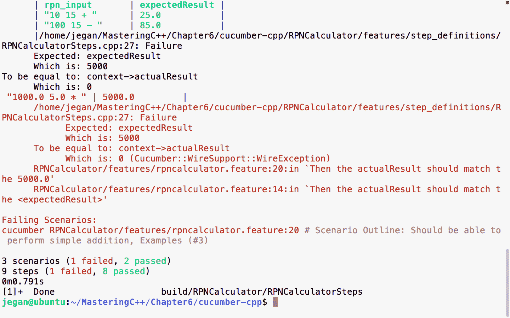

# 第八章：行为驱动开发

本章涵盖以下主题：

+   行为驱动开发简介

+   TDD 与 BDD

+   C++ BDD 框架

+   Gherkin 语言

+   在 Ubuntu 中安装`cucumber-cpp`

+   特性文件

+   Gherkin 支持的口语

+   推荐的`cucumber-cpp`项目文件夹结构

+   编写我们的第一个 Cucumber 测试用例

+   运行我们的 Cucumber 测试用例进行干运行

+   BDD——一种测试驱动的开发方法

在接下来的章节中，让我们以实用的方式逐个讨论每个主题，并提供易于理解和有趣的代码示例。

# 行为驱动开发

**行为驱动开发**（**BDD**）是一种从外到内的开发技术。BDD 鼓励将需求捕捉为一组场景或用例，描述最终用户如何使用功能。场景将准确表达输入和功能预期响应。BDD 最好的部分是它使用称为**Gherkin**的**领域特定语言**（**DSL**）来描述 BDD 场景。

Gherkin 是一种类似英语的语言，被所有 BDD 测试框架使用。Gherkin 是一种可读的业务 DSL，帮助您描述测试用例场景，排除实现细节。Gherkin 语言关键字是一堆英语单词；因此，技术和非技术成员都可以理解涉及软件产品或项目团队的场景。

我告诉过你了吗，用 Gherkin 语言编写的 BDD 场景既可以作为文档，也可以作为测试用例？由于 Gherkin 语言易于理解并使用类似英语的关键词，产品需求可以直接被捕捉为 BDD 场景，而不是无聊的 Word 或 PDF 文档。根据我的咨询和行业经验，我观察到大多数公司在设计在一段时间内重构时从不更新需求文档。这导致了陈旧和未更新的文档，开发团队将不信任这些文档作为参考。因此，为准备需求、高级设计文档和低级设计文档所付出的努力最终将付诸东流，而 Cucumber 测试用例将始终保持更新和相关。

# TDD 与 BDD

TDD 是一种从内到外的开发技术，而 BDD 是一种从外到内的开发技术。TDD 主要侧重于单元测试和集成测试用例自动化。

BDD 侧重于端到端的功能测试用例和用户验收测试用例。然而，BDD 也可以用于单元测试、冒烟测试，以及实际上的各种测试。

BDD 是 TDD 方法的扩展；因此，BDD 也强烈鼓励测试驱动开发。在同一产品中同时使用 BDD 和 TDD 是非常自然的；因此，BDD 并不是 TDD 的替代品。BDD 可以被视为高级设计文档，而 TDD 是低级设计文档。

# C++ BDD 框架

在 C++中，TDD 测试用例是使用诸如 CppUnit、gtest 等测试框架编写的，这些测试框架需要技术背景才能理解，因此通常只由开发人员使用。

在 C++中，BDD 测试用例是使用一种名为 cucumber-cpp 的流行测试框架编写的。cucumber-cpp 框架期望测试用例是用 Gherkin 语言编写的，而实际的测试用例实现可以使用任何测试框架，如 gtest 或 CppUnit。

然而，在本书中，我们将使用带有 gtest 框架的 cucumber-cpp。

# Gherkin 语言

Gherkin 是每个 BDD 框架使用的通用语言，用于各种编程语言的 BDD 支持。

Gherkin 是一种面向行的语言，类似于 YAML 或 Python。Gherkin 将根据缩进解释测试用例的结构。

在 Gherkin 中，`#`字符用于单行注释。在撰写本书时，Gherkin 支持大约 60 个关键字。

Gherkin 是 Cucumber 框架使用的 DSL。

# 在 Ubuntu 中安装 cucumber-cpp

在 Linux 中安装 cucumber-cpp 框架非常简单。您只需要下载或克隆 cucumber-cpp 的最新副本即可。

以下命令可用于克隆 cucumber-cpp 框架：

```cpp
git clone https://github.com/cucumber/cucumber-cpp.git
```

cucumber-cpp 框架支持 Linux、Windows 和 Macintosh。它可以与 Windows 上的 Visual Studio 或 macOS 上的 Xcode 集成。

以下截图演示了 Git 克隆过程：


cucumber-cpp 依赖于一种 wire 协议，允许在 C++语言中编写 BDD 测试用例步骤定义，因此我们需要安装 Ruby。

# 安装 cucumber-cpp 框架的先决软件

以下命令可帮助您在 Ubuntu 系统上安装 Ruby。这是 cucumber-cpp 框架所需的先决软件之一：

```cpp
sudo apt install ruby
```

以下截图演示了 Ruby 安装过程：


安装完成后，请确保 Ruby 已正确安装，检查其版本。以下命令应该打印出您系统上安装的 Ruby 版本：

```cpp
ruby --version
```

为了完成 Ruby 安装，我们需要安装`ruby-dev`软件包，如下所示：

```cpp
sudo apt install ruby-dev
```

接下来，我们需要确保 bundler 工具已安装，以便 bundler 工具无缝安装 Ruby 依赖项：

```cpp
sudo gem install bundler
bundle install
```

如果一切顺利，您可以继续检查 Cucumber、Ruby 和 Ruby 工具的正确版本是否已正确安装。`bundle install`命令将确保安装 Cucumber 和其他 Ruby 依赖项。确保您不要以 sudo 用户身份安装`bundle install`，这将阻止非 root 用户访问 Ruby gem 软件包：


我们几乎完成了，但还没有完成。我们需要构建 cucumber-cpp 项目；作为其中的一部分，让我们获取 cucumber-cpp 框架的最新测试套件：

```cpp
git submodule init
git submodule update
```

在开始构建之前，我们需要安装 ninja 和 boost 库。尽管在本章中我们不打算使用 boost 测试框架，但`travis.sh`脚本文件会寻找 boost 库。因此，我建议通常安装 boost 库，作为 Cucumber 的一部分：

```cpp
sudo apt install ninja-build
sudo apt-get install libboost-all-dev
```

# 构建和执行测试用例

现在是时候构建 cucumber-cpp 框架了。让我们创建`build`文件夹。在`cucumber-cpp`文件夹中，将有一个名为`travis.sh`的 shell 脚本。您需要执行该脚本来构建和执行测试用例：

```cpp
sudo ./travis.sh
```

尽管之前的方法有效，但我个人偏好和建议是以下方法。推荐以下方法的原因是`build`文件夹应该被创建为非 root 用户，一旦`cucumber-cpp`设置完成，任何人都应该能够执行构建。您应该能够在`cucumber-cpp`文件夹下的`README.md`文件中找到说明：

```cpp
git submodule init
git submodule update
cmake -E make_directory build
cmake -E chdir build cmake --DCUKE_ENABLE_EXAMPLES=on ..
cmake --build build
cmake --build build --target test
cmake --build build --target features
```

如果您能够按照先前的安装步骤完全完成，那么您就可以开始使用`cucumber-cpp`了。恭喜！

# 特性文件

每个产品特性都将有一个专用的特性文件。特性文件是一个文本文件，扩展名为`.feature`。一个特性文件可以包含任意数量的场景，每个场景相当于一个测试用例。

让我们看一个简单的特性文件示例：

```cpp
1   # language: en
2
3   Feature: The Facebook application should authenticate user login.
4
5     Scenario: Successful Login
6        Given I navigate to Facebook login page https://www.facebook.com
7        And I type jegan@tektutor.org as Email
8        And I type mysecretpassword as Password
9        When I click the Login button
10       Then I expect Facebook Home Page after Successful Login
```

很酷，看起来就像普通的英语，对吧？但相信我，这就是 Cucumber 测试用例的写法！我理解你的疑虑--看起来很简单很酷，但是这样怎么验证功能呢？验证功能的代码在哪里呢？`cucumber-cpp`框架是一个很酷的框架，但它并不原生支持任何测试功能；因此`cucumber-cpp`依赖于`gtest`、`CppUnit`和其他测试框架。测试用例的实现是在`Steps`文件中编写的，在我们的情况下可以使用`gtest`框架来编写 C++。然而，任何测试框架都可以使用。

每个特性文件都将以`Feature`关键字开头，后面跟着一行或多行描述，简要描述该特性。在特性文件中，`Feature`、`Scenario`、`Given`、`And`、`When`和`Then`都是 Gherkin 关键字。

一个特性文件可以包含任意数量的场景（测试用例）对于一个特性。例如，在我们的情况下，登录是特性，可能有多个登录场景，如下所示：

+   `登录成功`

+   `登录失败`

+   `密码无效`

+   `用户名无效`

+   `用户尝试登录而没有提供凭据。`

在场景后的每一行将在`Steps_definition.cpp`源文件中转换为一个函数。基本上，`cucumber-cpp`框架使用正则表达式将特性文件步骤映射到`Steps_definition.cpp`文件中的相应函数。

# Gherkin 支持的口语

Gherkin 支持 60 多种口语。作为最佳实践，特性文件的第一行将指示 Cucumber 框架我们想要使用英语：

```cpp
1   # language: en
```

以下命令将列出`cucumber-cpp`框架支持的所有语言：

```cpp
cucumber -i18n help
```

列表如下：


# 推荐的 cucumber-cpp 项目文件夹结构

与 TDD 一样，Cucumber 框架也推荐了项目文件夹结构。推荐的`cucumber-cpp`项目文件夹结构如下：


`src`文件夹将包含生产代码，也就是说，所有项目文件都将在`src`目录下维护。BDD 特性文件将在`features`文件夹下维护，以及其相应的`Steps`文件，其中包含 boost 测试用例或 gtest 测试用例。在本章中，我们将使用`cucumber-cpp`的`gtest`框架。`wire`文件包含了与 wire 协议相关的连接细节，如端口等。`CMakeLists.txt`是构建脚本，其中包含构建项目及其依赖项的指令，就像`MakeBuild`实用程序使用的`Makefile`一样。

# 编写我们的第一个 Cucumber 测试用例

让我们写下我们的第一个 Cucumber 测试用例！由于这是我们的第一个练习，我想保持简短和简单。首先，让我们为我们的`HelloBDD`项目创建文件夹结构。

要创建 Cucumber 项目文件夹结构，我们可以使用`cucumber`实用程序，如下所示：

```cpp
cucumber --init
```

这将确保`features`和`steps_definitions`文件夹按照 Cucumber 最佳实践创建：


一旦基本文件夹结构创建完成，让我们手动创建其余的文件：

```cpp
mkdir src
cd HelloBDD
touch CMakeLists.txt
touch features/hello.feature
touch features/step_definitions/cucumber.wire
touch features/step_definitions/HelloBDDSteps.cpp
touch src/Hello.h
touch src/Hello.cpp
```

一旦文件夹结构和空文件被创建，项目文件夹结构应该如下截图所示：


是时候将我们的 Gherkin 知识付诸实践了，因此，让我们首先从特性文件开始：

```cpp
# language: en

Feature: Application should be able to print greeting message Hello BDD!

   Scenario: Should be able to greet with Hello BDD! message
      Given an instance of Hello class is created
      When the sayHello method is invoked
      Then it should return "Hello BDD!"
```

让我们来看一下`cucumber.wire`文件：

```cpp
host: localhost
port: 3902
```

由于 Cucumber 是用 Ruby 实现的，因此 Cucumber 步骤的实现必须用 Ruby 编写。这种方法不鼓励在除 Ruby 以外的平台上实现的项目中使用 cucumber-cpp 框架。`cucumber-cpp`框架提供的`wire`协议是为了扩展非 Ruby 平台对 Cucumber 的支持而提供的解决方案。基本上，每当`cucumber-cpp`框架执行测试用例时，它都会寻找步骤定义，但如果 Cucumber 找到一个`.wire`文件，它将连接到该 IP 地址和端口，以查询服务器是否有步骤描述中的定义`.feature`文件。这有助于 Cucumber 支持除 Ruby 以外的许多平台。然而，Java 和.NET 都有本地的 Cucumber 实现：Cucumber-JVM 和 Specflow。因此，为了允许用 C++编写测试用例，`cucumber-cpp`使用了`wire`协议。

现在让我们看看如何使用 gtest 框架编写步骤文件。

感谢 Google！Google 测试框架（gtest）包括 Google Mock 框架（gmock）。对于 C/C++来说，gtest 框架是我遇到的最好的框架之一，因为它与 Java 的 JUnit 和 Mockito/PowerMock 提供的功能非常接近。对于相对现代的语言 Java 来说，与 C++相比，借助反射支持模拟应该更容易，但是从 C/C++的角度来看，没有 C++的反射功能，gtest/gmock 简直就是 JUnit/TestNG/Mockito/PowerMock。

您可以在以下截图中观察使用 gtest 编写的步骤文件：


以下头文件确保包含了编写 Cucumber 步骤所需的 gtest 头文件和 Cucumber 头文件：

```cpp
#include <gtest/gtest.h>
#include <cucumber-cpp/autodetect.hpp>
```

现在让我们继续编写步骤：

```cpp
struct HelloCtx {
     Hello *ptrHello;
     string actualResponse;
};
```

`HelloCtx`结构是一个用户定义的测试上下文，它保存了测试对象实例及其测试响应。`cucumber-cpp`框架提供了一个智能的`ScenarioScope`类，允许我们在 Cucumber 测试场景的所有步骤中访问测试对象及其输出。

对于我们在特征文件中编写的每个`Given`、`When`和`Then`语句，都有一个相应的函数在步骤文件中。相应的 cpp 函数与`Given`、`When`和`Then`相对应的函数是通过正则表达式进行映射的。

例如，考虑特征文件中的以下`Given`行：

```cpp
Given an instance of Hello class is created
```

这对应于以下的 cpp 函数，它通过正则表达式进行映射。正则表达式中的`^`字符意味着模式以`an`开头，`$`字符意味着模式以`created`结尾：

```cpp
GIVEN("^an instance of Hello class is created$")
{
       ScenarioScope<HelloCtx> context;
       context->ptrHello = new Hello();
}
```

正如`GIVEN`步骤所说，在这一点上，我们必须确保创建`Hello`对象的一个实例；相应的 C++代码写在这个函数中，用于实例化`Hello`类的对象。

同样，以下`When`步骤及其相应的 cpp 函数由`cucumber-cpp`映射：

```cpp
When the sayHello method is invoked
```

很重要的是正则表达式要完全匹配；否则，`cucumber-cpp`框架将报告找不到步骤函数：

```cpp
WHEN("^the sayHello method is invoked$")
{
       ScenarioScope<HelloCtx> context;
       context->actualResponse = context->ptrHello->sayHello();
}
```

现在让我们看一下`Hello.h`文件：

```cpp
#include <iostream>
#include <string>
using namespace std;

class Hello {
public:
       string sayHello();
};
```

以下是相应的源文件，即`Hello.cpp`：

```cpp
#include "Hello.h"

string Hello::sayHello() {
     return "Hello BDD!";
}
```

作为行业最佳实践，应该在源文件中包含的唯一头文件是其相应的头文件。其余所需的头文件应该放在与源文件对应的头文件中。这有助于开发团队轻松定位头文件。BDD 不仅仅是关于测试自动化；预期的最终结果是干净、无缺陷和可维护的代码。

最后，让我们编写`CMakeLists.txt`：


第一行表示项目的名称。第三行确保 Cucumber 头文件目录和我们项目的`include_directories`在`INCLUDE`路径中。第五行基本上指示`cmake`工具将`src`文件夹中的文件创建为库，即`Hello.cpp`及其`Hello.h`文件。第七行检测我们的系统上是否安装了 gtest 框架，第八行确保编译了`HelloBDDSteps.cpp`文件。最后，在第九行，创建最终的可执行文件，链接所有包含我们生产代码的`HelloBDD`库，`HelloBDDSteps`对象文件以及相应的 Cucumber 和 gtest 库文件。

# 将我们的项目集成到 cucumber-cpp 的 CMakeLists.txt 中

在我们开始构建项目之前，还有最后一个配置需要完成：


基本上，我已经注释了`examples`子目录，并在`cucumber-cpp`文件夹下的`CMakeLists.txt`中添加了我们的`HelloBDD`项目，如前所示。

由于我们按照 cucumber-cpp 最佳实践创建了项目，让我们转到`HelloBDD`项目主目录并发出以下命令：

```cpp
cmake --build  build
```

注释`add_subdirectory(examples)`并不是强制的。但注释确实有助于我们专注于我们的项目。

以下截图展示了构建过程：


# 执行我们的测试用例

现在让我们执行测试用例。由于我们使用了 wire 协议，这涉及两个步骤。让我们首先以后台模式启动测试用例可执行文件，然后启动 Cucumber，如下所示：

```cpp
cmake --build build
build/HelloBDD/HelloBDDSteps > /dev/null &
cucumber HelloBDD
```

重定向到`/dev/null`并不是真正必需的。重定向到空设备的主要目的是避免应用程序在终端输出中打印语句，从而分散注意力。因此，这是个人偏好。如果你喜欢看到应用程序的调试或一般打印语句，可以自由地发出不带重定向的命令：

`build/HelloBDD/HelloBDDSteps &`

以下截图展示了构建和测试执行过程：


恭喜！我们的第一个 cucumber-cpp 测试用例已经通过。每个场景代表一个测试用例，测试用例包括三个步骤；由于所有步骤都通过了，因此报告为通过。

# 运行你的 cucumber 测试用例

你想快速检查功能文件和步骤文件是否正确编写，而不真正执行它们吗？Cucumber 有一个快速而酷炫的功能来实现这一点：

```cpp
build/HelloBDD/HelloBDDSteps > /dev/null &
```

这个命令将在后台模式下执行我们的测试应用程序。`/dev/null`是 Linux 操作系统中的一个空设备，我们将`HelloBDDSteps`可执行文件中的所有不需要的打印语句重定向到空设备，以确保在执行 Cucumber 测试用例时不会分散我们的注意力。

下一个命令将允许我们干运行 Cucumber 测试场景：

```cpp
cucumber --dry-run 
```

以下截图显示了测试执行：


# BDD - 一种测试驱动的开发方法

就像 TDD 一样，BDD 也坚持遵循测试驱动的开发方法。因此，在本节中，让我们探讨如何以 BDD 方式遵循测试驱动的开发方法编写端到端功能！

让我们举一个简单的例子，帮助我们理解 BDD 风格的编码。我们将编写一个`RPNCalculator`应用程序，它可以进行加法、减法、乘法、除法以及涉及多个数学运算的复杂数学表达式。

让我们按照 Cucumber 标准创建我们的项目文件夹结构：

```cpp
mkdir RPNCalculator
cd RPNCalculator
cucumber --init
tree
mkdir src
tree
```

以下截图以可视化的方式展示了该过程：


太棒了！文件夹结构现在已经创建。现在，让我们使用 touch 实用程序创建空文件，以帮助我们可视化我们的最终项目文件夹结构以及文件：

```cpp
touch features/rpncalculator.feature
touch features/step_definitions/RPNCalculatorSteps.cpp
touch features/step_definitions/cucumber.wire
touch src/RPNCalculator.h
touch src/RPNCalculator.cpp
touch CMakeLists.txt
```

一旦创建了虚拟文件，最终项目文件夹结构将如下截图所示：


像往常一样，Cucumber wire 文件将如下所示。事实上，在本章中，这个文件将保持不变：

```cpp
host: localhost
port: 3902
```

现在，让我们从`rpncalculator.feature`文件开始，如下截图所示：


正如您所看到的，特性描述可能相当详细。您注意到了吗？我在场景的位置使用了`Scenario Outline`。`Scenario Outline`的有趣之处在于它允许在`Examples` Cucumber 部分下以表格的形式描述一组输入和相应的输出。 

如果您熟悉 SCRUM，Cucumber 场景看起来是否与用户故事非常接近？是的，这就是想法。理想情况下，SCRUM 用户故事或用例可以编写为 Cucumber 场景。Cucumber 特性文件是一个可以执行的实时文档。

我们需要在`cucumber-cpp`主目录的`CMakeLists.txt`文件中添加我们的项目，如下所示：


确保`RPNCalculator`文件夹下的`CMakeLists.txt`如下所示：


现在，让我们使用`cucumber-cpp`主目录中的以下命令构建我们的项目：

```cpp
cmake --build build
```

让我们使用以下命令执行我们全新的`RPNCalculator` Cucumber 测试用例：

```cpp
build/RPNCalculator/RPNCalculatorSteps &

cucumber RPNCalculator
```

输出如下：


在前面的屏幕截图中，我们在特性文件中编写的每个`Given`、`When`和`Then`语句都有两个建议。第一个版本适用于 Ruby，第二个版本适用于 C++；因此，我们可以安全地忽略这些步骤建议，具体如下：

```cpp
Then(/^the actualResult should match the (d+).(d+)$/) do |arg1, arg2|
 pending # Write code here that turns the phrase above into concrete actions
end 
```

由于我们尚未实现`RPNCalculatorSteps.cpp`文件，Cucumber 框架建议我们为先前的步骤提供实现。让我们将它们复制粘贴到`RPNCalculatorSteps.cpp`文件中，并完成步骤的实现，如下所示：

`REGEX_PARAM`是`cucumber-cpp` BDD 框架支持的宏，它方便地从正则表达式中提取输入参数并将其传递给 Cucumber 步骤函数。

现在，让我们尝试使用以下命令再次构建我们的项目：

```cpp
cmake --build  build
```

构建日志如下所示：


每个成功的开发者或顾问背后的秘密公式是他们具有强大的调试和问题解决能力。分析构建报告，特别是构建失败，是成功应用 BDD 所需的关键素质。每个构建错误都教会我们一些东西！

构建错误很明显，因为我们尚未实现`RPNCalculator`，文件是空的。让我们编写最小的代码，使得代码可以编译：


BDD 导致增量设计和开发，与瀑布模型不同。瀑布模型鼓励预先设计。通常在瀑布模型中，设计是最初完成的，并且占整个项目工作量的 30-40%。预先设计的主要问题是我们最初对特性了解较少；通常我们对特性了解模糊，但随着时间的推移会有所改善。因此，在设计活动上投入更多的精力并不是一个好主意；相反，要随时准备根据需要重构设计和代码。

因此，BDD 是复杂项目的自然选择。

使用这个最小的实现，让我们尝试构建和运行测试用例：


很棒！由于代码编译没有错误，现在让我们执行测试用例并观察发生了什么：


错误以红色突出显示，如前面的截图所示，由 cucumber-cpp 框架。这是预期的；测试用例失败，因为`RPNCalculator::evaluate`方法被硬编码为返回`0.0`。

理想情况下，我们只需编写最少的代码使其通过，但我假设您在阅读本章之前已经阅读了第七章，*测试驱动开发*。在那一章中，我详细演示了每一步，包括重构。

现在，让我们继续实现代码以使该测试用例通过。修改后的`RPNCalculator`头文件如下所示：


相应的`RPNCalculator`源文件如下所示：


根据 BDD 实践，注意我们只实现了支持加法操作的代码，根据我们当前的 Cucumber 场景要求。像 TDD 一样，在 BDD 中，我们应该只编写满足当前场景的所需代码；这样，我们可以确保每一行代码都被有效的测试用例覆盖。

# 让我们构建和运行我们的 BDD 测试用例

让我们现在构建和测试。以下命令可用于构建，启动后台中的步骤，并分别使用线协议运行 Cucumber 测试用例：

```cpp
cmake --build build
 build/RPNCalculator/RPNCalculatorSteps &

cucumber RPNCalculator
```

以下截图演示了构建和执行 Cucumber 测试用例的过程：


太棒了！我们的测试场景现在全部通过了！让我们继续进行下一个测试场景。

让我们在特性文件中添加一个场景来测试减法操作，如下所示：


测试输出如下：


我们以前见过这种情况，对吧？我相信你猜对了；预期结果是`85`，而实际结果是`0`，因为我们还没有添加减法的支持。现在，让我们添加必要的代码来在我们的应用程序中添加减法逻辑：


有了这个代码更改，让我们重新运行测试用例，看看测试结果如何：


很酷，测试报告又变成绿色了！

让我们继续，在特性文件中添加一个场景来测试乘法操作：


现在是时候运行测试用例了，如下截图所示：



你说对了；是的，我们需要在我们的生产代码中添加对乘法的支持。好的，让我们立即做，如下截图所示：


# 现在是测试时间！

以下命令可帮助您分别构建，启动步骤应用程序，并运行 Cucumber 测试用例。确切地说，第一个命令构建测试用例，而第二个命令以后台模式启动 Cucumber 步骤测试可执行文件。第三个命令执行我们为`RPNCalculator`项目编写的 Cucumber 测试用例。`RPNCalculatorSteps`可执行文件将作为 Cucumber 可以通过线协议与之通信的服务器。Cucumber 框架将从`step_definitions`文件夹下的`cucumber.wire`文件中获取服务器的连接详细信息：

```cpp
cmake --build build
 build/RPNCalculator/RPNCalculatorSteps &

cucumber RPNCalculator
```

以下截图演示了 Cucumber 测试用例的执行过程：


我相信你已经掌握了 BDD！是的，BDD 非常简单和直接。现在让我们根据以下截图添加一个除法操作的场景：


让我们快速运行测试用例并观察测试结果，如下截图所示：


是的，我听到你说你知道失败的原因。让我们快速添加对除法的支持并重新运行测试用例，看看它是否全部变成绿色！BDD 让编码变得真的很有趣。

我们需要在`RPNCalculator.cpp`中添加以下代码片段：

```cpp
else if ( *token == "/" ) {
      secondNumber = numberStack.top();
      numberStack.pop();
      firstNumber = numberStack.top();
      numberStack.pop();

      result = firstNumber / secondNumber;

      numberStack.push ( result );
}

```

通过这个代码更改，让我们检查测试输出：

```cpp
cmake --build build
build/RPNCalculator/RPNCalculatorSteps &
cucumber RPNCalculator
```

以下截图以可视化方式演示了该过程：


到目前为止一切都很顺利。到目前为止，我们测试过的所有场景都通过了，这是一个好迹象。但让我们尝试一个涉及许多数学运算的复杂表达式。例如，让我们尝试*10.0 5.0 * 1.0 + 100.0 2.0 / -*。

**你知道吗？**

逆波兰表示法（后缀表示法）被几乎每个编译器用来评估数学表达式。

以下截图演示了复杂表达式测试用例的集成：


让我们再次运行测试场景，因为这将是迄今为止实施的整个代码的真正测试，因为这个表达式涉及我们简单应用程序支持的所有操作。

以下命令可用于在后台模式下启动应用程序并执行 Cucumber 测试用例：

```cpp
build/RPNCalculator/RPNCalculatorSteps &
cucumber RPNCalculator
```

以下截图以可视化方式演示了该过程：


太棒了！如果您已经走到这一步，我相信您已经了解了 cucumber-cpp 和 BDD 编码风格。

**重构和消除代码异味**

`RPNCalculator.cpp`代码中的分支太多，这是一个代码异味；因此，代码可以进行重构。好消息是`RPNCalculator.cpp`可以进行重构以消除代码异味，并有使用工厂方法、策略和空对象设计模式的空间。

# 总结

在本章中，您学到了以下内容

+   行为驱动开发简称为 BDD。

+   BDD 是一种自顶向下的开发方法，并使用 Gherkin 语言作为领域特定语言（DSL）。

+   在一个项目中，BDD 和 TDD 可以并行使用，因为它们互补而不是取代彼此。

+   cucumber-cpp BDD 框架利用 wire 协议来支持非 ruby 平台编写测试用例。

+   通过实施测试驱动开发方法，您以实际方式学习了 BDD。

+   BDD 类似于 TDD，它鼓励通过以增量方式短间隔重构代码来开发清晰的代码。

+   您学会了使用 Gherkin 编写 BDD 测试用例以及使用 Google 测试框架定义步骤。

在下一章中，您将学习有关 C++调试技术的知识。
