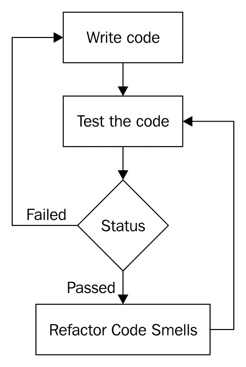
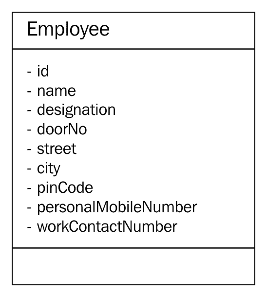
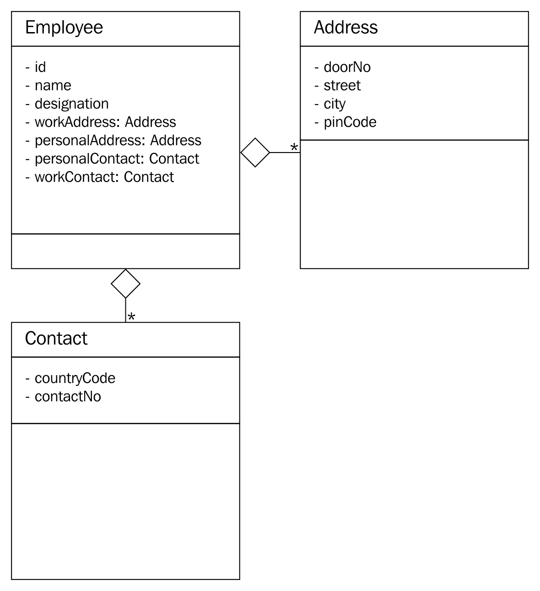
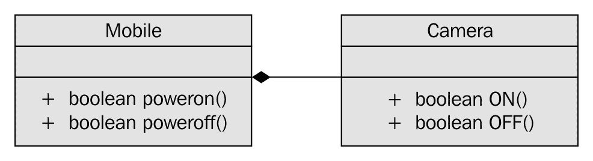

# 代码异味和干净代码实践

本章将涵盖以下主题：

+   代码异味简介

+   干净代码的概念

+   敏捷和干净代码实践的关系

+   SOLID 设计原则

+   代码重构

+   将代码异味重构为干净代码

+   将代码异味重构为设计模式

干净的代码是在功能上准确运行并且结构良好编写的源代码。通过彻底的测试，我们可以确保代码在功能上是正确的。我们可以通过代码自审、同行代码审查、代码分析，最重要的是通过代码重构来提高代码质量。

以下是一些干净代码的特质：

+   易于理解

+   易于增强

+   添加新功能不需要进行太多的代码更改

+   易于重用

+   自解释

+   在必要时有注释

最后，编写干净代码的最好之处是项目或产品中涉及的开发团队和客户都会很高兴。

# 代码重构

重构有助于改善源代码的结构质量。它不会修改代码的功能；它只是改善了代码的结构方面的质量。重构使代码更清晰，但有时它可能帮助您改善整体代码性能。但是，您需要明白性能调优与代码重构是不同的。

以下图表展示了开发过程的概述：



如何安全地进行代码重构？这个问题的答案如下：

+   拥抱 DevOps

+   适应测试驱动开发

+   适应行为驱动开发

+   使用验收测试驱动开发

# 代码异味

源代码有两个方面的质量，即**功能**和**结构**。源代码的功能质量可以通过根据客户规格对代码进行测试来实现。大多数开发人员犯的最大错误是他们倾向于在不进行重构的情况下将代码提交到版本控制软件；也就是说，他们一旦认为代码在功能上完成了，就提交了代码。

事实上，将代码提交到版本控制通常是一个好习惯，因为这是持续集成和 DevOps 可能的基础。将代码提交到版本控制后，绝大多数开发人员忽视的是对其进行重构。重构代码非常重要，以确保代码是干净的，没有这一点，敏捷是不可能的。

看起来像面条（意大利面）的代码需要更多的努力来增强或维护。因此，快速响应客户的请求在实际上是不可能的。这就是为什么保持干净的代码对于敏捷至关重要。这适用于您组织中遵循的任何敏捷框架。

# 什么是敏捷？

敏捷就是**快速失败**。一个敏捷团队将能够快速响应客户的需求，而不需要开发团队的任何花哨。团队使用的敏捷框架并不是很重要：Scrum、Kanban、XP 或其他什么。真正重要的是，你是否认真地遵循它们？

作为独立的软件顾问，我个人观察并学习了谁通常抱怨，以及他们为什么抱怨敏捷。

由于 Scrum 是最流行的敏捷框架之一，让我们假设一个产品公司，比如 ABC 科技私人有限公司，已决定为他们计划开发的新产品采用 Scrum。好消息是，ABC 科技，就像大多数组织一样，也有效地举行了冲刺计划会议、每日站立会议、冲刺回顾、冲刺回顾等所有其他 Scrum 仪式。假设 ABC 科技已确保他们的 Scrum 主管是 Scrum 认证的，产品经理是 Scrum 认证的产品负责人。太好了！到目前为止一切听起来都很好。

假设 ABC 科技产品团队不使用 TDD、BDD、ATDD 和 DevOps。你认为 ABC 科技产品团队是敏捷的吗？当然不是。事实上，开发团队将面临繁忙和不切实际的日程安排。最终，将会有非常高的离职率，因为团队不会开心。因此，客户也不会开心，产品的质量将遭受严重损害。

你认为 ABC 科技产品团队出了什么问题？

Scrum 有两套流程，即项目管理流程，由 Scrum 仪式涵盖。然后，还有流程的工程方面，大多数组织并不太关注。这可以从 IT 行业对**Certified SCRUM Developer**（CSD）认证的兴趣或认识程度中看出。IT 行业对 CSM、CSPO 或 CSP 所表现的兴趣几乎不会表现在 CSD 上，而开发人员是需要的。然而，我不认为单凭认证就能使某人成为专家；它只能显示个人或组织在接受敏捷框架并向客户交付优质产品方面的严肃性。

除非代码保持清晰，否则开发团队如何能够快速响应客户的需求？换句话说，除非开发团队的工程师在产品开发中采用 TDD、BDD、ATDD、持续集成和 DevOps，否则任何团队都无法在 Scrum 或其他敏捷框架中取得成功。

底线是，除非你的组织同等重视工程 Scrum 流程和项目管理 Scrum 流程，否则没有开发团队能够声称在敏捷中取得成功。

# SOLID 设计原则

SOLID 是一组重要的设计原则的首字母缩写，如果遵循，可以避免代码异味并改善代码质量，无论是在结构上还是在功能上。

如果您的软件架构符合 SOLID 设计原则的要求，代码异味可以被预防或重构为清晰的代码。以下原则统称为 SOLID 设计原则：

+   单一职责原则

+   开闭原则

+   里氏替换原则

+   接口隔离

+   依赖反转

最好的部分是，大多数设计模式也遵循并符合 SOLID 设计原则。

让我们逐个在以下部分讨论上述设计原则。

# 单一职责原则

**单一职责原则**简称为**SRP**。SRP 表示每个类必须只有一个责任。换句话说，每个类必须恰好代表一个对象。当一个类代表多个对象时，它往往违反 SRP 并为多个代码异味打开机会。

例如，让我们以一个简单的`Employee`类为例：



在上述类图中，`Employee`类似乎代表了三个不同的对象：`Employee`、`Address`和`Contact`。因此，它违反了 SRP。根据这个原则，可以从上述的`Employee`类中提取出另外两个类，即`Address`和`Contact`，如下所示：



为简单起见，本节中使用的类图不显示各个类支持的方法，因为我们的重点是通过一个简单的例子理解 SRP。

在上述重构后的设计中，Employee 有一个或多个地址（个人和官方）和一个或多个联系人（个人和官方）。最好的部分是，在重构设计后，每个类都抽象出一个且仅有一个责任。

# 开闭原则

当设计支持添加新功能而无需更改代码或不修改现有源代码时，架构或设计符合**开闭原则**（**OCP**）。正如您所知，根据您的专业行业经验，您遇到的每个项目都以某种方式是可扩展的。这就是您能够向产品添加新功能的方式。但是，当这种功能扩展是在不修改现有代码的情况下完成时，设计将符合 OCP。

让我们以一个简单的`Item`类为例，如下所示。为简单起见，`Item`类中只捕获了基本细节：

```cpp
#include <iostream>
#include <string>
using namespace std;
class Item {
       private:
         string name;
         double quantity;
         double pricePerUnit;
       public:
         Item ( string name, double pricePerUnit, double quantity ) {
         this-name = name; 
         this->pricePerUnit = pricePerUnit;
         this->quantity = quantity;
    }
    public double getPrice( ) {
           return quantity * pricePerUnit;
    }
    public String getDescription( ) {
           return name;
    }
};
```

假设前面的`Item`类是一个小商店的简单结算应用程序的一部分。由于`Item`类将能够代表钢笔、计算器、巧克力、笔记本等，它足够通用，可以支持商店处理的任何可计费项目。但是，如果商店老板应该收取**商品和服务税**（**GST**）或**增值税**（**VAT**），现有的`Item`类似乎不支持税收组件。一种常见的方法是修改`Item`类以支持税收组件。但是，如果我们修改现有代码，我们的设计将不符合 OCP。

因此，让我们重构我们的设计，使其符合 OCP，使用访问者设计模式。让我们探索重构的可能性，如下所示：

```cpp
#ifndef __VISITABLE_H
#define __VISITABLE_H
#include <string>
 using namespace std;
class Visitor;

class Visitable {
 public:
        virtual void accept ( Visitor * ) = 0;
        virtual double getPrice() = 0;
        virtual string getDescription() = 0;
 };
#endif
```

`Visitable`类是一个具有三个纯虚函数的抽象类。`Item`类将继承`Visitable`抽象类，如下所示：

```cpp
#ifndef __ITEM_H
#define __ITEM_H
#include <iostream>
#include <string>
using namespace std;
#include "Visitable.h"
#include "Visitor.h"
class Item : public Visitable {
 private:
       string name;
       double quantity;
       double unitPrice;
 public:
       Item ( string name, double quantity, double unitPrice );
       string getDescription();
       double getQuantity();
       double getPrice();
       void accept ( Visitor *pVisitor );
 };

 #endif
```

接下来，让我们看一下`Visitor`类，如下所示。它说未来可以实现任意数量的`Visitor`子类以添加新功能，而无需修改`Item`类：

```cpp
class Visitable;
#ifndef __VISITOR_H
#define __VISITOR_H
class Visitor {
 protected:
 double price;

 public:
 virtual void visit ( Visitable * ) = 0;
 virtual double getPrice() = 0;
 };

 #endif
```

`GSTVisitor`类是让我们在不修改`Item`类的情况下添加 GST 功能的类。`GSTVisitor`的实现如下所示：

```cpp
#include "GSTVisitor.h"

void GSTVisitor::visit ( Visitable *pItem ) {
     price = pItem->getPrice() + (0.18 * pItem->getPrice());
}

double GSTVisitor::getPrice() {
     return price;
}
```

`Makefile`如下所示：

```cpp
all: GSTVisitor.o Item.o main.o
     g++ -o gst.exe GSTVisitor.o Item.o main.o

GSTVisitor.o: GSTVisitor.cpp Visitable.h Visitor.h
     g++ -c GSTVisitor.cpp

Item.o: Item.cpp
     g++ -c Item.cpp

main.o: main.cpp
     g++ -c main.cpp

```

重构后的设计符合 OCP，因为我们将能够在不修改`Item`类的情况下添加新功能。想象一下：如果 GST 计算随时间变化，我们将能够添加`Visitor`的新子类并应对即将到来的变化，而无需修改`Item`类。

# 里斯科夫替换原则

**里斯科夫替换原则**（**LSP**）强调子类遵守基类建立的契约的重要性。在理想的继承层次结构中，随着设计重点向上移动类层次结构，我们应该注意泛化；随着设计重点向下移动类层次结构，我们应该注意专门化。

继承契约是两个类之间的，因此基类有责任强加所有子类都能遵守的规则，一旦达成协议，子类同样有责任遵守契约。违反这些设计原则的设计将不符合 LSP。

LSP 说，如果一个方法以基类或接口作为参数，应该能够无条件地用任何一个子类的实例替换它。

事实上，继承违反了最基本的设计原则：继承是弱内聚和强耦合的。因此，继承的真正好处是多态性，而代码重用与继承相比是微不足道的好处。当 LSP 被违反时，我们无法用其子类实例替换基类实例，最糟糕的是我们无法多态地调用方法。尽管付出了使用继承的设计代价，如果我们无法获得多态性的好处，就没有真正使用它的动机。

识别 LSP 违规的技术如下：

+   子类将具有一个或多个带有空实现的重写方法

+   基类将具有专门的行为，这将强制某些子类，无论这些专门的行为是否符合子类的兴趣

+   并非所有的泛化方法都可以被多态调用

以下是重构 LSP 违规的方法：

+   将基类中的专门方法移动到需要这些专门行为的子类中。

+   避免强制让关联不大的类参与继承关系。除非子类是基本类型，否则不要仅仅为了代码重用而使用继承。

+   不要寻求小的好处，比如代码重用，而是寻求在可能的情况下使用多态性、聚合或组合的方法。

# 接口隔离

**接口隔离**设计原则建议为特定目的建模许多小接口，而不是建模代表许多东西的一个更大的接口。在 C++中，具有纯虚函数的抽象类可以被视为接口。

让我们举一个简单的例子来理解接口隔离：

```cpp
#include <iostream>
#include <string>
using namespace std;

class IEmployee {
      public:
          virtual string getDoor() = 0;
          virtual string getStreet() = 0;
          virtual string getCity() = 0;
          virtual string getPinCode() = 0;
          virtual string getState() = 0;
          virtual string getCountry() = 0;
          virtual string getName() = 0;
          virtual string getTitle() = 0;
          virtual string getCountryDialCode() = 0;
          virtual string getContactNumber() = 0;
};
```

在前面的例子中，抽象类展示了一个混乱的设计。这个设计混乱是因为它似乎代表了许多东西，比如员工、地址和联系方式。前面的抽象类可以重构的一种方式是将单一接口分解为三个独立的接口：`IEmployee`、`IAddress`和`IContact`。在 C++中，接口只不过是具有纯虚函数的抽象类：

```cpp
#include <iostream>
#include <string>
#include <list>
using namespace std;

class IEmployee {
  private:
     string firstName, middleName, lastName,
     string title;
     string employeeCode;
     list<IAddress> addresses;
     list<IContact> contactNumbers;
  public:
     virtual string getAddress() = 0;
     virtual string getContactNumber() = 0;
};

class IAddress {
     private:
          string doorNo, street, city, pinCode, state, country;
     public:
          IAddress ( string doorNo, string street, string city, 
            string pinCode, string state, string country );
          virtual string getAddress() = 0;
};

class IContact {
      private:
           string countryCode, mobileNumber;
      public:
           IContact ( string countryCode, string mobileNumber );
           virtual string getMobileNumber() = 0;
};
```

在重构后的代码片段中，每个接口都代表一个对象，因此符合接口隔离设计原则。

# 依赖反转

一个好的设计将是高内聚且低耦合的。因此，我们的设计必须具有较少的依赖性。一个使代码依赖于许多其他对象或模块的设计被认为是一个糟糕的设计。如果**依赖反转**（**DI**）被违反，发生在依赖模块中的任何变化都会对我们的模块产生不良影响，导致连锁反应。

让我们举一个简单的例子来理解 DI 的威力。一个`Mobile`类"拥有"一个`Camera`对象，注意这里的拥有是组合。组合是一种独占所有权，`Camera`对象的生命周期由`Mobile`对象直接控制：



正如你在上图中所看到的，`Mobile`类有一个`Camera`的实例，使用的是组合的*拥有*形式，这是一种独占所有权的关系。

让我们看一下`Mobile`类的实现，如下所示：

```cpp
#include <iostream>
using namespace std;

class Mobile {
     private:
          Camera camera;
     public:
          Mobile ( );
          bool powerOn();
          bool powerOff();
};

class Camera {
      public:
          bool ON();
          bool OFF();
};

bool Mobile::powerOn() {
       if ( camera.ON() ) {
           cout << "\nPositive Logic - assume some complex Mobile power ON logic happens here." << endl;
           return true;
       }
       cout << "\nNegative Logic - assume some complex Mobile power OFF logic happens here." << endl;
            << endl;
       return false;
}

bool Mobile::powerOff() {
      if ( camera.OFF() ) {
              cout << "\nPositive Logic - assume some complex Mobile power OFF             logic happens here." << endl;
      return true;
 }
      cout << "\nNegative Logic - assume some complex Mobile power OFF logic happens here." << endl;
      return false;
}

bool Camera::ON() {
     cout << "\nAssume Camera class interacts with Camera hardware here\n" << endl;
     cout << "\nAssume some Camera ON logic happens here" << endl;
     return true;
}

bool Camera::OFF() {
 cout << "\nAssume Camera class interacts with Camera hardware here\n" << endl;
 cout << "\nAssume some Camera OFF logic happens here" << endl;
 return true;
}
```

在前面的代码中，`Mobile`对`Camera`有实现级别的了解，这是一个糟糕的设计。理想情况下，`Mobile`应该通过一个接口或具有纯虚函数的抽象类与`Camera`进行交互，因为这样可以将`Camera`的实现与其契约分离。这种方法有助于替换`Camera`而不影响`Mobile`，也为支持一系列`Camera`子类提供了机会，而不是单一的摄像头。

想知道为什么它被称为**依赖注入**（**DI**）或**控制反转**（**IOC**）吗？之所以称之为依赖注入，是因为目前`Camera`的生命周期由`Mobile`对象控制；也就是说，`Camera`由`Mobile`对象实例化和销毁。在这种情况下，如果没有`Camera`，几乎不可能对`Mobile`进行单元测试，因为`Mobile`对`Camera`有硬依赖。除非实现了`Camera`，否则无法测试`Mobile`的功能，这是一种糟糕的设计方法。当我们反转依赖时，它让`Mobile`对象使用`Camera`对象，同时放弃了控制`Camera`对象的生命周期的责任。这个过程被称为 IOC。优点是你将能够独立单元测试`Mobile`和`Camera`对象，它们将由于 IOC 而具有强大的内聚性和松散的耦合性。

让我们用 DI 设计原则重构前面的代码：

```cpp
#include <iostream>
using namespace std;

class ICamera {
 public:
 virtual bool ON() = 0;
 virtual bool OFF() = 0;
};

class Mobile {
      private:
 ICamera *pCamera;
      public:
 Mobile ( ICamera *pCamera );
            void setCamera( ICamera *pCamera ); 
            bool powerOn();
            bool powerOff();
};

class Camera : public ICamera {
public:
            bool ON();
            bool OFF();
};

//Constructor Dependency Injection
Mobile::Mobile ( ICamera *pCamera ) {
 this->pCamera = pCamera;
}

//Method Dependency Injection
Mobile::setCamera( ICamera *pCamera ) {
 this->pCamera = pCamera;
}

bool Mobile::powerOn() {
 if ( pCamera->ON() ) {
            cout << "\nPositive Logic - assume some complex Mobile power ON logic happens here." << endl;
            return true;
      }
cout << "\nNegative Logic - assume some complex Mobile power OFF logic happens here." << endl;
<< endl;
      return false;
}

bool Mobile::powerOff() {
 if ( pCamera->OFF() ) {
           cout << "\nPositive Logic - assume some complex Mobile power OFF logic happens here." << endl;
           return true;
}
      cout << "\nNegative Logic - assume some complex Mobile power OFF logic happens here." << endl;
      return false;
}

bool Camera::ON() {
       cout << "\nAssume Camera class interacts with Camera hardware here\n" << endl;
       cout << "\nAssume some Camera ON logic happens here" << endl;
       return true;
}

bool Camera::OFF() {
       cout << "\nAssume Camera class interacts with Camera hardware here\n" << endl;
       cout << "\nAssume some Camera OFF logic happens here" << endl;
       return true;
}
```

在前述代码片段中，对更改进行了加粗标记。IOC 是一种非常强大的技术，它让我们解耦依赖，正如刚才所示；然而，它的实现非常简单。

# 代码异味

代码异味是指指缺乏结构质量的代码；然而，代码可能在功能上是正确的。代码异味违反了 SOLID 设计原则，因此必须认真对待，因为编写不好的代码会导致长期的高昂维护成本。然而，代码异味可以重构为干净的代码。

# 注释异味

作为独立的软件顾问，我有很多机会与优秀的开发人员、架构师、质量保证人员、系统管理员、首席技术官和首席执行官、企业家等进行互动和学习。每当我们的讨论涉及到“什么是干净的代码或好的代码？”这个十亿美元的问题时，我基本上在全球范围内得到了一个共同的回答，“好的代码将会有良好的注释。”虽然这部分是正确的，但问题也正是从这里开始。理想情况下，干净的代码应该是不言自明的，不需要任何注释。然而，有些情况下注释可以提高整体的可读性和可维护性。并非所有的注释都是代码异味，因此有必要区分好的注释和坏的注释。看看下面的代码片段：

```cpp
if ( condition1 ) {
     // some block of code
}
else if ( condition2 ) {
     // some block of code
}
else {
     // OOPS - the control should not reach here ### Code Smell ###
}
```

我相信你一定遇到过这些评论。毋庸置疑，前述情况是代码异味。理想情况下，开发人员应该重构代码来修复错误，而不是写这样的评论。有一次我在半夜调试一个关键问题，我注意到控制流达到了一个神秘的空代码块，里面只有一个注释。我相信你也遇到过更有趣的代码，可以想象它带来的挫败感；有时候，你也会写这种类型的代码。

一个好的注释会表达代码为什么以特定方式编写，而不是表达代码如何做某事。传达代码如何做某事的注释是代码异味，而传达代码为什么部分的注释是一个好的注释，因为代码没有表达为什么部分；因此，一个好的注释提供了附加值。

# 长方法

当一个方法被确定具有多个责任时，它就被认为是长的。通常，一个方法如果有超过 20-25 行的代码，往往会有多个责任。话虽如此，代码行数更多的方法就更长。这并不意味着代码行数少于 25 行的方法就不长。看看下面的代码片段：

```cpp
void Employee::validateAndSave( ) {
        if ( ( street != "" ) && ( city != "" ) )
              saveEmployeeDetails();
}
```

显然，前述方法有多个责任；也就是说，它似乎在验证和保存细节。在保存之前进行验证并没有错，但同一个方法不应该同时做这两件事。因此，前述方法可以重构为两个具有单一责任的较小方法：

```cpp
private:
void Employee::validateAddress( ) {
     if ( ( street == "" ) || ( city == "" ) )
          throw exception("Invalid Address");
}

public:
void Employee::save() {
      validateAddress();
}
```

在前面的代码中显示的每个重构方法都只负责一项任务。将`validateAddress()`方法变成一个谓词方法可能很诱人；也就是说，一个返回布尔值的方法。然而，如果`validateAddress()`被写成一个谓词方法，那么客户端代码将被迫进行`if`检查，这是一种代码异味。通过返回错误代码来处理错误不被认为是面向对象的代码，因此错误处理必须使用 C++异常来完成。

# 长参数列表

面向对象的方法接收较少的参数，因为一个设计良好的对象将具有较强的内聚性和较松散的耦合性。接收太多参数的方法是一种症状，表明做出决定所需的知识是从外部获得的，这意味着当前对象本身没有所有的知识来做出决定。

这意味着当前对象的内聚性较弱，耦合性较强，因为它依赖于太多外部数据来做出决定。成员函数通常倾向于接收较少的参数，因为它们通常需要的数据成员是成员变量。因此，将成员变量传递给成员函数的需求听起来是不自然的。

让我们看看方法倾向于接收过多参数的一些常见原因。最常见的症状和原因列在这里：

+   对象的内聚性较弱，耦合性较强；也就是说，它过于依赖其他对象

+   这是一个静态方法

+   这是一个放错位置的方法；也就是说，它不属于该对象

+   这不是面向对象的代码

+   SRP 被违反

重构接收**长参数列表**（LPL）的方法的方式如下：

+   避免逐个提取和传递数据；考虑传递整个对象，让方法提取所需的细节

+   识别提供给接收 LPL 方法的参数的对象，并考虑将方法移至该对象

+   将参数列表分组并创建参数对象，并将接收 LPL 的方法移至新对象内部

# 重复代码

重复代码是一个常见的反复出现的代码异味，不需要太多解释。仅仅复制和粘贴代码文化本身不能完全归咎于重复代码。重复代码使得代码维护更加繁琐，因为相同的问题可能需要在多个地方修复，并且集成新功能需要太多的代码更改，这往往会破坏意外的功能。重复代码还会增加应用程序的二进制占用空间，因此必须对其进行重构以获得清晰的代码。

# 条件复杂性

条件复杂性代码异味是指复杂的大条件随着时间的推移趋于变得更大更复杂。这种代码异味可以通过策略设计模式进行重构。由于策略设计模式涉及许多相关对象，因此可以使用`工厂`方法，并且**空对象设计模式**可以用于处理`工厂`方法中不支持的子类：

```cpp
//Before refactoring
void SomeClass::someMethod( ) {
      if (  ! conition1 && condition2 )
         //perform some logic
      else if ( ! condition3 && condition4 && condition5 )
         //perform some logic
      else
         //do something 
} 

//After refactoring
void SomeClass::someMethod() {
     if ( privateMethod1() )
          //perform some logic
     else if ( privateMethod2() )
          //perform some logic
     else
         //do something
}
```

# 大类

大类代码异味使得代码难以理解，更难以维护。一个大类可能为一个类做太多的事情。大类可以通过将其拆分为具有单一职责的较小类来进行重构。

# 死代码

死代码是被注释掉或者从未被使用或集成的代码。它可以通过代码覆盖工具来检测。通常，开发人员由于缺乏信心而保留这些代码实例，这在传统代码中更常见。由于每个代码都在版本控制软件工具中进行跟踪，死代码可以被删除，如果需要的话，总是可以从版本控制软件中检索回来。

# 原始执念

**原始执念**（PO）是一种错误的设计选择：使用原始数据类型来表示复杂的领域实体。例如，如果使用字符串数据类型来表示日期，虽然起初听起来像一个聪明的想法，但从长远来看，这会带来很多维护麻烦。

假设您使用字符串数据类型来表示日期，将会面临以下问题：

+   您需要根据日期对事物进行排序

+   引入字符串后，日期算术将变得非常复杂

+   根据区域设置支持各种日期格式将会变得复杂，如果使用字符串

理想情况下，日期必须由一个类来表示，而不是一个原始数据类型。

# 数据类

数据类只提供获取器和设置器函数。虽然它们非常适用于在不同层之间传输数据，但它们往往会给依赖于数据类的类增加负担。由于数据类不提供任何有用的功能，与数据类交互或依赖的类最终会使用数据类的数据添加功能。这样，围绕数据类的类违反了单一职责原则，并且往往会成为一个大类。

# 特性嫉妒

某些类被称为“特性嫉妒”，如果它们对其他类的内部细节了解过多。一般来说，当其他类是数据类时，就会发生这种情况。代码异味是相互关联的；消除一个代码异味往往会吸引其他代码异味。

# 总结

在本章中，您学习了以下主题：

+   代码异味和重构代码的重要性

+   SOLID 设计原则：

+   单一职责原则

+   开闭原则

+   里氏替换

+   接口隔离

+   依赖注入

+   各种代码异味：

+   注释异味

+   长方法

+   长参数列表

+   重复代码

+   条件复杂性

+   大类

+   死代码

+   面向对象的代码异味的原始执念

+   数据类

+   特性嫉妒

您还学习了许多重构技术，这将帮助您保持代码更清晰。愉快的编码！
