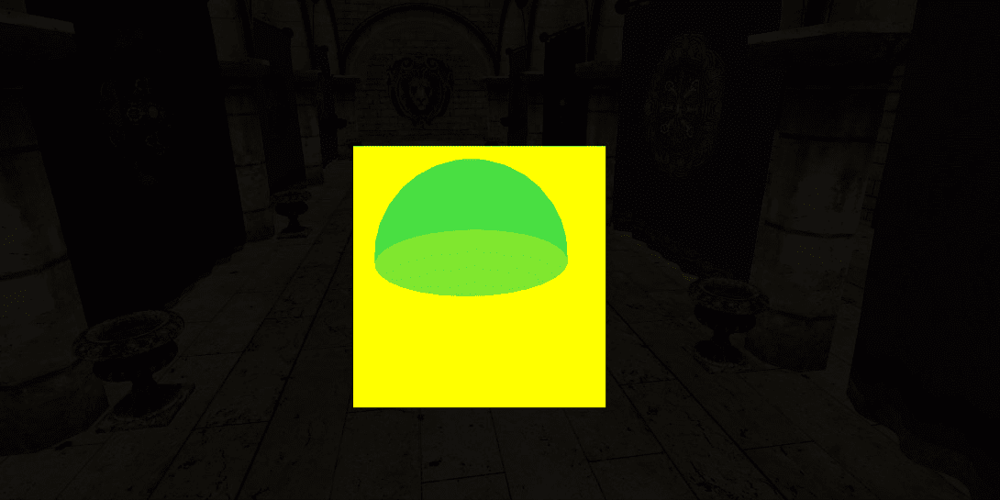
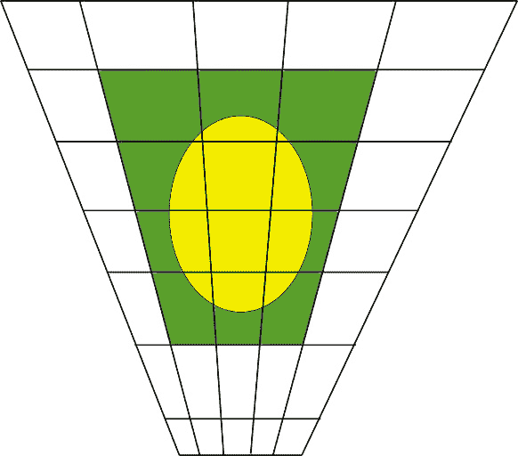
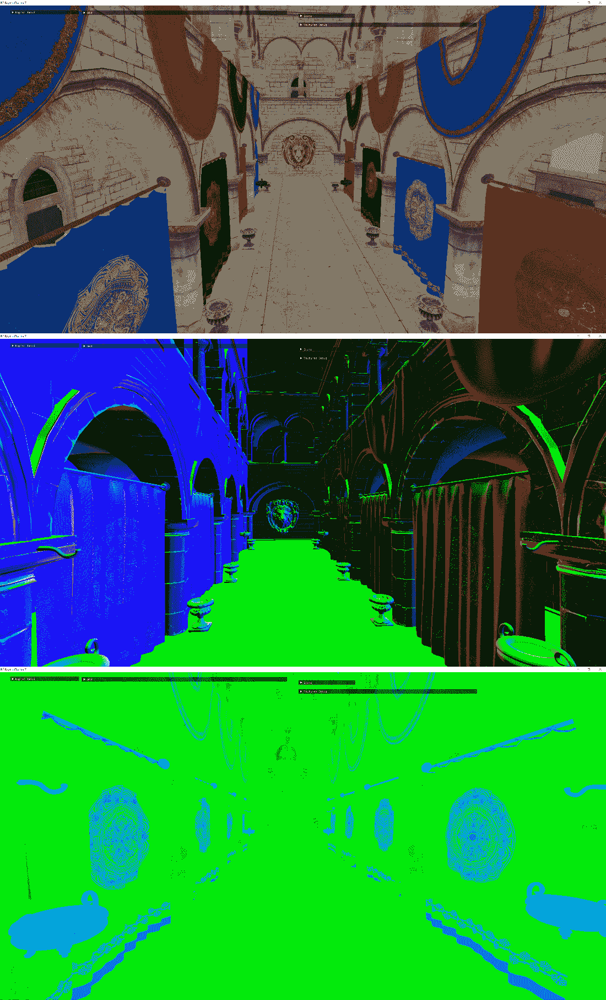

# 第七章：使用集群延迟渲染渲染许多光源

到目前为止，我们的场景一直是由一个点光源照亮的。虽然到目前为止这已经足够好了，因为我们更关注于构建渲染引擎的基础，但这并不是一个非常吸引人和逼真的用例。现代游戏在给定场景中可以拥有数百个光源，并且高效地执行照明阶段并在帧预算内完成是非常重要的。

在本章中，我们将首先描述在延迟和前向着色中常用的最常见技术。我们将突出每种技术的优缺点，以便您可以确定哪种最适合您的需求。

接下来，我们将概述我们的 G 缓冲区设置。虽然 G 缓冲区从一开始就存在，但我们还没有详细讨论其实现。现在是深入了解的好时机，因为延迟渲染器的选择将影响我们聚类照明的策略。

最后，我们将详细描述我们的聚类算法，并突出代码中的相关部分。虽然算法本身并不复杂，但有很多细节对于获得稳定的解决方案非常重要。

在本章中，我们将介绍以下主要主题：

+   集成照明的简史

+   我们的 G 缓冲区设置和实现

+   使用屏幕瓦片和 Z 分箱实现集群照明

# 技术要求

到本章结束时，您将对我们 G 缓冲区实现有一个稳固的理解。您还将学习如何实现一个能够处理数百个光源的尖端光聚类解决方案。

本章的代码可以在以下网址找到：[`github.com/PacktPublishing/Mastering-Graphics-Programming-with-Vulkan/tree/main/source/chapter7`](https://github.com/PacktPublishing/Mastering-Graphics-Programming-with-Vulkan/tree/main/source/chapter7)。

# 集成照明的简史

在本节中，我们将探讨集群照明是如何产生的以及它是如何随着时间演变的背景。

在实时应用中，直到 2000 年代初，处理照明最常见的方式是使用所谓的**前向渲染**，这是一种在每个屏幕对象上渲染所有所需信息的技术，包括光照信息。这种方法的缺点是它将能够处理的光源数量限制在一个很低的数字，例如 4 或 8，在 2000 年代初这个数字已经足够了。

延迟渲染的概念，以及更具体地说，只对同一个像素进行一次着色，早在 1988 年由迈克尔·德林及其同事在一篇开创性的论文《三角形处理器和法线向量着色器：一种用于高性能图形的 VLSI 系统》（*The triangle processor and normal vector shader: a VLSI system for high performance graphics*）中就已经被提出，尽管当时还没有使用“延迟”这个术语。

另一个关键概念，**G 缓冲区**或**几何缓冲区**，是由 Saito Takafumi 和 Takahashi Tokiichiro 在另一篇开创性的论文《3D 形状的可理解渲染》中提出的。在这篇论文中，作者为每个像素缓存深度和法线以进行后处理图像——在这种情况下，是为了向图像添加视觉辅助和可理解性。

尽管第一款具有延迟渲染器的商业游戏是 2001 年在原始 Xbox 上的《Shrek》，但随着游戏《Stalker》及其配套论文《Stalker 中的延迟着色》([`developer.nvidia.com/gpugems/gpugems2/part-ii-shading-lighting-and-shadows/chapter-9-deferred-shading-stalker`](https://developer.nvidia.com/gpugems/gpugems2/part-ii-shading-lighting-and-shadows/chapter-9-deferred-shading-stalker))的流行，以及 2010 年 Siggraph 上 CryEngine 演示的《达到光速》([`advances.realtimerendering.com/s2010/Kaplanyan-CryEngine3%28SIGGRAPH%202010%20Advanced%20RealTime%20Rendering%20Course%29.pdf`](http://advances.realtimerendering.com/s2010/Kaplanyan-CryEngine3%28SIGGRAPH%202010%20Advanced%20RealTime%20Rendering%20Course%29.pdf))，它变得越来越受欢迎。

在 2000 年代末/2010 年代初，延迟渲染非常流行，基本上，所有引擎都在实现它的某种变体。

当 AMD 在 2012 年推出名为“Leo”的演示时，前向渲染在 2012 年卷土重来，得益于新的**计算着色器**技术，他们为每个屏幕空间瓦片引入了光列表并创建了**Forward+**。

AMD Leo 论文可以在这里找到：[`takahiroharada.files.wordpress.com/2015/04/forward_plus.pdf`](https://takahiroharada.files.wordpress.com/2015/04/forward_plus.pdf).

在那篇论文发表后的几周，第一款使用 Forward+的商业游戏是《Dirt Showdown》，但仅限于 PC 版本，因为游戏机仍然没有支持该领域的 API：[`web.archive.org/web/20210621112015/https://www.rage3d.com/articles/gaming/codemaster_dirt_showdown_tech_review/`](https://web.archive.org/web/20210621112015/https://www.rage3d.com/articles/gaming/codemaster_dirt_showdown_tech_review/)。

随着，前向+技术重新得到应用，因为光限制已经消失，并且它在不同领域增加了许多算法探索（例如，用于延迟深度预处理的后期处理抗锯齿）。

在接下来的几年里，开发了更精细的细分算法，瓦片变成了簇，从简单的 2D 屏幕空间瓦片发展到完全的视锥体形状的 3D 簇。

这个概念随着 Emil Persson 的《Just Cause 3》论文而闻名，[`www.humus.name/Articles/PracticalClusteredShading.pdf`](https://www.humus.name/Articles/PracticalClusteredShading.pdf)，其他人进一步增强了这个概念，用于延迟和前向渲染([`www.cse.chalmers.se/~uffe/clustered_shading_preprint.pdf`](https://www.cse.chalmers.se/~uffe/clustered_shading_preprint.pdf))。

聚类是一个很好的想法，但拥有 3D 网格的内存消耗可能很大，尤其是在渲染分辨率不断提高的情况下。

当前聚类技术的先进状态来自 Activision，这是我们选择解决方案，我们将在本章的“实现轻量级聚类”部分详细看到它。

现在我们已经提供了实时光照渲染技术的简要历史概述，我们将在下一节更深入地探讨前向渲染和延迟渲染之间的区别。

## 前向和延迟技术之间的区别

在讨论了前向渲染和延迟渲染技术的历史之后，我们想强调它们的关键区别，并讨论它们共同的问题：**光照分配**。

前向渲染的主要优点如下：

+   渲染材料时的完全自由

+   不透明和透明对象相同的渲染路径

+   支持**多采样抗锯齿**（**MSAA**）

+   GPU 内的内存带宽较低

前向渲染的主要缺点如下：

+   可能需要深度预处理步骤来减少着色片段的数量。如果没有这个预处理步骤，包含大量对象的场景可能会浪费大量处理时间，因为它们着色了不可见对象的片段。因此，在帧开始时执行一个仅写入深度缓冲区的步骤。

然后将`深度测试`函数设置为相等，这样只有可见对象的片段才会着色。根据场景的复杂度，这个预处理步骤可能会很昂贵，在某些情况下，使用简化几何体来降低此步骤的成本，但会略微降低结果的准确性。你还必须小心，并确保在图形管线中未禁用早期 Z 测试。

这发生在从片段着色器写入深度缓冲区时，或者当片段着色器包含丢弃指令时。

+   场景着色的复杂性是对象数量（*N*）乘以光照数量（*L*）。由于我们事先不知道哪些光照会影响给定的片段，因此必须为每个对象处理所有光照。

+   着色器变得越来越复杂，需要执行大量操作，因此 GPU 寄存器压力（使用的寄存器数量）非常高，影响性能。

延迟渲染（有时被称为**延迟着色**）主要是为了解耦几何形状的渲染和光照计算。在延迟渲染中，我们创建多个渲染目标。通常，我们有一个用于漫反射、法线、PBR 参数（粗糙度、金属度和遮挡 - 见*第二章*，*改进资源管理*，了解更多详情）和深度的渲染目标。

一旦创建了这些渲染目标，对于每个片段，我们处理场景中的灯光。我们仍然面临之前的问题，因为我们仍然不知道哪些灯光影响给定的着色器；然而，我们的场景复杂度已从*N x L*变为*N + L*。

延迟着色的主要优势如下：

+   降低着色复杂性

+   无需深度预遍历

+   较简单的着色器，因为将信息写入 G 缓冲区和处理灯光是分开的操作

然而，这种方法也有一些缺点，如下：

+   **高内存使用**：我们列出了三个必须存储在内存中的渲染目标。随着现代游戏分辨率的提高，这些开始累积，尤其是在需要更多渲染目标用于其他技术时——例如，用于**时间反走样**（**TAA**）的运动矢量，这将在后面的章节中讨论。因此，开发者倾向于压缩一些数据，这有助于减少 G 缓冲区所需的内存量。

+   **法线精度损失**：法线通常作为完整浮点数（或可能作为 16 位浮点数）作为几何的一部分进行编码。在写入法线渲染目标时为了节省内存，这些值被压缩到 8 位，显著降低了这些值的精度。

为了进一步减少内存使用，开发者利用法线是归一化的这一事实。这允许我们只存储两个值并重建第三个值。还有其他可以用来压缩法线的技术，这些将在*进一步阅读*部分中提及。我们将在下一节中详细解释我们使用的技术。

+   透明物体需要一个单独的遍历，并且需要使用前向技术进行着色。

+   特殊材质需要将所有参数打包到 G 缓冲区中。

如您可能已注意到的，这两个技术都存在一个共同问题：在处理单个对象或片段时，我们必须遍历所有灯光。我们现在将描述两种最常用的解决此问题的技术：瓦片和簇。

### 光瓦片

减少给定片段处理灯光数量的一个方法是在屏幕空间中创建一个网格，并确定哪些灯光影响给定的瓦片。在渲染场景时，我们确定我们正在着色的片段属于哪个瓦片，并且只遍历覆盖该瓦片的灯光。

下图显示了场景中一个灯光（绿色球体）及其覆盖的屏幕区域（黄色）。我们将使用这些数据来确定哪些瓦片受到给定灯光的影响。



图 7.1 – 屏幕空间中点光源覆盖的区域

瓦片的构建可以在 CPU 上完成，也可以在 GPU 上的计算着色器中完成。瓦片数据可以存储在一个扁平数组中；我们将在本章后面更详细地解释这个数据结构。

传统光源瓦片需要深度预遍历来确定最小和最大 *Z* 值。这种方法可能会出现深度不连续性；然而，最终的数据结构通常是密集排列的，这意味着我们没有浪费内存。

### 光簇

光簇将视锥体细分为 3D 网格。至于瓦片，光源被分配到每个单元格，在渲染时，我们只遍历给定片段所属的灯光。

下图说明了相机轴之一簇的形状。每个簇由一个较小的视锥体组成：



图 7.2 – 被点光源覆盖的视锥体簇

光源可以存储在 3D 网格中（例如，3D 纹理）或更复杂的数据结构中——例如，**边界体积层次**（**BVH**）或八叉树。

构建光簇时，我们不需要深度预遍历。大多数实现为每个光源构建**轴对齐边界框**（**AABBs**），并将它们投影到裁剪空间。这种方法允许轻松的 3D 查找，并且根据可以分配给数据结构的内存量，可以实现相当准确的结果。

在本节中，我们强调了前向和延迟渲染的优缺点。我们介绍了可以帮助减少每个片段需要处理的灯光数量的分块和聚类技术。

在下一节中，我们将概述我们的 G 缓冲区实现。

# 实现 G 缓冲区

从这个项目的开始，我们就决定要实现一个延迟渲染器。这是更常见的方法之一，其中一些渲染目标将在后面的章节中用于其他技术：

1.  在 Vulkan 中设置多个渲染目标的第一步是创建帧缓冲区——存储 G 缓冲区数据的纹理——和渲染通道。

这一步骤是自动化的，归功于帧图（参见*第四章**，实现帧图*，详情）；然而，我们想强调我们使用了一个简化渲染通道和帧缓冲区创建的新 Vulkan 扩展。该扩展是`VK_KHR_dynamic_rendering`。

注意

这个扩展已成为 Vulkan 1.3 的核心规范的一部分，因此可以在数据结构和 API 调用中省略`KHR`后缀。

1.  使用这个扩展，我们不必担心提前创建渲染通道和帧缓冲区。我们将首先分析创建管道时所需的变化：

    ```cpp
    VkPipelineRenderingCreateInfoKHR pipeline_rendering_create_info{
    ```

    ```cpp
      VK_STRUCTURE_TYPE_PIPELINE_RENDERING_CREATE_INFO_KHR };
    ```

    ```cpp
    pipeline_rendering_create_info.viewMask = 0;
    ```

    ```cpp
    pipeline_rendering_create_info.colorAttachmentCount =
    ```

    ```cpp
        creation.render_pass.num_color_formats;
    ```

    ```cpp
    pipeline_rendering_create_info.pColorAttachmentFormats
    ```

    ```cpp
        = creation.render_pass.num_color_formats > 0 ?
    ```

    ```cpp
            creation.render_pass.color_formats : nullptr;
    ```

    ```cpp
    pipeline_rendering_create_info.depthAttachmentFormat =
    ```

    ```cpp
        creation.render_pass.depth_stencil_format;
    ```

    ```cpp
    pipeline_rendering_create_info.stencilAttachmentFormat
    ```

    ```cpp
        = VK_FORMAT_UNDEFINED;
    ```

    ```cpp
    pipeline_info.pNext = &pipeline_rendering_create_info;
    ```

我们必须填充一个`VkPipelineRenderingCreateInfoKHR`结构，其中包含我们将要使用的附件数量及其格式。我们还需要指定深度和模板格式，如果使用的话。

一旦填充了这个结构，我们就将其链接到 `VkGraphicsPipelineCreateInfo` 结构。当使用此扩展时，我们不填充 `VkGraphicsPipelineCreateInfo::renderPass` 成员。

1.  在渲染时，我们不是调用 `vkCmdBeginRenderPass`，而是调用一个新的 API，`vkCmdBeginRenderingKHR`。我们首先创建一个数组来保存我们的 `attachments` 详细信息：

    ```cpp
    Array<VkRenderingAttachmentInfoKHR> color_attachments_info;
    ```

    ```cpp
    color_attachments_info.init( device->allocator,
    ```

    ```cpp
        framebuffer->num_color_attachments,
    ```

    ```cpp
            framebuffer->num_color_attachments );
    ```

1.  接下来，我们为每个条目填充每个附加的详细信息：

    ```cpp
    for ( u32 a = 0; a < framebuffer->
    ```

    ```cpp
        num_color_attachments; ++a ) {
    ```

    ```cpp
            Texture* texture = device->
    ```

    ```cpp
                access_texture( framebuffer->
    ```

    ```cpp
                    color_attachments[a] );
    ```

    ```cpp
        VkAttachmentLoadOp color_op = ...;
    ```

    ```cpp
    VkRenderingAttachmentInfoKHR&
    ```

    ```cpp
    color_attachment_info = color_attachments_info[ a ];
    ```

    ```cpp
    color_attachment_info.sType =
    ```

    ```cpp
        VK_STRUCTURE_TYPE_RENDERING_ATTACHMENT_INFO_KHR;
    ```

    ```cpp
    color_attachment_info.imageView = texture->
    ```

    ```cpp
        vk_image_view;
    ```

    ```cpp
    color_attachment_info.imageLayout =
    ```

    ```cpp
        VK_IMAGE_LAYOUT_COLOR_ATTACHMENT_OPTIMAL;
    ```

    ```cpp
    color_attachment_info.resolveMode =
    ```

    ```cpp
        VK_RESOLVE_MODE_NONE;
    ```

    ```cpp
    color_attachment_info.loadOp = color_op;
    ```

    ```cpp
    color_attachment_info.storeOp =
    ```

    ```cpp
        VK_ATTACHMENT_STORE_OP_STORE;
    ```

    ```cpp
    color_attachment_info.clearValue = render_pass->
    ```

    ```cpp
        output.color_operations[ a ] ==
    ```

    ```cpp
            RenderPassOperation::Enum::Clear ? clears[ 0 ]
    ```

    ```cpp
                : VkClearValue{ };
    ```

    ```cpp
    }
    ```

1.  我们必须填充一个类似的数据结构用于 `depth` 附加：

    ```cpp
    VkRenderingAttachmentInfoKHR depth_attachment_info{
    ```

    ```cpp
        VK_STRUCTURE_TYPE_RENDERING_ATTACHMENT_INFO_KHR };
    ```

    ```cpp
    bool has_depth_attachment = framebuffer->
    ```

    ```cpp
        depth_stencil_attachment.index != k_invalid_index;
    ```

    ```cpp
    if ( has_depth_attachment ) {
    ```

    ```cpp
        Texture* texture = device->access_texture(
    ```

    ```cpp
            framebuffer->depth_stencil_attachment );
    ```

    ```cpp
        VkAttachmentLoadOp depth_op = ...;
    ```

    ```cpp
    depth_attachment_info.imageView = texture->
    ```

    ```cpp
        vk_image_view;
    ```

    ```cpp
    depth_attachment_info.imageLayout =
    ```

    ```cpp
        VK_IMAGE_LAYOUT_DEPTH_STENCIL_ATTACHMENT_OPTIMAL;
    ```

    ```cpp
    depth_attachment_info.resolveMode =
    ```

    ```cpp
        VK_RESOLVE_MODE_NONE;
    ```

    ```cpp
    depth_attachment_info.loadOp = depth_op;
    ```

    ```cpp
    depth_attachment_info.storeOp =
    ```

    ```cpp
        VK_ATTACHMENT_STORE_OP_STORE;
    ```

    ```cpp
    depth_attachment_info.clearValue = render_pass->
    ```

    ```cpp
        output.depth_operation ==
    ```

    ```cpp
            RenderPassOperation::Enum::Clear ? clears[ 1 ]
    ```

    ```cpp
                : VkClearValue{ };
    ```

    ```cpp
    }
    ```

1.  最后，我们填充 `VkRenderingInfoKHR` 结构，该结构将被传递给 `vkCmdBeginRenderingKHR`：

    ```cpp
    VkRenderingInfoKHR rendering_info{
    ```

    ```cpp
        VK_STRUCTURE_TYPE_RENDERING_INFO_KHR };
    ```

    ```cpp
    rendering_info.flags = use_secondary ?
    ```

    ```cpp
        VK_RENDERING_CONTENTS_SECONDARY_COMMAND
    ```

    ```cpp
            _BUFFERS_BIT_KHR : 0;
    ```

    ```cpp
    rendering_info.renderArea = { 0, 0, framebuffer->
    ```

    ```cpp
        width, framebuffer->height };
    ```

    ```cpp
    rendering_info.layerCount = 1;
    ```

    ```cpp
    rendering_info.viewMask = 0;
    ```

    ```cpp
    rendering_info.colorAttachmentCount = framebuffer->
    ```

    ```cpp
        num_color_attachments;
    ```

    ```cpp
    rendering_info.pColorAttachments = framebuffer->
    ```

    ```cpp
        num_color_attachments > 0 ?
    ```

    ```cpp
            color_attachments_info.data : nullptr;
    ```

    ```cpp
    rendering_info.pDepthAttachment =
    ```

    ```cpp
        has_depth_attachment ? &depth_attachment_info :
    ```

    ```cpp
            nullptr;
    ```

    ```cpp
    rendering_info.pStencilAttachment = nullptr;
    ```

一旦渲染完成，我们将调用 `vkCmdEndRenderingKHR` 而不是 `vkCmdEndRenderPass`。

现在我们已经设置了渲染目标，我们将描述它们在我们 G 缓冲区着色器中的使用。我们的 G 缓冲区有四个渲染目标加上深度缓冲区。正如我们在上一节中提到的，不需要深度预传递，尽管您可能会注意到在早期的一些章节中为了测试目的已经启用了它。

第一步是在片段着色器中声明多个输出：

```cpp
layout (location = 0) out vec4 color_out;
layout (location = 1) out vec2 normal_out;
layout (location = 2) out vec4
    occlusion_roughness_metalness_out;
layout (location = 3) out vec4 emissive_out;
```

位置索引必须与调用 `vkCmdBeginRenderingKHR`（或创建渲染通道和帧缓冲区对象）时附加的顺序相对应。向给定的渲染目标写入是通过写入我们刚刚声明的变量之一来完成的：

```cpp
colour_out = texture(global_textures[nonuniformEXT
    (albedo_texture)], uv);
```

正如我们在上一节中提到的，我们必须注意内存使用。如您所注意到的，我们只为法线存储两个通道。我们使用八面体编码，只允许存储两个值。我们可以在照明通道中重建完整的法线。

这里是编码函数：

```cpp
vec2 octahedral_encode(vec3 n) {
    // Project the sphere onto the octahedron, and then
       onto the xy plane
    vec2 p = n.xy * (1.0f / (abs(n.x) + abs(n.y) +
        abs(n.z)));
    // Reflect the folds of the lower hemisphere over the
       diagonals
    return (n.z < 0.0f) ? ((1.0 - abs(p.yx)) *
        sign_not_zero(p)) : p;
}
```

以及解码函数：

```cpp
vec3 octahedral_decode(vec2 f) {
    vec3 n = vec3(f.x, f.y, 1.0 - abs(f.x) - abs(f.y));
    float t = max(-n.z, 0.0);
    n.x += n.x >= 0.0 ? -t : t;
    n.y += n.y >= 0.0 ? -t : t;
    return normalize(n);
}
```

以下表格展示了我们 G 缓冲区传递的数据排列：


表 7.1 – G 缓冲区内存布局

这里是我们渲染目标的截图：



图 7.3 – 从上到下：反射率、法线和组合遮挡（红色）、粗糙度（绿色）和金属度（蓝色）

我们可能进一步减少渲染目标的数量：我们知道在 G 缓冲区传递中，我们只对不透明对象进行着色，因此不需要 alpha 通道。也没有什么阻止我们混合不同渲染目标的数据——例如，我们可能有以下内容：

+   `r`、`g`、`b` 和 `normal_1`

+   `normal_2`、`roughness`、`metalness` 和 `occlusion`

+   `emissive`

我们还可以尝试使用不同的纹理格式（例如 **R11G11B10**）来提高我们数据精度。我们鼓励您尝试不同的解决方案，并找到最适合您用例的方法！

在本节中，我们介绍了一个新的 Vulkan 扩展，该扩展简化了渲染通道和帧缓冲区的创建和使用。我们还提供了我们 G 缓冲区实现的详细信息，并强调了潜在的优化。在下一节中，我们将查看我们已实现的光簇解决方案。

# 实现光簇

在本节中，我们将描述我们的光簇算法实现。它基于这个演示：[`www.activision.com/cdn/research/2017_Sig_Improved_Culling_final.pdf`](https://www.activision.com/cdn/research/2017_Sig_Improved_Culling_final.pdf)。主要（并且非常聪明）的想法是将 *XY* 平面与 *Z* 范围分开，结合了瓦片和聚类方法的优点。算法组织如下：

1.  我们按相机空间中的深度值对灯光进行排序。

1.  然后，我们将深度范围划分为大小相等的箱，尽管根据您的深度范围，对数划分可能更好。

1.  接下来，如果它们的边界框在箱范围内，我们将灯光分配给每个箱。我们只为给定箱存储最小和最大光索引，因此每个箱只需要 16 位，除非你需要超过 65,535 个灯光！

1.  然后，我们将屏幕划分为瓦片（在我们的例子中是 8x8 像素）并确定哪些灯光覆盖了给定的瓦片。每个瓦片将存储活动灯光的位字段表示。

1.  对于我们想要着色的片段，我们确定片段的深度并读取箱索引。

1.  最后，我们从该箱中的最小光索引迭代到最大光索引，并读取相应的瓦片以查看光是否可见，这次使用 *x* 和 *y* 坐标来检索瓦片。

此解决方案为遍历给定片段的活动灯光提供了一种非常有效的方法。

## CPU 灯光分配

现在，我们将查看实现过程。在每一帧中，我们执行以下步骤：

1.  我们首先根据它们的深度值对灯光进行排序：

    ```cpp
    float z_far = 100.0f;
    ```

    ```cpp
    for ( u32 i = 0; i < k_num_lights; ++i ) {
    ```

    ```cpp
        Light& light = lights[ i ];
    ```

    ```cpp
        vec4s p{ light.world_position.x,
    ```

    ```cpp
            light.world_position.y,
    ```

    ```cpp
                light.world_position.z, 1.0f };
    ```

    ```cpp
        vec3s p_min = glms_vec3_add( light.world_position,
    ```

    ```cpp
            glms_vec3_scale(
    ```

    ```cpp
                light_camera_dir,
    ```

    ```cpp
                    -light.radius ) );
    ```

    ```cpp
        vec3s p_max = glms_vec3_add( light.world_position,
    ```

    ```cpp
            glms_vec3_scale(
    ```

    ```cpp
                light_camera_dir,
    ```

    ```cpp
                    light.radius ) );
    ```

    ```cpp
        vec4s projected_p = glms_mat4_mulv(
    ```

    ```cpp
            world_to_camera, p );
    ```

    ```cpp
        vec4s projected_p_min = glms_mat4_mulv(
    ```

    ```cpp
            world_to_camera, p_min4 );
    ```

    ```cpp
        vec4s projected_p_max = glms_mat4_mulv(
    ```

    ```cpp
            world_to_camera, p_max4 );
    ```

    ```cpp
       SortedLight& sorted_light = sorted_lights[ i ];
    ```

    ```cpp
        sorted_light.light_index = i;
    ```

    ```cpp
        sorted_light.projected_z = ( -projected_p.z –
    ```

    ```cpp
            scene_data.z_near ) / ( z_far –
    ```

    ```cpp
                scene_data.z_near );
    ```

    ```cpp
        sorted_light.projected_z_min = ( -
    ```

    ```cpp
            projected_p_min.z - scene_data.z_near ) / (
    ```

    ```cpp
                z_far - scene_data.z_near );
    ```

    ```cpp
        sorted_light.projected_z_max = ( -
    ```

    ```cpp
            projected_p_max.z - scene_data.z_near ) / (
    ```

    ```cpp
                z_far - scene_data.z_near );
    ```

    ```cpp
    }
    ```

我们从相机的视角计算光球的最小和最大点。请注意，我们使用较近的 `far` 深度平面以在深度范围内获得精度。

1.  为了避免对灯光列表进行排序，我们只对光索引进行排序：

    ```cpp
    qsort( sorted_lights.data, k_num_lights, sizeof(
    ```

    ```cpp
        SortedLight ), sorting_light_fn );
    ```

    ```cpp
    u32* gpu_light_indices = ( u32* )gpu.map_buffer(
    ```

    ```cpp
        cb_map );
    ```

    ```cpp
    if ( gpu_light_indices ) {
    ```

    ```cpp
        for ( u32 i = 0; i < k_num_lights; ++i ) {
    ```

    ```cpp
            gpu_light_indices[ i ] = sorted_lights[ i ]
    ```

    ```cpp
                .light_index;
    ```

    ```cpp
        }
    ```

    ```cpp
        gpu.unmap_buffer( cb_map );
    ```

    ```cpp
    }
    ```

这种优化使我们只需上传一次光数组，而只需更新光索引。

1.  接下来，我们进行瓦片分配。我们首先定义我们的位字段数组和一些辅助变量，这些变量将用于在数组中计算索引：

    ```cpp
    Array<u32> light_tiles_bits;
    ```

    ```cpp
    light_tiles_bits.init( context.scratch_allocator,
    ```

    ```cpp
        tiles_entry_count, tiles_entry_count );
    ```

    ```cpp
    float near_z = scene_data.z_near;
    ```

    ```cpp
    float tile_size_inv = 1.0f / k_tile_size;
    ```

    ```cpp
    u32 tile_stride = tile_x_count * k_num_words;
    ```

1.  我们首先将相机空间中的光位置进行转换：

    ```cpp
    for ( u32 i = 0; i < k_num_lights; ++i ) {
    ```

    ```cpp
        const u32 light_index = sorted_lights[ i ]
    ```

    ```cpp
            .light_index;
    ```

    ```cpp
        Light& light = lights[ light_index ];
    ```

    ```cpp
        vec4s pos{ light.world_position.x,
    ```

    ```cpp
            light.world_position.y,
    ```

    ```cpp
                light.world_position.z, 1.0f };
    ```

    ```cpp
        float radius = light.radius;
    ```

    ```cpp
        vec4s view_space_pos = glms_mat4_mulv(
    ```

    ```cpp
            game_camera.camera.view, pos );
    ```

    ```cpp
        bool camera_visible = view_space_pos.z - radius <
    ```

    ```cpp
            game_camera.camera.near_plane;
    ```

    ```cpp
        if ( !camera_visible &&
    ```

    ```cpp
            context.skip_invisible_lights ) {
    ```

    ```cpp
            continue;
    ```

    ```cpp
        }
    ```

如果光在相机后面，我们不做任何进一步的处理。

1.  接下来，我们计算 AABB 的角点在裁剪空间中的投影：

    ```cpp
    for ( u32 c = 0; c < 8; ++c ) {
    ```

    ```cpp
        vec3s corner{ ( c % 2 ) ? 1.f : -1.f, ( c & 2 ) ?
    ```

    ```cpp
            1.f : -1.f, ( c & 4 ) ? 1.f : -1.f };
    ```

    ```cpp
        corner = glms_vec3_scale( corner, radius );
    ```

    ```cpp
        corner = glms_vec3_add( corner, glms_vec3( pos ) );
    ```

    ```cpp
        vec4s corner_vs = glms_mat4_mulv(
    ```

    ```cpp
            game_camera.camera.view,
    ```

    ```cpp
                glms_vec4( corner, 1.f ) );
    ```

    ```cpp
        corner_vs.z = -glm_max(
    ```

    ```cpp
            game_camera.camera.near_plane, -corner_vs.z );
    ```

    ```cpp
        vec4s corner_ndc = glms_mat4_mulv(
    ```

    ```cpp
            game_camera.camera.projection, corner_vs );
    ```

    ```cpp
        corner_ndc = glms_vec4_divs( corner_ndc,
    ```

    ```cpp
            corner_ndc.w );
    ```

    ```cpp
        aabb_min.x = glm_min( aabb_min.x, corner_ndc.x );
    ```

    ```cpp
        aabb_min.y = glm_min( aabb_min.y, corner_ndc.y );
    ```

    ```cpp
        aabb_max.x = glm_max( aabb_max.x, corner_ndc.x );
    ```

    ```cpp
        aabb_max.y = glm_max( aabb_max.y, corner_ndc.y );
    ```

    ```cpp
    }
    ```

    ```cpp
    aabb.x = aabb_min.x;
    ```

    ```cpp
    aabb.z = aabb_max.x;
    ```

    ```cpp
    aabb.w = -1 * aabb_min.y;
    ```

    ```cpp
    aabb.y = -1 * aabb_max.y;
    ```

1.  然后，我们继续确定屏幕空间中四边形的尺寸：

    ```cpp
    vec4s aabb_screen{ ( aabb.x * 0.5f + 0.5f ) * (
    ```

    ```cpp
        gpu.swapchain_width - 1 ),
    ```

    ```cpp
        ( aabb.y * 0.5f + 0.5f ) * (
    ```

    ```cpp
        gpu.swapchain_height - 1 ),
    ```

    ```cpp
        ( aabb.z * 0.5f + 0.5f ) * (
    ```

    ```cpp
        gpu.swapchain_width - 1 ),
    ```

    ```cpp
        ( aabb.w * 0.5f + 0.5f ) *
    ```

    ```cpp
        ( gpu.swapchain_height - 1 ) };
    ```

    ```cpp
    f32 width = aabb_screen.z - aabb_screen.x;
    ```

    ```cpp
    f32 height = aabb_screen.w - aabb_screen.y;
    ```

    ```cpp
    if ( width < 0.0001f || height < 0.0001f ) {
    ```

    ```cpp
        continue;
    ```

    ```cpp
    }
    ```

    ```cpp
    float min_x = aabb_screen.x;
    ```

    ```cpp
    float min_y = aabb_screen.y;
    ```

    ```cpp
    float max_x = min_x + width;
    ```

    ```cpp
    float max_y = min_y + height;
    ```

    ```cpp
    if ( min_x > gpu.swapchain_width || min_y >
    ```

    ```cpp
        gpu.swapchain_height ) {
    ```

    ```cpp
        continue;
    ```

    ```cpp
    }
    ```

    ```cpp
    if ( max_x < 0.0f || max_y < 0.0f ) {
    ```

    ```cpp
        continue;
    ```

    ```cpp
    }
    ```

如果光在屏幕上不可见，我们移动到下一个光。

1.  最后一步是在所有覆盖的瓦片上为正在处理的灯光设置位：

    ```cpp
    min_x = max( min_x, 0.0f );
    ```

    ```cpp
    min_y = max( min_y, 0.0f );
    ```

    ```cpp
    max_x = min( max_x, ( float )gpu.swapchain_width );
    ```

    ```cpp
    max_y = min( max_y, ( float )gpu.swapchain_height );
    ```

    ```cpp
    u32 first_tile_x = ( u32 )( min_x * tile_size_inv );
    ```

    ```cpp
    u32 last_tile_x = min( tile_x_count - 1, ( u32 )(
    ```

    ```cpp
        max_x * tile_size_inv ) );
    ```

    ```cpp
    u32 first_tile_y = ( u32 )( min_y * tile_size_inv );
    ```

    ```cpp
    u32 last_tile_y = min( tile_y_count - 1, ( u32 )(
    ```

    ```cpp
        max_y * tile_size_inv ) );
    ```

    ```cpp
    for ( u32 y = first_tile_y; y <= last_tile_y; ++y ) {
    ```

    ```cpp
        for ( u32 x = first_tile_x; x <= last_tile_x; ++x
    ```

    ```cpp
            ) {
    ```

    ```cpp
                  u32 array_index = y * tile_stride + x;
    ```

    ```cpp
                      u32 word_index = i / 32;
    ```

    ```cpp
                          u32 bit_index = i % 32;
    ```

    ```cpp
        light_tiles_bits[ array_index + word_index ] |= (
    ```

    ```cpp
            1 << bit_index );
    ```

    ```cpp
        }
    ```

    ```cpp
    }
    ```

然后，我们将所有光瓦片和区间数据上传到 GPU。

在这个计算结束时，我们将有一个包含每个深度切片的最小和最大光 ID 的区间表。以下表格展示了前几个切片的值示例：


表 7.2 – 深度区间中包含的数据示例

我们计算的其他数据结构是一个二维数组，其中每个条目包含一个位字段，用于跟踪对应屏幕瓦片的活动光。以下表格展示了这个数组的内容示例：


表 7.3 – 每个瓦片跟踪活动光值的位字段值示例

在前面的示例中，我们将屏幕划分为 4x4 的网格，每个瓦片条目都有一个位被设置，以表示覆盖该瓦片的光。请注意，每个瓦片条目可以由多个 32 位值组成，具体取决于场景中的光数量。

在本节中，我们概述了我们实现的光分配给给定聚类的算法。然后我们详细说明了实现算法的步骤。在下一节中，我们将使用我们刚刚获得的数据在 GPU 上处理光。

## GPU 光处理

现在我们已经在 GPU 上有了所有需要的数据，我们可以在光照计算中使用它：

1.  我们首先确定我们的片段属于哪个深度区间：

    ```cpp
    vec4 pos_camera_space = world_to_camera * vec4(
    ```

    ```cpp
        world_position, 1.0 );
    ```

    ```cpp
    float z_light_far = 100.0f;
    ```

    ```cpp
    float linear_d = ( -pos_camera_space.z - z_near ) / (
    ```

    ```cpp
        z_light_far - z_near );
    ```

    ```cpp
    int bin_index = int( linear_d / BIN_WIDTH );
    ```

    ```cpp
    uint bin_value = bins[ bin_index ];
    ```

    ```cpp
    uint min_light_id = bin_value & 0xFFFF;
    ```

    ```cpp
    uint max_light_id = ( bin_value >> 16 ) & 0xFFFF;
    ```

1.  我们提取最小和最大光索引，因为它们将在光计算循环中使用：

    ```cpp
    uvec2 position = gl_GlobalInvocationID.xy;
    ```

    ```cpp
    uvec2 tile = position / uint( TILE_SIZE );
    ```

    ```cpp
    uint stride = uint( NUM_WORDS ) *
    ```

    ```cpp
        ( uint( resolution.x ) / uint( TILE_SIZE ) );
    ```

    ```cpp
    uint address = tile.y * stride + tile.x;
    ```

1.  我们首先确定在瓦片位字段数组中的地址。接下来，我们检查这个深度区间中是否有光：

    ```cpp
    if ( max_light_id != 0 ) {
    ```

    ```cpp
        min_light_id -= 1;
    ```

    ```cpp
        max_light_id -= 1;
    ```

1.  如果`max_light_id`为`0`，这意味着我们没有在这个区间存储任何光，因此没有光会影响这个片段。接下来，我们遍历这个深度区间的光：

    ```cpp
        for ( uint light_id = min_light_id; light_id <=
    ```

    ```cpp
            max_light_id; ++light_id ) {
    ```

    ```cpp
                uint word_id = light_id / 32;
    ```

    ```cpp
                uint bit_id = light_id % 32;
    ```

1.  在我们计算单词和位索引后，我们确定深度区间中的哪些光也覆盖了屏幕瓦片：

    ```cpp
            if ( ( tiles[ address + word_id ] &
    ```

    ```cpp
                ( 1 << bit_id ) ) != 0 ) {
    ```

    ```cpp
                    uint global_light_index =
    ```

    ```cpp
                        light_indices[ light_id ];
    ```

    ```cpp
                    Light point_light = lights[
    ```

    ```cpp
                        global_light_index ];
    ```

    ```cpp
                    final_color.rgb +=
    ```

    ```cpp
                        calculate_point_light_contribution
    ```

    ```cpp
                          ( albedo, orm, normal, emissive,
    ```

    ```cpp
                              world_position, V, F0, NoV,
    ```

    ```cpp
                                  point_light );
    ```

    ```cpp
            }
    ```

    ```cpp
        }
    ```

    ```cpp
    }
    ```

这就完成了我们的光聚类算法。着色器代码还包含了一个优化的版本，它利用子组指令来提高寄存器利用率。代码中有很多注释来解释它是如何工作的。

在本节中，我们涵盖了相当多的代码，所以如果你在第一次阅读时对某些内容不太清楚，请不要担心。我们首先描述了算法的步骤。然后解释了光如何在深度区间中排序，以及我们如何确定覆盖屏幕上给定瓦片的光。最后，我们展示了这些数据结构如何在光照着色器中用来确定哪些光照影响给定的片段。

注意，这项技术既可用于前向渲染，也可用于延迟渲染。现在我们已经有了一个性能良好的光照解决方案，但我们的场景中仍然缺少一个重要元素：阴影！这将是下一章的主题。

# 概述

在本章中，我们实现了一个光聚类解决方案。我们首先解释了前向和延迟渲染技术及其主要优点和缺点。接下来，我们描述了两种将灯光分组以减少单个片段着色所需计算的方法。

我们首先通过列出我们使用的渲染目标来概述了我们的 G 缓冲区实现。我们详细说明了我们使用`VK_KHR_dynamic_rendering`扩展的情况，该扩展使我们能够简化渲染通道和帧缓冲区的使用。我们还突出了 G 缓冲区着色器中写入多个渲染目标的相应代码，并提供了我们正常编码和解码的实现。最后，我们提出了一些优化建议，以进一步减少我们 G 缓冲区实现使用的内存。

在最后一节中，我们描述了我们选择的实现光聚类的算法。我们首先按深度值对灯光进行排序，将其放入深度桶中。然后，我们使用位字段数组存储影响给定屏幕瓦片的灯光。最后，我们在光照着色器中使用了这两个数据结构，以减少每个片段需要评估的灯光数量。

优化任何游戏或应用程序的照明阶段对于保持交互式帧率至关重要。我们描述了一个可能的解决方案，但还有其他选项可用，我们建议您尝试它们，以找到最适合您用例的解决方案！

现在我们已经添加了许多灯光，但场景仍然看起来很平，因为还缺少一个重要元素：阴影。这就是下一章的主题！

# 进一步阅读

+   关于 2001 年《怪物史莱克》游戏中第一次延迟渲染的一些历史：[`sites.google.com/site/richgel99/the-early-history-of-deferred-shading-and-lighting`](https://sites.google.com/site/richgel99/the-early-history-of-deferred-shading-and-lighting)

+   Stalker 延迟渲染论文：[`developer.nvidia.com/gpugems/gpugems2/part-ii-shading-lighting-and-shadows/chapter-9-deferred-shading-stalker`](https://developer.nvidia.com/gpugems/gpugems2/part-ii-shading-lighting-and-shadows/chapter-9-deferred-shading-stalker)

+   这是一篇最早介绍聚类着色概念的论文：[`www.cse.chalmers.se/~uffe/clustered_shading_preprint.pdf`](http://www.cse.chalmers.se/~uffe/clustered_shading_preprint.pdf)

+   这两个演示经常被引用为许多实现的灵感来源：

    +   [`www.activision.com/cdn/research/2017_Sig_Improved_Culling_final.pdf`](https://www.activision.com/cdn/research/2017_Sig_Improved_Culling_final.pdf)

    +   [`www.humus.name/Articles/PracticalClusteredShading.pdf`](http://www.humus.name/Articles/PracticalClusteredShading.pdf)

+   在本章中，我们只涵盖了点光源，但在实践中，还使用了许多其他类型的灯光（聚光灯、区域灯光、多边形灯光等）。本文描述了一种确定由圆锥近似的光聚光灯可见性的方法：

    +   [`bartwronski.com/2017/04/13/cull-that-cone/`](https://bartwronski.com/2017/04/13/cull-that-cone/)

+   这些演示介绍了我们在本章中描述的聚类技术的变体：

    +   [`www.intel.com/content/dam/develop/external/us/en/documents/lauritzen-deferred-shading-siggraph-2010-181241.pdf`](https://www.intel.com/content/dam/develop/external/us/en/documents/lauritzen-deferred-shading-siggraph-2010-181241.pdf)

    +   [`advances.realtimerendering.com/s2016/Siggraph2016_idTech6.pdf`](https://advances.realtimerendering.com/s2016/Siggraph2016_idTech6.pdf)

    +   [`www.ea.com/frostbite/news/parallel-graphics-in-frostbite-current-future`](https://www.ea.com/frostbite/news/parallel-graphics-in-frostbite-current-future)
