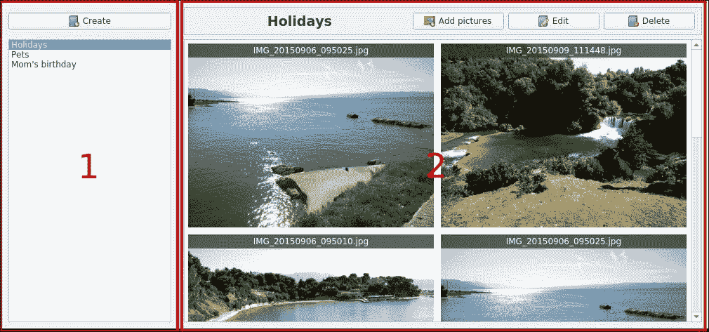
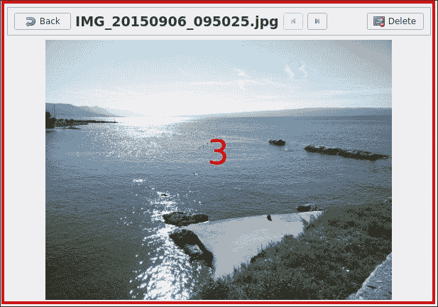
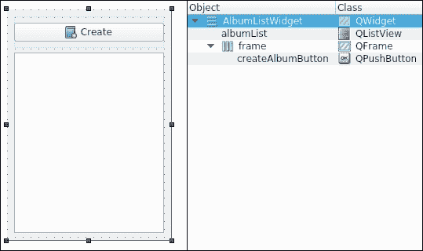
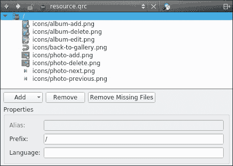
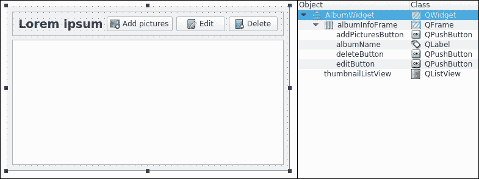
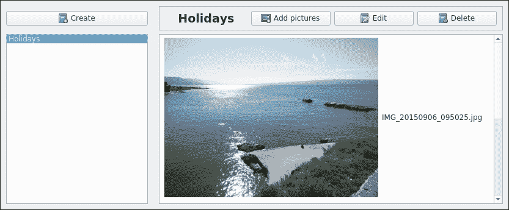
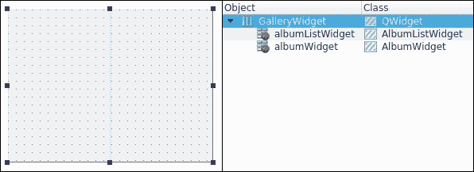

# 第四章. 拿下桌面 UI

在上一章中，我们使用 Qt 模型构建了我们画廊的大脑。现在是时候使用这个引擎构建桌面应用程序了。此软件将使用 `gallery-core` 库提供的所有功能，在你的计算机上实现一个完全可用的画廊。

第一项任务是将你的项目共享库链接到这个新应用。然后你将学习如何创建自定义小部件，何时使用 Qt 视图，以及如何与模型同步它们。

本章将涵盖以下主题：

+   将应用程序链接到项目库

+   Qt 模型/视图

+   Qt 资源文件

+   推广自定义小部件

# 创建与核心共享库链接的 GUI

`gallery-core` 共享库现在已准备就绪。让我们看看如何创建桌面 GUI 项目。我们将创建一个名为 `gallery-desktop` 的 Qt Widgets 应用程序子项目。与经典的 Qt Widgets 应用程序相比，只有第一步不同。在主项目上右键单击，选择 **ch04-gallery-desktop** | **New subproject** | **Application** | **Qt Widgets Application** | **Choose**。

你将获得一个像这样的多项目层次结构：


现在是时候将此 `gallery-desktop` 应用程序链接到 `gallery-core`。你可以自己编辑 `gallery-desktop.pro` 文件，或者像这样使用 Qt Creator 向导：在项目上右键单击，选择 **gallery-desktop** | **Add library** | **Internal library** | **gallery-core** | **Next** | **Finish**。以下是更新的 `gallery-desktop.pro`：

```cpp
QT       += core gui 

TARGET = desktop-gallery 
TEMPLATE = app 

SOURCES += main.cpp\ 
        MainWindow.cpp 

HEADERS  += MainWindow.h 

FORMS    += MainWindow.ui 

win32:CONFIG(release, debug|release): LIBS += -L$$OUT_PWD/../gallery-core/release/ -lgallery-core 
else:win32:CONFIG(debug, debug|release): LIBS += -L$$OUT_PWD/../gallery-core/debug/ -lgallery-core 
else:unix: LIBS += -L$$OUT_PWD/../gallery-core/ -lgallery-core 

INCLUDEPATH += $$PWD/../gallery-core 
DEPENDPATH += $$PWD/../gallery-core 

```

`LIBS` 变量指定了在此项目中要链接的库。语法非常简单：你可以使用 `-L` 前缀提供库路径，使用 `-l` 前缀提供库名称。

```cpp
LIBS += -L<pathToLibrary> -l<libraryName> 

```

默认情况下，在 Windows 上编译 Qt 项目将创建一个 `debug` 和 `release` 子目录。这就是为什么根据平台创建不同的 `LIBS` 版本。

现在应用程序已链接到 `gallery-core` 库并且知道其位置，我们必须指出库头文件的位置。这就是为什么我们必须将 `gallery-core` 源路径添加到 `INCLUDEPATH` 和 `DEPENDPATH`。

为了成功完成所有这些任务，qmake 提供了一些有用的变量：

+   `$$OUT_PWD`：输出目录的绝对路径

+   `$$PWD`：当前 `.pro` 文件的绝对路径

为了确保 `qmake` 在编译桌面应用程序之前编译共享库，我们必须根据以下片段更新 `ch04-gallery-desktop.pro` 文件：

```cpp
TEMPLATE = subdirs 

SUBDIRS += \ 
    gallery-core \ 
    gallery-desktop 

gallery-desktop.depends = gallery-core 

```

`depends` 属性明确指出必须在 `gallery-desktop` 之前构建 `gallery-core`。

### 小贴士

尽量始终使用 `depends` 属性，而不是依赖于 `CONFIG += ordered`，后者仅指定一个简单的列表顺序。`depends` 属性有助于 qmake 在可能的情况下并行处理你的项目。

在盲目编码之前，我们将花些时间思考 UI 架构。我们从`gallery-core`库中有许多功能要实现。我们应该将这些功能拆分为独立的 QWidgets。最终的应用程序将看起来像这样：



我们未来的画廊桌面就在这里！

照片的扩展视图将看起来像这样：



双击缩略图以全尺寸显示。

总结主要的 UI 组件：

+   `AlbumListWidget`：此组件列出所有现有专辑

+   `AlbumWidget`：此组件显示所选专辑及其缩略图

+   `PictureWidget`：此组件以全尺寸显示图片

这是我们组织的方式：


每个小部件都有一个定义的角色，并将处理特定功能：

| **类名** | **功能** |
| --- | --- |
| `MainWindow` | 处理画廊和当前图片之间的切换 |
| `GalleryWidget` |

+   显示现有专辑

+   专辑选择

+   专辑创建

|

| `AlbumListWidget` |
| --- |

+   显示现有专辑

+   专辑选择

+   专辑创建

|

| `AlbumWidget` |
| --- |

+   显示现有图片作为缩略图

+   在专辑中添加图片

+   专辑重命名

+   专辑删除

+   图片选择

|

| `PictureWidget` |
| --- |

+   显示所选图片

+   图片选择

+   图片删除

|

在核心共享库中，我们使用了标准容器（`vector`）的智能指针。通常，在 GUI 项目中，我们倾向于只使用 Qt 容器及其强大的父子所有权系统。我们认为这种方法更合适。这就是为什么我们将依赖于 Qt 容器来构建 GUI（并且不会使用智能指针）在本章中。

我们现在可以安全地开始创建我们的小部件；它们都是从**Qt Designer 表单类**创建的。如果您有记忆缺失，您可以在第一章的*Get Your Qt Feet Wet*部分中查看*自定义 QWidget*。

# 使用 AlbumListWidget 列出您的专辑

此小部件必须提供创建新专辑和显示现有专辑的方法。选择专辑还必须触发一个事件，该事件将被其他小部件用于显示正确数据。`AlbumListWidget`组件是本项目使用 Qt 视图机制的最简单小部件。在跳转到下一个小部件之前，花时间彻底理解`AlbumListWidget`。

以下截图显示了文件的**表单编辑器**视图，`AlbumListWidget.ui`：



布局非常简单。组件描述如下：

+   `AlbumListWidget`组件使用垂直布局来显示列表上方的**创建**按钮

+   `frame`组件包含一个吸引人的按钮

+   `createAlbumButton`组件处理专辑创建

+   `albumList`组件显示专辑列表

你应该已经识别出这里使用的多数类型。让我们花点时间来谈谈真正的新类型：`QListView`。正如我们在上一章中看到的，Qt 提供了一个模型/视图架构。这个系统依赖于特定的接口，你必须实现这些接口以通过你的模型类提供通用的数据访问。这就是我们在`gallery-core`项目中使用`AlbumModel`和`PictureModel`类所做的事情。

现在是处理视图部分的时候了。视图负责数据的展示。它还将处理用户交互，如选择、拖放或项目编辑。幸运的是，为了完成这些任务，视图得到了其他 Qt 类（如`QItemSelectionModel`、`QModelIndex`或`QStyledItemDelegate`）的帮助，我们将在本章中很快使用这些类。

现在，我们可以享受 Qt 提供的现成视图之一：

+   `QListView`: 这个视图以简单列表的形式显示模型中的项目

+   `QTableView`: 这个视图以二维表格的形式显示模型中的项目

+   `QTreeView`: 这个视图以列表层次结构的形式显示项目

在这里，选择相当明显，因为我们想显示一系列专辑名称。但在更复杂的情况下，选择适当视图的一个经验法则是查找模型类型；这里我们想为类型为`QAbstractListModel`的`AlbumModel`添加一个视图，所以`QListView`类看起来是正确的。

如前一个截图所示，`createAlbumButton`对象有一个图标。你可以通过选择小部件**属性：图标** | **选择资源**来向`QPushButton`类添加一个图标。你现在可以从`resource.qrc`文件中选择一张图片。

**Qt 资源**文件是嵌入二进制文件到你的应用程序中的文件集合。你可以存储任何类型的文件，但我们通常用它来存储图片、声音或翻译文件。要创建资源文件，右键单击项目名称，然后选择**添加新** | **Qt** | **Qt 资源文件**。Qt Creator 将创建一个默认文件，`resource.qrc`，并在你的文件`gallery-desktop.pro`中添加这一行：

```cpp
RESOURCES += resource.qrc 

```

资源文件可以主要以两种方式显示：**资源编辑器**和**纯文本编辑器**。你可以通过右键单击资源文件并选择**打开方式**来选择一个编辑器。

**资源编辑器**是一个可视化编辑器，它可以帮助你轻松地在资源文件中添加和删除文件，如下一个截图所示：



**纯文本编辑器**将像这样显示基于 XML 的文件`resource.qrc`：

```cpp
<RCC> 
    <qresource prefix="/"> 
        <file>icons/album-add.png</file> 
        <file>icons/album-delete.png</file> 
        <file>icons/album-edit.png</file> 
        <file>icons/back-to-gallery.png</file> 
        <file>icons/photo-add.png</file> 
        <file>icons/photo-delete.png</file> 
        <file>icons/photo-next.png</file> 
        <file>icons/photo-previous.png</file> 
    </qresource> 
</RCC> 

```

在构建时，`qmake`和`rcc`（Qt 资源编译器）将你的资源嵌入到应用程序的二进制文件中。

现在表单部分已经清晰，我们可以分析`AlbumListWidget.h`文件：

```cpp
#include <QWidget> 
#include <QItemSelectionModel> 

namespace Ui { 
class AlbumListWidget; 
} 

class AlbumModel; 

class AlbumListWidget : public QWidget 
{ 
    Q_OBJECT 

public: 
    explicit AlbumListWidget(QWidget *parent = 0); 
    ~AlbumListWidget(); 

    void setModel(AlbumModel* model); 
    void setSelectionModel(QItemSelectionModel* selectionModel); 

private slots: 
    void createAlbum(); 

private: 
    Ui::AlbumListWidget* ui; 
    AlbumModel* mAlbumModel; 
}; 

```

`setModel()`和`setSelectionModel()`函数是这个片段中最重要的一行。这个小部件需要两个东西才能正确工作：

+   `AlbumModel`: 这是一个提供数据访问的模型类。我们已经在`gallery-core`项目中创建了此类。

+   `QItemSelectionModel`: 这是一个 Qt 类，用于处理视图中的选择。默认情况下，视图使用它们自己的选择模型。与不同的视图或小部件共享相同的选择模型将帮助我们轻松同步专辑选择。

这是`AlbumListWidget.cpp`的主要部分：

```cpp
#include "AlbumListWidget.h" 
#include "ui_AlbumListWidget.h" 

#include <QInputDialog> 

#include "AlbumModel.h" 

AlbumListWidget::AlbumListWidget(QWidget *parent) : 
    QWidget(parent), 
    ui(new Ui::AlbumListWidget), 
    mAlbumModel(nullptr) 
{ 
    ui->setupUi(this); 

    connect(ui->createAlbumButton, &QPushButton::clicked, 
            this, &AlbumListWidget::createAlbum); 
} 

AlbumListWidget::~AlbumListWidget() 
{ 
    delete ui; 
} 

void AlbumListWidget::setModel(AlbumModel* model) 
{ 
    mAlbumModel = model; 
    ui->albumList->setModel(mAlbumModel); 
} 

void AlbumListWidget::setSelectionModel(QItemSelectionModel* selectionModel) 
{ 
    ui->albumList->setSelectionModel(selectionModel); 
} 

```

这两个设置器将主要用于设置`albumList`的模型和选择模型。我们的`QListView`类将随后自动请求模型（`AlbumModel`）获取每个对象的行数和`Qt::DisplayRole`（专辑的名称）。

现在我们来看一下处理专辑创建的`AlbumListWidget.cpp`文件的最后一部分：

```cpp
void AlbumListWidget::createAlbum() 
{ 
    if(!mAlbumModel) { 
        return; 
    } 

    bool ok; 
    QString albumName = QInputDialog::getText(this, 
                            "Create a new Album", 
                            "Choose an name", 
                            QLineEdit::Normal, 
                            "New album", 
                            &ok); 

    if (ok && !albumName.isEmpty()) { 
        Album album(albumName); 
        QModelIndex createdIndex = mAlbumModel->addAlbum(album); 
        ui->albumList->setCurrentIndex(createdIndex); 
    } 
} 

```

我们已经在第一章，*初识 Qt*中使用了`QInputDialog`类。这次我们用它来询问用户输入专辑名称。然后我们创建一个具有请求名称的`Album`类。这个对象只是一个“数据持有者”；`addAlbum()`将使用它来创建和存储具有唯一 ID 的真实对象。

`addAlbum()`函数返回与我们创建的专辑相对应的`QModelIndex`值。从这里，我们可以请求列表视图选择这个新专辑。

# 创建`ThumbnailProxyModel`

未来的`AlbumWidget`视图将显示与所选`Album`相关联的图片缩略图网格。在第三章，*划分你的项目和统治你的代码*中，我们设计了`gallery-core`库，使其对图片的显示方式保持无知：`Picture`类只包含一个`mUrl`字段。

换句话说，缩略图的生成必须在`gallery-desktop`而不是`gallery-core`中进行。我们已经有负责检索`Picture`信息的`PictureModel`类，因此能够扩展其行为以包含缩略图数据将非常棒。

在 Qt 中，使用`QAbstractProxyModel`类及其子类可以实现这一点。这个类的主要目的是处理来自基础`QAbstractItemModel`的数据（排序、过滤、添加数据等），并通过代理原始模型将其呈现给视图。用数据库的类比，你可以将其视为对表的投影。

`QAbstractProxyModel`类有两个子类：

+   `QIdentityProxyModel`子类在不进行任何修改的情况下代理其源模型（所有索引匹配）。如果你想要转换`data()`函数，这个类是合适的。

+   `QSortFilterProxyModel`子类能够代理其源模型，并具有排序和过滤传递数据的权限。

前者`QIdentityProxyModel`符合我们的要求。我们唯一需要做的是扩展`data()`函数以包含缩略图生成内容。创建一个名为`ThumbnailProxyModel`的新类。以下是`ThumbnailProxyModel.h`文件：

```cpp
#include <QIdentityProxyModel> 
#include <QHash> 
#include <QPixmap> 

class PictureModel; 

class ThumbnailProxyModel : public QIdentityProxyModel 
{ 
public: 
    ThumbnailProxyModel(QObject* parent = 0); 

    QVariant data(const QModelIndex& index, int role) const override; 
    void setSourceModel(QAbstractItemModel* sourceModel) override; 
    PictureModel* pictureModel() const; 

private: 
    void generateThumbnails(const QModelIndex& startIndex, int count); 
    void reloadThumbnails(); 

private: 
   QHash<QString, QPixmap*> mThumbnails; 

}; 

```

此类扩展`QIdentityProxyModel`并重写了一些函数：

+   `data()`函数用于向`ThumbnailProxyModel`的客户端提供缩略图数据

+   `setSourceModel()`函数用于注册`sourceModel`发出的信号

剩余的自定义函数有以下目标：

+   `pictureModel()`是一个辅助函数，将`sourceModel`转换为`PictureModel*`

+   `generateThumbnails()`函数负责为给定的一组图片生成`QPixmap`缩略图

+   `reloadThumbnails()`是一个辅助函数，在调用`generateThumbnails()`之前清除存储的缩略图

如你所猜，`mThumbnails`类使用`filepath`作为键存储`QPixmap*`缩略图。

我们现在切换到`ThumbnailProxyModel.cpp`文件，并从头开始构建它。让我们关注`generateThumbnails()`：

```cpp
const unsigned int THUMBNAIL_SIZE = 350; 
... 
void ThumbnailProxyModel::generateThumbnails( 
                                            const QModelIndex& startIndex, int count) 
{ 
    if (!startIndex.isValid()) { 
        return; 
    } 

    const QAbstractItemModel* model = startIndex.model(); 
    int lastIndex = startIndex.row() + count; 
    for(int row = startIndex.row(); row < lastIndex; row++) { 
        QString filepath = model->data(model->index(row, 0),  
                                                   PictureModel::Roles::FilePathRole).toString(); 
        QPixmap pixmap(filepath); 
        auto thumbnail = new QPixmap(pixmap 
                                     .scaled(THUMBNAIL_SIZE, THUMBNAIL_SIZE, 
                                             Qt::KeepAspectRatio, 
                                             Qt::SmoothTransformation)); 
        mThumbnails.insert(filepath, thumbnail); 
    } 
} 

```

此函数根据参数（`startIndex`和`count`）指定的范围生成缩略图。对于每张图片，我们使用`model->data()`从原始模型中检索`filepath`，并生成一个插入到`mThumbnails` QHash 中的缩小版的`QPixmap`。请注意，我们使用`const THUMBNAIL_SIZE`任意设置缩略图大小。图片被缩小到这个大小，并保持原始图片的宽高比。

每次加载相册时，我们应该清除`mThumbnails`类的内容并加载新的图片。这项工作由`reloadThumbnails()`函数完成：

```cpp
void ThumbnailProxyModel::reloadThumbnails() 
{ 
    qDeleteAll(mThumbnails); 
    mThumbnails.clear(); 
    generateThumbnails(index(0, 0), rowCount()); 
} 

```

在此函数中，我们简单地清除`mThumbnails`的内容，并使用表示应生成所有缩略图的参数调用`generateThumbnails()`函数。让我们看看这两个函数将在何时被使用，在`setSourceModel()`中：

```cpp
void ThumbnailProxyModel::setSourceModel(QAbstractItemModel* sourceModel) 
{ 
    QIdentityProxyModel::setSourceModel(sourceModel); 
    if (!sourceModel) { 
        return; 
    } 

    connect(sourceModel, &QAbstractItemModel::modelReset,  
                  [this] { 
        reloadThumbnails(); 
    }); 

    connect(sourceModel, &QAbstractItemModel::rowsInserted,  
                 [this] (const QModelIndex& parent, int first, int last) { 
        generateThumbnails(index(first, 0), last - first + 1); 
    }); 
} 

```

当调用`setSourceModel()`函数时，`ThumbnailProxyModel`类被配置为知道应该代理哪个基本模型。在此函数中，我们注册了 lambda 到原始模型发出的两个信号：

+   当需要为特定相册加载图片时，会触发`modelReset`信号。在这种情况下，我们必须完全重新加载缩略图。

+   `rowsInserted`信号在添加新图片时触发。此时，应调用`generateThumbnails`以更新`mThumbnails`并包含这些新来者。

最后，我们必须覆盖`data()`函数：

```cpp
QVariant ThumbnailProxyModel::data(const QModelIndex& index, int role) const 
{ 
    if (role != Qt::DecorationRole) { 
        return QIdentityProxyModel::data(index, role); 
    } 

    QString filepath = sourceModel()->data(index,  
                                 PictureModel::Roles::FilePathRole).toString(); 
    return *mThumbnails[filepath]; 
} 

```

对于任何不是`Qt::DecorationRole`的角色，都会调用父类`data()`。在我们的案例中，这触发了原始模型`PictureModel`的`data()`函数。在那之后，当`data()`必须返回缩略图时，会检索由`index`引用的图片的`filepath`并用于返回`mThumbnails`的`QPixmap`对象。幸运的是，`QPixmap`可以隐式转换为`QVariant`，所以我们在这里不需要做任何特别的事情。

在`ThumbnailProxyModel`类中要覆盖的最后一个函数是`pictureModel()`函数：

```cpp
PictureModel* ThumbnailProxyModel::pictureModel() const 
{ 
    return static_cast<PictureModel*>(sourceModel()); 
} 

```

将与`ThumbnailProxyModel`交互的类需要调用一些特定于`PictureModel`的函数来创建或删除图片。此函数是一个辅助函数，用于集中将`sourceModel`转换为`PictureModel*`。

作为旁注，我们本可以尝试动态生成缩略图以避免在专辑加载（以及调用`generateThumbnails()`）过程中可能出现的初始瓶颈。然而，`data()`是一个`const`函数，这意味着它不能修改`ThumbnailProxyModel`实例。这排除了在`data()`函数中生成缩略图并将其存储在`mThumbnails`中的任何方法。

如您所见，`QIdentityProxyModel`以及更一般的`QAbstractProxyModel`是向现有模型添加行为而不破坏它的宝贵工具。在我们的案例中，这是通过设计强制执行的，因为`PictureModel`类是在`gallery-core`中定义的，而不是在`gallery-desktop`中。修改`PictureModel`意味着修改`gallery-core`并可能破坏库的其他用户的其行为。这种方法让我们可以保持事物的清晰分离。

# 使用 AlbumWidget 显示所选专辑

此小部件将显示从`AlbumListWidget`选择的专辑的数据。一些按钮将允许我们与此专辑交互。

这是`AlbumWidget.ui`文件的布局：



顶部框架`albumInfoFrame`采用水平布局，包含：

+   `albumName`：此对象显示专辑的名称（在设计师中为**Lorem ipsum**）

+   `addPicturesButton`：此对象允许用户通过选择文件添加图片

+   `editButton`：此对象用于重命名专辑

+   `deleteButton`：此对象用于删除专辑

底部元素`thumbnailListView`是一个`QListView`。此列表视图表示来自`PictureModel`的项目。默认情况下，`QListView`能够从模型请求`Qt::DisplayRole`和`Qt::DecorationRole`来显示图片。

查看头文件`AlbumWidget.h`：

```cpp
#include <QWidget> 
#include <QModelIndex> 

namespace Ui { 
class AlbumWidget; 
} 

class AlbumModel; 
class PictureModel; 
class QItemSelectionModel; 
class ThumbnailProxyModel; 

class AlbumWidget : public QWidget 
{ 
    Q_OBJECT 

public: 
    explicit AlbumWidget(QWidget *parent = 0); 
    ~AlbumWidget(); 

    void setAlbumModel(AlbumModel* albumModel); 
    void setAlbumSelectionModel(QItemSelectionModel* albumSelectionModel); 
    void setPictureModel(ThumbnailProxyModel* pictureModel); 
    void setPictureSelectionModel(QItemSelectionModel* selectionModel); 

signals: 
    void pictureActivated(const QModelIndex& index); 

private slots: 
    void deleteAlbum(); 
    void editAlbum(); 
    void addPictures(); 

private: 
    void clearUi(); 
    void loadAlbum(const QModelIndex& albumIndex); 

private: 
    Ui::AlbumWidget* ui; 
    AlbumModel* mAlbumModel; 
    QItemSelectionModel* mAlbumSelectionModel; 

    ThumbnailProxyModel* mPictureModel; 
    QItemSelectionModel* mPictureSelectionModel; 
}; 

```

由于此小部件需要处理`Album`和`Picture`数据，因此此类具有`AlbumModel`和`ThumbnailProxyModel`设置器。我们还希望知道并与其他小部件和视图（即`AlbumListWidget`）共享模型选择。这就是为什么我们还有`Album`和`Picture`模型选择设置器的原因。

当用户双击缩略图时，将触发 `pictureActivated()` 信号。我们将在稍后看到 `MainWindow` 如何连接到该信号以显示全尺寸的图片。

当用户点击这些按钮之一时，将调用私有槽 `deleteAlbum()`、`editAlbum()` 和 `addPictures()`。

最后，将调用 `loadAlbum()` 函数来更新特定相册的 UI。`clearUi()` 函数将用于清除此小部件 UI 显示的所有信息。

查看 `AlbumWidget.cpp` 文件实现的开始部分：

```cpp
#include "AlbumWidget.h" 
#include "ui_AlbumWidget.h" 

#include <QInputDialog> 
#include <QFileDialog> 

#include "AlbumModel.h" 
#include "PictureModel.h" 

AlbumWidget::AlbumWidget(QWidget *parent) : 
    QWidget(parent), 
    ui(new Ui::AlbumWidget), 
    mAlbumModel(nullptr), 
    mAlbumSelectionModel(nullptr), 
    mPictureModel(nullptr), 
    mPictureSelectionModel(nullptr) 
{ 
    ui->setupUi(this); 
    clearUi(); 

    ui->thumbnailListView->setSpacing(5); 
    ui->thumbnailListView->setResizeMode(QListView::Adjust); 
    ui->thumbnailListView->setFlow(QListView::LeftToRight); 
    ui->thumbnailListView->setWrapping(true); 

    connect(ui->thumbnailListView, &QListView::doubleClicked, 
            this, &AlbumWidget::pictureActivated); 

    connect(ui->deleteButton, &QPushButton::clicked, 
            this, &AlbumWidget::deleteAlbum); 

    connect(ui->editButton, &QPushButton::clicked, 
            this, &AlbumWidget::editAlbum); 

    connect(ui->addPicturesButton, &QPushButton::clicked, 
            this, &AlbumWidget::addPictures); 
} 

AlbumWidget::~AlbumWidget() 
{ 
    delete ui; 
} 

```

构造函数配置 `thumbnailListView`，这是我们用于显示当前选中相册缩略图的 `QListView`。我们在此设置各种参数：

+   `setSpacing()`：在此参数中，默认情况下项目是粘合在一起的。您可以在它们之间添加间距。

+   `setResizeMode()`：此参数在视图大小调整时动态布局项目。默认情况下，即使视图大小调整，项目也会保持其原始位置。

+   `setFlow()`：此参数指定列表方向。在这里，我们希望从左到右显示项目。默认方向是 `TopToBottom`。

+   `setWrapping()`：此参数允许当没有足够的空间在可见区域显示项目时，项目可以换行。默认情况下，不允许换行，将显示滚动条。

构造函数的末尾执行所有与 UI 相关的信号连接。第一个是一个很好的信号中继示例，在 第一章 中解释，*初识 Qt*。我们将 `QListView::doubleClicked` 信号连接到我们的类信号 `AlbumWidget::pictureActivated`。其他连接是常见的；我们希望在用户点击按钮时调用特定的槽。像往常一样，在 **Qt Designer Form Class** 中，析构函数将删除成员变量 `ui`。

让我们看看 `AlbumModel` 设置器的实现：

```cpp
void AlbumWidget::setAlbumModel(AlbumModel* albumModel) 
{ 
    mAlbumModel = albumModel; 

    connect(mAlbumModel, &QAbstractItemModel::dataChanged, 
        [this] (const QModelIndex &topLeft) { 
            if (topLeft == mAlbumSelectionModel->currentIndex()) { 
                loadAlbum(topLeft); 
            } 
    }); 
} 

void AlbumWidget::setAlbumSelectionModel(QItemSelectionModel* albumSelectionModel) 
{ 
    mAlbumSelectionModel = albumSelectionModel; 

    connect(mAlbumSelectionModel, 
            &QItemSelectionModel::selectionChanged, 
            [this] (const QItemSelection &selected) { 
                if (selected.isEmpty()) { 
                    clearUi(); 
                    return; 
                } 
                loadAlbum(selected.indexes().first()); 
    }); 
} 

```

如果所选相册的数据已更改，我们需要使用 `loadAlbum()` 函数更新 UI。进行测试以确保更新的相册是当前选中的相册。请注意，`QAbstractItemModel::dataChanged()` 函数有三个参数，但 lambda 插槽语法允许我们省略未使用的参数。

我们的 `AlbumWidget` 组件必须根据当前选中的相册更新其 UI。由于我们共享相同的选择模型，每次用户从 `AlbumListWidget` 中选择一个相册时，都会触发 `QItemSelectionModel::selectionChanged` 信号。在这种情况下，我们通过调用 `loadAlbum()` 函数来更新 UI。由于我们不支持相册多选，我们可以将过程限制在第一个选定的元素上。如果选择为空，我们只需清除 UI。

现在，轮到 `PictureModel` 设置器的实现：

```cpp
void AlbumWidget::setPictureModel(PictureModel* pictureModel) 
{ 
    mPictureModel = pictureModel; 
    ui->thumbnailListView->setModel(mPictureModel); 
} 

void AlbumWidget::setPictureSelectionModel(QItemSelectionModel* selectionModel) 
{ 
    ui->thumbnailListView->setSelectionModel(selectionModel); 
} 

```

这里非常简单。我们设置了`thumbnailListView`的模型和选择模型，我们的`QListView`将显示所选相册的缩略图。我们还保留了图片模型以供以后操作数据。

我们现在可以逐个介绍功能。让我们从相册删除开始：

```cpp
void AlbumWidget::deleteAlbum() 
{ 
    if (mAlbumSelectionModel->selectedIndexes().isEmpty()) { 
        return; 
    } 
    int row = mAlbumSelectionModel->currentIndex().row(); 
    mAlbumModel->removeRow(row); 

    // Try to select the previous album 
    QModelIndex previousModelIndex = mAlbumModel->index(row - 1, 
        0); 
    if(previousModelIndex.isValid()) { 
        mAlbumSelectionModel->setCurrentIndex(previousModelIndex, 
             QItemSelectionModel::SelectCurrent); 
        return; 
    } 

    // Try to select the next album 
    QModelIndex nextModelIndex = mAlbumModel->index(row, 0); 
    if(nextModelIndex.isValid()) { 
        mAlbumSelectionModel->setCurrentIndex(nextModelIndex, 
            QItemSelectionModel::SelectCurrent); 
        return; 
    } 
} 

```

在`deleteAlbum()`函数中，最重要的任务是检索`mAlbumSelectionModel`中的当前行索引。然后，我们可以请求`mAlbumModel`删除此行。函数的其余部分将仅尝试自动选择上一个或下一个相册。再次强调，因为我们共享相同的选择模型，`AlbumListWidget`将自动更新其相册选择。

下面的代码片段显示了相册重命名功能：

```cpp
void AlbumWidget::editAlbum() 
{ 
    if (mAlbumSelectionModel->selectedIndexes().isEmpty()) { 
        return; 
    } 

    QModelIndex currentAlbumIndex =  
        mAlbumSelectionModel->selectedIndexes().first(); 

    QString oldAlbumName = mAlbumModel->data(currentAlbumIndex, 
        AlbumModel::Roles::NameRole).toString(); 

    bool ok; 
    QString newName = QInputDialog::getText(this, 
                                            "Album's name", 
                                            "Change Album name", 
                                            QLineEdit::Normal, 
                                            oldAlbumName, 
                                            &ok); 

    if (ok && !newName.isEmpty()) { 
        mAlbumModel->setData(currentAlbumIndex, 
                             newName, 
                             AlbumModel::Roles::NameRole); 
    } 
} 

```

在这里，`QInputDialog`类将帮助我们实现一个功能。现在你应该对其行为有信心。此函数执行三个步骤：

1.  从相册模型中检索当前名称。

1.  生成一个出色的输入对话框。

1.  请求相册模型更新名称

如您所见，当与`ItemDataRole`结合使用时，模型中的通用函数`data()`和`setData()`非常强大。正如已经解释的，我们不会直接更新我们的 UI；这将被自动执行，因为`setData()`会发出一个信号`dataChanged()`，该信号由`AlbumWidget`处理。

最后一个功能允许我们在当前相册中添加一些新的图片文件：

```cpp
void AlbumWidget::addPictures() 
{ 
    QStringList filenames = 
        QFileDialog::getOpenFileNames(this, 
            "Add pictures", 
             QDir::homePath(), 
            "Picture files (*.jpg *.png)"); 

    if (!filenames.isEmpty()) { 
        QModelIndex lastModelIndex; 
        for (auto filename : filenames) { 
            Picture picture(filename); 
            lastModelIndex = mPictureModel→pictureModel()->addPicture(picture); 
        } 
        ui->thumbnailListView->setCurrentIndex(lastModelIndex); 
    } 
} 

```

`QFileDialog`类用于帮助用户选择多个图片文件。对于每个文件名，我们创建一个`Picture`数据持有者，就像我们在本章创建相册时已经看到的那样。然后我们可以请求`mPictureModel`将此图片添加到当前相册中。请注意，因为`mPictureModel`是一个`ThumbnailProxyModel`类，我们必须使用辅助函数`pictureModel()`检索实际的`PictureModel`。由于`addPicture()`函数返回相应的`QModelIndex`，我们最终选择`thumbnailListView`中最新的图片。

让我们完成`AlbumWidget.cpp`：

```cpp
void AlbumWidget::clearUi() 
{ 
    ui->albumName->setText(""); 
    ui->deleteButton->setVisible(false); 
    ui->editButton->setVisible(false); 
    ui->addPicturesButton->setVisible(false); 
} 

void AlbumWidget::loadAlbum(const QModelIndex& albumIndex) 
{ 
    mPictureModel->pictureModel()->setAlbumId(mAlbumModel->data(albumIndex, 
        AlbumModel::Roles::IdRole).toInt()); 

    ui->albumName->setText(mAlbumModel->data(albumIndex, 
        Qt::DisplayRole).toString()); 

    ui->deleteButton->setVisible(true); 
    ui->editButton->setVisible(true); 
    ui->addPicturesButton->setVisible(true); 
} 

```

`clearUi()`函数清除相册的名称并隐藏按钮，而`loadAlbum()`函数检索`Qt::DisplayRole`（相册的名称）并显示按钮。

# 使用 PictureDelegate 增强缩略图

默认情况下，`QListView`类将请求`Qt::DisplayRole`和`Qt::DecorationRole`以显示每个项目的文本和图片。因此，我们已经有了一个免费的可视结果，看起来像这样：



然而，我们的**画廊**应用程序值得更好的缩略图渲染。希望我们可以通过使用视图的代理概念轻松地自定义它。`QListView`类提供了一个默认的项目渲染。我们可以通过创建一个继承自`QStyledItemDelegate`的类来自定义项目渲染。目标是绘制像以下截图所示的带有名称横幅的梦幻缩略图：


让我们看看`PictureDelegate.h`：

```cpp
#include <QStyledItemDelegate> 

class PictureDelegate : public QStyledItemDelegate 
{ 
    Q_OBJECT 
public: 
    PictureDelegate(QObject* parent = 0); 

    void paint(QPainter* painter, const QStyleOptionViewItem& 
        option, const QModelIndex& index) const override; 

    QSize sizeHint(const QStyleOptionViewItem& option, 
        const QModelIndex& index) const override; 
}; 

```

没错，我们只需要重写两个函数。最重要的函数是`paint()`，它将允许我们按照我们想要的方式绘制项目。`sizeHint()`函数将用于指定项目大小。

我们现在可以在`PictureDelegate.cpp`中看到画家的工作：

```cpp
#include "PictureDelegate.h" 

#include <QPainter> 

const unsigned int BANNER_HEIGHT = 20; 
const unsigned int BANNER_COLOR = 0x303030; 
const unsigned int BANNER_ALPHA = 200; 
const unsigned int BANNER_TEXT_COLOR = 0xffffff; 
const unsigned int HIGHLIGHT_ALPHA = 100; 

PictureDelegate::PictureDelegate(QObject* parent) : 
    QStyledItemDelegate(parent) 
{ 
} 

void PictureDelegate::paint(QPainter* painter, const QStyleOptionViewItem& option, const QModelIndex& index) const 
{ 
    painter->save(); 

    QPixmap pixmap = index.model()->data(index, 
        Qt::DecorationRole).value<QPixmap>(); 
    painter->drawPixmap(option.rect.x(), option.rect.y(), pixmap); 

    QRect bannerRect = QRect(option.rect.x(), option.rect.y(), 
        pixmap.width(), BANNER_HEIGHT); 
    QColor bannerColor = QColor(BANNER_COLOR); 
    bannerColor.setAlpha(BANNER_ALPHA); 
    painter->fillRect(bannerRect, bannerColor); 

    QString filename = index.model()->data(index, 
        Qt::DisplayRole).toString(); 
    painter->setPen(BANNER_TEXT_COLOR); 
    painter->drawText(bannerRect, Qt::AlignCenter, filename); 

    if (option.state.testFlag(QStyle::State_Selected)) { 
        QColor selectedColor = option.palette.highlight().color(); 
        selectedColor.setAlpha(HIGHLIGHT_ALPHA); 
        painter->fillRect(option.rect, selectedColor); 
    } 

    painter->restore(); 
} 

```

每次当`QListView`需要显示一个项目时，此代理的`paint()`函数将被调用。绘图系统可以看作是层，你可以在每一层上绘制。`QPainter`类允许我们绘制任何我们想要的东西：圆形、饼图、矩形、文本等等。项目区域可以通过`option.rect()`检索。以下是步骤：

1.  很容易破坏参数列表中传递的`painter`状态，因此我们必须在开始绘制之前使用`painter->save()`保存画家状态，以便在完成我们的绘制后能够恢复它。

1.  检索项目缩略图并使用`QPainter::drawPixmap()`函数绘制它。

1.  使用`QPainter::fillRect()`函数在缩略图上方绘制一个半透明的灰色横幅。

1.  使用`QPainter::drawText()`函数检索项目显示名称并在横幅上绘制它。

1.  如果项目被选中，我们将使用项目的突出颜色在顶部绘制一个半透明的矩形。

1.  我们将画家状态恢复到其原始状态。

### 提示

如果你想要绘制更复杂的项目，请查看[doc.qt.io/qt-5/qpainter.html](http://doc.qt.io/qt-5/qpainter.html)的`QPainter`官方文档。

这是`sizeHint()`函数的实现：

```cpp
QSize PictureDelegate::sizeHint(const QStyleOptionViewItem& /*option*/, const QModelIndex& index) const 
{ 
    const QPixmap& pixmap = index.model()->data(index, 
        Qt::DecorationRole).value<QPixmap>(); 
    return pixmap.size(); 
} 

```

这个比较简单。我们希望项目的大小与缩略图大小相等。因为我们保持了缩略图在创建时的宽高比，所以缩略图可以有不同的大小。因此，我们基本上检索缩略图并返回其大小。

### 提示

当你创建一个项目代理时，避免直接继承`QItemDelegate`类，而是继承`QStyledItemDelegate`。后者支持 Qt 样式表，允许你轻松自定义渲染。

现在`PictureDelegate`已经准备好了，我们可以配置我们的`thumbnailListView`使用它，并更新`AlbumWidget.cpp`文件如下：

```cpp
AlbumWidget::AlbumWidget(QWidget *parent) : 
    QWidget(parent), 
    ui(new Ui::AlbumWidget), 
    mAlbumModel(nullptr), 
    mAlbumSelectionModel(nullptr), 
    mPictureModel(nullptr), 
    mPictureSelectionModel(nullptr) 
{ 
    ui->setupUi(this); 
    clearUi(); 

    ui->thumbnailListView->setSpacing(5); 
    ui->thumbnailListView->setResizeMode(QListView::Adjust); 
    ui->thumbnailListView->setFlow(QListView::LeftToRight); 
    ui->thumbnailListView->setWrapping(true); 
    ui->thumbnailListView->setItemDelegate( 
        new PictureDelegate(this)); 
    ... 
} 

```

### 提示

**Qt 提示**

项目代理也可以使用`QStyledItemDelegate::createEditor()`函数管理编辑过程。

# 使用 PictureWidget 显示图片

此小部件将被调用来显示图片的全尺寸。我们还添加了一些按钮来跳转到上一张/下一张图片或删除当前图片。

让我们开始分析`PictureWidget.ui`表单，以下是设计视图：


这里是详细内容：

+   `backButton`: 此对象请求显示图库

+   `deleteButton`: 此对象从相册中删除图片

+   `nameLabel`: 此对象显示图片名称

+   `nextButton`: 此对象选择相册中的下一张图片

+   `previousButton`: 此对象选择相册中的上一张图片

+   `pictureLabel`: 此对象显示图片

现在我们可以查看头文件 `PictureWidget.h`：

```cpp
#include <QWidget> 
#include <QItemSelection> 

namespace Ui { 
class PictureWidget; 
} 

class PictureModel; 
class QItemSelectionModel; 
class ThumbnailProxyModel; 

class PictureWidget : public QWidget 
{ 
    Q_OBJECT 

public: 
    explicit PictureWidget(QWidget *parent = 0); 
    ~PictureWidget(); 
    void setModel(ThumbnailProxyModel* model); 
    void setSelectionModel(QItemSelectionModel* selectionModel); 

signals: 
    void backToGallery(); 

protected: 
    void resizeEvent(QResizeEvent* event) override; 

private slots: 
    void deletePicture(); 
    void loadPicture(const QItemSelection& selected); 

private: 
    void updatePicturePixmap(); 

private: 
    Ui::PictureWidget* ui; 
    ThumbnailProxyModel* mModel; 
    QItemSelectionModel* mSelectionModel; 
    QPixmap mPixmap; 
}; 

```

没有惊喜，我们在 `PictureWidget` 类中有 `ThumbnailProxyModel*` 和 `QItemSelectionModel*` 设置器。当用户点击 `backButton` 对象时，会触发 `backToGallery()` 信号。它将由 `MainWindow` 处理，再次显示图库。我们重写 `resizeEvent()` 来确保我们始终使用所有可见区域来显示图片。`deletePicture()` 插槽将在用户点击相应的按钮时处理删除操作。`loadPicture()` 函数将被调用来更新 UI 并显示指定的图片。最后，`updatePicturePixmap()` 是一个辅助函数，用于根据当前小部件大小显示图片。

此小部件与其他小部件非常相似。因此，我们不会在这里放置 `PictureWidget.cpp` 的完整实现代码。如果需要，你可以检查完整的源代码示例。

让我们看看这个小部件如何在 `PictureWidget.cpp` 中始终以全尺寸显示图片：

```cpp
void PictureWidget::resizeEvent(QResizeEvent* event) 
{ 
    QWidget::resizeEvent(event); 
    updatePicturePixmap(); 
} 

void PictureWidget::updatePicturePixmap() 
{ 
    if (mPixmap.isNull()) { 
        return; 
    } 
    ui->pictureLabel->setPixmap(mPixmap.scaled(ui->pictureLabel->size(), Qt::KeepAspectRatio)); 
} 

```

因此，每次小部件被调整大小时，我们都会调用 `updatePicturePixmap()`。`mPixmap` 变量是从 `PictureModel` 获取的全尺寸图片。此函数将图片缩放到 `pictureLabel` 的大小，并保持宽高比。你可以自由调整窗口大小，并享受最大可能的图片尺寸。

# 组合你的图库应用

好的，我们已经完成了 `AlbumListWidget`、`AlbumWidget` 和 `PictureWidget`。如果你记得正确的话，`AlbumListWidget` 和 `AlbumWidget` 包含在一个名为 `GalleryWidget` 的小部件中。

让我们看看 `GalleryWidget.ui` 文件：



此小部件不包含任何标准 Qt 小部件，而只包含我们创建的小部件。Qt 提供两种方式在 Qt 设计器中使用您自己的小部件：

+   **提升小部件**：这是最快、最简单的方法

+   **为 Qt 设计器创建小部件插件**：这更强大，但更复杂

在本章中，我们将使用第一种方法，该方法包括放置一个通用的 `QWidget` 作为占位符，然后将其提升到我们的自定义小部件类。你可以按照以下步骤将 `albumListWidget` 和 `albumWidget` 对象添加到 `GalleryWidget.ui` 文件中，从 Qt 设计器开始：

1.  从**容器**拖放一个**小部件**到你的表单中。

1.  从**属性编辑器**设置**objectName**（例如，`albumListWidget`）。

1.  从小部件上下文菜单中选择**提升到...**

1.  设置提升的类名（例如，`AlbumWidget`）。

1.  确认该头文件正确（例如，`AlbumWidget.h`）。

1.  点击**添加**按钮，然后点击**提升**。

如果你未能提升你的小部件，你总是可以从上下文菜单中选择**降级到 QWidget**来撤销操作。

在`GalleryWidget`的头文件和实现中并没有什么真正令人兴奋的内容。我们只为`Album`和`Picture`的模型和模型选择提供了设置器，将它们转发到`albumListWidget`和`albumWidget`。这个类还转发了从`albumWidget`发出的`pictureActivated`信号。如有需要，请检查完整的源代码。

这是本章的最后一部分。现在我们将分析`MainWindow`。在`MainWindow.ui`中没有做任何事情，因为所有的事情都在代码中处理。这是`MainWindow.h`：

```cpp
#include <QMainWindow> 
#include <QStackedWidget> 

namespace Ui { 
class MainWindow; 
} 

class GalleryWidget; 
class PictureWidget; 

class MainWindow : public QMainWindow 
{ 
    Q_OBJECT 

public: 
    explicit MainWindow(QWidget *parent = 0); 
    ~MainWindow(); 

public slots: 
    void displayGallery(); 
    void displayPicture(const QModelIndex& index); 

private: 
    Ui::MainWindow *ui; 
    GalleryWidget* mGalleryWidget; 
    PictureWidget* mPictureWidget; 
    QStackedWidget* mStackedWidget; 
}; 

```

这两个槽`displayGallery()`和`displayPicture()`将用于在画廊（带有专辑和缩略图的专辑列表）和图片（全尺寸）之间切换显示。`QStackedWidget`类可以包含各种窗口，但一次只能显示一个。

让我们看看`MainWindow.cpp`文件中构造函数的开始部分：

```cpp
ui->setupUi(this); 

AlbumModel* albumModel = new AlbumModel(this); 
QItemSelectionModel* albumSelectionModel = 
    new QItemSelectionModel(albumModel, this); 
mGalleryWidget->setAlbumModel(albumModel); 
mGalleryWidget->setAlbumSelectionModel(albumSelectionModel); 

```

首先，我们通过调用`ui->setupUi()`初始化 UI。然后我们创建`AlbumModel`及其`QItemSelectionModel`。最后，我们调用`GalleryWidget`的设置器，它们将分发到`AlbumListWidget`和`AlbumWidget`对象。

继续分析这个构造函数：

```cpp
PictureModel* pictureModel = new PictureModel(*albumModel, this); 
ThumbnailProxyModel* thumbnailModel = new ThumbnailProxyModel(this); thumbnailModel->setSourceModel(pictureModel); 

QItemSelectionModel* pictureSelectionModel = 
    new QItemSelectionModel(pictureModel, this); 

mGalleryWidget->setPictureModel(thumbnailModel); 
mGalleryWidget->setPictureSelectionModel(pictureSelectionModel); 
mPictureWidget->setModel(thumbnailModel); 
mPictureWidget->setSelectionModel(pictureSelectionModel); 

```

`Picture`的行为与之前的`Album`相似。但我们还共享`ThumbnailProxyModel`，它从`PictureModel`初始化，并且与`PictureWidget`的`QItemSelectionModel`。

构造函数现在执行信号/槽连接：

```cpp
connect(mGalleryWidget, &GalleryWidget::pictureActivated, 
        this, &MainWindow::displayPicture); 

connect(mPictureWidget, &PictureWidget::backToGallery, 
        this, &MainWindow::displayGallery); 

```

你还记得`pictureActivated()`函数吗？当你双击`albumWidget`中的缩略图时，这个信号会被发出。现在我们可以将它连接到我们的`displayPicture`槽，这将切换显示并显示全尺寸的图片。不要忘记连接从`PictureWidget`发出的`backToGallery`信号，当用户点击`backButton`时，它将再次切换以显示画廊。

构造函数的最后部分很简单：

```cpp
mStackedWidget->addWidget(mGalleryWidget); 
mStackedWidget->addWidget(mPictureWidget); 
displayGallery(); 

setCentralWidget(mStackedWidget); 

```

我们将我们的两个窗口`mGalleryWidget`和`mPictureWidget`添加到`mStackedWidget`类中。当应用程序启动时，我们希望显示画廊，因此我们调用自己的槽`displayGallery()`。最后，我们将`mStackedWidget`定义为主窗口的中心窗口。

为了完成这一章，让我们看看这两个魔法槽中发生了什么，允许在用户请求时切换显示：

```cpp
void MainWindow::displayGallery() 
{ 
    mStackedWidget->setCurrentWidget(mGalleryWidget); 
} 

void MainWindow::displayPicture(const QModelIndex& /*index*/) 
{ 
    mStackedWidget->setCurrentWidget(mPictureWidget); 
} 

```

这看起来简单得荒谬。我们只需请求`mStackedWidget`选择相应的窗口。由于`PictureWidget`与其他视图共享相同的选择模型，我们甚至可以忽略`index`变量。

# 摘要

数据和表示之间的真正分离并不总是件容易的事。将核心和 GUI 分成两个不同的项目是一种良好的实践。这将迫使你在应用程序中设计分离的层。乍一看，Qt 模型/视图系统可能显得复杂。但这一章教你它有多么强大，以及使用它是多么简单。多亏了 Qt 框架，数据库中数据的持久化可以轻松完成，无需头疼。

本章建立在`gallery-core`库所奠定的基础之上。在下一章中，我们将重用相同的核心库，并在 QML 中使用 Qt Quick 创建一个移动 UI。
