# 第六章. 即使 Qt 也值得在树莓派上拥有一片天地

在上一章中，我们创建了一个针对 Android 和 iOS 的 QML UI。我们将继续在嵌入式世界中的旅程，探索我们如何在树莓派上部署 Qt 应用程序。本主题的示例项目将是一个使用 Qt3D 模块的蛇游戏。玩家将控制一条蛇，试图吃苹果以变得尽可能大。

在本章中，你将学习：

+   Qt3D 模块的架构

+   跨编译的基本原则

+   如何构建自己的 Qt Creator 工具包以在树莓派上编译和部署你的游戏

+   如何处理各种平台（桌面、树莓派）的差异和限制

+   工厂设计模式

+   如何使用 JavaScript 和 QML 编写完整的游戏引擎

+   QML 分析器的使用

# 探索 Qt3D

本章的示例项目将依赖于 3D 渲染。为此，我们将使用 Qt3D。框架的这一部分被划分为各种 Qt 模块，使应用程序能够实现接近实时模拟的 3D 环境。建立在 OpenGL 之上，Qt3D 提供了一个高级 API 来描述复杂的场景，而无需编写低级 OpenGL 指令。Qt3D 支持以下基本功能：

+   C++和 Qt Quick 的 2D 和 3D 渲染

+   网格

+   材质

+   GLSL 着色器

+   阴影映射

+   延迟渲染

+   实例渲染

+   常量缓冲区对象

所有这些功能都是在**ECS**（**实体组件系统**）架构中实现的。你定义的每个网格、材质或着色器都是一个组件。这些组件的聚合形成一个实体。如果你想绘制一个 3D 红色苹果，你需要以下组件：

+   网格组件，持有你的苹果的顶点

+   材质组件，将纹理应用到网格或为其上色

这两个组件将被重新组合以定义实体 Apple。你在这里可以看到 ECS 的两个部分：实体和组件。整体架构看起来像这样：

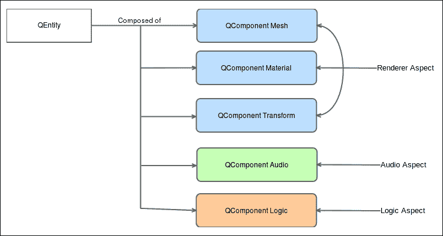

这些组件可以根据方面重新分组。方面是多个组件在同一部分（渲染、音频、逻辑和物理）上工作的“切片”。当 Qt3D 引擎处理所有实体的图时，每个方面的层会依次处理。

基本的方法是优先考虑组合而非继承。在游戏中，一个实体（一个苹果、一个玩家、一个敌人）在其生命周期中可以有多种状态：生成、为给定状态进行动画、死亡动画等等。使用继承来描述这些状态会导致一个令人头疼的树状结构：`AppleSpawn`、`AppleAnimationShiny`、`AppleDeath`等等。这会很快变得难以维护。对任何类的任何修改都可能对许多其他类产生巨大影响，并且可能的状态组合数量会失控。说一个状态只是给定实体的一个组件，这给了我们灵活性，可以轻松地交换组件，同时仍然保持实体抽象；一个苹果`Entity`元素仍然是苹果，即使它使用的是`AnimationShiny`组件而不是`AnimationSpawn`组件。

让我们看看如何在 QML 中定义一个基本的`Entity`元素。想象这是我们一直在谈论的苹果。`Apple.qml`文件看起来会是这样：

```cpp
import Qt3D.Core 2.0 
import Qt3D.Render 2.0 
import Qt3D.Extras 2.0 

Entity { 

    property alias position: transform.translation 
    PhongMaterial { 
        id: material 
        diffuse: "red" 
    } 

    SphereMesh { 
        id: mesh 
    } 

    Transform { 
        id: transform 
    } 

    components: [material, mesh, transform] 
} 

```

在非常少的几行代码中，你描述了`Entity`元素的各个方面：

+   `Entity`：这是文件的根对象；它遵循我们在第五章，*掌握移动 UI*中研究的相同的 QML 模式。

+   `PhongMaterial`：这定义了表面将如何渲染。在这里，它使用 Phong 着色技术来实现平滑表面。它继承自`QMaterial`，这是所有材质类的基类。

+   `CuboidMesh`：这定义了将使用哪种类型的网格。它继承自`QGeometryRenderer`，这也赋予了加载自定义模型（从 3D 建模软件导出）的能力。

+   `Transform`：这定义了组件的变换矩阵。它可以自定义`Entity`元素的平移、缩放和位置。

+   `Position`：这是一个属性，用于暴露给定调用者/父对象的`transform.translation`。如果我们想移动苹果，这可能会很快变得很有用。

+   `Components`：这是一个数组，包含`Entity`元素所有组件的所有 ID。

如果我们想将这个`Apple`变成另一个`Entity`的子对象，我们只需在这个新的`Entity`元素内部定义苹果即可。让我们称它为`World.qml`：

```cpp
import Qt3D.Core 2.0 
import Qt3D.Render 2.0 
import Qt3D.Extras 2.0 

Entity { 
    id: sceneRoot 
     RenderSettings { 
        id: frameFraph 
        activeFrameGraph: ForwardRenderer { 
            clearColor: Qt.rgba(0, 0, 0, 1) 
        } 
    } 

    Apple { 
        id: apple 
        position: Qt.vector3d(3.0, 0.0, 2.0) 
    } 

    components: [frameGraph] 
} 

```

在这里，`World Entity`没有视觉表示；我们希望它是我们 3D 场景的根。它只包含我们之前定义的`Apple`。苹果的`x`、`y`、`z`坐标相对于父对象。当父对象进行平移时，相同的平移也会应用到苹果上。

这就是定义实体/组件层次结构的方法。如果你用 C++编写 Qt3D 代码，相同的逻辑也适用于等效的 C++类（`QEntity`、`QComponent`等等）。

因为我们决定使用`World.qml`文件作为场景的根，所以它必须定义场景将如何渲染。Qt3D 渲染算法是数据驱动的。换句话说，存在一个清晰的分离，即*应该渲染什么*（实体和组件的树）以及*如何渲染*。

*如何*渲染依赖于使用`framegraph`的类似树结构。在 Qt Quick 中，使用单一的渲染方法，它涵盖了 2D 绘图。另一方面，在 3D 中，灵活渲染的需求使得解耦渲染技术成为必要。

考虑这个例子：你玩一个游戏，游戏中你控制你的角色并遇到了一面镜子。必须从多个视图中渲染相同的 3D 场景。如果渲染技术是固定的，这会带来多个问题：应该先绘制哪个视口？能否在 GPU 中并行渲染视口？如果我们需要多次渲染呢？

在这个代码片段中，我们使用传统的 OpenGL 渲染技术，通过`ForwardRenderer`树，其中每个对象都是直接在后缓冲区上渲染，一次一个。Qt3D 提供了选择渲染器（`ForwardRenderer`、`DeferredRenderer`等）并配置场景应如何渲染的可能性。

OpenGL 通常使用双缓冲技术来渲染其内容。前缓冲区是显示在屏幕上的内容，后缓冲区是场景正在渲染的地方。当后缓冲区准备好后，两个缓冲区就会交换。

在每个`Entity`元素顶部需要注意的最后一点是，我们指定了以下内容：

```cpp
import Qt3D.Core 2.0 
import Qt3D.Render 2.0 
import Qt3D.Extras 2.0 

```

导入部分只有 Qt3D 模块。Qt3D 类不继承`Item`，因此不能直接与 QML 组件混合。这个基本 Qt3D 构建块继承树如下：

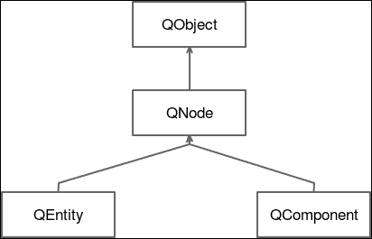

`QNode`类是所有 Qt3D 节点类的基类。它依赖于`QObject`类来定义父子关系。每个`QNode`类实例还添加了一个唯一的`id`变量，这使得它可以被识别为其他实例。

即使`QNode`不能与 Qt Quick 类型混合，但它们可以被添加到`Q3DScene`元素（或在 QML 中的`Scene3D`），它作为 Qt3D 内容的画布，并可以被添加到 Qt Quick 的`Item`中。将`World.qml`添加到场景就像这样简单：

```cpp
Rectangle { 

    Scene3D { 
        id: scene 
        anchors.fill: parent 
        focus: true 

        World { } 
    } 
} 

```

`Scene3D`元素包含一个`World`实例并定义了常见的 Qt Quick 属性（`anchors`、`focus`）。

# 为你的树莓派配置 Qt

这个项目针对一个新的嵌入式平台：树莓派。Qt 官方支持树莓派 2，但我们没有遇到任何麻烦地在树莓派 3 上运行了项目。如果你没有这些设备之一，尽管如此，阅读这一节了解交叉编译的工作原理以及如何在 Qt Creator 中配置自己的工具包可能仍然很有趣。无论如何，本章的其余部分将在桌面平台上运行。

在深入到树莓派配置之前，让我们退一步来理解我们的目标。你的电脑可能运行在 x86 CPU 架构上。这意味着你运行的每个程序都将使用你 CPU 的 x86 指令集执行。在 Qt Creator 中，这转化为你的可用套件。一个套件必须匹配你的目标平台。在启动时，Qt Creator 会在你的电脑上搜索可用的套件，并为你加载它们。

在第五章中，*掌握移动 UI*，我们针对不同的平台：Android 和 iOS。这些平台运行在不同的 CPU 指令集：ARM。幸运的是，Qt 背后的团队为我们自动配置了必要的组件，使其能够工作。

树莓派也运行在 ARM 上，但默认情况下并不适用于 Qt。在 Qt Creator 中玩耍之前，我们必须先准备它。请注意，以下命令是在 Linux 盒子上运行的，但你应该能够使用 Cygwin 在 Mac 或 Windows 上运行它们。

### 注意

请遵循完整的指南来准备你的树莓派以用于 Qt，请参阅[`wiki.qt.io/RaspberryPi2EGLFS`](https://wiki.qt.io/RaspberryPi2EGLFS)，或者简单地从[`www.qtrpi.com`](http://www.qtrpi.com)下载预编译的捆绑包。

完整的树莓派安装指南超出了本书的范围。尽管如此，总结主要步骤仍然很有趣：

1.  将开发包添加到树莓派中。

1.  获取完整的工具链，包括将在你的机器上执行的交叉编译器。

1.  在你的机器上创建一个`sysroot`文件夹，它将镜像树莓派上必要的目录。

1.  在`sysroot`文件夹中使用交叉编译器编译 Qt。

1.  将这个`sysroot`与树莓派同步。

`sysroot`只是一个包含给定平台最小文件系统的目录。它通常包含`/usr/lib`和`/usr/include`目录。在你的机器上拥有这个目录使得交叉编译器能够正确编译和链接输出二进制文件，而无需从树莓派上执行。

所有这些步骤都是为了避免在树莓派上直接编译任何东西。作为一个低功耗设备，任何编译的执行都会花费非常非常长的时间。在树莓派上编译 Qt 可能需要超过 40 小时。了解这一点后，配置交叉编译器所花费的时间似乎更容易承受。

在 wiki 中提到的`qopenglwidget`示例在继续之前应该能够正常运行。一旦完成，我们必须交叉编译一些更多的 Qt 模块，以便我们的项目能够运行：

+   `Qtdeclarative`：这个模型用于访问 Qt Quick

+   `qt3d`：这个模型用于构建 3D 世界

+   `qtquickcontrols`：这个模型用于包含有趣的控件（标签）

+   `qtquickcontrols2`：这个模型用于提供一些新的布局

对于这些模块中的每一个，执行以下命令（从你的`~/raspi`目录）：

```cpp
git clone git://code.qt.io/qt/<modulename>.git -b 5.7
cd <modulename>
~/raspi/qt5/bin/qmake -r
make
make install

```

### 小贴士

您可以通过在 `make` 中添加参数 `-j`（或 `--jobs`）来加快编译速度。`make` 命令将尝试并行化编译任务，如果您的 CPU 有四个核心，使用 `make -j 4`，八个核心，`make -j 8`，依此类推。

当所有内容都编译完成后，再次使用以下命令同步您的 `sysroot` 目录：

```cpp
rsync -avz qt5pi pi@IP:/usr/local

```

在之前的命令中，你必须将 `IP` 替换为实际的树莓派地址。

树莓派已准备好执行我们的 Qt 代码。然而，我们必须在 Qt Creator 中创建自己的工具包，以便能够编译和部署我们的程序。一个工具包由以下部分组成：

+   一个**编译器**，它将使用目标平台的 CPU 指令集编译您的代码。

+   一个能够了解目标平台指令集的**调试器**，以便正确地中断并读取内存内容。

+   为目标平台编译和链接您的二进制文件而编译的**Qt 版本**。

+   一个**设备**，Qt Creator 可以连接到以部署和执行您的程序。

我们将从编译器开始。在 Qt Creator 中：

1.  前往**工具** | **选项** | **构建和运行** | **编译器**。

1.  点击**添加** | **GCC**。

1.  浏览到`~/raspi/tools/arm-bcm2708/gcc-linaro-arm-linux-gnueabihf-raspbian/bin/arm-linux-gnueabihf-g++`。

1.  将编译器重命名为`Rpi GCC`。

这个奇怪的二进制名称使得 Qt 更容易解析 **ABI**（**应用程序二进制接口**），以找出平台架构、文件格式等。它应该看起来像这样：

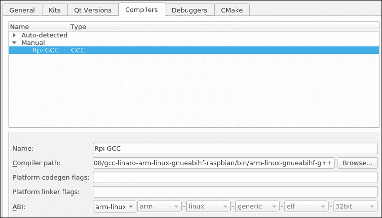

现在是调试器的时间。正如我们之前所说的，我们是从 Linux 箱子（Ubuntu）构建这个项目的。交叉编译和嵌入式开发在 Linux 上通常更容易，但您应该能够在 Windows 或 Mac 上通过一些额外的步骤完成相同的工作。

在 Ubuntu Linux 上，只需使用命令`sudo apt-get install gdb-multiarch`安装多架构的 `gdb`。在 Qt Creator 中，在**调试器**选项卡中添加这个新的调试器：

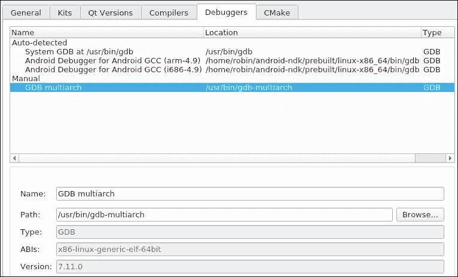

接下来，在**Qt 版本**选项卡中添加在维基页面上解释的交叉编译 Qt。点击**添加**并浏览到`~/raspi/qt5/bin/qmake`。这是生成的 Qt 版本：

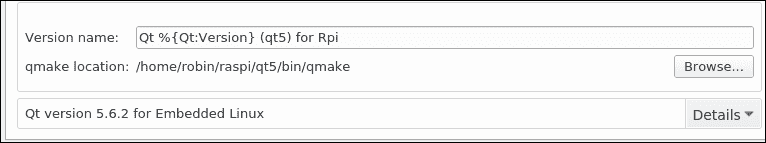

我们几乎完成了！在构建工具包之前，我们只需配置 Raspberry Pi 设备访问。在**选项** | **设备**中，按照以下步骤操作：

1.  点击**添加..** | **通用 Linux 设备** | **开始向导**。

1.  名称将是 `Rpi 2`（如果你有，则为 3）。

1.  输入您的设备 IP 地址（是的，您必须连接到您的本地网络！）。

1.  默认用户名是**pi**。

1.  默认密码是 "raspberry"。

1.  点击**下一步**以测试与设备的连接。

如果一切顺利，这就是您的新设备：

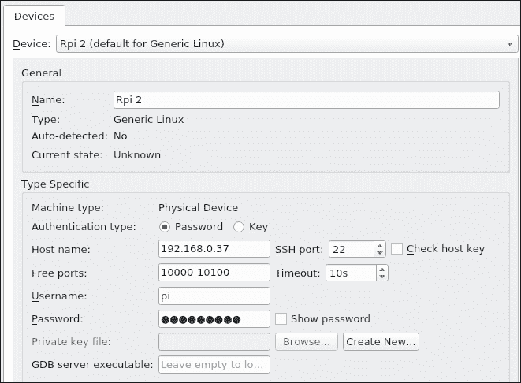

最后，套件将把所有这些部分组合成一个有效的 Qt Creator 平台。回到**构建和运行** | **套件**。从这里，您只需指向我们之前构建的每个部分。以下是生成的套件：

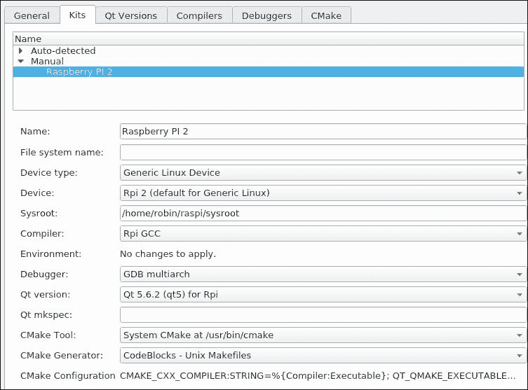

注意，**Sysroot**字段应指向我们之前在`~/raspi/sysroot`中创建的`sysroot`文件夹。

### 小贴士

如果您点击**名称**右侧的按钮，您可以为一套件选择自定义图片，例如 Raspberry Pi 标志。

现在一切准备就绪，可以制作一个精彩的蛇形游戏。

# 为您的 Qt3D 代码创建一个入口点。

对于那些在年轻时没有玩过蛇形游戏的人来说，这里有一个关于游戏玩法的小提醒：

+   您控制着在一个空旷区域移动的蛇。

+   这个区域被墙壁包围。

+   游戏区域内随机生成一个苹果。

+   如果蛇吃到了苹果，它会变长，并且您会得到一分。之后，游戏区域中会再次生成一个苹果。

+   如果蛇碰到墙壁或其自身的任何一部分，您就会失败。

目标是吃尽可能多的苹果以获得最高分。蛇越长，避开墙壁和自身尾巴就越困难。哦，而且每次蛇吃苹果时，它都会变得越来越快。游戏架构将是以下这样：

+   所有游戏项目都将使用 Qt3D 在 QML 中定义。

+   所有游戏逻辑都将使用 JavaScript 完成，它将与 QML 元素通信。

我们将通过将相机放置在游戏区域上方来保持原始蛇形游戏的 2D 感觉，但我们将通过 3D 模型和一些着色器来增加趣味性。

好的，我们花费了大量页面来准备这一刻。现在是时候开始蛇形项目了。创建一个名为`ch06-snake`的新**Qt Quick Controls 应用程序**。在项目详情中：

1.  在**最小所需 Qt 版本**字段中选择**Qt 5.6**。

1.  取消选中**带有 ui.qml 文件**。

1.  取消选中**启用本地样式**。

1.  点击**下一步**并选择以下套件：

    +   RaspberryPi 2

    +   **桌面**

1.  点击**下一步** | **完成**。

我们必须添加 Qt3D 模块。按照如下方式修改`ch06-snake.pro`：

```cpp
TEMPLATE = app 

QT += qml quick 3dcore 3drender 3dquick 3dinput 3dextras 
CONFIG += c++11 

SOURCES += main.cpp 

RESOURCES += \ 
    snake.qrc 

HEADERS += 

target.files = ch06-snake 
target.path = /home/pi 
INSTALLS += target 

```

我们必须准备应用程序的入口点，以便拥有一个适当的 OpenGL 上下文，Qt3D 可以在此上下文中工作。按照如下方式打开并更新`main.cpp`：

```cpp
#include <QGuiApplication> 
#include <QtGui/QOpenGLContext> 
#include <QtQuick/QQuickView> 
#include <QtQml/QQmlEngine> 

int main(int argc, char *argv[]) 
{ 
    QGuiApplication app(argc, argv); 

    qputenv("QT3D_GLSL100_WORKAROUND", ""); 

    QSurfaceFormat format; 
    if (QOpenGLContext::openGLModuleType() == 
        QOpenGLContext::LibGL) { 
        format.setVersion(3, 2); 
        format.setProfile(QSurfaceFormat::CoreProfile); 
    } 
    format.setDepthBufferSize(24); 
    format.setStencilBufferSize(8); 

    QQuickView view; 
    view.setFormat(format); 
    view.setResizeMode(QQuickView::SizeRootObjectToView); 
    QObject::connect(view.engine(), &QQmlEngine::quit,  
                     &app, &QGuiApplication::quit); 
    view.setSource(QUrl("qrc:/main.qml")); 
    view.show(); 

    return app.exec(); 
} 

```

想法是配置一个`QSurfaceFormat`以正确处理 OpenGL，并将其提供给自定义的`QQuickView view`。这个`view`将使用此格式来绘制自己。

`qputenv("QT3D_GLSL100_WORKAROUND", "")`指令是与某些嵌入式 Linux 设备（如 Raspberry Pi）上的 Qt3D 着色器相关的绕过方法。它将为一些嵌入式设备所需的灯光启用一个单独的 GLSL 1.00 片段。如果您不使用此绕过方法，您将得到一个黑色屏幕，并且无法在 Raspberry Pi 上正确运行项目。

### 小贴士

Qt3d 灯光绕过细节在此：[`codereview.qt-project.org/#/c/143136/`](https://codereview.qt-project.org/#/c/143136/)。

我们选择使用 Qt Quick 来处理视图。另一种方法是为 `QMainWindow` 创建一个 C++ 类，使其成为 QML 内容的父类。这种方法可以在许多 Qt3D 示例项目中找到。两种方法都是有效的并且可以工作。你倾向于使用 `QMainWindow` 方法编写更多的代码，但它允许你仅使用 C++ 创建 3D 场景。

注意，`main.cpp` 文件中的 `view` 尝试加载一个 `main.qml` 文件。你可以看到它正在加载；以下是 `main.qml`：

```cpp
import QtQuick 2.6 
import QtQuick.Controls 1.4 

Item { 
    id: mainView 

    property int score: 0 
    readonly property alias window: mainView 

    width: 1280; height: 768 
    visible: true 

    Keys.onEscapePressed: { 
        Qt.quit() 
    } 

    Rectangle { 
        id: hud 

        color: "#31363b" 
        anchors.left: parent.left 
        anchors.right: parent.right 
        anchors.top : parent.top 
        height: 60 

        Label { 
            id: snakeSizeText 
            anchors.centerIn: parent 
            font.pointSize: 25 
            color: "white" 
            text: "Score: " + score 
        } 
    } 
} 

```

在这里，我们定义了屏幕顶部的 **HUD**（**抬头显示**），其中将显示得分（吃掉苹果的数量）。注意，我们将 Esc 键绑定到了 `Qt.quit()` 信号。这个信号在 `main.cpp` 中连接到了 `QGuiApplication::quit()` 信号，以便退出应用程序。

QML 上下文现在已准备好欢迎 Qt3D 内容。按照如下方式修改 `main.qml`：

```cpp
import QtQuick 2.6 
import QtQuick.Controls 1.4 
import QtQuick.Scene3D 2.0 

Item { 
    ... 

    Rectangle { 
        id: hud 
        ... 
    } 

    Scene3D { 
        id: scene 
        anchors.top: hud.bottom 
        anchors.bottom: parent.bottom 
        anchors.left: parent.left 
        anchors.right: parent.right 
        focus: true 
        aspects: "input" 
    } 
} 

```

`Scene3D` 元素占据了 `hud` 对象下面的所有可用空间。它获取窗口的焦点，以便能够拦截键盘事件。它还启用了输入方面，以便 Qt3D 引擎在其图遍历中处理键盘事件。

# 设置场景

我们现在可以开始编写 Qt3D 代码了。第一步是定义场景的根。创建一个名为 `GameArea.qml` 的新文件：

```cpp
import Qt3D.Core 2.0 
import Qt3D.Render 2.0 
import Qt3D.Extras 2.0 

Entity { 
    id: root 

    property alias gameRoot: root 

    Camera { 
        id: camera 
        property real x: 24.5 
        property real y: 14.0 

        projectionType: CameraLens.PerspectiveProjection 
        fieldOfView: 45 
        aspectRatio: 16/9 
        nearPlane : 0.1 
        farPlane : 1000.0 
        position: Qt.vector3d( x, y, 33.0 ) 
        upVector: Qt.vector3d( 0.0, 1.0, 0.0 ) 
        viewCenter: Qt.vector3d( x, y, 0.0 ) 
    } 

    RenderSettings { 
        id: frameFraph 
        activeFrameGraph: ForwardRenderer { 
            clearColor: Qt.rgba(0, 0, 0, 1) 
            camera: camera 
        } 
    } 

    components: [frameFraph] 
} 

```

我们首先做的事情是创建一个相机并将其定位。记住，在 OpenGL 中，坐标遵循你右手拇指指向的左侧！：

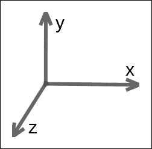

通过将相机放置在 `Qt.vector3d(x, y, 33)`，我们使其“从屏幕中出来”，以便能够用简单的 `x`、`y` 轴来表示我们尚未创建的实体的坐标。`upVector: Qt.vector3d(0.0, 1.0, 0.0)` 指定了相机的向上向量，在我们的例子中是 `Y` 轴。最后，我们指向 `Qt.vector(x, y, 0)`，意味着屏幕的中心。

总体目标是简化坐标表达。通过这种方式定位相机，将对象放置在坐标 0, 0 将使其位于窗口的左下角，而坐标 50, 28 则意味着窗口的右上角。

我们还使用一个 `ForwardRendered` 配置 `RenderSettings`，它定义了两个属性：

+   `clearColor`：这个属性 `Qt.rgba(0, 0, 0, 1)` 表示背景将是漆黑一片

+   `camera`：这个属性用于确定要渲染的视口

场景已准备好渲染，但我们需要处理用户输入，即键盘。为了捕获键盘事件，将 `GameArea.qml` 修改如下：

```cpp
import Qt3D.Core 2.0 
import Qt3D.Render 2.0 
import Qt3D.Input 2.0 

Entity { 
    ... 
    RenderSettings { 
        ... 
    } 

    KeyboardDevice { 
        id: keyboardController 
    } 

    InputSettings { id: inputSettings } 

    KeyboardHandler { 
        id: input 
        sourceDevice: keyboardController 
        focus: true 
        onPressed: { } 
    } 

    components: [frameFraph, input] 
} 

```

`KeyboardDevice` 元素负责将按键事件分发到活动的 `KeyboardHandler`，即 `input`。`KeyboardHandler` 组件附加到控制器上，并且每次按键时都会调用 `onPressed()` 函数。`KeyboardHandler` 是一个组件；因此它需要被添加到 `GameArea` 的组件列表中。

`GameArea` 最后缺失的部分是准备引擎执行（初始化和更新）：

```cpp
import Qt3D.Core 2.0 
import Qt3D.Render 2.0 
import Qt3D.Input 2.0 
import QtQuick 2.6 as QQ2 

Entity { 
    id: root 

    property alias gameRoot: root 
    property alias timerInterval: timer.interval 
    property int initialTimeInterval: 80 
    property int initialSnakeSize: 5 
    property string state: "" 
    ... 

    KeyboardDevice { 
        id: keyboardController 
    } 

    QQ2.Component.onCompleted: { 
        console.log("Start game..."); 
        timer.start() 
    } 

    QQ2.Timer { 
        id: timer 
        interval: initialTimeInterval 
        repeat: true 
        onTriggered: {} 
    } 

    components: [frameFraph, input] 
}  

```

在这里，我们混合了 Qt Quick 元素和 Qt3D。由于可能存在名称冲突，我们必须使用别名`QQ2`导入模块。我们已经在第五章，*掌握移动 UI*中遇到了`Component.onCompleted`。它的任务将是启动游戏引擎并启动定义在后面的`timer`。

这个`timer`变量将每 80 毫秒（如`initialTimeInterval`属性中定义的）重复一次，并调用引擎的`update()`函数。当我们构建引擎代码时，这个函数将在本章后面被介绍。目标是尽可能接近地模拟原始的蛇游戏。整个游戏逻辑将在这个间隔更新，而不是在正常的帧刷新间隔。每次调用`update()`后，蛇将前进。因此，蛇的移动不会是平滑的，而是断断续续的。这显然是我们为了获得复古游戏感觉而做出的设计选择。

每当蛇吃到一个苹果时，会发生两件事：

+   计时器的`interval`将由引擎（通过`timerInterval`属性访问）减少。

+   蛇会生长。它的初始大小由`intialSnakeSize`属性定义。

减少计时器间隔会使蛇移动得更快，直到很难控制其方向。

# 组装你的 Qt3D 实体

我们现在将开始创建游戏的基本构建块，每个都是以`Entity`元素的形式：

+   `Wall`：这代表蛇不能去的极限

+   `SnakePart`：这代表蛇身体的一部分

+   `Apple`：这代表在随机位置生成的苹果（不可能！）

+   `Background`：这代表蛇和苹果后面的漂亮背景

每个实体都将放置在由引擎处理的网格上，并将有一个类型标识符，以便更容易找到。为了将这些属性归一化，让我们创建一个名为`GameEntity.qml`的父 QML 文件：

```cpp
import Qt3D.Core 2.0 

Entity { 
    property int type: 0 
    property vector2d gridPosition: Qt.vector2d(0, 0) 
} 

```

这个`Entity`元素只定义了一个`type`属性和一个`gridPosition`属性，这些将由引擎用于在网格上布局内容。

我们将构建的第一个项目是`Wall.qml`文件：

```cpp
import Qt3D.Core 2.0 

GameEntity { 
    id: root 

    property alias position: transform.translation 

    Transform { 
        id: transform 
    } 

    components: [transform] 
} 

```

正如你所见，`Wall`类型没有任何视觉表示。因为我们针对的是树莓派设备，我们必须非常小心 CPU/GPU 的消耗。游戏区域将是一个网格，其中每个单元格包含我们实体中的一个实例。蛇将被`Wall`实例所包围。树莓派的运行速度远低于普通电脑，如果显示所有墙壁，游戏将变得难以忍受地慢。

为了解决这个问题，墙壁是看不见的。它们将被放置在可见视口之外，窗口的边缘将作为蛇的视觉极限。当然，如果你不是针对树莓派，而是你的电脑，显示墙壁并使它们看起来比什么都没有更华丽是可以的。

我们接下来要实现的下一个`Entity`元素是`SnakePart.qml`：

```cpp
import Qt3D.Core 2.0 
import Qt3D.Render 2.0 
import Qt3D.Extras 2.0 

GameEntity { 
    id: root 

    property alias position: transform.translation 

    PhongMaterial { 
        id: material 
        diffuse: "green" 
    } 

    CuboidMesh { 
        id: mesh 
    } 

    Transform { 
        id: transform 
    } 

    components: [material, mesh, transform] 
} 

```

如果添加到`GameArea`场景中，`SnakePart`块将显示一个单独的绿色立方体。`SnakePart`块不是完整的蛇，而是其身体的一部分。记住，蛇每次吃苹果时都会增长。增长意味着将一个新的`SnakePart`实例添加到`SnakePart`列表中。

让我们继续使用`Apple.qml`：

```cpp
import Qt3D.Core 2.0 
import Qt3D.Render 2.0 
import Qt3D.Extras 2.0 

GameEntity { 
    id: root 

    property alias position: transform.translation 
    property alias color: material.diffuse 

    Transform { 
        id: transform 
        scale: 0.5 
    } 

    Mesh { 
        id: mesh 
        source: "models/apple.obj" 
    } 

    DiffuseMapMaterial { 
        id: material 
        diffuse: "qrc:/models/apple-texture.png" 
    } 

    components: [material, mesh, transform] 
} 

```

这个片段首先介绍了 Qt3D 更复杂但易于使用的功能，即自定义网格及其上的纹理。Qt3D 支持 Wavefront `obj`格式来加载自定义网格。在这里，我们将一个自制的苹果添加到应用程序的`.qrc`文件中，我们只需提供这个资源的路径来加载它。

同样的原则也应用于`DiffuseMapMaterial`元素。我们添加了一个自定义纹理，并将其作为组件的源添加。

如你所见，`Entity`定义及其组件看起来非常相似。然而，我们轻松地将 Qt3D 的`CuboidMesh`与自定义模型交换。

我们将使用`Background.qml`进一步推进：

```cpp
import Qt3D.Core 2.0 
import Qt3D.Render 2.0 
import Qt3D.Extras 2.0 

Entity { 
    id: root 

    property alias position: transform.translation 
    property alias scale3D: transform.scale3D 

    MaterialBackground { 
        id: material 
    } 

    CuboidMesh { 
        id: mesh 
    } 

    Transform { 
        id: transform 
    } 

    components: [material, mesh, transform] 
} 

```

`Background`块将在蛇和苹果后面显示。乍一看，这个实体非常像`SnakePart`。然而，`Material`不是一个 Qt3D 类。它是一个自定义定义的`Material`，依赖于着色器。让我们看看`MaterialBackground.qml`：

```cpp
import Qt3D.Core 2.0 
import Qt3D.Render 2.0 

Material { 
    id: material 

    effect: Effect { 
        techniques: [ 
            Technique { 
                graphicsApiFilter { 
                    api: GraphicsApiFilter.OpenGL 
                    majorVersion: 3 
                    minorVersion: 2 
                } 
                renderPasses: RenderPass { 
                    shaderProgram: ShaderProgram { 
                        vertexShaderCode:   
                        loadSource("qrc:/shaders/gl3/grass.vert") 
                        fragmentShaderCode:  
                        loadSource("qrc:/shaders/gl3/grass.frag") 
                    } 
                } 
            } 
        ] 
    } 
} 

```

如果你不太熟悉着色器，我们可以用以下语句来概括它们：着色器是使用 C 风格语法编写的计算机程序，由 GPU 执行。你的逻辑数据将由 CPU 提供，并使 GPU 内存中的着色器可用。在这里，我们操作两种类型的着色器：

+   **顶点着色器**，它在你的网格源中的每个顶点上执行

+   **片段着色器**，它在每个像素上执行以生成最终渲染

通过在 GPU 上执行，这些着色器利用了 GPU 巨大的并行化能力（这比你的 CPU 高几个数量级）。它使得现代游戏能够拥有如此惊人的视觉效果。涵盖着色器和 OpenGL 管道超出了本书的范围（仅此主题就可以填满几个书架）。我们将限制自己向您展示如何在 Qt3D 中使用着色器。

### 注意

如果你想深入研究 OpenGL 或提高你的着色器技能，我们推荐 Graham Sellers、Richard S Wright Jr.和 Nicholas Haemel 合著的《OpenGL SuperBible》。

Qt3D 以非常方便的方式支持着色器。只需将你的着色器文件添加到`.qrc`资源文件中，并在给定`Material`的`effect`属性中加载它。

在这个片段中，我们指定这个着色器`Technique`只应在 OpenGL 3.2 上运行。这由`graphicsApiFilter`块指示。这个版本的 OpenGL 针对你的桌面机器。因为你的桌面和树莓派之间的性能差距非常明显，所以我们有能力根据平台执行不同的着色器。

因此，以下是树莓派兼容的技术：

```cpp
Technique { 
    graphicsApiFilter { 
        api: GraphicsApiFilter.OpenGLES 
        majorVersion: 2 
        minorVersion: 0 
    } 

    renderPasses: RenderPass { 
        shaderProgram: ShaderProgram { 
            vertexShaderCode:  
                loadSource("qrc:/shaders/es2/grass.vert") 
            fragmentShaderCode:  
                loadSource("qrc:/shaders/es2/grass.frag") 
        } 
    } 
} 

```

你只需将其添加到`Material`的`techniques`属性中。请注意，目标 OpenGL 版本是 OpenGLES 2.0，它可以在你的树莓派上运行得很好，甚至可以在你的 iOS/Android 手机上运行。

最后要讨论的是如何将参数传递给着色器。以下是一个例子：

```cpp
Material { 
    id: material 

    parameters:  [ 
        Parameter { 
            name: "score"; value: score 
        } 
    ] 
    ... 
} 

```

`score`变量将通过这个简单的部分在着色器中可访问。请查看该章节的源代码以查看此`Material`元素的完整内容。我们编写了一个着色器的乐趣，它可以在草地纹理上显示移动和发光的波浪。

游戏中唯一固定的元素是背景。我们可以直接将其添加到`GameArea.qml`：

```cpp
Entity { 
    id: root 
    ... 

    Background { 
        position: Qt.vector3d(camera.x, camera.y, 0) 
        scale3D: Qt.vector3d(camera.x * 2, camera.y * 2, 0) 
    } 

    components: [frameFraph, input] 
} 

```

`Background`元素被定位以覆盖蛇和苹果后面的整个可见区域。由于它定义在`GameArea`内部，它将被自动添加到实体/组件树中，并立即绘制。

# 准备游戏板

即使我们的游戏有 3D 的表现形式，我们也会实现像原始贪吃蛇游戏那样的 2D 游戏玩法。我们的游戏物品将在一个 2D 区域内诞生、生存和死亡。就像棋盘一样，这个板将由行和列组成。但在我们的贪吃蛇游戏中，每个方块都可以是：

+   一个苹果

+   一条蛇

+   一堵墙

+   空的

这里是引擎视角下板表示的一个例子：

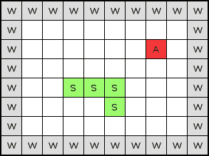

这是一个 10x8 的小板；即使大小不重要，你也将能够定义一个更大的板。你的游戏，你的规则！我们的游戏区域周围有墙壁（**W**）。一个苹果（**A**）在 7x2 的位置生成。最后，我们有一条蛇（**S**），从 3x4 开始，到 5x5 结束。

是时候创建我们的板类了。请创建一个名为`board.js`的 JS 文件：

```cpp
function Board(columnCount, rowCount, blockSize) { 
    this.columnCount = columnCount; 
    this.rowCount = rowCount; 
    this.blockSize = blockSize; 
    this.maxIndex = columnCount * rowCount; 
    this.data = new Array(this.maxIndex); 
} 

```

这个对象构造函数需要三个参数。`columnCount`和`rowCount`参数将帮助您选择板的尺寸。最后一个参数`blockSize`是 OpenGL 世界中板方块的尺寸。例如，我们可以将`blockSize`设置为 10。在这种情况下，7x2 的苹果在板上的显示将是 OpenGL 世界中的`x = 70`和`y = 20`。在本章中，我们将使用`blockSize`为 1，因此板坐标与 OpenGL 坐标匹配。

让我们在`board.js`中添加一些实用函数：

```cpp
Board.prototype.init = function() { 
    for (var i = 0; i < this.data.length; i++) { 
        this.data[i] = null; 
    } 
} 

Board.prototype.index = function(column, row) { 
    return column + (row * this.columnCount); 
} 

Board.prototype.setData = function(data, column, row) { 
    this.data[this.index(column, row)] = data; 
} 

Board.prototype.at = function(column, row) { 
    return this.data[this.index(column, row)]; 
} 

```

在 JavaScript 中定义一个类可能会让 C++开发者感到困扰。每个 JavaScript 对象都有一个原型对象，你可以向其中添加函数。我们正在使用它来向`Board`添加类方法。

下面是`Board`类每个函数目的的总结：

+   `init()`: 这个函数将所有数组值初始化为`null`值

+   `index()`: 这个函数从列/行坐标返回数组索引

+   `setData()`: 这个函数将根据列/行坐标在板上分配`data`值

+   `at()`: 这个函数从列/行坐标检索数组中的`data`值

请注意，在我们的情况下，一个`null`方块表示一个空方块。

# 从工厂创建实体

现在我们有一个接收项目的棋盘，我们将创建游戏项目工厂。工厂是一种设计模式，它允许我们创建一个对象，而不向调用者暴露创建逻辑。这个工厂可以被视为一个辅助类，它将处理当你想从 JavaScript 中创建一个新的游戏项目时所需的全部脏活累活。你还记得 `GameEntity.qml` 吗？它是 `Apple.qml`、`Snake.qml` 和 `Wall.qml` 的父类。工厂将能够根据给定的类型和坐标创建特定的实体。我们将使用属性类型来识别实体种类。以下是我们在蛇形游戏中使用的工厂模式架构：

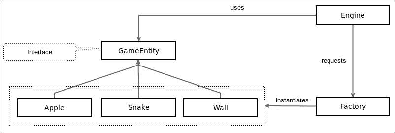

我们现在可以创建一个名为 `factory.js` 的文件，其内容如下：

```cpp
var SNAKE_TYPE = 1; 
var WALL_TYPE  = 2; 
var APPLE_TYPE = 3; 

var snakeComponent = Qt.createComponent("Snake.qml"); 
var wallComponent = Qt.createComponent("Wall.qml"); 
var appleComponent = Qt.createComponent("Apple.qml"); 

```

首先，我们定义所有游戏实体类型。在我们的例子中，我们有苹果、蛇和墙壁类型。然后，我们从 QML 文件中创建游戏项目组件。这些组件将由工厂用于动态创建新的游戏实体。

我们现在可以添加构造函数和一个 `removeAllEntities()` 工具函数来删除所有实例化的实体：

```cpp
function GameFactory() { 

    this.board = null; 
    this.parentEntity = null; 
    this.entities = []; 
} 

GameFactory.prototype.removeAllEntities = function() { 
    for(var i = 0; i < this.entities.length; i++) { 
        this.entities[i].setParent(null); 
    } 

```

这个工厂有三个成员变量：

+   对上一节中描述的游戏 `board` 的引用

+   对 `parentEntity` 变量的引用，即游戏区域

+   一个保存已创建项目引用的 `entities` 数组

`removeAllEntities()` 函数将从其父级（即游戏区域）中删除项目，并创建一个新的空 `entities` 数组。这确保了旧实体被垃圾回收器删除。

让我们在工厂中添加核心函数 `createGameEnity()`：

```cpp
GameFactory.prototype.createGameEntity = function(type, column, row) { 
    var component; 
    switch(type) { 
    case SNAKE_TYPE: 
        component = snakeComponent; 
        break; 

    case WALL_TYPE: 
        component = wallComponent; 
        break; 

    case APPLE_TYPE: 
        component = appleComponent; 
        break; 
    } 
    var gameEntity = component.createObject(this.parentEntity); 
    gameEntity.setParent(this.parentEntity); 

    this.board.setData(gameEntity, column, row); 
    gameEntity.gridPosition = Qt.vector2d(column, row); 
    gameEntity.position.x = column * this.board.blockSize; 
    gameEntity.position.y = row * this.board.blockSize; 

    this.entities.push(gameEntity); 
    return gameEntity; 
} 

```

如您所见，调用者提供了一个实体 `type` 和棋盘坐标（`column` 和 `row`）。第一部分是一个开关，用于选择正确的 QML 组件。一旦我们有了组件，我们就可以调用 `component.createObject()` 来创建该组件的一个实例。这个新组件的父级将是 `this.parentEntity`，在我们的例子中，是 `GameArea`。然后，我们可以更新棋盘，更新实体位置，并将这个新实体添加到 `entities` 数组中。

最后一件要做的事情是更新我们的 QML 游戏实体以正确的工厂类型。请打开 `Apple.qml` 并按照以下方式更新文件：

```cpp
import "factory.js" as Factory 

GameEntity { 

    id: root 
    type: Factory.APPLE_TYPE 
    ... 
} 

```

你现在可以更新 `Snake.qml` 中的 `Factory.SNAKE_TYPE` 类型，以及 `Wall.qml` 中的 `Factory.WALL_TYPE` 类型。

# 在 JavaScript 中构建蛇形引擎

是时候动手实践了。让我们看看如何使用我们的棋盘、我们的工厂和 QML 的力量在 JavaScript 中创建一个管理蛇形游戏的引擎。

请创建一个新的 `engine.js` 文件，包含以下代码片段：

```cpp
.import "factory.js" as Factory 
.import "board.js" as Board 

var COLUMN_COUNT = 50; 
var ROW_COUNT = 29; 
var BLOCK_SIZE = 1; 

var factory = new Factory.GameFactory(); 
var board = new Board.Board(COLUMN_COUNT, ROW_COUNT, BLOCK_SIZE); 

var snake = []; 
var direction; 

```

前几行是 Qt 从另一个 JavaScript 文件中导入 JavaScript 文件的方式。然后，我们可以轻松实例化一个 `factory` 变量和一个 50x29 的 `board` 变量。`snake` 数组包含所有实例化的蛇形游戏项目。这个数组将有助于移动我们的蛇。最后，`direction` 变量是一个处理当前蛇方向的 2d 向量。

这是我们的引擎的第一个函数：

```cpp
function start() { 
    initEngine(); 

    createSnake(); 
    createWalls(); 

    spawnApple(); 
    gameRoot.state = "PLAY"; 
} 

```

这为我们总结了启动引擎时所做的操作：

1.  初始化引擎。

1.  创建初始蛇。

1.  创建围绕游戏区域的墙壁。

1.  生成第一个苹果。

1.  将`GameArea`状态切换到`PLAY`。

让我们从`initEngine()`函数开始：

```cpp
function initEngine() { 
    timer.interval = initialTimeInterval; 
    score = 0; 

    factory.board = board; 
    factory.parentEntity = gameRoot; 
    factory.removeAllEntities(); 

    board.init(); 
    direction = Qt.vector2d(-1, 0); 
} 

```

此函数初始化并重置所有变量。第一个任务是设置`GameArea`计时器的初始值。每次蛇吃到一个苹果，这个间隔就会减少，从而增加游戏速度和蛇的移动速度。从逻辑上讲，我们将玩家的分数重置为`0`。然后我们初始化工厂，提供板和`gameRoot`引用。`gameRoot`指的是`GameArea`；这个实体将是工厂实例化所有项目的父项。然后，我们从工厂中移除所有现有实体，并调用板的`init()`函数来清除板。最后，我们为蛇设置一个默认方向。向量`-1,0`意味着蛇将开始向左移动。如果你想让蛇向上移动，可以将向量设置为`0, 1`。

下一个函数是创建蛇：

```cpp
function createSnake() { 
    snake = []; 
    var initialPosition = Qt.vector2d(25, 12); 
    for (var i = 0; i < initialSnakeSize; i++) { 
       snake.push(factory.createGameEntity(Factory.SNAKE_TYPE, 
                                 initialPosition.x + i, 
                                 initialPosition.y)); 
    } 
} 

```

这里没有太大的问题，我们重置并初始化`snake`数组。第一个蛇项将在 25x12 处创建。然后我们继续创建我们需要的蛇项以生成具有正确初始大小的蛇。请注意，其他蛇项将创建在第一个项的右侧（26x12，27x12，等等）。你可以看到调用我们的工厂并请求新的蛇项实例是多么容易。

让我们在`engine.js`中添加`createWalls()`函数：

```cpp
function createWalls() { 
    for (var x = 0; x < board.columnCount; x++) { 
        factory.createGameEntity(Factory.WALL_TYPE, x, 0); 
        factory.createGameEntity(Factory.WALL_TYPE, x, board.rowCount - 1); 
    } 
    for (var y = 1; y < board.rowCount - 1; y++) { 
        factory.createGameEntity(Factory.WALL_TYPE, 0, y); 
        factory.createGameEntity(Factory.WALL_TYPE, board.columnCount - 1, y); 
    } 
} 

```

第一个循环创建顶部和底部墙壁。第二个循环创建左侧和右侧墙壁。第二个循环的索引与第一个不同，以避免两次创建角落。

现在我们来看看如何在`engine.js`中实现`spawnApple()`函数：

```cpp
function spawnApple() { 
    var isFound = false; 
    var position; 
    while (!isFound) { 
        position = Qt.vector2d(Math.floor(Math.random()  
                                    * board.columnCount), 
                               Math.floor(Math.random()  
                                    * board.rowCount)); 
        if (board.at(position.x, position.y) == null) { 
            isFound = true; 
        } 
    } 
    factory.createGameEntity(Factory.APPLE_TYPE, position.x, position.y); 

    if (timerInterval > 10) { 
        timerInterval -= 2; 
    } 
} 

```

第一步是找到一个空方格。while 循环将生成一个随机的板位置并检查一个方格是否为空。一旦找到一个空方格，我们就请求工厂在这个位置创建一个苹果实体。最后，我们减少`GameArea`的`timerInterval`值以加快游戏速度。

我们现在将在`engine.js`中添加一些与蛇位置相关的实用函数：

```cpp
function setPosition(item, column, row) { 
    board.setData(item, column, row); 
    item.gridPosition = Qt.vector2d(column, row); 
    item.position.x = column * board.blockSize; 
    item.position.y = row * board.blockSize; 
} 

function moveSnake(column, row) { 
    var last = snake.pop(); 
    board.setData(null, last.gridPosition.x, last.gridPosition.y); 
    setPosition(last, column, row); 
    snake.unshift(last); 
} 

```

`setPosition()`函数处理当我们想要移动一个游戏项时所需的所有必要任务。我们首先将游戏项分配到正确的板方格，然后更新`gridPosition`属性（从`GameEntity`），但也更新 OpenGL 的`position.x`和`position.y`。

第二个函数`moveSnake()`将蛇移动到相邻的方格。让我们分析这个函数执行的所有步骤：

1.  `snake`是我们包含所有蛇项的全局数组。`pop()`方法移除并返回我们存储在`last`变量中的最后一个元素。

1.  `last`变量包含蛇尾的网格位置。我们将此板方格设置为`null`；对我们来说这意味着一个空方格。

1.  `last` 变量现在放置在调用者请求的相邻方块上。

1.  `last` 变量最终插入到 `snake` 数组的开始处。

下一个图例展示了蛇在左侧移动时 `moveSnake()` 的过程。我们还用字母命名蛇项，以可视化尾巴变成头部，模拟移动的蛇：

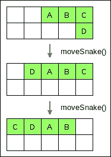

现在我们能够移动我们的蛇，我们必须处理按键事件以正确地移动蛇。请将此新函数添加到 `engine.js`：

```cpp
function handleKeyEvent(event) { 
    switch(event.key) { 
        // restart game 
        case Qt.Key_R: 
            start(); 
            break; 

        // direction UP 
        case Qt.Key_I: 
            if (direction != Qt.vector2d(0, -1)) { 
                direction = Qt.vector2d(0, 1); 
            } 
            break; 

        // direction RIGHT 
        case Qt.Key_L: 
            if (direction != Qt.vector2d(-1, 0)) { 
                direction = Qt.vector2d(1, 0); 
            } 
            break; 

        // direction DOWN 
        case Qt.Key_K: 
            if (direction != Qt.vector2d(0, 1)) { 
                direction = Qt.vector2d(0, -1); 
            } 
            break; 

        // direction LEFT 
        case Qt.Key_J: 
            if (direction != Qt.vector2d(1, 0)) { 
                direction = Qt.vector2d(-1, 0); 
            } 
            break; 
    } 
} 

```

在这个游戏中，我们使用 `I-J-K-L` 键来更新蛇的方向向量。就像原始的蛇形游戏一样，你不能改变方向。会进行一次检查以避免这种行为。请注意，按下 `R` 键将调用 `start()` 并重新开始游戏。我们很快就会看到如何将此功能与 QML 键盘控制器绑定。

到这里，我们来到了最后一个（但不是最不重要的）函数，即 `engine.js` 的 `update()` 函数：

```cpp
function update() { 
    if (gameRoot.state == "GAMEOVER") { 
        return; 
    } 

    var headPosition = snake[0].gridPosition; 
    var newPosition = Qt.vector2d(headPosition.x + direction.x, 
                                  headPosition.y + direction.y); 
    var itemOnNewPosition = board.at(newPosition.x, 
                                     newPosition.y); 

   ... 
} 

```

此函数将由 QML 以固定间隔调用。正如你所见，如果 `gameRoot`（即 `GameArea`）的 `state` 变量等于 `GAMEOVER`，此函数将不执行任何操作并立即返回。然后，执行三个重要步骤：

1.  在 `headPosition` 中检索蛇头的网格位置。

1.  使用 `newPosition` 中的 `direction` 向量确定蛇的移动路径。

1.  将项目放置在蛇将要移动的位置 `itemOnNewPosition`。

`update()` 函数的第二部分如下所示：

```cpp
function update() { 
    ... 
    if(itemOnNewPosition == null) { 
        moveSnake(newPosition.x, newPosition.y); 
        return; 
    } 

    switch(itemOnNewPosition.type) { 
        case Factory.SNAKE_TYPE: 
            gameRoot.state = "GAMEOVER"; 
            break; 

        case Factory.WALL_TYPE: 
            gameRoot.state = "GAMEOVER"; 
            break; 

        case Factory.APPLE_TYPE: 
            itemOnNewPosition.setParent(null); 
            board.setData(null, newPosition.x, newPosition.y); 
            snake.unshift(factory.createGameEntity( 
                   Factory.SNAKE_TYPE, 
                   newPosition.x, 
                   newPosition.y)); 
            spawnApple(); 
            score++; 
            break; 
    } 
} 

```

如果蛇要移动到一个空方块（`itemOnNewPosition` 是 `null`），这是可以的，我们只需将蛇移动到 `newPosition`。

如果方块不为空，我们必须根据项目类型应用正确的规则。如果下一个方块是蛇的一部分或墙壁，我们将状态更新为 `GAMEOVER`。另一方面，如果下一个方块是苹果，将执行以下几个步骤：

1.  从 `GameArea` 中移除苹果项，将其父级设置为 `null`。

1.  从板上移除苹果，将方块设置为 `null`。

1.  让蛇变长，在 `snake` 数组的开始处创建一个蛇的部分。

1.  在一个随机的空方块中生成一个新的苹果。

1.  增加分数。

我们的蛇形引擎现在已经完成。最后一步是从 QML 调用一些引擎函数。请更新 `GameArea.qml`：

```cpp
... 
import "engine.js" as Engine 

Entity { 
    ... 
    QQ2.Component.onCompleted: { 
        console.log("Start game..."); 
        Engine.start(); 
        timer.start() 
    } 

    QQ2.Timer { 
        id: timer 
        interval: initialTimeInterval 
        repeat: true 
        onTriggered: Engine.update() 
    } 

    KeyboardInput { 
        id: input 
        controller: keyboardController 
        focus: true 
        onPressed: Engine.handleKeyEvent(event) 
    } 
    ... 
} 

```

你现在可以玩游戏了。如果你吃了一个苹果，蛇会变长，你得到一分。当你撞到自己或墙壁时，游戏状态切换到 `GAMEOVER`，游戏停止。最后，如果你按下 `R` 键，游戏将重新开始。游戏看起来就像下面的截图所示，在 Raspberry Pi 上：

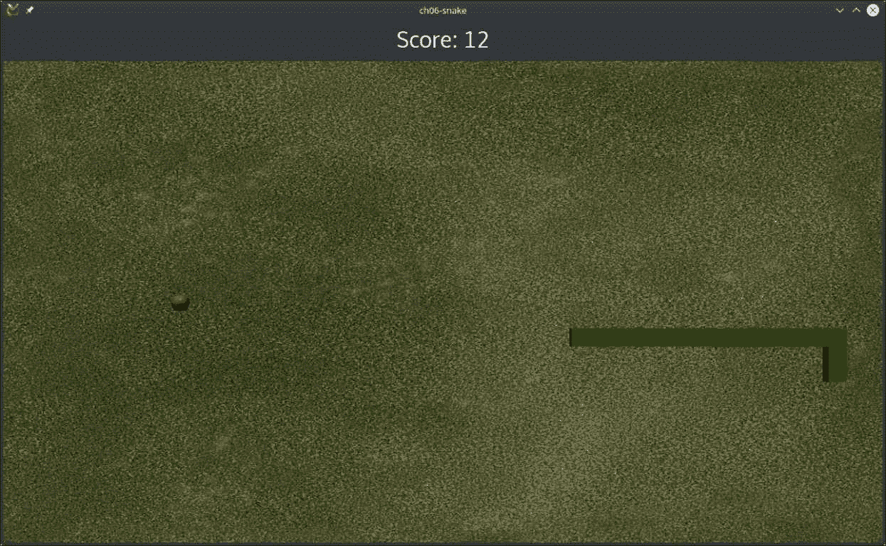

# 使用 QML 状态改变 HUD

我们现在将创建一个 "游戏结束" HUD，在游戏失败时显示。创建一个新的文件 `GameOverItem.qml`：

```cpp
Item { 
    id: root 
    anchors.fill: parent 

    onVisibleChanged: { 
        scoreLabel.text = "Your score: " + score 
    } 

    Rectangle { 
        anchors.fill: parent 
        color: "black" 
        opacity: 0.75 
    } 

    Label { 
        id: gameOverLabel 
        anchors.centerIn: parent 
        color: "white" 
        font.pointSize: 50 
        text: "Game Over" 
    } 

    Label { 
        id: scoreLabel 
        width: parent.width 
        anchors.top: gameOverLabel.bottom 
        horizontalAlignment: "AlignHCenter" 
        color: "white" 
        font.pointSize: 20 
    } 

    Label { 
        width: parent.width 
        anchors.bottom: parent.bottom 
        anchors.bottomMargin: 50 
        horizontalAlignment: "AlignHCenter" 
        color: "white" 
        font.pointSize: 30 
        text:"Press R to restart the game" 
    } 
} 

```

让我们检查这个游戏结束屏幕的元素：

+   一个黑色矩形，填充整个屏幕，具有 75% 的不透明度值。因此，游戏区域在“游戏结束”屏幕后面仍然可见，占 25%。

+   一个显示文本“游戏结束”的 `gameOverLabel` 标签。这是一个传统的视频游戏消息，但你可以用“失败！”或“太糟糕了！”等文本编辑此标签。

+   一个动态的 `scoreLabel` 标签，将显示最终得分。

+   一个标签，解释玩家如何重新开始游戏。

请注意，当根项目的可见性改变时，`scoreLabel` 文本会更新为 `main.qml` 中的当前 `score` 变量。

Qt Quick 提供了一个与 UI 状态相关的有趣功能。你可以为项目定义几个状态并描述每个状态的行为。我们现在将使用这个功能以及我们的 `GameOverItem` 在一个名为 `OverlayItem.qml` 的新文件中：

```cpp
Item { 
    id: root 

    states: [ 
        State { 
            name: "PLAY" 
            PropertyChanges { target: root; visible: false } 
        }, 
        State { 
            name: "GAMEOVER" 
            PropertyChanges { target: root; visible: true } 
            PropertyChanges { target: gameOver; visible: true } 
        } 
    ] 

    GameOverItem { 
        id: gameOver 
    } 
} 

```

你可以看到，`states` 元素是一个 `Item` 属性。默认情况下，`states` 元素包含一个空字符串状态。在这里，我们定义了两个名为 `PLAY` 和 `GAMEOVER` 的 `State` 项目。我们使用与 `engine.js` 中相同的命名约定。之后，我们可以将属性值绑定到状态。在我们的案例中，当状态是 `GAMEOVER` 时，我们将此 `OverlayItem` 和其 `GameOverItem` 的可见性设置为 `true`。否则，对于状态 `PLAY`，我们将其隐藏。

覆盖层 HUD 和其“游戏结束”屏幕已准备好使用。请更新你的 `mail.qml`，如下所示：

```cpp
Item { 
    id: mainView 
    property int score: 0 
    readonly property alias window: mainView 
    ... 
    OverlayItem { 
        id: overlayItem 
        anchors.fill: mainView 
        visible: false 

        Connections { 
            target: gameArea 
            onStateChanged: { 
                overlayItem.state = gameArea.state; 
            } 
        } 
    } 
} 

```

我们的 `OverlayItem` 元素适合屏幕，默认情况下不可见。就像 C++ Qt Widgets 信号/槽连接一样，你可以执行 QML 连接。目标属性包含将发送信号的项。然后你可以使用 QML 槽语法：

```cpp
on<PropertyName>Changed 

```

在我们的案例中，目标是 `gameArea`。这个项目包含 `state` 变量，因此我们可以使用 `onStateChanged` 通知状态变量更新。然后，我们切换 `OverlayItem` 的状态。这个赋值将触发 `OverlayItem` 元素中定义的所有 `ProperyChanged`，并显示或隐藏我们的 `GameOverItem`。

你现在可以输掉游戏并享受你的“游戏结束”覆盖层：

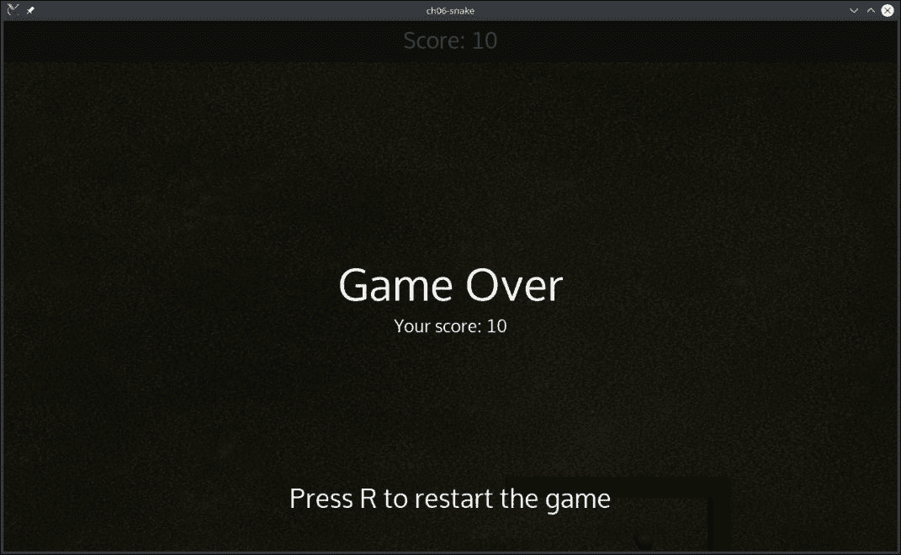

# 性能分析你的 QML 应用程序

Qt Creator 提供了一个 QML 分析器，可以在应用程序运行时收集有用的数据。你可以在桌面和远程目标（如我们的树莓派）上使用它。让我们检查你的调试构建配置是否允许 QML 调试和性能分析。点击 **项目** | **Rpi 2** | **构建**。然后你可以点击 **构建步骤** 中的 **qmake** 的 **详细信息**。你也应该检查你的桌面工具包：

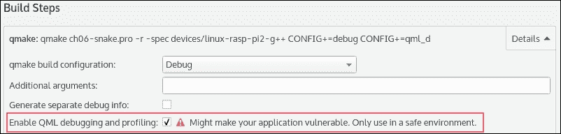

默认情况下，只有当你停止性能分析时，数据才会从目标发送到主机。你可以定期刷新数据：**工具** | **选项** | **分析器** | **QML 性能分析器**。

请记住，在性能分析时刷新数据可以在目标设备上释放内存，但会花费时间。因此，它可能会影响你的性能分析结果和分析。

当我们使用 Qt Creator 套件时，我们可以以相同的方式在桌面或远程设备上启动 QML 分析器。切换到套件并点击**分析** | **QML 分析器**以启动 QML 分析。如果你正在分析在桌面运行的程序，Qt Creator 将使用如下参数启动你的软件：

```cpp
-qmljsdebugger=file:/tmp/QtCreator.OU7985 

```

如果你正在分析远程设备（如树莓派）上的应用程序，Qt Creator 使用 TCP 套接字检索数据，添加如下参数：

```cpp
-qmljsdebugger=port:10000 

```

对于两个目标，QML 分析器之后将尝试连接到你的应用程序。在远程设备上启动 QML 分析器的另一种方法是使用`-qmljsdebugger`参数启动应用程序，例如：

```cpp
./ch06-snake -qmljsdebugger=port:3768 

```

然后，你可以点击**分析** | **QML 分析器（外部）**。选择你的远程套件（例如 Rpi 2），将**端口**设置为`3768`，然后点击**确定**。

太好了，QML 分析器已启动，出现了一个新的工具栏。你可以玩几秒钟的游戏，然后从 QML 分析器工具栏中点击**停止**按钮。然后 QML 分析器处理数据并显示类似以下内容：

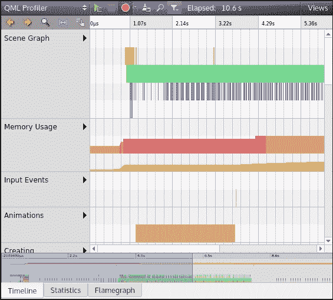

让我们从左到右开始分析顶部按钮：

1.  启动 QML 分析器。

1.  停止应用程序和 QML 分析器。

1.  启用/禁用分析。你也可以选择一个事件来捕获。

1.  丢弃数据以清理你的分析会话。

1.  搜索时间线事件备注。

1.  隐藏或显示事件类别。

1.  **已用时间**表示会话持续时间。

1.  **视图**隐藏或显示**时间线**、**统计信息**和**火焰图**选项卡。

为了学习如何使用 QML 分析器，我们将用一个实际案例。在树莓派上重启游戏有点慢。让我们用 QML 分析器找出需要几秒钟才能重启游戏的原因！

请遵循此操作模式以从 QML 分析器收集数据：

1.  选择树莓派套件。

1.  启动 QML 分析器。

1.  等待蛇撞到墙壁。

1.  按下**R**键重启游戏。

1.  等待游戏重启和蛇再次移动。

1.  停止 QML 分析器。

让我们使用**时间线**选项卡开始我们的调查。此视图显示事件的按时间顺序视图，按事件类型分组。JavaScript 行分解你的代码并显示有用的信息。你可以点击一个项目以获取一些详细信息。在时间线中识别你重启游戏的时间点。JavaScript 行可以读作从上到下的调用堆栈：

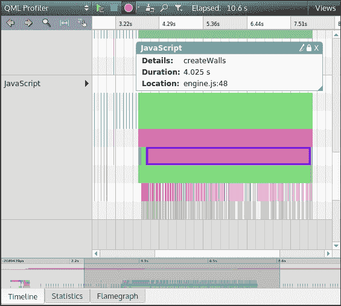

在我们这个案例中，我们在应用程序启动后大约 3.5 秒重启了游戏。以下是 QML 分析器提供的带有持续时间的堆栈。以下是 QML 分析器提供的带有持续时间的堆栈。让我们追踪当我们按下 R 键重启游戏时调用的所有函数：

+   来自`GameArea.qml`的`onPressed()`函数

+   来自`engine.js`的`handleKetEvent()`函数

+   在 4.2 秒的`engine.js`中的`start()`函数

    +   `initEngine()`在 80 毫秒

    +   `createSnake()`在 120 毫秒

    +   `createWalls()` 在 4.025 秒！

到这里了，`createWalls()` 在我们重启游戏时在 Raspberry Pi 上需要大约 4 秒钟。

让我们切换到 **统计** 视图：

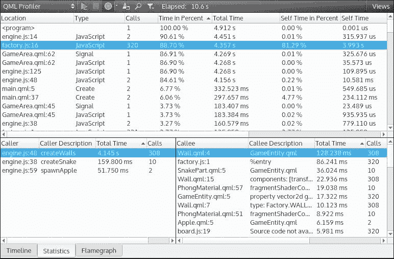

**统计**视图显示有关事件调用次数的数字。事件可以是 QML 绑定、创建、信号触发或 JavaScript 函数。底部部分显示 QML 调用者和被调用者。

调用者是绑定中变化的来源。例如，JS 函数 `createWalls()` 是一个调用者。

被调用者是绑定影响的受影响项。例如，QML 项 `Wall.qml` 是一个被调用者。

再次，`createWalls()` 请求许多工厂项创建似乎负责 Raspberry Pi 上游戏缓慢重启。

看看 QML 分析器的最后一个视图，**火焰图**：

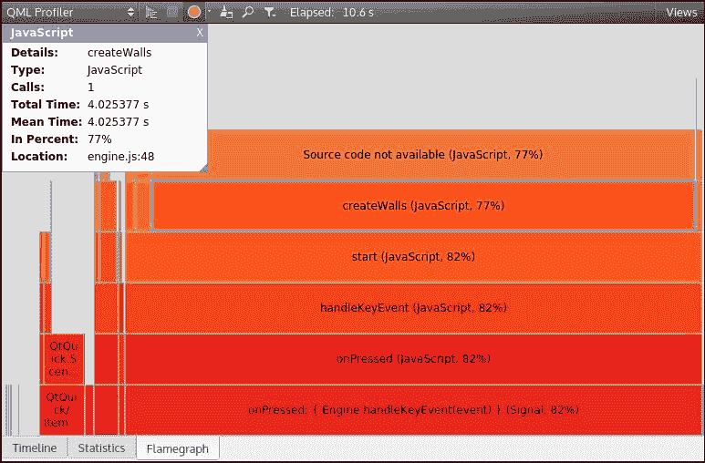

**火焰图** 视图是您在运行游戏时 QML 和 JavaScript 代码的紧凑总结。您可以看到调用次数和相对于总时间的持续时间。像 **时间轴** 视图一样，您可以看到调用栈，但自下而上！

再次，分析器表明 `createWalls()` 是一个耗时的函数。在一个持续 10 秒钟的剖析会话中，有 77% 的时间花在 `engine.createWalls()` 上。

现在，您将能够分析一个 QML 应用程序。您可以尝试编辑代码以加快重启速度。以下是一些提示：

+   在应用程序启动时仅创建墙壁一次；不要在每次重启时删除和重新创建它们。

+   在视频游戏中实现一个常见的模式：预加载项的对象池。当需要时请求墙壁，当不再使用时将其返回到池中。

# 摘要

在本章中，我们发现了如何使用 Qt3D 模块。您还学习了如何配置 Qt Creator 以创建用于嵌入式 Linux 设备的新套件。您的 Raspberry Pi 现在可以运行您的 Qt 应用程序了。我们使用 QML 视图和 JavaScript 引擎创建了一个蛇形游戏。我们还介绍了工厂设计模式，以便从引擎中轻松创建新的游戏项。最后，您现在可以使用强大的 QML 分析器调查 QML 软件的糟糕行为。

即使 Qt 是一个强大的框架，有时您也需要使用第三方库。在下一章中，我们将看到如何将 OpenCV 库集成到您的 Qt 应用程序中。
