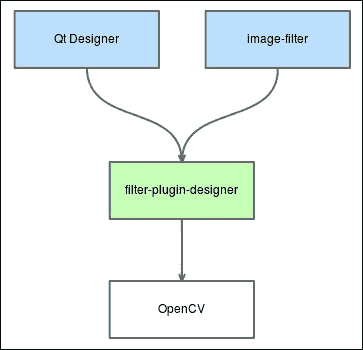
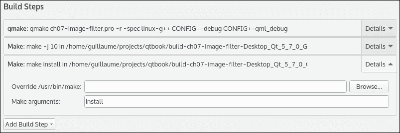
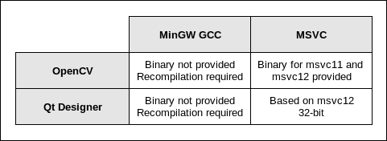
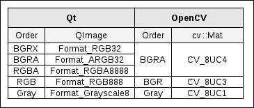
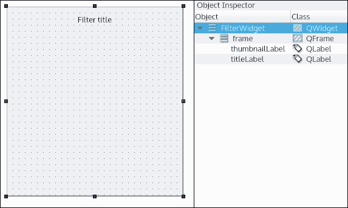
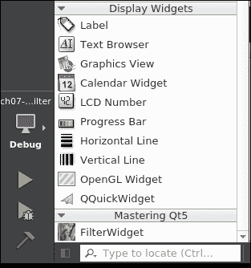
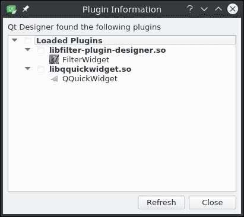
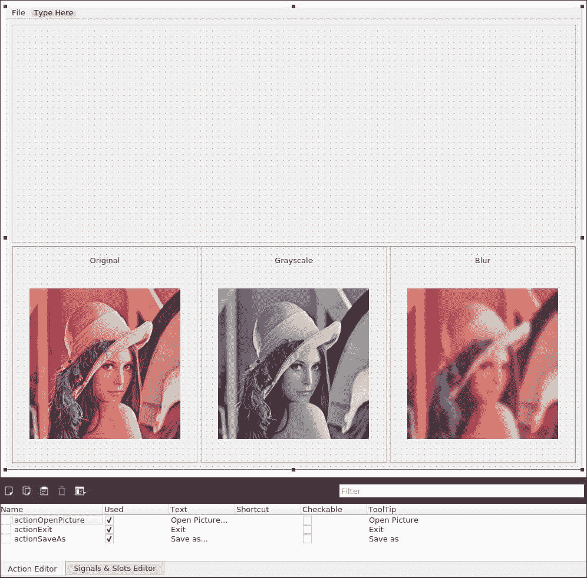
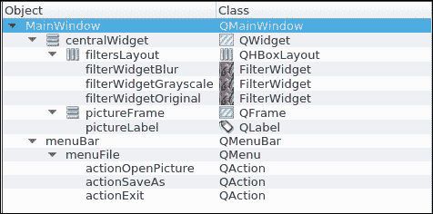

# 第七章. 无烦恼的第三方库

在前面的章节中，我们使用了我们自己的库或 Qt 提供的库。在本章中，我们将学习如何将第三方库 OpenCV 集成到 Qt 项目中。这个库将为你提供一个令人印象深刻的图像处理工具箱。对于每个平台，你将学习使用不同的特定编译器链接配置。

Qt Designer 是一个功能强大的 WYSIWYG 编辑器。这就是为什么本章还将教你如何构建一个可以从 **小部件框** 拖放到 **表单编辑器** 的 Qt Designer 插件，并直接从 Qt Creator 进行配置。

在示例项目中，用户可以加载一张图片，从缩略图预览中选择一个过滤器，并保存结果。这个应用程序将依赖于 OpenCV 函数进行图像处理。

本章将涵盖以下主题：

+   准备一个跨平台项目以托管第三方库

+   链接第三方库

+   使用 Qt Designer 插件构建自定义 `QWidget` 类

+   OpenCV API 如何与 Qt 一起工作

+   创建一个依赖于自定义 `QWidget` 类的 Qt 应用程序

# 创建您的 Qt Designer 插件

在 第四章，*征服桌面 UI* 中，我们使用提升技术，在 Qt Designer 中创建了一个自定义 Qt 小部件。现在是时候学习如何通过为 Qt Designer 构建插件来创建自定义 Qt 小部件了。你的小部件将与其他常规 Qt 小部件一起，在 **设计模式** 中的 **小部件框** 中可用。对于这个项目示例，我们将创建一个 `FilterWidget` 类，该类处理输入图像以应用过滤器。小部件还将显示过滤器名称和过滤后图片的动态缩略图。

该项目由两个子项目组成：

+   `filter-plugin-designer`: 这是一个包含 `FilterWidget` 类和图像处理代码的 Qt Designer 插件。这个插件是一个动态库，将被 Qt Creator 使用，以便在 **表单编辑器** 中提供我们的新 `FilterWidget`。

+   `image-filter`: 这是一个使用多个 `FilterWidget` 的 Qt 小部件应用程序。用户可以从他们的硬盘上打开一个图像，选择一个过滤器（灰度、模糊等），并保存过滤后的图像。

我们的 `filter-plugin-designer` 将使用第三方库 **OpenCV**（**开源计算机视觉**）。这是一个强大的、跨平台的开源库，用于操作图像。以下是一个概述图：



你可以将插件视为一种模块，它可以轻松地添加到现有软件中。插件必须遵守特定的接口，才能被应用程序自动调用。在我们的案例中，Qt Designer 是加载 Qt 插件的程序。因此，创建插件允许我们增强应用程序，而无需修改 Qt Designer 源代码并重新编译它。插件通常是一个动态库（`.dll`/`.so`），因此它将在运行时由应用程序加载。

现在你已经对 Qt Designer 插件有了清晰的认识，让我们来构建一个！首先，创建一个名为`ch07-image-filter`的`Subdirs`项目。然后，你可以添加一个子项目，`filter-plugin-designer`。你可以使用**空 qmake 项目**模板，因为我们从这个项目开始。以下是`filter-plugin-designer.pro`文件：

```cpp
QT += widgets uiplugin 
CONFIG += plugin 
CONFIG += c++14 
TEMPLATE = lib 
DEFINES += FILTERPLUGINDESIGNER_LIBRARY 

TARGET = $$qtLibraryTarget($$TARGET) 
INSTALLS += target 

```

请注意`uiplugin`和`plugin`关键字对于`QT`和`CONFIG`。它们是创建 Qt Designer 插件所必需的。我们将`TEMPLATE`关键字设置为`lib`，因为我们正在创建一个动态库。定义`FILTERPLUGINDESIGNER_LIBRARY`将被库的导入/导出机制使用。我们已经在第三章中介绍了这个主题，*划分你的项目和统治你的代码*。默认情况下，我们的`TARGET`是`filter-plugin-designer`；`$$qtLibraryTarget()`函数将根据你的平台更新它。例如，Windows 上会附加后缀“d”（代表调试）。最后，我们将`target`添加到`INSTALLS`中。目前，这一行没有任何作用，但我们将很快为每个平台指定一个目标路径；这样，执行`make install`命令将把我们的目标库文件（`.dll`/`.so`）复制到正确的文件夹。要自动在每个编译时执行此任务，你可以添加一个新的构建步骤。

部署路径已配置，但不会自动执行。打开**项目**选项卡，然后执行以下操作：

1.  打开**构建设置** | **构建步骤**。

1.  点击**添加构建步骤** | **Make**。

1.  在**构建参数**字段中，输入`install`。

你应该得到类似这样的结果：



每次构建项目时，都会调用`make install`命令，并在 Qt Creator 中部署库。

# 配置 Windows 项目

在 Windows 上准备此项目之前，让我们谈谈在 Windows 主机上开发 Qt 应用程序时可供选择的内容。官方 Qt 网站提供了多个二进制包。我们主要关注以下内容：

+   Windows 32 位 Qt（MinGW）

+   Windows 32 位 Qt（VS 2013）

你可能已经在使用这些版本中的某一个。第一个版本包含 MinGW GCC 编译器和 Qt 框架。第二个版本只提供 Qt 框架，并依赖于将随 Visual Studio 一起安装的 Microsoft Visual C++编译器。

当你想为 Windows 创建一个通用的 Qt 应用程序时，两个版本都很好。然而，对于本章，我们希望将我们的`filter-plugin-designer`项目与 OpenCV 库链接起来。Qt Designer 还必须能够动态加载`filter-plugin-designer`，因此我们必须在所有阶段使用一致的编译器版本。

请注意，Windows 上的 Qt Creator 始终基于 MSVC，即使在 MinGW 二进制包中也是如此！因此，如果你使用 MinGW 编译器创建 Qt Designer 插件，你的 Qt Creator 将无法加载它。Windows 版本的 OpenCV 仅提供 MSVC 库，编译为 MSVC11（即 VS 2012）和 MSVC12（VS 2013）。

这里是构建我们的项目示例在 Windows 中的不同解决方案的总结：



请记住，对于像 Qt Creator 和 OpenCV 这样的开源软件，你总是可以尝试使用不同的编译器从源代码编译它们。因此，如果你绝对想使用 MinGW 编译器，你必须从源代码重新编译 OpenCV 和 Qt Creator。否则，我们建议你使用稍后解释的 Qt for Windows 32-bit (VS 2013)。以下是准备你的开发环境的步骤：

1.  下载并安装 Visual Studio Community Edition。

1.  下载并安装 Qt for Windows 32-bit (VS 2013)。

1.  下载并解压 Windows 版本的 OpenCV（例如：`C:\lib\opencv`）。

1.  创建一个新的`OPENCV_HOME`环境变量：`C:\lib\opencv\build\x86\vc12`。

1.  将系统环境变量`Path`追加为`C:\lib\opencv\build\x86\vc12\bin`。

`OPENCV_HOME`目录将在我们的`.pro`文件中使用。我们还向`Path`目录添加了一个 OpenCV 库文件夹，以便在运行时轻松解决依赖关系。

你现在可以将以下片段添加到`filter-plugin-designer.pro`文件中：

```cpp
windows { 
target.path = $$(QTDIR)/../../Tools/QtCreator/bin/plugins/designer 

debug:target_lib.files = $$OUT_PWD/debug/$${TARGET}.lib 
release:target_lib.files = $$OUT_PWD/release/$${TARGET}.lib 
target_lib.path = $$(QTDIR)/../../Tools/QtCreator/bin/plugins/designer 
    INSTALLS += target_lib 

    INCLUDEPATH += $$(OPENCV_HOME)/../../include 
    LIBS += -L$$(OPENCV_HOME)/lib 
        -lopencv_core2413 
        -lopencv_imgproc2413 
} 

```

`target`路径设置为 Qt Creator 插件文件夹。我们还创建了一个`target_lib`库来复制由 MSVC 生成的`.lib`文件，当我们创建动态库（`.dll`）时。我们将 OpenCV 头文件文件夹添加到`INCLUDEPATH`，以便在代码中轻松包含它们。最后，我们更新`LIBS`变量，以便将我们的插件与 OpenCV 库（`core`和`imgproc`）链接起来，这些库来自 OpenCV 的`lib`文件夹。

请注意，独立的 Qt Designer 应用程序和 Qt Creator 是不同的软件。这两个程序使用不同的插件路径。在我们的案例中，我们只使用了 Qt Creator 中的表单编辑器，因此我们针对的是 Qt Creator 插件路径。

正如我们将`target`和`target_lib`追加到`INSTALLS`一样，在`make install`命令中，`.dll`和`.lib`文件都将复制到 Qt Creator 插件路径。Qt Creator 仅需要`.dll`文件在运行时加载插件。`.lib`文件仅用于在构建我们的`image-filter`应用程序时解决与`filter-plugin-designer`的链接。为了简单起见，我们使用相同的目录。

# 为 Linux 配置项目

OpenCV 二进制文件当然可以在官方软件仓库中找到。根据您的发行版和包管理器，您可以使用以下命令之一进行安装：

```cpp
apt-get install libopencv
yum install opencv

```

当 OpenCV 在您的 Linux 上安装后，您可以将以下片段添加到 `filter-plugin-designer.pro` 文件中：

```cpp
linux { 
target.path = $$(QTDIR)/../../Tools/QtCreator/lib/Qt/plugins/designer/ 

    CONFIG += link_pkgconfig 
    PKGCONFIG += opencv 
} 

```

这次我们不使用 `LIBS` 变量，而是使用 `PKGCONFIG`，它依赖于 `pkg-config`。这是一个辅助工具，它将正确的选项插入到编译命令行中。在我们的情况下，我们将请求 `pkg-config` 将我们的项目与 OpenCV 链接。

### 注意

您可以使用 `pkg-config --list-all` 命令列出 `pkg-config` 管理的所有库。

# 配置 Mac 的项目

在 Mac OS 上使项目工作的第一步是安装 OpenCV。幸运的是，使用 `brew` 命令非常简单。如果您在 Mac OS 上开发并且尚未使用它，您应该立即下载它。简而言之，`brew` 是一个替代包管理器，它为您提供了访问许多包（针对开发人员和非开发者）的权限，这些包在 Mac App Store 上不可用。

### 注意

您可以从 [`brew.sh/`](http://brew.sh/) 下载并安装 brew。

在终端中，只需输入以下命令：

```cpp
brew install opencv

```

这将在您的机器上下载、编译和安装 OpenCV。在撰写本文时，brew 上可用的最新 OpenCV 版本是 2.4.13。完成此操作后，打开 `filter-plugin-designer.pro` 并添加以下块：

```cpp
macx { 
target.path = "$$(QTDIR)/../../QtCreator.app/Contents/PlugIns/designer/" 
target_lib.files = $$OUT_PWD/lib$${TARGET}.dylib 
target_lib.path = "$$(QTDIR)/../../QtCreator.app/Contents/PlugIns/designer/" 
    INSTALLS += target_lib 

    INCLUDEPATH += /usr/local/Cellar/opencv/2.4.13/include/ 

    LIBS += -L/usr/local/lib \ 
         -lopencv_core \ 
        -lopencv_imgproc 
} 

```

我们添加 OpenCV 头文件，并使用 `INCLUDEPATH` 和 `LIBS` 变量链接路径。`target` 定义和 `INSTALLS` 用于自动将输出共享对象部署到 Qt Creator 应用程序插件目录。

我们最后要做的就是添加一个环境变量，让 Qt Creator 知道它将在哪里找到将链接到最终应用程序的库。在 **项目** 选项卡中，按照以下步骤操作：

1.  在 **构建环境** 中打开 **详细信息** 窗口。

1.  点击 **添加** 按钮。

1.  在 `<VARIABLE>` 字段中输入 `DYLD_LIBRARY_PATH`。

1.  在 `<VALUE>` 中输入构建目录的路径（您可以从 **通用** | **构建目录** 部分复制并粘贴）。

# 实现您的 OpenCV 过滤器

现在您的开发环境已经准备好了，我们可以开始有趣的部分了！我们将使用 OpenCV 实现三个过滤器：

+   `FilterOriginal`：这个过滤器什么都不做，返回相同的图片（懒惰！）

+   `FilterGrayscale`：这个过滤器将图片从彩色转换为灰度

+   `FilterBlur`：这个过滤器使图片变得平滑

所有这些过滤器的父类是 `Filter`。以下是这个抽象类：

```cpp
//Filter.h 
class Filter 
{ 
public: 
Filter(); 
virtual ~Filter(); 

virtualQImage process(constQImage& image) = 0; 
}; 

//Filter.cpp 
Filter::Filter() {} 
Filter::~Filter() {} 

```

如您所见，`process()` 是一个纯抽象方法。所有过滤器都将通过这个函数实现特定的行为。让我们从简单的 `FilterOriginal` 类开始。以下是 `FilterOriginal.h`：

```cpp
class FilterOriginal : public Filter 
{ 
public: 
FilterOriginal(); 
    ~FilterOriginal(); 

QImageprocess(constQImage& image) override; 
}; 

```

这个类继承自 `Filter` 并重写了 `process()` 函数。实现也非常简单。在 `FilterOriginal.cpp` 中填写以下内容：

```cpp
FilterOriginal::FilterOriginal() : 
Filter() 
{ 
} 

FilterOriginal::~FilterOriginal() 
{ 
} 

QImageFilterOriginal::process(constQImage& image) 
{ 
return image; 
} 

```

没有进行任何修改；我们返回相同的图片。现在过滤器结构已经清晰，我们可以创建`FilterGrayscale`。`.h`/`.cpp`文件接近`FilterOriginalFilter`，所以让我们跳转到`FilterGrayscale.cpp`的`process()`函数：

```cpp
QImageFilterGrayscale::process(constQImage& image) 
{ 
    // QImage => cv::mat 
cv::Mattmp(image.height(), 
image.width(), 
                CV_8UC4, 
                (uchar*)image.bits(), 
image.bytesPerLine()); 

cv::MatresultMat; 
    cv::cvtColor(tmp, resultMat, CV_BGR2GRAY); 

    // cv::mat =>QImage 
QImageresultImage((constuchar *) resultMat.data, 
resultMat.cols, 
resultMat.rows, 
resultMat.step, 
QImage::Format_Grayscale8); 
returnresultImage.copy(); 
} 

```

在 Qt 框架中，我们使用`QImage`类来操作图片。在 OpenCV 世界中，我们使用`Mat`类，因此第一步是从`QImage`源创建一个正确的`Mat`对象。OpenCV 和 Qt 都处理许多图像格式。图像格式描述了数据字节的组织，如下面的信息所示：

+   `通道数`：灰度图片只需要一个通道（白色强度），而彩色图片需要三个通道（红色、绿色和蓝色）。处理不透明度（alpha）像素信息甚至需要四个通道。

+   `位深度`：存储像素颜色的位数。

+   `通道顺序`：最常见的顺序是 RGB 和 BGR。Alpha 可以放在颜色信息之前或之后。

例如，OpenCV 图像格式`CV_8UC4`表示四个无符号 8 位通道，这是 alpha 颜色图片的完美匹配。在我们的例子中，我们使用兼容的 Qt 和 OpenCV 图像格式将我们的`QImage`转换为`Mat`。以下是一个简短的总结：



请注意，一些`QImage`类格式也取决于你的平台字节序。前面的表是为小端系统设计的。对于 OpenCV，顺序始终相同：`BGRA`。在我们的项目示例中这不是必需的，但你可以按照以下方式交换蓝色和红色通道：

```cpp
// with OpenCV 
cv::cvtColor(mat, mat, CV_BGR2RGB); 

// with Qt 
QImage swapped = image.rgbSwapped(); 

```

OpenCV 的`Mat`和 Qt 的`QImage`类默认执行浅构造/复制。这意味着实际上只复制了元数据；像素数据是共享的。要创建图片的深拷贝，你必须调用`copy()`函数：

```cpp
// with OpenCV 
mat.clone(); 

// with Qt 
image.copy(); 

```

我们从`QImage`类创建了一个名为`tmp`的`Mat`类。请注意，`tmp`不是`image`的深拷贝；它们共享相同的数据指针。然后，我们可以调用 OpenCV 函数使用`cv::cvtColor()`将图片从彩色转换为灰度。最后，我们从灰度`resultMat`元素创建一个`QImage`类。在这种情况下，`resultMat`和`resultImage`也共享相同的数据指针。完成操作后，我们返回`resultImage`的深拷贝。

现在是时候实现最后一个过滤器了。以下是`FilterBlur.cpp`中的`process()`函数：

```cpp
QImageFilterBlur::process(constQImage& image) 
{ 
    // QImage => cv::mat 
cv::Mattmp(image.height(), 
image.width(), 
                CV_8UC4, 
                (uchar*)image.bits(), 
image.bytesPerLine()); 

int blur = 17; 
cv::MatresultMat; 
    cv::GaussianBlur(tmp, 
resultMat, 
                     cv::Size(blur, blur), 
                     0.0, 
                     0.0); 

    // cv::mat =>QImage 
QImageresultImage((constuchar *) resultMat.data, 
resultMat.cols, 
resultMat.rows, 
resultMat.step, 
QImage::Format_RGB32); 
returnresultImage.copy(); 
} 

```

从`QImage`到`Mat`的转换是相同的。处理不同是因为我们使用`cv::GaussianBlur()`OpenCV 函数来平滑图片。"blur"是高斯模糊使用的核大小。你可以增加这个值以获得更柔和的图片，但只能使用奇数和正数。最后，我们将`Mat`转换为`QImage`并返回给调用者的深拷贝。

# 使用 FilterWidget 设计 UI

好的。我们的过滤器类已经实现，现在我们可以创建我们的自定义小部件。这个小部件将接受输入、源图片和缩略图图片。然后缩略图立即处理以显示过滤器的预览。如果用户点击小部件，它将处理源图片并触发一个带有过滤后图片的信号。请注意，这个小部件稍后将被拖放到 Qt Creator 的 **表单编辑器** 中。这就是为什么我们将提供带有获取器和设置器的属性来从 Qt Creator 中选择过滤器。请使用 **Qt Designer 表单类** 模板创建一个名为 `FilterWidget` 的新小部件。`FilterWidget.ui` 非常简单：



`titleLabel` 是位于 `QWidget` 顶部的 `QLabel`。下面，`thumbnailLabel` 将显示过滤后的图片缩略图。让我们切换到 `FilterWidget.h`：

```cpp
class FILTERPLUGINDESIGNERSHARED_EXPORT FilterWidget : public QWidget 
{ 
    Q_OBJECT 

    Q_ENUMS(FilterType) 
    Q_PROPERTY(QString title READ title WRITE setTitle) 
    Q_PROPERTY(FilterTypefilterType READ filterType WRITE setFilterType) 

public: 
enumFilterType { Original, Blur, Grayscale }; 

explicitFilterWidget(QWidget *parent = 0); 
    ~FilterWidget(); 

void process(); 
voidsetSourcePicture(constQImage&sourcePicture); 
voidupdateThumbnail(constQImage&sourceThumbnail); 

QStringtitle() const; 
FilterTypefilterType() const; 

public slots: 
voidsetTitle(constQString& tile); 
voidsetFilterType(FilterTypefilterType); 

signals: 
voidpictureProcessed(constQImage& picture); 

protected: 
voidmousePressEvent(QMouseEvent*) override; 

private: 
Ui::FilterWidget *ui; 
std::unique_ptr<Filter>mFilter; 
FilterTypemFilterType; 

QImagemDefaultSourcePicture; 
QImagemSourcePicture; 
QImagemSourceThumbnail; 

QImagemFilteredPicture; 
QImagemFilteredThumbnail; 
}; 

```

顶部部分使用 `enumFilterType` 定义了所有可用的过滤器类型。我们还使用 Qtproperty 系统将小部件标题和当前过滤器类型暴露给 Qt Creator 的 **属性编辑器**。语法如下：

```cpp
Q_PROPERTY(<type><name> READ <getter> WRITE <setter>) 

```

请注意，暴露枚举需要使用 `Q_ENUM()` 宏进行注册，这样 **属性编辑器** 将显示一个组合框，允许您从 Qt Creator 中选择过滤器类型。

中间部分列出了所有函数、槽和信号。最值得注意的是 `process()` 函数，它将使用当前过滤器修改源图片。`pictureProcessed()` 信号将通知应用程序带有过滤后图片的信号。

底部部分列出了在这个类中使用的图片和缩略图 `QImage` 变量。在两种情况下，我们都处理了源图片和过滤后的图片。默认源图片是插件中嵌入的图片。这允许你在没有提供缩略图时显示默认预览。`mFilter` 变量是当前 `Filter` 类的智能指针。

让我们切换到 `FilterWidget.cpp` 的实现：

```cpp
FilterWidget::FilterWidget(QWidget *parent) : 
QWidget(parent), 
ui(new Ui::FilterWidget), 
mFilterType(Original), 
mDefaultSourcePicture(":/lenna.jpg"), 
mSourcePicture(), 
mSourceThumbnail(mDefaultSourcePicture.scaled(QSize(256, 256), 
Qt::KeepAspectRatio, 
Qt::SmoothTransformation)), 
mFilteredPicture(), 
mFilteredThumbnail() 
{ 
ui->setupUi(this); 
setFilterType(Original); 
} 

FilterWidget::~FilterWidget() 
{ 
deleteui; 
} 

```

这里是构造函数和析构函数。请注意，默认源图片加载了在图像处理文献中经常使用的美丽 Lenna 嵌入式图片。图片位于资源文件 `filter-plugin-designer.qrc` 中。`mSourceThumbnail` 函数初始化为 Lenna 缩放后的图片。构造函数调用 `setFilterType()` 函数以默认初始化 `Original` 过滤器。以下是核心的 `process()` 函数：

```cpp
voidFilterWidget::process() 
{ 
mFilteredPicture = mFilter->process(mSourcePicture); 
emitpictureProcessed(mFilteredPicture); 
} 

```

`process()` 函数功能强大，但非常简单。我们调用当前过滤器的 `process()` 函数来更新从当前源图片中过滤后的图片。然后我们使用过滤后的图片触发 `pictureProcessed()` 信号。现在我们可以添加我们的 `QImage` 设置器：

```cpp
voidFilterWidget::setSourcePicture(constQImage&sourcePicture) 
{ 
mSourcePicture = sourcePicture; 
} 

voidFilterWidget::updateThumbnail(constQImage&sourceThumbnail) 
{ 
mSourceThumbnail = sourceThumbnail; 
mFilteredThumbnail = mFilter->process(mSourceThumbnail); 
QPixmappixmap = QPixmap::fromImage(mFilteredThumbnail); 
ui->thumbnailLabel->setPixmap(pixmap); 
} 

```

`setSourcePicture()` 函数是一个简单的设置器，由应用程序调用并传入新的源图片。`updateThumbnail()` 方法将过滤新的源缩略图并显示它。让我们添加由 `Q_PROPERTY` 使用的设置器：

```cpp
voidFilterWidget::setTitle(constQString& tile) 
{ 
ui->titleLabel->setText(tile); 
} 

voidFilterWidget::setFilterType(FilterWidget::FilterTypefilterType) 
{ 
if (filterType == mFilterType&&mFilter) { 
return; 
    } 
mFilterType = filterType; 

switch (filterType) { 
case Original: 
mFilter = make_unique<FilterOriginal>(); 
break; 

case Blur: 
mFilter = make_unique<FilterBlur>(); 
break; 

case Grayscale: 
mFilter = make_unique<FilterGrayscale>(); 
break; 

default: 
break; 
    } 

updateThumbnail(mSourceThumbnail); 
} 

```

`setTitle()` 函数是一个简单的设置器，用于自定义小部件标题。让我们谈谈 `setFilterType()` 函数。如您所见，此函数不仅更新当前过滤器类型 `mFilterType`，根据类型，还会创建相应的过滤器。你还记得第三章 Dividing Your Project and Ruling Your Code 中的智能指针吗？在这里，我们使用 `unique_ptr` 指针为 `mFilter` 变量，因此我们可以使用 `make_unique` 而不是原始的 `new`。`FilterWidget` 类拥有 `Filter` 类的所有权，我们不需要担心内存管理。在 `make_unique` 指令之后，旧的拥有指针（如果有）将被自动删除。

最后，我们调用 `updateThumbnail()` 函数以显示与所选过滤器类型相对应的过滤缩略图。以下是获取器和鼠标事件处理程序：

```cpp
QStringFilterWidget::title() const 
{ 
returnui->titleLabel->text(); 
} 

FilterWidget::FilterTypeFilterWidget::filterType() const 
{ 
returnmFilterType; 
} 

voidFilterWidget::mousePressEvent(QMouseEvent*) 
{ 
process(); 
} 

```

`title()` 和 `filterType()` 函数是 Qt 属性系统使用的获取器。我们重写 `mousePressEvent()` 函数，以便每次用户点击该小部件时都调用我们的 `process()` 函数。

# 将您的插件暴露给 Qt Designer

`FilterWidget` 类已完成并准备好使用。我们现在必须将 `FilterWidget` 注册到 Qt Designer 插件系统中。这段粘合代码使用 `QDesignerCustomWidgetInterface` 的子类制作。

创建一个名为 `FilterPluginDesigner` 的新 C++ 类，并按如下方式更新 `FilterPluginDesigner.h`：

```cpp
#include <QtUiPlugin/QDesignerCustomWidgetInterface> 

class  FilterPluginDesigner : public QObject, public QDesignerCustomWidgetInterface 
{ 
    Q_OBJECT 
    Q_PLUGIN_METADATA(IID 
        "org.masteringqt.imagefilter.FilterWidgetPluginInterface") 
    Q_INTERFACES(QDesignerCustomWidgetInterface) 
public: 
FilterPluginDesigner(QObject* parent = 0); 
}; 

```

`FilterPlugin` 类从两个类继承：

+   `QObject` 类，以依赖 Qt 的父级系统

+   `QDesignerCustomWidgetInterface` 类用于正确暴露 `FilterWidget` 信息给插件系统

`QDesignerCustomWidgetInterface` 类引入了两个新的宏：

+   `Q_PLUGIN_METADATA()` 宏注释了该类，以向元对象系统指示我们过滤器的唯一名称

+   `Q_INTERFACES()` 宏告诉元对象系统当前类实现了哪个接口

Qt Designer 现在能够检测到我们的插件。我们现在必须提供有关插件本身的信息。更新 `FilterPluginDesigner.h`：

```cpp
class  FilterPluginDesigner : public QObject, public QDesignerCustomWidgetInterface 
{ 
    ... 
FilterPluginDesigner(QObject* parent = 0); 

QStringname() const override; 
QStringgroup() const override; 
QStringtoolTip() const override; 
QStringwhatsThis() const override; 
QStringincludeFile() const override; 
QIconicon() const override; 
boolisContainer() const override; 
QWidget* createWidget(QWidget* parent) override; 
boolisInitialized() const override; 
void initialize(QDesignerFormEditorInterface* core) override; 

private: 
boolmInitialized; 
}; 

```

这比看起来要简单得多。每个函数的主体通常只有一行。以下是这些最直接函数的实现：

```cpp
QStringFilterPluginDesigner::name() const 
{ 
return "FilterWidget"; 
} 

QStringFilterPluginDesigner::group() const 
{ 
return "Mastering Qt5"; 
} 

QStringFilterPluginDesigner::toolTip() const 
{ 
return "A filtered picture"; 
} 

QStringFilterPluginDesigner::whatsThis() const 
{ 
return "The filter widget applies an image effect"; 
} 

QIconFilterPluginDesigner::icon() const 
{ 
returnQIcon(":/icon.jpg"); 
} 

boolFilterPluginDesigner::isContainer() const 
{ 
return false; 
} 

```

如您所见，关于这些函数没有太多可说的。大多数函数将简单地返回一个 `QString` 值，该值将在 Qt Designer UI 的适当位置显示。我们只关注最有趣的函数。让我们从 `includeFile()` 开始：

```cpp
QStringFilterPluginDesigner::includeFile() const 
{ 
return "FilterWidget.h"; 
} 

```

此函数将由 `uic`（**用户界面编译器**）调用，以生成对应于 `.ui` 文件的头文件。继续使用 `createWidget()`：

```cpp
QWidget* FilterPluginDesigner::createWidget(QWidget* parent) 
{ 
return new FilterWidget(parent); 
} 

```

这个函数在 Qt Designer 和 `FilterWidget` 之间建立桥梁。当你在 `.ui` 文件中添加 `FilterWidget` 类时，Qt Designer 将调用 `createWidget()` 函数来创建 `FilterWidget` 类的一个实例并显示其内容。它还提供了 `parent` 元素，`FilterWidget` 将附加到该元素上。

让我们以 `initialize()` 结束：

```cpp
voidFilterPluginDesigner::initialize(QDesignerFormEditorInterface*) 
{ 
if (mInitialized) 
return; 

mInitialized = true; 
} 

```

在这个函数中并没有做太多事情。然而，`QDesignerFormEditorInterface*` 参数值得一些解释。这个指针由 Qt Designer 提供，通过函数可以访问 Qt Designer 的几个组件：

+   `actionEditor()`: 这个函数是动作编辑器（设计器的底部面板）

+   `formWindowManager()`: 这个函数是允许你创建新表单窗口的接口

+   `objectInspector()`: 这个函数是您布局的层次表示（设计器的右上角面板）

+   `propertyEditor()`: 这个函数是当前选中小部件的所有可编辑属性的列表（设计器的右下角面板）

+   `topLevel()`: 这个函数是设计器的顶级小部件

我们在 第一章 中介绍了这些面板，*初识 Qt*。如果您的小部件插件需要干预这些区域中的任何一个，这个函数就是自定义 Qt Designer 行为的入口点。

# 使用您的 Qt Designer 插件

我们的定制插件现在已经完成。因为我们添加了一个定制的 `Build` 命令来自动部署 filter-widget 库，所以它应该在 Qt Designer 中可见。我们指定的部署路径在 Qt Creator 目录内。Qt Creator 通过一个插件集成 Qt Designer，该插件在 Qt Creator 内部显示 UI。

当 Qt Creator 启动时，它将尝试加载其特定路径下可用的每个库。这意味着每次你修改插件时（如果你想在设计器中看到修改的结果），你都必须重新启动 Qt Creator。

要看到插件的实际效果，我们现在必须创建本章的应用程序项目。在 `ch07-image-filter` 项目中创建一个名为 `image-filter` 的 **Qt Widgets Application** 子项目。在向导中，让它生成表单，`MainWindow.ui`。

要正确使用插件，只需在 `image-filter.pro` 中链接 `filter-plugin-designer` 库，如下所示：

```cpp
QT       += core gui 

greaterThan(QT_MAJOR_VERSION, 4): QT += widgets 

TARGET = image-filter 
TEMPLATE = app 

INCLUDEPATH += ../filter-plugin-designer 

win32 { 
    LIBS += -L$$(QTDIR)/../../Tools/QtCreator/bin/plugins/designer -lfilter-plugin-designer 
} 

macx { 
    LIBS += -L$$(QTDIR)/../../"QtCreator.app"/Contents/PlugIns/designer/ -lfilter-plugin-designer 
} 

linux { 
    LIBS += -L$$(QTDIR)/../../Tools/QtCreator/lib/Qt/plugins/designer/ -lfilter-plugin-designer 
} 

SOURCES += main.cpp\ 
        MainWindow.cpp 

HEADERS  += MainWindow.h 

FORMS    += MainWindow.ui 

```

要访问 `filter-plugin-designer` 的头文件，我们只需将其添加到 `INCLUDEPATH` 目录。最后，链接器被指示链接到我们在 Qt Creator 中部署的库。这确保了 Qt Designer 和我们的应用程序使用的是相同的库。

打开 `MainWindow.ui` 文件，并滚动到 `**Widget box**` 的底部。瞧，你应该能看到这个：



`FilterWidget` 插件出现在 Mastering Qt5 部分。它甚至显示著名的 Lenna 作为预览图标。如果你看不到 `FilterWidget` 插件，那么重新启动 Qt Creator 并确保插件已正确加载。为了检查这一点（在 **设计** 选项卡中），转到 **工具** | **表单编辑器** | **关于 Qt Designer 插件**。这是它应该显示的内容：



如果 `FilterWidget` 插件没有出现在这个列表中，你应该检查 Qt Creator 插件目录的内容（路径在 `image-filter.pro` 中声明）。

# 构建 image-filter 应用程序

我们可以继续构建应用程序的 UI。想法是从文件系统中打开一个图片，并应用我们在 `filter-designer-plugin` 项目中开发的各个过滤器。如果你想保留结果，你可以保存生成的图片。

我们将首先设计 UI。将 `MainWindow.ui` 修改如下：



这里是对象检查器内容，以帮助您构建此布局：



这个 UI 有三个元素：

+   `menuFile` 元素，它包含三个可能的操作：`actionOpenPicture`、`actionExit` 和 `actionSaveAs`。您可以在 `Action Editor` 窗口中查看这些操作的详细信息。

+   `pictureLabel` 元素，它将在空顶部分显示加载的图片。

+   `filtersLayout` 元素，它包含底部三个我们的 `FilterWidget` 类的实例。

当你在 `filtersLayout` 中添加 `FilterWidget` 类时，你可以看到你可以在 **属性编辑器** 窗口中自定义 `title` 和 `filterType`。预览将自动更新为应用了所选过滤器的默认图片。这样的动态预览简直太棒了，你可以预见你的自定义 Qt Designer 小部件可以变得相当强大。

让我们实现应用程序的逻辑。按照如下方式更新 `MainWindow.h`：

```cpp
#include <QMainWindow> 
#include <QImage> 
#include <QVector> 

namespaceUi { 
classMainWindow; 
} 

classFilterWidget; 

classMainWindow : public QMainWindow 
{ 
    Q_OBJECT 

public: 
explicitMainWindow(QWidget *parent = 0); 
    ~MainWindow(); 

voidloadPicture(); 

private slots: 
voiddisplayPicture(constQImage& picture); 

private: 
voidinitFilters(); 
voidupdatePicturePixmap(); 

private: 
Ui::MainWindow *ui; 
QImagemSourcePicture; 
QImagemSourceThumbnail; 
QPixmapmCurrentPixmap; 
FilterWidget* mCurrentFilter; 
QVector<FilterWidget*>mFilters; 
}; 

```

这里有一些我们必须解释的元素：

+   `mSourcePicture`：这个元素是加载的图片。

+   `mSourceThumbnail`：这个元素是从 `mSourcePicture` 生成的缩略图。为了避免浪费 CPU 循环，`mSourcePicture` 只会调整大小一次，而每个 `FilterWidget` 实例将处理这个缩略图而不是全分辨率图片。

+   `mCurrentPixmap`：这个元素是当前在 `pictureLabel` 小部件中显示的 `QPixmap`。

+   `mCurrentFilter`：这个元素是当前应用的过滤器。每次用户点击不同的 `FilterWidget` 时，这个指针都会更新。

+   `mFilters`：这个元素是我们添加到 `MainWindow.ui` 的 `FilterWidget` 类的 `QVector`。它只是一个辅助工具，引入了轻松应用相同指令到每个 `FilterWidget` 类。

现在让我们概述一下函数，具体细节将在查看每个函数的实现时进行说明：

+   `loadPicture()`: 此函数触发整个管道。当用户点击 `actionOpenPicture` 时将调用此函数。

+   `initFilters()`: 此函数负责初始化 `mFilters`。

+   `displayPicture()`: 此函数是 `mCurrentWidget::pictureProcessed()` 调用的插槽，用于显示过滤后的图片。

+   `updatePicturePixmap()`: 此函数处理在 `pictureLabel` 内显示 `mCurrentPixmap`。

让我们看看 `MainWindow` 类构造函数在 `MainWindow.cpp` 中的实现：

```cpp
#include <QFileDialog> 
#include <QPixmap> 
#include <QDir> 

#include "FilterWidget.h" 

MainWindow::MainWindow(QWidget *parent) : 
QMainWindow(parent), 
ui(new Ui::MainWindow), 
mSourcePicture(), 
mSourceThumbnail(), 
mCurrentPixmap(), 
mCurrentFilter(nullptr), 
mFilters() 
{ 
ui->setupUi(this); 
ui->pictureLabel->setMinimumSize(1, 1); 

connect(ui->actionOpenPicture, &QAction::triggered,  
    this, &MainWindow::loadPicture); 
connect(ui->actionExit, &QAction::triggered,  
    this, &QMainWindow::close); 
initFilters(); 
} 

```

我们将 `actionOpenPicture::triggered()` 信号连接到尚未实现的 `loadPicture()` 函数。`actionExit` 操作很简单；它只是连接到 `QMainWindow::close()` 插槽。最后，调用 `initFilter()`。让我们看看它的主体：

```cpp
voidMainWindow::initFilters() 
{ 
mFilters.push_back(ui->filterWidgetOriginal); 
mFilters.push_back(ui->filterWidgetBlur); 
mFilters.push_back(ui->filterWidgetGrayscale); 

for (inti = 0; i<mFilters.size(); ++i) { 
connect(mFilters[i], &FilterWidget::pictureProcessed, 
this, &MainWindow::displayPicture); 
    } 
mCurrentFilter = mFilters[0]; 
} 

```

每个 `FilterWidget` 实例都被添加到 `mFilters` 中。然后我们继续将 `pictureProcessed()` 信号连接到 `MainWindow::displayPicture` 指令，并将 `mCurrentFilter` 初始化为原始过滤器。

类现在可以加载一些图片了！这是 `loadPicture()` 的实现：

```cpp
voidMainWindow::loadPicture() 
{ 
QString filename = QFileDialog::getOpenFileName(this, 
        "Open Picture", 
        QDir::homePath(), 
  tr("Images (*.png *.jpg)")); 
if (filename.isEmpty()) { 
return; 
    } 
mSourcePicture = QImage(filename); 
mSourceThumbnail = mSourcePicture.scaled(QSize(256, 256), 
  Qt::KeepAspectRatio,                                                   Qt::SmoothTransformation); 
for (inti = 0; i<mFilters.size(); ++i) { 
mFilters[i]->setSourcePicture(mSourcePicture); 
mFilters[i]->updateThumbnail(mSourceThumbnail); 
    } 

mCurrentFilter->process(); 
} 

```

使用 `QFileDialog` 加载 `mSourcePicture` 方法，并从该输入生成 `mSourceThumbnail`。每个 `FilterWidget` 类都使用这些新数据更新，并通过调用其 `process()` 函数触发 `mCurrentFilter` 元素。

当 `FilterWidget::process()` 完成时，它会发出 `pictureProcessed()` 信号，该信号连接到我们的 `displayPicture()` 插槽。让我们切换到这个函数：

```cpp
voidMainWindow::displayPicture(constQImage& picture) 
{ 
mCurrentPixmap = QPixmap::fromImage(picture); 
updatePicturePixmap(); 
} 

```

这里没有什么特别之处：`mCurrentPixmap` 从给定的图片更新，而 `updatePicturePixmap()` 函数负责更新 `pictureLabel` 元素。以下是 `updatePicturePixmap()` 的实现：

```cpp
voidMainWindow::updatePicturePixmap() 
{ 
if (mCurrentPixmap.isNull()) { 
return; 
    } 
ui->pictureLabel->setPixmap( 
mCurrentPixmap.scaled(ui->pictureLabel->size(), 
      Qt::KeepAspectRatio, 
Qt::SmoothTransformation)); 
} 

```

此函数简单地创建了一个缩放版本的 `mCurrentPixmap`，使其适合于 `pictureLabel` 内。

整个图片加载/过滤处理已完成。如果您运行应用程序，您应该能够加载和修改您的图片。然而，如果您调整窗口大小，您会看到 `pictureLabel` 元素缩放得不是很好。

为了解决这个问题，每次窗口调整大小时，我们必须重新生成 `mCurrentPixmap` 的缩放版本。更新 `MainWindow` 如下：

```cpp
// In MainWindow.h 
classMainWindow : public QMainWindow 
{ 
    ... 
voidloadPicture(); 

protected: 
voidresizeEvent(QResizeEvent* event) override; 
    ... 
}; 

// In MainWindow.cpp 
voidMainWindow::resizeEvent(QResizeEvent* /*event*/) 
{ 
updatePicturePixmap(); 
} 

```

在这里，将 `mCurrentPixmap` 和 `pictureLabel` 元素的 pixmap 分开是有意义的。因为我们总是从全分辨率的 `mCurrentPixmap` 生成缩放版本，所以我们确信生成的 pixmap 会看起来很好。

图像过滤器应用程序如果没有保存过滤后的图片的能力将是不完整的。这不会花费太多精力。以下是 `MainWindow.h` 的更新版本：

```cpp
classMainWindow : public QMainWindow 
{ 
    ... 

private slots: 
voiddisplayPicture(constQImage& picture); 
voidsaveAsPicture(); 
    ... 

private: 
Ui::MainWindow *ui; 
QImagemSourcePicture; 
QImagemSourceThumbnail; 
QImage&mFilteredPicture; 
    ... 
}; 

```

在这里，我们简单地添加了一个 `saveAsPicture()` 函数，该函数将 `mFilteredPicture` 元素保存到文件中。`MainWindow.cpp` 中的实现应该不会让您感到惊讶：

```cpp
// In MainWindow.cpp 
MainWindow::MainWindow(QWidget *parent) : 
QMainWindow(parent), 
ui(new Ui::MainWindow), 
mSourcePicture(), 
mSourceThumbnail(), 
mFilteredPicture(mSourcePicture), 
    ... 
{ 
ui->setupUi(this); 
ui->actionSaveAs->setEnabled(false); 
ui->pictureLabel->setMinimumSize(1, 1); 

connect(ui->actionOpenPicture, &QAction::triggered, 
this, &MainWindow::loadPicture); 
connect(ui->actionSaveAs, &QAction::triggered, 
this, &MainWindow::saveAsPicture); 
    ... 
} 

voidMainWindow::loadPicture() 
{ 
    ... 
if (filename.isEmpty()) { 
return; 
    } 
ui->actionSaveAs->setEnabled(true); 
    ... 
} 

voidMainWindow::displayPicture(constQImage& picture) 
{ 
mFilteredPicture = picture; 
mCurrentPixmap = QPixmap::fromImage(picture); 
updatePicturePixmap(); 
} 

voidMainWindow::saveAsPicture() 
{ 
QString filename = QFileDialog::getSaveFileName(this, 
            "Save Picture", 
QDir::homePath(), 
tr("Images (*.png *.jpg)")); 
if (filename.isEmpty()) { 
return; 
    } 
mFilteredPicture.save(filename); 
} 

```

代码片段虽然长，但并不复杂。`actionSaveAs` 函数仅在图片被加载时启用。当图片被处理完毕后，`mFilteredPicture` 会更新为给定的图片。因为它是一个引用，存储这个过滤后的图片几乎不花费任何代价。

最后，`saveAsPicture()` 函数会询问用户路径，并使用 `QImage` API 保存图片，该 API 会尝试根据文件扩展名推断图片类型。

# 摘要

在本章中，你学习了如何将第三方库与每个桌面操作系统（Windows、Linux 和 Mac）集成。我们选择了 OpenCV 库，它已被包含在一个自定义的 Qt Designer 插件中，并且可以在 Qt Designer 中显示你的图像处理结果的实时预览。我们创建了一个图像过滤应用程序，它可以打开图片，对它们应用过滤器，并将结果保存在你的机器上。

我们仔细研究了如何集成第三方库以及如何创建一个 Qt Designer 插件。在下一章中，我们将通过使 `image-filter` 应用程序准备好加载由第三方开发者实现的过滤器插件来推进事情。为了使事情更加酷炫，我们将介绍 Qt 动画框架，使 `image-filter` 更加引人注目。
