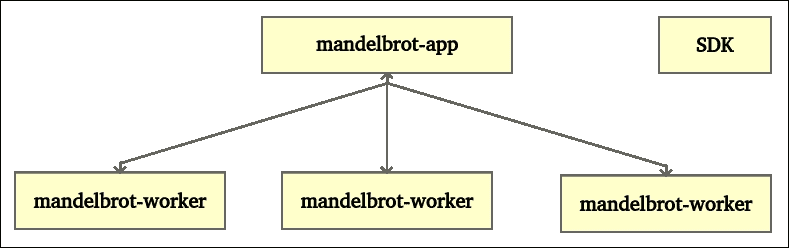
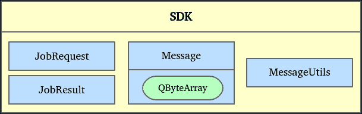
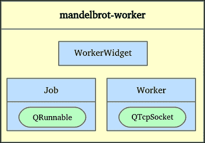

# 第十章。需要 IPC？让你的小兵开始工作

在上一章中，你学习了如何在同一进程的线程之间发送信息。在本章中，你将发现如何在不同进程的线程之间共享数据。我们甚至将在不同物理计算机上运行的应用程序之间共享信息。我们将增强第九章中提到的 Mandelbrot 生成器应用程序，即*通过多线程保持理智*。现在，Mandelbrot 应用程序将只显示由工作程序处理的结果。这些小兵只有一个任务：尽可能快地计算任务并返回结果给主应用程序。

本章涵盖了以下主题：

+   两个应用程序如何相互通信

+   创建一个多线程 TCP 服务器

+   在 TCP 套接字上读写

+   其他 IPC 技术，如`QSharedMemory`、`QProcess`和 Qt D-Bus

+   使用`QDataStream`进行网络序列化

+   计算机集群

+   进程间通信技术

**IPC**（**进程间通信**）是两个或更多进程之间的通信。它们可以是同一应用或不同应用的实例。Qt 框架提供了多个模块来帮助你实现应用程序之间的通信。大多数这些模块都是跨平台的。让我们来谈谈 Qt 提供的 IPC 工具。

第一工具是 TCP/IP 套接字。它们在网络中提供双向数据交换。因此，你可以使用它们与不同计算机上的进程通信。此外，`loopback`接口允许你与同一计算机上运行的进程通信。所有必需的类都在`QtNetwork`模块中。这种技术依赖于客户端-服务器架构。以下是一个服务器部分的示例：

```cpp
QTcpServer* tcpServer = new QTcpServer(this); 
tcpServer->listen(QHostAddress::Any, 5000); 

connect(tcpServer, &QTcpServer::newConnection, [tcpServer] { 
    QTcpSocket *tcpSocket = tcpServer->nextPendingConnection(); 
    QByteArray response = QString("Hello").toLatin1(); 
    tcpSocket->write(response); 
    tcpSocket->disconnectFromHost(); 
    qDebug() << "Send response and close the socket"; 
}); 

```

第一步是实例化一个`QTcpServer`类。它处理新的传入 TCP 连接。然后，我们调用`listen()`函数。你可以提供一个网络接口并指定服务器必须监听传入连接的端口。在这个例子中，我们在端口`5000`上监听所有网络地址（例如，`127.0.0.1`、`192.168.1.4`等等）。当客户端与这个服务器建立连接时，会触发`QTcpServer::newConnection()`信号。让我们一起分析这个 lambda 槽：

1.  我们使用与这个新连接相关的`QTcpSocket`类来检索客户端。

1.  准备一个包含 ASCII 消息“Hello”的`QByteArray`响应。不要在意原创性的缺乏。

1.  消息通过套接字发送到客户端。

1.  最后，我们关闭套接字。因此，在这个客户端，将会断开连接。

### 小贴士

你可以使用 Windows 上的 PuTTY 或 Linux 和 Mac OS 上的`telnet`命令这样的 telnet 工具来测试`QTcpServer`类。

以下片段是客户端部分：

```cpp
QTcpSocket *tcpSocket = new QTcpSocket(this); 
tcpSocket->connectToHost("127.0.0.1", 5000); 

connect(tcpSocket, &QTcpSocket::connected, [tcpSocket] { 
    qDebug() << "connected"; 
}); 
connect(tcpSocket, &QTcpSocket::readyRead, [tcpSocket] { 
    qDebug() << QString::fromLatin1(tcpSocket->readAll()); 
}); 
connect(tcpSocket, &QTcpSocket::disconnected, [tcpSocket] { 
    qDebug() << "disconnected"; 
}); 

```

客户端也使用`QTcpSocket`类进行通信。结果是连接是由客户端发起的，因此我们需要使用服务器地址和端口调用`connectToHost()`函数。这个类提供了一些有用的信号，如`connected()`和`disconnected()`，它们指示连接状态。当有新数据可供读取时，会发出`readyRead()`信号。`readAll()`函数返回包含所有可用数据的`QByteArray`。在我们的例子中，我们知道服务器向其客户端发送 ASCII 消息。因此，我们可以将这个字节数组转换为`QString`并显示它。

对于这个例子，服务器在 TCP 套接字中写入，客户端读取。但是这种通信是双向的，所以客户端也可以写入数据，服务器可以读取它。尝试从客户端发送数据并在服务器上显示。请注意，您需要通过在服务器部分移除`disconnectFromHost()`调用来保持通信活跃。

Qt 框架提供了一个辅助类`QDataStream`，可以轻松发送复杂对象并处理数据包分段。这个概念将在本章的项目示例中稍后介绍。

让我们谈谈第二种 IPC 技术：**共享内存**。默认情况下，不同的进程不使用相同的内存空间。`QSharedMemory`类提供了一个跨平台的方法，可以在多个进程之间创建和使用共享内存。尽管如此，这些进程必须在同一台计算机上运行。共享内存由一个键标识。所有进程都必须使用相同的键来共享相同的共享内存段。第一个进程将创建共享内存段并将数据放入其中：

```cpp
QString sharedMessage("Hello"); 
QByteArray sharedData = sharedMessage.toLatin1(); 

QSharedMemory* sharedMemory = new QSharedMemory( 
    "sharedMemoryKey", this); 
sharedMemory->create(sharedMessage.size()); 

sharedMemory->lock(); 

memcpy(sharedMemory->data(), 
       sharedData.data(), 
       sharedData.size()); 

sharedMemory->unlock(); 

```

让我们一起分析所有步骤：

1.  再次，我们想要共享将`QString` "Hello"转换为`QByteArray`类。

1.  使用键`sharedMemoryKey`初始化了一个`QSharedMemory`类。第二个进程也应该使用这个相同的键。

1.  第一个进程使用特定字节的尺寸创建共享内存段。创建过程也将进程附加到共享内存段。

1.  您现在应该对锁定/解锁系统有信心。`QSharedMemory`类使用信号量来保护共享访问。在操作共享内存之前，您必须锁定它。

1.  使用经典的`memcpy()`函数将数据从`QByteArray`类复制到`QSharedMemory`类。

1.  最后，我们可以解锁共享内存。

销毁`QShareMemory`类将调用`detach()`函数，该函数将进程从共享内存段中分离出来。如果这个进程是最后一个附加的进程，`detach()`也会销毁共享内存段。当一个附加的`QShareMemory`对象存活时，共享内存段对其他进程可用。下面的片段描述了第二个段如何访问共享内存：

```cpp
QSharedMemory* sharedMemory = new QSharedMemory( 
    "sharedMemoryKey", this); 
sharedMemory->attach(); 

sharedMemory->lock(); 

QByteArray sharedData(sharedMemory->size(), '\0'); 

memcpy(sharedData.data(), 
       sharedMemory->data(), 
       sharedMemory->size()); 
sharedMemory->unlock(); 

QString sharedMessage = QString::fromLatin1(sharedData); 
qDebug() << sharedMessage; 

sharedMemory->detach(); 

```

这里是关键步骤：

1.  与第一个进程一样，第二个进程使用键`sharedMemoryKey`初始化了一个`QShareMemory`类。

1.  然后我们使用`attach()`函数将进程附加到共享内存段。

1.  在访问`QShareMemory`类之前，我们必须锁定它。

1.  我们使用空字符`\0`初始化一个`QByteArray`，其大小与共享内存相同。

1.  `memcpy()`函数将数据从`QShareMemory`复制到`QByteArray`。

1.  我们可以将`QByteArray`转换为`QString`并显示我们的消息。

1.  最后一步是调用`detach()`函数，将进程从共享内存段中分离出来。

请注意，`create()`和`attach()`函数默认指定`QShareMemory::ReadWrite`访问权限。你也可以使用`QShareMemory::ReadOnly`访问权限。

### 小贴士

你可以使用`QBuffer`和`QDataStream`类将复杂对象序列化到或从字节数组中。

另一种 IPC 方法是使用`QProcess`类。主进程以子进程的形式启动外部应用。通信是通过标准输入和输出设备完成的。让我们创建一个依赖于标准输入和输出通道的`hello`控制台应用：

```cpp
QTextStream out(stdout); 
QTextStream in(stdin); 

out << QString("Please enter your name:\n"); 
out.flush(); 

QString name = in.readLine(); 

out << "Hello " << name << "\n"; 
return 0; 

```

我们使用`QTextStream`类轻松地处理标准流，`stdout`和`stdin`。应用打印消息`请输入你的名字:`。然后我们等待用户通过调用`readLine()`函数输入他的名字。最后，程序显示消息`Hello`和用户`name`。如果你自己启动这个控制台应用，你必须按键盘输入你的名字才能看到带有你名字的最终问候信息。

以下代码片段运行并与`hello`应用进行通信。此外，我们可以通过编程方式控制子`hello`应用：

```cpp
QProcess* childProcess = new QProcess(this); 

connect(childProcess,  
    &QProcess::readyReadStandardOutput, [childProcess] { 
        qDebug().noquote() << "[*]" << childProcess->readAll(); 
}); 

connect(childProcess, &QProcess::started, [childProcess] { 
    childProcess->write("Sophie\n"); 
}); 

childProcess->start("/path/to/hello"); 

```

这里是主应用执行的所有步骤：

1.  我们初始化一个可以启动外部应用的`QProcess`对象。

1.  子进程在控制台上显示消息，因此写入标准输出。然后，发送`readyReadStandardOutput()`信号。在这种情况下，我们以带有前缀`[*]`的调试文本形式打印消息，以标识它来自子进程。

1.  子进程启动后，立即发送`started()`信号。在我们的例子中，我们在子进程的标准输入中写入名字`Sophie`（Lenna 会嫉妒的！）。

1.  一切准备就绪，我们可以使用`QProcess`类的路径启动`hello`控制台应用。

如果你启动主应用，你应该在其控制台中看到以下结果：

```cpp
[*] Please enter your name: 
[*] Hello Sophie 

```

任务完成！主要应用是对`hello`应用的包装。我们接收来自子进程的所有消息，并且可以发送一些信息，比如特定的名字。

### 小贴士

`QProcess::start()`函数还接受第二个变量：子进程的命令行参数。

我们将要一起覆盖的最后一种 IPC 机制是**D-Bus 协议**。目前，Qt D-Bus 模块仅在 Linux 上官方支持。如果您需要在 Windows 上使用它，您将不得不从 Qt 源代码编译它。它可以被视为 IPC 和**RPC（远程过程调用**）的统一协议。可能的通信形式很多，例如：

+   一对一

+   一对多

+   多对多

Qt D-Bus 最好的事情是您甚至可以在总线上使用信号/槽机制。一个应用程序发出的信号可以连接到另一个应用程序的槽。Linux 桌面环境，如 KDE 和 GNOME 使用 D-Bus。这意味着您可以用 D-Bus（也）控制您的桌面。

这里是 D-Bus 的主要概念：

+   `总线`：这在多对多通信中使用。D-Bus 定义了两个总线：**系统总线**和**会话总线**。

+   `服务名称`：这是总线上服务的标识符。

+   `消息`：这是由一个应用程序发送的消息。如果使用总线，则消息包含目的地。

一个 Qt D-Bus 查看器工具可以在您的 Qt 安装文件夹中找到（例如，`/Qt/5.7/gcc_64/bin/qdbusviewer`）。所有服务对象和消息都显示在系统总线和服务总线上。尝试调用公开的方法并检索结果。

现在您已经玩弄了您的 Linux D-Bus 服务，是时候创建您自己的了！首先，我们将创建一个简单的`HelloService`对象：

```cpp
//HelloService.h 
class HelloService : public QObject 
{ 
    Q_OBJECT 

public slots: 
    QString sayHello(const QString &name); 
}; 

//HelloService.cpp 
QString HelloService::sayHello(const QString& name) 
{ 
    qDebug().noquote() << name << " is here!"; 
    return QString("Hello %1!").arg(name);; 
} 

```

这里没什么大不了的，只有一个需要`name`参数的公共槽，显示谁在这里，并返回一个问候消息。在下面的代码片段中，主应用注册了一个新的 D-Bus 服务和`HelloService`对象：

```cpp
HelloService helloService; 
QString serviceName("org.masteringqt.QtDBus.HelloService"); 

QDBusConnection::sessionBus().registerService(serviceName); 
QDBusConnection::sessionBus().registerObject("/",  
    &helloService, QDBusConnection::ExportAllSlots); 

```

主要应用初始化一个`HelloService`对象。然后，我们在会话总线上注册了一个名为`org.masteringqt.QtDBus.HelloService`的新服务。最后，我们注册了`HelloService`对象，暴露了它所有的槽。注意这个示例中使用的简单对象路径`/`。服务应用部分完成。以下是调用`HelloService`对象的客户端应用：

```cpp
QString serviceName("org.masteringqt.QtDBus.HelloService"); 
QDBusInterface serviceInterface(serviceName, "/"); 
QDBusReply<QString> response = serviceInterface.call( 
    "sayHello", "Lenna"); 
qDebug().noquote() << response; 

```

让我们逐步分析客户端部分：

1.  我们使用与服务应用相同的服务名称和路径初始化一个`QDBusInterface`对象。

1.  我们调用`HelloService`上的远程方法`sayHello()`，参数为`Lenna`（等等，Sophie 在哪里！？）。

1.  响应存储在`QDBusReply`对象中。在我们的例子中，类型为`QString`。

1.  最后，我们显示由`HelloService`对象生成的消息。

如果您先启动服务应用，然后启动客户端应用，您应该得到以下控制台输出：

```cpp
//service application output 
Lenna is here! 

//client application output 
Hello Lenna! 

```

使用`QDBusViewer`工具查找您的 D-Bus 服务。选择**会话总线**选项卡。在列表中选择您的服务。然后您可以选择`sayHello`方法。右键单击它允许您调用该方法。一个输入弹出窗口会要求您填写方法参数，在我们的例子中是一个名字。以下截图显示了它的样子（看起来 Sophie 在这里）：


# 架构化 IPC 项目

来自第九章 “保持你的理智：多线程” 的曼德布罗特图像生成器使用您计算机的所有核心来加速计算。这次，我们想要使用您所有计算机的所有核心！首先要做的事情是选择一个合适的 IPC 技术。对于这个项目示例，我们想要在运行主应用程序的服务器与充当工作进程的多个客户端之间建立通信。TCP/IP 套接字允许一对多通信。此外，这种 IPC 方法不受单个计算机的限制，可以通过网络在多台计算机上操作。这个项目示例通过实现多线程 TCP 服务器来使用套接字。

下一个图描述了架构：



让我们谈谈每个角色的全局作用：

+   `mandelbrot-app`：这是主应用程序，用于显示曼德布罗特图像和处理用户鼠标事件。然而，在本章中，应用程序本身不计算算法，而是生成连接到工作进程的请求。然后，它汇总工作进程提供的结果。

+   `mandelbrot-worker`：这里是我们的小弟！一个工作进程是一个独立的程序。它通过 TCP 套接字连接到 `mandelbrot-app`。工作进程接收请求，计算任务，并将结果发送回去。

+   `SDK`：它将两个应用程序共同使用的常用功能重新组合。如果 SDK 发生变化，所有依赖的应用程序都必须更新。

如您所见，这种架构很好地适应了本项目所需的一对多通信。`mandelbrot-app` 应用程序可以使用一个或多个工作进程来生成相同的曼德布罗特图像。

现在您已经了解了整体情况，让我们详细看看每个模块。您可以在以下图中看到 SDK 中的所有类：



当您有多个模块（应用程序、库等）需要相互通信或执行相同操作时，SDK 是必不可少的。您可以将 SDK 交给第三方开发者，而不会损害您的主要源代码。在我们的项目中，`mandelbrot-app` 和 `mandelbrot-worker` 通过交换 `Message` 来进行通信。消息结构必须为双方所知。`Message` 类包含一个 `type` 和一个 `QByteArray` 类型的原始 `data`。根据消息 `type`，原始数据可以是空的，也可以包含一个对象。在这个项目中，消息 `data` 可以是一个 `JobRequest` 或一个 `JobResult`。`mandelbrot-app` 向 `mandelbrot-worker` 发送一个 `JobRequest`。然后，工作进程返回 `JobResult` 给主应用程序。最后，`MessageUtils` 包含主应用程序和工作进程用于发送和检索 `Message` 的函数。

我们现在可以更详细地讨论 `mandelbrot-worker`。下一个图解描述了它：



`mandelbrot-worker` 程序能够使用机器的所有 CPU 核心。套接字机制允许我们同时运行在多个物理机器上。`WorkerWidget` 类显示 `Worker` 对象的状态。`Worker` 对象使用 `QTcpSocket` 与 `mandelbrot-app` 进行通信。一个 `Job` 是一个计算任务的 `QRunnable` 类。以下是该软件的工作流程：

1.  向 `mandelbrot-app` 应用程序发送注册 `Message`。

1.  从 `mandelbrot-app` 接收一些 `JobRequest` 并创建几个 `Job` 实例以完成所有任务。

1.  每个 `Job` 都在一个专用的线程中运行，并将生成一个 `JobResult`。

1.  将 `JobResult` 发送到 `mandelbrot-app`。

1.  在退出时，向 `mandelbrot-app` 发送注销 `Message`。

现在是时候讨论 `mandelbrot-app` 架构了。看看下一个图解：


这是主要的应用。你可以在一个 CPU 性能较弱的电脑上启动它，而真正的重活是由运行`mandelbrot-worker`软件的工作者完成的。GUI `MainWindow` 和 `MandelbrotWidget` 对象与第九章中的相同，*通过多线程保持理智*。在这个项目中，`MandelbrotCalculator` 类略有不同，因为它本身不运行任何 `QRunnable`。它是一个 TCP 服务器，处理所有已注册的工作者并将任务分配给这些任务。每个 `mandelbrot-worker` 都由一个带有专用 `QTcpSocket` 的 `WorkerClient` 对象实例管理。以下是 `mandelbrot-app` 的工作流程：

1.  在特定端口上运行 TCP 服务器。

1.  接收注册 `Message` 并为每个注册的工作者创建一个 `WorkerClient` 对象。

1.  当 `MandelbrotWidget` 请求生成图片时，`MandelbrotCalculator` 创建计算完整曼德布罗特图片所需的 `JobRequest` 对象。

1.  将 `JobRequest` 对象发送给工作者。

1.  从 `mandelbrot-worker` 接收并汇总 `JobResult`。

1.  将 `JobResult` 传输到显示图片的 `MandelbrotWidget` 对象。

1.  如果收到来自工作者的注销 `Message`，则释放 `WorkerClient` 对象，并且这个工作者将不再用于图片生成。

现在，你应该对这个项目架构有一个完整的了解。我们可以开始这个项目的实现了。创建一个名为 `ch10-mandelbrot-ipc` 的 **Subdirs** 项目。正如你可能猜到的，我们现在创建了两个子项目：`mandelbrot-app` 和 `mandelbrot-worker`。

后续章节中的实现遵循架构展示的顺序：

1.  SDK。

1.  `mandelbrot-worker`。

1.  `mandelbrot-app`。

实现的复杂性有所增加。不要犹豫，休息一下，然后回到这一节，以保持整体架构清晰。

# 使用 SDK 奠定基础

第一步是实现将在我们的应用程序和工作者之间共享的类。为此，我们将依赖一个自定义 SDK。如果您需要刷新对这个技术的记忆，请查看第八章，*动画 - 它是活生生的，活生生的！*。

作为提醒，以下是描述 SDK 的图示：


让我们描述一下这些组件的职责：

+   `Message` 组件封装了应用程序和工作者之间交换的信息

+   `JobRequest` 组件包含将适当工作分配给工作者的必要信息

+   `JobResult` 组件包含针对给定行的 Mandelbrot 集计算的输出结果

+   `MessageUtils` 组件包含用于在 TCP 套接字间序列化/反序列化数据的辅助函数

所有这些文件都必须可以从我们 IPC 机制的每一侧访问（应用程序和工作者）。请注意，SDK 将仅包含头文件。我们故意这样做是为了简化 SDK 的使用。

让我们从 `sdk` 目录中的 `Message` 实现开始。创建一个包含以下内容的 `Message.h` 文件：

```cpp
#include <QByteArray> 

struct Message { 

    enum class Type { 
        WORKER_REGISTER, 
        WORKER_UNREGISTER, 
        ALL_JOBS_ABORT, 
        JOB_REQUEST, 
        JOB_RESULT, 
    }; 

    Message(const Type type = Type::WORKER_REGISTER, 
            const QByteArray& data = QByteArray()) : 
        type(type), 
        data(data) 
    { 
    } 

    ~Message() {} 

    Type type; 
    QByteArray data; 
};  

```

首先要注意的是 `enum class Type`，它详细说明了所有可能的消息类型：

+   `WORKER_REGISTER`：这是工作者首次连接到应用程序时发送的消息。消息的内容仅是工作者 CPU 的核心数。我们很快就会看到这为什么有用。

+   `WORKER_UNREGISTER`：这是工作者断开连接时发送的消息。这使应用程序知道它应该从其列表中删除此工作者并停止向其发送任何消息。

+   `ALL_JOBS_ABORT`：这是应用程序在每次取消图片生成时发送的消息。然后工作者负责取消其所有当前本地线程。

+   `JOB_REQUEST`：这是应用程序发送以计算所需图片特定行的消息。

+   `JOB_RESULT`：这是工作者从 `JOB_REQUEST` 输入中计算出的结果发送的消息。

简单介绍一下 `enum` 类类型，它是 C++11 的一个新增功能。它是枚举（有些人可能会说它应该是枚举）的一个更安全版本：

+   值的作用域是局部的。在这个例子中，你只能使用语法 `Message::Type::WORKER_REGISTER` 引用 `enum` 值；没有更多的 `Message::WORKER_REGISTER` 快捷方式。这个限制的好处是，你不需要在 `enum` 值前加上 `MESSAGE_TYPE_` 前缀，以确保名称不会与其他任何内容冲突。

+   没有到 `int` 的隐式转换。`enum` 类表现得像一个真实类型，要将 `enum` 类转换为 `int`，你必须写 `static_cast<int>( Message::Type::WORKER_REGISTER)`。

+   没有前向声明。你可以指定一个`enum class`是 char 类型（语法为`enum class Test : char { ... }`），但编译器无法通过前向声明推断出`enum`类的大小。因此，它被简单地禁止了。

我们尽可能使用`enum`类，这意味着当它不与 Qt `enum`使用冲突时。

如您所见，消息只有两个成员：

+   `type`：这是我们刚刚描述的消息类型

+   `data`：这是一个不透明的类型，包含要传输的信息片段

我们选择使`data`非常通用，将序列化/反序列化的责任放在`Message`调用者身上。根据消息`type`，他们应该知道如何读取或写入消息内容。

通过使用这种方法，我们避免了与`MessageRegister`、`MessageUnregister`等纠缠不清的类层次结构。添加一个新的`Message 类型`只需在`Type enum class`中添加一个值，并在`data`中进行适当的序列化/反序列化（你无论如何都必须这样做）。

要在 Qt Creator 中查看文件，请务必在`ch10-mandelbrot-ipc.pro`文件中添加`Message.h`：

```cpp
OTHER_FILES += \ 
sdk/Message.h 

```

我们接下来要查看的下一个头文件是`JobRequest.h`：

```cpp
#include <QSize> 
#include <QPointF> 

struct JobRequest 
{ 
    int pixelPositionY; 
    QPointF moveOffset; 
    double scaleFactor; 
    QSize areaSize; 
    int iterationMax; 
}; 

Q_DECLARE_METATYPE(JobRequest) 

// In ch10-mandelbrot-ipc 
OTHER_FILES += \ 
    sdk/Message.h \ 
    sdk/JobRequest.h 

```

这个`struct`元素包含了工作线程计算目标 Mandelbrot 图片一行所需的所有必要数据。因为应用程序和工作线程将存在于不同的内存空间（甚至不同的物理机器），因此必须以某种方式传输计算 Mandelbrot 集的参数。这就是`JobRequest`的目的。每个字段的意义与第九章中的`JobResult`相同，*使用多线程保持理智*。

注意`Q_DECLARE_METATYPE(JobRequest)`宏的存在。这个宏用于让 Qt 元对象系统了解`JobRequest`。这是能够与`QVariant`一起使用类所必需的。我们不会直接使用`QVariant`，而是通过使用依赖于`QVariant`的`QDataStream`。

说到`JobResult`，这里是新版的`JobResult.h`：

```cpp
#include <QSize> 
#include <QVector> 
#include <QPointF> 

struct JobResult 
{ 
    JobResult(int valueCount = 1) : 
        areaSize(0, 0), 
        pixelPositionY(0), 
        moveOffset(0, 0), 
        scaleFactor(0.0), 
        values(valueCount) 
    { 
    } 

    QSize areaSize; 
    int pixelPositionY; 
    QPointF moveOffset; 
    double scaleFactor; 

    QVector<int> values; 
}; 

Q_DECLARE_METATYPE(JobResult) 

// In ch10-mandelbrot-ipc 
OTHER_FILES += \ 
    sdk/Message.h \ 
    sdk/JobRequest.h \ 
    sdk/JobResult.h 

```

新版本是无耻地复制粘贴（添加了小的`Q_DECLARE_METATYPE`）了第九章的项目示例，*使用多线程保持理智*。

# 使用 QDataStream 和 QTcpSocket

SDK 缺少的部分是`MesssageUtils`。它值得一个专门的章节，因为它涵盖了两个主要主题：序列化和`QDataStream`事务。

我们将从序列化开始。我们已经知道`Message`只存储一个不透明的`QByteArray`数据成员。因此，在传递给`Message`之前，所需的数据必须被序列化为`QByteArray`。

如果我们以 `JobRequest` 对象为例，它不是直接发送的。我们首先将其放入一个通用的 `Message` 对象中，并指定适当的 `Message` 类型。以下图表总结了需要执行的操作序列：


`JobRequest` 对象首先序列化到一个 `QByteArray` 类；然后将其传递给一个 `Message` 实例，该实例随后被序列化到一个最终的 `QByteArray`。反序列化过程与此序列（从右到左）完全相同。

序列化数据带来了许多问题。我们如何以通用方式执行它？我们如何处理可能的 CPU 架构的端序？我们如何指定数据长度以便正确反序列化？

一次又一次，Qt 团队做得非常出色，为我们提供了一款处理这些问题的强大工具：`QDataStream`。

`QDataStream` 类允许您将二进制数据序列化到任何 `QIODevice`（`QAbstractSocket`、`QProcess`、`QFileDevice`、`QSerialPort` 等）。`QDataStream` 的巨大优势在于它以平台无关的格式编码信息。您无需担心字节序、操作系统或 CPU。

`QDataStream` 类实现了 C++ 原始类型和几个 Qt 类型（`QBrush`、`QColor`、`QString` 等）的序列化。以下是一个基本写入的示例：

```cpp
QFile file("myfile"); 
file.open(QIODevice::WriteOnly); 
QDataStream out(&file); 
out << QString("QDataStream saved my day"); 
out << (qint32)42; 

```

如您所见，`QDataStream` 依赖于 `<<` 操作符的重载来写入数据。为了读取信息，以正确的模式打开文件，并使用 `>>` 操作符读取。

回到我们的案例；我们想要序列化自定义类，如 `JobRequest`。为了做到这一点，我们必须重载 `JobRequest` 的 `<<` 操作符。函数的签名将如下所示：

```cpp
QDataStream& operator<<(QDataStream& out,  
                        const JobRequest& jobRequest) 

```

我们在这里写的是，我们想要重载 `out << jobRequest` 操作符调用，使用我们的自定义版本。通过这样做，我们的意图是将 `out` 对象填充为 `jobRequest` 的内容。因为 `QDataStream` 已经支持原始类型的序列化，我们只需要序列化它们。

这里是 `JobRequest.h` 的更新版本：

```cpp
#include <QSize> 
#include <QPointF> 
#include <QDataStream> 

struct JobRequest 
{ 
   ... 
}; 

inline QDataStream& operator<<(QDataStream& out,  
                               const JobRequest& jobRequest) 
{ 
    out << jobRequest.pixelPositionY 
        << jobRequest.moveOffset 
        << jobRequest.scaleFactor 
        << jobRequest.areaSize 
        << jobRequest.iterationMax; 
    return out; 
} 

inline QDataStream& operator>>(QDataStream& in,  
                               JobRequest& jobRequest) 
{ 
    in >> jobRequest.pixelPositionY; 
    in >> jobRequest.moveOffset; 
    in >> jobRequest.scaleFactor; 
    in >> jobRequest.areaSize; 
    in >> jobRequest.iterationMax; 
    return in; 
} 

```

我们很容易就包含了 `QDataStream` 并重载了 `<<` 操作符。返回的 `out` 将会更新为传递的 `jobRequest` 的平台无关内容。`>>` 操作符的重载遵循相同的模式：我们将 `jobRequest` 参数填充为 `in` 变量的内容。在幕后，`QDataStream` 将变量大小存储在序列化数据中，以便之后能够读取。

注意以相同的顺序序列化和反序列化成员。如果您不留意这一点，您可能会在 `JobRequest` 中遇到非常奇特的数据。

`JobResult` 操作符的重载遵循相同的模式，并且不值得包含在本章中。如果您对其实现有任何疑问，请查看项目的源代码。

另一方面，需要覆盖 `Message` 操作符的重载：

```cpp
#include <QByteArray> 
#include <QDataStream> 

#include <QByteArray> 
#include <QDataStream> 

struct Message { 
    ... 
}; 

inline QDataStream &operator<<(QDataStream &out, const Message &message) 
{ 
    out <<  static_cast<qint8>(message.type) 
        << message.data; 
    return out; 
} 

inline QDataStream &operator>>(QDataStream &in, Message &message) 
{ 
    qint8 type; 
    in >> type; 
    in >> message.data; 

    message.type = static_cast<Message::Type>(type); 
    return in; 
} 

```

由于`Message::Type`枚举类信号没有隐式转换为`int`，我们需要显式转换它才能进行序列化。我们知道消息类型不会超过 255 种，因此我们可以安全地将它转换为`qint8`类型。

相同的故事也适用于读取部分。我们首先声明一个`qint8`类型的变量，该变量将被`in >> type`填充，然后，将`type`变量转换为`message`中的`Message::Type`。

我们的 SDK 类已经准备好进行序列化和反序列化。让我们在`MessageUtils`中看看它是如何工作的，我们将对一条消息进行序列化并将其写入`QTcpSocket`类。

总是在`sdk`目录下，创建一个包含以下内容的`MessageUtils.h`头文件：

```cpp
#include <QByteArray> 
#include <QTcpSocket> 
#include <QDataStream> 

#include "Message.h" 

namespace MessageUtils { 

inline void sendMessage(QTcpSocket& socket, 
                        Message::Type messageType, 
                        QByteArray& data, 
                        bool forceFlush = false) 
{ 
    Message message(messageType, data); 

    QByteArray byteArray; 
    QDataStream stream(&byteArray, QIODevice::WriteOnly); 
    stream << message; 
    socket.write(byteArray); 
    if (forceFlush) { 
        socket.flush(); 
    } 
} 

```

没有必要实例化`MessageUtils`类，因为它不持有任何状态。在这里，我们使用`MessageUtils`命名空间来简单地保护我们的函数免受任何名称冲突的影响。

段落的精髓在于`sendMessage()`函数。让我们看看它的参数：

+   `socket`: 这是将要发送消息的`QTcpSocket`类。确保它被正确打开是调用者的责任。

+   `messageType`: 这是将要发送的消息类型。

+   `data`: 这是包含在消息中的序列化数据。它是一个`QByteArray`类，意味着调用者已经序列化其自定义类或数据。

+   `forceFlush`: 这是一个标志，用于在消息发送时强制套接字刷新。操作系统保留套接字缓冲区，等待填充后再通过网络发送。有些消息需要立即发送，比如中止所有作业的消息。

在函数本身中，我们首先使用传入的参数创建一个消息。然后，创建一个`QByteArray`类。这个`byteArray`将是序列化数据的容器。

实际上，`byteArray`是在`QDataStream`流构造函数中传入的，该流以`QIODevice::WriteOnly`模式打开。这意味着流将输出其数据到`byteArray`。

之后，消息通过`stream << message`优雅地序列化到流中，并且修改后的`byteArray`通过`socket.write(byteArray)`写入套接字。

最后，如果`forceFlush`标志设置为`true`，则使用`socket.flush()`刷新套接字。

一些消息可能没有任何负载相关联。因此，我们添加了一个小型辅助函数来完成这个目的：

```cpp
inline void sendMessage(QTcpSocket& socket, 
                        Message::Type messageType, 
                        bool forceFlush = false) { 
    QByteArray data; 
    sendMessage(socket, messageType, data, forceFlush); 
} 

```

现在已经完成了`sendMessage()`，让我们转向`readMessages()`。因为我们正在处理 IPC，更具体地说是在套接字上，当我们想要读取和解析消息时，会出现一些有趣的问题。

当套接字中有东西准备好读取时，一个信号会通知我们。但我们如何知道要读取多少呢？在`WORKER_DISCONNECT`消息的情况下，没有负载。另一方面，`JOB_RESULT`消息可能非常庞大。更糟糕的是，几个`JOB_RESULT`消息可以排队在套接字中，等待读取。

要使事情更加复杂，我们必须承认我们正在与网络一起工作。数据包可能会丢失、重传、不完整或任何其他情况。当然，TCP 确保我们最终会得到所有信息，但它可能会延迟。

如果我们必须自己完成，那就意味着需要一个自定义的消息头，包括每个消息的有效负载大小和脚部。

Qt 5.7 中引入的一个特性提供了帮助：`QDataStream` 事务。其思路如下：当你开始在 `QIODevice` 类上读取时，你已经知道你需要读取多少数据（基于你想要填充的对象的大小）。然而，你可能不会在一次读取中获取所有数据。

如果读取未完成，`QDataStream` 将已读取的数据存储在一个临时缓冲区中，并在下一次读取时恢复它。下一次读取将包含已加载的内容加上新读取的内容。你可以将其视为读取流中的一个检查点，稍后可以加载。

此过程可以重复进行，直到读取数据。官方文档提供了一个足够简单的示例：

```cpp
in.startTransaction(); 
qint8 messageType; 
QByteArray messageData; 
in >> messageType >> messageData; 

if (!in.commitTransaction()) 
    return; 

```

在我们想要读取的 `QDataStream` 类中，`in.startTransaction()` 标记流中的检查点。然后，它将尝试原子地读取 `messageType` 和 `messageData`。如果它无法这样做，`in.commitTransaction()` 返回 `false`，并且读取的数据被复制到一个内部缓冲区中。

在下一次调用此代码（读取更多数据）时，`in.startTransaction()` 将恢复前面的缓冲区并尝试完成原子读取。

在我们的 `readMessages()` 情况中，我们一次可以接收多个消息。这就是为什么代码稍微复杂一些。以下是 `MessageUtils` 的更新版本：

```cpp
#include <memory> 
#include <vector> 
#include <QByteArray> 
#include <QTcpSocket> 
#include <QDataStream> 

#include "Message.h" 

... 

inline std::unique_ptr<std::vector<std::unique_ptr<Message>>> readMessages(QDataStream& stream) 
{ 
    auto messages = std::make_unique<std::vector<std::unique_ptr<Message>>>(); 
    bool commitTransaction = true; 
    while (commitTransaction 
                    && stream.device()->bytesAvailable() > 0) { 
        stream.startTransaction(); 
        auto message = std::make_unique<Message>(); 
        stream >> *message; 
        commitTransaction = stream.commitTransaction(); 
        if (commitTransaction) { 
            messages->push_back(std::move(message)); 
        } 
    } 
    return messages; 
} 

} 

```

在函数中，参数仅是一个 `QDataStream`。我们假设调用者使用 `stream.setDevice(socket)` 将流与套接字链接。

由于我们不知道要读取的内容长度，我们准备读取多个消息。为了明确表示所有权并避免任何内存泄漏，我们返回一个 `vector<unique_ptr<Message>>`。这个 `vector` 必须是一个 `unique_ptr` 指针，以便能够在堆上分配它，并在函数返回时避免任何复制。

在函数本身中，我们首先声明 `vector`。之后，执行一个 `while` 循环。保持循环的两个条件是：

+   `commitTransaction == true`: 这表示在流中已经执行了一个原子读取；已读取了一个完整的 `message`

+   `stream.device().bytesAvailable() > 0`: 这表示在流中仍有数据可读

在 `while` 循环中，我们首先使用 `stream.startTransaction()` 标记流。之后，我们尝试执行一个原子的 `*message` 信号读取，并使用 `stream.commitTransaction()` 查看结果。如果成功，新的 `message` 将被添加到 `messages` 向量中。这会一直重复，直到我们通过 `bytesAvailable() > 0` 测试读取了流的全部内容。

让我们通过一个用例来了解会发生什么。假设我们在`readMessages()`中接收到多个消息：

+   `stream`对象将尝试将其读取到`message`中。

+   `commitTransaction`变量将被设置为`true`，并将第一条消息添加到`messages`中。

+   如果`stream`中仍有可读的字节，则从第一步重复。否则，退出循环。

总结来说，使用套接字会引发一系列问题。一方面，它是一个非常强大的具有很多灵活性的 IPC 机制。另一方面，由于网络的本质，它带来了很多复杂性。幸运的是，Qt（尤其是 Qt 5.7）为我们带来了许多优秀的类来帮助我们。

请记住，我们容忍`QDataStream`序列化和事务开销，因为它非常适合我们的需求。如果你在一个受限制的嵌入式平台上工作，你可能没有太多关于序列化开销和缓冲区复制的自由。然而，你仍然需要手动重建消息，以处理传入的字节。

# 在工作线程中与套接字交互

现在 SDK 已经完成，我们可以转向工作线程。项目已经足够复杂；我们可以通过`mandelbrot-worker`架构来刷新我们的记忆：


我们将首先实现`Job`类。在`mandelbrot-worker`项目中，创建一个名为`Job`的新 C++类。以下是`Job.h`的内容：

```cpp
#include <QObject> 
#include <QRunnable> 
#include <QAtomicInteger> 

#include "JobRequest.h" 
#include "JobResult.h" 

class Job : public QObject, public QRunnable 
{ 
    Q_OBJECT 
public: 
    explicit Job(const JobRequest& jobRequest,  
                 QObject *parent = 0); 
    void run() override; 

signals: 
    void jobCompleted(JobResult jobResult); 

public slots: 
    void abort(); 

private: 
    QAtomicInteger<bool> mAbort; 
    JobRequest mJobRequest; 
}; 

```

如果你还记得第九章中的`Job`类，即第九章。通过多线程保持理智，这个头文件应该会让你想起。唯一的区别是，作业的参数（区域大小、缩放因子等）是从`JobRequest`对象中提取的，而不是直接作为成员变量存储。

如您所见，`JobRequest`对象是在`Job`的构造函数中提供的。我们不会介绍`Job.cpp`，因为它与第九章中第九章。通过多线程保持理智中的版本非常相似。

我们现在继续研究`Worker`类。这个类有以下角色：

+   它使用`QTcpSocket`类与`mandelbrot-app`交互

+   它将`JobRequests`调度到`QThreadPool`类，聚合结果，并通过`QTcpSocket`类将它们发送回`mandelbrot-app`应用程序

我们将首先研究与`QTcpSocket`类的交互。创建一个名为`Worker`的新类，并具有以下头文件：

```cpp
#include <QObject> 
#include <QTcpSocket> 
#include <QDataStream> 

#include "Message.h" 
#include "JobResult.h" 

class Worker : public QObject 
{ 
    Q_OBJECT 
public: 
    Worker(QObject* parent = 0); 
    ~Worker(); 

private: 
    void sendRegister(); 

private: 
    QTcpSocket mSocket; 
}; 

```

`Worker`类是`mSocket`的所有者。我们将要实现的第一件事是与`mandelbrot-app`的连接。以下是`Worker.cpp`中`Worker`的构造函数：

```cpp
#include "Worker.h" 

#include <QThread> 
#include <QDebug> 
#include <QHostAddress> 

#include "JobRequest.h" 
#include "MessageUtils.h" 

Worker::Worker(QObject* parent) : 
    QObject(parent), 
    mSocket(this) 
{ 
    connect(&mSocket, &QTcpSocket::connected, [this] { 
        qDebug() << "Connected"; 
        sendRegister(); 
    }); 
    connect(&mSocket, &QTcpSocket::disconnected, [] { 
        qDebug() << "Disconnected"; 
    }); 

    mSocket.connectToHost(QHostAddress::LocalHost, 5000); 
} 

```

构造函数使用`this`作为父类初始化`mSocket`，然后继续将相关的`mSocket`信号连接到 lambda 函数：

+   `QTcpSocket::connected`：当套接字连接时，它将发送其注册消息。我们很快就会介绍这个函数

+   `QTcpSocket::disconnected`: 当套接字断开连接时，它会在控制台简单地打印一条消息。

最后，`mSocket` 尝试在 `localhost` 的端口 `5000` 上建立连接。在代码示例中，我们假设你在同一台机器上执行工作器和应用程序。如果你在不同的机器上运行工作器和应用程序，请随意更改此值。

`sendRegister()` 函数的主体如下：

```cpp
void Worker::sendRegister() 
{ 
    QByteArray data; 
    QDataStream out(&data, QIODevice::WriteOnly); 
    out << QThread::idealThreadCount(); 
    MessageUtils::sendMessage(mSocket, 
                              Message::Type::WORKER_REGISTER, 
                              data); 
} 

```

`QByteArray` 类被工作机的 `idealThreadCount` 函数填充。之后，我们调用 `MessageUtils::sendMessage` 来序列化消息并通过我们的 `mSocket` 发送它。

一旦工作器注册，它将开始接收工作请求，处理它们，并发送工作结果。以下是更新的 `Worker.h`：

```cpp
class Worker : public QObject 
{ 
    ... 
signals: 
    void abortAllJobs(); 

private slots: 
    void readMessages(); 

private: 
    void handleJobRequest(Message& message); 
    void handleAllJobsAbort(Message& message); 
    void sendRegister(); 
    void sendJobResult(JobResult jobResult); 
    void sendUnregister(); 
    Job* createJob(const JobRequest& jobRequest); 

private: 
    QTcpSocket mSocket; 
    QDataStream mSocketReader; 
    int mReceivedJobsCounter; 
    int mSentJobsCounter; 
}; 

```

让我们回顾一下这些新成员的每个角色的作用：

+   `mSocketReader`: 这是我们将通过它读取 `mSocket` 内容的 `QDataStream` 类。它将被作为参数传递给我们的 `MessageUtils::readMessages()` 函数。

+   `mReceivedJobsCounter`: 每当从 `mandelbrot-app` 接收到新的 `JobRequest` 时，这个计数器会增加。

+   `mSentJobsCounter`: 每当向 `mandelbrot-app` 发送新的 `JobResult` 时，这个计数器会增加。

现在来看看新的函数：

+   `abortAllJobs()`: 当 `Worker` 类接收到适当的消息时，会发出这个信号。

+   `readMessages()`: 这是每次在 `mTcpSocket` 中有可读内容时被调用的槽。它解析消息，并为每种消息类型调用相应的函数。

+   `handleJobRequest()`: 这个函数根据消息参数中包含的 `JobRequest` 对象创建和调度 `Job` 类。

+   `handleAllJobsAbort()`: 这个函数取消所有当前的工作，并清除线程队列。

+   `sendJobResult()`: 这个函数将 `JobResult` 对象发送到 `mandelbrot-app`。

+   `sendUnregister()`: 这个函数将注销消息发送到 `mandelbrot-app`。

+   `createJob()`: 这是一个辅助函数，用于创建并正确连接新 `Job` 的信号。

现在头部已经完整。我们可以继续更新 `Worker.cpp` 中的构造函数：

```cpp
Worker::Worker(QObject* parent) : 
    QObject(parent), 
    mSocket(this), 
    mSocketReader(&mSocket), 
    mReceivedJobsCounter(0), 
    mSentJobsCounter(0) 
{ 
    ... 
    connect(&mSocket, &QTcpSocket::readyRead, 
            this, &Worker::readMessages); 

    mSocket.connectToHost(QHostAddress::LocalHost, 5000); 
} 

```

`QDataStream mSocketReader` 变量被初始化为 `mSocket` 的地址。这意味着它将从 `QIODevice` 类读取其内容。之后，我们添加了新的连接到 `QTcpSocket` 信号，`readyRead()`。每次套接字上有可读数据时，我们的槽 `readMessages()` 会被调用。

下面是 `readMessages()` 的实现：

```cpp
void Worker::readMessages() 
{ 
    auto messages = MessageUtils::readMessages(mSocketReader); 
    for(auto& message : *messages) { 
        switch (message->type) { 
            case Message::Type::JOB_REQUEST: 
                handleJobRequest(*message); 
                break; 
            case Message::Type::ALL_JOBS_ABORT: 
                handleAllJobsAbort(*message); 
                break; 
            default: 
                break; 
        } 
    } 
} 

```

消息是通过 `MessageUtils::readMessages()` 函数解析的。注意使用了 C++11 语义中的 `auto`，它优雅地隐藏了智能指针的语法，同时仍然为我们处理内存。

对于每个解析的 `message`，它都在 `switch` 案中处理。让我们回顾一下 `handleJobRequest()`：

```cpp
void Worker::handleJobRequest(Message& message) 
{ 
     QDataStream in(&message.data, QIODevice::ReadOnly); 
     QList<JobRequest> requests; 
     in >> requests; 

     mReceivedJobsCounter += requests.size(); 
     for(const JobRequest& jobRequest : requests) { 
         QThreadPool::globalInstance() 
                    ->start(createJob(jobRequest)); 
     } 
} 

```

在这个函数中，`message` 对象已经被反序列化。然而，`message.data` 仍然需要被反序列化。为了实现这一点，我们在一个变量中创建一个 `QDataStream`，它将读取 `message.data`。

从这里，我们解析请求的 `QList`。因为 `QList` 已经重载了 `>>` 操作符，它以级联方式工作并调用我们的 `JobRequest >>` 操作符重载。数据反序列化从未如此简单！

之后，我们增加 `mReceivedJobsCounter` 并开始处理这些 `JobRequests`。对于每一个，我们创建一个 `Job` 类并将其调度到全局的 `QThreadPool` 类。如果你对 `QThreadPool` 有疑问，请回到第九章，*使用多线程保持理智*。

`createJob()` 函数实现起来很简单：

```cpp
Job* Worker::createJob(const JobRequest& jobRequest) 
{ 
    Job* job = new Job(jobRequest); 
    connect(this, &Worker::abortAllJobs, 
            job, &Job::abort); 
    connect(job, &Job::jobCompleted, 
            this, &Worker::sendJobResult); 
    return job; 
} 

```

创建一个新的 `Job` 类，并正确连接其信号。当 `Worker::abortAllJobs` 被发射时，每个正在运行的 `Job` 都应该通过 `Job::abort` 插槽被取消。

第二个信号 `Job::jobCompleted` 在 `Job` 类完成计算其值时被发射。让我们看看连接的槽，`sendJobResult()`：

```cpp
void Worker::sendJobResult(JobResult jobResult) 
{ 
    mSentJobsCounter++; 
    QByteArray data; 
    QDataStream out(&data, QIODevice::WriteOnly); 
    out << jobResult; 
    MessageUtils::sendMessage(mSocket, 
                              Message::Type::JOB_RESULT, 
                              data); 
} 

```

我们首先增加 `mSentJobsCounter`，然后将 `JobResult` 序列化到 `QByteArray` 数据中，并将其传递给 `MessageUtils::sendMessage()`。

我们完成了对 `JobRequest` 处理和随后的 `JobResult` 发送的巡礼。我们仍然需要涵盖 `handleAllJobsAbort()`，它从 `readMessages()` 中被调用：

```cpp
void Worker::handleAllJobsAbort(Message& /*message*/) 
{ 
    emit abortAllJobs(); 
    QThreadPool::globalInstance()->clear(); 
    mReceivedJobsCounter = 0; 
    mSentJobsCounter = 0; 
} 

```

首先发射 `abortAllJobs()` 信号，告诉所有正在运行的任务取消其进程。之后，清除 `QThreadPool` 类并重置计数器。

`Worker` 的最后一部分是 `sendUnregister()`，它在 `Worker` 析构函数中被调用：

```cpp
Worker::~Worker() 
{ 
    sendUnregister(); 
} 

void Worker::sendUnregister() 
{ 
    MessageUtils::sendMessage(mSocket, 
                              Message::Type::WORKER_UNREGISTER, 
                              true); 
} 

```

`sendUnregister()` 函数只是调用 `sendMessage` 而不进行任何数据序列化。注意，它将 `forceFlush` 标志传递为 `true`，以确保套接字被刷新，并且 `mandelbrot-app` 应用程序能够尽可能快地接收到消息。

`Worker` 实例将由一个显示当前计算进度的窗口小部件管理。创建一个名为 `WorkerWidget` 的新类，并更新 `WorkerWidget.h`，如下所示：

```cpp
#include <QWidget> 
#include <QThread> 
#include <QProgressBar> 
#include <QTimer> 

#include "Worker.h" 

class WorkerWidget : public QWidget 
{ 
    Q_OBJECT 
public: 
    explicit WorkerWidget(QWidget *parent = 0); 
    ~WorkerWidget(); 

private: 
    QProgressBar mStatus; 
    Worker mWorker; 
    QThread mWorkerThread; 
    QTimer mRefreshTimer; 
}; 

```

`WorkerWidget` 的成员包括：

+   `mStatus`: 将显示已处理 `JobRequests` 百分比的 `QProgressBar`

+   `mWorker`: 由 `WorkerWidget` 拥有和启动的 `Worker` 实例

+   `mWorkerThread`: `mWorker` 将在其中执行的 `QThread` 类

+   `mRefreshTimer`: 将周期性地轮询 `mWorker` 以了解进程进度的 `QTimer` 类

我们可以继续到 `WorkerWidget.cpp`：

```cpp
#include "WorkerWidget.h" 

#include <QVBoxLayout> 

WorkerWidget::WorkerWidget(QWidget *parent) : 
    QWidget(parent), 
    mStatus(this), 
    mWorker(), 
    mWorkerThread(this), 
    mRefreshTimer() 
{ 
    QVBoxLayout* layout = new QVBoxLayout(this); 
    layout->addWidget(&mStatus); 

    mWorker.moveToThread(&mWorkerThread); 

    connect(&mRefreshTimer, &QTimer::timeout, [this] { 
        mStatus.setMaximum(mWorker.receivedJobsCounter()); 
        mStatus.setValue(mWorker.sentJobCounter()); 
    }); 

    mWorkerThread.start(); 
    mRefreshTimer.start(100); 
} 

WorkerWidget::~WorkerWidget() 
{ 
    mWorkerThread.quit(); 
    mWorkerThread.wait(1000); 
} 

```

首先，将 `mStatus` 变量添加到 `WorkerWidget` 布局中。然后，将 `mWorker` 线程亲和性移动到 `mWorkerThread`，并将 `mRefreshTimer` 配置为轮询 `mWorker` 并更新 `mStatus` 数据。

最后，启动`mWorkerThread`，触发`mWorker`进程。同时，`mRefreshTimer`对象也被启动，每个超时之间的间隔为 100 毫秒。

在`mandelbrot-worker`中要讨论的最后一件事是`main.cpp`：

```cpp
#include <QApplication> 

#include "JobResult.h" 

#include "WorkerWidget.h" 

int main(int argc, char *argv[]) 
{ 
    qRegisterMetaType<JobResult>(); 

    QApplication a(argc, argv); 
    WorkerWidget workerWidget; 

    workerWidget.show(); 
    return a.exec(); 
} 

```

我们首先使用`qRegisterMetaType`注册`JobResult`，因为它在信号/槽机制中使用。之后，我们实例化一个`WorkerWidget`布局并显示它。

# 从应用程序与套接字交互

下一个要完成的项目是`mandelbrot-app`。它将包含与工作者交互的`QTcpServer`以及曼德布罗特集的图片绘制。作为提醒，`mandelbrot-app`架构的图示如下：


我们将从零开始构建这个应用程序。让我们从负责与特定`Worker`保持连接的类`WorkerClient`开始。这个类将存在于其特定的`QThread`中，并使用我们在上一节中介绍的相同的`QTcpSocket`/`QDataStream`机制与`Worker`类交互。

在`mandelbrot-app`中，创建一个名为`WorkerClient`的新 C++类，并更新`WorkerClient.h`如下：

```cpp
#include <QTcpSocket> 
#include <QList> 
#include <QDataStream> 

#include "JobRequest.h" 
#include "JobResult.h" 
#include "Message.h" 

class WorkerClient : public QObject 
{ 
    Q_OBJECT 
public: 
    WorkerClient(int socketDescriptor); 

private: 
    int mSocketDescriptor; 
    int mCpuCoreCount; 
    QTcpSocket mSocket; 
    QDataStream mSocketReader; 
}; 

Q_DECLARE_METATYPE(WorkerClient*) 

```

它看起来与`Worker`非常相似。然而，从生命周期角度来看，它可能表现得不同。每次新的`Worker`连接到我们的`QTcpServer`时，都会创建一个新的`WorkerClient`，并关联一个`QThread`。`WorkerClient`对象将负责通过`mSocket`与`Worker`类交互。

如果`Worker`断开连接，`WorkerClient`对象将被删除并从`QTcpServer`类中移除。

让我们回顾一下这个标题的内容，从成员开始：

+   `mSocketDescriptor`：这是系统分配的唯一整数，用于与套接字交互。`stdin`、`stdout`和`stderr`也是指向应用程序中特定流的描述符。对于给定的套接字，该值将在`QTcpServer`中检索。关于这一点，稍后会有更多介绍。

+   `mCpuCoreCount`：这是连接的`Worker`的 CPU 核心数。当`Worker`发送`WORKER_REGISTER`消息时，该字段将被初始化。

+   `mSocket`：这是用于与`Worker`类交互的`QTcpSocket`。

+   `mSocketReader`：这个信号在`Worker`类中扮演相同的角色——它读取`mSocket`的内容。

现在我们可以向`WorkerClient.h`添加函数：

```cpp
class WorkerClient : public QObject 
{ 
    Q_OBJECT 
public: 
    WorkerClient(int socketDescriptor); 
    int cpuCoreCount() const; 

signals: 
    void unregistered(WorkerClient* workerClient); 
    void jobCompleted(WorkerClient* workerClient,  
                      JobResult jobResult); 
    void sendJobRequests(QList<JobRequest> requests); 

public slots: 
    void start(); 
    void abortJob(); 

private slots: 
    void readMessages(); 
    void doSendJobRequests(QList<JobRequest> requests); 

private: 
    void handleWorkerRegistered(Message& message); 
    void handleWorkerUnregistered(Message& message); 
    void handleJobResult(Message& message); 

    ... 
}; 

```

让我们看看每个函数的作用：

+   `WorkerClient()`：这个函数期望一个`socketDescriptor`作为参数。因此，没有有效的套接字，`WorkerClient`函数不能被初始化。

+   `cpuCoreCount()`：这个函数是一个简单的获取器，让`WorkerClient`的所有者知道`Worker`有多少个核心。

这个类有三个信号：

+   `unregister()`：这是`WorkerClient`在接收到`WORKER_UNREGISTER`消息时发送的信号。

+   `jobCompleted()`：这是`WorkerClient`在接收到`JOB_RESULT`消息时发送的信号。它将通过复制反序列化的`JobResult`传递。

+   `sendJobRequests()`：这个信号由`WorkerClient`的所有者发出，以将`JobRequests`通过队列连接传递到适当的槽位：`doSendJobRequests()`。

下面是槽位的详细信息：

+   `start()`：当`WorkerClient`可以开始其进程时调用这个槽位。通常，它将连接到与`WorkerClient`关联的`QThread`的`start`信号。

+   `abortJob()`：这个槽位触发将`ALL_JOBS_ABORT`消息发送到`Worker`。

+   `readMessages()`：每次在套接字中有东西要读取时调用这个槽位。

+   `doSendJobRequests()`：这个槽位是实际触发将`JobRequests`发送到`Worker`的槽位。

最后，以下是私有函数的详细信息：

+   `handleWorkerRegistered()`：这个函数处理`WORKER_REGISTER`消息并初始化`mCpuCoreCount`。

+   `handleWorkerUnregistered()`：这个函数处理`WORKER_UNREGISTER`消息并发出`unregistered()`信号。

+   `handleJobResult()`：这个函数处理`JOB_RESULT`消息，并通过`jobCompleted()`信号分发内容。

`WorkerClient.cpp`中的实现应该相当熟悉。以下是构造函数：

```cpp
#include "MessageUtils.h" 

WorkerClient::WorkerClient(int socketDescriptor) : 
    QObject(), 
    mSocketDescriptor(socketDescriptor), 
    mSocket(this), 
    mSocketReader(&mSocket) 
{ 
    connect(this, &WorkerClient::sendJobRequests, 
            this, &WorkerClient::doSendJobRequests); 
} 

```

字段在初始化列表中初始化，并将`sendJobRequests`信号连接到私有槽`doSendJobRequests`。这个技巧用于在避免多个函数声明的同时，仍然能够在线程之间保持队列连接。

我们将继续处理`start()`函数：

```cpp
void WorkerClient::start() 
{ 
    connect(&mSocket, &QTcpSocket::readyRead,  
            this, &WorkerClient::readMessages); 
    mSocket.setSocketDescriptor(mSocketDescriptor); 
} 

```

这确实非常简短。它首先将套接字的`readyRead()`信号连接到我们的`readMessages()`槽。之后，使用`mSocketDescriptor`正确配置`mSocket`。

连接必须在`start()`中完成，因为它应该在关联我们的`WorkerClient`的`QThread`类中执行。这样做，我们知道这将是一个直接连接，并且`mSocket`不需要排队信号以与`WorkerClient`交互。

注意，在函数的末尾，相关的`QThread`并没有终止。相反，它正在通过`QThread::exec()`执行其事件循环。`QThread`类将继续运行其事件循环，直到有人调用`QThread::exit()`。

`start()`函数的唯一目的是在正确的线程亲和度中执行`mSocket`连接工作。之后，我们完全依赖于 Qt 的信号/槽机制来处理数据。不需要忙的`while`循环。

`readMessages()`类正在等待我们；让我们看看它：

```cpp
void WorkerClient::readMessages() 
{ 
    auto messages = MessageUtils::readMessages(mSocketReader); 
    for(auto& message : *messages) { 
        switch (message->type) { 
            case Message::Type::WORKER_REGISTER: 
                handleWorkerRegistered(*message); 
                break; 
            case Message::Type::WORKER_UNREGISTER: 
                handleWorkerUnregistered(*message); 
                break; 
            case Message::Type::JOB_RESULT: 
                handleJobResult(*message); 
                break; 
            default: 
                break; 
        } 
    } 
} 

```

没有任何惊喜。它与我们为`Worker`所做的一模一样。使用`MessageUtils::readMessages()`反序列化`Messages`，并为每种消息类型调用适当的函数。

下面是每个函数的内容，从`handleWorkerRegistered()`开始：

```cpp
void WorkerClient::handleWorkerRegistered(Message& message) 
{ 
    QDataStream in(&message.data, QIODevice::ReadOnly); 
    in >> mCpuCoreCount; 
} 

```

对于`WORKER_REGISTER`消息，`Worker`只在`message.data`中序列化了一个`int`，因此我们可以立即使用`in >> mCpuCoreCount`初始化`mCpuCoreCount`。

现在是`handleWorkerUnregistered()`函数的主体：

```cpp
void WorkerClient::handleWorkerUnregistered(Message& /*message*/) 
{ 
    emit unregistered(this); 
} 

```

它是一个中继器，用于发送`unregistered()`信号，该信号将被`WorkerClient`的所有者捕获。

最后一个"读取"函数是`handleJobResult()`：

```cpp
void WorkerClient::handleJobResult(Message& message) 
{ 
    QDataStream in(&message.data, QIODevice::ReadOnly); 
    JobResult jobResult; 
    in >> jobResult; 
    emit jobCompleted(this, jobResult); 
} 

```

这看似简短。它只从`message.data`反序列化`jobResult`组件并发出`jobCompleted()`信号。

"写入套接字"函数是`abortJob()`和`doSendJobRequest()`：

```cpp
void WorkerClient::abortJob() 
{ 
    MessageUtils::sendMessage(mSocket,  
                              Message::Type::ALL_JOBS_ABORT,  
                              true); 
} 

void WorkerClient::doSendJobRequests(QList<JobRequest> requests) 
{ 
    QByteArray data; 
    QDataStream stream(&data, QIODevice::WriteOnly); 
    stream << requests; 

    MessageUtils::sendMessage(mSocket,  
                              Message::Type::JOB_REQUEST,  
                              data); 
} 

```

`abortJob()`函数发送带有`forceFlush`标志设置为`true`的`ALL_JOBS_ABORT`消息，而`doSendJobRequests()`在发送之前使用`MessageUtils::sendMessage()`将`requests`序列化到流中。

# 构建自己的 QTcpServer

我们的网络套接字已经准备好读写。我们仍然需要一个服务器来协调所有这些实例。为此，我们将开发一个修改版的`MandelbrotCalculator`类，该类在第九章中有所介绍，*使用多线程保持理智*。

理念是尊重相同的接口，以便让`MandelbrotWidget`对曼德布罗特图片生成被委派到不同的进程/机器的事实无感。

旧版`MandelbrotCalculator`与新版的主要区别在于，我们用`QTcpServer`类替换了`QThreadPool`类。现在`MandelbrotCalculator`类只负责将`JobRequests`分发给工作者并汇总结果，但它不再与`QThreadPool`类交互。

创建一个名为`MandelbrotCalculator.cpp`的新 C++类，并更新`MandelbrotCalculator.h`以匹配以下内容：

```cpp
#include <memory> 
#include <vector> 

#include <QTcpServer> 
#include <QList> 
#include <QThread> 
#include <QMap> 
#include <QElapsedTimer> 

#include "WorkerClient.h" 
#include "JobResult.h" 
#include "JobRequest.h" 

class MandelbrotCalculator : public QTcpServer 
{ 
    Q_OBJECT 
public: 
    MandelbrotCalculator(QObject* parent = 0); 
    ~MandelbrotCalculator(); 

signals: 
    void pictureLinesGenerated(QList<JobResult> jobResults); 
    void abortAllJobs(); 

public slots: 
    void generatePicture(QSize areaSize, QPointF moveOffset,  
                         double scaleFactor, int iterationMax); 

private slots: 
    void process(WorkerClient* workerClient, JobResult jobResult); 
    void removeWorkerClient(WorkerClient* workerClient); 

protected: 
    void incomingConnection(qintptr socketDescriptor) override; 

private: 
    std::unique_ptr<JobRequest> createJobRequest( 
                                              int pixelPositionY); 
    void sendJobRequests(WorkerClient& client,  
                         int jobRequestCount = 1); 
    void clearJobs(); 

private: 
    QPointF mMoveOffset; 
    double mScaleFactor; 
    QSize mAreaSize; 
    int mIterationMax; 
    int mReceivedJobResults; 
    QList<JobResult> mJobResults; 
    QMap<WorkerClient*, QThread*> mWorkerClients; 
    std::vector<std::unique_ptr<JobRequest>> mJobRequests; 
    QElapsedTimer mTimer; 
}; 

```

修改（或新）的数据被突出显示。首先，请注意，类现在从`QTcpServer`继承而不是`QObject`。`MandelbrotCalculator`类现在是一个`QTcpServer`，能够接受和管理连接。在深入这个主题之前，我们可以回顾一下新成员：

+   `mWorkerClients`：这是一个存储`WorkerClient`和`QThread`对的`QMap`。每次创建`WorkerClient`时，都会生成一个相关的`QThread`，并将它们都存储在`mWorkerClients`中。

+   `mJobRequests`：这是当前图片的`JobRequests`列表。每次请求生成图片时，都会生成完整的`JobRequest`列表，准备分发给`WorkerClients`（即套接字另一侧的`Worker`）。

并且函数是：

+   `process()`：这个函数是第九章中看到的函数的一个略微修改版本，*使用多线程保持理智*。它不仅在使用`pictureLinesGenerated()`信号发送之前汇总`JobResults`，还将`JobRequest`分发给传递的`WorkerClient`以保持它们忙碌。

+   `removeWorkerClient()`: 这个函数从 `mWorkerClients` 中移除并删除给定的 `WorkerClient`。

+   `incomingConnection()`: 这个函数是来自 `QTcpServer` 的重载函数。每次有新客户端尝试连接到 `MandelbrotCalculator` 时都会调用它。

+   `createJobRequest()`: 这是一个辅助函数，它创建一个被添加到 `mJobRequests` 的 `JobRequest`。

+   `sendJobRequests()`: 这个函数负责向指定的 `WorkerClient` 发送 `JobRequests` 列表。

让我们转到 `MandelbrotCalculator.cpp` 并从构造函数开始：

```cpp
#include <QDebug> 
#include <QThread> 

using namespace std; 

const int JOB_RESULT_THRESHOLD = 10; 

MandelbrotCalculator::MandelbrotCalculator(QObject* parent) : 
    QTcpServer(parent), 
     mMoveOffset(), 
    mScaleFactor(), 
    mAreaSize(), 
    mIterationMax(), 
    mReceivedJobResults(0), 
    mWorkerClients(), 
    mJobRequests(), 
    mTimer() 
{ 
    listen(QHostAddress::Any, 5000); 
} 

```

这是一个带有 `listen()` 指令的常见初始化列表。因为我们正在继承 `QTcpServer`，我们可以对自己调用 `listen`。请注意，`QHostAddress::Any` 适用于 IPv4 和 IPv6。

让我们看看重载函数 `incomingConnection()`：

```cpp
void MandelbrotCalculator::incomingConnection( 
                                         qintptr socketDescriptor) 
{ 
    qDebug() << "Connected workerClient"; 
    QThread* thread = new QThread(this); 
    WorkerClient* client = new WorkerClient(socketDescriptor); 
    int workerClientsCount = mWorkerClients.keys().size(); 
    mWorkerClients.insert(client, thread); 
    client->moveToThread(thread); 

    connect(this, &MandelbrotCalculator::abortAllJobs, 
            client, &WorkerClient::abortJob); 

    connect(client, &WorkerClient::unregistered, 
            this, &MandelbrotCalculator::removeWorkerClient); 
    connect(client, &WorkerClient::jobCompleted, 
            this, &MandelbrotCalculator::process); 

    connect(thread, &QThread::started, 
            client, &WorkerClient::start); 
    thread->start(); 

    if(workerClientsCount == 0 && 
        mWorkerClients.size() == 1) { 
        generatePicture(mAreaSize, mMoveOffset,  
                        mScaleFactor, mIterationMax); 
    } 
} 

```

一旦调用 `listen()`，每次有人连接到我们的 IP/端口对时，`incomingConnection()` 都会被触发，并将 `socketDescriptor` 作为参数传递。

### 小贴士

你可以通过在机器上使用简单的 `telnet 127.0.0.1 5000` 命令来测试这个机器连接。你应该在 `mandelbrot-app` 中看到 `Connected workerClient` 日志。

我们首先创建一个 `QThread` 类和一个 `WorkerClient`。这个对立即插入到 `mWorkerClients` 映射中，并将 `client` 线程亲和力更改为 `thread`。

之后，我们执行所有连接来管理 `client`（`abortJob`、`unregister` 和 `jobCompleted`）。我们继续使用 `QThread::started()` 信号，它连接到 `WorkerClient::start()` 插槽，最后，`thread` 被启动。

函数的最后部分用于在第一个 `client` 连接时触发图片生成。如果我们不这样做，屏幕将保持黑色，直到我们进行平移或缩放。

我们已经涵盖了 `WorkerClient` 的创建；让我们通过 `removeWorkerClient()` 来完成其生命周期：

```cpp
void MandelbrotCalculator::removeWorkerClient(WorkerClient* workerClient) 
{ 
    qDebug() << "Removing workerClient"; 
    QThread* thread = mWorkerClients.take(workerClient); 
    thread->quit(); 
    thread->wait(1000); 
    delete thread; 
    delete workerClient; 
} 

```

`workerClient`/`thread` 对从 `mWorkerClients` 中移除并干净地删除。请注意，这个函数可以从 `WorkerClient::unregistered` 信号或 `MandelbrotCalculator` 析构函数中调用：

```cpp
MandelbrotCalculator::~MandelbrotCalculator() 
{ 
    while (!mWorkerClients.empty()) { 
        removeWorkerClient(mWorkerClients.firstKey()); 
    } 
} 

```

当 `MandelbrotCalculator` 被删除时，`mWorkerClients` 必须被适当地清空。迭代风格的 `while` 循环很好地完成了调用 `removeWorkerClient()` 的工作。

在 `MandelbrotCalculator` 的这个新版本中，`generatePicture()` 的行为并不完全相同：

```cpp
void MandelbrotCalculator::generatePicture( 
                             QSize areaSize, QPointF moveOffset, 
                             double scaleFactor, int iterationMax) 
{ 
    // sanity check & members initization 
    ... 

    for(int pixelPositionY = mAreaSize.height() - 1;   
        pixelPositionY >= 0; pixelPositionY--) { 
        mJobRequests.push_back(move( 
                               createJobRequest(pixelPositionY))); 
    } 

    for(WorkerClient* client : mWorkerClients.keys()) { 
        sendJobRequests(*client, client->cpuCoreCount() * 2); 
    } 
} 

```

开始部分是相同的。然而，结束部分相当不同。而不是创建 `Jobs` 并将它们分配给 `QThreadPool`，`MandelbrotCalculator` 现在：

+   创建用于生成整个图片的 `JobRequests`。请注意，它们是按相反顺序创建的。我们很快就会看到原因。

+   向它拥有的每个 `WorkerClient` 分发多个 `JobRequests`。

第二点值得强调。如果我们想最大化我们系统的速度，我们必须使用多个工作者，每个工作者拥有多个核心以同时处理多个任务。

即使 `Worker` 类可以同时处理多个工作，它也只能通过 `WorkerClient::jobCompleted` 逐个发送 `JobResults`。每次我们从 `WorkerClient` 处理一个 `JobResult` 对象时，我们都会向它分发单个 `JobRequest`。

假设 `Worker` 类有八个核心。如果我们逐个发送 `JobRequests`，`Worker` 将始终有七个核心空闲。我们在这里是为了让你的 CPU 加热，而不是让它们在海滩上喝莫吉托！

为了减轻这种情况，我们发送给工作者的第一批 `JobResults` 必须高于其 `coreCount()`。通过这样做，我们确保它始终有一个 `JobRequests` 队列要处理，直到我们生成整个图片。这就是为什么我们发送 `client->cpuCoreCount() * two` 个初始 `JobRequests`。如果你玩这个值，你会看到：

+   如果 `jobCount` 小于 `cpuCoreCount()`，一些 `Worker` 的核心将会空闲，你将无法充分利用其 CPU 的全部功率

+   如果 `jobCount` 比 `cpuCoreCount()` 多得太多，你可能会超载某个 `Worker` 的队列

记住，这个系统足够灵活，可以拥有多个工作者。如果你有一个 RaspberryPI 和一个 16 核的 x86 CPU，RaspberryPI 将落后于 x86 CPU。通过提供过多的初始 `JobRequests`，RaspberryPI 将阻碍整个图片生成过程，而 x86 CPU 已经完成了所有的工作。

让我们继续探讨 `MandelbrotCalculator` 的剩余功能，从 `createJobRequest()` 开始：

```cpp
std::unique_ptr<JobRequest> MandelbrotCalculator::createJobRequest(int pixelPositionY) 
{ 
    auto jobRequest = make_unique<JobRequest>(); 
    jobRequest->pixelPositionY = pixelPositionY; 
    jobRequest->moveOffset = mMoveOffset; 
    jobRequest->scaleFactor = mScaleFactor; 
    jobRequest->areaSize = mAreaSize; 
    jobRequest->iterationMax = mIterationMax; 
    return jobRequest; 
} 

```

这只是使用 `MandelbrotCalculator` 的成员字段创建一个简单的 `jobRequest`。同样，我们使用 `unique_ptr` 来明确表示 `jobRequest` 的所有权，以避免任何内存泄漏。

接下来，使用 `sendJobRequests()`：

```cpp
void MandelbrotCalculator::sendJobRequests(WorkerClient& client, int jobRequestCount) 
{ 
    QList<JobRequest> listJobRequest; 
    for (int i = 0; i < jobRequestCount; ++i) { 
        if (mJobRequests.empty()) { 
            break; 
        } 

        auto jobRequest = move(mJobRequests.back()); 
        mJobRequests.pop_back(); 
        listJobRequest.append(*jobRequest); 
    } 

    if (!listJobRequest.empty()) { 
        emit client.sendJobRequests(listJobRequest); 
    } 
} 

```

由于我们可以同时发送多个 `JobRequests`，我们通过循环 `jobRequestCount`，取 `mJobRequests` 的最后一个 `jobRequest` 并将其添加到 `listJobRequest`。这就是为什么我们必须以相反的顺序填充 `mJobRequests`。

最后，发出 `client.sendJobRequests()` 信号，这反过来触发 `WorkerClient::doSendJobRequests()` 插槽。

现在，我们将看到 `process()` 的修改版本：

```cpp
void MandelbrotCalculator::process(WorkerClient* workerClient,  
                                   JobResult jobResult) 
{ 
    // Sanity check and JobResult aggregation 

    if (mReceivedJobResults < mAreaSize.height()) { 
        sendJobRequests(*workerClient); 
    } else { 
        qDebug() << "Generated in" << mTimer.elapsed() << "ms"; 
    } 
} 

```

在这个版本中，我们传递 `workerClient` 作为参数。这在函数的末尾使用，以便能够向给定的 `workerClient` 分发新的 `JobRequest`。

最后，`abortAllJobs()` 的更新版本：

```cpp
void MandelbrotCalculator::clearJobs() 
{ 
    mReceivedJobResults = 0; 
    mJobRequests.clear(); 
    emit abortAllJobs(); 
} 

```

这只是简单地清除了 `mJobRequests`，而不是清空 `QThreadPool`。

`MandelbrotCalculator` 类已经完成！你可以从 第九章，*通过多线程保持理智* 中复制并粘贴 `MandelBrotWidget` 和 `MainWindow`（包含 `.ui` 文件）。我们设计它是即插即用的，无需知道是谁生成图片：一个本地的 `QThreadPool` 使用 `QRunnable` 或通过 IPC 机制的小兵。

在 `main.cpp` 中只有微小的差别：

```cpp
#include <QApplication> 
#include <QList> 

#include "JobRequest.h" 
#include "JobResult.h" 
#include "WorkerClient.h" 

int main(int argc, char *argv[]) 
{ 
    qRegisterMetaType<QList<JobRequest>>(); 
    qRegisterMetaType<QList<JobResult>>(); 
    qRegisterMetaType<WorkerClient*>(); 

    QApplication a(argc, argv); 
    MainWindow w; 
    w.show(); 

    return a.exec(); 
} 

```

现在，你可以启动 `mandelbrot-app`，然后启动一个或多个将连接到应用程序的 `mandelbrot-worker` 程序。它应该会自动触发图片生成。Mandelbrot 图片生成现在可以在多个进程之间工作！因为我们选择使用套接字，所以你可以在不同的物理机器上启动应用程序和工作进程。

### 小贴士

使用 IPv6，你可以在不同的位置非常容易地测试应用程序/工作进程的连接。如果你没有高速互联网连接，你会看到网络是如何阻碍图片生成的。

你可能想花些时间在多台机器上部署应用程序，看看这个集群是如何协同工作的。在我们的测试中，我们将集群扩展到 18 个核心，使用了非常异构的机器（PC、笔记本电脑、Macbook 等等）。

# 摘要

IPC（进程间通信）是计算机科学中的一个基本机制。在本章中，你学习了 Qt 提供的各种 IPC 技巧，以及如何创建一个使用套接字进行交互、发送和接收命令的应用程序。你通过启用它能够在机器集群上生成图片，将原始的 `mandelbrot-threadpool` 应用程序提升到了一个新的水平。

在多线程应用程序之上添加 IPC 会带来一些问题。你会有更多的潜在瓶颈，内存泄漏的机会，以及低效的计算。Qt 提供了多种机制来进行 IPC。在 Qt 5.7 中，事务的添加使得序列化/反序列化部分变得更加容易。

在下一章中，你将了解 Qt 多媒体框架以及如何从文件中保存和加载 C++ 对象。项目示例将是一个虚拟鼓机。你将能够保存和加载你的音轨。
