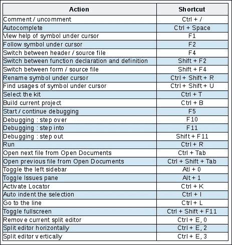
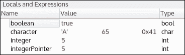
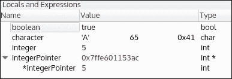

# 第十四章。Qt 小贴士和技巧

上一章教了你如何在所有主要的桌面和移动平台上打包 Qt 应用程序。这是将你的应用程序发送给用户之前的最后一步。本章汇集了一些技巧和窍门，将帮助你更轻松地开发你的 Qt 应用程序。

本章涵盖了以下主题：

+   Qt Creator 小贴士 - 有用的键盘快捷键、会话管理以及更多

+   使用 Qt Creator 检查内存

+   生成随机数

+   静默未使用变量和编译器警告

+   如何轻松地将对象的内容记录到 `QDebug`

+   自定义 `QDebug` 格式化

+   将日志保存到文件

+   创建友好的命令行界面

+   发送 `HTTP` `GET` 和 `POST` 请求

# 使用会话管理你的工作空间

对于商业产品通常由几个 Qt 项目组成是很常见的。我们在本书中经常遇到这种做法——例如，由核心项目和 GUI 项目组成的应用程序。Qt 子目录项目是在同一应用程序内处理相互依赖项目的一种很好的方式。

然而，当你的产品成长起来时，你可能会想在 Qt Creator 中打开一些无关的项目。在这种情况下，你应该使用一个 **会话**。会话是 Qt Creator 中工作空间的一个完整快照。你可以轻松地从 **文件** | **会话管理器** | **新建** 创建一个新的会话。不要忘记切换到新的会话。例如，你可以创建一个名为 "Mastering Qt5" 的会话，并在一个公共工作空间中加载所有项目示例。

当你需要快速在两个不同的工作空间之间切换时，会话非常有用。以下在 Qt Creator 中的项目将在会话中自动保存：

+   层次视图打开的项目

+   编辑器窗口（包括分割）

+   调试断点和表达式视图

+   书签

使用 **文件** | **会话管理器** 或 **欢迎** 选项卡来切换到不同的会话。会话可以被销毁，而不会对你的项目产生任何影响。

# 使用定位器搜索

使用 Qt Creator 提高你的生产力的另一种方法是使用键盘快捷键。Qt Creator 提供了许多优秀的键盘快捷键。以下是我们的选择：



我们最喜欢的一个是定位器。按 *Ctrl* + *K* 激活它。然后你可以享受以下功能：

+   输入一个文件名（你甚至可以使用部分输入）并按 *Enter* 键打开此文件。如果定位器建议多个文件，你可以使用上下箭头进行导航。

+   在搜索前加上 `.` （一个点后跟一个空格）以在当前文档中搜索 C++ 符号。例如，在第一章的 `Task.cpp` 文件中，尝试使用定位器输入 `. set` 并按 *Enter* 键跳转到 `Task::setName()` 函数。

+   输入 `l` （*L* 后跟一个空格）以跳转到特定的行。例如，"l 37" 将将我们带到当前文件的第 37 行

定位器提供了丰富的功能；下次您按下 *Ctrl* + *K* 时，请查看一下！

# 提高编译速度

您可以在多核计算机上加快编译速度。默认情况下，当您使用 Qt Creator 构建项目时，您只使用一个作业（因此，一个核心）。但是`make`支持使用多个作业进行编译。您可以使用`make -j N`选项一次允许 N 个作业。不要忘记更新您的打包脚本！

如果您从 Qt Creator 构建项目，您可以从**项目** | **构建步骤** | **构建**设置此选项。点击**详细信息**，然后在**构建参数**字段中，输入值`-j 8`以允许在编译期间进行八个作业，如下面的截图所示：


# 使用 Qt Creator 检查内存

对于本节，我们将使用以下代码片段：

```cpp
bool boolean = true; 
int integer = 5; 
char character = 'A'; 
int* integerPointer = &integer; 

qDebug() << "boolean is:" << boolean; 
qDebug() << "integer is:" << integer; 
qDebug() << "character is:" << character; 
qDebug() << "integerPointer is:" << integerPointer; 
qDebug() << "*integerPointer is:" << *integerPointer; 
qDebug() << "done!"; 

```

我们声明了三种原始类型：`boolean`、`integer`和`character`。我们还添加了一个指向`integer`变量的`integerPointer`指针。在最后一行设置断点并开始调试。在调试面板上，您应该有**局部变量和表达式**视图。您可以从**窗口** | **视图** | **局部变量和表达式**轻松添加/删除它。以下是它的截图：



您可以看到，所有我们的局部变量都显示其值。`字符`行甚至显示了字母 **'A'** 的三种格式（ASCII、整数和十六进制）。您可能还会注意到，`integerPointer`行显示的是自动解引用的值，而不是指针地址。您可以通过在**局部变量和表达式**窗口的背景上右键单击并选择**自动解引用指针**来禁用它。您可以看到指针地址和解引用值如以下截图所示：



控制台输出显示以下信息：

```cpp
boolean is: true 
integer is: 5 
character is: A 
integerPointer is: 0x7ffe601153ac 
*integerPointer is: 5 

```

您可以看到，我们在控制台输出中检索到相同的信息。**局部变量和表达式**视图可以帮助您节省时间。您可以在不使用`qDebug()`函数记录的情况下显示大量信息。

Qt Creator 提供了一个有用的内存编辑器。您可以通过在**局部变量和表达式**窗口中变量名上右键单击来打开它，然后选择**打开内存编辑器** | **在对象的地址处打开内存编辑器**。

在内存编辑器中，查看`boolean`变量的值：


一个十六进制编辑器出现，分为三个部分（从左到右）：

+   数据的内存地址

+   数据的十六进制表示

+   数据的 ASCII 表示

十六进制表示中的选择对应于变量。我们可以确认`boolean`变量在内存中以 1 个字节表示。因为值是`true`，内存表示为**0x01**。

让我们使用**内存编辑器**工具检查`character`内存：


字符也以 1 个字节存储在内存中。十六进制表示为**0x41**。字符使用众所周知的 ASCII 格式编码。请注意，在右侧，ASCII 表示显示为**'A'**。

这是`integer`变量的**内存编辑器**位置：


有两个有趣的事实需要注意。整数存储在 4 个字节中。值**05**以十六进制形式存储为**05 00 00 00**。字节顺序取决于处理器的端序。我们使用的是 Little-Endian 的 Intel CPU。具有 Big-Endian 内存存储的其他 CPU 架构将变量显示为**00 00 00 05**。

在我们继续深入了解应用程序的内存之前，仔细查看最后三个屏幕截图。你可能注意到，在这种情况下，三个变量在堆栈内存中是连续的。这取决于你操作系统实现的行为并不保证。

尝试在`integerPointer`变量上打开内存编辑器。上下文菜单提供了两种不同的方式：

+   **在对象的地址打开内存编辑器**选项取消引用指针，直接带你到指向的值。你得到与整数内存视图相同的结果。

+   **在指针地址打开内存编辑器**选项显示原始指针数据，这是一个指向其所在位置的内存地址。

这里是显示`integerPointer`指针地址的**内存编辑器**工具：


我们运行在 64 位操作系统上，因此我们的指针存储在 8 个字节中。这个指针的数据是十六进制值`ac 53 11 60 fe 7f 00 00`。这是内存地址`0x7ffe601153ac`的 Little-Endian 表示，该地址由**局部变量和表达式**以及我们的控制台输出显示。

我们显示内存，但我们也可以更改它。按照以下步骤操作：

1.  移除当前断点并在第一个`qDebug()`行上添加一个新的断点。

1.  重新启动调试并查看**局部变量和表达式**。如果你双击一个变量的值，你可以编辑它。请注意，**内存编辑器**窗口会立即更新其表示。

1.  在我们的例子中，我们将`boolean`值设置为 false，`character`设置为 68（即'D'），`integer`设置为 9。当你对自己的更改有信心时，继续调试。

这是反映我们修改的最终控制台输出：

```cpp
boolean is: false 
integer is: 9 
character is: D 
integerPointer is: 0x7fff849203dc 
*integerPointer is: 9 
done! 

```

**内存编辑器**是一个强大的工具：你可以在不更改源代码和重新编译应用程序的情况下，在运行时显示和更改变量的值。

# 生成随机数

对于计算机来说，生成真正的随机数是一项相当困难的任务。通常，我们只使用**伪随机数生成**（**PRNG**）。Qt 框架提供了函数`qrand()`，这是`std::rand()`的一个线程安全版本。这个函数返回一个介于 0 和`RAND_MAX`（在`stdlib.h`中定义）之间的整数。以下代码显示了两个伪随机数：

```cpp
qDebug() << "first number is" << qrand() % 10; 
qDebug() << "second number is" << qrand() % 10; 

```

我们使用模运算符来获取介于 0 和 9 之间的值。尝试多次运行你的应用程序。数字总是相同的，在我们的例子中，先是 3 然后是 7。那是因为每次我们调用`qrand()`时，我们都会检索伪随机序列的下一个数字，但序列总是相同的！幸运的是，我们可以使用`qsrand()`来使用种子初始化 PRNG。种子是一个用于生成序列的无符号整数。尝试下一个代码片段：

```cpp
qsrand(3); 
qDebug() << "first number is" << qrand() % 10; 
qDebug() << "second number is" << qrand() % 10; 

```

在这个例子中，我们使用了种子 3，并从`qrand()`得到了不同的值——在我们的计算机上它是 5 和 4。很好，但如果多次运行这个应用程序，你总是会得到这个序列。每次运行应用程序时生成不同序列的一种方法是在每次运行时使用不同的种子。运行以下代码片段：

```cpp
qsrand(QDateTime::currentDateTime().toTime_t()); 
qDebug() << "first number is" << qrand() % 10; 
qDebug() << "second number is" << qrand() % 10; 

```

如你所见，我们现在正在使用`QDateTime`的纪元时间初始化 PRNG。你可以尝试多次运行你的应用程序，以查看我们每次都会得到不同的数字！然而，这个解决方案不建议用于加密。在这种情况下，你应该使用更强的随机数生成器。

# 关闭未使用变量的警告

如果你的编译器配置为输出其警告，你可能会看到这种类型的日志：

```cpp
warning: unused parameter 'myVariable' [-Wunused-parameter] 

```

这是一个安全警告，告诉开发者保持他们的代码整洁并避免死变量。尽量减少这种类型的警告是一种好的做法。然而，有时你不得不这样做：你重写了一个现有的函数，但没有使用所有参数。你现在面临一个困境：一方面，你可以为整个应用程序关闭警告，另一方面，你可以让这些安全警告在编译输出中累积。必须有一个更好的选择。

事实上，你只能为你的函数关闭警告。有两种方法可以做到这一点：

+   使用 C/C++语法

+   使用 Qt 宏

假设你重写了`myFunction(QString name, QString myVariable)`函数，但你没有使用`myVariable`。使用 C/C++语法，你只需像这样实现`myFunction()`：

```cpp
void myFunction(QString name, QString /*myVariable*/) 

```

通过在函数签名中注释变量的名称`myVariable`，你确保你不会（即不能）在函数体中使用这个变量。编译器也会这样解释，并且不会输出任何警告。

Qt 还提供了使用`Q_UNUSED`宏标记未使用变量的方法。让我们看看它是如何工作的：

```cpp
void myFunction(QString name, QString myVariable) 
{ 
    Q_UNUSED(myVariable) 
    ... 
} 

```

简单地将`myVariable`传递给`Q_UNUSED`，它将从编译器输出中移除警告。幕后，`Q_UNUSED`对变量没有任何神奇的操作：

```cpp
#define Q_UNUSED(x) (void)x; 

```

这是一个愚弄编译器的简单技巧；它看到 `myVariable` “被使用”，但实际上并没有对它做任何事情。

# 将自定义对象记录到 QDebug

当您调试复杂对象时，将它们当前成员的值输出到 `qDebug()` 中是很方便的。在其他语言（如 Java）中，您可能已经遇到了 `toString()` 方法或类似的方法，这非常方便。

当然，您可以为每个想要记录的对象添加一个 `void toString()` 函数，以便使用以下语法编写代码：

```cpp
qDebug() << "Object content:" << myObject.toString() 

```

在 C++ 中，肯定有更自然的方式来做到这一点。此外，Qt 已经提供了这种功能：

```cpp
QDate today = QDate::currentDate(); 
qDebug() << today; 
// Output: QDate("2016-10-03") 

```

为了实现这一点，我们将依赖于 C++ 操作符重载。这看起来将非常类似于我们在第十章需要 IPC？让你的仆人去工作中使用的 `QDataStream` 操作符，*需要 IPC？让你的仆人去工作*。

考虑一个 `struct Person`：

```cpp
struct Person { 
    QString name; 
    int age; 
}; 

```

要添加将正确输出到 `QDebug` 的功能，您只需覆盖 `QDebug` 和 `Person` 之间的 `<<` 操作符，如下所示：

```cpp
#include <QDebug> 

struct Person { 
    ... 
}; 

QDebug operator<<(QDebug debug, const Person& person) 
{ 
    QDebugStateSaver saver(debug); 
    debug.nospace() << "(" 
                    << "name: " << person.name << ", " 
                    << "age: " << person.age 
                    << ")"; 
    return debug; 
} 

```

`QDebugStateSaver` 是一个便利类，用于保存 `QDebug` 的设置，并在销毁时自动恢复它们。始终使用它是良好的实践，以确保您不会在 `<<` 操作符重载中破坏 `QDebug`。

函数的其余部分是使用 `QDebug` 的常规方式，最后返回修改后的 `debug` 变量。现在您可以使用 `Person` 如此：

```cpp
Person person = { "Lenna", 64 }; 
qDebug() << "Person info" << person; 

```

不需要 `toString()` 函数；只需使用 person 对象。对于那些想知道的人，是的，`Lenna` 在写作时（2016 年）确实是 `64`。

# 改进日志消息

Qt 提供了多种实现方式。在结果和复杂性之间取得良好平衡的方法是将 Qt 日志类型与自定义消息模式相结合。

Qt 定义了五种日志类型，从最不严重到最关键级别：

+   `qDebug()`：用于写入自定义调试消息

+   `qInfo()`：用于写入信息性消息

+   `qWarning()`：用于在您的应用程序中写入警告和可恢复的错误

+   `qCritical()`：用于写入关键错误消息和报告系统错误

+   `qFatal()`：用于在自动退出前写入最后一条消息

尝试始终使用最合适的一个！

默认情况下，消息模式配置为仅显示您的消息而不显示任何额外数据，但您可以自定义模式以显示更多信息。此模式可以通过设置 `QT_MESSAGE_PATTERN` 环境变量在运行时更改。您还可以从您的软件中调用 `qSetMessagePattern` 函数来更改模式。模式只是一个包含一些占位符的字符串。

这些是最常用的占位符，您可以使用：

+   `%{appname}`：这是您的应用程序名称

+   `%{file}`：这是源文件的路径

+   `%{function}`：这是函数名

+   `%{line}`：这是源文件中的一行

+   `%{message}`：这是原始消息

+   `%{type}`：这是 Qt 日志类型（"debug"、"info"、"warning"、"critical" 或 "fatal"）

+   `%{time [format]}`: 这是消息发生时的系统时间

使用它的一个简单方法是像这样编辑你的`main.cpp`文件：

```cpp
#include <QApplication> 
#include <QDebug> 
... 
int main(int argc, char *argv[]) 
{ 
    qSetMessagePattern("[%{time yyyy-MM-dd hh:mm:ss}] [%{type}] 
        %{function} %{message}"); 
    qInfo() << "Application starting..."; 

    QApplication a(argc, argv); 
    ... 
    return a.exec(); 
} 

```

你的应用程序输出应该类似于以下内容：

```cpp
[2016-10-03 10:22:40] [info] qMain Application starting... 

```

尝试玩转 Qt 日志类型和自定义消息模式，直到找到对你有用的模式。

### 小贴士

对于更复杂的应用程序，你可以使用`QLoggingCategory`类来定义日志类别。有关更多信息，请访问[`doc.qt.io/qt-5/qloggingcategory.html`](http://doc.qt.io/qt-5/qloggingcategory.html)。

# 将日志保存到文件中

开发者通常需要日志。在某些情况下，你可能无法访问控制台输出，或者你可能需要在之后研究应用程序状态。在这两种情况下，日志必须输出到文件。

Qt 提供了一个将你的日志（`qDebug`, `qInfo`, `qWarning`等）重定向到任何方便的设备的实用方法：`QtMessageHandler`。要使用它，你必须注册一个函数，该函数将日志保存到所需的输出。

例如，在你的`main.cpp`文件中添加以下函数：

```cpp
#include <QFile> 
#include <QTextStream> 

void messageHander(QtMsgType type,  
                   const QMessageLogContext& context,  
                   const QString& message) { 
    QString levelText; 
    switch (type) { 
        case QtDebugMsg: 
            levelText = "Debug"; 
            break; 
        case QtInfoMsg: 
            levelText = "Info"; 
            break; 
        case QtWarningMsg: 
            levelText = "Warning"; 
            break; 
        case QtCriticalMsg: 
            levelText = "Critical"; 
            break; 
        case QtFatalMsg: 
            levelText = "Fatal"; 
            break; 
    } 
    QString text = QString("[%1] %2") 
                        .arg(levelText) 
                        .arg(message); 
    QFile file("app.log"); 
    file.open(QIODevice::WriteOnly | QIODevice::Append); 
    QTextStream textStream(&file); 
    textStream << text << endl; 
} 

```

函数的签名必须被尊重，以便 Qt 能够正确调用。让我们回顾一下参数：

+   `QtMsgType type`: 这是一个`enum`类型，用于描述生成消息的函数（例如`qDebug()`, `qInfo()`, `qWarning()`等）

+   `QMessageLogContext& context`: 这包含有关日志消息的附加信息（日志产生的源文件、函数名称、行号等）

+   `const QString& message`: 这是实际记录的消息

函数体在将日志消息附加到名为`app.log`的文件之前格式化日志消息。你可以通过添加循环日志文件、通过网络发送日志或进行其他操作来轻松地在此函数中添加功能。

最后缺少的部分是`messageHandler()`的注册，这通常在`main()`函数中完成：

```cpp
int main(int argc, char *argv[]) 
{ 
    QCoreApplication a(argc, argv); 
    qInstallMessageHandler(messageHander); 
    ... 
} 

```

调用`qInstallMessageHander()`函数足以将所有日志消息重路由到`app.log`。一旦完成，日志将不再显示在控制台输出中，而只会附加到`app.log`。

### 小贴士

如果你需要注销你的自定义消息处理函数，请调用`qInstallMessageHandler(0)`。

# 生成命令行界面

命令行界面可以是一个以一些特定选项启动应用程序的好方法。Qt 框架提供了一个使用`QCommandLineParser`类定义选项的简单方法。你可以提供一个简短（例如，`-t`）或长（例如，`--test`）的选项名称。应用程序版本和帮助菜单将自动生成。你可以在代码中轻松检索是否设置了选项。一个选项可以接受一个值，并且你可以定义一个默认值。

例如，我们可以创建一个命令行界面来配置日志文件。我们希望定义三个选项：

+   如果设置了，`-debug`命令将启用日志文件写入

+   `-f`或`--file`命令用于定义日志的写入位置

+   `-l`或`--level <level>`命令用于指定最小日志级别

看看下面的片段：

```cpp
QCoreApplication app(argc, argv); 

QCoreApplication::setApplicationName("ch14-hat-tips"); 
QCoreApplication::setApplicationVersion("1.0.0"); 

QCommandLineParser parser; 
parser.setApplicationDescription("CLI helper"); 
parser.addHelpOption(); 
parser.addVersionOption(); 

parser.addOptions({ 
    {"debug", 
        "Enable the debug mode."}, 

    {{"f", "file"}, 
        "Write the logs into <file>.", 
        "logfile"}, 

    {{"l", "level"}, 
        "Restrict the logs to level <level>. Default is 'fatal'.", 
        "level", 
        "fatal"}, 
}); 

parser.process(app); 

qDebug() << "debug mode:" << parser.isSet("debug"); 
qDebug() << "file:" << parser.value("file"); 
qDebug() << "level:" << parser.value("level"); 

```

让我们讨论每个步骤：

1.  第一部分使用`QCoreApplication`的函数来设置应用程序名称和版本。这些信息将被`--version`选项使用。

1.  实例化一个`QCommandLineParser`类。然后我们指示它自动添加帮助（`-h`或`--help`）和版本（`-v`或`--version`）选项。

1.  使用`QCommandLineParser::addOptions()`函数添加我们的选项。

1.  请求`QCommandLineParser`类处理命令行参数。

1.  检索并使用选项。

这里是创建选项的参数：

+   `optionName`: 通过使用此参数，你可以使用单个或多个名称

+   `description`：在这个参数中，选项的描述将在帮助菜单中显示

+   `valueName`（可选）：如果您的选项期望一个值，则显示值名称

+   `defaultValue`（可选）：这显示了选项的默认值

您可以使用`QCommandLineParser::isSet()`检索并使用选项，如果用户设置了选项，则返回 true。如果您的选项需要值，您可以使用`QCommandLineParser::value()`检索它。

这里是生成的帮助菜单的显示：

```cpp
$ ./ch14-hat-tips --help 
Usage: ./ch14-hat-tips [options] 
Helper of the command-line interface 

Options: 
  -h, --help            Displays this help. 
  -v, --version         Displays version information. 
  --debug               Enable the debug mode. 
  -f, --file <logfile>  Write the logs into <file>. 
  -l, --level <level>   Restrict the logs to level <level>. Default is 'fatal'. 

```

最后，以下片段显示了正在使用的 CLI：

```cpp
$ ./ch14-hat-tips --debug -f log.txt --level info 
debug mode:  true 
file:  "log.txt" 
level:  "info" 

```

# 发送和接收 HTTP 数据

向 HTTP 服务器请求信息是一个常见任务。在这里，Qt 的人们也准备了一些有用的类来简化这个过程。为了实现这一点，我们将依赖于三个类：

+   `QNetworkAccessManager`：这个类允许您的应用程序发送请求并接收回复

+   `QNetworkRequest`：这个类包含要发送的请求以及所有信息（头信息、URL、数据等）

+   `QNetworkReply`：这个类包含`QNetworkRequest`类的结果，包括头信息和数据

`QNetworkAccessManager`类是整个 Qt HTTP API 的枢纽点。它围绕一个单一的`QNetworkAccessManager`对象构建，该对象包含客户端的配置、代理设置、缓存信息等等。这个类被设计为异步的，所以你不需要担心阻塞当前线程。

让我们在自定义的`HttpRequest`类中看看它的实际应用。首先，是头文件：

```cpp
#include <QObject> 
#include <QNetworkAccessManager> 
#include <QNetworkReply> 

class HttpRequest : public QObject 
{ 
    Q_OBJECT 
public: 
    HttpRequest(QObject* parent = 0); 

    void executeGet(); 

private slots: 
    void replyFinished(QNetworkReply* reply); 

private: 
    QNetworkAccessManager mAccessManager; 
}; 

```

`QNetworkAccessManager`类与信号/槽机制一起工作，所以`HttpRequest`从`QObject`继承并使用`Q_OBJECT`宏。我们声明以下函数和成员：

+   `executeGet()`: 这用于触发一个`HTTP GET`请求

+   `replyFinished()`：这是在`GET`请求完成时调用的槽

+   `mAccessManager`：这是我们用于所有异步请求的对象

让我们把注意力转向`HttpRequest.cpp`中的`HttpRequest`类的构造函数：

```cpp
HttpRequest::HttpRequest(QObject* parent) : 
    QObject(parent), 
    mAccessManager() 
{ 
    connect(&mAccessManager, &QNetworkAccessManager::finished, 
            this, &HttpRequest::replyFinished); 
} 

```

在构造函数体中，我们将`mAccessManager`的`finished()`信号连接到我们的`replyFinished()`槽。这意味着通过`mAccessManager`发送的每个请求都会触发此槽。

准备工作就到这里；让我们看看请求和回复的实际操作：

```cpp
// Request 
void HttpRequest::executeGet() 
{ 
    QNetworkRequest request(QUrl("http://httpbin.org/ip")); 
    mAccessManager.get(QNetworkRequest(request)); 
} 

// Response 
void HttpRequest::replyFinished(QNetworkReply* reply) 
{ 
    int statusCode = reply->attribute(QNetworkRequest::HttpStatusCodeAttribute).toInt(); 
    qDebug() << "Reponse network error" << reply->error(); 
    qDebug() << "Reponse HTTP status code" << statusCode; 
    qDebug() << "Reply content:" << reply->readAll(); 
    reply->deleteLater(); 
} 

```

使用 `mAccessManager.get()` 处理 `HTTP GET` 请求。`QNetworkAccessManager` 类提供了其他 HTTP 动词（`head()`、`post()`、`put()`、`delete()` 等）的函数。它期望一个 `QNetworkRequest` 访问，该访问在其构造函数中接受一个 URL。这是 HTTP 请求的最简单形式。

注意，我们使用 URL [`httpbin.org/ip`](http://httpbin.org/ip) 进行了请求，它将以 JSON 格式响应发射器的 IP 地址：

```cpp
{ 
  "origin": "1.2.3.4" 
} 

```

这个网站是一个实用的开发者资源，你可以发送你的测试请求，并收到有用的信息反馈。它避免了需要启动一个自定义的 Web 服务器来测试几个请求。这个网站是一个由 Runscope 免费托管的开源项目。当然，你可以用你想要的任何内容替换请求 URL。

### 注意

查看网址 [`httpbin.org/`](http://httpbin.org/) 以查看所有支持请求类型。

在 `executeGet()` 函数完成后，`mAccessManager` 对象在单独的线程中执行请求，并使用结果 `QNetworkReply*` 对象调用我们的槽 `replyFinished()`。在这个代码片段中，你可以看到如何检索 HTTP 状态码并检查是否发生了任何网络错误，以及如何使用 `reply->readAll()` 获取响应体。

`QNetworkReply` 类继承自 `QIODevice`，因此你可以使用 `readAll()` 一次性读取它，或者通过在 `read()` 上的循环以块的形式读取。这让你能够使用熟悉的 `QIODevice` API 根据你的需求调整读取。

注意，你是 `QNetworkReply*` 对象的所有者。你不应该手动删除它（如果你这样做，你的应用程序可能会崩溃）；相反，最好使用 `reply->deleteLater()` 函数，这将让 Qt 事件循环选择合适的时机来删除此对象。

现在让我们看看一个更复杂的 `QNetworkReply` 示例，它使用 `HTTP POST` 方法。有时你需要跟踪 `QNetworkReply` 类并对其生命周期有更精细的控制。

下面是一个依赖于 `HttpRequest::mAccessManager` 的 `HTTP POST` 方法的实现：

```cpp
void HttpRequest::executePost() 
{ 
    QNetworkRequest request(QUrl("http://httpbin.org/post")); 
    request.setHeader(QNetworkRequest::ContentTypeHeader, 
                      "application/x-www-form-urlencoded"); 
    QUrlQuery urlQuery; 
    urlQuery.addQueryItem("book", "Mastering Qt 5"); 

    QUrl params; 
    params.setQuery(urlQuery); 

    QNetworkReply* reply = mAccessManager.post( 
                           request, params.toEncoded()); 
    connect(reply, &QNetworkReply::readyRead,  
        [reply] () { 
        qDebug() << "Ready to read from reply"; 
    }); 
    connect(reply, &QNetworkReply::sslErrors,  
            [this] (QList<QSslError> errors) { 
        qWarning() << "SSL errors" << errors; 
    }); 
} 

```

我们首先创建一个带有自定义头部的 `QNetworkRequest` 类：`Content-Type` 现在是 `application/x-www-form-urlencoded` 以遵守 HTTP RFC。之后，构建一个 URL 表单，准备与请求一起发送。你可以向 `urlQuery` 对象添加你想要的任何项目。

下一个部分很有趣。当使用请求和 URL 编码表单执行 `mAccessManager.post()` 时，`QNetworkReply*` 对象立即返回给我们。从这里，我们使用一些直接连接到回复的 lambda 插槽，而不是使用 `mAccessManage` 插槽。这让你能够精确控制每个回复发生的情况。

注意，`QNetworkReply::readyRead` 信号来自 `QIODevice` API，并且它不会在参数中传递 `QNetworkReply*` 对象。将回复存储在某个成员字段中或检索信号发射者的责任在于您。

最后，这个代码片段不会撤销我们之前定义的槽函数 `replyFinished()`，该函数连接到 `mAccessManager`。如果您执行此代码，您将得到以下输出序列：

```cpp
Ready to read from reply 
Reponse network error QNetworkReply::NetworkError(NoError) 
Reponse HTTP status code 200 

```

连接到 `QNetworkReply::readyRead` 信号的 lambda 表达式首先被调用，然后调用 `HttpRequest::replyFinished` 信号。

我们将在 Qt HTTP 栈上介绍的最后特性是同步请求。如果您需要自己管理请求线程，`QNetworkAccessManager` 的默认异步工作模式可能会给您带来麻烦。为了绕过这个问题，您可以使用自定义的 `QEventLoop`：

```cpp
void HttpRequest::executeBlockingGet() 
{ 
    QNetworkAccessManager localManager; 
    QEventLoop eventLoop; 
    QObject::connect( 
        &localManager, &QNetworkAccessManager::finished,  
        &eventLoop, &QEventLoop::quit); 

    QNetworkRequest request( 
                QUrl("http://httpbin.org/user-agent")); 
    request.setHeader(QNetworkRequest::UserAgentHeader,  
                      "MasteringQt5Browser 1.0"); 

    QNetworkReply* reply = localManager.get(request); 
    eventLoop.exec(); 

    qDebug() << "Blocking GET result:" << reply->readAll(); 
    reply->deleteLater(); 
} 

```

在这个函数中，我们声明了另一个 `QNetworkAccessManager`，它不会干扰在 `HttpRequest` 中声明的那个。紧接着，声明了一个 `QEventLoop` 对象并将其连接到 `localManager`。当 `QNetworkAccessManager` 发射 `finished()` 信号时，`eventLoop` 将退出，调用函数将恢复。

`request` 按照常规构建，检索到 `reply` 对象，函数因调用 `eventLoop.exec()` 而阻塞。函数会一直阻塞，直到 `localManager` 发射其完成信号。换句话说，请求仍然是异步完成的；唯一的不同是函数会阻塞直到请求完成。

最后，可以在函数的末尾安全地读取和删除 `reply` 对象。这个 `QEventLoop` 技巧可以在需要同步等待 Qt 信号时使用；明智地使用它以避免阻塞 UI 线程！

# 摘要

在本章中，您学到了一些完善您 Qt 知识的技巧。现在您应该能够轻松高效地使用 Qt Creator。`QDebug` 格式现在不应该有任何秘密了，您现在可以轻松地将日志保存到文件中，甚至不需要眨眼。您可以创建一个看起来不错的 CLI 接口，无需颤抖地调试任何程序的内存，并且可以自信地执行 HTTP 请求。

我们衷心希望您阅读这本书时能像我们写作时一样享受乐趣。在我们看来，Qt 是一个优秀的框架，它涵盖了众多值得通过书籍（或几本书）深入探讨的领域！我们希望您在构建高效且精美构建的应用程序时，能够愉快地编码 C++ Qt 代码。
