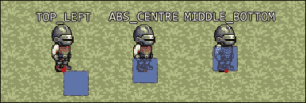

# 第二章. 游戏时间！ - 设计项目

在上一章中，我们介绍了将要用于创建游戏时预建立的代码库的基本部分。现在是时候将我们所学的内容应用于实践，通过关注项目特定的代码来构建我们正在制作的游戏的独特性。

在本章中，我们将讨论以下主题：

+   实现关键实体组件和系统以实现最小化游戏玩法

+   创建几个状态以导航游戏

+   将所有代码整理成一个连贯、可工作的项目

我们有一个完整游戏要设计，让我们开始吧！

# 版权资源的使用

在本章以及整本书的篇幅中，我们将使用以下资源：

+   由*Hyptosis*创作的*法师城市 Arcanos*，遵循**CC0**许可（公有领域）：[`opengameart.org/content/mage-city-arcanos`](http://opengameart.org/content/mage-city-arcanos)

+   由*William. Thompsonj*创作的*[LPC] 叶子重着色*，遵循**CC-BY-SA 3.0**和**GPL 3.0**许可：[`opengameart.org/content/lpc-leaf-recolor`](http://opengameart.org/content/lpc-leaf-recolor)

+   由*Wulax*创作的*[LPC] 中世纪幻想角色精灵*，遵循**CC-BY-SA 3.0**和**GPL 3.0**许可：[`opengameart.org/content/lpc-medieval-fantasy-character-sprites`](http://opengameart.org/content/lpc-medieval-fantasy-character-sprites)

+   由*Ravenmore*创作的*幻想 UI 元素*，可在[`dycha.net/`](http://dycha.net/)找到，遵循**CC-BY 3.0**许可：[`opengameart.org/content/fantasy-ui-elements-by-ravenmore`](http://opengameart.org/content/fantasy-ui-elements-by-ravenmore)

+   由*Arro*创作的*Vegur 字体*，遵循**CC0**许可（公有领域）：[`www.fontspace.com/arro/vegur`](http://www.fontspace.com/arro/vegur)

+   由*Fantozzi*创作的*Fantozzi 的足迹（草地/沙地与石头）*，遵循**CC0**许可（公有领域）：[`opengameart.org/content/fantozzis-footsteps-grasssand-stone`](http://opengameart.org/content/fantozzis-footsteps-grasssand-stone)

+   由*Snabisch*创作的*Electrix*（NES 版本），遵循**CC-BY 3.0**许可：[`opengameart.org/content/electrix-nes-version`](http://opengameart.org/content/electrix-nes-version)

+   由*cynicmusic*创作的*城镇主题 RPG*，遵循**CC-BY 3.0**许可：[`opengameart.org/content/town-theme-rpg`](http://opengameart.org/content/town-theme-rpg)

关于这些资源所适用的所有许可证的信息，可以在此找到：

+   [`creativecommons.org/publicdomain/zero/1.0/`](http://creativecommons.org/publicdomain/zero/1.0/)

+   [`creativecommons.org/licenses/by/3.0/`](http://creativecommons.org/licenses/by/3.0/)

+   [`creativecommons.org/licenses/by-sa/3.0/`](http://creativecommons.org/licenses/by-sa/3.0/)

+   [`www.gnu.org/licenses/gpl-3.0.html`](http://www.gnu.org/licenses/gpl-3.0.html)

# 实体放置和渲染

让我们从基础开始。在我们构建的任何游戏中，大多数（如果不是所有）实体都将位于世界中。现在让我们忽略特殊类型实体的边缘情况。为了表示实体位置，我们将创建一个位置组件，如下所示：

```cpp
class C_Position : public C_Base{ 
public: 
  C_Position(): C_Base(Component::Position), m_elevation(0){} 

  void ReadIn(std::stringstream& l_stream){ 
    l_stream >> m_position.x >> m_position.y >> m_elevation; 
  } 

  sf::Vector2f GetPosition() const { ... } 
  sf::Vector2f GetOldPosition() const { ... } 
  unsigned int GetElevation() const { ... } 
  void SetPosition(float l_x, float l_y){ ... } 
  void SetPosition(const sf::Vector2f& l_vec){ ... } 
  void SetElevation(unsigned int l_elevation){ ... } 
  void MoveBy(float l_x, float l_y){ ... } 
  void MoveBy(const sf::Vector2f& l_vec){ ... } 
private: 
  sf::Vector2f m_position; 
  sf::Vector2f m_positionOld; 
  unsigned int m_elevation; 
}; 

```

这里只有两件事值得注意。首先，组件类型必须通过`C_Base`构造函数来设置。如果我们将来要重新设计这个系统，这可以改变，但就目前而言，这是处理方式。我们还必须实现`ReadIn`方法，以便能够正确地反序列化组件数据。这意味着每次加载实体文件并遇到位置数据时，它将按照这个顺序读取*x*坐标、*y*坐标和海拔：

组件本身只持有与其原因相关的数据。这里存储了两个实体位置的数据成员：当前位置`m_position`和上一个游戏周期的实体位置`m_positionOld`。如果任何系统需要依赖更新之间的位置变化，这可能是有用的。

## 事物的可绘制方面

在 ECS 范式下表示事物的视觉方面并没有太大的不同。因为我们可能要处理多种可渲染对象，所以有一个它们都必须遵守和实现的接口是有帮助的：

```cpp
class C_Drawable : public C_Base{ 
public: 
  C_Drawable(const Component& l_type) : C_Base(l_type){} 
  virtual ~C_Drawable(){} 

  virtual void UpdatePosition(const sf::Vector2f& l_vec) = 0; 
  virtual sf::Vector2u GetSize() const = 0; 
  virtual void Draw(sf::RenderWindow* l_wind) = 0; 
}; 

```

根据可绘制组件的类型和实现方式，它们可能依赖于不同的方式来表示其位置、大小以及特定的绘制方法。当创建一个新的可绘制类型时，这三个方面都需要被定义，就像这样：

```cpp
class C_SpriteSheet : public C_Drawable{ 
public: 
  C_SpriteSheet(): C_Drawable(Component::SpriteSheet), 
    m_spriteSheet(nullptr){} 

  void ReadIn(std::stringstream& l_stream){l_stream>>m_sheetName;} 
  void Create(TextureManager* l_textureMgr, 
    const std::string& l_name = "") 
  { 
    if (m_spriteSheet) { m_spriteSheet.release(); } 
    m_spriteSheet = std::make_unique<SpriteSheet>(l_textureMgr); 
    m_spriteSheet->LoadSheet("media/Spritesheets/" + 
      (!l_name.empty() ? l_name : m_sheetName) + ".sheet"); 
  } 

  SpriteSheet* GetSpriteSheet(){ ... } 
  void UpdatePosition(const sf::Vector2f& l_vec){ ... } 
  sf::Vector2u GetSize() const { ... } 
  void Draw(sf::RenderWindow* l_wind){ ... } 
private: 
  std::unique_ptr<SpriteSheet> m_spriteSheet; 
  std::string m_sheetName; 
}; 

```

一个精灵图组件利用我们在第一章中介绍过的其中一个类，*内部机制 - 设置后端*。这个组件的反序列化相当简单。它只需要包含所有大小、填充、空间和动画信息的图文件名。因为这个类依赖于纹理管理器来加载其资源，所以使用了一个特殊的`Create()`方法来在加载后设置这种关系。

## 渲染系统

在数据处理方面已经全部处理完毕并移除之后，我们现在可以专注于在屏幕上实际绘制实体。这正是第一个系统类型发挥作用的地方：

```cpp
S_Renderer::S_Renderer(SystemManager* l_systemMgr) 
  :S_Base(System::Renderer, l_systemMgr) 
{ 
  Bitmask req; 
  req.TurnOnBit((unsigned int)Component::Position); 
  req.TurnOnBit((unsigned int)Component::SpriteSheet); 
  m_requiredComponents.push_back(req); 
  req.Clear(); 

  m_drawableTypes.TurnOnBit((unsigned int)Component::SpriteSheet); 
  // Other types... 

  m_systemManager->GetMessageHandler()-> 
    Subscribe(EntityMessage::Direction_Changed,this); 
} 

```

目前，渲染系统操作两种不同类型的组件：位置和精灵图。如果提供了更多种类的可绘制组件类型，它当然也需要包括它们。这正是为什么保留了一个名为`m_drawableTypes`的位掩码数据成员。它跟踪所有可能的可绘制组件类型，并将被用于稍后检索实际组件数据。所有这些类型都应该在这里注册。

这个系统还需要在实体改变方向时得到通知，以便在给定的精灵图集中强制执行这些变化。

系统使用的所有组件通常都需要像这样更新：

```cpp
void S_Renderer::Update(float l_dT){ 
  EntityManager* entities = m_systemManager->GetEntityManager(); 
  for(auto &entity : m_entities) 
  { 
    auto position = entities-> 
      GetComponent<C_Position>(entity, Component::Position); 
    C_Drawable* drawable = GetDrawableFromType(entity); 
    if (!drawable) { continue; } 
    drawable->UpdatePosition(position->GetPosition()); 
  } 
} 

```

这相当直接。为了使模拟准确，所有可绘制组件的位置都需要更新。我们使用一个私有方法来获取当前实体具有的可绘制类型的指针，检查它是否不是 `nullptr`，然后更新其位置。

事件处理也用于这个系统，通过排序实体来实现 *深度* 效果：

```cpp
void S_Renderer::HandleEvent(const EntityId& l_entity, 
  const EntityEvent& l_event) 
{ 
  if (l_event == EntityEvent::Moving_Left || 
    l_event == EntityEvent::Moving_Right || 
    l_event == EntityEvent::Moving_Up || 
    l_event == EntityEvent::Moving_Down || 
    l_event == EntityEvent::Elevation_Change || 
    l_event == EntityEvent::Spawned) 
  { 
    SortDrawables(); 
  } 
} 

```

我们在这里需要做的就是调用另一个私有方法，该方法将根据 *y* 轴对所有系统中的实体进行排序。这只有在实体正在移动、改变高度或刚刚生成时才需要发生。

就实体消息而言，我们只对一种类型感兴趣，正如 `S_Renderer` 构造函数所明显显示的那样：

```cpp
void S_Renderer::Notify(const Message& l_message){ 
  if(HasEntity(l_message.m_receiver)){ 
    EntityMessage m=static_cast<EntityMessage>(l_message.m_type); 
    switch(m){ 
    case EntityMessage::Direction_Changed:  
      SetSheetDirection(l_message.m_receiver, 
        (Direction)l_message.m_int); 
      break; 
    } 
  } 
} 

```

另一个私有方法也派上了用场。它将在稍后进行介绍，但基本思路是精灵图集需要被告知任何方向变化，以便在视觉上反映出来。

由于这个系统的整个目的是在屏幕上渲染我们的实体，让我们就这样做：

```cpp
void S_Renderer::Render(Window* l_wind, unsigned int l_layer) 
{ 
  EntityManager* entities = m_systemManager->GetEntityManager(); 
  for(auto &entity : m_entities){ 
    auto position = entities-> 
      GetComponent<C_Position>(entity, Component::Position); 
    if(position->GetElevation() < l_layer){ continue; } 
    if(position->GetElevation() > l_layer){ break; } 
    C_Drawable* drawable = GetDrawableFromType(entity); 
    if (!drawable) { continue; } 
    sf::FloatRect drawableBounds; 
    drawableBounds.left = position->GetPosition().x - 
      (drawable->GetSize().x / 2); 
    drawableBounds.top = position->GetPosition().y - 
      drawable->GetSize().y; 
    drawableBounds.width = 
      static_cast<float>(drawable->GetSize().x); 
    drawableBounds.height = 
      static_cast<float>(drawable->GetSize().y); 
    if (!l_wind->GetViewSpace().intersects(drawableBounds)){ 
      continue; 
    } 
    drawable->Draw(l_wind->GetRenderWindow()); 
  } 
} 

```

再次强调，这相当简单。实际的渲染是按层进行的，因此传入一个参数表示我们当前正在绘制的特定层。首先获取位置组件，以检查实体的高度是否与当前正在渲染的层匹配。由于游戏实体总是保持排序，我们知道如果任何给定实体的高度超过我们正在处理的层，就可以跳出循环。

最后，获取实体的可绘制组件，并检查它是否在屏幕区域外，以最小化不必要的绘制。

现在我们只剩下私有辅助方法了，从 `SetSheetDirection` 开始：

```cpp
void S_Renderer::SetSheetDirection(const EntityId& l_entity, 
  const Direction& l_dir) 
{ 
  EntityManager* entities = m_systemManager->GetEntityManager(); 
  if (!entities->HasComponent(l_entity, Component::SpriteSheet)) 
  { return; } 
  auto sheet = entities-> 
    GetComponent<C_SpriteSheet>(l_entity,Component::SpriteSheet); 
  sheet->GetSpriteSheet()->SetDirection(l_dir); 
} 

```

我们之前都见过。检查实体是否有精灵图集组件，然后获取该组件并告知方向变化。

这个系统严重依赖于实体根据它们的 *y* 坐标和高度进行排序。为此，我们使用以下代码：

```cpp
void S_Renderer::SortDrawables(){ 
  EntityManager* e_mgr = m_systemManager->GetEntityManager(); 
  std::sort(m_entities.begin(), m_entities.end(), 
    e_mgr 
  { 
    auto pos1 = e_mgr-> 
      GetComponent<C_Position>(l_1, Component::Position); 
    auto pos2 = e_mgr-> 
      GetComponent<C_Position>(l_2, Component::Position); 
    if (pos1->GetElevation() == pos2->GetElevation()){ 
      return pos1->GetPosition().y < pos2->GetPosition().y; 
    } 
    return pos1->GetElevation() < pos2->GetElevation(); 
  }); 
} 

```

由于实体标识符存储在 STL 容器中，`std::sort` 就派上用场了。实际的排序优先考虑高度；然而，如果两个实体在这一方面有共同点，它们将根据 *y* 坐标进行排序，从小到大。

为了总结一下，这里有一个方法可以节省我们一些打字时间，如果将来添加了额外的可绘制组件类型：

```cpp
C_Drawable* S_Renderer::GetDrawableFromType( 
  const EntityId& l_entity) 
{ 
  auto entities = m_systemManager->GetEntityManager(); 
  for (size_t i = 0; i < static_cast<size_t>(Component::COUNT); 
    ++i) 
  { 
    if (!m_drawableTypes.GetBit(i)) { continue; } 
    auto component = static_cast<Component>(i); 
    if (!entities->HasComponent(l_entity, component)){ continue; } 
    return entities->GetComponent<C_Drawable>(l_entity,component); 
  } 
  return nullptr; 
} 

```

它所做的只是简单地遍历所有组件类型，寻找与系统构造函数中注册的可绘制类型匹配的类型。一旦找到，就检查实体是否具有该组件。如果它有，就返回它的指针。

# 实体运动学

我们迄今为止编写的代码只会产生一个静态、不动的场景。由于这并不非常令人兴奋，让我们努力添加实体运动的可能性。由于需要存储更多数据，我们需要另一种组件类型来工作：

```cpp
class C_Movable : public C_Base{ 
public: 
  C_Movable() : C_Base(Component::Movable), 
    m_velocityMax(0.f), m_direction((Direction)0){} 

  void ReadIn(std::stringstream& l_stream){ 
    l_stream >> m_velocityMax >> m_speed.x >> m_speed.y; 
    unsigned int dir = 0; 
    l_stream >> dir; 
    m_direction = static_cast<Direction>(dir); 
  } 
  ... 
  void SetVelocity(const sf::Vector2f& l_vec){ ... } 
  void SetMaxVelocity(float l_vel){ ... } 
  void SetSpeed(const sf::Vector2f& l_vec){ ... } 
  void SetAcceleration(const sf::Vector2f& l_vec){ ... } 
  void SetDirection(const Direction& l_dir){ ... } 
  void AddVelocity(const sf::Vector2f& l_vec){ ... } 
  void ApplyFriction(const sf::Vector2f& l_vec){ ... } 
  void Accelerate(const sf::Vector2f& l_vec){ ... } 
  void Accelerate(float l_x, float l_y){ ... } 
  void Move(const Direction& l_dir){ ... } 
private: 
  sf::Vector2f m_velocity; 
  sf::Vector2f m_speed; 
  sf::Vector2f m_acceleration; 
  float m_velocityMax; 
  Direction m_direction; 
}; 

```

我们将通过速度、速度和加速度之间的关系来模拟运动。为了控制实体，还将强制实施一个最大速度值，以防止无限加速。我们还使用此组件存储方向，以减少某些复杂性和组件间的关系；然而，它也可以是一个独立的组件。

## 运动系统

为了启动这个系统，让我们首先看看运动系统需要什么才能工作：

```cpp
S_Movement::S_Movement(SystemManager* l_systemMgr)  
  : S_Base(System::Movement,l_systemMgr) 
{ 
  Bitmask req; 
  req.TurnOnBit((unsigned int)Component::Position); 
  req.TurnOnBit((unsigned int)Component::Movable); 
  m_requiredComponents.push_back(req); 
  req.Clear(); 

  m_systemManager->GetMessageHandler()-> 
    Subscribe(EntityMessage::Is_Moving,this); 

  m_gameMap = nullptr; 
} 

```

实体的运动状态将直接控制其位置，因此在这里我们需要同时处理位置和可移动组件。还订阅了实体消息类型`Is_Moving`。其命名方式应该是一个线索，表明这条消息将被用作信息请求，并且发送者期望得到答复。由于该系统负责与运动相关的所有事情，它将处理此类请求。

接下来，让我们更新组件数据：

```cpp
void S_Movement::Update(float l_dT){ 
  if (!m_gameMap){ return; } 
  EntityManager* entities = m_systemManager->GetEntityManager(); 
  for(auto &entity : m_entities){ 
    auto position = entities-> 
      GetComponent<C_Position>(entity, Component::Position); 
    auto movable = entities-> 
      GetComponent<C_Movable>(entity, Component::Movable); 
    MovementStep(l_dT, movable, position); 
    position->MoveBy(movable->GetVelocity() * l_dT); 
  } 
} 

```

获取这两个组件后，它们将被传递到一个处理移动步骤的私有方法中。我们稍后会介绍这一点，但重要的是要注意，它以`const`值的形式接受位置组件指针，这意味着它只读。这就是为什么实体位置在下一行被单独修改，通过调用其`MoveBy()`方法。它只是通过提供的唯一参数（向量）推进位置。

对于更复杂的系统任务，显然有更多的事件需要处理：

```cpp
void S_Movement::HandleEvent(const EntityId& l_entity,  
  const EntityEvent& l_event) 
{ 
  switch(l_event){ 
  case EntityEvent::Colliding_X: 
    StopEntity(l_entity, Axis::x); break; 
  case EntityEvent::Colliding_Y: 
    StopEntity(l_entity, Axis::y); break; 
  case EntityEvent::Moving_Left: 
    SetDirection(l_entity, Direction::Left); break; 
  case EntityEvent::Moving_Right: 
    SetDirection(l_entity, Direction::Right); break; 
  case EntityEvent::Moving_Up: 
    { 
      auto mov = m_systemManager->GetEntityManager()-> 
        GetComponent<C_Movable>(l_entity,Component::Movable); 
      if(mov->GetVelocity().x == 0){ 
        SetDirection(l_entity, Direction::Up); 
      } 
    } 
    break; 
  case EntityEvent::Moving_Down: 
    { 
      auto mov = m_systemManager->GetEntityManager()-> 
        GetComponent<C_Movable>(l_entity,Component::Movable); 
      if(mov->GetVelocity().x == 0){ 
        SetDirection(l_entity, Direction::Down); 
      } 
    } 
    break; 
  } 
} 

```

如果实体实际上与一个固体发生碰撞，我们将希望在其给定轴上停止实体。当讨论碰撞系统时，我们将讨论碰撞事件发射，所以现在我们只需要记住的是，如果一个实体在特定轴上发生碰撞，它需要在该轴上将其速度减少到`0`。

由于我们还要负责实体的方向，因此处理运动事件并使用它们来更新它。方向优先级给予水平运动，而上下方向仅在*x*轴上的速度为零时设置。

在此系统的构造函数中，我们订阅了一个请求运动信息的消息。让我们看看如何处理它：

```cpp
void S_Movement::Notify(const Message& l_message){ 
  EntityManager* eMgr = m_systemManager->GetEntityManager(); 
  EntityMessage m = static_cast<EntityMessage>(l_message.m_type); 
  switch(m){ 
  case EntityMessage::Is_Moving: 
    { 
    if (!HasEntity(l_message.m_receiver)){ return; } 
    auto movable = eMgr-> 
     GetComponent<C_Movable>(l_message.m_receiver, 
     Component::Movable); 
    if (movable->GetVelocity() != sf::Vector2f(0.f, 0.f)){return;} 
    m_systemManager->AddEvent(l_message.m_receiver, 
      (EventID)EntityEvent::Became_Idle); 
    } 
    break; 
  } 
} 

```

如果请求的实体信息甚至不属于该系统的一部分，则消息将被忽略。否则，将获取可移动组件并检查其速度是否不为绝对零。如果是，则发送实体事件`Became_Idle`。这将在我们处理实体动画时很有用。

再次强调，所有繁重的工作都在我们的辅助方法中完成。让我们从一个简单的开始，用于获取空间中特定坐标的瓷砖摩擦力：

```cpp
sf::Vector2f S_Movement::GetTileFriction(unsigned int l_elevation, 
  unsigned int l_x, unsigned int l_y) 
{ 
  Tile* t = nullptr; 
  while (!t && l_elevation >= 0){ 
    t = m_gameMap->GetTile(l_x, l_y, l_elevation); 
    --l_elevation; 
  } 

  return(t ? t->m_properties->m_friction : 
    m_gameMap->GetDefaultTile()->m_friction); 
} 

```

首先建立一个指向瓷砖的 `null` 指针。然后使用 `while` 循环尝试获取实际的瓷砖，从原始高度开始，向下移动直到达到 *0*。我们最终返回找到的瓷砖的摩擦力，或者如果没有找到，则返回地图的默认摩擦力。它在尝试处理实体的移动步骤时发挥作用：

```cpp
void S_Movement::MovementStep(float l_dT, C_Movable* l_movable, 
  const C_Position* l_position) 
{ 
  sf::Vector2f f_coefficient = GetTileFriction( 
    l_position->GetElevation(), 
    static_cast<unsigned int>(floor(l_position->GetPosition().x / 
      Sheet::Tile_Size)), 
    static_cast<unsigned int>(floor(l_position->GetPosition().y / 
      Sheet::Tile_Size))); 

  sf::Vector2f friction(l_movable->GetSpeed().x * f_coefficient.x, 
    l_movable->GetSpeed().y * f_coefficient.y); 

  l_movable->AddVelocity(l_movable->GetAcceleration() * l_dT); 
  l_movable->SetAcceleration(sf::Vector2f(0.0f, 0.0f)); 
  l_movable->ApplyFriction(friction * l_dT); 

  float magnitude = sqrt( 
    (l_movable->GetVelocity().x * l_movable->GetVelocity().x) + 
    (l_movable->GetVelocity().y * l_movable->GetVelocity().y)); 

  if (magnitude <= l_movable->GetMaxVelocity()){ return; } 
  float max_V = l_movable->GetMaxVelocity(); 
  l_movable->SetVelocity(sf::Vector2f( 
    (l_movable->GetVelocity().x / magnitude) * max_V, 
    (l_movable->GetVelocity().y / magnitude) * max_V)); 
} 

```

在从实体所站立的当前瓷砖中获取摩擦系数后，由于摩擦力而损失的速度被计算，由于加速度产生的速度被添加，加速度本身被置零，并应用摩擦力。为了考虑对角线移动，计算速度大小并检查是否超过最大允许值。如果超过了，根据其实际速度和总大小之间的比率重新计算实体的速度，并调整以适应提供的边界。

停止一个实体简单来说就是将其在提供的轴上的速度置零，如下所示：

```cpp
void S_Movement::StopEntity(const EntityId& l_entity,  
  const Axis& l_axis) 
{ 
  auto movable = m_systemManager->GetEntityManager()-> 
    GetComponent<C_Movable>(l_entity,Component::Movable); 
  if(l_axis == Axis::x){ 
    movable->SetVelocity(sf::Vector2f( 
      0.f, movable->GetVelocity().y)); 
  } else if(l_axis == Axis::y){ 
    movable->SetVelocity(sf::Vector2f( 
      movable->GetVelocity().x, 0.f)); 
  } 
} 

```

更新实体的方向同样简单，但其他系统不能忽视这一点：

```cpp
void S_Movement::SetDirection(const EntityId& l_entity,  
  const Direction& l_dir) 
{ 
  auto movable = m_systemManager->GetEntityManager()-> 
    GetComponent<C_Movable>(l_entity,Component::Movable); 
  movable->SetDirection(l_dir); 

  Message msg((MessageType)EntityMessage::Direction_Changed); 
  msg.m_receiver = l_entity; 
  msg.m_int = static_cast<int>(l_dir); 
  m_systemManager->GetMessageHandler()->Dispatch(msg); 
} 

```

在更新方向后，构建并派发一个新的消息，让相关系统知道实体的方向变化。这也会在处理实体动画时证明非常有用。

# 处理碰撞

为了让我们所制作的游戏感觉不仅仅是在没有后果的静态背景上移动的实体，我们需要检查和处理碰撞。在 ECS 范式内，这可以通过实现一个可碰撞组件来实现。为了增加灵活性，让我们定义多个碰撞框可以附加的点：

```cpp
enum class Origin{ Top_Left, Abs_Centre, Mid_Bottom }; 

```

**TOP_LEFT** 原点简单地将碰撞矩形的左上角放置在提供的位置。**ABS_CENTRE** 将该矩形的中心移动到该位置，而**MIDDLE_BOTTOM** 原点则将其放置在*x*轴的中点和*y*轴的底部。考虑以下插图：



基于这些信息，让我们着手实现可碰撞组件：

```cpp
class C_Collidable : public C_Base{ 
public: 
  C_Collidable(): C_Base(Component::Collidable),  
    m_origin(Origin::Mid_Bottom), m_collidingOnX(false), 
    m_collidingOnY(false){} 

  void ReadIn(std::stringstream& l_stream){ 
    unsigned int origin = 0; 
    l_stream >> m_AABB.width >> m_AABB.height >> m_offset.x 
      >> m_offset.y >> origin; 
    m_origin = static_cast<Origin>(origin); 
  } 

  const sf::FloatRect& GetCollidable() const { ... } 
  bool IsCollidingOnX() const { ... } 
  bool IsCollidingOnY() const { ... } 
  void CollideOnX(){ m_collidingOnX = true; } 
  void CollideOnY(){ m_collidingOnY = true; } 
  void ResetCollisionFlags(){ ... } 
  void SetCollidable(const sf::FloatRect& l_rect){ ... } 
  void SetOrigin(const Origin& l_origin){ ... } 
  void SetSize(const sf::Vector2f& l_vec){ ... } 

  void SetPosition(const sf::Vector2f& l_vec){ 
    switch(m_origin){ 
    case(Origin::Top_Left) : 
      m_AABB.left    = l_vec.x + m_offset.x; 
      m_AABB.top     = l_vec.y + m_offset.y; 
      break; 
    case(Origin::Abs_Centre): 
      m_AABB.left    = l_vec.x - (m_AABB.width / 2) + m_offset.x; 
      m_AABB.top     = l_vec.y - (m_AABB.height / 2) + m_offset.y; 
      break; 
    case(Origin::Mid_Bottom): 
      m_AABB.left    = l_vec.x - (m_AABB.width / 2) + m_offset.x; 
      m_AABB.top     = l_vec.y - m_AABB.height + m_offset.y; 
      break; 
    } 
  } 
private: 
  sf::FloatRect m_AABB; 
  sf::Vector2f m_offset; 
  Origin m_origin; 

  bool m_collidingOnX; 
  bool m_collidingOnY; 
}; 

```

首先，让我们看看我们正在保存的数据。`sf::FloatRect` 代表围绕将要用作碰撞器的实体的基本 **AABB** 边界框。我们还想能够通过一些值来偏移它，这些值将从实体文件中加载。显然，原点点也被存储，以及两个标志，指示每个轴上是否发生碰撞。

`SetPosition()` 方法结合了原点的使用，并调整矩形以正确定位，因为原生的 `sf::FloatRect` 本身不支持原点。

## 碰撞系统

为了处理碰撞，我们只需要两个组件：

```cpp
S_Collision::S_Collision(SystemManager* l_systemMgr)  
  : S_Base(System::Collision,l_systemMgr) 
{ 
  Bitmask req; 
  req.TurnOnBit((unsigned int)Component::Position); 
  req.TurnOnBit((unsigned int)Component::Collidable); 
  m_requiredComponents.push_back(req); 
  req.Clear(); 

  m_gameMap = nullptr; 
} 

```

注意`m_gameMap`数据成员。在某个时候，我们需要向碰撞系统提供一个指向游戏地图的指针，以便能够处理地图碰撞。

接下来，让我们处理更新我们的组件数据：

```cpp
void S_Collision::Update(float l_dT){ 
  if (!m_gameMap){ return; } 
  EntityManager* entities = m_systemManager->GetEntityManager(); 
  for(auto &entity : m_entities){ 
    auto position = entities-> 
      GetComponent<C_Position>(entity, Component::Position); 
    auto collidable = entities-> 
      GetComponent<C_Collidable>(entity, Component::Collidable); 

    CheckOutOfBounds(position); 
    collidable->SetPosition(position->GetPosition()); 
    collidable->ResetCollisionFlags(); 
    MapCollisions(entity, position, collidable); 
  } 
  EntityCollisions(); 
} 

```

首先，检查实体的位置，看它是否在地图边界之外。在可能调整后，使用新的位置信息更新`collidable`组件，并重置其碰撞标志。然后，这两个组件被传递给一个处理地图碰撞的私有方法。

在检查所有实体与地图的碰撞之后，我们必须检查它们之间的碰撞：

```cpp
void S_Collision::EntityCollisions(){ 
  EntityManager* entities = m_systemManager->GetEntityManager(); 
  for(auto itr = m_entities.begin(); itr!=m_entities.end(); ++itr) 
  { 
    for(auto itr2=std::next(itr); itr2!=m_entities.end(); ++itr2){ 
      auto collidable1 = entities-> 
        GetComponent<C_Collidable>(*itr, Component::Collidable); 
      auto collidable2 = entities-> 
        GetComponent<C_Collidable>(*itr2, Component::Collidable); 
      if(collidable1->GetCollidable().intersects( 
        collidable2->GetCollidable())) 
      { 
        // Entity-on-entity collision! 
      } 
    } 
  } 
} 

```

到目前为止，我们实际上并不需要以任何方式处理实体间的碰撞，但这将是以后功能的入口点。

边界检查相当简单：

```cpp
void S_Collision::CheckOutOfBounds(C_Position* l_pos){ 
  unsigned int TileSize = m_gameMap->GetTileSize(); 

  if (l_pos->GetPosition().x < 0){ 
    l_pos->SetPosition(0.0f, l_pos->GetPosition().y); 
  } else if (l_pos->GetPosition().x > 
    m_gameMap->GetMapSize().x * TileSize) 
  { 
    l_pos->SetPosition( 
      static_cast<float>(m_gameMap->GetMapSize().x * TileSize), 
      l_pos->GetPosition().y); 
  } 

  if (l_pos->GetPosition().y < 0){ 
    l_pos->SetPosition(l_pos->GetPosition().x, 0.0f); 
  } else if (l_pos->GetPosition().y > 
    m_gameMap->GetMapSize().y * TileSize) 
  { 
    l_pos->SetPosition( 
      l_pos->GetPosition().x, 
      static_cast<float>(m_gameMap->GetMapSize().y * TileSize)); 
  } 
} 

```

它简单地检查位置是否在负坐标或地图边界之外。

实际处理地图碰撞被进一步分解为更易读的部分：

```cpp
void S_Collision::MapCollisions(const EntityId& l_entity, 
  C_Position* l_pos, C_Collidable* l_col) 
{ 
  Collisions c; 
  CheckCollisions(l_pos, l_col, c); 
  HandleCollisions(l_entity, l_pos, l_col, c); 
} 

```

在设置好`Collisions`数据类型后，它连同位置和可碰撞组件一起传递给两个私有方法，这些方法实际上执行碰撞检查，并随后处理它们。`Collisions`数据类型只是一个用于存储碰撞信息的容器：

```cpp
struct CollisionElement{ 
  CollisionElement(float l_area, TileInfo* l_info, 
    const sf::FloatRect& l_bounds):m_area(l_area), m_tile(l_info), 
    m_tileBounds(l_bounds){} 
  float m_area; 
  TileInfo* m_tile; 
  sf::FloatRect m_tileBounds; 
}; 

using Collisions = std::vector<CollisionElement>; 

```

让我们接下来关注实际上填充这个结构以包含有用的碰撞信息：

```cpp
void S_Collision::CheckCollisions(C_Position* l_pos, 
  C_Collidable* l_col, Collisions& l_collisions) 
{ 
  unsigned int TileSize = m_gameMap->GetTileSize(); 
  sf::FloatRect EntityAABB = l_col->GetCollidable(); 
  int FromX = static_cast<int>(floor(EntityAABB.left / TileSize)); 
  int ToX = static_cast<int>(floor((EntityAABB.left + 
    EntityAABB.width) / TileSize)); 
  int FromY = static_cast<int>(floor(EntityAABB.top / TileSize)); 
  int ToY = static_cast<int>(floor((EntityAABB.top + 
    EntityAABB.height) / TileSize)); 

  for (int x = FromX; x <= ToX; ++x) { 
    for (int y = FromY; y <= ToY; ++y) { 
      for (size_t l = l_pos->GetElevation(); l < 
        l_pos->GetElevation() + 1; ++l) 
      { 
        auto t = m_gameMap->GetTile(x, y, l); 
        if (!t) { continue; } 
        if (!t->m_solid) { continue; } 
        sf::FloatRect TileAABB = static_cast<sf::FloatRect>( 
          sf::IntRect(x*TileSize, y*TileSize,TileSize,TileSize)); 
        sf::FloatRect Intersection; 
        EntityAABB.intersects(TileAABB, Intersection); 
        float S = Intersection.width * Intersection.height; 
        l_collisions.emplace_back(S, t->m_properties, TileAABB); 
        break; 
      } 
    } 
  } 
} 

```

此方法使用实体碰撞框和地图瓦片大小来确定与之相交的瓦片范围。然后我们使用这个范围逐个获取瓦片，检查它们是否存在且是实心的，构建它们的边界框，测量相交区域的面积，并将所有这些信息添加到碰撞容器中。到目前为止，一切顺利！

这个系统的最终大戏当然是处理收集到的所有碰撞信息：

```cpp
void S_Collision::HandleCollisions(const EntityId& l_entity, 
  C_Position* l_pos, C_Collidable* l_col,Collisions& l_collisions) 
{ 
  sf::FloatRect EntityAABB = l_col->GetCollidable(); 
  unsigned int TileSize = m_gameMap->GetTileSize(); 

  if (l_collisions.empty()) { return; } 
  std::sort(l_collisions.begin(), l_collisions.end(), 
    [](CollisionElement& l_1, CollisionElement& l_2) { 
      return l_1.m_area > l_2.m_area; 
    } 
  ); 

  for (auto &col : l_collisions) { 
    EntityAABB = l_col->GetCollidable(); 
    if (!EntityAABB.intersects(col.m_tileBounds)) { continue; } 
    float xDiff = (EntityAABB.left + (EntityAABB.width / 2)) - 
      (col.m_tileBounds.left + (col.m_tileBounds.width / 2)); 
    float yDiff = (EntityAABB.top + (EntityAABB.height / 2)) - 
      (col.m_tileBounds.top + (col.m_tileBounds.height / 2)); 
    float resolve = 0; 
    if (std::abs(xDiff) > std::abs(yDiff)) { 
      if (xDiff > 0) { 
        resolve=(col.m_tileBounds.left+TileSize)-EntityAABB.left; 
      } else { 
        resolve = -((EntityAABB.left + EntityAABB.width) - 
          col.m_tileBounds.left); 
      } 
      l_pos->MoveBy(resolve, 0); 
      l_col->SetPosition(l_pos->GetPosition()); 
      m_systemManager->AddEvent( 
        l_entity, (EventID)EntityEvent::Colliding_X); 
      l_col->CollideOnX(); 
    } else { 
      if (yDiff > 0) { 
        resolve=(col.m_tileBounds.top + TileSize)-EntityAABB.top; 
      } else { 
        resolve = -((EntityAABB.top + EntityAABB.height) - 
          col.m_tileBounds.top); 
      } 
      l_pos->MoveBy(0, resolve); 
      l_col->SetPosition(l_pos->GetPosition()); 
      m_systemManager->AddEvent( 
        l_entity, (EventID)EntityEvent::Colliding_Y); 
      l_col->CollideOnY(); 
    } 
  } 
} 

```

首先检查碰撞容器是否为空。如果不为空，我们将碰撞信息排序，以便按降序流动，并使用相交区域的尺寸进行比较。这确保了具有最大相交面积的碰撞（或碰撞）首先被处理。

在处理这些信息的过程中，我们首先需要检查实体的边界框是否仍然与瓦片发生碰撞。在发生多次碰撞的情况下，首先处理的那次碰撞可能会将实体移动到不再与任何物体发生碰撞的位置。

`xDiff`和`yDiff`变量用于存储每个轴的穿透信息，而`resolve`变量将用于存储实体将要被推开的精确距离，以解决碰撞。然后比较这两个变量，以决定在哪个轴上解决碰撞。我们的`resolve`变量用于根据是左到右还是右到左的碰撞来计算推开的精确距离。

最后，通过调整相关轴上的解析距离，更新可碰撞组件的位置以匹配这些变化，发送出碰撞事件，并调用可碰撞组件的`CollideOnX`或`CollideOnY`方法来更新碰撞标志。然后这些事件被其他系统处理，例如我们之前提到的`S_Movement`。

# 控制实体

由于我们已经奠定了代码基础，现在可以专注于控制屏幕上的实体。无论是通过键盘控制作为玩家角色，还是通过某种形式的**人工智能**（**AI**），它们仍然需要这个基本组件：

```cpp
class C_Controller : public C_Base{ 
public: 
  C_Controller() : C_Base(Component::Controller){} 
  void ReadIn(std::stringstream& l_stream){} 
}; 

```

如你所见，到目前为止，我们在这里绝对没有任何数据被存储。现在，它可以简单地被认为是一个特定的签名，让 ECS 知道它可以被控制。

## 控制系统

为了控制实体，它们必须具有三种基本组件类型：

```cpp
S_Control::S_Control(SystemManager* l_systemMgr) 
  : S_Base(System::Control,l_systemMgr) 
{ 
  Bitmask req; 
  req.TurnOnBit((unsigned int)Component::Position); 
  req.TurnOnBit((unsigned int)Component::Movable); 
  req.TurnOnBit((unsigned int)Component::Controller); 
  m_requiredComponents.push_back(req); 
  req.Clear(); 
} 

```

实际的控制是通过事件系统来实现的：

```cpp
void S_Control::HandleEvent(const EntityId& l_entity,  
  const EntityEvent& l_event) 
{ 
  switch(l_event){ 
  case EntityEvent::Moving_Left: 
    MoveEntity(l_entity, Direction::Left); break; 
  case EntityEvent::Moving_Right: 
    MoveEntity(l_entity, Direction::Right); break; 
  case EntityEvent::Moving_Up: 
    MoveEntity(l_entity, Direction::Up); break; 
  case EntityEvent::Moving_Down: 
    MoveEntity(l_entity, Direction::Down); break; 
  } 
} 

```

运动本身只是对可移动组件的修改，如下所示：

```cpp
void S_Control::MoveEntity(const EntityId& l_entity,  
  const Direction& l_dir) 
{ 
  auto mov = m_systemManager->GetEntityManager()-> 
    GetComponent<C_Movable>(l_entity, Component::Movable); 
  mov->Move(l_dir); 
} 

```

`C_Movable`组件类型负责实际修改其数据。我们只需要传递一个有效的方向。

# 实体状态

现在实体能够移动意味着它们要么是静止的，要么是在移动。这迅速引发了实体状态的问题。幸运的是，我们有一个优雅的方式来处理这个问题，通过引入另一个组件类型和一个系统。让我们首先列举所有可能的实体状态，并使用枚举来建立组件类型：

```cpp
enum class EntityState{ Idle, Walking, Attacking, Hurt, Dying }; 

class C_State : public C_Base{ 
public: 
  C_State(): C_Base(Component::State){} 
  void ReadIn(std::stringstream& l_stream){ 
    unsigned int state = 0; 
    l_stream >> state; 
    m_state = static_cast<EntityState>(state); 
  } 

  EntityState GetState() const { ... } 
  void SetState(const EntityState& l_state){ ... } 
private: 
  EntityState m_state; 
}; 

```

我们需要在组件类中跟踪的所有内容就是这些。现在是时候继续到系统部分了！

## 状态系统

因为状态并没有直接绑定到其他任何数据上，所以我们只能要求存在一种组件类型来处理状态：

```cpp
S_State::S_State(SystemManager* l_systemMgr) 
  : S_Base(System::State,l_systemMgr) 
{ 
  Bitmask req; 
  req.TurnOnBit((unsigned int)Component::State); 
  m_requiredComponents.push_back(req); 

  m_systemManager->GetMessageHandler()-> 
    Subscribe(EntityMessage::Move,this); 
  m_systemManager->GetMessageHandler()-> 
    Subscribe(EntityMessage::Switch_State,this); 
} 

```

这个系统还需要订阅两种不同的消息类型：`Move`和`Switch_State`。显然，动作是依赖于状态的，例如，如果一个实体已经死亡，它就不应该能够移动。

使用状态更新实体相当基础，因为我们即将间接利用运动系统：

```cpp
void S_State::Update(float l_dT){ 
  EntityManager* entities = m_systemManager->GetEntityManager(); 
  for(auto &entity : m_entities){ 
    auto state = entities-> 
      GetComponent<C_State>(entity, Component::State); 
    if(state->GetState() == EntityState::Walking){ 
      Message msg((MessageType)EntityMessage::Is_Moving); 
      msg.m_receiver = entity; 
      m_systemManager->GetMessageHandler()->Dispatch(msg); 
    } 
  } 
} 

```

目前我们关心的是当前实体的状态是否为`Walking`，但实体已经处于空闲状态。为此，我们可以发送出`Is_Moving`消息，如果实体已经停止，`S_Movement`将响应这个事件。然后这个事件在这里被处理：

```cpp
void S_State::HandleEvent(const EntityId& l_entity, 
  const EntityEvent& l_event) 
{ 
  switch(l_event){ 
  case EntityEvent::Became_Idle: 
    ChangeState(l_entity,EntityState::Idle,false); 
    break; 
  } 
} 

```

调用一个私有方法来改变实体的状态，将其设置为`Idle`。小菜一碟！

接下来，让我们处理这个系统订阅的消息类型：

```cpp
void S_State::Notify(const Message& l_message){ 
  if (!HasEntity(l_message.m_receiver)){ return; } 
  EntityMessage m = static_cast<EntityMessage>(l_message.m_type); 
  switch(m){ 
  case EntityMessage::Move: 
    { 
      auto state = m_systemManager->GetEntityManager()-> 
        GetComponent<C_State>(l_message.m_receiver, 
        Component::State); 

      if (state->GetState() == EntityState::Dying){ return; } 
      EntityEvent e; 
      Direction dir = static_cast<Direction>(l_message.m_int); 
      if (dir==Direction::Up){e=EntityEvent::Moving_Up;} 
      else if (dir==Direction::Down){e=EntityEvent::Moving_Down;} 
      else if(dir==Direction::Left){e=EntityEvent::Moving_Left;} 
      else if(dir==Direction::Right){e=EntityEvent::Moving_Right;} 

      m_systemManager->AddEvent(l_message.m_receiver, 
        static_cast<EventID>(e)); 
      ChangeState(l_message.m_receiver, 
        EntityState::Walking,false); 
    } 
    break; 
  case EntityMessage::Switch_State:  
    ChangeState(l_message.m_receiver, 
      (EntityState)l_message.m_int,false); 
    break; 
  } 
} 

```

由于实际实体移动取决于其状态，因此这是决定是否有移动的系统。首先检查实体的状态，以确保它不能移动如果它正在死亡。然后构建一个`EntityEvent`结构并将其设置为与`Move`消息的方向匹配。事件派发后，实体的状态将更改为`Walking`。

ECS 中的其他系统可能关心实体状态的改变。为此，我们需要相应地处理这些更改：

```cpp
void S_State::ChangeState(const EntityId& l_entity,  
  const EntityState& l_state, bool l_force) 
{ 
  EntityManager* entities = m_systemManager->GetEntityManager(); 
  auto state = entities-> 
    GetComponent<C_State>(l_entity, Component::State); 
  if (!l_force && state->GetState()==EntityState::Dying){return;} 
  state->SetState(l_state); 
  Message msg((MessageType)EntityMessage::State_Changed); 
  msg.m_receiver = l_entity; 
  msg.m_int = static_cast<int>(l_state); 
  m_systemManager->GetMessageHandler()->Dispatch(msg); 
} 

```

注意这个方法最后一个参数。它指示状态更改是否应该被强制执行。这样做是为了确保某些状态更改可以定义为非关键性，如果实体正在死亡，则应该忽略。

如果状态最终被更改，组件数据将被更新，并且将派发一个新的`State_Changed`消息来通知其他系统。

# 纸张动画系统

对状态更改敏感的对象之一是精灵图集动画系统。如果我们希望应用描述其实际动作的动画，了解实体的状态至关重要：

```cpp
S_SheetAnimation::S_SheetAnimation(SystemManager* l_systemMgr) 
  : S_Base(System::SheetAnimation,l_systemMgr) 
{ 
  Bitmask req; 
  req.TurnOnBit((unsigned int)Component::SpriteSheet); 
  req.TurnOnBit((unsigned int)Component::State); 
  m_requiredComponents.push_back(req); 

  m_systemManager->GetMessageHandler()-> 
    Subscribe(EntityMessage::State_Changed,this); 
} 

```

如您所见，我们需要的只是两种组件类型和一个订阅`State_Changed`消息类型。到目前为止，一切顺利！

更新精灵图集可能有点复杂，所以让我们直接深入探讨：

```cpp
void S_SheetAnimation::Update(float l_dT){ 
  EntityManager* entities = m_systemManager->GetEntityManager(); 
  for(auto &entity : m_entities){ 
    auto sheet = entities-> 
      GetComponent<C_SpriteSheet>(entity, Component::SpriteSheet); 
    auto state = entities-> 
      GetComponent<C_State>(entity, Component::State); 

    sheet->GetSpriteSheet()->Update(l_dT); 

    const std::string& animName = sheet-> 
      GetSpriteSheet()->GetCurrentAnim()->GetName(); 
    if(animName == "Attack"){ 
      if(!sheet->GetSpriteSheet()->GetCurrentAnim()->IsPlaying()) 
      { 
        Message msg((MessageType)EntityMessage::Switch_State); 
        msg.m_receiver = entity; 
        msg.m_int = static_cast<int>(EntityState::Idle); 
        m_systemManager->GetMessageHandler()->Dispatch(msg); 
      } else if(sheet->GetSpriteSheet()-> 
        GetCurrentAnim()->IsInAction()) 
      { 
        Message msg((MessageType)EntityMessage::Attack_Action); 
        msg.m_sender = entity; 
        m_systemManager->GetMessageHandler()->Dispatch(msg); 
      } 
    } else if(animName == "Death" && 
      !sheet->GetSpriteSheet()->GetCurrentAnim()->IsPlaying()) 
    { 
      Message msg((MessageType)EntityMessage::Dead); 
      msg.m_receiver = entity; 
      m_systemManager->GetMessageHandler()->Dispatch(msg); 
    } 
    if (sheet->GetSpriteSheet()->GetCurrentAnim()->CheckMoved()){ 
      int frame = sheet->GetSpriteSheet()-> 
        GetCurrentAnim()->GetFrame(); 
      Message msg((MessageType)EntityMessage::Frame_Change); 
      msg.m_receiver = entity; 
      msg.m_int = frame; 
      m_systemManager->GetMessageHandler()->Dispatch(msg); 
    } 
  } 
} 

```

获取精灵图集和状态组件后，图集将被更新。然后获取其当前动画的名称。请注意，某些实体状态取决于当前动画，并且一旦该动画结束，我们希望切换回空闲状态。例如，首先检查攻击动画是否不再播放。如果是这样，则向状态系统发送消息，让它知道这个实体的状态需要切换到空闲。此外，检查动画的动作范围，这用于确定例如，攻击动画的当前帧是否是角色挥舞剑的正确时机，我们可以造成伤害。

与死亡动画的原理完全相同，只是在完成时发送的消息不同。

最后，必须检查每个动画的帧进度，在这种情况下，将发送消息，通知对该类型感兴趣的系统动画帧已更改。

如前所述，精灵图集需要知道实体的状态是否已更改。这就是我们处理的地方：

```cpp
void S_SheetAnimation::Notify(const Message& l_message){ 
  if (!HasEntity(l_message.m_receiver)) { return; } 
  EntityMessage m = static_cast<EntityMessage>(l_message.m_type); 
  switch(m){ 
  case EntityMessage::State_Changed: 
    { 
      EntityState s = static_cast<EntityState>(l_message.m_int); 
      switch(s){ 
      case EntityState::Idle: 
        ChangeAnimation(l_message.m_receiver,"Idle",true,true); 
        break; 
      case EntityState::Walking: 
        ChangeAnimation(l_message.m_receiver,"Walk",true,true); 
        break; 
      case EntityState::Attacking: 
        ChangeAnimation(l_message.m_receiver,"Attack",true,false); 
        break; 
      case EntityState::Hurt: break; 
      case EntityState::Dying: 
        ChangeAnimation(l_message.m_receiver,"Death",true,false); 
        break; 
      } 
    } 
    break; 
  } 
} 

```

这实际上只是将特定动画的名称映射到状态。用于设置此状态的私有方法相当简单：

```cpp
void S_SheetAnimation::ChangeAnimation(const EntityId& l_entity,  
  const std::string& l_anim, bool l_play, bool l_loop) 
{ 
  auto sheet = m_systemManager->GetEntityManager()-> 
    GetComponent<C_SpriteSheet>(l_entity,Component::SpriteSheet); 
  sheet->GetSpriteSheet()->SetAnimation(l_anim,l_play,l_loop); 
} 

```

它接受实体标识符、动画名称、一个标志表示动画是否应该自动播放，以及另一个标志表示是否应该循环。然后请求组件内的精灵图集播放提供的动画。

# 实体声音

就像状态一样，一个实体可以发出多种不同类型的声音。每种不同类型也必须与某些参数相关联：

```cpp
enum class EntitySound{ None = -1, Footstep, Attack, 
  Hurt, Death, COUNT }; 

struct SoundParameters{ 
  static const int Max_SoundFrames = 5; 
  SoundParameters(){ 
    for (int i = 0; i < Max_SoundFrames; ++i){ m_frames[i] = -1; } 
  } 
  std::string m_sound; 
  std::array<int, Max_SoundFrames> m_frames; 
}; 

```

`struct SoundParameters`仅仅存储声音的名称，以及一个整数数组，表示声音帧的最大数量。声音帧是声音和精灵图集之间的粘合剂，因为它定义了在哪些动画帧期间发出声音。

+   定义了前面的数据结构后，我们可以成功创建一个声音发射器组件类型：

```cpp
class C_SoundEmitter : public C_Base{ 
public: 
  C_SoundEmitter():C_Base(Component::SoundEmitter),m_soundID(-1){} 
  void ReadIn(std::stringstream& l_stream){ 
    std::string main_delimiter = ":"; 
    std::string frame_delimiter = ","; 
    for (size_t i=0;i<static_cast<size_t>(EntitySound::COUNT);++i) 
    { 
      std::string chunk; 
      l_stream >> chunk; 
      if (chunk.empty()){ break; } 

      std::string sound = chunk.substr(0, 
        chunk.find(main_delimiter)); 
      std::string frames = chunk.substr(chunk.find(main_delimiter) 
        +main_delimiter.length()); 
      m_params[i].m_sound = sound; 
      size_t pos = 0; 
      unsigned int frameNum = 0; 
      while (frameNum < SoundParameters::Max_SoundFrames){ 
        pos = frames.find(frame_delimiter); 
        int frame = -1; 
        if (pos != std::string::npos){ 
          frame = stoi(frames.substr(0, pos)); 
          frames.erase(0, pos + frame_delimiter.length()); 
        } else { 
          frame = stoi(frames); 
          m_params[i].m_frames[frameNum] = frame; 
          break; 
        } 
        m_params[i].m_frames[frameNum] = frame; 
        ++frameNum; 
      } 
    } 
  } 

  SoundID GetSoundID() const { ... } 
  void SetSoundID(const SoundID& l_id){ ... } 
  const std::string& GetSound(const EntitySound& l_snd) const{...} 
  bool IsSoundFrame(const EntitySound& l_snd, int l_frame) const 
  { ... } 
  SoundParameters* GetParameters() { ... } 
private: 
  std::array<SoundParameters, 
    static_cast<size_t>(EntitySound::COUNT)> m_params; 
  SoundID m_soundID; 
}; 

```

我们在这里存储的唯一数据是每个`EntitySound`枚举类型的`SoundParameter`对象数组，以及一个`SoundID`数据成员，它将在声音系统中使用，以确保同一时间只有一个实体声音正在播放。用于反序列化的长方法只是正确加载声音帧。

在我们可以继续之前，还需要另一个更基本的组件类型，即声音监听器：

```cpp
class C_SoundListener : public C_Base{ 
public: 
  C_SoundListener() : C_Base(Component::SoundListener){} 
  void ReadIn(std::stringstream& l_stream){} 
}; 

```

这，就像`C_Controller`一样，基本上只是一个标志，让声音系统知道拥有它的实体应该被视为监听器。我们需要小心处理这一点，因为任何时候都应该只有一个声音监听器存在。

## 声音系统

负责管理实体声音的系统使用组件签名掩码的方式，允许识别多种不同的组合：

```cpp
S_Sound::S_Sound(SystemManager* l_systemMgr) 
  : S_Base(System::Sound, l_systemMgr), 
  m_audioManager(nullptr), m_soundManager(nullptr) 
{ 
  Bitmask req; 
  req.TurnOnBit((unsigned int)Component::Position); 
  req.TurnOnBit((unsigned int)Component::SoundEmitter); 
  m_requiredComponents.push_back(req); 
  req.ClearBit((unsigned int)Component::SoundEmitter); 
  req.TurnOnBit((unsigned int)Component::SoundListener); 
  m_requiredComponents.push_back(req); 

  m_systemManager->GetMessageHandler()-> 
    Subscribe(EntityMessage::Direction_Changed, this); 
  m_systemManager->GetMessageHandler()-> 
    Subscribe(EntityMessage::Frame_Change, this); 
} 

```

我们希望实体具有位置组件，以及发射器或监听器组件。同时订阅了类型为`Direction_Changed`的消息以及`Frame_Change`。

更新这些组件看起来是这样的：

```cpp
void S_Sound::Update(float l_dT){ 
  EntityManager* entities = m_systemManager->GetEntityManager(); 
  for (auto &entity : m_entities){ 
    auto c_pos = entities-> 
      GetComponent<C_Position>(entity, Component::Position); 
    auto position = c_pos->GetPosition(); 
    auto elevation = c_pos->GetElevation(); 

    auto IsListener = entities-> 
      HasComponent(entity, Component::SoundListener); 
    if (IsListener){ 
      sf::Listener::setPosition( 
        MakeSoundPosition(position, elevation)); 
    } 

    if (!entities->HasComponent(entity, Component::SoundEmitter)) 
    { continue; } 
    auto c_snd = entities-> 
     GetComponent<C_SoundEmitter>(entity,Component::SoundEmitter); 
    if (c_snd->GetSoundID() == -1){ continue; } 
    if (!IsListener){ 
      if (!m_soundManager->SetPosition(c_snd->GetSoundID(), 
        MakeSoundPosition(position, elevation))) 
      { c_snd->SetSoundID(-1); } 
    } else { 
      if (!m_soundManager->IsPlaying(c_snd->GetSoundID())){ 
        c_snd->SetSoundID(-1); 
      } 
    } 
  } 
} 

```

实体被检查是否是一个有效的监听器。如果是，SFML 的监听器位置被设置为实体的位置，包括高度。在这里我们使用一个私有辅助方法来构建一个 3D 向量，这将在稍后进行介绍。

如果实体有一个声音发射器组件，并且其声音标识符不等于`-1`，这表示没有声音正在播放，那么如果实体不是监听器，将尝试更新声音的位置。如果位置更新失败，或者声音不再播放，其标识符将被设置回`-1`。

接下来是消息处理：

```cpp
void S_Sound::Notify(const Message& l_message){ 
  if (!HasEntity(l_message.m_receiver)){ return; } 
  EntityManager* entities = m_systemManager->GetEntityManager(); 
  auto IsListener = entities-> 
    HasComponent(l_message.m_receiver, Component::SoundListener); 
  EntityMessage m = static_cast<EntityMessage>(l_message.m_type); 
  switch (m){ 
  case EntityMessage::Direction_Changed: 
  { 
    if (!IsListener){ return; } 
    Direction dir = static_cast<Direction>(l_message.m_int); 
    switch (dir){ 
    case Direction::Up: 
      sf::Listener::setDirection(0, 0, -1); break; 
    case Direction::Down: 
      sf::Listener::setDirection(0, 0, 1); break; 
    case Direction::Left: 
      sf::Listener::setDirection(-1, 0, 0); break; 
    case Direction::Right: 
      sf::Listener::setDirection(1, 0, 0); break; 
    } 
  } 
    break; 
  case EntityMessage::Frame_Change: 
    if (!entities-> 
      HasComponent(l_message.m_receiver,Component::SoundEmitter)) 
    { return; } 
    auto state = entities-> 
      GetComponent<C_State>(l_message.m_receiver,Component::State) 
      ->GetState(); 
    auto sound = EntitySound::None; 
    if(state ==EntityState::Walking){sound=EntitySound::Footstep;} 
    else if (state == EntityState::Attacking){ 
      sound = EntitySound::Attack; 
    } else if (state == EntityState::Hurt){ 
      sound = EntitySound::Hurt; 
    } else if (state == EntityState::Dying){ 
      sound = EntitySound::Death; 
    } 
    if (sound == EntitySound::None){ return; } 
    EmitSound(l_message.m_receiver, sound, false, 
      IsListener, l_message.m_int); 
    break; 
  } 
} 

```

我们只关心方向改变消息，如果我们的实体是一个监听器，在这种情况下，全局监听器方向简单地更新以反映这些变化。

如果帧发生变化，我们首先确保实体是一个声音发射器。如果是，它的当前状态将与一个将要播放的声音类型相匹配。然后调用私有的`EmitSound`方法：

```cpp
void S_Sound::EmitSound(const EntityId& l_entity, 
  const EntitySound& l_sound, bool l_useId, bool l_relative, 
  int l_checkFrame) 
{ 
  if (!HasEntity(l_entity)){ return; } 
  if (!m_systemManager->GetEntityManager()-> 
    HasComponent(l_entity, Component::SoundEmitter)) 
  { return; } 
  EntityManager* entities = m_systemManager->GetEntityManager(); 
  auto c_snd = entities->GetComponent<C_SoundEmitter>( 
    l_entity, Component::SoundEmitter); 
  if (c_snd->GetSoundID() != -1 && l_useId){ return; } 
  if (l_checkFrame != -1 && 
    !c_snd->IsSoundFrame(l_sound, l_checkFrame)) 
  { return; } 
  auto c_pos = entities-> 
    GetComponent<C_Position>(l_entity, Component::Position); 
  auto pos = (l_relative ? 
   sf::Vector3f(0.f, 0.f, 0.f) : 
   MakeSoundPosition(c_pos->GetPosition(),c_pos->GetElevation())); 
  if (l_useId){ 
    c_snd->SetSoundID(m_soundManager->Play( 
      c_snd->GetSound(l_sound), pos)); 
  } else { 
    m_soundManager->Play(c_snd->GetSound(l_sound), 
      pos, false, l_relative); 
  } 
} 

```

在所有组件和实体检查通过之后，检查声音发射器是否已经发出另一个声音，以防我们想使用现有的 ID。然后检查声音帧，并根据实体是否是监听器来计算声音的位置。最后，根据我们是否使用声音 ID，调用声音管理器的 `Play` 方法，并可能存储其返回的声音 ID。

为了在 ECS 中结束声音主题，以及本章整个 ECS 部分，让我们看看我们是如何根据实体的 *x* 和 *y* 位置以及其海拔来构建 3D 声音位置的：

```cpp
sf::Vector3f S_Sound::MakeSoundPosition( 
  const sf::Vector2f& l_entityPos, unsigned int l_elevation) 
{ 
  return sf::Vector3f( 
    l_entityPos.x, 
    static_cast<float>(l_elevation * Sheet::Tile_Size), 
    l_entityPos.y 
  ); 
} 

```

`sf::Vector3f` 的 `z` 成员用于存储 *高度*，这仅仅是海拔乘以瓦片大小。

# 实现菜单状态

在后端的大部分内容已经介绍完毕后，我们准备转向前端，开始处理项目的更多交互式方面，例如界面。让我们先创建一个主菜单：

```cpp
void State_MainMenu::OnCreate(){ 
  auto context = m_stateMgr->GetContext(); 
  GUI_Manager* gui = context->m_guiManager; 
  gui->LoadInterface("MainMenu.interface", "MainMenu"); 
  gui->GetInterface("MainMenu")->SetPosition( 
    sf::Vector2f(250.f, 168.f)); 
  EventManager* eMgr = context->m_eventManager; 
  eMgr->AddCallback("MainMenu_Play", &State_MainMenu::Play, this); 
  eMgr->AddCallback("MainMenu_Quit", &State_MainMenu::Quit, this); 
} 

```

所有这些类已经在 [第一章](http://Chapter 1) 中介绍过，*内部结构 - 设置后端*，但让我们再次快速概述一下它做了什么。在获得共享上下文后，加载主菜单界面并将其放置在屏幕上。然后使用 `m_eventManager` 将主菜单按钮点击绑定到这个类的函数上。

这些资源/绑定显然在状态销毁时必须移除：

```cpp
void State_MainMenu::OnDestroy(){ 
  m_stateMgr->GetContext()->m_guiManager-> 
    RemoveInterface(StateType::Game, "MainMenu"); 
  EventManager* eMgr = m_stateMgr->GetContext()->m_eventManager; 
  eMgr->RemoveCallback(StateType::MainMenu, "MainMenu_Play"); 
  eMgr->RemoveCallback(StateType::MainMenu, "MainMenu_Quit"); 
} 

```

在激活主菜单状态时，我们将想要检查是否已经添加了游戏状态：

```cpp
void State_MainMenu::Activate(){ 
  auto& play = *m_stateMgr->GetContext()->m_guiManager-> 
    GetInterface("MainMenu")->GetElement("Play"); 
  if (m_stateMgr->HasState(StateType::Game)){ 
    // Resume 
    play.SetText("Resume"); 
  } else { 
    // Play 
    play.SetText("Play"); 
  } 
} 

```

这确保了菜单中的第一个按钮准确地反映了游戏状态的存在/不存在。

最后，这里是主菜单按钮的回调函数：

```cpp
void State_MainMenu::Play(EventDetails* l_details){ 
  m_stateMgr->SwitchTo(StateType::Game); 
} 
void State_MainMenu::Quit(EventDetails* l_details){ 
  m_stateMgr->GetContext()->m_wind->Close(); 
} 

```

如果点击播放按钮，我们将切换到游戏状态，无论它是否存在。另一方面，退出按钮会到达窗口类并关闭它。

# 实现游戏状态

现在越来越有趣了。游戏状态是所有乐趣发生的地方，因此我们需要确保它被正确设置。让我们像往常一样，从创建状态开始：

```cpp
void State_Game::OnCreate() { 
  auto context = m_stateMgr->GetContext(); 
  EventManager* evMgr = context->m_eventManager; 

  evMgr->AddCallback("Key_Escape", &State_Game::MainMenu, this); 
  evMgr->AddCallback("Player_MoveLeft", 
    &State_Game::PlayerMove, this); 
  evMgr->AddCallback("Player_MoveRight", 
    &State_Game::PlayerMove, this); 
  evMgr->AddCallback("Player_MoveUp", 
    &State_Game::PlayerMove, this); 
  evMgr->AddCallback("Player_MoveDown", 
    &State_Game::PlayerMove, this); 

  sf::Vector2u size = context->m_wind->GetWindowSize(); 
  m_view.setSize(static_cast<float>(size.x), 
    static_cast<float>(size.y)); 
  m_view.setCenter(static_cast<float>(size.x) / 2, 
    static_cast<float>(size.y) / 2); 
  m_view.zoom(0.6f); 

```

```cpp
  auto loading = m_stateMgr-> 
    GetState<State_Loading>(StateType::Loading); 
  context->m_gameMap->AddFile( 
    Utils::GetWorkingDirectory() + "media/Maps/map1.map"); 
  loading->AddLoader(context->m_gameMap); 
  loading->SetManualContinue(true); 
  context->m_soundManager->PlayMusic("TownTheme", 50.f, true); 
} 

```

首先，我们将所有我们感兴趣的相关事件绑定到这个类的函数上。这包括退格键，它只是简单地切换回菜单状态，以及四个玩家移动键。然后设置这个状态的观点，以便稍微放大，以便更好地看到角色。

最后几行获取加载状态，并将游戏地图和瓦片集作为加载器添加到其中，紧随地图和瓦片集文件之后。

自然地，这些回调在状态销毁时将需要解除绑定：

```cpp
void State_Game::OnDestroy(){ 
  auto context = m_stateMgr->GetContext(); 
  EventManager* evMgr = context->m_eventManager; 
  evMgr->RemoveCallback(StateType::Game, "Key_Escape"); 
  evMgr->RemoveCallback(StateType::Game, "Key_O"); 
  evMgr->RemoveCallback(StateType::Game, "Player_MoveLeft"); 
  evMgr->RemoveCallback(StateType::Game, "Player_MoveRight"); 
  evMgr->RemoveCallback(StateType::Game, "Player_MoveUp"); 
  evMgr->RemoveCallback(StateType::Game, "Player_MoveDown"); 
  context->m_gameMap->PurgeMap(); 
  context->m_gameMap->GetTileSet()->Purge(); 
} 

```

### 注意

注意，游戏地图和瓦片集也在这里被清除。

更新游戏状态仅涉及更新其自己的相机，以及游戏地图和 ECS 系统管理器：

```cpp
void State_Game::Update(const sf::Time& l_time){ 
  auto context = m_stateMgr->GetContext(); 
  UpdateCamera(); 
  context->m_gameMap->Update(l_time.asSeconds()); 
  context->m_systemManager->Update(l_time.asSeconds()); 
} 

```

状态的相机（或视图）更新如下：

```cpp
void State_Game::UpdateCamera(){ 
  if (m_player == -1){ return; } 
  SharedContext* context = m_stateMgr->GetContext(); 
  auto pos = m_stateMgr->GetContext()->m_entityManager-> 
    GetComponent<C_Position>(m_player, Component::Position); 

  m_view.setCenter(pos->GetPosition()); 
  context->m_wind->GetRenderWindow()->setView(m_view); 

  sf::FloatRect viewSpace = context->m_wind->GetViewSpace(); 
  if (viewSpace.left <= 0){ 
    m_view.setCenter(viewSpace.width / 2, m_view.getCenter().y); 
    context->m_wind->GetRenderWindow()->setView(m_view); 
  } else if (viewSpace.left + viewSpace.width > 
    (context->m_gameMap->GetMapSize().x) * Sheet::Tile_Size) 
  { 
    m_view.setCenter( 
      ((context->m_gameMap->GetMapSize().x) * Sheet::Tile_Size) - 
        (viewSpace.width / 2), 
      m_view.getCenter().y); 
    context->m_wind->GetRenderWindow()->setView(m_view); 
  } 

  if (viewSpace.top <= 0){ 
    m_view.setCenter(m_view.getCenter().x, viewSpace.height / 2); 
    context->m_wind->GetRenderWindow()->setView(m_view); 
  } else if (viewSpace.top + viewSpace.height > 
    (context->m_gameMap->GetMapSize().y) * Sheet::Tile_Size) 
  { 
    m_view.setCenter( 
      m_view.getCenter().x, 
      ((context->m_gameMap->GetMapSize().y) * Sheet::Tile_Size) - 
        (viewSpace.height / 2)); 
    context->m_wind->GetRenderWindow()->setView(m_view); 
  } 
} 

```

这可能看起来很多，但基本思路是首先获取我们玩家的位置，然后使用这些坐标来使视图居中，或者以这种方式定位，使得地图的边缘正好在视图的边缘。想法是不将状态视图移动到地图之外。

绘制也是相当直接的：

```cpp
void State_Game::Draw(){ 
  auto context = m_stateMgr->GetContext(); 
  for (unsigned int i = 0; i < Sheet::Num_Layers; ++i){ 
    context->m_gameMap->Draw(i); 
    m_stateMgr->GetContext()->m_systemManager->Draw( 
      m_stateMgr->GetContext()->m_wind, i); 
  } 
} 

```

对于游戏地图支持的每个层/海拔，都会启动一个循环。首先绘制该层的地图数据，然后系统管理器在该层上绘制实体。

让我们来看看我们的玩家移动的回调方法：

```cpp
void State_Game::PlayerMove(EventDetails* l_details){ 
  Message msg((MessageType)EntityMessage::Move); 
  if (l_details->m_name == "Player_MoveLeft"){ 
    msg.m_int = static_cast<int>(Direction::Left); 
  } else if (l_details->m_name == "Player_MoveRight"){ 
    msg.m_int = static_cast<int>(Direction::Right); 
  } else if (l_details->m_name == "Player_MoveUp"){ 
    msg.m_int = static_cast<int>(Direction::Up); 
  } else if (l_details->m_name == "Player_MoveDown"){ 
    msg.m_int = static_cast<int>(Direction::Down); 
  } 
  msg.m_receiver = m_player; 
  m_stateMgr->GetContext()->m_systemManager-> 
    GetMessageHandler()->Dispatch(msg); 
} 

```

每次调用此方法时，都会构建一个新的`Move`消息。它携带的方向基于实际的事件名称设置。在存储接收实体（玩家）后，消息被分发。

最后，我们有一个回调和状态激活方法：

```cpp
void State_Game::MainMenu(EventDetails* l_details){ 
  m_stateMgr->SwitchTo(StateType::MainMenu); 
} 

void State_Game::Activate() { 
  auto map = m_stateMgr->GetContext()->m_gameMap; 

  m_player = map->GetPlayerId(); 
  map->Redraw(); 
} 

```

如果按下*Esc*键，我们简单地切换到主菜单状态。如果状态随后切换回`Game`，则调用它的`Activate`方法。我们使用这个功能来重新获取玩家 ID，以防它已更改。

# 主游戏类

我们现在要做的就是将所有东西组合在一起。我们将使用一个`Game`类来完成这个任务，所以让我们来看看它：

```cpp
class Game{ 
public: 
  Game(); 
  ~Game(); 
  void Update(); 
  void Render(); 
  void LateUpdate(); 
  sf::Time GetElapsed(); 
  Window* GetWindow(); 
private: 
  void SetUpClasses(); 
  void SetUpECS(); 
  void SetUpStates(); 
  void RestartClock(); 
  sf::Clock m_clock; 
  sf::Time m_elapsed; 
  SharedContext m_context; 
  RandomGenerator m_rand; 
  Window m_window; 
  TextureManager m_textureManager; 
  FontManager m_fontManager; 
  AudioManager m_audioManager; 
  SoundManager m_soundManager; 
  GUI_Manager m_guiManager; 
  SystemManager m_systemManager; 
  EntityManager m_entityManager; 
  Map m_gameMap; 
  std::unique_ptr<StateManager> m_stateManager; 
}; 

```

这个类包含了我们讨论过的所有类，所以让我们从构造函数开始设置它们：

```cpp
Game::Game() 
  : m_window("Chapter 2", sf::Vector2u(800, 600), false), 
  m_entityManager(&m_systemManager, &m_textureManager), 
  m_guiManager(m_window.GetEventManager(), &m_context), 
  m_soundManager(&m_audioManager), 
  m_gameMap(&m_window, &m_entityManager, &m_textureManager) 
{ 
  SetUpClasses(); 
  SetUpECS(); 
  SetUpStates(); 

  m_fontManager.RequireResource("Main"); 
  m_stateManager->SwitchTo(StateType::Intro); 
} 

Game::~Game(){ m_fontManager.ReleaseResource("Main"); } 

```

初始化列表用于设置我们类中需要在其构造函数内满足的任何依赖项。构造函数体的其余部分用于调用三个私有*setup*方法，以及要求使用整个游戏的主字体，并切换到`Intro`状态。

我们还需要从这个类中获取一些基本的设置器和获取器：

```cpp
sf::Time Game::GetElapsed(){ return m_clock.getElapsedTime(); } 
void Game::RestartClock(){ m_elapsed = m_clock.restart(); } 
Window* Game::GetWindow(){ return &m_window; } 

```

在处理完这些之后，让我们实际更新所有代码：

```cpp
void Game::Update(){ 
  m_window.Update(); 
  m_stateManager->Update(m_elapsed); 
  m_guiManager.Update(m_elapsed.asSeconds()); 
  m_soundManager.Update(m_elapsed.asSeconds()); 

  GUI_Event guiEvent; 
  while (m_context.m_guiManager->PollEvent(guiEvent)){ 
    m_window.GetEventManager()->HandleEvent(guiEvent); 
  } 
} 

```

在相关管理器更新后，轮询 GUI 事件并将它们传递给事件管理器进行处理。

接下来，让我们看看在`Render`调用期间需要发生什么：

```cpp
void Game::Render(){ 
  m_window.BeginDraw(); 
  // Render here. 
  m_stateManager->Draw(); 
  m_guiManager.Render(m_window.GetRenderWindow()); 
  m_window.EndDraw(); 
} 

```

这也很基础。由于我们总是想绘制状态，所以将状态管理器的`Draw`调用放在这里。实际上，我们还将始终绘制 GUI。

一个很好的小功能是后期更新，可以用来处理无法进入常规更新的任何内容：

```cpp
void Game::LateUpdate(){ 
  m_stateManager->ProcessRequests(); 
  RestartClock(); 
} 

```

在这里处理状态管理器的移除请求，以及重新启动游戏时钟。

构造函数中调用的三个私有方法之一，帮助我们设置所有类，可以像这样实现：

```cpp
void Game::SetUpClasses() { 
  m_clock.restart(); 
  m_context.m_rand = &m_rand; 
  srand(static_cast<unsigned int>(time(nullptr))); 
  m_systemManager.SetEntityManager(&m_entityManager); 

  m_context.m_wind = &m_window; 
  m_context.m_eventManager = m_window.GetEventManager(); 
  m_context.m_textureManager = &m_textureManager; 
  m_context.m_fontManager = &m_fontManager; 
  m_context.m_audioManager = &m_audioManager; 
  m_context.m_soundManager = &m_soundManager; 
  m_context.m_gameMap = &m_gameMap; 
  m_context.m_systemManager = &m_systemManager; 
  m_context.m_entityManager = &m_entityManager; 
  m_context.m_guiManager = &m_guiManager; 

  m_stateManager = std::make_unique<StateManager>(&m_context); 
  m_gameMap.SetStateManager(m_stateManager.get()); 
} 

```

在随机数生成器初始化后，我们需要确保将每个类绑定到共享上下文，以便能够在任何依赖服务定位器模式的地方访问它们。

另一个我们调用的设置函数处理的是设置实体组件系统：

```cpp
void Game::SetUpECS() { 
  m_entityManager.AddComponentType<C_Position>( 
    Component::Position); 
  m_entityManager.AddComponentType<C_SpriteSheet>( 
    Component::SpriteSheet); 
  m_entityManager.AddComponentType<C_State>(Component::State); 
  m_entityManager.AddComponentType<C_Movable>(Component::Movable); 
  m_entityManager.AddComponentType<C_Controller>( 
    Component::Controller); 
  m_entityManager.AddComponentType<C_Collidable>( 
    Component::Collidable); 
  m_entityManager.AddComponentType<C_SoundEmitter>( 
    Component::SoundEmitter); 
  m_entityManager.AddComponentType<C_SoundListener>( 
    Component::SoundListener); 

  m_systemManager.AddSystem<S_State>(System::State); 
  m_systemManager.AddSystem<S_Control>(System::Control); 
  m_systemManager.AddSystem<S_Movement>(System::Movement); 
  m_systemManager.AddSystem<S_Collision>(System::Collision); 
  m_systemManager.AddSystem<S_SheetAnimation>( 
    System::SheetAnimation); 
  m_systemManager.AddSystem<S_Sound>(System::Sound); 
  m_systemManager.AddSystem<S_Renderer>(System::Renderer); 

  m_systemManager.GetSystem<S_Collision>(System::Collision)-> 
    SetMap(&m_gameMap); 
  m_systemManager.GetSystem<S_Movement>(System::Movement)-> 
    SetMap(&m_gameMap); 
  m_systemManager.GetSystem<S_Sound>(System::Sound)-> 
    SetUp(&m_audioManager, &m_soundManager); 
} 

```

在这里，所有组件类型和系统都被添加并设置好以供使用。碰撞和运动系统需要访问游戏地图，而声音系统则依赖于音频和声音管理器。

最后的设置与状态及其依赖项有关：

```cpp
void Game::SetUpStates() { 
  m_stateManager->AddDependent(m_context.m_eventManager); 
  m_stateManager->AddDependent(&m_guiManager); 
  m_stateManager->AddDependent(&m_soundManager); 
  m_stateManager->RegisterState<State_Intro>(StateType::Intro); 
  m_stateManager->RegisterState<State_MainMenu>( 
    StateType::MainMenu); 
  m_stateManager->RegisterState<State_Game>(StateType::Game); 
} 

```

事件、GUI 和声音管理器都需要保持对所有状态变化的最新了解，因此它们必须被注册为依赖项。此外，我们将使用的三个主要状态类型也已注册，这样它们就可以在状态管理器内部使用工厂方法创建。

# 代码的最后部分

最后，我们应用程序的主要入口点定义在`main`函数内部，如下所示：

```cpp
void main(int argc, void** argv[]){ 
  // Program entry point. 
  { 
    Game game; 
    while(!game.GetWindow()->IsDone()){ 
      game.Update(); 
      game.Render(); 
      game.LateUpdate(); 
    } 
  } 
} 

```

在设置好`Game`实例后，我们开始一个`while`循环，该循环会一直运行，直到`Window`实例被关闭。在循环内部，我们更新游戏，渲染它，并调用后期更新方法，以处理所有那些渲染后的任务。

# 摘要

因此，现在是收尾的好时机。如果你一直跟到最后，恭喜你！你只用几个状态、一些组件和系统就构建了一个基本且完全功能的游戏。本章，就像之前的一章一样，相当紧凑，所以请随意查看代码，并对其结构感到舒适。

在下一章，我们将专注于实现和使用粒子系统，以真正为我们的基础游戏增添活力。那里见！
