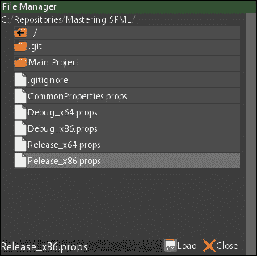
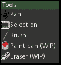

# 第四章. 准备好你的装备 - 构建游戏工具

制作游戏是一门艺术。当然，使用最基本的工具制作艺术是完全可能的，但通常，开发者需要一个强大的工具集来支持他们，以便高效和专业地快速进行游戏编辑，而无需痛苦。构建这个工具集可以说与构建实际游戏一样困难，但投入在适当工具上的工作抵消了直接文件编辑带来的困难和挫折。

在本章中，我们将讨论以下主题：

+   构建图形化的文件管理系统

+   在单独的线程中加载文件

+   建立地图编辑的状态和控制系统

有很多内容需要覆盖，所以让我们开始吧！

# 版权资源的利用

如往常一样，让我们向艺术家及其资产表示感谢，是他们使这一切成为可能：

+   *Folder Orange* 由 *sixsixfive* 根据 **CC0** 许可（公有领域）：[`openclipart.org/detail/212337/folder-orange`](https://openclipart.org/detail/212337/folder-orange)

+   *Generic Document* 由 *isendrak* 根据 **CC0** 许可（公有领域）：[`openclipart.org/detail/212798/generic-document`](https://openclipart.org/detail/212798/generic-document)

+   *Tango Media Floppy* 由 *warszawianka* 根据 **CC0** 许可（公有领域）：[`openclipart.org/detail/34579/tango-media-floppy`](https://openclipart.org/detail/34579/tango-media-floppy)

+   *Close* 由 *danilo* 根据 **CC0** 许可（公有领域）：[`openclipart.org/detail/215431/close`](https://openclipart.org/detail/215431/close)

+   *Hand Prints* 由 *kattekrab* 根据 **CC0** 许可（公有领域）：[`openclipart.org/detail/16340/hand-prints`](https://openclipart.org/detail/16340/hand-prints)

+   *Paint Brush with Dark Red Dye* 由 *Astro* 根据 **CC0** 许可（公有领域）：[`openclipart.org/detail/245360/Paint-Brush-with-Dye-11`](https://openclipart.org/detail/245360/Paint-Brush-with-Dye-11)

+   *Primary Eraser* 由 *dannya* 根据 **CC0** 许可（公有领域）：[`openclipart.org/detail/199463/primary-eraser`](https://openclipart.org/detail/199463/primary-eraser)

+   *Mono Tool Rect Selection* 由 *dannya* 根据 **CC0** 许可（公有领域）：[`openclipart.org/detail/198758/mono-tool-rect-selection`](https://openclipart.org/detail/198758/mono-tool-rect-selection)

+   *Color Bucket Red* 由 *frankes* 根据 **CC0** 许可（公有领域）：[`openclipart.org/detail/167327/color-bucket-red`](https://openclipart.org/detail/167327/color-bucket-red)

# 文件管理

地图编辑工具的成功和可用性将严重依赖于这里的一个特定接口元素，即文件访问和管理。为了提供高效的文件访问、加载和保存方法，我们将致力于开发引导用户通过文件系统的视觉引导手段。整个系统由几个部分组成。目前，让我们只关注这个想法的界面方面。

## 文件管理器接口

在我们能够成功处理任何类型的地图数据之前，有一个舒适的方法来加载和保存是很重要的。这可以委托给文件管理器接口，该接口将负责显示目录信息。让我们看看我们的样子：



带着这个目标，让我们开始规划这个类的实现，从头部开始：

```cpp
class GUI_FileManager { 
public: 
  GUI_FileManager(std::string l_name, GUI_Manager* l_guiMgr, 
    StateManager* l_stateMgr); 
  ~GUI_FileManager(); 

  void SetDirectory(std::string l_dir); 
  void ParentDirCallback(EventDetails* l_details); 
  void HandleEntries(EventDetails* l_details); 
  void ActionButton(EventDetails* l_details); 
  void CloseButton(EventDetails* l_details); 
  void Hide(); 
  void Show(); 
  void LoadMode(); 
  void SaveMode(); 
  bool IsInSaveMode() const; 

  template<class T> 
  void SetActionCallback( 
    void(T::*l_method)(const std::string&), T* l_instance) 
  {...} 
private: 
  void ListFiles(); 
  GUI_Interface* m_interface; 
  std::string m_name; 
  std::string m_dir; 

  std::string m_folderEntry; 
  std::string m_fileEntry; 

  GUI_Manager* m_guiManager; 
  StateManager* m_stateMgr; 
  StateType m_currentState; 
  std::function<void(std::string)> m_actionCallback; 
  bool m_saveMode; 
}; 

```

显然，这个类是`GUI_Interface`实例包装的一个稍微复杂的表现形式。它负责跟踪我们当前所在的目录，以及在选中文件进行加载或保存时调用回调函数/方法。回调函数只接受一个字符串参数，该参数携带要加载或保存的文件的完整路径，并且可以像这样注册：

```cpp
void SetActionCallback( 
  void(T::*l_method)(const std::string&), T* l_instance) 
{ 
  m_actionCallback = 
    l_instance, l_method -> void 
    { (l_instance->*l_method)(l_str); }; 
} 

```

目前还没有什么太复杂的。让我们继续进行类的实际实现！

### 实现文件管理器

在处理完类定义之后，是时候看看使文件管理器工作的实际代码了。让我们从这个类的构造函数开始实现：

```cpp
GUI_FileManager::GUI_FileManager(std::string l_name, 
  GUI_Manager* l_guiMgr, StateManager* l_stateMgr): 
  m_guiManager(l_guiMgr), m_stateMgr(l_stateMgr), m_name(l_name), 
  m_saveMode(false) 
{ 
  m_guiManager->LoadInterface(""FileManager.interface"", l_name); 
  m_interface = m_guiManager->GetInterface(l_name); 
  m_currentState = m_stateMgr->GetCurrentStateType(); 
  m_folderEntry = m_interface->GetElement("FolderEntry")-> 
    GetStyleName(); 
  m_fileEntry = m_interface->GetElement("FileEntry")-> 
    GetStyleName(); 
  m_interface->RemoveElement("FolderEntry"); 
  m_interface->RemoveElement("FileEntry"); 
  m_interface->SetContentRectSize({ 300, 260 }); 
  m_interface->SetContentOffset({ 0.f, 16.f }); 
  m_interface->PositionCenterScreen(); 

  auto mgr = m_stateMgr->GetContext()->m_eventManager; 

  mgr->AddCallback<GUI_FileManager>("FileManager_Parent", 
    &GUI_FileManager::ParentDirCallback, this); 
  mgr->AddCallback<GUI_FileManager>("FileManager_Entries", 
    &GUI_FileManager::HandleEntries, this); 
  mgr->AddCallback<GUI_FileManager>("FileManager_ActionButton", 
    &GUI_FileManager::ActionButton, this); 
  mgr->AddCallback<GUI_FileManager>("FileManager_Close", 
    &GUI_FileManager::CloseButton, this); 

  SetDirectory(Utils::GetWorkingDirectory()); 
} 

```

首先，我们加载界面并将指针存储在指定的数据成员中。我们还想存储应用程序的当前状态，并获取元素的风格名称，称为`FolderEntry`和`FileEntry`，然后将其移除。这使得界面文件成为一种模板，稍后将被所有正确的信息填充。

一旦设置了适当的内容大小和偏移量，界面就被定位在屏幕中央。然后我们订阅相关的 GUI 界面事件，并将我们的文件管理器目录设置为应用程序当前所在的目录。

在这个类中创建的回调和接口显然在不再使用时需要被移除。这就是析构函数发挥作用的地方：

```cpp
GUI_FileManager::~GUI_FileManager() { 
  m_guiManager->RemoveInterface(m_currentState, m_name); 
  auto events = m_stateMgr->GetContext()->m_eventManager; 
  events->RemoveCallback(m_currentState, ""FileManager_Parent""); 
  events->RemoveCallback(m_currentState, ""FileManager_Entries""); 
  events->RemoveCallback(m_currentState, 
    ""FileManager_ActionButton""); 
  events->RemoveCallback(m_currentState, ""FileManager_Close""); 
} 

```

接下来，对于文件管理类来说，有一个方便地更改当前目录的方法是很重要的：

```cpp
void GUI_FileManager::SetDirectory(std::string l_dir) { 
  m_dir = l_dir; 
  std::replace(m_dir.begin(), m_dir.end(), '''', ''/''); 
  m_interface->RemoveElementsContaining(""Entry_""); 
  ListFiles(); 
} 

```

发生了一些有趣的事情。在参数存储后不久；目录字符串中的所有反斜杠都被替换为正斜杠，以便与不兼容前者的多个其他操作系统保持兼容。然后，界面被指示销毁所有以`"Entry_"`字符串开头的元素。这样做是为了清除可能已经存在的所有文件和目录条目。最后，调用`ListFiles()`方法，该方法将新目录中的所有文件和文件夹填充到文件管理器中。让我们看看这是如何实现的：

```cpp
void GUI_FileManager::ListFiles() { 
  m_interface->GetElement(""Directory"")->SetText(m_dir); 
  auto list = Utils::GetFileList(m_dir, ""*.*"", true); 
  Utils::SortFileList(list); 
  auto ParentDir = m_interface->GetElement(""ParentDir""); 
  float x = ParentDir->GetPosition().x; 
  float y = ParentDir->GetPosition().y+ParentDir->GetSize().y+1.f; 
  size_t i = 0; 
  for (auto& file : list) { 
    if (file.first == ""."" || file.first == "".."") { continue; } 
    std::string entry = (file.second ? "FEntry_"" : ""Entry_"); 
    m_interface->AddElement(GUI_ElementType::Label, 
      entry + std::to_string(i)); 
    auto element = m_interface->GetElement( 
      entry + std::to_string(i)); 
    element->SetText(file.first); 
    element->SetPosition({ x, y }); 
    m_guiManager->LoadStyle((file.second ? 
      m_folderEntry : m_fileEntry), element); 
    y += ParentDir->GetSize().y + 4.f; 
    ++i; 
  } 
} 

```

首先，获取`Directory`元素以更改其文本。它表示当前工作目录的完整路径。然后获取该目录中包括其他文件夹在内的完整文件列表。在按字母顺序和类型排序后，获取父目录元素以计算列表中第一个元素的起始坐标，然后迭代它。忽略非物理目录，例如`"."`或`".."`。然后向界面添加一个新元素，其名称根据我们是在处理文件还是文件夹而变化。然后更新该元素，使其具有条目名称，处于正确的位置，并附加正确的样式。最后，为列表中的下一个元素递增`y`坐标。

当目录结构以可视化的形式呈现时，让我们看看当点击其条目之一时需要发生什么：

```cpp
void GUI_FileManager::HandleEntries(EventDetails* l_details) { 
  if(l_details->m_guiElement.find("FEntry_")!= std::string::npos){ 
    std::string path = m_dir + 
      m_interface->GetElement(l_details->m_guiElement)->GetText() 
      + ""; 
    SetDirectory(path); 
    m_interface->UpdateScrollVertical(0); 
  } else if (l_details->m_guiElement.find("Entry_") != 
    std::string::npos) 
  { 
    m_interface->GetElement("FileName")->SetText( 
     m_interface->GetElement(l_details->m_guiElement)->GetText()); 
  } 
} 

```

这里的第一个检查告诉我们点击的项是目录还是文件。在文件夹点击的情况下，我们希望能够通过取其名称并将其添加到现有的目录路径中来遍历文件系统。然后，界面的垂直滚动被设置回零，以便在执行任何滚动后，将内容移回顶部。

文件点击是一个简单的问题。在这种情况下，我们只需要获取包含文件名的文本字段元素，并将其内容更改为刚刚点击的文件名。

所有这些对于向前遍历都工作得很好，但如果我们想向后移动呢？父目录元素在这里帮了我们大忙：

```cpp
void GUI_FileManager::ParentDirCallback(EventDetails* l_details) { 
  auto i = m_dir.find_last_of("/", m_dir.length() - 2); 
  if (i != std::string::npos) { 
    std::string dir = m_dir.substr(0U, i + 1); 
    SetDirectory(dir); 
  } 
} 

```

这里，这仅仅归结为基本的字符串操作。首先尝试在目录字符串中找到最后一个正斜杠字符。如果找到了，字符串就简单地在这个点被*剪切*，以丢弃其后的所有内容。然后将缩短的路径设置为当前目录，在那里发生我们之前已经覆盖的其余魔法。

使这一切工作起来的最后一部分是处理按钮点击动作：

```cpp
void GUI_FileManager::ActionButton(EventDetails* l_details) { 
  if (m_actionCallback == nullptr) { return; } 
  auto filename = m_interface->GetElement("FileName")->GetText(); 
  m_actionCallback(m_dir + filename); 
} 

```

首先，我们需要确保动作回调确实被设置。如果设置了，它将使用当前选中文件的路径作为其参数来调用。在此之后，我们唯一需要担心的其他动作按钮就是关闭按钮：

```cpp
void GUI_FileManager::CloseButton(EventDetails* l_details){ 
  Hide(); 
} 

```

它只是调用`Hide()`方法，该方法在本节中有所介绍，以及其对应的方法：

```cpp
void GUI_FileManager::Hide() { m_interface->SetActive(false); } 

void GUI_FileManager::Show() { 
  m_interface->SetActive(true); 
  m_interface->PositionCenterScreen(); 
  ListFiles(); 
  m_interface->Focus(); 
} 

```

当一个界面被隐藏时，它只是被设置为不活动状态。显示它需要将其重新设置为活动状态，但在这个例子中，我们还想将其定位在屏幕的绝对中心。此外，刷新其内容也是一个好主意，因为文件结构可能在它被隐藏时发生了变化。最后，界面被聚焦，以便将其带到绘图队列的前面。

这个类的最后一些有用的代码包括这些方法：

```cpp
bool GUI_FileManager::IsInSaveMode() const { return m_saveMode; } 
void GUI_FileManager::LoadMode() { 
  m_interface->GetElement("ActionButton")->SetText("Load"); 
  m_saveMode = false; 
} 
void GUI_FileManager::SaveMode() { 
  m_interface->GetElement("ActionButton")->SetText("Save"); 
  m_saveMode = true; 
} 

```

它们通过允许它们确定文件管理器是否处于`保存`或`加载`模式，并在两者之间切换，帮助我们的其他类更容易地与这个类接口。

## 在单独的线程中加载文件

我们在第一章中介绍了线程工作基类，*内部机制 - 设置后端*。这正是它将派上用场的地方。为了使应用程序看起来更用户友好，我们想要渲染一个漂亮的加载条，在文件加载时显示进度。让我们首先定义一个数据类型，用于存储需要加载的文件路径：

```cpp
using LoaderPaths = std::vector<std::pair<std::string, size_t>>; 

```

这里的`size_t`表示文件中的行数，这使得我们很容易确定当前的加载进度。处理完这一点后，让我们来处理头文件：

```cpp
class FileLoader : public Worker { 
public: 
  FileLoader(); 
  void AddFile(const std::string& l_file); 
  virtual void SaveToFile(const std::string& l_file); 

  size_t GetTotalLines() const; 
  size_t GetCurrentLine() const; 
private: 
  virtual bool ProcessLine(std::stringstream& l_stream) = 0;
virtual void ResetForNextFile(); 
  void Work(); 
  void CountFileLines(); 

  LoaderPaths m_files; 
  size_t m_totalLines; 
  size_t m_currentLine; 
}; 

```

我们代码库中的任何`FileLoader`类都需要实现`ProcessLine`方法，该方法简单地定义了在解析文件的每一行时需要发生什么。如果需要，它还可以利用`SaveToFile`，正如其名称所表明的，它定义了将类数据写出的过程，以及`ResetForNextFile`。后者方法在加载完每个文件后调用，以便给派生类一个清理其内部状态的机会。

就数据成员而言，我们有一个要加载的加载器路径列表，要解析的所有文件的行总数，以及正在读取的当前行数。

### 实现文件加载器

让我们从简单开始，首先介绍单行方法：

```cpp
FileLoader::FileLoader() : m_totalLines(0), m_currentLine(0) {} 
void FileLoader::AddFile(const std::string& l_file) { 
  m_files.emplace_back(l_file, 0); 
} 
size_t FileLoader::GetTotalLines() const{ return m_totalLines; } 
size_t FileLoader::GetCurrentLine() const{ return m_currentLine; } 
void FileLoader::SaveToFile(const std::string& l_file) {} 
void FileLoader::ResetForNextFile() {} 

```

构造函数只是将一些类数据成员初始化为其默认值。`AddFile()` 方法将参数插入到文件容器中，行计数为零。接下来的两个方法是简单的获取器，而最后的两个方法甚至尚未实现，因为它们是可选的。

接下来，让我们来处理将在线程中实际运行的解析文件信息的方法：

```cpp
void FileLoader::Work() { 
  CountFileLines(); 
  if (!m_totalLines) { return; } 
  for (auto& path : m_files) { 
    ResetForNextFile(); 
    std::ifstream file(path.first); 
    std::string line; 
    std::string name; 
    auto linesLeft = path.second; 
    while (std::getline(file, line)) { 
      { 
        sf::Lock lock(m_mutex); 
        ++m_currentLine; 
        --linesLeft; 
      } 
      if (line[0] == '|') { continue; } 
      std::stringstream keystream(line); 
      if (!ProcessLine(keystream)) { 
        { 
          sf::Lock lock(m_mutex); 
          m_currentLine += linesLeft; 
        } 
        break; 
      } 
    } 
    file.close(); 
  } 
  m_files.clear(); 
  Done(); 
} 

```

首先，调用一个用于计算所有文件行数的私有方法。这是必要的，因为我们想要能够计算我们的进度，而知道总工作量是必要的。如果调用此方法后，总行数为零，我们简单地返回，因为没有要处理的内容。

然后，我们进入一个循环，为列表中的每个文件运行一次。类被重置以进行新的文件迭代，并从输入流中创建一个行。创建剩余要处理的行数，然后进入另一个循环，该循环为文件中的每行执行一次。然后锁定我们的`sf::Mutex`对象，以安全地操作用于进度跟踪的两个行数据成员。

如果我们行的第一个字符是一个管道`|`，这意味着我们遇到了一条注释行，应该跳过当前迭代。否则，创建一个包含当前行的`std::stringstream`并将其传递给封装在`if`语句中的纯虚`ProcessLine()`方法，以捕获可能出现的失败情况，在这种情况下，当前文件中剩余的行将简单地添加到当前行计数器中，并跳出循环。

一旦处理完所有文件，将调用`Done()`方法来终止线程，并让外部代码知道我们已经完成。

另一个同样重要的过程是计算这个类中所有文件条目的行数：

```cpp
void FileLoader::CountFileLines() { 
  m_totalLines = 0; 
  m_currentLine = 0; 
  for (auto path = m_files.begin(); path != m_files.end();) { 
    if (path->first.empty()) { 
      path = m_files.erase(path); 
      continue; 
    } 
    std::ifstream file(path->first); 
    if (!file.is_open()) { 
      path = m_files.erase(path); 
      continue; 
    } 
    file.unsetf(std::ios_base::skipws); 
    { 
      sf::Lock lock(m_mutex); 
      path->second = static_cast<size_t>(std::count( 
        std::istreambuf_iterator<char>(file), 
        std::istreambuf_iterator<char>(), 
        '\n')); 
      m_totalLines += path->second; 
    } 
    ++path; 
    file.close(); 
  } 
} 

```

这个方法相当直接。在两个计数器归零后，我们开始遍历文件列表中的每个路径。如果它的名字为空，则移除该元素。否则，我们尝试打开文件。如果失败，则也删除该路径。否则，请求文件流不要跳过空白字符，并进入一个`sf::Mutex`锁，其中使用`std::count`计算文件流中的行数，并将其添加到总行计数器中。然后，路径迭代器向前移动，文件被关闭。

## 加载状态

线程化文件加载的最后一块是加载状态。为了避免其他逻辑的干扰并专注于图形进度表示，切换到一个专门的状态来处理其中的所有加载逻辑是个好主意。让我们首先定义一个用于存储指向`FileLoader*`实例指针的数据类型：

```cpp
using LoaderContainer = std::vector<FileLoader*>; 

```

实际的加载状态头文件最终看起来可能像这样：

```cpp
class State_Loading : public BaseState { 
public: 
  ... // Other typical state methods. 
  void SetManualContinue(bool l_continue); 
  void Proceed(EventDetails* l_details); 
private: 
  void UpdateText(const std::string& l_text, float l_percentage); 
  float CalculatePercentage(); 
  LoaderContainer m_loaders; 
  sf::Text m_text; 
  sf::RectangleShape m_rect; 
  unsigned short m_percentage; 
  size_t m_originalWork; 
  bool m_manualContinue; 
}; 

```

如您所见，我们有一个事件回调方法，几个辅助方法，用于存储加载指针的容器，一个`sf::Text`和`sf::RectangleShape`的实例来表示加载条，一个表示进度百分比的数字，以及我们最初开始的所有文件中的行数。

### 实现加载状态

在使用之前，所有这些数据都需要初始化，因此让我们看看`OnCreate()`方法：

```cpp
void State_Loading::OnCreate() { 
  auto context = m_stateMgr->GetContext(); 
  context->m_fontManager->RequireResource("Main"); 
  m_text.setFont(*context->m_fontManager->GetResource("Main")); 
  m_text.setCharacterSize(14); 
  m_text.setStyle(sf::Text::Bold); 

  sf::Vector2u windowSize = m_stateMgr->GetContext()-> 
    m_wind->GetRenderWindow()->getSize(); 

  m_rect.setFillColor(sf::Color(0, 150, 0, 255)); 
  m_rect.setSize(sf::Vector2f(0.f, 16.f)); 
  m_rect.setOrigin(0.f, 8.f); 
  m_rect.setPosition(0.f, windowSize.y / 2.f); 

  EventManager* evMgr = m_stateMgr->GetContext()->m_eventManager; 
  evMgr->AddCallback(StateType::Loading, 
    "Key_Space", &State_Loading::Proceed, this); 
} 

```

由于我们将使用文本，我们需要有一个字体来工作。在获取一个字体并处理所有样式文本设置后，我们将矩形设置为正好位于屏幕中央，并注册一个事件回调以从加载状态中继续，如果手动继续标志设置为`true`。

销毁此状态也意味着需要释放事件回调和字体：

```cpp
void State_Loading::OnDestroy() { 
  auto context = m_stateMgr->GetContext(); 
  EventManager* evMgr = context->m_eventManager; 
  evMgr->RemoveCallback(StateType::Loading, "Key_Space"); 
  context->m_fontManager->ReleaseResource("Main"); 
} 

```

接下来，让我们看看更新的逻辑：

```cpp
void State_Loading::Update(const sf::Time& l_time) { 
  if (m_loaders.empty()) { 
    if (!m_manualContinue) { Proceed(nullptr); } 
    return; 
  } 
  auto windowSize = m_stateMgr->GetContext()-> 
    m_wind->GetRenderWindow()->getSize(); 
  if (m_loaders.back()->IsDone()) { 
    m_loaders.back()->OnRemove(); 
    m_loaders.pop_back(); 
    if (m_loaders.empty()) { 
      m_rect.setSize(sf::Vector2f( 
        static_cast<float>(windowSize.x), 16.f)); 
      UpdateText(".Press space to continue.", 100.f); 
      return; 
    } 
  } 
  if (!m_loaders.back()->HasStarted()){m_loaders.back()->Begin();} 

  auto percentage = CalculatePercentage(); 
  UpdateText("", percentage); 
  m_rect.setSize(sf::Vector2f( 
    (windowSize.x / 100) * percentage, 16.f)); 
} 

```

首先，进行一次检查以确定我们是否准备好退出状态，考虑到已经完成的所有工作。如果手动继续标志设置为`false`，我们只需直接通过传递`nullptr`作为`EventDetails`指针来调用 Proceed 回调，因为那里根本不需要使用它。然后从更新方法返回。

如果我们还有一些工作要做，就会检查加载列表中的第一个元素，看它是否已完成。如果已完成，则从列表中移除加载器，如果它是最后一个，则将矩形的尺寸设置为与窗口在 x 轴上的完整尺寸相匹配，这表明已完全完成。中间的文本也会更新，以告知用户他们需要按空格键继续。最后，再次从更新方法返回，以防止执行更多逻辑。

如果上述条件都不满足，就会检查加载器列表中的第一个元素是否已经开始工作。如果没有开始，就会调用其`Begin`方法。紧接着是百分比计算，然后用于更新屏幕中间的文本并调整进度条矩形的尺寸以匹配该百分比。

在此状态下绘图简化为两个调用：

```cpp
void State_Loading::Draw() { 
  sf::RenderWindow* wind = m_stateMgr-> 
    GetContext()->m_wind->GetRenderWindow(); 
  wind->draw(m_rect); 
  wind->draw(m_text); 
} 

```

我们在这里需要做的只是渲染矩形和文本实例。

接下来，让我们看看更新我们的文本实例的辅助方法：

```cpp
void State_Loading::UpdateText(const std::string& l_text, 
  float l_percentage) 
{ 
  m_text.setString(std::to_string( 
    static_cast<int>(l_percentage)) + "%" + l_text); 
  auto windowSize = m_stateMgr->GetContext()-> 
    m_wind->GetRenderWindow()->getSize(); 
  m_text.setPosition(windowSize.x / 2.f, windowSize.y / 2.f); 
  Utils::CenterSFMLText(m_text); 
} 

```

在文本字符串更新后，其位置被更新为屏幕正中央。由于更新其内容可能会改变边界框，从而影响其居中方式，我们在`Utils`命名空间内部使用一个辅助函数来正确地居中它。

接下来，让我们计算加载过程的实际进度：

```cpp
float State_Loading::CalculatePercentage() { 
  float absolute = 100.f; 
  if (m_loaders.back()->GetTotalLines()) { 
    float d = (100.f * (m_originalWork - m_loaders.size())) / 
      static_cast<float>(m_originalWork); 
    float current = (100.f * m_loaders.back()->GetCurrentLine()) / 
      static_cast<float>(m_loaders.back()->GetTotalLines()); 
    float totalCurrent = current / 
      static_cast<float>(m_originalWork); 
    absolute = d + totalCurrent; 
  } 
  return absolute; 
} 

```

在创建绝对值`100.f`之后，首先确定已加载的文件数量与开始时的数量之间的进度，然后计算当前文件的进度并用于确定绝对进度，然后返回。

一旦所有工作完成，就会调用`Proceed()`方法返回到上一个状态：

```cpp
void State_Loading::Proceed(EventDetails* l_details) { 
  if (!m_loaders.empty()) { return; } 
  m_stateMgr->SwitchTo(m_stateMgr->GetNextToLast()); 
} 

```

显然，它需要首先检查文件加载器列表是否实际上为空。如果是，则指示状态管理器切换到紧接此状态之前的状态，这意味着它是启动加载过程的状态。

最后，一个类如果没有一些辅助方法会是什么样子？现在让我们看看它们：

```cpp
void State_Loading::AddLoader(FileLoader* l_loader) { 
  m_loaders.emplace_back(l_loader); 
  l_loader->OnAdd(); 
} 
bool State_Loading::HasWork() const { return !m_loaders.empty(); } 
void State_Loading::Activate() { 
  m_originalWork = m_loaders.size(); 
} 

```

# 创建地图编辑状态

现在我们终于准备好实际处理状态了，在这个状态下，所有的地图编辑都将发生。让我们看看它的头文件：

```cpp
class State_MapEditor : public BaseState { 
public: 
  ... 
  void ResetSavePath(); 
  void SetMapRedraw(bool l_redraw); 
  void MainMenu(EventDetails* l_details); 
  void MapEditorNew(EventDetails* l_details); 
  void MapEditorLoad(EventDetails* l_details); 
  void MapEditorSave(EventDetails* l_details); 
  void MapEditorSaveAs(EventDetails* l_details); 
  void MapEditorExit(EventDetails* l_details); 
  void MapAction(const std::string& l_name); 
private: 
  void SaveMap(const std::string& l_path); 
  void LoadMap(const std::string& l_path); 
  GUI_FileManager m_files; 
  MapControls m_mapControls; 
  std::string m_mapSavePath; 
  bool m_mapRedraw; 
}; 

```

这个`State_MapEditor`类将成为处理最一般编辑事件的先锋。注意这里突出显示的数据成员。我们还没有介绍这个类，但它负责处理这个应用程序的更精细的控制方面。它将在下一章中介绍。

除了`MapControls`类之外，我们还有文件管理器、一个字符串，用于当前正在处理的文件的路径，以及一个*布尔*标志，用于跟踪游戏地图是否应该被重新绘制。

## 实现状态

和往常一样，让我们从处理这个状态中所有重要数据的构建开始：

```cpp
void State_MapEditor::OnCreate() { 
  auto context = m_stateMgr->GetContext(); 
  auto evMgr = context->m_eventManager; 
  evMgr->AddCallback("Key_Escape", 
    &State_MapEditor::MainMenu, this); 
  evMgr->AddCallback("MapEditor_New", 
    &State_MapEditor::MapEditorNew, this); 
  evMgr->AddCallback("MapEditor_Load", 
    &State_MapEditor::MapEditorLoad, this); 
  evMgr->AddCallback("MapEditor_Save", 
    &State_MapEditor::MapEditorSave, this); 
  evMgr->AddCallback("MapEditor_SaveAs", 
    &State_MapEditor::MapEditorSaveAs, this); 
  evMgr->AddCallback("MapEditor_Exit", 
    &State_MapEditor::MapEditorExit, this); 

  m_files.SetActionCallback(&State_MapEditor::MapAction, this); 
  m_files.SetDirectory(Utils::GetWorkingDirectory() + 
    "media/maps/"); 
  m_files.Hide(); 
  context->m_guiManager->LoadInterface( 
    "MapEditorTop.interface", "MapEditorTop"); 
  context->m_guiManager->GetInterface("MapEditorTop")-> 
    SetPosition({ 200, 0 }); 

  context->m_particles->CreateState(StateType::MapEditor); 
} 

```

在所有事件回调设置完毕后，文件管理器类被提供了它自己的回调，用于加载或保存文件，以及它需要所在的起始目录。在这种情况下，恰如其分，它是地图文件夹。然后管理器被隐藏，另一个界面被加载并放置在屏幕上。`MapEditorTop`是屏幕顶部的控制条，上面有创建新地图、加载、保存和退出应用程序的按钮：


一旦状态完成并且即将被销毁，它需要移除它设置的所有回调。这可以在`OnDestroy()`方法中完成：

```cpp
void State_MapEditor::OnDestroy() { 
  auto context = m_stateMgr->GetContext(); 
  auto textureMgr = context->m_textureManager; 
  auto evMgr = context->m_eventManager; 
  evMgr->RemoveCallback(StateType::MapEditor, "Key_Escape"); 
  evMgr->RemoveCallback(StateType::MapEditor, "MapEditor_New"); 
  evMgr->RemoveCallback(StateType::MapEditor, "MapEditor_Load"); 
  evMgr->RemoveCallback(StateType::MapEditor, "MapEditor_Save"); 
  evMgr->RemoveCallback(StateType::MapEditor, "MapEditor_SaveAs"); 
  evMgr->RemoveCallback(StateType::MapEditor, "MapEditor_Exit"); 
  context->m_gameMap->PurgeMap(); 
  context->m_gameMap->GetTileMap()->SetMapSize({ 0,0 }); 
} 

```

除了回调之外，地图在其大小被设置回绝对零之前也会被清除。既然我们提到了回调，让我们一次性覆盖它们中的大多数：

```cpp
void State_MapEditor::MapEditorNew(EventDetails* l_details) { 
  m_mapControls.NewMap(); 
} 
void State_MapEditor::MapEditorLoad(EventDetails* l_details) { 
  m_files.LoadMode(); 
  m_files.Show(); 
} 

void State_MapEditor::MapEditorSave(EventDetails* l_details) { 
  if (m_mapSavePath.empty()) { MapEditorSaveAs(nullptr); return; } 
  SaveMap(m_mapSavePath); 
} 
void State_MapEditor::MapEditorSaveAs(EventDetails* l_details) { 
  m_files.SaveMode(); 
  m_files.Show(); 
} 

void State_MapEditor::MapEditorExit(EventDetails* l_details) { 
  m_stateMgr->SwitchTo(StateType::MainMenu); 
  m_stateMgr->Remove(StateType::MapEditor); 
} 

```

当点击**新建**地图按钮时，我们希望调用`MapControls`类的一个特殊方法来处理它。如果点击**加载**按钮，我们只需将文件管理器的模式切换到加载，并在屏幕上显示它。

点击**保存**按钮可能会有两种行为。首先，如果我们正在处理一个全新的地图，尚未保存，那么这和点击**另存为...**按钮是一样的，它会切换文件管理器到保存模式并在屏幕上显示。然而，如果我们已经加载了一个地图或者之前保存了一个新的地图，状态会记住它保存的位置以及它的名称。提示用户再次输入文件名在这里是毫无意义的，所以地图将简单地写入到完全相同的地点，使用完全相同的名称。

最后，如果点击**退出**按钮，我们只需切换回主菜单状态并移除这个状态。

在 UI 代码处理完毕后，让我们看看在加载地图时需要发生什么：

```cpp
void State_MapEditor::LoadMap(const std::string& l_path) { 
  auto context = m_stateMgr->GetContext(); 
  auto loading = m_stateMgr-> 
    GetState<State_Loading>(StateType::Loading); 
  context->m_particles->PurgeCurrentState(); 
  context->m_gameMap->PurgeMap(); 
  context->m_gameMap->ResetWorker(); 
  context->m_gameMap->GetTileMap()->GetTileSet().ResetWorker(); 
  context->m_gameMap->AddFile(l_path); 
  loading->AddLoader(context->m_gameMap); 
  loading->SetManualContinue(false); 
  m_mapRedraw = true; 
  m_mapSavePath = l_path; 
  m_stateMgr->SwitchTo(StateType::Loading); 
} 

```

由于我们希望在读取地图时出现一个漂亮的加载条，我们将使用加载状态。在获取到它之后，粒子系统和地图都会被清除。地图继承自`FileLoader`类，然后被重置。提供的文件路径随后被添加到其中以进行加载，加载状态本身被设置为在加载完成后自动消失。同时，我们确保地图将在地图编辑器状态恢复时重新绘制，并且如果将来要保存，它将记住地图的路径。最后，我们可以切换到加载状态。

接下来，让我们看看负责保存地图的代码：

```cpp
void State_MapEditor::SaveMap(const std::string& l_path) { 
  m_stateMgr->GetContext()->m_gameMap->SaveToFile(l_path); 
  m_mapSavePath = l_path; 
} 

```

这比之前的方法简单得多。路径只是简单地传递给游戏地图类的`SaveToFile`方法，并存储起来以供以后使用。

文件管理器的实际回调函数，它介于加载和保存方法之间，可以像这样实现：

```cpp
void State_MapEditor::MapAction(const std::string& l_path) { 
  if(m_files.IsInSaveMode()) { SaveMap(l_path); } 
  else { LoadMap(l_path); } 
  m_files.Hide(); 
} 

```

根据文件管理器所处的模式，将调用适当的方法，并将路径作为参数传递。实际的接口随后被隐藏。

由于我们希望在加载后重新绘制地图，因此逻辑的最佳位置是在`Activate()`方法内部，因为它在状态切换时立即被调用：

```cpp
void State_MapEditor::Activate() { 
  if (!m_mapRedraw) { return; } 
  auto map = m_stateMgr->GetContext()->m_gameMap; 
  map->Redraw(); 
  m_mapControls.SetTileSheetTexture( 
    map->GetTileSet()->GetTextureName()); 
  m_mapRedraw = false; 
} 

```

如果`m_mapRedraw`标志未开启，此时无需做任何事情。否则，我们希望重新绘制地图，并向`mapControls`类提供瓦片纹理的名称，以便它能够执行自己的逻辑，例如，例如，瓦片选择。

接下来，让我们看看在应用程序处于此状态时需要更新什么：

```cpp
void State_MapEditor::Update(const sf::Time& l_time) { 
  auto context = m_stateMgr->GetContext(); 
  m_mapControls.Update(l_time.asSeconds()); 
  context->m_gameMap->Update(l_time.asSeconds()); 
  context->m_systemManager->Update(l_time.asSeconds()); 
  context->m_particles->Update(l_time.asSeconds()); 
} 

```

除了`mapControls`类之外，游戏地图、ECS 系统管理器和粒子系统也需要更新，因为我们在构建地图时将使用所有这些类。不出所料，这些也是需要绘制相同对象：

```cpp
void State_MapEditor::Draw() { 
  auto context = m_stateMgr->GetContext(); 
  auto window = context->m_wind->GetRenderWindow(); 
  auto from = (m_mapControls.DrawSelectedLayers() ? 
    m_mapControls.GetSelectionOptions()->GetLowestLayer() : 0); 
  auto to = (m_mapControls.DrawSelectedLayers() ? 
    m_mapControls.GetSelectionOptions()->GetHighestLayer() 
    : Sheet::Num_Layers - 1); 
  for (auto i = from; i <= to; ++i) { 
    context->m_gameMap->Draw(i); 
    context->m_systemManager->Draw(context->m_wind, i); 
    context->m_particles->Draw(*window, i); 
  } 
  if(!m_mapControls.DrawSelectedLayers()) { 
    context->m_particles->Draw(*window, -1); 
  } 
  m_mapControls.Draw(window); 
} 

```

注意`from`和`to`变量。`mapControl`类将为我们提供在层/海拔之间切换的方法，因此我们需要在渲染任何内容之前获取这些信息，以确保只绘制屏幕上的适当层。`DrawSelectedLayers`简单地返回一个布尔值，以确定是否应该绘制所有层或仅绘制选定的层。一旦循环遍历了适当的层，我们确保绘制所有高于最大海拔的剩余粒子，当然，前提是所有内容都需要被渲染。地图控制被绘制在其他所有内容之上，作为收尾。

对于与其他类的外部通信，我们提供了两个基本的设置方法：

```cpp
void State_MapEditor::ResetSavePath() { m_mapSavePath = ""; } 
void State_MapEditor::SetMapRedraw(bool l_redraw) { 
  m_mapRedraw = l_redraw; 
} 

```

这些将在控制类内部使用，用于通信事件，例如创建新地图或需要重新绘制。

# 构建控制机制

在构建地图时，用户往往会遇到需要不仅仅是在鼠标点击的位置放置瓦片的情况。拥有能够让他们自由平移、选择地图的一部分进行删除或复制、擦除等的工具肯定会很有用。我们的控制类将正好起到这个作用。它将提供一套可用于多种不同情况下的工具：

```cpp
enum class ControlMode{None, Pan, Brush, Bucket, Eraser, Select}; 

```

前面的控制模式枚举代表了一些在多种不同软件中常见的工具。我们将在这里实现其中一些，其余的留给你们！最终，我们应该有一个看起来像这样的控制界面：



让我们开始编写控制类的头文件。为了清晰起见，我们将分别讨论其方法和数据成员，从成员函数开始：

```cpp
class MapControls { 
public: 
  MapControls(Window* l_window, EventManager* l_eventManager, 
    StateManager* l_stateManager, Map* l_map, GUI_Manager* l_gui, 
    EntityManager* l_entityMgr, ParticleSystem* l_particles, 
    sf::View& l_view); 
  ~MapControls(); 

  void Update(float l_dT); 
  void Draw(sf::RenderWindow* l_window); 

  void NewMap(); 
  void SetTileSheetTexture(const std::string& l_sheet); 
  ControlMode GetMode() const; 
  bool IsInAction() const; 
  bool IsInSecondary() const; 
  GUI_SelectionOptions* GetSelectionOptions(); 

  sf::Vector2i GetMouseTileStart()const; 
  sf::Vector2i GetMouseTile()const; 
  sf::Vector2f GetMouseDifference()const; 

  bool DrawSelectedLayers()const; 
  void ToggleDrawingSelectedLayers(); 

  void MouseClick(EventDetails* l_details); 
  void MouseRelease(EventDetails* l_details); 
  void MouseWheel(EventDetails* l_details); 
  void ToolSelect(EventDetails* l_details); 
  void DeleteTiles(EventDetails* l_details); 
  void NewMapCreate(EventDetails* l_details); 
  void NewMapClose(EventDetails* l_details); 

  void SelectMode(ControlMode l_mode); 
  void RedrawBrush(); 
private: 
  void UpdateMouse(); 
  void PanUpdate(); 
  void BrushUpdate(); 
  void BucketUpdate(); 
  void EraserUpdate(); 
  void SelectionUpdate(); 

  void PlaceBrushTiles(); 
  void ResetZoom(); 
  void ResetTools(); 
  ... 
}; 

```

除了设置和获取类参数的所有辅助方法之外，我们还有一大堆事件回调，以及针对我们将要使用的每种地图工具的单独更新方法。接下来，让我们看看我们将要工作的数据成员：

```cpp
class MapControls { 
private: 
  ... 
  // Mode and mouse/layer flags. 
  ControlMode m_mode; 
  bool m_action; 
  bool m_secondaryAction; 
  bool m_rightClickPan; 
  bool m_drawSelectedLayers; 
  // Mouse information. 
  sf::Vector2i m_mousePosition; 
  sf::Vector2i m_mouseStartPosition; 
  sf::Vector2f m_mouseDifference; 
  sf::Vector2i m_mouseTilePosition; 
  sf::Vector2i m_mouseTileStartPosition; 
  float m_zoom; 
  // Brush information, and map bounds. 
  TileMap m_brush; 
  sf::RenderTexture m_brushTexture; 
  sf::RectangleShape m_brushDrawable; 
  sf::RectangleShape m_mapBoundaries; 
  // Other interfaces used here. 
  GUI_MapTileSelector m_tileSelector; 
  GUI_SelectionOptions m_selectionOptions; 
  GUI_Interface* m_mapSettings; 
  // Ties to other classes. 
  Window* m_window; 
  EventManager* m_eventManager; 
  StateManager* m_stateManager; 
  Map* m_map; 
  GUI_Manager* m_guiManager; 
  EntityManager* m_entityManager; 
  ParticleSystem* m_particleSystem; 
  sf::View& m_view; 
}; 

```

除了这个类当前所在的`ControlMode`之外，我们还将存储几个标志。`m_action`标志将与工具一起使用，以及`m_secondaryAction`。前者简单地表示左鼠标按钮是否被按下，而后者用于只有在鼠标位置改变后才能发生的行为。这将在我们尝试优化某些事情以避免它们发生时非常有用。最后两个标志表示我们是否正在使用右键进行平移，以及是否只应在屏幕上绘制选定的图层。

在下面，有一些用于存储鼠标信息的二维向量，例如其当前位置、左键第一次点击的位置、鼠标位置当前帧与上一帧之间的差异、其在瓦片坐标中的当前位置以及其在瓦片坐标中的起始位置。此外，我们还有一个用于当前缩放因子的浮点值。

对于将要用来绘画的刷子，我们简单地使用一个`TileMap`结构，就像游戏地图类所做的那样。由于刷子将要被绘制在屏幕上，我们需要为其存储一个纹理，以及另一个将被用来显示它的可绘制对象。最后，一个`sf::RectangleShape`类型将足以显示地图在屏幕上的边界。

当代码变得相当长时，进行额外的代码分离总是一个好主意。为此，其他非通用控制逻辑将被分散到两个额外的接口类中：一个瓦片选择器和选择选项。瓦片选择器是一个简单的窗口，显示整个瓦片图集，并允许用户选择他们想要绘制的瓦片，而选择选项是一个单独的接口，它为我们提供了一系列设置，可以在屏幕上选择特定事物时进行调整。这两个类都将在下一章中介绍。

最后，我们还有一个名为 `m_mapSettings` 的接口，其逻辑将在 `MapControls` 类中处理。当创建新地图时，我们需要一个整洁的小窗口，它将允许我们配置地图的大小、默认摩擦值以及它将要使用的瓦片图集的名称。这正是地图设置接口要服务的目的。

## 实现控制

有很多数据成员需要初始化，让我们看看构造函数是如何管理它们的：

```cpp
MapControls::MapControls(Window* l_window, EventManager* l_eventManager, 
  StateManager* l_stateManager, Map* l_map, GUI_Manager* l_gui, 
  EntityManager* l_entityMgr, ParticleSystem* l_particles, 
  sf::View& l_view): 
  /* Storing arguments first. */ 
  m_window(l_window), m_eventManager(l_eventManager), 
  m_stateManager(l_stateManager), m_map(l_map), 
  m_guiManager(l_gui), m_entityManager(l_entityMgr), 
  m_particleSystem(l_particles), m_view(l_view), 
  /* Setting up initial data member values. */ 
  m_mode(ControlMode::Pan), m_action(false), 
  m_secondaryAction(false), m_rightClickPan(false), 
  m_zoom(1.f), m_brush(sf::Vector2u(1, 1), *l_map->GetTileSet()), 
  m_drawSelectedLayers(false), 
  /* Initializing other interface classes. */ 
  m_tileSelector(l_eventManager, l_gui, 
    l_gui->GetContext()->m_textureManager), 
  m_mapSettings(nullptr), 
  m_selectionOptions(l_eventManager, l_gui, this, 
    &m_tileSelector, l_map, &m_brush, l_entityMgr, l_particles) 
{ ... } 

```

如您所见，这里有很多事情在进行。让我们逐节快速浏览一下。在处理完构造函数的参数后，我们设置这个类的数据成员以保存它们的初始值。在那之后不久，自定义接口类被设置，所有必要的参数都传递给了它们的构造函数。目前，我们不会担心它们，因为它们将在下一章中介绍。

让我们看看实际的构造函数体：

```cpp
MapControls::MapControls(...) 
{ 
  ... // All of the callbacks gets set up. 
  m_guiManager->LoadInterface("MapEditorTools.interface", 
    "MapEditorTools"); 
  m_guiManager->GetInterface("MapEditorTools")-> 
    SetPosition({ 0.f, 16.f }); 
  m_guiManager->LoadInterface("MapEditorNewMap.interface", 
    "MapEditorNewMap"); 
  m_mapSettings = m_guiManager->GetInterface("MapEditorNewMap"); 
  m_mapSettings->PositionCenterScreen(); 
  m_mapSettings->SetActive(false); 

  m_brush.SetTile(0, 0, 0, 0); 
  m_brushDrawable.setFillColor({ 255, 255, 255, 200 }); 
  m_brushDrawable.setOutlineColor({ 255, 0, 0, 255 }); 
  m_brushDrawable.setOutlineThickness(-1.f); 
  m_mapBoundaries.setPosition({ 0.f, 0.f }); 
  m_mapBoundaries.setFillColor({ 0,0,0,0 }); 
  m_mapBoundaries.setOutlineColor({255, 50, 50, 255}); 
  m_mapBoundaries.setOutlineThickness(-1.f); 

  auto dropdown = static_cast<GUI_DropDownMenu*>( 
    m_mapSettings->GetElement("SheetDropdown"))->GetMenu(); 
  dropdown->PurgeEntries(); 
  auto names = Utils::GetFileList(Utils::GetWorkingDirectory() + 
    "media/Tilesheets/", "*.tilesheet"); 
  for (auto& entity : names) { 
    dropdown->AddEntry(entity.first.substr( 
      0, entity.first.find(".tilesheet"))); 
  } 
  dropdown->Redraw(); 
} 

```

在所有事件回调设置完毕后，我们开始处理接口。实际的工具界面被加载并放置在屏幕上，以及新的地图设置窗口，我们将通过将其指针存储为我们数据成员之一来跟踪它。它被放置在屏幕中央，并暂时设置为不活动状态。

下一个部分仅仅处理画笔可绘制的风格方面以及地图边界矩形。显然，这些值可以被定制以看起来完全不同。

最后，我们需要确保在新的地图设置界面中填充用于选择工作表的下拉元素。在获取元素并清除所有其他条目后，从适当位置获取所有类型为 `.tilesheet` 的文件名列表，并对每个文件名进行迭代，移除文件格式并将其添加到下拉列表中，然后重新绘制以反映所有更改。

请记住，这里创建的所有接口和回调都需要被移除，这就是析构函数中发生的一切。正因为如此，我们在这里不会介绍它，因为它是不必要的。

让我们看看当这个类被更新时需要发生什么：

```cpp
void MapControls::Update(float l_dT) { 
  m_mapBoundaries.setSize(sf::Vector2f( 
    m_map->GetTileMap()->GetMapSize() * 
    static_cast<unsigned int>(Sheet::Tile_Size))); 
  UpdateMouse(); 
  if (m_mode == ControlMode::Pan || m_rightClickPan){PanUpdate();} 
  else if (m_mode == ControlMode::Brush) { BrushUpdate(); } 
  else if (m_mode == ControlMode::Bucket) { BucketUpdate(); } 
  else if (m_mode == ControlMode::Eraser) { EraserUpdate(); } 
  else if (m_mode == ControlMode::Select) { SelectionUpdate(); } 
} 

```

首先，我们处理地图类大小的任何可能变化。地图边界矩形在这里更新以反映这些变化。接下来，我们必须确保鼠标被正确更新。所有这些逻辑都包含在`UpdateMouse`方法中，该方法在此处被调用。最后，根据当前的`ControlMode`，我们需要调用所选特定工具的适当更新方法。平移工具是特殊的，因为它在选择为工具时以及当按下鼠标右键时都会被更新。

绘制所有这些对象可能比你想象的要简单：

```cpp
void MapControls::Draw(sf::RenderWindow* l_window) { 
  l_window->draw(m_mapBoundaries); 
  if (m_mode == ControlMode::Brush) { 
    l_window->draw(m_brushDrawable); 
  } 
  m_selectionOptions.Draw(l_window); 
} 

```

在这个特定实例中，我们只需要渲染`mapBoundaries`的矩形、画笔，如果`ControlMode`设置为`Brush`，以及具有自己`Draw`方法的`SelectionOptions`类。关于这一点将在下一章中详细说明。

接下来，让我们实现所有必要的功能来跟踪所有相关的鼠标信息：

```cpp
void MapControls::UpdateMouse() { 
  auto mousePos = m_eventManager->GetMousePos( 
    m_window->GetRenderWindow()); 
  m_mouseDifference = sf::Vector2f(mousePos - m_mousePosition); 
  m_mouseDifference *= m_zoom; 
  m_mousePosition = mousePos; 
  auto view = m_window->GetRenderWindow()->getView(); 
  auto viewPos = view.getCenter() - (view.getSize() * 0.5f); 
  auto mouseGlobal=viewPos+(sf::Vector2f(m_mousePosition)*m_zoom); 
  auto newPosition = sf::Vector2i( 
    floor(mouseGlobal.x / Sheet::Tile_Size), 
    floor(mouseGlobal.y / Sheet::Tile_Size) 
  ); 

  if (m_mouseTilePosition != newPosition && m_action) { 
    m_secondaryAction = true; 
  } 
  m_mouseTilePosition = newPosition; 
} 

```

获得当前鼠标位置后，它被用来计算当前帧和前一帧之间的坐标差异。

### 注意

由于鼠标差异是用**全局坐标**表示的，我们必须记住将它们乘以*缩放因子*。

然后将鼠标位置存储到下一帧，这样这个过程可以再次发生。然后获取当前的`sf::View`以计算摄像机的当前**全局**位置。从这一点，我们可以计算全局鼠标位置（当然，调整了缩放），以及鼠标瓦片位置，这仅仅是当前指向的瓦片。

然后检查当前鼠标瓦片位置是否与计算结果不同。如果是，并且当前左鼠标按钮被按下（如`m_action`数据成员所示），则次要动作标志被打开。然后鼠标瓦片位置被存储以供下一帧使用。

鼠标类中的下一个方法处理左右点击，可以像这样实现：

```cpp
void MapControls::MouseClick(EventDetails* l_details) { 
  if (l_details->m_hasBeenProcessed) { return; } 
  if (l_details->m_keyCode != 
    static_cast<int>(MouseButtonType::Left)) 
  { 
    m_rightClickPan = true; 
    return; 
  } 
  m_mousePosition = m_eventManager->GetMousePos( 
    m_window->GetRenderWindow()); 
  m_mouseStartPosition = m_mousePosition; 

  auto view = m_window->GetRenderWindow()->getView(); 
  auto viewPos = view.getCenter() - (view.getSize() * 0.5f); 
  auto mouseGlobal = viewPos + (sf::Vector2f(m_mousePosition) 
    * m_zoom); 
  m_mouseTileStartPosition = sf::Vector2i( 
    floor(mouseGlobal.x / Sheet::Tile_Size), 
    floor(mouseGlobal.y / Sheet::Tile_Size) 
  ); 

  if (!m_selectionOptions.MouseClick(mouseGlobal)) { return; } 

  m_action = true; 
  m_secondaryAction = true; 
} 

```

因为可能已经有其他东西处理了鼠标事件，我们需要检查作为参数提交的事件细节。如果我们只是与界面交互，我们不希望意外地在地图上绘制一些瓦片。接下来，检查事件的关键代码以确定它是否是左鼠标按钮。如果不是，我们只需要担心将右键点击平移标志设置为`true`并返回。

如果我们确实有一个左键点击，另一方面，当前鼠标位置被存储为起始位置和当前位置。这里发生了一个与更新鼠标位置非常相似的过程，导致全局鼠标坐标的计算。然后，这些坐标被传递到选择选项类的`MouseClick()`方法中，该方法返回一个*布尔*标志，表示是否选择了任何实体或粒子发射器。我们将在下一章中处理这个问题。然而，如果情况不是这样，动作标志和次要动作标志都将设置为`true`，以便使用当前选定的工具。

正如每个动作都有一个相等且相反的反应一样，对于每个点击，我们都需要有一个释放：

```cpp
void MapControls::MouseRelease(EventDetails* l_details) { 
  if (l_details->m_keyCode != 
    static_cast<int>(MouseButtonType::Left)) 
  { 
    m_rightClickPan = false; 
    return; 
  } 
  m_action = false; 
  m_secondaryAction = false; 
  m_selectionOptions.MouseRelease(); 
} 

```

在这里，我们只需要重置在鼠标活动期间使用的所有动作标志。这包括右键平移和两个动作标志。选择选项接口还需要通知释放事件。

一个非常实用的功能是能够放大和缩小。这里将其处理为一个事件：

```cpp
void MapControls::MouseWheel(EventDetails* l_details) { 
  if (l_details->m_hasBeenProcessed) { return; } 
  float factor = 0.05f; 
  factor *= l_details->m_mouseWheelDelta; 
  factor = 1.f - factor; 
  m_view.zoom(factor); 
  m_zoom *= factor; 
} 

```

如果这个事件还没有被其他东西处理，我们就继续计算需要发生的缩放量。这里定义了一个`float factor`值，并将其乘以鼠标滚轮位置的变化。为了将其视为一个缩放因子，我们从`1.f`中减去它，然后用于放大视图。最后，为了跟踪当前的缩放值，我们必须将其乘以这个缩放因子。

我们需要关注的下一个事件是选择其中一个工具：

```cpp
void MapControls::ToolSelect(EventDetails* l_details) { 
  auto mode = ControlMode::None; 
  if (l_details->m_name == "MapEditor_PanTool") { 
    mode = ControlMode::Pan; 
  } else if (l_details->m_name == "MapEditor_BrushTool") { 
    mode = ControlMode::Brush; 
  } else if (l_details->m_name == "MapEditor_PaintTool") { 
    mode = ControlMode::Bucket; 
  } else if (l_details->m_name == "MapEditor_EraserTool") { 
    mode = ControlMode::Eraser; 
  } else if (l_details->m_name == "MapEditor_SelectTool") { 
    mode = ControlMode::Select; 
  } 
  SelectMode(mode); 
} 

```

这相当简单，因为我们基本上将元素的名称映射到它们的`ControlMode`对应物。然后在底部选择适当的模式。

说到工具，每个工具都有自己的更新方法。让我们首先看看平移工具是如何更新的：

```cpp
void MapControls::PanUpdate() { 
  if (!m_action && !m_rightClickPan) { return; } 
  if (m_mouseDifference == sf::Vector2f(0.f, 0.f)) { return; } 
  m_view.setCenter(m_view.getCenter() + 
    (sf::Vector2f(0.f, 0.f) - sf::Vector2f(m_mouseDifference))); 
} 

```

显然，我们不想在鼠标没有被点击，或者鼠标位置在帧之间的变化是绝对零的情况下移动屏幕。然而，如果这两个条件都满足，我们只需要将视图的中心移动到不同的位置。这个位置是通过将其当前位置与鼠标位置差异相加来计算的，这个差异的符号需要翻转。我们这样做是因为，当鼠标点击并移动到左边，例如，视图需要向右移动以感觉自然。对于*x*轴也是同样的道理。

对于画笔工具，逻辑是这样的：

```cpp
void MapControls::BrushUpdate() { 
  auto tilePos = sf::Vector2f( 
    static_cast<float>(m_mouseTilePosition.x * Sheet::Tile_Size), 
    static_cast<float>(m_mouseTilePosition.y * Sheet::Tile_Size) 
  ); 
  m_brushDrawable.setPosition(tilePos); 
  PlaceBrushTiles(); 
} 

```

首先，计算鼠标当前所在的瓦片的全局位置，并将画笔可绘制设置为匹配。这样做会给人一种画笔被锁定到网格上的感觉。然后调用另一个方法来放置瓦片：

```cpp
void MapControls::PlaceBrushTiles() { 
  if (!m_action || !m_secondaryAction) { return; } 
  m_map->GetTileMap()->PlotTileMap(m_brush, 
    m_mouseTilePosition, m_selectionOptions.GetLowestLayer()); 
  auto size = m_brush.GetMapSize(); 
  auto from = sf::Vector3i(m_mouseTilePosition.x, 
    m_mouseTilePosition.y, m_selectionOptions.GetLowestLayer()); 
  auto to = sf::Vector3i(m_mouseTilePosition.x + size.x - 1, 
    m_mouseTilePosition.y + size.y - 1, 
    m_selectionOptions.GetHighestLayer()); 
  m_map->Redraw(from, to); 
  m_secondaryAction = false; 
  // Set it to false in order to avoid multiple placements. 
} 

```

在这里，首先和最明显的检查是确保主操作和辅助操作都处于开启状态。我们不希望在鼠标未被点击或已经点击但仍在同一位置时放置瓦片。否则，我们可以开始绘画，这从将画笔瓦片图放置在当前鼠标瓦片位置的游戏地图瓦片图上开始，从当前由选择选项选择的最低层开始。尽管我们可以轻松地切换高度，但我们仍然需要告诉这个方法关于当前选定的最低高度，因为画笔瓦片图本身仍然从高度*0*开始。

地图更新后，计算要重新绘制的瓦片坐标范围，并将其传递给`MapControls`类以在屏幕上渲染。我们不希望重新绘制整个地图，因为这会花费更多时间并引入延迟。最后，将辅助操作标志设置为`false`，以指示在这些坐标上已经进行了放置。

我们需要更新的下一个工具是选择框：

```cpp
void MapControls::SelectionUpdate() { 
  m_selectionOptions.SelectionUpdate(); 
} 

```

如您所见，所有这些逻辑都是由`SelectionOptions`类处理的。目前，我们只需要关注调用这个方法。

同样的`SelectionOptions`接口可能负责操作我们的画笔，这意味着我们需要一个方法来重新绘制它以反映更改：

```cpp
void MapControls::RedrawBrush() { 
  auto brushSize = m_brush.GetMapSize(); 
  auto brushRealSize = brushSize * 
    static_cast<unsigned int>(Sheet::Tile_Size); 
  auto textureSize = m_brushTexture.getSize(); 
  if (brushRealSize.x != textureSize.x || 
    brushRealSize.y != textureSize.y) 
  { 
    if (!m_brushTexture.create(brushRealSize.x, brushRealSize.y)) 
    { /* Error Message. */ } 
  } 

  m_brushTexture.clear({ 0, 0, 0, 0 }); 

  for (auto x = 0; x < brushSize.x; ++x) { 
    for (auto y = 0; y < brushSize.y; ++y) { 
      for (auto layer = 0; layer < Sheet::Num_Layers; ++layer) { 
        auto tile = m_brush.GetTile(x, y, layer); 
        if (!tile) { continue; } 
        auto info = tile->m_properties; 
        if (!info) { continue; } 
        info->m_sprite.setPosition(sf::Vector2f( 
          x * Sheet::Tile_Size, y * Sheet::Tile_Size)); 
        m_brushTexture.draw(info->m_sprite); 
      } 
    } 
  } 

  m_brushTexture.display(); 
  m_brushDrawable.setTexture(&m_brushTexture.getTexture()); 
  m_brushDrawable.setSize(sf::Vector2f(brushRealSize)); 
  m_brushDrawable.setTextureRect( 
    sf::IntRect(sf::Vector2i(0, 0), sf::Vector2i(brushRealSize))); 
} 

```

首先，真正的像素画笔大小是从其瓦片图的尺寸计算得出的。如果它与表示它的纹理的当前维度不匹配，则需要重新创建纹理。一旦处理完毕，纹理就会被清除到所有透明像素，然后我们开始遍历画笔内部的每个瓦片和层。鉴于这是一个有效的瓦片，并且与包含其精灵以供渲染的信息结构有适当的关联，后者被设置为纹理上的正确位置并绘制到上面。

完成这些操作后，将调用纹理的显示方法以显示所有更改，并将画笔的可绘制对象再次绑定到纹理上。同时，可绘制对象的大小和纹理矩形也会重置，因为纹理的尺寸可能已经改变。

在这类应用程序中，有一个快速且简单的方法来删除当前选定的内容非常重要。为此，我们将处理绑定到键盘上的*Delete*键的事件：

```cpp
void MapControls::DeleteTiles(EventDetails* l_details) { 
  if (m_mode != ControlMode::Select) { return; } 
  m_selectionOptions.RemoveSelection(l_details); 
} 

```

这是一个非常简单的回调。它只是检查当前的`ControlMode`是否被选中，并将详细信息传递给属于`selectionOptions`类的另一个回调。它将处理所有删除操作。

当选择新工具时，我们必须将我们与之工作的所有数据成员重置为其初始值，以避免奇怪的错误。这就是`ResetTools()`方法的作用所在：

```cpp
void MapControls::ResetTools() { 
  auto defaultVector = sf::Vector2i(-1, -1); 
  m_mouseTilePosition = defaultVector; 
  m_mouseTileStartPosition = defaultVector; 
  m_selectionOptions.Reset(); 
  m_tileSelector.Hide(); 
} 

```

它只是将某些鼠标数据重置为默认未初始化状态。同时也会调用`m_selectionOptions Reset()`方法，以便它可以处理自己的重置。最后，也在这里隐藏了`tileSelector`界面。

另一个有用的简单方法是重置当前视图的缩放到正常水平：

```cpp
void MapControls::ResetZoom() { 
  m_view.zoom(1.f / m_zoom); 
  m_zoom = 1.f; 
} 

```

通过将`1.f`除以当前的缩放因子，我们获得一个缩放值，当缩放时，视图会返回到正常状态。

接下来，让我们看看这个类要改变其`ControlMode`需要发生什么：

```cpp
void MapControls::SelectMode(ControlMode l_mode) { 
  ResetTools(); 
  m_mode = l_mode; 
  if (m_mode == ControlMode::Brush) { RedrawBrush(); } 
  m_selectionOptions.SetControlMode(m_mode); 
} 

```

在工具被重置后，作为参数传入的模式被存储。如果应用的模式是画笔，则需要重新绘制。最后，通知`selectionOptions`类模式已更改，以便它可以执行自己的逻辑。

最后，最后一部分关键代码是创建一个新的地图：

```cpp
void MapControls::NewMapCreate(EventDetails* l_details) { 
  auto s_x = m_mapSettings->GetElement("Size_X")->GetText(); 
  auto s_y = m_mapSettings->GetElement("Size_Y")->GetText(); 
  auto friction = m_mapSettings-> 
    GetElement("Friction")->GetText(); 
  auto selection = static_cast<GUI_DropDownMenu*>( 
    m_mapSettings->GetElement("SheetDropdown"))-> 
    GetMenu()->GetSelected(); 
  if (selection.empty()) { return; } 

  auto context = m_guiManager->GetContext(); 
  auto editorState = m_stateManager-> 
    GetState<State_MapEditor>(StateType::MapEditor); 
  m_particleSystem->PurgeCurrentState(); 
  m_map->PurgeMap(); 
  editorState->ResetSavePath(); 

  m_map->GetTileMap()->SetMapSize 
    sf::Vector2u(std::stoi(s_x), std::stoi(s_y))); 
  m_map->GetDefaultTile()->m_friction = 
    sf::Vector2f(std::stof(friction), std::stof(friction)); 
  m_map->GetTileSet()->ResetWorker(); 
  m_map->GetTileSet()->AddFile(Utils::GetWorkingDirectory() + 
    "media/Tilesheets/" + selection + ".tilesheet"); 
  m_map->GetTileSet()->SetName(selection + ".tilesheet"); 

  auto loading = m_stateManager-> 
    GetState<State_Loading>(StateType::Loading); 
  loading->AddLoader(context->m_gameMap->GetTileSet()); 
  loading->SetManualContinue(false); 
  editorState->SetMapRedraw(true); 
  m_mapSettings->SetActive(false); 
  m_stateManager->SwitchTo(StateType::Loading); 
} 

```

首先，我们从地图设置界面的文本框中获取大小值。此外，我们还获取了摩擦值，以及当前选中的瓦片集下拉菜单中的选择。如果后者为空，我们直接返回，因为没有选择瓦片集。

如果我们继续进行，粒子系统和地图都需要进行清理。然后通知`MapEditor`状态重置其保存路径，这会强制用户在保存时重新输入文件名。

然后设置地图的大小，以及默认的摩擦值。选定的瓦片集文件被添加到单独的线程中进一步加载，并且其名称被注册在游戏地图内部`TileSet`数据成员中。

最后，获取加载状态，将瓦片集添加到其中，并将手动继续标志设置为`false`，以便在加载完成后加载屏幕简单地返回到当前状态。然后隐藏新的地图设置界面，我们最终可以切换到加载状态。

如果发生错误，用户必须有一种方法来关闭新的`m_mapSettings`界面：

```cpp
void MapControls::NewMapClose(EventDetails* l_details) { 
  m_mapSettings->SetActive(false); 
} 

```

当界面上的**关闭**按钮被按下时，此回调会被调用。它所做的只是简单地隐藏它。

最后，我们有一系列设置器和获取器，它们单独看起来并不重要，但从长远来看是有用的：

```cpp
void MapControls::NewMap() { m_mapSettings->SetActive(true); } 
void MapControls::SetTileSheetTexture(const std::string& l_sheet) { 
  m_tileSelector.SetSheetTexture(l_sheet); 
} 
ControlMode MapControls::GetMode() const { return m_mode; } 
bool MapControls::IsInAction() const { return m_action; } 
bool MapControls::IsInSecondary() const{return m_secondaryAction;} 
GUI_SelectionOptions* MapControls::GetSelectionOptions() { 
  return &m_selectionOptions; 
} 
sf::Vector2i MapControls::GetMouseTileStart() const { 
  return m_mouseTileStartPosition; 
} 
sf::Vector2i MapControls::GetMouseTile() const { 
  return m_mouseTilePosition; 
} 
sf::Vector2f MapControls::GetMouseDifference() const { 
  return m_mouseDifference; 
} 
bool MapControls::DrawSelectedLayers() const { 
  return m_drawSelectedLayers; 
} 
void MapControls::ToggleDrawingSelectedLayers() { 
  m_drawSelectedLayers = !m_drawSelectedLayers; 
} 

```

你可能已经注意到，我们尚未介绍桶和橡皮擦工具。这通常被称为作业，应该作为良好的练习：

```cpp
void MapControls::BucketUpdate() { /* IMPLEMENT */ } 
void MapControls::EraserUpdate() { /* IMPLEMENT */ } 

```

请记住，由于我们尚未实现使地图编辑器正常工作的所有功能，这可能需要等到下一章完成后再进行。

# 摘要

在本章中，我们介绍了并实现了图形文件管理的概念，并为小型 RPG 风格游戏使用的重要工具奠定了基础。在我们能够开始享受拥有适当工具的好处之前，还有很多工作要做。在下一章中，我们将介绍地图编辑器的收尾工作，以及实现用于管理实体的不同工具。那里见！
