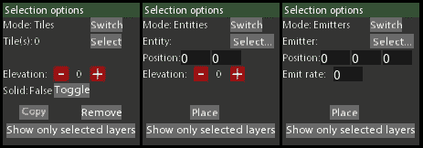
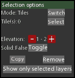
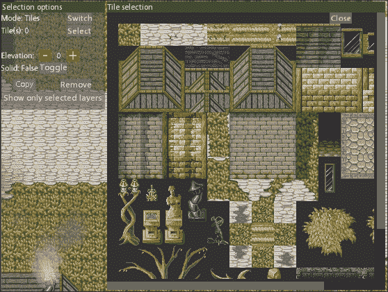

# 第五章. 填充工具带 - 更多的小工具

上一章为我们打下了坚实的基础。现在是时候充分利用它，完成我们开始的工作，通过构建一套强大的工具集，准备好应对各种设计问题。

在本章中，我们将讨论以下主题：

+   选择选项的实现

+   瓦片选择窗口的设计和编程

+   实体管理

有很多代码需要覆盖，所以让我们直接进入正题吧！

# 规划选择选项

在创建一个响应和有用的应用程序时，灵活的选择选项非常重要。没有它们，任何软件最多只能感觉不直观、笨拙或无响应。在这种情况下，我们将处理选择、复制和放置瓦片、实体和粒子发射器。

让我们看看这样一个界面可能是什么样子：



为了达到这个目标，我们需要创建一个灵活的类，设计成能够处理任何可能的选项和控制组合。让我们从回顾在开发这个系统时将非常有用的最基本的数据类型开始：

```cpp
enum class SelectMode{ Tiles, Entities, Emitters }; 
using NameList = std::vector<std::pair<std::string, bool>>; 

```

首先，需要枚举选择模式。如前所述的片段所示，我们现在将处理三种模式，尽管这个列表可以很容易地在未来扩展。`NameList`数据类型将被用来存储实体和粒子目录的内容。这是我们将依赖的实用函数的返回格式。

数据类型的问题已经解决，现在让我们尝试创建`SelectionOptions`类的蓝图：

```cpp
class GUI_SelectionOptions { 
public: 
  GUI_SelectionOptions(EventManager* l_eventManager, 
    GUI_Manager* l_guiManager, MapControls* l_controls, 
    GUI_MapTileSelector* l_selector, Map* l_map, TileMap* l_brush, 
    EntityManager* l_entityMgr, ParticleSystem* l_particles); 
  ~GUI_SelectionOptions(); 

  void Show(); 
  void Hide(); 
  void SetControlMode(ControlMode l_mode); 
  void SetSelectMode(SelectMode l_mode); 
  SelectMode GetSelectMode()const; 
  void SelectEntity(int l_id); 
  void SelectEmitter(Emitter* l_emitter); 
  sf::Vector2i GetSelectXRange() const; 
  sf::Vector2i GetSelectYRange() const; 
  unsigned int GetLowestLayer() const; 
  unsigned int GetHighestLayer() const; 

  void Update(); 
  void Draw(sf::RenderWindow* l_window); 
  bool MouseClick(const sf::Vector2f& l_pos); 
  void MouseRelease(); 
  void Reset(); 

  void SelectModeSwitch(EventDetails* l_details); 
  void OpenTileSelection(EventDetails* l_details); 
  void SolidToggle(EventDetails* l_details); 
  void CopySelection(EventDetails* l_details); 
  void PlaceSelection(EventDetails* l_details); 
  void RemoveSelection(EventDetails* l_details); 
  void ToggleLayers(EventDetails* l_details); 
  void SelectionOptionsElevation(EventDetails* l_details); 
  void SaveOptions(EventDetails* l_details); 
private: 
  void SelectionElevationUpdate(); 
  void UpdateSelectDrawable(); 
  void UpdateTileSelection(); 
  void UpdateEntitySelection(); 
  void UpdateEmitterSelection(); 
  void DeleteSelection(bool l_deleteAll); 
  ... 
}; 

```

为了保持简单，让我们先讨论我们需要的方法，然后再讨论数据成员。就公共方法而言，我们几乎拥有任何人都会期望的集合。除了`Show()`和`Hide()`方法，这些方法将被用来操作这个类封装的界面之外，我们几乎只有几个设置器和获取器，用于操作`ControlMode`和`SelectMode`，选择特定的实体或粒子发射器，以及获取瓦片选择范围，以及层可见性/选择的范围。此外，这个类还需要为我们在工作的界面中的许多控件提供大量的回调方法。

私有方法主要是由用于更新界面及其在屏幕上选择视觉表示的代码组成，以及用于更新选择界面可能处于的每个可能模式的代码。它还包括一个私有方法`DeleteSelection()`，当删除瓦片、实体或粒子发射器时将非常有用。

最后，让我们看一下将要用来保存这个类状态的各个数据成员：

```cpp
class GUI_SelectionOptions { 
private: 
  ... 
  // Selection data. 
  SelectMode m_selectMode; 
  sf::RectangleShape m_selectDrawable; 
  sf::Color m_selectStartColor; 
  sf::Color m_selectEndColor; 
  sf::Color m_entityColor; 
  sf::Color m_emitterColor; 
  sf::Vector2i m_selectRangeX; 
  sf::Vector2i m_selectRangeY; 
  bool m_selectUpdate; 
  // Entity and emitter select info. 
  int m_entityId; 
  C_Position* m_entity; 
  Emitter* m_emitter; 
  NameList m_entityNames; 
  NameList m_emitterNames; 
  // Selection range. 
  unsigned int m_layerSelectLow; 
  unsigned int m_layerSelectHigh; 
  // Interfaces. 
  GUI_Interface* m_selectionOptions; 
  MapControls* m_mapControls; 
  GUI_MapTileSelector* m_tileSelector; 
  // Class ties. 
  EventManager* m_eventManager; 
  GUI_Manager* m_guiManager; 
  Map* m_map; 
  TileMap* m_brush; 
  EntityManager* m_entityManager; 
  ParticleSystem* m_particleSystem; 
}; 

```

我们首先存储当前的选取模式，以及用于视觉表示正在进行的选取的`RectangleShape`对象。为了使我们的工具感觉更加响应和生动，我们将提供多种不同的颜色，用于表示不同的选取状态。例如，`m_selectStartColor`和`m_selectEndColor`数据成员用于区分仍在进行的瓦片选取以及鼠标按钮释放时的最终状态。除了颜色之外，我们还有两种向量类型，用于存储两个轴的瓦片选取范围，以及一个*布尔*标志，用于确定何时更新矩形形状。

对于其他两种状态，我们需要存储实体标识符及其位置组件，因为我们处于实体选取模式，以及指向粒子发射器的指针，因为我们目前正在处理粒子。这也是粒子目录和实体目录的内容将被存储的地方，以便用适当的值填充下拉列表。

此外，我们还需要跟踪层选取范围，以及指向`selectionOptions`接口、上一章中提到的`MapControl`类和一个即将介绍的地图瓦片选择类的指针。请注意，只有`m_selectionOptions`接口在技术上属于这个类。其他两个类封装了自己的接口，因此管理它们的销毁。

最后，我们需要能够访问`eventManager`、`guimanager`、游戏`map`实例、瓦片`brush`、`entityManager`和`particleSystem`。

## 实现选择选项

在所有这些数据都得到适当初始化的情况下，我们在构造函数中有很多工作要做：

```cpp
GUI_SelectionOptions::GUI_SelectionOptions( 
  EventManager* l_eventManager, GUI_Manager* l_guiManager, 
  MapControls* l_controls, GUI_MapTileSelector* l_selector, 
  Map* l_map, TileMap* l_brush, EntityManager* l_entityMgr, 
  ParticleSystem* l_particles) : 
  /* Processing arguments. */ 
  m_eventManager(l_eventManager), m_guiManager(l_guiManager), 
  m_mapControls(l_controls), m_tileSelector(l_selector), 
  m_map(l_map), m_brush(l_brush), m_entityManager(l_entityMgr), 
  m_particleSystem(l_particles), 
  /* Initializing default values of data members. */ 
  m_selectRangeX(-1, -1), m_selectRangeY(-1, -1), 
  m_layerSelectLow(0), m_layerSelectHigh(0), 
  m_selectMode(SelectMode::Tiles), m_entityId(-1), 
  m_entity(nullptr), m_emitter(nullptr), m_selectUpdate(true) 
{...} 

```

在所有参数都妥善存储之后，所有数据成员的默认值被设置。这确保了选择初始状态的定义。构造函数的主体用于适当地处理其他任务：

```cpp
GUI_SelectionOptions::GUI_SelectionOptions(...) 
{ 
  ... // Setting up callbacks. 
  m_guiManager->LoadInterface( 
    "MapEditorSelectionOptions.interface", 
    "MapEditorSelectionOptions"); 
  m_selectionOptions =  
    m_guiManager->GetInterface("MapEditorSelectionOptions"); 
  m_selectionOptions->SetPosition({ 0.f, 164.f }); 
  m_selectionOptions->SetActive(false); 
  m_selectStartColor = sf::Color(0, 0, 150, 120); 
  m_selectEndColor = sf::Color(0, 0, 255, 150); 
  m_entityColor = sf::Color(255, 0, 0, 150); 
  m_emitterColor = sf::Color(0, 255, 0, 150); 

  m_entityNames = Utils::GetFileList(Utils::GetWorkingDirectory() 
    + "media/Entities/", "*.entity"); 
  m_emitterNames = Utils::GetFileList(Utils::GetWorkingDirectory() 
    + "media/Particles/", "*.particle"); 
} 

```

在这里，所有适当的回调都已设置，类拥有的接口被加载、定位并隐藏，颜色值也被初始化。最后，实体和粒子发射器目录的内容被获取并存储。

我们在这里不会介绍析构函数，因为它只是简单地处理移除所有回调和设置的接口。

说到接口，外部代码需要能够轻松地显示和隐藏`selectionOptions`窗口：

```cpp
void GUI_SelectionOptions::Show() { 
  m_selectionOptions->SetActive(true); 
  m_guiManager->BringToFront(m_selectionOptions); 
} 
void GUI_SelectionOptions::Hide() { 
  m_selectionOptions->SetActive(false); 
} 

```

通过将接口设置为活动或非活动状态，可以达到预期的效果。在前者的情况下，`guiManager`也被用来将`selectionOptions`接口置于所有其他元素之上，将其带到前台。

由于这个接口/类是一种辅助工具，它依赖于我们编辑器的控制模式。这种关系要求`selectionOptions`类通知`controlMode`的变化：

```cpp
void GUI_SelectionOptions::SetControlMode(ControlMode l_mode) { 
  if (l_mode != ControlMode::Brush && l_mode 
    != ControlMode::Select) 
  { return; } 
  SetSelectMode(SelectMode::Tiles); 
  if (l_mode == ControlMode::Brush) { 
    m_selectionOptions->SetActive(true); 
    m_selectionOptions->Focus(); 
    m_selectionOptions->GetElement("TileSelect")->SetActive(true); 
  } else if (l_mode == ControlMode::Select) { 
    m_selectionOptions->SetActive(true); 
    m_selectionOptions->Focus(); 
    m_selectionOptions->GetElement("SolidToggle")-> 
      SetActive(true); 
    m_selectionOptions->GetElement("CopySelection")-> 
      SetActive(true); 
  } 
} 

```

只需要担心`Brush`和`Select`模式，因为这个界面甚至不需要用于其他任何事情。如果选择`Brush`，界面被启用并聚焦，同时其`TileSelect`元素也被启用。这确保我们可以选择想要绘制的瓷砖。如果选择选择工具，我们希望启用切换实体固态和选择复制的按钮。

实际的选择模式切换也需要处理，可以这样做：

```cpp
void GUI_SelectionOptions::SetSelectMode(SelectMode l_mode) { 
  Reset(); 
  m_selectMode = l_mode; 
  m_selectionOptions->SetActive(true); 
  m_selectionOptions->Focus(); 

  if (l_mode == SelectMode::Tiles) { 
    ... // GUI Element manipulation. 
  } else if(l_mode == SelectMode::Entities) { 
    ... // GUI Element manipulation. 
    auto dropdown = static_cast<GUI_DropDownMenu*>( 
      m_selectionOptions->GetElement("SelectDropdown"))-> 
      GetMenu(); 
    dropdown->PurgeEntries(); 
    for (auto& entity : m_entityNames) { 
      dropdown->AddEntry( 
        entity.first.substr(0, entity.first.find(".entity"))); 
    } 
    dropdown->Redraw(); 
  } else if (l_mode == SelectMode::Emitters) { 
    ... // GUI Element manipulation. 
    auto dropdown = static_cast<GUI_DropDownMenu*>( 
      m_selectionOptions->GetElement("SelectDropdown"))-> 
      GetMenu(); 
    dropdown->PurgeEntries(); 
    for (auto& emitter : m_emitterNames) { 
      dropdown->AddEntry( 
        emitter.first.substr(0, emitter.first.find(".particle"))); 
    } 
    dropdown->Redraw(); 
  } 
} 

```

首先，调用`Reset()`方法。它用于禁用所有不必要的界面元素，并将选择数据成员重置为其默认值。在存储实际选择模式并将界面设置为活动状态后，我们开始处理实际的模式特定逻辑。

如果我们处于瓷砖选择模式，它仅仅涉及启用一些界面元素，以及将它们的文本设置为匹配上下文。为了简单起见，此方法中省略了所有元素操作。

处理实体和发射器模式类似，但包括一个额外的步骤，即用适当的值填充下拉菜单。在这两种情况下，都获取下拉元素并清除其当前条目。然后遍历适当的目录列表；将每个条目添加到下拉菜单中，确保移除文件类型。完成此操作后，指示下拉菜单重新绘制。

让我们看看当我们的选择选项类被指示选择特定实体时需要发生什么：

```cpp
void GUI_SelectionOptions::SelectEntity(int l_id) { 
  if (l_id == -1) { 
    m_entityId = -1; 
    m_selectionOptions->GetElement("CopySelection")-> 
      SetActive(false); 
    m_selectionOptions->GetElement("PlaceSelection")-> 
      SetText("Place"); 
    m_selectionOptions->GetElement("RemoveSelection")-> 
      SetActive(false); 
    m_entity = nullptr; 
    return; 
  } 
  auto pos = m_entityManager-> 
    GetComponent<C_Position>(l_id, Component::Position); 
  if (!pos) { 
    m_entityId = -1; 
    m_selectionOptions->GetElement("CopySelection")-> 
      SetActive(false); 
    m_selectionOptions->GetElement("PlaceSelection")-> 
      SetText("Place"); 
    m_selectionOptions->GetElement("RemoveSelection")-> 
      SetActive(false); 
    m_entity = nullptr; 
    return; 
  } 
  m_selectionOptions->GetElement("CopySelection")-> 
    SetActive(true); 
  m_selectionOptions->GetElement("PlaceSelection")-> 
    SetText("Edit"); 
  m_selectionOptions->GetElement("RemoveSelection")-> 
    SetActive(true); 
  m_entityId = l_id; 
  m_entity = pos; 
  m_selectionOptions->GetElement("InfoText")-> 
    SetText(std::to_string(m_entityId)); 
  m_selectUpdate = true; 
} 

```

首先，该参数可用于取消选择实体，以及选择它。如果传递了适当的取消选择值，或者未找到提供的标识符的实体位置组件，则相关的界面元素被调整以匹配该情况。

如果提供的 ID 对应的实体存在，则适当的元素被启用并调整。实体位置组件及其标识符被存储以供以后使用，并且选择选项界面中的信息文本元素被更改以反映所选实体的 ID。它也被标记为更新，通过操作布尔标志`m_selectUpdate`。

选择发射器时发生的过程非常相似：

```cpp
void GUI_SelectionOptions::SelectEmitter(Emitter* l_emitter) { 
  m_emitter = l_emitter; 
  if (!l_emitter) { 
    m_selectionOptions->GetElement("CopySelection")-> 
      SetActive(false); 
    m_selectionOptions->GetElement("PlaceSelection")-> 
      SetText("Place"); 
    m_selectionOptions->GetElement("RemoveSelection")-> 
      SetActive(false); 
    return; 
  } 
  m_selectionOptions->GetElement("CopySelection")-> 
    SetActive(true); 
  m_selectionOptions->GetElement("PlaceSelection")-> 
    SetText("Edit"); 
  m_selectionOptions->GetElement("RemoveSelection")-> 
    SetActive(true); 
  m_selectionOptions->GetElement("InfoText")->SetText(m_emitter-> 
    GetGenerators()); 
  m_selectionOptions->GetElement("EmitRate")-> 
    SetText(std::to_string(m_emitter->GetEmitRate())); 
  m_selectUpdate = true; 
} 

```

在某种意义上，我们只处理一个指向粒子发射器的指针。如果传入`nullptr`，则适当的元素被禁用并调整。否则，界面更新以反映所选发射器的信息，之后还标记`selectionOptions`界面已正确更新。

我们显然还需要一种在不同的选择模式之间切换的方法，因此有了这个回调函数：

```cpp
void GUI_SelectionOptions::SelectModeSwitch( 
  EventDetails* l_details) 
{ 
  if (m_selectMode == SelectMode::Tiles) { 
    if (m_mapControls->GetMode() != ControlMode::Select) { 
      m_mapControls->SelectMode(ControlMode::Select); 
    } 
    SetSelectMode(SelectMode::Entities); 
  } else if (m_selectMode == SelectMode::Entities) { 
    SetSelectMode(SelectMode::Emitters); 
  } else { SetSelectMode(SelectMode::Tiles); } 
} 

```

它简单地遍历所有选择选项。这里值得指出的一点是，如果循环之前的界面处于瓷砖模式，我们想要确保将`ControlMode`切换到`Select`。

我们还希望工作的另一个特性是打开和处理从瓦片表中选中的瓦片：

```cpp
void GUI_SelectionOptions::OpenTileSelection( 
  EventDetails* l_details) 
{ 
  if (!m_tileSelector->IsActive()) { 
    m_tileSelector->Show(); 
    return; 
  } 
  m_mapControls->SelectMode(ControlMode::Brush); 
  if (m_tileSelector->CopySelection(*m_brush)) { 
    m_selectionOptions->GetElement("Solidity")->SetText("False"); 
    m_mapControls->RedrawBrush(); 
  } 
  m_selectionOptions->GetElement("InfoText")->SetText( 
    std::to_string(m_brush->GetTileCount())); 
} 

```

首先，我们处理打开 `tileSelector` 接口，前提是它尚未设置为激活状态。另一方面，如果接口已打开，被按下的选择按钮表示用户试图将他们的选择复制到画笔中。`mapControls` 类被指示将其模式切换到 `Brush`，然后传递给 `tileSelector` 类的 `CopySelection()` 方法，该方法负责复制实际的瓦片数据。由于它返回一个指示其成功的 *布尔* 值，该方法在 `if` 语句内被调用，这使得我们能够在复制过程成功的情况下更新界面的实体性元素并请求画笔重新绘制。无论如何，`selectionOptions` 接口的信息文本元素随后被更新，以保存已选并复制到画笔中的瓦片总数。

在我们的瓦片编辑器中，切换当前被选中的地图部分或画笔本身的实体性也是可能的：

```cpp
void GUI_SelectionOptions::SolidToggle(EventDetails* l_details) { 
  auto mode = m_mapControls->GetMode(); 
  if (m_mapControls->GetMode() != ControlMode::Brush 
    && mode != ControlMode::Select) 
  { return; } 
  auto element = m_selectionOptions->GetElement("Solidity"); 
  auto state = element->GetText(); 
  bool solid = false; 
  std::string newText; 
  if (state == "True") { newText = "False"; } 
  else { solid = true; newText = "True"; } 
  element->SetText(newText); 
  sf::Vector2u start; 
  sf::Vector2u finish; 
  TileMap* map = nullptr; 
  if (mode == ControlMode::Brush) { 
    map = m_brush; 
    start = sf::Vector2u(0, 0); 
    finish = map->GetMapSize() - sf::Vector2u(1, 1); 
  } else if (mode == ControlMode::Select) { 
    map = m_map->GetTileMap(); 
    start = sf::Vector2u(m_selectRangeX.x, m_selectRangeY.x); 
    finish = sf::Vector2u(m_selectRangeX.y, m_selectRangeY.y); 
  } 

  for (auto x = start.x; x <= finish.x; ++x) { 
    for (auto y = start.y; y <= finish.y; ++y) { 
      for (auto layer = m_layerSelectLow; 
        layer < m_layerSelectHigh; ++layer) 
      { 
        auto tile = map->GetTile(x, y, layer); 
        if (!tile) { continue; } 
        tile->m_solid = solid; 
      } 
    } 
  } 
} 

```

首先，显然不能切换选择范围的实体性，如果控制模式没有设置为 `Brush` 或 `Select` 模式。覆盖这一点后，我们获取实体状态标签及其文本。翻转其值到其相反，并更新元素的文本后，我们建立一个将要修改的瓦片范围。在画笔的实体性被切换的情况下，范围包含整个结构。另一方面，当处理选择模式时，使用地图选择范围。

### 注意

`m_selectRangeX` 和 `m_selectRangeY` 数据成员表示地图瓦片的选取范围。每个范围负责其自身的轴。例如，`m_selectRangeX.x` 是 **起始** *X* 坐标，而 `m_selectRangeX.y` 是 **结束** *X* 坐标。

在范围被正确建立后，我们只需遍历它，并从适当的 `TileMap` 获取瓦片，将它们的实体性设置为适当的值。

将地图的某个部分复制到画笔也可能是一个有用的特性：

```cpp
void GUI_SelectionOptions::CopySelection(EventDetails* l_details) 
{ 
  if (m_selectRangeX.x == -1) { return; } 
  auto size = sf::Vector2u( 
    m_selectRangeX.y - m_selectRangeX.x, 
    m_selectRangeY.y - m_selectRangeY.x); 
  size.x += 1; 
  size.y += 1; 
  m_brush->Purge(); 
  m_brush->SetMapSize(size); 
  unsigned int b_x = 0, b_y = 0, b_l = 0; 
  bool solid = false, mixed = false; 
  unsigned short changes = 0; 
  for (auto x = m_selectRangeX.x; x <= m_selectRangeX.y; ++x) { 
    for (auto y = m_selectRangeY.x; y <= m_selectRangeY.y; ++y) { 
      for (auto layer = m_layerSelectLow; 
        layer <= m_layerSelectHigh; ++layer) 
      { 
        auto tile = m_map->GetTile(x, y, layer); 
        if (!tile) { ++b_l; continue; } 
        auto newTile = m_brush->SetTile( 
          b_x, b_y, b_l, tile->m_properties->m_id); 
        if (!newTile) { continue; } 
        if (!mixed) { 
          if (tile->m_solid && !solid) { 
            solid = true; ++changes; 
          } else if (solid) { 
            solid = false; ++changes; 
          } 
          if (changes >= 2) { mixed = true; } 
        } 
        *newTile = *tile; 
        ++b_l; 
      } 
      b_l = 0; 
      ++b_y; 
    } 
    b_y = 0; 
    ++b_x; 
  } 
  m_layerSelectHigh = m_layerSelectLow + 
    m_brush->GetHighestElevation(); 
  if (m_layerSelectHigh >= Sheet::Num_Layers) { 
    auto difference = (m_layerSelectHigh - Sheet::Num_Layers) + 1; 
    m_layerSelectHigh = Sheet::Num_Layers - 1; 
    m_layerSelectLow -= difference; 
  } 
  SelectionElevationUpdate(); 
  m_mapControls->SelectMode(ControlMode::Brush); 
  m_selectionOptions->GetElement("InfoText")-> 
    SetText(std::to_string(m_brush->GetTileCount())); 
  m_selectionOptions->GetElement("Solidity")-> 
    SetText((mixed ? "Mixed" : (solid ? "True" : "False"))); 
} 

```

我们首先检查是否确实进行了选择，这可以通过检查任何选择范围的数据成员来完成。之后，通过从选择范围的起点减去终点，并在两个轴上各增加一个单位来计算选择的大小。这样做是为了补偿那些开始和结束在同一确切瓦片编号上的包含范围。

一旦清除并调整画笔瓦片地图的大小，就会设置一些局部变量以帮助其余代码。三个*无符号整数*将被用作画笔瓦片地图的索引坐标，以便正确映射复制的瓦片。两个*布尔*标志和*无符号短整型*变化将用于跟踪坚固性变化，以便更新表示选择处于何种坚固状态的用户界面元素。

接下来，进入瓦片循环。在获取特定坐标处的地图瓦片并通过有效性检查后，当前坐标由`b_x`、`b_y`和`b_l`表示的画笔瓦片被设置为持有相同的瓦片 ID。然后检测并记录瓦片的坚固性变化，以确定我们是否有一个混合的坚固性选择。最后，通过使用重载的`=`运算符，将所有其他瓦片属性转移到画笔上。

为了使界面与我们的操作保持同步，当前图层选择范围会被检查是否超出了应用程序支持的总图层实际范围。例如，如果我们支持四个总图层，而当前选中的图层是第二个，同时画笔的所有图层都已填充，我们希望通过计算图层差异，调整所选最高图层以匹配应用程序支持的最大图层，并从最低图层中减去这个差异，从而保持画笔的正确范围。

最后，调用一个用于更新选择选项高度选择文本的方法，指示地图控制类切换到`画笔`模式，并使用画笔瓦片计数和坚固性信息更新选择选项界面。

让我们暂时放下放置、编辑或复制瓦片的话题，来谈谈当按下**放置**按钮时实际放置实体或发射器的情况：

```cpp
void GUI_SelectionOptions::PlaceSelection(EventDetails* l_details) 
{ 
  if (m_selectMode == SelectMode::Tiles) { return; } 
  auto dropdownValue = static_cast<GUI_DropDownMenu*>( 
    m_selectionOptions->GetElement("SelectDropdown"))-> 
    GetMenu()->GetSelected(); 
  if (dropdownValue.empty()) { return; } 
  if (m_selectMode == SelectMode::Entities) { 
    if (!m_entity || m_entityId == -1) { 
      // New entity. 
      auto id = m_entityManager->AddEntity(dropdownValue); 
      if (id == -1) { return; } 
      SelectEntity(id); 
    } 
    SaveOptions(nullptr); 
  } else if (m_selectMode == SelectMode::Emitters) { 
    if (!m_emitter) { 
      // New emitter. 
      auto text = m_selectionOptions-> 
        GetElement("EmitRate")->GetText(); 
      auto rate = std::stoi(text); 
      auto emitter = m_particleSystem->AddEmitter( 
        sf::Vector3f(0.f, 0.f, 0.f), dropdownValue, rate, 
        StateType::MapEditor); 
      SelectEmitter(emitter); 
    } 
    SaveOptions(nullptr); 
  } 
} 

```

我们不会使用这个功能对瓦片进行任何操作，因为那是鼠标的指定用途。如果`selectionOptions`界面处于适当的`选择`模式，会获取下拉菜单的值并检查其是否为空。在适当的情况下，例如选中实体或粒子发射器时，**放置**按钮也可以充当**编辑**按钮，因此在这两种情况下，都会检查适当的值以表示选择或未选择。如果没有选择任何内容，则使用下拉值添加所选类型的新实体或发射器。然后调用`SaveOptions()`方法，因此在这种情况下，当前存储在`selectionOptions`界面中的信息将被保存到新创建的对象或已选中的对象中。

按下**删除**按钮可以这样处理：

```cpp
void GUI_SelectionOptions::RemoveSelection( 
  EventDetails* l_details) 
{ 
  DeleteSelection(l_details->m_shiftPressed); 
} 

```

如您所见，这里调用了一种不同的方法，传递了一个*布尔*标志，表示是否按下了*Shift*键，控制当前选择中删除多少。让我们看看实际的删除方法：

```cpp
void GUI_SelectionOptions::DeleteSelection(bool l_deleteAll) { 
  if (m_selectMode == SelectMode::Tiles) { 
    if (m_selectRangeX.x == -1) { return; } 
    auto layerRange = (l_deleteAll ? 
      sf::Vector2u(0, Sheet::Num_Layers - 1) : 
      sf::Vector2u(m_layerSelectLow, m_layerSelectHigh)); 

    m_map->GetTileMap()->RemoveTiles( 
      sf::Vector2u(m_selectRangeX), 
      sf::Vector2u(m_selectRangeY), 
      layerRange); 
    m_map->ClearMapTexture( 
      sf::Vector3i(m_selectRangeX.x, 
        m_selectRangeY.x, layerRange.x), 
      sf::Vector3i(m_selectRangeX.y, 
        m_selectRangeY.y, layerRange.y)); 
  } else if (m_selectMode == SelectMode::Entities) { 
    if (!m_entity || m_entityId == -1) { return; } 
    m_entityManager->RemoveEntity(m_entityId); 
    SelectEntity(-1); 
  } else if (m_selectMode == SelectMode::Emitters) { 
    if (!m_emitter) { return; } 
    m_particleSystem->RemoveEmitter(m_emitter); 
    SelectEmitter(nullptr); 
  } 
} 

```

再次处理所有三种不同的选择类型：瓦片、实体和粒子发射器。如果我们正在处理瓦片，检查选择范围。如果实际上有选择，根据参数是否表示应该删除一切，定义层范围。然后指示地图在计算出的范围内删除瓦片并清除其渲染纹理。

在实体和粒子发射器的情况下，事情要简单得多。所选的实体/发射器被简单地删除，并在不久之后调用适当的`SelectX`方法，传入一个没有选择值的参数。

接下来，让我们处理控制海拔选择的***+***和***-***按钮：

```cpp
void GUI_SelectionOptions::SelectionOptionsElevation( 
  EventDetails* l_details) 
{ 
  int low = 0, high = 0; 
  bool shift = sf::Keyboard::isKeyPressed(sf::Keyboard::LShift); 
  if (l_details->m_name == "MapEditor_SelectOptionsPlus") { 
    if (shift) { high = 1; } else { low = 1; } 
  } else if(l_details->m_name == "MapEditor_SelectOptionsMinus") { 
    if (shift) { high = -1; } else { low = -1; } 
  } 

  auto mode = m_mapControls->GetMode(); 

  if (mode == ControlMode::Brush) { 
    if (high != 0) { return; } // only working with low values. 
    int l = m_layerSelectLow + low; 
    if (l < 0 || l >= Sheet::Num_Layers) { return; } 
    if (l + m_brush->GetHighestElevation() >= 
      Sheet::Num_Layers) 
    { return; } 
    m_layerSelectLow = l; 
    m_layerSelectHigh = l + m_brush->GetHighestElevation(); 
    SelectionElevationUpdate(); 
  } else if (mode == ControlMode::Select) { 
    int l = m_layerSelectLow + low; 
    int h = m_layerSelectHigh + high; 
    if (l < 0 || l >= Sheet::Num_Layers) { return; } 
    if (h < 0 || h >= Sheet::Num_Layers) { return; } 
    if (m_layerSelectLow == m_layerSelectHigh && !shift) { 
      m_layerSelectLow += low; 
      m_layerSelectLow += high; 
      m_layerSelectHigh = m_layerSelectLow; 
    } else { 
      m_layerSelectLow = l; 
      m_layerSelectHigh = h; 
    } 
    if (m_layerSelectLow > m_layerSelectHigh) { 
      std::swap(m_layerSelectLow, m_layerSelectHigh); 
    } 
    SelectionElevationUpdate(); 
  } 
} 

```

在这里，我们希望以特定的方式处理按钮点击。请记住，支持选择层范围也是非常重要的。考虑以下插图：



单击加号或减号会影响低数，它代表所选最低海拔。按住*Shift*键会增加高数，控制最高海拔。为此，设置了两个整数`low`和`high`，以及一个*布尔*标志，用于确定是否按下了*Shift*键。根据这一点和事件名称，数字被调整以表示海拔的变化。

接下来，我们再次分支逻辑。如果选择了`Brush`模式，我们根本不想处理任何高海拔的变化。相反，这里只使用低层选择。通过将层增量添加到已选择的低海拔，确定新的值，检查范围是否超过 0;`Sheet::NumLayers`)的边界。如果通过，低海拔选择将使用新值更新，高值也更新，它简单地取低海拔并加上画笔的厚度，这由画笔的最高海拔表示。

`Select`模式遵循相同的基本原则，只有一个例外：它还处理高海拔。通过适当地将增量添加到当前值中，检查范围是否超过允许的限制。下一个检查处理的是，当低值和高值都相同时，我们如何根据情况控制 shift-clicks。如果它们相同，增量将简单地添加到低值，并将其复制到高海拔，以保持相等。否则，低值和高值都将简单地用先前计算的范围覆盖。

在这两种情况下，调用 `SelectionElevationUpdate()` 方法也很重要，它确保界面元素保持最新，如下所示：

```cpp
void GUI_SelectionOptions::SelectionElevationUpdate() { 
  if (!m_selectionOptions->IsActive()) { return; } 
  m_selectionOptions->GetElement("Elevation")->SetText( 
    std::to_string(m_layerSelectLow) + 
    (m_layerSelectLow != m_layerSelectHigh ? 
    " - " + std::to_string(m_layerSelectHigh) : "") 
  ); 
  SaveOptions(nullptr); 
} 

```

确保选择选项界面实际上处于活动状态后，高度标签会更新为适当的层范围。然后，使用 `nullptr` 作为其参数调用 `SaveOptions()` 回调。它负责将界面信息保存到所选的任何对象。现在让我们看看这个方法：

```cpp
void GUI_SelectionOptions::SaveOptions(EventDetails* l_details) { 
  if (m_selectMode == SelectMode::Tiles) { return; } 

  auto x = m_selectionOptions->GetElement("Pos_X")->GetText(); 
  auto y = m_selectionOptions->GetElement("Pos_Y")->GetText(); 
  auto z = m_selectionOptions->GetElement("Pos_Z")->GetText(); 

  auto c_x = std::stoi(x); 
  auto c_y = std::stoi(y); 
  auto c_z = std::stoi(z); 

  if (m_selectMode == SelectMode::Entities) { 
    if (!m_entity || m_entityId == -1) { return; } 
    m_entity->SetPosition(sf::Vector2f(c_x, c_y)); 
    m_entity->SetElevation(m_layerSelectLow); 
  } else if (m_selectMode == SelectMode::Emitters) { 
    if (!m_emitter) { return; } 
    auto emitRate = m_selectionOptions-> 
      GetElement("EmitRate")->GetText(); 
    auto c_rate = std::stoi(emitRate); 
    m_emitter->SetPosition(sf::Vector3f(c_x, c_y, c_z)); 
    m_emitter->SetEmitRate(c_rate); 
  } 
} 

```

最明显的第一步检查是确保我们不在瓦片模式下，因为那里没有可以保存的内容。之后，代表 *X*、*Y* 和 *Z* 坐标的文本字段中的值被获取并转换为数字。这就是我们的逻辑再次分支的地方。

在处理实体的情况下，我们首先必须确保已经选择了一个实体。如果是的话，它的位置将改变为从界面获取的值的那个位置。这里我们不需要使用 *Z* 坐标，因为那被高度所取代。

然而，当处理粒子发射器时，会使用到 *Z* 坐标。从界面获取额外的发射率值并将其转换为适当的数字后，所有这些值都应用于当前选定的粒子发射器。

现在，是使其他一切正常工作的代码片段：

```cpp
void GUI_SelectionOptions::Update() { 
  if (m_selectUpdate) { UpdateSelectDrawable(); } 
  if (!m_mapControls->IsInAction()) { return; } 
  if (m_selectMode == SelectMode::Tiles) {UpdateTileSelection();} 
  else if (m_selectMode == SelectMode::Entities) { 
    UpdateEntitySelection(); 
  } else if (m_selectMode == SelectMode::Emitters) { 
    UpdateEmitterSelection(); 
  } 
} 

```

在这一点上，我们想要确保选择可绘制的内容被更新，前提是 `m_selectUpdate` 标志被启用。如果 `mapControls` 类没有告诉我们左鼠标按钮被按下，则可以跳过其余的代码。然而，如果是的话，会根据界面中的 `selectMode` 调用适当的方法进行更新。

保持应用程序看起来整洁且响应迅速的一个好方法是拥有某些选择清晰的指示，如下所示：

![实现选择选项让我们看看如何更新实体和发射器的选择矩形：```cppvoid GUI_SelectionOptions::UpdateSelectDrawable() {   if (m_selectMode == SelectMode::Entities) {     if (m_entityId == -1) { return; }     if (!m_entity) { return; }     if (m_entityManager->HasComponent(m_entityId,       Component::Collidable))     {       auto col = m_entityManager->         GetComponent<C_Collidable>(m_entityId,         Component::Collidable);       auto primitive = col->GetCollidable();       m_selectDrawable.setPosition(primitive.left, primitive.top);       m_selectDrawable.setSize(         sf::Vector2f(primitive.width, primitive.height));     } else if (m_entityManager->HasComponent(m_entityId,       Component::SpriteSheet))     {       auto drawable = m_entityManager->         GetComponent<C_SpriteSheet>(m_entityId,         Component::SpriteSheet);       auto pos = drawable->GetSpriteSheet()->GetSpritePosition();       auto size = drawable->GetSpriteSheet()->GetSpriteSize();       m_selectDrawable.setPosition(pos);       m_selectDrawable.setSize(sf::Vector2f(size));     } else {       m_selectDrawable.setPosition(         m_entity->GetPosition() - sf::Vector2f(16.f, 16.f));       m_selectDrawable.setSize(sf::Vector2f(32.f, 32.f));     }   } else if (m_selectMode == SelectMode::Emitters) {     if (!m_emitter) { return; }     auto pos = sf::Vector2f(       m_emitter->GetPosition().x, m_emitter->GetPosition().y);     m_selectDrawable.setPosition(pos - sf::Vector2f(16.f, 16.f));     m_selectDrawable.setSize(sf::Vector2f(32.f, 32.f));   } } ```和往常一样，我们的逻辑会根据我们所在的选取模式分支。如果我们正在处理实体，需要进行一些检查以确保已经选择了一个实体。如果是的话，下一个问题是给矩形一个合适的大小、原点和位置。做到这一点最简单的方法是获取实体的胶体组件并根据碰撞原语进行操作。如果实体没有那种类型的组件，我们尝试使用下一个最好的东西——它的精灵图集。最后，如果只有位置组件可以操作，矩形将位于实体的位置中心，并赋予一个固定的尺寸 *32x32*。处理发射器与处理实体相当相似，只是没有整个组件的烦恼。如果已经选择了一个发射器，它的二维位置会被获取并用来定位矩形，同时给它一个静态的尺寸 *32x32*。让我们继续更新瓦片选择：```cppvoid GUI_SelectionOptions::UpdateTileSelection() {   auto& tileStart = m_mapControls->GetMouseTileStart();   auto& mouseTile = m_mapControls->GetMouseTile();   auto start = sf::Vector2f(     (tileStart.x + (tileStart.x > mouseTile.x ? 1 : 0))       * Sheet::Tile_Size,     (tileStart.y + (tileStart.y > mouseTile.y ? 1 : 0))       * Sheet::Tile_Size   );   auto end = sf::Vector2f(     (mouseTile.x + (tileStart.x <= mouseTile.x ? 1 : 0))       * Sheet::Tile_Size,     (mouseTile.y + (tileStart.y <= mouseTile.y ? 1 : 0))       * Sheet::Tile_Size   );   m_selectDrawable.setPosition(     (start.x <= end.x ? start.x : end.x),     (start.y <= end.y ? start.y : end.y)   );   m_selectDrawable.setFillColor(m_selectStartColor);   m_selectDrawable.setSize({     std::abs(end.x - start.x),     std::abs(end.y - start.y)   });   m_selectRangeX = sf::Vector2i(     std::min(tileStart.x, mouseTile.x),     std::max(tileStart.x, mouseTile.x)   );   m_selectRangeY = sf::Vector2i(     std::min(tileStart.y, mouseTile.y),     std::max(tileStart.y, mouseTile.y)   ); } ```这是处理瓦片选择逻辑的实际方法。首先，获取被点击的起始瓦片的坐标以及当前鼠标位置的瓦片坐标。这些信息用于计算表示选择的矩形的绝对全局坐标。然后，使用这些信息更新实际的矩形，并将其设置为具有`m_selectStartColor`颜色。最后，剩下的只是将此信息保存为当前选择范围，确保它是升序排列的。接下来，更新实体选择值得一看：```cppvoid GUI_SelectionOptions::UpdateEntitySelection() {   if (!m_mapControls->IsInAction()) { return; }   if (!m_entity) { return; }   m_entity->MoveBy(m_mapControls->GetMouseDifference());   auto elevation = m_entity->GetElevation();   m_selectionOptions->GetElement("Pos_X")->     SetText(std::to_string(static_cast<int>(       m_entity->GetPosition().x)));   m_selectionOptions->GetElement("Pos_Y")->     SetText(std::to_string(static_cast<int>(       m_entity->GetPosition().y)));   m_selectionOptions->GetElement("Elevation")->     SetText(std::to_string(elevation));   m_layerSelectLow = elevation;   m_layerSelectHigh = elevation;   m_selectUpdate = true; } ```需要进行一项检查以确保`mapControls`与瓦片更新以相同的方式生效。显然，我们无法更新一个未被选中的实体，因此也需要对此进行检查。最后的逻辑部分仅涉及通过鼠标位置差移动实体，并将我们的`selectionOptions`接口更新为保持其实际位置和高度。图层选择范围也更新以保存高度信息。最后，将选择更新标志设置为`true`，这会请求更新选择矩形。是时候总结更新逻辑了。唯一剩下的需要更新的模式是粒子发射器选择：```cppvoid GUI_SelectionOptions::UpdateEmitterSelection() {   if (!m_mapControls->IsInAction()) { return; }   if (!m_emitter) { return; }   auto emitPos = m_emitter->GetPosition();   auto position = sf::Vector2f(emitPos.x, emitPos.y);   position += m_mapControls->GetMouseDifference();   m_emitter->SetPosition(     { position.x, position.y, m_emitter->GetPosition().z });   m_selectionOptions->GetElement("Pos_X")->     SetText(std::to_string(static_cast<int>(emitPos.x)));   m_selectionOptions->GetElement("Pos_Y")->     SetText(std::to_string(static_cast<int>(emitPos.y)));   m_selectionOptions->GetElement("Pos_Z")->     SetText(std::to_string(static_cast<int>(emitPos.z)));   m_selectUpdate = true; } ```就像之前一样，在继续之前，会检查地图控制的主要动作标志以及实际的选择。粒子发射器位置的`X`和`Y`属性通过鼠标移动量进行推进，而`Z`坐标保持不变。之后，只需更新接口以包含粒子发射器的最新位置，并标记选择可绘制以进行更新。最后几块拼图涉及我们正确处理鼠标输入：```cppbool GUI_SelectionOptions::MouseClick(const sf::Vector2f& l_pos) {   if (m_selectMode == SelectMode::Tiles) { return true; }   bool madeSelection = false;   if (m_selectMode == SelectMode::Entities) {     int entity = -1;     if (m_mapControls->DrawSelectedLayers()) {       entity = m_entityManager->FindEntityAtPoint(l_pos,         m_layerSelectLow, m_layerSelectHigh);     } else {       entity = m_entityManager->FindEntityAtPoint(l_pos);     }     SelectEntity(entity);     madeSelection = entity != -1;   } else if (m_selectMode == SelectMode::Emitters) {     Emitter* emitter = nullptr;     if (m_mapControls->DrawSelectedLayers()) {       emitter = m_particleSystem->FindEmitter(l_pos,         sf::Vector2f(32.f, 32.f), m_layerSelectLow,           m_layerSelectHigh);     } else {       emitter = m_particleSystem->FindEmitter(         l_pos, sf::Vector2f(32.f, 32.f));     }     SelectEmitter(emitter);     madeSelection = emitter != nullptr;   }   if (!madeSelection) {     m_selectionOptions->GetElement("Pos_X")->       SetText(std::to_string(static_cast<int>(l_pos.x)));     m_selectionOptions->GetElement("Pos_Y")->       SetText(std::to_string(static_cast<int>(l_pos.y)));   }   return madeSelection; } ```如您从上一章回忆的那样，此方法由`mapControls`类调用。它需要返回一个表示是否已进行选择的*布尔值*，以便`mapControls`类可以处理自己的逻辑，如果工具集能够为艺术家提供他们一直寻求的助力，那么这个条件为真。在处理瓦片时，此方法始终需要返回`true`，使控制类知道正在发生动作，无论是什么动作。在实体模式下，`entityManager`类的`FindEntityAtPoint`方法被调用，全局位置以及图层选择范围作为参数传入。后者仅在瓦片编辑器的用户决定仅使选定的图层可见时才为真。如果在空间中的特定点找到了实体，它将返回一个实体 ID，然后用于调用`SelectEntity`。为了确定是否已选中实体，将 ID 检查是否不等于“未找到”的已知值。用来选择粒子发射器的程序非常相似。因为大多数发射器都是空间中的单个点，所以在这里需要使用`sf::Vector2f`来定义可以点击以选择它的位置周围的区域。最后，如果尚未进行选择，选择选项界面的位置文本字段将填充为点击的全局坐标。这允许在放置之前更容易地在世界中定位对象。意想不到的是，当鼠标按钮释放时，需要发生很多事情。让我们看看：```cppvoid GUI_SelectionOptions::MouseRelease() {   if (m_selectMode == SelectMode::Tiles) {     m_selectDrawable.setFillColor(m_selectEndColor);     m_selectionOptions->GetElement("CopySelection")->       SetActive(true);     m_selectionOptions->GetElement("RemoveSelection")->       SetActive(true);     bool solid = false, mixed = false;     unsigned short changes = 0;     for (auto x = m_selectRangeX.x; x <= m_selectRangeX.y       && !mixed; ++x)     {       for (auto y = m_selectRangeY.x; y <= m_selectRangeY.y         && !mixed; ++y)       {         for (auto layer = m_layerSelectLow;           layer <= m_layerSelectHigh && !mixed; ++layer)         {           auto tile = m_map->GetTile(x, y, layer);           if (!tile) { continue; }           if (tile->m_solid && !solid) {             solid = true;             ++changes;           } else if (tile->m_solid && !solid) {             solid = false;             ++changes;           }           if (changes >= 2) { mixed = true; }         }       }     }     m_selectionOptions->GetElement("Solidity")->       SetText((mixed ? "Mixed" : (solid ? "True" : "False")));   } else if (m_selectMode == SelectMode::Entities) {     m_selectDrawable.setFillColor(m_entityColor);   } else if (m_selectMode == SelectMode::Emitters) {     m_selectDrawable.setFillColor(m_emitterColor);   } } ```这部分逻辑的大部分都与处理瓦片选择有关。我们首先需要担心的是将选择矩形设置为最终颜色，以指示已进行选择。之后，复制和删除选择界面的按钮变得可见，并使用循环检查选择，以确定整个块的整体坚固情况，然后将其保存到适当的界面元素中。对于这样一个简单的任务，实体和发射器模式不需要太多的维护。我们在这里需要担心的是适当地设置选择矩形的颜色。当模式切换时，所有重要数据都需要重置，以避免奇怪的错误：```cppvoid GUI_SelectionOptions::Reset() {   auto defaultVector = sf::Vector2i(-1, -1);   m_selectRangeX = defaultVector;   m_selectRangeY = defaultVector;   m_entityId = -1;   m_entity = nullptr;   m_emitter = nullptr;   static_cast<GUI_DropDownMenu*>(     m_selectionOptions->GetElement("SelectDropdown"))->     GetMenu()->ResetSelected();   ... // GUI Element manipulation. } ```除了范围和 ID 被重置之外，实体/发射器的`DropDownMenu`的实际选择也需要归零。最后，我们一直在使用的所有模式特定的 GUI 元素都需要禁用或设置为它们的默认值。最后，我们只剩下最后一段关键代码需要覆盖 - `Draw()`方法：```cppvoid GUI_SelectionOptions::Draw(sf::RenderWindow* l_window) {   auto mode = m_mapControls->GetMode();   if (mode == ControlMode::Select) {     if (m_selectMode == SelectMode::Tiles &&       m_selectRangeX.x == -1)     { return; }     if (m_selectMode == SelectMode::Entities && !m_entity)     { return; }     if (m_selectMode == SelectMode::Emitters && !m_emitter)     { return; }     l_window->draw(m_selectDrawable);   } } ```我们真正需要绘制的东西只有选择矩形。正如这里很明显的那样，如果没有进行任何类型的选择，就不需要绘制它。这包括检查所有三种选择模式。为了完整起见，我们只剩下几个 getter 方法需要检查：```cppunsigned int GUI_SelectionOptions::GetLowestLayer() const{   return m_layerSelectLow; } unsigned int GUI_SelectionOptions::GetHighestLayer() const{    return m_layerSelectHigh; } SelectMode GUI_SelectionOptions::GetSelectMode() const{   return m_selectMode; } sf::Vector2i GUI_SelectionOptions::GetSelectXRange() const{   return sf::Vector2i(     std::min(m_selectRangeX.x, m_selectRangeX.y),     std::max(m_selectRangeX.x, m_selectRangeX.y)); } sf::Vector2i GUI_SelectionOptions::GetSelectYRange() const{   return sf::Vector2i(     std::min(m_selectRangeY.x, m_selectRangeY.y),     std::max(m_selectRangeY.x, m_selectRangeY.y)); } ```这就完成了`selectionOptions`类。# 构建瓦片选择器当与瓦片地图一起工作时，有一个快速直观的方式来访问瓦片表，选择其内容并将其直接绘制到游戏地图上是非常重要的。一套好的工具可以为艺术家提供他们一直在寻找的助力，而一个难以管理的应用程序只会成为障碍。让我们看看我们将要构建的内容：

这个界面，就像我们一直在使用的其他大多数界面一样，当封装在自己的类中时，将更容易管理：

```cpp
class GUI_MapTileSelector { 
public: 
  GUI_MapTileSelector(EventManager* l_eventManager, 
    GUI_Manager* l_guiManager, TextureManager* l_textureManager); 
  ~GUI_MapTileSelector(); 
  void Show(); 
  void Hide(); 
  bool IsActive() const; 
  void SetSheetTexture(const std::string& l_texture); 
  void UpdateInterface(); 
  bool CopySelection(TileMap& l_tileMap) const; 
  void TileSelect(EventDetails* l_details); 
  void Close(EventDetails* l_details); 
private: 
  EventManager* m_eventManager; 
  GUI_Manager* m_guiManager; 
  TextureManager* m_textureManager; 

  GUI_Interface* m_interface; 
  sf::RenderTexture m_selectorTexture; 
  sf::Sprite m_tileMapSprite; 
  sf::RectangleShape m_shape; 
  std::string m_sheetTexture; 

  sf::Vector2u m_startCoords; 
  sf::Vector2u m_endCoords; 
  bool m_selected; 
}; 

```

就像之前一样，我们有`Show()`和`Hide()`方法来管理其可见性，以及一些回调。注意突出显示的方法。它将被用来设置地图使用的瓦片表的纹理。

对于这样的类，数据成员相当可预测。除了这个对象所依赖的类之外，我们还跟踪一个指向它将要操作的界面指针，一个我们将要绘制到的`sf::RenderTexture`实例，一个用于显示渲染纹理的精灵，一个矩形形状，起始和结束坐标，以及一个表示实际选择可绘制的布尔标志。最后，`m_sheetTexture`将简单地跟踪纹理标识符，直到需要释放它的时候。

## 实现瓦片选择器

让我们从在构造函数内设置所有这些数据开始：

```cpp
GUI_MapTileSelector::GUI_MapTileSelector( 
  EventManager* l_eventManager, GUI_Manager* l_guiManager, 
  TextureManager* l_textureManager) : 
  m_eventManager(l_eventManager), m_guiManager(l_guiManager), 
  m_textureManager(l_textureManager), m_selected(false) 
{ 
  m_eventManager->AddCallback(StateType::MapEditor, 
    "MapEditor_TileSelectClick", 
    &GUI_MapTileSelector::TileSelect, this); 
  m_eventManager->AddCallback(StateType::MapEditor, 
    "MapEditor_TileSelectRelease", 
    &GUI_MapTileSelector::TileSelect, this); 
  m_eventManager->AddCallback(StateType::MapEditor,  
    "MapEditor_TileSelectClose", 
    &GUI_MapTileSelector::Close, this); 

  m_guiManager->LoadInterface("MapEditorTileSelect.interface", 
    "MapEditorTileSelect"); 
  m_interface = m_guiManager->GetInterface("MapEditorTileSelect"); 
  m_interface->SetContentRectSize( 
    sf::Vector2i(m_interface->GetSize()-sf::Vector2f(32.f,32.f))); 
  m_interface->SetContentOffset({ 16.f, 16.f }); 
  m_interface->PositionCenterScreen(); 
  m_interface->SetActive(false); 

  m_shape.setFillColor({ 0, 0, 150, 150 }); 
  m_shape.setSize({ Sheet::Tile_Size, Sheet::Tile_Size }); 
  m_shape.setPosition(0.f, 0.f); 
} 

```

在处理完所有争论之后，我们需要设置三个回调方法。然后加载界面并将其存储为数据成员之一，就在其内容矩形的大小和偏移量改变之前，以便为控制元素留出空间，例如将关闭按钮放置得舒适。接着，界面在屏幕上居中并设置为非活动状态。最后，用于表示瓦片选择的矩形形状被初始化为其默认状态。

让我们来看看这个类的析构函数，以确保我们没有忘记释放某些资源：

```cpp
GUI_MapTileSelector::~GUI_MapTileSelector() { 
  ... // Callbacks and interface removal. 
  if (!m_sheetTexture.empty()) { 
    m_textureManager->ReleaseResource(m_sheetTexture); 
  } 
} 

```

在释放所有三个回调之后，必须确保如果其标识符不为空，则还删除了瓦片纹理。

谈到瓦片纹理，让我们看看如何将一个分配给这个类：

```cpp
void GUI_MapTileSelector::SetSheetTexture( 
  const std::string& l_texture) 
{ 
  if (!m_sheetTexture.empty()) { 
    m_textureManager->ReleaseResource(m_sheetTexture); 
  } 
  m_sheetTexture = l_texture; 
  m_textureManager->RequireResource(m_sheetTexture);  
  m_tileMapSprite.setTexture( 
    *m_textureManager->GetResource(m_sheetTexture)); 
  m_tileMapSprite.setPosition({ 0.f, 0.f }); 
  auto size = m_tileMapSprite.getTexture()->getSize(); 
  m_selectorTexture.create(size.x, size.y); 
  m_selectorTexture.clear({ 0,0,0,0 }); 
  m_selectorTexture.draw(m_tileMapSprite); 
  m_selectorTexture.display(); 

  auto element = static_cast<GUI_Sprite*>( 
    m_interface->GetElement("TileSprite")); 
  element->SetTexture(m_selectorTexture); 
} 

```

在适当地释放当前的瓦片纹理之后，新的纹理被分配并检索。因此，实际将传递给界面主 GUI 元素的选取纹理需要重新绘制并传递到该元素中。

当界面需要更新时，发生类似的程序：

```cpp
void GUI_MapTileSelector::UpdateInterface() { 
  m_selectorTexture.clear({ 0,0,0,0 }); 
  m_selectorTexture.draw(m_tileMapSprite); 
  m_selectorTexture.draw(m_shape); 
  m_selectorTexture.display(); 

  m_interface->RequestContentRedraw(); 
} 

```

它仅由瓦片纹理以及绘制到渲染纹理上的选择矩形组成。然后指示界面重新绘制其内容，因为它已经发生了变化。

接下来，让我们提供一个方法，以便外部类可以将当前的瓦片纹理选择复制到`TileMap`结构中：

```cpp
bool GUI_MapTileSelector::CopySelection(TileMap& l_tileMap) const{ 
  if (!m_selected) { return false; } 
  l_tileMap.Purge(); 
  auto TileCoordsStart = m_startCoords / 
    static_cast<unsigned int>(Sheet::Tile_Size); 
  auto TileCoordsEnd = m_endCoords / 
    static_cast<unsigned int>(Sheet::Tile_Size); 
  auto size = TileCoordsEnd - TileCoordsStart; 
  l_tileMap.SetMapSize(size + sf::Vector2u(1,1)); 

  auto sheetSize = m_textureManager->GetResource( 
    l_tileMap.GetTileSet().GetTextureName())->getSize(); 
  auto nPerRow = sheetSize.x / Sheet::Tile_Size; 

  auto t_x = 0, t_y = 0; 
  for (auto x = TileCoordsStart.x; x <= TileCoordsEnd.x; ++x) { 
    for (auto y = TileCoordsStart.y; y <= TileCoordsEnd.y; ++y) { 
      auto coordinate = (y * nPerRow) + x; 
      auto tile = l_tileMap.SetTile(t_x, t_y, 0, coordinate); 
      // Always layer 0\. 
      if (!tile) { ++t_y; continue; } 
      tile->m_solid = false; 
      ++t_y; 
    } 
    t_y = 0; 
    ++t_x; 
  } 
  return true; 
} 

```

显然，如果没有选择任何内容，我们无法复制任何东西。第一个检查处理了这个问题。然后，作为参数传递的`TileMap`被清除，以备覆盖。然后计算瓦片坐标范围，并将`TileMap`参数调整到选择的大小。在建立几个局部变量以帮助我们计算*1D*坐标索引之后，我们开始逐个迭代计算出的瓦片范围，并将它们添加到瓦片图中。因为我们处理瓦片纹理时没有深度，所以层始终设置为值`0`。

以下代码处理鼠标点击和鼠标释放事件，这在进行选择时至关重要：

```cpp
void GUI_MapTileSelector::TileSelect(EventDetails* l_details) { 
  if (l_details->m_name == "MapEditor_TileSelectClick") { 
    m_startCoords = sf::Vector2u(l_details->m_mouse); 
    m_endCoords = sf::Vector2u(l_details->m_mouse); 
    m_selected = false; 
  } else { 
    if (l_details->m_mouse.x < 0 || l_details->m_mouse.y < 0) { 
      m_endCoords = sf::Vector2u(0, 0); 
      return; 
    } 
    m_endCoords = sf::Vector2u(l_details->m_mouse); 
    m_selected = true; 
  } 

  if (m_startCoords.x > m_endCoords.x) { 
    std::swap(m_startCoords.x, m_endCoords.x); 
  } 
  if (m_startCoords.y > m_endCoords.y) { 
    std::swap(m_startCoords.y, m_endCoords.y); 
  } 

  auto start = sf::Vector2i(m_startCoords.x / Sheet::Tile_Size, 
    m_startCoords.y / Sheet::Tile_Size); 
  start *= static_cast<int>(Sheet::Tile_Size); 
  auto end = sf::Vector2i(m_endCoords.x / Sheet::Tile_Size, 
    m_endCoords.y / Sheet::Tile_Size); 
  end *= static_cast<int>(Sheet::Tile_Size); 

  m_shape.setPosition(sf::Vector2f(start)); 
  m_shape.setSize(sf::Vector2f(end - start) + 
    sf::Vector2f(Sheet::Tile_Size, Sheet::Tile_Size)); 
  UpdateInterface(); 
} 

```

如果我们正在处理鼠标左键点击，我们只需记录此时鼠标的坐标，并将`m_selected`标志重置为`false`。另一方面，如果左鼠标按钮已经被释放，首先检查最终鼠标位置是否在两个轴上都没有进入负值。然后存储最终坐标，并将`m_selected`标志设置为`true`。

剩余的代码块仅处理确保起始和结束坐标按升序存储，并计算选择矩形的位置和大小。然后调用`UpdateInterface()`方法，确保一切重新绘制。

让我们快速浏览一下这个类的辅助方法：

```cpp
void GUI_MapTileSelector::Close(EventDetails* l_details){ Hide();} 
void GUI_MapTileSelector::Show() { 
  m_interface->SetActive(true); 
  m_interface->Focus(); 
} 
void GUI_MapTileSelector::Hide() {m_interface->SetActive(false);} 
bool GUI_MapTileSelector::IsActive() const{ 
  return m_interface->IsActive(); 
} 

```

`Show()`和`Hide()`方法简单地操作界面的活动，而`Close`回调仅调用`Hide`。就这样，所有的部件都拼凑在一起，我们得到了一个完全功能性的地图编辑器！

# 摘要

为游戏构建工具可能不是世界上最容易或最愉快的工作，但最终，它总是值得的。处理文本文件、无尽的复制粘贴或其他糟糕的解决方案可能在短期内效果不错，但没有任何东西能比得上一个全副武装的工具集，只需点击一下按钮就能应对任何项目！虽然我们构建的编辑器针对的是一个非常具体的工作，但只要投入足够的时间和精力，这个想法可以应用于任何一组生产问题。

在下一章中，我们将介绍 SFML 中着色器的基本用法和一般用途。OpenGL 着色语言，加上 SFML 内置对着色器的支持，将使我们能够创建一个基本的昼夜循环。那里见！
