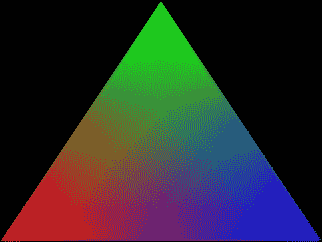
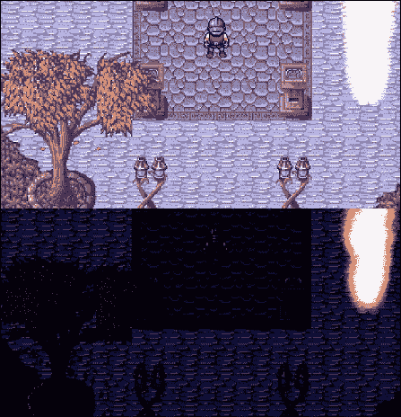

# 第六章. 添加一些收尾工作 - 使用着色器

对于任何游戏来说，拥有好的艺术作品都是重要的，因为它极大地补充了游戏设计师带来的内容。然而，仅仅将任何图形逻辑和逻辑结合起来，称之为一天的工作，已经不再足够了。现在，游戏的良好视觉美学是由出色的艺术和适当的后期处理共同合作形成的。将图形处理成剪纸的感觉已经过时，而将它们融入游戏世界的动态宇宙中，并确保它们通过适当的着色来对周围环境做出反应，已经成为新的标准。让我们暂时放下游戏玩法，讨论一下这种特殊类型的后期处理技术，即着色。

在本章中，我们将要介绍：

+   SFML 着色器类的基础

+   实现统一绘制对象的方式

+   为游戏添加日夜循环

让我们开始为我们的项目添加额外的图形增强吧！

# 理解着色器

在现代计算机图形的世界中，许多不同的计算都转移到了 GPU 上。从简单的像素颜色计算到复杂的照明效果，都可以并且应该由专门为此目的设计的硬件来处理。这就是着色器的作用所在。

**着色器**是一个在您的显卡上而不是 CPU 上运行的程序，它控制着形状的每个像素的渲染方式。正如其名所示，着色器的主要目的是执行照明和着色计算，但它们可以用于更多的事情。由于现代 GPU 的强大功能，存在一些库，它们旨在在 GPU 上执行通常在 CPU 上执行的计算，以显著减少计算时间。从物理计算到破解密码散列，任何东西都可以在 GPU 上完成，而进入这种强大马力的入口就是着色器。

### 小贴士

GPU 擅长同时并行执行大量非常具体的计算。在 GPU 上使用不可预测或不并行的算法非常低效，这正是 CPU 擅长的。然而，只要数据可以并行处理，这项任务就被认为值得推送到 GPU 进行进一步处理。

SFML 提供了两种主要的着色器类型：**顶点**和**片段**。SFML 的新版本（*2.4.0*及以上）还增加了对几何着色器的支持，但根据我们的目的，不需要涵盖这一点。

**顶点着色器**对每个顶点执行一次。这个过程通常被称为**顶点着色**。例如，任何给定的三角形有三个顶点。这意味着着色器将为每个顶点执行一次，总共执行三次。

**片段着色器**对每个像素（也称为片段）执行一次，这导致这个过程被称为**逐像素着色**。这比简单地执行逐顶点计算要耗费更多资源，但更准确，通常会产生更好的视觉效果。

这两种类型的着色器可以同时用于单个绘制的几何体上，并且还可以相互通信。

## 着色器示例

**OpenGL 着色语言**（**GLSL**）与*C*或*C++*非常相似。它甚至使用相同的基语法，如这个顶点着色器示例所示：

```cpp
#version 450 

void main() 
{ 
    gl_Position = gl_ProjectionMatrix * gl_ModelViewMatrix 
      * gl_Vertex; 
    gl_FrontColor = gl_Color; // Send colour to fragment shader. 
} 

```

注意第一行上的版本号。数字`450`表示应使用的 OpenGL 版本，在本例中为*4.5*。较新版本的 SFML 支持 OpenGL 版本*3.3+*；然而，运行它的成功也取决于您显卡的能力。

目前，只需忽略`main`函数的第一行。它与从一个坐标系到另一个坐标系的位移动作有关，并且特定于一些可能的着色方法。这些概念将在下一章中介绍。

GLSL 提供了许多允许直接控制顶点和像素信息的**钩子**，例如`gl_Position`和`gl_Color`。前者只是将在后续计算中使用的顶点位置，而后者是顶点颜色，它被分配给`gl_FrontColor`，确保颜色被传递到片段着色器中。

说到片段着色器，这里有一个非常简单的示例，它可能看起来是这样的：

```cpp
#version 450 

void main() 
{ 
    gl_FragColor = vec4(1.0, 1.0, 1.0, 1.0); // White pixel. 
} 

```

在这个特定的例子中，`gl_FragColor`用于设置正在渲染的像素的静态值。在使用此着色器渲染的任何形状都将呈现为白色。

### 注意

这个向量的值是归一化的，这意味着它们必须落在*0.f < n <= 1.0f*的范围内。

请记住，这里可以使用`gl_Color`来采样从顶点着色器传递下来的颜色。然而，由于顶点之间可能存在多个像素，每个片段的颜色都会进行插值。在一个三角形每个顶点被设置为红色、绿色和蓝色的情况下，插值结果将如下所示：



关于任何着色器需要注意的最后一点是，它们支持来自外部源通信。这是通过使用`uniform`关键字，后跟变量类型，并以其名称结尾来完成的：

```cpp
#version 450 
uniform float r; 
uniform float g; 
uniform float b; 

void main() 
{ 
    gl_FragColor = vec4(r, g, b, 1.0); 
} 

```

在这个特定的示例中，外部代码传入三个`float`，这些值将被用作片段的颜色值。统一体（Uniforms）仅仅是**全局**变量，可以在使用着色器之前由外部代码进行操作。

## SFML 和着色器

通过引入`sf::Shader`类，在 SFML 中存储和使用着色器变得简单。尽管大多数设备都支持着色器，但仍然是一个好主意，要检查正在执行代码的系统是否也支持着色器：

```cpp
if(!sf::Shader::isAvailable()){ // Shaders not available! } 

```

这个着色器类可以仅通过自身持有两种类型中的任何一种着色器，或者同时持有每种类型的一个实例。着色器可以通过两种方式之一加载。第一种是简单地读取一个文本文件：

```cpp
sf::Shader shader; // Create a shader instance. 

// Loading a single type of shader. 
if (!shader.loadFromFile("shader.vert", sf::Shader::Vertex)) { 
  // Failed loading. 
} 
// OR 
if (!shader.loadFromFile("shader.frag", sf::Shader::Fragment)) { 
  // Failed loading. 
} 

// load both shaders 
if (!shader.loadFromFile("shader.vert", "shader.frag")) { 
  // Failed loading. 
} 

```

### 注意

这些着色器的文件扩展名不必与前面的匹配。因为我们正在处理文本文件，扩展名只是为了清晰。

加载着色器的第二种方式是通过解析内存中加载的字符串：

```cpp
sf::Shader shader; 
const std::string code = "..."; 
// String that contains all shader code. 

```

```cpp
if (!shader.loadFromMemory(code, sf::Shader::Vertex)) { 
  // Failed loading. 
} 

```

使用着色器也很简单。其地址只需在渲染到它时作为第二个参数传递给渲染目标的`draw()`调用：

```cpp
window.draw(drawable, &shader); 

```

由于我们的着色器可能需要通过`uniform`变量进行通信，因此必须有一种方法来设置它们。进入`sf::Shader::setUniform(...)`：

```cpp
shader.setUniform("r",  0.5f); 

```

这段简单的代码操作了`shader`实例中加载的任何着色器中的`r`统一变量。该方法本身支持除了*float*之外许多其他类型，我们将在下一章中介绍。

# 本地化渲染

着色是一个强大的概念。目前向我们的游戏注入额外的图形华丽效果的唯一问题是它根本不是为高效使用着色器而设计的。我们大多数（如果不是所有）进行任何类型绘制的类都是通过直接访问`sf::RenderWindow`类来完成的，这意味着它们必须将它们自己的着色器实例作为参数传递。这既不高效，也不可重用，也不灵活。一个更好的方法，比如一个专门用于渲染的独立类，是必需的。

为了能够相对容易地在着色器之间切换，我们必须在类中正确地存储它们：

```cpp
using ShaderList = std::unordered_map<std::string, 
  std::unique_ptr<sf::Shader>>; 

```

由于`sf::Shader`类是一个不可拷贝的对象（继承自`sf::NonCopyable`），它被存储为唯一指针，从而避免了任何和所有的移动语义。这个着色器列表直接由将要执行所有渲染的类拥有，让我们看看它的定义：

```cpp
class Renderer { 
public: 
  Renderer(Window* l_window, bool l_useShaders = true); 

  void AdditiveBlend(bool l_flag); 
  bool UseShader(const std::string& l_name); 
  void DisableShader(); 
  sf::Shader* GetShader(const std::string& l_name); 

  void BeginDrawing(); 
  bool IsDrawing()const; 
  void Draw(const sf::Shape& l_shape, 
    sf::RenderTarget* l_target = nullptr); 
  void Draw(const sf::Sprite& l_sprite, 
    sf::RenderTarget* l_target = nullptr); 
  void Draw(const sf::Drawable& l_drawable, 
    sf::RenderTarget* l_target = nullptr); 
  void EndDrawing(); 
private: 
  void LoadShaders(); 

  Window* m_window; 
  ShaderList m_shaders; 
  sf::Shader* m_currentShader; 
  bool m_addBlend; 
  bool m_drawing; 
  bool m_useShaders; 
  unsigned int m_drawCalls; // For debug purposes. 
}; 

```

由于着色器需要作为参数传递给窗口的`draw()`调用，因此渲染器必须能够访问`Window`类。除了这些以及任何给定时间可以使用的着色器列表之外，我们还保留了对当前正在使用的着色器的指针，以减少容器访问时间，以及一些将在选择合适的着色器或确定是否正在绘制时使用的标志。最后，一个相当有用的调试特性是记录每次更新期间发生的绘制调用次数。为此，将使用一个简单的`unsigned integer`。

该类本身提供了启用/禁用加法混合而不是常规着色器的基本功能，在所有可用的着色器之间切换，禁用当前着色器以及获取它。`BeginDrawing()`和`EndDrawing()`方法将由`Window`类使用，以为我们提供有关渲染过程的信息的钩子。注意重载的`Draw()`方法。它被设计为接受任何可绘制类型，并将其绘制在当前窗口或作为第二个参数提供的适当渲染目标上。

最后，在类的初始化阶段将使用`LoadShaders()`私有方法。它包含加载每个着色器所需的所有逻辑，并将它们存储以供以后使用。

## 实现渲染器

让我们先快速回顾一下`Renderer`对象的构建以及所有数据成员的初始化：

```cpp
Renderer::Renderer(Window* l_window, bool l_useShaders) 
  : m_window(l_window), m_useShaders(l_useShaders), 
     m_drawing(false), m_addBlend(false), m_drawCalls(0), 
  m_currentShader(nullptr) {} 

```

一旦安全地存储了`Window*`实例的指针，这个类的所有数据成员都将初始化为其默认值。构造函数的主体仅由一个私有方法调用组成，负责实际加载和存储所有着色器文件：

```cpp
void Renderer::LoadShaders() { 
  if(!m_useShaders) { return; } 
  auto directory = Utils::GetWorkingDirectory() +"media/Shaders/"; 
  auto v_shaders = Utils::GetFileList(directory, "*.vert", false); 
  auto f_shaders = Utils::GetFileList(directory, "*.frag", false); 

  for (auto& shader : v_shaders) { 
    auto& file = shader.first; 
    auto name = file.substr(0, file.find(".vert")); 
    auto fragShader = std::find_if( 
      f_shaders.begin(), f_shaders.end(), 
      &name { 
        return l_pair.first == name + ".frag"; 
      } 
    ); 

    auto shaderItr = m_shaders.emplace(name, 
      std::move(std::make_unique<sf::Shader>())); 
    auto& shader = shaderItr.first->second; 
    if (fragShader != f_shaders.end()) { 
      shader->loadFromFile(directory + name + ".vert", 
        directory + name + ".frag"); 
      f_shaders.erase(fragShader); 
    } else { 
      shader->loadFromFile(directory + name + ".vert", 
        sf::Shader::Vertex); 
    } 
  } 

  for (auto& shader : f_shaders) { 
    auto& file = shader.first; 
    auto name = file.substr(0, file.find(".frag")); 
    auto shaderItr = m_shaders.emplace(name, 
      std::move(std::make_unique<sf::Shader>())); 
    auto& shader = shaderItr.first->second; 
    shader->loadFromFile(directory + name + ".frag", 
      sf::Shader::Fragment); 
  } 
} 

```

我们首先创建一个局部变量，用于保存我们的`shader`目录的路径。然后使用它来获取两个具有`.vert`和`.frag`扩展名的文件列表。这些将是将要加载的顶点和片段着色器。这里的目的是将具有相同名称的顶点和片段着色器分组，并将它们分配给`sf::Shader`的单个实例。任何没有顶点或片段对应物的着色器将单独加载到单独的实例中。

顶点着色器是一个很好的开始地方。在获取文件名并去除扩展名后，尝试找到具有相同名称的片段着色器。同时，一个新的`sf::Shader`实例被插入到着色器容器中，并获取对其的引用。如果找到了片段对应物，这两个文件都会被加载到着色器中。然后，片段着色器名称将从列表中移除，因为它将不再需要单独加载。

作为代码的第一部分负责所有的配对，此时真正需要做的只剩下加载片段着色器。可以安全地假设片段着色器列表中的任何内容都是一个独立的片段着色器，而不是与顶点着色器相关联。

由于着色器可能有需要初始化的统一变量，因此外部类需要能够访问它们所使用的着色器：

```cpp
sf::Shader* Renderer::GetShader(const std::string& l_name) { 
  if(!m_useShaders) { return nullptr;  } 
  auto shader = m_shaders.find(l_name); 
  if (shader == m_shaders.end()) { return nullptr; } 
  return shader->second.get(); 
} 

```

如果没有找到提供的名称的着色器，则返回`nullptr`。另一方面，从智能指针中获取`sf::Shader*`实例的原始指针并返回。

同样的外部类需要能够在特定着色器应该被使用时指导`Renderer`。为此，`UseShader()`方法派上了用场：

```cpp
bool Renderer::UseShader(const std::string& l_name) { 
  if(!m_useShaders) { return false; } 
  m_currentShader = GetShader(l_name); 
  return (m_currentShader != nullptr); 
} 

```

由于`GetShader()`方法已经为我们做了错误检查，因此在这里也使用了它。从它返回的值被存储为当前着色器的指针（如果有的话），然后对其进行评估以返回一个*布尔值*，表示成功/失败。

实际绘制几何图形是我们这里的主要内容，让我们来看看重载的`Draw()`方法：

```cpp
void Renderer::Draw(const sf::Shape& l_shape, 
  sf::RenderTarget* l_target) 
{ 
  if (!l_target) { 
    if (!m_window->GetViewSpace().intersects( 
      l_shape.getGlobalBounds())) 
    { return; } 
  } 
  Draw((const sf::Drawable&)l_shape, l_target); 
} 

void Renderer::Draw(const sf::Sprite& l_sprite, 
  sf::RenderTarget* l_target) 
{ 
  if (!l_target) { 
    if (!m_window->GetViewSpace().intersects( 
      l_sprite.getGlobalBounds())) 
    { return; } 
  } 
  Draw((const sf::Drawable&)l_sprite, l_target); 
} 

```

不论是渲染`sf::Sprite`还是`sf::Shape`，背后的实际想法是完全相同的。首先，我们检查方法调用背后的意图是否确实是为了渲染到主窗口，通过查看`l_target`参数。如果是这样，这里一个合理的事情是确保可绘制对象实际上是在屏幕上的。如果不在，绘制它就没有意义。如果测试通过，主`Draw()`方法重载将被调用，并将当前参数传递下去：

```cpp
void Renderer::Draw(const sf::Drawable& l_drawable, 
  sf::RenderTarget* l_target) 
{ 
  if (!l_target) { l_target = m_window->GetRenderWindow(); } 
  l_target->draw(l_drawable, 
    (m_addBlend ? sf::BlendAdd : m_currentShader && m_useShaders ? 
      m_currentShader : sf::RenderStates::Default)); 
  ++m_drawCalls; 
} 

```

这里发生所有的实际魔法。再次检查`l_target`参数是否等于`nullptr`。如果是，渲染窗口将被存储在参数指针中。无论目标是什么，此时它的`Draw()`方法将被调用，将可绘制对象作为第一个参数传递，以及适当的着色器或混合模式作为第二个参数传递。显然，加法混合在这里具有优先权，通过简单地使用`AdditiveBlend()`方法，可以更快地在使用着色器和加法混合模式之间切换。

绘制完成后，`m_drawCalls`数据成员将增加，这样我们就可以在每次循环结束时跟踪总共渲染了多少个可绘制对象。

最后，我们可以通过查看一些基本但重要的 setter/getter 代码来结束这个类的封装：

```cpp
void Renderer::AdditiveBlend(bool l_flag) { m_addBlend = l_flag; } 
void Renderer::DisableShader() { m_currentShader = nullptr; } 
void Renderer::BeginDrawing(){ m_drawing = true; m_drawCalls = 0;} 
bool Renderer::IsDrawing() const { return m_drawing; } 
void Renderer::EndDrawing() { m_drawing = false; } 

```

如您所见，禁用当前绘制内容的着色器使用只需将`m_currentShader`数据成员设置为`nullptr`。还要注意`BeginDrawing()`方法。它方便地重置了`m_drawCalls`计数器，这使得管理起来更容易。

# 集成 Renderer 类

如果`Renderer`类不在适当的位置或根本不被使用，那么甚至没有拥有它的意义。由于它的唯一任务是使用正确的效果在屏幕上绘制东西，因此它合适的地点应该是`Window`类内部：

```cpp
class Window{ 
public: 
  ... 
  Renderer* GetRenderer(); 
  ... 
private: 
  ... 
  Renderer m_renderer; 
}; 

```

由于外部类也依赖于它，因此提供一个用于轻松检索此对象的 getter 方法是个好主意。

实际将其集成到其余代码中出奇地简单。一个不错的开始是让`Renderer`类访问`Window`类，如下所示：

```cpp
Window::Window(...) : m_renderer(this, l_useShaders) { ... } 

```

渲染器也有用于知道何时开始和结束绘图过程的钩子。幸运的是，`Window`类已经支持这个想法，所以实际上很容易利用它：

```cpp
void Window::BeginDraw() { 
  m_window.clear(sf::Color::Black); 
  m_renderer.BeginDrawing(); 
} 
void Window::EndDraw() { 
  m_window.display(); 
  m_renderer.EndDrawing(); 
} 

```

最后，为了使用最新的 OpenGL 版本，需要指示窗口创建最新可用的上下文版本：

```cpp
void Window::Create() { 
  ... 
  sf::ContextSettings settings; 
  settings.depthBits = 24; 
  settings.stencilBits = 8; 
  settings.antialiasingLevel = 0; 
  settings.majorVersion = 4;
  settings.minorVersion = 5;
  m_window.create(sf::VideoMode(m_windowSize.x, m_windowSize.y, 
    32), m_windowTitle, style, settings); 
  if (!m_shadersLoaded) { 
    m_renderer.LoadShaders(); 
    m_shadersLoaded = true; 
  } 
} 

```

注意这段代码末尾的着色器加载部分。`Renderer`类被指示加载指定目录中可用的着色器，前提是首先使用着色器。这些几个简单的添加完成了`Renderer`类的集成。

## 适配现有类

到目前为止，在屏幕上渲染某物就像将其作为可绘制对象传递给`Window`类的`Draw()`方法一样简单。虽然这对小型项目来说很好，但这对我们来说是个问题，因为它严重限制了着色器的使用。一个很好的升级方法是简单地接受`Window`指针：

```cpp
class ParticleSystem : ... { 
public: 
  ... 
  void Draw(Window* l_window, int l_elevation); 
}; 

class S_Renderer : ... { 
public: 
  ... 
  void Render(Window* l_wind, unsigned int l_layer); 
}; 

class SpriteSheet{ 
public: 
  ... 
  void Draw(Window* l_wnd); 
}; 

```

让我们逐一查看这些类，看看为了添加对着色器的适当支持需要做哪些更改。

### 更新粒子系统

回到第三章，*让天下雨！ - 构建粒子系统*，我们已经在不知情的情况下使用了一定数量的着色技巧！用于火焰效果的添加混合是一个很好的特性，为了保留它而无需为它编写单独的着色器，我们可以简单地使用`Renderer`类的`AdditiveBlend()`方法：

```cpp
void ParticleSystem::Draw(Window* l_window, int l_elevation) { 
  ... 
  auto state = m_stateManager->GetCurrentStateType(); 
  if (state == StateType::Game || state == StateType::MapEditor) { 
    renderer->UseShader("default"); 
  } else { 
    renderer->DisableShader(); 
  } 

  for (size_t i = 0; i < container->m_countAlive; ++i) { 
    ... 
    renderer->AdditiveBlend(blendModes[i]); 
    renderer->Draw(drawables[i]); 
  } 
  renderer->AdditiveBlend(false); 
} 

```

首先，注意检查当前应用程序的状态。目前，我们实际上并不需要在`Game`或`MapEditor`以外的任何状态中使用着色器。只要我们处于其中之一，就使用默认的着色器。否则，着色器将被禁用。

当处理实际粒子时，会调用`AdditiveBlend()`方法，并将混合模式标志作为其参数传递，要么启用要么禁用它。然后粒子可绘制对象将在屏幕上绘制。处理完所有粒子后，将关闭添加混合。

### 更新实体和地图渲染

默认着色器不仅在渲染粒子时使用。实际上，我们希望至少在一定程度上能够将统一的着色应用到所有世界对象上。让我们从实体开始：

```cpp
void S_Renderer::Render(Window* l_wind, unsigned int l_layer) 
{ 
  EntityManager* entities = m_systemManager->GetEntityManager(); 
  l_wind->GetRenderer()->UseShader("default"); 
  for(auto &entity : m_entities) { 
    ... 
    drawable->Draw(l_wind); 
  } 
} 

void SpriteSheet::Draw(Window* l_wnd) { 
  l_wnd->GetRenderer()->Draw(m_sprite); 
} 

```

对渲染系统的唯一真正改变是调用`UseShader()`方法，以及将`Window`类的指针作为参数传递给精灵图集的`Draw()`调用，而不是通常的`sf::RenderWindow`。反过来，`SpriteSheet`类也被修改为使用`Renderer`类，尽管它实际上并不与或修改着色器进行交互或修改。

游戏地图也应该以完全相同的方式进行着色：

```cpp
void Map::Draw(unsigned int l_layer) { 
  if (l_layer >= Sheet::Num_Layers) { return; } 
  ... 
  m_window->GetRenderer()->UseShader("default"); 
  m_window->GetRenderer()->Draw(m_layerSprite); 
} 

```

这里唯一的真正区别是`Map`类已经内部访问了`Window`类，因此不需要将其作为参数传递。

# 创建昼夜循环

在我们的游戏中统一多个不同世界对象的着色，为我们提供了一个非常优雅的方式来操纵场景的实际表示方式。现在可以实现许多有趣的效果，但我们将专注于一个相对简单而有效的一种光照。关于光照主题的实际微妙之处将在后面的章节中介绍，但我们现在可以构建一个系统，使我们能够根据当前的时间来以不同的方式着色世界，如下所示：



如你所见，这种效果可以为游戏增添很多，使其感觉非常动态。让我们看看它是如何实现的。

## 更新`Map`类

为了准确表示昼夜循环，游戏必须保持一个时钟。因为它与世界相关，所以跟踪这些信息的最佳位置是`Map`类：

```cpp
class Map : ... { 
  ... 
protected: 
  ... 
  float m_gameTime; 
  float m_dayLength; 
}; 

```

为了拥有动态和可定制的代码，存储了两个额外的数据成员：当前游戏时间和一天的总长度。后者允许用户创建具有可变一天长度的地图，这可能为游戏设计师提供一些有趣的机会。

使用这些值相当简单：

```cpp
void Map::Update(float l_dT) { 
  m_gameTime += l_dT; 
  if (m_gameTime > m_dayLength * 2) { m_gameTime = 0.f; } 
  float timeNormal = m_gameTime / m_dayLength; 
  if(timeNormal > 1.f){ timeNormal = 2.f - timeNormal; } 
   m_window->GetRenderer()->GetShader("default")-> 
    setUniform("timeNormal", timeNormal); 
} 

```

实际游戏时间首先通过添加帧时间来操作。然后检查它是否超过了天数长度的两倍，在这种情况下，游戏时间被设置为`0.f`。这种关系表示一天长度和夜晚长度之间的 1:1 比例。

最后，为了确保光线在白天和夜晚之间正确地渐变，我们建立了一个名为`timeNormal`的局部变量，并使用它来计算应该投射到场景中的黑暗量。然后检查它是否超过了`1.f`的值，如果是，则将其调整以开始向下移动，表示从黑暗到黎明的渐变。然后将该值传递给默认的着色器。

### 注意

重要的是要记住，着色器大多数时候都使用归一化值。这就是我们努力提供介于`0.f`到`1.f`之间的值的原因。

最后一部分实际上是初始化我们的两个额外数据成员到它们的默认值：

```cpp
Map::Map(...) : ..., m_gameTime(0.f), m_dayLength(30.f) 
{ ... } 

```

如您所见，我们给白天长度赋值为 `30.f`，这意味着全天/夜间周期将持续一分钟。这显然对游戏来说不会很有用，但在测试着色器时可能会派上用场。

## 编写着色器

将所有 *C++* 代码移除后，我们终于可以专注于 GLSL。让我们首先实现默认的顶点着色器：

```cpp
#version 450 
void main() 
{ 
  // transform the vertex position 
  gl_Position = gl_ModelViewProjectionMatrix * gl_Vertex; 

  // transform the texture coordinates 
  gl_TexCoord[0] = gl_TextureMatrix[0] * gl_MultiTexCoord0; 

  // forward the vertex color 
  gl_FrontColor = gl_Color; 
} 

```

这与本章介绍阶段所使用的例子并无不同。现在添加顶点着色器的目的只是为了避免将来在需要对其进行操作时再次编写它。话虽如此，让我们继续转向片段着色器：

```cpp
#version 450 
uniform sampler2D texture; 
uniform float timeNormal; 

void main() 
{ 
  // lookup the pixel in the texture 
  vec4 pixel = texture2D(texture, gl_TexCoord[0].xy); 
  if(pixel == vec4(0.0, 0.0, 0.0, 1.0)) 
    pixel = vec4(1.0, 1.0, 1.0, 1.0); 

  // multiply it by the color 
  gl_FragColor = gl_Color * pixel; 
  gl_FragColor[0] -= timeNormal; 
  gl_FragColor[1] -= timeNormal; 
  gl_FragColor[2] -= timeNormal; 
  gl_FragColor[2] += 0.2; 
} 

```

### 注意

在这个例子中，`sampler2D` 类型仅仅是 SFML 传递给着色器的纹理。其他纹理也可以通过使用 `shader.setUniform("texture", &texture);` 调用手动传递给着色器。

为了正确绘制一个像素，片段着色器需要采样当前绘制对象的纹理。如果正在绘制一个简单的形状，则检查从纹理中采样的像素是否完全为黑色。如果是这样，它就简单地被设置为白色像素。除此之外，我们还需要之前讨论过的 `timeNormal` 值。在采样当前纹理的当前像素之后，它被乘以从顶点着色器传入的颜色，并存储为 `gl_FragColor`。然后从所有三个颜色通道中减去 `timeNormal` 值。最后，在像素的末尾添加一点蓝色调。这给我们的场景添加了蓝色调，纯粹是一个美学选择。

# 摘要

许多人认为图形应该是一个游戏开发者次要的关注点。虽然很明显，项目的视觉方面不应该成为其主要关注点，但视觉效果可以比仅仅作为漂亮的背景更有助于玩家。图形增强甚至可以通过让玩家更加沉浸在环境中、使用巧妙的视觉提示或简单地控制整体氛围和气氛来更好地讲述故事。在本章中，我们迈出了建立系统的第一步，该系统将成为征服特效世界时的巨大助手。

在下一章中，我们将深入探讨图形增强的底层。那里见！
