# 第七章. 一步一步前进，一层层深入 - OpenGL 基础

很多人往往容易将像 SFML 这样的库视为理所当然。毕竟，它提供的想法和概念看起来相当直观。构建一些相对简单的东西可能只需要几分钟，而且没有太多头疼的问题需要处理。在一个完美的世界里，我们可以将那些麻烦推给其他人，并简单地依赖越来越高的抽象层次来完成工作。然而，当某些限制让我们一头撞进砖墙时会发生什么呢？为了知道如何绕过它们，有必要了解 SFML 建立在其基础上的基本原理。换句话说，在那个时刻，向下是唯一的出路。

在本章中，我们将介绍：

+   使用 SFML 窗口设置和使用 OpenGL

+   形成并向 GPU 提交数据

+   创建、构建和使用着色器进行渲染

+   将纹理应用到几何体上

+   查看各种坐标系和模型变换

+   实现摄像机

这是一份相当长的待办事项清单，所以我们不要浪费时间，直接开始吧！

# 版权资源的使用

像往常一样，让我们承认那些应该得到认可的人，并给予应有的赞誉。以下是本章使用的资源：

+   由 `texturelib.com` 在 CC0 许可下提供的旧墙纹理：[许可：http://texturelib.com/texture/?path=/Textures/brick/medieval/brick_medieval_0121](http://texturelib.com/texture/?path=/Textures/brick/medieval/brick_medieval_0121)

+   由 *Sean Barrett* 在 CC0 许可下提供的 STB 公共领域图像加载器：[`github.com/nothings/stb/blob/master/stb_image.h`](https://github.com/nothings/stb/blob/master/stb_image.h)

# 设置 OpenGL

+   为了访问最新的 OpenGL 版本，我们需要下载两个库。一个是名为 OpenGL Extension Wrangler Library 的库。它加载并使目标平台上支持的所有 OpenGL 扩展可用。该库可以从以下位置下载 [`glew.sourceforge.net/`](http://glew.sourceforge.net/)。

+   我们还需要另一个名为 OpenGL Mathematics 或 GLM 的库。这是一个仅包含头文件的库，它添加了许多额外的数据类型和函数，这些在大多数情况下都很有用。从简单的向量数据类型到用于计算叉积的函数，这个库都添加了进来。它可以在以下位置找到 [`glm.g-truc.net/0.9.8/index.html`](http://glm.g-truc.net/0.9.8/index.html)。

## 设置 Visual Studio 项目

除了我们仍然需要用于创建窗口的常用 SFML 包含文件外，我们还需要在 **VC++ Directories** 下的 **Include Directories** 字段中添加 GLEW 和 GLM 的 `include` 文件夹。

在**链接器**下的**通用**部分，必须将 GLEW 的**附加库目录**也添加进去。库文件位于`Release`文件夹中，该文件夹包含几个目录：`Win32`和`x64`。这些需要为不同的构建配置正确设置。

最后，必须在**链接器**下的**输入**部分的**附加依赖**字段中添加`glew32.lib`文件，以及`OpenGL32.lib`文件。它可以静态链接，在这种情况下，需要添加`glew32s.lib`而不是常规的`glew32.lib`。如果静态链接，还需要在**C/C++**下的**预处理器**部分添加`GLEW_STATIC`的**预处理器定义**。

# 使用 GLEW

如果我们要使用 OpenGL，我们首先需要的是一个窗口。幸运的是，窗口创建不是 OpenGL 特有的，因此可以使用几乎任何支持它的库来创建一个窗口，包括 SFML。为了我们的目的，我们将重用 Window 类并对它进行一些小的调整，包括实际的 SFML 窗口类型：

```cpp
class GL_Window { 
  ... 
private: 
  ... 
  sf::Window m_window; 
  ... 
}; 

```

注意`m_window`数据成员的数据类型。如果实际没有使用 SFML 来绘制任何内容，我们不需要`sf::RenderWindow`的实例，而是可以使用`sf::Window`。这意味着任何与实际窗口无关的任务都必须单独处理。这甚至包括清除窗口：

```cpp
void GL_Window::BeginDraw() { 
  glClearColor(0.f, 0.f, 0.f, 1.f); // BLACK 
  glClear(GL_COLOR_BUFFER_BIT); 
} 

```

在这里，我们可以看到我们将要使用的第一个两个 GL 函数。因为 GLEW 是一个 C API，所以看起来像这样的代码将会很常见。没有类需要管理，因为每个任务都是通过函数调用和共享状态来执行的。以我们的第一个函数`glClearColor()`为例，它实际上设置了屏幕清除时使用的颜色，包括 alpha 通道。

### 注意

这个特定的函数，以及许多其他函数，接受一个所谓的**归一化**向量。当表示比例时很有用。例如，将屏幕清除到紫色意味着传递值*0.5f*作为第一个和第三个参数，这意味着颜色的一半是红色，另一半是蓝色。

第二个函数调用实际上使用存储的值执行清除。它接受一个参数，本质上只是一个位掩码，使用`#define`预处理器指令定义。这个特定的实现细节允许通过使用**位或**操作（用管道符号*|*表示）将更多的掩码传递给函数调用。我们最终会回顾这个概念。

在处理完这些之后，让我们实际创建窗口并初始化`GLEW`库：

```cpp
Game::Game() : m_window("Chapter 7", sf::Vector2u(800, 600)) 
{ 
  ... 
  std::cout << glGetString(GL_VERSION) << std::endl; 
  GLenum status = glewInit(); 
  if (status != GLEW_OK) { 
    std::cout << "GLEW failed!" << std::endl; 
  } 
  ... 
} 

```

为了初始化 GLEW，我们只需要调用一个函数`glewInit()`。它返回一个值，表示操作的成功或失败。另一个有用的函数是`glGetString()`。它返回一个静态字符串，表示在执行该字符串的计算机上支持的 OpenGL 版本的具体信息。在这种情况下，我们特别想检查 OpenGL 的版本并将其打印出来，但它也可以用来确定 OpenGL 扩展、支持的 GLSL 版本、硬件渲染平台的名称等等。

# 渲染管线

在屏幕上绘制东西时，必须遵循一定的步骤来提交几何形状，将其转换为像素，并适当地着色。这个特定的步骤序列通常被称为**渲染管线**。其工作方式完全取决于你使用的 OpenGL 版本。低于*3.0*的版本使用所谓的**固定功能管线**，而*3.0+*的新 OpenGL 版本使用**可编程管线**。前者现在已弃用，被称为**传统**OpenGL，而后者被广泛使用和应用，甚至在移动设备上，已成为标准。

## 固定功能管线

实际上，使用固定功能管线在屏幕上绘制东西比现代方法要简单得多，但这也需要付出代价。考虑以下示例：

```cpp
glBegin(GL_TRIANGLES); 

glColor3f(1.0f, 0.0f, 0.0f); // Red 
glVertex3f(-0.5f, -0.5f, 0.5f); 

glColor3f(0.0f, 1.0f, 0.0f); // Green 
glVertex3f(-0.5f, 0.5f, 0.5f); 

glColor3f(0.0f, 0.0f, 1.0f); // Blue 
glVertex3f(0.5f,  0.5f, 0.5f); 

glEnd(); 

```

这段特定的代码非常易于阅读，这是传统方法的一个优点。我们首先调用`glBegin()`方法并传入一个值，这个值表示实际顶点在提交时应如何被解释。我们正在处理三角形，这意味着每行提交的前三个顶点将被连接并形成一个三角形。注意`glColor3f`的调用。顶点的颜色在提交时设置，同样也可以对纹理坐标进行相同的操作。最后调用`glEnd()`方法将所有提交的数据刷新到 GPU 进行渲染。

虽然这对新手来说非常易于阅读和理解，但顶点数据必须每帧重新提交到 GPU，这会严重影响性能。小型应用程序可能不会注意到差异，但提交大量原语后的内存传输开销确实开始累积。

这种方法的另一个问题是它的局限性。某些效果，如果可能的话，使用固定功能管线实现可能会非常慢。

## 可编程管线

对于小任务来说，使用可编程管线要复杂得多，但对于大型项目来说却非常有价值。就像固定功能管线一样，有一些步骤是静态的且不会改变。然而，可编程管线确实提供了一种方法来定制提交给 GPU 的数据的处理方式。这就是**着色器**的用武之地。着色器已经在上一章中简要介绍过；然而，它们还有很多尚未解释的内容。它们是可以用类似 C 的语言编写的程序，可以在 GPU 上而不是 CPU 上执行。实际上，着色器用于定制可编程管线的一部分。考虑以下图示：

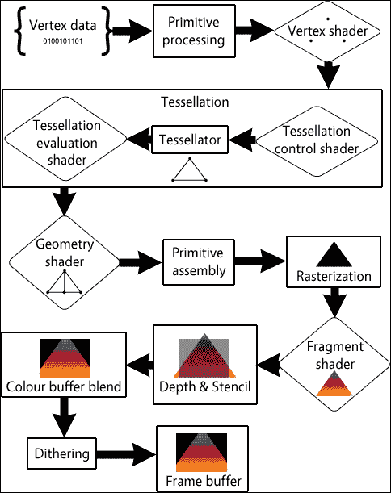

就像固定功能管线一样，顶点数据被提交到 GPU。然而，这些数据并不是每帧都重新提交。相反，顶点数据存在于 GPU 上，当需要渲染时可以引用。一旦调用绘制特定顶点集，它们就会被传递进来进行处理，并传递给顶点着色器。

**顶点着色器**是管线中少数可编程部分之一。它通常用于计算顶点在适当的坐标系中的位置，并将这些顶点传递到管线中以便进一步处理。

**镶嵌**阶段本质上负责将我们现有的几何形状细分为更小的基本形状。它实际上连接了顶点并将这些基本形状进一步传递到管线中。在这个阶段有两个着色器可以编写和使用；然而，我们不会这么做。

所有基本形状数据随后被传递到**几何着色器**，就像两个镶嵌着色器一样，它是可选的。它可以用来从现有几何形状生成更多顶点。

在基本形状被正确组装后，它们会被进一步传递并由光栅器处理。

**光栅化**是将顶点和基本形状信息转换为像素数据的过程。然后这些像素被进一步传递到管线中。

这个管线的最后一个可编程部分接收来自前一阶段的全部像素信息。它被称为**片段着色器**（即像素着色器），可以用来确定我们正在渲染的几何形状中每个单独像素的值。从分配特定颜色到实际采样纹理的像素，这一阶段都会完成。然后这些像素被进一步推送到其他阶段进行处理。

**深度与模板**阶段执行各种测试，以剪裁不应在屏幕上绘制的无需像素。如果一个像素在窗口区域之外，甚至在其他几何形状之后，它在这个阶段就会被丢弃。

未裁剪的像素随后被混合到现有的帧缓冲区中，用于在屏幕上绘制一切。然而，在混合之前，**抖动**过程发生，确保如果渲染图像的精度低于或高于我们拥有的值，像素被正确地四舍五入。

虽然一开始可能难以理解这个概念，但可编程管线是现代渲染的优越方法。在所有这些阶段中，我们实际上只需要编写顶点和片段着色器就可以开始。我们很快就会介绍这一点。

# 存储和绘制原语

我们的所有原语数据都必须表示为一组顶点。无论我们是在处理屏幕上的三角形或精灵，还是处理一个巨大的、复杂的怪物模型，它们都可以分解为这种基本类型。让我们看看一个表示它的类：

```cpp
enum class VertexAttribute{ Position, COUNT }; 

struct GL_Vertex { 
  GL_Vertex(const glm::vec3& l_pos): m_pos(l_pos) {} 

  glm::vec3 m_pos; // Attribute 1\. 
  // ... 
}; 

```

如你所见，它只是一个简单的`struct`，它包含一个表示位置的 3D 向量。稍后，我们可能想要存储有关顶点的其他信息，例如纹理坐标、其颜色等等。关于特定顶点的这些不同信息通常被称为**属性**。为了方便起见，我们还枚举了不同的属性，以使我们的代码更加清晰。

## 顶点存储

在任何原语可以绘制之前，其数据必须在 GPU 上存储。在 OpenGL 中，这项任务是通过利用**顶点数组对象**（**VAO**）和**顶点缓冲对象**（**VBO**）来完成的。

顶点缓冲对象可以简单地理解为在 GPU 上分配的空间，用于存储数据。这些数据可以是任何东西。它可以是顶点位置、颜色、纹理坐标等等。我们将使用 VBO 来存储所有我们的原语信息。

顶点数组对象就像 VBO 的父对象，甚至可以是一个或多个 VBO。它存储有关 VBO 内部数据如何访问的信息，如何将信息传递到各种着色器阶段，以及许多其他细节，这些细节共同形成状态。如果 VBO 是实际的数据池，VAO 可以被视为访问该数据的指令集。

VAO 和 VBO 实例都通过简单的整数来标识，这些整数在空间分配后返回。这些整数将被用来区分不同的缓冲区和数组对象。

## 模型类

在处理完这些信息后，我们终于可以着手实现模型类了！在我们的情况下，模型是任何可以形成形状的三角形集合。有了足够的三角形，任何形状都可以建模。让我们看看类的头文件：

```cpp
class GL_Model { 
public: 
  GL_Model(GL_Vertex* l_vertices, unsigned int l_vertCount); 
  ~GL_Model(); 

  void Draw(); 
private: 
  GLuint m_VAO; 
  GLuint m_vertexVBO; 
  unsigned int m_drawCount; 
}; 

```

如你所见，它相当简单。构造函数目前接受两个参数：一个指向顶点第一个实例的指针，以及我们实际提交的顶点数量。这使得我们可以快速从简单的顶点数组中加载模型，尽管这可能不是加载更复杂网格的最佳方式。

注意，该类还有一个`Draw()`方法，稍后将会使用它将顶点提交到渲染管线并开始绘制过程。

最后，我们有两种*GL 无符号整数*类型：`m_VAO`和`m_vertexVBO`。这些整数将引用与该模型一起使用的实际顶点数组对象以及用于存储所有顶点信息的顶点缓冲对象。我们还有一个*无符号整数*，`m_drawCount`，它将存储特定模型中顶点的数量，以便绘制它们。

### 实现模型类

在处理完这些之后，让我们开始分配和填充我们的数据结构！`GL_Model`类的构造函数将帮助我们完成这项任务：

```cpp
GL_Model::GL_Model(GL_Vertex* l_vertices, 
  unsigned int l_vertCount) 
{ 
  m_drawCount = l_vertCount; 

  glGenVertexArrays(1, &m_VAO); 
  glBindVertexArray(m_VAO); 
  glGenBuffers(1, &m_vertexVBO); 

  glBindBuffer(GL_ARRAY_BUFFER, m_vertexVBO); 
  glBufferData(GL_ARRAY_BUFFER, 
    l_vertCount * sizeof(l_vertices[0]), 
    l_vertices, GL_STATIC_DRAW); 
  glEnableVertexAttribArray( 
    static_cast<GLuint>(VertexAttribute::Position)); 
  glVertexAttribPointer( 
    static_cast<GLuint>(VertexAttribute::Position), 3, GL_FLOAT, 
    GL_FALSE, 0, 0); 

  glBindVertexArray(0); 
} 

```

我们首先将顶点数量复制到`m_drawCount`数据成员中。这将在稍后变得很有用，因为我们需要确切知道在渲染之前需要绘制多少个顶点。然后使用`glGenVertexArrays`函数为 VAO 分配一些空间。它的第一个参数是需要创建的对象数量，而第二个参数是一个指向将要存储返回标识符的变量的指针。

下一个函数调用，`glBindVertexArray()`，实际上是通过提供的标识符启用一个顶点数组对象，这样任何在此之后的函数调用都会修改作为参数传入的顶点数组对象。从这一点开始，任何对顶点数组对象的操作都将在这个具有标识符`m_VAO`的 VAO 上执行。

### 注意

由于 GLEW 是一个 C API，绑定和解绑的概念在它的大多数方面都占主导地位。为了修改或与 GPU 上存在的数据进行任何操作，必须首先绑定适当的缓冲区。

就像 VAO 一样，顶点缓冲对象也需要生成。`glGenBuffers`函数正是用来做这个的。在这种情况下，我们只需要一个缓冲对象，这就是第一个参数所表示的。一旦生成，就像 VAO 一样，我们需要绑定到这个缓冲区以便修改它。这就是`glBindBuffer`函数发挥作用的地方。因为它被绑定，我们还需要指定我们将要将其视为哪种类型的缓冲区。因为我们只想有一个数据数组，所以使用`GL_ARRAY_BUFFER`。

现在我们已经创建了一个缓冲区，我们可以向其中推送一些数据了！调用`glBufferData`函数正是如此。第一个参数，就像之前的函数一样，决定了我们正在处理哪种类型的缓冲区。第二个参数是我们想要提交的数据块的字节大小，OpenGL 需要知道这一点，以便为缓冲区分配足够的空间来存储所有数据。在这种情况下，它只是顶点数量的乘积乘以第一个元素占用的字节数。第三个参数是指向我们想要提交的实际数据结构的指针。读取多少数据由第二个参数确定，在这种情况下，是全部。最后，最后一个参数用作 OpenGL 管理数据存储的提示，以便尽可能高效地根据其使用情况。它根据我们如何使用它来存储数据的方式不同。`GL_STATIC_DRAW`表示我们不会修改数据，因此它可以以最有效的方式存储数据。

在所有数据缓冲后，我们可以再次开始使用 VAO，并给它提供有关如何访问顶点信息的信息。因为顶点位置必须传递给片段着色器，所以我们需要将其作为属性启用，并在 VAO 中存储有关其处理方式的信息。这就是`glEnableVertexAttribArray()`和`glVertexAttribPointer()`函数发挥作用的地方。

前者函数简单地启用某个属性以便由顶点着色器使用。`VertexAttribute::Position`计算结果为`0`，所以顶点着色器中的*0th*属性被启用以供使用。然而，后者实际上指定了在数据被传递到顶点着色器之前如何读取和处理这些数据。在这种情况下，*0th*属性被定义为三个变量的集合，它们都是浮点数。下一个参数在我们在将数据发送到顶点着色器之前想要归一化数据时可能很有用。在这种情况下，我们不需要这样做，所以传入`GL_FALSE`。最后两个参数是我们对缓冲区中感兴趣的数据的字节步长和字节偏移量。因为我们到目前为止只存储了`GL_Vertex`结构中的顶点位置，所以这两个值都是`0`。然而，如果我们有更多的属性会发生什么？考虑以下图表：


假设我们有一个缓冲区内的所有数据，这在前面的示例中已经展示过。对于其中的每个顶点，其位置后面跟着其颜色，然后是另一个顶点的位置。如果我们只想过滤出位置数据，例如，步长和偏移量可以非常有用。步长参数是从一个数据段的开头跳到另一个数据段的开头所需的字节数。实际上，步长可以被视为整个顶点数据结构的大小，在这个例子中，是位置向量和颜色向量大小的总和。简单来说，它是从一个顶点的开头到另一个顶点开头的字节数。

相反，偏移量只是我们需要从正在读取的结构的开头移动的字节数，以便到达所需的元素。访问颜色元素意味着偏移量必须是位置向量的大小。简单来说，偏移量是从结构开头到所需元素开头的字节数。

在我们的数据提交并计入之后，我们可以再次使用`glBindVertexArray`来绑定到*0*，这表明我们已经完成了 VAO 的操作。

所有这些分配的数据实际上在不再需要时都必须被释放。析构函数可以在这里帮助我们：

```cpp
GL_Model::~GL_Model() { 
  glDeleteBuffers(1, &m_vertexVBO); 
  glDeleteVertexArrays(1, &m_VAO); 
} 

```

首先，需要释放顶点缓冲对象。我们向`glDeleteBuffers`函数传递 VBO 的数量以及第一个标识符的指针，该函数会清除 GPU 上的所有缓冲数据。VAO 随后遵循类似的程序。

最后，我们可以实现我们的`Model`类的`Draw`方法：

```cpp
void GL_Model::Draw() { 
  glBindVertexArray(m_VAO); 
  glDrawArrays(GL_TRIANGLES, 0, m_drawCount); 
  glBindVertexArray(0); 
} 

```

在绘制任何东西之前，我们需要指定管线应该使用哪些数据。所有的顶点信息都安全地存储在我们的缓冲对象中，该对象由 VAO 管理，所以我们将其绑定。然后调用`glDrawArrays`函数。正如其名称所示，它绘制顶点数组。它的第一个参数是我们想要绘制的原语类型，在这个例子中是三角形。线条、点和其他类型也可以这样绘制。第二个参数是缓冲数组对象内的起始索引。由于我们想要从开始绘制一切，所以这个值被设置为*0*。最后，传递要绘制的顶点数量。对这个函数的调用实际上启动了渲染管线，将所有顶点数据发送到顶点着色器。最后的调用是`glBindVertexArray()`函数，它只是简单地解绑我们的 VAO。

# 使用着色器

可编程管道的标准化现在意味着必须为某些任务编写着色器，包括基本任务。这意味着仅仅提交我们的顶点数据并渲染它将不会产生任何效果，因为渲染管线中的两个基本部分，即顶点着色器和片段着色器，是不存在的。在本节中，我们将介绍着色器是如何被加载、构建并应用到我们的虚拟几何形状上的，从而在屏幕上产生那些辉煌的像素。

## 加载着色器文件

在我们能够使用着色器之前，我们首先需要讨论它们是如何被加载的。技术上，我们只需要一个字符串，其中包含着色器所有的代码。可以编写一个非常简单的辅助函数来解析文件，并将其作为字符串返回，如下所示：

```cpp
inline std::string ReadFile(const std::string& l_filename) { 
  std::ifstream file(l_filename); 
  if (!file.is_open()) { return ""; } 
  std::string output; 
  std::string line; 
  while (std::getline(file, line)) { 
    output.append(line + "\n"); 
  } 
  file.close(); 
  return output; 
} 

```

当涉及到文件读取和解析时，这并不是我们第一次看到。创建一个字符串，然后逐行读取文件内容并将其追加到字符串中，最后返回。

## 创建着色器程序

OpenGL 着色器本身是渲染管线中使用的程序的一部分。如果我们有一个想要使用的顶点着色器和片段着色器，这两个着色器实际上会被合并成一个程序，然后绑定到管线中，以便在正确的时间使用适当的着色器。这一点很重要，因为它决定了`GL_Shader`数据结构的构建方式：

```cpp
enum class ShaderType{ Vertex, Fragment, COUNT }; 

class GL_Shader { 
public: 
  GL_Shader(const std::string& l_fileName); 
  ~GL_Shader(); 

  void Bind() const; 
private: 
  static void CheckError(GLuint l_shader, GLuint l_flag, 
    bool l_program, const std::string& l_errorMsg); 
  static GLuint BuildShader(const std::string& l_src, 
    unsigned int l_type); 

  GLuint m_program; 
  GLuint m_shader[static_cast<unsigned int>(ShaderType::COUNT)]; 
}; 

```

首先，我们列举出我们将要使用的着色器类型。对于基本用途来说，顶点着色器和片段着色器已经足够了。

类的构造函数接受将要加载的着色器（们）的文件名。还有一个`Bind()`方法，它将在渲染开始之前用于启用特定的着色器程序。

我们还有两个静态辅助方法，用于在着色器内部打印错误，并实际构建它们。是的，着色器在使用之前需要编译和链接，就像 C/C++一样。

最后，我们需要两个*GL 无符号整数*数据成员，后者是一个数组。第一个整数将代表着色器程序，其中包含所有附加的着色器。整数数组跟踪程序中所有类型着色器的标识符。

### 实现着色器类

让我们着手实际创建一些着色器！和往常一样，一个好的开始是从构造函数开始的：

```cpp
GL_Shader::GL_Shader(const std::string& l_fileName) { 
  auto src_vert = Utils::ReadFile(l_fileName + ".vert"); 
  auto src_frag = Utils::ReadFile(l_fileName + ".frag"); 
  if (src_vert.empty() && src_frag.empty()) { return; } 

  m_program = glCreateProgram(); // Create a new program. 
  m_shader[static_cast<GLuint>(ShaderType::Vertex)] = 
    BuildShader(src_vert, GL_VERTEX_SHADER); 
  m_shader[static_cast<GLuint>(ShaderType::Fragment)] = 
    BuildShader(src_frag, GL_FRAGMENT_SHADER); 

  for (GLuint i = 0; 
    i < static_cast<GLuint>(ShaderType::COUNT); ++i) 
  { 
    glAttachShader(m_program, m_shader[i]); 
  } 

  glBindAttribLocation(m_program, 
    static_cast<GLuint>(VertexAttribute::Position), "position"); 

  glLinkProgram(m_program); 
  CheckError(m_program,GL_LINK_STATUS,true,"Shader link error:"); 
  glValidateProgram(m_program); 
  CheckError(m_program,GL_VALIDATE_STATUS,true,"Invalid shader:"); 
} 

```

在进行任何着色器编译之前，我们首先需要在内存中加载实际的源代码。OpenGL 不会为你做这件事，所以我们将利用之前实现的`ReadFile`函数。一旦两种类型的着色器都被加载并检查不为空，就会使用`glCreateProgram()`创建一个新的着色器程序。它返回一个标识符，如果我们想在渲染时使用着色器，我们需要跟踪这个标识符。

对于实际的顶点和片段着色器，调用静态`BuildShader()`方法，并将返回的标识符存储在`m_shader`数组中，对应于相关类型的着色器。注意传递给方法调用的`GL_VERTEX_SHADER`和`GL_FRAGMENT_SHADER`定义。这些是 OpenGL 构建着色器所需的着色器类型。

在着色器构建完成后，它们需要附加到我们创建的程序上。为此，我们可以简单地使用循环并调用`glAttachShader`，该函数接受程序的 ID 以及要附加到该程序的着色器 ID。

着色器在执行时需要某种形式的输入。记住，我们的模型渲染是从绑定到一个 VAO 开始的，该 VAO 包含有关如何访问 VBO 中某些属性的信息，然后是绘制调用。为了确保数据传输正常工作，我们的着色器类需要绑定一个名称和属性位置。这可以通过调用`glBindAttribLocation`并传入程序 ID、实际的属性位置（枚举为`VertexAttribute`）以及将在着色器程序内部使用的属性变量名称来实现。这一步骤确保输入到顶点着色器中的数据将通过一个*位置*变量可访问。这将在*编写基本着色器*部分中进一步介绍。

在着色器构建并绑定其属性之后，我们剩下的只是链接和验证，后者确定着色器可执行文件是否可以在当前的 OpenGL 状态下运行。`glLinkProgram`和`glValidateProgram`都只需传入程序的 ID。在这些函数调用之后，我们还会调用其他静态辅助方法`CheckError`。该方法负责获取与链接和编译阶段中任何错误相关的信息字符串。此方法接受程序 ID、一个用于确定我们实际上感兴趣的着色器构建过程的哪个阶段的标志、一个表示是否正在检查整个着色器程序或只是单个着色器的*布尔*值，以及一个字符串，在打印实际错误之前将其拆分到控制台窗口中。

着色器，就像任何资源一样，一旦使用完毕就需要进行清理：

```cpp
GL_Shader::~GL_Shader() { 
  for (GLuint i = 0; 
    i < static_cast<GLuint>(ShaderType::COUNT); ++i) 
  { 
    glDetachShader(m_program, m_shader[i]); 
    glDeleteShader(m_shader[i]); 
  } 
  glDeleteProgram(m_program); 
} 

```

多亏了`ShaderType`枚举，我们确切地知道我们支持多少种着色器类型，因此我们可以在清理过程中简单地为每个类型运行一个循环。对于每种着色器类型，我们首先必须使用`glDetachShader`将其从着色器程序中分离出来，该函数接受程序 ID 和着色器 ID，然后使用`glDeleteShader`将其删除。一旦所有着色器都被移除，程序本身将通过`glDeleteProgram()`函数调用被删除。

如前所述，OpenGL 使用函数调用和共享状态来操作。这意味着某些资源，例如着色器，在使用于渲染之前必须绑定：

```cpp
void GL_Shader::Bind() const { glUseProgram(m_program); } 

```

为了使用着色器绘制特定的一组原语，我们只需调用`glUseProgram`并传入着色器程序的 ID。

让我们看看我们的一个辅助方法，用于确定在着色器程序设置的各种阶段是否有任何错误：

```cpp
void GL_Shader::CheckError(GLuint l_shader, GLuint l_flag, 
  bool l_program, const std::string& l_errorMsg) 
{ 
  GLint success = 0; 
  GLchar error[1024] = { 0 }; 
  if (l_program) { glGetProgramiv(l_shader, l_flag, &success); } 
  else { glGetShaderiv(l_shader, l_flag, &success); } 

  if (success) { return; } 
  if (l_program) { 
    glGetProgramInfoLog(l_shader, sizeof(error), nullptr, error); 
  } else { 
    glGetShaderInfoLog(l_shader, sizeof(error), nullptr, error); 
  } 
  std::cout << l_errorMsg << error << std::endl; 
} 

```

首先，设置一些局部变量来存储状态信息：一个成功标志和一个用于放置错误消息的缓冲区。如果`l_program`标志为真，这意味着我们正在尝试获取有关实际着色器程序的信息。否则，我们只对单个着色器感兴趣。为了获取表示着色器/程序链接/验证/编译阶段成功或失败的参数，我们需要使用`glGetProgramiv`或`glGetShaderiv`。这两个函数都接受一个被检查的着色器或程序的 ID，一个我们感兴趣的参数的标志，以及一个用于覆盖返回值的指针，在这种情况下要么是`GL_TRUE`要么是`GL_FALSE`。

如果我们感兴趣的着色器构建过程的任何阶段成功完成，我们只需从方法中返回。否则，我们调用`glGetProgramInfoLog()`或`glGetShaderInfoLog()`来获取程序或单个着色器的错误信息。这两个函数都接受被检查的程序或着色器的标识符、我们已分配的错误消息缓冲区的大小、一个用于存储返回字符串长度的变量的指针，我们实际上不需要它，所以传入`nullptr`，以及一个指向要写入的错误消息缓冲区的指针。之后，就像打印出我们的`l_errorMsg`前缀，然后是实际写入到`error`消息缓冲区的错误一样简单。

最后，但绝对是最重要的，让我们看看构建单个着色器需要什么：

```cpp
GLuint GL_Shader::BuildShader(const std::string& l_src, 
  unsigned int l_type) 
{ 
  GLuint shaderID = glCreateShader(l_type); 
  if (!shaderID) { 
    std::cout << "Bad shader type!" << std::endl; return 0; 
  } 
  const GLchar* sources[1]; 
  GLint lengths[1]; 
  sources[0] = l_src.c_str(); 
  lengths[0] = l_src.length(); 
  glShaderSource(shaderID, 1, sources, lengths); 
  glCompileShader(shaderID); 
  CheckError(shaderID, GL_COMPILE_STATUS, false, 
    "Shader compile error: "); 
  return shaderID; 
} 

```

首先，必须使用`glCreateShader()`方法创建单个着色器。它接受一个着色器类型，例如`GL_VERTEX_SHADER`，这是我们在这个类的构造函数中使用的。如果由于某种原因着色器创建失败，错误消息将被写入控制台窗口，并且方法返回`0`。否则，将设置两个 GL 类型数组：一个用于可能多个着色器的源，另一个用于每个源字符串的长度。目前我们只将处理每个着色器的一个源，但如果我们以后想要处理多个源，这是可能的。

在将源代码及其长度写入我们刚刚设置的数组之后，使用`glShaderSource`将代码提交到缓冲区，以便在编译之前。该函数接受新创建的着色器的 ID，我们传递的源字符串的数量，源数组的指针，以及源长度数组的指针。然后，使用`glCompileShader`实际编译着色器，并调用`CheckError`辅助方法来打印出任何可能的编译错误。注意传递的`GL_COMPILE_STATUS`标志以及 false 标志，这表明我们感兴趣的是检查单个着色器的状态，而不是整个着色器程序的状态。

## 编写基本着色器

由于我们的`GL_Shader`类已经完成，我们最终可以开始为我们的应用程序编写一些基本的着色器了！让我们先看看一个名为`basic.vert`的文件，这是我们顶点着色器：

```cpp
#version 450
attribute vec3 position; 

void main(){ 
   gl_Position = vec4(position, 1.0); 
} 

```

首先，我们设置 OpenGL 将要写入的着色器`attribute`。它是一个`vec3`类型的属性，并将代表我们一个接一个输入到这个着色器的**顶点位置**信息。这个类型是在`GL_Model`类的构造函数中使用`glVertexAttribPointer`设置的，然后在`GL_Shader`类的构造函数中使用`glBindVertexAttribLocation`函数命名。

着色器的主体必须有一个主函数，所有的魔法都在这里发生。在这种情况下，我们只需要将内部 OpenGL 变量`gl_Position`设置为我们的顶点想要的位置。它需要一个`vec4`类型，因此位置属性被转换为它，最后一个向量值，用于裁剪目的，被设置为`1.0`。目前，我们不需要担心这一点。只需记住，实际的顶点位置在归一化设备坐标（范围在*（-1，-1）*和*（1，1）*）中设置在这里。

### 小贴士

注意第一行上的版本号。如果你的计算机不支持 OpenGL 4.5，可以将其更改为任何其他版本，特别是因为我们没有做任何旧版本不支持的事情。

在处理顶点信息之后，我们还需要担心正确着色组成我们的几何体的单个像素。这就是片段着色器发挥作用的地方：

```cpp
#version 450 

void main(){ 
   gl_FragColor = vec4(1.0, 1.0, 1.0, 1.0); // White. 
} 

```

这个着色器也使用了一个内部 OpenGL 变量。这次它被命名为`gl_FragColor`，并且，如预期的那样，用于设置我们正在处理的像素的颜色。目前，让我们将我们的几何体的所有像素都着色为白色。

# 绘制我们的第一个三角形

我们有我们的模型类，它处理所有的几何数据，以及着色器类，它处理我们在可编程渲染管道的各个点的数据处理。把这些都处理完毕后，我们剩下的就是实际设置和使用这些类。让我们先从将它们作为数据成员添加到`Game`对象开始：

```cpp
class Game{ 
  ... 
private: 
  ... 
  std::unique_ptr<GL_Shader> m_shader; 
  std::unique_ptr<GL_Model> m_model; 
  ... 
}; 

```

它们可以在我们的`Game`类的构造函数中设置：

```cpp
Game::Game() ... { 
  ... 
  m_shader = std::make_unique<GL_Shader>( 
    Utils::GetWorkingDirectory() + "GL/basic"); 

  GL_Vertex vertices[] = { 
    //        |-----POSITION----| 
    //            X     Y    Z 
    GL_Vertex({ -0.5, -0.5, 0.5 }, // 0 
    GL_Vertex({ -0.5, 0.5, 0.5 }, // 1 
    GL_Vertex({ 0.5, 0.5, 0.5 }, // 2 
  }; 

  m_model = std::make_unique<GL_Model>(vertices, 3); 
} 

```

首先，创建一个着色器类，并传入一个带有文件名的路径，以便加载可执行目录`GL`目录下的`basic.vert`和`basic.frag`着色器。然后设置一个顶点数组，每个顶点被初始化到特定的归一化设备坐标位置。这种特定的排列在屏幕中间创建三个顶点，它们将被连接成一个三角形。这里的坐标位于所谓的**归一化设备坐标**范围内。这是窗口使用的坐标系，如下所示：

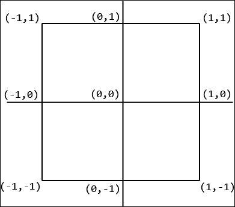

然后创建一个`GL_Model`对象，将顶点数组和顶点计数作为参数传入。然后`GL_Model`将像之前讨论的那样将此数据推送到 GPU。

最后，让我们看看我们如何在屏幕上渲染我们的三角形：

```cpp
void Game::Render() { 
  m_window.BeginDraw(); 
  // Render here. 
  m_shader->Bind(); 
  m_model->Draw(); 
  // Finished rendering. 
  m_window.EndDraw(); 
} 

```

在`BeginDraw()`方法内部清除窗口之后，着色器程序被绑定，这样我们之前编写的顶点和片段着色器就可以在推送`GL_Model`的顶点数据到渲染管线时使用。然后调用模型的`Draw()`方法，开始渲染过程。在程序成功编译和执行后，屏幕上应该显示如下内容：

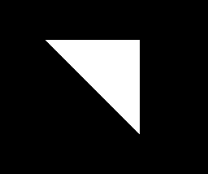

哈喽！经过大约 20 页的理论学习，我们得到了一个三角形。这可能会有些令人沮丧，但请记住，从现在开始，一切都将变得容易得多。恭喜你走到了这一步！

# 使用纹理

一个基本的白色三角形看起来并不令人兴奋。接下来，我们代码的下一个明显改进是使纹理对片段着色器可用，以便它们可以被采样并应用到我们的几何体上。不幸的是，OpenGL 并没有提供实际加载图像数据的方法，特别是考虑到有如此多的不同格式需要处理。为此，我们将使用本章开头列出的资源之一，即 STB 图像加载器。它是一个小型单头 C 库，用于将图像数据加载到缓冲区中，该缓冲区可以稍后由 OpenGL 或其他任何库使用。

## 纹理类

记得之前提到的，从这一点开始一切都会变得容易得多？这是真的。让我们快速浏览一下纹理处理过程，从纹理对象的类定义开始：

```cpp
class GL_Texture { 
public: 
  GL_Texture(const std::string& l_fileName); 
  ~GL_Texture(); 

  void Bind(unsigned int l_unit); 
private: 
  GLuint m_texture; 
}; 

```

虽然 OpenGL 实际上并不处理加载纹理数据，但它仍然会在本类的范围内进行处理。因此，我们的纹理类构造函数仍然需要传入要加载的纹理文件的路径。同样，就像着色器类一样，在渲染几何体之前，我们需要绑定到特定的纹理上。目前，忽略它所接受的参数。稍后将会解释。

与着色器或几何数据一样，OpenGL 纹理必须存储在 GPU 上。因此，可以合理地推断纹理数据将通过`GLuint`标识符来引用，就像着色器或缓冲区一样。

### 实现纹理类

让我们看看为了成功从硬盘加载纹理并将它们推送到 GPU 需要做什么：

```cpp
GL_Texture::GL_Texture(const std::string& l_fileName) { 
  int width, height, nComponents; 
  unsigned char* imageData = stbi_load(l_fileName.c_str(), 
    &width, &height, &nComponents, 4); 
  if (!imageData) { return; } 

  glGenTextures(1, &m_texture); 
  glBindTexture(GL_TEXTURE_2D, m_texture); 

  glTexParameteri(GL_TEXTURE_2D, GL_TEXTURE_WRAP_S, GL_REPEAT); 
  glTexParameteri(GL_TEXTURE_2D, GL_TEXTURE_WRAP_T, GL_REPEAT); 
  glTexParameterf(GL_TEXTURE_2D, GL_TEXTURE_MIN_FILTER,GL_LINEAR); 
  glTexParameterf(GL_TEXTURE_2D, GL_TEXTURE_MAG_FILTER,GL_LINEAR); 

  glTexImage2D(GL_TEXTURE_2D, 0, GL_RGBA, width, height, 0, 
    GL_RGBA, GL_UNSIGNED_BYTE, imageData); 

  stbi_image_free(imageData); 
} 

```

首先，创建几个整数以便填充即将加载的纹理的信息。然后，调用`stbi_load()`函数，它是 STB 图像加载库的一部分，传递纹理文件的路径，指向即将写入的宽度、高度和组件计数变量的指针，以及文件预期的组件数量。数据以*无符号字符*的形式存储，该函数返回指向数据的指针。如果返回`nullptr`，显然需要返回，因为加载过程失败。

图像所包含的组件数量简单来说就是颜色通道的数量。传入值为 0 意味着图像数据将按原样加载，而任何其他值都会*强制*数据包含其他颜色通道信息。组件数量到通道配置的评估方式如下：

| **组件** | **通道** |
| --- | --- |
| 1 | 灰色 |
| 2 | 灰色，alpha |
| 3 | 红色，绿色，蓝色 |
| 4 | 红色，绿色，蓝色，alpha |

从现在开始，我们将遵循现在应该已经熟悉的模式。首先，使用`glGenTextures`生成一个纹理对象，将我们想要的纹理数量作为第一个参数传递，并将纹理标识符或它们的列表的指针作为第二个参数传递。然后，我们使用`glBindTexture`绑定到新创建的纹理。这个函数的第一个参数简单地让 OpenGL 知道我们正在处理什么类型的纹理。在这种情况下，使用`GL_TEXTURE_2D`，因为它是一个基本的 2D 图像。

### 提示

OpenGL 支持多种不同类型的纹理，用于各种任务，包括 3D 纹理、立方体贴图等。

一旦纹理被绑定，我们就可以操作它所附带的各种细节。对于纹理，参数操作函数名为`glTexParameter()`。这个函数有多个不同类型，所有这些类型都以不同的后缀结尾，为程序员提供了关于它期望的数据类型的提示。就我们的目的而言，我们将使用两种类型：*整数*和*浮点数*，分别以字母*i*和*f*结尾。

前两行处理的是当纹理数据在其大小边界之外读取时的行为定义，即纹理如何包裹。`GL_TEXTURE_WRAP_S`参数处理的是在*X*轴上的包裹，而`GL_TEXTURE_WRAP_T`参数处理的是*Y*轴。为什么是*S*和*T*？答案很简单。位置向量、颜色数据和纹理坐标的枚举方式不同，但它们都大致意味着相同的东西。考虑以下表格：

|  | 1 | 2 | 3 | 4 |
| --- | --- | --- | --- | --- |
| 位置 | X | Y | Z | W |
| 颜色 | R | G | B | A |
| 纹理 | S | T | P | Q |

它们都是四个值的向量。访问位置*X*值与访问颜色结构的红色通道相同，依此类推。

下两个函数调用处理了纹理在缩放时如何插值的问题。两种情况都指定了`GL_LINEAR`参数，这意味着像素将进行线性插值。

最后，我们通过调用`glTexImage2D()`方法实际上将加载的像素信息提交给 GPU。它的第一个参数再次让 OpenGL 知道我们正在提交哪种类型的纹理。第二个参数是纹理的细节级别，它将用于 Mip 映射。值`0`简单地意味着它是基本级别的纹理。

### 注意

Mip 映射是一种可选技术，OpenGL 可以利用它，其中加载并提交给 GPU 的是同一纹理的多个版本，但具有不同的分辨率，并且根据它距离观察者的距离来应用几何体。如果它更远，则使用较低分辨率的纹理（具有更高的 Mip 映射级别）。这可以出于性能原因，在必要时进行。

第三个参数让 OpenGL 知道像素信息数据的排列方式。这是必要的，因为某些格式可能以不同的配置存储它。接下来传递宽度和高度信息，以及可以用来为纹理添加边框的像素数量。我们不会使用该功能，因此传递了`0`。下一个参数再次是一个标志，用于特定的像素排列。这次它让 OpenGL 知道我们希望它将像素数据存储在哪种排列中。最后，传递了一个标志，用于我们加载的纹理的类型，以及指向实际纹理数据的指针。我们使用`GL_UNSIGNED_BYTE`参数，因为这是 STB 图像加载器返回的，而`char`类型正好是一个字节长。

在将纹理信息提交给 GPU 之后，我们不再需要保留图像数据缓冲区。通过调用`stbi_image_free`并传入缓冲区指针来销毁它。

我们提交给 GPU 的数据，一旦不再需要纹理，就需要释放：

```cpp
GL_Texture::~GL_Texture() { glDeleteTextures(1, &m_texture); } 

```

`glDeleteTextures`函数接收我们想要丢弃的纹理数量，以及一个指向`GLuint`标识符数组的指针。

最后，让我们实现`Bind()`方法，这将使我们能够在渲染时使用纹理：

```cpp
void GL_Texture::Bind(unsigned int l_unit) { 
  assert(l_unit >= 0 && l_unit < 32); 
  glActiveTexture(GL_TEXTURE0 + l_unit); 
  glBindTexture(GL_TEXTURE_2D, m_texture); 
} 

```

OpenGL 实际上支持在渲染时同时绑定多个纹理的能力，这样就可以更有效地对复杂几何体进行纹理处理。确切的数量，至少在撰写本文时，是`32`个单位。大多数时候我们不需要那么多，但有一个选项是很好的。我们想要使用的单位标识符作为参数传递给`Bind()`方法。为了避免混淆，我们将执行一个`assert()`方法并确保`l_unit`值在正确的范围内。

为了启用特定纹理的单位，需要调用`glActiveTexture()`方法。它接受一个参数，即枚举的纹理单位。它从`GL_TEXTURE0`一直延伸到`GL_TEXTURE31`。因为这些值是连续的，一个巧妙的方法是简单地将`l_unit`添加到`GL_TEXTURE0`定义中，这将给我们正确的单位枚举。之后，我们就像之前一样绑定到纹理，使用`glBindTexture()`方法，并传递我们拥有的纹理类型及其标识符。

## 模型和着色器类更改

要添加对纹理几何体的支持，我们首先需要对存储的顶点信息进行一些修改。让我们看看`GL_Vertex`结构，看看需要添加什么：

```cpp
enum class VertexAttribute{ Position, TexCoord, COUNT }; 

struct GL_Vertex { 
  GL_Vertex(const glm::vec3& l_pos, 
    const glm::vec2& l_texCoord) 
    : m_pos(l_pos), m_texCoord(l_texCoord) {} 

  glm::vec3 m_pos; // Attribute 1\. 
  glm::vec2 m_texCoord; // Attribute 2\. 
  // ... 
}; 

```

如您所见，我们需要一个额外的顶点属性，即与顶点关联的纹理坐标。它是一个简单的二维向量，表示纹理坐标，如下所示：

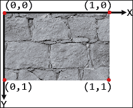

以这种方式表示纹理坐标的优点是它使得坐标分辨率无关。在较小的纹理上，点*(0.5,0.5)*将与其较大的对应点完全相同。

由于我们现在需要存储和访问单个顶点的更多信息，VAO 需要确切知道如何做到这一点：

```cpp
GL_Model::GL_Model(GL_Vertex* l_vertices,unsigned int l_vertCount) 
{ 
  ... 
  auto stride = sizeof(l_vertices[0]);
 auto texCoordOffset = sizeof(l_vertices[0].m_pos); 

  glBindBuffer(GL_ARRAY_BUFFER, m_vertexVBO); 
  glBufferData(GL_ARRAY_BUFFER, 
    l_vertCount * sizeof(l_vertices[0]), 
    l_vertices, GL_STATIC_DRAW); 
  glEnableVertexAttribArray( 
    static_cast<GLuint>(VertexAttribute::Position)); 
  glVertexAttribPointer( 
    static_cast<GLuint>(VertexAttribute::Position), 3, GL_FLOAT, 
    GL_FALSE, stride, 0); 
  glEnableVertexAttribArray( 
    static_cast<GLuint>(VertexAttribute::TexCoord)); 
  glVertexAttribPointer( 
    static_cast<GLuint>(VertexAttribute::TexCoord), 2, GL_FLOAT, 
    GL_FALSE, stride, (void*)texCoordOffset); 
  ... 
} 

```

我们现在可以开始使用之前讨论过的步进和偏移参数了！步进当然是`GL_Vertex`结构的大小，而获取纹理坐标的偏移量是顶点位置向量的大小，因为这是指针需要偏移的量。

在数据提交到缓冲区之后，我们启用顶点位置属性，并使用`stride`提供其指针。偏移量保持为`0`，因为`Position`是第一个属性。

我们还需要启用`TexCoord`属性，因为它也将传递到着色器中。它的指针设置方式与位置类似，但我们有`2`个浮点数而不是`3`，现在需要应用偏移，以便跳过位置数据。

### 注意

注意最后一个参数的`void*`转换。这是因为偏移实际上接受一个指针，而不是字节数。这是遗留的*细节*之一，在新版本中仅表示字节数。

我们 C++代码的最终更改是更新`GL_Shader`类，以便注册将要传递到顶点着色器的新属性：

```cpp
GL_Shader::GL_Shader(const std::string& l_fileName) { 
  ... 
  glBindAttribLocation(m_program, 
    static_cast<GLuint>(VertexAttribute::Position), "position"); 
  glBindAttribLocation(m_program, 
    static_cast<GLuint>(VertexAttribute::TexCoord), 
    "texCoordVert"); 
  ... 
} 

```

它只是为我们的纹理坐标属性建立了一个名称，现在命名为`"texCoordVert"`。

## 更新着色器

实际的纹理采样发生在片段着色器内部。然而，由于数据实际上首先在顶点着色器中接收，让我们看看它需要如何更新以满足我们的需求：

```cpp
#version 450 

attribute vec3 position; 
attribute vec2 texCoordVert;
varying vec2 texCoord; // Pass to fragment shader. 
void main(){ 
  gl_Position = vec4(position, 1.0); 
  texCoord = texCoordVert; // Pass to fragment shader. 
} 

```

如您所见，这里建立了`texCoordVert`属性，以及一个名为`texCoord`的 2D 向量`varying`。`varying`类型仅仅意味着其数据将被传递到渲染管线中，并被下一个着色器接收。在我们的例子中，`texCoord`将在片段着色器内部可访问。其值设置为`texCoordVert`的输入属性。为什么？因为任何着色器接收到的`varying`数据都是**插值**的。没错。看看下面的图示：

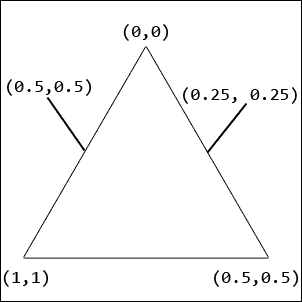

为了准确采样我们几何体每个像素的颜色信息，我们实际上并不需要自己进行任何数学运算。插值，或者加权平均，为我们处理了这一切。如果一个顶点的纹理坐标是，比如说**(1,1**)，而相对的顶点坐标是**(0,0**)，那么在两个顶点之间的某个像素上执行的片段着色器将接收**插值**值为**(0.5, 0.5**)。这使得给像素上色变得如此简单：

```cpp
#version 450 
uniform sampler2D texture; 
varying vec2 texCoord; // Receiving it from vertex shader. 

void main(){ 
  gl_FragColor = texture2D(texture, texCoord); 
} 

```

首先，注意类型为`sampler2D`的`uniform`变量，名为`texture`。我们不需要手动将其传递到着色器中，因为这是在幕后完成的。它只是提供了访问绑定到当前纹理的数据的权限。接下来，我们设置变量`texCoord`，这完成了从顶点着色器到片段着色器的数据*管道*。然后，将片段颜色设置为`vec4`，它由`texture2D()`函数返回，该函数接收片段着色器接收到的纹理以及我们想要采样的坐标。由于返回的`vec4`代表像素的颜色，这就足以纹理化几何体了！

## 使用纹理

在这个阶段，将纹理应用到我们的几何体上相当简单。首先，需要将`GL_Texture`类添加为`Game`对象的数据成员。然后我们可以按照以下步骤设置其他一切：

```cpp
Game::Game() ... { 
  ... 
  GL_Vertex vertices[] = { 
    //           |---POSITION----| |TEXTURE| 
    //            X     Y    Z      X  Y 
    GL_Vertex({ -0.5, -0.5, 0.5 }, { 0, 0 }), // 0 
    GL_Vertex({ -0.5, 0.5, 0.5 }, { 0, 1 }), // 1 
    GL_Vertex({ 0.5, 0.5, 0.5 }, { 1, 1 }), // 2 
  }; 
  m_texture = std::make_unique<GL_Texture>( 
    Utils::GetWorkingDirectory() + "GL/brick.jpg"); 
  ... 
} 

void Game::Render() { 
  m_window.BeginDraw(); 
  // Render here. 
  m_texture->Bind(0); 
  m_shader->Bind(); 
  m_model->Draw(); 
  m_window.EndDraw(); 
} 

```

`GL_Vertex`对象现在接受一个额外的参数，它代表顶点的纹理坐标。我们还在构造函数中加载了砖块纹理，然后在`Render()`方法中将其绑定，就在着色器之前。当我们的模型被渲染时，它应该看起来如下：

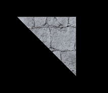

我们现在有一个应用了纹理的静止模型。仍然不太令人兴奋，但我们正在接近目标！

# 应用变换

移动、旋转以及其他方式操纵顶点数据可能看起来相当直接。甚至有人可能会倾向于简单地更新顶点位置信息，并将这些数据重新提交到 VBO。虽然过去可能一直是这样做的，但执行此任务有更高效、尽管更数学密集的方法。现在，通过简单地乘以称为**矩阵**的东西，顶点的位移现在在顶点着色器中完成。

## 矩阵基础

矩阵在图形编程中极其有用，因为它们可以表示应用于向量的任何类型的旋转、缩放或位移操作。存在许多不同类型的矩阵，但它们都是类似这样的信息块：

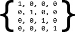

这个特定的矩阵是一个 4x4 的单位矩阵，但存在各种不同大小的矩阵，例如 3x3、2x3、3x2 等等。在加法、减法、乘法或除法时存在规则。我们实际上不会深入探讨这一点，因为它超出了本章的范围。好事是`glm`库为我们抽象了所有这些，所以现在我们不必绝对了解这些。从这个中我们可以得到的一个要点是，位置向量可以在加到或乘以矩阵时进行变换。

## 世界空间

到目前为止，我们一直在使用在归一化设备坐标空间中指定的顶点位置。这意味着每个顶点坐标实际上相对于屏幕中心。然而，为了正确处理变换；我们希望将我们的几何形状视为相对于**模型空间**中的某个原点，如下所示：

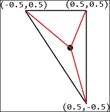

如果一个模型有一个原点，它也可以在我们的世界中有一个全局位置，其中其原点相对于我们构建的游戏世界中的某个任意点。这个全局位置以及一些其他属性，如对象的缩放和旋转，可以用一个矩阵来表示。将这些属性应用于模型空间中的顶点坐标，这正是当它们乘以**模型矩阵**时发生的情况，使我们能够将这些坐标带入所谓的**世界空间**，如下所示：

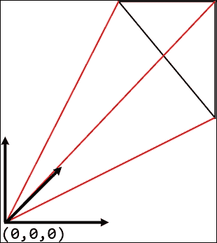

这种变换简单来说就是顶点现在相对于世界的原点，而不是模型原点，这使得我们能够在屏幕上绘制之前，准确地在我们自己的坐标系中表示模型。

## 变换类

在应用任何变换之前，它们应该被适当地分组并由一个单一的数据结构表示。`GL_Transform`类将为我们做这件事：

```cpp
#include <glm.hpp> 
#include <gtx/transform.hpp> 
class GL_Transform { 
public: 
  GL_Transform(const glm::vec3& l_pos = { 0.f, 0.f, 0.f }, 
    const glm::vec3& l_rot = { 0.f, 0.f, 0.f }, 
    const glm::vec3& l_scale = { 1.f, 1.f, 1.f }); 

  glm::vec3 GetPosition()const; 
  glm::vec3 GetRotation()const; 
  glm::vec3 GetScale()const; 

  void SetPosition(const glm::vec3& l_pos); 
  void SetRotation(const glm::vec3& l_rot); 
  void SetScale(const glm::vec3& l_scale); 

  glm::mat4 GetModelMatrix(); 
private: 
  void RecalculateMatrix(); 
  glm::vec3 m_position; 
  glm::vec3 m_rotation; 
  glm::vec3 m_scale; 
}; 

```

首先，注意顶部的包含头文件。这些是本类中将使用的数据类型和变换函数所必需的。除此之外，我们还有三个向量，将代表模型的位置、旋转和缩放，这些将被用于计算将顶点转换成世界坐标的模型矩阵。

### 实现变换类

构造函数简单地接受适当的参数并使用初始化列表设置一些数据成员：

```cpp
GL_Transform::GL_Transform(const glm::vec3& l_pos, 
  const glm::vec3& l_rot, const glm::vec3& l_scale) 
  : m_position(l_pos), m_rotation(l_rot), m_scale(l_scale) 
{} 

```

这个类的核心是`GetModelMatrix()`方法，因为它处理所有必要的数学运算：

```cpp
glm::mat4 GL_Transform::GetModelMatrix() { 
  glm::mat4 matrix_pos = glm::translate(m_position); 
  glm::mat4 matrix_scale = glm::scale(m_scale); 
  // Represent each stored rotation as a different matrix, because 
  // we store angles. 
  //          x  y  z 
  glm::mat4 matrix_rotX = glm::rotate(m_rotation.x, 
    glm::vec3(1, 0, 0)); 
  glm::mat4 matrix_rotY = glm::rotate(m_rotation.y, 
    glm::vec3(0, 1, 0)); 
  glm::mat4 matrix_rotZ = glm::rotate(m_rotation.z, 
    glm::vec3(0, 0, 1)); 
  // Create a rotation matrix. 
  // Multiply in reverse order it needs to be applied. 
  glm::mat4 matrix_rotation = matrix_rotZ*matrix_rotY*matrix_rotX; 
  // Apply transforms in reverse order they need to be applied in. 
  return matrix_pos * matrix_rotation * matrix_scale; 
} 

```

模型矩阵将是许多其他矩阵相乘的结果，因此它将包含所有必要的变换信息。我们首先创建一个称为**平移矩阵**的东西。调用`glm::translate`为我们创建一个，带有`m_position`的位置信息。它用于将我们的顶点位置带入世界空间。

然后我们创建一个**缩放矩阵**，它负责表示模型的缩放或缩小。例如，如果一个模型应该绘制为存储在 GPU 上的两倍大小，那么缩放矩阵将用于调整所有顶点的位置，使其看起来是这样。使用`glm::scale`并传入缩放向量作为参数将为我们构建一个。

我们需要的最后一种矩阵是**旋转矩阵**。它显然代表了物体的不同旋转值，因此将所有顶点围绕一个原点进行位移。然而，由于我们将旋转信息存储为**度数**向量，所以这个矩阵并不那么直接。因此，每个轴的矩阵都需要使用`glm::rotate`函数来创建，该函数接受旋转角度以及一个**方向向量**，表示期望旋转的轴。这意味着根据我们处理的哪个轴，只需为*x*、*y*或*z*分量设置值为`1`。最终的旋转矩阵是通过将所有三个之前的矩阵相乘来计算的。使用不同的乘法顺序会产生不同的结果。一般来说，一个经验法则是按照应用的相反顺序乘以所有矩阵。

最后，我们可以通过以下方式将所有之前的矩阵相乘来计算模型矩阵：

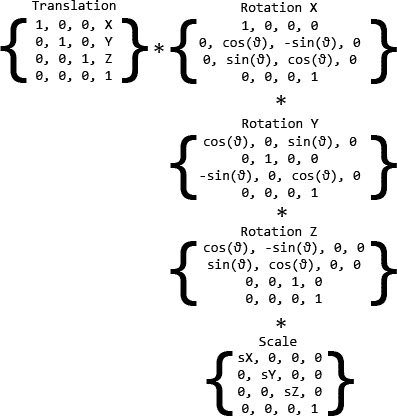

然后返回得到的模型矩阵。

本节课的剩余部分相当直接，因为除了设置器和获取器之外，没有其他内容：

```cpp
glm::vec3 GL_Transform::GetPosition() const { return m_position; } 
glm::vec3 GL_Transform::GetRotation() const { return m_rotation; } 
glm::vec3 GL_Transform::GetScale() const { return m_scale; } 

void GL_Transform::SetPosition(const glm::vec3& l_pos) 
{ m_position = l_pos; } 
void GL_Transform::SetRotation(const glm::vec3& l_rot) 
{ m_rotation = l_rot; } 
void GL_Transform::SetScale(const glm::vec3& l_scale) 
{ m_scale = l_scale; } 

```

## 更新着色器类

再次强调，我们将使用着色器类来提交必要的矩阵信息到顶点着色器，在那里它将被使用。这样做是在顶点着色器中进行的原因是因为 GPU 针对此类操作进行了优化。让我们看看我们需要更改的内容：

```cpp
enum class UniformType{ Transform, COUNT }; 

class GL_Shader { 
public: 
  ... 
  void Update(GL_Transform& l_transform); 
  ... 
private: 
  ... 
  GLuint m_uniform[static_cast<unsigned int>(UniformType::COUNT)]; 
}; 

```

首先，请注意我们建立的一个新枚举。它列出了我们的着色器需要的所有均匀变量类型，目前只包含一个。

### 注意

均匀变量执行的任务与通常的着色器属性或变化变量不同。属性在 OpenGL 幕后由 OpenGL 填充，使用来自 VBO 的数据。变化的着色器变量在着色器之间传递。均匀变量实际上是通过我们的 C++代码传递到着色器的，这就是为什么我们需要以不同的方式处理它。

`GL_Shader`类现在还需要一个`Update()`方法，它将接受对`GL_Transform`类的引用，并使用它将模型矩阵传递到顶点着色器。最后，我们需要存储用于在着色器中定位均匀变量的标识符，以便它们可以被使用。`m_uniform`数据成员就是为了这个目的存在的。

让我们看看如何获取和存储均匀变量位置：

```cpp
GL_Shader::GL_Shader(const std::string& l_fileName) { 
  ... 
  m_uniform[static_cast<unsigned int>(UniformType::Transform)] = 
    glGetUniformLocation(m_program, "transform"); 
} 

```

如您所见，OpenGL 提供了一个很好的函数来完成这个任务，称为`glGetUniformLocation`。它接受我们正在使用的程序的标识符，以及着色器内部均匀变量的名称，即`"transform"`。

设置均匀变量的值也归结为单个函数调用：

```cpp
void GL_Shader::Update(GL_Transform& l_transform) { 
  glm::mat4 modelMatrix = l_transform.GetModelMatrix(); 

  glUniformMatrix4fv(static_cast<GLint>( 
    m_uniform[static_cast<unsigned int>(UniformType::Transform)]), 
    1, GL_FALSE, &modelMatrix[0][0]); 
} 

```

首先，我们从变换类中获取模型矩阵。然后调用`glUniform`函数。它有一个后缀，表示我们正在提交的确切数据类型，在这种情况下，是一个 4x4 的浮点矩阵。我们之前存储的均匀 ID 用作第一个参数。正在提交的数据量是第二个参数，在这种情况下是`1`，因为我们只提交了一个矩阵。第三个参数是一个标志，允许我们转置矩阵。我们不需要这样做，所以传入`GL_FALSE`。最后，将矩阵的第一个元素的指针传递为最后一个参数。OpenGL 知道矩阵的确切大小，因为我们调用了适当的函数，这使得它可以读取整个矩阵。

最后，我们需要修改顶点着色器以实际执行变换：

```cpp
#version 450 

attribute vec3 position; 
attribute vec2 texCoordVert; 
varying vec2 texCoord; // Pass to fragment shader. 

uniform mat4 transform; // Passed in by the shader class. 

void main(){ 
  gl_Position = transform * vec4(position, 1.0); 
  texCoord = texCoordVert; // Pass to fragment shader. 
} 

```

注意添加的`uniform`类型为`mat4`。我们只需要在主函数中将它乘以位置，这样就得到了我们的变换后的顶点位置。

## 操作三角形

再次强调，为了应用我们编写的代码，我们剩下的唯一事情是将它添加到`Game`类中：

```cpp
class Game{ 
  ... 
private: 
  ... 
  GL_Transform m_transform; 
  ... 
}; 

```

实际上不需要更多的设置。我们可以直接跳转到通过编辑`Update()`方法来操作变换的属性：

```cpp
void Game::Update() { 
  ... 
  auto rotation = m_transform.GetRotation(); 
  rotation.x += 0.001f; 
  rotation.y += 0.0002f; 
  rotation.z += 0.002f; 
  if (rotation.x >= 360.f) { rotation.x = 0.f; } 
  if (rotation.y >= 360.f) { rotation.y = 0.f; } 
  if (rotation.z >= 360.f) { rotation.z = 0.f; } 
  m_transform.SetRotation(rotation); 
  m_shader->Update(m_transform); 
} 

```

在这种情况下，我们只是在所有轴上玩旋转。在做出这些修改后，将变换对象传递给`GL_ShaderUpdate()`方法非常重要，这样顶点才能被正确变换，从而得到以下结果旋转：

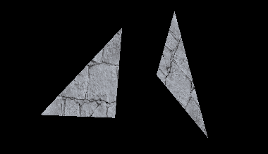

现在我们正在取得进展！然而，我们仍然没有与场景进行交互。在这整个过程中，我们只是静静地坐着，而几何体只是旋转。这最多只是一个非常复杂的屏保。让我们实际实现一些能够给我们带来一些**移动性**的功能。

# 创建摄像机

与 SFML 不同，OpenGL 不提供移动视图或摄像机的方法。虽然这乍一看可能有些奇怪，但这主要是因为没有摄像机或视图可以移动。是的，你听对了。没有摄像机，没有视图，只有顶点数据、着色器和原始数学来拯救。如何？让我们看看！

## 视图投影基础

大多数库抽象掉的渲染和编程技巧实际上就是那些技巧。当涉及到在游戏世界中移动时，并没有真正的**摄像机**方便地拍摄要渲染的几何体的正确侧面。摄像机只是一个幻觉，用于抽象那些不直观的概念。在游戏世界中移动除了在顶点上执行额外的矩阵数学运算之外，不涉及其他任何事情。围绕场景旋转摄像机的行为实际上正好相反：围绕被称为摄像机的空间中的点旋转场景。再一次，我们将把顶点转换成相对于另一个原点，这次是摄像机本身。考虑以下图示：

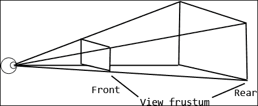

为了实现摄像机类并能够在世界中**移动**，我们需要了解一些基础知识。首先，我们必须决定摄像机的视场角度应该有多宽。这会影响我们实际上能看到多少。另一个重要的细节是正确设置**视锥体**。想象一下，它是一个定义摄像机视场范围的金字塔形几何体。它决定了某些事物可以多近直到它们不再被看到，以及物体从摄像机到不再被渲染的最大距离。

我们窗口的宽高比、视场、视锥体的近/远距离以及摄像机的位置共同构成了我们将要计算的两个矩阵：**视图矩阵**和**投影矩阵**。前者处理将顶点相对于摄像机位置进行定位，而后者则根据它们与视锥体、视场和其他属性的远近进行调整和扭曲。

我们可以主要使用两种投影类型：**透视**和**正交**。透视投影提供了一种逼真的结果，其中对象可以看起来离相机更远，而正交投影则更像是一种固定深度感，使得无论对象的距离如何，看起来大小都相同。我们将使用透视投影来完成我们的任务。

## 相机类

在覆盖了所有这些信息之后，我们终于准备好了解`GL_Camera`类这个烟雾和镜子了。让我们看看要在这个世界中操纵需要什么：

```cpp
class GL_Camera { 
public: 
  GL_Camera(const glm::vec3& l_pos, float l_fieldOfView, 
    float l_aspectRatio, float l_frustumNear, float l_frustumFar); 

  glm::mat4 GetViewProjectionMatrix(); 
private: 
  void RecalculatePerspective(); 

  float m_fov; 
  float m_aspect; 
  float m_frustumNear; 
  float m_frustumFar; 

  glm::vec3 m_position; 
  glm::vec3 m_forwardDir; 
  glm::vec3 m_upDir; 

  glm::mat4 m_perspectiveMatrix; 
}; 

```

如您所见，我们存储了所有已覆盖的细节，以及一些新的内容。除了视场角度、纵横比以及近远视锥值之外，我们还需要保留位置、一个前进方向向量以及一个向上方向向量。`m_forwardDir`是一个归一化的方向向量，表示相机所看的方向。`m_upDir`也是一个归一化的方向向量，但它仅仅存储了*向上*的方向。这一切很快就会变得有意义。

### 实现相机类

让我们看看这个类构造器长什么样：

```cpp
GL_Camera::GL_Camera(const glm::vec3& l_pos, float l_fieldOfView, 
  float l_aspectRatio, float l_frustumNear, float l_frustumFar) 
  : m_position(l_pos), m_fov(l_fieldOfView), 
  m_aspect(l_aspectRatio), m_frustumNear(l_frustumNear), 
  m_frustumFar(l_frustumFar) 
{ 
  RecalculatePerspective(); 
  m_forwardDir = glm::vec3(0.f, 0.f, 1.f); 
  m_upDir = glm::vec3(0.f, 1.f, 0.f); 
} 

```

除了初始化数据成员之外，构造函数有三个任务。它重新计算透视矩阵，这通常只需要做一次，除非窗口大小发生变化，并且它设置前进方向和向上方向。相机最初是朝向正*Z*轴，如果你这样想象的话，就是*朝向*屏幕的方向。*向上*的方向是正 Y 轴。

由于有`glm`库的帮助，计算透视矩阵相当简单：

```cpp
void GL_Camera::RecalculatePerspective() { 
  m_perspectiveMatrix = glm::perspective(m_fov, m_aspect, 
    m_frustumNear, m_frustumFar); 
} 

```

我们的矩阵是通过`glm::perspective`函数构建的，它接受视场、纵横比以及两个视锥距离。

最后，我们可以获得**视图投影矩阵**，它仅仅是视图矩阵和投影矩阵的组合：

```cpp
glm::mat4 GL_Camera::GetViewProjectionMatrix() { 
  glm::mat4 viewMatrix = glm::lookAt(m_position, 
    m_position + m_forwardDir, m_upDir); 
  return m_perspectiveMatrix * viewMatrix; 
} 

```

我们首先使用`glm::lookAt`函数计算视图矩阵。它接受相机的位置、相机所看的点以及*向上*的方向。之后，我们的透视矩阵和视图矩阵的乘积得到视图投影矩阵，该矩阵随后被返回以供后续使用。

## 更新其余的代码

由于我们的几何形状需要相对于另一个原点进行变换，我们需要更新`GL_Shader`类：

```cpp
void GL_Shader::Update(GL_Transform& l_transform, 
  GL_Camera& l_camera) 
{ 
  glm::mat4 modelMatrix = l_transform.GetModelMatrix(); 
  glm::mat4 viewProjMatrix = l_camera.GetViewProjectionMatrix();

  glm::mat4 modelViewMatrix = viewProjMatrix * modelMatrix; 
  glUniformMatrix4fv(static_cast<GLint>( 
    m_uniform[static_cast<unsigned int>(UniformType::Transform)]), 
    1, GL_FALSE, &modelViewMatrix[0][0]); 
} 

```

因为顶点着色器已经通过变换乘以其位置，我们可以在`Update()`方法内部简单地更改它使用的矩阵。在获得模型矩阵后，我们也获取视图投影矩阵并将它们相乘。然后，得到的**模型视图矩阵**被传递到顶点着色器。

最后，需要在`Game`类内部创建相机：

```cpp
class Game{ 
  ... 
private: 
  ... 
  std::unique_ptr<GL_Camera> m_camera; 
}; 

```

它也需要用适当的信息进行设置：

```cpp
Game::Game() ... { 
  ... 
  float aspectRatio = 
    static_cast<float>(m_window.GetWindowSize().x) / 
    static_cast<float>(m_window.GetWindowSize().y); 
  float frustum_near = 1.f; 
  float frustum_far = 100.f; 

  m_camera = std::make_unique<GL_Camera>( 
    glm::vec3(0.f, 0.f, -5.f), 70.f, aspectRatio, 
    frustum_near, frustum_far); 
} 

```

我们首先计算窗口的宽高比，即其宽度除以高度。在设置`frustum_near`和`frustum_far`值后，它们被传递给相机的构造函数，包括其初始位置、视场角度和窗口的宽高比。

最后，我们只需要更新着色器类以包含相机的信息：

```cpp
void Game::Update() { 
  ... 
  m_shader->Update(m_transform, *m_camera); 
} 

```

在成功编译和执行后，我们应该看到我们的三角形稍微远离相机，因为它的位置被设置为*Z*轴上的`-5.f`。

# 在相机周围移动

拥有一个可编程的相机很棒，但它仍然不能让我们自由地在场景中漫游。让我们实际上给我们的相机类赋予实时操作的能力，这样我们就可以产生在世界中漂浮的错觉：

```cpp
enum class GL_Direction{ Up, Down, Left, Right, Forward, Back }; 

class GL_Camera { 
public: 
  ... 
  void MoveBy(GL_Direction l_dir, float l_amount); 
  void OffsetLookBy(float l_speed, float l_x, float l_y); 
  ... 
}; 

```

如您所见，我们将为此使用两种方法：一种用于移动相机，另一种用于旋转它。我们还定义了一个有用的枚举，包含所有六个可能的方向。

移动位置向量相当简单。假设我们有一个表示相机速度的标量值。如果我们将其乘以一个方向向量，我们就会得到基于向量指向方向的比例位置变化，如下所示：

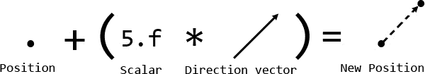

考虑到这一点，让我们实现`MoveBy()`方法：

```cpp
void GL_Camera::MoveBy(GL_Direction l_dir, float l_amount) { 
  if (l_dir == GL_Direction::Forward) { 
    m_position += m_forwardDir * l_amount; 
  } else if (l_dir == GL_Direction::Back) { 
    m_position -= m_forwardDir * l_amount; 
  } else if (l_dir == GL_Direction::Up) { 
    m_position += m_upDir * l_amount; 
  } else if (l_dir == GL_Direction::Down) { 
    m_position -= m_upDir * l_amount; 
  } ... 
} 

```

如果我们在前后移动相机，`l_amount`标量值会乘以前进方向。上下移动相机同样简单，因为可以使用向上方向来实现这一点。

左右移动稍微复杂一些。我们不能只是静态地改变位置，因为相机的*左*或*右*的概念取决于我们朝哪个方向看。这就是**叉积**发挥作用的地方：

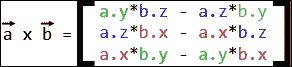

两个向量的叉积是一个稍微难以记忆的公式，但它非常有用。它给我们一个与向量*a*和*b***正交**的向量。考虑以下图示：

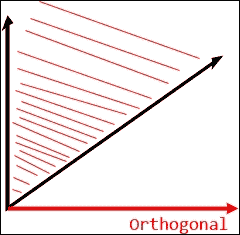

正交向量是表示该向量方向与另外两个向量形成的平面**垂直**的一种说法。了解这一点后，我们可以相对容易地实现左右侧滑：

```cpp
} else if (l_dir == GL_Direction::Left) { 
  glm::vec3 cross = glm::cross(m_forwardDir, m_upDir); 
  m_position -= cross * l_amount; 
} else if (l_dir == GL_Direction::Right) { 
  glm::vec3 cross = glm::cross(m_forwardDir, m_upDir); 
  m_position += cross * l_amount; 
} ... 

```

在获得前进和向上向量的叉积后，我们只需将其乘以标量并加到相机的位置上，从而产生左右移动。

旋转相机稍微复杂一些，但并非微不足道：

```cpp
void GL_Camera::OffsetLookBy(float l_speed, float l_x, float l_y) 
{ 
  glm::vec3 rotVector = glm::cross(m_forwardDir, m_upDir); 
  glm::mat4 rot_matrix = glm::rotate(-l_x * l_speed, m_upDir) * 
               glm::rotate(-l_y * l_speed, rotVector); 
  m_forwardDir = glm::mat3(rot_matrix) * m_forwardDir; 
} 

```

再次使用叉积来获得前进方向和向上方向向量平面的正交向量。然后通过乘以*x*轴和*y*轴的两个旋转矩阵来计算旋转矩阵。对于*x*轴，我们只是围绕向上方向向量旋转，如下所示：

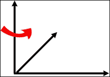

*Y*轴旋转是通过绕着视图方向的正交向量和向上向量的平面旋转来实现的：

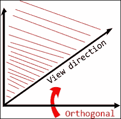

现在有了这个功能，我们可以编写实际的相机移动代码，如下所示：

```cpp
void Game::Update() { 
  ... 
  m_mouseDifference = sf::Mouse::getPosition( 
    *m_window.GetRenderWindow()) - m_mousePosition; 
  m_mousePosition = sf::Mouse::getPosition( 
    *m_window.GetRenderWindow()); 

  float moveAmount = 0.005f; 
  float rotateSpeed = 0.004f; 

  if (sf::Keyboard::isKeyPressed(sf::Keyboard::W)) { 
    // Forward. 
    m_camera->MoveBy(GL_Direction::Forward, moveAmount); 
  } else if (sf::Keyboard::isKeyPressed(sf::Keyboard::S)) { 
    // Back. 
    m_camera->MoveBy(GL_Direction::Back, moveAmount); 
  } 

  if (sf::Keyboard::isKeyPressed(sf::Keyboard::A)) { 
    // Left. 
    m_camera->MoveBy(GL_Direction::Left, moveAmount); 
  } else if (sf::Keyboard::isKeyPressed(sf::Keyboard::D)) { 
    // Right. 
    m_camera->MoveBy(GL_Direction::Right, moveAmount); 
  } 

  if (sf::Keyboard::isKeyPressed(sf::Keyboard::Q)) { 
    // Up. 
    m_camera->MoveBy(GL_Direction::Up, moveAmount); 
  } else if (sf::Keyboard::isKeyPressed(sf::Keyboard::Z)) { 
    // Down. 
    m_camera->MoveBy(GL_Direction::Down, moveAmount); 
  } 

  if (sf::Mouse::isButtonPressed(sf::Mouse::Left)) { 
    m_camera->OffsetLookBy(rotateSpeed, 
      static_cast<float>(m_mouseDifference.x), 
      static_cast<float>(m_mouseDifference.y)); 
  } 
  ... 
} 

```

我们使用键盘上的*W*、*S*、*A*和*D*键来移动相机，当按下左鼠标按钮时，鼠标位置的变化作为标量值来旋转相机。

# 使用顶点索引绘制

在继续之前，有一件对我们来说相当重要的事情是介绍一种更高效的形状渲染方法。我们当前的方法对于渲染单个三角形来说很好，但当渲染更复杂的形状，如立方体时，它可能会变得非常低效。如果我们只使用顶点，渲染*六个*立方体面就需要总共*36*个顶点。显然，一个更有效的方法是提交每个立方体角落的*八个*顶点，然后重新使用它们来绘制每个面。幸运的是，我们可以通过使用**索引数组**来实现这一点。

使用索引简单来说，就是对于我们要绘制的每个模型，我们还需要存储一个表示顶点绘制顺序的索引数组。模型中的每个顶点都被赋予了一个索引，从*0*开始。然后，这些索引的数组会被用来连接顶点，而不是重新提交它们。让我们实现这个功能，从`GL_Model`类开始：

```cpp
class GL_Model { 
  ... 
private: 
  ... 
  GLuint m_indexVBO; 
  ... 
}; 

```

如新的数据成员所暗示的，我们需要将这些索引存储在自己的 VBO 中，所有这些操作都在构造函数内部完成：

```cpp
GL_Model::GL_Model(GL_Vertex* l_vertices, 
  unsigned int l_vertCount, unsigned int* l_indices,
unsigned int l_indexCount) 
{ 
  m_drawCount = l_indexCount; 

  glGenVertexArrays(1, &m_VAO); 
  glBindVertexArray(m_VAO); 
  glGenBuffers(1, &m_vertexVBO); 
  glGenBuffers(1, &m_indexVBO); 
  ... 
  glBindBuffer(GL_ELEMENT_ARRAY_BUFFER, m_indexVBO); 
  glBufferData(GL_ELEMENT_ARRAY_BUFFER, 
    l_indexCount * (sizeof(l_indices[0])), 
    l_indices, GL_STATIC_DRAW); 
  ... 
} 

```

构造函数需要额外接受两个参数：一个指向索引数组的指针，以及该数组中索引的数量。注意，`m_drawCount`现在被设置为`l_indexCount`。这是因为我们只需要*八个*顶点来构建一个立方体模型，但是描述如何绘制它的索引有*36*个。

在为索引生成新的 VBO 之后，我们将其绑定并提交索引数据，基本上与之前相同。这里的主要区别是`GL_ELEMENT_ARRAY_BUFFER`标志。我们不能使用`GL_ARRAY_BUFFER`，因为索引实际上指的是位于另一个 VBO 内部的顶点数据。

显然，一旦模型不再需要，就需要释放这些新数据：

```cpp
GL_Model::~GL_Model() { 
  glDeleteBuffers(1, &m_vertexVBO); 
  glDeleteBuffers(1, &m_indexVBO); 
  glDeleteVertexArrays(1, &m_VAO); 
} 

```

使用索引绘制我们的模型需要完全不同的`Draw()`调用：

```cpp
void GL_Model::Draw() { 
  glBindVertexArray(m_VAO); 
  glDrawElements(GL_TRIANGLES, m_drawCount, GL_UNSIGNED_INT, 0); 
  glBindVertexArray(0); 
} 

```

调用`glDrawElements()`方法需要四个参数：我们将要绘制的原语类型、索引的总数、这些索引表示的数据类型，以及可以用来跳过的偏移量。

这就是使用索引绘制几何形状的全部内容！现在让我们设置一个更令人兴奋的模型来展示它：

```cpp
Game::Game() ... { 
  ... 
  GL_Vertex vertices[] = { 
    //      |---POSITION----| |TEXTURE| 
    //        X    Y  Z      X, Y 
    GL_Vertex({ -0.5, -0.5, 0.5 }, { 0, 0 }), // 0 
    GL_Vertex({ -0.5, 0.5, 0.5 }, { 0, 1 }), // 1 
    GL_Vertex({ 0.5, 0.5, 0.5 }, { 1, 1 }), // 2 
    GL_Vertex({ 0.5, -0.5, 0.5 }, { 1, 0 }), // 3 
    GL_Vertex({ -0.5, -0.5, -0.5f }, { 1, 0 }), // 4 
    GL_Vertex({ -0.5, 0.5, -0.5f }, { 1, 1 }), // 5 
    GL_Vertex({ 0.5, 0.5, -0.5f }, { 0, 0 }), // 6 
    GL_Vertex({ 0.5, -0.5, -0.5f }, { 0, 1 }) // 7 
  }; 

  unsigned int indices[] = { 
    2, 1, 0, 0, 3, 2, // Back 
    5, 4, 0, 0, 1, 5, // Right 
    3, 7, 6, 6, 2, 3, // Left 
    6, 7, 4, 4, 5, 6, // Front 
    1, 2, 6, 6, 5, 1, // Top 
    0, 4, 7, 7, 3, 0 // Bottom 
  }; 

  m_model = std::make_unique<GL_Model>(vertices, 8, indices, 36); 
  ... 
} 

```

如您所见，我们现在已经设置了`8`个顶点，并为索引创建了一个新的数组。一旦模型渲染完成，我们会看到类似这样的效果：

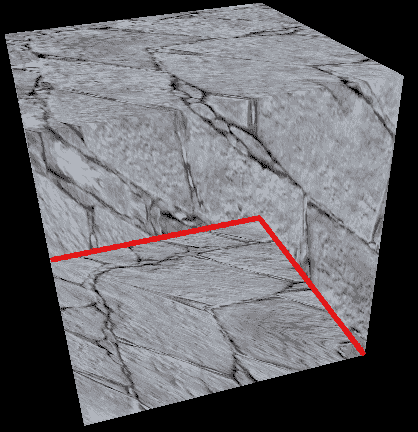

注意，由于某种原因，底面实际上被渲染在了上面。这是由于 OpenGL 不知道应该渲染哪个几何体在顶部，这个问题将在下一节中解决。

# 面剔除和深度缓冲区

解决绘制顺序问题的方法之一是使用**深度缓冲区**。简单来说，深度缓冲区，也常被称为**Z 缓冲区**，是 OpenGL 在后台管理的一个纹理，它包含每个像素的深度信息。当渲染一个像素时，它的深度（*Z*值）会与深度缓冲区中的值进行比较。如果一个像素的*Z*值更低，那么这个像素会被覆盖，因为它显然在顶部。

启用深度缓冲区只需要一个`glEnable()`方法调用：

```cpp
Game::Game() ... { 
  ... 
  glEnable(GL_DEPTH_TEST); 
  ... 
} 

```

请记住，深度缓冲区是一个纹理。确保在创建窗口时分配它，并且它有足够的数据来工作是非常重要的。我们可以通过创建一个`sf::ContextSettings`结构并在将其传递给 SFML 窗口的`Create()`方法之前填充其`depthBits`数据成员来确保这一点：

```cpp
void GL_Window::Create() { 
  ... 
  sf::ContextSettings settings; 
  settings.depthBits = 32; // 32 bits. 
  settings.stencilBits = 8; 
  settings.antialiasingLevel = 0; 
  settings.majorVersion = 4; 
  settings.minorVersion = 5; 

  m_window.create(sf::VideoMode(m_windowSize.x, 
    m_windowSize.y, 32), m_windowTitle, style, settings); 
} 

```

如果我们直接运行代码，屏幕会完全变空白。为什么？记住，Z 缓冲区是一个纹理。就像显示一样，每个周期都需要清除纹理。我们可以这样完成：

```cpp
void GL_Window::BeginDraw() { 
  glClearColor(0.f, 0.f, 0.f, 1.f); // BLACK 
  glClear(GL_COLOR_BUFFER_BIT | GL_DEPTH_BUFFER_BIT); 
} 

```

添加管道符号允许我们对`glClear`的参数执行位或操作，加入`GL_DEPTH_BUFFER_BIT`定义。这确保了深度缓冲区也被清空为黑色，我们最终可以享受我们的立方体：

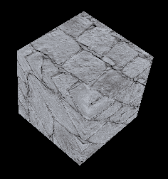

# 背面剔除

为了提高性能，一个好的做法是让 OpenGL 知道我们希望剔除从当前视角不可见的面。这个功能可以通过以下方式启用：

```cpp
Game::Game() ... { 
  ... 
  glEnable(GL_DEPTH_TEST); 
  glEnable(GL_CULL_FACE); 
  glCullFace(GL_BACK); 
  ... 
} 

```

在我们调用`glEnable`启用面剔除之后，`glCullFace`函数被调用以让 OpenGL 知道哪些面需要剔除。这会直接生效，但如果我们的模型数据设置不正确，我们可能会注意到一些奇怪的效果，如下所示：

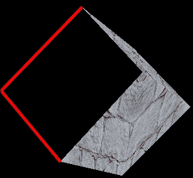

这是因为我们渲染顶点的顺序实际上定义了一个几何体面的朝向是向内还是向外。例如，如果一个面的顶点以顺时针顺序渲染，那么默认情况下，这个面被认为是向模型**内部**朝向的，反之亦然。考虑以下图示：

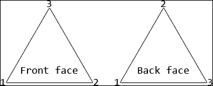

正确设置模型绘制顺序可以让我们通过不绘制不可见面来节省性能，并且让我们的立方体恢复原状。

# 概述

这可能需要吸收很多信息，但如果你已经坚持到了最后，恭喜你！艰难的部分现在已经结束，你对现代版本的 OpenGL、可编程管道和通用渲染已经非常熟悉。甚至 SFML 本身也是基于我们讨论过的基本原理构建的，其中一些我们已经进行了广泛的探讨。

在下一章中，我们将介绍光照的基础知识，以使我们的世界更具动态感。那里见！
