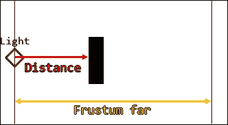
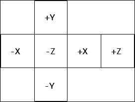
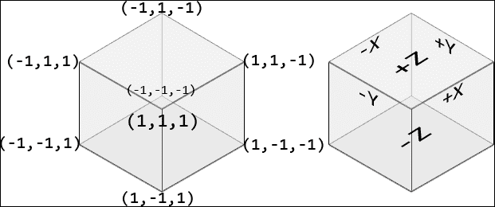
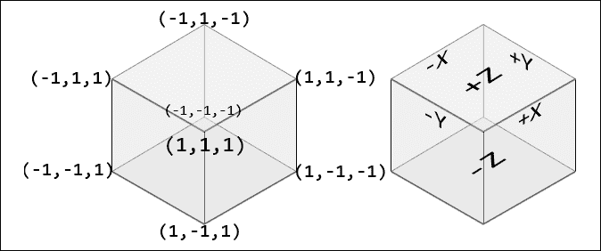
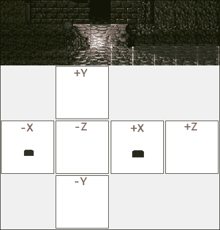
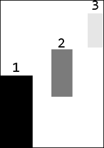
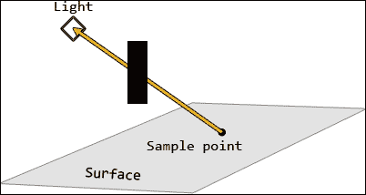
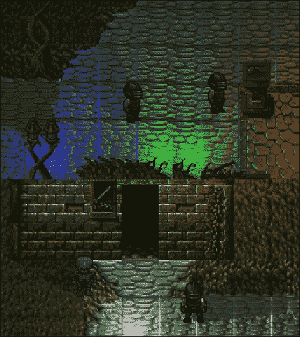

# 第九章. 黑暗的速度 - 光照与阴影

对比差异是存在的本质，正如*阴阳*符号恰当地说明了这一点。光明与黑暗是相反的，但又是互补的，因为它们相互抵消并通过多样性赋予意义。没有黑暗就没有光明，因为它们从未真正分离。通过向我们的世界注入光明，我们不可避免地被迫添加它所创造的黑暗。让我们跟随上一章，真正通过重新引入黑暗的概念来完善我们的光照引擎。

本章我们将涵盖以下主题：

+   使用 OpenGL 渲染到和从立方体贴图纹理采样

+   针对全向点光源的高级阴影映射

+   使用百分比更近过滤来平滑阴影边缘

+   应对阴影映射的常见和令人沮丧的问题

有很多理论需要先解决，所以让我们开始吧！

# 使用第三方软件

在深入研究这样一个难以调试的主题之前，拥有合适的工具总是很令人高兴，这些工具可以减轻头痛并减少在开发过程中可能会问自己的问题的数量。虽然正常代码在*CPU*上可以执行并分析，但着色器代码和 OpenGL 资源，如纹理，处理起来要困难得多。大多数，如果不是所有，*C++*编译器都没有处理*GPU-bound*问题的原生支持。幸运的是，有软件可以更容易地处理这种情况。

在为数不多的可以缓解此类头痛的工具中，*AMD 开发者工具团队*的*CodeXL*脱颖而出。这是一款免费软件，可以作为 Windows 和 Linux 的独立应用程序使用，甚至可以作为 Visual Studio 的插件。其最显著的特点包括在程序运行时查看 OpenGL 资源（包括纹理），分析代码并找到瓶颈，甚至可以在执行时逐步执行着色器代码（前提是有合适的硬件）。您可以通过以下链接找到并下载此工具：[`gpuopen.com/compute-product/codexl/`](http://gpuopen.com/compute-product/codexl/)。

# 影子技术背后的理论

在游戏中实现看起来逼真的阴影时，可以使用几种不同的技术。选择正确的一种不仅可以影响应用程序将要展示的性能类型，还可以极大地影响最终效果的好坏。

在 2D 中并不罕见的一种方法被称为**光线追踪**。根据光线的类型，以适当的方向发射一定数量的光线。然后根据这些光线实际与哪些固体相交来实现阴影。一些简单的游戏倾向于创建一个叠加蒙版，并在几何上填充其“在阴影中”的部分。这个蒙版随后叠加在通常的场景上，并混合以创建代表阴影的暗化区域的美学效果。更高级的 3D 游戏倾向于允许光线在场景中反弹，携带有关它们与特定片段相交的不同信息。当光线到达相机时，它将拥有足够的信息来完成不仅仅是创建简单阴影的任务。需要极其高级光照的场景通常使用这种技术，这是正确的，因为它模仿了现实生活中光线从物体上反弹并击中观察者眼睛的方式。

一种较老但仍然广泛使用的方法是专门创建阴影的**阴影映射**。这种技术的本质是将场景简单地渲染到离屏缓冲区中，从光的角度来看。所有固体的深度信息，而不是颜色信息，都作为像素数据写入此缓冲区。当渲染真实场景时，然后使用一些矩阵运算来采样阴影映射的正确像素，以确定它们是否可以直接被光线看到，从而被照亮，或者是否被某物遮挡，因此处于阴影中。

## 阴影映射

创建阴影映射背后的主要思想是从光的角度渲染场景，并有效地将渲染的特定几何形状的深度编码为颜色值，该颜色值可以在以后进行采样。深度值本身不过是光的位置与顶点位置之间的距离。考虑以下图示：



光与给定顶点之间的距离将通过简单地除以视锥体远距离来转换为颜色值，得到的结果在范围*[0;1]*内。视锥体远值简单地表示光/相机可以看到多远。

## 全向点光源

在上一章中，我们成功创建了从中心点向所有方向发射光线的光源。这类光源有一个非常合适的名字：全向点光源。对于这些光源处理阴影映射带来了一定的复杂性，因为现在需要从六个方向绘制场景，而不是像处理方向光时那样只从一个方向。这意味着我们需要一种良好的方式来存储这个过程的结果，以便可以相对容易地访问。幸运的是，OpenGL 提供了一种我们可以使用的新类型的纹理，即**立方体贴图**。

### 立方体贴图纹理

立方体贴图基本上就是它名字的直译。它是一种特殊的纹理，实际上为立方体的每个面存储了六个纹理。这些纹理以展开的方式内部存储，如图所示：



由于这个特性，为全向光渲染阴影贴图可以简单到只需为立方体贴图的每个方向渲染一次场景。采样它们也非常简单。立方体的形状使其具有一些有用的特性，我们可以利用。如果立方体的所有顶点都与它的绝对中心相关联，那么这些顶点的坐标也可以被视为方向向量：



从立方体中心出发的方向（0, 1, 0）将直接指向*+Y*面的中间，例如。由于立方体贴图纹理的每个面也包含一个代表场景视图的纹理，因此可以使用这些坐标轻松采样。对于 2D 纹理，我们的着色器必须使用`sampler2D`类型并提供采样位置的 2D 坐标。立方体贴图有自己的采样器类型`samplerCube`，并使用 3D 向量进行采样。结果是，3D 向量的最大成员用于确定要采样的面，而其他两个成员成为该特定 2D 纹理/面的 UV 纹理坐标。

### 注意

立方体贴图不仅可以用于阴影映射。3D 环境在实现天空盒和反射/折射材料等时可以利用它们，仅举几个技术。

# 渲染准备

可以肯定地说，所有这些功能都超出了 SFML 的范围，因为 SFML 旨在处理简单的二维概念。虽然我们仍然会使用 SFML 来渲染我们的精灵，但场景的光照和阴影将不得不回退到原始 OpenGL。这包括设置和采样立方体贴图纹理，以及创建、上传和绘制用于表示投射阴影的对象的 3D 原语。

## 表示阴影投射者

虽然 SFML 非常适合渲染精灵，但我们必须记住这些是二维对象。在 3D 空间中，我们的角色将实际上是纸薄的。这意味着我们游戏中的所有阴影投射者都需要一些 3D 几何体作为支撑。记住，这些基本的渲染概念已经在第七章，*向前迈一步，向下提升一级 - OpenGL 基础*中已经介绍过了。让我们首先创建一些系统将使用的通用定义：

```cpp
static const glm::vec3 CubeMapDirections[6] = { 
  { 1.f, 0.f, 0.f },  // 0 = Positive X 
  { -1.f, 0.f, 0.f }, // 1 = Negative X 
  { 0.f, 1.f, 0.f },  // 2 = Positive Y 
  { 0.f, -1.f, 0.f }, // 3 = Negative Y 
  { 0.f, 0.f, 1.f },  // 4 = Positive Z 
  { 0.f, 0.f, -1.f }  // 5 = Negative Z 
}; 

```

这将是我们常用的查找数组，并且在这里正确地定义方向向量非常重要。它代表指向立方体贴图纹理每个面的方向。

我们还将使用另一种常见的数据结构，即用于绘制代表我们的阴影投射者的立方体/3D 矩形的索引列表：

```cpp
static const int ShadowMeshIndices = 36; 
static const GLuint CubeIndices[ShadowMeshIndices] = { 
  0, 4, 7, 7, 3, 0,  // Front 
  0, 1, 5, 5, 4, 0,  // Left 
  3, 7, 6, 6, 2, 3,  // Right 
  1, 2, 6, 6, 5, 1,  // Back 
  7, 4, 5, 5, 6, 7,  // Up 
  1, 0, 3, 3, 2, 1   // Down 
}; 

```

由于立方体有 6 个面，每个面使用 6 个索引来枚举构成它们的两个三角形，因此我们总共有 36 个索引。

最后，我们需要为每个立方体贴图纹理的方向提供一个向上向量：

```cpp
static const glm::vec3 CubeMapUpDirections[6] = { 
  { 0.f, -1.f, 0.f },  // 0 = Positive X 
  { 0.f, -1.f, 0.f }, // 1 = Negative X 
  { 0.f, 0.f, -1.f },  // 2 = Positive Y 
  { 0.f, 0.f, -1.f }, // 3 = Negative Y 
  { 0.f, -1.f, 0.f },  // 4 = Positive Z 
  { 0.f, -1.f, 0.f }  // 5 = Negative Z 
}; 

```

为了为几何体获得正确的阴影映射，我们需要在渲染到阴影立方体贴图时使用这些向上方向。请注意，除非我们正在渲染到立方体贴图的*Y*面，否则*Y*方向始终用作向上方向。这允许渲染的几何体被相机正确地看到。

### 实现阴影投射者结构

表示我们游戏中无形的实体是我们将要解决的问题。为了最小化这种方法的内存使用，它将被分为两部分：

+   **原型**：这是一个包含 OpenGL 使用的上传几何体的句柄的结构。这种类型的对象代表一个独特、独一无二的模型。

+   **投射者**：这是一个包含它所使用的原型的指针以及它自己的变换的结构，用于正确地定位、旋转和缩放。

原型结构需要保留它分配的资源，如下所示：

```cpp
struct ShadowCasterPrototype { 
  ... 
  glm::vec3 m_vertices[ShadowMeshVertices]; 
  GLuint m_VAO; 
  GLuint m_VBO; 
  GLuint m_indexVBO; 
}; 

```

这个结构的构造函数和析构函数将负责这些资源的分配/释放：

```cpp
ShadowCasterPrototype() : m_VAO(0), m_VBO(0), m_indexVBO(0) {} 
~ShadowCasterPrototype() { 
  if (m_VBO) { glDeleteBuffers(1, &m_VBO); } 
  if (m_indexVBO) { glDeleteBuffers(1, &m_indexVBO); } 
  if (m_VAO) { glDeleteVertexArrays(1, &m_VAO); } 
} 

```

一旦内部`m_vertices`数据成员被正确填充，几何体就可以按照以下方式提交给 GPU：

```cpp
void UploadVertices() { 
  if (!m_VAO) { glGenVertexArrays(1, &m_VAO); } 
  glBindVertexArray(m_VAO); 
  if (!m_VBO) { glGenBuffers(1, &m_VBO); } 
  if (!m_indexVBO) { glGenBuffers(1, &m_indexVBO); } 

  glBindBuffer(GL_ARRAY_BUFFER, m_VBO); 
  glBufferData(GL_ARRAY_BUFFER, 
    ShadowMeshVertices * sizeof(m_vertices[0]), m_vertices, 
    GL_STATIC_DRAW); 
  // Position vertex attribute. 
  glEnableVertexAttribArray(0); 
  glVertexAttribPointer(0, 3, GL_FLOAT, GL_FALSE, 
    sizeof(glm::vec3), 0); 

  glBindBuffer(GL_ELEMENT_ARRAY_BUFFER, m_indexVBO); 
  glBufferData(GL_ELEMENT_ARRAY_BUFFER, 
    ShadowMeshIndices * sizeof(CubeIndices[0]), CubeIndices, 
    GL_STATIC_DRAW); 
  glBindBuffer(GL_ARRAY_BUFFER, 0); 
  glBindBuffer(GL_ELEMENT_ARRAY_BUFFER, 0); 

  glBindVertexArray(0); 
} 

```

一旦正确创建了顶点数组对象以及用于顶点和索引的两个缓冲区，它们就会被绑定并用于推送数据。注意代码中处理顶点属性的突出部分。由于这个几何体仅用于生成阴影，我们实际上不需要除了顶点位置之外的其他任何东西。将所有这些信息转换为表示光源距离的颜色值的必要数学计算将在着色器内部完成。

此外，请注意这里渲染此几何体时使用的索引。这样做可以节省空间，因为我们不需要像其他情况下那样将两倍的顶点上传到 GPU。

阴影原语的绘制就像人们想象的那样简单：

```cpp
void Draw() { 
  glBindVertexArray(m_VAO); 
  glBindBuffer(GL_ARRAY_BUFFER, m_VBO); 
  glBindBuffer(GL_ELEMENT_ARRAY_BUFFER, m_indexVBO); 
  glDrawElements(GL_TRIANGLES, ShadowMeshIndices, 
    GL_UNSIGNED_INT, 0); // 0 = offset. 
  glBindBuffer(GL_ELEMENT_ARRAY_BUFFER, 0); 
  glBindBuffer(GL_ARRAY_BUFFER, 0); 
  glBindVertexArray(0); 
} 

```

一旦所有缓冲区都绑定，我们就调用`glDrawElements`。让它知道我们在绘制三角形，给方法提供要使用的索引计数，指定它们的数据类型，并提供这些索引的正确偏移量，在这种情况下是*0*。

最后，因为我们使用原型来存储独特的几何体片段，所以为方便检查匹配的形状而重载`==`运算符肯定是有用的：

```cpp
bool operator == (const ShadowCasterPrototype& l_rhs) const { 
  for (unsigned short i = 0; i < ShadowMeshVertices; ++i) { 
    if (m_vertices[i] != l_rhs.m_vertices[i]) { return false; } 
  } 
  return true; 
} 

```

遍历并比较阴影原语中的每个顶点与提供的参数的等效顶点。到目前为止，没有什么异常之处！

当原型被存储时，需要以某种方式识别它们。在这种情况下，使用字符串标识符可以非常直观，因此让我们为这个结构定义一个合适的存储容器类型：

```cpp
using ShadowCasterPrototypes = std::unordered_map<std::string, 
  std::unique_ptr<ShadowCasterPrototype>>; 

```

在处理完这些之后，我们可以实现我们的简单 `ShadowCaster` 结构，它将包含有关原型的所有变量信息：

```cpp
struct ShadowCaster { 
  ShadowCaster() : m_prototype(nullptr) { } 
  ShadowCasterPrototype* m_prototype; 
  GL_Transform m_transform; 
}; 

```

如您所见，这是一个非常简单的数据结构，它包含一个指向它使用的原型的指针，以及它自己的 `GL_Transform` 成员，该成员将存储对象的位移信息。

影子投射器也需要一个合适的存储数据类型：

```cpp
using ShadowCasters = std::vector<std::unique_ptr<ShadowCaster>>; 

```

这样，我们就有了创建和以内存保守的方式操作不同类型阴影投射原型的手段。

## 创建变换类

我们使用的变换类与第七章，*向前迈一步，向下迈一级 - OpenGL 基础*中的完全相同。为了快速复习，让我们看看这个过程中我们需要的重要部分——模型的生成矩阵：

```cpp
glm::mat4 GL_Transform::GetModelMatrix() { 
  glm::mat4 matrix_pos = glm::translate(m_position); 
  glm::mat4 matrix_scale = glm::scale(m_scale); 
  // Represent each stored rotation as a different matrix, 
  // because we store angles. 
  //                Directional vector  x, y, z 
  glm::mat4 matrix_rotX = 
    glm::rotate(m_rotation.x, glm::vec3(1, 0, 0)); 
  glm::mat4 matrix_rotY = 
    glm::rotate(m_rotation.y, glm::vec3(0, 1, 0)); 
  glm::mat4 matrix_rotZ = 
    glm::rotate(m_rotation.z, glm::vec3(0, 0, 1)); 
  // Create a rotation matrix. Multiply in reverse order it 
  // needs to be applied. 
  glm::mat4 matrix_rotation = matrix_rotZ*matrix_rotY*matrix_rotX; 
  // Apply transforms in reverse order they need to be applied in. 
  return matrix_pos * matrix_rotation * matrix_scale; 
} 

```

到现在为止，所有这些都应该很熟悉，如果不熟悉，快速浏览一下第七章，*向前迈一步，向下迈一级 - OpenGL 基础*，这绝对是有序的。然而，主要思想是按照正确的顺序组合平移、缩放和旋转矩阵，以获取一个包含将顶点从对象空间转换到世界空间所需的所有信息的单个矩阵。

## 创建相机类

与 `GL_Transform` 类类似，我们还将从第七章，*向前迈一步，向下迈一级 - OpenGL 基础*中引入 `GL_Camera` 类。当我们渲染阴影贴图时，所有六个方向的投影和视图矩阵都需要提交给相应的着色器。这使得 `GL_Camera` 类非常适合表示场景中的光源，该光源需要将其看到的图像绘制到立方体贴图中。再次强调，这已经讨论过了，所以我们只是快速浏览一下：

```cpp
GL_Camera::GL_Camera(const glm::vec3& l_pos, float l_fieldOfView, 
  float l_aspectRatio, float l_frustumNear, float l_frustumFar) 
  :m_position(l_pos),m_fov(l_fieldOfView),m_aspect(l_aspectRatio), 
  m_frustumNear(l_frustumNear), m_frustumFar(l_frustumFar) 
{ 
  RecalculatePerspective(); 
  m_forwardDir = glm::vec3(0.f, 0.f, 1.f); 
  m_upDir = glm::vec3(0.f, 1.f, 0.f); 
} 

```

很合适地，阴影贴图将使用透视投影来绘制。在收集了所有必要的视图截锥体信息之后，我们可以开始构建将那些顶点从世界空间转换到光源视图空间以及裁剪空间的矩阵：

```cpp
glm::mat4 GL_Camera::GetViewMatrix() { 
  return glm::lookAt(m_position, m_position + m_forwardDir, 
    m_upDir); 
} 
glm::mat4& GL_Camera::GetProjectionMatrix() { 
  return m_perspectiveMatrix; 
} 

void GL_Camera::RecalculatePerspective() { 
  m_perspectiveMatrix = glm::perspective(glm::radians(m_fov), 
    m_aspect, m_frustumNear, m_frustumFar); 
} 

```

我们使用 `glm::lookAt` 来构造光摄像机的视图矩阵。然后，在另一个方法中使用 `glm::perspective` 来创建摄像机的透视投影矩阵。

### 注意

非常重要的是要记住，`glm::perspective` 函数将视锥体的视场角度作为第一个参数。它期望这个参数是以**弧度**为单位，而不是以度为单位！因为我们是以度为单位存储的，所以使用了 `glm::radians` 来转换这个值。这是一个很容易犯的错误，很多人最终会遇到他们的阴影映射不正确的问题。

## 定义立方体贴图纹理类

现在我们已经弄清楚了几何存储和光视锥体的表示，是时候创建我们将用于实际渲染场景的立方体贴图了。

让我们从为它创建一个简单的类定义开始：

```cpp
class CubeTexture { 
public: 
  CubeTexture(); 
  ~CubeTexture(); 

  void RenderingBind(); 
  void RenderingUnbind(); 
  void SamplingBind(unsigned int l_unit); 
  void SamplingUnbind(unsigned int l_unit); 

  GLuint GetTextureHandle()const; 

  void RenderToFace(unsigned int l_face); 
  void Clear(); 

  static const unsigned int TextureWidth = 1024; 
  static const unsigned int TextureHeight = 1024; 
private: 
  void Create(); 
  void CreateBuffers(); 
  void CreateFaces(); 
  GLuint m_textureID; // Texture handle. 
  GLuint m_fbo; // Frame-buffer handle. 
  GLuint m_rbo; // Render-buffer handle. 
}; 

```

这个纹理将被用于两个独特的操作：渲染到纹理和从纹理采样。这两个过程都有一个用于绑定和解绑纹理的方法，值得注意的是，采样步骤还需要一个纹理单元作为参数。我们很快就会介绍这一点。这个类还需要有一个单独的方法，当六个面被渲染时需要调用。

虽然立方体贴图可以用于很多事情，但在这个特定的例子中，我们只是将它们用于阴影映射。因此，纹理的尺寸被定义为 *1024px* 的常量。

### 小贴士

立方体贴图纹理的大小非常重要，如果太小，可能会导致伪影。较小的纹理会导致采样不准确，并造成阴影边缘参差不齐。

最后，除了创建纹理和所有必要的缓冲区时使用的辅助方法之外，我们还存储了纹理本身、帧缓冲对象和渲染缓冲对象的句柄。直到这一点，最后两个对象还没有被介绍，所以让我们直接深入了解它们的作用！

### 实现立方体贴图类

让我们从始终如一地介绍这个特定的 OpenGL 资产的构建和销毁开始：

```cpp
CubeTexture::CubeTexture() : m_textureID(0), m_fbo(0), m_rbo(0) 
  { Create(); } 
CubeTexture::~CubeTexture() { 
  if (m_fbo) { glDeleteFramebuffers(1, &m_fbo); } 
  if (m_rbo) { glDeleteRenderbuffers(1, &m_rbo); } 
  if (m_textureID) { glDeleteTextures(1, &m_textureID); } 
} 

```

与几何类类似，句柄被初始化为 *0* 的值，以指示它们的状态尚未设置。析构函数会检查这些值，并调用用于缓冲区/纹理的适当 `glDelete` 方法。

创建立方体贴图与常规 2D 纹理非常相似，所以让我们看看：

```cpp
void CubeTexture::Create() { 
  if (m_textureID) { return; } 
  glGenTextures(1, &m_textureID); 
  CreateFaces(); 
  glTexParameteri(GL_TEXTURE_CUBE_MAP, 
    GL_TEXTURE_MAG_FILTER, GL_NEAREST); 
  glTexParameteri(GL_TEXTURE_CUBE_MAP, 
    GL_TEXTURE_MIN_FILTER, GL_NEAREST); 
  glTexParameteri(GL_TEXTURE_CUBE_MAP, 
    GL_TEXTURE_WRAP_R, GL_CLAMP_TO_EDGE); 
  glTexParameteri(GL_TEXTURE_CUBE_MAP, 
    GL_TEXTURE_WRAP_S, GL_CLAMP_TO_EDGE); 
  glTexParameteri(GL_TEXTURE_CUBE_MAP, 
    GL_TEXTURE_WRAP_T, GL_CLAMP_TO_EDGE); 

  CreateBuffers(); 
  glBindTexture(GL_TEXTURE_CUBE_MAP, 0); 
} 

```

首先，进行一个检查以确保我们没有已经分配这个对象。如果情况不是这样，就像为 2D 纹理一样使用 `glGenTextures` 来为纹理对象创建空间。然后调用我们的第一个私有辅助方法来创建立方体贴图的所有六个面，这把我们带到了参数设置。*Min/Mag* 过滤器被设置为使用最近邻插值，但必要时可以转换为 `GL_LINEAR` 以获得更平滑的结果。然后设置纹理包装参数，使它们被夹在边缘，从而在面之间提供无缝过渡。

### 注意

注意，纹理包裹有三个参数：R、S 和 T。这是因为我们现在处理的是三维纹理类型，所以每个轴都必须考虑在内。

最后，在解绑纹理之前，我们调用另一个辅助方法来创建缓冲区。

立方体贴图面的创建，再次，与我们在第七章中设置其 2D 对应物的方式相似，即《向前一步，向下一个级别 - OpenGL 基础》，但技巧是针对每个面只做一次：

```cpp
void CubeTexture::CreateFaces() { 
  glBindTexture(GL_TEXTURE_CUBE_MAP, m_textureID); 
  for (auto face = 0; face < 6; ++face) { 
    glTexImage2D(GL_TEXTURE_CUBE_MAP_POSITIVE_X + face, 0,GL_RGBA, 
      TextureWidth, TextureHeight, 0, GL_RGBA, 
      GL_UNSIGNED_BYTE, nullptr); 
  } 
} 

```

一旦纹理被绑定，我们就遍历每个面，并使用`glTexImage2D`来设置面。每个面都被视为一个 2D 纹理，所以这部分应该不会有什么新内容。注意，然而，使用`GL_TEXTURE_CUBE_MAP_POSITIVE_X`定义的使用是第一个参数。2D 纹理会接受一个`GL_TEXTURE_2D`定义，但由于立方体贴图以展开的方式存储，正确获取这部分内容非常重要。

### 注意

`GL_TEXTURE_CUBE_MAP_`*有六个定义。它们都定义在一行中，即*+X*、*-X*、*+Y*、*-Y*、*+Z*和*-Z*，这就是为什么我们可以通过简单地将一个整数加到定义中，使用一些基本的算术来将正确的面传递给函数。

清除立方体贴图纹理相对简单：

```cpp
void CubeTexture::Clear() { 
  glClearColor(1.f, 1.f, 1.f, 1.f); 
  glClear(GL_COLOR_BUFFER_BIT | GL_DEPTH_BUFFER_BIT); 
} 

```

注意，我们指定清除颜色为白色，因为这代表在阴影图中从光源到无穷远的距离。

最后，采样立方体贴图实际上与采样常规 2D 纹理没有区别：

```cpp
void CubeTexture::SamplingBind(unsigned int l_unit) { 
  assert(l_unit >= 0 && l_unit <= 31); 
  glActiveTexture(GL_TEXTURE0 + l_unit); 
  glEnable(GL_TEXTURE_CUBE_MAP); 
  glBindTexture(GL_TEXTURE_CUBE_MAP, m_textureID); 
} 
void CubeTexture::SamplingUnbind(unsigned int l_unit) { 
  assert(l_unit >= 0 && l_unit <= 31); 
  glActiveTexture(GL_TEXTURE0 + l_unit); 
  glBindTexture(GL_TEXTURE_CUBE_MAP, 0); 
  glDisable(GL_TEXTURE_CUBE_MAP); 
} 

```

对于采样，绑定和解绑都需要我们传入我们想要使用的纹理单元。一旦单元被激活，我们应该启用立方体贴图的使用，然后绑定立方体贴图纹理句柄。解绑纹理时应该遵循此过程的逆过程。

### 注意

请记住，片段着色器中的相应`sampler2D`/`samplerCube`统一变量被设置为保存它们所采样的纹理的单元 ID。当纹理被绑定时，该单元的特定 ID 将从那时起在着色器中用于访问，而不是实际的纹理句柄。

#### 渲染到离屏缓冲区

我们在第七章中没有涵盖的内容是，将场景渲染到缓冲区图像，而不是直接在屏幕上绘制。幸运的是，因为 OpenGL 作为一个巨大的状态机运行，这只是一个在正确的时间调用正确函数的问题，并不需要我们以任何方式重新设计渲染过程。

为了渲染到纹理对象，我们必须使用所谓的**帧缓冲区**。这是一个非常基本的对象，它将绘制调用指向 FBO 绑定的纹理。虽然 FBO 对于颜色信息很有用，但它们并不携带深度分量。一个**渲染缓冲区**对象用于将附加分量附加到 FBO 的目的。

绘制离屏内容的第一个步骤是创建一个`FRAMEBUFFER`对象和一个`RENDERBUFFER`对象：

```cpp
void CubeTexture::CreateBuffers() { 
  glGenFramebuffers(1, &m_fbo); 
  glBindFramebuffer(GL_FRAMEBUFFER, m_fbo); 
  glGenRenderbuffers(1, &m_rbo); 
  glBindRenderbuffer(GL_RENDERBUFFER, m_rbo); 

  glRenderbufferStorage(GL_RENDERBUFFER, GL_DEPTH_COMPONENT24, 
    TextureWidth, TextureHeight); 
  glFramebufferRenderbuffer(GL_FRAMEBUFFER, GL_DEPTH_ATTACHMENT, 
    GL_RENDERBUFFER, m_rbo); 
  auto status = glCheckFramebufferStatus(GL_FRAMEBUFFER); 
  if (status != GL_FRAMEBUFFER_COMPLETE) { ... } // Print status. 
  glBindFramebuffer(GL_FRAMEBUFFER, 0); 
} 

```

在生成缓冲区之后，渲染缓冲区需要为其将提供的任何附加分量分配一些存储空间。在这种情况下，我们只是处理深度分量。

### 提示

`GL_DEPTH_COMPONENT24`简单地表示每个深度像素的大小为 24 位。这个定义可以被一个基本的`GL_DEPTH_COMPONENT`所替代，这将允许应用程序选择像素大小。

然后将深度渲染缓冲区作为深度附加组件附加到 FBO 上。最后，如果在这次过程中出现任何错误，`glCheckFramebufferStatus`用于捕获它们。下一行简单地使用`std::cout`打印出状态变量。

### 注意

当不再使用时，帧缓冲区应该始终使用`glBindFramebuffer(GL_FRAMEBUFFER, 0)`解绑！这是我们回到将后续几何图形绘制到屏幕上而不是缓冲区纹理的唯一方法。

现在我们已经设置了缓冲区，让我们使用它们！当想要向缓冲区纹理绘制时，首先必须绑定帧缓冲区：

```cpp
void CubeTexture::RenderingBind() { 
  glBindFramebuffer(GL_FRAMEBUFFER, m_fbo); 
} 
void CubeTexture::RenderingUnbind() { 
  glBindFramebuffer(GL_FRAMEBUFFER, 0); // Render to screen. 
} 

```

在完成使用后，解绑 FBO 是必要的。使用`RenderingUnbind()`意味着任何后续的几何图形都将绘制到屏幕上。

当然，仅仅因为 FBO 被绑定，并不意味着我们会神奇地开始向立方体贴图绘制。为了做到这一点，我们必须一次绘制立方体贴图的一个面，通过将帧缓冲区绑定到立方体贴图所需的面：

```cpp
void CubeTexture::RenderToFace(unsigned int l_face) { 
  glFramebufferTexture2D(GL_FRAMEBUFFER, GL_COLOR_ATTACHMENT0, 
    GL_TEXTURE_CUBE_MAP_POSITIVE_X + l_face, m_textureID, 0); 
  Clear(); 
} 

```

`glFramebufferTexture2D`的第一个参数简单地表示我们正在处理一个 FBO。然后我们指定我们想要使用`GL_COLOR_ATTACHMENT0`。帧缓冲区可以有多个附加组件，并使用着色器将不同的数据输出到每个附加组件。就我们的目的而言，我们只需要使用一个附加组件。

由于我们一次渲染立方体贴图的一个面，基本的定义算术再次被用来选择正确的立方体面进行渲染。最后，在调用`Clear()`清除当前绑定的面之前，将纹理句柄和米级映射级别传递进去，以完成白色面的清除。

# 渲染阴影贴图

现在我们已经拥有了开始渲染场景阴影贴图所需的一切。为了支持这个功能，需要对`LightManager`类进行一些相当重大的修改，更不用说在后续过程中正确存储和使用这些阴影贴图纹理了。让我们看看我们需要做出哪些修改才能实现这一点。

## 修改光管理器

首先，让我们对光照管理器类定义做一些调整。我们需要几个方法来添加阴影投射者原型、添加实际的阴影投射对象以及渲染阴影贴图：

```cpp
class LightManager { 
public: 
  ... 
  const std::string& AddCasterPrototype(const std::string& l_name, 
    std::unique_ptr<ShadowCasterPrototype> l_caster); 
  ShadowCaster* AddShadowCaster(const std::string& l_prototypeName); 
  ShadowCasterPrototype* GetPrototype(const std::string& l_name); 
  ... 
private: 
  ... 
  void DrawShadowMap(GLuint l_shadowShader, LightBase& l_light, 
    unsigned int l_texture); 
  ... 
  ShadowCasterPrototypes m_casterPrototypes; 
  ShadowCasters m_shadowCasters; 
  GL_Camera m_perspectiveCamera; 
  std::unique_ptr<CubeTexture> m_cubeTextures[LightsPerPass]; 
  ... 
}; 

```

除了上述方法之外，`LightManager`类还需要存储额外的信息来支持这些更改。需要使用阴影原语原型和原语本身的一个列表来管理必须投射阴影的实体。此外，我们还需要有将用作光照视点的相机类。

最后，需要一个立方体贴图纹理的数组，因为屏幕上的每个光线都可能从完全不同的视角看到场景。这个数组的大小仅仅是每个着色器通道中我们处理的灯光数量，因为这些立方体贴图纹理只需要在它们被采样时存在。一旦完成特定灯光的照明通道，这些纹理就可以被重新用于下一批。

### 实现光照管理器更改

对`LightManager`类构造函数的调整相当简单，以便实现这一点：

```cpp
LightManager::LightManager(...) : ..., 
  m_perspectiveCamera({0.f, 0.f, 0.f}, 90.f, 
    CubeTexture::TextureWidth / CubeTexture::TextureHeight, 
    1.f, 200.f) 
{ 
  ... 
  for (auto i = 0; i < LightsPerPass; ++i) { 
    m_cubeTextures[i] = std::make_unique<CubeTexture>(); 
  } 
} 

```

我们首先需要关注的是正确设置透视相机。它被初始化为位于世界中的绝对零坐标，并且其视场角设置为**90 度**。透视相机的纵横比显然将是*1*，因为我们用于渲染阴影投射者的纹理的宽度和高度是相同的。视图视锥的最小值设置为*1.f*，这确保了当光线与面相交时，几何体不会被渲染。然而，最大值将根据每个光线的半径而变化。这个默认值实际上并不重要。

### 注意

将场景渲染到立方体贴图纹理的视场角设置为**90**度对于渲染非常重要，因为这是场景能够被完全捕捉到每个相机所看的方向的唯一方式。这个值设置得太低意味着会出现盲点，而设置得太高则会导致重叠。

在构造函数中最后需要确保所有立方体贴图纹理都正确分配。

接下来，让我们关注向光照管理器添加阴影投射者原型：

```cpp
const std::string& LightManager::AddCasterPrototype( 
  const std::string& l_name, 
  std::unique_ptr<ShadowCasterPrototype> l_caster) 
{ 
  auto itr = m_casterPrototypes.find(l_name); 
  if (itr != m_casterPrototypes.end()) { 
    l_caster.release(); return l_name; 
  } 
  for (auto& prototype : m_casterPrototypes) { 
    if (*prototype.second == *l_caster) { 
      l_caster.release(); return prototype.first; 
    } 
  } 
  m_window->GetRenderWindow()->setActive(true); 
  l_caster->UploadVertices(); 
  m_casterPrototypes.emplace(l_name, std::move(l_caster)); 
  return l_name; 
} 

```

当添加原型时，调用此特定方法的调用者将提供一个字符串标识符，以及将已建立和分配的智能指针移动到第二个参数之后，在顶点被正确加载之后。首先，我们确保提供的参数名称尚未被占用。如果是，则在释放作为参数提供的原型的内存之后立即返回相同的字符串。

第二个测试确保没有以不同的名称存在具有精确顶点排列的原型，通过遍历每个存储的原型并使用我们之前实现的`==`运算符来比较这两个原型。如果找到，则在释放`l_caster`之后返回该原型的名称。

最后，由于我们可以确信我们添加的原型是完全独特的，渲染窗口被设置为活动状态。对象上的`UploadVertices`被调用以将数据发送到 GPU，并将原型放置在指定的容器中。

### 注意

使用`sf::RenderWindow::setActive(true)`确保在上传顶点时使用主上下文。OpenGL **不**在不同上下文之间共享其状态，由于 SFML 喜欢在内部保持多个不同的上下文活跃，因此在所有操作期间选择主上下文是至关重要的。

添加阴影投射器本身也相对简单：

```cpp
ShadowCaster* LightManager::AddShadowCaster( 
  const std::string& l_prototypeName) 
{ 
  auto prototype = GetPrototype(l_prototypeName); 
  if (!prototype) { return nullptr; } 
  m_shadowCasters.emplace_back(); 
  auto& caster = m_shadowCasters.back(); 
  caster = std::make_unique<ShadowCaster>(); 
  caster->m_prototype = prototype; 
  return caster.get(); 
} 

```

此方法仅需要一个用于原型的字符串标识符，并在原型存在的情况下为新的阴影投射器对象分配空间。注意`return`语句之前的行。它确保找到的原型被传递给阴影投射器，以便它可以在以后使用该原型。

获取原型非常简单，只需要在`unordered_map`容器中进行查找：

```cpp
ShadowCasterPrototype* LightManager::GetPrototype( 
  const std::string& l_name) 
{ 
  auto itr = m_casterPrototypes.find(l_name); 
  if (itr == m_casterPrototypes.end()) { return nullptr; } 
  return itr->second.get(); 
} 

```

我们现在只有一个任务，那就是绘制阴影图！

#### 绘制实际的阴影图

为了保持可管理和模块化，我们将`DrawShadowMap`方法分解成更小的部分，这样我们就可以独立于其他代码讨论它们。让我们首先看看该方法的实际蓝图：

```cpp
void LightManager::DrawShadowMap(GLuint l_shadowShader, 
  LightBase& l_light, unsigned int l_texture) 
{ 
  ... 
} 

```

首先，它接受一个用于阴影传递着色器的句柄。这几乎是原始的，因为句柄是一个简单的无符号整数，我们将在绘制之前将其绑定。第二个参数是我们当前正在绘制阴影图的光的引用。最后，我们有一个作为当前传递中渲染的光的 ID 的*无符号整数*。在每款着色器传递有 4 个光的情况下，此值将在 0 到 3 之间变化，然后在下一个传递中重置。它将被用作立方体贴图纹理查找的索引。

现在，是时候真正深入到阴影图的渲染中了，从启用必要的 OpenGL 功能开始：

```cpp
glEnable(GL_DEPTH_TEST); 
glEnable(GL_CULL_FACE); 
glCullFace(GL_FRONT); 

```

我们在这里将要使用的第一和最明显的特性是深度测试。这确保了不同的阴影投射几何体不会被错误地渲染，避免相互重叠。然后，我们将执行一些面剔除。然而，与正常几何体不同，我们将只剔除前向面。绘制阴影几何体的背面将确保我们使用的精灵的前面会被照亮，因为阴影图中存储的深度是阴影投射原型的最背面。

```cpp
glUseProgram(l_shadowShader); 
auto u_model = glGetUniformLocation(l_shadowShader, "m_model"); 
auto u_view = glGetUniformLocation(l_shadowShader, "m_view"); 
auto u_proj = glGetUniformLocation(l_shadowShader, "m_proj"); 
auto u_lightPos = glGetUniformLocation(l_shadowShader,"lightPos"); 
auto u_frustumFar = glGetUniformLocation(l_shadowShader, 
  "frustumFar"); 

```

接下来这部分处理的是实际绑定阴影传递着色器并获取不同着色器统一变量的位置。我们有一个模型矩阵统一变量、一个视图矩阵统一变量、一个投影矩阵统一变量、一个灯光位置统一变量以及一个用于更新的视锥体远端统一变量。

```cpp
auto& texture = m_cubeTextures[l_texture]; 
auto l_pos = l_light.m_lightPos; 
m_perspectiveCamera.SetPosition({ l_pos.x, l_pos.z, l_pos.y }); 
glViewport( 
  0, 0, CubeTexture::TextureWidth, CubeTexture::TextureHeight); 
texture->RenderingBind(); 
glUniform3f(u_lightPos, l_pos.x, l_pos.z, l_pos.y); 

```

代码的这一部分获取了特定灯光的适当立方体贴图纹理的引用，存储了灯光位置，并将透视摄像机定位在该确切位置。

### 注意

注意交换的 *Z* 和 *Y* 坐标。默认情况下，OpenGL 处理右手坐标系。它还处理默认的 *up* 方向是 *+Y* 轴。我们的灯光使用 *+Z* 轴作为 *up* 方向来存储坐标。

在设置好摄像机后，`glViewport` 被调用以调整渲染目标的大小为立方体贴图纹理的大小。然后，立方体贴图被绑定用于渲染，并将灯光位置统一变量提交给着色器。就像之前一样，这里的 *Z* 和 *Y* 方向被交换。

在设置完成后，我们可以开始为立方体贴图的每个面渲染场景：

```cpp
for (auto face = 0; face < 6; ++face) { 
  texture->RenderToFace(face); 
  m_perspectiveCamera.SetForwardDir(CubeMapDirections[face]); 
  m_perspectiveCamera.SetUpDir(CubeMapUpDirections[face]); 
  m_perspectiveCamera.SetFrustumFar(l_light.m_radius); 
  m_perspectiveCamera.RecalculatePerspective(); 
  auto viewMat = m_perspectiveCamera.GetViewMatrix(); 
  auto& projMat = m_perspectiveCamera.GetProjectionMatrix(); 
  glUniformMatrix4fv(u_view, 1, GL_FALSE, &viewMat[0][0]); 
  glUniformMatrix4fv(u_proj, 1, GL_FALSE, &projMat[0][0]); 
  glUniform1f(u_frustumFar, m_perspectiveCamera.GetFrustumFar()); 
  for (auto& caster : m_shadowCasters) { 
    auto modelMat = caster->m_transform.GetModelMatrix(); 
    glUniformMatrix4fv(u_model, 1, GL_FALSE, &modelMat[0][0]); 
    caster->m_prototype->Draw(); 
  } 
} 

```

首先告诉立方体贴图纹理我们希望渲染哪个面，以正确设置 FBO。然后，将那个特定面的前向和向上方向传递给灯光的摄像机，以及视锥体远值，即灯光的半径。然后重新计算透视投影矩阵，并从 `GL_Camera` 获取视图和投影矩阵，将它们以及视锥体远值传递给着色器。

最后，对于立方体贴图的 6 个面，我们遍历所有的阴影投射对象，检索它们的模型矩阵，将它们传递到着色器中，并调用原型的 `Draw()` 方法，该方法负责渲染。

在绘制完所有纹理面之后，我们需要将状态设置回渲染阴影图之前的状态：

```cpp
texture->RenderingUnbind(); 
glViewport( 
  0, 0, m_window->GetWindowSize().x, m_window->GetWindowSize().y); 
glDisable(GL_DEPTH_TEST); 
glDisable(GL_CULL_FACE); 
glCullFace(GL_BACK); 

```

首先将纹理从渲染中解绑，这会将 FBO 设置为 0，并允许我们再次绘制到屏幕上。然后，视口被调整回窗口原始大小，深度测试和面剔除都被禁用。

## 阴影传递着色器

阴影映射的 C++ 方面已经完成，但我们还有一些逻辑需要覆盖。这里的着色器实际上起着将顶点信息转换为深度的关键作用。让我们首先看看顶点着色器：

```cpp
in vec3 position; 
uniform mat4 m_model; 
uniform mat4 m_view; 
uniform mat4 m_proj; 
uniform vec3 lightPos; 
uniform float frustumFar; 
out float distance; 

void main() { 
  vec4 worldCoords = m_model * vec4(position, 1.0); 
  float d = length(worldCoords.xyz - lightPos); 
  d /= frustumFar; 
  gl_Position = m_proj * m_view * worldCoords; 
  distance = d; 
} 

```

我们在 GPU 上接收到的顶点位置`vec3`输入坐标是在局部空间中，这意味着它们必须通过多个矩阵传递，以便按顺序转换到世界、视图和裁剪空间。首先计算世界坐标并单独存储，因为它们用于确定顶点与光源之间的距离。这个距离存储在局部变量`d`中，然后除以视锥体的远值，将其转换为范围*[0;1]*。然后使用世界、视图和投影矩阵将顶点位置转换为裁剪空间，并将距离值传递到片段着色器，在那里它被存储为特定像素的颜色：

```cpp
in float distance; 

void main() { 
  gl_FragColor = vec4(distance, distance, distance, 1.0); 
} 

```

记住，顶点着色器的输出变量在顶点之间进行插值，所以这些顶点之间的每个片段将以渐变的方式着色。

## 结果

尽管我们在这个项目中还没有任何实际的几何形状来查看这个结果，一旦完成，它将看起来像以下截图：



在这个特定的情况下，原始形状非常接近光源，因此它们被着色得非常暗。对于更大的距离，阴影贴图的一个特定面看起来可能像这样，其中*#1*是靠近摄像机的原始形状，*#2*更远，而*#3*接近视锥体的远端：



# 适配光照阶段

在渲染出阴影贴图后，可能会非常诱人地想要在我们的现有代码中尝试采样它们，因为困难的部分已经过去了，对吧？然而，并非完全如此。虽然我们之前的方案非常接近，但遗憾的是，由于 SFML 的限制，我们无法进行立方体贴图的采样。采样本身并不是问题，真正的问题是绑定立方体贴图以便进行采样。记住，采样是通过在着色器内部将采样器的统一值设置为**纹理单元 ID**来实现的，这个 ID 绑定到我们在 C++代码中的纹理上。SFML 每次在屏幕上渲染或在渲染纹理上渲染时都会重置这些单元。我们之前没有遇到这个问题是因为我们可以通过 SFML 的`sf::Shader`类设置着色器的统一变量，该类跟踪纹理的引用，并在使用着色器进行渲染时将它们绑定到适当的单元。这都很好，但是当需要采样 SFML 不支持的其他类型的纹理时，比如立方体贴图，问题就出现了。这是唯一一个需要我们在光照阶段完全排除 SFML，并使用原始 OpenGL 的问题。

## 替换 m_fullScreenQuad

首先，替换`LightManager`类内部的`sf::VertexArray`对象，该对象用于重新绘制整个缓冲区纹理，这是我们用于多通道渲染的。由于在这里必须完全排除 SFML，我们无法使用其内置的顶点数组类并渲染一个覆盖整个屏幕的四边形。否则，SFML 将在渲染之前强制其自己的状态，这不会与我们的系统正确配合，因为它每次都会重新分配自己的纹理单元。

### 定义一个通用的帧缓冲区对象

就像之前一样，我们需要创建一个帧缓冲区对象以便将渲染到纹理而不是屏幕上。由于我们已经为立方体贴图做过一次，让我们快速浏览一下用于 2D 纹理的通用 FBO 类的实现：

```cpp
class GenericFBO { 
public: 
  GenericFBO(const sf::Vector2u& l_size); 
  ~GenericFBO(); 

  void Create(); 

  void RenderingBind(GLuint l_texture); 
  void RenderingUnbind(); 
private: 
  sf::Vector2u m_size; 
  GLuint m_FBO; 
  GLuint m_RBO; 
}; 

```

主要区别在于我们现在使用纹理的变量大小。它们可能在某个时刻发生变化，因此将大小内部存储是一个好主意，而不是使用常量值。

#### 实现一个通用的帧缓冲区对象

这个类的构造函数和析构函数再次处理资源管理：

```cpp
GenericFBO::GenericFBO(const sf::Vector2u& l_size) : 
  m_size(l_size), m_FBO(0), m_RBO(0) {} 

GenericFBO::~GenericFBO() { 
  if (m_FBO) { glDeleteFramebuffers(1, &m_FBO); } 
  if (m_RBO) { glDeleteRenderbuffers(1, &m_RBO); } 
} 

```

我们没有存储纹理句柄，因为这也将根据情况而变化。

为此类创建缓冲区与之前我们所做的大致相同：

```cpp
void GenericFBO::Create() { 
  if (!m_FBO) { glCreateFramebuffers(1, &m_FBO); } 
  glBindFramebuffer(GL_FRAMEBUFFER, m_FBO); 
  if (!m_RBO) { glCreateRenderbuffers(1, &m_RBO); } 
  glBindRenderbuffer(GL_RENDERBUFFER, m_RBO); 

  glRenderbufferStorage(GL_RENDERBUFFER, GL_DEPTH_COMPONENT24, 
    m_size.x, m_size.y); 
  glFramebufferRenderbuffer(GL_FRAMEBUFFER, GL_DEPTH_ATTACHMENT, 
    GL_RENDERBUFFER, m_RBO); 
  auto status = glCheckFramebufferStatus(GL_FRAMEBUFFER); 
  if (status != GL_FRAMEBUFFER_COMPLETE) { ... } // Print status. 
  glBindFramebuffer(GL_FRAMEBUFFER, 0); 
  glBindRenderbuffer(GL_RENDERBUFFER, 0); 
} 

```

就像立方体贴图纹理一样，我们需要将深度渲染缓冲区附加到 FBO 上。在分配和绑定后，FBO 会检查错误，并且两个缓冲区都会解绑。

将 FBO 渲染到 2D 纹理要容易得多。渲染绑定需要获取一个纹理句柄，因为内部没有存储，因为这个类是一个通用的类，它将用于许多不同的纹理：

```cpp
void GenericFBO::RenderingBind(GLuint l_texture) { 
  glBindFramebuffer(GL_FRAMEBUFFER, m_FBO); 
  glFramebufferTexture2D(GL_FRAMEBUFFER, GL_COLOR_ATTACHMENT0, 
    GL_TEXTURE_2D, l_texture, 0); 
} 

void GenericFBO::RenderingUnbind() { 
  glBindFramebuffer(GL_FRAMEBUFFER, 0); 
} 

```

一旦将 FBO 绑定，我们再次调用`glFramebufferTexture2D`。然而，这次我们使用`GL_TEXTURE_2D`作为纹理的类型，并将`l_texture`参数传递给函数。

## 在 OpenGL 中从缓冲区渲染到另一个缓冲区

在我们可能众多的光照通道中，我们需要一种方法来重新绘制屏幕上的每个像素到缓冲区纹理，就像我们之前做的那样，但这次不使用 SFML。为此，我们将构建一个具有四个顶点的四边形，所有顶点都位于屏幕坐标中，并覆盖整个屏幕。这些顶点还将具有用于采样缓冲区纹理的纹理坐标。这样的顶点的基本结构，类似于我们在第七章中创建的结构，*向前迈一步，向下提升一级 - OpenGL 基础*看起来是这样的：

```cpp
struct BasicVertex { 
  glm::vec3 m_pos; 
  glm::vec2 m_tex; 
}; 

```

这个小的结构将被用于覆盖整个屏幕的四边形原语。

### 创建一个基本的四边形原语

四边形原语，就像任何其他几何体一样，必须推送到 GPU 以供以后使用。让我们构建一个非常基本的类，将此功能分解成我们可以轻松从其他类中调用的可管理方法：

```cpp
class BasicQuadPrimitive { 
public: 
  BasicQuadPrimitive(); 
  ~BasicQuadPrimitive(); 

  void Create(); 
  void Bind(); 
  void Render(); 
  void Unbind(); 
private: 
  GLuint m_VAO; 
  GLuint m_VBO; 
  GLuint m_indices; 
}; 

```

再次强调，我们拥有创建、渲染、绑定和解绑原语的方法。该类存储了这个原语的`m_VAO`、`m_VBO`和`m_indices`，所有这些都需要填写完整。

#### 实现四边形原语类

这个类的构造和析构，再次强调，都负责资源分配/释放：

```cpp
BasicQuadPrimitive::BasicQuadPrimitive() : m_VAO(0), 
  m_VBO(0), m_indices(0) {} 

BasicQuadPrimitive::~BasicQuadPrimitive() { 
  if (m_VAO) { glDeleteVertexArrays(1, &m_VAO); } 
  if (m_VBO) { glDeleteBuffers(1, &m_VBO); } 
  if (m_indices) { glDeleteBuffers(1, &m_indices); } 
} 

```

创建并将原语上传到 GPU 的过程与之前完全相同：

```cpp
void BasicQuadPrimitive::Create() { 
  glGenVertexArrays(1, &m_VAO); 
  glBindVertexArray(m_VAO); 
  glGenBuffers(1, &m_VBO); 
  glGenBuffers(1, &m_indices); 

  glBindBuffer(GL_ARRAY_BUFFER, m_VBO); 

  BasicVertex vertices[4] = { 
    //    x    y    z        u    v 
    { { -1.f, 1.f, 0.f }, { 0.f, 1.f } }, // Top-left. 
    { { 1.f, 1.f, 0.f }, { 1.f, 1.f } },  // Top-right. 
    { { 1.f, -1.f, 0.f }, { 1.f, 0.f } }, // Bottom-right. 
    { { -1.f, -1.f, 0.f }, { 0.f, 0.f } } // Bottom-left. 
  }; 

  auto stride = sizeof(vertices[0]); 
  auto texCoordOffset = sizeof(vertices[0].m_pos); 
  glBufferData(GL_ARRAY_BUFFER, 4 * sizeof(vertices[0]), 
    &vertices[0], GL_STATIC_DRAW); 
  glEnableVertexAttribArray(0); 
  glVertexAttribPointer(0, 3, GL_FLOAT, GL_FALSE, stride, 0); 
  glEnableVertexAttribArray(1); 
  glVertexAttribPointer(1, 2, GL_FLOAT, GL_FALSE, stride, 
    (void*)texCoordOffset); 

  glBindBuffer(GL_ELEMENT_ARRAY_BUFFER, m_indices); 
  unsigned int indices[6] = { 0, 1, 2, 2, 3, 0 }; // CW! 
  glBufferData(GL_ELEMENT_ARRAY_BUFFER, 6 * sizeof(unsigned int), 
    &indices[0], GL_STATIC_DRAW); 
  Unbind(); 
} 

```

这里的主要区别在于我们定义了方法内部的顶点，因为它们永远不会改变。顶点属性指针在数据推送到 GPU 后设置；索引以顺时针方向定义（SFML 的默认方式），并推送到 GPU。

绑定和解绑用于渲染的缓冲区，再次强调，与 OpenGL 中所有其他几何体完全相同：

```cpp
void BasicQuadPrimitive::Bind() { 
  if (!m_VAO) { return; } 
  glBindVertexArray(m_VAO); 
  glBindBuffer(GL_ARRAY_BUFFER, m_VBO); 
  glBindBuffer(GL_ELEMENT_ARRAY_BUFFER, m_indices); 
} 

void BasicQuadPrimitive::Unbind() { 
  if (!m_VAO) { return; } 
  glBindBuffer(GL_ELEMENT_ARRAY_BUFFER, 0); 
  glBindBuffer(GL_ARRAY_BUFFER, 0); 
  glBindVertexArray(0); 
} 

```

由于我们使用索引，渲染四边形是通过调用`glDrawElements`来实现的，就像之前一样：

```cpp
void BasicQuadPrimitive::Render() { 
  glDrawElements(GL_TRIANGLES, 6, GL_UNSIGNED_INT, 0); 
} 

```

这就完成了从离屏缓冲区到屏幕渲染的必要准备工作。

## 对光管理器进行更改

由于我们对阴影渲染过程的完全重构，显然`LightManager`类内部的一些东西将不得不改变。首先，让我们从我们需要存储的一些新数据开始：

```cpp
using MaterialHandles = std::unordered_map< 
  MaterialMapType, unsigned int>; 
using MaterialUniformNames = std::unordered_map< 
  MaterialMapType, std::string>; 

```

`MaterialHandles`和`MaterialUniformNames`容器将用于存储我们的光通行着色器中均匀量的名称和位置。这是完全为了通过自动化使新材质映射类型和均匀量的映射变得更加容易而做出的努力。

在处理完这些之后，让我们来看看`LightManager`类的定义以及我们需要对其进行的更改：

```cpp
class LightManager { 
  ... 
private: 
  void GenerateMaterials(); 
  void Bind2DTextures(GLuint l_program, int l_pass); 
  void Unbind2DTextures(); 
  void SubmitLightUniforms(GLuint l_program, 
    unsigned int l_lightID, const LightBase& l_light); 
  ... 
  MaterialHandles m_materialHandles; 
  MaterialUniformNames m_materialNames; 
  //sf::VertexArray m_fullScreenQuad; 
  GenericFBO m_rendererFBO; 
  BasicQuadPrimitive m_fullScreenQuad; 
  ... 
}; 

```

除了创建一些新的辅助方法来生成材质名称、绑定和解绑光通行采样所需的所有必要的 2D 纹理，以及将给定光的均匀量提交到光通行着色器之外，我们还存储了材质名称和句柄。`m_fullScreenQuad`类被我们自己的类所取代，与之相伴的是`GenericFBO`对象，它将帮助我们渲染到离屏缓冲区。

### 实现光管理器更改

我们`LightManager`类的构造函数现在在设置我们添加的所有新数据成员时需要做更多的工作：

```cpp
LightManager::LightManager(...) : ..., 
  m_rendererFBO(l_window->GetWindowSize()), ... 
{ 
  m_window->GetRenderWindow()->setActive(true); 
  GenerateMaterials(); 
  m_materialNames[MaterialMapType::Diffuse] = "DiffuseMap"; 
  m_materialNames[MaterialMapType::Normal] = "NormalMap"; 
  m_materialNames[MaterialMapType::Specular] = "SpecularMap"; 
  m_materialNames[MaterialMapType::Height] = "HeightMap"; 
  m_window->GetRenderWindow()->setActive(true); 
  m_rendererFBO.Create(); 
  m_window->GetRenderWindow()->setActive(true); 
  m_fullScreenQuad.Create(); 
  ... 
} 

```

首先，我们将使用 FBO 在初始化列表中设置窗口的大小。然后我们通过激活我们的窗口来确保主 OpenGL 上下文是活动的，并调用`GenerateMaterials`方法，该方法将负责材质纹理的分配和存储相应的纹理句柄。

然后将所有材质类型的均匀 sampler2D 名称存储在适当的容器中。这些名称必须与光通行着色器内部的一致！

最后，再次选择主 OpenGL 上下文并创建 FBO。我们也为`m_fullScreenQuad`类做同样的事情。

`GenerateMaterials()`方法可以像这样实现：

```cpp
void LightManager::GenerateMaterials() { 
  auto windowSize = m_window->GetWindowSize(); 
  for (auto i = 0; i < 
    static_cast<int>(MaterialMapType::COUNT); ++i) 
  { 
    auto type = static_cast<MaterialMapType>(i); 
    auto pair = m_materialMaps.emplace(type, 
      std::move(std::make_unique<sf::RenderTexture>())); 
    auto& texture = pair.first->second; 
    texture->create(windowSize.x, windowSize.y); 
    m_materialHandles[type] = texture-> 
      getTexture().getNativeHandle(); 
  } 
} 

```

它遍历每种材料类型并为它创建一个新的纹理，就像我们之前做的那样。这里唯一的区别是我们还把新创建的纹理句柄存储在 `m_materialHandles` 中，试图将特定的 `MaterialMapType` 与现有的纹理关联起来。我们仍然使用 SFML 的渲染纹理，因为它们在管理 2D 资源方面做得很好。

在灯光遍历着色器中绑定所有必要的纹理如下所示：

```cpp
void LightManager::Bind2DTextures(GLuint l_program, int l_pass) { 
  auto finishedTexture = m_window->GetRenderer()-> 
    GetFinishedTexture()->getTexture().getNativeHandle(); 
  auto lastPassHandle = (l_pass == 0 ? 
    m_materialHandles[MaterialMapType::Diffuse] : 
    finishedTexture); 
  m_window->GetRenderWindow()->setActive(true); 
  glActiveTexture(GL_TEXTURE0); 
  glBindTexture(GL_TEXTURE_2D, lastPassHandle); 
  glUniform1i(glGetUniformLocation(l_program, "LastPass"), 0); 

  for (int i = 0;i<static_cast<int>(MaterialMapType::COUNT);++i) { 
    auto type = static_cast<MaterialMapType>(i); 
    glActiveTexture(GL_TEXTURE1 + i); 
    glBindTexture(GL_TEXTURE_2D, m_materialMaps[type]-> 
      getTexture().getNativeHandle()); 
    auto uniform = glGetUniformLocation(l_program, 
      m_materialNames[type].c_str()); 
    glUniform1i(uniform, i + 1); 
  } 
} 

```

这个特定的方法将在 `RenderScene` 方法内部用于渲染灯光。它接受两个参数：灯光遍历着色器的句柄和当前遍历的 ID。

完成的纹理句柄随后从 `Renderer` 类中获取。就像之前一样，我们必须在灯光遍历着色器中将正确的纹理作为 `"LastPass"` 常量传递。如果我们仍然处于第一次遍历，则使用漫反射纹理。

### 注意

将纹理传递给着色器进行采样简单来说就是向着色器发送一个整数。这个整数代表我们想要采样的纹理单元。

然后将渲染窗口再次设置为活动状态，以确保主 OpenGL 上下文是活动的。我们接着绑定到纹理单元 0 并使用它来设置 `"LastPass"` 常量。所有其他材料都在一个 `for` 循环中处理，该循环为每种材料类型运行一次。激活纹理单元 `GL_TEXTURE1 + i`，这确保我们从单元 1 开始并向上，因为单元 0 已经在使用。然后绑定适当的纹理，并定位该材料类型的正确采样器常量。然后将常量设置为刚刚激活的纹理单元。

解绑这些纹理则更为简单：

```cpp
void LightManager::Unbind2DTextures() { 
  for (int i = 0; i <= 
    static_cast<int>(MaterialMapType::COUNT); ++i) 
  { 
    glActiveTexture(GL_TEXTURE0 + i); 
    glBindTexture(GL_TEXTURE_2D, 0); 
  } 
} 

```

注意，我们现在从 0 开始迭代，包括材料类型计数。这确保了即使纹理单元 `0` 也会被解绑，因为我们正在激活 `GL_TEXTURE0 + i`。

#### 重新处理灯光遍历

最后，我们将查看 `RenderScene()` 方法。为了清晰起见，我们将像之前一样将其分解成更小的部分：

```cpp
void LightManager::RenderScene() { 
  ... 
} 

```

首先，让我们从方法顶部开始设置一些将在整个方法中使用的变量：

```cpp
... // Inside the RenderScene() method. 
auto renderer = m_window->GetRenderer(); 
auto passes = static_cast<int>( 
  std::ceil(static_cast<float>(m_lights.size()) / LightsPerPass)); 
auto& beginning = m_lights.begin(); 
auto LightPassShaderHandle = renderer-> 
  GetShader("LightPass")->getNativeHandle(); 
auto ShadowPassShaderHandle = renderer-> 
  GetShader("ShadowPass")->getNativeHandle(); 
auto CurrentShaderHandle = (renderer->GetCurrentShader() ?  
  renderer->GetCurrentShader()->getNativeHandle() : 0); 

auto window = m_window->GetRenderWindow(); 

```

`passes` 变量计算出我们需要多少次遍历才能处理给定的灯光数量。然后，我们获取到灯光容器开始位置的引用、灯光遍历着色器句柄、阴影遍历着色器句柄、以及 `Renderer` 对象内部设置的当前使用的着色器句柄（如果有的话）。最后，获取 `window` 指针以便于访问。

仍然在 `RenderScene` 方法内部，我们进入一个 `for` 循环，该循环将遍历每个遍历：

```cpp
... // Inside the RenderScene() method. 
for (int pass = 0; pass < passes; ++pass) { 
  auto& first = beginning + (pass * LightsPerPass); 
  auto LightCount = 0; 
  ... 
} 

```

获取对灯光容器迭代器的另一个引用。这次，它指向当前遍历的第一个灯光。同时，设置一个 `LightCount` 变量来跟踪当前遍历到目前为止渲染的灯光数量。

在我们进行任何实际的光照渲染之前，我们需要为这次渲染过程中将要使用到的灯光绘制阴影贴图：

```cpp
... // Inside the pass loop. 
for (int lightID = 0; lightID < LightsPerPass; ++lightID) { 
  // Drawing shadow maps. 
  auto& light = first + lightID; 
  if (light == m_lights.end()) { break; } 
  window->setActive(true); 
  DrawShadowMap(ShadowPassShaderHandle, *light, lightID); 
  ++LightCount; 
} 

```

在这里，我们遍历属于此通道的每个灯光。需要检查以确保我们没有到达容器的末尾。如果情况不是这样，通过调用`setActive(true)`启用主 OpenGL 上下文，并将当前灯光的阴影贴图绘制到立方体贴图缓冲区纹理上。然后增加`LightCount`，让其余的代码知道在这个通道中我们处理了多少灯光。

在阴影贴图渲染完成后，现在是时候绑定光照通道着色器并开始向其传递信息了：

```cpp
... // Inside the pass loop. 
glUseProgram(LightPassShaderHandle); 
Bind2DTextures(LightPassShaderHandle, pass); 
glUniform3f(glGetUniformLocation(LightPassShaderHandle, 
    "AmbientLight"), 
  m_ambientLight.m_lightColor.x, 
  m_ambientLight.m_lightColor.y, 
  m_ambientLight.m_lightColor.z); 
glUniform1i(glGetUniformLocation(LightPassShaderHandle, 
  "LightCount"), LightCount); 
glUniform1i(glGetUniformLocation(LightPassShaderHandle, 
  "PassNumber"), pass); 

```

在光照通道着色器绑定后，我们还必须绑定所有必要的材质贴图的 2D 纹理。这之后是提交环境光统一变量，包括灯光数量和当前通道统一变量。

所有这些都很好，但我们还没有解决最初导致这次大规模重新设计的主要概念，即立方体贴图纹理：

```cpp
... // Inside the pass loop. 
auto BaseCubeMapUnit = static_cast<int>(MaterialMapType::COUNT)+1; 
for (int lightID = 0; lightID < LightCount; ++lightID) { 
  auto& light = first + lightID; // Verified by previous loop. 
  SubmitLightUniforms(LightPassShaderHandle, lightID, *light); 
  // Bind the CUBE texture of the light. 
  m_cubeTextures[lightID]->SamplingBind(BaseCubeMapUnit +lightID); 
  auto ShadowMapName = "ShadowMap["+std::to_string(lightID)+"]"; 
  glUniform1i(glGetUniformLocation(LightPassShaderHandle, 
    ShadowMapName.c_str()), BaseCubeMapUnit + lightID); 
} 

```

绑定第一个立方体贴图纹理的纹理单元是通过简单地将材质贴图类型的数量加 1 来定义的。目前我们有四种类型，并且将单元*0*专门用于`LastPass`纹理，这意味着单元 1-4 将用于材质贴图纹理。这留下了单元 5 及以上用于其他采样器。

进入另一个`for`循环，这次使用`LightCount`变量作为最大值。我们已经确定了在阴影通道中我们处理了多少灯光，因此在这里不需要再次进行那个检查。

获取一个灯光的引用并将其传递到`SubmitLightUniforms()`方法中，同时传递光照通道着色器句柄和当前正在使用的灯光编号。然后为该特定灯光绑定立方体贴图纹理进行采样。注意使用`BaseCubeMapUnit + lightID`。这确保了每个灯光都拥有自己的纹理单元。

在光照通道着色器内部，阴影贴图采样器将被存储在一个数组中。因此，基于当前我们正在处理的当前灯光 ID，为数组的每个元素构造一个字符串名称，并将纹理单元的统一变量发送到着色器。

最后，因为所有统一变量和纹理都已正确绑定和更新，我们可以通过渲染`m_fullScreenQuad`来实际调用光照通道着色器：

```cpp
... // Inside the pass loop. 
m_rendererFBO.RenderingBind(renderer->GetCurrentTexture()-> 
  getTexture().getNativeHandle()); 
m_fullScreenQuad.Bind(); 
m_fullScreenQuad.Render(); // This is where the magic happens! 
m_fullScreenQuad.Unbind(); 
m_rendererFBO.RenderingUnbind(); 
Unbind2DTextures(); 

```

首先，将 FBO 绑定到当前用作缓冲区的纹理的句柄上。然后绑定四边形，渲染，并再次解绑。这所有的一切都是为了将整个完成的缓冲区纹理重新绘制到当前缓冲区纹理上，因此 FBO 被解绑。在这个时候，2D 纹理也被解绑，因为光照通道着色器刚刚开始执行。

说到解绑，所有这些立方体贴图纹理也需要被解绑：

```cpp
... // Inside the pass loop. 
for (int lightID = 0; lightID < LightCount; ++lightID) { 
  m_cubeTextures[lightID]->SamplingUnbind( 
    BaseCubeMapUnit + lightID); 
} 

```

在这个阶段，在光照过程循环中最后要做的就是在 `Renderer` 类内部交换缓冲区纹理：

```cpp
... // Inside the pass loop. 
renderer->SwapTextures(); 

```

这确保了最新的缓冲区始终被存储为完成的纹理。

最后，一旦光照过程开始，我们必须清理所有状态并实际渲染完成的缓冲区纹理：

```cpp
... // Right after the pass loop, inside RenderScene(). 
glUseProgram(CurrentShaderHandle); 
window->resetGLStates(); 
auto currentView = window->getView(); 
window->setView(window->getDefaultView()); 
renderer->DrawBufferTexture(); 
window->setView(currentView); 

```

着色器程序首先被重置为执行光照过程之前的状态。SFML 窗口本身的 OpenGL 状态也被重置，因为我们使用 OpenGL 函数很可能会改变它们。之后，我们获取当前窗口视图，将窗口重置为其默认视图，绘制缓冲区纹理，并交换回之前的视图，就像在第八章 *光之诞生！高级光照简介*中描述的那样。

#### 将光照统一变量提交给着色器

我们还没有介绍的一个小段代码是实际将光照统一变量提交给光照过程着色器：

```cpp
void LightManager::SubmitLightUniforms(GLuint l_program, 
  unsigned int l_lightID, const LightBase& l_light) 
{ 
  auto window = m_window->GetRenderWindow(); 
  auto id = "Lights[" + std::to_string(l_lightID) + "]."; 

  sf::Vector2i screenPos = window->mapCoordsToPixel( 
    { l_light.m_lightPos.x, l_light.m_lightPos.y }, 
    window->getView()); 
  float y = static_cast<float>( 
    static_cast<int>(window->getSize().y) - screenPos.y); 

  glUniform3f(glGetUniformLocation(l_program, 
      (id + "position").c_str()), 
    screenPos.x, y, l_light.m_lightPos.z); 
  glUniform3f(glGetUniformLocation(l_program, 
      (id + "color").c_str()), 
    l_light.m_lightColor.x, 
    l_light.m_lightColor.y, 
    l_light.m_lightColor.z); 
  glUniform1f(glGetUniformLocation(l_program, 
    (id + "radius").c_str()), l_light.m_radius); 
  glUniform1f(glGetUniformLocation(l_program, 
    (id + "falloff").c_str()), l_light.m_falloff); 
  glUniform1f(glGetUniformLocation(l_program, 
      (id + "specularExponent").c_str()), 
    l_light.m_specularExponent); 
  glUniform1f(glGetUniformLocation(l_program, 
      (id + "specularStrength").c_str()), 
    l_light.m_specularStrength); 
} 

```

这段代码与第八章 *光之诞生！高级光照简介*中的代码几乎完全相同，只是它使用原始的 OpenGL 函数提交统一变量。

#### 新的改进后的光照过程着色器

由于光照过程必须完全重写以使用原始的现代 OpenGL，着色器也需要反映这些变化。首先，顶点着色器现在要简单得多，因为它不再使用过时和已弃用的方法来获取和变换顶点信息、纹理坐标等：

```cpp
in vec3 position; 
in vec2 texCoordIn; 
out vec2 texCoords; 
void main() 
{ 
  texCoords = texCoordIn; 
  gl_Position = vec4(position, 1.0); 
} 

```

传递给这个着色器的位置是 `m_fullScreenQuad` 的位置，因此它已经在裁剪空间中。没有必要对其进行变换。纹理坐标直接传递到片段着色器，在那里它们在顶点之间进行插值，确保对每个像素进行采样：

```cpp
const int MaxLights = 4; 
const float LightHeightOffset = 16.0; 
in vec2 texCoords; 
uniform sampler2D LastPass; 
uniform sampler2D DiffuseMap; 
uniform sampler2D NormalMap; 
uniform sampler2D SpecularMap; 
uniform sampler2D HeightMap; 
uniform samplerCube ShadowMap[MaxLights]; 
uniform vec3 AmbientLight; 
uniform int LightCount; 
uniform int PassNumber; 

```

光照过程片段着色器顶部有几个新的值。我们有一个常数，它将被用来偏移光照的高度，我们将在稍后进行介绍。还有从顶点着色器输入的纹理坐标值，这是我们将要采样的。最后，我们使用 `samplerCube` 统一变量的数组来访问阴影图信息。

让我们看看光照过程片段着色器的主要内容：

```cpp
void main() 
{ 
  vec4 pixel = texture2D(LastPass, texCoords); 
  vec4 diffusepixel = texture2D(DiffuseMap, texCoords); 
  vec4 normalpixel = texture2D(NormalMap, texCoords); 
  vec4 specularpixel = texture2D(SpecularMap, texCoords); 
  float pixelheight = texture2D(HeightMap, texCoords).r * 255.0; 
  vec3 PixelCoordinates = 
    vec3(gl_FragCoord.x, gl_FragCoord.y, pixelheight); 
  vec4 finalPixel = pixel; 
  ... 
  if(PassNumber == 0) { finalPixel *= vec4(AmbientLight, 1.0); } 
  for(int i = 0; i < LightCount; ++i){ 
    ... 
    float ShadowValue = CalculateShadow( 
      PixelCoordinates, Lights[i].position, i); 
    finalPixel += (diffusepixel * 
                  (vec4(Lights[i].color, 1.0) * attenuation) + 
                  vec4(specularReflection, 1.0)) 
      * normalDot * ShadowValue; 
  } 
  gl_FragColor = finalPixel; 
} 

```

虽然有所变化，但奇怪的是，一切似乎都保持不变。我们像以前一样从不同的纹理中采样所有值，但现在我们使用从顶点着色器传递下来的 `texCoords` 变量。

另一个小变化是检查环境光照的通行编号。在上一章中，为了清晰起见，它曾是 *1*。现在它已更改为 *0*。

最后，我们今天在这里的真正原因是进行阴影计算。从`CalculateShadow`函数中获取一个浮点值，该函数接受当前片段的坐标、当前光的位置以及当前光的编号。这个值随后在计算最终像素颜色时使用。最终像素简单地乘以`ShadowValue`，这决定了它处于阴影中的程度。

此函数用于计算片段的阴影值，在着色器顶部实现如下：

```cpp
float CalculateShadow(vec3 fragment, vec3 light, int lightID) { 
  light.z += LightHeightOffset; 
  vec3 difference = fragment - light; 
  float currentDepth = length(difference); 
  difference.y *= -1.0; 
  float nearestDepth = texture(ShadowMap[lightID], 
    difference.xzy).r; 
  return (currentDepth > nearestDepth * Lights[lightID].radius 
    ? nearestDepth : 1.0); 
} 

```

看起来很简单，对吧？确实如此。首先，光的高度通过我们在着色器顶部定义的高度偏移常量进行偏移。这只是进一步调整的细节，以确保光照看起来尽可能好，并且可以完全改变。当前的值看起来比默认的 0 要好。

然后通过从另一个中减去来计算片段位置与光位置之间的差值。这里的顺序很重要，因为这将用作方向向量，以确定应该从立方体贴图纹理的哪个面进行采样。

### 注意

请记住，我们的片段和光的位置使用*Z*组件作为高度。这有效地使*Y*成为深度轴，可以将其可视化为由屏幕向外的方向，而不是*X*的左右方向，以及*Z*的上下方向。

`currentDepth`变量是从光到被采样的片段的距离。然后，差分向量的*Y*分量被反转，因为在 OpenGL 使用的右手坐标系中，指向屏幕意味着进入负值。

现在是时候实际采样阴影贴图纹理并获取特定片段的最近深度了。这是通过传递差分向量作为方向向量来完成的。不用担心它没有被归一化，因为它不需要。还要注意*Z*和*Y*组件的交换。再次，我们使用*Z*作为高度，而 OpenGL 使用*Y*。最后，我们检查片段与光之间的深度是否大于从当前阴影贴图采样的深度，如果是，则意味着片段处于阴影中。可以返回 0，但为了创建随着距离逐渐变淡的阴影，我们返回`nearestDepth`。这是最终像素乘以的值，因为它在*[0;1]*范围内，所以我们得到与距离成线性关系的渐变。

### 注意

注意在检查时将`nearestDepth`乘以光半径，这代表视锥体的远值。这将其从*[0;1]*范围转换为阴影原语实际距离光的真实距离。

考虑以下图表以帮助说明问题：



在这里，从样本点到光源的主要箭头是`currentDepth`，而`nearestDepth`在乘以光源半径后，是从中间黑色盒子到光源的箭头。

# 将阴影投射组件添加到实体中

现在我们已经解决了所有渲染问题，我们还需要确保实体可以投射阴影。这将通过实际上将特殊组件附加到实体来实现，这些组件将包含在阴影传递期间使用的 3D 几何形状的指针。显然，这些几何形状需要更新以匹配它们所代表的实体的位置，这就是为什么组件数据将伴随一个单独的系统，用于实际保持一切同步。

## 添加阴影投射组件

首先，因为我们的实体存在于 ECS 范式内，我们需要添加一个表示实体阴影体积的组件：

```cpp
class C_ShadowCaster : public C_Base { 
public: 
  C_ShadowCaster() : C_Base(Component::ShadowCaster), 
    m_shadowCaster(nullptr) {} 

  void SetShadowCaster(ShadowCaster* l_caster) { 
    m_shadowCaster = l_caster; 
  } 
  void UpdateCaster(const glm::vec3& l_pos) { 
    m_shadowCaster->m_transform.SetPosition(l_pos); 
  } 

  void ReadIn(std::stringstream& l_stream) { 
    m_shadowPrimitive = std::make_unique<ShadowCasterPrototype>(); 
    for (auto i = 0; i < ShadowMeshVertices; ++i) { 
      l_stream >> m_shadowPrimitive->m_vertices[i].x >> 
      m_shadowPrimitive->m_vertices[i].y >> 
      m_shadowPrimitive->m_vertices[i].z; 
    } 
  } 

  std::unique_ptr<ShadowCasterPrototype> m_shadowPrimitive; 
private: 
  ShadowCaster* m_shadowCaster; 
}; 

```

此组件将用于从实体文件中加载实体阴影投射原始形状，以及更新相应的`ShadowCaster`实例。例如，玩家实体文件在添加新组件后可能看起来像这样：

```cpp
Name Player 
Attributes 511 
|Component|ID|Individual attributes| 
... 
Component 8 -0.5 0.0 0.5 -0.5 0.0 -0.5 0.5 0.0 -0.5 ... 

```

## 创建阴影系统

更新这些组件应该在为该目的专门设计的独立系统中完成。因为我们之前已经这样做了很多次，让我们看看代码的相关部分：

```cpp
S_Shadow::S_Shadow(SystemManager* l_systemMgr) 
  : S_Base(System::Shadow, l_systemMgr), 
  m_lightManager(nullptr) 
{ 
  Bitmask req; 
  req.TurnOnBit((unsigned int)Component::Position); 
  req.TurnOnBit((unsigned int)Component::ShadowCaster); 
  m_requiredComponents.push_back(req); 
  req.Clear(); 
} 

```

此系统的构造函数只是设置实体需求以属于这里。显然，它需要位置和阴影投射组件。

更新这些组件同样简单：

```cpp
void S_Shadow::Update(float l_dT) { 
  if (!m_lightManager) { return; } 
  EntityManager* entities = m_systemManager->GetEntityManager(); 
  for (auto &entity : m_entities) { 
    auto position = entities->GetComponent<C_Position>( 
      entity, Component::Position); 
    auto caster = entities->GetComponent<C_ShadowCaster>( 
      entity, Component::ShadowCaster); 
    float height = static_cast<float>( 
      (position->GetElevation() * Sheet::Tile_Size) - 
        Sheet::Tile_Size); 
    caster->UpdateCaster({ 
      position->GetPosition().x, 
      height, 
      position->GetPosition().y - 8.f }); 
  } 
} 

```

对于属于此系统的每个实体，获取其位置和阴影投射组件。然后调用阴影投射的`UpdateCaster`方法，传入 2D 位置和高度。`8.f`的常量值仅用于偏移阴影原始形状，以便正确居中。

### 注意

注意，*Y* 和 *Z* 值再次被交换。

最后，因为我们希望在灯光管理器中正确地放置和管理唯一的阴影投射原型，阴影系统必须实现一个方法，该方法将在实体加载完成并即将添加时被调用，以便正确设置一切：

```cpp
void S_Shadow::OnEntityAdd(const EntityId& l_entity) { 
  auto component = m_systemManager->GetEntityManager()-> 
   GetComponent<C_ShadowCaster>(l_entity,Component::ShadowCaster); 
  if (!component) { return; } 
  std::string entityType; 
  if (!m_systemManager->GetEntityManager()-> 
    GetEntityType(l_entity, entityType)) 
  { 
    ... // Error 
    return; 
  } 

  auto name = m_lightManager->AddCasterPrototype("Entity_" + 
    entityType, std::move(component->m_shadowPrimitive)); 
  auto caster = m_lightManager->AddShadowCaster(name); 
  if (!caster) { return; } // Error 
  component->SetShadowCaster(caster); 
  caster->m_transform.SetScale({ 16.f, 16.f, 16.f }); 
} 

```

一旦获取到阴影投射组件，就会从实体管理器中获取实体类型名称。这仅仅是实体原型的名称，例如玩家、骨骼等。然后尝试添加具有适当名称的原始原型，如果`LightManager`中已经存在一个完全相同的阴影投射原型，则返回该名称。随后创建阴影投射本身，传递给`C_ShadowCaster`组件，并调整到合适的大小。目前，这是一个常量值，但显然可以根据实体类型进行更改，如果它在实体文件中与组件数据一起存储的话。

# 整合所做的更改

最后，我们为了使这个功能正常工作，只剩下将新创建的组件和系统类型添加到 ECS 中：

```cpp
void Game::SetUpECS() { 
  ... 
  m_entityManager->AddComponentType<C_ShadowCaster> 
    (Component::ShadowCaster); 
  ... 
  m_systemManager->AddSystem<S_Shadow>(System::Shadow); 
  ... 
  m_systemManager->GetSystem<S_Shadow>(System::Shadow)-> 
    SetLightManager(m_lightManager.get()); 
} 

```

由于显而易见的原因，阴影系统本身也需要指向灯光管理器的指针。现在运行游戏，所有灯光都正确设置，阴影投射器正确加载，我们应该有三个维度的阴影！



因为实体可以跳跃高度，灯光可以被设置为改变其高度，场景的实际灯光过渡包含了不同高度的瓦片层。移动灯光实际上在三维空间中创造出结果，如果角度正确，阴影可以流动在墙上。经过所有这些艰苦的工作，效果绝对令人惊叹！

# 可能的问题及其解决方法

尽管我们现在并没有面临这些问题，但大多数 3D 游戏在使用这种方法建立基本阴影后，将不得不处理这些问题。

**阴影痤疮**是一种可以概括为可怕的*撕裂*的图形瑕疵，其中被照亮的区域被黑暗和白色线条紧密地覆盖。这是因为阴影图是有限大小的，相邻的像素最终会在实际被阴影的几何体上跨越一小段距离。这可以通过在灯光过渡着色器中简单地向或从阴影图的深度样本中添加或减去一个简单的*偏差*浮点值来修复。这个浮点值理想情况下不应该是一个常数，而应该取决于几何体上的点和光源之间的坡度。

**彼得·潘效应**可以被描述为看起来像*漂浮*离开投射它们的几何体的阴影。添加浮点偏差以修复阴影痤疮通常会使这个问题变得更糟，尤其是在处理极其薄的几何体时。这个问题的常见且简单的修复方法是简单地避免薄几何体，并在阴影过渡期间使用前向面剔除，就像我们做的那样。

## 百分比更近过滤

你可能已经注意到，我们几何体产生的阴影相当硬，边缘并不完全平滑。就像往常一样，有一个解决方案可以解决这个问题，它涉及到每个像素对阴影图进行几次额外的采样。

通过采样不仅计算出的阴影图像素，还包括周围的像素，我们可以轻松地取所有这些像素的平均值，并使用它来*平滑*边缘。例如，如果我们的采样像素在阴影中，但周围所有其他采样像素的*50%*都是照亮的，那么中心像素本身应该只有*50%*不透明。通过消除像素要么完全照亮要么完全黑暗的二进制规则，我们可以成功地使用这种技术实现软阴影。周围像素的数量越多，显然结果越平滑，但也会降低性能。

# 摘要

恭喜你完成了这一章节！虽然重新架构我们的照明引擎花费了相当长的时间，但结果不容小觑。这种方法产生的阴影为我们的世界增添了大量的图形多样性。在下一章中，我们将讨论可以应用以使游戏尽可能快速运行的优化方法，这是在本书中使用了所有花哨的、消耗时钟周期的技术之后。在那里见！
