# 第二章：Windows 8 商店应用的 COM 和 C++ 

C++最初由其创造者和最初的实施者 Bjarne Stroustrup 于 1985 年首次向公众发布。它最初被命名为“C with Classes”，扩展了 C 语言以包括真正的面向对象的特性。它在 1998 年以“官方”形式出版，并开始获得真正的发展。1998 年，该语言的 ISO 标准出现，稍后在 2003 年进行了轻微修订。

直到 2011 年，没有新的标准，最终在 2011 年，标准委员会最终确定了新的 C++标准（这个过程进行了几年）。从 1998 年到 2011 年之间没有官方标准，使得 C++不像以前那样受欢迎，主要是因为出现了新的语言和平台，主要是 Java（在各种 Java 平台上）和 C#（在.NET 平台上）。传统上用 C++编写的数据驱动应用程序在非微软世界中是用 Java（现在仍然是）和 C#（在微软世界中，以及在一定程度上，其他基于.NET 的语言，如 Visual Basic）编写的。C++仍然是一种有很多追随者的语言，但缺乏进展显示了 C++生态系统的裂痕。

这 13 年的间隔并不是 C++中没有进展，而是在库领域，而不是语言领域。最显著的贡献是 boost 库（[`www.boost.org`](http://www.boost.org)），它贡献了许多高质量的库，扩展了标准 C++库；尽管 boost 不是官方标准，但它已成为 C++社区中的事实标准。事实上，boost 的部分内容已经成为新的 C++11 标准。

### 注意

C++委员会已决定加快未来标准的进程，并计划在 2014 年（以及 2017 年后）制定新的标准；时间会告诉我们。

# 欢迎使用 C++11

C++11 标准经过数年的开发，最初被称为“C++0x”，希望“x”是一个个位数，使得标准最迟在 2009 年完成，但事情并没有按照计划进行，标准最终在 2011 年 9 月才最终确定。

### 注意

可以用十六进制的 11 的十进制等价物“b”替换“x”，如果需要的话，仍然保持一个个位数。

C++11 有许多新特性，部分是核心语言的一部分，部分是新的标准库的一部分。13 年在计算机年代几乎是一个永恒，这就是为什么语言中有这么多的添加；事实上，在撰写本文时，没有一个编译器（包括微软和非微软）实现了整个 C++11 标准。Visual Studio 2010 已经实现了一些功能，Visual Studio 2012 实现了一些更多的功能（并增强了现有功能）；可能要过一段时间，直到所有 C++11 功能都被编译器实现。

### 注意

有关 VS 2012 和 VS 2010 中支持的 C++11 功能的全面列表，请参阅 Visual C++团队的博客文章：[`blogs.msdn.com/b/vcblog/archive/2011/09/12/10209291.aspx`](http://blogs.msdn.com/b/vcblog/archive/2011/09/12/10209291.aspx)。预计将在相对频繁的更新中提供更多功能。

## C++11 中的新特性

我们将看一些新的 C++11 语言和库特性，使得使用 C++更容易开发，不一定与 Windows 8 商店应用相关。

### nullptr

`nullptr`是一个新的关键字，取代了著名的值`NULL`，作为一个指向无处的指针。这似乎不是一个主要的特性，但这使得任何`#define`为`NULL`的定义都是不必要的，也解决了一些不一致的地方。考虑以下重载函数：

```cpp
void f1(int x) {
  cout << "f1(int)" << endl;
}

void f1(const char* s) {
  cout << "f1(const char*)" << endl;
}
```

通过调用`f1(NULL)`会调用哪个函数？（也许令人惊讶的）答案是`f1(int)`。原因是 Microsoft 编译器将`NULL`定义为简单的零，编译器将其解释为整数而不是指针；这意味着编译器的重载解析选择了`f1(int)`，而不是`f1(const char*)`。`nullptr`解决了这个问题；调用`f1(nullptr)`会调用正确的函数（接受实际指针）。从纯粹主义的角度来看，很难想象一个指针至关重要的语言没有一个专门的关键字来指示指向空的指针。这主要是为了与 C 语言兼容的原因；现在它终于解决了。

在 C++/CX（我们将在本章后面讨论），`nullptr`用于指示对空的引用。

### auto

`auto`关键字自 C 语言以来就存在，它是一个多余的关键字，意思是“自动变量”，意思是基于栈的变量。以下 C 声明是合法的，但没有真正的价值：

```cpp
auto int x = 10;
```

在 C++11 中，`auto`用于告诉编译器根据初始化表达式自动推断变量的类型。以下是一些声明：

```cpp
int x = 5;
string name = "Pavel";
vector<int> v;
v.push_back(10);
v.push_back(20);
for(vector<int>::const_iterator it = v.begin(); it != v.end(); 
   ++it)
  cout << *it << endl;
```

这看起来很普通。让我们用`auto`关键字替换它：

```cpp
auto x = 5;
auto name = "Pavel";
vector<int> v;
v.push_back(10);
v.push_back(20);
for(auto it = v.begin(); it != v.end(); ++it)
  cout << *it << endl;
```

运行这些代码片段会产生相同的结果（在迭代`vector`时显示`10`和`20`）。

将`x`初始化为`5`使用`auto`并不比指定实际类型(`int`)好多少；事实上，它更不清晰（顺便说一句，`5`是`int`，而`5.0`是`double`，依此类推）。`auto`的真正威力在于复杂类型，比如前面的迭代器示例。编译器根据初始化表达式推断出正确的类型。这里没有运行时的好处，只是编译时的推断。但是，它使代码（通常）更易读，更不容易出错。变量类型不是某种空指针，它就像类型被明确指定一样。如果`x`是`int`，它将永远是`int`。程序员不必过多考虑正确的类型，我们知道它是一个迭代器（在前面的示例中），为什么我们要关心确切的类型呢？即使我们关心，为什么我们要写完整的类型（可能包含进一步扩大类型表达式的模板参数），因为编译器已经知道确切的类型了？`auto`可以简化事情，正如我们稍后将看到的，当处理非平凡的 WinRT 类型时。

那么字符串初始化呢？在非`auto`情况下，我们明确使用了`std::string`。那么`auto`情况呢？结果是`name`的类型是`const char*`而不是`std::string`。这里的重点是有时我们需要小心，我们可能需要指定确切的类型以防止不必要的编译器推断。

### 注意

当然，像`auto x;`这样指定的东西是无法编译的，因为`x`可以是任何类型——必须有一个初始化表达式。同样，指定像`auto x = nullptr;`这样的东西也无法编译；同样，因为`x`可以是任何指针类型（甚至是具有适当转换构造函数的非指针类型）。

### Lambda

Lambda 函数，或简称 lambda，是一种在需要的地方内联指定的匿名函数的方法。让我们看一个例子。假设我们想使用`transform`算法从容器中取一些项目，并根据一些转换函数生成新项目。这是`transform`的一个原型：

```cpp
template<class InIt, class OutIt, class Fn1> 
OutIt transform(InIt First, InIt Last, OutIt Dest, Fn1 Func);
```

`transform`模板函数接受作为最后一个参数的转换函数，该函数将在指定的起始和结束迭代器上调用每个项目。

指定该函数的一种方法是设置一个全局（或类静态）函数，如下面的代码片段所示：

```cpp
double f1(int n) {
  return ::sqrt(n);
}

void LambdaDemo() {
  vector<int> v;
  for(int i = 0; i < 5; i++)
    v.push_back(i + 1);
  for each (int i in v)
    cout << i << endl;

  vector<double> v2(5);

  ::transform(begin(v), end(v), begin(v2), f1);

  cout << endl;
  for each (double d in v2)
    cout << d << endl;
```

`f1`作为最后一个参数传递给`transform`，使`v2`包含`v`中相应数字的平方根。

这是提供函数的“C 方式”—通过函数指针。它的一个缺点是函数无法维护状态。在 C++中，我们可以使用函数对象，称为“函数对象”—一个伪装成函数的对象：

```cpp
class SqrtFunctor {
public:
  double operator()(int n) {
    return ::sqrt(n);
  }
};
```

以及使用它的代码：

```cpp
::transform(begin(v), end(v), begin(v2), SqrtFunctor());
```

在这种简单情况下没有维护状态，但它能工作是因为函数调用运算符的重载；`transform`不在乎，只要它是可以调用的东西。

这仍然不是理想的情况——在这两种情况下，我们都失去了代码局部性——因为调用的函数在其他地方。lambda 通过将代码嵌入到需要的地方来解决这个问题：

```cpp
::transform(begin(v), end(v), begin(v2), [](int n) {
  return ::sqrt(n);
});
```

Lambda 函数的语法一开始可能看起来很奇怪。语法包括以下几个要素：

+   在方括号中的变量捕获列表（在示例中为空）

+   函数的参数（根据其使用预期），在前面的例子中是一个`int`，因为`transform`期望的是这样的输入迭代器，指向一个`int`类型的集合

+   实际的函数体

+   使用一些新的 C++11 语法，可选（有时不太）返回类型说明符：

```cpp
::transform(begin(v), end(v), begin(v2), [](int n) -> double {
  return ::sqrt(n);
});
```

### 注意

`std::begin`和`std::end`函数是 C++11 中的新功能，提供了与容器的`begin`和`end`成员函数相对应的更方便的等价物。这些也适用于 WinRT 集合，正如我们将在后面看到的那样。

使用 lambda 有两个好处：

+   代码局部性得到保持。

+   通过在 lambda 内部“捕获”外部作用域变量，可以使用外部作用域变量。如果它是一个单独的函数，将很难为外部作用域变量“传递”值。

可以通过值或引用来捕获变量。以下是一些例子：

+   `[=]`通过值捕获所有外部作用域的变量

+   `[x, y]`通过值捕获`x`和`y`

+   `[&]`通过引用捕获所有外部作用域变量

+   `[x, &y]`通过值捕获`x`，通过引用捕获`y`

+   没有捕获，lambda 函数体只能使用提供的参数和自己声明的变量

我们将广泛使用 lambda，特别是在处理异步操作时，正如我们将在本章后面看到的那样。

### 智能指针

智能指针不是一种语言特性，而是新标准库的一部分。它们最初由 boost 引入，提供动态分配对象的自动管理。考虑这种简单的对象分配：

```cpp
Car* pCar = new Car;
```

这是一个非常典型的动态分配。问题在于，它必须在某个时刻被释放。这似乎很容易，给出以下语句：

```cpp
pCar->Drive(); // use the car
delete pCar;
```

即使这个看似简单的代码也有问题；如果对`Car::Drive`的调用抛出异常怎么办？在这种情况下，删除的调用将被跳过，我们就会有一个内存泄漏。

解决方案？通过自动分配的对象包装指针，其中构造函数和析构函数做正确的事情：

```cpp
class CarPtr {
public:
  CarPtr(Car* pCar) : _pCar(pCar) { }
  Car* operator->() const { return _pCar; }
  ~CarPtr() { delete _pCar; }

private:
  Car* _pCar;
};
```

这被称为**资源获取即初始化**（**RAII**）。`operator->`确保访问`Car`实例是透明的，使智能指针足够智能，不会干扰汽车的正常操作：

```cpp
CarPtr spCar(pCar);
spCar->Drive();
```

析构函数负责销毁对象。如果抛出异常，无论如何都会调用析构函数（除了灾难性的电源故障等），确保在搜索`catch`处理程序之前销毁`Car`实例。

`CarPtr`类是一个非常简单的智能指针，但有时仍然可能有用。C++11 以`std::unique_ptr<T>`类的形式提供了这个想法的通用实现，其中`T`是要管理其指针的类型。在我们的情况下，我们可以这样编写`Car`客户端代码（我们需要为此`#include <memory>`）：

```cpp
unique_ptr<Car> spCar2(new Car);
spCar2->Drive();
```

### 注意

`unique_ptr<>`的实际定义比这里显示的简单`CarPtr`更复杂。例如，对于具有不同`Car`对象指针的赋值运算符怎么办？对于赋值给`nullptr`怎么办？为什么析构函数要调用`delete`——也许对象是以其他方式分配的？这些和其他细节都由`unique_ptr<>`正确处理。

`unique_ptr<>`足够简单，但是对于需要传递的对象呢？在`unique_ptr`的析构函数中销毁对象会过早。为此，我们需要引用计数，这样当对象传递给某个函数（或者更有趣的是，另一个线程）时，计数器应该递增。当智能指针的析构函数被调用时，它应该递减计数器，只有当计数器达到零时，它才应该实际销毁对象。这正是另一个新的智能指针类`shared_ptr<T>`的作用。以下是一个`Car`对象的示例：

```cpp
void UseCar(shared_ptr<Car> car) {
  // ref count: 2
  car->Drive();
}

void CreateCar() {
  shared_ptr<Car> spCar3(new Car); // ref count: 1
  UseCar(spCar3);	// ref count: 2
  // back to ref count of 1
  spCar3->Drive();
}
```

`shared_ptr<>`的好处在于它适用于任何类型，类型不需要具有任何特殊属性。`shared_ptr<>`分配了一个与提供的对象相关联的额外引用计数。

初始化`shared_ptr<>`的首选方法是使用`std::make_shared<>`模板函数，该函数接受传递给实际类型构造函数的参数。它在一个块中创建对象实例（例如`Car`）以及引用计数，因此额外高效。在`Car`示例中，如下所示：

```cpp
shared_ptr<Car> spCar3 = make_shared<Car>();
spCar3->Drive();
```

### 提示

重要的是不要混合智能指针（如`shared_ptr<>`）和普通指针，否则对象可能在其他代码片段仍在使用它的常规指针时被销毁。

引用计数的一个警告是循环引用的问题。例如，如果某些代码创建对象 A，该对象在其构造函数中创建对象 B 并将自身传递给 B，B 持有对 A 的智能指针，然后在某个时刻客户端释放了其 A 智能指针，这个循环将使 A 和 B 永远存在：


原始客户甚至不知道发生了内存泄漏。这是需要注意的问题，正如我们将在后面看到的，WinRT 对象也存在相同的问题，它们也是引用计数的。

避免这个问题的一种方法是使用 C++11 中的另一个智能指针类`std::weak_ptr<>`。顾名思义，它持有对象的弱引用，这意味着它不会阻止对象自毁。这将是 B 在前面图表中持有对 A 的引用的方式。如果是这样，我们如何访问实际对象以便在需要时使用？或者更确切地说，我们如何知道它实际上仍然存在？这是做法：

```cpp
shared_ptr<Car> spCar3 = make_shared<Car>();
spCar3->Drive();

weak_ptr<Car> spCar4(spCar3);

auto car = spCar4.lock();
if(car)
  car->Drive();
else
  cout << "Car gone" << endl;
```

`weak_ptr<>::lock`函数返回对问题对象的`shared_ptr<>`。如果没有对象，内部指针将为 null。如果有对象，则其引用计数会增加，即使原始的`shared_ptr<>`被释放，也会保护它免受过早销毁。在初始化`spCar4`之后添加以下行将在显示器上显示**Car gone**：

```cpp
spCar3 = nullptr;
```

### 注意

还有另一种打破循环的方法。A 可以实现一个特定的方法（例如`Dispose`），客户端必须显式调用该方法。在该方法中，A 将释放其对 B 的指针，从而打破循环。这里的问题与手动使用`new`/`delete`有些类似——函数需要在正确的时间调用。如果调用得太早，它将使对象无法使用；通常更喜欢使用`weak_ptr<>`。

在今天的 C++中，推荐的方法是始终使用智能指针，而不是使用原始指针。使用`new`和`delete`运算符被认为是维护的头痛，可能会导致内存泄漏或因为过早对象销毁而导致损坏。智能指针在传递时很便宜，并且即使在出现异常时也能保证正确的行为。

## 结论

C++11 有许多新特性，无论是在语言中还是在标准库中。我们已经看到了一些有用的特性，但肯定还有其他的，比如`rvalue`引用，它提供了一种避免昂贵的复制操作的方式（实际上，在容器类中使用，比如`std::vector<>`），还有一个新的`enum class`声明，解决了经典枚举的外部范围问题，以及其他许多特性。

### 注意

要全面了解新的 C++11 特性，请使用诸如微软的 Channel 9（[`channel9.msdn.com`](http://channel9.msdn.com)）、Visual C++团队的博客（[`blogs.msdn.com/b/vcblog/`](http://blogs.msdn.com/b/vcblog/)）和维基百科（[`en.wikipedia.org/wiki/C%2B%2B11`](http://en.wikipedia.org/wiki/C%2B%2B11)）等网络资源。此外，几乎最终的 C++11 标准草案可以在[`www.open-std.org/jtc1/sc22/wg21/docs/papers/2012/n3337.pdf`](http://www.open-std.org/jtc1/sc22/wg21/docs/papers/2012/n3337.pdf)找到。

# COM 和 WinRT

COM 技术是由微软在 1993 年左右创建的。它最初被命名为 OLE 2.0，因为它被用来实现 Microsoft Office 套件中的**对象链接和嵌入**（**OLE**）功能。例如，这个功能允许在 Word 文档中嵌入（或链接）一个 Excel 表格。OLE 的第一个版本（称为 OLE 1.0）是由称为**动态数据交换**（**DDE**）的东西实现的，它是基于消息的长期 Windows 功能。微软意识到 OLE 只是更一般技术的一种可能用途，因此将 OLE 2.0 重命名为 COM。

COM 包含许多细节，但基于很少的原则：

+   客户端程序针对接口，而不是具体对象

+   组件是动态加载的，而不是静态加载的

什么是接口？在面向对象的术语中，接口是一种抽象，它将一组相关的操作分组在一起。这种抽象没有实现，但各种类型可以以适当的方式实现接口。客户端可以使用不同的实现，因为它仅依赖于接口（作为合同），而不依赖于可能间接提供的任何特定实现，例如某个工厂组件。

COM 接口是更加精确的东西。它指定了由接口的实现者提供并由客户端使用的特定二进制布局。由于布局是预先知道的，所以提出的合同不仅仅是逻辑的，还是二进制的。这导致在使用 COM 时可以混合语言或技术的可能性。COM 类可以由（比如）C++编写，但可以被 Visual Basic 或 C#（在这种情况下是.NET 平台）消耗，假设这些语言知道所讨论的接口的二进制布局。

COM 接口的布局是虚拟表（也称为 V 表），这是在 C++中实现虚拟函数的最常见机制，使 C++成为开发 COM 组件和 COM 客户端的自然选择。以下是 C++中一个简单接口的定义，作为纯抽象类：

```cpp
class ICar {
public:
  virtual void Drive() = 0;
  virtual void Start() = 0;
  virtual void Refuel(double amount) = 0;
};
```

### 注意

按照惯例，COM 中的接口名称以大写的“I”开头，然后是帕斯卡命名法的名称（例如`IAnimal`，`ILibrary`，`IObjectBuilder`）。

以下是这个接口的一个简单（内联）实现：

```cpp
class Porche : public ICar {
public:
  Porche() : _running(false), _fuel(50), _speed(0) { }

  void Start() {
    if(_running)
      throw new std::exception(
   "car is already running");
    _running = true;
  }

  void Drive() {
    if(!_running)
      throw new std::exception("car is not running");
    _speed += 10;
  }

  void Refuel(double amount) {
    if((_fuel += amount) > 60)
      _fuel = 60;
  }

private:
  bool _running;
  double _fuel;
  double _speed;
};
```

我们可以使用任何`ICar`接口指针，而不知道实际实现的任何信息：

```cpp
void UseCar(ICar* pCar) {
  pCar->Start();
  pCar->Drive();
  pCar->Drive();
  pCar->Refuel(30);
}
```

通过使用 Visual Studio 调试器查看`Porche`类的实例在内存中，我们发现：

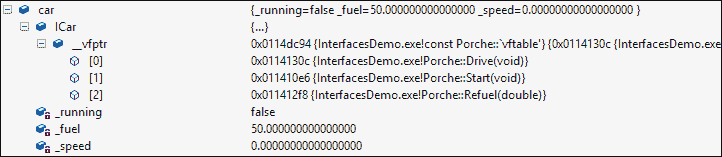

实例中的第一个字段是指向 v 表（`vptr`）的指针。该 v 表保存了在特定`ICar`实现`Porche`上实际实现的函数的指针。在 v 表指针之后，我们看到了实现声明的成员变量。但是使用接口指针，无法知道存在哪些成员变量（如果有的话）；这是一个不应该关心客户端的实现细节。

让我们定义另一个接口：

```cpp
class ICarrier {
public:
  virtual int PlaceObject(double weight) = 0;
  virtual void RemoveObject(int objectID) = 0;
};
```

`Porche`类希望实现`ICarrier`以及`ICar`。这是修订后的定义：

```cpp
class Porche : public ICar, public ICarrier {
```

我们将添加一些字段来管理安装在汽车上的对象：

```cpp
double _totalWeight;
static int _runningID;
std::map<int, double> _objects; 
```

并实现`ICarrier`中的两个方法（函数）：

```cpp
int PlaceObject(double weight) {
  if(_totalWeight + weight > 200)
    throw std::exception("too heavy");
  _totalWeight += weight;
  _objects.insert(std::make_pair(++_runningID, weight));
  return _runningID;
}

void RemoveObject(int objectID) {
  auto obj = _objects.find(objectID);
  if(obj == _objects.end())
    throw new std::exception("object not found");
  _totalWeight -= obj->second;
  _objects.erase(obj);
}
```

此时确切的实现本身并不重要，只是内存中对象的布局：

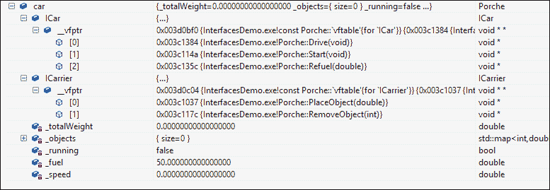

`Porche`实例的前两个成员是指向`ICar`和`ICarrier`的 v-table 指针（按顺序），每个指向一个函数指针的虚拟表。然后才放置实例成员变量。这里有一个图表可能更清晰地显示这一点：

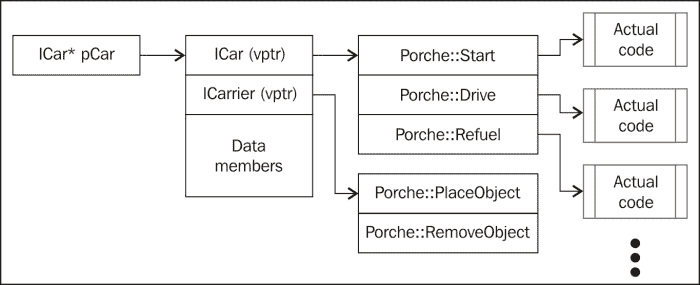

现在，假设客户端持有一个`ICar*`接口，并希望查看对象是否实现了`ICarrier`。进行 C 风格的转换（或`reinterpret_cast<>`）只会简单地使相同的指针值认为它指向另一个 v-table，但实际上并不是。在这种情况下，调用`ICarrier::PlaceObject`实际上会调用`ICar::Start`，因为那是该 v-table 中的第一个函数；并且函数是通过偏移量调用的。

我们需要动态查询另一个接口是否支持，使用`dynamic_cast<>`运算符：

```cpp
cout << "pCar: " << pCar << endl;
ICarrier* pCarrier = dynamic_cast<ICarrier*>(pCar);
if(pCarrier) {
  // supported
  cout << "Placing object..." << endl;
  int id = pCarrier->PlaceObject(20);
  cout << "pCarrier: " << pCarrier << endl;
}
```

如果成功，`dynamic_cast`会调整指针到正确的 v-table。在`Porche`的情况下，`pCarrier`的值应该比`pCar`大一个指针大小（在 32 位进程中为 4 个字节，在 64 位进程中为 8 个字节）。我们可以通过打印它们的值来验证：


偏移量为 4，因为这段代码是以 32 位编译的。

`dynamic_cast<>`的问题在于它是特定于 C++的。其他语言会如何获取对象上的另一个接口？解决方案是将该功能因子化到每个接口中。结合引用计数，这导致了 COM 世界中最基本的接口，`IUnknown`。

## IUnknown 接口

`IUnknown`接口是每个 COM 接口的基本接口。它封装了两个功能：查询可能支持的其他接口和管理对象的引用计数。这是它的定义：

```cpp
class IUnknown {
public:
  virtual HRESULT __stdcall QueryInterface(const IID& iid, 
      void **ppvObject) = 0;
  virtual ULONG __stdcall AddRef() = 0;
  virtual ULONG __stdcall Release() = 0;
};
```

`QueryInterface`允许根据接口 ID 获取另一个支持的接口，这是一个**全局唯一标识符**（**GUID**）—一个由算法生成的 128 位数字，可以统计保证唯一性。返回的值，一个`HRESULT`是 COM（和 WinRT）中的标准返回类型。对于`QueryInterface`，`S_OK (0)`表示一切正常，请求的接口存在（并间接通过`ppvObject`参数返回），或者`E_NOINTERFACE`，表示不支持这样的接口。

### 注意

所有 COM/WinRT 接口方法都使用标准调用约定（`__stdcall`），这意味着被调用方负责清理调用堆栈上的参数（而不是调用方）。这在 32 位世界中很重要，因为有几种调用约定。由于 COM 旨在实现跨技术访问，这是合同的一部分（在 x64 中只存在一种调用约定，因此这并不那么重要）。

`AddRef`增加对象的内部引用计数，`Release`减少它，如果计数达到零则销毁对象。

### 注意

请记住，这只是一个接口，还有其他的实现可能。例如，对于一个始终希望保留在内存中的对象（如单例），`AddRef`和`Release`可能什么也不做。然而，大多数对象都是按照描述的方式实现的。

任何 COM 接口都必须派生自`IUnknown`；这意味着每个 v-table 至少有三个条目对应于`QueryInterface`、`AddRef`和`Release`（按顺序）。

## IInspectable 接口

WinRT 可以被视为更好的 COM。`IUnknown`接口的一个缺点是没有标准的方法来询问对象返回它支持的接口列表。WinRT 定义了一个新的标准接口`IInspectable`（当然是从`IUnknown`派生的），提供了这种能力：

```cpp
class IInspectable : public IUnknown {
public:
  virtual HRESULT __stdcall GetIids(ULONG *iidCount, 
      IID **iids) = 0;
  virtual HRESULT __stdcall GetRuntimeClassName(
      HSTRING *className) = 0;
  virtual HRESULT __stdcall GetTrustLevel(
      TrustLevel *trustLevel) = 0;
};
```

最有趣的方法是`GetIids`，返回对象支持的所有接口。这是由运行在 WinRT 之上的 JavaScript 引擎使用的，因为 JavaScript 中缺乏静态类型，但对于 C++客户端来说通常不太有用。

所有这一切的最终结果如下：

+   每个 WinRT 接口必须继承自`IInspectable`。这意味着每个 v 表总是至少有六个条目，对应于方法`QueryInterface`、`AddRef`、`Release`、`GetIids`、`GetRuntimeClassName`和`GetTrustLevel`（按照这个顺序）。

+   WinRT 类型至少实现了`IInspectable`，但几乎总是至少实现了另一个接口；否则，这个对象将会非常乏味。

下面的经典图表描述了一个 WinRT 对象：

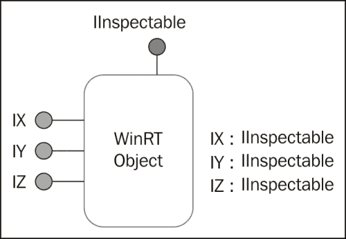

## 创建 WinRT 对象

正如我们所见，COM/WinRT 客户端使用接口来调用对象上的操作。然而，到目前为止有一件事被忽略了，那个对象是如何产生的？创建过程必须足够通用（而不是特定于 C++），以便其他技术/语言能够利用它。

我们将构建一个简单的示例，创建一个位于`Windows::Globalization`命名空间中的 WinRT `Calendar`类的实例，并调用一些其方法。为了消除所有可能的噪音，我们将在一个简单的 Win32 控制台应用程序中进行操作（而不是 Windows 8 商店应用程序），这样我们就可以专注于细节。

### 注意

最后一句也意味着 WinRT 类型（大部分情况下）可以从桌面应用程序和商店应用程序中访问和使用。这开启了有趣的可能性。

我们需要使用一些属于 Windows Runtime 基础设施的新 API。这些 API 以"Ro"开头（代表 Runtime Object）。为此，我们需要一个特定的`#include`和链接到适当的库：

```cpp
#include <roapi.h>

#pragma comment(lib, "runtimeobject.lib")
```

现在，我们可以开始实现我们的主函数。首先要做的事情是在当前线程上初始化 WinRT。这是通过使用`RoInitialize`函数来实现的：

```cpp
::RoInitialize(RO_INIT_MULTITHREADED);
```

`RoInitialize`需要为线程指定公寓模型。这可以是**单线程公寓**（**STA**）表示为`RO_INIT_SINGLETHREADED`，也可以是**多线程公寓**（**MTA**）表示为`RO_INIT_MULTITHREADED`。公寓的概念将在稍后讨论，对于当前的讨论来说并不重要。

### 注意

`RoInitialize`在概念上类似于经典的 COM `CoInitialize`(`Ex`)函数。WinRT 公寓与经典的 COM 公寓几乎是一样的。事实上，由于 WinRT 是建立在 COM 基础之上的，大部分事情都工作得非常相似。对象创建机制非常相似，只是细节上有一些变化，我们很快就会看到。

要创建一个实际的对象并获得一个接口指针，必须调用`RoActivateInstance`API 函数。这个函数的原型如下：

```cpp
HRESULT WINAPI RoActivateInstance(
  _In_   HSTRING activatableClassId,
  _Out_  IInspectable **instance
);
```

所需的第一个参数是类的全名，表示为`HSTRING`。`HSTRING`是标准的 WinRT 字符串类型，表示一个不可变的 Unicode（UTF-16）字符数组。存在多个 WinRT API 用于创建和操作`HSTRING`。正如我们稍后将看到的，C++/CX 提供了`Platform::String`类来包装`HSTRING`以便于使用。

`RoActivateInstance`的第二个参数是通过`IInspectable`接口指针表示的结果实例（请记住，所有 WinRT 对象必须支持这个接口）。

### 注意

感兴趣的读者可能会想知道为什么要创建一个新的字符串类型。毫无疑问，在 Microsoft 空间中已经有了很多这样的类型：`std::string`/`wstring`（C++），`CString`（ATL/MFC）和`BSTR`（COM）。`BSTR`似乎是最有可能的候选者，因为它不是特定于 C++的。新的`HSTRING`是不可变的，这意味着一旦创建就无法更改。任何明显的修改都会创建一个新的`HSTRING`。这个属性使`HSTRING`线程安全，并且更容易投射到其他平台，比如.NET，其中`System.String`类也是不可变的，所以没有不匹配。

要使用与`HSTRING`相关的 API，我们将添加`#include`到`<winstring.h>`。现在我们可以继续为`Calendar`类创建一个`HSTRING`：

```cpp
HSTRING hClassName;
wstring className(L"Windows.Globalization.Calendar");
HRESULT hr = ::WindowsCreateString(className.c_str(),
   className.size(), &hClassName);
```

`HSTRING`是使用`WindowsCreateString` WinRT API 创建的，传递字符串文字和它的长度（这里是通过`std::wstring`的帮助获得的）。请注意，类名包括其完整的命名空间，其中点（`.`）是分隔符（而不是 C++的作用域解析运算符`::`）。

现在，我们可以调用`RoActivateInstance`（我在这些代码片段中省略了任何错误检查，以便我们可以集中精力在基本要点上），并获得一个日历的接口。由于这是`IInspectable`，所以并不是很有趣。我们需要一个更具体的日历接口，也就是说，我们需要调用`QueryInterface`来获得一个更有趣的接口来使用。

`RoActivateInstance`是做什么的？该实例是如何创建的？它是在哪里实现的？

该过程与经典的 COM 创建机制非常相似。`RoActivateInstance`在`HKEY_LOCAL_MACHINE\Software\Microsoft\WindowsRuntime\ActiavatableClassId`处查阅注册表，并查找名为**Windows.Globalization.Calendar**的键。这是来自**RegEdit.exe**的屏幕截图：

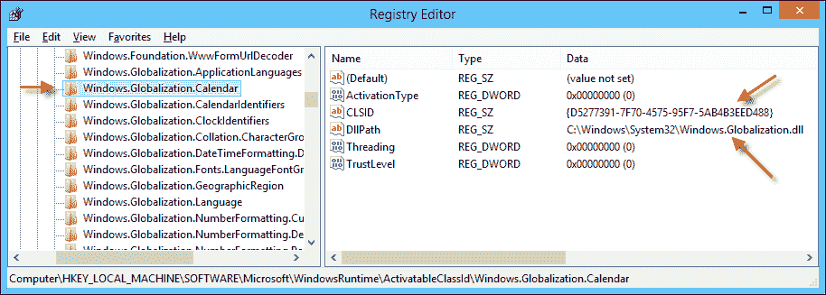

### 注意

屏幕截图显示了 64 位键。对于 32 位进程，该键位于`HKLM\Software\Wow6432Node\Windows\WindowsRuntime\ActivatableClassId`下。这对于进程来说是透明的，因为注册表 API 默认根据进程的“位数”去正确的位置。

类**Name**键中存在几个值。最有趣的是：

+   **DllPath** - 指示实现 DLL 所在的位置。这个 DLL 被加载到调用进程的地址空间中，我们马上就会看到。

+   **CLSID** - 类名的相应 GUID。这并不像在经典的 COM 中那么重要，因为 WinRT 实现是通过完整的类名而不是 CLSID 来识别的，这一点可以从`RoActivateInstance`的第一个参数中看出。

+   **ActivationType** - 指示此类是在进程内（DLL，值为 0）还是在进程外（EXE，值为 1）激活。

在本讨论的其余部分，我们将假设是一个进程内类。`RoActivateInstance`调用另一个函数`RoGetActivationFactory`，它实际上是定位注册表键并将 DLL 加载到进程地址空间的实际工作。然后，它调用 DLL 中导出的名为`DllGetActivationFactory`的全局函数（DLL 必须导出这样一个函数，否则创建过程将失败），传入完整的类名，请求的工厂接口 ID 和输出接口指针作为结果：

```cpp
HRESULT RoGetActivationFactory(
  _In_   HSTRING activatableClassId,
  _In_   REFIID iid,
  _Out_  void **factory
);
```

DLL 中的全局函数负责返回一个能够创建实际实例的类工厂。类工厂通常实现`IActivationFactory`接口，具有一个方法（除了`IInspectable`）：

```cpp
HRESULT ActivateInstance(IInspectable **instance);
```

返回类工厂是`RoGetActivationFactory`的工作。然后`RoActivateInstance`接管，并调用`IActivationFactory::ActivateInstance`来创建实际的实例，这就是`RoActivateInstance`的结果。

### 注意

熟悉经典 COM 的读者可能会注意到相似之处：`RoActivateInstance`替换了经典的`CoCreateInstance`；`RoGetActivationFactory`替换了`CoGetClassObject`；`DllGetActivationFactory`替换了`DllGetClassObject`；最后，`IActivationFactory`替换了`IClassFactory`。总的来说，步骤几乎是一样的。

以下图表总结了创建 WinRT 类型的过程：

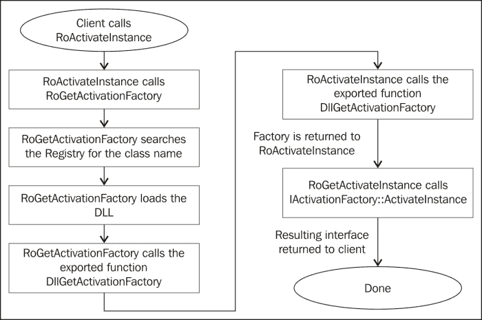

### 注意

在此序列中使用的注册表键与桌面应用程序创建 WinRT 对象相关。商店应用程序激活使用的键是不同的，但一般序列是相同的。

如果一切顺利，我们将得到一个指向 Calendar 实例的`IInspectable`接口指针。但我们对能够提供 Calendar 真正功能的更具体接口感兴趣。

事实证明，相关接口的定义在一个名为 Calendar 的命名空间的头文件中：

```cpp
#include <windows.globalization.h>
```

所讨论的接口在`ABI::Windows::Globalization`命名空间中被命名为`ICalendar`。我们将添加一个`using`命名空间以便更容易访问：

```cpp
using namespace ABI::Windows::Globalization;
```

**应用程序二进制接口**（**ABI**）是我们将在后面的部分中讨论的根命名空间。

由于我们需要一个`ICalendar`，我们必须为其进行`QueryInterface`：

```cpp
ICalendar* pCalendar;
hr = pInst->QueryInterface(__uuidof(ICalendar), 
   (void**)&pCalendar);
```

`pInst`被假定为对象上的某个接口（如`IInspectable`）。如果确实支持该接口，我们将得到一个成功的`HRESULT`（`S_OK`）和一个可以使用的接口指针。`__uuidof`操作符返回了接口的**接口 ID**（**IID**）；这是可能的，因为在声明的接口上附加了一个`__declspec(uuid)`属性。

现在，我们可以以任何我们认为合适的方式使用接口。以下是一些获取当前时间并将其显示到控制台的代码行：

```cpp
pCalendar->SetToNow();
INT32 hour, minute, second;
pCalendar->get_Hour(&hour);
pCalendar->get_Minute(&minute);
pCalendar->get_Second(&second);

cout << "Time: " << setfill('0') << setw(2) << hour << ":" <<
   setw(2) << minute << ":" << setw(2) << second << endl;
```

此时，`Calendar`实例上的引用计数应该是`2`。为了正确清理，我们需要在任何获得的接口指针上调用`IUnknown::Release`（创建时引用计数为`1`，`QueryInterface`后变为`2`）；此外，由于我们创建了一个`HSTRING`，最好将其销毁；最后，我们将在当前线程上取消初始化 WinRT 以确保万无一失：

```cpp
pCalendar->Release();
pInst->Release();
::WindowsDeleteString(hClassName);
```

完整的代码可以在`WinRTAccess1`项目中找到，这是本章可下载代码的一部分。

# WinRT 元数据

前面的示例使用了`<windows.globalization.h>`头文件来发现`ICalendar`接口的声明，包括其 IID。然而，由于 COM/WinRT 应该提供语言/平台之间的互操作性，非 C++语言如何能够使用该头文件呢？

答案是其他语言无法使用该头文件；它是特定于 C/C++的。我们需要的是一种基于明确定义的结构的“通用头文件”，因此可以被任何平台使用。这就是元数据文件的作用。

元数据文件（扩展名为`.winmd`）的格式基于为.NET 创建的元数据格式。这只是方便，因为该格式是丰富的，提供了 WinRT 元数据所需的所有必要组成部分。

### 注意

在经典 COM 中，这些元数据存储在类型库中。类型库格式不如.NET 元数据格式丰富，因此不适用于 WinRT。

WinRT 元数据文件位于`%System32%\WinMetadata`文件夹中，并且它们根据命名空间方便地排列（实际上，这是一个要求）。这是我机器上的文件：

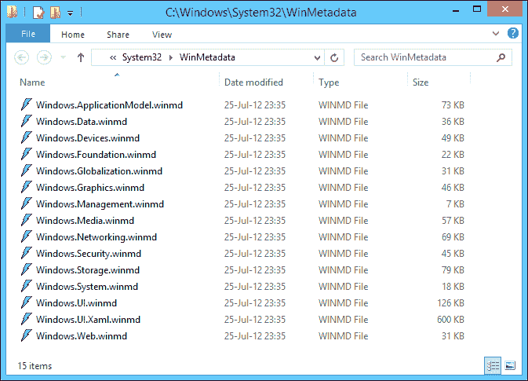

要查看元数据文件，我们可以使用任何（相对较新的）能够显示.NET 元数据的工具，例如来自 Visual Studio 2012 工具的 IL Disassembler（`ILDasm.exe`）或 Reflector（[`www.reflector.net/`](http://www.reflector.net/)）。在`ILDasm.exe`中打开`Windows.Globalization.winmd`显示如下：

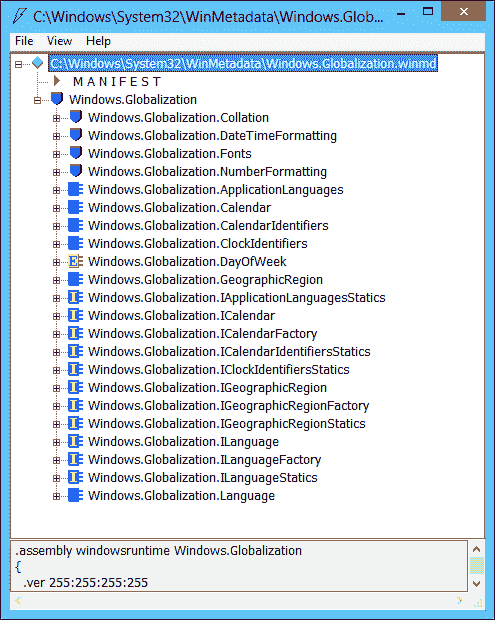

我们可以看到元数据文件中定义的所有类和接口。展开`ICalendar`接口节点显示其成员：


双击一个方法并不会显示它的实现，因为它并不是真正的.NET；那里没有代码，只有它的元数据格式。

`Calendar`类呢？展开它的节点会显示它实现了`ICalendar`。这使得任何使用元数据的人（包括工具）都可以自信地使用`QueryInterface`来查询这个接口并获得成功的结果：


这些元数据文件是构建 WinRT 组件的结果。这样，任何了解元数据格式的平台都可以消费该组件公开的类/接口。我们将在本章后面看到一个示例。

# Windows Runtime Library

Calendar 的使用示例有效，但所需的代码相当冗长。**Windows Runtime Library**（**WRL**）是一组帮助类和函数，使得在客户端和服务器端（组件的创建者）中更容易使用 WinRT 类型。WRL 使用标准 C++（没有非标准扩展），使得它与底层非常接近。让我们看看如何通过使用 WRL 来简化 Calendar 示例。

首先，我们需要包含 WRL 头文件；有一个主头文件和一个带有一些便利包装器的辅助文件：

```cpp
#include <wrl.h>
#include <wrl/wrappers/corewrappers.h>
```

接下来，我们将添加一些`using`语句来缩短代码：

```cpp
using namespace Windows::Foundation;
using namespace Microsoft::WRL;
using namespace Microsoft::WRL::Wrappers;
```

在`main()`中，我们首先需要初始化 WinRT。一个简单的包装器在它的构造函数中调用`RoInitialize`，在它的析构函数中调用`RoUninitialize`：

```cpp
RoInitializeWrapper init(RO_INIT_MULTITHREADED);
```

创建和管理`HSTRING`，我们可以使用一个辅助类`HString`：

```cpp
HString hClassName;
hClassName.Set(RuntimeClass_Windows_Globalization_Calendar);
```

长标识符是在`<windows.globalization.h>`中定义的完整的 Calendar 类名，因此我们不必提供实际的字符串。`HString`有一个`Get()`成员函数，返回底层的`HSTRING`；它的析构函数销毁`HSTRING`。

### 注意

前面的代码实际上可以通过使用引用现有字符串的`HSTRING`来简化（并加快速度），从而避免实际的字符串分配和复制。这是通过`HString::MakeReference`静态函数完成的，该函数在内部调用`WindowsCreateStringReference`。它有效地消除了销毁`HSTRING`的需要，因为一开始根本没有分配任何东西。这个字符串引用也被称为“快速传递”。

通过调用`Windows::Foundation::ActivateInstance`模板函数，可以简化创建`Calendar`实例，该函数在内部调用`RoActivateInstance`并查询所请求的接口：

```cpp
ComPtr<ICalendar> spCalendar;
HRESULT hr = ActivateInstance(hClassName.Get(), &spCalendar);
```

`ComPtr<T>`是 WRL 用于 WinRT 接口的智能指针。它在析构函数中正确调用`Release`，并提供必要的操作符（如`->`），因此在访问底层接口指针时几乎是不可见的。代码的其余部分基本相同，尽管不需要清理，因为析构函数会做正确的事情：

```cpp
spCalendar->SetToNow();
INT32 hour, minute, second;
spCalendar->get_Hour(&hour);
spCalendar->get_Minute(&minute);
spCalendar->get_Second(&second);

cout << "Time: " << setfill('0') << setw(2) << hour << ":" << 
   setw(2) << minute << ":" << setw(2) << second << endl;
```

WRL 还提供了帮助实现 WinRT 组件的类，包括实现样板代码的`IInspectable`、激活工厂等。我们通常会使用 C++/CX 来创建组件，但如果需要低级控制或者不希望使用语言扩展，可以使用 WRL。

### 注意

默认情况下，Visual Studio 2012 没有安装用于使用 WRL 创建 WinRT 组件的项目模板；但是，微软创建了这样一个模板，并且在调用**工具** | **扩展和更新**菜单项时可以在线搜索到。这为创建 WinRT DLL 组件提供了一个不错的起点。所涉及的步骤与使用 ATL 定义接口和成员的经典 COM 组件的步骤相似，在**接口定义语言**（**IDL**）文件中实现所需的功能。

# C++/CX

WRL 简化了使用和访问 WinRT 对象，但在创建和使用对象时，它仍然比普通 C++体验要复杂。调用`new`运算符比使用`Windows::Foundation::ActivateInstance`和使用`ComPtr<T>`智能指针要容易得多。

为此，微软创建了一组名为 C++/CX 的 C++语言扩展，帮助弥合差距，使得使用 WinRT 对象几乎与使用非 WinRT 对象一样简单。

以下部分讨论了一些常见的扩展。我们将在整本书中讨论更多的扩展。首先，我们将看看如何创建对象，然后我们将研究各种成员以及如何访问它们，最后，我们将考虑使用 C++/CX 创建新的 WinRT 类型的基础知识。

## 创建和管理对象

在 C++/CX 中，WinRT 对象是通过关键字`ref new`实例化的。这将创建一个引用计数对象（WinRT 对象），并使用`^`（帽子）符号返回对象的句柄。以下是创建`Calendar`对象的示例：

```cpp
using namespace Windows::Globalization;
Calendar^ cal = ref new Calendar;
```

`cal`中返回的值是一个 WinRT 对象。可能令人困惑的一点是，我们得到的是一个`Calendar`对象而不是一个接口；但是 COM/WinRT 客户端只能使用接口；我们之前使用的`ICalendar`在哪里？

C++/CX 提供了一层便利，允许使用对象引用而不是接口引用。但是，接口`ICalendar`仍然存在，并且实际上被定义为`Calendar`类的默认接口（编译器知道这一点），但直接使用类似更自然。我们可以通过添加一个方法调用来验证这一点，并在添加特定转换为`ICalendar`后查看生成的代码并将其与原始调用进行比较：

```cpp
Calendar^ cal = ref new Calendar;
cal->SetToNow();

ICalendar^ ical = cal;
ical->SetToNow();
```

以下是这些调用的生成代码：

```cpp
  cal->SetToNow();
00A420D0  mov         eax,dword ptr [cal] 
00A420D3  push        eax 
00A420D4  call        Windows::Globalization::ICalendar::SetToNow (0A37266h) 
00A420D9  add         esp,4  

  ICalendar^ ical = cal;
00A420DC  mov         eax,dword ptr [cal]  
00A420DF  push        eax  
00A420E0  call        __abi_winrt_ptr_ctor (0A33094h)  
00A420E5  add         esp,4  
00A420E8  mov         dword ptr [ical],eax  
00A420EB  mov         byte ptr [ebp-4],0Ah  
  ical->SetToNow();
00A420EF  mov         eax,dword ptr [ical] 
00A420F2  push        eax 
00A420F3  call        Windows::Globalization::ICalendar::SetToNow (0A37266h) 

```

高亮部分相同，证明实际调用是通过接口进行的。

### 注意

熟悉 C++/CLI，即.NET 的 C++扩展的读者可能会认出“帽子”(^)和一些其他类似的关键字。这只是从 C++/CLI 借来的语法，但与.NET 无关。所有的 WinRT 都是纯本地代码，无论是使用 C++/CX 还是其他方式访问。

当帽子变量超出范围时，`IUnknown::Release`会按预期自动调用。还可以使用 WinRT 类型的堆栈语义，如下所示：

```cpp
Calendar c1;
c1.SetToNow();
```

对象仍然以通常的方式动态分配。但是保证在变量超出范围时进行清理。这意味着它不能传递给其他方法。

## 访问成员

在获得对 WinRT 对象（或接口）的引用后，可以使用箭头（`->`）运算符访问成员，就像常规指针一样。但是，帽子不是正常意义上的指针；例如，永远不可能进行指针算术运算。应该将帽子变量视为对 WinRT 对象的不透明引用。

通过引用访问成员并不完全与通过直接（或类似 WRL 的）接口指针访问对象相同。主要区别在于错误处理。所有接口成员必须返回`HRESULT`；通过帽子引用调用会隐藏`HRESULT`，而是在失败的情况下抛出异常（派生自`Platform::Exception`）。这通常是我们想要的，这样我们可以使用标准语言设施`try`/`catch`来处理错误，而不必为每次调用检查`HRESULT`。

另一个区别出现在方法有返回值的情况下。实际接口方法必须返回`HRESULT`，因此添加一个输出参数（必须是指针），在成功时将结果存储在其中。由于帽子引用隐藏了`HRESULT`，它们使返回类型成为方法调用的实际返回值，这非常方便。以下是使用`ICalendar::Compare`方法比较此日历的日期/时间与另一个日历的示例。使用 WRL 创建第二个日历并进行比较如下：

```cpp
ComPtr<ICalendar> spCal2;
ActivateInstance(hClassName.Get(), &spCal2);
spCal2->SetToNow();
spCal2->AddMinutes(5);

int result;
hr = spCalendar->Compare(spCal2.Get(), &result);
```

通过将目标变量作为`Compare`调用的最后一个参数来获得结果。以下是等效的 C++/CX 版本：

```cpp
auto cal2 = ref new Calendar;
cal2->SetToNow();
cal2->AddMinutes(5);
int result = cal->Compare(cal2);
```

HRESULT`无处可寻，实际结果直接从方法调用中返回。如果发生错误，将抛出`Platform::Exception`（或其派生类）。

### 注意

静态方法或属性呢？这些是存在的，并且可以通过熟悉的`ClassName::MemberName`语法进行访问。好奇的读者可能想知道这些是如何实现的，因为 COM 没有静态成员的概念，一切都必须通过接口指针访问，这意味着必须存在一个实例。所选的解决方案是在激活工厂（类工厂）上实现静态成员，因为它通常是单例，有效地给出了相同的净结果。

### 方法和属性

WinRT 正在努力实现对象导向，至少在成员方面是这样。方法是成员函数，在 C++中按预期调用。这在之前显示的`ICalendar::SetToNow()`、`ICalendar::AddMinutes()`和`ICalendar::Compare()`中是这样的。

WinRT 还定义了属性的概念，实际上它们是伪装成方法的方法。属性可以有 getter 和/或 setter。由于 C++没有属性的概念，这些属性被建模为以`get_`或`put_`开头的方法，而 C++/CX 为了方便提供了类似字段的属性访问。

这是使用`ICalendar`上定义的`Hour`属性的示例。首先是 WRL 版本：

```cpp
// read current hour
INT32 hour;
spCalendar->get_Hour(&hour);
// set a new hour
spCalendar->put_Hour(23);
```

接下来是 C++/CX 版本：

```cpp
int hour = cal->Hour;  // get
cal->Hour = 23;    // set
```

属性的存在可以在元数据文件中看到，例如`Windows.Globalization.winmd`。查看`Calendar`类（或`ICalendar`接口），红色三角形表示属性。双击其中任何一个会显示以下内容：

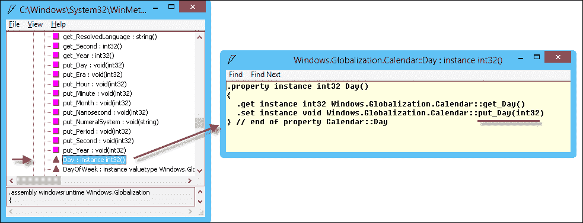

使用 C++/CX 可以访问实际的方法或属性，而无需将失败的`HRESULT`映射到异常的抽象层，如果需要（这更快，等效于 WRL 生成的代码）。这是通过调用以`__abi_`为前缀的成员来实现的，如下面的代码片段所示：

```cpp
cal->__abi_SetToNow();
int r;
cal->__abi_Compare(cal2, &r);
cal->__abi_set_Hour(22);
```

所有这些成员都返回`HRESULT`，因为这些都是通过接口指针的实际调用。有趣的是，属性的设置器必须以`set_`而不是`put_`为前缀。这种方案还提供了一种调用`IInspectable`方法的方式，例如`GetIids`，否则无法通过帽子引用进行访问。

### 注意

目前，这些调用没有`Intellisense`，因此编辑器中会显示红色波浪线。但是代码编译和运行都如预期那样。

### 委托

委托是 WinRT 中函数指针的等价物。委托是一种可以指向方法的字段。与函数指针相反，委托可以指向静态方法或实例方法，根据需要。委托具有内置的构造函数，接受方法或 lambda 函数。

### 注意

术语“委托”之所以被使用，是因为它与.NET 世界中的相同概念相似，在那里委托的作用与 WinRT 中的作用基本相同。

以下是使用`IAsyncOperation<T>`接口的示例，我们将在讨论异步操作时进行详细讨论。给定一个`IAsyncOperation<T>`（`T`是操作预期的返回类型），其`Completed`属性的类型为`AsyncOperationCompletedHandler<T>`，这是一种委托类型。我们可以将`Completed`属性连接到当前实例的成员函数，如下所示：

```cpp
IAsyncOperation<String^>^ operation = ...;
operation->Completed = ref new
   AsyncOperationCompletedHandler<String^>(this, &App::MyHandler);
```

其中`App::MyHandler`的原型如下：

```cpp
void MyHandler(IAsyncOperation<String^>^ operation, 
   AsyncStatus status);
```

为什么是这个原型？这正是委托定义的东西：必须遵循的特定原型，否则编译器会抱怨。

作为命名方法的替代，我们可以将委托绑定到 lambda 函数，这在许多情况下更方便。以下是与之前代码等效的 lambda：

```cpp
operation->Completed = ref new AsyncOperationCompletedHandler<String^>(
   [](IAsyncOperation<String^>^ operation, AsyncStatus status) {
    // do something...
  });
```

示例中未捕获任何变量。关键点在于 lambda 的参数与命名方法的情况完全相同。

委托到底是什么？它是一个像任何其他 WinRT 类一样的类，具有一个特殊的构造函数，允许绑定到一个方法（命名或 lambda），以及一个实际执行委托的`Invoke`方法。在 C++/CX 中，调用可以通过函数调用运算符`()`执行，就像任何函数一样。假设前面的声明，我们可以以以下方式之一调用`Completed`委托：

```cpp
operation->Completed->Invoke(operation, AsyncStatus::Completed);
operation->Completed(operation, AsyncStatus::Completed);
```

这两行是等价的。

### 注意

从技术上讲，前面的代码在语法上是正确的，但我们永远不会自己调用异步操作完成。操作的所有者将进行调用（我们将在本章后面讨论异步操作）。

### 事件

委托通常不会声明为属性，如`IAsyncOperation<T>::Completed`属性。原因有两个：

+   任何人都可以在该属性中放置`nullptr`（或其他委托），丢弃可能已设置的任何先前的委托实例

+   任何人都可以调用委托，这很奇怪，因为只有声明类知道何时应该调用委托。

我们想要的是一种使用委托连接到感兴趣的方法的方式，但以一种安全的方式，不允许任意代码直接更改委托或调用它。

这就是事件的作用。事件看起来像委托，但实际上有两种方法，一种用于注册事件处理程序，一种用于撤销处理程序。在 C++/CX 中，`+=`和`-=`运算符用于事件，因此客户端可以注册通知，但永远不能使用赋值运算符来使委托的值为空或替换委托的值，因为它没有以这种方式公开。

以下是一个使用`Application::Suspending`事件的示例，该事件指示感兴趣的方当应用程序即将被暂停时，可以保存状态的良好时机（我们将在第七章中讨论应用程序生命周期，*应用程序、磁贴、任务和通知*）：

```cpp
this->Suspending += ref new SuspendingEventHandler(
   this, &App::OnSuspending);
```

请注意，`SuspendingEventHandler`是委托类型，这意味着方法`OnSuspending`必须按照该委托定义的方式进行原型设计。

在幕后，事件只是一对适当实现的方法（Visual Studio 智能感知显示带有闪电图标的事件）。以下是通过元数据描述的`Application::Suspending`事件（还显示了其他事件），在`ILDasm.exe`中显示：

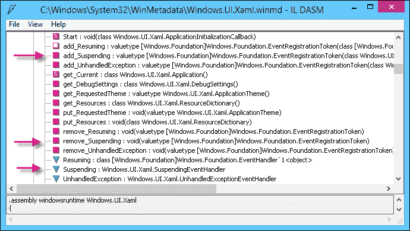

倒置的绿色三角形表示事件成员本身，而`add_Suspending`和`remove_Suspending`是在使用`+=`和`-=` C++/CX 运算符时调用的实际方法。

## 定义类型和成员

可以使用 WRL（通过在 IDL 文件中定义接口，实现所有样板代码，如`IUnknown`和`IInspectable`实现，激活工厂，DLL 全局函数等）来定义 WinRT 类型。这提供了一种非常精细的方式来创建组件，并且在精神上类似于使用**Active Template Library**（**ATL**）编写 COM 组件的方式。

使用 C++/CX，编写可重用的 WinRT 组件比使用 WRL 要容易得多。在本节中，我们将构建一个简单的组件，并将其与 C++和 C#客户端一起使用（JavaScript 客户端同样有效，留给感兴趣的读者作为练习）。

### WinRT 组件项目

Visual Studio 2012 包括一个项目模板，用于创建一个 WinRT 组件，然后可以被任何符合 WinRT 标准的平台（或另一个 WinRT 组件）使用。我们将创建一个名为`Calculations`的**Windows Runtime Component**类型的新项目：

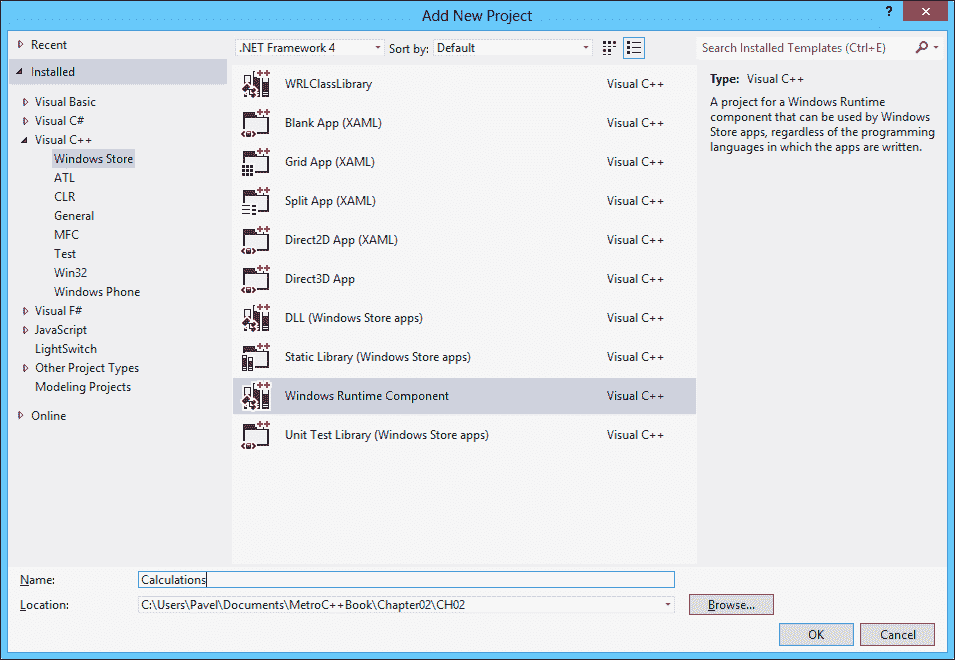

向导添加了一个`Class1`类。我们可以删除它并添加一个新的 C++类，或者重命名文件和类名。我们将创建一个名为`Calculator`的 WinRT 类，在头文件中使用以下代码定义：

```cpp
namespace Calculations {
  public ref class Calculator sealed {
  public:
     Calculator(void);

  };
}
```

WinRT 类必须由`ref class`关键字定义在命名空间内。它还必须声明为`public`，以便在组件 DLL 外部可用。该类还必须标记为`sealed`，表示它不能被继承；或者，它可以继承自非密封类，这些类目前是 WinRT 库中位于`Windows::UI::Xaml`命名空间中的类。WinRT 继承的详细讨论超出了本节的范围。

现在是时候给这个类一些有用的内容了。

### 添加属性和方法

`Calculator`类的想法是成为一个累积计算器。它应该保存当前结果（默认为零），并在执行新的数学运算时修改结果。随时可以获取其当前结果。

方法被添加为常规成员函数，包括构造函数。让我们在类的`public`部分添加一个构造函数和一些操作：

```cpp
// ctor
Calculator(double initial);
Calculator();

// operations
void Add(double value);
void Subtract(double value);
void Multiply(double value);
void Divide(double value);

void Reset(double value);
void Reset();
```

我们需要一个只读属性来传达当前结果。下面是如何定义它的方法：

```cpp
property double Result {
  double get();
}
```

`property`关键字是 C++/CX 的扩展，定义了一个属性，后面跟着它的类型和名称。在大括号内，可以声明`get()`和`set()`方法（`set`必须接受正确类型的值）。缺少的`set()`方法表示这是一个只读属性——将创建一个`get_Result`方法，但不会创建`put_Result`方法。

### 注意

可以通过在属性名称后面加上分号（完全没有大括号）来添加一个简单的由私有字段支持的读/写属性。

接下来，我们添加需要维护正确状态的任何`private`成员；在这种简单情况下，只是当前结果：

```cpp
private:
  double _result;
```

在 CPP 文件中，我们需要实现所有这些成员，以摆脱**未解析的外部链接器**错误：

```cpp
#include "Calculator.h"

using namespace Calculations;

Calculator::Calculator(double initial) : _result(initial) {
}

Calculator::Calculator() : _result(0) {
}

void Calculator::Add(double value) {
  _result += value;
}

void Calculator::Subtract(double value) {
  _result -= value;
}

void Calculator::Multiply(double value) {
  _result *= value;
}

void Calculator::Divide(double value) {
  _result /= value;
}

void Calculator::Reset() {
  _result = 0.0;
}

void Calculator::Reset(double value) {
  _result = value;
}

double Calculator::Result::get() {
  return _result;
}
```

在那段代码中没有什么特别的，除了用于实现`Result`属性的语法。

由于这是一个 WinRT 组件，元数据（`.winmd`）文件将作为构建过程的一部分创建；这是将用于消耗组件的文件。使用`ILDasm.exe`打开它会显示刚刚编写的代码的结果：

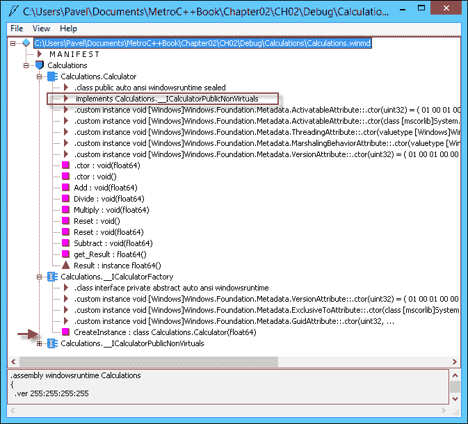

这里有一些有趣的地方。由于我们编写了一个 WinRT 类，它必须实现一个接口，因为 WinRT/COM 客户端只能使用接口。在`Calendar`的情况下，接口被命名为`ICalendar`（这是它的默认接口），但在这里我们没有指定任何这样的接口。编译器自动创建了这样一个接口，它的名称是`__ICalculatorPublicNonVirtuals`。这是实际定义所有方法和属性的接口。奇怪的名称暗示这些方法通常只能从对`Calculator`对象的引用调用；无论如何，接口名称都不重要。

### 注意

显然，`Calendar`类不是用 C++/CX 创建的，因为它的默认接口名为`ICalendar`。事实上，它是用 WRL 创建的，WRL 允许完全控制组件作者的每个方面，包括接口名称；WRL 用于构建所有 Microsoft 提供的 WinRT 类型。

另一个有趣的地方涉及重载的构造函数。由于提供了非默认构造函数，因此默认的创建接口`IActivationFactory`是不够的，因此编译器创建了第二个接口`ICalculatorFactory`，其中包含一个接受双精度值的`CreateInstance`方法。这是使 C++/CX 易于使用的另一个特性——因为负担在编译器上。

### 添加一个事件

为了使其更有趣，让我们添加一个事件，以防尝试除以零。首先，我们需要声明一个适用于事件的委托，或者使用 WinRT 中已定义的委托之一。

为了演示目的，我们将定义一个自己的委托，以展示如何在 C++/CX 中完成。我们在`Calculations`命名空间声明内的`Calculator`定义上方添加以下声明：

```cpp
ref class Calculator;

public delegate void DivideByZeroHandler(Calculator^ sender);
```

前向声明是必要的，因为编译器尚未遇到`Calculator`类。

委托表示它可以绑定到接受`Calculator`实例的任何方法。我们应该如何处理这个委托声明呢？我们将在类的`public`部分添加一个客户端可以注册的事件。

```cpp
event DivideByZeroHandler^ DivideByZero;
```

这以最简单的方式声明了事件——编译器适当地实现了`add_DivideByZero`和`remove_DivideByZero`方法。

现在，我们需要更新`Divide`方法的实现，以便在传入值为零的情况下触发事件：

```cpp
void Calculator::Divide(double value) {
  if(value == 0.0)
    DivideByZero(this);
  else
    _result /= value;
}
```

调用事件会调用所有注册的观察者（客户端）来处理此事件，并将自身作为参数传递（这可能对客户端有用，也可能没有）。

## 使用 WinRT 组件

现在是时候使用我们刚刚创建的`Calculator`类了。我们将构建两个客户端，一个是 C++客户端，一个是 C#客户端，以展示它们之间的区别。

### 构建一个 C++客户端

我们将在同一个解决方案中创建一个空白的 C++商店应用项目，并在 XAML 中构建一个简单的用户界面来测试计算器的功能。对于这次讨论来说，用户界面的细节并不重要；完整的代码可以在本章的可下载代码中的`CalcClient1`项目中找到。UI 看起来像这样：

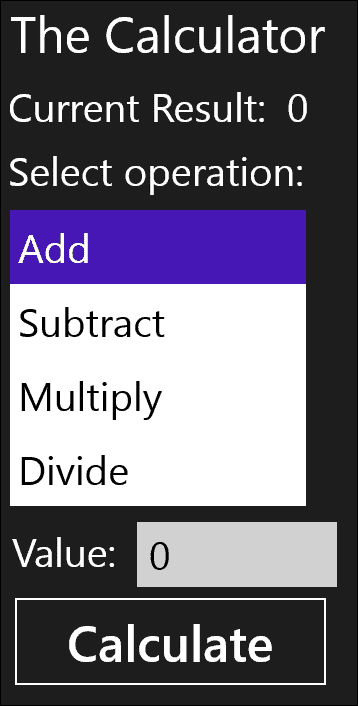

为了获取我们的`Calculator`的定义，我们需要添加对元数据文件的引用。通过右键单击项目节点并选择**References…**来实现。在显示的对话框中，我们选择**Calculations**项目：

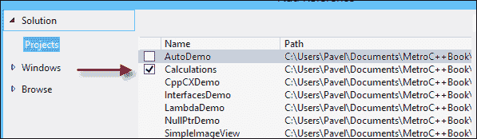

现在定义都已经可用，我们可以使用它们了。在`MainPage.xaml.h`中，我们添加了对`Calculator`对象的引用，以便它在页面的生命周期内存在：

```cpp
private:
  Calculations::Calculator^ _calculator;
```

在`MainPage`构造函数中，我们需要实际创建实例，并可选择连接到`DivideByZero`事件（我们这样做）：

```cpp
_calculator = ref new Calculator;
_calculator->DivideByZero += ref new DivideByZeroHandler(this {
  _error->Text = "Cannot divide by zero";
});
```

`_error`是 UI 中显示最后一个错误（如果有的话）的`TextBlock`元素。还添加了一个`using namespace`来引用`Calculations`，以便前面的代码可以编译。

当单击**Calculate**按钮时，我们需要根据列表框中当前选择的索引执行实际操作：

```cpp
_error->Text = "";
wstringstream ss(_value->Text->Data());
double value;
ss >> value;
switch(_operationList->SelectedIndex) {
case 0:
	_calculator->Add(value); break;
case 1:
	_calculator->Subtract(value); break;
case 2:
	_calculator->Multiply(value); break;
case 3:
	_calculator->Divide(value); break;
}
// update result
_result->Text = _calculator->Result.ToString();
```

为了使这段代码编译通过，需要添加一个`using` `namespace`语句来引用`std`，并添加一个`#include`来引用`<sstream>`。

就是这样。我们已经使用了一个 WinRT 组件。从技术上讲，没有简单的方法可以知道它是用什么语言编写的。唯一重要的是它是一个 WinRT 组件。

### 构建一个 C#客户端

让我们看看这如何与另一个客户端一起工作——使用 C#编写的商店应用。首先，我们将创建一个空白的 C#商店应用（名为`CalcClient2`），并将 XAML 原样复制到 C#项目中，从 C++客户端项目中。

接下来，我们需要添加对`winmd`文件的引用。右键单击项目节点，选择**Add Reference…**，或右键单击**References**节点，选择**Add Reference…**。类似的对话框会出现，允许选择`Calculations`项目（或者如果它是不同的解决方案，则浏览文件系统中的文件）。

使用`Calculator`所需的实际代码与 C++情况类似，使用了 C#（和.NET）的语法和语义。在`MainPage.xaml.cs`中，我们创建了一个`Calculator`对象，并注册了`DivideByZero`事件（使用 C# lambda 表达式）：

```cpp
Calculator _calculator;

public MainPage() {
  this.InitializeComponent();
  _calculator = new Calculator();
  _calculator.DivideByZero += calc => {
    _error.Text = "Cannot divide by zero";
  };
}
```

### 注意

在 C#中，可以编写 lambda 表达式而不指定确切的类型（如前面的代码片段所示）；编译器会自行推断类型（因为委托类型是已知的）。也可以明确写出类型，如`_calculator.DivideByZero += (Calculator calc) => { … };`是可能的（也是合法的）。

文件顶部添加了一个`using` `Calculations`语句。按钮的点击事件处理程序非常容易理解：

```cpp
_error.Text = String.Empty;
double value = double.Parse(_value.Text);
switch (_operationList.SelectedIndex) {
  case 0:
    _calculator.Add(value); break;
  case 1:
    _calculator.Subtract(value); break;
  case 2:
    _calculator.Multiply(value); break;
  case 3:
    _calculator.Divide(value); break;
}
// update result
_result.Text = _calculator.Result.ToString();
```

注意 C#代码访问计算器的方式与 C++版本非常相似。

# 应用程序二进制接口

在前一节中创建的`Calculator` WinRT 类留下了一些问题。假设以下方法被添加到类的公共部分：

```cpp
std::wstring GetResultAsString();
```

编译器将拒绝编译此方法。原因与使用`std::wstring`有关。这是一种 C++类型——它如何映射到 C#或 JavaScript？它不能。公共成员必须仅使用 WinRT 类型。内部 C++实现和面向公众的类型之间存在边界。定义相关方法的正确方式是这样的：

```cpp
Platform::String^ GetResultAsString();
```

`Platform::String`是 C++/CX 对`HSTRING` WinRT 的包装器，它在 C#中被映射为`System.String`，在 JavaScript 中被映射为`string`。

WinRT 类中的私有成员可以是任何东西，往往是本机 C++类型（如`wstring`，`vector<>`，以及可能从旧代码迁移过来的其他任何东西）。

简单类型，如`int`和`double`在 C++和 WinRT 之间自动映射。**应用程序二进制接口**（**ABI**）是 WinRT 类型（可在组件外部使用）和特定于语言/技术的本机类型之间的边界（不仅适用于 C++，也适用于 C#）。

# 异步操作

Windows 8 商店应用承诺“快速流畅”。这个表达有几个意思，其中一些与用户体验和用户界面设计有关（这里不涉及），一些与应用程序响应性有关。

自从 Windows 操作系统的第一个版本以来，用户界面由应用程序中的单个线程处理。从技术上讲，一个线程可以创建任意数量的窗口，并且该线程成为这些窗口的所有者，并且是唯一可以处理针对这些窗口的消息的线程（通过消息队列）。如果该线程变得非常忙碌，并且不能及时处理消息，UI 将变得不够响应；在极端情况下，如果线程由于某种原因被卡住了几秒钟或更长时间，UI 将变得完全无响应。这种情况非常熟悉且极不理想。以下图表说明了 UI 处理中涉及的实体：

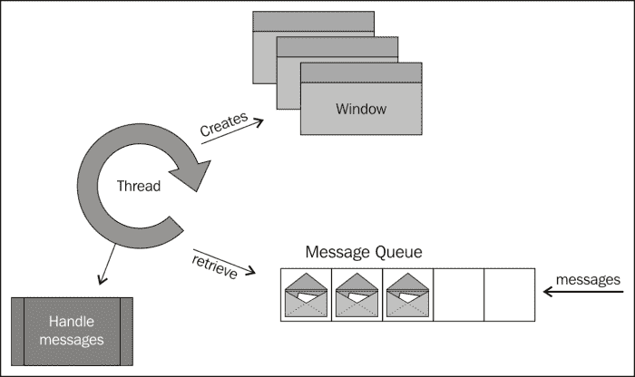

响应性的关键是尽快释放 UI 线程，并且永远不要阻塞它超过几毫秒。在桌面应用程序的世界中，开发人员可以随意调用一些长时间运行的操作（或一些长时间的 I/O 操作），从而阻止线程返回到消息处理活动，冻结用户界面。

在 WinRT 中，微软已经做出了一个有意识的决定，即如果一个操作可能需要超过 50 毫秒的时间，那么它应该是异步的而不是同步的。最终结果是许多方法都是异步执行的，这可能会使代码变得更加复杂。异步意味着操作开始，但调用几乎立即返回。当操作完成时，会调用某些回调，以便应用程序可以采取进一步的步骤。在此期间，UI 线程没有做任何特殊的事情，因此可以像往常一样处理消息，保持 UI 的响应性。同步和异步调用之间的区别可以用以下图表说明：

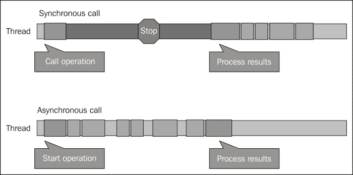

异步操作，虽然可取，但从定义上来说更加复杂。代码不再是顺序的。WinRT 定义了一些表示正在进行的操作的接口。这些接口是从各种异步方法返回的，这些方法启动一个操作，并允许客户端注册操作完成的时间。

让我们看一个异步操作的例子以及我们如何处理它们。我们将创建一个简单的图像查看器应用程序，允许用户浏览图像并显示它（完整的源代码在本章的下载中提供的`SimpleImageView`项目中）。用户界面目前并不重要，由一个按钮组成，该按钮启动用户的选择过程，以及一个`Image`元素，可以显示图像。当点击按钮时，我们希望为用户提供一种选择图像文件的方法，然后将文件转换为`Image`元素可以显示的内容。

用于选择文件的 WinRT 类是`Windows::Storage::Pickers::FileOpenPicker`。我们将创建一个实例并设置一些属性：

```cpp
auto picker = ref new FileOpenPicker;
picker->FileTypeFilter->Append(".jpg");
picker->FileTypeFilter->Append(".png");
picker->ViewMode = PickerViewMode::Thumbnail;
```

### 注意

熟悉桌面应用程序世界的读者可能会想知道通用的打开文件对话框在哪里，该对话框可以通过 Win32 API 或其他包装器使用。由于几个原因，该对话框不能在商店应用程序中使用。首先是美学原因；与 Windows 8 商店应用程序试图传达的现代 UI 相比，该对话框很丑陋。其次，该对话框有标题栏和其他类似的界面，因此不适合新世界。最重要的是，`FileOpenPicker`不仅仅是从文件系统中选择文件。它实际上是使用文件打开选择器合同，由相机（如果连接了相机）实现（例如），因此我们实际上可以拍照然后选择它；对于其他来源，如 SkyDrive、Facebook 等也是如此。通用的打开文件对话框没有这样的功能。

现在，是时候显示选择器并允许用户选择一些东西了。查看`FileOpenPicker`API，我们找到了`PickSingleFileAsync`方法。`Async`后缀是 WinRT API 中用于指示启动异步操作的方法的约定。选择文件的结果应该是`Windows::Storage::StorageFile`的一个实例，但实际上它返回的是`IAsyncOperation<StorageFile^>`，这是表示长时间运行操作的对象。

处理这个问题的一种方法是将`Completed`属性（一个委托）设置为一个处理程序方法，当操作完成时将调用该方法（这可以是一个 lambda 函数）。当调用该函数时，我们可以调用`IAsyncOperation<T>::GetResults()`来获取实际的`StorageFile`对象：

```cpp
auto fileOperation = picker->PickSingleFileAsync();
fileOperation->Completed = ref new 
   AsyncOperationCompletedHandler<StorageFile^>(
this {
  auto file = op->GetResults();
  });
```

很遗憾，这还没结束。一旦文件可用，我们需要打开它，将其数据转换为 WinRT 流接口，然后将其提供给一个`BitmapImage`对象，该对象可以呈现为`Image`元素。

原来打开`StorageFile`也是一个异步操作（记住，该文件可以来自任何地方，比如 SkyDrive 或网络共享）。在获得文件之后，我们重复相同的顺序：

```cpp
using namespace Windows::UI::Core;
auto openOperation = file->OpenReadAsync();
openOperation->Completed = ref new AsyncOperationCompletedHandler<IRandomAccessStreamWithContentType^>(
  this {
    auto bmp = ref new BitmapImage;
    bmp->SetSource(op->GetResults());
    _image->Source = bmp;
});
```

`_image`是应该使用其`Source`属性显示结果图像的`Image`元素。

这几乎可以工作。"几乎"部分有点微妙。前面的 lambda 是由不同的线程调用的，而不是启动调用的线程。UI 线程启动了它，但它在后台线程上返回。从后台线程访问 UI 元素（如`Image`元素）会导致抛出异常。我们该如何解决这个问题呢？

我们可以使用与 UI 线程绑定的`Dispatcher`对象，并要求它在 UI 线程上执行一些代码（通常指定为 lambda）：

```cpp
Dispatcher->RunAsync(CoreDispatcherPriority::Normal, 
   ref new DispatchedHandler([op, this]() {
    auto bmp = ref new BitmapImage;
    bmp->SetSource(op->GetResults());
    _image->Source = bmp;
  }));
```

`Dispatcher`是`this`（或任何 UI 元素）的属性，它在可能时将操作发布到 UI 线程上执行（通常几乎立即，假设 UI 线程没有被阻塞，我们非常努力地避免这种情况）。

整个序列并不容易，并且将`Dispatcher`添加到混合物中会进一步复杂化事情。幸运的是，有一种更简单的方法来处理异步操作——使用`task<T>`类。

## 使用任务进行异步操作

`task<T>`类位于 concurrency 命名空间中，并需要`#include`到`<ppltasks.h>`。这个类是 C++11 中的新类，通常与并行编程有关，但在这里它为调用异步操作提供了特殊的目的。

`task<T>`类表示其结果为`T`类型的操作。它处理`Completed`属性注册的繁琐细节，调用`GetResults`，并自动使用`Dispatcher`来保持线程关联，以防操作是从 UI 线程（技术上是从单线程公寓）调用的。并且所有这些都可以很好地组合，以便我们需要按顺序调用几个异步操作（对于手头的情况是真实的）。以下是完整的代码：

```cpp
auto fileTask = create_task(picker->PickSingleFileAsync());
fileTask.then([](StorageFile^ file) {
  return create_task(file->OpenReadAsync());
}).then(this {
  auto bmp = ref new BitmapImage;
  bmp->SetSource(stm);
  _image->Source = bmp;
});
```

`create_task<T>`函数是一个方便的函数，它使用正确的`T`创建一个`task<T>`；`create_task<T>`允许使用`auto`关键字。一个等效的替代方法是：

```cpp
task<StorageFile^> fileTask(picker->PickSingleFileAsync());
```

然后实例方法期望一个函数（有时称为 continuation，通常是 lambda），该函数应在异步操作完成时执行。它提供结果，无需调用`IAsyncOperation<T>::GetResults()`。

注意组合。在`StorageFile`可用之后，另一个任务被创建并从 lambda 返回。这启动了另一个异步操作，将由下一个`then`调用解决。

最后，continuations 在与操作发起者相同的线程上运行，如果该发起者在 STA（这是 UI 线程的情况）中运行。

### 注意

该公寓意识仅适用于返回`IAsyncAction<T>`或`IAsyncOperation<T>`（及其派生类）的操作。

## 取消异步操作

按定义，异步操作可能会长时间运行，因此最好提供取消操作的能力（如果可能）。`IAsync*`接口族有一个`Cancel`方法，我们可以调用它（例如，从某个**Cancel**按钮的单击事件处理程序），但很难将`IAsync*`对象暴露给外部代码。

幸运的是，`task<>`类提供了一个优雅的解决方案。任务构造函数（或`create_task`辅助函数）的第二个参数是一个`cancellation_token`对象。这个令牌是从`cancellation_token_source`对象使用其`get_token()`实例方法获得的。`cancellation_token_source`表示一个可取消的操作。外部调用者可以使用它的`cancel()`方法来“信号”所有由`cancellation_token_source`分发的`cancellation_token`对象（通常只有一个），从而导致任务调用`IAsync*::Cancel`方法。以下图表说明了这个过程：

取消异步操作

最终的结果是，如果操作被取消，将抛出一个`task_canceled`异常。它会（如果未处理）在`then`链中传播，以便可以方便地在最后一个`then`上捕获它——实际上，最好添加一个最后的`then`，只处理取消（和错误）：

```cpp
then([](task<void> t) {
  try {
    t.get();
  }
  catch(task_canceled) {
    // task cancelled
  }
  catch(Exception^ ex) {
    // some error occurred
  }
});
```

`task<>::get()`方法会抛出异常。请注意，`task_canceled`不是从`Platform::Exception`派生的，因此需要一个单独的`catch`子句来捕获它。

### 注意

有些操作只是返回一个`nullptr`对象来表示取消。这是`FileOpenPicker`示例的情况。如果返回的`StorageFile`对象是`nullptr`，这意味着用户在选择文件时选择了**Cancel**按钮。

## 错误处理

在异步操作中，可能会抛出异常。处理这些异常的一种方法是在适当的延续中添加`try`/`catch`块。一个更方便的方法是在最后的`then`延续中处理所有错误，就像取消一样。

# 使用现有库

WinRT 是一个新的库，我们希望在这个新的商店应用模型中使用它来访问 Windows 8 的功能。那么现有的 C++库，比如标准模板库（STL），活动模板库（ATL），Microsoft 基础类（MFC），或者其他一些自定义库呢？原始的 Win32 API 呢？在接下来的章节中，我们将讨论常见的 Microsoft 库及它们在 Windows 8 商店应用中的使用。

## STL

STL 是标准 C++库的一部分（有时被认为是它的同义词），并且在 Windows 8 商店应用中得到完全支持。事实上，一些 WinRT 类型包装器了解 STL，使其更容易进行互操作。

## MFC

MFC 库是在 20 多年前创建的，用于在 Windows API（在创建时是 Win16）上提供一个 C++层，主要是为了更容易地创建用户界面。

Windows 8 商店应用提供了自己的用户界面，与 MFC 包装的 Windows `User32.dll` API 相去甚远，使得 MFC 在新世界中已经过时且无法使用。现有代码必须迁移到使用 XAML、用户控件、控件模板或适用于特定应用程序的其他内容。

## ATL

ATL 是为了帮助构建 COM 服务器和客户端而创建的，简化了实现常见功能（如`IUnknown`，类工厂，组件注册等）的负担。它在理论上可以在 Windows 商店应用中使用，但实际上没有什么意义。这个层次的任何东西都已经被本章前面讨论过的 WRL 所覆盖。

## Win32 API

Win32 API（或 Windows API）是一个庞大的主要是 C 风格函数和一些 COM 组件的集合，它一直是用户模式下 Windows 操作系统的低级 API。

现在每个文档化的函数都包括一个“应用于”条款，说明该 API 是否可在桌面应用、商店应用或两者中使用。为什么一些函数在 Windows 商店应用中不可用？有几个原因：

+   一些函数与不适合 Windows 商店的用户界面相关。例如，`MessageBox`和`CreateWindowEx`。

+   一些函数在 WinRT API 中有等价物（通常更好）。例如`CreateFile`（虽然有一个新的`CreateFile2` API 也适用于商店应用），`CreateThread`和`QueueUserWorkItem`。

+   一些函数以其他方式不适用，比如违反安全约束。例如`CreateProcess`和`EnumWindows`。

使用被禁止的 API 会导致编译失败；这是因为 Windows API 头文件已经根据两个常量`WINAPI_PARTITION_APP`（用于商店应用）和`WINAPI_PARTITION_DESKTOP`（用于桌面应用）进行了条件编译的更改。

理论上，可以重新定义一个被禁止的函数并调用它。以下是一个对`MessageBox`函数有效的示例：

```cpp
extern "C" BOOL WINAPI MessageBoxW(HWND hParent, LPCTSTR msg,
   LPCTSTR title, DWORD flags);

#pragma comment(lib, "user32.lib")
```

在这种情况下，需要链接到适当的库，因为默认情况下没有链接到`user32.dll`。

尽管这样可以工作，如果调用这个函数，消息框会出现，但不要这样做。原因很简单：Windows 8 商店认证流程将拒绝使用任何使用被禁止 API 的应用程序。

### 注意

有关允许的 Windows API 函数的更多信息可以在[`msdn.microsoft.com/en-us/library/windows/apps/br205757`](http://msdn.microsoft.com/en-us/library/windows/apps/br205757)找到。

## CRT

**C Runtime** (**CRT**)库包含大量函数，最初是作为 C 语言的支持库创建的。其中许多函数在商店应用中不可用；通常有 Win32 或 WinRT 的等效函数。有关不受支持函数的全面列表，请参阅[`msdn.microsoft.com/EN-US/library/jj606124.aspx`](http://msdn.microsoft.com/EN-US/library/jj606124.aspx)。

## DirectX

DirectX 是一组基于低级 COM 的 API，最初是在 20 多年前创建的，用于访问 PC 的多媒体功能（图形、音频、输入等），同时利用硬件能力（如图形卡）。DirectX 多年来主要在游戏行业中使用。

Windows 8 预装了 DirectX 11.1，为创建高性能游戏和应用程序提供了基础。它完全支持商店应用，甚至可以与基于 XAML 的 UI 共存。

## C++ AMP

C++ **加速大规模并行性** (**AMP**)是一个相对较新的库，其目标是使用主流编程语言（C++）在 CPU 和非 CPU 设备上执行代码。目前，唯一支持的其他设备是**图形处理单元** (**GPU**)。

现代 GPU 具有很强的并行性，但最初它们有自己的编程语言，用于编写可能与图形本身无关的任意算法。C++ AMP 是一种尝试使用 C++来运行 GPU（以及将来的其他设备）的方法。

C++ AMP 完全支持 Windows 8 商店应用（需要 DirectX 11 兼容的显卡）。

# Windows Runtime 类库

WinRT 提供了一个全面的类库，按照层次命名空间排列；从字符串和集合，到控件，到设备，到网络，到图形；API 涵盖了很多领域。进入 Windows 商店应用的旅程之一就是学习各种受支持的 API 和功能。这种知识会随着时间的推移而不断发展。在本书的过程中，我们将讨论相当多的 WinRT API，但肯定不是全部。

在接下来的章节中，我们将讨论一些在商店应用中经常使用的核心类型，以及它们如何（如果有的话）特定地映射到 C++。

## 字符串

WinRT 定义了自己的字符串类型`HSTRING`。我们已经多次遇到它。由于`HSTRING`只是不可变字符串的不透明句柄，Windows 提供了一些用于管理`HSTRING`的函数，如`WindowsCreateString`、`WindowsConcatString`、`WindowsSubString`、`WIndowsGetStringLen`、`WindowsReplaceString`等。使用这些 API 并不困难，但非常繁琐。

幸运的是，一个`HSTRING`被一个引用计数类`Platform::String`包装，它在幕后提供了对适当 API 的必要调用。它可以根据原始 Unicode 字符指针（`wchar_t*`）构造，并且具有返回原始指针的`Data()`方法。这意味着在`Platform::String`与`std::wstring`之间进行互操作相当容易。以下是使用字符串的一些示例：

```cpp
auto s1 = ref new String(L"Hello");
std::wstring s2(L"Second");
auto s3 = ref new String(s2.c_str());
int compare = wcscmp(L"xyz", s1->Data());
for(auto i = begin(s3); i != end(s3); ++i)
  DoSomethingWithChar(*i);
```

注意使用`Platform::begin`和`Platform::end`实现的迭代器行为。一般指导原则是，在编写组件时，最好使用`std::wstring`进行所有字符串操作，因为`wstring`具有丰富的函数集。只在 ABI 边界处使用`Platform::String`；`Platform::String`内置的功能非常有限。

## 集合

标准 C++定义了几种容器类型，如`std::vector<T>`、`std::list<T>`、`std::map<K, V>`等。然而，这些类型不能跨 ABI 边界——它们是特定于 C++的。

WinRT 定义了自己的集合接口，必须跨 ABI 边界使用。以下是带有这些接口的类图：

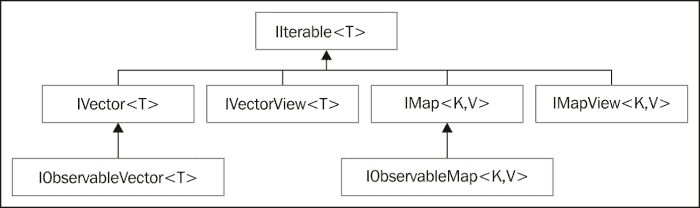

`IIterable<T>`只有一个方法：`First`，它返回一个`IIterator<T>`，这是 WinRT 迭代器接口。它定义了`MoveNext`和`GetMany`方法以及两个属性：`Current`返回迭代器指向的当前对象，`HasCurrent`指示是否还有更多的项目可以迭代。

`IVector<T>`表示可以通过索引访问的项目序列。这是 ABI 中常用的类型。C++支持库为`IVector<T>`提供了一个名为`Platform::Collections::Vector<T>`的标准实现。这可以作为 WinRT 类中的基础私有类型，因为在需要时它可以转换为`IVector<T>`。但是，请注意，对于重型操作，STL `std::vector<T>`更有效率。如果在某个时候需要`Vector<T>`，它有许多构造函数，其中一些接受`std::vector<T>`。

`IVectorView<T>`表示对向量的只读视图。可以通过调用`GetView`方法从`IVector<T>`中获取。`VectorView<T>`是一个 C++私有实现，如果需要，可以用于`IVector<T>`的自定义实现。

`IObservableVector<T>`继承自`IVector<T>`并添加了一个事件`VectorChanged`。这对于希望在`IObservableVector<T>`中添加、移除或替换项目时收到通知的客户端可能很有用。

`IMap*`系列接口管理键/值对，并且可以在 ABI 边界上进行传输。`Platform::Collections::Map<K,V>`提供了一个可转换为此接口的实现，作为一个平衡的二叉树，类似于`std::map<K,V>`（包括通过第三个模板参数改变排序算法的能力）。`IMapView<K,V>`是`IMap<K,V>`的只读视图。

### 注意

ABI 中最有用的集合类型是`IVector<T>`。如果可以接受`Vector<T>`作为基础实现，请这样做。否则，保持`std::vector<T>`，并且只在跨越 ABI 边界时转换为`IVector<T>`。

## 异常

COM/WinRT 不使用异常。原因可能很明显，异常是特定于语言或平台的。它们不能成为各种平台遵循的二进制标准的一部分。相反，COM 使用`HRESULT`，它们只是 32 位数字，用于指示方法调用的成功或失败。

然而，C++（以及大多数其他现代语言，如 C#）支持异常的概念。通过捕获异常来处理错误比在每次调用后检查`HRESULT`要容易得多，并且更易于维护（C 风格的编程）。这就是为什么通过 C++/CX 引用计数对象（帽子）进行的调用将失败的`HRESULT`转换为异常对象，该对象派生自`Platform::Exception`，可以以通常的方式捕获。

这也适用于另一种情况；在 C++/CX 中实现组件时，代码可能会抛出一个派生自`Platform::Exception`的异常；这种异常不能跨越 ABI；相反，它被转换为等效的`HRESULT`，这是可以跨越 ABI 的东西。另一方面，它可能会再次转换为异常对象，例如 C++异常或.NET 异常，以供客户端平台使用。

从`Platform::Exception`派生的异常类型列表是预定义的，不能扩展，因为每种类型直接映射到一个`HRESULT`。这意味着不可能添加新的异常类型，因为 C++/CX 无法知道将异常转换为哪个`HRESULT`，当跨越 ABI 时。对于自定义异常，可以使用带有自定义`HRESULT`的`Platform::COMException`。异常类型及其`HRESULT`等效的完整表格如下所示：

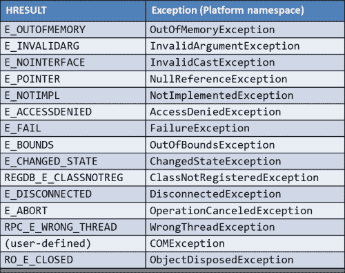

表中大多数异常类型都是不言自明的。我们将在本书的后面讨论其中一些异常。

### 注意

抛出一个不继承自`Platform::Exception`的对象将被转换为`E_FAIL` `HRESULT`。

所有异常类型都有一个`HResult`属性，其中包含基础的`HRESULT`值，还有一个`Message`属性，这是异常的文本描述（由 WinRT 提供，无法更改）。

# 总结

本章从一些可能对 WinRT 开发有用的新 C++11 特性开始。我们讨论了 COM，它的概念和思想，以及它们如何转化为 WinRT。WRL 提供了访问 WinRT 对象的帮助程序，而无需语言扩展。C++/CX 提供了语言扩展，使得与 WinRT 的工作和编写 WinRT 组件变得更加容易。

WinRT 有一些模式和习惯用法，我们需要学习和适应，比如处理异步操作、字符串、集合和错误处理的方法。

本章的覆盖范围并不全面，但应该足够让我们有能力和理解开始编写真实的应用程序。我们将在本书的后面部分看一些其他 C++/CX 的能力和其他与 WinRT 相关的特性。

在下一章中，我们将深入构建应用程序，从 XAML 开始，以及在 WinRT 中通常构建用户界面的方式。
