# 第四章：布局、元素和控件

上一章讨论了 XAML，这是一种中立的语言，用于创建对象并设置它们的属性。但是 XAML 只是一个工具，内容才是最重要的。构建有效的用户界面至少涉及选择最佳的元素和控件，以实现可用性和所需的用户体验。

在本章中，我们将介绍 WinRT 布局系统，并讨论构成大多数用户界面的主要元素和控件。

# 介绍布局

布局是元素放置和它们的大小和位置在用户交互或内容更改时发生变化的过程。在 Win32/MFC 世界中，布局通常非常简单和有限。控件是使用距离窗口左上角的距离放置的，并且它们的大小是明确指定的。这种模型的灵活性非常有限；如果控件的内容发生变化（例如变得更大），控件无法自动补偿。其他类似的变化对 UI 布局没有影响。

另一方面，WinRT 提供了一个基于一组布局面板的更灵活的模型，这些面板提供了不同的布局元素的方式。通过以各种方式组合这些面板，可以创建复杂和自适应的布局。

布局是一个两步过程。首先，布局容器询问每个子元素它们所需的大小。在第二步中，它使用适用的任何逻辑（对于该面板类型）来确定每个子元素的位置和大小，并将每个子元素放置在该矩形区域中。

每个元素向其父元素指示其大小要求。以下图总结了与这些要求相关的最重要的属性：

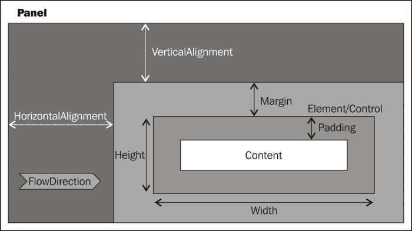

以下是这些重要属性的快速概述：

+   `Width`/`Height` – 所讨论的元素的宽度和高度。通常不设置（在 XAML 中未设置值为默认值—`"Auto"`—更多内容稍后会介绍），这意味着元素希望尽可能大。但是，如果需要，这些可以设置。元素的实际（渲染）宽度和高度可以使用`FrameworkElement::ActualWidth`和`ActualHeight`只读属性获得。

+   `MinWidth`/`MaxWidth`/`MinHeight`/`MaxHeight` – 元素大小的最小值和最大值（图中未显示）。默认值为最小值为`0`，最大值为无穷大。

+   `Margin` – 元素周围的“呼吸空间”。这是`Thickness`类型，有四个字段（`Left`、`Top`、`Right`和`Bottom`），用于确定元素周围的空间量。它可以在 XAML 中使用四个值（左、上、右、下）、两个值（第一个是左和右，第二个是上和下）或一个单一数字（四个方向上的相同距离）来指定。

+   `Padding` – 与`Margin`相同的概念，但确定元素的外边缘与其内容（如果有）之间的空间。这也被定义为`Thickness`，并由`Control`基类和一些其他特殊元素（如`Border`和`TextBlock`）定义。

+   `HorizontalAlignment`/`VerticalAlignment` – 指定元素相对于其父元素对齐的方式（如果有额外的空间）。可能的值是`Left`、`Center`、`Right`和`Stretch`（对于`HorizontalAlignment`），以及`Top`、`Center`、`Bottom`和`Stretch`（对于`VerticalAlignment`）。

+   `HorizontalContentAlignment`/`VerticalContentAlignment`（图中未显示）– 与`Horizontal`/`VerticalAlignment`相同的概念，但用于元素的`Content`（如果有）。

+   `FlowDirection` – 可用于将布局方向从默认值（`LeftToRight`）切换到`RightToLeft`，适用于从右到左的语言，如希伯来语或阿拉伯语。这实际上将每个“左”变为“右”，反之亦然。

在布局面板收集每个子元素所需的大小（通过对每个元素调用`UIElement::Measure`）之后，它进入布局的第二阶段——排列。在这个阶段，面板根据元素的期望大小（`UIElement::DesiredSize`只读属性）和适合该面板的任何算法来计算其子元素的最终位置和大小，并通过调用`UIElement::Arrange`通知每个元素所得到的矩形。这个过程可以递归进行，因为一个元素本身可以是一个布局面板，依此类推。结果被称为可视树。

### 注意

感兴趣的读者可能想知道如何在代码中为`Width`（例如）指定`"Auto"`XAML 值，因为这是一个`double`值。这是通过包括`<limits>`，然后使用表达式`std::numeric_limits<double>::quiet_NaN()`来完成的。类似地，要指定无限值，请使用`std::numeric_limits<double>::infinity()`。

# 布局面板

所有布局面板都必须派生自`Windows::UI::Xaml::Controls::Panel`类，它本身派生自`FrameworkElement`。主要的附加`Panel`是`Children`属性（也是它的`ContentProperty`，用于更容易的 XAML 编写），它是实现`IVector<UIElement>`接口的元素集合。通过使用`Children`属性，可以动态地向`Panel`添加或删除元素。WinRT 提供了一堆特定的面板，每个面板都有自己的布局逻辑，提供了创建布局的灵活性。在接下来的章节中，我们将看一些内置的布局面板。

### 注意

所有面板类，以及稍后描述的元素和控件，都假定存在于`Windows::UI::Xaml::Controls`命名空间中，除非另有说明。

## StackPanel

`StackPanel`是最简单的布局面板之一。它根据`Orientation`属性（`Vertical`是默认值）在*堆栈*中水平或垂直地布置其子元素。

当用于垂直布局时，每个元素都会得到它想要的高度和所有可用的宽度，反之亦然。这是`StackPanel`与一些元素的示例：

```cpp
<StackPanel Orientation="Horizontal" >
    <TextBlock Text="Name:" FontSize="30" Margin="0,0,10,0"/>
    <TextBox Width="130" FontSize="30"/>
</StackPanel>
```

这是运行时的样子（在输入一些文本后）：


`StackPanel`对于小型布局任务很有用，作为其他更复杂的布局面板的一部分。

## Grid

`Grid`可能是最有用的布局面板，因为它很灵活。它创建了一个类似表格的单元格布局。元素可以占据单个或多个单元格，单元格大小是可定制的。我们已经使用`Grid`来创建了上一章中的计算器布局。这里是另一个`Grid`示例（包装在`Border`元素中），一个登录页面的标记：

```cpp
<Border HorizontalAlignment="Center" VerticalAlignment="Center"
    BorderThickness="1" BorderBrush="Blue" Padding="10">
    <Grid>
        <Grid.RowDefinitions>
            <RowDefinition Height="Auto" />
            <RowDefinition Height="Auto" />
            <RowDefinition Height="Auto" />
            <RowDefinition Height="Auto" />
        </Grid.RowDefinitions>
        <Grid.ColumnDefinitions>
            <ColumnDefinition />
            <ColumnDefinition />
        </Grid.ColumnDefinitions>
        <TextBlock Text="Enter credentials:" Grid.ColumnSpan="2"
            TextAlignment="Center" FontSize="40" Margin="20"/>
        <TextBlock Text="Username:" TextAlignment="Right"
            Margin="10" Grid.Row="1" FontSize="40"
            VerticalAlignment="Bottom"/>
        <TextBox HorizontalAlignment="Left" Width="250"
            Grid.Row="1" Grid.Column="1" Margin="10" 
            FontSize="30" />
        <TextBlock Text="Password:" TextAlignment="Right"
            Margin="10" Grid.Row="2" FontSize="40"
            VerticalAlignment="Bottom" />
        <PasswordBox HorizontalAlignment="Left" Width="250"
            Grid.Row="2" Grid.Column="1" Margin="10" 
            FontSize="30" />
        <Button Content="Login" HorizontalAlignment="Stretch"
            Grid.Row="3" FontSize="30" Margin="10,30,10,10"
            Background="Green" />
        <Button Content="Cancel" HorizontalAlignment="Center" 
            Grid.Row="3" Grid.Column="1" FontSize="30" 
            Margin="10,30,10,10" Background="Red" />
    </Grid>
</Border>
```

这是运行时的样子：

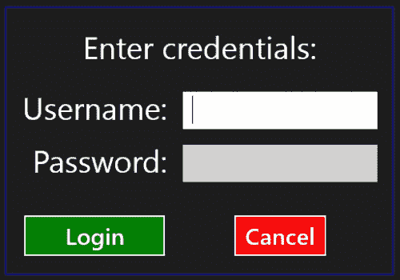

行数和列数不是通过简单的属性来指定的。而是使用`RowDefinition`对象（对于行）和`ColumnDefinition`对象（对于列）来指定。原因在于可以根据行和/或列的大小和行为来指定。

`RowDefinition`有一个`Height`属性，而`ColumnDefintion`有一个`Width`属性。两者都是`GridLength`类型。有三种设置`GridLength`的选项：

+   特定长度

+   基于星号的（相对）因子（这是默认值，因子等于 1）

+   自动长度

将`Height`（`RowDefintion`）或`Width`（`ColumnDefinition`）设置为特定数字会使该行/列具有特定的大小。在代码中，它相当于`ref new GridLength(len)`。

在 XAML 中将`Height`或`Width`设置为`"Auto"`会使行/列的高度/宽度根据放置在该行/列中的最高/最宽元素的需要而定。在代码中，它相当于静态属性`GridLength::Auto`。

最后一个选项（默认情况下）是在 XAML 中将`Height`/`Width`设置为`n*`，其中*n*是一个数字（如果省略则为`1`）。这将与具有“星号”长度的其他行/列建立关系。例如，这是`Grid`的三行：

```cpp
<RowDefinition Height="2*" />
<RowDefinition />
<RowDefinition Height="3*" />
```

这意味着第一行的高度是第二行的两倍（`Height="*"`）。最后一行比第二行高三倍，比第一行高一倍半。即使`Grid`由于布局更改而动态调整大小，这些关系也会保持不变。

### 注意

“星号”因子的值不必是整数；它也可以是浮点数值。重要的是比例，而不是实际数字。

使用附加的`Grid.Row`和`Grid.Column`属性将元素放置在特定的网格单元格中（两者默认为零，意味着第一行和第一列）。

元素默认情况下占用一个单元格。可以通过使用`Grid.RowSpan`和`Grid.ColumnSpan`属性来更改这一点（在先前的 XAML 中为第一个`TextBlock`设置了这个属性）。

### 提示

可以使用大数字指定`ColumnSpan`或`RowSpan`以确保元素将占据给定方向上的所有单元格。`Grid`将自动使用实际的行/列计数。

## 画布

`Canvas`模拟了经典的 Win32/MFC 布局——精确定位。如果需要精确坐标，例如图形、动画、图形游戏和其他复杂绘图的情况下，这种布局很有用。`Canvas`是最快的布局面板，因为它几乎没有布局（实际上几乎没有）。

以下是`Canvas`托管一些形状的示例：

```cpp
<Canvas x:Name="_canvas" >
    <Ellipse Stroke="White" StrokeThickness="2" Fill="Red" 
        Width="100" Height="100" Canvas.Left="50"/>
    <Rectangle Stroke="White" StrokeThickness="2" Fill="Green" 
        Canvas.Left="100" Canvas.Top="120" Width="120" 
        Height="120"/>
    <Polygon Points="0,0 150,60 50,-70" Canvas.Left="250" 
        Canvas.Top="200" Fill="Blue" Stroke="White" 
        StrokeThickness="2" />
</Canvas>
```

输出如下所示：

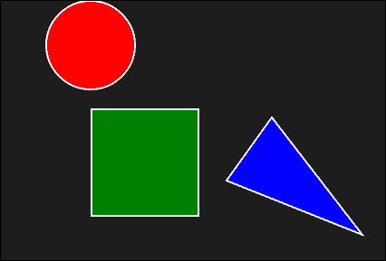

使用`Canvas.Left`和`Canvas.Top`附加属性设置放置坐标（两者默认为零，意味着`Canvas`的左上角）。`Canvas`定义的唯一其他附加属性是`ZIndex`。这指定了在`Canvas`内部渲染元素的相对顺序，其中大值将元素放置在顶部。默认情况下，XAML 中后定义的元素在 Z 顺序中更高。

作为更复杂的示例，假设我们想要允许用户使用鼠标或手指在`Canvas`上拖动形状。首先，我们将为指针按下、释放和移动添加事件处理程序：

```cpp
<Canvas x:Name="_canvas" PointerPressed="OnPointerPressed" PointerReleased="OnPointerReleased" PointerMoved="OnPointerMoved">
```

### 注意

“指针”的概念取代了可能熟悉的来自 Win32/MFC/WPF/Silverlight 的“鼠标”事件名称；指针是通用的，代表任何指针设备，无论是鼠标、触控笔还是手指。

与指针相关的事件使用冒泡策略，这意味着对元素（例如使用的形状）的任何按压都会首先引发该形状上的`PointerPressed`事件，如果未处理（在这种情况下），则会冒泡到其父级（`Canvas`）上，那里会得到处理。

`PointerPressed`事件可以这样处理：

```cpp
void MainPage::OnPointerPressed(Platform::Object^ sender,
   PointerRoutedEventArgs^ e) {
  _element = (FrameworkElement^)e->OriginalSource;
  if(_element == _canvas) return;
  _lastPoint = e->GetCurrentPoint(_canvas)->Position;
  _lastPoint.X -= (float)Canvas::GetLeft(_element);
  _lastPoint.Y -= (float)Canvas::GetTop(_element);
  _canvas->CapturePointer(e->Pointer);
  e->Handled = true;
  _isMoving = true;
}
```

由于此事件在`Canvas`上触发，即使原始元素是`Canvas`的子元素，我们如何才能到达该子元素？发送者参数是实际发送事件的对象——在这种情况下是`Canvas`。子元素由`PointerRoutedEventArgs::OriginalSource`属性指示（从`RoutedEventArgs`继承）。首先，检查是否按下指针实际上在`Canvas`本身上。如果是，该方法立即返回。

### 注意

在前面的`Canvas`中，这是不可能发生的。原因是`Canvas`的默认`Background`（或者任何其他`Panel`）是`nullptr`，因此无法在其上注册事件——它们会传播到其父级。如果需要`Canvas`本身上的事件，`Background`必须是一些非`nullptr`的`Brush`；如果父级的背景`Brush`需要显示，使用`ref new SolidColorBrush(Colors::Transparent)`就足够了。

接下来，通过两个步骤提取按压的位置，首先使用`PointerRoutedEventArgs::GetCurrentPointer()`（这是一个`PointerPoint`对象），然后使用`PointerPoint::Position`属性（类型为`Windows::Foundation::Point`）。然后调整该点，使其成为按压点到元素左上角位置的偏移量，这有助于使后续移动准确。

捕获指针（`UIElement::CapturePointer`）确保`Canvas`继续接收指针相关事件，无论指针在何处。将`PointerRoutedEventArgs::Handled`设置为`true`可以防止进一步的冒泡（因为这里没有必要），并且设置一个标志，指示从现在开始应该发生移动，直到释放指针（另一个私有成员变量）。

### 注意

指针捕获与其他 UI 技术（Win32/MFC/WPF/Silverlight）中存在的鼠标捕获概念类似。

当指针移动时，相关元素也需要移动，只要指针尚未释放：

```cpp
void MainPage::OnPointerMoved(Platform::Object^ sender,
   PointerRoutedEventArgs^ e) {
  if(_isMoving) {
    auto pos = e->GetCurrentPoint(_canvas)->Position;
    Canvas::SetLeft(_element, pos.X - _lastPoint.X);
    Canvas::SetTop(_element, pos.Y - _lastPoint.Y);
    e->Handled = true;
  }
}
```

这里的主要思想是通过设置附加的`Canvas`属性`Canvas.Left`和`Canvas.Top`（使用静态的`Canvas::SetLeft`和`Canvas::SetTop`方法）来移动元素。

当指针最终释放时，我们只需要进行一些清理工作：

```cpp
void MainPage::OnPointerReleased(Platform::Object^ sender,
   PointerRoutedEventArgs^ e) {
  _isMoving = false;
  _canvas->ReleasePointerCapture(e->Pointer);
  e->Handled = true;
}
```

完整的代码在一个名为`CanvasDemo`的项目中，是本章可下载代码的一部分。

### 注意

指针相关的方法可能看起来比需要的更复杂，但实际上并非如此。由于触摸输入通常是多点触控，如果两根手指同时按在两个不同的元素上并尝试移动它们会发生什么？可能会触发多个`PointerPressed`事件，因此需要一种方法来区分一个手指和另一个手指。先前的代码是在假设一次只使用一个手指的情况下实现的。

### 动态向面板添加子元素

`Panel::Children`属性可以通过编程方式进行操作（适用于任何`Panel`类型）。例如，使用`Canvas`作为绘图表面，我们可以使用先前的指针事件来添加连接到彼此的`Line`元素以创建绘图。当指针移动（在按下后），可以使用以下代码添加`Line`对象：

```cpp
void MainPage::OnPointerMoved(Object^ sender, 
   PointerRoutedEventArgs^ e) {
  if(_isDrawing) {
    auto pt = e->GetCurrentPoint(_canvas);
    auto line = ref new Line();
    line->X1 = _lastPoint->Position.X;
    line->Y1 = _lastPoint->Position.Y;
    line->X2 = pt->Position.X;
    line->Y2 = pt->Position.Y;
    line->StrokeThickness = 2;
    line->Stroke = _paintBrush;
    _canvas->Children->Append(line);
    _lastPoint = pt;
  }
}
```

构造了一个`Line`对象，设置了适当的属性，最后将其添加到`Canvas`的`Children`集合中。如果没有这最后一步，那么`Line`对象将不会附加到任何东西上，并且当其引用超出范围时，它将被销毁。`_paintBrush`是由托管页面维护的`Brush`字段（未显示）。

完整的源代码在一个名为`SimpleDraw`的项目中，是本章可下载代码的一部分。以下是使用此应用程序完成的示例绘图：

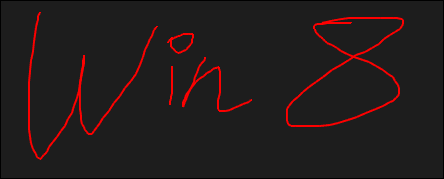

## VariableSizedWrapGrid

`StackPanel`、`Grid`和`Canvas`都非常直观；它们与 WPF 或 Silverlight 中的对应物几乎没有什么不同。WinRT 有一些更有趣的面板，从`VariableSizedWrapGrid`开始。

顾名思义，它本质上是一个网格，其中的项目按行或列排列（取决于`Orientation`属性）。当空间不足时，或者如果一行/列中的项目数量达到了`MaximumRowsOrColumns`属性设置的限制，布局将继续到下一行/列。

最后一个关于`VariableSizedWrapGrid`的技巧是，它有两个附加属性，`RowSpan`和`ColumnSpan`，可以改变一个项目的大小，使其占据多个单元格。以下是一个带有一堆`Rectangle`元素的`VariableSizedWrapGrid`示例：

```cpp
<Grid Background=
    "{StaticResource ApplicationPageBackgroundThemeBrush}">
    <Grid.Resources>
        <Style TargetType="Rectangle">
            <Setter Property="Stroke" Value="White" />
            <Setter Property="StrokeThickness" Value="2" />
            <Setter Property="Margin" Value="8" />
            <Setter Property="Width" Value="100" />
            <Setter Property="Height" Value="100" />
            <Setter Property="Fill" Value="Red" />
        </Style>
    </Grid.Resources>
    <VariableSizedWrapGrid x:Name="_grid"     
        Orientation="Horizontal" 
        MaximumRowsOrColumns="6">
        <Rectangle />
        <Rectangle Fill="Yellow" />
        <Rectangle Fill="Purple"/>
        <Rectangle />
        <Rectangle Fill="Blue" VariableSizedWrapGrid.RowSpan="2" 
           Height="200"/>
        <Rectangle />
        <Rectangle Fill="Brown"/>
        <Rectangle VariableSizedWrapGrid.ColumnSpan="2" 
           Width="200" Fill="Aqua"/>
        <Rectangle Fill="LightBlue"/>
        <Rectangle Fill="Green"/>
        <Rectangle VariableSizedWrapGrid.ColumnSpan="2"
           VariableSizedWrapGrid.RowSpan="2" Width="150" 
           Height="150" Fill="BlueViolet"/>
        <Rectangle Fill="AntiqueWhite"/>
        <Rectangle Fill="Azure"/>
        <Rectangle />
        <Rectangle Fill="BlanchedAlmond"/>
        <Rectangle Fill="Orange"/>
        <Rectangle Fill="Crimson"/>
        <Rectangle Fill="DarkGoldenrod"/>
    </VariableSizedWrapGrid>
</Grid>
```

这是结果：

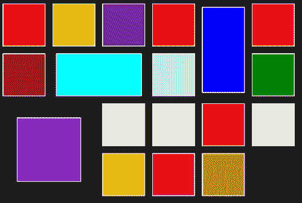

## 面板虚拟化

所有先前讨论的面板在添加时都会创建它们的子元素。对于大多数情况，这是可以接受的。但是，如果项目数量非常多（数百个或更多），面板的性能可能会下降，因为需要创建和管理许多元素，占用内存并在创建时浪费 CPU 周期，或在布局更改时发生。虚拟化面板不会一次性创建它所持有的项目的所有元素；相反，它只会创建当前可见的实际元素。如果用户滚动以查看更多数据，则会根据需要创建元素。滚出视图的元素可能会被销毁。这种方案节省了内存和 CPU 时间（在创建时）。

`VirtualizingPanel`类是 WinRT 中所有虚拟化面板实现的抽象基类。`VirtualizingPanel`的进一步细化是`OrientedVirtualizingPanel`，表示具有固有方向的面板。WinRT 提供了三种虚拟化面板，我们将在稍后看到。

所有虚拟化面板都有一个更有趣的特点，它们只能用于自定义基于`ItemsControl`（通常使用数据绑定）的控件面板；它们不能像正常面板一样使用——在其中放置项目（在 XAML 或以编程方式）。`ItemsControl`及其派生类的完整讨论将在本章的后面部分进行；现在我们将快速查看现有虚拟化面板的工作方式；当讨论`ItemsControl`时，我们将在稍后看到使用示例。

### 虚拟化面板

最容易理解的虚拟化面板是`VirtualizingStackPanel`。它的行为就像常规的`StackPanel`，但它会虚拟化当前不可见的元素。

`WrapGrid`类似于`VariableSizedWrapGrid`，但没有“可变”部分（它没有可以更改单个元素大小的附加属性）。它在`GridView`中用作默认面板（`GridView`是从`ItemsControl`派生的许多类型之一）。它可以通过属性进行自定义，例如`Orientation`，`ItemHeight`，`ItemWidth`和`MaximumRowsOrColumns`，这些属性大多是不言自明的。

`CarouselControl`类似于`VirtualizingStackPanel`，还具有在达到最后一个项目时滚动到第一个项目的功能。它被用作`ComboBox`的默认面板，并且实际上不能被其他控件使用，因此通常没有什么用处。

# 与元素和控件一起工作

“元素”和“控件”之间的区别在实践中并不那么重要，但了解这种区别是有用的。

**元素**从`FrameworkElement`（直接或间接）派生，但不是从`Control`派生。它们具有一些外观并提供一些可通过更改属性进行自定义的功能。例如，`Ellipse`是一个元素。没有办法改变`Ellipse`的基本外观（并且能够将`Ellipse`变成矩形是不合逻辑的）。但是可以使用诸如`Stroke`，`StrokeThickness`，`Fill`和`Stretch`等属性以某种方式进行自定义。

另一方面，**控件**从`Control`类（直接或间接）派生。`Control`添加了一堆属性，其中最重要的是`Template`属性。这允许完全更改控件的外观而不影响其行为。此外，所有这些都可以仅使用 XAML 实现，无需代码或任何类派生。我们将在第六章中讨论控件模板，*组件，模板和自定义元素*。

以下类图显示了 WinRT 中一些基本的与元素相关的类：

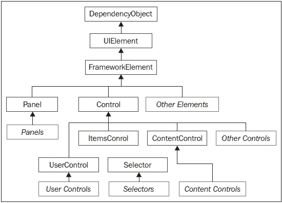

在接下来的几节中，我们将讨论各种元素和控件的组（基于派生和使用类别），研究它们的主要特点和用法。在每个组中，我们将查看一些更有用或独特的控件。这些部分并不完整（也不打算如此）；更多信息可以在官方 MSDN 文档和示例中找到。

## 内容控件

内容控件派生自`ContentControl`类（它本身派生自`Control`）。`ContentControl`添加了两个重要属性：`Content`（也是其`ContentProperty`属性，使其在 XAML 中易于设置）和`ContentTemplate`。`ContentControl`的一个简单示例是`Button`：

```cpp
<Button Content="Login" FontSize="30" />
```

这个`Content`属性可能看起来像一个字符串，但实际上它的类型是`Platform::Object^`，意味着它可以是任何东西。

### 注意

`Platform::Object`指定“任何内容”似乎有些奇怪；毕竟，WinRT 是基于 COM 的，所以肯定有一个接口在后面。实际上，`Platform::Object`就是`IInspectable`接口指针的投影替代品。

从`ContentControl`派生的类型使用以下规则呈现其`Content`：

+   如果它是一个字符串，将呈现`TextBlock`，其`Text`设置为字符串值。

+   如果它是从`UIElement`派生的，它将按原样呈现。

+   否则（`Content`不是从`UIElement`派生的，也不是字符串），如果`ContentTemplate`是`nullptr`，那么内容将呈现为一个`TextBlock`，其`Text`设置为`Content`的字符串表示。否则，提供的`DataTemplate`用于呈现。

前述规则适用于任何从`ContentControl`派生的类型。在前面的按钮的情况下，使用第一条规则，因为`Button`的`Content`是字符串**Login**。以下是使用第二条规则的示例：

```cpp
<Button>
    <StackPanel Orientation="Horizontal">
        <Image Source="assets/upload.png" Stretch="None" />
        <TextBlock Text="Upload" FontSize="35"
            VerticalAlignment="Center" Margin="10,0,0,0" />
    </StackPanel>
</Button>
```

生成的按钮如下所示：


生成的控件仍然是一个按钮，但其`Content`设置为从`UIElement`派生的类型（在本例中是`StackPanel`）。

第三条规则是最有趣的。假设我们有一个简单的数据对象实现如下：

```cpp
namespace ContentControlsDemo {
  public ref class Book sealed {
  public:
    property Platform::String^ BookName;
    property Platform::String^ AuthorName;
    property double Price;
  };
}
```

有了这个实现，让我们在 XAML 中创建一个`Book`实例作为资源：

```cpp
<Page.Resources>
    <local:Book x:Key="book1" BookName="Windows Internals"
       AuthorName="Mark Russinovich" Price="50.0" />
</Page.Resources>
```

### 注意

为了使其编译不出错，必须在`MainPage.xaml.h`中添加`#include "book.h"`。这样做的原因将在下一章中变得清晰。

现在，我们可以将从`ContentControl`（如`Button`）派生的类型的`Content`设置为该`Book`对象：

```cpp
<Button Content="{StaticResource book1}" FontSize="30"/>
```

运行应用程序显示以下结果：


结果只是类的完全限定类型名称（包括命名空间）；这并不总是这样，这取决于所讨论的控件的默认控件模板。无论如何，显然这通常不是我们想要的。要为对象获取自定义呈现，需要一个`DataTemplate`，并将其插入到`ContentTemplate`属性中。

以下是一个为在问题中的`Button`中使用的`DataTemplate`的示例：

```cpp
<Button Margin="12" Content="{StaticResource book1}" >
    <Button.ContentTemplate>
        <DataTemplate>
            <Grid>
                <Grid.RowDefinitions>
                    <RowDefinition Height="Auto" />
                    <RowDefinition Height="Auto" />
                </Grid.RowDefinitions>
                <Grid.ColumnDefinitions>
                    <ColumnDefinition />
                    <ColumnDefinition Width="15" />
                    <ColumnDefinition Width="Auto" />
                </Grid.ColumnDefinitions>
                <TextBlock FontSize="35" Foreground="Yellow"
                    Text="{Binding BookName}" />
                <TextBlock Grid.Row="1" FontSize="25"
                    Foreground="Orange" 
                    Text="{Binding AuthorName}" />
                <TextBlock FontSize="40" Grid.Column="2"
                    Grid.RowSpan="2" TextAlignment="Center"
                    VerticalAlignment="Center">
                <Span FontSize="25">Just</Span><LineBreak />
                <Span FontSize="40">$</Span>
                <Run Text="{Binding Price}" FontSize="40" />
                </TextBlock>
            </Grid>
        </DataTemplate>
    </Button.ContentTemplate>
</Button>
```

这里有几点需要注意：

+   `DataTemplate`可以包含一个单一元素（通常是一个`Panel`—在本例中是`Grid`），并且可以构建任何所需的 UI。

+   使用实际内容的属性是通过数据绑定表达式完成的，使用`{Binding}`标记扩展和属性名称。有关数据绑定的完整处理在下一章中找到。

+   要使属性与数据对象（在本例中是`Book`）一起工作，必须像这样用`Bindable`属性装饰类（`Book`）：

```cpp
[Windows::UI::Xaml::Data::Bindable]
public ref class Book sealed {
```

结果如下所示：


数据模板是可视化数据对象的强大工具；我们以后会遇到更多。现在，重要的是要意识到每个从`ContentControl`派生的类型都具有这种自定义能力。

在接下来的几节中，我们将讨论一些常见的`ContentControl`派生类型。

### 按钮

正如我们已经看到的，经典的`Button`控件是一个`ContentControl`，这意味着它可以拥有任何内容，但仍然像一个按钮一样工作。`Button`的大部分功能都是从它的抽象基类`ButtonBase`派生出来的。`ButtonBase`声明了无处不在的`Click`事件，以及一些其他有用的属性：

+   `ClickMode` - 指示什么构成“点击”：`Release`，`Press`或`Hover`。自然地，这主要适用于鼠标。

+   `Command` - 指示在按钮被点击时要调用哪个命令（如果有的话）（命令将在下一章中讨论）。

+   `CommandParameter` - 与调用的命令一起发送的可选参数。

Button 派生自`ButtonBase`，在成员方面没有任何添加，除了具体化，而不是抽象化。

另一个`ButtonBase`的派生类是`HyperlinkButton`。它默认呈现为一个网页超链接，并添加了一个`NavigationUri`属性，导致自动导航到指定的 URI；`Click`事件通常不会被处理。

`RepeatButton`（在`Windows::UI::Xaml::Controls::Primitives`命名空间中）是另一个`ButtonBase`的派生类。只要按钮被按下，它就会引发`Click`事件；可以使用`Delay`（第一个`Click`事件）和`Interval`（`Click`事件引发的时间间隔）属性来指定`Click`事件的速率。

### 注意

`RepeatButton`本身不太有用；它主要作为其他更复杂的控件的构建块。这可以通过将控件放置在`Primitives`子命名空间中来暗示。例如，`RepeatButton`组成了`ScrollBar`的几个部分（它本身在`Primitives`命名空间中）。

另外两个有用的按钮控件是`CheckBox`和`RadioButton`。两者都派生自一个共同的基类`ToggleButton`。`ToggleButton`定义了`IsChecked`属性，它可以有三个值（`true`，`false`或`nullptr`）。后者表示一个不确定的状态，由`CheckBox`支持（但不由`RadioButton`支持）。`ToggleButton`还声明了`IsThreeState`属性，以指示是否应允许第三种状态。最后，它定义了三个事件，`Checked`，`Unchecked`和`Indeterminate`。

`CheckBox`除了变得具体之外，对`ToggleButton`没有任何添加。`RadioButton`只添加了一个属性`GroupName`（一个字符串）。这允许对`RadioButton`控件进行分组，以用作排他性组。默认情况下，同一直接父级下的所有`RadioButton`控件都成为一组（该组中只能有一个`IsChecked`属性设置为`true`）。如果指定了`GroupName`，则所有具有相同`GroupName`的`RadioButtons`被视为一组。

这是一个简单的示例，使用了`CheckBox`和`RadioButton`控件：

```cpp
<StackPanel>
    <TextBlock Text="What kind of tea would you like?"
       FontSize="25" Margin="4,12"/>
    <RadioButton Content="Earl Grey" IsChecked="True" Margin="4" 
       FontSize="20" />
    <RadioButton Content="Mint" Margin="4" FontSize="20"/>
    <RadioButton Content="Chinese Green" Margin="4" 
       FontSize="20"/>
    <RadioButton Content="Japanese Green" Margin="4" 
       FontSize="20"/>

    <TextBlock Text="Select tea supplements:" FontSize="25" 
       Margin="4,20,4,4" />
    <CheckBox Content="Sugar" Margin="4" FontSize="20" />
    <CheckBox Content="Milk" Margin="4" FontSize="20" />
    <CheckBox Content="Lemon" Margin="4" FontSize="20" />
</StackPanel>
```

在进行一些选择后，得到的显示如下：

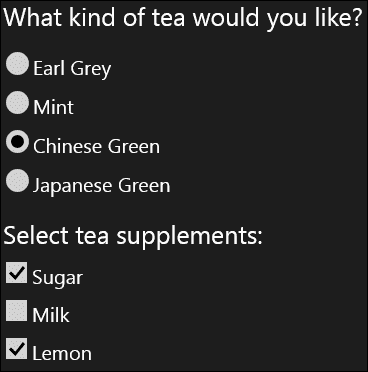

### ScrollViewer

`ScrollViewer`是一个内容控件，它承载一个子元素（就像任何其他`ContentControl`的`Content`属性一样），并使用一对`ScrollBar`控件来支持滚动。最重要的属性是`VerticalScrollBarVisibility`和`HorizontalScrollBarVisibility`，它们指示滚动的方式和滚动条的呈现方式。有四个选项（`ScrollBarVisibility`枚举）：

+   `Visible` - 滚动条始终可见。如果内容不需要滚动，滚动条将被禁用。

+   `Auto` - 如果需要，滚动条会出现，如果不需要，它会消失。

+   `Hidden` - 滚动条不显示，但仍然可以使用键盘、触摸或编程方式进行滚动。

+   `Disabled` - 滚动条被隐藏，无法滚动。`ScrollViewer`不会给内容提供比它在该维度上拥有的更多的空间。

`VerticalScrollBarVisibility`的默认值为`Visible`，`HorizontalScrollBarVisibility`的默认值为`Disabled`。

`ScrollViewer`的另一个有用功能是它能够通过缩放/捏触手势来允许`Content`进行放大或缩小。这是通过`ZoomMode`属性（`Enabled`或`Disabled`）来控制的。

`HorizontalScrollBarVisibility`、`VerticalScrollBarVisibility`和`ZoomMode`属性也作为附加属性公开，因此它们与内部使用`ScrollViewer`的其他控件相关，例如`ListBox`或`GridView`。以下是一个简单的示例，它改变了`ListBox`中水平滚动条的呈现方式：

```cpp
<ListBox ScrollViewer.HorizontalScrollBarVisibility="Hidden">
```

### 其他需要注意的内容控件

以下是 WinRT 中一些其他`ContentControl`派生类型的简要描述。

#### AppBar

`AppBar`是一个用于应用栏的`ContentControl`，通常出现在底部（有时在顶部），如果用户从底部（或顶部）滑动或右键单击鼠标。它通常托管一个水平的`StackPanel`，其中包含各种选项的按钮。以下是一个来自天气应用程序的示例，该应用程序可在任何 Windows 8 安装中使用：

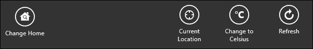

#### Frame

`Frame`是用于在派生自`Page`的控件之间进行导航的`ContentControl`。使用`Navigate`方法与`Page`类型“导航”到该页面，通过创建一个实例并调用一些虚拟方法：在旧页面上调用`OnNavigatedFrom`（如果有的话），在新页面上调用`OnNavigatedTo`。默认情况下，应用程序向导在`App::OnLaunched`方法（`Lanuched`事件的事件处理程序）中创建一个`Frame`对象，然后快速导航到`MainPage`，代码如下：

```cpp
rootFrame->Navigate(TypeName(MainPage::typeid), args->Arguments)
```

`Navigate`的第二个参数是一个可选的上下文参数，在`OnNavigatedTo`重写中可用（在`NavigationEventArgs::Parameter`中）。

`Frame`对象维护着一个页面的后退堆栈，可以使用`GoBack`和`GoForward`等方法进行导航。`CanGoBack`和`CanGoForward`只读属性可以帮助维护用于导航目的的按钮的状态。

导航到先前访问的页面可以创建这些页面的新实例或重用实例。`CacheSize`属性可以设置在导航期间在内存中保留的最大缓存页面数。要为特定的`Page`实例启用任何类型的缓存，必须将其`Page::NavigationCacheMode`属性设置为`Enabled`或`Required`（`Disabled`是默认值）。`Enabled`与缓存一起工作，而`Required`始终在内存中保持页面状态（`Required`设置不计入`Frame::CacheSize`值）。

#### SelectorItem

`SelectorItem`是可在`ItemsControl`控件中选择的项目的抽象基类（有关`ItemsControl`的描述，请参见下一节）。它只添加了一个属性：`IsSelected`。派生类型是其各自基于集合的控件中项目的容器：`ListBoxItem`（在`ListBox`中）、`GridViewItem`（在`GridView`中）、`ListViewItem`（在`ListView`中）等。

## 基于集合的控件

以下各节讨论了持有多个数据项的控件。这些都派生自提供所有派生类型的基本结构的`ItemsControl`类。

`Items`只读属性是托管在此`ItemsControl`中的对象的集合（类型为`ItemCollection`，也是其`ContentProperty`）。对象可以使用`Append`和`Insert`方法添加，使用`Remove`和`RemoveAt`方法移除（任何类型的对象都可以成为`ItemsControl`的一部分）。尽管这听起来很吸引人，但这不是与`ItemsControl`或其派生类型一起工作的典型方式；通常会将对象集合设置为`ItemsSource`属性（通常使用数据绑定表达式），并且自动使用`Items`属性在幕后填充控件。我们将在第五章*数据绑定*中看到这一点。

`ItemsPanel`属性允许更改特定`ItemsControl`中托管项目的默认`Panel`。例如，`ListView`使用垂直`VirtualizingStackPanel`作为其默认`Panel`。这可以通过`ListView`元素内的以下 XAML 片段更改为`WrapGrid`：

```cpp
<ListView.ItemsPanel>
    <ItemsPanelTemplate>
        <WrapGrid Orientation="Horizontal"/>
    </ItemsPanelTemplate>
</ListView.ItemsPanel>
```

`ItemTemplate`属性可以设置为`DataTemplate`，以显示集合中的对象。`ItemTemplate`具有与`ContentControl::ContentTemplate`相同的目的和规则，但适用于`ItemsControl`中的每个对象。我们将在下一章中看到`ItemTemplate`的用法示例。

`DisplayMemberPath`是一个`String`属性，如果`ItemTemplate`为`nullptr`，则可以用来显示此`ItemsControl`中对象的某个属性（或子属性）。例如，假设我们使用以下`Book`类（之前定义）：

```cpp
[Bindable]
public ref class Book sealed {
public:
  property Platform::String^ BookName;
  property Platform::String^ AuthorName;
  property double Price;
  };
```

创建这样的`Book`对象数组，并将其放置在`ItemsControl::ItemsSource`属性中（或通过`Items->Append`方法手动添加它们），默认情况下会显示`Book`类型名称（假设没有设置`ItemTemplate`）。将`DisplayMemberPath`设置为`"BookName"`将在`ItemsControl`中显示每个对象的`BookName`。

`ItemContainerStyle`属性可用于在此`ItemsControl`的特定容器项上放置`Style`。例如，设置`ItemContainerStyle`属性的`ListView`会影响`ListViewItem`控件，每个控件都包含所讨论的数据对象（根据内容的通常规则）。

我们将在下一章中看到`ItemsControl`的更多属性。以下部分简要讨论了一些从`ItemsControl`派生的常见类型。从技术上讲，只有一个这样的类：`Selector`，添加了`SelectedItem`（实际数据对象）和`SelectedIndex`（整数索引）属性的选择概念。`SelectedValue`属性根据`SelectedValuePath`属性指示所选项目的“值”。例如，如果控件保存`Book`对象，如前所示，并且`SelectedValuePath`为`"BookName"`，那么`SelectedValue`将保存`SelectedItem`的实际书名（`SelectedItem`保存整个`Book`对象）。

`Selector`还定义了一个事件`SelectionChanged`，当选定的项目发生变化时触发。

### ListBox 和 ComboBox

`ListBox`和`ComboBox`是经典 Windows 控件的 WinRT 版本。`ListBox`显示对象的集合（默认情况下是垂直的），如果需要，会有滚动条。`ListBox`还添加了多个选定项目的概念，具有`SelectedItems`属性和`SelectionMode`属性（`Single`，`Multiple`——每次单击/触摸都会选择/取消选择项目，以及`Extended`——按下*Shift*会选择多个连续对象，按下*Ctrl*会选择非相邻的组）。

`ComboBox`只显示一个从下拉列表中选择的项目。在商店应用中不鼓励使用这两个控件，因为它们的触摸行为不如应该的好，而且它们没有有趣的视觉过渡，使它们有点乏味；尽管如此，它们有时仍然可能有用，特别是`ComboBox`，它没有类似的替代品。

### ListView 和 GridView

`ListView`和`GridView`都派生自`ListViewBase`（派生自`Selector`），它们是托管多个项目的首选控件。`ListView`和`GridView`对`ListViewBase`没有任何添加——它们只是具有不同的`ItemsPanel`属性默认值和一些其他调整。

这两者都经过深思熟虑地设计，以适应触摸输入、过渡动画等；它们是显示对象集合的工作马。事实上，Visual Studio 有一些项目模板，用于构建示例`ListView`和`GridView`控件，以帮助开发人员入门：

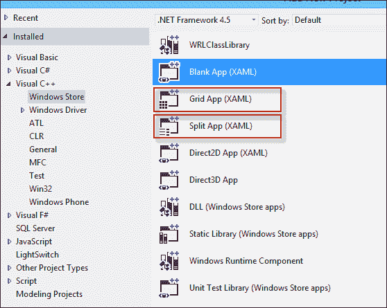

### FlipView

`FlipView`控件对`Selector`没有任何添加，但具有一种独特的外观，一次只显示一个（选定的）项目（类似于`ComboBox`），但允许通过向左或向右滑动或单击两侧的箭头来“翻转”项目。经典示例是翻转图像对象：


## 基于文本的元素

文本是任何用户界面的重要部分。自然地，WinRT 提供了几个具有文本作为其主要视觉外观的元素和控件。通常涉及与字体相关的属性。这些包括：

+   `FontSize` - 文本的大小（`double`值）。

+   `FontFamily` - 字体系列名称（如"Arial"或"Verdana"）。这可以包括备用字体系列（用逗号分隔），以防该特定字体不可用。

+   `FontStretch` - 指示字体的拉伸特性，如`Condensed`，`Normal`（默认值），`ExtraCondensed`，`Expanded`等。

+   `FontWeight` - 指示字体重量，如`Bold`，`ExtraBold`，`Medium`，`Thin`等（都取自`FontWeights`类的静态属性）。

+   `FontStyle` - `Normal`，`Oblique`或`Italic`之一。

所有与字体相关的属性都有一个显着的属性，它们为存在为元素的子元素（直接或间接）设置了一个“默认”字体。这意味着在`Page`对象上设置与字体相关的属性实际上为页面中的所有元素设置了默认字体（除了两个例外：由控件模板显式设置的字体属性和特定元素设置的本地字体属性；两者都会覆盖默认字体设置）。

大多数文本元素共有的另一个属性是`Foreground`。这设置绘制实际文本的`Brush`。有几种`Brush`类型，`SolidColorBrush`是最简单的，但还有其他类型，如`LinearGradientBrush`和`TileBrush`。

大多数与文本相关的元素共有的其他文本相关属性包括`TextAlignment`（`Left`，`Right`，`Center`，`Justify`），`TextTrimming`（`None`和`WordEllipsis`），和`TextWrapping`（`NoWrap`和`Wrap`），都相当容易理解。

### 使用自定义字体

可以在 WinRT 中使用自定义字体。这涉及将字体文件添加到项目中（带有`.TTF`扩展名），并确保在 Visual Studio 中其**Content**属性设置为**Yes**：

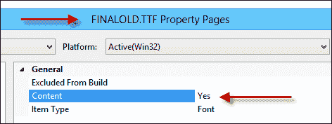

现在所需的就是使用`FontFamily`属性和特殊值，包括字体 URI（文件名和任何逻辑文件夹），一个井号（#）和字体名称本身，当在 Windows 中双击字体文件时可见。以下是使用标准字体和自定义字体的两行示例：

```cpp
<StackPanel>
    <TextBlock Text="This text is in a built in font"
        FontFamily="Arial" FontSize="30" Margin="20"/>
    <TextBlock Text="This text is in old Star Trek style" 
       FontFamily="Finalold.ttf#Final Frontier Old Style" 
       FontSize="30" Margin="20" />
</StackPanel>
```

结果如下所示：

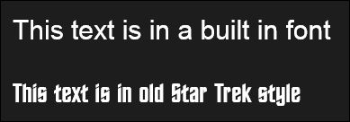

以下部分讨论了一些常见的与文本相关的元素和控件。

### TextBlock

`TextBlock`可能是最有用的与文本相关的元素。它显示用户无法交互更改的文本（只能进行编程更改）。这对于显示静态文本非常有用，用户不应该编辑它。

### 注意

尽管文本无法在`TextBlock`中编辑，但用户仍然可以选择它（甚至可以通过按下*Ctrl* + *C*进行复制），如果`IsTextSelectionEnabled`为`true`。如果是这样，还可以使用其他属性，即`SelectedText`，`SelectionStart`和`SelectionEnd`（后者返回`TextPointer`对象）。

使用`TextBlock`最直接的方法是设置`Text`属性（一个`String`）和必要时的与字体相关的属性。作为`Text`的替代，`TextBlock`支持一组称为 inlines 的对象（通过`Inlines`属性，这也是它的`ContentProperty`用于 XAML 目的），允许构建一个更复杂的`TextBlock`，但仍然只使用一个元素（`TextBlock`）。

内联包括（都派生自`Inline`）`Span`，`Run`，`LineBreak`和`InlineUIContainer`（都在`Windows::UI::Xaml::Documents`命名空间中）。`Span`是具有相同属性的更多内联的容器。`Run`具有`Text`属性并添加`FlowDirection`。`LineBreak`就是那样。`InlineUIContainter`不能在`TextBlock`中使用，只能在`RichTextBlock`中使用（稍后讨论）。

这是一个`TextBlock`的例子：

```cpp
<TextBlock>
    <Run FontSize="30" Foreground="Red" Text="This is a run" />
    <LineBreak />
    <Span Foreground="Yellow" FontSize="20">
        <Run Text="This text is in yellow" />
        <LineBreak />
        <Run Text="And so is this" />
    </Span>
</TextBlock>
```

结果如下所示：

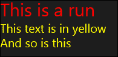

### 注意

如果`Text`属性与内联一起使用，`Text`优先，内联不会显示。

### TextBox

`TextBox`是经典的文本输入控件，并提供了所有预期的控件功能。常见属性包括（除了字体属性和其他在本节开头讨论的属性）：

+   `Text` - 用户实际显示或编辑的文本。

+   `MaxLength` - 用户输入的最大字符长度（在通过编程方式操作`TextBox`中的`Text`时不使用此设置）。

+   `SelectedText`，`SelectedLength`，`SelectionStart`，`SelectionEnd` - 选择相关的属性（不言自明）。

+   `IsReadOnly` - 指示文本是否实际可编辑（默认为`false`）。

+   `AcceptsReturn` - 如果为`true`，表示多行`TextBox`（默认为`false`）。

+   `InputScope` - 指示在不使用物理键盘的触摸设备上应该弹出什么样的虚拟键盘。这可以帮助输入文本。值（来自`InputScopeNameValue`枚举）包括：`Url`，`Number`，`EmailSmtpAddress`（电子邮件地址）等。这是`Number`的`InputScope`的键盘截图：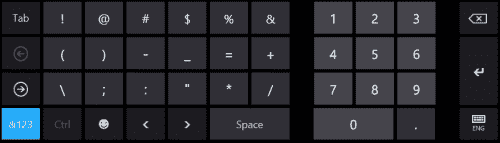

这是`InputScope`为`Url`的键盘的例子：

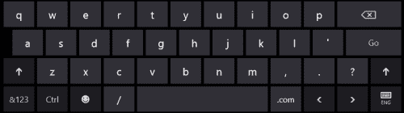

这是`EmailSmtpAddress`的`InputScope`的一个例子：

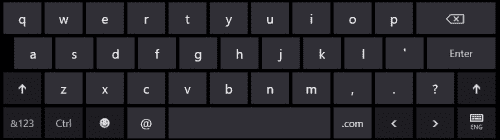

`TextBox`定义了几个事件，其中`TextChanged`是最有用的。

### PasswordBox

`PasswordBox`用于输入密码（毫不意外）。文本显示为单个重复字符，可以使用`PasswordChar`属性更改（默认为`'*'`，显示为圆圈）。`Password`属性是实际密码，通常在代码中读取。

`PasswordBox`的一个很好的功能是一个“显示”按钮，当按下按钮时可以显示实际密码，有助于确保输入的密码是预期的；通过将`IsPasswordRevealButtonEnabled`设置为`false`可以关闭此功能。

### RichTextBlock 和 RichEditBox

`TextBlock`和`TextBox`的“丰富”版本提供了更丰富的格式化功能。例如，可以将字体相关属性设置为控件内的任何文本。

对于`RichTextBlock`，控件的实际内容在块对象的集合中（`Blocks`属性），只有一个派生类型 - `Paragraph`。`Paragraph`有自己的格式化属性，并且可以承载`Inline`对象（类似于`TextBlock`）；`RichTextBlock`支持`InlineUIContainer`内联，可以嵌入元素（例如图像，或其他任何内容）作为文本的一部分。

`RichEditBox`允许更丰富的编辑功能，可以嵌入*丰富*内容，例如超链接。`Document`属性（类型为`ITextDocument`）提供了`RichEditBox`背后的对象模型的入口。此对象模型支持以文本和富文本（RTF）格式保存和加载文档，多次撤消/重做功能等其他功能。

## 图像

图像可以使用`Image`元素显示。`Source`属性指示应显示什么。最简单的可能性是将图像添加到项目作为内容：

```cpp
<Image Source="penguins.jpg" />
```

`Source`属性是`ImageSource`类型；此标记仅起作用是因为存在类型转换器，可以将相对 URI 转换为从`ImageSource`派生的类型。

最简单的派生类型是`BitmapImage`（实际上是从`BitmapSource`派生的，而`BitmapSource`又是从`ImageSource`派生的）。`BitmapImage`可以从 URI（使用`UriSource`属性）初始化，这正是在前面的 XAML 中使用的类型转换器所发生的。

更有趣的类型是`WriteableBitmap`（也是从`BitmapSource`派生的），它公开了动态更改位图位的能力。

要创建`WriteableBitmap`，我们需要指定其像素尺寸，如下面的代码所示：

```cpp
_bitmap = ref new WriteableBitmap(600, 600);
```

`_bitmap`是一个`WriteableBitmap`引用。接下来，我们将其设置为`Image`元素的`Source`属性：

```cpp
_image->Source = _bitmap;
```

要访问实际的位，我们需要使用 WRL 的本机接口。首先，两个`includes`和一个 using 语句：

```cpp
#include <robuffer.h>
#include <wrl.h>

using namespace Microsoft::WRL;
```

`robuffer.h`定义了`IBufferByteAccess`接口，与`WriteableBitmap::PixelBuffer`属性一起使用，如下所示：

```cpp
ComPtr<IUnknown> buffer((IUnknown*)_bitmap->PixelBuffer);
ComPtr<IBufferByteAccess> byteBuffer;
buffer.As(&byteBuffer);
byte* bits;
byteBuffer->Buffer(&bits);
```

最后，可以使用这些位。以下是一个简单的示例，用随机颜色绘制位图中的第一行：

```cpp
RGBQUAD* bits2 = (RGBQUAD*)bits;
RGBQUAD color = { 
   ::rand() & 0xff, ::rand() & 0xff, ::rand() & 0xff 
};
for(int x = 0; x < 600; x++)
  bits2[x] = color;
_bitmap->Invalidate();
```

调用`WriteableBitmap::Invalidate`是必要的，确保位图被重绘，从而连接的`Image`元素得到更新。

### Stretch 属性

`Image::Stretch`属性设置`ImageSource`根据`Image`元素的大小进行拉伸的方式。以下是`Stretch`属性如何影响显示的图像：

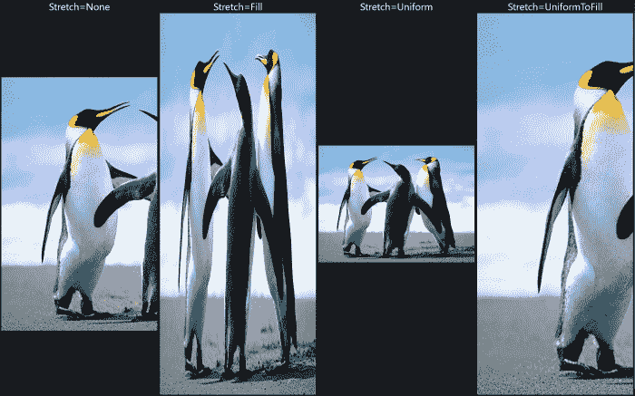

使用`Stretch=None`，图像以其原始大小显示。在所示的图像中，企鹅被裁剪，因为图像太大而无法适应。`Uniform`和`UniformToFill`保留了纵横比（原始图像宽度除以高度），而`Fill`只是简单地拉伸图像以填充`Image`的可用空间。如果可用空间的纵横比与原始图像不同，`UniformToFill`可能会切掉内容。

### 注意

不要混淆`Image`和`ImageSource`。`Image`是一个元素，因此可以放置在可视树的某个位置。`ImageSource`是实际数据，`Image`元素只是以某种方式显示图像数据。原始图像数据（`ImageSource`）保持不变。

## 语义缩放控件

`SemanticZoom`控件值得单独一节，因为它非常独特。它将两个视图合并到一个控件中，一个作为“缩小”视图，另一个作为“放大”视图。`SemanticZoom`背后的理念是两个相关的视图——一个更一般（缩小），另一个更具体（放大）。经典示例是开始屏幕。进行捏/缩放触摸手势（或按住*Ctrl*并滚动鼠标滚轮）在两个视图之间切换。以下是放大的视图：

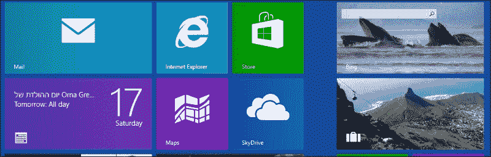

这是缩小的视图：

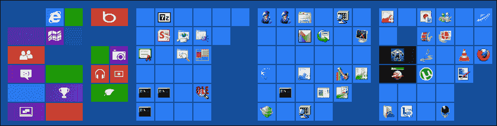

`ZoomedInView`和`ZoomedOutView`属性保存视图——通常是`ListView`或`GridView`，但在技术上可以是任何实现`ISemanticZoomInformation`接口的东西。

`SemanticZoom`是处理易于访问和直观的主/细节场景的有效方式。

# 总结

构建一个有效且引人入胜的用户界面本身就是一门艺术，超出了本书的范围。与 Windows Store 应用相关的现代设计指南相对较新，但可以在网上、微软网站和其他地方找到大量信息。

本章的目标是向 C++开发人员介绍 UI 景观，使其成为一个更舒适的区域。即使最终 C++开发人员将更关注应用程序逻辑、基础设施和其他低级活动，了解用户体验和用户界面的景观仍然是有用的。

在下一章中，我们将通过数据绑定将用户界面和数据联系起来，以创建健壮且可扩展的应用程序，至少在涉及用户界面和数据方面是这样。
