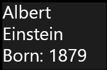
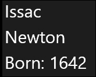
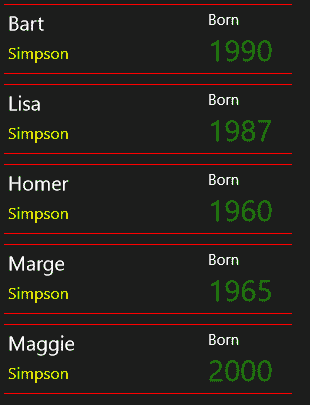
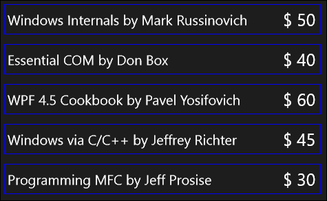

# 第五章：数据绑定

在前两章中，我们看了 XAML 以及如何使用布局面板构建和布局用户界面元素。然而，用户界面只是第一步。必须在 UI 上设置一些数据来构成应用程序。

有几种方法可以将数据传递给控件。最简单、直接的方法可能是我们迄今为止一直在使用的方法；获取对控件的引用并在需要时更改相关属性。如果我们需要将一些文本放置在`TextBox`中，我们只需在需要时更改其`Text`属性。

这当然有效，当使用 Win32 API 进行 UI 目的时，确实没有其他方法。但这充其量是繁琐的，最糟糕的是会导致难以管理的维护头痛。不仅需要处理数据，还需要检查并可能动态更改元素状态，例如启用/禁用和选中/未选中。在 WinRT 中，大部分这些工作都是通过数据绑定来处理的。

# 理解数据绑定

数据绑定基本上很简单——某个对象（源）中的一个属性发生变化，另一个对象（目标）中的另一个属性以某种有意义的方式反映这种变化。结合数据模板，数据绑定提供了一种引人注目且强大的可视化和与数据交互的方式。

### 注意

熟悉 WPF 或 Silverlight 的人会发现 WinRT 数据绑定非常熟悉。在 WinRT 中有一些更改，主要是省略，使数据绑定比在 WPF/Silverlight 中稍微不那么强大。但是，它仍然比手动传输和同步数据要好得多。

WinRT 中的数据绑定导致了一种以无缝方式处理数据和 UI 的众所周知的模式之一，称为**Model-View-ViewModel**（**MVVM**），我们将在本章末尾简要讨论。

## 数据绑定概念

我们将首先检查与数据绑定相关的一些基本术语，添加 WinRT 特定内容：

+   **源**：要监视其属性以进行更改的对象。

+   **源路径**：要监视的源对象上的属性。

+   目标：当源发生变化时，其属性发生变化的对象。在 WinRT 中，目标属性必须是一个依赖属性（我们稍后会看到）。

+   **绑定模式**：指示绑定的方向。

可能的值（均来自`Windows::UI::Xaml::Data::BindingMode`枚举）如下：

+   `OneWay`：源更改更新目标

+   `TwoWay`：源和目标相互更新

+   `OneTime`：源仅更新一次目标

数据绑定通常（大部分时间）在 XAML 中指定，提供了一种声明性和便捷的连接数据的方式。这直接减少了管理元素状态和控件与数据对象之间交换数据的编写代码量。

# 元素到元素的绑定

我们将首先检查的绑定场景是如何在不编写任何代码的情况下连接元素在一起的方式——通过在所需属性之间执行数据绑定。考虑以下两个元素：

```cpp
<TextBlock Text="This is a sizing text"                   
    TextAlignment="Center" VerticalAlignment="Center"/>
<Slider x:Name="_slider" Grid.Row="1" Minimum="10" Maximum="100"
    Value="30"/>
```

假设我们希望根据`Slider`的当前`Value`来更改`TextBlock`的`FontSize`。我们该如何做呢？

显而易见的方法是使用事件。我们可以对`Slider`的`ValueChanged`事件做出反应，并修改`TextBlock`的`FontSize`属性值，使其等于`Slider`的`Value`。

这当然有效，但有一些缺点：

+   需要编写 C++代码才能使其工作。这很遗憾，因为这里并没有使用真正的数据，这只是 UI 行为。也许设计师可以负责这一点，如果他/她只能使用 XAML 而不是代码。

+   这样的逻辑可能会在将来发生变化，造成维护上的困扰——请记住，典型的用户界面将包含许多这样的交互——C++开发人员实际上并不想关心每一个这样的小细节。

数据绑定提供了一个优雅的解决方案。这是使这个想法工作所需的`TextBlock`的`FontSize`设置，而不需要任何 C++代码：

```cpp
FontSize="{Binding Path=Value, ElementName=_slider}"
```

数据绑定表达式必须在目标属性上使用`{Binding}`标记扩展。`Path`属性指示要查找的源属性（在这种情况下是`Slider::Value`），如果源对象是当前页面上的元素，则`ElementName`是要使用的属性（在这种情况下，`Slider`被命名为`_slider`）。

运行结果如下：


拖动滑块会自动更改文本大小；这就是数据绑定的强大之处。

### 注意

如果`Binding`的`Path`属性的值是第一个参数，则可以省略。这意味着前一个绑定表达式等同于以下内容：

```cpp
FontSize="{Binding Value, ElementName=_slider}".
```

这更方便，大多数情况下会使用。

同样的表达式可以通过代码实现，例如：

```cpp
auto binding = ref new Binding;
binding->Path = ref new PropertyPath("Value");
binding->ElementName = "_slider";
BindingOperations::SetBinding(_tb, TextBlock::FontSizeProperty,
binding);
```

代码假设`_tb`是相关`TextBlock`的名称。这显然更冗长，实际上只在特定情况下使用（我们将在第六章中进行检查，*组件、模板和自定义元素*）。

让我们再添加另一个元素，一个`TextBox`，其`Text`应该反映`TextBlock`的当前字体大小。我们也将使用数据绑定：

```cpp
<TextBox Grid.Row="2" Text="{Binding Value, ElementName=_slider}" 
    FontSize="20" TextAlignment="Center"/>
```

这样可以工作。但是，如果我们更改`TextBox`的实际文本为不同的数字，字体大小不会改变。为什么？

原因是绑定默认是单向的。要指定双向绑定，我们需要更改绑定的`Mode`属性：

```cpp
Text="{Binding Value, ElementName=_slider, Mode=TwoWay}"
```

现在，更改`TextBox`并将焦点移动到另一个控件（例如通过键盘上的*Tab*键或触摸其他元素），会更改`TextBlock`的`FontSize`值。

# 对象到元素绑定

尽管元素到元素的绑定有时很有用，但经典的数据绑定场景涉及一个源，即常规的非 UI 对象，以及一个目标，即 UI 元素。绑定表达式本身类似于元素到元素绑定的情况；但自然地，不能使用`ElementName`属性。

第一步是创建一个可以支持数据绑定的对象。这必须是一个带有`Bindable`属性的 WinRT 类。绑定本身是在属性上的（一如既往）。以下是一个简单的`Person`类声明：

```cpp
[Windows::UI::Xaml::Data::BindableAttribute]
public ref class Person sealed {
  public:
  property Platform::String^ FirstName;
  property Platform::String^ LastName;
  property int BirthYear;
};
```

前面的代码使用了自动实现的属性，现在足够了。

我们可以在 XAML 中创建这样的对象作为资源，然后使用`Binding::Source`属性来连接绑定本身。首先，两个`Person`对象被创建为资源：

```cpp
<Page.Resources>
  <local:Person FirstName="Albert" LastName="Einstein" 
    BirthYear="1879" x:Key="p1" />
  <local:Person FirstName="Issac" LastName="Newton" 
    BirthYear="1642" x:Key="p2" />
</Page.Resources>
```

接下来，我们可以将这些对象绑定到元素，如下所示（都在`StackPanel`内）：

```cpp
<TextBlock Text="{Binding FirstName, Source={StaticResource p1}}"
  FontSize="30" />
<TextBlock Text="{Binding LastName, Source={StaticResource p1}}"
  FontSize="30" />
<TextBlock FontSize="30" >
  <Span>Born: </Span>
  <Run Text="{Binding BirthYear, Source={StaticResource p1}}" />
</TextBlock>
```

`Source`属性指的是被绑定的对象；在这种情况下是一个`Person`实例。以下是结果 UI：



请注意，`Source`在每个绑定表达式中都有指定。如果没有它，绑定将会失败，因为没有源对象可以绑定。

由于所有三个元素的源都是相同的，因此可以一次性指定源，并允许所有相关元素自动绑定到它，而无需显式指定源，这将是有益的。幸运的是，使用`FrameworkElement::DataContext`属性是可能的。规则很简单，如果在绑定表达式中没有显式指定源，将在可视树中从目标元素开始搜索`DataContext`，直到找到一个或者到达可视树的根（通常是`Page`或`UserControl`）。如果找到`DataContext`，它将成为绑定的源。以下是一个示例，它将`DataContext`设置为父`StackPanel`上的一个用于其子元素（无论是直接的还是不直接的）的示例：

```cpp
<StackPanel Margin="4" DataContext="{StaticResource p2}">
    <TextBlock Text="{Binding FirstName}" />
    <TextBlock Text="{Binding LastName}" />
    <TextBlock>
        <Span>Born: </Span>
        <Run Text="{Binding BirthYear}" />
    </TextBlock>
</StackPanel>
```

这是结果（经过一些字体大小调整）：



绑定表达式工作正常，因为隐式源是`Person`对象，其键是`p2`。如果没有`DataContext`，所有这些绑定都会悄悄失败。

### 注意

注意数据绑定表达式如何通过`DataContext`简化。它们表达的意思是，“我不在乎源是什么，只要在范围内有一个名为`<填写属性名称>`的`DataContext`属性。”

`DataContext`的概念是强大的，事实上，很少使用`Source`属性。

当然，在 XAML 中将`Source`或`DataContext`设置为预定义资源也是罕见的。通常通过代码获取相关数据源，如本地数据库或 Web 服务，来设置`DataContext`。但无论`DataContext`在何处或如何设置，它都能正常工作。

# 绑定失败

绑定是松散类型的——属性被指定为字符串，并且可能拼写错误。例如，在前面的示例中写`FirstNam`而不是`FirstName`不会引发任何异常；绑定会悄悄失败。如果程序在调试器下运行，则可以在**Visual Studio 输出**窗口（菜单中的**查看** | **输出**）中找到发生错误的唯一指示。

```cpp
Error: BindingExpression path error: 'FirstNam' property not found on 'ElementObjectBinding.Person'. BindingExpression: Path='FirstNam' DataItem='ElementObjectBinding.Person'; target element is 'Windows.UI.Xaml.Controls.TextBlock' (Name='null'); target property is 'Text' (type 'String')
```

这段文字准确定位了确切的问题，指定了要绑定的属性名称，源对象类型以及有关目标的详细信息。这应该有助于修复拼写错误。

为什么没有抛出异常？原因是数据绑定可能在某个时间点失败，这没关系，因为此时尚未满足此绑定的条件；例如，可能有一些信息是从数据库或 Web 服务中检索的。当数据最终可用时，这些绑定突然开始正常工作。

这意味着无法真正调试数据绑定表达式。一个很好的功能是能够在 XAML 绑定表达式中设置断点。目前不支持这一功能，尽管在图形上可以在绑定上设置断点，但它根本不会触发。这个功能在 Silverlight 5 中可用；希望它会在未来的 WinRT 版本中得到支持。

### 提示

调试数据绑定的一种方法是使用值转换器，稍后在本章中讨论。

# 更改通知

数据绑定支持三种绑定模式：单向，双向和一次性。直到现在，绑定发生在页面首次加载时，并在此后保持不变。如果在绑定已经就位后改变`Person`对象上的属性值会发生什么？

在添加一个简单的按钮后，`Click`事件处理程序执行以下操作：

```cpp
auto person = (Person^)this->Resources->Lookup("p1");
person->BirthYear++;
```

由于`Person`实例被定义为资源（不常见，但可能），它通过使用指定的键（`p1`）从页面的`Resources`属性中提取。然后递增`BirthYear`属性。

运行应用程序时没有视觉变化。在`Click`处理程序中设置断点确认它实际上被调用了，并且`BirthYear`已更改，但绑定似乎没有效果。

这是因为`BirthYear`属性当前的实现方式：

```cpp
property int BirthYear;
```

这是一个使用私有字段在后台实现的琐碎实现。问题在于当属性改变时，没有人知道；具体来说，绑定系统不知道发生了什么。

要改变这一点，数据对象应该实现`Windows::UI::Xaml::Data::INotifyPropertyChanged`接口。绑定系统会查询此接口，如果找到，就会注册`PropertyChanged`事件（该接口的唯一成员）。以下是`Person`类的修订声明，重点是`BirthYear`属性：

```cpp
[Bindable]
public ref class Person sealed : INotifyPropertyChanged {
public:
  property int BirthYear { 
    int get() { return _birthYear; }
    void set(int year);
  }

  virtual event PropertyChangedEventHandler^ PropertyChanged;

private:
  int _birthYear;
//...
};
```

getter 是内联实现的，setter 在 CPP 文件中实现如下：

```cpp
void Person::BirthYear::set(int year) {
  _birthYear = year;
  PropertyChanged(this, 
  ref new PropertyChangedEventArgs("BirthYear"));
}
```

`PropertyChanged` 事件被触发，接受一个 `PropertyChangedEventArgs` 对象，该对象接受了更改的属性名称。现在，运行应用程序并点击按钮会显示一个增加的出生年份，如预期的那样。

这实际上意味着每个属性都应该以类似的方式实现；在 setter 中声明一个私有字段并在其中引发 `PropertyChanged` 事件。这是 `FirstName` 属性的修订实现（这次是内联实现）：

```cpp
property String^ FirstName {
  String^ get() { return _firstName; }
  void set(String^ name) {
    _firstName = name;
    PropertyChanged(this, 
    ref new PropertyChangedEventArgs("FirstName"));
  }
}
```

`_firstName` 是类内部定义的私有 `String^` 字段。

# 绑定到集合

之前的例子使用了绑定到单个对象的属性。正如我们在前一章中看到的，从 `ItemsControl` 派生的一堆控件可以呈现多个数据项的信息。这些控件应该绑定到数据项的集合，比如 `Person` 对象的集合。

用于绑定目的的属性是 `ItemsSource`。这应该设置为一个集合，通常是 `IVector<T>`。这是一些 `Person` 对象绑定到 `ListView` 的例子（为方便初始化，`Person` 添加了一个构造函数）：

```cpp
auto people = ref new Vector<Person^>;
people->Append(ref new Person(L"Bart", L"Simpson", 1990));
people->Append(ref new Person(L"Lisa", L"Simpson", 1987));
people->Append(ref new Person(L"Homer", L"Simpson", 1960));
people->Append(ref new Person(L"Marge", L"Simpson", 1965));
people->Append(ref new Person(L"Maggie", L"Simpson", 2000));
```

要设置绑定，我们可以使用显式赋值给 `ListView::ItemsSource` 属性：

```cpp
_theList->ItemsSource = people;
```

一个（优雅且首选的）替代方法是将 `ItemsSource` 绑定到与 `DataContext` 相关的内容。例如，`ListView` 的标记可以从这里开始：

```cpp
<ListView ItemsSource="{Binding}" >
```

这意味着 `ItemsSource` 绑定到 `DataContext` 是什么（在这种情况下应该是一个集合）。缺少属性路径意味着对象本身。使用这个标记，绑定是通过以下简单的代码完成的：

```cpp
DataContext = people;
```

要查看实际的 `Person` 对象，`ItemsControl` 提供了 `ItemTemplate` 属性，它是一个 `DataTemplate` 对象，定义了如何显示 `Person` 对象。默认情况下（没有 `DataTemplate`），会显示类型名称或对象的另一个字符串表示（如果有的话）。这很少有用。一个简单的替代方法是使用 `DisplayMemberPath` 属性来显示数据对象上的特定属性（例如 `Person` 对象的 `FirstName`）。一个更强大的方法是使用 `DataTemplate`，为每个通过数据绑定连接到实际对象的可自定义用户界面提供。这是我们 `ListView` 的一个例子：

```cpp
<ListView ItemsSource="{Binding}">
  <ListView.ItemTemplate>
    <DataTemplate>
      <Border BorderThickness="0,1" Padding="4"
        BorderBrush="Red">
          <Grid>
            <Grid.RowDefinitions>
              <RowDefinition Height="Auto" />
              <RowDefinition Height="Auto" />
            </Grid.RowDefinitions>
            <Grid.ColumnDefinitions>
              <ColumnDefinition Width="200"/>
              <ColumnDefinition Width="80" />
            </Grid.ColumnDefinitions>
            <TextBlock Text="{Binding FirstName}"
            FontSize="20" />
            <TextBlock FontSize="16" Foreground="Yellow" 
            Grid.Row="1" Text="{Binding LastName}" />
            <TextBlock Grid.Column="1" Grid.RowSpan="2">
            <Span FontSize="15">Born</Span>
            <LineBreak />
            <Run FontSize="30" Foreground="Green" 
            Text="{Binding BirthYear}" />
          </TextBlock>
        </Grid>
      </Border> 
    </DataTemplate>
  </ListView.ItemTemplate>
</ListView>
```

`DataTemplate` 中的绑定表达式可以访问数据对象本身的相关属性。这是生成的 `ListView`：



# 自定义数据视图

数据模板提供了一种强大的方式来可视化和与数据交互，部分是因为数据绑定的强大功能。然而，有时需要更多的自定义。例如，在 `Book` 对象的列表中，当前打折的每本书都应该以不同的颜色显示，或者有一些特殊的动画等等。

以下部分描述了一些自定义数据模板的方法。

## 值转换器

值转换器是实现 `Windows::UI::Xaml::Data::IValueConverter` 接口的类型。该接口提供了一种将一个值转换为另一个值的方式，这两个值可以是不同类型的。假设我们想要显示一组书籍，但是打折的书应该有略微不同的外观。使用普通的数据模板，这很困难，除非有特定的 `Book` 属性对可视化有影响（比如颜色或画笔）；这是不太可能的，因为数据对象应该关心数据，而不是如何显示数据。

这是 `Book` 类的定义（为简化示例，未实现更改通知）：

```cpp
[Windows::UI::Xaml::Data::BindableAttribute]
public ref class Book sealed {
public:
  property Platform::String^ BookName;
  property double Price;
  property Platform::String^ Author;
  property bool IsOnSale;

internal:
  Book(Platform::String^ bookName, Platform::String^ author,
    double price, bool onSale) {
    BookName = bookName;
    Author = author;
    Price = price;
    IsOnSale = onSale;
  }
};
```

值转换器提供了一个优雅的解决方案，使对象（在这个例子中是 `Book`）与其呈现方式解耦。这是一个基本的 `Book` 数据模板：

```cpp
<ListView.ItemTemplate>
  <DataTemplate>
    <Border BorderThickness="1" BorderBrush="Blue" Margin="2"
    Padding="4">
      <Grid>
        <Grid.ColumnDefinitions>
          <ColumnDefinition Width="400" />
          <ColumnDefinition Width="50" />
        </Grid.ColumnDefinitions>
        <TextBlock VerticalAlignment="Center" 
          FontSize="20">
          <Run Text="{Binding BookName}" />
          <Span> by </Span>
          <Run Text="{Binding Author}" />
        </TextBlock>
        <TextBlock Grid.Column="1" FontSize="25">
          <Span>$</Span>
          <Run Text="{Binding Price}" />
        </TextBlock>
      </Grid>
    </Border>
  </DataTemplate>
</ListView.ItemTemplate>
```

这是书籍的显示方式：



假设我们想要为打折的书籍使用绿色背景。我们不想在`Book`类中添加`Background`属性。相反，将使用值转换器将`IsOnSale`属性（布尔值）转换为适用于`Background`属性的`Brush`对象。

首先，我们的值转换器的声明如下：

```cpp
public ref class OnSaleToBrushConverter sealed : IValueConverter {
public:
  virtual Object^ Convert(Object^ value, TypeName targetType,
  Object^ parameter, String^ language);
  virtual Object^ ConvertBack(Object^ value, TypeName
  targetType, Object^ parameter, String^ language);

  OnSaleToBrushConverter();

private:
  Brush^ _normalBrush;
  Brush^ _onSaleBrush;
};
```

有两种方法来实现：

+   `Convert`：从源到目标绑定时使用（通常的方式）

+   `ConvertBack`：仅适用于双向绑定

在我们的情况下，我们使用的是单向绑定，所以`ConvertBack`可以简单地返回`nullptr`或抛出异常。这是实现：

```cpp
OnSaleToBrushConverter::OnSaleToBrushConverter() {
  _normalBrush = ref new SolidColorBrush(Colors::Transparent);
  _onSaleBrush = ref new SolidColorBrush(Colors::Green);
}

Object^ OnSaleToBrushConverter::Convert(Object^ value, TypeName targetType, Object^ parameter, String^ culture) {
  return (bool)value ? _onSaleBrush : _normalBrush;
}

Object^ OnSaleToBrushConverter::ConvertBack(Object^ value, TypeName targetType, Object^ parameter, String^ culture) {
  throw ref new NotImplementedException();
}
```

在构造函数中创建了两个画笔；一个用于普通书籍（透明），另一个用于打折书籍（绿色）。调用`Convert`方法时，`value`参数是所讨论书籍的`IsOnSale`属性。这将很快变得清楚。该方法只是查看布尔值并返回适当的画笔。这种转换是从布尔值到`Brush`。

下一步将是实际创建转换器的实例。这通常是在 XAML 中完成的，将转换器作为资源：

```cpp
<Page.Resources>
    <local:OnSaleToBrushConverter x:Key="sale2brush" />
</Page.Resources>
```

现在，为了最终连接，使用适当的属性绑定到`IsOnSale`并为操作提供一个转换器。在我们的情况下，`Border`（`DataTemplate`的一部分）非常合适：

```cpp
<Border BorderThickness="1" BorderBrush="Blue" Margin="2"
    Padding="4" Background="{Binding IsOnSale, 
    Converter={StaticResource sale2brush}}">
```

没有转换器，绑定将会失败，因为没有办法自动将布尔值转换为`Brush`。转换器已经传递了`IsOnSale`的值，并且应该返回适合目标属性的内容以使转换成功。

### 注意

可以使用不带`Path`（在此示例中不带`IsOnSale`）的`Binding`表达式。结果是整个对象（`Book`）作为转换器的值参数传递。这有助于基于多个属性做出决策。

这是结果：


让我们在打折的书旁边添加一个小图片。我们可以添加一张图片，但只有当书打折时才显示。我们可以使用（有点经典的）转换器，从布尔值转换为`Visibility`枚举，反之亦然：

```cpp
Object^ BooleanToVisibilityConverter::Convert(Object^ value, TypeName targetType, Object^ parameter, String^ culture) {
  return (bool)value ? Visibility::Visible :
    Visibility::Collapsed;
}

Object^ BooleanToVisibilityConverter::ConvertBack(Object^ value, TypeName targetType, Object^ parameter, String^ culture) {
  return (Visibility)value == Visibility::Visible;
}
```

有了这个，我们可以像通常一样在资源中创建一个实例：

```cpp
<local:BooleanToVisibilityConverter x:Key="bool2vis" />
```

然后，我们可以在需要时向第三列添加一张图片：

```cpp
<Image Source="Assets/sun.png" VerticalAlignment="Center" 
  HorizontalAlignment="Center" Height="24" Grid.Column="2"
  Visibility="{Binding IsOnSale, Converter={StaticResource
  bool2vis}}" />
```

这是结果：


值转换器非常强大，因为它们可以利用代码实现视觉变化。

### Convert 和 ConvertBack 的其他参数

`Convert`和`ConvertBack`接受更多参数，不仅仅是值。以下是完整列表：

+   `value`：`value`参数（第一个）对于`Convert`/`ConvertBack`方法非常重要。还有其他三个参数。

+   `targetType`：这表示应返回的预期对象类型。这可用于检查转换器是否正确使用（在我们的示例中，`OnSaleToBrushConverter`的`Convert`方法的`targetType`将是`Brush`类型）。此参数的另一个可能用途是在更复杂的值转换器的情况下，可能需要处理多个返回类型并且可能需要了解当前请求。

+   `parameter`：这是一个自由参数，可以通过`Binding`表达式的`ConverterParameter`属性传递。这对于根据绑定表达式自定义值转换器很有用。

+   `culture`：这接收`Binding`表达式的`ConverterLanguage`属性的内容。这可用于根据语言返回不同的值，这实际上只是可以传递给转换器的另一个字符串。

## 数据模板选择器

在更极端的情况下，从`DataTemplate`所需的更改可能对值转换器没有用。如果不同的对象（在同一集合中）需要非常不同的模板，数据模板选择器可能是一个更好的选择。

数据模板选择器是一个从`Windows::UI::Xaml::Controls::DataTemplateSelector`派生的类（尽管命名空间不同，但它不是一个控件），并重写了以下定义的`SelectTemplateCore`方法：

```cpp
protected:
virtual DataTemplate^ SelectTemplateCore(Object^ item, 
  DependencyObject^ container);
```

该方法需要返回与`item`参数对应的`DataTemplate`。在前面的示例中，每个项目都是`Book`；代码将查看一些`Book`属性，并得出应该使用哪个`DataTemplate`。这也可以基于`container`参数，在这种情况下，它是实际托管这些对象的控件（在我们的示例中是`ListView`）。

接下来，在 XAML 中创建此类的一个实例（类似于值转换器），并将该实例设置为`ItemsControl::ItemTemplateSelector`属性。如果设置了这个属性，`ItemTemplate`不能同时设置，因为它会与模板选择器使用的逻辑冲突。

# 命令

将用户界面的一部分连接到某些逻辑的传统方法是通过事件。典型的例子是按钮——当点击时，会执行一些操作，希望实现用户打算的某个目标。尽管 WinRT 完全支持这种模型（就像其他 UI 框架一样），但它也有缺点：

+   事件处理程序是“代码后台”的一部分，其中声明了 UI，通常是`Page`或`UserControl`。这使得从可能希望调用相同逻辑的其他对象中调用它变得困难。

+   前面提到的按钮可能会消失并被不同的控件替换。这将需要潜在地更改事件挂钩代码。如果我们希望多个控件调用相同的功能怎么办？

+   在某些状态下可能不允许执行操作——按钮（或其他任何东西）需要在正确的时间被禁用或启用。这给开发人员增加了管理开销——需要跟踪状态并为调用相同功能的所有 UI 元素更改它。

+   事件处理程序只是一个方法——没有简单的方法来捕获它并将其保存在某个地方，例如用于撤销/重做的目的。

+   在没有使用实际用户界面的情况下测试应用程序逻辑是困难的，因为逻辑和 UI 是交织在一起的。

这些以及其他更微妙的问题使得处理事件处理程序不太理想，特别是涉及应用程序逻辑时。如果某些事件只是为了增强可用性或仅为了服务 UI，通常不会引起关注。

解决此 UI 逻辑耦合的典型方法是命令的概念。这遵循了著名的“命令设计模式”，将应用程序逻辑抽象为不同的对象。作为一个对象，命令可以从多个位置调用，保存在列表中（例如，用于撤销目的），等等。它甚至可以指示在某些时间是否允许，从而使其他实体免于处理可能绑定到该命令的控件的实际启用或禁用。

WinRT 使用`Windows::UI::Xaml::Input::ICommand`接口定义了基本的命令支持。`ICommand`有两个方法和一个事件：

+   **`Execute`方法**：执行所讨论的命令。它接受一个参数，可以是任何可以用作命令参数的东西。

+   **`CanExecute`方法**：此方法指示此命令在此时是否可用。WinRT 将此作为启用或禁用命令源的提示。

+   **`CanExecuteChanged`事件**：这由命令引发，让 WinRT 知道它应该再次调用`CanExecute`，因为命令的可用性可能已经改变。

各种控件都有一个`Command`属性（类型为`ICommand`），可以设置（通常使用数据绑定）指向由`ICommand`实现的对象的对象（和一个`CommandParameter`，允许将一些信息传递给命令）。经典的例子是经典的`Button`。当按钮被点击时，将调用挂接命令的`Execute`方法。这意味着不需要设置`Click`处理程序。

WinRT 没有为`ICommand`提供任何实现。开发人员需要创建适当的实现。下面是一个简单的用于增加一个人出生年份的命令的实现：

```cpp
public ref class IncreaseAgeCommand sealed : ICommand {
public:
  virtual void Execute(Platform::Object^ parameter);
  virtual bool CanExecute(Platform::Object^ parameter);
  virtual event EventHandler<Object^>^ CanExecuteChanged;

};
```

实现如下：

```cpp
void IncreaseAgeCommand::Execute(Object^ parameter)  {
  auto person = (Person^)parameter;
  person->BirthYear++;
}

bool IncreaseAgeCommand::CanExecute(Object^ parameter) {
  return true;
}
```

为了使其工作，我们可以创建一个命令源，比如一个按钮，并填写命令的细节如下：

```cpp
<Button Content="Inrease Birth Year With Command" 
  CommandParameter="{StaticResource p1}">
  <Button.Command>
    <local:IncreaseAgeCommand />
  </Button.Command>
</Button>
```

在`Command`属性中创建一个命令是不寻常的，通常的方式是绑定到 ViewModel 上的适当属性，我们将在下一节中看到。

# MVVM 简介

命令只是处理非平凡应用程序中用户界面更一般模式的一个方面。为此，有许多 UI 设计模式可用，如**模型视图控制器**（**MVC**）、**模型视图呈现器**（**MVP**）和**模型-视图-视图模型**（**MVVM**）。所有这些都有共同之处：将实际 UI（视图）与应用程序逻辑（控制器、呈现器和视图模型）以及底层数据（模型）分离。

WPF 和 Silverlight 推广的 MVVM 模式利用数据绑定和命令的力量，通过使用中介（视图模型）在 UI（视图）和数据（模型）之间创建解耦。

## MVVM 组成部分

MVVM 有三个参与者。模型代表数据或业务逻辑。这可能包括可以用标准 C++编写的类型，而不考虑 WinRT。它通常是中立的；也就是说，它不知道它将如何被使用。

视图是实际的 UI。它应该显示模型的相关部分并提供所需的交互功能。视图不应直接了解模型，这就是数据绑定的作用。所有绑定都访问一个属性，而不明确知道另一端是什么类型的对象。这种魔术在运行时通过将视图的`DataContext`设置为提供数据的对象来满足；这就是 ViewModel。

ViewModel 是将所需数据分发给视图（基于模型）的粘合剂。ViewModel 就是这样——视图的模型。它有几个责任：

+   在视图中公开允许绑定的属性。这可能只是通过访问模型上的属性（如果它是用 WinRT 编写的），但如果模型以另一种方式公开数据（比如使用方法）或需要翻译的类型，比如需要返回为`IVector<T>`的`std::vector<T>`，可能会更复杂。

+   公开命令（`ICommand`）以供视图中的元素调用。

+   维护视图的相关状态。

模型、视图和视图模型之间的整个关系可以用以下图表来总结：


## 构建 MVVM 框架

在这一点上应该很清楚，基于 MVVM 的应用程序有很多共同的元素，比如变更通知和命令。创建一个可在许多应用程序中简单利用的可重用框架将是有益的。虽然有几个很好的框架（大多是免费的），它们都是基于.NET 的，这意味着它们不能在 C++应用程序中使用，因为它们没有作为 WinRT 组件公开，即使它们这样做了，C++应用程序也必须付出.NET CLR 的代价。自己构建这样的框架并不太困难，而且会增强我们的理解。

我们要解决的第一件事是希望对象能够实现`INotifyPropertyChanged`接口，以便它们在任何属性更改时都能引发`PropertyChanged`事件。我们可以用以下 WinRT 类来实现这一点：

```cpp
public ref class ObservableObject : 
  DependencyObject, INotifyPropertyChanged {
  public:
    virtual event PropertyChangedEventHandler^ PropertyChanged;
  protected:
    virtual void OnPropertyChanged(Platform::String^ name);
  };
```

实现如下：

```cpp
void ObservableObject::OnPropertyChanged(String^ name) {
  PropertyChanged(this, ref new PropertyChangedEventArgs(name));
}
```

从`DependencyObject`继承可能看起来是多余的，但实际上这是必要的，以规避当前 WinRT 支持中的一个不足之处——任何常规类都必须是密封的，使其作为基类毫无用处。任何从`DependencyObject`继承的类都可以保持未密封状态——这正是我们想要的。

`ObservableObject`类似乎非常简单，也许不值得作为一个单独的类。但我们可以为其添加任何派生类都可以受益的常见功能。例如，我们可以支持`ICustomPropertyProvider`接口——该接口允许对象支持动态属性，这些属性在类型中并非静态部分（感兴趣的读者可以在 MSDN 文档中找到更多信息）。

具体类型可以使用类似以下代码的`ObservableObject`：

```cpp
public ref class Book : ObservableObject {
public:
  property Platform::String^ BookName {
    Platform::String^ get() { return _bookName; }
  void set(Platform::String^ name) {
    _bookName = name;
    OnPropertyChanged("BookName");
  }
}

property bool IsOnLoan {
  bool get() { return _isOnLoan; }
  void set(bool isLoaned) {
    _isOnLoan = isLoaned;
    OnPropertyChanged("IsOnLoan");
  }
}

private:
  Platform::String^ _bookName;
  bool _isOnLoan;
//...
};
```

接下来要处理的是命令。正如我们所见，我们可以通过实现`ICommand`来创建一个命令，有时这是必要的。另一种方法是创建一个更通用的类，该类使用委托来调用我们想要响应`Execute`和`CanExecute`方法的任何代码。以下是这样一个命令的示例：

```cpp
public delegate void ExecuteCommandDelegate(Platform::Object^
  parameter);
public delegate bool CanExecuteCommandDelegate(Platform::Object^
  parameter);

public ref class DelegateCommand sealed : ICommand {
public:
  DelegateCommand(ExecuteCommandDelegate^ executeHandler,
    CanExecuteCommandDelegate^ canExecuteHandler)
  : _executeHandler(executeHandler),
    _canExecuteHandler(canExecuteHandler) { }

  virtual bool CanExecute(Platform::Object^ parameter) {
    if (_canExecuteHandler != nullptr)
    return _canExecuteHandler(parameter);

    return true;
  }

  virtual void Execute(Platform::Object^ parameter) {
    if (_executeHandler != nullptr && CanExecute(parameter))
    _executeHandler(parameter);
  }

 virtual event EventHandler<Platform::Object^>^ 
    CanExecuteChanged;

private:
  ExecuteCommandDelegate^ _executeHandler;
  CanExecuteCommandDelegate^ _canExecuteHandler;
};
```

该类利用委托，构造函数中接受两个委托；第一个用于执行命令，第二个用于指示命令是否启用。

以下是一个公开命令以使书籍被借出的 ViewModel：

```cpp
public ref class LibraryViewModel sealed : ObservableObject {
public:
  property IVector<Book^>^ Books {
    IVector<Book^>^ get() { return _books; }
  }

  property ICommand^ LoanBookCommand {
    ICommand^ get() { return _loanBookCommand; }
  }

internal:
  LibraryViewModel();

private:
  Platform::Collections::Vector<Book^>^ _books;
  ICommand^ _loanBookCommand;
};
```

命令是在 ViewModel 的构造函数中创建的：

```cpp
LibraryViewModel::LibraryViewModel() {
  _loanBookCommand = ref new DelegateCommand
  (ref new ExecuteCommandDelegate([](Object^ parameter) {
    // execute the command
    auto book = (Book^)parameter;
    book->IsOnLoan = true;
  }), nullptr);	// command is always enabled
}
```

ViewModel 是无控制（视图）的，这意味着我们可以在没有任何可见用户界面的情况下构建它。它公开了用于数据绑定到相关视图的属性和用于执行来自视图的操作的命令。实际操作通常会修改适当模型中的某些状态。

### 注意

视图和 ViewModel 之间通常是一对一的映射。虽然有时可以共享，但不建议这样做。

## 有关 MVVM 的更多信息

这是 MVVM 的快速介绍。由于这是一种众所周知的模式（多亏了它在 WPF 和 Silverlight 中的使用），因此网络上有很多相关资料。可以添加的一些内容包括支持导航的 ViewModel（以便不直接访问`Frame`控件）、ViewModel 定位器服务（允许更轻松地在视图和其对应的 ViewModel 之间进行绑定）等。

### 注意

有关 MVVM 的更多信息，请参阅维基百科[`en.wikipedia.org/wiki/Model_View_ViewModel`](http://en.wikipedia.org/wiki/Model_View_ViewModel)。

在 C++中实现 WinRT MVVM 框架有些麻烦，因为（目前）不可能将这样的框架公开为 Windows 运行时组件，而只能作为 C++静态或动态库。

尽管如此，数据和视图之间的分离是重要的，除了最简单的应用程序外，所有应用程序都将受益。

# 总结

在本章中，我们了解了数据绑定是什么以及如何使用它。数据绑定是一个非常强大的概念，在 WinRT 中的实现非常强大。来自 Win32 或 MFC 背景的开发人员应该意识到，连接显示和数据需要采用不同的方法。数据绑定提供了一种声明性模型，支持数据和显示之间的分离，因此应用程序逻辑只处理数据，实际上并不关心哪些控件（如果有）绑定到该数据。

MVVM 概念使这种分离更加清晰，并为逐步增强应用程序奠定了基础，而不会增加维护头疼和逻辑复杂性。

在下一章中，我们将看看如何构建可重用的 WinRT 组件，以及自定义元素。
