# 第六章：组件、模板和自定义元素

在前几章中，我们通过查看布局和元素如何携手合作来创建灵活的用户界面的基础知识。数据绑定提供了一种分离的方式来写入和读取数据到控件中。

在本章中，我们将探讨使用控件模板以一种基本而强大的方式来自定义控件的方法。当需要控件的功能而不是外观时，这是很有用的。在其他情况下，内置控件可能没有所需的行为；在这些情况下，可以为特定应用程序需求创建自定义和用户控件。但首先，我们应该考虑使用 C++构建组件的更一般概念，以及如何在 C++和非 C++项目中使用这些组件。

# Windows Runtime 组件

正如我们在第二章中所看到的，*用于 Windows 8 商店应用的 COM 和 C++*，Windows Runtime 是基于实现 COM 接口的 COM 类。任何这样的类，如果也写入了元数据（一个`winmd`文件），就可以从 DLL 中导出，并且可以被任何其他符合 WinRT 标准的语言或环境使用；目前支持的语言有 C++、.NET 语言（C#和 VB）和 JavaScript。

这些组件必须只在其公共接口中使用 WinRT 类型。对于 C++来说，这意味着基于 STL 的类只能在 WinRT 类的非公共区域中使用。在公共方法或属性中传递时，这些类必须转换为 WinRT 类型。

一个典型的场景是一个现有的 C++类型，可能是在过去的某个时候编写的，并且需要在 WinRT 中用于数据绑定的目的，或者至少需要暴露给当前项目之外的 WinRT 客户端使用。让我们看看如何实现这种过渡。

## 将 C++转换为 WinRT

让我们举一个具体的例子，然后更广泛地讨论。假设我们有以下标准的 C++类：

```cpp
#include <string>
#include <vector>

class book_review {
public:
  book_review(const std::wstring& name, 
  const std::wstring& content,
    int rating);

  int rating() const { return _rating; }
  void set_rating(int rating) { _rating = rating; }
  const std::wstring& name() const { return _name; }
  const std::wstring& content() const { return _content; }

private:
  std::wstring _name;
  std::wstring _content;
  int _rating;
};

class book {
public:
  book(const std::wstring& name, const std::wstring& author);
  void add_review(const book_review& review);
  size_t reviews_count() const { return _reviews.size(); }
  const book_review& get_review(size_t index) const { 
    return _reviews[index]; 
  }
  const std::wstring& name() const { return _name; }
  const std::wstring& author() const { return _author; }

private:
  std::wstring _name;
  std::wstring _author;
  std::vector<book_review> _reviews;
};
```

简单地说，一个`book`类被定义，并且有一个名称，一个作者，以及一系列的评论（`book_review`类）。每个评论包括一个名称，评论内容和一个数字评分。

这些类是用标准 C++编写的，对 WinRT（或者说 C++/CX）一无所知。

目前，这些类只能在 C++项目中内部使用。它们不能被导出到其他 WinRT 环境（例如.NET），即使在 C++项目中，它们也不能从数据绑定等功能中受益，因为它们在任何方面都不是 WinRT 类。

这些（以及类似的）类需要包装在一个 WinRT 类中。对于 C++来说，可以通过两种方式来实现。第一种是使用 WRL；好处是使用标准的 C++（而不是微软特定的扩展），但这个好处在一定程度上减弱了，因为 WinRT 本身就是微软特定的（至少在撰写本文时是这样）。第二个可能的好处是更多地控制生成的 WinRT 类型。虽然这听起来很吸引人，但这样做也更难，对于大多数情况来说是不必要的，所以大部分时间我们会采用更简单的方法，利用 C++/CX。

### 注意

使用 WRL 创建 WinRT 组件有时是必要的。一个例子是当一个单一的类需要实现一个 WinRT 接口和一个本地的 COM 接口时。例如，媒体编码器或解码器必须是实现 COM/WinRT 类，不仅要实现`Windows::Media::IMediaExtension`接口，还要实现媒体基金非 WinRT 接口`IMFTransform`。WRL 是实现这一点的唯一方法。

为了包装与书籍相关的类，我们将创建一个 Windows Runtime 组件项目（我们将其称为`BookLibrary`）。然后，我们将添加一个 C++/CX WinRT 类来包装`book`和`book_review`。让我们从`book_review`包装器开始：

```cpp
[Windows::UI::Xaml::Data::BindableAttribute]
public ref class BookReview sealed {
public:
  BookReview(Platform::String^ name, Platform::String^ content,
    int rating);

  property Platform::String^ Name { Platform::String^ get(); }
  property Platform::String^ Content { Platform::String^ get(); }
  property int Rating {
    int get() { return _review.rating(); }
    void set(int rating) { _review.set_rating(rating); }
  }
private:
  book_review _review;
};
```

需要注意的几点：

+   `Bindable`属性被应用到类上，以便为数据绑定生成适当的代码。

+   所有公共内容都是 WinRT 专用的。`book_review`包装实例位于类的私有部分。任何尝试将其公开都将导致编译错误。错误说明，"**非值类型不能有任何公共数据成员**"；这是第一个问题—因为 WinRT 基于 COM，而 COM 基于接口，接口由虚表定义，它们只能包含方法（函数），而不能包含数据成员。

如果数据成员转换为返回非 WinRT 类型的方法，编译器将发出不同的错误，"**(MethodName)：公共成员的签名包含本机类型'book_review'**"。最终结果是只有 WinRT 类型可以在公共成员中使用。

+   标准 C++没有属性的概念。数据成员有时会被 getter 和/或 setter 包装。这些应该被转换为 WinRT 属性，就像在前面的代码中对`Name`、`Content`和`Rating`所做的那样。

WinRT 编码约定是对类和成员名称使用帕斯卡命名法，因此这些可能需要稍微更改以反映这一点（例如，在`book_review`中的`name`被更改为`BookReview`中的`Name`，依此类推）。

+   `BookReview` 类中缺少的一件事是实现`INotifyPropertyChanged`，如第五章*数据绑定*中所述。这是因为`Rating`属性可以在构造`BookReview`之后更改。该实现被省略，以便更轻松地专注于基本知识，但在实际情况下应该实现。

头文件没有实现构造函数和属性`Name`和`Content`。这是构造函数（在相应的 CPP 文件中实现）：

```cpp
BookReview::BookReview(String^ name, 
String^ content, int rating) : 
  _review(name->Data(), content->Data(), rating) { }
```

构造函数（就像任何其他方法一样）必须接受 WinRT 类型，对于任何需要的字符串都要使用`Platform::String^`。这用于初始化包装的`book_review`实例（它需要一个标准的`std::wstring`）通过使用`Data`方法。

`Name`和`Content`属性是只读的，但必须返回 WinRT 类型—在这种情况下是`Platform::String^`（你可能还记得它包装了 WinRT 的`HSTRING`）：

```cpp
String^ BookReview::Name::get() {
  return ref new String(_review.name().c_str());
}

String^ BookReview::Content::get() {
  return ref new String(_review.content().c_str());
}
```

实现很简单，这次是通过使用接受`const wchar_t*`的`Platform::String`构造函数来进行的。

接下来，我们需要看一下为`book`类创建的包装器。这有点复杂，因为一本书持有`book_review`对象的`std::vector`；`std::vector`不是 WinRT 类型，因此必须使用另一种类型来投影，表示一个集合：

```cpp
[Windows::UI::Xaml::Data::BindableAttribute]
public ref class Book sealed {
public:
  Book(Platform::String^ name, Platform::String^ author);
  void AddReview(BookReview^ review);

  property Platform::String^ Name {
    Platform::String^ get() { 
      return ref new Platform::String(_book.name().c_str()); 
    }
  }

  property Platform::String^ Author {
    Platform::String^ get() { 
      return ref new Platform::String(_book.author().c_str()); 
    }
  }

  property Windows::Foundation::Collections::
    IVectorView<BookReview^>^ Reviews {
      Windows::Foundation::Collections::
      IVectorView<BookReview^>^ get();
    }

private:
  book _book;
  Windows::Foundation::Collections::
    IVectorView<BookReview^>^ _reviews;
};
```

`Name`和`Author`属性很简单，并且是内联实现的。构造函数初始化这些属性，并且它们在对象的整个生命周期内保持为只读。

原始的`book`类有一个`std::vector<book_review>`实例。在 WinRT 中，诸如 vector 之类的集合应该被投影为`Windows::Foundation::Collections::IVector<BookReview>`或`IVectorView<BookReview>`（在相同的命名空间中，后者是前者的只读视图）。

### 注意

命名空间前缀可能有点令人困惑。为什么`IVector<T>`在`Windows::Foundation::Collections`中，而`Vector<T>`在`Platform::Collections`中？规则很简单。WinRT 类型放在`Windows::*`命名空间中，而特定的 C++实现放在`Platform::*`命名空间中。一般来说，`Platform::*`类型不能导出为 WinRT 类型，因为它们是 WinRT 接口的 C++特定实现（大多数情况下）。值得注意的例外是`Platform::String`和`Platform::Object`，它们被理解为`HSTRING`和`IInspectable`指针的替代品，因此在公共方法和属性中使用。

`Book`类提供了`Reviews`只读属性作为`IVectorView<BookReview^>^`。它可以返回任何实现此接口的对象。`Platform::Collections::Vector<T>`提供了`IVector<T>`的实现。`IVector<T>`提供了`GetView`方法，返回`IVectorView<T>`：

```cpp
IVectorView<BookReview^>^ Book::Reviews::get() {
  if(_reviews == nullptr) {
    auto reviews = ref new Vector<BookReview^>();
    for(size_t i = 0; i < _book.reviews_count(); i++) {
      auto review = _book.get_review(i);
      reviews->Append(
        ref new BookReview(
          ref new String(review.name().c_str()), 
          ref new String(review.content().c_str()), 
      review.rating()));
    }
    _reviews = reviews->GetView();
  }
  return _reviews;
}
```

属性实现尝试通过缓存`IVectorView<BookReview>`的结果来优化，如果没有添加新评论，或者从未调用属性（在`_reviews`中表示为`nullptr`）。否则，将创建`Vector<BookReview>`，并使用`IVector<BookReview>::Append`添加`BookReview`对象。

要实现的最后一个有趣的方法是`AddReview`：

```cpp
void Book::AddReview(BookReview^ review) {
  book_review br(review->Name->Data(), 
  review->Content->Data(), review->Rating);
  _book.add_review(br);
  _reviews = nullptr;
}
```

将`_reviews`数据成员设置为`nullptr`，以强制将来调用`Reviews`属性时重新生成返回的集合。

### 提示

在处理诸如`std::vector`及其 WinRT 包装器（如`Vector<T>`）之类的集合时，尽量使用`std::vector`。仅在从 WinRT 类导出时使用`Vector<T>`。对本机 C++类型进行所有集合操作，因为它们的开销比 WinRT 类型小（因为基于 WinRT 接口的性质）。

## 跨 ABI

**应用程序二进制接口**（**ABI**）是标准 C++和 WinRT 之间的边界。任何未实现为 WinRT 类的 C++类都不能跨越 ABI。先前使用的类型`std::wstring`和`std::vector<>`是需要在跨越 ABI 时进行投影的完美示例。编译器不允许在`public ref class`声明的公共部分中使用非 WinRT 类型。有关将本机 C++类型映射到 WinRT 类型的进一步讨论，请参见第二章，“Windows 8 商店应用的 COM 和 C++”。

## 使用 Windows Runtime 组件

构建 Windows Runtime 组件后，将创建一个指示从库中导出的类型、接口、枚举等的元数据文件（`.winmd`）。例如，我们的`BookLibrary`组件 DLL 会生成`BookLibrary.winmd`。在`ILDASM`中打开它会显示如下：

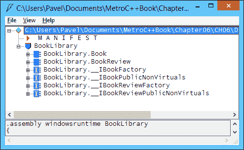

这清楚地显示了导出的类型，`Book`和`BookReview`。奇怪的接口名称代表编译器提供的内部 WinRT 实现——WinRT 都是关于接口的。如果存在任何非默认构造函数，则存在`*Factory`接口。例如，打开`__IBookFactory`显示如下：

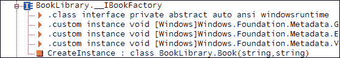

注意`CreateInstance`方法，该方法是根据`Book`的单个构造函数建模的。这个接口是由创建`Book`实例的激活工厂实现的（由 C++/CX 在任何`public ref class`的后台实现）。

`__IBookPublicNonVirtuals`接口是由`Book`类实现的接口：

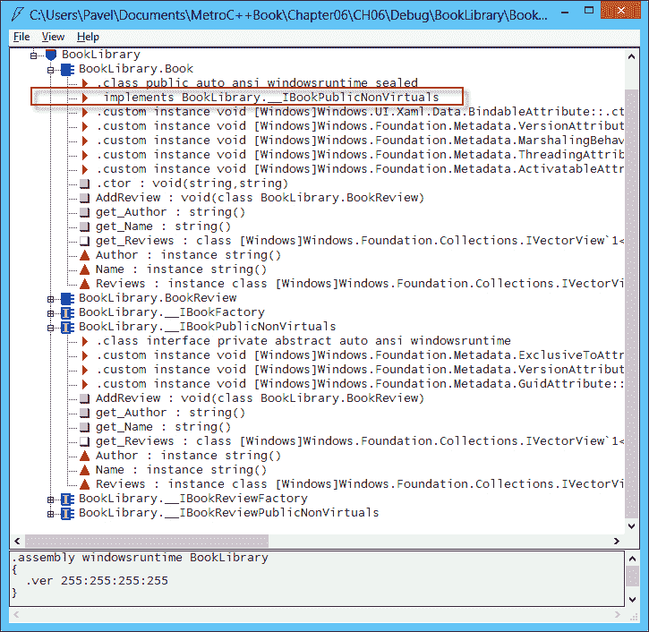

可以从任何符合 WinRT 的环境中使用生成的 DLL。在 C++项目中，需要添加对`winmd`文件的引用。为此，请在“解决方案资源管理器”中右键单击项目节点，然后选择**引用…**。然后在**常规属性**或**框架和引用**节点中选择**添加新引用**（或者从项目属性中进入相同位置）：

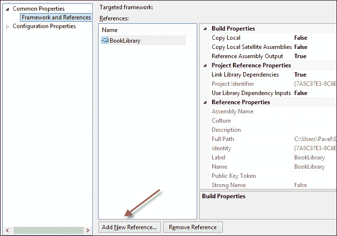

引用添加后（通过选择`BookLibrary`项目，或在一般情况下浏览`winmd`文件），所有导出类型都可以立即使用，就像任何其他 WinRT 类型一样。以下是创建带有一些评论的`Book`的示例：

```cpp
using namespace BookLibrary;

auto book = ref new Book("Windows Internals", "Mark Russinovich");
book->AddReview(
    ref new BookReview("John Doe", 
    "Great book! Lots of pages!", 4));
book->AddReview(
    ref new BookReview("Mickey Mouse", 
      "Why two parts? This makes my ears spin!", 3));
book->AddReview(
    ref new BookReview("Clark Kent", 
    "Big book. Finally something to stretch the muscles!", 5));
```

从其他环境（如.NET）使用`BookLibrary` DLL 可以通过类似的方式完成，如第二章，“Windows 8 商店应用的 COM 和 C++”中所示。每个环境都执行所需的投影，都基于元数据（`winmd`）文件。

### 注意

使用 C++创建的 WinRT 组件是唯一保证不涉及.NET CLR 的组件。由 C#创建的组件始终需要 CLR，即使从 C++客户端使用也是如此。

## 其他 C++库项目

在 Visual Studio 2012 中提供的可用项目类型中，还有两个选项用于创建可重用库：

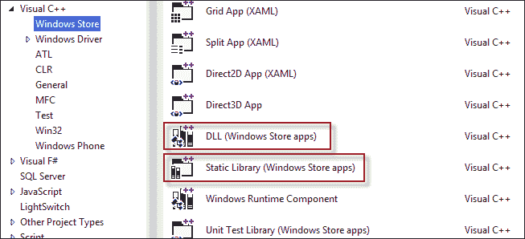

概述的项目创建了一个经典的 DLL 或静态库，但默认情况下不会生成`winmd`文件。这些组件只能被其他 C++ Store 项目（WinRT 组件或其他支持商店的库）使用。与常规的经典 C++ DLL 或静态库相比，有什么区别？首先，任何使用被禁止的 Win32 API 都会导致编译器错误。其次，除非执行特定步骤（例如添加对`platform.winmd`和`windows.winmd`文件的引用），否则这些项目不能使用 C++/CX。

# 自定义控件模板

在第四章中，我们讨论了 WinRT 提供的各种元素和控件。可以使用以下级别（从简单到复杂）来自定义元素和控件的外观。当然，并非所有元素/控件都支持所有级别：

+   更改属性值；到目前为止，最简单的自定义是通过更改属性来实现的。常见的例子是与字体相关的属性（`FontSize`，`FontFamily`等），`Foreground`和`Background`，以及许多其他属性。

+   对于内容控件（派生自`ContentControl`），`Content`属性可以设置为任何所需的元素。例如，这可以使`Button`显示图像、文本和其他任何所需的内容，同时仍保持预期的按钮行为。

+   数据模板可以用于支持它的属性，以丰富和有意义的方式显示数据对象。`ContentControl::Content`支持此功能，因为它的类型为`Platform::Object^`，这意味着它可以接受任何东西。如果这是一个不是`UIElement`的派生类型，则如果提供了`DataTemplate`，则会使用它（在这种情况下，通过`ContentControl::ContentTemplate`属性）。这也适用于所有`ItemsControl`派生类，通过`ItemTemplate`属性。

+   从`ItemsControl`派生的类型具有`ItemContainerStyle`和`ItemsPanel`属性，可以进一步自定义数据的呈现方式。

尽管前面的列表令人印象深刻，但有时这些自定义还不够。例如，`Button`始终是矩形的；尽管它可以包含任何东西（它是一个`ContentControl`），但它永远不可能是椭圆形的。有些东西就是“固定”在控件的外观中。这就是控件模板发挥作用的地方。

元素和控件之间的根本区别在于`Control::Template`属性的存在，它定义了控件的外观方式。元素没有这个属性。例如，椭圆是一个椭圆，它不能看起来像其他任何东西，因为那将违反它的定义。因此，椭圆是一个元素而不是一个控件。

控件（派生自`Control`）可以更改它们的`Template`属性并具有不同的外观（但保留功能）。实际上，所有控件都有 WinRT 提供的默认模板（否则，控件将没有“外观”）。

## 构建控件模板

控件模板的类型是`ControlTemplate`。它与`DataTemplate`非常相似（两者都派生自`FrameworkTemplate`），可以包含一个`UIElement`（通常是一个`Panel`），构成控件的外观。

例如，我们将为`ProgressBar`控件构建一个替代的控件模板。我们将从简单的步骤开始，然后逐步添加功能。

控件模板通常被创建为资源，这样可以更容易地重用。这是一个简单的尝试：

```cpp
<ControlTemplate TargetType="ProgressBar" x:Key="progTemp1">
  <Grid>
    <Rectangle Fill="DarkBlue" />
    <Rectangle RadiusX="10" RadiusY="4" HorizontalAlignment="Left" 
    Fill="Yellow" Margin="2" />
  </Grid>
</ControlTemplate>
```

要使用模板，我们只需将其设置为`Template`属性：

```cpp
<ProgressBar Value="30" Height="40" Margin="10" 
  Template="{StaticResource progTemp1}" />
```

这里的想法是在一个深蓝色的矩形上面创建另一个矩形（带有圆角），用来显示当前的进度。然而，结果并不理想（顶部的`ProgressBar`正在使用默认模板）：

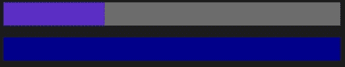

`ProgressBar`似乎没有显示任何进度（`Value="30"`应该显示 30%填充的`ProgressBar`，因为默认的`Maximum`是`100`，就像顶部的`ProgressBar`一样）。为什么会这样呢？我们只是创建了一个`Rectangle`，它的默认`Width`是`0`。解决这个问题的一种方法是将第二个`Rectangle`的`Width`属性绑定到`ProgressBar`的`Value`属性。以下是一种方法：

```cpp
Width="{TemplateBinding Value}"
```

`TemplateBinding`是一个绑定到正在被模板化的控件的标记扩展。这是必要的，因为我们不能使用`Source`或`ElementName`与常规的`Binding`。以下是结果：

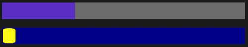

这当然更好，但与顶部的参考`ProgressBar`相比，进度指示器似乎很小。原因很简单，`Value`被视为`Width`，但实际上应该与整个`ProgressBar`的宽度成比例。我们可以通过使用值转换器来解决这个问题，但有一个更好的方法。

`ProgressBar`已经具备智能功能，可以将某些元素的`Width`属性设置为所需的比例值。我们只需要告诉它应该是哪个元素。事实证明，这个元素必须有一个特定的名称，在这种情况下是`ProgressBarIndicator`。我们只需要在相关元素上将`x:Name`属性设置为这个值，即我们的第二个`Rectangle`：

```cpp
<Rectangle RadiusX="10" RadiusY="4" x:Name="ProgressBarIndicator" 
  HorizontalAlignment="Left" Fill="Yellow" Margin="2" />
```

以下是结果：

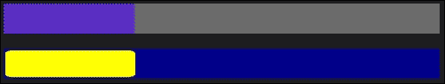

现在看起来完全正确。这个特殊的名称是从哪里来的？秘密在于查看控件的默认模板，寻找特别命名的部分。所有默认控件模板都可以在文件`C:\Program Files (x86)\Windows Kits\8.0\Include\WinRT\Xaml\Design\Generic.xaml`中找到（在 32 位 Windows 系统上，目录以`C:\Program Files`开头）。控件模板是控件的默认样式的一部分。

查看`ProgressBar`控件模板，大多数元素都以无趣的名称命名，例如`e1`，`e2`等等——`ProgressBarIndicator`脱颖而出。

### 注意

在 WPF 和 Silverlight 中，放置在控件上的`TemplatePart`属性指示控件查找的命名部分以及它们的类型应该是什么。尽管 WinRT 定义了`TemplatePart`属性，但在当前版本的 WinRT 中似乎没有使用，所以我们不得不做一些“猜测”。

### 使用控件的属性

模板现在正常运行（或看起来是这样）。更改属性，例如`Foreground`或`Background`，在使用我们的新模板时没有任何效果。这是因为模板没有以任何方式使用它们。有时，这就是我们想要的，但典型的模板希望提供自定义外观的方法；一种方法是利用控件上的现有属性。这已经在`TemplateBinding`到`Value`属性中简要演示过，但这里有一个更有趣的模板，它使用了`ProgressBar`的几个属性：

```cpp
<ControlTemplate TargetType="ProgressBar" x:Key="progTemp2">
  <Grid>
    <Rectangle Fill="{TemplateBinding Background}" />
    <Rectangle RadiusX="10" RadiusY="4" 
    x:Name="ProgressBarIndicator" 
    HorizontalAlignment="Left" Fill=
    "{TemplateBinding Foreground}" 
    Margin="2"/>
    <TextBlock HorizontalAlignment="Center" Foreground="White" 
      VerticalAlignment="Center" >
      <Run Text="{Binding Value, RelativeSource=
      {RelativeSource TemplatedParent}}" />
      <Span>%</Span>
    </TextBlock>
  </Grid>
</ControlTemplate>
```

在前面的代码片段中，有几件有趣的事情需要注意。`TemplateBinding`标记扩展用于绑定到模板控件的属性（`Background`和`Foreground`）；`TemplateBinding`仅适用于单向绑定（源到目标，但反之则不行）。对于双向绑定属性，必须使用更长的语法，即`Binding`表达式，其中`RelativeSource`属性设置为另一个标记扩展，名为`RelativeSource`（不应与`Binding::RelativeSource`属性名称混淆），它接受`Mode`（也作为构造函数参数），可以是`Self`（目标和源是相同的对象，在这里没有用）或`TemplatedParent`，这意味着正在被模板化的控件，这正是我们想要的。

### 注意


实际上很难捕捉到静态图像，因为`ProgressBar`显示了由小圆圈组成的有趣的非线性动画。

```cpp
<ProgressBar Value="30" Height="40" Margin="10" FontSize="20" 
  Template="{StaticResource progTemp2}"  
  Background="Brown">
  <ProgressBar.Foreground>
    <LinearGradientBrush EndPoint="0,1">
      <GradientStop Offset="0" Color="DarkBlue" />
      <GradientStop Offset="1" Color="LightBlue" />
    </LinearGradientBrush>
  </ProgressBar.Foreground>
</ProgressBar>
```

注意

这是结果：

### `TemplateBinding`在这里也应该起作用，因为我们只对单向绑定感兴趣。但是，由于`Value`可以进行双向绑定，`TemplateBinding`失败了。这似乎是当前 WinRT 实现中的一个错误。

`ProgressBar`通常显示操作的进度。然而，有时应用程序并不知道操作的进度——它只知道正在进行中。`ProgressBar`可以通过将其`IsIndeterminate`属性设置为`true`来指示这一点。以下是标准`ProgressBar`在此模式下的外观：


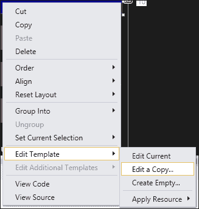

将`IsIndeterminate`设置为`true`的`ProgressBar`对使用我们的模板显示`ProgressBar`的方式没有影响。这是因为我们的控件没有考虑到这个属性。

如何解决这个问题？一种方法是向控件模板添加一些默认情况下隐藏的内容，但如果`IsIndeterminate`变为`true`，则会显示出来，并指示`ProgressBar`处于特殊模式（例如使用值转换器）。尽管从技术上讲这是可能的，但这通常不是通常的做法。其中一个原因是，有些状态变化只通过绑定和值转换器可能很难监控——例如，如果鼠标光标悬停在控件上（对于`ProgressBar`来说不相关，但对于许多其他控件来说是相关的），一个属性可能不足够。那么我们如何开始动画呢？

所有这些状态变化和反应都是通过一个辅助对象`VisualStateManager`处理的。控件在各个状态之间转换；这些状态及其转换可以被`VisualStateManager`捕获。对于每个变化，可以提供一组`Storyboard`对象；这些`Storyboard`对象代表一般情况下的动画，或者特定情况下的简单状态变化。

以下是处理`IsIndeterminate`属性效果的扩展模板：

```cpp
<ControlTemplate TargetType="ProgressBar" x:Key="progTemp4">
  <Grid>
    <VisualStateManager.VisualStateGroups>
      <VisualStateGroup x:Name="CommonStates">
        <VisualState x:Name="Indeterminate">
          <Storyboard>
            <DoubleAnimation Storyboard.TargetProperty="Opacity" 
            Storyboard.TargetName="IndetRect" To="1" 
              Duration="0:0:1" 
            AutoReverse="True" RepeatBehavior="Forever"/>
          </Storyboard>
        </VisualState>
        <VisualState x:Name="Determinate">
        </VisualState>
      </VisualStateGroup>
    </VisualStateManager.VisualStateGroups>
    <Rectangle Fill="{TemplateBinding Background}" />
      <Rectangle RadiusX="10" RadiusY="4" 
      x:Name="ProgressBarIndicator" HorizontalAlignment="Left" 
      Fill="{TemplateBinding Foreground}" Margin="2"/>
      <Rectangle x:Name="IndetRect" Opacity="0">
      <Rectangle.Fill>
        <LinearGradientBrush EndPoint=
        ".1,.3" SpreadMethod="Repeat">
          <GradientStop Offset="0" Color="Yellow" />
          <GradientStop Offset="1" Color="Red" />
        </LinearGradientBrush>
      </Rectangle.Fill>
    </Rectangle>
  </Grid>
</ControlTemplate>
```

透明度正在进行动画，淡入淡出这个矩形。

每个`VisualStateGroup`由`VisualState`对象组成，指示每个状态要执行的操作（要运行哪些动画）。状态名称必须是正确的名称，因为控件根据其内部逻辑转换到这些状态。我们如何知道存在哪些状态组以及每个组中有哪些状态？这是通过查看默认控件模板来完成的。可以通过查看前面提到的文件来完成这项工作，也可以通过在 Visual Studio 2012 中右键单击控件，然后选择**编辑模板** | **编辑副本...**来实现：

处理状态变化

在控件模板中，创建了一个名为`IndetRect`的第三个矩形，其初始不透明度为零，使其不可见。当`ProgressBar`进入`Indeterminate`状态时，将使用`DoubleAnimation`类（对`double`类型的属性进行动画处理）执行动画，将该矩形的不透明度在一秒钟内更改为`1`（完全显示），并具有自动反转（`AutoReverse="true"`）和永久动画（`RepeatBehavior="Forever"`）。这是结果：

这是一个使用此模板的“ProgressBar”：


### `VisualStateManager`有一个有趣的属性，即一个附加属性`VisualStateGroups`。对于每个组，始终有一个状态处于活动状态；这意味着控件可以同时处于多个状态。例如，按钮可以处于按下状态和键盘焦点状态。`VisualStateGroups`属性必须设置在包含控件模板的顶层“Panel”上（在我们的情况下是一个“Grid”）。

完全覆盖动画超出了本书的范围，但这应该让你对它有所了解。`Storyboard`表示一个时间线，在其中播放动画对象，本例中是一个`DoubleAnimation`对象，但还有许多其他对象。

状态实际上是如何改变的？控件通过其自己的逻辑调用静态的`VisualStateManager::GoToState`方法，设置特定组内的新状态。对于控件模板的作者来说，这并不重要；唯一重要的是根据预期的状态更改设置所需的动画。

### 注意

`VisualStateManager`还允许指定状态更改发生时要进行的实际过渡。这与实际状态本身相反。这意味着当移动到特定状态时，过渡可以是临时的，但状态本身可能具有不同的动画。有关更多信息，请参阅 MSDN 文档，从`VisualStateGroup::Transitions`属性和`VisualTransition`类开始。

### 使用附加属性进行自定义

到目前为止创建的`ProgressBar`模板使用`TemplateBinding`标记扩展或使用`Binding`和`RelativeSource`标记扩展指定`Source`，并将`TemplatedParent`作为其`Mode`设置在`ProgressBar`本身上设置的属性。那么如何添加仅对我们的模板有意义的属性呢？例如，在前面的模板定义中，`ProgressBar`显示其值的文本字符串。如果我们想允许模板用户隐藏文本或更改其颜色呢？

`ProgressBar`并没有考虑到所有这些。为什么要考虑呢？它是为一些自定义级别所需的属性而创建的；这对于默认的`ProgressBar`模板是可以接受的。

解决这个问题的一种方法是创建一个从`ProgressBar`派生的新类，并添加所需的属性。虽然这样可以解决问题（我们将在下一节讨论自定义控件），但这有点不够优雅——我们不需要`ProgressBar`的任何新功能，而是需要一些属性来调整其模板。

更优雅的解决方案是使用附加属性，它们在一个类上定义，但可以被任何其他类使用（尽管它必须派生自`DependencyObject`）。从技术上讲，我们可以在 WinRT 中寻找适当的附加属性，但最好创建一个新类来定义这些附加属性，并在`ProgressBar`模板中使用它们。

#### 定义一个附加属性

附加属性是依赖属性（我们将在下一节详细讨论）通过调用静态的`DependencyProperty::RegisterAttached`方法注册的。这将设置一个静态字段，为所有使用它的对象管理此属性。注册附带两个静态方法，实际上在对象上设置和获取附加属性的值。这里是一个类`ProgressBarProperties`的声明，它定义了一个单独的附加属性`ShowText`：

```cpp
public ref class ProgressBarProperties sealed {
public:
  static bool GetShowText(DependencyObject^ obj) {
    return (bool)obj->GetValue(ShowTextProperty);
  }

  static void SetShowText(DependencyObject^ obj, bool value) {
    obj->SetValue(ShowTextProperty, value);
  }

  static property DependencyProperty^ ShowTextProperty { 
    DependencyProperty^ get() { return _showTextProperty; }
  }

private:
  static DependencyProperty^ _showTextProperty;
};
```

静态字段必须在 CPP 文件中初始化：

```cpp
DependencyProperty^ ProgressBarProperties::_showTextProperty = 
  DependencyProperty::RegisterAttached(L"ShowText", 
  TypeName(bool::typeid), 
  TypeName(ProgressBarProperties::typeid), 
  ref new PropertyMetadata(false));
```

`RegisterAttached`方法接受属性名称，其类型（作为`TypeName`结构），其所有者的类型，以及可以接受属性的默认值的`PropertyMetadata`实例（如果未在实际对象上设置并且查询该属性）。有关`PropertyMetadata`的更详细解释可以在下一节找到，那里描述了依赖属性；现在，我们将专注于控件模板中的附加属性的使用。

`ProgressBar`模板中的`TextBlock`可以使用附加属性如下：

```cpp
<TextBlock HorizontalAlignment="Center" Foreground="White" 
  VerticalAlignment="Center" 
 Visibility="{Binding (local:ProgressBarProperties.ShowText), 
 RelativeSource={RelativeSource TemplatedParent}, 
 Converter={StaticResource bool2vis}}">
  <Run Text="{Binding Value, RelativeSource=
    {RelativeSource TemplatedParent}}" />
  <Span>%</Span>
</TextBlock>
```

属性路径周围的括号是必需的，否则 XAML 解析器无法正确理解表达式，导致运行时绑定失败。所使用的转换器是将`Boolean`转换为`Visibility`枚举，就像在第五章中演示的那样，*数据绑定*。

显然，定义和注册附加属性是简单而冗长的。一个解决方案是定义宏来自动化这些样板代码。本章的可下载源代码中有一些用于定义和注册依赖属性和附加属性的宏，这应该使得这些更容易使用（在一个名为`DPHelper.h`的文件中）。这是另一个附加属性的示例，使用上述宏进行定义。首先，在`ProgressBarProperties`类内部：

```cpp
DECLARE_AP(TextForeground, Windows::UI::Xaml::Media::Brush^);
```

然后在实现文件中（初始化静态字段）：

```cpp
DEFINE_AP(TextForeground, Brush, ProgressBarProperties, nullptr);
```

这个属性可以在模板中的`TextBlock`上使用，如下所示：

```cpp
Foreground="{TemplateBinding 
  local:ProgressBarProperties.TextForeground}"
```

# 自定义元素

控件模板提供了改变控件外观的强大和完整的方式。但这只是外观 - 控件仍然以相同的方式行为。如果需要新的功能，模板是不够的，需要创建一个新的类。这就是自定义元素的用武之地。

在 WinRT 中，有几种编写自定义元素的方法，我们将看一下两种最常用的控件 - 用户控件和自定义控件。然后，我们将简要讨论如何创建自定义面板和自定义形状。

## 用户控件

用户控件通常用于将相关元素和控件组合在一起，以便重复使用。从此控件中公开适当的属性和事件，以便轻松访问其功能。作为额外的奖励，Visual Studio 支持用户控件 UI 设计，就像对常规页面一样。

用户控件派生自`UserControl`类。UI 设计实际上是控件的`Content`属性，就像`ContentControl`一样。它们通常放在自己的 Windows Runtime 组件项目中，以便可以在任何 WinRT 项目中使用 C++或其他语言。

### 创建颜色选择器用户控件

作为用户控件的一个示例，我们将创建一个颜色选择器控件，它允许通过操作红色、绿色和蓝色三个滑块来选择纯色（RGB）。首先，在创建 Windows Runtime 组件项目后，我们可以向项目添加一个新项目类型为**用户控件**的项目：

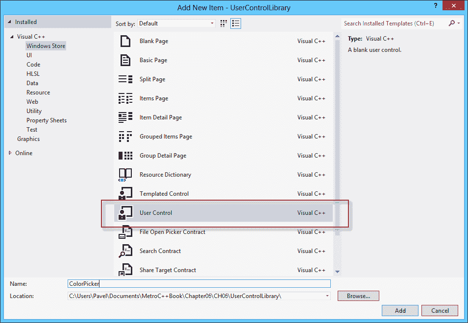

打开设计表面，并创建了通常的一对文件，`ColorPicker.h`和`ColorPicker.cpp`。

我们想要做的第一件事是定义属性，以便轻松访问用户控件的功能。大多数情况下，这些属性不会是简单的包装某个私有字段的属性，而是依赖属性。

### 依赖属性

简单的属性包装了一个字段（可能在 setter 中进行了一些验证），缺少在使用 UI 框架时希望的某些功能。具体来说，WinRT 依赖属性具有以下特点：

+   当属性的值发生变化时，进行更改通知。

+   各种提供程序可以尝试设置属性的值，但一次只有一个这样的提供程序获胜。尽管如此，所有值都会被保留。如果获胜的提供程序消失，属性的值将设置为下一个获胜者。

+   属性值在可视树中向下继承（对于一些预定义的属性）。

+   如果属性的值从其默认值中未发生更改，则不会为该属性的值分配内存

这些特性为 WinRT 的一些强大功能提供了基础，例如数据绑定、样式和动画。

在表面上，这些属性看起来与任何其他属性一样 - 有一个 getter 和一个 setter。但没有涉及私有字段。相反，一个静态字段管理着所有实例使用该属性的属性值。

### 定义依赖属性

这是定义依赖属性的方法（必须在从`DependencyObject`派生的类中完成，这总是与`UserControl`一样的情况）。一个私有的静态字段管理属性，该属性公开为只读属性。存在一个 setter 和 getter 作为实际`set`和`get`方法的简单访问，这些方法在`DependencyObject`基类中实现。以下代码演示了创建一个名为`SelectedColor`的`Windows::UI::Color`类型的依赖属性，该属性由`ColorPicker`用户控件公开：

```cpp
public ref class ColorPicker sealed {
public:
//…
  property Windows::UI::Color SelectedColor {
    Windows::UI::Color get() {
   	   return (Windows::UI::Color)GetValue(SelectedColorProperty); 
    }
    void set(Windows::UI::Color value) {
      SetValue(SelectedColorProperty, value); }
  }

  property DependencyProperty^ SelectedColorProperty { 
    DependencyProperty^ get() { return _selectedColorProperty; }
  }

private:
  static DependencyProperty^ _selectedColorProperty;
};
```

需要注意的几件事：

+   `GetValue`和`SetValue`属性是从`DependencyObject`继承的。

+   静态属性的名称应该以`Property`结尾。

+   向`get()`或`set()`部分添加更多代码从来都不是一个好主意，因为有时这些部分不会被使用，可以直接调用`GetValue`和`SetValue`方法；例如，XAML 解析器就是这样做的。

缺失的部分是静态字段的初始化，通常在`.cpp`文件中完成：

```cpp
DependencyProperty^ ColorPicker::_selectedColorProperty = 
  DependencyProperty::Register(
  "SelectedColor", TypeName(Color::typeid), 
  TypeName(ColorPicker::typeid),
  ref new PropertyMetadata(Colors::Black, 
  ref new PropertyChangedCallback(
  &ColorPicker::OnSelectedColorChanged)));
```

通过调用静态的`DependencyProperty::Register`方法注册**依赖属性**（**DP**），传递属性名称、其类型（作为`TypeName`结构）、包含类型和`PropertyMetadata`对象，该对象可以接受属性的默认值（在本例中为`Colors::Black`）和在属性更改时调用的可选回调。这将在`ColorPicker`的情况下很有用。

这段代码可以重复多次，每个 DP 都要重复一次。这显然需要一些辅助宏。以下是使用宏在`ColorPicker`上定义的另外三个属性。首先，在头文件中：

```cpp
DECLARE_DP(Red, int);
DECLARE_DP(Green, int);
DECLARE_DP(Blue, int);
```

以及`.cpp`文件：

```cpp
DEFINE_DP_EX(Red, int, ColorPicker, 0, OnRGBChanged);
DEFINE_DP_EX(Green, int, ColorPicker, 0, OnRGBChanged);
DEFINE_DP_EX(Blue, int, ColorPicker, 0, OnRGBChanged);
```

这比冗长的版本要短得多（也更少出错）。这些宏可以在`DPHelper.h`文件中找到，该文件可在本章的可下载源代码中找到。

接下来要做的是实现更改通知方法（如果存在的话）。在这种情况下，`Red`、`Green`和`Blue`应该反映`SelectedColor`属性的颜色组件，反之亦然。首先，如果`Red`、`Green`或`Blue`发生变化，使用以下代码片段：

```cpp
void ColorPicker::OnRGBChanged(DependencyObject^ obj, 
  DependencyPropertyChangedEventArgs^ e) {
  ((ColorPicker^)obj)->OnRGBChangedInternal(e);
}

void ColorPicker::OnRGBChangedInternal(
  DependencyPropertyChangedEventArgs^ e) {
  auto color = SelectedColor;
  auto value = safe_cast<int>(e->NewValue);
  if(e->Property == RedProperty)
    color.R = value;
  else if(e->Property == GreenProperty)
    color.G = value;
  else
    color.B = value;
  SelectedColor = color;
}
```

由于注册的处理程序必须是静态的，将实际工作委托给实例方法（在前面的代码中为`OnRGBChangedInternal`）更容易。该代码根据更改的 RGB 属性更新`SelectedColor`属性。

另一个方向的实现也是类似的：

```cpp
void ColorPicker::OnSelectedColorChanged(DependencyObject^ obj, 
DependencyPropertyChangedEventArgs^ e) {
  ((ColorPicker^)obj)->OnSelectedColorChangedInternal(
  safe_cast<Color>(e->NewValue));
}

void ColorPicker::OnSelectedColorChangedInternal(Color newColor) {
  Red = newColor.R;
  Green = newColor.G;
  Blue = newColor.B;
}
```

### 注意

前面的代码片段似乎会创建一个无限循环 - 如果`Red`改变，`SelectedColor`改变，这又会改变`Red`，依此类推。幸运的是，依赖属性机制会自动处理这个问题，如果属性值实际上发生变化，它会调用回调；设置为相同的值不会调用回调。

### 构建 UI

下一步是使用常规 XAML 创建用户控件的实际 UI。可以使用绑定表达式绑定到控件公开的属性（因为这些是 DP，它们为绑定提供自动更改通知）。以下是`ColorPicker`的 UI，滑块绑定到`Red`、`Green`和`Blue`属性，以及一个`Rectangle`绑定到控件的`SelectedColor`属性（默认 XAML 命名空间被省略）：

```cpp
<UserControl
  x:Class="UserControlLibrary.ColorPicker"
  x:Name="uc">
  <UserControl.Resources>
  </UserControl.Resources>
  <Grid>
    <Grid.RowDefinitions>
      <RowDefinition Height="Auto" />
      <RowDefinition Height="Auto" />
      <RowDefinition Height="Auto" />
    </Grid.RowDefinitions>
    <Grid.ColumnDefinitions>
      <ColumnDefinition />
      <ColumnDefinition Width="150" />
    </Grid.ColumnDefinitions>
    <Slider Maximum="255" Margin="4" TickFrequency="20" 
      Value="{Binding Red, ElementName=uc, Mode=TwoWay}"/>
      <Slider Maximum="255" Margin="4" TickFrequency="20" 
      Value="{Binding Green, ElementName=uc, Mode=TwoWay}" 
      Grid.Row="1"/>
    <Slider Maximum="255" Margin="4" TickFrequency="20" 
      Value="{Binding Blue, ElementName=uc, Mode=TwoWay}" 
      Grid.Row="2"/>
    <Rectangle Grid.Column="1" Grid.RowSpan="3" Margin="10" 
      Stroke="Black" StrokeThickness="1">
      <Rectangle.Fill>
        <SolidColorBrush Color="{Binding SelectedColor, 
        ElementName=uc}" />
      </Rectangle.Fill>
    </Rectangle>
  </Grid>
</UserControl>
```

### 添加事件

可以向用户控件添加事件，以通知感兴趣的方。以下是在控件的头文件中添加的一个事件：

```cpp
event EventHandler<Windows::UI::Color>^ SelectedColorChanged;
```

该事件使用`EventHandler<T>`委托，该委托要求客户端提供一个接受`Platform::Object^`和`T`（在本例中为`Color`）的方法。当`SelectedColor`属性改变时，我们将触发该事件：

```cpp
void ColorPicker::OnSelectedColorChangedInternal(Color newColor) {
  Red = newColor.R;
  Green = newColor.G;
  Blue = newColor.B;

 SelectedColorChanged(this, newColor);
}
```

### 使用 ColorPicker

现在我们可以通过通常的方式在另一个项目中使用`ColorPicker`，并添加 XML 命名空间映射。然后就像使用其他控件一样使用该控件。以下是一个例子：

```cpp
<StackPanel VerticalAlignment="Center">
  <Border Margin="10" Padding="6" Width="500" BorderBrush="White" 
    BorderThickness="2" >
  <controls:ColorPicker SelectedColorChanged="OnColorChanged" />
  </Border>
  <TextBlock FontSize="30" HorizontalAlignment="Center">
    <Span>Color: #</Span>
    <Run x:Name="_color" />
  </TextBlock>
</StackPanel>
```

控件放置在边框内，其`SelectedColorChanged`事件处理如下：

```cpp
void MainPage::OnColorChanged(Object^ sender, Color color) {
  wstringstream ss;
  ss.fill(L'0');
  ss << hex << uppercase << setw(2) << color.R << setw(2) << 
  color.G << setw(2) << color.B;
  _color->Text = ref new String(ss.str().c_str());
}
```

这改变了控件底部的`TextBlock`。这是运行时的样子：

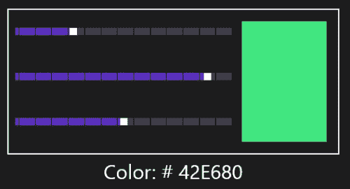

## 自定义控件

用户控件非常适合封装可以轻松重用的 UI 功能。它们的潜在缺点是缺乏深度定制。假设在`ColorPicker`示例中，我们希望将滑块垂直放置而不是水平放置，或者我们想要一个椭圆而不是一个矩形。虽然可以添加一些允许一些定制的属性，但我们无法预料到一切。

解决方案是创建一个具有默认控件模板的自定义控件，可以根据需要完全更改，同时保留原始功能。这正是常规 WinRT 控件的构建方式。

### 创建一个 ColorPicker 自定义控件

自定义（也称为模板化）控件派生自`Control`类。一个很好的起点是 Visual Studio 模板化控件模板：

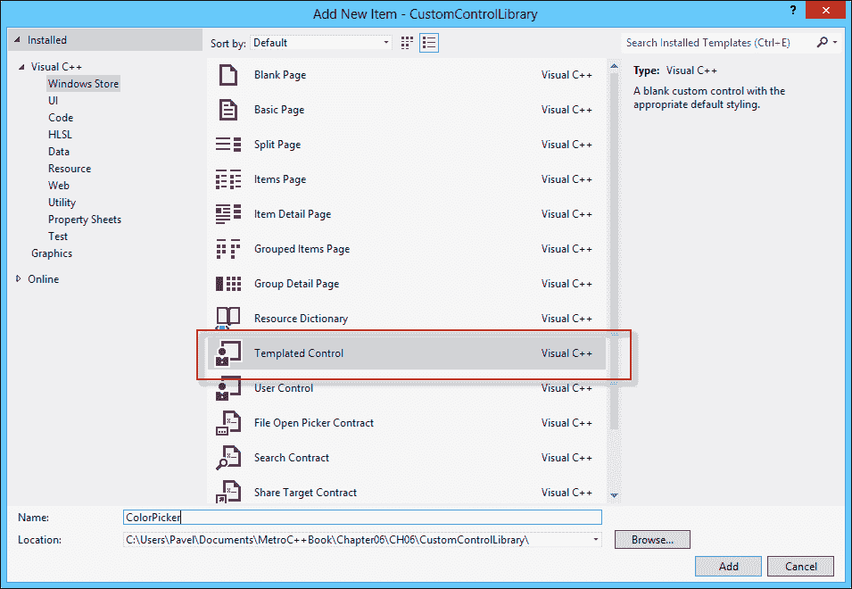

结果是一对文件，`ColorPicker.h`和`ColorPicker.cpp`，以及一个名为`Generic.xaml`的 XAML 文件，其中包含了`ColorPicker`的默认样式，包括默认模板，如下所示：

```cpp
<Style TargetType="local:ColorPicker">
  <Setter Property="Template">
    <Setter.Value>
      <ControlTemplate TargetType="local:ColorPicker">
        <Border
          Background="{TemplateBinding Background}"
          BorderBrush="{TemplateBinding BorderBrush}"
          BorderThickness="{TemplateBinding BorderThickness}">
        </Border>
      </ControlTemplate>
    </Setter.Value>
  </Setter>
</Style>
```

### 注意

所有自定义控件样式必须驻留在同一个`Generic.xaml`文件中。它的名称和来源在 WPF 中，支持不同的样式适用于不同的 Windows UI 主题。这与 WinRT 无关，但惯例仍然存在。

实际上，当编写多个自定义控件时，使用同一个文件最不方便。可以通过使用`ResourceDictionary::MergedDictionaries`属性将其他 XAML 文件包含到`Generic.xaml`中来解决这个问题。

默认模板看起来与为用户控件创建的默认 UI 非常相似，但有一个重要的区别；没有数据绑定表达式。原因是，如果有绑定，自定义模板将不得不复制这些绑定以保持功能，这对自定义模板作者来说是一个不合理的负担；另一种选择是在代码中进行绑定。以下是`ColorPicker`的默认模板的修订标记：

```cpp
<ControlTemplate TargetType="local:ColorPicker">
  <Border
    Background="{TemplateBinding Background}"
    BorderBrush="{TemplateBinding BorderBrush}"
    BorderThickness="{TemplateBinding BorderThickness}">
    <Grid>
      <Grid.RowDefinitions>
        <RowDefinition Height="Auto" />
        <RowDefinition Height="Auto" />
        <RowDefinition Height="Auto" />
      </Grid.RowDefinitions>
      <Grid.ColumnDefinitions>
        <ColumnDefinition />
        <ColumnDefinition Width="150" />
      </Grid.ColumnDefinitions>
      <Slider Maximum="255" Margin="4" TickFrequency="20" 
      x:Name="PART_Red"/>
      <Slider Maximum="255" Margin="4" TickFrequency="20" 
      x:Name="PART_Green" Grid.Row="1"/>
      <Slider Maximum="255" Margin="4" TickFrequency="20" 
      x:Name="PART_Blue" Grid.Row="2"/>
      <Rectangle Grid.Column="1" Grid.RowSpan="3" Margin="10" 
      Stroke="Black" StrokeThickness="1">
        <Rectangle.Fill>
          <SolidColorBrush x:Name="PART_Color" />
        </Rectangle.Fill>
      </Rectangle>
    </Grid>
  </Border>
</ControlTemplate>
```

模板的有趣部分被分配了名称。这些名称将被控件查找并在代码中绑定。这些是本章开头讨论的命名部分。

### 在代码中进行绑定

在自定义控件中定义依赖属性和事件与用户控件完全相同。

当模板应用于控件时，将调用虚拟的`Control::OnApplyTemplate`方法。这是控件寻找其命名部分并使用绑定或事件处理程序连接到它们的最佳机会。

为了绑定这三个滑块，创建了一个辅助方法，如下所示：

```cpp
void ColorPicker::BindSlider(String^ name, String^ propertyName) {
  auto slider = (RangeBase^)GetTemplateChild(name);
  if(slider != nullptr) {
    auto binding = ref new Binding;
    binding->Source = this;
    binding->Path = ref new PropertyPath(propertyName);
    binding->Mode = BindingMode::TwoWay;
    BindingOperations::SetBinding(slider, 
    RangeBase::ValueProperty, binding);
  }
}
```

该方法使用`GetTemplateChild()`来获取命名元素。如果该元素不存在，则返回`nullptr`。一个典型的控件简单地继续执行，不会抛出异常。

### 注意

请注意，代码将`RangeBase`转换而不是`Slider`。这是可能的，因为所需的属性是在`RangeBase`上定义的`Value`。这意味着这可以是除`Slider`之外的其他东西，只要它是从`RangeBase`派生的（例如，`ScrollBar`或`ProgressBar`）。

接下来，在代码中创建一个绑定，通过实例化一个`Binding`对象，设置源对象（`Source`和`Path`属性），绑定模式（`Mode`属性）和转换器（如果需要，使用`Converter`属性），最后调用`BindingOperations::SetBinding`与目标对象，目标 DP 和绑定实例。

完整的`OnApplyTemplate`如下：

```cpp
void ColorPicker::OnApplyTemplate() {
  BindSlider("PART_Red", "Red");
  BindSlider("PART_Green", "Green");
  BindSlider("PART_Blue", "Blue");
  auto color = (SolidColorBrush^)GetTemplateChild("PART_Color");
  if(color != nullptr) {
    auto binding = ref new Binding;
    binding->Source = this;
    binding->Path = ref new PropertyPath(L"SelectedColor");
    BindingOperations::SetBinding(color, 
    SolidColorBrush::ColorProperty, binding);
  }
}
```

三个可能的滑块（实际上是从`RangeBase`派生的控件）被绑定，然后如果存在`SolidColorBrush`，则被绑定。这意味着它可以是`Rectangle`的`Fill`，`Ellipse`的`Fill`，或者`Border`的`BorderBrush`——只要它是`SolidColorBrush`。

使用自定义控件与使用用户控件相同。但是，可以替换控件模板（就像本章开头对`ProgressBar`所做的那样），以创建一个外观不同但具有相同功能的`ColorPicker`，而且完全不需要代码——只需 XAML。

# 自定义面板

WinRT 提供了从`Panel`派生的标准面板。可以创建新的面板，以独特的方式排列其子元素，例如径向面板，其子元素沿椭圆的周长排列。

布局过程是一个两步过程——测量和排列。这正是`Panel`的方法精确地建模了这两个方法的目的，`MeasureOverride`和`ArrangeOverride`。

`MeasureOverride`询问面板（或任何覆盖它的元素）需要多大的尺寸。对于面板来说，主要关注的是其子元素的要求。面板应该为每个子元素调用`UIElement::Measure`，导致其自己的`MeasureOverride`被调用（如果该子元素是一个面板，或者像一个面板一样行事）。

面板需要根据其子元素的要求和其想要使用的布局逻辑来决定所需的大小。发送到`MeasureOverride`的参数是该面板容器提供的可用大小。这可以是一个或两个维度的无限大小（例如，`ScrollViewer`指示在可滚动的方向上有无限空间）。重要的是返回有限大小；否则 WinRT 无法知道为面板留多少空间，并抛出异常。

`ArrangeOverride`是一个更有趣的方法，它实际上实现了特殊的布局逻辑，为此面板被创建。面板对每个元素调用`UIElement::Arrange`，强制该元素放置在特定的矩形内。

### 注意

这个过程几乎与在 WPF 或 Silverlight 中完成的方式完全相同；网上有许多这样的例子，可以很容易地转换为 WinRT。

# 自定义绘制元素

可以通过从`Windows::UI::Xaml::Path`类派生它们来在 WinRT 中创建自定义绘制元素，这是一种`Shape`。`Path`基于`Geometry`——2D 布局的数学抽象，可以是`PathGeometry`，它本身可以由各种`PathSegment`对象构建。这些形状超出了本书的范围，但是它们与 Silverlight 中存在的形状相似，因此有很多关于它们的信息可用。

### 注意

WinRT 目前不支持 WPF 的`OnRender`方法，该方法使用`DrawingContext`进行各种自由风格的绘制。希望这将在将来的版本中得到支持。

许多新控件作为 WinRT XAML 工具包的一部分存在，可以免费在微软的 CodePlex 网站上获得[`winrtxamltoolkit.codeplex.com/`](http://winrtxamltoolkit.codeplex.com/)。工具包的问题在于它是作为.NET 类库编写的，因此只能被.NET 项目使用。

# 总结

组件是模块重用的支柱。真正的 WinRT 组件只使用 WinRT 类型，因此可以导出到任何兼容 WinRT 的环境，如 C++/CX、.NET 和 JavaScript。

控件模板提供了可以仅使用 XAML 完成的最终控件定制机制，几乎不需要代码（如果使用值转换器，则可能需要代码）。如果控件的外观需要更改，但其功能应保持完整，并且是所需的，那么模板是合适的。

自定义和用户控件用于在没有任何内置控件提供的情况下需要新功能时使用。通过从`UserControl`和`Control`派生，可以添加依赖属性和事件以创建新的可重用控件。

用户控件和自定义控件应该打包在这样的 WinRT 组件中，以便 C++和其他项目轻松重用。

在下一章中，我们将介绍一些 Windows Store 应用程序的特殊功能，例如动态磁贴和推送通知。这些（以及其他）功能可以使您的商店应用程序独特而吸引人。
