# 第七章：应用程序、磁贴、任务和通知

Windows 商店应用程序在许多方面与传统桌面应用程序不同。商店应用程序位于一个安全容器中，与外部世界的交互方式是明确定义的，如其他应用程序、操作系统或网络上的内容。这些应用程序还受到多项限制，与桌面应用程序世界中的任何限制都不同。了解这些限制，并通过与 Windows 的合作来处理它们的方式，是成功和行为良好的 Windows 商店应用程序的关键。

我们将首先研究商店应用程序的执行模型，以及它与经典桌面应用程序的不同之处。然后我们将看一些商店应用程序的独特特性，如动态磁贴和其他通知机制。最后，我们将探讨应用程序即使不是当前运行的应用程序也可以执行工作的方式，通过使用各种形式的后台任务。

# 应用程序生命周期

商店应用程序由 Windows 操作系统管理，开发应用程序时需要考虑严格的规则：

+   一次只能有一个应用程序处于前台（一个显著的例外是“快照视图”：一个应用程序占据大部分屏幕，而另一个占据 320 像素的宽度；这在第九章中讨论，*打包和 Windows 商店*）。

+   其他应用程序会被 Windows 自动挂起，意味着它们不会获得 CPU 时间；但它们占用的内存会被保留。

+   如果 Windows 检测到内存不足，它可能会终止第一个挂起的应用程序；如果内存仍然紧张，它将终止第二个挂起的应用程序，依此类推。

这些规则旨在确保前台应用程序完全访问 CPU 和其他资源，同时尽可能节省电池电量。完整的应用程序生命周期可以用以下状态图表示：

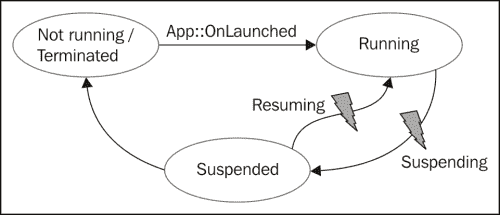

一开始，应用程序不在运行状态。然后用户启动应用程序，通常是通过在开始屏幕上点击或轻触其磁贴。这会导致调用`Application::OnLaunched`虚拟方法；这是应用程序应该初始化并呈现主用户界面的地方。

### 注意

Visual Studio 提供的`OnLaunched`方法的默认代码创建了一个`Frame`元素，它成为当前`Window`（唯一的应用程序窗口）的`Content`。然后调用`Frame::Navigate`并传入`MainPage`的类型名称，这会导致`MainPage`按预期出现。

应用程序现在处于运行状态，用户可以与应用程序交互。如果用户通过按*Alt* + *Tab*切换到另一个应用程序，或者转到开始屏幕并激活另一个应用程序磁贴（或通过从左侧滑动切换到另一个应用程序），我们的应用程序不再处于前台。如果 5 秒后用户没有切换回应用程序，它将被操作系统挂起。在此之前，`Application::Suspended`事件将被触发。这是应用程序在稍后终止时保存状态的机会。应用程序最多有 5 秒钟来保存状态；如果时间超过了，应用程序将被终止。假设一切正常，应用程序被挂起。

应用程序的当前状态可以在**任务管理器**中查看：

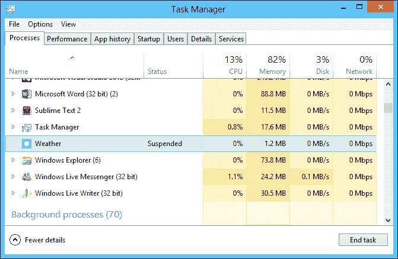

### 提示

要在**任务管理器**中查看应用程序的状态，首先选择**查看**菜单，然后选择**状态值**，并单击**显示挂起状态**（默认情况下是关闭的）。

一旦暂停，应用程序可能会恢复，因为用户切换回应用程序。这会导致`Application`对象上的`Resuming`事件触发。在大多数情况下，应用程序无需做任何操作，因为应用程序已保留在内存中，因此没有丢失任何内容。在 UI 应该因过时数据而刷新的情况下，可以使用`Resuming`事件进行操作（例如，RSS 阅读器会刷新数据，因为应用程序可能已经暂停了几个小时，甚至几天）。

在暂停状态下，由于内存资源不足，应用程序可能会被 Windows 终止。应用程序不会收到此事件的通知；这是有道理的，因为应用程序在暂停状态下无法使用任何 CPU 周期。如果用户再次激活应用程序，将调用`OnLaunched`，从而有机会使用`LaunchActivatedEventArgs::PreviousExecutionState`属性恢复状态。一个可能的值是`ApplicationExecutionState::Terminated`，表示应用程序是从暂停状态关闭的，因此应尝试恢复状态。

### 注意

应用程序中的单个页面可能希望在应用程序即将暂停或恢复时收到通知。这可以在`Page`的构造函数中通过访问全局`Application`对象`Application::Current`来完成。典型的暂停注册可能如下所示：

```cpp
Application::Current->Suspending += ref new SuspendingEventHandler(this, &MainPage::OnSuspending);
```

## 保存和恢复状态

如果应用程序被暂停，那么在应用程序恢复之前，应用程序有责任保存所需的任何状态。这是响应`Application::Suspending`事件完成的，该事件可以在应用程序级别和/或页面级别处理。

假设我们有一个电影评论应用程序，允许用户评论电影。可能存在一个简单的 UI，看起来像下面这样：

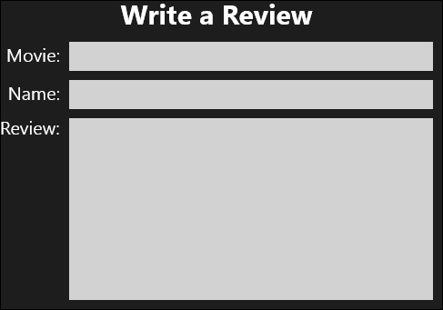

如果用户切换到另一个应用程序，应用程序将在 5 秒后暂停，如果用户不切换回，则应用程序将被暂停。我们可以使用`Windows::Storage::ApplicationData`类来访问本地设置存储或本地文件夹（对于更复杂的存储需求），以保存前述`TextBox`元素的状态，以便在应用程序被 Windows 意外终止时可以恢复。首先，我们需要在`MainPage`构造函数中注册`Suspending`事件：

```cpp
MainPage::MainPage() {
  InitializeComponent();

  DataContext = _review = ref new MovieReview;

  Application::Current->Suspending += 
    ref new SuspendingEventHandler(
    this, &MainPage::OnSuspending);
}
```

`MovieReview`类表示评论（实现了`INotifyPropertyChanged`，如第五章*数据绑定*中讨论的那样），`TextBox`元素绑定到它的三个属性。如果应用程序被暂停，将执行以下操作：

```cpp
void MainPage::OnSuspending(Object^ sender, SuspendingEventArgs^ e) {
  ApplicationData::Current->LocalSettings->Values->
    Insert("MovieName", _review->MovieName);
  ApplicationData::Current->LocalSettings->Values->
    Insert("ReviewerName", _review->ReviewerName);
  ApplicationData::Current->LocalSettings->Values->
    Insert("Review", _review->Review);
}
```

代码使用`ApplicationData::LocalSettings`属性（一个`ApplicationDataContainer`对象），它管理一组键/值对（可选的内部容器），通过`Values`属性公开。

### 注意

以这种方式存储的类型仅限于基本的 WinRT 类型，并不包括自定义类型，比如`MovieReview`。可以创建一些代码，将这样的对象序列化为 XML 或 JSON，然后将其保存为字符串。

如果应用程序确实被终止，需要恢复状态。可以在`Page::OnNavigatedTo`覆盖中执行此操作，如下所示：

```cpp
void MainPage::OnNavigatedTo(NavigationEventArgs^ e) {
  auto settings = ApplicationData::Current->LocalSettings->Values;
  if(settings->HasKey("MovieName"))
    _review->MovieName = safe_cast<String^>(
    settings->Lookup("MovieName"));
  if(settings->HasKey("ReviewerName"))
    _review->ReviewerName = safe_cast<String^>(
    settings->Lookup("ReviewerName"));
  if(settings->HasKey("Review"))
    _review->Review = safe_cast<String^>(
    settings->Lookup("Review"));
}
```

为了测试这一点，我们可以在没有 Visual Studio 调试器的情况下运行应用程序。但是，如果需要调试代码，会有一个小问题。当应用程序正在调试时，它永远不会进入暂停状态。这是为了让开发人员能够切换到 Visual Studio 并查看代码，同时应用程序在后台仍然可以随时切换到它。

我们可以通过使用 Visual Studio 工具栏按钮来强制应用程序进入暂停状态，该按钮允许暂停、恢复和终止应用程序（以及调用后台任务，我们将在本章后面的*后台任务*部分中看到）：

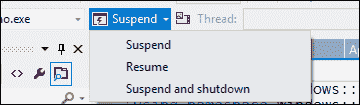

### 确定应用程序执行状态

当应用程序被激活时，可能是因为用户启动了它（还有其他选项，比如实现的合同，我们将在下一章中看到）。通常很重要了解应用程序上次关闭的原因。如果是被终止，状态应该已经恢复。另一方面，如果是用户关闭的，也许状态应该已经清除，因为用户期望应用程序重新开始。

我们可以使用应用程序的 `OnLaunched` 方法重写中可用的 `LaunchActivatedEventArgs::PreviousExecutionState` 属性来确定上一个状态：

```cpp
ApplicationData::Current->LocalSettings->Values
    ->Insert("state", (int)args->PreviousExecutionState);

if (args->PreviousExecutionState == 
  ApplicationExecutionState::Terminated) {
    // restore state
  }
else if(args->PreviousExecutionState == 
  ApplicationExecutionState::ClosedByUser) {
    // clear state
  }
```

将状态写入 `LocalSettings` 容器是有用的，这样其他实体（通常是页面）可以在 `OnLaunched` 完成后访问这些信息。这允许我们的恢复代码查询这个状态并相应地行动：

```cpp
auto settings = ApplicationData::Current->LocalSettings->Values;
auto state = safe_cast<ApplicationExecutionState>(
  safe_cast<int>(settings->Lookup("state")));
  if(state == ApplicationExecutionState::Terminated) {
    // restore state...
```

### 注意

枚举也禁止直接存储，但可以转换为 `int` 然后存储。

### 状态存储选项

之前的代码示例使用了 `ApplicationData::LocalSettings` 属性。这使用了一个存储在本地机器上（当前用户和应用程序）的存储，这意味着在运行 Windows 8 的另一台设备上，即使相同的用户登录，相同的状态也不可用。

WinRT 提供了一种替代方案，允许设置通过使用 `ApplicationData::RoamingSettings` 属性存储在 Microsoft 云服务中在设备之间漫游。使用这个属性的方式与 `LocalSettings` 完全相同；它会自动与云同步。

### 注意

与云同步只有在用户使用他的 Microsoft ID（以前是 Live ID）登录系统时才能工作，而不是“普通”的用户名/密码。

`LocalSettings` 和 `RoamingSettings` 对于简单的键/值对非常有用。如果需要存储更复杂的数据，我们可以创建一个文件夹（`StorageFolder` 对象），然后可以通过创建 `StorageFile` 对象、更多文件夹等等来使用。这可以通过访问其他 `ApplicationData` 属性实现：`LocalFolder`、`RoamingFolder` 和 `TemporaryFolder`（`TemporaryFolder` 存储信息直到应用程序终止，通常不适用于应用程序状态管理）。

### 注意

存储在本地应用程序存储中（`ApplicationData::LocalFolder`）的文件可以通过以 `ms-appdata:///local/` 开头的 URI 访问，后面跟着文件的相对路径；将 `local` 替换为 `roaming` 可以访问漫游存储。这些 URI 可以在 XAML 中使用，也可以在代码中使用。

### 辅助类

一些 Visual Studio 2012 项目模板，如 Grid App，提供了两个类，可以帮助进行状态管理：`SuspensionManager` 和 `LayoutAwarePage`。它们提供了以下功能：

+   可以管理导航页面堆栈，保存为本地文件夹中的 XML

+   `LayoutAwarePage` 必须用作基本页面类

+   可以自动保存/恢复此状态

感兴趣的读者应该参考源代码以获取有关这些类的更多信息。

# 动态磁贴

Windows Store 应用程序的一个独特特性是在开始屏幕上使用磁贴。这些磁贴可以包含图像和文本，但这些不需要是恒定的，可以改变。通过各种机制提供实时和有意义的信息，吸引用户点击磁贴，访问应用程序本身。在本节中，我们将看看如何创建和操作磁贴。

## 设置应用磁贴默认值

应用磁贴的默认设置可以在应用清单中设置，通过 Visual Studio 用户界面很容易访问：

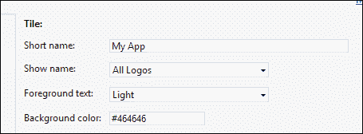

有两种大小的磁贴可用，标准和宽。如果有宽标志图像可用，默认会显示，并且用户可以通过右键单击磁贴（或从底部滑动）并选择相关选项来将其更改为标准磁贴（反之亦然）。

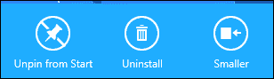

标准磁贴图像应为 150 像素 x150 像素，宽磁贴图像应为 310 像素 x150 像素。如果未提供这些尺寸，Visual Studio 将发出警告，并且图像将根据需要进行拉伸/缩小。

**短名称**将显示在**显示名称**组合框（**所有标志**、**无标志**、**仅标准标志**和**仅宽标志**）中选择的磁贴顶部。**前景文本**选项选择浅色或深色文本，所选的背景颜色将用于透明图像（PNG 文件）和一些其他对话框，作为默认背景颜色。

### 注意

应用程序不应定义宽磁贴，除非应用程序计划在该磁贴中提供有意义且有趣的内容。仅使用大型静态图像是一个坏主意；用户会期望磁贴提供更多内容。

## 更新磁贴的内容

应用程序可以更新正在运行的磁贴。即使应用程序关闭，更新后的磁贴也会保留其内容。更新磁贴涉及创建一些指定磁贴部分的 XML，其中可以包括各种布局的图像和文本。还有可以在两个磁贴集之间交替的窥视磁贴选项。我们需要做的第一件事是从一组广泛的预定义模板中选择一个合适的磁贴模板。每个模板由一个 XML 字符串表示，需要作为实际更新发送。

标准磁贴和宽磁贴都有模板；这些由`Windows::UI::Notifications::TileTemplateType`枚举表示。以下是一个宽磁贴的通用 XML 示例，其中包含一个文本项，称为`TileWideImageAndText01`（枚举值）：

```cpp
<tile>
  <visual>
    <binding template="TileWideImageAndText01">
      <image id="1" src="img/image1.png" alt="alt text"/>
      <text id="1">Text Field 1</text>
    </binding>  
  </visual>
</tile>
```

需要使用所需的新内容更新突出显示的元素和内部文本。

### 注意

完整的模板列表和 XML 模式可以在[`msdn.microsoft.com/EN-US/library/windows/apps/hh761491(v=vs.10).aspx`](http://msdn.microsoft.com/EN-US/library/windows/apps/hh761491(v=vs.10).aspx)找到。

选择所需的模板后，可以使用以下代码检索相关的 XML（无需手动构建整个 XML）：

```cpp
auto xml = TileUpdateManager::GetTemplateContent(
    TileTemplateType::TileWideImageAndText01);
```

返回的值是一个`Windows::Data::Xml::Dom::XmlDocument`，表示生成的 XML。现在，我们需要使用所需的更新调整 XML。在这个例子中，我们将更改图像和文本：

```cpp
((XmlElement^)xml->GetElementsByTagName("image")->GetAt(0))
  ->SetAttribute("src", "assets\\bug.png");
xml->GetElementsByTagName("text")->GetAt(0)->AppendChild(
  xml->CreateTextNode("You have a bug!!!"));
```

该代码使用 WinRT XML DOM API 来操作 XML。图像设置为本地图像，但远程图像（`http://...`）同样有效。

最后一步是为应用程序创建磁贴更新程序，构建磁贴通知并进行实际更新：

```cpp
auto update = TileUpdateManager::CreateTileUpdaterForApplication();
auto tile = ref new TileNotification(xml);
update->Update(tile);
```

这是生成的宽磁贴：

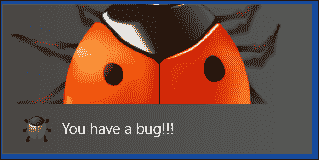

### 注意

上述代码仅更新宽磁贴，保持标准磁贴不变。要同时更改标准磁贴，我们可以向`<visual>`元素添加另一个`<binding>`元素，其中包含所需标准磁贴的适当 XML。这将使两个更改都生效。

### 启用循环更新

磁贴的一个有趣特性是能够循环最多五次磁贴更新，默认情况下与最后五个一起工作。以下代码将启用磁贴循环：

```cpp
auto update = TileUpdateManager::CreateTileUpdaterForApplication();
update->EnableNotificationQueue(true);
```

如果应该替换特定磁贴（而不是丢弃第一个更新），可以使用`TileNotification::Tag`属性为磁贴打上唯一值，以标识要替换的确切磁贴。

### 磁贴过期

可以通过设置`TileNotification::ExpirationTime`属性，使磁贴在将来某个时间点过期。到时候，磁贴将恢复到默认状态。

### 徽章更新

**徽章**是位于磁贴右下角的小通知符号。它可以是 1 到 99 的数字，也可以是一组预定义的图形。通常用于显示状态，例如网络连接（如果适用于应用程序）或待处理消息的数量（在消息应用程序中）。

更新徽章与更新磁贴非常相似-它基于包含单个元素（`<badge>`）的 XML 字符串，通过操作来获得所需的结果。以下是更新具有数字值的徽章所需的代码：

```cpp
auto xml = BadgeUpdateManager::GetTemplateContent(
  BadgeTemplateType::BadgeNumber);
auto element = (XmlElement^)xml->SelectSingleNode("/badge");
element->SetAttribute("value", (++count).ToString());

auto badge = ref new BadgeNotification(xml);
BadgeUpdateManager::CreateBadgeUpdaterForApplication()
  ->Update(badge);
```

变量`count`用作数字值。

## 创建辅助磁贴

应用程序磁贴（主磁贴）可以附带辅助磁贴。这些通常代表应用程序中的深层链接。例如，天气应用程序可以使用辅助磁贴来更新天气重要的额外位置，或者商店应用程序可以使用辅助磁贴作为指向特定产品的链接。

无论如何，只有用户才能允许将辅助磁贴固定到开始屏幕上或从开始屏幕上取消固定。通常，应用程序内的一些用户界面允许用户固定辅助磁贴，但只有在用户提供同意的情况下才能发生这种情况-否则磁贴将不会被固定。

以下代码片段创建一个辅助磁贴，并询问用户是否要将其固定到开始屏幕上：

```cpp
using namespace Windows::UI::StartScreen;
auto tile = ref new SecondaryTile("123", "Sample tile", 
  "This is a sample tile", "123", 
  TileOptions::ShowNameOnLogo, ref new Uri(
    "ms-appx:///assets/apple.png"));
create_task(tile->RequestCreateAsync()).then([](bool ok) {
  // do more stuff
});
```

前面的代码中使用的`SecondaryTile`构造函数按顺序接受以下参数（也可以使用属性设置）：

+   以后可以用来识别磁贴的唯一磁贴 ID（例如，用于取消固定）

+   一个系统提供的同意对话框中显示的必需的短名称

+   显示名称（推荐）

+   在确定应用程序是否通过辅助磁贴调用时有助于的磁贴激活参数（稍后会详细介绍）

+   Logo URI

调用`SecondaryTile::RequestCreateAsync`会呈现一个标准的系统对话框（基于磁贴的创建参数），询问用户是否实际上要创建和固定磁贴。

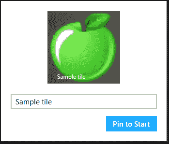

可以通过使用仅接受 ID 的`SecondaryTile`构造函数来检索辅助磁贴的唯一 ID。其他选项包括调用静态的`SecondaryTile::FindAllAsync`来获取应用程序创建的所有辅助磁贴的列表。

`SecondaryTile::RequestDeleteAsync`方法显示一个系统对话框，请求用户同意删除磁贴。

更新辅助磁贴与更新主磁贴（磁贴和徽章）的方式基本相同。唯一的区别在于更新器，使用`TileUpdateManager::CreateTileUpdaterForSecondaryTile`（用于磁贴更新）和`BadgeUpdateManager::CreateBadgeUpdaterForSecondaryTile`（用于徽章更新）创建。

### 激活辅助磁贴

当点击辅助磁贴时，应用程序会像平常一样启动。由于辅助磁贴应该提供对应用程序内特定位置的快捷方式，因此必须在`Application::OnLanuched`重写中识别和处理这种情况。以下是一个在启动时查找传递参数的示例代码：

```cpp
if(args->Arguments != nullptr) {
  // assume arguments are from secondary tiles only
  rootFrame->Navigate(TypeName(DeepPage::typeid), 
    args->Arguments);
}
```

代码假定`DeepPage.xaml`是相关页面，以防检测到辅助磁贴激活。

# 使用 Toast 通知

**Toast**是小弹出窗口，显示与应用程序相关的重要信息，可能在此时正在运行，也可能不在运行。它出现在屏幕的右上角-用户可以点击（或点击）它来运行或切换到应用程序，或者用户可以关闭（解散）Toast，因为现在不重要，或者如果用户现在不在电脑前，Toast 将在几秒钟后消失，使用户错过 Toast。

Toast 通知有些具有侵入性，因为它们会弹出，而不管当前执行的应用程序是什么（当前应用程序可以是经典桌面，甚至是锁定屏幕）。这意味着 Toast 应该谨慎使用，只有在真正有意义的地方才应该使用。典型的用法是在聊天应用程序中通知用户有新消息或新电子邮件。

可以按应用程序基础关闭应用程序的提示通知，方法是选择**设置**魅力，然后选择**权限**。也可以通过转到**Windows PC**设置并选择**通知**来全局禁用提示通知。

要使提示通知起作用，应用程序应在其清单中声明其具有提示功能（在 Visual Studio 的清单视图中的**应用程序 UI**选项卡）：

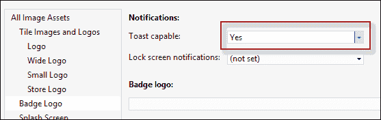

引发提示通知与磁贴有些类似。首先，我们使用`ToastTemplateType`枚举选择一个预定义的模板，然后基于该模板构建一个适当的 XML（内容可通过`ToastNotificationManager::GeTemplateContent`方法获得）。接下来，我们创建一个`ToastNotification`对象，传递最终的 XML。最后，我们调用`ToastNotificationManager::CreateToastNotifier()->Show`，传递`ToastNotification`对象。

## 提示选项

可以使用`ScheduledToastNotification`类将提示通知安排到将来的时间点，而不是使用`ToastNotification`。构造函数的第二个参数是一个`DateTime`值，指示何时引发提示。为了使其编译并正确工作，`Show`方法必须替换为`AddToSchedule`。

`ScheduledToastNotification`的第二个构造函数提供了一种显示定期提示的方法，弹出之间有时间间隔（1 分钟到 60 分钟之间），并且显示提示的次数（1 到 5 次）。

提示可以是标准的（显示 7 秒）或长的（显示 25 秒）。当提示的另一端有人时，例如来电时，长提示是合适的。要设置它，必须在提示 XML 中设置`duration`属性为`long`。

提示在显示时会播放默认的声音效果。这个效果可以更改为 Windows 提供的一组预定义声音中的一个。同样，这是通过添加一个`audio`元素来实现的，其中`src`属性设置为预定义的声音字符串之一（查看完整列表的文档）。

# 推送通知

正如我们所见，应用程序可以以任何合理的方式设置其磁贴（和可选的辅助磁贴）；如果收到新信息，甚至可以更新磁贴。但是，如果应用程序被挂起会发生什么？它如何更新其磁贴？更糟糕的是，应用程序可能根本没有运行。它的磁贴如何更新？想象一下一个新闻应用程序可能希望其磁贴反映最近的新闻。

一种方法是使用推送通知。顾名思义，通知是由服务器推送到设备上的，该设备可能正在运行应用程序，也可能没有。这与拉模型相反，其中应用程序的某个部分轮询某个服务器以获取新信息。推送通知是节能的，并且不需要应用程序做任何特殊的事情（除了首先注册通知，我们马上就会看到）来获取通知。

## 推送通知架构

推送通知涉及多个参与者，应用程序只是其中之一。推送通知本身是从由微软提供的服务发送的，即托管在 Windows Azure 上的**Windows 通知服务**（**WNS**）。另一个主要实体是一个应用程序服务器，它具有逻辑或适当地受控以实际发起推送通知。在新闻应用程序示例中，这将是一个接收新闻更新然后使用推送通知向所有注册的客户端应用程序传播它们的服务器。

推送通知架构总结在以下图表中：

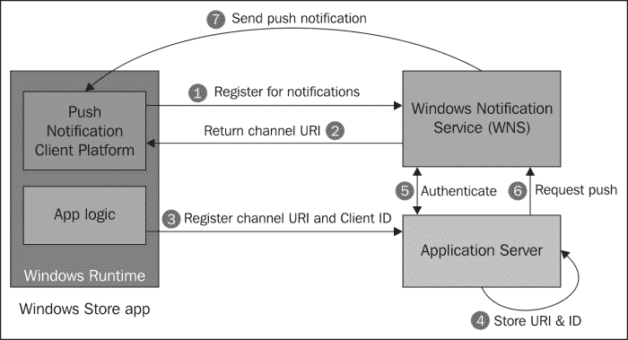

设置推送通知的基本步骤如下：

1.  Windows Store 应用程序必须注册以接收通知。它使用 WinRT API 调用 WNS 并请求一个唯一的通道 URI，该 URI 标识了此应用程序（技术上是主要磁贴）在此设备上的此用户。

1.  WNS 向应用程序返回一个唯一的通道 URI。

1.  应用程序需要将唯一的通道 URI 和一些唯一的客户端标识符传递给应用服务器。通常需要一个唯一的客户端 ID，因为通道 URI 可能会过期并且需要更新。客户端 ID 在应用服务器看来仍然是身份。

1.  应用服务器存储了所有已注册客户端的 URI 列表。稍后，当需要发送通知时，它将遍历列表并发送通知。

1.  应用服务器需要与 WNS 进行身份验证，并获得身份验证令牌以供使用作为推送通知有效负载的一部分。这是一次性操作，但可能需要重复，因为令牌可能在将来过期。

1.  最后，当应用服务器逻辑决定发送推送通知（或者由某个外部管理应用程序指示时），它将通知作为 HTTP POST 请求发送。

1.  WNS 接收请求并对客户端设备执行实际的推送通知。

推送通知可以更改动态磁贴（主磁贴或辅助磁贴），更改徽章，或使弹出式通知出现。它甚至可以发送原始的、特定于应用程序的通知，可以运行为应用程序注册的后台任务（后台任务将在本章后面讨论）。

在下一节中，我们将看到实现前述步骤以启动推送通知的示例。

## 构建推送通知应用程序

接收推送通知的第一步是从 WNS 获取唯一的 URI。这是一个相当简单的操作，涉及单个方法调用：

```cpp
create_task(PushNotificationChannelManager::
  CreatePushNotificationChannelForApplicationAsync()).then(
  this {
  _channel = channel;
```

调用返回一个`PushNoticationChannel`对象，该对象存储在`_channel`成员变量中以供以后使用。这些类型位于`Windows::Networking::PushNotifications`命名空间中。

下一步是将此 URI 注册到应用服务器，因此让我们首先看看该服务器。

### 应用服务器

应用服务器可以使用任何服务器端技术构建，可以在 Microsoft 堆栈内部或外部。典型的服务器将公开某种服务，客户端可以连接到该服务并注册其用于推送通知（也许还有其他用途）的唯一 URI。

例如，我们将构建一个托管在 IIS 中的 WCF 服务，该服务将公开一个适当的操作以实现此目的。该示例假定服务器管理电影信息并希望通知已注册的客户端有新电影可用。WCF 服务接口将如下所示：

```cpp
[DataContract(Namespace="")]
public class ClientInfo {
  [DataMember]
  public string Uri { get; set; }
  [DataMember]
  public string ClientID { get; set; }
}

[ServiceContract]
public interface IMovieService {
  [OperationContract, WebInvoke(UriTemplate="add")]
  void AddNewMovie(Movie movie);

  [OperationContract, WebInvoke(UriTemplate="register")]
  void RegisterForPushNotification(ClientInfo info);
}
```

`IMoviesService`有两个操作（建模为方法）：

+   `RegisterForPushNotification`用于将感兴趣的客户端注册为推送通知的目标。它传递了一个`ClientInfo`对象，其中包含了唯一的通道 URI（从上一步获取）和一些唯一的客户端 ID。

+   `AddNewMovie`操作稍后将由某个控制器应用程序调用，以指示有新电影可用，并因此调用推送操作（我们稍后会看到）。

### 注意

WCF（Windows Communication Foundation）是一种基于.NET 的技术，用于编写服务和服务客户端，超出了本书的范围，因为它与 Windows 8 商店应用没有直接关系。 WCF 将用于服务器端代码，因为它相当知名且易于使用，至少对于这些目的来说；代码自然是用 C#编写的。

这样的服务必须首先从 WNS 获取身份验证令牌，以便实际执行推送通知。实现这一点的第一步是注册 Windows 8 应用程序并获取两个信息：安全 ID 和秘钥。有了这些信息，我们可以联系 WNS 并请求一个令牌。要注册应用程序，我们必须浏览到[`manage.dev.live.com`](https://manage.dev.live.com)，使用我们的 Microsoft ID（以前是 Live ID）登录，点击**创建应用程序**，输入一些唯一的应用程序名称，然后点击**是**。

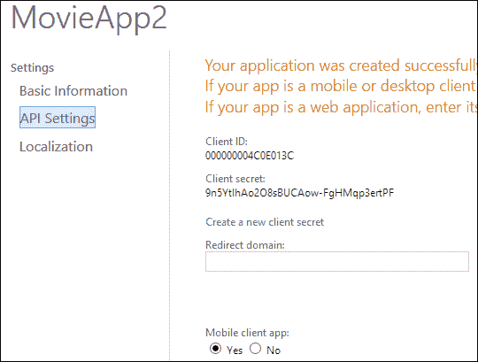

结果是一个**安全 ID**（**SID**）和一个秘密密钥：

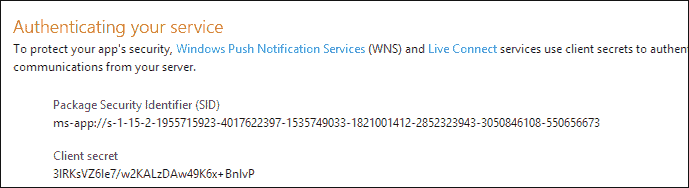

我们将复制这些并将它们存储为服务类实现中的简单常量或静态字段。应用程序名称本身必须复制到应用程序清单（在**打包**选项卡中），网页上概述了其他一些详细信息。为了使其中一些工作更容易，右键单击项目，选择**商店**，然后选择**将应用与商店关联**。这将把大部分信息输入到正确的位置：

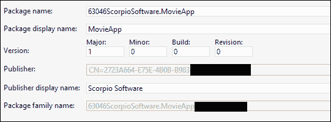

获取身份验证令牌的代码如下：

```cpp
private static void GetToken() {
  var body = string.Format
  ("grant_type=client_credentials&client_id={0}&client_secret={1}
  &scope=notify.windows.com",
  HttpUtility.UrlEncode(SID), HttpUtility.UrlEncode(Secret));

  var client = new WebClient();
  client.Headers.Add("Content-Type", 
     "application/x-www-form-urlencoded");
  string response = client.UploadString(new Uri(AuthUri), body);

  dynamic data = JsonConvert.DeserializeObject(response);
  _token = data.access_token; 
}
```

代码相当无聊。它使用所需的身份验证过程的特定格式。`WebClient`类提供了在.NET 中进行 HTTP 调用的简单方法。调用的结果是 JSON 对象的字符串表示，由`Newtonsoft.Json.JsonConvert`类进行反序列化。最后，`access_token`字段是我们需要的实际令牌，保存在静态变量`_token`中。

### 注意

`JsonConvert`是免费的`Json.NET`包的一部分，可以使用 Nuget 轻松安装（在 Visual Studio 中右键单击项目，选择**管理 Nuget 包...**，搜索`Json.Net`，然后单击**安装**。

`dynamic` C#关键字允许（除其他功能外）对对象进行无类型访问，通过延迟绑定到实际成员（如果存在）。编译器乐意将类型检查推迟到运行时，因此未识别的成员会引发运行时异常，而不是通常的编译时错误。

现在已经获得了令牌，可以用它来发送推送通知。

### 注意

身份验证令牌实际上可能会过期，可以通过检查实际推送通知的`POST`请求的响应来发现，查找`WWW-Authenticate`标头的`Token expired`值。在这种情况下，只需再次调用`GetToken`以获取新令牌。

现在服务器已经准备好了，客户端应用程序需要使用应用程序服务注册其唯一的通道 URI。

### 注册推送通知

理论上，这一步很容易。只需调用服务上的`RegisterForPushNotification`方法，传递所需的参数，然后完成。不幸的是，在 C++中这并不像我们希望的那样容易。

应用程序需要对服务进行正确的网络调用（通常通过 HTTP）。最简单的 HTTP 调用基于 REST，因此如果我们的服务配置为接受 REST over HTTP，那么它将更简单。

### 注意

**REST**（**表述状态转移**）超出了本书的范围。对于我们的目的，它意味着将信息编码为 HTTP URL 上的简单字符串，并使用请求正文传递更复杂的信息。这与更复杂的协议（如 SOAP）形成对比。

我们创建的 WCF 服务配置为接受 REST 调用，因为使用了`[WebInvoke]`属性，为每个请求设置了 URL 后缀。这还需要配置服务主机以使用`WebHttpBinding` WCF 绑定和`WebHttp`行为。这是通过`MovieWorld.svc`文件完成的，其中声明了服务：

```cpp
<%@ ServiceHost Language="C#" Debug="true" 
  Service="MoviesWorld.MovieService" 
  CodeBehind="MovieService.svc.cs" 
 Factory= "System.ServiceModel.Activation.WebServiceHostFactory" %>
```

`Factory`属性是重要的（非默认）部分。

下一个挑战是从 C++客户端应用程序中进行 REST（或任何 HTTP）调用。

不幸的是，在撰写本文时，没有简单的方法可以使用 WinRT 类进行 HTTP 调用，类似于.NET 中的`WebClient`和`HttpClient`。文档建议使用低级别的`IXMLHTTPRequest2` COM 接口来实现此目的。

尽管这肯定是可能的，但并不容易。幸运的是，微软创建了一个 C++包装类`HttpRequest`，它为我们大部分工作。我将该类复制到项目中，现在更容易进行 HTTP 调用。

### 注意

`HttpRequest` 实现在 `HttpRequest.h` 或 `HttpRequest.cpp` 文件中，属于 `MovieApp` 项目的一部分，可在本章可下载的源代码中找到。

这是注册应用程序接收推送通知的 HTTP 请求：

```cpp
Web::HttpRequest request;
wstring body = wstring(L"<ClientInfo><ClientID>123</ClientID><Uri>") + channel->Uri->Data() + L"</Uri></ClientInfo>";

return request.PostAsync(ref new Uri(
  "http://localhost:36595/MovieService.svc/register"), 
  L"text/xml", body);
```

主体由一个 `ClientInfo` 对象组成，以 XML 格式序列化，其中 `Uri` 元素包含在第一步获取的唯一通道 URI。这里的客户端 ID 被编码为常量 `123` 作为示例；在真实的应用程序中，这将作为此用户在此设备上的应用程序的唯一标识生成。奇怪的端口号是本地 IIS 监听的端口，我的服务托管在那里。同样，在真实的应用程序中，这将在端口 80（常规 HTTP）或 443（HTTPS）上进行。

### 注意

发出 HTTP 请求的另一种方法是使用 C++ REST SDK（Casablanca）库；这是在编写这些行时发布到 CodePlex 的。该库允许（除其他功能外）以一种简单和可定制的方式处理 HTTP 请求，与 .NET `HttpClient` 类有些相似。该 SDK 可以在 [`casablanca.codeplex.com/`](http://casablanca.codeplex.com/) 找到。

### 发布推送通知

当应用程序服务器收到对其 `AddNewMovie` 方法的调用时（作为服务器本身的某些逻辑的一部分，或者因为某个管理应用程序调用了该操作），它需要向所有注册的客户端发送推送通知：

```cpp
public void AddNewMovie(Movie movie) {
  _movies.Add(movie);
  foreach(var uri in _pushData.Values) {
    // push new movie to registered clients
    SendPushTileNotification(uri, movie);
  }
}
```

`SendPushTileNotification` 方法如下所示：

```cpp
private async Task SendPushTileNotification(string uri, Movie movie) {
  string body =
    "<tile>" +
    "<visual>" +
    "<binding template=\"TileSquareText01\">" +
    "<text id=\"1\">" + movie.Year + "</text>" +
    "<text id=\"2\">" + movie.Name + "</text>" +
    "</binding>" +
    "</visual>" +
    "</tile>";

  var client = new HttpClient();
  var content = new StringContent(body);
  content.Headers.ContentType = new  MediaTypeHeaderValue(
      "text/xml");
  client.DefaultRequestHeaders.Add("X-WNS-Type", "wns/tile");
  client.DefaultRequestHeaders.Add("Authorization", 
    string.Format("Bearer {0}", _token));
  await client.PostAsync(uri, content);
}
```

消息的主体是一个常规的 XML 磁贴。在这种情况下，它包括两行文本：

+   第一个包含电影发布年份

+   第二个包括电影名称

通知是基于唯一通道 URI 的 HTTP `POST` 请求，具有一些必须正确设置的特定标头。还要注意之前从 WNS 获取的身份验证令牌的使用。

### 注意

`await` C# 关键字允许等待异步操作而不阻塞调用线程。这类似于我们使用 `task`<T>` 类和 `then` 方法。C# 看起来仍然更容易使用。

通过将 `X-WNS-Type` 标头更改为 `wns/toast` 和 `wns/badge`，通知类型可以更改为 toast 或 badge。主体自然也必须相应地修改。

### 注意

本章的示例代码包括一个名为 `MovieManager` 的项目，用于添加生成推送通知的新电影。

这是原始应用程序磁贴（左）和推送通知新电影后的磁贴：

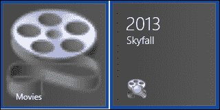

### 注意

最近提供的 Windows Azure 移动服务提供了更简单的方式来维护推送通知客户端并发送通知本身（以及其他有用的功能）。移动服务不在本书的范围之内，但可以在 [`www.windowsazure.com/en-us/develop/mobile/`](http://www.windowsazure.com/en-us/develop/mobile/) 找到更多信息。

## 辅助磁贴的推送通知

辅助磁贴也可以成为推送通知的目标。主要区别在于客户端应用程序获取唯一通道 URI 的方式。它使用 `CreatePushNotificationChannelForSecondaryTileAsync` 与磁贴 ID，而不是 `CreatePushNotificationChannelForApplicationAsync`（`PushNotificationChannelManager` 类的两个静态方法）。

# 后台任务

当用户切换到另一个应用程序时，Windows Store 应用程序可能会被挂起。即使应用程序被挂起甚至终止，应用程序可能仍然希望发生一些工作。这是后台任务的工作。

## 什么是任务？

**任务** 只是实现 `Windows::ApplicationModel::Background::IBackgroundTask` 接口的类，只有一个方法 `Run`。这个类必须放在与主应用程序不同的项目中，即 **Windows Runtime Component** 类型的项目中。这是必不可少的，因为任务在一个单独的进程中运行，因此不能与主应用程序绑定（因此，如果主应用程序被挂起，它们也不会被挂起）。

主应用程序需要引用包含任务的项目，并通过其清单指示这些确实是其任务。

### 注意

应用程序可以在一个或多个 Windows Runtime 组件项目中实现任意数量的任务。

任务必须有一个触发器，指定触发任务执行的条件。任务还可以具有零个或多个必须为触发器指定的条件。

### 注意

只能将一个触发器与任务关联，但可以注册另一个使用相同代码运行的任务，但配置了不同的触发器。这有效地创建了一个可以使用多个触发器运行的任务。

## 创建和注册任务

创建任务的第一步是创建一个实现`IBackgroundTask`接口的类的 Windows Runtime 组件项目，如下所示：

```cpp
namespace Tasks {
  using namespace Windows::ApplicationModel::Background;

  [Windows::Foundation::Metadata::WebHostHidden]
  public ref class SimpleTask sealed : IBackgroundTask {
  public:
    virtual void Run(IBackgroundTaskInstance^ taskInstance);
  };
}
```

接下来，我们需要从主应用程序项目中添加对任务组件的引用。最后一个前提是将任务添加到主应用程序的清单中。这是在**声明**选项卡中完成的：

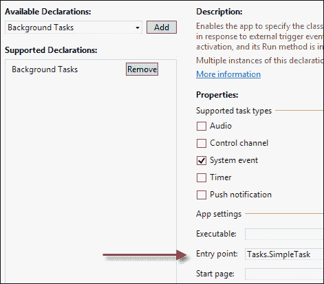

通过选择适当的任务类型选择了后台任务声明，这大致意味着触发器类型，稍后将在实际代码中使用。我们将在稍后讨论触发器。

**入口点**字段必须设置为实现后台任务的完整类名（在本例中为`Tasks::SimpleTask`）。

结果是清单 XML 中`<extensions>`部分的一个条目：

```cpp
<Extensions>
  <Extension Category="windows.backgroundTasks" 
    EntryPoint="Tasks.SimpleTask">
    <BackgroundTasks>
      <Task Type="systemEvent" />
    </BackgroundTasks>
  </Extension>
</Extensions>
```

主应用程序必须在启动时进行实际任务注册，并且只能执行一次。使用现有任务名称注册任务会引发异常。

注册涉及`BackgroundTaskBuilder`类和一个带有可选条件的触发器类。这是注册在上述代码片段中定义的`SimpleTask`以在 Internet 连接可用时执行的一段代码：

```cpp
auto trigger = ref new SystemTrigger(
  SystemTriggerType::InternetAvailable, false);
auto condition = ref new SystemCondition(
  SystemConditionType::InternetAvailable);

auto builder = ref new BackgroundTaskBuilder();
builder->Name = "Simple";
builder->TaskEntryPoint = "Tasks.SimpleTask";
builder->SetTrigger(trigger);
builder->AddCondition(condition);
auto task = builder->Register();
```

必须为任务选择一个触发器；在本例中，它是通用的`SystemTrigger`，基于`SystemTriggerType`枚举，其值包括`InternetAvailable`、`UserPresent`、`UserAway`、`SmsReceived`、`TimeZoneChange`等。

条件是可选的；`SystemCondition`目前是唯一可用的条件，但它也是通用的，使用`SystemConditionType`枚举。值包括`InternetAvailable`、`InternetUnavailable`、`UserPresent`、`UserNotPresent`等。

`BackgroundTaskBuilder`保存了触发器和条件信息，以及任务名称和入口点。然后调用`Register`实际上向系统注册（返回一个`BackgroundTaskRegistration`对象）。

## 实现任务

让我们使用一个允许用户输入数据并将数据保存在本地文件夹中的应用程序。如果用户连接到互联网，后台任务应该对生成的文件进行一些处理，例如将它们上传到服务器，进行一些计算等。最终，任务将在处理后删除文件。

以下是主应用程序用于将一些数据保存到文件的简单代码：

```cpp
auto root = ApplicationData::Current->LocalFolder;

create_task(root->CreateFolderAsync("Movies", 
  CreationCollisionOption::OpenIfExists)).then([](
  StorageFolder^ folder) {
    return folder->CreateFileAsync("movie", 
    CreationCollisionOption::GenerateUniqueName);
  }).then([](StorageFile^ file) {
    // build data to write
    return file->OpenAsync(FileAccessMode::ReadWrite);
  }).then(this {
    wstring data = wstring(L"<Movie><Name>") + 
    _movieName->Text->Data() + L"</Name><Year>" + 
    _year->Text->Data() + L"</Year></Movie>";
    auto writer = ref new DataWriter(stm);
    writer->WriteString(ref new String(data.c_str()));
    return writer->StoreAsync();
  }).then(this {
  _movieName->Text = "";
  _year->Text = "";
});
```

文件保存在`LocalFolder`下名为`Movies`的子文件夹中。

任务共享应用程序的本地文件夹，有效地使其成为一种通信机制。这是任务的`Run`方法实现：

```cpp
void SimpleTask::Run(IBackgroundTaskInstance^ taskInstance) {
  auto root = ApplicationData::Current->LocalFolder;
  Platform::Agile<BackgroundTaskDeferral^> deferral(
  taskInstance->GetDeferral());
  create_task(root->GetFolderAsync("Movies")).
    then([](StorageFolder^ folder) {
    return folder->GetFilesAsync(
    CommonFileQuery::DefaultQuery);
    }).then([](IVectorView<StorageFile^>^ files) {
    int count = files->Size;
    for(int i = 0; i < count; i++) {
      auto file = files->GetAt(i);
      // process each file...
      file->DeleteAsync();
    }
  }).then(deferral {
    t.get();
    // error handling omitted
    deferral->Complete();
  });
}
```

任务首先获取`LocalFolder`位置。在实际处理开始之前，它通过调用`IBackgroundTaskInstance::GetDeferral`获取了一个*延期*对象。为什么？

当`Run`方法终止时，任务通常被视为已完成。但是，如果实现调用任何异步操作，则该方法会更早地返回给其调用者，使任务完成。获得延期实际上会推迟任务完成，直到调用`BackgroundTaskDeferral::Complete`时。

接下来是实际的文件处理。使用`StorageFolder::GetFilesAsync`枚举`Movies`文件夹中的所有文件，并在每次虚拟处理后删除文件。只有在整个任务完成后，才能调用延迟的`Complete`方法来指示任务已完成。

## 任务调试

在开发环境中，可用的触发器和条件并不容易满足。我们不想断开并重新连接互联网；也不想等待 15 分钟直到`TimeTrigger`的任务被执行。

Visual Studio 提供了一种在任何时候调用任务以进行调试的方法。这个功能位于与暂停和恢复相同的工具栏按钮中：

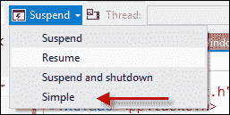

如果我们在任务的`Run`方法中设置断点，我们可以像平常一样调试任务。`BackgroundTaskHost.exe`是托管应用程序任务的进程实例。这个事实可以在调试器的**进程**工具栏按钮或 Windows 任务管理器中查看。

## 任务进度和取消

后台任务可以在主应用程序运行时运行。其中一件可能做的事情是从后台任务的角度指示其进度。这是使用`IBackgroundTaskInstance::Progress`属性完成的。如果主应用程序没有运行，没有人在乎。如果它正在运行，它可以注册`Progress`事件（作为成功注册任务时返回的`IBackgroundTaskRegistration`的一部分）并根据进度更新 UI。

当任务完成时，`IBackgoundTaskRegistration::Completed`事件触发，以便主应用程序知道任务已完成。如果主应用程序当前被挂起，它将在恢复时收到通知。

在某些情况下，Windows 可能会取消正在运行的任务。`IBackgroundTaskInstance`公开了一个`Canceled`事件，任务可以注册。如果任务被取消，必须在 5 秒内返回，否则将被终止。`Canceled`事件提供了一个指定任务被取消原因的`BackgroundTaskCancellationReason`。示例包括`ServiceUpdate`（主应用正在更新）和`LoggingOff`（用户正在注销系统）。

例如，我们可以使用 Win32 事件通知我们的任务已经被请求取消。首先，我们创建事件对象并注册`Canceled`事件：

```cpp
void SimpleTask::Run(IBackgroundTaskInstance^ taskInstance) {
  if(_hCancelEvent == nullptr) {
    _hCancelEvent = ::CreateEventEx(nullptr, nullptr, 0, 
    EVENT_ALL_ACCESS);
    taskInstance->Canceled += 
    ref new BackgroundTaskCanceledEventHandler(
    this, &SimpleTask::OnCancelled);
  }
```

`_hCancelEvent`是一个`HANDLE`类型，使用`CreateEventEx`创建。然后`Canceled`事件与一个私有的`OnCancelled`方法相关联。

### 注意

经典的 Win32 API `CreateEvent`不能使用，因为在 WinRT 中是非法的。`CreateEventEx`是在 Windows Vista 中引入的，并且可以被视为`CreateEvent`的超集。

如果任务被取消，我们设置 Win32 事件：

```cpp
void SimpleTask::OnCancelled(IBackgroundTaskInstance^ instance, 
  BackgroundTaskCancellationReason reason) {
  ::SetEvent(_hCancelEvent);
}
```

任务的主要处理代码应该尽快检查 Win32 事件并退出：

```cpp
for(int i = 0; i < count; i++) {
  auto file = files->GetAt(i);
  if(::WaitForSingleObjectEx(_hCancelEvent, 0, FALSE) == 
    WAIT_OBJECT_0)
   // cancelled
    break;
    // process each file...
    file->DeleteAsync();
}
```

使用零超时调用`WaitForSingleObject`只是检查事件的状态。如果它被标记，返回值是`WAIT_OBJECT_0`（否则，返回值是`WAIT_TIMEOUT`）。

## 播放后台音频

一些应用程序播放音频，用户期望即使用户切换到另一个应用程序，音频也能继续播放；例如，音乐播放应用程序应该一直播放，直到用户要求停止。语音通话应用程序（如 Skype）应该在用户切换到另一个应用程序时保持对方的音频。这就是后台音频任务的用武之地。

### 播放音频

通过使用`MediaElement`控件（也可以播放视频），可以轻松实现音频播放。它应该放置在 XAML 的某个位置，以便它成为可视树的一部分，尽管在播放音频时它没有可见部分。

通过设置要使用`Source`属性播放的 URI（或通过调用`SetSource`方法从`FileOpenPicker`获取的文件），可以实现实际的播放。除非将`AutoPlay`属性设置为`false`，否则播放会立即开始。

控制播放是通过`MediaElement`的`Play`、`Pause`和`Stop`方法完成的。以下是从`FileOpenPicker`获取的音频文件的示例。首先是`MediaElement`和播放控制的基本 UI：

```cpp
<Grid>
  <Grid.RowDefinitions>
    <RowDefinition Height="Auto" />
    <RowDefinition Height="Auto" />
    <RowDefinition Height="Auto" />
  </Grid.RowDefinitions>
  <MediaElement x:Name="_media" />
  <Button Content="Select Audio File..." FontSize="30" Margin="10" 
    Click="OnSelectMediaFile" />
    <StackPanel Orientation="Horizontal" Grid.Row="2" 
    Margin="10,30">
    <Button Content="Play" FontSize="40" Click="OnPlay" 
    Margin="8"/>
    <Button Content="Pause" FontSize="40" Click="OnPause" 
    Margin="8"/>
    <Button Content="Stop" FontSize="40" Click="OnStop" 
    Margin="8"/>
  </StackPanel>
</Grid>
```

`OnSelectedMediaFile`的实现如下：

```cpp
auto picker = ref new FileOpenPicker();
picker->FileTypeFilter->Append(".mp3");
create_task(picker->PickSingleFileAsync()).
  then(this {
    if(file == nullptr)
      throw ref new OperationCanceledException();
      return file->OpenReadAsync();
  }).then(this {
  _media->SetSource(stm, "");
  }).then([](task<void> t) {
  try {
    t.get();
  }
  catch(Exception^ ex) {
  }
});
```

现在大部分代码应该是熟悉的。`FileOpenPicker`的过滤器设置为 MP3 文件，一旦选择，调用`MediaElement::SetSource`准备好音频流进行播放。

播放流只是调用`MediaElement::Play`在`Play`按钮的`Click`处理程序中的问题：

```cpp
void MainPage::OnPlay(Object^ sender, RoutedEventArgs^ e) {
  _media->Play();
}
```

通过调用`MediaElement::Pause`和`MediaElement::Stop`来实现`OnPause`和`OnStop`。

现在运行应用程序可以选择一个 MP3 文件并播放它。然而，切换到另一个应用程序会立即停止播放。

### 维护背景音频

使应用程序在后台继续自动播放需要几个步骤。

首先，必须修改应用程序清单以指示需要背景音频；这是通过添加**后台任务**声明并设置**音频**复选框来完成的：

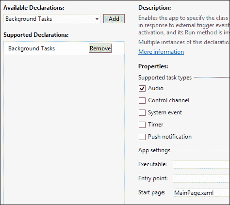

另一个必需的步骤是设置**开始**页面，如前面的屏幕截图所示。下一步需要添加一些代码：

+   `MediaElement::AudioCategory`属性必须设置为`AudioCategory::BackgroundCapableMedia`（用于一般背景播放）或`AudioCategory::Communications`（用于点对点通信，如聊天）。

+   注册`Windows::Media::MediaControl`类的静态事件，指示可能由其他应用程序使用音频播放而导致的更改。

首先，我们将更改`MediaElement`的`AudioCategory`属性：

```cpp
<MediaElement x:Name="_media" AudioCategory="BackgroundCapableMedia"/>
```

此设置的结果使应用程序永远不会进入暂停状态。

接下来，我们将注册所需的事件：

```cpp
MediaControl::PlayPressed += ref new EventHandler<Object^>(
  this, &MainPage::OnPlayPressed);
MediaControl::PausePressed += ref new EventHandler<Object^>(
  this, &MainPage::OnPausePressed);
MediaControl::StopPressed += ref new EventHandler<Object^>(
  this, &MainPage::OnStopPressed);
MediaControl::PlayPauseTogglePressed += 
  ref new EventHandler<Object^>(
  this, &MainPage::OnPlayPauseTogglePressed);
```

这些事件是由系统触发的，当播放状态由于系统提供的媒体控制而发生变化时，可以通过某些键盘和其他手势访问：

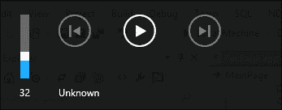

对这些事件的反应并不困难。以下是`PlayPressed`和`PlayPauseTogglePressed`事件的代码：

```cpp
void MainPage::OnPlayPressed(Object^ sender, Object^ e) {
  Dispatcher->RunAsync(CoreDispatcherPriority::Normal, 
    ref new DispatchedHandler([this]() {
    MediaControl::IsPlaying = true;
    _media->Play();
  }));
}

void MainPage::OnPlayPauseTogglePressed(Object^ sender, Object^ e) {
  Dispatcher->RunAsync(CoreDispatcherPriority::Normal, 
  ref new DispatchedHandler([this]() {
    if(_media->CurrentState == MediaElementState::Playing) {
      MediaControl::IsPlaying = false;
      _media->Pause();
    }
    else {
      MediaControl::IsPlaying = true;
      _media->Play();
    }
  }));
}
```

通知被处理为应用程序播放或暂停播放所需的命令；正确的实现确保系统上所有音频播放的一致行为。

### 注意

请注意，事件在线程池线程上到达，由于需要触摸`MediaElement`，因此调用必须使用`CoreDispatcher::RunAsync`方法调度到 UI 线程。

处理`PausePressed`和`StopPressed`事件是类似的。

如果适当的话，`MediaControl`类的其他事件也可以被处理，例如`NextTrackPressed`和`PreviousTrackPressed`。

### 声音级别通知

如果后台应用程序正在播放音频，另一个前台应用程序开始播放音频，系统会向后台应用程序发送`MediaControl::SoundLevelChanged`事件。此事件通过查看`MediaControl::SoundLevel`属性指示了后台应用程序的声音发生了什么。可能的值有：

+   `Muted`：应用程序的声音已被静音，因此应用程序应该暂停其播放。这通常意味着前台应用程序正在播放音频。

+   `Low`：应用程序的声音级别已经降低。这表明 VoIP 呼叫进来，降低了应用程序的声音级别。应用程序可能希望暂停播放，直到另一个`SoundLevelChanged`事件触发，指示完全音量。

+   `Full`：应用程序的声音是最大音量。如果应用程序正在播放音频并且必须暂停它，现在是恢复播放的时候了。

注册参加此活动是可选的，但可以增强用户体验，并且表明应用程序行为良好。

## 锁屏应用程序

锁屏（在用户登录之前或设备被锁定时）最多可以容纳七个应用程序 - 这些应用程序可以有一个图标（甚至一个文本消息）；这些应用程序被称为锁屏应用程序。可以通过控制面板|**PC 设置**|**个性化**来配置七个可能的应用程序：

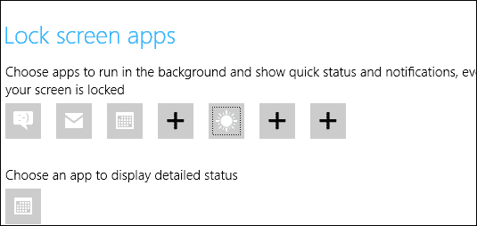

系统认为锁屏应用程序更重要（因为它们对用户更重要），因此具有一些非锁屏应用程序无法获得的功能。例如，某些触发器类型只适用于锁屏应用程序：

+   `TimeTrigger`可用于定期执行任务（最短间隔为 15 分钟）。

+   `PushNotificationTrigger`可用于接收导致任务执行的原始推送通知（原始意味着任何字符串，与磁贴、弹出通知或徽章无关）。

+   `ControlChannelTrigger`可用于与远程服务器保持实时连接，即使应用程序被挂起；对即时通讯或视频聊天应用程序很有用。

### 注意

最后两种触发器类型使任务实际上在应用程序进程中运行，而不是在标准任务托管进程中运行。

实际上还有另一个与时间相关的触发器，`MaintenanceTrigger`。这个不需要锁屏应用程序，但只有在设备连接到交流电源时才起作用。如果断开连接，任务将不会运行。如果在任务执行时断开连接，任务将被取消。

要使应用程序具有锁屏功能，需要设置一些事项：

+   必须为应用程序设置一个宽标志。

+   徽章标志也必须设置好；这是在应用程序的锁屏上显示的默认图像。

+   必须声明至少一个后台任务（使用 Visual Studio 中的清单**声明**选项卡），该任务使用推送通知触发器、时间触发器或控制通道触发器。

+   **锁屏通知**选项必须设置为**徽章**或**带有磁贴文本的徽章**：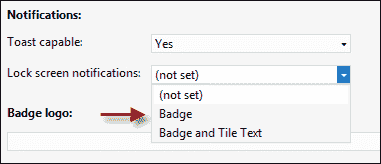

## 请求设置锁屏应用

尽管用户可以转到应用程序的设置并将其设置为锁定屏幕应用程序，或者转到 Windows 个性化部分并执行相同操作。如果应用程序通过系统提供的对话框询问用户是否可以成为锁屏应用程序，这样更容易。这是通过`BackgroundExecutionManager::RequestAccessAsync`静态方法调用来实现的。异步调用的结果指定用户是否接受了建议（`BackgroundAccessStatus`枚举）。

### 注意

如果用户拒绝，当应用程序再次运行时对话框不会弹出；如果重新安装应用程序，它将再次弹出。

## 锁屏应用的其他常见操作

锁屏应用程序通常在应用程序的生命周期内执行以下操作：

+   发送徽章更新（显示在锁屏上）

+   发送磁贴更新

+   接收和处理用于执行特定应用程序逻辑的原始推送通知

+   弹出通知（即使在锁屏上也显示）

这些操作的确切细节超出了本书的范围（尽管徽章、磁贴和弹出通知的更新机制与已经讨论过的类似）；更多细节可以在 MSDN 文档中找到。

## 后台任务限制

在执行时，后台任务与当前运行的前台应用程序竞争 CPU 和网络资源，因此它们不能以任意长度的时间运行；前台应用程序是最重要的。任务受以下约束条件的约束：

+   锁屏应用程序每 15 分钟获得 2 秒的 CPU 时间（实际运行时间，而不是挂钟时间）。

+   非锁屏应用程序每 2 小时接收 1 秒的 CPU 时间（实际运行时间）。

+   当设备运行在交流电源上时，网络资源是无限的。否则，根据能源消耗可能会有一些限制。

+   使用`ChannelControlTrigger`或`PushNotificationTrigger`配置的任务会收到一些资源保证，因为它们被认为更重要。

此外，有一个全局的 CPU 和网络资源池，可以被任何应用程序使用。这个池每 15 分钟重新填充一次。这意味着即使一个任务需要超过 1 秒的时间来运行（非锁屏应用程序），它也可能获得额外的 CPU 时间，前提是池没有耗尽。当然，任务不能依赖这个池，因为其他任务可能已经耗尽了它。

# 后台传输

在这一点上应该很清楚，一个挂起的应用程序本身无法做任何事情，除非它有一些代表它工作的后台任务。应用程序可能需要执行的操作之一是下载或上传文件。如果应用程序被挂起，下载或上传操作无法继续。如果应用程序被终止，已经下载的内容会消失。显然，必须有更好的方法。

WinRT 提供了一种进行后台传输（下载和上传）的方法，即使应用程序被挂起，也可以使用一个单独的进程来执行实际的传输（`BackgroundTransferHost.exe`）。这种能力允许应用程序进行长时间的传输，而不需要用户在整个传输时间内一直待在应用程序中。

## 示例 - 下载文件

以下是一个简单的示例，它启动了一个针对用户文档位置中的文件的下载操作（省略了错误处理）：

```cpp
wstring filename(_url->Text->Data());
auto index = filename.rfind(L'/');
filename = filename.substr(index + 1);
create_task(
KnownFolders::DocumentsLibrary->CreateFileAsync(
  ref new String(filename.c_str()), 
CreationCollisionOption::GenerateUniqueName)).then(this {
  auto downloader = ref new BackgroundDownloader();
  auto operation = downloader->CreateDownload(
  ref new Uri(_url->Text), file);
  return operation->StartAsync();
});
```

代码假设`_url`是一个`TextBox`，用户在其中输入了要下载的文件的 URL。首先，根据 URL 的最后一个斜杠后的短语创建文件名。然后，在用户的文档文件夹中创建文件。请注意，要获得这个功能，必须在清单中声明，并且对于文档库，至少必须选择一个文件扩展名：

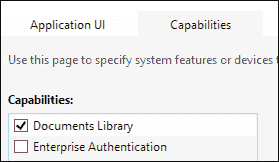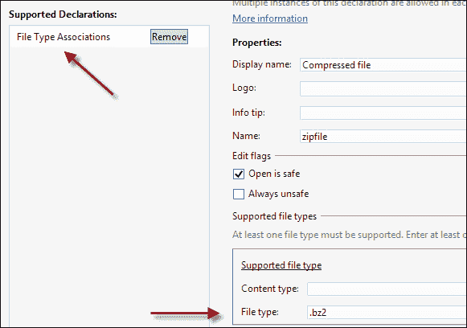

### 注意

对于`Video`、`Music`和`Pictures`库，不需要声明文件关联。

接下来，创建一个`BackgroundDownloader`实例，并调用其`CreateDownload`方法，传递要下载的 URL 和目标文件。这个调用返回一个`DownloadOperation`对象，而不会实际开始下载。要开始下载，调用`DownloadOperation::StartAsync`。

在下载进行时，了解其进度是很有用的。以下是一个修改后的代码，用于设置进度报告（与`StartAsync`调用的区别在于）：

```cpp
auto async = operation->StartAsync();
async->Progress = 
  ref new AsyncOperationProgressHandler<DownloadOperation^, 
  DownloadOperation^>(this, &MainPage::OnDownloadProgress);
return async;
```

在这种情况下，我们实际上是在查看`StartAsync`的结果，它返回一个实现`IAsyncOperationWithProgress<DownloadOperation, DownloadOperation>`的对象，并且我们使用适当的委托设置了`Progress`属性：

```cpp
void 
MainPage::OnDownloadProgress(IAsyncOperationWithProgress<DownloadOperation^, DownloadOperation^>^ operation, 
  DownloadOperation^ download) {
  auto progress = download->Progress;
  Dispatcher->RunAsync(CoreDispatcherPriority::Normal, 
    ref new DispatchedHandler([progress, this]() {
    _progress->Maximum = 
  double(progress.TotalBytesToReceive >> 10);
    _progress->Value = double(progress.BytesReceived >> 10);
    _status->Text = progress.Status.ToString();
  }));
}
```

`DownloadOperation::Progress`属性返回一个简单的结构（`BackgroundDownloadProgress`），其中包括`TotalBytesToReceive`、`BytesReceived`和`Status`（`Running`、`Completed`、`Cancelled`等）。前面的代码使用这些值来控制`ProgressBar`控件（`_progress`）和`TextBlock`（`_status`）。

请注意，通知不会到达 UI 线程，因此对 UI 的任何更新都必须通过使用`Page::Dispatcher`属性（类型为`Windows::UI::Core::CoreDispatcher`）将其调度到 UI 线程，方法是使用接受在 UI 线程上执行的委托的`RunAsync`调用。

如果应用程序被终止，传输也会停止，但到目前为止下载的数据不会丢失。当应用程序再次启动时，它的工作是查找所有未完成的传输并恢复它们。这可以通过调用静态的`BackgroundDownloader::GetCurrentDownloadsAsync`来实现，获取一个未完成下载的列表，然后附加到每一个（例如，进度报告），当然，恢复下载。

### 注意

您可以在[`code.msdn.microsoft.com/windowsapps/Background-Transfer-Sample-d7833f61`](http://code.msdn.microsoft.com/windowsapps/Background-Transfer-Sample-d7833f61)找到这方面的完整示例。

# 摘要

Windows 商店应用程序在许多方面都不同于桌面应用程序。本章涉及应用程序的生命周期 - 应用程序可能会被暂停甚至终止，所有这些都由操作系统控制。

磁贴、徽章更新和弹出通知是 Windows 商店应用程序的一些更独特的功能，桌面应用程序没有这些功能（尽管桌面应用程序可以创建自己的类似弹出通知）。明智地使用这些功能，可以为商店应用程序增加很多吸引力，频繁地吸引用户进入应用程序。

后台任务提供了一种绕过非自愿暂停/终止情况的方法，以便即使应用程序不在前台时也能保持一定的控制。不过，这是相当受限制的，以保持主要应用程序的响应性和良好的电池寿命。任务是非常重要的非平凡应用程序的重要组成部分，因此应该明智地使用。

在下一章中，我们将探讨 Windows 商店应用程序如何通过实现合同和扩展与 Windows 更好地集成，并间接地与其他应用程序进行通信。
