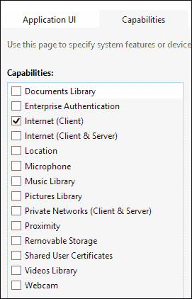
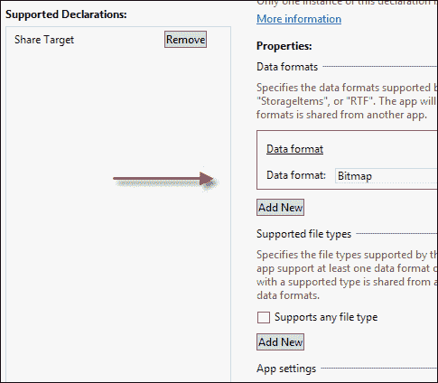
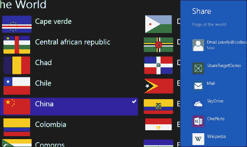
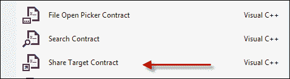
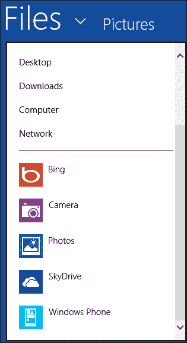
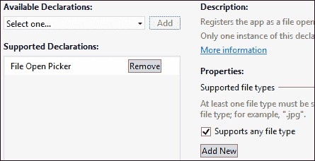
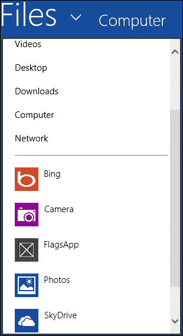
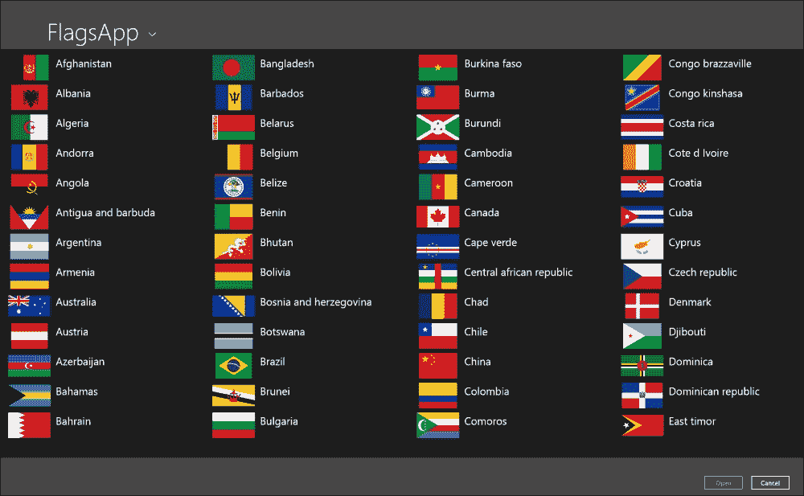
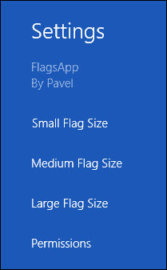

# 第八章：合同和扩展

Windows Store 应用程序在一个称为**AppContainer**的严格沙箱中运行。该容器不允许应用程序直接与机器上的其他应用程序通信（例如 Win32 内核对象句柄和共享内存）。从某种意义上讲，这是有道理的，因为应用程序不能假设安装自商店的计算环境的任何内容，除了应用程序请求的 CPU 架构和功能。没有办法确切地知道应用程序是否存在，即使有办法，也没有好的方法来确保它实际上可以与这个应用程序通信。

相反，Windows 为应用程序之间的通信定义了一组合同。这些合同允许应用程序实现一些功能，而不知道将使用它的其他应用程序是哪个。这些合同是明确定义的，并且在操作系统的帮助下进行必要的连接，它们允许应用程序间接通信。我们将在本章中研究一些常见的合同。

应用程序还可以为操作系统提供的某些功能提供“插件”。这些“插件”称为扩展，我们将看一下其中的一个，即设置扩展。

# 功能

Windows Store 应用程序不能直接与其他应用程序通信，但是系统本身呢？文件、文件夹或设备呢？事实证明，默认情况下，这些也受到限制，必须在应用程序安装时由用户授予权限。

应用程序必须声明所有由 Windows 定义的预期系统使用，作为用户必须同意的内容。这些是**功能**，是应用程序清单的一部分。Visual Studio 在其清单视图中提供了功能的图形视图，我们在之前的章节中已经使用过：



图像显示了当前支持的所有功能。默认情况下，只启用了一个功能：进行出站网络调用的能力。

必须明确请求访问用户的“我的”库（文档、图片、视频和音乐），否则在访问时将抛出“访问被拒绝”的异常；文档库还要求应用程序指定其接受的文件类型。

设备访问自然是一个问题，由**麦克风**、**网络摄像头**、**位置**和**接近度**等功能表示。

请注意，没有能够授予应用程序访问 Windows 系统文件夹（如`Program Files`、`System32`等）的功能；这对于 Windows Store 应用程序来说是不可能的，也应该是如此。没有应用程序需要这样高权限的访问。

# 合同

合同由 Windows 为应用程序之间的通信定义；这是一种由操作系统调解的应用程序之间的协议，允许应用程序间接通信。让我们看看两个常见合同的例子。

## 分享合同

**共享合同**在一个是**共享源**（有东西可以共享）的应用程序和一个**共享目标**应用程序（想要对共享的数据进行操作）之间运作。一个应用程序可以是共享源、共享目标，或者两者兼有。

通常通过使用共享魅力来启动共享。当从共享源应用程序激活时，Windows 会提供一个可能的目标应用程序列表——所有实现共享目标合同并至少接受源提供的一种数据类型的安装应用程序。让我们看看如何创建共享源和共享目标。

### 分享源

成为共享源比成为共享目标更容易。共享源需要通知 Windows 它可以提供任何潜在数据。共享所需的大部分工作都在`Windows::ApplicationMode::DataTransfer`命名空间中。

共享源在应用程序或主页面初始化时必须注册`DataTransferManager::DataRequested`事件，代码如下：

```cpp
DataTransferManager::GetForCurrentView()->DataRequested += 
   ref new TypedEventHandler<DataTransferManager^, 
   DataRequestedEventArgs^>( this, &MainPage::OnDataRequested);
```

该代码将`OnDataRequested`私有方法注册为由管理共享操作的共享代理 Windows 组件调用的处理程序。当调用该方法时，应用程序需要提供数据。以下是一个显示世界国旗的简单应用程序：


这个应用程序想要共享一个选定的国旗图像和一些文本，即选定国家的名称。`OnDataRequested`方法实现如下：

```cpp
void MainPage::OnDataRequested(DataTransferManager^ dtm, 
   DataRequestedEventArgs^ e) {
  int index = _gridFlags->SelectedIndex;
  if(index < 0) return;

  auto data = e->Request->Data;
  auto flag = (CountryInfo^)_gridFlags->SelectedItem;

  data->SetText(ref new String(L"Flag of ") + flag->CountryName);
  auto bitmap = RandomAccessStreamReference::CreateFromUri(
      flag->FlagUri);
  data->SetBitmap(bitmap);
  data->Properties->Title = "Flags of the world";
  data->Properties->Thumbnail = bitmap;
}
```

该方法的第一件事是检查是否选定了任何国旗（`_gridFlags`是一个包含所有国旗的`GridView`）。如果没有选定任何内容，则该方法简单地退出。如果用户在没有选定任何内容时尝试共享，Windows 会显示消息**现在没有可共享的内容**。

### 注意

可以设置另一行文本来向用户指示共享不可用的确切原因。以下是一个示例：

```cpp
if(index < 0) {
   e->Request->FailWithDisplayText(   
     "Please select a flag to share.");
   return;
}
```

`DataRequestedEventArgs`有一个属性（`Request`，类型为`DataRequest`），它有一个`Data`属性（一个`DataPackage`对象），用于填充共享数据。在前面的代码片段中，使用`DataPackage::SetText`方法设置了一个字符串。接下来，使用`DataPackage::SetBitmap`设置了一个图像（使用辅助类`RandomAccessStreamReference`）。

一个包还包含一堆可以设置的属性，其中`Title`是唯一必需的。该示例将缩略图设置为相同的国旗图像。

`DataPackage`还可以接受其他格式，例如`SetHtmlFormat`、`SetUri`、`SetRtf`和`SetStorageItems`（共享文件/文件夹）的方法。

### 注意

另一个方法`SetDataProvider`允许应用程序注册一个委托，当数据实际需要时将对其进行查询，而不是在之前。如果获取数据很昂贵，并且只有在实际需要时才应该进行；此外，它提供了一种共享自定义数据的方式。

一旦方法完成，数据就可以提供给共享目标。

### 注意

`DataRequest`有一个`GetDeferral`方法，允许应用程序进行异步调用，而在方法返回时共享代理不会认为数据已准备就绪（类似于我们在后台任务中看到的机制）。调用`DataRequestDeferral::Complete`表示数据实际准备好可以共享了。

### 共享目标

成为共享目标比共享源更困难。其中一个原因是，共享目标应用程序在请求共享时可能尚未运行。这意味着系统必须事先知道哪些应用程序能够成为共享目标，以及这些应用程序可以接收什么类型的数据。

成为共享目标的第一步是在应用程序清单中声明应用程序实际上是一个共享目标，并指定它愿意接受的数据类型。以下是清单的屏幕截图，显示了一个愿意接收位图的应用程序：



共享目标应用程序必须支持至少一种数据格式（在本例中为**位图**），或者至少一种文件类型（如`.doc`）。

当选定国旗时，这个应用程序在共享窗格中的显示如下：



名为**ShareTargetDemo**的应用程序是本章可下载代码的一部分，它是图片库的一个简单图像查看器。

一旦用户选择我们的应用程序，如果尚未在内存中，则会被激活（执行）。系统调用虚拟方法`Application::OnShareTargetActivated`。该方法指示应用程序正在作为共享目标激活，并且必须做出适当响应。

具体来说，应用程序必须为共享窗格提供一些用户界面，指示它即将使用的数据，并提供一些按钮控件，允许用户实际确认共享。

这是一个简单的共享页面 UI，允许一些文本标签、一个图像和一个**共享**按钮：

```cpp
<StackPanel>
    <TextBlock Text="{Binding Text}" FontSize="20" Margin="10"/>
    <TextBlock Text="{Binding Description}" FontSize="15" 
          TextWrapping="Wrap" Margin="4" />
    <Image Margin="10" Source="{Binding Source}" />
    <Button Content="Share" FontSize="25" HorizontalAlignment="Right" 
          Click="OnShare"/>
</StackPanel>
```

绑定期望使用相关的`ViewModel`，定义如下：

```cpp
[Windows::UI::Xaml::Data::BindableAttribute]
public ref class ShareViewModel sealed {
public:
  property Platform::String^ Text;
  property Windows::UI::Xaml::Media::ImageSource^ Source;
  property Platform::String^ Description;
};
```

在这种情况下，目标应用程序愿意接受图像。`Image`元素将显示要接受的图像的预览。一旦用户点击**共享**按钮，共享操作就会执行，整个共享操作被视为完成。

`Application::OnShareTargetActivated`重写负责激活共享页面 UI：

```cpp
void App::OnShareTargetActivated(ShareTargetActivatedEventArgs^ e) {
  auto page = ref new SharePage();
  page->Activate(e);
}
```

`SharePage`是之前定义的共享 UI 的类。`Activate`方法是一个应用程序定义的方法，应该提取共享信息并根据需要初始化 UI：

```cpp
void SharePage::Activate(ShareTargetActivatedEventArgs^ e) {
  _operation = e->ShareOperation;
  auto data = _operation->Data;
  auto share = ref new ShareViewModel();
  share->Text = data->Properties->Title;
  share->Description = data->Properties->Description;
  auto ref = data->Properties->Thumbnail;
  if(ref != nullptr) {
    create_task(ref->OpenReadAsync()).then(
         share, this {
      auto bmp = ref new BitmapImage();
      bmp->SetSource(stm);
      share->Source = bmp;
      DataContext = nullptr;
    // INotifyPropertyChanged is not implemented
      DataContext = share;
    });
  }
  DataContext = share;
  Window::Current->Content = this;
  Window::Current->Activate();
}
```

要做的第一件事是在单击**共享**按钮时保存操作对象以供以后使用（`_operation`是`Windows::ApplicationModel::DataTransfer::ShareTarget`命名空间中的`ShareOperation`类型的字段）。共享数据本身位于`ShareOperation::Data`属性中（类似于共享源端的`DataPackage`对象，但是该数据的只读视图）。

接下来，从数据对象中提取所需的信息，并将其放入`ShareViewModel`实例中。如果提供了缩略图，可以通过打开`RandomAccessStreamReference`对象并使用`BitmapImage`加载图像来提取它，然后将其放入`ShareViewModel`使用的`ImageSource`中。

最后，将`DataContext`设置为`ShareViewModel`实例，并在实际激活之前将页面设置为当前窗口内容。当共享源是标志应用程序（在共享之前选择了中国的标志）时，情况如下：


现在，用户可以与共享窗格交互。如果关闭，将不会发生任何事情，并且目标应用程序将被终止，如果在共享激活之前未运行。另一方面，如果用户决定执行实际共享（通过单击**共享**按钮），应用程序需要执行适当的操作。例如，内置的邮件应用程序会显示一个新的电子邮件 UI，将共享的数据（通常是文本）添加到可以发送的空电子邮件中。

我们的共享目标应用程序希望将提供的图像保存到当前用户的图片库中。以下是此应用程序的**共享**按钮的`Click`处理程序：

```cpp
void SharePage::OnShare(Object^ sender, RoutedEventArgs^ e) {
  if(_operation->Data->Contains(StandardDataFormats::Bitmap)) {
    auto op = _operation;
    create_task(_operation->Data->GetBitmapAsync()).then(
            op {
      return sref->OpenReadAsync();
    }).then(op {
      return BitmapDecoder::CreateAsync(stm);
    }).then(op {
  create_task(KnownFolders::PicturesLibrary->CreateFileAsync(
"SharedImage.jpg", CreationCollisionOption::GenerateUniqueName))
  .then(decoder {
    return file->OpenAsync(
             FileAccessMode::ReadWrite);}).then(
             decoder {
    return BitmapEncoder::CreateForTranscodingAsync(
             stm, decoder);
    }).then([](BitmapEncoder^ encoder) {
      return encoder->FlushAsync();
    }).then([op]() {
      op->ReportCompleted();
    });
     });
  }
}
```

代码可能看起来很复杂，因为它试图将提供的图像保存到文件中，并且因为大多数操作都是异步的，所以涉及多个任务以确保操作按正确顺序执行。以下是执行的操作的快速摘要：

+   检查确保数据包确实包含位图；在这种情况下有些多余，因为应用程序在清单中指示位图是唯一支持的数据。但在更复杂的情况下，这种检查可能会有用。

+   使用`DataPackageView::GetBitmapAsync`提取位图，返回一个`RandomAccessStreamReference`对象。

+   调用`RandomAccessStreamReference::OpenReadAsync`以获取图像数据作为`IRandomAccessStream`对象。使用此对象来实例化一个`BitmapDecoder`对象，该对象能够通过调用静态工厂方法`BitmapDecoder::CreateAsync`来解码图像位。

### 注意

`BitmapDecoder`和`BitmapEncoder`类型位于`Windows::Graphics::Imaging`命名空间中。创建`BitmapDecoder`的工厂方法会自动识别存储的位图格式。

+   一旦获得了结果解码器，就在图片库中创建一个名为`SharedImage.jpg`的新文件（`KnownFolders::PicturesLibrary`返回一个`StorageFolder`）。然后打开文件以进行读/写访问。

+   基于解码器信息创建`BitmapEncoder`（`BitmapEncoder::CreateForTranscodingAsync`），并通过调用`BitmapEncoder::FlushAsync`完成图像保存。

+   最后要做的事情（对于任何共享操作）是通过调用`ShareOperation::ReportComplete`来向系统指示操作已完成。

### 共享文件

文本、URL 和图片并不是应用程序可以共享的唯一内容。文件也可以通过从源共享应用程序调用 `DataPackage::SetStorageItems` 来共享。这些存储项实际上可以是文件或文件夹（基于 `IStorageItem` 接口）。

在共享目标方面，可以使用 `DataPackageView::GetStorageItemsAsync` 方法来获取存储项，返回一个只读集合（`IVectorView`）的 `IStorageItem` 对象。然后应用程序可以以适合应用程序的任何方式访问这些文件/文件夹。

### 共享页面 UI 生成

Visual Studio 为共享目标操作提供了默认的页面模板。



这为共享添加了默认的 UI，包括用于数据绑定的默认 `ViewModel`。

### 注意

如果应用程序项目是使用“空白应用程序”模板创建的，Visual Studio 将添加一些辅助类，这些辅助类存在于其他项目模板中，例如 `SuspensionManager`、`LayoutAwarePage` 等，因为它创建的共享页面派生自 `LayoutAwarePage`。

## FileOpenPicker 合同

`FileOpenPicker` 类用于从文件系统中选择文件——这是相当明显的；不那么明显的是，这个相同的 `FileOpenPicker` 可以用于从支持 `FileOpenPicker` 合同的任何应用程序获取文件。当应用程序调用 `FileOpenPicker::PickSingleFileAsync` 或 `PickMultipleFilesAsync` 时，将启动运行图像 `PickerHost.exe` 的托管进程，其中创建了 `FileOpenPicker`。除了我们可以看到的文件夹和文件列表外，还有应用程序：



列出的应用程序（**Bing**、**Camera** 等）都实现了 `FileOpenPicker` 合同，因此可以联系它们以获取文件。例如，SkyDrive 允许浏览用户的文件并选择要下载的文件。相机应用程序提供了一个用户界面，允许在此处立即使用连接的相机拍照，或者在设备中嵌入拍摄，将生成的图像文件返回给调用应用程序。

### 实现 FileOpenPicker 合同

实现 `FileOpenPicker` 合同的第一步是在应用清单中声明这一点。这是必需的，因为实现应用程序可能在从其他应用程序打开 `FileOpenPicker` 时不在运行：



从图像中可以看出，应用程序可以支持任何文件类型，或一组预定义的文件类型，例如 `.jpg`、`.doc` 等。这限制了被列在 `FileOpenPicker` 中的候选应用程序，取决于调用应用程序通过 `FileOpenPicker::FileTypeFilter` 属性指定的文件类型。

如果用户在 `FileOpenPicker` 中选择了应用程序，应用程序将被启动（如果尚未运行），并调用 `Application::OnFileOpenPickerActivated` 虚拟方法。这个想法与我们在本章前面看过的共享目标场景类似。

`FileOpenPicker` 窗口由一个带有应用程序名称的标题（这可以由应用程序自定义）和一个带有**打开**和**取消**按钮的页脚构成。中间部分是应用程序特定的选择 UI 所在。

以下示例将 Flags 应用程序作为 `FileOpenPicker` 提供程序。该应用程序应提供旗帜的视图，允许在请求图像时进行选择。旗帜选择的用户界面构建如下：

```cpp
<GridView ItemsSource="{Binding}" SelectionMode="Single" 
  x:Name="_gridFlags" Margin="10" 
     SelectionChanged="OnFlagSelected">
    <GridView.ItemTemplate>
        <DataTemplate>
            <Grid>
                <Grid.ColumnDefinitions>
                    <ColumnDefinition />
                    <ColumnDefinition Width="350" />
                </Grid.ColumnDefinitions>
                <Image Margin="10,0" Height="60" Width="100">
                    <Image.Source>
                        <BitmapImage UriSource="{Binding FlagUri}" />
                    </Image.Source>
                </Image>
                <TextBlock Text="{Binding CountryName}" FontSize="25" 
                Grid.Column="1" Margin="2" />
            </Grid>
        </DataTemplate>
    </GridView.ItemTemplate>
</GridView>
```

`GridView` 托管了旗帜的集合，绑定到 `CountryInfo` 类型的对象集合，定义如下：

```cpp
[Windows::UI::Xaml::Data::BindableAttribute]
public ref class CountryInfo sealed {
public:
  property Platform::String^ CountryName;
  property Windows::Foundation::Uri^ FlagUri;
};
```

`GridView` 的 `DataTemplate` 使用这两个属性来显示旗帜的图像和相应的国家名称。

`GridView` 事件 `SelectionChanged` 被处理以提供 `FileOpenPicker` 文件进行选择或取消选择。在此之前，我们需要实现 `Application::OnFileOpenPickerActivated` 方法：

```cpp
void App::OnFileOpenPickerActivated(
   FileOpenPickerActivatedEventArgs^ e) {
  auto picker = ref new FileOpenPickerPage();
  picker->Activate(e);
}
```

代码只是实例化我们自定义的`FileOpenPickerPage`类，并调用该页面上的一个特定于应用程序的方法，该方法名为`Activate`，并传递系统提供的激活信息。

前面的`Activate`方法几乎没有做什么：

```cpp
void FileOpenPickerPage::Activate(
   FileOpenPickerActivatedEventArgs^ e) {
  _filePickerArgs = e;
  OnNavigatedTo(nullptr);
  Window::Current->Content = this;
  Window::Current->Activate();
}
```

`FileOpenPickerActivatedEventArgs`保存在`_filePickerArgs`字段中，以便在实际选择或取消选择标志时稍后使用。调用`OnNavigatedTo`设置所有标志数据，新页面成为`Window`的内容并被激活。

`OnNavigatedTo`执行以下操作：

```cpp
void FileOpenPickerPage::OnNavigatedTo(NavigationEventArgs^ e) {
  auto countries = ref new Vector<CountryInfo^>;

  create_task(Package::Current
      ->InstalledLocation->GetFolderAsync("Assets\\Flags")).then(
   [](StorageFolder^ folder) {
    return folder->GetFilesAsync(
             CommonFileQuery::DefaultQuery);
  }).then(this, countries {
    std::for_each(begin(files), end(files), 
                               countries {
      auto info = ref new CountryInfo;
      info->FlagUri = ref new Uri(
               L"ms-appx:///Assets/Flags/" + file->Name);
      info->CountryName = MainPage::FlagUriToName(
               file->Name->Data());
      countries->Append(info);
    });
    DataContext = countries;
  });
}
```

标志图像文件从应用程序安装位置（`ms-appx:`方案）中检索，并且通过辅助方法`FlagUriToName`（未显示）从图像`Uri`中提取国家名称；国家集合得到更新，最后将`DataContext`设置为该集合。

应用程序部署后（使用完整构建或在 Visual Studio 菜单中选择**构建** | **部署解决方案**），我们可以通过启动另一个应用程序进行基本的选择器测试，例如在第一章中演示的简单图像查看器，*Windows 8 应用程序简介*。单击**打开图像**按钮时，Flags 应用程序将显示在选择器的自定义应用程序中：



如果选择了 Flags 应用程序，则显示如下内容：



此时，选择任何标志都不起作用——**打开**按钮仍然被禁用。我们需要告诉`FileOpenPicker`文件已被选中。这由`GridView`的`SelectionChanged`事件处理：

```cpp
void FileOpenPickerPage::OnFlagSelected(Object^ sender, 
   SelectionChangedEventArgs^ e) {
  if(_gridFlags->SelectedIndex < 0 && _currentFile != nullptr) {
     _filePickerArgs->FileOpenPickerUI->RemoveFile(
        _currentFile);
     _currentFile = nullptr;
  }
  else {
     auto flag = (CountryInfo^)_gridFlags->SelectedItem;
     create_task(StorageFile::GetFileFromApplicationUriAsync(
         flag->FlagUri)).then(this, flag {
        AddFileResult result = 
_filePickerArgs->FileOpenPickerUI->AddFile(
         _currentFile = flag->CountryName, file);
       // can check result of adding the file
     });
  }
}
```

该类使用`_currentFile`字段跟踪当前选定的文件。如果在`GridView`中没有选择任何内容，并且以前选择了文件，则调用`FileOpenPickerUI::RemoveFile`方法以指示应该从选择中删除此文件；如果这是最后一个被选择的文件，则`FileOpenPicker`会禁用**打开**按钮。

如果选择了标志（`GridView::SelectedIndex`为零或更大），则通过调用静态的`StorageFile::GetFileFromApplicationUriAsync`方法获取标志图像的文件，并传递给`FileOpenPickerUI::AddFile`。结果（`AddFileResult`枚举）指示是否成功。如果`FileOpenPicker`没有考虑到该文件类型而打开，则可能会失败。例如，在未指定 GIF 文件扩展名的图像查看器中，添加将失败，因为所有标志图像都是以 GIF 格式保存的。

### 注意

这里提供的简单代码有点太简单了。没有处理的一件事是多选。`GridView`配置为仅使用单选，但实际上应根据打开`FileOpenPicker`的方式进行配置。此信息可在`FileOpenPickerUI::SelectionMode`属性中获得（`Single`或`Multiple`）。

如果按预期使用，`SelectionChanged`事件处理程序应使用`SelectionChangedEventArgs`对象的`AddedItems`和`RemovedItems`属性来管理选择和取消选择。

请注意，与共享目标一样，Visual Studio 为`FileOpenPicker`合同提供了页面模板。

## 调试合同

起初，调试合同可能看起来很困难，因为应用程序可能在运行时不会运行，因此设置断点不会自动将 Visual Studio 的调试器附加到启动的实例。可以通过以下两种方式轻松处理：

+   在从文件选择器中选择特定应用程序后，附加 Visual Studio 调试器。这足以在选择或取消选择时触发断点。

+   像往常一样使用调试器运行应用程序，然后导航到显示文件选择器的另一个应用程序。如果选择了该应用程序，任何断点都会像往常一样被触发。

# 扩展

扩展是应用程序和操作系统之间的一种合同。扩展与合同类似，通过覆盖某些方法并提供操作系统期望的某些功能来实现。让我们看一个例子。

### 注意

在实践中，合同和扩展之间的区别并不重要。它们都有一个共同的重要特征：实现了 Windows 定义的一些功能，无论是用于应用程序之间的通信，还是应用程序与 Windows 之间的通信。

## 设置扩展

设置魅力打开了一个设置窗格；它的下部显示了标准的 Windows 自定义选项，如**音量**、**亮度**、**电源**等。设置窗格的上部可以被应用程序用来添加特定于应用程序的设置。

### 注意

虽然设置被记录为合同而不是扩展，但我觉得它是一个扩展，因为它不涉及另一个应用程序——只涉及用户。

例如，我们将为 Flags 应用程序添加一个设置扩展，允许用户以三种不同的大小查看旗帜。首先要做的是告诉系统应用程序有兴趣支持设置扩展：

```cpp
SettingsPane::GetForCurrentView()->CommandsRequested += 
   ref new TypedEventHandler<SettingsPane^, 
   SettingsPaneCommandsRequestedEventArgs^>(
      this, &MainPage::OnCommandRequested);
```

这个调用注册了`SettingsPane::CommandRequested`事件，当用户打开设置窗格并且应用程序在前台时触发。

当事件被触发时，我们可以添加命令以在设置窗格中显示，就像这样：

```cpp
void MainPage::OnCommandRequested(SettingsPane^ pane, 
SettingsPaneCommandsRequestedEventArgs^ e) {
  auto commands = e->Request->ApplicationCommands;
  commands->Append(
      ref new SettingsCommand("small", "Small Flag Size", 
      ref new UICommandInvokedHandler(
      this, &MainPage::OnFlagSize)));
  commands->Append(
      ref new SettingsCommand("medium", "Medium Flag Size", 
      ref new UICommandInvokedHandler(
       this, &MainPage::OnFlagSize)));
  commands->Append(
      ref new SettingsCommand("large", "Large Flag Size", 
      ref new UICommandInvokedHandler(
         this, &MainPage::OnFlagSize)));
}
```

`SettingsCommand`构造函数接受一个特定于应用程序的命令 ID，可以用于在一个公共处理程序中消除命令的歧义。第二个参数是要显示的文本，第三个是命令的处理程序。在这个例子中，所有命令都由相同的方法处理：

```cpp
void MainPage::OnFlagSize(IUICommand^ command) {
  auto id = safe_cast<String^>(command->Id);
  if(id == "small") {
    ImageWidth = 60; ImageHeight = 40;
  }
  else if(id == "medium") {
    ImageWidth = 100; ImageHeight = 60;
  }
  else {
    ImageWidth = 150; ImageHeight = 100;
  }
}
```

`IUICommand`接口（在`Windows::UI::Popups`命名空间中）实际上是一个`SettingsCommand`对象，它目前是实现该接口的唯一类。它保存了命令的属性（`Id`，`Label`和`Invoked`—按照这个顺序精确的参数传递给`SettingsCommand`）。

`ImageWidth`和`ImageHeight`是绑定到驱动旗帜图像外观的`DataTemplate`的属性。这是从 Flags 应用程序打开设置窗格时的外观：



### 注意

**权限**命令由系统提供，并列出应用程序需要的功能（如互联网连接、网络摄像头、图片库等）。

# 其他合同和扩展

一些其他合同和扩展，这里没有显示，包括：

+   文件保存选择器 – 类似于文件打开选择器，但用于保存操作

+   搜索 – 提供了一种让应用程序参与搜索的方式，提供用户可以用来激活应用程序的结果

+   缓存文件更新程序 – 用于跟踪文件更改（例如 SkyDrive 使用）

+   自动播放 – 允许应用程序在新设备插入到计算机时被列出

+   文件激活 – 允许应用程序注册为处理文件类型

+   游戏资源管理器 – 允许应用程序注册为游戏，为游戏考虑家庭安全功能提供了一种方式

# 总结

合同和扩展提供了应用程序与 Windows 和其他应用程序更好地集成的方式；例如，用户可以使用共享魅力通过共享数据，而不管是什么类型的应用程序。合同和扩展提供了用户体验的一致性，而不仅仅是编程模型。这使得应用程序更有用；它看起来好像已经投入了很多思考和关怀到这个应用程序中。总的来说，这使得应用程序更有可能被使用——这是构建应用程序时一个非常重要的目标。

在下一章（也是最后一章）中，我们将快速查看应用程序部署和 Windows 商店。
