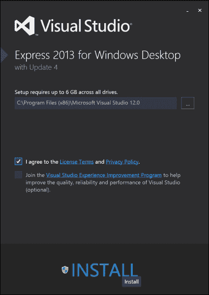
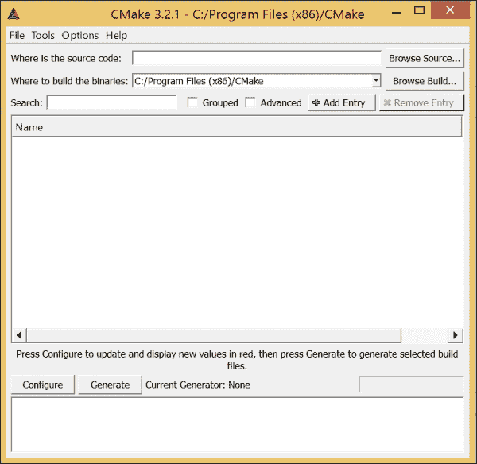
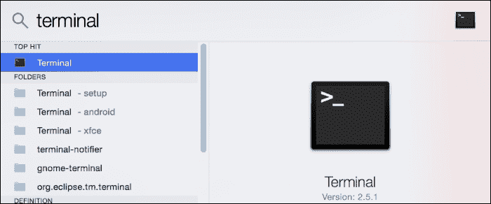
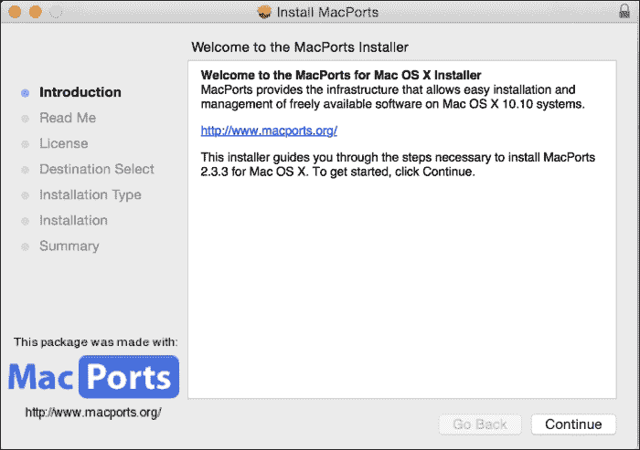
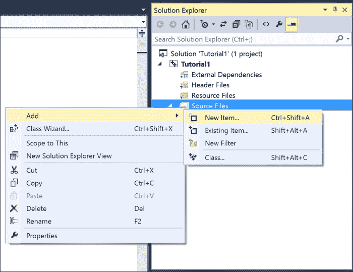
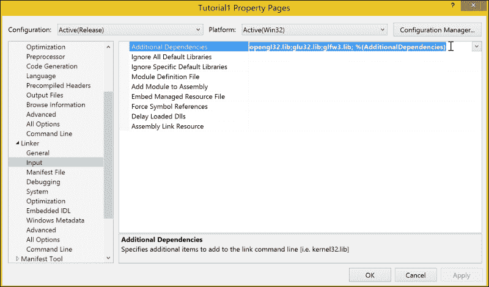
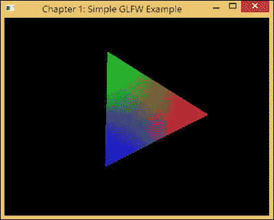

# 第一章. 开始使用 OpenGL

在本章中，我们将涵盖以下主题：

+   设置基于 Windows 的开发平台

+   设置基于 Mac 的开发平台

+   设置基于 Linux 的开发平台

+   在 Windows 中安装 GLFW 库

+   在 Mac OS X 和 Linux 中安装 GLFW 库

+   使用 GLFW 创建您的第一个 OpenGL 应用程序

+   在 Windows 中编译和运行您的第一个 OpenGL 应用程序

+   在 Mac OS X 或 Linux 中编译和运行您的第一个 OpenGL 应用程序

# 简介

OpenGL 是一个理想的跨平台、跨语言和硬件加速的图形渲染接口，非常适合在许多领域中可视化大量的 2D 和 3D 数据集。实际上，OpenGL 已经成为创建令人惊叹的图形的行业标准，尤其是在游戏应用和众多 3D 建模的专业工具中。随着我们在从生物医学成像到可穿戴计算（特别是随着大数据的发展）等领域的数据收集越来越多，高性能的数据可视化平台正成为许多未来应用的一个基本组成部分。确实，大规模数据集的可视化正在成为许多领域中的开发者、科学家和工程师面临的一个越来越具有挑战性的问题。因此，OpenGL 可以提供许多实时应用中创建令人印象深刻、令人惊叹视觉的统一解决方案。

OpenGL 的 API 封装了硬件交互的复杂性，同时允许用户对过程进行低级控制。从复杂的多服务器设置到移动设备，OpenGL 库为开发者提供了一个易于使用的界面，用于高性能图形渲染。图形硬件和大量存储设备的可用性和能力的不断提高，以及它们成本的降低，进一步推动了基于交互式 OpenGL 的数据可视化工具的开发。

现代计算机配备了专门的**图形处理单元**（**GPU**），这是高度定制的硬件组件，旨在加速图形渲染。GPU 还可用于加速通用、高度可并行化的计算任务。通过利用硬件和 OpenGL，我们可以产生高度交互和美观的结果。

本章介绍了开发基于 OpenGL 的数据可视化应用程序的基本工具，并提供了设置第一个演示应用程序环境的逐步教程。此外，本章概述了设置一个名为 CMake 的流行工具的步骤，CMake 是一个跨平台软件，它通过简单的配置文件自动化生成标准构建文件（例如，Linux 中的 makefiles，定义编译参数和命令）的过程。在未来的开发中，我们将使用 CMake 工具编译额外的库，包括本章后面介绍的 GLFW（OpenGL 框架）库。简而言之，GLFW 库是一个开源的多平台库，允许用户使用 OpenGL 上下文创建和管理窗口，以及处理来自鼠标和键盘等外围设备的输入。默认情况下，OpenGL 本身不支持其他外围设备；因此，我们使用 GLFW 库来填补这一空白。我们希望这个详细的教程对那些对探索 OpenGL 进行数据可视化感兴趣但经验很少或没有经验的初学者特别有用。然而，我们将假设你已经熟悉 C/C++编程语言。

# 设置基于 Windows 的开发平台

在 Windows 环境中，有各种开发工具可用于创建应用程序。在本书中，我们将专注于使用微软 Visual Studio 2013 中的 Visual C++创建 OpenGL 应用程序，鉴于其广泛的文档和支持。

## 安装 Visual Studio 2013

在本节中，我们概述了安装 Visual Studio 2013 的步骤。

## 准备工作

我们假设你已经安装了 Windows 7.0 或更高版本。为了获得最佳性能，我们建议你获得一块专用显卡，例如 NVIDIA GeForce 显卡，并在你的计算机上至少有 10 GB 的空闲磁盘空间以及 4 GB 的 RAM。下载并安装你显卡的最新驱动程序。

## 如何操作...

要免费安装 Microsoft Visual Studio 2013，请从微软的官方网站下载 Windows 桌面 Express 2013 版本（参考[`www.visualstudio.com/en-us/downloads/`](https://www.visualstudio.com/en-us/downloads/)）。一旦下载了安装程序可执行文件，我们就可以开始这个过程。默认情况下，我们将假设程序安装在以下路径：



为了验证安装，点击安装结束处的**启动**按钮，它将首次执行 VS Express 2013 for Desktop 应用程序。

## 在 Windows 中安装 CMake

在本节中，我们概述了安装 CMake 的步骤，CMake 是一个流行的工具，它自动化了为 Visual Studio（以及其他工具）创建标准构建文件的过程。

## 准备工作

要获取 CMake 工具（CMake 3.2.1），您可以从[`www.cmake.org/download/`](http://www.cmake.org/download/)下载可执行文件（`cmake-3.2.1-win32-x86.exe`）。

## 如何操作…

安装向导将引导您完成过程（在提示安装选项时，选择**将 CMake 添加到系统 PATH 以供所有用户使用**）。要验证安装，请运行 CMake（`cmake-gui`）。



到目前为止，您应该在您的机器上成功安装了 Visual Studio 2013 和 CMake，并准备好编译/安装 GLFW 库以创建您的第一个 OpenGL 应用程序。

# 设置基于 Mac 的开发平台

使用 OpenGL 的一个重要优势是可以在不同的平台上交叉编译相同的源代码。如果您计划在 Mac 平台上开发应用程序，您可以使用以下步骤轻松设置开发环境。我们假设您已安装 Mac OS X 10.9 或更高版本。OpenGL 更新已集成到 Mac OS X 的系统更新中，通过图形驱动程序进行。

## 安装 Xcode 和命令行工具

苹果公司的 Xcode 开发软件为开发者提供了一套全面的工具，包括 IDE、OpenGL 头文件、编译器和调试工具，用于创建原生 Mac 应用程序。为了简化过程，我们将使用与 Linux 中共享大多数常见功能的命令行界面来编译我们的代码。

## 准备工作

如果您正在使用 Mac OS X 10.9 或更高版本，您可以通过随 Mac OS 一起提供的 App Store 下载 Xcode。完整的安装支持和说明可在苹果开发者网站上找到（[`developer.apple.com/xcode/`](https://developer.apple.com/xcode/))。

## 如何操作...

注意事项

1.  在**Spotlight**中搜索关键字`Terminal`并运行**Terminal**。

1.  在终端中执行以下命令：

    ```cpp
     xcode-select --install

    ```

    如果您之前已安装命令行工具，将出现错误信息“命令行工具已安装”。在这种情况下，只需跳到步骤 4 以验证安装。

1.  点击**安装**按钮直接安装命令行工具。这将安装基本编译工具，如**gcc**和**make**，用于应用程序开发（注意 CMake 需要单独安装）。

1.  最后，输入`gcc --version`以验证安装。

## 相关信息

如果遇到**命令未找到**错误或其他类似问题，请确保命令行工具已成功安装。苹果公司提供了一套广泛的文档，有关安装 Xcode 的更多信息，请参阅[`developer.apple.com/xcode`](https://developer.apple.com/xcode)。

## 安装 MacPorts 和 CMake

在本节中，我们概述了安装 MacPorts 的步骤，这大大简化了后续的设置步骤，以及 Mac 上的 CMake。

## 准备工作

与 Windows 安装类似，您可以从[`www.cmake.org/cmake/resources/software.html`](http://www.cmake.org/cmake/resources/software.html)下载**CMake**的二进制发行版，并手动配置命令行选项。然而，为了简化安装并自动化配置过程，我们强烈建议您使用 MacPorts。

## 如何操作...

要安装 MacPorts，请按照以下步骤操作：

1.  下载适用于相应版本 Mac OS X 的 MacPorts 包安装程序([`guide.macports.org/#installing.macports`](https://guide.macports.org/#installing.macports))：

    +   Mac OS X 10.10 Yosemite: [`distfiles.macports.org/MacPorts/MacPorts-2.3.3-10.10-Yosemite.pkg`](https://distfiles.macports.org/MacPorts/MacPorts-2.3.3-10.10-Yosemite.pkg)

    +   Mac OS X 10.9 Mavericks: [`distfiles.macports.org/MacPorts/MacPorts-2.3.3-10.9-Mavericks.pkg`](https://distfiles.macports.org/MacPorts/MacPorts-2.3.3-10.9-Mavericks.pkg)

1.  双击包安装程序，并按照屏幕上的说明操作。

1.  通过在终端中输入`port version`来验证安装，它将返回当前安装的 MacPorts 版本（在前面的包中为`Version: 2.3.3`）。

要在 Mac 上安装**CMake**，请按照以下步骤操作：

1.  打开**终端**应用程序。

1.  执行以下命令：

    ```cpp
    sudo port install cmake +gui

    ```

要验证安装，请输入`cmake –version`以显示当前安装的版本，并输入`cmake-gui`以探索 GUI。


在这个阶段，您的 Mac 已配置好用于 OpenGL 开发，并准备好编译您的第一个 OpenGL 应用程序。对于那些更习惯于 GUI 的用户，使用 Mac 的命令行界面最初可能是一种令人不知所措的体验。然而，从长远来看，它是一种有回报的学习体验，因为其整体简单性。与不断演变的 GUI 相比，命令行工具和界面通常更具有时间不变性。最终，您只需复制并粘贴相同的命令行，从而节省了每次 GUI 更改时查阅新文档所需的大量时间。

# 设置基于 Linux 的开发平台

要在 Linux 平台上准备开发环境，我们可以利用强大的 Debian 包管理系统。`apt-get`或`aptitude`程序会自动从服务器检索预编译的包，并解决和安装所有所需的依赖包。如果您使用的是非 Debian 平台，如 Fedora，您可以通过搜索此配方中列出的每个包的关键词来找到等效程序。

## 准备工作

我们假设你已经成功安装了所有更新以及与你的图形硬件相关的最新图形驱动程序。Ubuntu 12.04 或更高版本支持第三方专有 NVIDIA 和 AMD 图形驱动程序，更多信息可以在[`help.ubuntu.com/community/BinaryDriverHowto`](https://help.ubuntu.com/community/BinaryDriverHowto)找到。

## 如何操作...

使用以下步骤安装所有开发工具和相关依赖项：

1.  打开一个终端。

1.  输入更新命令：

    ```cpp
    sudo apt-get update

    ```

1.  输入安装命令，并在所有提示中输入`y`：

    ```cpp
    sudo apt-get install build-essential cmake-gui xorg-dev libglu1-mesa-dev mesa-utils

    ```

1.  验证结果：

    ```cpp
    gcc --version

    ```

    如果成功，此命令应返回已安装的`gcc`当前版本。

## 工作原理...

总结来说，`apt-get update`命令自动更新 Debian 包管理系统中的本地数据库。这确保了在过程中检索和安装了最新的软件包。`apt-get`系统还提供其他包管理功能，如软件包移除（卸载）、依赖关系检索以及软件包升级。这些高级功能超出了本书的范围，但更多信息可以在[`wiki.debian.org/apt-get`](https://wiki.debian.org/apt-get)找到。

前面的命令安装了多个软件包到你的机器上。在这里，我们将简要解释每个软件包的目的。

如其名称所暗示的，`build-essential`软件包封装了必需的软件包，即 gcc 和 g++，这些软件包是编译 Linux 中的 C 和 C++源代码所必需的。此外，它还会在过程中下载头文件并解决所有依赖关系。

`cmake-gui`软件包是本章中较早描述的 CMake 程序。它不是直接从网站下载 CMake 并从源代码编译，而是检索由 Ubuntu 社区编译、测试和发布的最新支持的版本。使用 Debian 包管理系统的优点是稳定性和未来更新的便捷性。然而，对于寻找最新版本的用户，基于 apt-get 的系统可能会落后几个版本。

`xorg-dev`和`libglu1-mesa-dev`软件包是编译 GLFW 库所需的发展文件。这些软件包包括其他程序所需的头文件和库。如果你选择使用预编译的二进制版本 GLFW，你可能能够跳过一些软件包。然而，我们强烈建议你遵循本教程的步骤。

## 相关内容

更多信息，大多数步骤在本在线文档中有详细说明和解释：[`help.ubuntu.com/community/UsingTheTerminal`](https://help.ubuntu.com/community/UsingTheTerminal)。

# 在 Windows 中安装 GLFW 库

在 Windows 中安装 GLFW 库有两种方法，这两种方法将在本节中讨论。第一种方法涉及直接使用 CMake 编译 GLFW 源代码以实现完全控制。然而，为了简化过程，我们建议您下载预编译的二进制发行版。

## 准备工作

我们假设您已经按照前面章节所述成功安装了 Visual Studio 2013 和 CMake。为了完整性，我们将演示如何使用 CMake 安装 GLFW。

## 如何操作...

要使用预编译的二进制包安装 GLFW，请按照以下步骤操作：

1.  创建`C:/Program Files (x86)/glfw-3.0.4`目录。在提示时授予必要的权限。

1.  从[`sourceforge.net/projects/glfw/files/glfw/3.0.4/glfw-3.0.4.bin.WIN32.zip`](http://sourceforge.net/projects/glfw/files/glfw/3.0.4/glfw-3.0.4.bin.WIN32.zip)下载`glfw-3.0.4.bin.WIN32.zip`包，并解压该包。

1.  将`glfw-3.0.4.bin.WIN32`文件夹内所有提取的内容（例如，包括`lib-msvc2012`）复制到`C:/Program Files (x86)/glfw-3.0.4`目录中。在提示时授予权限。

1.  将`lib-msvc2012`文件夹重命名为`lib`，位于`C:/Program Files (x86)/glfw-3.0.4`目录中。在提示时授予权限。

或者，要直接编译源文件，请按照以下步骤操作：

1.  从[`sourceforge.net/projects/glfw/files/glfw/3.0.4/glfw-3.0.4.zip`](http://sourceforge.net/projects/glfw/files/glfw/3.0.4/glfw-3.0.4.zip)下载源代码包，并在桌面上解压该包。在解压的`glfw-3.0.4`文件夹内创建一个名为`build`的新文件夹以存储二进制文件，并打开`cmake-gui`。

1.  将`glfw-3.0.4`（从桌面）选为源目录，将`glfw-3.0.4/build`选为构建目录。截图如下所示：

1.  点击**生成**，并在提示中选择**Visual Studio 12 2013**。

1.  再次点击**生成**。

1.  打开`build`目录，双击**GLFW.sln**以打开 Visual Studio。

1.  在 Visual Studio 中，点击构建解决方案（按*F7*）。

1.  将**build/src/Debug/glfw3.lib**复制到**C:/Program Files (x86)/glfw-3.0.4/lib**。

1.  将`include`目录（位于`glfw-3.0.4/include`内部）复制到**C:/Program Files (x86)/glfw-3.0.4/**.

在此步骤之后，我们应该在`C:/Program Files (x86)/glfw-3.0.4`目录内拥有`include`（`glfw3.h`）和`library`（`glfw3.lib`）文件，如图所示使用预编译二进制文件的设置过程。

# 在 Mac OS X 和 Linux 中安装 GLFW 库

Mac 和 Linux 的安装过程使用命令行界面基本相同。为了简化过程，我们建议 Mac 用户使用 MacPorts。

## 准备工作

我们假设您已成功安装了基本开发工具，包括 CMake，如前文所述。为了最大灵活性，我们可以直接从源代码编译库（参考 [`www.glfw.org/docs/latest/compile.html`](http://www.glfw.org/docs/latest/compile.html) 和 [`www.glfw.org/download.html`](http://www.glfw.org/download.html)）。

## 如何操作...

对于 Mac 用户，请在终端中输入以下命令以使用 MacPorts 安装 GLFW：

```cpp
sudo port install glfw

```

对于 Linux 用户（或希望练习使用命令行工具的 Mac 用户），以下是在命令行界面中直接编译和安装 GLFW 源包的步骤：

1.  创建一个名为 `opengl_dev` 的新文件夹，并将当前目录更改为新路径：

    ```cpp
    mkdir ~/opengl_dev
    cd ~/opengl_dev

    ```

1.  从官方仓库获取 GLFW 源包 (`glfw-3.0.4`)：[`sourceforge.net/projects/glfw/files/glfw/3.0.4/glfw-3.0.4.tar.gz`](http://sourceforge.net/projects/glfw/files/glfw/3.0.4/glfw-3.0.4.tar.gz)。

1.  解压缩包。

    ```cpp
    tar xzvf glfw-3.0.4.tar.gz

    ```

1.  执行编译和安装：

    ```cpp
    cd glfw-3.0.4
    mkdir build
    cd build
    cmake ../
    make && sudo make install

    ```

## 工作原理...

第一组命令创建一个新的工作目录以存储使用 `wget` 命令检索的新文件，该命令将 GLFW 库的副本下载到当前目录。`tar xzvf` 命令解压缩压缩包并创建一个包含所有内容的新的文件夹。

然后，`cmake` 命令自动在当前 `build` 目录中生成编译过程所需的必要构建文件。此过程还会检查缺失的依赖项并验证应用程序的版本。

`make` 命令随后从自动生成的 Makefile 脚本中获取所有指令，并将源代码编译成库。

`sudo make install` 命令将库头文件以及静态或共享库安装到您的机器上。由于此命令需要写入根目录，因此需要 `sudo` 命令来授予此类权限。默认情况下，文件将被复制到 `/usr/local` 目录。在本书的其余部分，我们将假设安装遵循这些默认路径。

对于高级用户，我们可以通过使用 CMake 图形用户界面 (`cmake-gui`) 来配置软件包以优化编译。


例如，如果您计划将 GLFW 库编译为共享库，可以启用 `BUILD_SHARED_LIBS` 选项。在本书中，我们不会探索 GLFW 库的全部功能，但这些选项对于寻求进一步定制的开发者可能很有用。此外，如果您希望将库文件安装到单独的位置，还可以自定义安装前缀 (`CMAKE_INSTALL_PREFIX`)。

# 使用 GLFW 创建您的第一个 OpenGL 应用程序

现在您已经成功配置了开发平台并安装了 GLFW 库，我们将提供如何创建您的第一个基于 OpenGL 的应用程序的教程。

## 准备工作

到目前为止，无论您使用的是哪种操作系统，您都应该已经准备好了所有预置工具，因此我们将立即开始使用这些工具构建您的第一个 OpenGL 应用程序。

## 如何操作...

以下代码概述了创建一个简单 OpenGL 程序的基本步骤，该程序利用 GLFW 库并绘制一个旋转的三角形：

1.  创建一个空文件，然后包含 GLFW 库头文件和标准 C++库的头文件：

    ```cpp
    #include <GLFW/glfw3.h>
    #include <stdlib.h>
    #include <stdio.h>
    ```

1.  初始化 GLFW 并创建一个 GLFW 窗口对象（640 x 480）：

    ```cpp
    int main(void)
    {
      GLFWwindow* window;
      if (!glfwInit())
        exit(EXIT_FAILURE);
      window = glfwCreateWindow(640, 480, "Chapter 1: Simple GLFW Example", NULL, NULL);
      if (!window)
      {
        glfwTerminate();
        exit(EXIT_FAILURE);
      }
      glfwMakeContextCurrent(window);
    ```

1.  定义一个循环，当窗口关闭时终止：

    ```cpp
      while (!glfwWindowShouldClose(window))
      {
    ```

1.  设置视口（使用窗口的宽度和高度）并清除屏幕颜色缓冲区：

    ```cpp
        float ratio;
        int width, height;

        glfwGetFramebufferSize(window, &width, &height);
        ratio = (float) width / (float) height;

        glViewport(0, 0, width, height);
        glClear(GL_COLOR_BUFFER_BIT);
    ```

1.  设置相机矩阵。注意，关于相机模型的更多细节将在第三章 *交互式 3D 数据可视化*中讨论：

    ```cpp
        glMatrixMode(GL_PROJECTION);
        glLoadIdentity();
        glOrtho(-ratio, ratio, -1.f, 1.f, 1.f, -1.f);
        glMatrixMode(GL_MODELVIEW);
        glLoadIdentity();
    ```

1.  绘制一个旋转的三角形，并为三角形的每个顶点（*x*，*y*，和*z*）设置不同的颜色（红色、绿色和蓝色通道）。第一行代码使三角形随时间旋转：

    ```cpp
        glRotatef((float)glfwGetTime() * 50.f, 0.f, 0.f, 1.f);
        glBegin(GL_TRIANGLES);
        glColor3f(1.f, 0.f, 0.f);
        glVertex3f(-0.6f, -0.4f, 0.f);
        glColor3f(0.f, 1.f, 0.f);
        glVertex3f(0.6f, -0.4f, 0.f);
        glColor3f(0.f, 0.f, 1.f);
        glVertex3f(0.f, 0.6f, 0.f);
        glEnd();
    ```

1.  交换前后缓冲区（GLFW 使用双缓冲），以更新屏幕并处理所有挂起的事件：

    ```cpp
        glfwSwapBuffers(window);
        glfwPollEvents();
      }
    ```

1.  释放内存并终止 GLFW 库。然后，退出应用程序：

    ```cpp
      glfwDestroyWindow(window);
      glfwTerminate();
      exit(EXIT_SUCCESS);
    }
    ```

1.  使用您选择的文本编辑器将文件保存为`main.cpp`。

## 它是如何工作的...

通过包含 GLFW 库头文件`glfw3.h`，我们自动导入 OpenGL 库中所有必要的文件。最重要的是，GLFW 自动确定平台，从而允许您无缝地编写可移植的源代码。

在主函数中，我们必须首先使用**glfwInit**函数在主线程中初始化 GLFW 库。在使用任何 GLFW 函数之前，这是必需的。在程序退出之前，GLFW 应该被终止以释放任何分配的资源。

然后，`glfwCreateWindow`函数创建一个窗口及其相关上下文，并且它还返回一个指向`GLFWwindow`对象的指针。在这里，我们可以定义窗口的宽度、高度、标题和其他属性。在窗口创建后，我们接着调用`glfwMakeContextCurrent`函数来切换上下文，并确保指定窗口的上下文在调用线程上是当前的。

到目前为止，我们已经准备好在窗口上渲染我们的图形元素。**while**循环提供了一个机制，只要窗口保持打开状态，就会重新绘制我们的图形。OpenGL 需要在相机参数上进行显式设置；更多细节将在接下来的章节中讨论。将来，我们可以提供不同的参数来模拟透视，并处理更复杂的问题（如抗锯齿）。目前，我们已经设置了一个简单的场景来渲染一个基本的原始形状（即三角形），并固定了顶点的颜色。用户可以通过修改**glColor3f**和**glVertex3f**函数中的参数来改变颜色以及顶点的位置。

本例演示了使用 OpenGL 创建图形所需的基本知识。尽管示例代码很简单，但它提供了一个很好的入门框架，说明了如何使用 OpenGL 和 GLFW 通过图形硬件创建高性能的图形渲染应用程序。

# 在 Windows 中编译和运行你的第一个 OpenGL 应用程序

设置 OpenGL 项目有多种方法。在这里，我们使用 Visual Studio 2013 或更高版本创建一个示例项目，并提供 OpenGL 和 GLFW 库首次配置的完整指南。这些相同的步骤将来也可以应用到你的项目中。

## 准备工作

假设你已经成功在你的环境中安装了 Visual Studio 2013 和 GLFW（版本 3.0.4），我们将从头开始我们的项目。

## 如何操作...

在 Visual Studio 2013 中，按照以下步骤创建一个新项目并编译源代码：

1.  打开 Visual Studio 2013（桌面版 VS Express 2013）。

1.  创建一个新的 Win32 控制台应用程序，并将其命名为`Tutorial1`。![如何操作...]

1.  选择**空项目**选项，然后点击**完成**。![如何操作...]

1.  右键点击**源文件**，添加一个新的 C++源文件（**添加** | **新建项**），命名为**main.cpp**

1.  将上一节中的源代码复制并粘贴到**main.cpp**中，并保存。

1.  打开**项目属性**（*Alt* + *F7*）。

1.  通过导航到**配置属性** | **C/C++** | **通用** | **附加包含目录**，添加 GLFW 库的`include`路径，**C:\Program Files (x86)\glfw-3.0.4\include**。![如何操作...]

    ### 小贴士

    **下载示例代码**

    您可以从您在[`www.packtpub.com`](http://www.packtpub.com)的账户下载示例代码文件，以获取您购买的所有 Packt Publishing 书籍的示例代码。如果您在其他地方购买了这本书，您可以访问[`www.packtpub.com/support`](http://www.packtpub.com/support)并注册，以便将文件直接通过电子邮件发送给您。

1.  通过导航到 **配置属性** | **链接器** | **常规** | **附加库目录**，添加 GLFW 库路径，**C:\Program Files (x86)\glfw-3.0.4\lib**。

1.  通过导航到 **配置属性** | **链接器** | **输入** | **附加依赖项**，添加 GLFW 和 OpenGL 库（`glu32.lib`、`glfw3.lib` 和 `opengl32.lib`）。

1.  构建 **解决方案**（按 *F7*）。

1.  运行程序（按 *F5*）。

这是您的第一个 OpenGL 应用程序，它显示了一个在您的图形硬件上运行的旋转三角形。尽管我们只定义了顶点的颜色为红色、绿色和蓝色，但图形引擎会插值中间结果，并且所有计算都是使用图形硬件完成的。截图如下所示：



# 在 Mac OS X 或 Linux 上编译和运行您的第一个 OpenGL 应用程序

使用命令行界面设置 Linux 或 Mac 机器变得简单得多。我们假设您已经准备好了之前讨论的所有组件，并且所有默认路径都使用推荐的方式。

## 准备工作

我们将首先编译之前描述的示例代码。您可以从 Packt Publishing 的官方网站 [`www.packtpub.com`](https://www.packtpub.com) 下载完整的代码包。我们假设所有文件都保存在名为 `code` 的顶级目录中，而 `main.cpp` 文件则保存在 `/code/Tutorial1` 子目录中。

## 如何操作...

1.  打开终端或等效的命令行界面。

1.  将当前目录更改为工作目录：

    ```cpp
    cd ~/code

    ```

1.  输入以下命令以编译程序：

    ```cpp
    gcc -Wall `pkg-config --cflags glfw3` -o main Tutorial1/main.cpp `pkg-config --static --libs glfw3`

    ```

1.  运行程序：

    ```cpp
    ./main

    ```

这是您的第一个 OpenGL 应用程序，它在本机图形硬件上运行并显示一个旋转的三角形。尽管我们只定义了三个顶点的颜色为红色、绿色和蓝色，但图形引擎会插值中间结果，并且所有计算都是使用图形硬件完成的。


为了进一步简化过程，我们在示例代码中提供了一个编译脚本。您可以通过在终端中简单地输入以下命令来执行脚本：

```cpp
chmod  +x compile.sh
./compile.sh

```

您可能会注意到 OpenGL 代码是平台无关的。GLFW 库最强大的功能之一是它在幕后处理窗口管理和其他平台相关函数。因此，相同的源代码（`main.cpp`）可以在多个平台上共享和编译，而无需任何更改。
