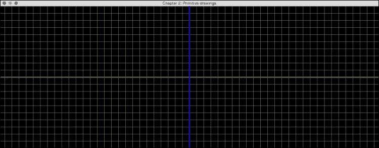
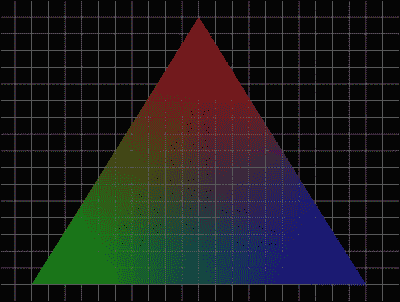
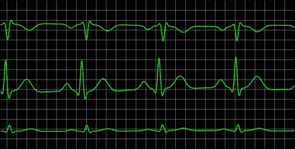
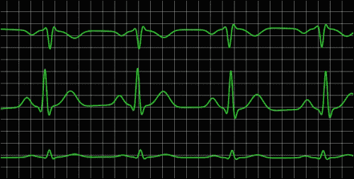
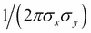
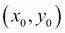
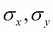
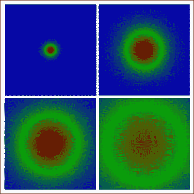

# 第二章：OpenGL 原语和二维数据可视化

在本章中，我们将涵盖以下主题：

+   OpenGL 原语

+   使用原语创建二维图表

+   时间序列的实时可视化

+   3D/4D 数据集的二维可视化

# 简介

在上一章中，我们提供了一个示例代码，使用 OpenGL 和 GLFW 库在屏幕上渲染三角形。在本章中，我们将专注于使用 OpenGL 原语，如点、线和三角形，来实现数据的二维可视化，包括时间序列，如**心电图**（**ECG**）。我们将从介绍每个原语开始，并提供示例代码，以便读者可以以最小的学习曲线实验 OpenGL 原语。

可以将原语视为使用 OpenGL 创建图形的基本构建块。这些构建块可以轻松地在许多应用程序中重用，并且在不同的平台之间具有高度的便携性。通常，程序员会为以视觉上吸引人的方式显示他们的结果而挣扎，并且可能会花费大量时间在屏幕上执行简单的绘图任务。在本章中，我们将介绍一种使用 OpenGL 进行二维数据可视化的快速原型设计方法，以便以最小的努力创建令人印象深刻的图形。最重要的是，所提出的框架非常直观且可重用，可以扩展用于更复杂的应用。一旦你掌握了 OpenGL 语言的基础，你将具备创建利用现代图形硬件 OpenGL 数据可视化真正潜力的令人印象深刻的技能。

# OpenGL 原语

简而言之，原语只是 OpenGL 中绘制的基本形状。在本节中，我们将简要概述 OpenGL 支持的主要几何原语，并特别关注三种常用原语（这些原语也将出现在我们的演示应用中）：点、线和三角形。

## 绘制点

我们从许多可视化问题的简单但非常有用的构建块开始：一个点原语。一个点可以是二维中的有序对，也可以在三维空间中可视化。

## 准备工作

为了简化工作流程并提高代码的可读性，我们首先定义了一个名为`Vertex`的结构，它封装了基本元素，如顶点的位置和颜色。

```cpp
typedef struct
{
  GLfloat x, y, z; //position
  GLfloat r, g, b, a; //color and alpha channels
} Vertex;
```

现在，我们可以将每个对象和形状视为空间中一组顶点（具有特定颜色）。在本章中，由于我们的重点是二维可视化，顶点的*Z*位置通常手动设置为`0.0f`。

例如，我们可以创建一个位于屏幕中心（0, 0, 0）的顶点，颜色为白色：

```cpp
Vertex v = {0.0f, 0.0f, 0.0f, 1.0f, 1.0f, 1.0f, 1.0f};
```

注意，颜色元素由红色、绿色、蓝色和 alpha 通道组成。这些值范围从 0.0 到 1.0。alpha 通道允许我们创建透明度（0：完全透明；1：完全不透明），以便对象可以混合在一起。

## 如何操作...

我们可以先定义一个名为`drawPoint`的函数来封装 OpenGL 原始函数的复杂性，如下所示：

1.  创建一个名为`drawPoint`的函数来绘制点，该函数接受两个参数（顶点和点的大小）：

    ```cpp
    void drawPoint(Vertex v1, GLfloat size){
    ```

1.  指定点的大小：

    ```cpp
      glPointSize(size);
    ```

1.  设置要指定的顶点列表的起始位置，并指示与顶点关联的原始类型（在本例中为`GL_POINTS`）：

    ```cpp
      glBegin(GL_POINTS);
    ```

1.  使用`Vertex`结构中的字段设置颜色和顶点位置：

    ```cpp
      glColor4f(v1.r, v1.g, v1.b, v1.a);
      glVertex3f(v1.x, v1.y, v1.z);
    ```

1.  设置列表的结束：

    ```cpp
      glEnd();
    }
    ```

1.  此外，我们还可以定义一个名为`drawPointsDemo`的函数来进一步封装复杂性。此函数绘制一系列大小递增的点：

    ```cpp
    void drawPointsDemo(int width, int height){
      GLfloat size=5.0f;
      for(GLfloat x = 0.0f; x<=1.0f; x+=0.2f, size+=5)
      {
        Vertex v1 = {x, 0.0f, 0.0f, 1.0f, 1.0f, 1.0f, 1.0f};
        drawPoint(v1, size);
      }
    }
    ```

最后，让我们将这些函数集成到一个完整的 OpenGL 演示程序中（参考第一章中的相同步骤，*开始使用 OpenGL*）：

1.  创建一个名为`main_point.cpp`的源文件，然后包含 GLFW 库和标准 C++库的头文件：

    ```cpp
    #include <GLFW/glfw3.h>
    #include <stdlib.h>
    #include <stdio.h>
    ```

1.  定义显示的窗口大小：

    ```cpp
    const int WINDOWS_WIDTH = 640*2;
    const int WINDOWS_HEIGHT = 480;
    ```

1.  定义`Vertex`结构和函数原型：

    ```cpp
    typedef struct
    {
      GLfloat x, y, z;
      GLfloat r, g, b, a;
    } Vertex;
    void drawPoint(Vertex v1, GLfloat size);
    void drawPointsDemo(int width, int height);
    ```

1.  实现之前显示的`drawPoint`和`drawPointsDemo`函数。

1.  初始化 GLFW 并创建一个 GLFW 窗口对象：

    ```cpp
    int main(void)
    {
      GLFWwindow* window;
      if (!glfwInit())
        exit(EXIT_FAILURE);
      window = glfwCreateWindow(WINDOWS_WIDTH, WINDOWS_HEIGHT, "Chapter 2: Primitive drawings", NULL, NULL);
      if (!window){
        glfwTerminate();
        exit(EXIT_FAILURE);
      }
      glfwMakeContextCurrent(window);
    ```

1.  启用抗锯齿和平滑处理：

    ```cpp
      glEnable(GL_POINT_SMOOTH);
      glHint(GL_POINT_SMOOTH_HINT, GL_NICEST);
      glEnable(GL_BLEND);
      glBlendFunc(GL_SRC_ALPHA, GL_ONE_MINUS_SRC_ALPHA);
    ```

1.  定义一个循环，当窗口关闭时终止。在每个迭代开始时设置视口（使用窗口的大小）并清除颜色缓冲区以更新新内容：

    ```cpp
      while (!glfwWindowShouldClose(window))
      {
        float ratio;
        int width, height;
        glfwGetFramebufferSize(window, &width, &height);
        ratio = (float) width / (float)height;
        glViewport(0, 0, width, height);
        glClear(GL_COLOR_BUFFER_BIT);
    ```

1.  设置用于正交投影的相机矩阵：

    ```cpp
        glMatrixMode(GL_PROJECTION);
        glLoadIdentity();
        //Orthographic Projection
        glOrtho(-ratio, ratio, -1.f, 1.f, 1.f, -1.f);
        glMatrixMode(GL_MODELVIEW);
        glLoadIdentity();
        glClear(GL_COLOR_BUFFER_BIT | GL_DEPTH_BUFFER_BIT);
    ```

1.  调用`drawPointsDemo`函数：

    ```cpp
        drawPointsDemo(width, height);
    ```

1.  交换窗口的前后缓冲区并处理事件队列（如键盘输入）以避免锁定：

    ```cpp
        glfwSwapBuffers(window);
        glfwPollEvents();
      }
    ```

1.  释放内存并终止 GLFW 库。然后，退出应用程序：

    ```cpp
      glfwDestroyWindow(window);
      glfwTerminate();
      exit(EXIT_SUCCESS);
    }
    ```

这里是结果（禁用抗锯齿）显示一系列大小递增的点（即，每个点的大小由`glPointSize`指定）：


## 它是如何工作的...

`glBegin`和`glEnd`函数定义了与所需原始类型（在本演示中为`GL_POINTS`）对应的顶点列表。`glBegin`函数接受一组符号常量，代表不同的绘图方法，包括`GL_POINTS`、`GL_LINES`和`GL_TRIANGLES`，如本章所述。

有几种方法可以控制绘制点的过程。首先，我们可以使用`glPointSize`函数设置每个点的直径（以像素为单位）。默认情况下，一个点没有启用抗锯齿（一种平滑采样伪影的方法）时，直径为 1。此外，我们还可以使用`glColor4f`函数定义每个点的颜色以及 alpha 通道（透明度）。alpha 通道允许我们叠加点和混合图形元素。这是一种强大而简单的技术，在图形设计和用户界面设计中得到广泛应用。最后，我们使用`glVertex3f`函数定义点在空间中的位置。

在 OpenGL 中，我们可以以两种不同的方式定义投影变换：正交投影或透视投影。在 2D 绘图时，我们通常使用正交投影，它不涉及透视校正（例如，屏幕上的对象将保持相同的大小，无论其与摄像机的距离如何）。在 3D 绘图时，我们使用透视投影来创建更逼真的场景，类似于人眼看到的场景。在代码中，我们使用`glOrtho`函数设置正交投影。`glOrtho`函数接受以下参数：垂直裁剪平面的坐标、水平裁剪平面的坐标以及近裁剪面和远裁剪面的距离。这些参数确定投影矩阵，详细文档可以在[`developer.apple.com/library/mac/documentation/Darwin/Reference/ManPages/man3/glOrtho.3.html`](https://developer.apple.com/library/mac/documentation/Darwin/Reference/ManPages/man3/glOrtho.3.html)找到。

抗锯齿和平滑处理是产生现代图形中看到的精致外观所必需的。大多数显卡支持原生平滑处理，在 OpenGL 中，可以通过以下方式启用：

```cpp
glEnable(GL_POINT_SMOOTH);
glEnable(GL_BLEND);
glBlendFunc(GL_SRC_ALPHA, GL_ONE_MINUS_SRC_ALPHA);
```

这是启用抗锯齿后的最终结果，显示了一系列大小递增的圆形点：


注意，在前面的图中，由于启用了抗锯齿功能，点现在被渲染为圆形而不是正方形。鼓励读者禁用和启用前面图的特性，以查看操作的效果。

## 参见

在这个教程中，我们由于其简洁性而专注于 C 编程风格。在接下来的章节中，我们将迁移到使用 C++的面向对象编程风格。此外，在本章中，我们关注三个基本原语（并在适当的地方讨论这些原语的导数）：`GL_POINTS`、`GL_LINES`和`GL_TRIANGLES`。以下是 OpenGL 支持的原语更详尽的列表（有关更多信息，请参阅[`www.opengl.org/wiki/Primitive`](https://www.opengl.org/wiki/Primitive)）：

```cpp
GL_POINTS, GL_LINES, GL_LINE_STRIP, GL_LINE_LOOP, GL_TRIANGLES, GL_TRIANGLE_STRIP, GL_TRIANGLE_FAN, GL_QUADS, GL_QUAD_STRIP, and GL_POLYGON
```

## 绘制线段

现在的一个自然扩展是连接数据点之间的线，然后将这些线连接起来形成一个用于绘图的网格。实际上，OpenGL 原生支持绘制线段，其过程与绘制点非常相似。

## 准备工作

在 OpenGL 中，我们可以通过一组两个顶点简单地定义一个线段，并通过在 `glBegin` 语句中选择 `GL_LINES` 作为符号常量来自动在这两个顶点之间形成一条线。

## 如何做…

在这里，我们定义了一个新的线段绘制函数，称为 `drawLineSegment`，用户可以通过简单地替换前一部分中的 `drawPointsDemo` 函数来测试它：

1.  定义 `drawLineSegment` 函数，它接受两个顶点和线的宽度作为输入：

    ```cpp
    void drawLineSegment(Vertex v1, Vertex v2, GLfloat width) {
    ```

1.  设置线的宽度：

    ```cpp
      glLineWidth(width);
    ```

1.  设置线段绘制的原语类型：

    ```cpp
      glBegin(GL_LINES);
    ```

1.  设置线段的顶点和颜色：

    ```cpp
      glColor4f(v1.r, v1.g, v1.b, v1.a);
      glVertex3f(v1.x, v1.y, v1.z);
      glColor4f(v2.r, v2.g, v2.b, v2.a);
      glVertex3f(v2.x, v2.y, v2.z);
      glEnd();
    }
    ```

此外，我们定义了一个新的网格绘制函数，称为 `drawGrid`，它基于 `drawLineSegment` 函数如下：

```cpp
void drawGrid(GLfloat width, GLfloat height, GLfloat grid_width){
  //horizontal lines
  for(float i=-height; i<height; i+=grid_width){
    Vertex v1 = {-width, i, 0.0f, 1.0f, 1.0f, 1.0f, 1.0f};
    Vertex v2 = {width, i, 0.0f, 1.0f, 1.0f, 1.0f, 1.0f};
    drawLineSegment(v1, v2);
  }
  //vertical lines
  for(float i=-width; i<width; i+=grid_width){
    Vertex v1 = {i, -height, 0.0f, 1.0f, 1.0f, 1.0f, 1.0f};
    Vertex v2 = {i, height, 0.0f, 1.0f, 1.0f, 1.0f, 1.0f};
    drawLineSegment(v1, v2);
  }
}
```

最后，我们可以通过替换前一部分中对 `drawPointsDemo` 函数的调用，使用以下 `drawLineDemo` 函数来执行完整的演示：

```cpp
void drawLineDemo(){
  //draw a simple grid
  drawGrid(5.0f, 1.0f, 0.1f);
  //define the vertices and colors of the line segments
  Vertex v1 = {-5.0f, 0.0f, 0.0f, 1.0f, 0.0f, 0.0f, 0.7f};
  Vertex v2 = {5.0f, 0.0f, 0.0f, 0.0f, 1.0f, 0.0f, 0.7f};
  Vertex v3 = {0.0f, 1.0f, 0.0f, 0.0f, 0.0f, 1.0f, 0.7f};
  Vertex v4 = {0.0f, -1.0f, 0.0f, 0.0f, 0.0f, 1.0f, 0.7f};
  //draw the line segments
  drawLineSegment(v1, v2, 10.0f);
  drawLineSegment(v3, v4, 10.0f);
}
```

这是一张演示截图，显示了具有等间距的网格以及使用线原语绘制的 *x* 和 *y* 轴：



## 工作原理…

在 OpenGL 中绘制线段有多种方式。我们已经展示了使用 `GL_LINES` 的用法，它将列表中的每个连续顶点对组合成独立的线段。另一方面，如果您想绘制没有间隙的线，可以使用 `GL_LINE_STRIP` 选项，它以连续的方式连接所有顶点。最后，为了形成一个闭合的循环序列，其中线的端点被连接，您将使用 `GL_LINE_LOOP` 选项。

此外，我们可以使用 `glLineWidth` 和 `glColor4f` 函数分别修改每条线的宽度和颜色。

## 绘制三角形

我们现在将转到另一个非常常用的原语，即三角形，它是绘制所有可能多边形的基础。

## 准备工作

与绘制线段类似，我们可以简单地通过一组三个顶点定义一个三角形，并通过在 `glBegin` 语句中选择 `GL_TRIANGLES` 作为符号常量来自动形成线段。

## 如何做…

最后，我们定义了一个新的函数，称为 `drawTriangle`，用户可以通过简单地替换 `drawPointsDemo` 函数来测试它。我们还将重用前一部分中的 `drawGrid` 函数：

1.  定义 `drawTriangle` 函数，它接受三个顶点作为输入：

    ```cpp
    void drawTriangle(Vertex v1, Vertex v2, Vertex v3){
    ```

1.  将绘图原语类型设置为绘制三角形：

    ```cpp
      glBegin(GL_TRIANGLES);
    ```

1.  设置三角形的顶点和颜色：

    ```cpp
      glColor4f(v1.r, v1.g, v1.b, v1.a);
      glVertex3f(v1.x, v1.y, v1.z);
      glColor4f(v2.r, v2.g, v2.b, v2.a);
      glVertex3f(v2.x, v2.y, v2.z);
      glColor4f(v3.r, v3.g, v3.b, v3.a);
      glVertex3f(v3.x, v3.y, v3.z);
      glEnd(),
    }
    ```

1.  通过用以下 `drawTriangleDemo` 函数替换完整演示代码中对 `drawPointsDemo` 函数的调用来执行演示：

    ```cpp
    void drawTriangleDemo(){
      //Triangle Demo
      Vertex v1 = {0.0f, 0.8f, 0.0f, 1.0f, 0.0f, 0.0f, 0.6f};
      Vertex v2 = {-1.0f, -0.8f, 0.0f, 0.0f, 1.0f, 0.0f, 0.6f};
      Vertex v3 = {1.0f, -0.8f, 0.0f, 0.0f, 0.0f, 1.0f, 0.6f};
      drawTriangle(v1, v2, v3);
    }
    ```

这里是最终结果，三角形以 60%的透明度叠加在网格线上渲染：



## 它是如何工作的…

虽然在 OpenGL 中绘制三角形的流程看起来与之前的示例相似，但其中存在一些细微的差异和更复杂的方面可以融入。这个原始形状有三种不同的模式（`GL_TRIANGLES`、`GL_TRIANGLE_STRIP`和`GL_TRIANGLE_FAN`），每种模式以不同的方式处理顶点。首先，`GL_TRIANGLES`从一个给定的列表中取出三个顶点来创建一个三角形。这些三角形独立地从每个顶点三元组形成（也就是说，每个三个顶点形成一个不同的三角形）。另一方面，`GL_TRIANGLE_STRIP`使用前三个顶点形成一个三角形，每个后续的顶点使用前两个顶点形成一个新的三角形。最后，`GL_TRIANGLE_FAN`通过创建具有中心顶点 v_1 的三角形来创建一个任意复杂的凸多边形，这个中心顶点由第一个顶点指定，形成一个由三角形组成的扇形结构。换句话说，三角形的生成顺序如下所示：

```cpp
(v1, v2, v3), (v1, v3, v4),...,(v1, vn-1, vn)
for n vertices
```

尽管每个顶点都设置了不同的颜色，但 OpenGL 会自动处理颜色过渡（线性插值），如前一个示例中的三角形绘制所示。顶点被设置为红色、绿色和蓝色，但颜色的光谱可以清晰地看到。此外，可以使用 alpha 通道设置透明度，这使得我们可以清楚地看到三角形后面的网格。使用 OpenGL，我们还可以添加其他元素，例如高级的颜色和阴影处理，这些内容将在接下来的章节中讨论。

# 使用原始形状创建 2D 图

创建 2D 图是许多应用中可视化数据集中趋势的常见方式。与传统的做法（如基本的 MATLAB 绘图）相比，使用 OpenGL 可以以更动态的方式渲染此类图表，因为我们能够完全控制图形着色器进行颜色操作，我们还可以向系统提供实时反馈。这些独特的功能使用户能够创建高度交互的系统，例如，心电图等时间序列可以以最小的努力进行可视化。

在这里，我们首先演示了简单 2D 数据集的可视化，即离散时间上的正弦函数。

## 准备工作

这个演示需要实现之前提到的多个函数（包括`drawPoint`、`drawLineSegment`和`drawGrid`函数）。此外，我们将重用第一章中引入的代码结构，即*使用 OpenGL 入门*，以执行此演示。

## 如何做…

我们首先生成一个在时间间隔上正弦函数的模拟数据流。实际上，数据流可以是任何任意的信号或关系：

1.  让我们定义一个额外的结构体 `Data` 以简化接口：

    ```cpp
    typedef struct
    {
      GLfloat x, y, z;
    } Data;
    ```

1.  定义一个名为 `draw2DscatterPlot` 的通用 2D 数据绘图函数，输入数据流和点数作为输入：

    ```cpp
    void draw2DscatterPlot (const Data *data, int num_points){
    ```

1.  使用前面描述的 `drawLineSegment` 函数绘制 *x* 和 *y* 轴：

    ```cpp
      Vertex v1 = {-10.0f, 0.0f, 0.0f, 1.0f, 1.0f, 1.0f, 1.0f};
      Vertex v2 = {10.0f, 0.0f, 0.0f, 1.0f, 1.0f, 1.0f, 1.0f};
      drawLineSegment(v1, v2, 2.0f);
      v1.x = 0.0f;
      v2.x = 0.0f;
      v1.y = -1.0f;
      v2.y = 1.0f;
      drawLineSegment(v1, v2, 2.0f);
    ```

1.  使用 `drawPoint` 函数逐个绘制数据点：

    ```cpp
      for(int i=0; i<num_points; i++){
        GLfloat x=data[i].x;
        GLfloat y=data[i].y;
        Vertex v={x, y, 0.0f, 1.0f, 1.0f, 1.0f, 0.5f};
        drawPoint(v, 8.0f);
      }
    }
    ```

1.  创建一个名为 `draw2DlineSegments` 的类似函数，以便使用线段连接点，从而同时显示曲线和数据点：

    ```cpp
    void draw2DlineSegments(const Data *data, int num_points){
      for(int i=0; i<num_points-1; i++){
        GLfloat x1=data[i].x;
        GLfloat y1=data[i].y;
        GLfloat x2=data[i+1].x;
        GLfloat y2=data[i+1].y;
        Vertex v1={x1, y1, 0.0f, 0.0f, 1.0f, 1.0f, 0.5f};
        Vertex v2={x2, y2, 0.0f, 0.0f, 1.0f, 0.0f, 0.5f};
        drawLineSegment(v1, v2, 4.0f);
      }
    }
    ```

1.  通过创建网格、使用余弦函数生成模拟数据点并绘制数据点，将所有内容集成到一个完整的演示中：

    ```cpp
    void linePlotDemo(float phase_shift){
      drawGrid(5.0f, 1.0f, 0.1f);
      GLfloat range = 10.0f;
      const int num_points = 200;
      Data *data=(Data*)malloc(sizeof(Data)*num_points);
      for(int i=0; i<num_points; i++){
        data[i].x=((GLfloat)i/num_points)*range-range/2.0f;
        data[i].y= 0.8f*cosf(data[i].x*3.14f+phase_shift);
      }
      draw2DScatterPlot(data, num_points);
      draw2DLineSegments(data, num_points);
      free(data);
    }
    ```

1.  最后，在主程序中，包含 `math.h` 头文件以使用余弦函数，并在循环外部添加一个名为 `phase_shift` 的新变量来执行此演示。您可以从 Packt Publishing 网站下载代码包以获取完整的演示代码：

    ```cpp
    #include <math.h>
    ...
    int main(void){
      ...
      float phase_shift=0.0f;
      while (!glfwWindowShouldClose(window)){
        ...
        phase_shift+=0.02f;
        linePlotDemo(phase_shift);
        ...

        //finished all demo calls
        glfwSwapBuffers(window);
        glfwPollEvents();
      }
      ...
    }
    ```

使用前几节讨论的基本原语组合，将模拟的实时输入数据流（具有正弦形状）绘制在网格线上：


## 它是如何工作的…

使用我们之前使用基本 OpenGL 原语创建的简单工具包，我们绘制了一个正弦函数，数据点（以恒定的时间间隔采样）叠加在曲线上。平滑的曲线由使用 `draw2DlineSegments` 函数绘制的许多单独线段组成，而样本则是使用 `drawPoint` 函数绘制的。这种直观的界面为下一节中更有趣的时序可视化提供了基础。

# 时间序列的实时可视化

在本节中，我们进一步展示了我们框架的通用性，以绘制生物医学应用中的通用时间序列数据。特别是，我们将实时显示 ECG。作为简要介绍，ECG 是一种非常常用的诊断和监测工具，用于检测心脏异常。ECG 表面记录本质上探测心脏的电活动。例如，最大的峰值（称为 QRS 复合波）通常对应于心脏的室壁去极化（心脏中泵血的强肌肉室腔）。对 ECG 的仔细分析可以是一种非常强大、非侵入性的方法，用于在临床上区分许多心脏病，包括许多形式的心律失常和心脏病发作。

## 准备工作

我们首先导入一个计算机生成的 ECG 数据流。ECG 数据流存储在 `data_ecg.h` 中（这里只提供了数据流的一小部分）：

```cpp
float data_ecg[]={0.396568808f, 0.372911844f, 0.311059085f, 0.220346775f, 0.113525529f, 0.002200333f, -0.103284775f, -0.194218528f, -0.266285973f, -0.318075979f, -0.349670132f, -0.362640042f, -0.360047348f, -0.346207663f, -0.325440887f, -0.302062532f, -0.279400804f, -0.259695686f … };

```

## 如何做…

1.  使用以下代码通过绘制线段来绘制 ECG 数据：

    ```cpp
    void plotECGData(int offset, int size, float offset_y, float scale){
      //space between samples
      const float space = 2.0f/size*ratio;
      //initial position of the first vertex to render
      float pos = -size*space/2.0f;
      //set the width of the line
      glLineWidth(5.0f);
      glBegin(GL_LINE_STRIP);
      //set the color of the line to green
      glColor4f(0.1f, 1.0f, 0.1f, 0.8f);
      for (int i=offset; i<size+offset; i++){
        const float data = scale*data_ecg[i]+offset_y;
        glVertex3f(pos, data, 0.0f);
        pos += space;
      }
      glEnd();
    }
    ```

1.  显示多个 ECG 数据流（模拟来自不同导联的记录）：

    ```cpp
    void ecg_demo(int counter){
      const int data_size=ECG_DATA_BUFFER_SIZE;
      //Emulate the presence of multiple ECG leads (just for demo/ display purposes)
      plotECGData(counter, data_size*0.5, -0.5f, 0.1f);
      plotECGData(counter+data_size, data_size*0.5, 0.0f, 0.5f);
      plotECGData(counter+data_size*2, data_size*0.5, 0.5f, -0.25f);
    }
    ```

1.  最后，在主程序中，包含`data_ecg.h`头文件，并在循环中添加以下代码行。您可以从 Packt Publishing 网站下载完整的演示代码包：

    ```cpp
    #include "data_ecg.h"
    ...
    int main(void){
      ...
      while (!glfwWindowShouldClose(window)){
        ...
        drawGrid(5.0f, 1.0f, 0.1f);
        //reset counter to 0 after reaching the end of the sample data
        if(counter>5000){
          counter=0;
        }
        counter+=5;
        //run the demo visualizer
        ecg_demo(counter);
        ...
      }
    }
    ```

这里是两个在不同时间点模拟的多个 ECG 导联的实时显示快照。如果您运行演示，您将看到来自多个导联的 ECG 记录随着数据流处理显示而移动穿过屏幕。



这是稍后时间点的第二个快照：



## 工作原理…

这个演示展示了之前描述的`GL_LINE_STRIP`选项的使用，用于绘制 ECG 时间序列。我们不是使用`GL_LINE`选项绘制单个独立的线段，而是通过为每个数据点调用`glVertex3f`函数来绘制连续的数据流。此外，时间序列通过屏幕动画，并在交互式帧上提供动态更新，对 CPU 计算周期的影响最小。

# 2D visualization of 3D/4D datasets

我们现在已经学习了多种在屏幕上使用点和线生成图表的方法。在最后一节中，我们将演示如何使用 OpenGL 实时可视化 3D 数据集中的百万个数据点。可视化复杂 3D 数据集的常见策略是将第三维（例如，*z* 维度）编码为具有理想颜色方案的热图。作为一个例子，我们展示了一个 2D 高斯函数及其高度 *z* 的热图，使用简单的颜色方案编码。一般来说，一个二维高斯函数，，定义如下：


在这里，*A* 是分布中心在  的振幅， 和  是分布沿 *x* 和 *y* 方向的标准差（分散度）。为了使这个演示更加有趣和更具视觉吸引力，我们随时间变化标准差或 sigma 项（在 *x* 和 *y* 方向上相等）。实际上，我们可以应用相同的方法来可视化非常复杂的 3D 数据集。

## 准备工作

到目前为止，你应该已经非常熟悉前几节中描述的基本原语了。在这里，我们使用`GL_POINTS`选项生成具有不同颜色编码 *z* 维度的密集数据点网格。

## How to do it…

1.  使用 2-D 高斯函数生成一百万个数据点（1,000 x 1,000 网格）：

    ```cpp
    void gaussianDemo(float sigma){
      //construct a 1000x1000 grid
      const int grid_x = 1000;
      const int grid_y = 1000;
      const int num_points = grid_x*grid_y;
      Data *data=(Data*)malloc(sizeof(Data)*num_points);
      int data_counter=0;
      for(int x = -grid_x/2; x<grid_x/2; x+=1){
        for(int y = -grid_y/2; y<grid_y/2; y+=1){
          float x_data = 2.0f*x/grid_x;
          float y_data = 2.0f*y/grid_y;
          //compute the height z based on a
          //2D Gaussian function.
          float z_data = exp(-0.5f*(x_data*x_data)/(sigma*sigma) -0.5f*(y_data*y_data)/(sigma*sigma))/(sigma*sigma*2.0f*M_PI);
          data[data_counter].x = x_data;
          data[data_counter].y = y_data;
          data[data_counter].z = z_data;
          data_counter++;
        }
      }
      //visualize the result using a 2D heat map
      draw2DHeatMap(data, num_points);
      free(data);
    }
    ```

1.  使用热图函数绘制数据点以进行颜色可视化：

    ```cpp
    void draw2DHeatMap(const Data *data, int num_points){
      //locate the maximum and minimum values in the dataset
      float max_value=-999.9f;
      float min_value=999.9f;
      for(int i=0; i<num_points; i++){
        const Data d = data[i];
        if(d.z > max_value){
          max_value = d.z;
        }
        if(d.z < min_value){
          min_value = d.z;
        }
      }
      const float halfmax = (max_value + min_value) / 2;

      //display the result
      glPointSize(2.0f);
      glBegin(GL_POINTS);
      for(int i = 0; i<num_points; i++){
        const Data d = data[i];
        float value = d.z;
        float b = 1.0f - value/halfmax;
        float r = value/halfmax - 1.0f;
        if(b < 0){
          b=0;
        }
        if(r < 0){
          r=0;
        }
        float g = 1.0f - b - r;
        glColor4f(r, g, b, 0.5f);
        glVertex3f(d.x, d.y, 0.0f);
      }
      glEnd();
    }
    ```

1.  最后，在主程序中，包含`math.h`头文件，并在循环中添加以下代码行以随时间变化 sigma 项。您可以从 Packt Publishing 网站下载示例代码以获取完整的演示代码：

    ```cpp
    #define _USE_MATH_DEFINES // M_PI constant
    #include <math.h>
    ...
    int main(void){
      ...
      float sigma = 0.01f;
      while (!glfwWindowShouldClose(window)){
        ...
        drawGrid(5.0f, 1.0f, 0.1f);
        sigma+=0.01f;
        if(sigma>1.0f)
          sigma=0.01;
        gaussianDemo(sigma);
        ...
      }
    }
    ```

这里展示了四个图表，说明了随时间变化（从 0.01 到 1）调整二维高斯函数的 sigma 项的效果：



## 它是如何工作的...

我们已经展示了如何使用简单的热图来可视化高斯函数，其中最大值用红色表示，而最小值用蓝色表示。总共绘制了 100 万个数据点（1,000 x 1,000），每个高斯函数使用具有特定 sigma 项的顶点进行绘制。这个 sigma 项从 0.01 变化到 1，以展示随时间变化的高斯分布。为了减少开销，未来可以实施顶点缓冲区（我们可以一次性执行内存复制操作并移除`glVertex3f`调用）。类似的技巧也可以应用于颜色通道。

## 还有更多...

我们在这里描述的热图提供了一种强大的可视化工具，用于展示许多科学和生物医学应用中看到的复杂 3D 数据集。实际上，我们已经将我们的演示扩展到了 4D 数据集的可视化，更确切地说，是一个随时间变化的 3D 函数；使用颜色图编码高度值被显示出来。这个演示展示了仅使用基于 OpenGL 原语的 2D 技术以有趣、动态的方式展示数据的多重可能性。在下一章中，我们将通过结合 3D 渲染并添加用户输入来进一步展示 OpenGL 的潜力，从而实现更复杂数据集的 3D 交互式可视化。
