# 第四章：使用纹理映射渲染 2D 图像和视频

在本章中，我们将涵盖以下主题：

+   开始使用现代 OpenGL（3.2 或更高版本）

+   在 Windows 中设置 GLEW、GLM、SOIL 和 OpenCV 库

+   在 Mac OS X/Linux 中设置 GLEW、GLM、SOIL 和 OpenCV 库

+   使用 GLSL 创建你的第一个顶点和片段着色器

+   使用纹理映射渲染 2D 图像

+   使用过滤器进行实时视频渲染

# 简介

在本章中，我们将介绍 OpenGL 技术来可视化另一类重要的数据集：涉及图像或视频的数据集。这类数据集在许多领域都很常见，包括医学成像应用。为了启用图像的渲染，我们将讨论纹理映射的基本 OpenGL 概念，并过渡到需要更新版本的 OpenGL（OpenGL 3.2 或更高版本）的更高级技术。为了简化我们的任务，我们还将使用几个额外的库，包括**OpenGL 扩展包装库**（**GLEW**）用于运行时 OpenGL 扩展支持，**简单 OpenGL 图像加载器**（**SOIL**）用于加载不同的图像格式，**OpenGL 数学**（**GLM**）用于向量和矩阵操作，以及**OpenCV**用于图像/视频处理。为了开始，我们将首先介绍现代 OpenGL 3.2 和更高版本的特性。

# 开始使用现代 OpenGL（3.2 或更高版本）

OpenGL API 的持续进化导致了现代标准的出现。其中最大的变化发生在 2008 年，OpenGL 3.0 版本中引入了新的上下文创建机制，并将大多数较老的功能，如 Begin/End 原语规范，标记为已弃用。移除这些较老的标准特性也意味着以更灵活且更强大的方式处理图形管道。在 OpenGL 3.2 或更高版本中，定义了核心和兼容配置文件来区分已弃用的 API 和当前功能。这些配置文件为各种功能提供了清晰的定义（核心配置文件），同时支持向后兼容（兼容配置文件）。在 OpenGL 4.x 版本中，提供了对运行 Direct3D 11 的最新图形硬件的支持，OpenGL 3.x 和 OpenGL 4.x 之间的详细比较可以在[`www.g-truc.net/post-0269.html`](http://www.g-truc.net/post-0269.html)找到。

## 准备工作

从本章开始，我们需要具有 OpenGL 3.2（或更高版本）支持的兼容图形卡。2008 年之前发布的绝大多数图形卡可能不会得到支持。例如，NVIDIA GeForce 100、200、300 系列及更高版本支持 OpenGL 3 标准。我们鼓励您查阅您图形卡的技术规格以确认兼容性（参考[`developer.nvidia.com/opengl-driver`](https://developer.nvidia.com/opengl-driver)）。

## 如何做到这一点...

要启用 OpenGL 3.2 支持，我们需要在每个程序的初始化部分包含以下代码行：

```cpp
glfwWindowHint(GLFW_CONTEXT_VERSION_MAJOR, 3);
glfwWindowHint(GLFW_CONTEXT_VERSION_MINOR, 2);
glfwWindowHint(GLFW_OPENGL_FORWARD_COMPAT, GL_TRUE);
glfwWindowHint(GLFW_OPENGL_PROFILE, GLFW_OPENGL_CORE_PROFILE);
```

## 它是如何工作的...

`glfwWindowHint` 函数定义了创建 GLFW 窗口上下文的约束集（参考 第一章，*使用 OpenGL 入门*）。这里的前两行代码定义了将要使用的 OpenGL 当前版本（在本例中为 3.2）。第三行启用了向前兼容性，而最后一行指定将使用核心配置文件。

## 参见

可以在 [`www.opengl.org/wiki/History_of_OpenGL`](http://www.opengl.org/wiki/History_of_OpenGL) 找到关于各种 OpenGL 版本之间差异的详细说明。

# 在 Windows 中设置 GLEW、GLM、SOIL 和 OpenCV 库

在本节中，我们将提供逐步说明来设置本章（以及随后的章节）中将广泛使用的几个流行库，包括 GLEW、GLM、SOIL 和 OpenCV 库：

+   GLEW 库是一个开源的 OpenGL 扩展库。

+   GLM 库是一个仅包含头文件的 C++ 库，它提供了一套易于使用的常用数学运算。它基于 GLSL 规范构建，并且作为一个仅包含头文件的库，它不需要繁琐的编译步骤。

+   SOIL 库是一个简单的 C 库，用于在 OpenGL 纹理中加载各种常见格式的图像（如 BMP、PNG、JPG、TGA、TIFF 和 HDR）。

+   OpenCV 库是一个非常强大的开源计算机视觉库，我们将使用它来简化本章中的图像和视频处理。

## 准备工作

我们首先需要从以下网站下载必需的库：

+   **GLEW** (glew-1.10.0): [`sourceforge.net/projects/glew/files/glew/1.10.0/glew-1.10.0-win32.zip`](http://sourceforge.net/projects/glew/files/glew/1.10.0/glew-1.10.0-win32.zip)

+   **GLM** (glm-0.9.5.4): [`sourceforge.net/projects/ogl-math/files/glm-0.9.5.4/glm-0.9.5.4.zip`](http://sourceforge.net/projects/ogl-math/files/glm-0.9.5.4/glm-0.9.5.4.zip)

+   **SOIL**: [`www.lonesock.net/files/soil.zip`](http://www.lonesock.net/files/soil.zip)

+   **OpenCV** (opencv-2.4.9): [`sourceforge.net/projects/opencvlibrary/files/opencv-win/2.4.9/opencv-2.4.9.exe`](http://sourceforge.net/projects/opencvlibrary/files/opencv-win/2.4.9/opencv-2.4.9.exe)

## 如何操作...

要使用 GLEW 的预编译包，请按照以下步骤操作：

1.  解压该包。

1.  将目录复制到 `C:/Program Files (x86)`。

1.  确保在运行时可以找到 `glew32.dll` 文件（`C:\Program Files (x86)\glew-1.10.0\bin\Release\Win32`），可以通过将其放置在可执行文件相同的文件夹中或在 Windows 系统的 `PATH` 环境变量中包含该目录来实现（导航到 **控制面板** | **系统和安全** | **系统** | **高级系统设置** | **环境变量**）。

要使用仅包含头文件的 GLM 库，请按照以下步骤操作：

1.  解压该包。

1.  将目录复制到 `C:/Program Files (x86)`。

1.  在您的源代码中包含所需的头文件。以下是一个示例：

    ```cpp
    #include <glm/glm.hpp>
    ```

要使用 SOIL 库，请按照以下步骤操作：

1.  解压包。

1.  将目录复制到`C:/Program Files (x86)`。

1.  通过打开 Visual Studio 解决方案文件（`C:\Program Files (x86)\Simple OpenGL Image Library\projects\VC9\SOIL.sln`）并编译项目文件来生成`SOIL.lib`文件。将此文件从`C:\Program Files (x86)\Simple OpenGL Image Library\projects\VC9\Debug`复制到`C:\Program Files (x86)\Simple OpenGL Image Library\lib`。

1.  在您的源代码中包含头文件：

    ```cpp
    #include <SOIL.h>
    ```

最后，为了安装 OpenCV，我们建议您使用预构建的二进制文件以简化过程：

1.  从[`sourceforge.net/projects/opencvlibrary/files/opencv-win/2.4.9/opencv-2.4.9.exe`](http://sourceforge.net/projects/opencvlibrary/files/opencv-win/2.4.9/opencv-2.4.9.exe)下载预构建的二进制文件并提取包。

1.  将目录（`opencv`文件夹）复制到`C:\Program Files (x86)`。

1.  将以下内容添加到系统`PATH`环境变量中（导航到**控制面板** | **系统和安全** | **系统** | **高级系统设置** | **环境变量**） – `C:\Program Files (x86)\opencv\build\x86\vc12\bin`。

1.  在您的源代码中包含所需的头文件：

    ```cpp
    #include <opencv2/core/core.hpp>
    #include <opencv2/highgui/highgui.hpp>
    ```

现在，我们使用`CMake`生成我们的 Microsoft Visual Studio 解决方案文件（构建环境）。在每个项目目录中创建`CMakeList.txt`文件，其中列出项目所需的所有库和依赖项。以下是我们第一个演示应用的示例`CMakeList.txt`文件：

```cpp
cmake_minimum_required (VERSION 2.8)
set(CMAKE_CONFIGURATION_TYPES Debug Release)
set(PROGRAM_PATH "C:/Program Files \(x86\)")
set(OpenCV_DIR ${PROGRAM_PATH}/opencv/build)
project (code_simple)
#modify these path based on your configuration
#OpenCV
find_package(OpenCV REQUIRED )
INCLUDE_DIRECTORIES(${OpenCV_INCLUDE_DIRS})
INCLUDE_DIRECTORIES(${PROGRAM_PATH}/glm)
INCLUDE_DIRECTORIES(${PROGRAM_PATH}/glew-1.10.0/include)
LINK_DIRECTORIES(${PROGRAM_PATH}/glew-1.10.0/lib/Release)
INCLUDE_DIRECTORIES(${PROGRAM_PATH}/glfw-3.0.4/include)
LINK_DIRECTORIES(${PROGRAM_PATH}/glfw-3.0.4/lib)
INCLUDE_DIRECTORIES(${PROGRAM_PATH}/Simple\ OpenGL\ Image\ Library/src)
LINK_DIRECTORIES(${PROGRAM_PATH}/Simple\ OpenGL\ Image\ Library/lib)
add_subdirectory (../common common)
add_executable (main main.cpp)
target_link_libraries (main LINK_PUBLIC shader controls texture glew32s glfw3 opengl32 ${OpenCV_LIBS} SOIL)
```

如您在`CMakeList.txt`文件中所见，包括 OpenCV、SOIL、GLFW 和 GLEW 库在内的各种依赖项都被包含在内。

最后，我们运行`CMake`程序来生成项目的 Microsoft Visual Studio 解决方案（有关详细信息，请参阅第一章，*使用 OpenGL 入门*）。请注意，由于着色程序依赖项，二进制的输出路径必须与项目文件夹匹配。以下是生成名为`code_simple`的第一个示例项目后的`CMake`窗口截图：

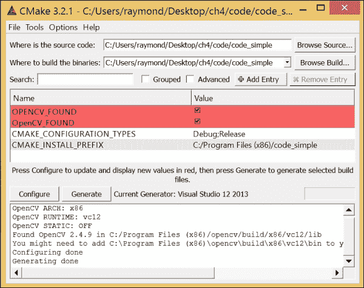

我们将为每个创建的项目重复此步骤，并相应地生成相应的 Microsoft Visual Studio 解决方案文件（例如，本例中的`code_simple.sln`）。要编译代码，使用 Microsoft Visual Studio 2013 打开`code_simple.sln`，并使用常规的构建（按*F7*）功能构建项目。确保在运行程序之前将`main`设置为启动项目（通过在**解决方案资源管理器**中右键单击`main`项目并左键单击**设置为启动项目**选项），如下所示：


## 参见

关于安装的每个库的进一步文档可以在此处找到：

+   **GLEW**: [`glew.sourceforge.net/`](http://glew.sourceforge.net/)

+   **GLM**: [`glm.g-truc.net/0.9.5/index.html`](http://glm.g-truc.net/0.9.5/index.html)

+   **SOIL**: [`www.lonesock.net/soil.html`](http://www.lonesock.net/soil.html)

+   **OpenCV**: [`opencv.org/`](http://opencv.org/)

# 在 Mac OS X/Linux 中设置 GLEW、GLM、SOIL 和 OpenCV 库

在本节中，我们将概述在 Mac OS X 和 Linux 中设置相同库所需的步骤。

## 准备工作

我们首先需要从以下网站下载必备库：

1.  **GLEW** (glew-1.10.0): [`sourceforge.net/projects/glew/files/glew/1.10.0/glew-1.10.0.tgz`](https://sourceforge.net/projects/glew/files/glew/1.10.0/glew-1.10.0.tgz)

1.  **GLM** (glm-0.9.5.4): [`sourceforge.net/projects/ogl-math/files/glm-0.9.5.4/glm-0.9.5.4.zip`](http://sourceforge.net/projects/ogl-math/files/glm-0.9.5.4/glm-0.9.5.4.zip)

1.  **SOIL**: [`www.lonesock.net/files/soil.zip`](http://www.lonesock.net/files/soil.zip)

1.  **OpenCV** (opencv-2.4.9): [`sourceforge.net/projects/opencvlibrary/files/opencv-unix/2.4.9/opencv-2.4.9.zip`](http://sourceforge.net/projects/opencvlibrary/files/opencv-unix/2.4.9/opencv-2.4.9.zip)

为了简化 Mac OS X 或 Ubuntu 用户的安装过程，强烈建议在 Mac OS X 中使用 MacPorts 或在 Linux 中使用`apt-get`命令（如第一章中所述，*开始使用 OpenGL*）。

以下部分假设下载目录为`~/opengl_dev`（参考第一章，*开始使用 OpenGL*）。

## 如何操作...

安装必备库有两种方法。第一种方法使用预编译的二进制文件。这些二进制文件是从远程仓库服务器获取的，库的版本更新由外部控制。这种方法的一个重要优点是简化了安装过程，特别是在解决依赖关系方面。然而，在发布环境中，建议您禁用自动更新，从而保护二进制文件不受版本偏差的影响。第二种方法要求用户直接下载并编译源代码，并进行各种自定义。这种方法适用于希望控制安装过程（如路径）的用户，同时也提供了更多跟踪和修复错误方面的灵活性。

对于初学者或寻找快速原型开发的开发者，我们建议使用第一种方法，因为它将简化工作流程并具有短期维护性。在 Ubuntu 或 Debian 系统上，我们可以使用`apt-get`命令安装各种库。要在 Ubuntu 上安装所有必备库及其依赖项，只需在终端中运行以下命令：

```cpp
sudo apt-get install libglm-dev libglew1.6-dev libsoil-dev libopencv

```

类似地，在 Mac OS X 上，我们可以通过终端中的命令行使用 MacPorts 安装 GLEW、OpenCV 和 GLM。

```cpp
sudo port install opencv glm glew

```

然而，SOIL 库目前不支持 MacPorts，因此，安装必须按照以下章节手动完成。

对于高级用户，我们可以通过直接从源代码编译来安装最新包，并且这些步骤在 Mac OS 以及其他 Linux OS 中都是通用的。

要编译 GLEW 包，请按照以下步骤操作：

1.  解压`glew-1.10.0.tgz`包：

    ```cpp
    tar xzvf glew-1.10.0.tgz

    ```

1.  在`/usr/include/GL`和`/usr/lib`中安装 GLEW：

    ```cpp
    cd glew-1.10.0
    make && sudo make install 

    ```

要设置仅包含头文件的 GLM 库，请按照以下步骤操作：

1.  解压`glm-0.9.5.4.zip`包：

    ```cpp
    unzip glm-0.9.5.4.zip

    ```

1.  将仅包含头文件的 GLM 库目录（`~/opengl_dev/glm/glm`）复制到`/usr/include/glm`：

    ```cpp
    sudo cp -r glm/glm/ /usr/include/glm

    ```

要设置 SOIL 库，请按照以下步骤操作：

1.  解压`soil.zip`包：

    ```cpp
    unzip soil.zip

    ```

1.  编辑`makefile`（位于`projects/makefile`目录中）并将`-arch x86_64`和`-arch i386`添加到`CXXFLAGS`以确保适当的支持：

    ```cpp
    CXXFLAGS =-arch x86_64 –arch i386 -O2 -s -Wall

    ```

1.  编译源代码库：

    ```cpp
    cd Simple\ OpenGL\ Image\ Library/projects/makefile
    mkdir obj
    make && sudo make install

    ```

要设置 OpenCV 库，请按照以下步骤操作：

1.  解压`opencv-2.4.9.zip`包：

    ```cpp
    unzip opencv-2.4.9.zip

    ```

1.  使用`CMake`构建 OpenCV 库：

    ```cpp
    cd opencv-2.4.9/
    mkdir build
    cd build
    cmake ../
    make && sudo make install

    ```

1.  配置库路径：

    ```cpp
    sudo sh -c 'echo "/usr/local/lib" > /etc/ld.so.conf.d/opencv.conf'
    sudo ldconfig –v 

    ```

1.  在开发环境完全配置后，我们现在可以在每个项目文件夹中创建编译脚本（`Makefile`）：

    ```cpp
    CFILES = ../common/shader.cpp ../common/texture.cpp ../common/controls.cpp main.cpp 
    CFLAGS = -O3 -c -Wall
    INCLUDES = -I/usr/include -I/usr/include/SOIL -I../common  `pkg-config --cflags glfw3` `pkg-config --cflags opencv`
    LIBS = -lm -L/usr/local/lib -lGLEW -lSOIL  `pkg-config --static --libs glfw3` `pkg-config --libs opencv`
    CC = g++
    OBJECTS=$(CFILES:.cpp=.o)
    EXECUTABLE=main
    all: $(CFILES) $(EXECUTABLE) 
    $(EXECUTABLE): $(OBJECTS) 
     $(CC) $(INCLUDES) $(OBJECTS) -o $@ $(LIBS)
    .cpp.o:
     $(CC) $(CFLAGS) $(INCLUDES) $< -o $@

    clean:
     rm -v -f *~ ../common/*.o *.o *.obj $(EXECUTABLE)

    ```

要编译代码，我们只需在项目目录中运行`make`命令，它将自动生成可执行文件（`main`）。

## 参见

关于已安装的每个库的进一步文档可以在此找到：

+   **GLEW**: [`glew.sourceforge.net/`](http://glew.sourceforge.net/)

+   **GLM**: [`glm.g-truc.net/0.9.5/index.html`](http://glm.g-truc.net/0.9.5/index.html)

+   **SOIL**: [`www.lonesock.net/soil.html`](http://www.lonesock.net/soil.html)

+   **OpenCV**: [`opencv.org/`](http://opencv.org/)

+   **MacPorts**: [`www.macports.org/`](http://www.macports.org/)

# 使用 GLSL 创建你的第一个顶点和片段着色器

在我们能够使用 OpenGL 渲染图像之前，我们首先需要了解 GLSL 的基本知识。特别是，着色程序的概念在 GLSL 中至关重要。着色器是简单地运行在图形处理器（GPU）上的程序，一组着色器被编译并链接形成一个程序。这一概念是由于现代图形硬件中各种常见处理任务的日益复杂而产生的，例如顶点和片段处理，这需要专用处理器的更大可编程性。因此，顶点着色器和片段着色器是我们在这里将涵盖的两种重要类型的着色器，它们分别运行在顶点处理器和片段处理器上。以下是一个简化的整体处理流程图：

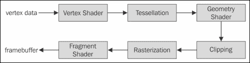

顶点着色器的主要目的是处理流式传输的顶点数据。一个重要的处理任务是将每个顶点的位置从 3D 虚拟空间转换到屏幕上显示的 2D 坐标。顶点着色器还可以操纵颜色和纹理坐标。因此，顶点着色器是 OpenGL 管道中的一个重要组件，用于控制移动、光照和颜色。

片段着色器主要是为了计算单个像素（片段）的最终颜色。通常，我们在这个阶段实现各种图像后处理技术，如模糊或锐化；最终结果存储在帧缓冲区中，这将显示在屏幕上。

对于想要了解整个管道的读者，可以在 [`www.opengl.org/wiki/Rendering_Pipeline_Overview`](https://www.opengl.org/wiki/Rendering_Pipeline_Overview) 找到这些阶段的详细总结，例如裁剪、光栅化和细分。此外，可以在 [`www.opengl.org/registry/doc/GLSLangSpec.4.40.pdf`](https://www.opengl.org/registry/doc/GLSLangSpec.4.40.pdf) 找到 GLSL 的详细文档。

## 准备工作

在这个阶段，我们应该已经安装了所有必要的库，例如 GLEW、GLM 和 SOIL。配置好 GLFW 以支持 OpenGL 核心配置文件后，我们现在可以开始实现第一个简单的示例代码，该代码利用了现代 OpenGL 管道。

## 如何做到这一点...

为了使代码简单，我们将程序分为两个组件：主程序（`main.cpp`）和着色器程序（`shader.cpp`、`shader.hpp`、`simple.vert` 和 `simple.frag`）。主程序执行设置简单演示的基本任务，而着色器程序在现代 OpenGL 管道中执行专门的处理。完整的示例代码可以在 `code_simple` 文件夹中找到。

首先，让我们看一下着色器程序。我们将创建两个非常简单的顶点和片段着色器程序（在 `simple.vert` 和 `simple.frag` 文件中指定），这些程序将在程序运行时编译和加载。

对于 `simple.vert` 文件，输入以下代码行：

```cpp
#version 150 
in vec3 position;
in vec3 color_in;
out vec3 color;
void main() {
  color = color_in;
  gl_Position = vec4(position, 1.0);
}
```

对于 `simple.frag` 文件，输入以下代码行：

```cpp
#version 150 
in vec3 color;
out vec4 color_out;
void main() {
  color_out = vec4(Color, 1.0);
}
```

首先，让我们在 `shader.hpp` 内定义一个名为 `LoadShaders` 的函数，用于编译和加载着色器程序（`simple.frag` 和 `simple.vert`）：

```cpp
#ifndef SHADER_HPP
#define SHADER_HPP
GLuint LoadShaders(const char * vertex_file_path,const char * fragment_file_path);
#endif
```

接下来，我们将创建 `shader.cpp` 文件以实现 `LoadShaders` 函数和两个处理文件 I/O（`readSourceFile`）以及着色器编译（`CompileShader`）的辅助函数：

1.  包含必要的库和 `shader.hpp` 头文件：

    ```cpp
    #include <iostream>
    #include <fstream>
    #include <algorithm>
    #include <vector>
    #include "shader.hpp"
    ```

1.  按如下方式实现 `readSourceFile` 函数：

    ```cpp
    std::string readSourceFile(const char *path){
      std::string code;
      std::ifstream file_stream(path, std::ios::in);
      if(file_stream.is_open()){
        std::string line = "";
        while(getline(file_stream, line))
        code += "\n" + line;
        file_stream.close();
        return code;
      }else{
        printf("Failed to open \"%s\".\n", path);
        return "";
      }
    }
    ```

1.  按如下方式实现 `CompileShader` 函数：

    ```cpp
    void CompileShader(std::string program_code, GLuint shader_id){
      GLint result = GL_FALSE;
      int infolog_length;
      char const * program_code_pointer = program_code.c_str();
      glShaderSource(shader_id, 1, &program_code_pointer , NULL);
      glCompileShader(shader_id);
      //check the shader for successful compile
      glGetShaderiv(shader_id, GL_COMPILE_STATUS, &result);
      glGetShaderiv(shader_id, GL_INFO_LOG_LENGTH, &infolog_length);
      if ( infolog_length > 0 ){
        std::vector<char> error_msg(infolog_length+1);
        glGetShaderInfoLog(shader_id, infolog_length, NULL, &error_msg[0]);
        printf("%s\n", &error_msg[0]);
      }
    }
    ```

1.  现在，让我们实现 `LoadShaders` 函数。首先，创建着色器 ID 并从由 `vertex_file_path` 和 `fragment_file_path` 指定的两个文件中读取着色器代码：

    ```cpp
    GLuint LoadShaders(const char * vertex_file_path,const char * fragment_file_path){
      GLuint vertex_shader_id = glCreateShader(GL_VERTEX_SHADER);
      GLuint fragment_shader_id = glCreateShader(GL_FRAGMENT_SHADER);
      std::string vertex_shader_code = readSourceFile(vertex_file_path);
      if(vertex_shader_code == ""){
        return 0; 
      }
      std::string fragment_shader_code = readSourceFile(fragment_file_path);
      if(fragment_shader_code == ""){
        return 0; 
      }
    ```

1.  编译顶点着色器和片段着色器程序：

    ```cpp
      printf("Compiling Vertex shader : %s\n", vertex_file_path);
      CompileShader(vertex_shader_code, vertex_shader_id);
      printf("Compiling Fragment shader : %s\n",fragment_file_path);
      CompileShader(fragment_shader_code, fragment_shader_id);
    ```

1.  将程序链接在一起，检查错误，并清理：

    ```cpp
      GLint result = GL_FALSE;
      int infolog_length;
      printf("Linking program\n");
      GLuint program_id = glCreateProgram();
      glAttachShader(program_id, vertex_shader_id);
      glAttachShader(program_id, fragment_shader_id);
      glLinkProgram(program_id);
      //check the program and ensure that the program is linked properly
      glGetProgramiv(program_id, GL_LINK_STATUS, &result);
      glGetProgramiv(program_id, GL_INFO_LOG_LENGTH, &infolog_length);
      if ( infolog_length > 0 ){
        std::vector<char> program_error_msg(infolog_length+1);
        glGetProgramInfoLog(program_id, infolog_length, NULL, &program_error_msg[0]);
        printf("%s\n", &program_error_msg[0]);
      }else{
        printf("Linked Successfully\n");
      }

      //flag for delete, and will free all memories
      //when the attached program is deleted
      glDeleteShader(vertex_shader_id);
      glDeleteShader(fragment_shader_id);
      return program_id;
    }
    ```

最后，让我们使用`main.cpp`文件将所有内容组合在一起：

1.  在公共文件夹中包含先决库和着色器程序头文件：

    ```cpp
    #include <stdio.h>
    #include <stdlib.h>
    //GLFW and GLEW libraries
    #include <GL/glew.h>
    #include <GLFW/glfw3.h>
    #include "common/shader.hpp"
    ```

1.  创建一个用于 GLFW 窗口的全局变量：

    ```cpp
    //Global variables
    GLFWwindow* window;
    ```

1.  使用 GLFW 库的初始化启动主程序：

    ```cpp
    int main(int argc, char **argv)
    {
      //Initialize GLFW
      if(!glfwInit()){
        fprintf( stderr, "Failed to initialize GLFW\n" );
        exit(EXIT_FAILURE);
      }
    ```

1.  设置 GLFW 窗口：

    ```cpp
      //enable anti-aliasing 4x with GLFW
      glfwWindowHint(GLFW_SAMPLES, 4);
      /* specify the client API version that the created context must be compatible with. */
      glfwWindowHint(GLFW_CONTEXT_VERSION_MAJOR, 3);
      glfwWindowHint(GLFW_CONTEXT_VERSION_MINOR, 2);
      //make the GLFW forward compatible
      glfwWindowHint(GLFW_OPENGL_FORWARD_COMPAT, GL_TRUE);
      //use the OpenGL Core 
      glfwWindowHint(GLFW_OPENGL_PROFILE, GLFW_OPENGL_CORE_PROFILE);
    ```

1.  创建 GLFW 窗口对象并在调用线程中将指定窗口的上下文设置为当前：

    ```cpp
      window = glfwCreateWindow(640, 480, "Chapter 4 - GLSL", NULL, NULL);
      if(!window){
        fprintf( stderr, "Failed to open GLFW window. If you have an Intel GPU, they are not 3.3 compatible. Try the 2.1 version of the tutorials.\n" );
        glfwTerminate();
        exit(EXIT_FAILURE);
      }
      glfwMakeContextCurrent(window);
      glfwSwapInterval(1);
    ```

1.  初始化 GLEW 库并包含对实验性驱动程序的支持：

    ```cpp
      glewExperimental = true; 
      if (glewInit() != GLEW_OK) {
        fprintf(stderr, "Final to Initialize GLEW\n");
        glfwTerminate();
        exit(EXIT_FAILURE);
      }
    ```

1.  设置着色器程序：

    ```cpp
      GLuint program = LoadShaders("simple.vert", "simple.frag");
      glBindFragDataLocation(program, 0, "color_out");
      glUseProgram(program);
    ```

1.  设置顶点缓冲对象（和颜色缓冲区）并将顶点数据复制到其中：

    ```cpp
      GLuint vertex_buffer;
      GLuint color_buffer;
      glGenBuffers(1, &vertex_buffer);
      glGenBuffers(1, &color_buffer);
      const GLfloat vertices[] = {
        -1.0f, -1.0f, 0.0f,
        1.0f, -1.0f, 0.0f,
        1.0f, 1.0f, 0.0f,
        -1.0f, -1.0f, 0.0f,
        1.0f, 1.0f, 0.0f,
        -1.0f, 1.0f, 0.0f
      };
      const GLfloat colors[]={
        0.0f, 0.0f, 1.0f,
        0.0f, 1.0f, 0.0f,
        1.0f, 0.0f, 0.0f,
        0.0f, 0.0f, 1.0f,
        1.0f, 0.0f, 0.0f,
        0.0f, 1.0f, 0.0f
      };

      glBindBuffer(GL_ARRAY_BUFFER, vertex_buffer);
      glBufferData(GL_ARRAY_BUFFER, sizeof(vertices), vertices, GL_STATIC_DRAW);
      glBindBuffer(GL_ARRAY_BUFFER, color_buffer);
      glBufferData(GL_ARRAY_BUFFER, sizeof(colors), colors, GL_STATIC_DRAW);
    ```

1.  指定顶点数据的布局：

    ```cpp
      GLint position_attrib = glGetAttribLocation(program, "position");
      glEnableVertexAttribArray(position_attrib);
      glBindBuffer(GL_ARRAY_BUFFER, vertex_buffer);
      glVertexAttribPointer(position_attrib, 3, GL_FLOAT, GL_FALSE, 0, (void*)0);

      GLint color_attrib = glGetAttribLocation(program, "color_in");
      glEnableVertexAttribArray(color_attrib);
      glBindBuffer(GL_ARRAY_BUFFER, color_buffer);
      glVertexAttribPointer(color_attrib, 3, GL_FLOAT, GL_FALSE, 0, (void*)0);
    ```

1.  运行绘图程序：

    ```cpp
      while(!glfwWindowShouldClose(window)){
        // Clear the screen to black
        glClearColor(0.0f, 0.0f, 0.0f, 1.0f);
        glClear(GL_COLOR_BUFFER_BIT);
        // Draw a rectangle from the 2 triangles using 6 vertices
        glDrawArrays(GL_TRIANGLES, 0, 6);
        glfwSwapBuffers(window);
        glfwPollEvents();
      }
    ```

1.  清理并退出程序：

    ```cpp
      //clean up the memories
      glDisableVertexAttribArray(position_attrib);
      glDisableVertexAttribArray(color_attrib);
      glDeleteBuffers(1, &vertex_buffer);
      glDeleteBuffers(1, &color_buffer);
      glDeleteVertexArrays(1, &vertex_array);
      glDeleteProgram(program);
      // Close OpenGL window and terminate GLFW
      glfwDestroyWindow(window);
      glfwTerminate();
      exit(EXIT_SUCCESS);
    }
    ```

现在我们通过定义自定义着色器创建了第一个 GLSL 程序：

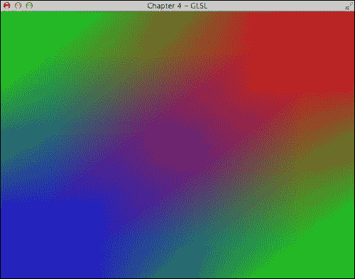

## 它是如何工作的...

由于这个实现中有多个组件，我们将分别突出每个组件的关键特性，按照与上一节相同的顺序组织，为了简单起见，使用相同的文件名。

在`simple.vert`中，我们定义了一个简单的顶点着色器。在第一个简单实现中，顶点着色器只是将信息传递给渲染管道的其余部分。首先，我们需要定义与 OpenGL 3.2 支持相对应的 GLSL 版本，即 1.50 (`#version 150`)。顶点着色器接受两个参数：顶点的位置（`in vec3 position`）和颜色（`in vec3 color_in`）。请注意，只有颜色在输出变量中明确定义（`out vec3 color`），因为`gl_Position`是一个内置变量。通常，在 OpenGL 的着色器程序中不应使用以`gl`为前缀的变量名，因为这些是为内置变量保留的。注意，最终的位置`gl_Position`是以齐次坐标表示的。

在`simple.frag`中，我们定义了片段着色器，它再次将颜色信息传递到输出帧缓冲区。请注意，最终输出（`color_out`）是以 RGBA 格式表示的，其中 A 是 alpha 值（透明度）。

接下来，在`shader.cpp`中，我们创建了一个框架来编译和链接着色器程序。工作流程与 C/C++的传统代码编译有一些相似之处。简要来说，有六个主要步骤：

1.  创建一个着色器对象（`glCreateShader`）。

1.  读取并设置着色器源代码（`glShaderSource`）。

1.  编译（`glCompileShader`）。

1.  创建最终的程序 ID（`glCreateProgram`）。

1.  将着色器附加到程序 ID（`glAttachShader`）。

1.  将所有内容链接在一起（`glLinkProgram`）。

最后，在`main.cpp`中，我们设置了一个演示来展示编译后的着色器程序的使用。正如本章“现代 OpenGL 入门”部分所述，我们需要使用`glfwWindowHint`函数在 OpenGL 3.2 中正确创建 GLFW 窗口上下文。这个演示的一个有趣之处在于，尽管我们只定义了六个顶点（使用`glDrawArrays`函数绘制的两个三角形各三个顶点）及其相应的颜色，但最终结果是插值的颜色渐变。

# 使用纹理映射渲染 2D 图像

现在我们已经通过一个简单的示例介绍了 GLSL 的基础知识，我们将引入更多的复杂性，以提供一个完整的框架，使用户能够在未来修改渲染管道的任何部分。

本框架中的代码被划分为更小的模块，以处理着色器程序（`shader.cpp`和`shader.hpp`）、纹理映射（`texture.cpp`和`texture.hpp`）以及用户输入（`controls.hpp`和`controls.hpp`）。首先，我们将重用之前在 OpenGL 中引入的加载着色器程序的机制，并纳入新的着色器程序以供我们的目的使用。接下来，我们将介绍纹理映射所需的步骤。最后，我们将描述主程序，它整合了所有逻辑部分并准备最终的演示。在本节中，我们将展示如何加载图像并将其转换为 OpenGL 中渲染的纹理对象。考虑到这个框架，我们将在下一节进一步演示如何渲染视频。

## 准备工作

为了避免重复，我们将引导读者参考前文中的部分内容（特别是`shader.cpp`和`shader.hpp`）。

## 如何实现...

首先，我们将程序中使用的所有常用库聚合到`common.h`头文件中。然后，`common.h`文件被包含在`shader.hpp`、`controls.hpp`、`texture.hpp`和`main.cpp`中：

```cpp
#ifndef _COMMON_h
#define _COMMON_h
#include <stdlib.h>
#include <string.h>
#include <stdio.h>
#include <string>
#include <GL/glew.h>
#include <GLFW/glfw3.h>
using namespace std; 
#endif
```

我们之前实现了一个从文件中加载片段和顶点着色器程序的机制，并将在此处重用代码（`shader.cpp`和`shader.hpp`）。然而，我们将修改实际的顶点和着色器程序如下。

对于顶点着色器（`transform.vert`），我们将实现以下内容：

```cpp
#version 150 
in vec2 UV;
out vec4 color;
uniform sampler2D textureSampler;
void main(){
  color = texture(textureSampler, UV).rgba;
}
```

对于片段着色器（`texture.frag`），我们将实现以下内容：

```cpp
#version 150
in vec3 vertexPosition_modelspace;
in vec2 vertexUV;
out vec2 UV;
uniform mat4 MVP;
void main(){
  //position of the vertex in clip space
  gl_Position = MVP * vec4(vertexPosition_modelspace,1);
  UV = vertexUV;
}
```

对于纹理对象，在`texture.cpp`中，我们提供了一个机制来将图像或视频流加载到纹理内存中。我们还利用了 SOIL 库进行简单的图像加载，以及 OpenCV 库进行更高级的视频流处理和过滤（参考下一节）。

在`texture.cpp`中，我们将实现以下内容：

1.  包含`texture.hpp`头文件和 SOIL 库头文件以进行简单的图像加载：

    ```cpp
    #include "texture.hpp"
    #include <SOIL.h>
    ```

1.  定义纹理对象的初始化并设置所有参数：

    ```cpp
    GLuint initializeTexture(const unsigned char *image_data, int width, int height, GLenum format){
      GLuint textureID=0;
      //create and bind one texture element
      glGenTextures(1, &textureID);
      glBindTexture(GL_TEXTURE_2D, textureID);
      glPixelStorei(GL_UNPACK_ALIGNMENT,1);
      /* Specify target texture. The parameters describe the format and type of the image data */
      glTexImage2D(GL_TEXTURE_2D, 0, GL_RGBA, width, height, 0, format, GL_UNSIGNED_BYTE, image_data);
      /* Set the wrap parameter for texture coordinate s & t to GL_CLAMP, which clamps the coordinates within [0, 1] */
      glTexParameteri(GL_TEXTURE_2D, GL_TEXTURE_WRAP_S, GL_CLAMP_TO_EDGE);
      glTexParameteri(GL_TEXTURE_2D, GL_TEXTURE_WRAP_T, GL_CLAMP_TO_EDGE);
      /* Set the magnification method to linear and return weighted average of four texture elements closest to the center of the pixel */
      glTexParameteri(GL_TEXTURE_2D, GL_TEXTURE_MAG_FILTER, GL_LINEAR);
      /* Choose the mipmap that most closely matches the size of the pixel being textured and use the GL_NEAREST criterion (the texture element nearest to the center of the pixel) to produce a texture value. */
      glTexParameteri(GL_TEXTURE_2D, GL_TEXTURE_MIN_FILTER, GL_LINEAR_MIPMAP_LINEAR);
      glGenerateMipmap(GL_TEXTURE_2D);
      return textureID;
    }
    ```

1.  定义更新纹理内存的例程：

    ```cpp
    void updateTexture(const unsigned char *image_data, int width, int height, GLenum format){
      // Update Texture
      glTexSubImage2D (GL_TEXTURE_2D, 0, 0, 0, width, height, format, GL_UNSIGNED_BYTE, image_data);
      /* Sets the wrap parameter for texture coordinate s & t to GL_CLAMP, which clamps the coordinates within [0, 1]. */
      glTexParameteri(GL_TEXTURE_2D, GL_TEXTURE_WRAP_S, GL_CLAMP_TO_EDGE);
      glTexParameteri(GL_TEXTURE_2D, GL_TEXTURE_WRAP_T, GL_CLAMP_TO_EDGE);
      /* Set the magnification method to linear and return weighted average of four texture elements closest to the center of the pixel */
      glTexParameteri(GL_TEXTURE_2D, GL_TEXTURE_MAG_FILTER, GL_LINEAR);
      /* Choose the mipmap that most closely matches the size of the pixel being textured and use the GL_NEAREST criterion (the texture element nearest to the center of the pixel) to produce a texture value. */
      glTexParameteri(GL_TEXTURE_2D, GL_TEXTURE_MIN_FILTER, GL_LINEAR_MIPMAP_LINEAR);
      glGenerateMipmap(GL_TEXTURE_2D);
    }
    ```

1.  最后，实现图像的纹理加载机制。该函数接受图像路径并自动将图像转换为纹理对象兼容的各种格式：

    ```cpp
    GLuint loadImageToTexture(const char * imagepath){
      int width, height, channels;
      GLuint textureID=0;
      //Load the images and convert them to RGBA format
      unsigned char* image = SOIL_load_image(imagepath, &width, &height, &channels, SOIL_LOAD_RGBA);
      if(!image){
        printf("Failed to load image %s\n", imagepath);
        return textureID;
      }
      printf("Loaded Image: %d x %d - %d channels\n", width, height, channels);
      textureID=initializeTexture(image, width, height, GL_RGBA);
      SOIL_free_image_data(image);
      return textureID;
    }
    ```

在控制器方面，我们捕获箭头键并在实时中修改相机模型参数。这允许我们改变相机的位置和方向以及视场角度。在 `controls.cpp` 中，我们实现以下内容：

1.  包含 GLM 库头文件和 `controls.hpp` 头文件以进行投影矩阵和视图矩阵的计算：

    ```cpp
    #define GLM_FORCE_RADIANS
    #include <glm/glm.hpp>
    #include <glm/gtc/matrix_transform.hpp>
    #include "controls.hpp"
    ```

1.  定义全局变量（相机参数以及视图和投影矩阵）以在每一帧之后更新：

    ```cpp
    //initial position of the camera
    glm::vec3 g_position = glm::vec3( 0, 0, 2 );
    const float speed = 3.0f; // 3 units / second
    float g_initial_fov = glm::pi<float>()*0.4f;
    //the view matrix and projection matrix
    glm::mat4 g_view_matrix;
    glm::mat4 g_projection_matrix;
    ```

1.  创建辅助函数以返回最新的视图矩阵和投影矩阵：

    ```cpp
    glm::mat4 getViewMatrix(){
      return g_view_matrix;
    }
    glm::mat4 getProjectionMatrix(){
      return g_projection_matrix;
    }
    ```

1.  根据用户输入计算视图矩阵和投影矩阵：

    ```cpp
    void computeViewProjectionMatrices(GLFWwindow* window){
      static double last_time = glfwGetTime();
      // Compute time difference between current and last frame
      double current_time = glfwGetTime();
      float delta_time = float(current_time - last_time);
      int width, height;
      glfwGetWindowSize(window, &width, &height);
      //direction vector for movement
      glm::vec3 direction(0, 0, -1);
      //up vector
      glm::vec3 up = glm::vec3(0,-1,0);
      if (glfwGetKey(window, GLFW_KEY_UP) == GLFW_PRESS){
        g_position += direction * delta_time * speed;
      }
      else if (glfwGetKey(window, GLFW_KEY_DOWN) == GLFW_PRESS){
        g_position -= direction * delta_time * speed;
      }
      else if (glfwGetKey(window, GLFW_KEY_RIGHT) == GLFW_PRESS){
        g_initial_fov -= 0.1 * delta_time * speed;
      }
      else if (glfwGetKey(window, GLFW_KEY_LEFT) == GLFW_PRESS){
        g_initial_fov += 0.1 * delta_time * speed;
      }
      /* update projection matrix: Field of View, aspect ratio, display range : 0.1 unit <-> 100 units */
      g_projection_matrix = glm::perspective(g_initial_fov, (float)width/(float)height, 0.1f, 100.0f);

      // update the view matrix
      g_view_matrix = glm::lookAt(
        g_position,      // camera position
        g_position+direction, // viewing direction
        up         // up direction
      );
      last_time = current_time;
    }
    ```

在 `main.cpp` 中，我们将使用之前定义的各种函数来完成实现：

1.  将 GLFW 和 GLM 库以及我们存储在名为 `common` 文件夹中的辅助函数包含在内：

    ```cpp
    #define GLM_FORCE_RADIANS
    #include <stdio.h>
    #include <stdlib.h>
    #include <GL/glew.h>
    #include <GLFW/glfw3.h>
    #include <glm/glm.hpp>
    #include <glm/gtc/matrix_transform.hpp>
    using namespace glm;
    #include <common/shader.hpp>
    #include <common/texture.hpp>
    #include <common/controls.hpp>
    #include <common/common.h>
    ```

1.  定义所有用于设置的全局变量：

    ```cpp
    GLFWwindow* g_window;
    const int WINDOWS_WIDTH = 1280;
    const int WINDOWS_HEIGHT = 720;
    float aspect_ratio = 3.0f/2.0f;
    float z_offset = 2.0f;
    float rotateY = 0.0f;
    float rotateX = 0.0f;
    //Our vertices
    static const GLfloat g_vertex_buffer_data[] = {
      -aspect_ratio,-1.0f,z_offset,
      aspect_ratio,-1.0f,z_offset,
      aspect_ratio,1.0f,z_offset,
      -aspect_ratio,-1.0f,z_offset,
      aspect_ratio,1.0f,z_offset,
      -aspect_ratio,1.0f,z_offset
    };
    //UV map for the vertices
    static const GLfloat g_uv_buffer_data[] = {
      1.0f, 0.0f,
      0.0f, 0.0f,
      0.0f, 1.0f,
      1.0f, 0.0f,
      0.0f, 1.0f,
      1.0f, 1.0f
    };
    ```

1.  定义键盘 `callback` 函数：

    ```cpp
    static void key_callback(GLFWwindow* window, int key, int scancode, int action, int mods)
    {
      if (action != GLFW_PRESS && action != GLFW_REPEAT)
      return;
      switch (key)
      {
        case GLFW_KEY_ESCAPE:
          glfwSetWindowShouldClose(window, GL_TRUE);
          break;
        case GLFW_KEY_SPACE:
          rotateX=0;
          rotateY=0;
          break;
        case GLFW_KEY_Z:
          rotateX+=0.01;
          break;
        case GLFW_KEY_X:
          rotateX-=0.01;
          break;
        case GLFW_KEY_A:
          rotateY+=0.01;
          break;
        case GLFW_KEY_S:
          rotateY-=0.01;
          break;
        default:
          break;
      }
    }
    ```

1.  使用启用 OpenGL 核心配置文件的 GLFW 库初始化：

    ```cpp
    int main(int argc, char **argv)
    {
      //Initialize the GLFW
      if(!glfwInit()){
        fprintf( stderr, "Failed to initialize GLFW\n" );
        exit(EXIT_FAILURE);
      }

      //enable anti-alising 4x with GLFW
      glfwWindowHint(GLFW_SAMPLES, 4);
      //specify the client API version 
      glfwWindowHint(GLFW_CONTEXT_VERSION_MAJOR, 3);
      glfwWindowHint(GLFW_CONTEXT_VERSION_MINOR, 2);
      //make the GLFW forward compatible
      glfwWindowHint(GLFW_OPENGL_FORWARD_COMPAT, GL_TRUE);
      //enable the OpenGL core profile for GLFW 
      glfwWindowHint(GLFW_OPENGL_PROFILE, GLFW_OPENGL_CORE_PROFILE);
    ```

1.  设置 GLFW 窗口和键盘输入处理程序：

    ```cpp
      //create a GLFW windows object
      window = glfwCreateWindow(WINDOWS_WIDTH, WINDOWS_HEIGHT, "Chapter 4 - Texture Mapping", NULL, NULL);
      if(!window){
        fprintf( stderr, "Failed to open GLFW window. If you have an Intel GPU, they are not 3.3 compatible. Try the 2.1 version of the tutorials.\n" );
        glfwTerminate();
        exit(EXIT_FAILURE);
      }
      /* make the context of the specified window current for the calling thread */
      glfwMakeContextCurrent(window);
      glfwSwapInterval(1);
      glewExperimental = true; // Needed for core profile
      if (glewInit() != GLEW_OK) {
        fprintf(stderr, "Final to Initialize GLEW\n");
        glfwTerminate();
        exit(EXIT_FAILURE);
      }
      //keyboard input callback
      glfwSetInputMode(window,GLFW_STICKY_KEYS,GL_TRUE);
      glfwSetKeyCallback(window, key_callback);
    ```

1.  设置黑色背景并启用 alpha 混合以实现各种视觉效果：

    ```cpp
      glClearColor(0.0f, 0.0f, 0.0f, 1.0f);
      glEnable(GL_BLEND);
      glBlendFunc(GL_SRC_ALPHA,GL_ONE_MINUS_SRC_ALPHA);
    ```

1.  加载顶点着色器和片段着色器：

    ```cpp
      GLuint program_id = LoadShaders( "transform.vert", "texture.frag" );
    ```

1.  使用 SOIL 库将图像文件加载到纹理对象中：

    ```cpp
      char *filepath;
      //load the texture from image with SOIL
      if(argc<2){
        filepath = (char*)malloc(sizeof(char)*512);
        sprintf(filepath, "texture.png");
      }
      else{
        filepath = argv[1];
      }

      int width;
      int height;
      GLuint texture_id = loadImageToTexture(filepath, &width, &height);

      aspect_ratio = (float)width/(float)height;
      if(!texture_id){
        //if we get 0 with no texture
        glfwTerminate();
        exit(EXIT_FAILURE); 
      }
    ```

1.  获取着色器程序中特定变量的位置：

    ```cpp
      //get the location for our "MVP" uniform variable
      GLuint matrix_id = glGetUniformLocation(program_id, "MVP");
      //get a handler for our "myTextureSampler" uniform
      GLuint texture_sampler_id = glGetUniformLocation(program_id, "textureSampler");
      //attribute ID for the variables
      GLint attribute_vertex, attribute_uv;
      attribute_vertex = glGetAttribLocation(program_id, "vertexPosition_modelspace");
      attribute_uv = glGetAttribLocation(program_id, "vertexUV");
    ```

1.  定义我们的 **顶点数组对象**（**VAO**）：

    ```cpp
      GLuint vertex_array_id;
      glGenVertexArrays(1, &vertex_array_id);
      glBindVertexArray(vertex_array_id);
    ```

1.  定义我们的顶点数组对象（VAO）和 UV 映射：

    ```cpp
      //initialize the vertex buffer memory.
      GLuint vertex_buffer;
      glGenBuffers(1, &vertex_buffer);
      glBindBuffer(GL_ARRAY_BUFFER, vertex_buffer);
      glBufferData(GL_ARRAY_BUFFER, sizeof(g_vertex_buffer_data), g_vertex_buffer_data, GL_STATIC_DRAW);
      //initialize the UV buffer memory
      GLuint uv_buffer;
      glGenBuffers(1, &uv_buffer);
      glBindBuffer(GL_ARRAY_BUFFER, uv_buffer);
      glBufferData(GL_ARRAY_BUFFER, sizeof(g_uv_buffer_data), g_uv_buffer_data, GL_STATIC_DRAW);
    ```

1.  使用着色器程序并绑定所有纹理单元和属性缓冲区：

    ```cpp
      glUseProgram(program_id);
      //binds our texture in Texture Unit 0
      glActiveTexture(GL_TEXTURE0);
      glBindTexture(GL_TEXTURE_2D, texture_id);
      glUniform1i(texture_sampler_id, 0);
      //1st attribute buffer: vertices for position
      glEnableVertexAttribArray(attribute_vertex);
      glBindBuffer(GL_ARRAY_BUFFER, vertex_buffer);
      glVertexAttribPointer(attribute_vertex, 3, GL_FLOAT, GL_FALSE, 0, (void*)0);
      //2nd attribute buffer: UVs mapping
      glEnableVertexAttribArray(attribute_uv);
      glBindBuffer(GL_ARRAY_BUFFER, uv_buffer);
      glVertexAttribPointer(attribute_uv, 2, GL_FLOAT, GL_FALSE, 0, (void*)0);
    ```

1.  在主循环中，清除屏幕和深度缓冲区：

    ```cpp
      //time-stamping for performance measurement
      double previous_time = glfwGetTime(); 
      do{
        //clear the screen
        glClear(GL_COLOR_BUFFER_BIT | GL_DEPTH_BUFFER_BIT);
        glClearColor(1.0f, 1.0f, 1.0f, 0.0f);
    ```

1.  计算变换并将信息存储在着色器变量中：

    ```cpp
        //compute the MVP matrix from keyboard and mouse input
        computeMatricesFromInputs(g_window);
        //obtain the View and Model Matrix for rendering
        glm::mat4 projection_matrix = getProjectionMatrix();
        glm::mat4 view_matrix = getViewMatrix();
        glm::mat4 model_matrix = glm::mat4(1.0);
        model_matrix = glm::rotate(model_matrix, glm::pi<float>() * rotateY, glm::vec3(0.0f, 1.0f, 0.0f));
        model_matrix = glm::rotate(model_matrix, glm::pi<float>() * rotateX, glm::vec3(1.0f, 0.0f, 0.0f));
        glm::mat4 mvp = projection_matrix * view_matrix * model_matrix;
        //send our transformation to the currently bound shader 
        //in the "MVP" uniform variable
        glUniformMatrix4fv(matrix_id, 1, GL_FALSE, &mvp[0][0]);
    ```

1.  绘制元素并刷新屏幕：

    ```cpp
        glDrawArrays(GL_TRIANGLES, 0, 6); //draw a square
        //swap buffers
        glfwSwapBuffers(window);
        glfwPollEvents();
    ```

1.  最后，定义退出 `main` 循环的条件并清除所有内存以优雅地退出程序：

    ```cpp
      } // Check if the ESC key was pressed or the window was closed
      while(!glfwWindowShouldClose(window) && glfwGetKey(window, GLFW_KEY_ESCAPE )!=GLFW_PRESS);
      glDisableVertexAttribArray(attribute_vertex);
      glDisableVertexAttribArray(attribute_uv);
      // Clean up VBO and shader
      glDeleteBuffers(1, &vertex_buffer);
      glDeleteBuffers(1, &uv_buffer);
      glDeleteProgram(program_id);
      glDeleteTextures(1, &texture_id);
      glDeleteVertexArrays(1, &vertex_array_id);
      // Close OpenGL window and terminate GLFW
      glfwDestroyWindow(g_window);
      glfwTerminate();
      exit(EXIT_SUCCESS);
    }
    ```

## 它是如何工作的...

为了展示框架在数据可视化中的应用，我们将将其应用于组织学切片（皮肤样本的 H&E 横切面）的可视化，如下面的截图所示：

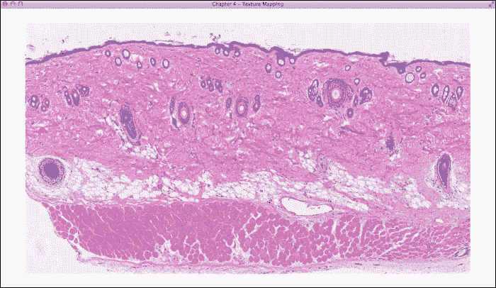

与之前的演示相比，一个重要的区别是这里，我们实际上将图像加载到纹理内存中（`texture.cpp`）。为了完成这项任务，我们使用 SOIL 库调用（`SOIL_load_image`）以 RGBA 格式（`GL_RGBA`）加载组织学图像，并使用 `glTexImage2D` 函数调用生成可以由着色器读取的纹理图像。

另一个重要的区别是，我们现在可以动态地重新计算视图(`g_view_matrix`)和投影(`g_projection_matrix`)矩阵，以实现交互式且有趣的 3D 空间中图像的可视化。请注意，包含 GLM 库头文件是为了方便矩阵计算。使用在`controls.cpp`中定义的键盘输入（上、下、左和右）以及 GLFW 库调用，我们可以放大和缩小幻灯片，以及调整视图角度，这为 3D 虚拟空间中的组织学图像提供了一个有趣的视角。以下是使用不同视角查看图像的屏幕截图：

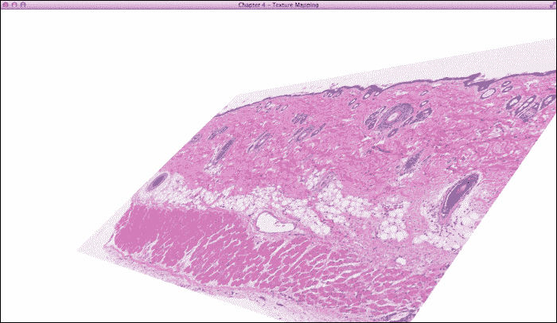

当前基于 OpenGL 的框架的另一个独特功能通过以下屏幕截图展示，该截图是通过将新的图像过滤器实现到片段着色器中生成的，该过滤器突出显示图像中的边缘。这展示了使用 OpenGL 渲染管线实时交互式可视化和处理 2D 图像的无限可能性，同时不牺牲 CPU 性能。这里实现的过滤器将在下一节中讨论。

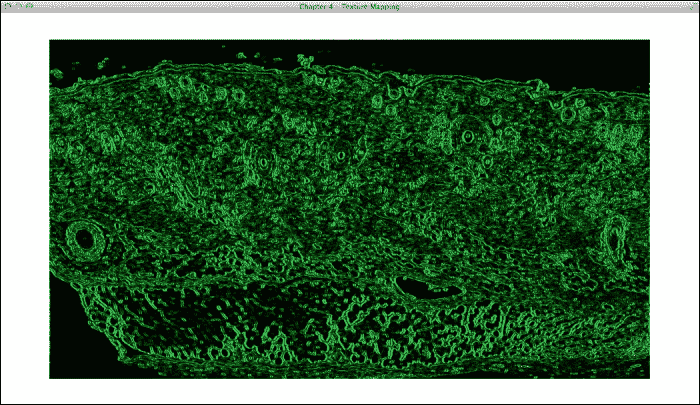

# 带过滤器的实时视频渲染

GLSL 着色器提供了一种简单的方法来执行高度并行的处理。在之前展示的纹理映射之上，我们将演示如何通过片段着色器实现一个简单的视频过滤器，该过滤器对缓冲帧的最终结果进行后处理。为了说明这项技术，我们实现了 Sobel 滤波器，并使用 OpenGL 管线渲染热图。之前在第三章中实现的，*交互式 3D 数据可视化*的热图函数现在将直接移植到 GLSL，仅做非常小的修改。

Sobel 算子是一种简单的图像处理技术，常用于计算机视觉算法，如边缘检测。这个算子可以定义为具有 3 x 3 核的卷积操作，如下所示：

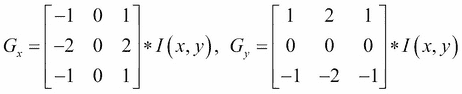

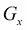和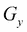分别是图像*I*在像素位置*(x, y)*的卷积操作得到的水平和垂直导数的结果。

我们还可以执行平方和操作来近似图像的梯度幅度：

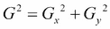

## 准备工作

这个演示基于之前的章节，其中渲染了一个图像。在本节中，我们将演示使用 OpenCV 库调用处理视频的图像序列或视频的渲染。在`common.h`中，我们将添加以下行以包含 OpenCV 库：

```cpp
#include <opencv2/opencv.hpp>
using namespace cv;
```

## 如何操作...

现在，让我们按照以下步骤完成实现：

1.  首先，修改 `main.cpp` 以启用 OpenCV 的视频处理。本质上，不是加载图像，而是将视频的单独帧输入到相同的管道中：

    ```cpp
    char *filepath;
    if(argc<2){
      filepath = (char*)malloc(sizeof(char)*512);
      sprintf(filepath, "video.mov");
    }
    else{
      filepath = argv[1];
    }
    //Handling Video input with OpenCV
    VideoCapture cap(filepath); // open the default camera
    Mat frame;
    if (!cap.isOpened()){ // check if we succeeded
      printf("Cannot open files\n");
      glfwTerminate();
      exit(EXIT_FAILURE);
      }else{
        cap >> frame; // get a new frame from camera
        printf("Got Video, %d x %d\n",frame.size().width, frame.size().height);
      }
      cap >> frame; // get a new frame from camera
      GLuint texture_id = initializeTexture(frame.data, frame.size().width, frame.size().height, GL_BGR);
      aspect_ratio = (float)frame.size().width/ (float)frame.size().height;
    ```

1.  然后，在 `main` 循环中添加 `update` 函数以在每一帧中更新纹理：

    ```cpp
      /* get the video feed, reset to beginning if it reaches the end of the video */
      if(!cap.grab()){
        printf("End of Video, Resetting\n");
        cap.release();
        cap.open(filepath); // open the default camera
      }
      cap >> frame; // get a new frame from camera
      //update the texture with the new frame
      updateTexture(frame.data, frame.size().width, frame.size().height, GL_BGR);
    ```

1.  接下来，修改片段着色器并将其重命名为 `texture_sobel.frag`（从 `texture.frag`）。在 `main` 函数中，我们将概述整体处理过程（使用 Sobel 滤波器和热图渲染器处理纹理缓冲区）：

    ```cpp
      void main(){
        //compute the results of Sobel filter
        float graylevel = sobel_filter();
        color = heatMap(graylevel, 0.1, 3.0);
      }
    ```

1.  现在，实现 Sobel 滤波器算法，该算法通过计算相邻像素来得到结果：

    ```cpp
      float sobel_filter()
      {
        float dx = 1.0 / float(1280);
        float dy = 1.0 / float(720);

        float s00 = pixel_operator(-dx, dy);
        float s10 = pixel_operator(-dx, 0);
        float s20 = pixel_operator(-dx,-dy);
        float s01 = pixel_operator(0.0,dy);
        float s21 = pixel_operator(0.0, -dy);
        float s02 = pixel_operator(dx, dy);
        float s12 = pixel_operator(dx, 0.0);
        float s22 = pixel_operator(dx, -dy);
        float sx = s00 + 2 * s10 + s20 - (s02 + 2 * s12 + s22);
        float sy = s00 + 2 * s01 + s02 - (s20 + 2 * s21 + s22);
        float dist = sx * sx + sy * sy;
        return dist;
      }
    ```

1.  定义计算亮度值的辅助函数：

    ```cpp
      float rgb2gray(vec3 color ) {
        return 0.2126 * color.r + 0.7152 * color.g + 0.0722 * color.b;
      }
    ```

1.  为像素操作操作创建辅助函数：

    ```cpp
      float pixel_operator(float dx, float dy){
        return rgb2gray(texture( textureSampler, UV + vec2(dx,dy)).rgb);
      }
    ```

1.  最后，定义热图渲染器原型并实现算法以更好地可视化值范围：

    ```cpp
      vec4 heatMap(float v, float vmin, float vmax){
        float dv;
        float r, g, b;
        if (v < vmin)
          v = vmin;
        if (v > vmax)
          v = vmax;
        dv = vmax - vmin;
        if(v == 0){
          return vec4(0.0, 0.0, 0.0, 1.0);
      }
      if (v < (vmin + 0.25f * dv)) {
        r = 0.0f;
        g = 4.0f * (v - vmin) / dv;
      } else if (v < (vmin + 0.5f * dv)) {
        r = 0.0f;
        b = 1.0f + 4.0f * (vmin + 0.25f * dv - v) / dv;
      } else if (v < (vmin + 0.75f * dv)) {
        r = 4.0f * (v - vmin - 0.5f * dv) / dv;
        b = 0.0f;
      } else {
        g = 1.0f + 4.0f * (vmin + 0.75f * dv - v) / dv;
        b = 0.0f;
      }
      return vec4(r, g, b, 1.0);
    }
    ```

## 如何工作...

这个演示有效地打开了使用 OpenGL 管道在片段着色阶段进行实时处理以渲染任何图像序列的可能性。以下截图是一个示例，说明了如何使用这个强大的 OpenGL 框架显示视频的一帧（显示书籍的作者），而不启用 Sobel 滤波器：

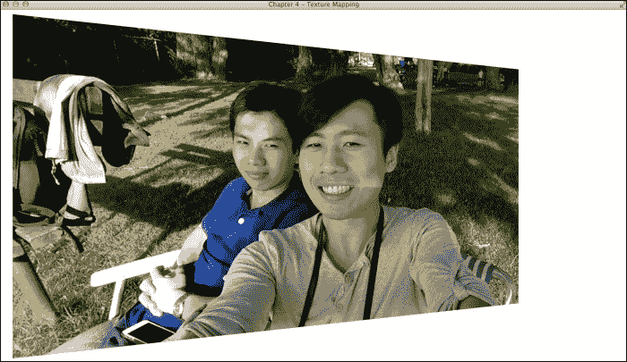

现在，启用 Sobel 滤波器和热图渲染后，我们看到一种使用实时 OpenGL 纹理映射和自定义着色器处理来可视化世界的方法：

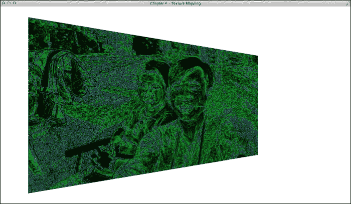

进一步微调阈值参数并将结果转换为灰度（在 `texture_sobel.frag` 文件中）将导致美观的输出：

```cpp
void main(){
  //compute the results of Sobel filter
  float graylevel = sobel_filter();
  color = vec4(graylevel, graylevel, graylevel, 1.0);
}
```

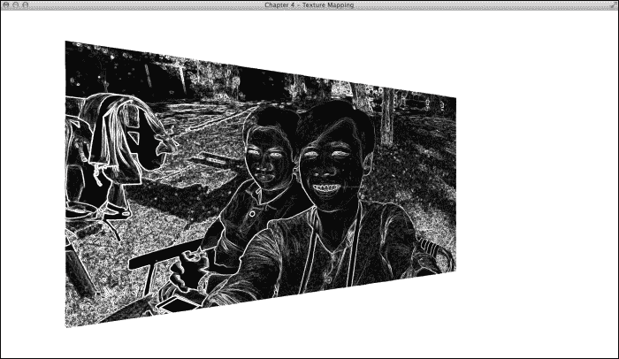

此外，我们可以通过修改着色器程序中的主函数（`texture_sobel.frag`）将这些结果与原始视频输入混合，以实时创建过滤效果：

```cpp
void main(){
  //compute the results of Sobel filter
  float graylevel = sobel_filter();
  //process the right side of the image
    if(UV.x > 0.5)
      color = heatMap(graylevel, 0.0, 3.0) + texture(textureSampler, UV);
      else
      color = vec4(graylevel, graylevel, graylevel, 1.0) + texture (textureSampler, UV);
}
```

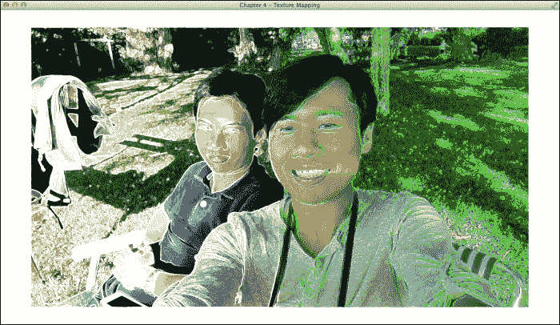

为了说明使用完全相同的程序来可视化成像数据集，这里有一个示例，展示了使用 **光学相干断层扫描**（**OCT**）成像的人指的体素数据集，只需更改输入视频的文件名：

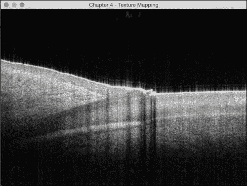

这张截图代表了这个体素 OCT 数据集中指甲床的 256 个横截面图像之一（以电影文件格式导出）。

这里还有一个示例，展示了使用 **偏振敏感光学相干断层扫描**（**PS-OCT**）成像的疤痕样本的体素数据集，它为疤痕区域提供了无标记的内在对比度：

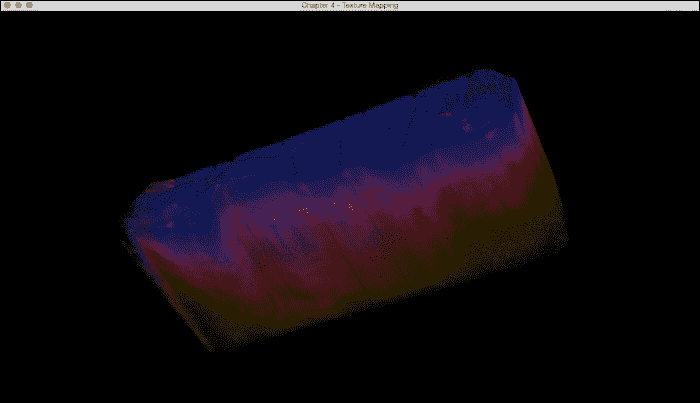

在这个案例中，体素 PS-OCT 数据集是用 ImageJ 3D Viewer 渲染的，并转换成了电影文件。颜色表示**偏振度**（**DOP**），这是衡量光偏振状态随机性的一个指标（低 DOP 在黄色/绿色，高 DOP 在蓝色），在皮肤中。疤痕区域与正常皮肤相比，具有高 DOP 的特征。

正如我们在这里所展示的，这个程序可以很容易地采用（通过更改输入视频源）来显示许多类型的数据集，例如内窥镜视频或其他体素成像数据集。在需要实时处理非常大的数据集的严格要求应用中，OpenGL 的实用性变得明显。
