# 第五章：3D 范围感应相机的点云数据渲染

在本章中，我们将涵盖以下主题：

+   开始使用微软 Kinect（PrimeSense）3D 范围感应相机

+   从深度感应相机捕获原始数据

+   带纹理映射和叠加的 OpenGL 点云渲染

# 简介

本章的目的是介绍可视化另一类有趣且新兴数据的技术：来自 3D 范围感应相机的深度信息。带有 3D 深度传感器的设备每天都在市场上出现，英特尔、微软、SoftKinetic、PMD、Structure Sensor 和 Meta（可穿戴增强现实眼镜）等公司都在使用这些新颖的 3D 感应设备来跟踪用户输入，例如手势交互和/或跟踪用户的环境。3D 传感器与 OpenGL 的有趣集成是能够从不同的视角查看场景，从而实现使用深度传感器捕获的场景的虚拟 3D 飞行浏览。在我们的案例中，对于数据可视化，能够在庞大的 3D 数据集中行走可能特别强大，在科学计算、城市规划以及许多涉及场景 3D 结构可视化的其他应用中。

在本章中，我们提出了一种简化的流程，它接受任何带有颜色（*r*，*g*，*b*）的 3D 点数据（*X*，*Y*，*Z*），并在屏幕上实时渲染这些点云。点云将直接从使用 3D 范围感应相机的现实世界数据中获得。我们还将提供绕点云飞行的方法和动态调整相机参数的方式。本章将在前一章讨论的 OpenGL 图形渲染管道的基础上构建，我们将向您展示一些额外的技巧来使用 GLSL 过滤数据。我们将使用我们的热图生成器显示深度信息，以在 2D 中查看深度，并使用纹理映射和透视投影将此数据重新映射到 3D 点云。这将使我们能够看到场景的真实深度渲染，并从任何视角在场景中导航。

# 开始使用微软 Kinect（PrimeSense）3D 范围感应相机

基于 PrimeSense 技术的微软 Kinect 3D 范围感应相机是一套有趣的设备，它通过使用光模式进行深度感应来估计场景的 3D 几何形状。3D 传感器具有一个主动红外激光投影仪，它发射编码的斑点光模式。这些传感器允许用户捕获彩色图像，并提供分辨率为 640 x 480 的 3D 深度图。由于 Kinect 传感器是一个主动传感器，它对室内照明条件（即，即使在黑暗中也能工作）不变，从而使得许多应用成为可能，例如手势和姿态跟踪以及 3D 扫描和重建。

在本节中，我们将演示如何设置此类范围感应相机，作为一个示例。虽然我们不需要读者为本章购买 3D 范围感应相机（因为我们将为运行我们的演示提供该设备捕获的原始数据），但我们将演示如何设置设备以直接捕获数据，主要针对那些对进一步实验实时 3D 数据感兴趣的人。

## 如何操作...

Windows 用户可以从[`structure.io/openni`](http://structure.io/openni)（或使用直接下载链接：[`com.occipital.openni.s3.amazonaws.com/OpenNI-Windows-x64-2.2.0.33.zip`](http://com.occipital.openni.s3.amazonaws.com/OpenNI-Windows-x64-2.2.0.33.zip)）下载 OpenNI 2 SDK 和驱动程序，并按照屏幕上的说明操作。Linux 用户可以从同一网站[`structure.io/openni`](http://structure.io/openni)下载 OpenNI 2 SDK。

Mac 用户可以按照以下步骤安装 OpenNI2 驱动程序：

1.  使用 Macport 安装库：

    ```cpp
    sudo port install libtool
    sudo port install libusb +universal

    ```

1.  从[`github.com/occipital/openni2`](https://github.com/occipital/openni2)下载 OpenNI2。

1.  使用以下命令编译源代码：

    ```cpp
    cd OpenNI2-master
    make
    cd Bin/x64-Release/

    ```

1.  运行`SimpleViewer`可执行文件：

    ```cpp
    ./SimpleViewer

    ```

如果你使用的是具有 USB 3.0 接口的计算机，那么首先升级 PrimeSense 传感器的固件到版本 1.0.9[`dasl.mem.drexel.edu/wiki/images/5/51/FWUpdate_RD109-112_5.9.2.zip`](http://dasl.mem.drexel.edu/wiki/images/5/51/FWUpdate_RD109-112_5.9.2.zip)非常重要。此升级需要 Windows 平台。请注意，为了继续操作，您必须安装 PrimeSense 传感器的 Windows 驱动程序[`structure.io/openni`](http://structure.io/openni)。执行`FWUpdate_RD109-112_5.9.2.exe`文件，固件将自动升级。有关固件的更多详细信息，请参阅[`dasl.mem.drexel.edu/wiki/index.php/4._Updating_Firmware_for_Primesense`](http://dasl.mem.drexel.edu/wiki/index.php/4._Updating_Firmware_for_Primesense)。

## 参见

可以从[`msdn.microsoft.com/en-us/library/jj131033.aspx`](http://msdn.microsoft.com/en-us/library/jj131033.aspx)获取 Microsoft Kinect 3D 系统的详细技术规格，并且有关安装 OpenNI2 驱动程序的进一步说明和先决条件可以在[`github.com/occipital/openni2`](https://github.com/occipital/openni2)找到。

此外，Microsoft Kinect V2 也可用，并且与 Windows 兼容。新的传感器提供更高分辨率的图像和更好的深度保真度。有关传感器的更多信息以及 Microsoft Kinect SDK，请参阅[`www.microsoft.com/en-us/kinectforwindows`](https://www.microsoft.com/en-us/kinectforwindows)。

# 从深度感应相机捕获原始数据

现在您已安装了必要的库和驱动程序，我们将演示如何从您的深度感应相机捕获原始数据。

## 如何操作...

要直接以二进制格式捕获传感器数据，实现以下函数：

```cpp
void writeDepthBuffer(openni::VideoFrameRef depthFrame){
  static int depth_buffer_counter=0;
  char file_name [512];
  sprintf(file_name, "%s%d.bin", "depth_frame", depth_buffer_counter);
  openni::DepthPixel *depthPixels = new openni::DepthPixel[depthFrame.getHeight()*depthFrame.getWidth()];
  memcpy(depthPixels, depthFrame.getData(), depthFrame.getHeight()*depthFrame.getWidth()*sizeof(uint16_t));
  std::fstream myFile (file_name, std::ios::out |std::ios::binary);
  myFile.write ((char*)depthPixels, depthFrame.getHeight()*depthFrame.getWidth()*sizeof(uint16_t));
  depth_buffer_counter++;
  printf("Dumped Depth Buffer %d\n",depth_buffer_counter);
  myFile.close();
  delete depthPixels;
}
```

同样，我们使用以下实现方法捕获原始的 RGB 颜色数据：

```cpp
  void writeColorBuffer(openni::VideoFrameRef colorFrame){
    static int color_buffer_counter=0;
    char file_name [512];
    sprintf(file_name, "%s%d.bin", "color_frame", color_buffer_counter);
    //basically unsigned char*
    const openni::RGB888Pixel* imageBuffer = (const openni::RGB888Pixel*)colorFrame.getData();
    std::fstream myFile (file_name, std::ios::out | std::ios::binary);
    myFile.write ((char*)imageBuffer, colorFrame.getHeight()*colorFrame.getWidth()*sizeof(uint8_t)*3);
    color_buffer_counter++;
    printf("Dumped Color Buffer %d, %d, %d\n", colorFrame.getHeight(), colorFrame.getWidth(), color_buffer_counter);
    myFile.close();
  }
```

上述代码片段可以添加到 OpenNI2 SDK 中提供深度和颜色数据可视化的任何示例代码中（以启用原始数据捕获）。我们建议您修改`OpenNI2-master/Samples/SimpleViewer`文件夹中的`Viewer.cpp`文件。修改后的示例代码包含在我们的代码包中。要捕获原始数据，请按*R*键，数据将被存储在`depth_frame0.bin`和`color_frame0.bin`文件中。

## 如何工作...

深度传感器实时返回两个数据流。一个数据流是 3D 深度图，存储在 16 位无符号短数据类型中（见以下图左侧）。另一个数据流是彩色图像（见以下图右侧），存储在每像素 24 位，RGB888 格式中（即内存按 R、G、B 顺序对齐，每个像素使用*8 位* *3 通道* = 24 位）。


二进制数据直接写入硬盘，不进行压缩或修改数据格式。在客户端，我们读取二进制文件，就像有连续的数据流和颜色数据对同步从硬件设备到达一样。OpenNI2 驱动程序提供了与基于 PrimeSense 的传感器（Microsoft Kinect 或 PS1080）接口的机制。

例如，`openni::VideoFrameRef depthFrame`变量存储了对深度数据缓冲区的引用。通过调用`depthFrame.getData()`函数，我们获得一个指向`DepthPixel`格式缓冲区的指针，这相当于无符号短数据类型。然后，我们使用`fstream`库中的`write()`函数将二进制数据写入文件。同样，我们使用彩色图像执行相同的任务，但数据存储在 RGB888 格式中。

此外，我们可以在 OpenNI2 中启用`setImageRegistrationMode`（`openni::IMAGE_REGISTRATION_DEPTH_TO_COLOR`）深度图注册功能，以自动计算并将深度值映射到颜色图像上。深度图叠加在颜色图像上，如图所示：

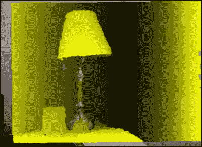

在下一节中，我们将假设原始深度图已经通过 OpenNI2 的图像配准预校准，可以直接用于计算真实世界的坐标和 UV 映射索引。

# 带纹理映射和叠加的 OpenGL 点云渲染

我们将在上一章讨论的 OpenGL 框架的基础上构建本节中的点云渲染。上一章中引入的纹理映射技术也可以应用于点云格式。基本上，深度传感器提供了一组实际空间中的顶点（深度图），而颜色相机为我们提供了顶点的颜色信息。一旦深度图和颜色相机校准，UV 映射就是一个简单的查找表。

## 准备工作

读者应使用提供的原始数据用于后续演示或从 3D 范围感应相机获取自己的原始数据。在任一情况下，我们假设这些文件名将用于表示原始数据文件：`depth_frame0.bin`和`color_frame0.bin`。

## 如何操作...

与上一章类似，我们将程序分为三个主要组件：主程序（`main.cpp`）、着色器程序（`shader.cpp`，`shader.hpp`，`pointcloud.vert`，`pointcloud.frag`）和纹理映射函数（`texture.cpp`，`texture.hpp`）。主程序执行设置演示的基本任务，而着色器程序执行专门的加工。纹理映射函数提供了一种将颜色信息加载并映射到顶点的机制。最后，我们修改`control.cpp`文件，通过各种额外的键盘输入（使用上、下、左、右箭头键进行缩放，以及使用*a*、*s*、*x*和*z*键调整旋转角度）提供对**飞行体验**的更精细控制。

首先，让我们看一下着色器程序。我们将在`pointcloud.vert`和`pointcloud.frag`文件中创建两个顶点和片段着色器程序，这些程序在程序运行时通过`shader.cpp`文件中的`LoadShaders`函数编译和加载。

对于`pointcloud.vert`文件，我们实现以下内容：

```cpp
#version 150 core
// Input vertex data
in vec3 vertexPosition_modelspace;
in vec2 vertexUV;
// Output data: interpolated for each fragment.
out vec2 UV;
out vec4 color_based_on_position;
// Values that stay constant for the whole mesh
uniform mat4 MVP;
//heat map generator
vec4 heatMap(float v, float vmin, float vmax){
  float dv;
  float r=1.0f, g=1.0f, b=1.0f;
  if (v < vmin)
    v = vmin;
  if (v > vmax)
    v = vmax;
  dv = vmax - vmin;
  if (v < (vmin + 0.25f * dv)) {
    r = 0.0f;
    g = 4.0f * (v - vmin) / dv;
  } else if (v < (vmin + 0.5f * dv)) {
    r = 0.0f;
    b = 1.0f+4.0f*(vmin+0.25f*dv-v)/dv;
  } else if (v < (vmin + 0.75f * dv)) {
    r = 4.0f*(v-vmin-0.5f*dv)/dv;
    b = 0.0f;
  } else {
    g = 1.0f+4.0f*(vmin+0.75f*dv-v)/dv;
    b = 0.0f;
  }
  return vec4(r, g, b, 1.0);
}
void main(){
  // Output position of the vertex, in clip space: MVP * position
  gl_Position =  MVP * vec4(vertexPosition_modelspace,1);
  color_based_on_position = heatMap(vertexPosition_modelspace.z, -3.0, 0.0f);
  UV = vertexUV;
}
```

对于`pointcloud.frag`文件，我们实现以下内容：

```cpp
#version 150 core
in vec2 UV;
out vec4 color;
uniform sampler2D textureSampler;
in vec4 color_based_on_position;
void main(){
  //blend the depth map color with RGB
  color = 0.5f*texture(textureSampler, UV).rgba+0.5f*color_based_on_position;
}
```

最后，让我们使用`main.cpp`文件将所有内容组合在一起：

1.  在公共文件夹中包含先决库和着色器程序头文件：

    ```cpp
    #include <stdio.h>
    #include <stdlib.h>
    //GLFW and GLEW libraries
    #include <GL/glew.h>
    #include <GLFW/glfw3.h>
    //GLM library
    #include <glm/glm.hpp>
    #include <glm/gtc/matrix_transform.hpp>
    #include "../common/shader.hpp"
    #include "../common/texture.hpp"
    #include "../common/controls.hpp"
    #include "../common/common.h"
    #include <fstream>
    ```

1.  为 GLFW 窗口创建一个全局变量：

    ```cpp
    GLFWwindow* window;
    ```

1.  定义输入深度数据集的宽度和高度以及其他用于渲染的窗口/相机属性：

    ```cpp
    const int WINDOWS_WIDTH = 640;
    const int WINDOWS_HEIGHT = 480;
    const int IMAGE_WIDTH = 320;
    const int IMAGE_HEIGHT = 240;
    float z_offset = 0.0f;
    float rotateY = 0.0f;
    float rotateX = 0.0f;
    ```

1.  定义辅助函数以解析原始深度和颜色数据：

    ```cpp
    unsigned short *readDepthFrame(const char *file_path){
      int depth_buffer_size = DEPTH_WIDTH*DEPTH_HEIGHT*sizeof(unsigned short);
      unsigned short *depth_frame = (unsigned short*)malloc(depth_buffer_size);
      char *depth_frame_pointer = (char*)depth_frame;
      //read the binary file
      ifstream myfile;
      myfile.open (file_path, ios::binary | ios::in);
      myfile.read(depth_frame_pointer, depth_buffer_size);
      return depth_frame;
    }
    unsigned char *readColorFrame(const char *file_path){
      int color_buffer_size = DEPTH_WIDTH*DEPTH_HEIGHT*sizeof(unsigned char)*3;
      unsigned char *color_frame = (unsigned char*)malloc(color_buffer_size);
      //read the binary file
      ifstream myfile;
      myfile.open (file_path, ios::binary | ios::in);
      myfile.read((char *)color_frame, color_buffer_size);
      return color_frame;
    }
    ```

1.  创建回调函数以处理按键：

    ```cpp
    static void key_callback(GLFWwindow* window, int key, int scancode, int action, int mods)
    {
      if (action != GLFW_PRESS && action != GLFW_REPEAT)
        return;
      switch (key)
      {
        case GLFW_KEY_ESCAPE:
          glfwSetWindowShouldClose(window, GL_TRUE);
          break;
        case GLFW_KEY_SPACE:
          rotateX=0;
          rotateY=0;
          break;
        case GLFW_KEY_Z:
          rotateX+=0.01;
          break;
        case GLFW_KEY_X:
          rotateX-=0.01;
          break;
        case GLFW_KEY_A:
          rotateY+=0.01;
          break;
        case GLFW_KEY_S:
          rotateY-=0.01;
          break;
        default:
          break;
      }
    }
    ```

1.  使用 GLFW 库的初始化启动主程序：

    ```cpp
    int main(int argc, char **argv)
    {
      if(!glfwInit()){
        fprintf( stderr, "Failed to initialize GLFW\n" );
        exit(EXIT_FAILURE);
      }
    ```

1.  设置 GLFW 窗口：

    ```cpp
      glfwWindowHint(GLFW_SAMPLES, 4);
      glfwWindowHint(GLFW_CONTEXT_VERSION_MAJOR, 3);
      glfwWindowHint(GLFW_CONTEXT_VERSION_MINOR, 2);
      glfwWindowHint(GLFW_OPENGL_FORWARD_COMPAT, GL_TRUE);
      glfwWindowHint(GLFW_OPENGL_PROFILE, GLFW_OPENGL_CORE_PROFILE);
    ```

1.  创建 GLFW 窗口对象并使其对调用线程当前：

    ```cpp
      g_window = glfwCreateWindow(WINDOWS_WIDTH, WINDOWS_HEIGHT, "Chapter 5 - 3D Point Cloud Rendering", NULL, NULL);
      if(!g_window){
        fprintf( stderr, "Failed to open GLFW window. If you have an Intel GPU, they are not 3.3 compatible. Try the 2.1 version of the tutorials.\n" );
        glfwTerminate();
        exit(EXIT_FAILURE);
      }
      glfwMakeContextCurrent(g_window);
      glfwSwapInterval(1);
    ```

1.  初始化 GLEW 库并包含对实验性驱动程序的支持：

    ```cpp
      glewExperimental = true;
      if (glewInit() != GLEW_OK) {
        fprintf(stderr, "Final to Initialize GLEW\n");
        glfwTerminate();
        exit(EXIT_FAILURE);
      }
    ```

1.  设置键盘回调：

    ```cpp
      glfwSetInputMode(g_window,GLFW_STICKY_KEYS,GL_TRUE);
      glfwSetKeyCallback(g_window, key_callback);
    ```

1.  设置着色器程序：

    ```cpp
      GLuint program_id = LoadShaders("pointcloud.vert", "pointcloud.frag");
    ```

1.  为所有深度像素创建顶点（*x*，*y*，*z*）：

    ```cpp
      GLfloat *g_vertex_buffer_data = (GLfloat*)malloc(IMAGE_WIDTH*IMAGE_HEIGHT * 3*sizeof(GLfloat));
      GLfloat *g_uv_buffer_data = (GLfloat*)malloc(IMAGE_WIDTH*IMAGE_HEIGHT * 2*sizeof(GLfloat));
    ```

1.  使用先前定义的辅助函数读取原始数据：

    ```cpp
      unsigned short *depth_frame = readDepthFrame("depth_frame0.bin");
      unsigned char *color_frame = readColorFrame("color_frame0.bin");
    ```

1.  将颜色信息加载到纹理对象中：

    ```cpp
      GLuint texture_id = loadRGBImageToTexture(color_frame, IMAGE_WIDTH, IMAGE_HEIGHT);
    ```

1.  根据深度图在真实空间中创建一组顶点，并定义颜色映射的 UV 映射：

    ```cpp
      //divided by two due to 320x240 instead of 640x480 resolution
      float cx = 320.0f/2.0f;
      float cy = 240.0f/2.0f;
      float fx = 574.0f/2.0f;
      float fy = 574.0f/2.0f;
      for(int y=0; y<IMAGE_HEIGHT; y++){
        for(int x=0; x<IMAGE_WIDTH; x++){
          int index = y*IMAGE_WIDTH+x;
          float depth_value = (float)depth_frame[index]/1000.0f; //in meter
          int ver_index = index*3;
          int uv_index = index*2;
          if(depth_value != 0){
            g_vertex_buffer_data[ver_index+0] = ((float)x- cx)*depth_value/fx;
            g_vertex_buffer_data[ver_index+1] = ((float)y- cy)*depth_value/fy;
            g_vertex_buffer_data[ver_index+2] = -depth_value;
            g_uv_buffer_data[uv_index+0] = (float)x/IMAGE_WIDTH;
            g_uv_buffer_data[uv_index+1] = (float)y/IMAGE_HEIGHT;
          }
        }
      }
      //Enable depth test to ensure occlusion:
      //uncommented glEnable(GL_DEPTH_TEST);
    ```

1.  获取各种统一和属性变量的位置：

    ```cpp
      GLuint matrix_id = glGetUniformLocation(program_id, "MVP");
      GLuint texture_sampler_id = glGetUniformLocation(program_id, "textureSampler");
      GLint attribute_vertex, attribute_uv;
      attribute_vertex = glGetAttribLocation(program_id, "vertexPosition_modelspace");
      attribute_uv = glGetAttribLocation(program_id, "vertexUV");
    ```

1.  生成顶点数组对象：

    ```cpp
      GLuint vertex_array_id;
      glGenVertexArrays(1, &vertex_array_id);
      glBindVertexArray(vertex_array_id);
    ```

1.  初始化顶点缓冲区内存：

    ```cpp
      GLuint vertex_buffer;
      glGenBuffers(1, &vertex_buffer);
      glBindBuffer(GL_ARRAY_BUFFER, vertex_buffer);
      glBufferData(GL_ARRAY_BUFFER, 
    IMAGE_WIDTH*IMAGE_HEIGHT*2* sizeof(GLfloat), 
    g_uv_buffer_data, GL_STATIC_DRAW);
    ```

1.  创建并绑定 UV 缓冲区内存：

    ```cpp
      GLuint uv_buffer;
      glGenBuffers(1, &uv_buffer);
      glBindBuffer(GL_ARRAY_BUFFER, uv_buffer);
      glBufferData(GL_ARRAY_BUFFER, 
    IMAGE_WIDTH*IMAGE_HEIGHT*3* sizeof(GLfloat), 
    g_vertex_buffer_data, GL_STATIC_DRAW);
    ```

1.  使用我们的着色器程序：

    ```cpp
      glUseProgram(program_id);
    ```

1.  在纹理单元 0 中绑定纹理：

    ```cpp
      glActiveTexture(GL_TEXTURE0);
      glBindTexture(GL_TEXTURE_2D, texture_id);
      glUniform1i(texture_sampler_id, 0);
    ```

1.  为顶点和 UV 映射设置属性缓冲区：

    ```cpp
      glEnableVertexAttribArray(attribute_vertex);
      glBindBuffer(GL_ARRAY_BUFFER, vertex_buffer);
      glVertexAttribPointer(attribute_vertex, 3, GL_FLOAT, GL_FALSE, 0, (void*)0);
      glEnableVertexAttribArray(attribute_uv);
      glBindBuffer(GL_ARRAY_BUFFER, uv_buffer);
      glVertexAttribPointer(attribute_uv, 2, GL_FLOAT, GL_FALSE, 0, (void*)0);
    ```

1.  运行绘制函数和循环：

    ```cpp
      do{
        //clear the screen
        glClear(GL_COLOR_BUFFER_BIT | GL_DEPTH_BUFFER_BIT);
        glClearColor(1.0f, 1.0f, 1.0f, 0.0f);
        //compute the MVP matrix from keyboard and mouse input
        computeViewProjectionMatrices(g_window);
        //get the View and Model Matrix and apply to the rendering
        glm::mat4 projection_matrix = getProjectionMatrix();
        glm::mat4 view_matrix = getViewMatrix();
        glm::mat4 model_matrix = glm::mat4(1.0);
        model_matrix = glm::rotate(model_matrix, glm::pi<float>() * rotateY, glm::vec3(0.0f, 1.0f, 0.0f));
          model_matrix = glm::rotate(model_matrix, glm::pi<float>() * rotateX, glm::vec3(1.0f, 0.0f, 0.0f));
        glm::mat4 mvp = projection_matrix * view_matrix * model_matrix;
        //send our transformation to the currently bound
        //shader in the "MVP" uniform variable
        glUniformMatrix4fv(matrix_id, 1, GL_FALSE, &mvp[0][0]);
        glPointSize(2.0f);
        //draw all points in space
        glDrawArrays(GL_POINTS, 0, IMAGE_WIDTH*IMAGE_HEIGHT);
        //swap buffers
        glfwSwapBuffers(g_window);
        glfwPollEvents();
      }
      // Check if the ESC key was pressed or the window was closed
      while(!glfwWindowShouldClose(g_window) && glfwGetKey(g_window, GLFW_KEY_ESCAPE )!=GLFW_PRESS);
    ```

1.  清理并退出程序：

    ```cpp
      glDisableVertexAttribArray(attribute_vertex);
      glDisableVertexAttribArray(attribute_uv);
      glDeleteBuffers(1, &vertex_buffer);
      glDeleteBuffers(1, &uv_buffer);
      glDeleteProgram(program_id);
      glDeleteTextures(1, &texture_id);
      glDeleteVertexArrays(1, &vertex_array_id);
      glfwDestroyWindow(g_window);
      glfwTerminate();
      exit(EXIT_SUCCESS);
    }
    ```

1.  在 `texture.cpp` 中，我们基于上一章实现了额外的图像加载函数：

    ```cpp
    /* Handle loading images to texture memory and setting up the parameters */
    GLuint loadRGBImageToTexture(const unsigned char * image_buffer, int width, int height){
      int channels;
      GLuint textureID=0;
      textureID=initializeTexture(image_buffer, width, height, GL_RGB);
      return textureID;
    }
    GLuint initializeTexture(const unsigned char *image_data, int width, int height, GLenum input_format){
      GLuint textureID=0;
      //for the first time we create the image,
      //create one texture element
      glGenTextures(1, &textureID);
      //bind the one element
      glBindTexture(GL_TEXTURE_2D, textureID);
      glPixelStorei(GL_UNPACK_ALIGNMENT,1);
      /* Specify the target texture. Parameters describe the format and type of image data */
      glTexImage2D(GL_TEXTURE_2D, 0, GL_RGBA, width, height, 0, input_format, GL_UNSIGNED_BYTE, image_data);
      /* Set the magnification method to linear, which returns an weighted average of 4 texture elements */
      glTexParameteri(GL_TEXTURE_2D, GL_TEXTURE_WRAP_S, GL_CLAMP);
      glTexParameteri(GL_TEXTURE_2D, GL_TEXTURE_WRAP_T, GL_CLAMP);
      /* Set the magnification method to linear, which //returns an weighted average of 4 texture elements */
      //closest to the center of the pixel 
      glTexParameteri(GL_TEXTURE_2D, GL_TEXTURE_MAG_FILTER, GL_LINEAR);
      /* Choose the mipmap that most closely matches the size of the pixel being textured and use the GL_NEAREST criterion (texture element nearest to the center of the pixel) to produce texture value. */
      glTexParameteri(GL_TEXTURE_2D, GL_TEXTURE_MIN_FILTER, GL_LINEAR_MIPMAP_LINEAR);
      glGenerateMipmap(GL_TEXTURE_2D);
      return textureID;
    }
    ```

1.  在 `texture.hpp` 中，我们简单地定义了函数原型：

    ```cpp
    GLuint loadRGBImageToTexture(const unsigned char *image_data, int width, int height);
    GLuint initializeTexture(const unsigned char *image_data, int width, int height, GLenum input_format = GL_RGBA);
    ```

1.  在 `control.cpp` 中，我们使用以下代码修改 `computeViewProjectionMatrices` 函数以支持额外的平移控制：

    ```cpp
    //initial position of the camera
    glm::vec3 g_position = glm::vec3( 0, 0, 3.0 );
    const float speed = 3.0f; // 3 units / second
    float g_initial_fov = glm::pi<float>()*0.25f;
    //compute the view matrix and projection matrix based on 
    //user input
    void computeViewProjectionMatrices(GLFWwindow* window){
      static double last_time = glfwGetTime();
      // Compute time difference between current and last frame
      double current_time = glfwGetTime();
      float delta_time = float(current_time - last_time);
      int width, height;
      glfwGetWindowSize(window, &width, &height);
      //direction vector for movement
      glm::vec3 direction_z(0, 0, -0.5);
      glm::vec3 direction_y(0, 0.5, 0);
      glm::vec3 direction_x(0.5, 0, 0);
      //up vector
      glm::vec3 up = glm::vec3(0,-1,0);
      if (glfwGetKey( window, GLFW_KEY_UP ) == GLFW_PRESS){
        g_position += direction_y * delta_time * speed;
      }
      else if (glfwGetKey( window, GLFW_KEY_DOWN ) == GLFW_PRESS){
        g_position -= direction_y * delta_time * speed;
      }
      else if (glfwGetKey( window, GLFW_KEY_RIGHT ) == GLFW_PRESS){
        g_position += direction_z * delta_time * speed;
      }
      else if (glfwGetKey( window, GLFW_KEY_LEFT ) == GLFW_PRESS){
        g_position -= direction_z * delta_time * speed;
      }
      else if (glfwGetKey( window, GLFW_KEY_PERIOD ) == GLFW_PRESS){
        g_position -= direction_x * delta_time * speed;
      }
      else if (glfwGetKey( window, GLFW_KEY_COMMA ) == GLFW_PRESS){
        g_position += direction_x * delta_time * speed;
      }
      /* update projection matrix: Field of View, aspect ratio, display range : 0.1 unit <-> 100 units */
      g_projection_matrix = glm::perspective(g_initial_fov, (float)width/(float)height, 0.01f, 100.0f);

      // update the view matrix
      g_view_matrix = glm::lookAt(
        g_position,           // camera position
        g_position+direction_z, //viewing direction
        up                  // up direction
      );
      last_time = current_time;
    }
    ```

现在我们已经创建了一种以 3D 飞行浏览风格可视化深度传感器信息的方法；以下图显示了以帧中央位置为虚拟摄像机的点云渲染：

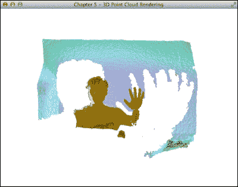

通过旋转和移动虚拟摄像机，我们可以从不同的视角创建场景的各种表示。从场景的鸟瞰图或侧视图，我们可以分别从这两个角度更明显地看到面部和手的轮廓：

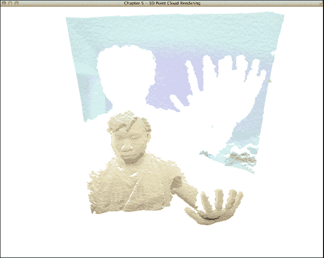

这是同一场景的侧视图：

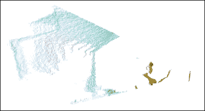

通过在重映射循环中添加一个额外的条件，我们可以渲染场景中的未知区域（空洞），这些区域由于遮挡、视场限制、范围限制以及/或表面特性（如反射率）等原因，深度相机无法重建：

```cpp
if(depth_value != 0){
  g_vertex_buffer_data[ver_index+0] = ((float)x-cx)*depth_value/fx;
  g_vertex_buffer_data[ver_index+1] = ((float)y-cy)*depth_value/fy;
  g_vertex_buffer_data[ver_index+2] = -depth_value;
  g_uv_buffer_data[uv_index+0] = (float)x/IMAGE_WIDTH;
  g_uv_buffer_data[uv_index+1] = (float)y/IMAGE_HEIGHT;
}
else{
  g_vertex_buffer_data[ver_index+0] = ((float)x-cx)*0.2f/fx;
  g_vertex_buffer_data[ver_index+1] = ((float)y-cy)*0.2f/fy;
  g_vertex_buffer_data[ver_index+2] = 0;
}
```

这种条件允许我们将深度值为 0 的区域分割并投影到距离虚拟摄像机 0.2 米远的平面上，如图所示：

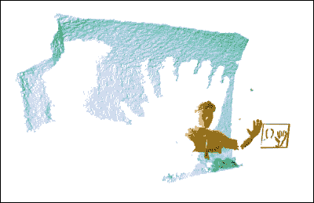

## 如何工作...

在本章中，我们利用 GLSL 管道和纹理映射技术创建了一个交互式的点云可视化工具，该工具能够使用 3D 范围感应相机捕获的场景进行 3D 导航。着色器程序还将结果与彩色图像结合以产生我们期望的效果。程序读取两个二进制图像：校准的深度图图像和 RGB 彩色图像。颜色直接使用新的 `loadRGBImageToTexture()` 函数加载到纹理对象中，该函数将数据从 `GL_RGB` 转换为 `GL_RGBA`。然后，根据相机的内在值以及每个像素的深度值，将深度图数据转换为基于实际坐标的点云数据，如下所示：

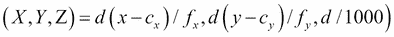

在这里，*d* 是毫米级的深度值，*x* 和 *y* 是深度值在像素（投影）空间中的位置，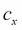 和 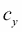 是深度相机的原理轴，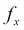 和 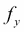 是相机的焦距，而 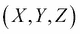 是点云在真实世界坐标系中的位置。

在我们的例子中，我们不需要精细的对齐或注册，因为我们的可视化器使用了对内在参数的原始估计：

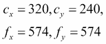

这些数值可以使用 OpenCV 中的相机标定工具进行估计。这些工具的详细内容超出了本章的范围。

对于我们的应用，我们提供了一组 3D 点（*x*，*y*，*z*）以及相应的颜色信息（*r*，*g*，*b*）来计算点云表示。然而，点可视化不支持动态照明和其他更高级的渲染技术。为了解决这个问题，我们可以将点云进一步扩展成网格（即，一组三角形来表示表面），这将在下一章中讨论。
