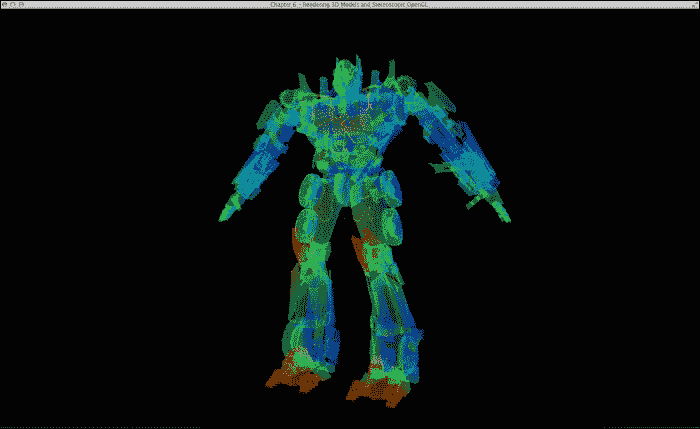

# 第六章：使用 OpenGL 渲染立体 3D 模型

在本章中，我们将涵盖以下主题：

+   安装 Open Asset Import Library (Assimp)

+   加载第一个 Wavefront Object (.obj) 格式的 3D 模型

+   使用点、线和三角形渲染 3D 模型

+   立体 3D 渲染

# 简介

在本章中，我们将展示如何使用 OpenGL 将数据以惊人的立体 3D 技术可视化。立体 3D 设备越来越受欢迎，最新一代的可穿戴计算设备（如 NVIDIA、Epson 的 3D 视觉眼镜，以及最近 Meta 的增强现实 3D 眼镜）现在可以原生支持此功能。

在立体 3D 环境中可视化数据的能力为许多应用程序中数据的交互式显示提供了一个强大且高度直观的平台。例如，我们可能从模型的 3D 扫描（如建筑、工程、牙科或医学）中获取数据，并希望实时可视化或操作 3D 对象。

不幸的是，OpenGL 不提供任何加载、保存或操作 3D 模型的机制。因此，为了支持这一点，我们将把一个名为 **Open Asset Import Library** (**Assimp**) 的新库集成到我们的代码中。本章中的源代码建立在 第五章 中 *OpenGL 点云渲染带纹理映射和叠加* 的配方之上，即 *为 3D 范围感应相机渲染点云数据*。主要依赖项包括需要 OpenGL 版本 3.2 及更高版本的 GLFW 库。我们将假设您已经从早期章节安装了所有先决软件包。

# 安装 Open Asset Import Library (Assimp)

Assimp 是一个开源库，可以从各种 3D 模型数据格式中加载和处理 3D 几何场景。该库提供了一个统一的接口来加载许多不同的数据格式，例如 **Wavefront Object** (**.obj**)、**3ds Max 3DS** (**.3ds**) 和 **Stereolithography** (**.stl**)。此外，这个库是用可移植的、符合 ISO 标准的 C++ 编写的，因此它允许进一步的定制和长期支持。由于该库是跨平台的，我们可以很容易地按照下一节中给出的说明在 Mac OS X、Linux 以及 Windows 中安装它。

## 如何操作...

要获取 Assimp 3.0 的库源文件或二进制库，请直接从 Assimp 的官方网站 [`sourceforge.net/projects/assimp/files/assimp-3.0/`](http://sourceforge.net/projects/assimp/files/assimp-3.0/) 下载。或者，对于 Linux 和 Mac OS X 用户，使用命令行界面简化下一节中描述的安装步骤。

在 Mac OS X 中，使用 MacPort 的命令行界面安装 Assimp。它自动解决所有依赖项，因此这是推荐的：

```cpp
sudo port install assimp

```

在 Linux 中，使用 `apt-get` 命令界面安装 Assimp：

```cpp
sudo apt-get install install libassimp-dev

```

安装完成后，修改 Makefile 以确保库文件通过将以下内容追加到 `LIBS` 变量中来链接到源文件：

```cpp
`pkg-config --static --libs assimp`

```

分别添加到 `INCLUDES` 路径变量中：

```cpp
`pkg-config --cflags assimp`

```

最终的 Makefile 如下所示，供您参考：

```cpp
PKG_CONFIG_PATH=/usr/local/lib/pkgconfig/
CFILES = ../common/shader.cpp ../common/controls.cpp ../common/ObjLoader.cpp main.cpp 
CFLAGS = -c
OPT = -O3
INCLUDES = -I../common -I/usr/include -I/usr/include/SOIL -I.  `pkg-config --cflags glfw3` `pkg-config --cflags assimp`
LIBS = -lm -L/usr/local/lib -lGLEW `pkg-config --static --libs glfw3` `pkg-config --static --libs assimp`
CC = g++
OBJECTS=$(CFILES:.cpp=.o)
EXECUTABLE=main
all: $(CFILES) $(EXECUTABLE)
$(EXECUTABLE): $(OBJECTS)
$(CC) $(OPT) $(INCLUDES) $(OBJECTS) -o $@ $(LIBS)
.cpp.o:
$(CC) $(OPT) $(CFLAGS) $(INCLUDES) $< -o $@
clean:
rm -v -f *~ ../common/*.o *.o $(EXECUTABLE)

```

在 Windows 上安装 Assimp，首先，从以下链接下载二进制库：[`sourceforge.net/projects/assimp/files/assimp-3.0/assimp--3.0.1270-full.zip/download`](http://sourceforge.net/projects/assimp/files/assimp-3.0/assimp--3.0.1270-full.zip/download)。

然后，我们按照以下步骤配置环境：

1.  解压 `assimp--3.0.1270-full.zip` 并将其保存到 `C:/Program Files (x86)/`。

1.  将 DLL 路径，`C:/Program Files (x86)/assimp--3.0.1270-sdk/bin/assimp_release-dll_win32`，添加到 PATH 环境变量中。

1.  将 `CMakeLists.txt` 文件添加到项目中：

    ```cpp
    cmake_minimum_required (VERSION 2.8)
    set(CMAKE_CONFIGURATION_TYPES Debug Release)
    set(PROGRAM_PATH "C:/Program Files \(x86\)")
    set(OpenCV_DIR ${PROGRAM_PATH}/opencv/build)
    project (code)
    #modify these path based on your configuration
    #OpenCV
    find_package(OpenCV REQUIRED )
    INCLUDE_DIRECTORIES(${OpenCV_INCLUDE_DIRS})
    INCLUDE_DIRECTORIES(${PROGRAM_PATH}/glm)
    INCLUDE_DIRECTORIES(${PROGRAM_PATH}/glew-1.10.0/include)
    LINK_DIRECTORIES(${PROGRAM_PATH}/glew-1.10.0/lib/Release/Win32)
    INCLUDE_DIRECTORIES(${PROGRAM_PATH}/glfw-3.0.4/include)
    LINK_DIRECTORIES(${PROGRAM_PATH}/glfw-3.0.4/lib)
    INCLUDE_DIRECTORIES(${PROGRAM_PATH}/Simple\ OpenGL\ Image\ Library/src)
    INCLUDE_DIRECTORIES(${PROGRAM_PATH}/assimp--3.0.1270-sdk/include/assimp)
    LINK_DIRECTORIES(${PROGRAM_PATH}/assimp--3.0.1270-sdk/lib/assimp_release-dll_win32)
    add_subdirectory (../common common)
    add_executable (main main.cpp)
    target_link_libraries (main LINK_PUBLIC shader controls texture glew32s glfw3 opengl32 assimp ObjLoader)
    ```

最后，按照 第四章 中描述的相同步骤，*使用纹理映射渲染 2D 图像和视频* 和 第五章 中描述的步骤，*为 3D 范围感应相机渲染点云数据*，生成构建文件。

## 参见

除了导入 3D 模型对象外，Assimp 还支持以 `.obj`、`.stl` 和 `.ply` 格式导出 3D 模型。通过将此库与 OpenGL 图形渲染引擎结合，我们创建了一个简单而强大的机制，用于协作或远程可视化并交换 3D 模型。在导入模型后，Assimp 库还可以处理一些 3D 场景的后处理任务（例如，将大型网格分割以克服某些 GPU 对顶点数的限制）。这些附加功能在官方网站上有文档说明，可能对高级用户感兴趣（[`assimp.sourceforge.net/lib_html/index.html`](http://assimp.sourceforge.net/lib_html/index.html)）。

# 加载第一个 Wavefront Object (.obj) 格式的 3D 模型

现在，我们已准备好将 3D 对象加载器集成到我们的代码中。第一步是创建一个名为 `ObjLoader` 的空类，以及相应的源文件（`.cpp`）和头文件（`.h`）。此类处理与 3D 对象加载、解析和绘制相关的所有函数，使用 OpenGL 和 Assimp 库。类的头文件将包括用于处理数据结构和所有 3D 数据格式 I/O 机制的 Assimp 核心函数：

```cpp
#include <cimport.h>
#include <scene.h>
#include <postprocess.h>
```

在 `ObjLoader.h` 文件中，我们为主程序提供了创建、销毁、加载和显示 3D 数据的接口。在 `ObjLoader.cpp` 文件中，我们实现了一套函数，使用 Assimp 的内置函数来解析场景（以网格和面为术语的 3D 对象的分层表示）。

Assimp 库可以支持各种 3D 模型数据格式；然而，在我们的示例中，我们将专注于 Wavefront Object（`.obj`）格式，因为它简单。`.obj`文件是一个简单的几何定义文件，最初由 Wavefront Technologies 开发。该文件包含图形的核心元素，如顶点、顶点位置、法线面等，并以简单的文本格式存储。由于文件以 ASCII 文本存储，我们可以轻松地打开和检查文件而无需任何解析器。例如，以下是一个面向前的正方形`.obj`文件：

```cpp
# This is a comment.
# Front facing square.
# vertices [x, y, z]
v 0 0 0   # Bottom left.
v 1 0 0   # Bottom right.
v 1 1 0   # Top    right.
v 0 1 0   # Top    left.
# List of faces: 
f 1 2 3 4       # Square.
```

如前例所示，表示对于初学者来说非常简单直观。顶点可以逐行读取和提取，然后可以修改。

在下一节中，我们将展示完整的实现过程，它允许用户加载`.obj`文件，将场景存储在顶点缓冲对象中，并显示场景。

## 如何做到这一点...

首先，我们在公共文件夹中创建`ObjLoader.h`文件，并附加将在我们的实现中使用的类函数定义和变量：

```cpp
#ifndef OBJLOADER_H_
#define OBJLOADER_H_
/* Assimp include files. These three are usually needed. */
#include <cimport.h>
#include <scene.h>
#include <postprocess.h>
#include <common.h>
#define aisgl_min(x,y) (x<y?x:y)
#define aisgl_max(x,y) (y>x?y:x)
class ObjLoader {
  public:
  ObjLoader();
  virtual ~ObjLoader();
  int loadAsset(const char* path);
  void setScale(float scale);
  unsigned int getNumVertices();
  void draw(const GLenum draw_mode);
  void loadVertices(GLfloat *g_vertex_buffer_data);
private:
  //helper functions and variables
  const struct aiScene* scene;
  GLuint scene_list;
  aiVector3D scene_min, scene_max, scene_center;
  float g_scale;
  unsigned int num_vertices;
  unsigned int recursiveDrawing(const struct aiNode* nd, unsigned int v_count, const GLenum);
  unsigned int recursiveVertexLoading(const struct aiNode *nd, GLfloat *g_vertex_buffer_data, unsigned int v_counter);
  unsigned int recursiveGetNumVertices(const struct aiNode *nd);
  void get_bounding_box (aiVector3D* min, aiVector3D* max);
  void get_bounding_box_for_node (const struct aiNode* nd, aiVector3D* min, aiVector3D* max, aiMatrix4x4* trafo);
};
#endif
```

Assimp 库中的类名前面带有前缀`ai-`（例如，`aiScene`和`aiVector3D`）。`ObjLoader`文件提供了动态加载和绘制内存中加载的对象的方法。它还处理简单的动态缩放，以便对象可以适应屏幕。

在源文件`ObjLoader.cpp`中，我们首先添加类的构造函数：

```cpp
#include <ObjLoader.h>
ObjLoader::ObjLoader() {
  g_scale=1.0f;
  scene = NULL; //empty scene
  scene_list = 0;
  num_vertices = 0;
}
```

然后，我们使用`aiImportFile`函数实现文件加载机制。场景被处理以提取边界框大小，以便正确缩放以适应屏幕。然后，场景的顶点数被用于允许在后续步骤中动态创建顶点缓冲区：

```cpp
int ObjLoader::loadAsset(const char *path){
  scene = aiImportFile(path, aiProcessPreset_TargetRealtime_MaxQuality);
  if (scene) {
    get_bounding_box(&scene_min,&scene_max);
    scene_center.x = (scene_min.x + scene_max.x) / 2.0f;
    scene_center.y = (scene_min.y + scene_max.y) / 2.0f;
    scene_center.z = (scene_min.z + scene_max.z) / 2.0f;
    printf("Loaded file %s\n", path);
    g_scale =4.0/(scene_max.x-scene_min.x);

    printf("Scaling: %lf", g_scale);
    num_vertices = recursiveGetNumVertices(scene->mRootNode);
    printf("This Scene has %d vertices.\n", num_vertices);
    return 0;
  }
  return 1;
}
```

为了提取绘制场景所需的顶点总数，我们递归地遍历树形层次结构中的每个节点。实现需要一个简单的递归函数，该函数返回每个节点中的顶点数，然后根据所有节点的总和计算总数：

```cpp
unsigned int ObjLoader::recursiveGetNumVertices(const struct aiNode *nd){
  unsigned int counter=0;
  unsigned int i;
  unsigned int n = 0, t;
  // draw all meshes assigned to this node
  for (; n < nd->mNumMeshes; ++n) {
    const struct aiMesh* mesh = scene-> mMeshes[nd->mMeshes[n]];
    for (t = 0; t < mesh->mNumFaces; ++t) {
      const struct aiFace* face = &mesh-> mFaces[t];
      counter+=3*face->mNumIndices;
    }
    printf("recursiveGetNumVertices: mNumFaces 	%d\n", mesh->mNumFaces);
  }
  //traverse all children nodes
  for (n = 0; n < nd->mNumChildren; ++n) {
    counter+=recursiveGetNumVertices(nd-> mChildren[n]);
  }
  printf("recursiveGetNumVertices: counter %d\n", counter);
  return counter;
}
```

同样，为了计算边界框的大小（即包含场景所需的最小体积），我们递归地检查每个节点并提取距离对象中心最远的点：

```cpp
void ObjLoader::get_bounding_box (aiVector3D* min, aiVector3D* max)
{
  aiMatrix4x4 trafo;
  aiIdentityMatrix4(&trafo);
  min->x = min->y = min->z =  1e10f;
  max->x = max->y = max->z = -1e10f;
  get_bounding_box_for_node(scene-> mRootNode,min,max,&trafo);
}
void ObjLoader::get_bounding_box_for_node (const struct aiNode* nd, aiVector3D* min, aiVector3D* max, aiMatrix4x4* trafo) 
{
  aiMatrix4x4 prev;
  unsigned int n = 0, t;
  prev = *trafo;
  aiMultiplyMatrix4(trafo,&nd->mTransformation);
  for (; n < nd->mNumMeshes; ++n) {
    const struct aiMesh* mesh = scene-> mMeshes[nd->mMeshes[n]];
    for (t = 0; t < mesh->mNumVertices; ++t) {
      aiVector3D tmp = mesh->mVertices[t];
      aiTransformVecByMatrix4(&tmp,trafo);
      min->x = aisgl_min(min->x,tmp.x);
      min->y = aisgl_min(min->y,tmp.y);
      min->z = aisgl_min(min->z,tmp.z);
      max->x = aisgl_max(max->x,tmp.x);
      max->y = aisgl_max(max->y,tmp.y);
      max->z = aisgl_max(max->z,tmp.z);
    }
  }
  for (n = 0; n < nd->mNumChildren; ++n) {
    get_bounding_box_for_node(nd-> mChildren[n],min,max,trafo);
  }
  *trafo = prev;
}
```

生成的边界框使我们能够计算缩放因子并将对象坐标重新居中，以适应可查看的屏幕。

在`main.cpp`文件中，我们首先通过插入头文件来集成代码：

```cpp
#include <ObjLoader.h>
```

然后，我们在主函数中创建`ObjLoader`对象，并使用给定的文件名加载模型：

```cpp
ObjLoader *obj_loader = new ObjLoader();
int result = 0;
if(argc > 1){
  result = obj_loader->loadAsset(argv[1]);
}
else{
  result = obj_loader-> loadAsset("dragon.obj");
}
if(result){
  fprintf(stderr, "Final to Load the 3D file\n");
  glfwTerminate();
  exit(EXIT_FAILURE);
}
```

`ObjLoader`包含一个算法，该算法递归地检查每个网格，计算场景的边界框和顶点数。然后，我们根据顶点数动态分配顶点缓冲区并将顶点加载到缓冲区中：

```cpp
GLfloat *g_vertex_buffer_data = (GLfloat*) 
malloc (obj_loader->getNumVertices()*sizeof(GLfloat));
//load the scene data to the vertex buffer
obj_loader->loadVertices(g_vertex_buffer_data);
```

现在，我们已经有了所有必要的顶点信息，可以使用我们用 OpenGL 编写的自定义着色器程序进行显示。

## 它是如何工作的...

Assimp 提供了高效加载和解析 3D 数据格式的机制。我们利用的关键特性是以分层方式导入 3D 对象，这使得我们可以统一我们的渲染管线，无论 3D 格式如何。`aiImportFile`函数读取指定的文件，并将其内容以`aiScene`结构返回。此函数的第二个参数指定了在成功导入后要执行的可选后处理步骤。`aiProcessPreset_TargetRealtime_MaxQuality`标志是一个预定义变量，它组合了以下参数集：

```cpp
( \
  aiProcessPreset_TargetRealtime_Quality | \
  aiProcess_FindInstances | \
  aiProcess_ValidateDataStructure | \
  aiProcess_OptimizeMeshes | \
  aiProcess_Debone | \
0 )
```

这些后处理选项的详细描述请参阅[`assimp.sourceforge.net/lib_html/postprocess_8h.html#a64795260b95f5a4b3f3dc1be4f52e410`](http://assimp.sourceforge.net/lib_html/postprocess_8h.html#a64795260b95f5a4b3f3dc1be4f52e410)。高级用户可以查看每个选项，并了解是否需要启用或禁用这些功能。

在这一点上，我们有一个简单的机制来将图形加载到 Assimp 的`aiScene`对象中，显示边界框大小，以及提取渲染场景所需的顶点数量。接下来，我们将创建一个简单的着色器程序以及各种绘图函数，以不同的风格可视化内容。简而言之，通过将其与 OpenGL 图形渲染引擎集成，我们现在有了一种灵活的方式来使用我们在前几章中开发的各种工具来可视化 3D 模型。

# 使用点、线和三角形渲染 3D 模型

在导入 3D 模型之后的下一步是，以直观和美观的方式在屏幕上显示内容。许多复杂的场景由多个表面（网格）和许多顶点组成。在前一章中，我们实现了一个简单的着色器程序，根据热图在各个深度值上可视化点云。在本节中，我们将使用非常简单的原语（点、线和三角形）以及透明度来创建类似骨骼的渲染效果。

## 如何做到这一点...

我们将继续实现`ObjLoader`类，以支持加载顶点并在场景中的每个网格上绘制图形。

在`ObjLoader.cpp`的源文件中，我们添加了一个递归函数来从场景中提取所有顶点并将它们存储在一个单独的顶点缓冲区数组中。这使我们能够减少要管理的顶点缓冲区数量，从而降低代码的复杂性：

```cpp
void ObjLoader::loadVertices(GLfloat *g_vertex_buffer_data)
{
  recursiveVertexLoading(scene->mRootNode, g_vertex_buffer_data, 0);
}
unsigned int ObjLoader::recursiveVertexLoading (const struct aiNode *nd, GLfloat *g_vertex_buffer_data, unsigned int v_counter)
{
  unsigned int i;
  unsigned int n = 0, t;
  /* save all data to the vertex array, perform offset and scaling to reduce the computation */
  for (; n < nd->mNumMeshes; ++n) {
    const struct aiMesh* mesh = scene-> mMeshes[nd->mMeshes[n]];
    for (t = 0; t < mesh->mNumFaces; ++t) {
      const struct aiFace* face = &mesh->mFaces[t];
      for(i = 0; i < face->mNumIndices; i++) {
        int index = face->mIndices[i];
        g_vertex_buffer_data[v_counter]=
          (mesh->mVertices[index].x-scene_center.x)*g_scale;
        g_vertex_buffer_data[v_counter+1]=
          (mesh->mVertices[index].y-scene_center.y)*g_scale;
        g_vertex_buffer_data[v_counter+2]=
          (mesh->mVertices[index].z-scene_center.z)*g_scale;
        v_counter+=3;
      }
    }
  }
  //traverse all children nodes
  for (n = 0; n < nd->mNumChildren; ++n) {
    v_counter = recursiveVertexLoading(nd-> mChildren[n], g_vertex_buffer_data, v_counter);
  }
  return v_counter;
}
```

要绘制图形，我们遍历从根节点开始的`aiScene`对象，一次绘制一个网格：

```cpp
void ObjLoader::draw(const GLenum draw_mode){
  recursiveDrawing(scene->mRootNode, 0, draw_mode);
}
unsigned int ObjLoader::recursiveDrawing(const struct aiNode* nd, unsigned int v_counter, const GLenum draw_mode){
  /* break up the drawing, and shift the pointer to draw different parts of the scene */
  unsigned int i;
  unsigned int n = 0, t;
  unsigned int total_count = v_counter;
  // draw all meshes assigned to this node
  for (; n < nd->mNumMeshes; ++n) {
    unsigned int count=0;
    const struct aiMesh* mesh = scene-> mMeshes[nd->mMeshes[n]];
    for (t = 0; t < mesh->mNumFaces; ++t) {
      const struct aiFace* face = &mesh-> mFaces[t];
      count+=3*face->mNumIndices;
    }
    glDrawArrays(draw_mode, total_count, count);
      total_count+=count;
  }
  v_counter = total_count;
  // draw all children nodes recursively
  for (n = 0; n < nd->mNumChildren; ++n) {
    v_counter = recursiveDrawing(nd-> mChildren[n], v_counter, draw_mode);
  }
  return v_counter;
}
```

在顶点着色器`pointcloud.vert`中，我们根据顶点在空间中的位置计算顶点的颜色。重映射算法创建了一个空间中对象的热图表示，这为人类眼睛提供了重要的深度线索（深度感知）：

```cpp
#version 150 core
// Input
in vec3 vertexPosition_modelspace;
// Output 
out vec4 color_based_on_position;
// Uniform/constant variable.
uniform mat4 MVP;
//heat map generator
vec4 heatMap(float v, float vmin, float vmax){
  float dv;
  float r=1.0f, g=1.0f, b=1.0f;
  if (v < vmin)
    v = vmin;
  if (v > vmax)
    v = vmax;
  dv = vmax - vmin;
  if (v < (vmin + 0.25f * dv)) {
    r = 0.0f;
    g = 4.0f * (v - vmin) / dv;
  } else if (v < (vmin + 0.5f * dv)) {
    r = 0.0f;
    b = 1.0f + 4.0f * (vmin + 0.25f * dv - v) / dv;
  } else if (v < (vmin + 0.75f * dv)) {
    r = 4.0f * (v - vmin - 0.5f * dv) / dv;
    b = 0.0f;
  } else {
    g = 1.0f + 4.0f * (vmin + 0.75f * dv - v) / dv;
    b = 0.0f;
  }
  //with 0.2 transparency - can be dynamic if we pass in variables
  return vec4(r, g, b, 0.2f);
} 

void main () {
  // Output position of the vertex, in clip space : MVP * position
  gl_Position =  MVP * vec4(vertexPosition_modelspace, 1.0f);
  // remapping the color based on the depth (z) value.
  color_based_on_position = heatMap(vertexPosition_modelspace.z, -1.0f, 1.0f);
}
```

顶点着色器通过`color_based_on_position`变量将热图颜色信息传递给片段着色器。然后，最终颜色通过片段着色器（`pointcloud.frag`）直接返回，无需进一步处理。这样一个简单管道的实现如下所示：

```cpp
#version 150 core
out vec4 color;
in vec4 color_based_on_position;
void main(){
  color = color_based_on_position;
}
```

最后，我们以各种风格绘制场景：线条、点和三角形（表面）带有透明度。以下是在绘图循环中的代码片段：

```cpp
//draw the left eye (but full screen)
glViewport(0, 0, width, height);
//compute the MVP matrix from the IOD and virtual image plane distance
computeStereoViewProjectionMatrices(g_window, IOD, depthZ, true);
//get the View and Model Matrix and apply to the rendering
glm::mat4 projection_matrix = getProjectionMatrix();
glm::mat4 view_matrix = getViewMatrix();
glm::mat4 model_matrix = glm::mat4(1.0);
model_matrix = glm::translate(model_matrix, glm::vec3(0.0f, 0.0f, -depthZ));
model_matrix = glm::rotate(model_matrix, 
glm::pi<float>()*rotateY, glm::vec3(0.0f, 1.0f, 0.0f));
model_matrix = glm::rotate(model_matrix, 
glm::pi<float>()*rotateX, glm::vec3(1.0f, 0.0f, 0.0f));
glm::mat4 mvp = projection_matrix * view_matrix * model_matrix;
//send our transformation to the currently bound shader,
//in the "MVP" uniform variable
glUniformMatrix4fv(matrix_id, 1, GL_FALSE, &mvp[0][0]);
/* render scene with different modes that can be enabled separately to get different effects */
obj_loader->draw(GL_TRIANGLES);
if(drawPoints)
  obj_loader->draw(GL_POINTS);
if(drawLines)
  obj_loader->draw(GL_LINES);
```

下面的系列截图展示了我们可以使用自定义着色器实现的令人愉悦的结果。基于热图着色器的深度位置颜色映射提供了强烈的深度感知，帮助我们更容易地理解物体的 3D 结构。此外，我们可以分别启用和禁用各种渲染选项以实现各种效果。例如，同一个物体可以用不同的风格渲染：点、线和三角形（表面）带有透明度。

为了演示效果，我们首先仅用点渲染两个物体。第一个例子是一个龙模型：


第二个例子是一个建筑模型：


基于点的渲染风格非常适合可视化具有未知关系或分布的大量数据集。接下来，我们将仅用线条渲染相同的物体：


这里是仅用线条渲染的建筑模型：


使用线条后，我们现在可以更轻松地看到物体的结构。这种渲染技术非常适合简单的结构，例如建筑模型和其他定义良好的模型。此外，我们还可以同时启用点和线条来渲染场景，如下所示：


这里是启用点和线条渲染的建筑模型：


点和线的组合为物体的结构提供了额外的视觉提示（即强调交点）。最后，我们以所有选项启用的方式渲染场景：点、线和三角形（表面）带有透明度：


这里是使用点、线和三角形（表面）以及透明度渲染的建筑模型：


启用所有选项的最终组合提供了对物体体积以及整体 3D 结构的更直观的可视化。或者，我们也可以启用深度测试，以不透明的方式渲染实体模型：


如何在运行时启用/禁用这些选项的说明在源代码中有文档记录。

## 它是如何工作的...

通过结合 Assimp 库和 OpenGL，我们现在可以在屏幕上动态加载 3D 模型，并通过基于 OpenGL 的交互式可视化工具创建视觉上吸引人的 3D 效果。

在 `ObjLoader.cpp` 中，`loadVertices` 函数将场景转换为单个顶点缓冲区数组，以减少内存管理的复杂性。特别是，这种方法减少了 OpenGL 内存复制的次数和渲染侧（即 `glBufferData` 和 `glGenBuffers`）的内存缓冲区数量。此外，加载函数根据边界框处理顶点的缩放和居中。这一步至关重要，因为大多数 3D 格式都没有标准化它们的坐标系。

接下来，`ObjLoader.cpp` 中的 `draw` 函数遍历 `aiScene` 对象，并使用顶点缓冲区绘制场景的每个部分。在基于点的渲染情况下，我们可以跳过此步骤，直接使用 `glDrawArray` 绘制整个数组，因为相邻顶点之间没有依赖关系。

顶点着色器（`pointcloud.vert`）包含了热图颜色生成器的实现。`heatmap` 函数接受三个参数：输入值（即深度或 *z* 值）、最小值和最大值。它返回 RGBA 格式的热图颜色表示。

在绘图循环内部，`computeStereoViewProjectionMatrices` 函数构建视图和投影矩阵。详细内容将在下一节中解释。

最后，我们可以混合和匹配各种渲染技术；例如，只为基于骨骼的渲染启用点和线。通过支持对象的旋转或平移，可以轻松添加各种深度视觉提示，如遮挡和运动视差。为了进一步提高结果，可以根据应用需求添加其他渲染技术，如光照或阴影。

## 参见

除了 `.obj` 文件外，Assimp 库还支持许多文件格式。例如，我们可以将 `.stl` 文件加载到我们的系统中，而无需更改任何源代码。

要下载更多 3D 模型，请访问各种 3D 模型共享网站，如 *Makerbot ThingiVerse* ([`www.thingiverse.com/`](http://www.thingiverse.com/)) 或 *Turbosquid* ([`www.turbosquid.com/`](http://www.turbosquid.com/))：



# 立体 3D 渲染

随着消费电子的最新趋势和可穿戴计算技术的进步，3D 电视和 3D 眼镜变得越来越普遍。在市场上，目前有许多硬件选项允许我们使用立体 3D 技术可视化信息。一种常见的格式是左右并排 3D，许多 3D 眼镜都支持这种格式，因为每只眼睛都从不同的视角看到同一场景的图像。在 OpenGL 中，创建左右并排 3D 渲染需要非对称调整以及视口调整（即要渲染的区域）——非对称截锥体平行投影或相当于摄影中的镜头偏移。这项技术不引入垂直视差，并且在立体渲染中得到广泛应用。为了说明这个概念，以下图显示了用户从右眼看到的场景的几何形状：


**眼内距离**（**IOD**）是两眼之间的距离。从图中我们可以看出，**截锥体偏移**表示非对称截锥体调整的倾斜/偏移量。同样，对于左眼图像，我们使用镜像设置进行变换。该设置的实现将在下一节中描述。

## 如何操作...

以下代码说明了构建用于立体 3D 可视化的投影和视图矩阵的步骤。该代码使用眼内距离、图像平面距离和近裁剪平面距离来计算适当的截锥体偏移值。在源文件`common/controls.cpp`中，我们添加了立体 3D 矩阵设置的实现：

```cpp
void computeStereoViewProjectionMatrices(GLFWwindow* window, float IOD, float depthZ, bool left_eye){
  int width, height;
  glfwGetWindowSize(window, &width, &height);
  //up vector
  glm::vec3 up = glm::vec3(0,-1,0);
  glm::vec3 direction_z(0, 0, -1);
  //mirror the parameters with the right eye
  float left_right_direction = -1.0f;
  if(left_eye)
    left_right_direction = 1.0f;
  float aspect_ratio = (float)width/(float)height;
  float nearZ = 1.0f;
  float farZ = 100.0f;
  double frustumshift = (IOD/2)*nearZ/depthZ;
  float top = tan(g_initial_fov/2)*nearZ;
  float right =
aspect_ratio*top+frustumshift*left_right_direction; 
//half screen
  float left = -aspect_ratio*top+frustumshift*left_right_direction;
  float bottom = -top;
  g_projection_matrix = glm::frustum(left, right, bottom, top, nearZ, farZ);
  // update the view matrix
 g_view_matrix = 
 glm::lookAt(
   g_position-direction_z+
     glm::vec3(left_right_direction*IOD/2, 0, 0), 
     //eye position
   g_position+
     glm::vec3(left_right_direction*IOD/2, 0, 0), 
     //centre position
   up //up direction
 );

```

在`main.cpp`中的渲染循环中，我们为每只眼睛（*左*和*右*）定义视口，并相应地设置投影和视图矩阵。对于每只眼睛，我们根据前一个图所示，将我们的相机位置沿眼内距离的一半进行平移：

```cpp
if(stereo){
  //draw the LEFT eye, left half of the screen
  glViewport(0, 0, width/2, height);
  //computes the MVP matrix from the IOD and virtual image plane distance
  computeStereoViewProjectionMatrices(g_window, IOD, depthZ, true);
  //gets the View and Model Matrix and apply to the rendering
  glm::mat4 projection_matrix = getProjectionMatrix();
  glm::mat4 view_matrix = getViewMatrix();
  glm::mat4 model_matrix = glm::mat4(1.0);
  model_matrix = glm::translate(model_matrix, glm::vec3(0.0f, 0.0f, -depthZ));
  model_matrix = glm::rotate(model_matrix, glm::pi<float>() * rotateY, glm::vec3(0.0f, 1.0f, 0.0f));
  model_matrix = glm::rotate(model_matrix, glm::pi<float>() * rotateX, glm::vec3(1.0f, 0.0f, 0.0f));
  glm::mat4 mvp = projection_matrix * view_matrix * model_matrix;
  //sends our transformation to the currently bound shader,
  //in the "MVP" uniform variable
  glUniformMatrix4fv(matrix_id, 1, GL_FALSE, &mvp[0][0]);
  //render scene, with different drawing modes

  if(drawTriangles)
  obj_loader->draw(GL_TRIANGLES);

  if(drawPoints)
    obj_loader->draw(GL_POINTS);

  if(drawLines)
    obj_loader->draw(GL_LINES);
  //Draw the RIGHT eye, right half of the screen
  glViewport(width/2, 0, width/2, height);
  computeStereoViewProjectionMatrices(g_window, IOD, depthZ, false);
  projection_matrix = getProjectionMatrix();
  view_matrix = getViewMatrix();
  model_matrix = glm::mat4(1.0);
  model_matrix = glm::translate(model_matrix, glm::vec3(0.0f, 0.0f, -depthZ));
  model_matrix = glm::rotate(model_matrix, glm::pi<float>() * rotateY, glm::vec3(0.0f, 1.0f, 0.0f));
  model_matrix = glm::rotate(model_matrix, glm::pi<float>() * rotateX, glm::vec3(1.0f, 0.0f, 0.0f));
  mvp = projection_matrix * view_matrix * model_matrix;
  glUniformMatrix4fv(matrix_id, 1, GL_FALSE, &mvp[0][0]);
  if(drawTriangles)
    obj_loader->draw(GL_TRIANGLES);
  if(drawPoints)
    obj_loader->draw(GL_POINTS);
  if(drawLines)
    obj_loader->draw(GL_LINES);
}
```

最终渲染结果由显示器的两侧的两个单独图像组成，并且请注意，每个图像都通过一个缩放因子为二的水平压缩。对于某些显示系统，显示器的每一侧都需要根据显示器的规格保持相同的纵横比。

这里是使用立体 3D 渲染在真实 3D 中显示的相同模型的最终截图：


这是建筑模型的立体 3D 渲染：


## 工作原理...

立体 3D 渲染技术基于平行轴和非对称截锥体透视投影原理。简单来说，我们为每只眼睛渲染了一个单独的图像，就像物体从不同的眼睛位置看到，但视图在同一平面上。参数如眼内距离和截锥体偏移可以动态调整，以提供所需的 3D 立体效果。

例如，通过增加或减少截锥体不对称参数，物体看起来就像是在屏幕的前面或后面移动。默认情况下，零视差平面被设置为视体积的中间。也就是说，物体被设置得使其中心位置位于屏幕水平，物体的某些部分将出现在屏幕的前面或后面。通过增加截锥体不对称（即正视差），场景看起来就像被推到了屏幕后面。同样，通过减少截锥体不对称（即负视差），场景看起来就像被拉到了屏幕前面。

`glm::frustum`函数设置投影矩阵，我们实现了图中所示的不对称截锥体投影概念。然后，我们使用`glm::lookAt`函数根据我们选择的 IOP 值调整眼睛位置。

为了实现图像并排显示，我们使用`glViewport`函数限制图形可以渲染的区域。该函数基本上执行一个仿射变换（即缩放和平移），将归一化设备坐标映射到窗口坐标。请注意，最终结果是一个并排图像，其中图形在垂直方向上按因子二缩放（或水平方向上压缩）。根据硬件配置，我们可能需要调整纵横比。

当前实现支持并排 3D，这在大多数可穿戴的**增强现实**（**AR**）或**虚拟现实**（**VR**）眼镜中很常见。从根本上说，渲染技术，即我们章节中描述的不对称截锥体透视投影，是平台无关的。例如，我们在 Meta 1 开发者套件([`www.getameta.com/products`](https://www.getameta.com/products))上成功测试了我们的实现，并在光学透视立体 3D 显示器上渲染了最终结果：


下面是 Meta 1 开发者套件的前视图，显示了光学透视立体 3D 显示器和 3D 范围感应相机（在第五章中介绍，*3D 范围感应相机的点云数据渲染*），*Rendering of Point Cloud Data for 3D Range-sensing Cameras*）：


结果如下所示，立体 3D 图形被渲染到真实世界中（这构成了增强现实的基础）：


在接下来的章节中，我们将转向越来越强大且无处不在的移动平台，并介绍如何使用移动设备内置的运动传感器，通过 OpenGL 以有趣的方式可视化数据。关于实现增强现实应用的更多细节将在第九章 *基于增强现实的移动或可穿戴平台可视化* 中介绍。

## 参见

此外，我们可以轻松扩展我们的代码以支持基于快门眼镜的 3D 显示器，通过利用四缓冲 OpenGL API（参考`glDrawBuffer`函数中的`GL_BACK_RIGHT`和`GL_BACK_LEFT`标志）。不幸的是，这种 3D 格式需要特定的硬件同步，并且通常需要更高的帧率显示（例如，120Hz）以及专业显卡。有关如何在您的应用程序中实现立体 3D 的更多信息，请参阅[`www.nvidia.com/content/GTC-2010/pdfs/2010_GTC2010.pdf`](http://www.nvidia.com/content/GTC-2010/pdfs/2010_GTC2010.pdf)。
