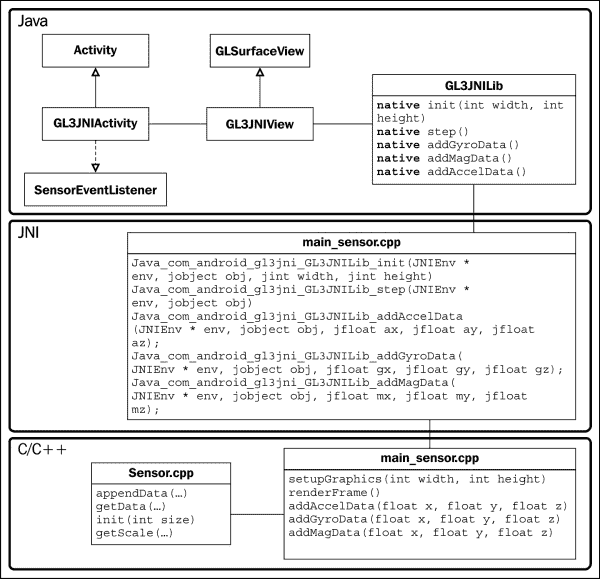
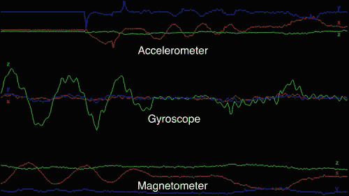
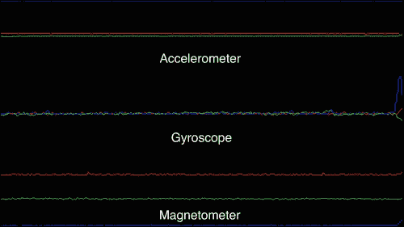
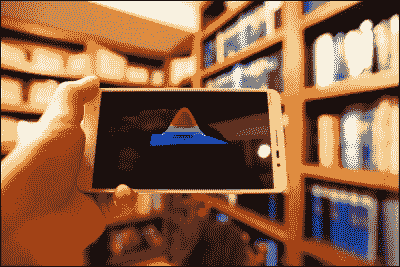
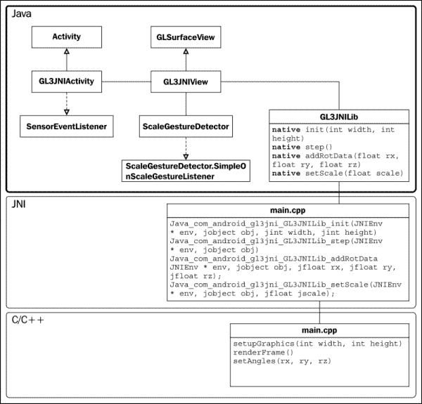
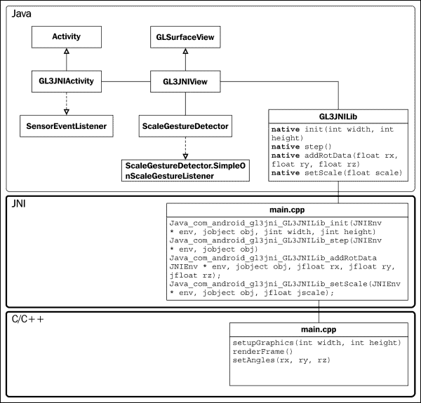
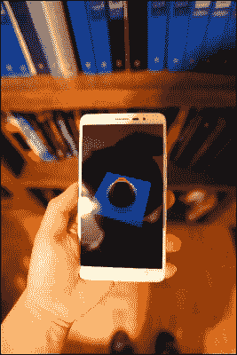
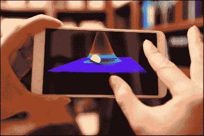
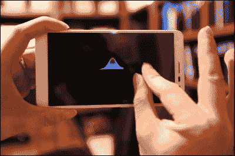
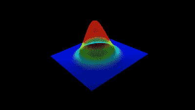

# 第八章. 移动设备上的交互式实时数据可视化

在本章中，我们将涵盖以下主题：

+   可视化内置惯性测量单元（IMUs）的实时数据

+   第一部分 – 处理多点触控界面和运动传感器输入

+   第二部分 – 使用移动 GPU 进行交互式、实时数据可视化

# 简介

在本章中，我们将演示如何使用内置的运动传感器，称为**惯性测量单元**（**IMUs**）以及移动设备上的多点触控界面，来交互式地可视化数据。我们将进一步探讨使用着色器程序来加速计算密集型操作，以便使用移动图形硬件实时可视化 3D 数据。我们假设读者熟悉前一章中介绍的基于 Android 的 OpenGL ES 3.0 应用程序的基本框架，并在本章的实现中添加了显著更多的复杂性，以实现使用运动传感器和多点触控手势界面进行交互式、实时 3D 可视化高斯函数。最终的演示设计为适用于任何具有适当传感器硬件支持的基于 Android 的移动设备。

在这里，我们将首先介绍如何直接从 IMUs 提取数据并绘制在 Android 设备上获取的实时数据流。鉴于其复杂性，我们将最终演示分为两部分。在第一部分中，我们将演示如何在 Java 端处理多点触控界面和运动传感器输入。在第二部分中，我们将演示如何在 OpenGL ES 3.0 中实现着色器程序以及原生代码的其他组件，以完成我们的交互式演示。

# 可视化内置惯性测量单元（IMUs）的实时数据

许多现代移动设备现在集成了大量的内置传感器，包括各种运动和位置传感器（如加速度计、陀螺仪和磁力计/数字罗盘）以实现新的用户交互形式（如复杂的手势和运动控制）以及其他环境传感器，这些传感器可以测量环境条件（如环境光传感器和接近传感器），以实现智能可穿戴应用。Android 传感器框架提供了一个全面的接口来访问许多类型的传感器，这些传感器可以是基于硬件的（物理传感器）或基于软件的（从硬件传感器获取输入的虚拟传感器）。一般来说，有三大类传感器——运动传感器、位置传感器和环境传感器。

在本节中，我们将演示如何利用 Android 传感器框架与设备上的传感器进行通信，注册传感器事件监听器以监控传感器变化，并获取原始传感器数据以在您的移动设备上显示。为了创建此演示，我们将使用上一章中介绍的相同框架设计实现 Java 代码和本地代码。以下框图说明了演示中的核心功能和将要实现的类之间的关系：



## 准备工作

此演示需要一个支持 OpenGL ES 3.0 的 Android 设备和物理传感器硬件支持。不幸的是，目前这些函数无法使用 Android SDK 提供的模拟器进行模拟。具体来说，需要一个具有以下传感器集的 Android 移动设备来运行此演示：加速度计、陀螺仪和磁力计（数字指南针）。

此外，我们假设 Android SDK 和 Android NDK 已按照第七章中讨论的配置进行配置，*《在移动平台上使用 OpenGL ES 3.0 进行实时图形渲染的介绍》*。

## 如何操作...

首先，我们将创建与上一章类似的 Java 核心源文件。由于大部分代码是相似的，我们只讨论当前代码中引入的新和重要元素。其余代码使用“…”符号省略。请从官方 Packt Publishing 网站下载完整的源代码。

在`GL3JNIActivity.java`文件中，我们首先集成 Android 传感器管理器，这使得我们可以读取和解析传感器数据。以下步骤是完成集成的必要步骤：

1.  导入 Android 传感器管理器的类：

    ```cpp
    package com.android.gl3jni;
    …
    import android.hardware.Sensor;
    import android.hardware.SensorEvent;
    import android.hardware.SensorEventListener;
    import android.hardware.SensorManager;
    …
    ```

1.  添加`SensorEventListener`接口以与传感器交互：

    ```cpp
    public class GL3JNIActivity extends Activity implements SensorEventListener{
    ```

1.  定义`SensorManager`和`Sensor`变量以处理加速度计、陀螺仪和磁力计的数据：

    ```cpp
      …
      private SensorManager mSensorManager;
      private Sensor mAccelerometer;
      private Sensor mGyro;
      private Sensor mMag;
    ```

1.  初始化`SensorManager`以及所有其他传感器服务：

    ```cpp
    @Override protected void onCreate(Bundle icicle) {
      super.onCreate(icicle);
      setRequestedOrientation(ActivityInfo.SCREEN_ORIENTATION_LANDSCAPE);

      mSensorManager = (SensorManager)getSystemService(SENSOR_SERVICE);
      mAccelerometer = mSensorManager.getDefaultSensor(Sensor.TYPE_ACCELEROMETER);
      mGyro = mSensorManager.getDefaultSensor(Sensor.TYPE_GYROSCOPE);
      mMag = mSensorManager.getDefaultSensor(Sensor.TYPE_MAGNETIC_FIELD);
      mView = new GL3JNIView(getApplication());
      setContentView(mView);
    }
    ```

1.  注册回调函数并开始监听这些事件：

    ```cpp
    @Override protected void onPause() {
      super.onPause();
      mView.onPause();
      //unregister accelerometer and other sensors
      mSensorManager.unregisterListener(this, mAccelerometer);
      mSensorManager.unregisterListener(this, mGyro);
      mSensorManager.unregisterListener(this, mMag);
    }

    @Override protected void onResume() {
      super.onResume();
      mView.onResume();
      /* register and activate the sensors. Start streaming data and handle with callback functions */
      mSensorManager.registerListener(this, mAccelerometer, SensorManager.SENSOR_DELAY_GAME);
      mSensorManager.registerListener(this, mGyro, SensorManager.SENSOR_DELAY_GAME);
      mSensorManager.registerListener(this, mMag, SensorManager.SENSOR_DELAY_GAME);
    }
    ```

1.  处理`sensor`事件。`onSensorChanged`和`onAccuracyChanged`函数捕获检测到的任何变化，而`SensorEvent`变量包含有关传感器类型、时间戳、精度等信息：

    ```cpp
    @Override
    public void onAccuracyChanged(Sensor sensor, int accuracy) {
      //included for completeness
    }
    @Override
    public void onSensorChanged(SensorEvent event) {
      //handle the accelerometer data
      //All values are in SI units (m/s²)
      if (event.sensor.getType() == Sensor.TYPE_ACCELEROMETER) {
        float ax, ay, az;
        ax = event.values[0];
        ay = event.values[1];
        az = event.values[2];
        GL3JNILib.addAccelData(ax, ay, az);
      }
      /* All values are in radians/second and measure the rate of rotation around the device's local X, Y, and Z axes */
      if (event.sensor.getType() == Sensor.TYPE_GYROSCOPE) {
        float gx, gy, gz;
        //angular speed
        gx = event.values[0];
        gy = event.values[1];
        gz = event.values[2];
        GL3JNILib.addGyroData(gx, gy, gz);
      }
      //All values are in micro-Tesla (uT) and measure the ambient magnetic field in the X, Y and Z axes.
      if (event.sensor.getType() == Sensor.TYPE_MAGNETIC_FIELD) {
        float mx, my, mz;
        mx = event.values[0];
        my = event.values[1];
        mz = event.values[2];
        GL3JNILib.addMagData(mx, my, mz);
      }
    }
    ```

接下来，在 `src/com/android/gl3jni/` 目录中的 `GL3JNIView.java` 源文件中实现 `GL3JNIView` 类，该类处理 OpenGL 渲染。由于此实现与前一章内容相同，即 第七章，*在移动平台上使用 OpenGL ES 3.0 进行实时图形渲染的介绍*，我们在此不再讨论：

最后，将 `GL3JNILib` 类中所有新功能集成到处理原生库加载和调用的 `GL3JNILib.java` 文件中，该文件位于 `src/com/android/gl3jni` 目录内：

```cpp
package com.android.gl3jni;

public class GL3JNILib {
  static {
    System.loadLibrary("gl3jni");
  }

  public static native void init(int width, int   height);
  public static native void step();

  public static native void addAccelData(float ax, float ay, float az);
  public static native void addGyroData(float gx, float gy, float gz);
  public static native void addMagData(float mx, float my, float mz);
}
```

现在，在 JNI/C++端，创建一个名为 `Sensor` 的类来管理每个传感器的数据缓冲区，包括加速度计、陀螺仪和磁力计（数字罗盘）。首先，为 `Sensor` 类创建一个名为 `Sensor.h` 的头文件：

```cpp
#ifndef SENSOR_H_
#define SENSOR_H_
#include <stdlib.h>
#include <jni.h>
#include <GLES3/gl3.h>
#include <math.h>

class Sensor {
  public:
    Sensor();
    Sensor(unsigned int size);
    virtual ~Sensor();

    //Resize buffer size dynamically with this function
    void init(unsigned int size);
    //Append new data to the buffer
    void appendAccelData(GLfloat x, GLfloat y,GLfloat z);
    void appendGyroData(GLfloat x, GLfloat y, GLfloat z);
    void appendMagData(GLfloat x, GLfloat y, GLfloat z);

    //Get sensor data buffer
    GLfloat *getAccelDataPtr(int channel);
    GLfloat *getGyroDataPtr(int channel);
    GLfloat *getMagDataPtr(int channel);
    GLfloat *getAxisPtr();

    //Auto rescale factors based on max and min
    GLfloat getAccScale();
    GLfloat getGyroScale();
    GLfloat getMagScale();

  unsigned int getBufferSize();

private:
  unsigned int buffer_size;

  GLfloat **accel_data;
  GLfloat **gyro_data;
  GLfloat **mag_data;
  GLfloat *x_axis;

  GLfloat abs_max_acc;
  GLfloat abs_max_mag;
  GLfloat abs_max_gyro;

  void createBuffers(unsigned int size);
  void free_all();

  void findAbsMax(GLfloat *src, GLfloat *max);
  void appendData(GLfloat *src, GLfloat data);
  void setNormalizedAxis(GLfloat *data, unsigned int size, float min, float max);
};

#endif /* SENSOR_H_ */
```

然后，在 `Sensor.cpp` 文件中实现 `Sensor` 类，步骤如下：

1.  实现 `Sensor` 类的构造函数和析构函数。将缓冲区的默认大小设置为 `256`：

    ```cpp
    #include "Sensor.h"
    Sensor::Sensor() {
      //use default size
      init(256);
    }
    // Initialize with different buffer size
    Sensor::Sensor(unsigned int size) {
      init(size);
    }
    Sensor::~Sensor() {
      free_all();
    }
    ```

1.  添加初始化函数，设置所有默认参数，并在运行时分配和释放内存：

    ```cpp
    void Sensor::init(unsigned int size){
      buffer_size = size;
      //delete the old memory if already exist
      free_all();
      //allocate the memory for the buffer
      createBuffers(size);
      setNormalizedAxis(x_axis, size, -1.0f, 1.0f);
      abs_max_acc = 0;
      abs_max_gyro = 0;
      abs_max_mag = 0;
    }
    ```

1.  实现内存分配的 `createBuffers` 函数：

    ```cpp
    // Allocate memory for all sensor data buffers
    void Sensor::createBuffers(unsigned int buffer_size){
      accel_data = (GLfloat**)malloc(3*sizeof(GLfloat*));
      gyro_data = (GLfloat**)malloc(3*sizeof(GLfloat*));
      mag_data = (GLfloat**)malloc(3*sizeof(GLfloat*));

      //3 channels for accelerometer
      accel_data[0] = (GLfloat*)calloc(buffer_size,sizeof(GLfloat));
      accel_data[1] = (GLfloat*)calloc(buffer_size,sizeof(GLfloat));
      accel_data[2] = (GLfloat*)calloc(buffer_size,sizeof(GLfloat));

      //3 channels for gyroscope
      gyro_data[0] = (GLfloat*)calloc(buffer_size,sizeof(GLfloat));
      gyro_data[1] = (GLfloat*)calloc(buffer_size,sizeof(GLfloat));
      gyro_data[2] = (GLfloat*)calloc(buffer_size,sizeof(GLfloat));

      //3 channels for digital compass
      mag_data[0] = (GLfloat*)calloc(buffer_size,sizeof(GLfloat));
      mag_data[1] = (GLfloat*)calloc(buffer_size,sizeof(GLfloat));
      mag_data[2] = (GLfloat*)calloc(buffer_size,sizeof(GLfloat));

      //x-axis precomputed
      x_axis = (GLfloat*)calloc(buffer_size,sizeof(GLfloat));
    }
    ```

1.  实现 `free_all` 函数以释放内存：

    ```cpp
    // Deallocate all memory
    void Sensor::free_all(){
      if(accel_data){
        free(accel_data[0]);
        free(accel_data[1]);
        free(accel_data[2]);
        free(accel_data);
      }
      if(gyro_data){
        free(gyro_data[0]);
        free(gyro_data[1]);
        free(gyro_data[2]);
        free(gyro_data);
      }
      if(mag_data){
        free(mag_data[0]);
        free(mag_data[1]);
        free(mag_data[2]);
        free(mag_data);
      }
      if(x_axis){
        free(x_axis);
      }
    }
    ```

1.  创建将数据追加到每个传感器数据缓冲区的例程：

    ```cpp
    // Append acceleration data to the buffer
    void Sensor::appendAccelData(GLfloat x, GLfloat y, GLfloat z){
      abs_max_acc = 0;
      float data[3] = {x, y, z};
      for(int i=0; i<3; i++){
        appendData(accel_data[i], data[i]);
        findAbsMax(accel_data[i], &abs_max_acc);
      }
    }

    // Append the gyroscope data to the buffer
    void Sensor::appendGyroData(GLfloat x, GLfloat y, GLfloat z){
      abs_max_gyro = 0;
      float data[3] = {x, y, z};
      for(int i=0; i<3; i++){
        appendData(gyro_data[i], data[i]);
        findAbsMax(gyro_data[i], &abs_max_gyro);
      }
    }

    // Append the magnetic field data to the buffer
    void Sensor::appendMagData(GLfloat x, GLfloat y, GLfloat z){
      abs_max_mag = 0;
      float data[3] = {x, y, z};
      for(int i=0; i<3; i++){
        appendData(mag_data[i], data[i]);
        findAbsMax(mag_data[i], &abs_max_mag);
      }
    }

    // Append Data to the end of the buffer
    void Sensor::appendData(GLfloat *src, GLfloat data){
      //shift the data by one
      int i;
      for(i=0; i<buffer_size-1; i++){
        src[i]=src[i+1];
      }
      //set the last element with the new data
      src[buffer_size-1]=data;
    }
    ```

1.  创建返回每个传感器内存缓冲区指针的例程：

    ```cpp
    // Return the x-axis buffer
    GLfloat* Sensor::getAxisPtr() {
      return x_axis;
    }

    // Get the acceleration data buffer
    GLfloat* Sensor::getAccelDataPtr(int channel) {
      return accel_data[channel];
    }

    // Get the Gyroscope data buffer
    GLfloat* Sensor::getGyroDataPtr(int channel) {
      return gyro_data[channel];
    }
    // Get the Magnetic field data buffer
    GLfloat* Sensor::getMagDataPtr(int channel) {
      return mag_data[channel];
    }
    ```

1.  实现正确显示/绘制每个传感器数据流的函数（例如，确定每个传感器数据流的最大值以正确缩放数据）：

    ```cpp
    // Return buffer size
    unsigned int Sensor::getBufferSize() {
      return buffer_size;
    }

    /* Return the global max for the acceleration data buffer (for rescaling and fitting purpose) */
    GLfloat Sensor::getAccScale() {
      return abs_max_acc;
    }

    /* Return the global max for the gyroscope data buffer (for rescaling and fitting purpose) */
    GLfloat Sensor::getGyroScale() {
      return abs_max_gyro;
    }

    /* Return the global max for the magnetic field data buffer (for rescaling and fitting purpose) */
    GLfloat Sensor::getMagScale() {
      return abs_max_mag;
    }

    // Pre-compute the x-axis for the plot
    void Sensor::setNormalizedAxis(GLfloat *data, unsigned int size, float min, float max){
      float step_size = (max - min)/(float)size;
      for(int i=0; i<size; i++){
        data[i]=min+step_size*i;
      }
    }

    // Find the absolute maximum from the buffer
    void Sensor::findAbsMax(GLfloat *src, GLfloat *max){
      int i=0;
      for(i=0; i<buffer_size; i++){
        if(*max < fabs(src[i])){
          *max= fabs(src[i]);
        }
      }
    }
    ```

最后，我们描述了 OpenGL ES 3.0 原生代码的实现，以完成演示应用程序（`main_sensor.cpp`）。该代码基于前一章中介绍的结构构建，因此以下步骤中仅描述新的更改和修改：

1.  在项目目录中创建一个名为 `main_sensor.cpp` 的文件，并将其存储在 `jni` 目录内。

1.  在文件开头包含所有必要的头文件，包括 `Sensor.h`：

    ```cpp
    #include <Sensor.h>
    ...
    ```

1.  声明着色器程序处理程序和变量，用于处理传感器数据：

    ```cpp
    GLuint gProgram;
    GLuint gxPositionHandle;
    GLuint gyPositionHandle;
    GLuint gColorHandle;
    GLuint gOffsetHandle;
    GLuint gScaleHandle;
    static Sensor g_sensor_data;
    ```

1.  定义用于渲染点和线的顶点着色器和片段着色器的着色器程序代码：

    ```cpp
    // Vertex shader source code
    static const char g_vshader_code[] = "#version 300 es\n"
      "in float yPosition;\n"
      "in float xPosition;\n"
      "uniform float scale;\n"
      "uniform float offset;\n"
      "void main() {\n"
        "  vec4 position = vec4(xPosition, yPosition*scale+offset, 0.0, 1.0);\n"
        "  gl_Position = position;\n"
      "}\n";

    // fragment shader source code
    static const char g_fshader_code[] = "#version 300 es\n"
      "precision mediump float;\n"
      "uniform vec4 color;\n"
      "out vec4 color_out;\n"
      "void main() {\n"
        "  color_out = color;\n"
      "}\n";
    ```

1.  在 `setupGraphics` 函数中设置所有属性变量。这些变量将用于与着色器程序通信：

    ```cpp
    bool setupGraphics(int w, int h) {

      ...

      gxPositionHandle = glGetAttribLocation(gProgram,"xPosition");
      checkGlError("glGetAttribLocation");
      LOGI("glGetAttribLocation(\"vPosition\") = %d\n", gxPositionHandle);

      gyPositionHandle = glGetAttribLocation(gProgram,   "yPosition");
      checkGlError("glGetAttribLocation");
      LOGI("glGetAttribLocation(\"vPosition\") = %d\n", gyPositionHandle);

      gColorHandle = glGetUniformLocation(gProgram, "color");
      checkGlError("glGetUniformLocation");
      LOGI("glGetUniformLocation(\"color\") = %d\n", gColorHandle);

      gOffsetHandle = glGetUniformLocation(gProgram, "offset");
      checkGlError("glGetUniformLocation");
      LOGI("glGetUniformLocation(\"offset\") = %d\n", gOffsetHandle);

      gScaleHandle = glGetUniformLocation(gProgram, "scale");
      checkGlError("glGetUniformLocation");
      LOGI("glGetUniformLocation(\"scale\") = %d\n", gScaleHandle);

      glViewport(0, 0, w, h);
      width = w;
      height = h;

      checkGlError("glViewport");

      return true;
    }
    ```

1.  创建一个用于绘制 2D 图表的函数，以显示实时传感器数据：

    ```cpp
    void draw2DPlot(GLfloat *data, unsigned int size, GLfloat scale, GLfloat offset){
      glVertexAttribPointer(gyPositionHandle, 1, GL_FLOAT, GL_FALSE, 0, data);
      checkGlError("glVertexAttribPointer");

      glEnableVertexAttribArray(gyPositionHandle);
      checkGlError("glEnableVertexAttribArray");

      glUniform1f(gOffsetHandle, offset);
      checkGlError("glUniform1f");

      glUniform1f(gScaleHandle, scale);
      checkGlError("glUniform1f");

      glDrawArrays(GL_LINE_STRIP, 0, g_sensor_data.getBufferSize());
      checkGlError("glDrawArrays");
    }
    ```

1.  设置渲染函数，用于绘制来自传感器的数据流的各种 2D 时间序列：

    ```cpp
    void renderFrame() {
      glClearColor(0.0f, 0.0f, 0.0f, 1.0f);
      checkGlError("glClearColor");

      glClear(GL_COLOR_BUFFER_BIT | GL_DEPTH_BUFFER_BIT);
      checkGlError("glClear");

      glUseProgram(gProgram);
      checkGlError("glUseProgram");

      glVertexAttribPointer(gxPositionHandle, 1, GL_FLOAT, GL_FALSE, 0, g_sensor_data.getAxisPtr());
      checkGlError("glVertexAttribPointer");

      glEnableVertexAttribArray(gxPositionHandle);
      checkGlError("glEnableVertexAttribArray");

      //Obtain the scaling factor based on the dataset
      //0.33f for 1/3 of the screen for each graph
      float acc_scale = 0.33f/g_sensor_data.getAccScale();
      float gyro_scale = 0.33f/g_sensor_data.getGyroScale();
      float mag_scale = 0.33f/g_sensor_data.getMagScale();

      glLineWidth(4.0f);

      //set the rendering color
      glUniform4f(gColorHandle, 1.0f, 0.0f, 0.0f, 1.0f);
      checkGlError("glUniform1f");
      /* Render the accelerometer, gyro, and digital compass data. As the vertex shader does not use any projection matrix, every visible vertex has to be in the range of [-1, 1].  0.67f, 0.0f, and -0.67f define the vertical positions of each graph */
      draw2DPlot(g_sensor_data.getAccelDataPtr(0), g_sensor_data.getBufferSize(), acc_scale, 0.67f);
      draw2DPlot(g_sensor_data.getGyroDataPtr(0), g_sensor_data.getBufferSize(), gyro_scale, 0.0f);
      draw2DPlot(g_sensor_data.getMagDataPtr(0), g_sensor_data.getBufferSize(), mag_scale, -0.67f);

      glUniform4f(gColorHandle, 0.0f, 1.0f, 0.0f, 1.0f);
      checkGlError("glUniform1f");
      draw2DPlot(g_sensor_data.getAccelDataPtr(1), g_sensor_data.getBufferSize(), acc_scale, 0.67f);
      draw2DPlot(g_sensor_data.getGyroDataPtr(1), g_sensor_data.getBufferSize(), gyro_scale, 0.0f);
      draw2DPlot(g_sensor_data.getMagDataPtr(1), g_sensor_data.getBufferSize(), mag_scale, -0.67f);

      glUniform4f(gColorHandle, 0.0f, 0.0f, 1.0f, 1.0f);
      checkGlError("glUniform1f");
      draw2DPlot(g_sensor_data.getAccelDataPtr(2), g_sensor_data.getBufferSize(), acc_scale, 0.67f);
      draw2DPlot(g_sensor_data.getGyroDataPtr(2), g_sensor_data.getBufferSize(), gyro_scale, 0.0f);
      draw2DPlot(g_sensor_data.getMagDataPtr(2), g_sensor_data.getBufferSize(), mag_scale, -0.67f);
    }
    ```

1.  定义连接到 Java 端的 JNI 原型。这些调用是 Java 代码和 C/C++原生代码之间通信的接口：

    ```cpp
    //external calls for Java
    extern "C" {
      JNIEXPORT void JNICALL Java_com_android_gl3jni_GL3JNILib_init(JNIEnv * env, jobject obj, jint width, jint height);
      JNIEXPORT void JNICALL Java_com_android_gl3jni_GL3JNILib_step(JNIEnv * env, jobject obj);
      JNIEXPORT void JNICALL
        Java_com_android_gl3jni_GL3JNILib_addAccelData
       (JNIEnv * env, jobject obj, jfloat ax, jfloat ay, jfloat az);
      JNIEXPORT void JNICALL Java_com_android_gl3jni_GL3JNILib_addGyroData (JNIE nv * env, jobject obj, jfloat gx, jfloat gy, jfloat gz);
      JNIEXPORT void JNICALL 
    Java_com_android_gl3jni_GL3JNILib_addMagData
    (JNIEnv * env, jobject obj, jfloat mx, jfloat my, jfloat mz)
    {
      g_sensor_data.appendMagData(mx, my, mz);
    }
    };

    //link to internal calls
    JNIEXPORT void JNICALL Java_com_android_gl3jni_GL3JNILib_init(JNIEnv * env, jobject obj,  jint width, jint height)
    {
      setupGraphics(width, height);
    }
    JNIEXPORT void JNICALL Java_com_android_gl3jni_GL3JNILib_step(JNIEnv * env, jobject obj)
    {
      renderFrame();
    }
    JNIEXPORT void JNICALL Java_com_android_gl3jni_GL3JNILib_addAccelData(JNIEnv * env, jobject obj,  jfloat ax, jfloat ay, jfloat az){
      g_sensor_data.appendAccelData(ax, ay, az);
    }
    JNIEXPORT void JNICALL Java_com_android_gl3jni_GL3JNILib_addGyroData(JNIEnv * env, jobject obj,  jfloat gx, jfloat gy, jfloat gz){
      g_sensor_data.appendGyroData(gx, gy, gz);
    }
    JNIEXPORT void JNICALL Java_com_android_gl3jni_GL3JNILib_addMagData(JNIEnv * env, jobject obj,  jfloat mx, jfloat my, jfloat mz){
      g_sensor_data.appendMagData(mx, my, mz);
    }
    ```

最后，我们需要按照前一章中概述的相同说明编译和安装 Android 应用程序：

以下截图显示了我们的 Android 设备上加速度计、陀螺仪和数字罗盘（分别位于顶部面板、中间面板和底部面板）的实时传感器数据流。红色、绿色和蓝色用于区分来自每个传感器数据流的通道。例如，顶部面板中的红色曲线表示设备沿*x*轴的加速度值（*y*轴的蓝色曲线和*z*轴的绿色曲线）。在第一个例子中，我们自由旋转手机，以各种方向进行旋转，曲线显示了传感器值的相应变化。可视化器还提供了一个自动缩放功能，该功能自动计算最大值以相应地缩放曲线：



接下来，我们将手机放置在静止的表面上，并绘制了传感器的值。与观察随时间保持恒定的值不同，时间序列图显示由于传感器噪声，传感器值存在一些非常小的变化（抖动）。根据应用的不同，你通常会需要应用滤波技术以确保用户体验无抖动。一个简单的解决方案是应用低通滤波器以平滑掉任何高频噪声。关于此类滤波器实现的更多详细信息，请参阅[`developer.android.com/guide/topics/sensors/sensors_motion.html`](http://developer.android.com/guide/topics/sensors/sensors_motion.html)。



## 它是如何工作的…

Android 传感器框架允许用户访问移动设备上各种类型传感器的原始数据。此框架是`android.hardware`包的一部分，传感器包包括一组用于特定传感器功能的类和接口。

`SensorManager`类提供了一种接口和方法，用于访问和列出设备上可用的传感器。一些常见的硬件传感器包括加速度计、陀螺仪、接近传感器和磁力计（数字罗盘）。这些传感器由常量变量（如加速度计的`TYPE_ACCELEROMETER`，磁力计的`TYPE_MAGNETIC_FIELD`，陀螺仪的`TYPE_GYROSCOPE`）表示，而`getDefaultSensor`函数根据请求的类型返回`Sensor`对象的一个实例。

要启用数据流，我们必须将传感器注册到`SensorEventListener`类，以便在更新时将原始数据报告回应用程序。然后`registerListener`函数创建回调以处理传感器值或传感器精度的更新。`SensorEvent`变量存储了传感器名称、事件的戳记和精度，以及原始数据。

每个传感器的原始数据流通过`onSensorChange`函数返回。由于传感器数据可能以高频率获取和流式传输，因此我们确保不在`onSensorChange`函数中阻塞回调函数调用或执行任何计算密集型过程非常重要。此外，根据您的应用需求降低传感器数据速率是一种良好的实践。在我们的案例中，我们通过将常量预设变量`SENSOR_DELAY_GAME`传递给`registerListener`函数，将传感器设置为以游戏目的的最优速率运行。

然后，`GL3JNILib`类使用新函数处理所有数据传递到本地代码。为了简化，我们为每种传感器类型创建了单独的函数，这使得读者更容易理解每种传感器的数据流。

在这个阶段，我们已经创建了将数据重定向到本地端的接口。然而，为了在屏幕上绘制传感器数据，我们需要创建一个简单的缓冲机制，以便在一段时间内存储数据点。我们使用 C++创建了一个自定义的`Sensor`类来处理数据创建、更新和处理，以管理这些交互。类的实现非常直接，我们默认预设缓冲区大小为存储 256 个数据点。

在 OpenGL ES 方面，我们通过将数据流附加到我们的顶点缓冲区来创建 2D 图表。数据流的刻度根据当前值动态调整，以确保值适合屏幕。请注意，我们还在顶点着色器中执行了所有数据缩放和转换，以减少 CPU 计算中的任何开销。

## 参见

+   更多关于 Android 传感器框架的信息，请查阅在线文档[`developer.android.com/guide/topics/sensors/sensors_overview.html`](http://developer.android.com/guide/topics/sensors/sensors_overview.html)。

# 第一部分 – 处理多触控界面和运动传感器输入

现在我们已经介绍了处理传感器输入的基础知识，我们将开发一个基于传感器的交互式数据可视化工具。除了使用运动传感器外，我们还将引入多触控界面以供用户交互。以下是对最终应用的预览，整合了本章的所有元素：



在本节中，我们将专注于实现中的 Java 部分，而本地代码将在第二部分中描述。以下类图说明了 Java 代码（第一部分）的各个组件，这些组件为移动设备上的用户交互提供了基本接口，并展示了本地代码（第二部分）如何完成整个实现：



## 如何实现...

首先，我们将创建对 Android 应用程序至关重要的核心 Java 源文件。这些文件作为我们 OpenGL ES 3.0 原生代码的包装器。代码结构基于前一小节中描述的 `gl3jni` 包。在这里，我们将突出显示对代码所做的主要更改，并讨论这些新组件的交互：

在项目目录中，修改 `src/com/android/gl3jni` 目录下的 `GL3JNIActivity.java` 文件中的 `GL3JNIActivity` 类。我们不再使用原始的传感器数据，而是将利用 Android 传感器融合算法，该算法智能地结合所有传感器数据以恢复设备的方向作为旋转向量。启用此功能的步骤如下所述：

1.  在 `GL3JNIActivity` 类中，添加用于处理旋转矩阵和向量的新变量：

    ```cpp
    public class GL3JNIActivity extends Activity implements SensorEventListener{
      GL3JNIView mView;
      private SensorManager mSensorManager;
      private Sensor mRotate;
      private float[] mRotationMatrix=new float[16];
      private float[] orientationVals=new float[3];
    ```

1.  使用 `TYPE_ROTATION_VECTOR` 类型初始化 `Sensor` 变量，该类型返回设备方向作为旋转向量/矩阵：

    ```cpp
    @Override protected void onCreate(Bundle icicle) {
      super.onCreate(icicle);
      //lock the screen orientation for this demo
      //otherwise the canvas will rotate
      setRequestedOrientation (ActivityInfo.SCREEN_ORIENTATION_LANDSCAPE);

      mSensorManager = (SensorManager)getSystemService(SENSOR_SERVICE);
        //TYPE_ROTATION_VECTOR for device orientation
        mRotate = mSensorManager.getDefaultSensor(Sensor.TYPE_ROTATION_VECTOR);

        mView = new GL3JNIView(getApplication());
        setContentView(mView);
    }
    ```

1.  注册传感器管理器对象并将传感器响应速率设置为 `SENSOR_DELAY_GAME`，该速率用于游戏或实时应用程序：

    ```cpp
    @Override protected void onResume() {
      super.onResume();
      mView.onResume();
      mSensorManager.registerListener(this, mRotate, SensorManager.SENSOR_DELAY_GAME);
    }
    ```

1.  获取设备方向并将事件数据保存为旋转矩阵。然后将旋转矩阵转换为欧拉角，传递给原生代码：

    ```cpp
    @Override
    public void onSensorChanged(SensorEvent event) {
      if (event.sensor.getType() == Sensor.TYPE_ROTATION_VECTOR){
        SensorManager.getRotationMatrixFromVector (mRotationMatrix,event.values);
        SensorManager.getOrientation (mRotationMatrix, orientationVals);
        GL3JNILib.addRotData(orientationVals[0], orientationVals[1],orientationVals[2]);
      }
    }
    ```

接下来，修改 `GL3JNIView` 类，该类在 `src/com/android/gl3jni/` 目录下的 `GL3JNIView.java` 文件中处理 OpenGL 渲染。为了使应用程序交互式，我们还集成了基于触摸的手势检测器，该检测器处理多触点事件。特别是，我们添加了 `ScaleGestureDetector` 类，它允许缩放手势来缩放 3D 图形。为了实现此功能，我们对 `GL3JNIView.java` 文件进行了以下修改：

1.  导入 `MotionEvent` 和 `ScaleGestureDetector` 类：

    ```cpp
    package com.android.gl3jni;
    ...
    import android.view.MotionEvent;
    import android.view.ScaleGestureDetector;
    ...
    ```

1.  创建一个 `ScaleGestureDetector` 变量并使用 `ScaleListener` 初始化：

    ```cpp
    class GL3JNIView extends GLSurfaceView {
      private ScaleGestureDetector mScaleDetector;
      ...

      public GL3JNIView(Context context) {
        super(context);
        ...
        //handle gesture input
        mScaleDetector = new ScaleGestureDetector (context, new ScaleListener());
      }
    ```

1.  当触摸屏事件发生时 (`onTouchEvent`)，将运动事件传递给手势检测器：

    ```cpp
    @Override
    public boolean onTouchEvent(MotionEvent ev) {
      // Let ScaleGestureDetector inspect all events.
      mScaleDetector.onTouchEvent(ev);
      return true;
    }
    ```

1.  实现 `SimpleOnScaleGestureListener` 并处理捏合手势事件中的回调 (`onScale`)：

    ```cpp
    private class ScaleListener extends ScaleGestureDetector.SimpleOnScaleGestureListener {
      private float mScaleFactor = 1.f;
      @Override
      public boolean onScale(ScaleGestureDetector detector) 
      {
        //scaling factor
        mScaleFactor *= detector.getScaleFactor();
        //Don't let the object get too small/too large.
        mScaleFactor = Math.max(0.1f, Math.min(mScaleFactor, 5.0f));
        invalidate();
        GL3JNILib.setScale(mScaleFactor);
        return true;
      }
    }
    ```

最后，在 `src/com/android/gl3jni` 目录下的 `GL3JNILib.java` 文件中，我们在 `GL3JNILib` 类中实现处理原生库加载和调用的函数：

```cpp
package com.android.gl3jni;

public class GL3JNILib {
  static {
    System.loadLibrary("gl3jni");
  }

  public static native void init(int width, int height);
  public static native void step();

  /* pass the rotation angles and scaling factor to the native code */
  public static native void addRotData(float rx, float ry, float rz);
  public static native void setScale(float scale);
}
```

## 它是如何工作的……

与之前的演示类似，我们将使用 Android 传感器框架来处理传感器输入。请注意，在这个演示中，我们在`GL3JNIActivity.java`文件中的`getDefaultSensor`函数内部指定了传感器类型为`TYPE_ROTATION_VECTOR`，这允许我们检测设备方向。这是一个软件类型传感器，其中所有 IMU 数据（从加速度计、陀螺仪和磁力计）都被融合在一起以创建旋转向量。设备方向数据首先使用`getRotationMatrixFromVector`函数存储在旋转矩阵`mRotationMatrix`中，然后使用`getOrientation`函数检索方位角、俯仰角和翻滚角（分别绕*x*、*y*和*z*轴旋转）。最后，我们通过`GL3JNILib.addRotData`调用将三个方向角传递到实现的原生代码部分。这允许我们根据设备的方向来控制 3D 图形。

接下来，我们将解释多点触控界面是如何工作的。在`GL3JNIView`类中，您会注意到我们创建了一个名为`ScaleGestureDetector`的新类的实例（`mScaleDetector`）。`ScaleGestureDetector`类使用多点触控屏幕的`MotionEvent`类检测缩放变换手势（用两个手指捏合）。该算法返回可以重定向到 OpenGL 管道的缩放因子，以实时更新图形。`SimpleOnScaleGestureListener`类提供了一个`onScale`事件的回调函数，我们通过`GL3JNILib.setScale`调用将缩放因子（`mScaleFactor`）传递到原生代码。

## 参见

+   关于 Android 多点触控界面的更多信息，请参阅[`developer.android.com/training/gestures/index.html`](http://developer.android.com/training/gestures/index.html)的详细文档。

# 第二部分 – 使用移动 GPU 进行交互式、实时数据可视化

现在我们将使用原生代码实现来完成我们的演示，创建一个基于 Android 的数据可视化应用程序，该程序使用 OpenGL ES 3.0 以及 Android 传感器和手势控制界面。

下面的类图突出了在 C/C++方面还需要实现的内容：



## 如何做到这一点...

在这里，我们描述了完成演示应用程序的 OpenGL ES 3.0 原生代码的实现。我们将保留与第七章相同的代码结构，*在移动平台上使用 OpenGL ES 3.0 进行实时图形渲染的介绍*。在以下步骤中，仅突出显示新代码，所有更改都在`jni`文件夹内的`main.cpp`文件中实现：

1.  包含所有必要的头文件，包括`JNI`、OpenGL ES 3.0 和`GLM`库：

    ```cpp
    #define GLM_FORCE_RADIANS

    //header for JNI
    #include <jni.h>
    ...

    //header for GLM library
    #include <glm/glm.hpp>
    #include <glm/gtc/matrix_transform.hpp>
    ```

1.  声明着色程序变量：

    ```cpp
    //shader program handlers
    GLuint gProgram;
    GLuint gvPositionHandle;
    GLuint matrixHandle;
    GLuint sigmaHandle;
    GLuint scaleHandle;
    ```

1.  声明用于设置相机以及其他相关变量（如旋转角度和网格）的变量：

    ```cpp
    //the view matrix and projection matrix
    glm::mat4 g_view_matrix;
    glm::mat4 g_projection_matrix;

    //initial position of the camera
    glm::vec3 g_position = glm::vec3( 0, 0, 4 );

    //FOV of the camera
    float g_initial_fov = glm::pi<float>()*0.25f;
    //rotation angles, set by sensors or by touch screen
    float rx, ry, rz;
    float scale=1.0f; 
    //vertices for the grid
    const unsigned int GRID_SIZE=400;
    GLfloat gGrid[GRID_SIZE*GRID_SIZE*3]={0};
    ```

1.  定义顶点着色器和片段着色器的着色器程序代码。注意在 OpenGL ES 3.0 的此实现和标准 OpenGL 早期实现（见第 4-6 章）之间热图生成代码的相似性：

    ```cpp
    // Vertex shader source code
    static const char g_vshader_code[] = 
      "#version 300 es\n"
        "in vec4 vPosition;\n"
        "uniform mat4 MVP;\n"
      "uniform float sigma;\n"
      "uniform float scale;\n"
        "out vec4 color_based_on_position;\n"
        "// Heat map generator                \n"
        "vec4 heatMap(float v, float vmin, float vmax){\n"
        "    float dv;\n"
        "    float r=1.0, g=1.0, b=1.0;\n"
        "  if (v < vmin){\n"
        "    v = vmin;}\n"
        "  if (v > vmax){\n"
        "    v = vmax;}\n"
        "  dv = vmax - vmin;\n"
        "  if (v < (vmin + 0.25 * dv)) {\n"
        "    r = 0.0;\n"
        "    g = 4.0 * (v - vmin) / dv;\n"
        "  } else if (v < (vmin + 0.5 * dv)) {\n"
        "    r = 0.0;\n"
        "    b = 1.0 + 4.0 * (vmin + 0.25 * dv - v) /   dv;\n"
        "  } else if (v < (vmin + 0.75 * dv)) {\n"
        "    r = 4.0 * (v - vmin - 0.5 * dv) / dv;\n"
        "    b = 0.0;\n"
        "  } else {\n"
        "    g = 1.0 + 4.0 * (vmin + 0.75 * dv - v) /   dv;\n"
        "    b = 0.0;\n"
        "  }\n"
        "    return vec4(r, g, b, 0.1);\n"
        "}\n"
        "void main() {\n"
      "  //Simulation on GPU \n"
        "  float x_data = vPosition.x;\n"
        "  float y_data = vPosition.y;\n"
        "  float sigma2 = sigma*sigma;\n"
        "  float z = exp(-0.5*(x_data*x_data)/(sigma2)-0.5*(y_data*y_data)/(sigma2));\n"
        "  vec4 position = vPosition;\n"
      // scale the graphics based on user gesture input
      "  position.z = z*scale;\n"
      "  position.x = position.x*scale;\n"
      "  position.y = position.y*scale;\n"
      "  gl_Position = MVP*position;\n"
        "  color_based_on_position = heatMap(position.z, 0.0, 0.5);\n"
      "  gl_PointSize = 5.0*scale;\n"
        "}\n";

    // fragment shader source code
    static const char g_fshader_code[] =
      "#version 300 es\n"
        "precision mediump float;\n"
        "in vec4 color_based_on_position;\n"
      "out vec4 color;\n"
        "void main() {\n"
        "  color = color_based_on_position;\n"
        "}\n";
    ```

1.  初始化数据可视化的网格模式：

    ```cpp
    void computeGrid(){
      float grid_x = GRID_SIZE;
      float grid_y = GRID_SIZE;
      unsigned int data_counter = 0;
      //define a grid ranging from -1 to +1
      for(float x = -grid_x/2.0f; x<grid_x/2.0f; x+=1.0f){
        for(float y = -grid_y/2.0f; y<grid_y/2.0f; y+=1.0f){
          float x_data = 2.0f*x/grid_x;
          float y_data = 2.0f*y/grid_y;
          gGrid[data_counter] = x_data;
          gGrid[data_counter+1] = y_data;
          gGrid[data_counter+2] = 0;
          data_counter+=3;
        }
      }
    }
    ```

1.  设置用于控制模型观察角度的旋转角度。这些角度（设备方向）从 Java 端传递过来：

    ```cpp
    void setAngles(float irx, float iry, float irz){
      rx = irx;
      ry = iry;
      rz = irz;
    }
    ```

1.  根据相机参数计算投影和视图矩阵：

    ```cpp
    void computeProjectionMatrices(){
      //direction vector for z 
      glm::vec3 direction_z(0, 0, -1.0);
      //up vector
      glm::vec3 up = glm::vec3(0,-1,0);

      float aspect_ratio = (float)width/(float)height;
      float nearZ = 0.1f;
      float farZ = 100.0f;
      float top = tan(g_initial_fov/2*nearZ);
      float right = aspect_ratio*top;
      float left = -right;
      float bottom = -top;
      g_projection_matrix = glm::frustum(left, right, bottom, top, nearZ, farZ);

      // update the view matrix
      g_view_matrix = glm::lookAt( 
        g_position,             // camera position
        g_position+direction_z, // view direction
        up                      // up direction
      );
    }
    ```

1.  创建一个函数来处理着色程序和其他一次性设置（如网格的内存分配和初始化）中所有属性变量的初始化：

    ```cpp
    bool setupGraphics(int w, int h) {
      ...
      gvPositionHandle = glGetAttribLocation(gProgram, "vPosition");
      checkGlError("glGetAttribLocation");
      LOGI("glGetAttribLocation(\"vPosition\") = %d\n", gvPositionHandle);

      matrixHandle = glGetUniformLocation(gProgram, "MVP");
      checkGlError("glGetUniformLocation");
      LOGI("glGetUniformLocation(\"MVP\") = %d\n", matrixHandle);

      sigmaHandle = glGetUniformLocation(gProgram, "sigma");
      checkGlError("glGetUniformLocation");
      LOGI("glGetUniformLocation(\"sigma\") = %d\n", sigmaHandle);

      scaleHandle = glGetUniformLocation(gProgram, "scale");
      checkGlError("glGetUniformLocation");
      LOGI("glGetUniformLocation(\"scale\") = %d\n", scaleHandle);

      ...

      computeGrid();
      return true;
    }
    ```

1.  设置高斯函数 3D 绘图的渲染函数：

    ```cpp
    void renderFrame() {
      glEnable(GL_BLEND);
      glBlendFunc(GL_SRC_ALPHA, GL_ONE_MINUS_SRC_ALPHA);

      static float sigma;

      //update the variables for animations
      sigma+=0.002f;
      if(sigma>0.5f){
        sigma = 0.002f;
      }

      /* gets the View and Model Matrix and apply to the rendering */
      computeProjectionMatrices();
      glm::mat4 projection_matrix = g_projection_matrix;
      glm::mat4 view_matrix = g_view_matrix;
      glm::mat4 model_matrix = glm::mat4(1.0);
      model_matrix = glm::rotate(model_matrix, rz, glm::vec3(-1.0f, 0.0f, 0.0f));
      model_matrix = glm::rotate(model_matrix, ry, glm::vec3(0.0f, -1.0f, 0.0f));
      model_matrix = glm::rotate(model_matrix, rx, glm::vec3(0.0f, 0.0f, 1.0f));
      glm::mat4 mvp = projection_matrix * view_matrix * model_matrix;

      glClearColor(0.0f, 0.0f, 0.0f, 1.0f);
      checkGlError("glClearColor");

      glClear(GL_COLOR_BUFFER_BIT | GL_DEPTH_BUFFER_BIT);
      checkGlError("glClear");

      glUseProgram(gProgram);
      checkGlError("glUseProgram");

      glUniformMatrix4fv(matrixHandle, 1, GL_FALSE, &mvp[0][0]);
      checkGlError("glUniformMatrix4fv");

      glUniform1f(sigmaHandle, sigma);
      checkGlError("glUniform1f");

      glUniform1f(scaleHandle, scale);
      checkGlError("glUniform1f");

      glVertexAttribPointer(gvPositionHandle, 3, GL_FLOAT, GL_FALSE, 0, gGrid);
      checkGlError("glVertexAttribPointer");

      glEnableVertexAttribArray(gvPositionHandle);
      checkGlError("glEnableVertexAttribArray");

      glDrawArrays(GL_POINTS, 0, GRID_SIZE*GRID_SIZE);
      checkGlError("glDrawArrays");
    }
    ```

1.  定义连接到 Java 端的 JNI 原型。这些调用是 Java 代码和 C/C++本地代码之间通信的接口：

    ```cpp
    extern "C" {
      JNIEXPORT void JNICALL Java_com_android_gl3jni_GL3JNILib_init(JNIEnv * env, jobject obj, jint width, jint height);
      JNIEXPORT void JNICALL Java_com_android_gl3jni_GL3JNILib_step(JNIEnv * env, jobject obj);
      JNIEXPORT void JNICALL Java_com_android_gl3jni_GL3JNILib_addRotData(JNIEnv * env, jobject obj, jfloat rx, jfloat ry, jfloat rz);
      JNIEXPORT void JNICALL Java_com_android_gl3jni_GL3JNILib_setScale(JNIEnv * env, jobject obj,  jfloat jscale);
    };
    ```

1.  使用辅助函数设置内部函数调用：

    ```cpp
    JNIEXPORT void JNICALL Java_com_android_gl3jni_GL3JNILib_init(JNIEnv * env, jobject obj,  jint width, jint height)
    {
      setupGraphics(width, height);
    }
    JNIEXPORT void JNICALL Java_com_android_gl3jni_GL3JNILib_step(JNIEnv * env, jobject obj)
    {
      renderFrame();
    }
    JNIEXPORT void JNICALL Java_com_android_gl3jni_GL3JNILib_addRotData(JNIEnv * env, jobject obj, jfloat rx, jfloat ry, jfloat rz)
    {
      setAngles(rx, ry, rz);
    }
    JNIEXPORT void JNICALL Java_com_android_gl3jni_GL3JNILib_setScale(JNIEnv * env, jobject obj, jfloat jscale)
    {
      scale = jscale;
      LOGI("Scale is %lf", scale);
    }
    ```

最后，在编译步骤方面，根据以下内容相应地修改`Android.mk`和`Application.mk`构建文件：

1.  在`Android.mk`中将 GLM 路径添加到`LOCAL_C_INCLUDES`变量中：

    ```cpp
    LOCAL_PATH:= $(call my-dir)

    include $(CLEAR_VARS)

    LOCAL_MODULE    := libgl3jni
    LOCAL_CFLAGS    := -Werror
    LOCAL_SRC_FILES := main.cpp
    LOCAL_LDLIBS    := -llog -lGLESv3
    #The GLM library is installed in one of these two folders by default
    LOCAL_C_INCLUDES := /opt/local/include /usr/local/include 

    include $(BUILD_SHARED_LIBRARY)
    ```

1.  将`gnustl_static`添加到`APP_STL`变量中，以使用 GNU STL 作为静态库。这允许 C++的所有运行时支持，这是 GLM 库所需的。更多信息请参阅[`www.kandroid.org/ndk/docs/CPLUSPLUS-SUPPORT.html`](http://www.kandroid.org/ndk/docs/CPLUSPLUS-SUPPORT.html)：

    ```cpp
    APP_ABI := armeabi-v7a
    #required for GLM and other static libraries
    APP_STL := gnustl_static
    ```

1.  运行编译脚本（这与我们在上一章中做的是类似的）。请注意，`ANDROID_SDK_PATH`和`ANDROID_NDK_PATH`变量应根据本地环境设置更改为正确的目录：

    ```cpp
    #!/bin/bash
    ANDROID_SDK_PATH="../../../3rd_party/android/android-sdk-macosx"
    ANDROID_NDK_PATH="../../../3rd_party/android/android-ndk-r10e"

    $ANDROID_SDK_PATH/tools/android update project -p . -s --target "android-18"
    $ANDROID_NDK_PATH/ndk-build
    ant debug

    ```

1.  在 Android 手机上安装**Android 应用包**（**APK**），使用以下终端命令：

    ```cpp
    ANDROID_SDK_PATH="../../../3rd_party/android/android-sdk-macosx"
    $ANDROID_SDK_PATH/platform-tools/adb install -r bin/GL3JNIActivity-debug.apk

    ```

我们实现的最终结果如下。通过改变手机的方向，可以从不同的角度查看高斯函数。这提供了一种非常直观的方式来可视化 3D 数据集。以下是当设备方向平行于地面时高斯函数的照片：



最后，我们通过在触摸屏上用两根手指捏合来测试我们的多指手势界面。这提供了一种直观的方式来缩放 3D 数据。以下是放大数据后的近距离视图的第一张照片：



这是另一张照片，展示了通过捏合手指缩小视图时数据的外观：



最后，这是一张演示应用程序的截图，展示了使用我们的 OpenGL ES 3.0 着色器程序实时渲染的 3D 高斯分布：



## 工作原理…

在演示的第二部分，我们展示了使用 OpenGL ES 3.0 编写的着色程序来执行所有模拟和基于热图的三维渲染步骤，以在移动 GPU 上可视化高斯分布。重要的是，OpenGL ES 3.0 中的着色器代码与标准 OpenGL 3.2 及以上版本中编写的代码非常相似（参见第 4 到 6 章）。然而，我们建议您查阅规范以确保感兴趣的特性在两个版本中都存在。有关 OpenGL ES 3.0 规范的更多详细信息，请参阅[`www.khronos.org/registry/gles/specs/3.0/es_spec_3.0.0.pdf`](https://www.khronos.org/registry/gles/specs/3.0/es_spec_3.0.0.pdf)。

代码的硬件加速部分在顶点着色程序中编程，并存储在 `g_vshader_code` 变量中；然后片段着色程序将处理后的颜色信息传递到屏幕的颜色缓冲区。顶点程序处理与模拟相关的计算（在我们的案例中，我们有一个具有时间变化的标准差值的高斯函数，如第三章中所示 Chapter 3，*交互式三维数据可视化*），在图形硬件中进行。我们将标准差值作为统一变量传递，并用于计算表面高度。此外，我们还在着色程序中根据高度值计算热图颜色值。通过这种方法，我们通过完全消除这些大量浮点运算的 CPU 循环使用，显著提高了图形渲染步骤的速度。

此外，我们将上一章中使用的 GLM 库集成到 Android 平台，通过在构建脚本 `Android.mk` 中添加头文件以及 GLM 路径来实现。GLM 库负责处理视图和投影矩阵的计算，并允许我们将大部分之前的工作，例如设置 3D 渲染，迁移到 Android 平台。

最后，我们的基于 Android 的应用程序还利用了来自多点触控屏幕界面的输入以及来自运动传感器数据的设备方向。这些值直接通过 JNI 作为统一变量传递到着色程序中。
