# 第一章. 建立基础

建立一个游戏就像建造一栋房子。只不过这是一栋疯狂的房子，房间到处突出，任何时候都可能有人决定在这里添加一个房间，或者在那里移除一个房间。您最好有一个良好的基础！

本章将带您了解建立游戏基础的过程。您将学习如何使用 Visual Studio 设置开发环境。接下来，您将设置游戏循环，这是每个游戏的基础。最后，您将设置开发环境以使用 OpenGL 作为您的渲染引擎。

# 介绍开发环境

**开发环境**是您用来编辑、编译和运行程序的工具集。市面上有许多开发工具；有些工具是经过美化的文本编辑器，而其他则是集成到单个应用程序中的完整工具套件。这些更高级的套件被称为**集成开发环境**（**IDEs**）。

微软的 Visual Studio 是迄今为止最广泛使用的 IDE，好消息是您可以免费获取和使用它。请访问 [`www.visualstudio.com/en-us/products/visual-studio-express-vs.aspx`](https://www.visualstudio.com/en-us/products/visual-studio-express-vs.aspx) 并按照链接下载 **Visual Studio Community** 的最新版本，之前被称为 **Visual Studio Express**。Visual Studio Community 不是试用版，也不会过期。您可能会看到提供的 Visual Studio 试用版，所以请确保您下载的是免费版本的 Visual Studio Community。

Visual Studio 提供了多种编程语言。本书我们将使用 C++。当您第一次使用 Visual Studio 时，您可能被要求选择您想要为哪个语言设置开发环境。我建议您选择 C++ 设置。然而，即使您选择了不同的默认编程语言，您仍然可以使用 Visual Studio 进行 C++ 编程。

当本书编写时，Visual Studio Community 2013 是当前版本。书中所有截图均来自该版本。在您拿到这本书时，很可能已经推出了 Visual Studio 的后续版本。从一种版本到另一种版本，一般功能保持不变，所以这不应该成问题。如果您使用的是 Visual Studio 的不同版本，那么一些命令的确切位置可能不会与本书中的截图相同。

### 小贴士

微软区分了为 Windows 桌面编写的程序和为 Windows 全平台编写的程序。请确保您下载适用于桌面的 Visual Studio Community Express。

当您第一次启动 Visual Studio 时，您将需要选择一些选项，因此我想在这里介绍一下：

+   如果您被问及希望将哪种编程语言设置为默认的开发环境，实际上您选择哪种语言都无关紧要。如果您认为您会大量使用 C++，那么请选择 C++。如果您选择其他语言作为默认语言，您仍然可以使用 C++进行编码。

+   您将被要求登录到您的 Microsoft 账户。如果您曾经使用过 MSN、Hotmail 或 Windows Messenger，那么您已经有一个 Microsoft 账户。无论如何，如果您没有 Microsoft 账户，您可以使用自己的电子邮件地址创建一个，而且这不会花费您任何费用。

+   您可能需要为 Windows 设置一个开发者许可证。只需点击**我同意**，它就会完成。再次强调，无需付费！

## 快速查看 Visual Studio

由于 Visual Studio 可以做很多事情，因此第一次使用时可能会有些令人畏惧。我已经使用 Visual Studio 超过 20 年了，仍然有一些部分我从未使用过！让我们看看以下截图中的关键组件，这些组件您将每天都会用到：

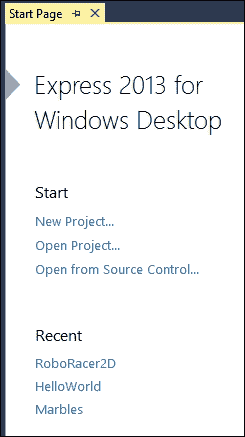

### 启动屏幕

启动屏幕，如前一张截图所示，允许您快速启动新项目或打开现有项目。您最近工作的项目可以从最近项目列表中快速访问。

### 解决方案资源管理器面板

**解决方案资源管理器**面板允许您导航并处理项目中所有的代码和其他资源。如果您在屏幕上没有看到**解决方案资源管理器**窗口，请点击**视图** | **解决方案资源管理器**。

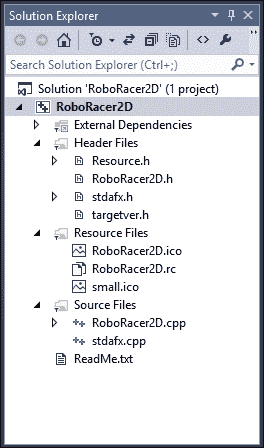

从这个窗口中，您可以：

+   双击任何项目以打开它

+   右键单击以将现有项目添加到项目中

+   右键单击以将新项目添加到项目中

+   创建文件夹以组织您的代码

### 标准工具栏面板

**标准工具栏**面板包含执行最常见任务的按钮：

+   保存当前文件

+   保存所有已修改的文件

+   撤销和重做

+   运行程序

### 小贴士

运行您的程序基本上有两种方式。您可以选择带或不带调试来运行程序。调试模式允许您设置检查点，使程序停止并让您查看变量的状态，以及在代码运行时执行其他操作。如果您不带调试运行程序，您将无法执行这些操作。

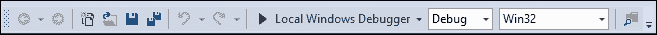

### 代码窗口

IDE 的中心是代码窗口。这是您输入和编辑代码的地方。您可以同时打开多个代码窗口。每个代码窗口都会在顶部添加一个标签，让您可以通过单次点击在各个代码片段之间切换：

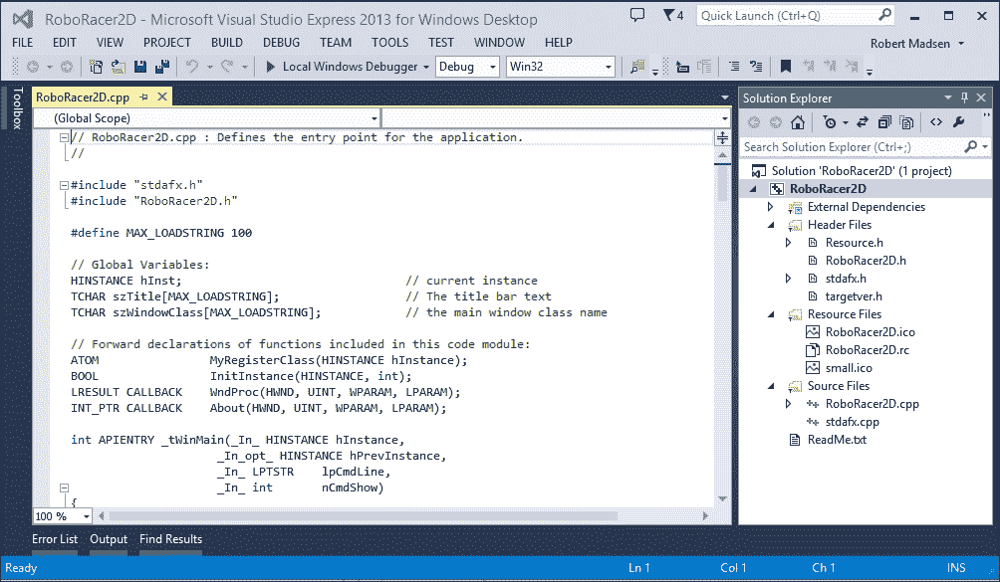

你会注意到文本是彩色的。这允许你轻松地看到不同类型的代码。例如，前一个屏幕截图中的代码注释是绿色的，而 C++对象是蓝色的。你还可以通过按住*Ctrl*按钮并使用鼠标滚轮来放大和缩小代码。

### 输出窗口

输出窗口通常位于 IDE 的底部。这个窗口是你查看当前运行状态的地方，也是你在尝试编译运行程序时查找错误的地方。

如果你看到输出窗口中的错误，通常可以双击它，Visual Studio 会带你到导致错误的代码行：

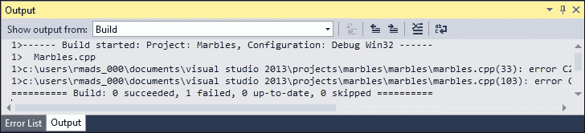

## 开始你的项目

是时候停止阅读并开始动手了！我们将使用 Visual Studio 来开始我们的游戏项目。

1.  打开 Visual Studio，并在启动窗口中点击**新建项目**链接。

1.  导航到左侧面板，并在**模板**下的**Visual C++**分支中选择**Win32**。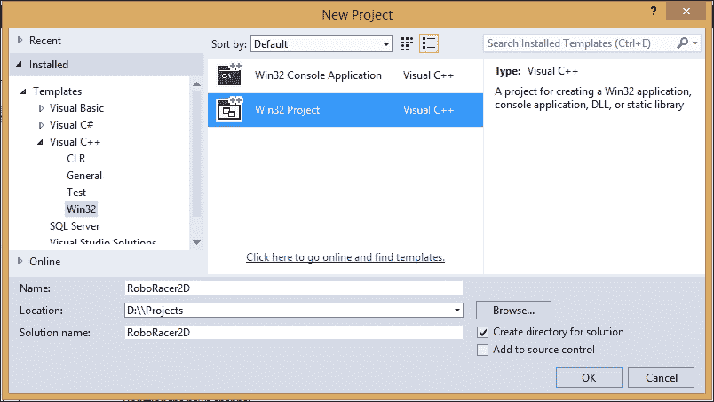

1.  在中间区域选择**Win32 项目**。

1.  给项目起一个名字。我们将要工作的第一个游戏是一个名为`RoboRacer2D`的 2D 机器人赛车游戏。

1.  选择一个文件夹位置来存储项目，或者直接保留默认位置。

1.  解决方案名称几乎总是与项目名称相同，所以保持原样。

1.  保持**为解决方案创建目录**复选框选中。

1.  点击**确定**。

1.  在下一屏幕上点击**完成**。

我们需要告诉 Visual Studio 如何处理 Unicode 字符。在解决方案资源管理器面板中右键单击项目名称，并选择属性。然后选择常规。将字符集属性更改为未设置。

恭喜！你现在已经创建了一个 Windows 应用程序并设置了你的开发环境。现在是时候继续创建你的游戏框架了。

# 游戏循环

游戏循环是推动游戏时间前进的主要机制。在我们学习如何创建这个重要组件之前，让我们简要地看看大多数游戏的结构。

## 游戏结构

大多数游戏有三个阶段：初始化阶段、游戏循环和关闭阶段。任何游戏的内核都是游戏循环。

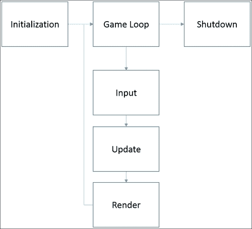

游戏循环是一系列在游戏运行期间持续运行的进程。游戏循环中发生的三个主要进程是输入、更新和渲染。

输入过程是玩家控制游戏的方式。这可以是键盘、鼠标或控制板的任何组合。新技术允许游戏通过检测手势的感应设备来控制，而移动设备可以检测触摸、加速度甚至 GPS。

更新过程包括更新游戏所需的所有任务：计算角色和游戏对象的位置变化，确定游戏中的物品是否发生碰撞，以及应用游戏中的物理和其他力。

在完成前面的计算后，接下来就是绘制结果的时候了。这被称为**渲染过程**。OpenGL 是处理你游戏渲染的代码库。

### 小贴士

许多人认为 OpenGL 是一个**游戏引擎**。这并不准确。OpenGL——开放的图形语言——是一个**渲染库**。正如你所见，渲染只是游戏执行过程中涉及的一个过程。

让我们更详细地看看游戏的每个阶段，以便我们更好地了解 OpenGL 是如何融入其中的。

### 初始化

游戏中有些部分必须在游戏运行之前只设置一次。这通常包括初始化变量和加载资源。OpenGL 的一些部分也必须在这一阶段进行初始化。

### 游戏循环

初始化完成后，游戏循环接管。游戏循环实际上是一个无限循环，它会一直循环，直到有东西告诉它停止。这通常是由玩家告诉游戏结束。

为了创造运动的错觉，渲染阶段必须每秒发生几次。一般来说，游戏努力每秒至少渲染 30 帧到屏幕上，每秒 60 帧（**fps**）则更好。

### 小贴士

结果是，24 fps 是人的眼睛开始看到连续运动而不是单独帧的阈值。这就是为什么我们希望我们的游戏最慢的速度是 30 fps。

### 关闭

当游戏结束时，仅仅退出程序是不够的。占用宝贵计算机内存的资源必须被正确释放以回收内存。例如，如果你为图像分配了内存，你希望在游戏结束时释放该内存。OpenGL 必须被正确关闭，以免继续控制**图形处理单元**（**GPU**）。游戏的最后阶段是将控制权交还给设备，以便它在正常、非游戏模式下继续正常工作。

## 创建游戏结构

现在我们已经在 Visual Studio 项目中创建了`RoboRacer2D`项目，让我们学习如何修改此代码以创建我们的游戏结构。启动 Visual Studio 并打开我们刚刚创建的项目。

你现在应该看到一个包含代码的窗口。代码文件的名称应该是`RoboRacer2D.cpp`。如果你看不到这个代码窗口，那么找到**解决方案资源管理器**，导航到`RoboRacer2D.cpp`，并打开它。

我会第一个承认 Windows C++代码既丑陋又令人畏惧！当您选择 Windows 桌面模板创建项目时，Visual Studio 会为您创建大量的代码。实际上，您现在就可以通过从菜单栏中选择**调试**然后选择**开始调试**来运行此代码。您也可以按*F5*键。

好吧，就按这样做吧！

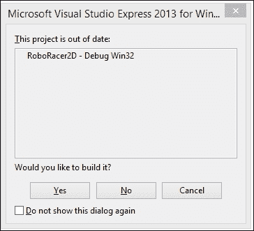

您将看到一个窗口告诉您项目已过时。这仅仅意味着 Visual Studio 需要处理您的代码并将其转换为可执行文件——这个过程称为构建项目。对于计算机科学专业的学生来说，这是您的代码被编译、链接并由操作系统执行的地方。

点击**是**继续。

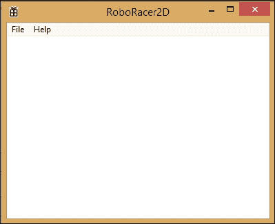

恭喜！您现在已经在 Visual Studio 中创建并运行了您的第一个程序。它可能看起来不多，但这里有很多事情在进行中：

+   一个可全尺寸调整和移动的窗口

+   一个带有**文件**和**帮助**选项的工作菜单系统

+   带有**RoboRacer2D**标题栏

+   工作中的最小化、最大化和关闭按钮

请记住，您还没有编写任何一行代码！

现在您已经看到了，请随意使用关闭按钮关闭窗口并返回 Visual Studio。

*但是等等，这看起来不像一个游戏！*

如果您认为 RoboRacer2D 程序看起来不像一个游戏，您是对的！实际上，为了制作一个游戏，我们通常会移除现在看到的大部分内容。然而，在这个演示中，我们将保持窗口不变，更多地关注代码而不是外观。

### 端口访问

每个程序都有一个起点，对于 Windows 程序来说，入口点是`tWinMain`函数。寻找以下代码行：

```cpp
int APIENTRY wWinMain
```

`_wWinMain`函数将开始运行，并设置运行 Windows 桌面程序所需的一切。本书的范围不包括这里所发生的一切。我们只是假设我们正在查看的代码设置了在 Windows 中运行的环境，我们将专注于我们需要修改以制作游戏的部分。

### Windows 消息循环

结果表明`_wWinMain`已经设置了一个循环。与游戏类似，Windows 程序实际上在一个无限循环中运行，直到它们收到某种事件告诉它们停止。以下是代码：

```cpp
// Main message loop:
while (GetMessage(&msg, nullptr, 0, 0))
{
  if (!TranslateAccelerator(msg.hwnd, hAccelTable, &msg))
  {
    TranslateMessage(&msg);
    DispatchMessage(&msg);
  }
}
```

如您所见，这些代码行设置了一个 while 循环，该循环将一直运行，直到`GetMessage`调用的结果为`false`。

同样，我们不会担心具体的细节，但可以说`GetMessage`会不断检查由 Windows 发送的消息或事件。一条特定的消息是退出事件，它将返回一个结果为 false，结束`while`循环，退出`tWinMain`函数，并结束程序。

我们的目标是修改 Windows 消息循环，并将此代码块转换为游戏循环：

```cpp
StartGame();
//Game Loop
bool done = false;
while (!done)
{
  if (PeekMessage(&msg, NULL, 0, 0, PM_REMOVE))
  {
    if (msg.message == WM_QUIT)
    {
      done = true;
    }
    else
    {
      TranslateMessage(&msg);
      DispatchMessage(&msg);
    }
  }
  else
  {
    GameLoop();
  }
}
EndGame();
```

研究前面的代码。你会看到我们添加了三个新的函数：`StartGame`、`GameLoop` 和 `EndGame`。

+   `StartGame` 在 Windows 消息循环之前，这意味着 `StartGame` 中的所有内容都会在 Windows 进入其循环之前运行一次。我们将所有的游戏初始化代码放在 `StartGame` 函数中。

+   `EndGame` 在 Windows 消息循环之后。这意味着 `EndGame` 中的代码只有在 Windows 消息循环退出后才会执行一次。这是我们释放资源并关闭游戏的完美地方。

+   `GameLoop` 与 Windows 消息循环交织在一起。基本上，代码是在说，“*继续运行，直到你收到退出 Windows 消息。当你运行时，检查 Windows 是否传递了需要处理的事件。如果没有要处理的消息，那么运行我们的游戏。*”

### 提示

顺序很重要。例如，你必须在这些函数在 `wWinMain` 函数之前声明。这是因为它们会被 `wWinMain` 调用，所以它们必须在 `tWinMain` 使用它们之前存在。一般来说，一个函数必须在使用它的代码之前声明。

为了使这些新函数有效，请转到 `_tWinMain` 之前的行，并为这三个函数输入一些存根：

```cpp
void StartGame()
{
}

void GameLoop()
{
}

void EndGame()
{
}
```

这里的想法是帮助你看到将标准的 Windows 消息循环转换为游戏循环是多么容易。

# 介绍 OpenGL

我们已经花费了很多时间来谈论游戏循环和 Visual Studio。我们终于要讨论这本书的主要内容：**OpenGL**！

## 什么是 OpenGL？

OpenGL 使得在计算机屏幕上渲染复杂的 2D 和 3D 图形成为可能。实际上，OpenGL 也是大多数移动设备和平板电脑背后的技术。

OpenGL 与你的设备的图形设备协同工作，在屏幕上绘制图形。大多数现代计算设备有两个处理器：**中央处理单元**（**CPU**）和**图形处理单元**（**GPU**）。

绘制现代 2D 和 3D 图形是一个非常耗处理器的任务。为了释放计算机的主处理器（CPU）来完成其工作，GPU 承担了将渲染到屏幕上的任务。OpenGL 是一种语言，告诉 GPU 要做什么以及如何做。

### 提示

技术上，OpenGL 是一个 API，或者应用程序编程接口。另一种理解方式是，OpenGL 是一个代码库，一旦你在代码中包含了适当的头文件，你就可以访问它。OpenGL 有不同的版本。这本书使用的是 OpenGL 1.1。尽管这是 OpenGL 的第一个版本，但它包含在所有版本的 Windows 中，并为所有未来的版本提供了构建块。

## 另一个 GL

顺便说一句，你可能听说过“其他”图形引擎——微软的 DirectX。与 OpenGL 类似，DirectX 允许程序员与 GPU 通信。很多人想知道 OpenGL 和 DirectX 之间的区别，以及哪个是最好的选择。

虽然肯定会有 DirectX 和 OpenGL 的支持者和捍卫者，但 DirectX 和 OpenGL 之间唯一的真正区别是你编写它们的具体方式。在功能和能力方面，这两种技术大致相同。

OpenGL 相对于 DirectX 有一个优势。DirectX 只适用于 Microsoft 技术，而 OpenGL 适用于 Microsoft 技术以及许多其他技术，包括大多数现代手机和苹果 Mac 电脑系列。

## 下载 OpenGL

我记得我刚开始学习 OpenGL 的时候。我徒劳地搜索，寻找下载 OpenGL SDK 的链接。结果发现，你不必下载 OpenGL SDK，因为它在安装 Visual Studio 时就已经安装了。

你确实想确保你有最新的显卡 OpenGL 驱动程序。为此，请访问[`www.opengl.org/wiki/Getting_started#Downloading_OpenGL`](http://www.opengl.org/wiki/Getting_started#Downloading_OpenGL)并遵循适当的链接。

## 将 OpenGL 添加到项目

为了在我们的程序中使用 OpenGL，我们需要添加一些代码。打开我们一直在工作的`RoboRacer2D`项目，让我们来做这件事！

### 链接到 OpenGL 库

你需要使用 OpenGL 的所有内容都在`OpenGL32.dll`库文件中。取决于你告诉 Visual Studio 你想要在项目中使用 OpenGL 库。

右键单击**项目** | **RoboRacer2D 属性**。

### 小贴士

顺便说一下，Visual Studio 首先创建一个**解决方案**，然后在解决方案中添加一个**项目**。解决方案是**解决方案资源管理器**层次结构中的顶级条目，项目是第一个子项。在这种情况下，请确保您右键单击项目，而不是解决方案。

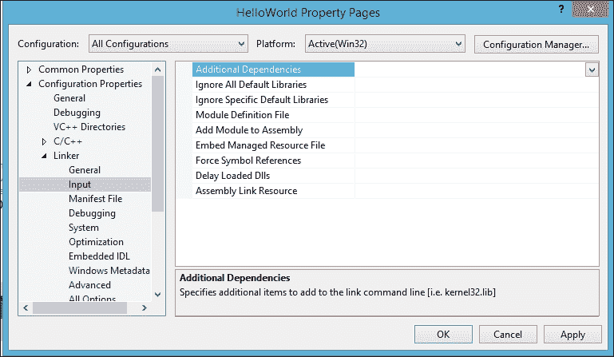

1.  对于**配置**下拉框，请确保你选择**所有配置**。

1.  打开**配置属性**分支，然后是**链接器**分支。

1.  选择**输入**选项。

1.  点击**附加依赖项**下拉菜单并选择**<编辑…>**。

1.  在对话框窗口中输入`OpenGL32.lib`并点击**确定**。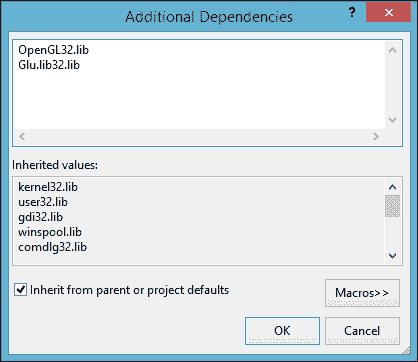

1.  关闭**属性页**窗口。

即使你在编写 64 位应用程序，你也会使用 OpenGL 32 位库。

接下来，我们需要告诉 Visual Studio 你想要在程序中包含 OpenGL 头文件。如果你查看代码的顶部，你会看到已经加载了几个头文件：

```cpp
#include "stdafx.h"
#include "RoboRacer2D.h"
```

在这些行下面，添加以下内容：

```cpp
#include <Windows.h>
#include <gl\GL.h>
#include <gl\GLU.h>
```

### 小贴士

GL.h 是 OpenGL 库的主要头文件。`GLU.h`代表 GL Utility，是一个额外的功能库，使 OpenGL 更容易使用。这些头文件对应于我们添加到项目的`OpenGL32.lib`和`Glu32.lib`库。

恭喜！你已经设置了使用 OpenGL 的开发环境，你现在可以开始编写你的第一个游戏了。

# 摘要

在本章中，我们覆盖了大量的内容。我们学习了如何通过下载和安装 Visual Studio 来设置你的开发环境。接下来，我们创建了一个 C++ Windows 桌面应用程序。

我们讨论了大多数游戏的结构以及游戏循环的重要性。回想一下，一款普通游戏应该以 30 fps 的速度运行，而高端游戏则追求 60 fps 以提供流畅的动画。

最后，我们学习了 OpenGL 以及如何在项目中初始化 OpenGL。记住，OpenGL 是负责利用 GPU 的强大功能将每个图像和文本绘制到屏幕上的图形引擎。

在完成所有这些工作之后，仍然没有太多可以展示的内容。在下一章中，我们将详细介绍如何将第一张图像渲染到屏幕上。信不信由你，正确设置你的开发环境意味着你已经为使用 OpenGL 创建你的第一款游戏迈出了重要的一步。
