# 第二章. 你的视角

想象一下你正在制作一个视频。你拿出手机，指向你想拍摄的区域，然后按下录制。你正在拍摄大峡谷的视频，所以你必须移动摄像头来捕捉整个场景。突然，一只鸟飞过了视野，你捕捉到了整个场景。

上述场景基本上就是游戏的工作方式。游戏有一个虚拟摄像头，它可以被定位，甚至可以移动。与你的手机上的视频摄像头类似，游戏摄像头只能看到游戏世界的一部分，所以有时你必须移动它。任何在摄像头前移动的游戏对象都会被玩家看到。

本章将解释游戏中的渲染方式。渲染是将图像实际显示在屏幕上的过程。为了将你的游戏显示在屏幕上，你需要对以下术语有一个扎实的理解：

+   **坐标系**：坐标系是允许你在游戏中定位对象的参考系

+   **原语**：原语是你在屏幕上看到的图像的基本构建块，OpenGL 被设计用来与它们一起工作

+   **纹理**：纹理是用于给你的游戏中的对象赋予逼真外观的图像文件

到你阅读完这一章时，你将了解如何使用图像来构建你的游戏世界并在屏幕上显示它。

# 绘制你的复仇计划

好吧，你并不是真的在绘制你的复仇计划。但你是在像在一张图纸上放下所有东西一样，在你的游戏中绘制一切。你还记得高中几何吗？你拿出你的图纸，画了几条代表 X 轴和 Y 轴的线，然后在图上绘制了点。OpenGL 基本上以同样的方式工作。

## OpenGL 坐标系

OpenGL 坐标系是一个标准的 X 轴和 Y 轴坐标系，你很可能一生都在学习它。你可以将(0, 0)概念化为屏幕的中心。

假设我们想在屏幕上显示一辆移动的汽车。我们可以从在坐标系中绘制汽车的位置(5, 5)开始。如果我们然后将汽车从(5, 5)移动到(6, 5)，然后到(7, 5)，以此类推，汽车就会向右移动（最终离开屏幕），如下面的图所示：

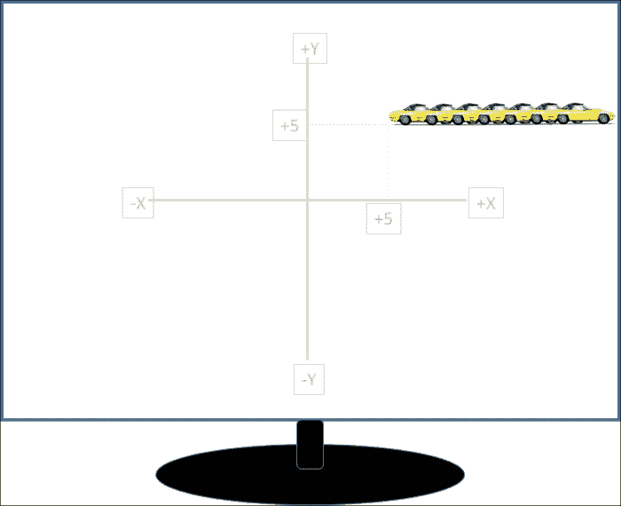

我们对你并不完全诚实。由于 OpenGL 是一个 3D 渲染引擎，实际上还有一个我们尚未讨论的 Z 轴。由于本书的这一部分专注于 2D 游戏编程，我们将暂时忽略 Z 轴。

### 陈述你的观点

随着我们学习每个概念，我们实际上会编写代码来演示每个要点。说到要点，我们将编写代码使用 OpenGL 绘制点。

我们将把这个项目设置为一个独立的项目，而不是实际的游戏项目。我们将使用这个项目来演示如何编写基本的 OpenGL 任务。为了使这个项目尽可能简单，这个项目将在 Visual Studio 中作为一个控制台项目创建。控制台项目没有完整 Windows 项目的大部分功能，因此，设置代码要小得多。

启动 Visual Studio 并创建一个新项目。在模板中，从**Visual C++**模板组中选择**Win32 控制台应用程序**。将项目命名为**OpenGLFun**，然后点击**OK**。点击**Finish**以完成项目向导。

### 小贴士

你应该注意到，代码比上一章为完整 Windows 应用程序创建的代码要简单得多。随着我们继续构建游戏，我们将回到使用更复杂的代码。


一旦创建了项目，将以下代码输入到代码窗口中：

```cpp
#include "stdafx.h"
#include <windows.h>
#include "glut.h"

void initGL() {
  glClearColor(0.0f, 0.0f, 0.0f, 1.0f);
}

void drawPoints()
{
  glBegin(GL_POINTS);

  glColor3f(1.0f, 1.0f, 1.0f);
  glVertex2f(0.1f, -0.6f);
  glVertex2f(0.7f, -0.6f);
  glVertex2f(0.4f, -0.1f);

  glEnd();
}

void update()
{
  glClear(GL_COLOR_BUFFER_BIT);
  drawPoints();
  glFlush();
}

int _tmain(int argc, _TCHAR* argv[])
{
  glutCreateWindow("GL Fun");
  glutInitWindowSize(320, 320);
  glutInitWindowPosition(50, 50);
  glutDisplayFunc(update);
  initGL();
  glutMainLoop();
  return 0;
}
```

### 理解代码

由于我们将使用此代码来演示 OpenGL 的基本原理，我们将详细查看它，以便你理解代码正在做什么。

#### 头文件

此代码使用三个头文件：

+   `stdafx.h`：此头文件加载 Visual Studio 在创建项目时创建的预编译头文件

+   `windows.h`：此头文件允许创建渲染 OpenGL 内容的窗口

+   `glut.h`：此头文件允许我们使用 OpenGL 实用工具包，它简化了 OpenGL 的设置和使用

### 小贴士

你需要下载 GLUT 文件并将它们放置在项目文件夹中。从[`www.javaforge.com/doc/105278`](http://www.javaforge.com/doc/105278)下载文件。打开压缩文件，将`glut.h`、`glut32.dll`和`glut32.lib`复制到包含你的源代码的文件夹中。你可能需要将`glut.h`添加到你的项目中（右键单击`Header files` | `Add` | `Existing item`）。

#### 初始化 OpenGL

你会注意到一个名为`initGL`的函数。此函数目前包含一行代码，其唯一目的是在每一帧的开始设置屏幕的背景颜色。这通常被称为*清除颜色*，因为 OpenGL 在开始渲染其他项目之前会将背景清除到默认值：

```cpp
glClearColor(0.0f, 0.0f, 0.0f, 1.0f);
```

括号内的四个数字定义了颜色及其透明度。前三个数字代表用于创建颜色的红色、绿色和蓝色（RGB）的量。第四个数字代表颜色的透明度（或者从另一个角度来看，透明度）。这通常被称为 alpha 通道（RGBA）。上面的值创建了一个 100%不透明的黑色背景。

OpenGL 中的所有值范围从 0 到 1。这意味着会有很多小数，在 C++中称为浮点数。因此，在 C++术语中，范围是从`0.0f`到`1.0f`。

C++与许多使用整数甚至十六进制数来表示其范围的许多语言不同。例如，许多其他语言使用 0 到 255 的范围来表示每个颜色分量。在这些情况下，整数 0 对应于`0.0f`，整数 255 对应于`1.0f`。

### 小贴士

要将范围在 0 到 255 之间的整数转换为 OpenGL 的系统，使用公式`(1/255) * value`，其中`value`是要转换的整数值。因此，要将数字 50 转换为，您将计算`(1/255) * 50`，结果为 0.1096。

#### 主入口点

每个程序都必须有一个起始点，称为入口点。在我们的程序中，这是`_tmain`函数。我们将其放在代码的最后，因为 C++期望被调用的函数在调用它们的函数之前已经定义。关于这一点有各种技巧，但我们将保持示例简单，并始终将`_tmain`定义为代码中的最后一个函数。

当我们启动程序时，有一些事情必须做来设置 OpenGL 渲染的环境。以下是`_tmain`函数的结构：

+   `glutCreateWindow("GL Fun")`: 这个函数创建了一个用于渲染 OpenGL 内容的窗口。我们将程序名称作为参数包含在内。

+   `glutInitWindowSize(320, 320)`: 这个函数初始化窗口的大小。我们指定了 320 像素乘以 320 像素。您可以自由尝试更大的（或更小的）窗口大小。

+   `glutInitWindowPosition(50, 50)`: 这个函数设置窗口左上角相对于设备屏幕的位置。在这种情况下，窗口将从屏幕左侧和顶部各开始绘制 50 像素。您可以自由尝试其他位置。

+   `glutDisplayFunc(update)`: 记得之前章节中我们讨论的游戏循环吗？游戏循环是程序中反复运行的部分（即每一帧）。我们需要告诉 GLUT 我们想要在每一帧运行的函数的名称。在这种情况下，我们告诉 GLUT 使用名为`update`的函数（将在下一节中描述）。

+   `initGL()`: 这只是调用我们之前描述的`initGL`函数。

+   `glutMainLoop()`: 这个函数启动主游戏循环，它反过来会每帧调用我们的`update`函数。这实际上启动了我们的程序，它将在无限循环中运行，直到我们关闭程序。

+   `return 0`: 这一行是`_tmain`函数所必需的。它基本上告诉我们的系统程序已退出且一切正常。此行代码将在我们退出程序之前不会运行。

#### 更新函数

更新函数在每一帧都会被调用。我们想要执行的所有工作都必须在这个函数中编码。更新函数目前有三行代码：

+   `glClear(GL_COLOR_BUFFER_BIT)`: `glClear` 函数将 *渲染缓冲区* 重置为之前由 `glClearColor` 函数指定的颜色。渲染缓冲区是内存中一个独立的位置，OpenGL 在对象显示在屏幕上之前在这里渲染对象。稍后，当所有的渲染操作完成后，缓冲区的内容将快速传输到屏幕上。

+   `drawPoints()`: 这是一个我们编写的函数，用于在屏幕上显示三个点。稍后，我们将替换这一行代码以绘制其他对象。该函数将在下一节中描述。

+   `glFlush()`: 这个函数刷新 OpenGL 缓冲区，包括当前持有我们的渲染的后缓冲区。结果，渲染缓冲区被刷新，所有内容都被渲染到设备屏幕上。

    ### 提示

    OpenGL 使用两个缓冲区进行绘制。一个是屏幕缓冲区，这是玩家目前在计算机显示器上看到的。另一个是后缓冲区，这是我们打算在下个帧中渲染的对象所在的地方。一旦我们在后缓冲区中完成创建渲染，我们就快速将后缓冲区的内容交换到当前屏幕上。这个过程发生得如此之快，以至于玩家无法检测到交换。

#### 绘制点

`drawPoints` 函数执行确定绘制什么以及在哪里绘制的实际工作。以下是每行代码的作用：

+   `glBegin(GL_POINTS)`: `glBegin` 调用告诉 OpenGL 准备将项目渲染到屏幕上。我们还告诉 OpenGL 我们想要渲染什么。在我们的示例中，我们指导 OpenGL 解释我们发送给它的数据作为单独的点。稍后，我们将学习如何使用 `GL_TRIANGLES` 绘制三角形或使用 `GL_QUADS` 绘制矩形来渲染其他对象。

+   `glColor3f(1.0f, 1.0f, 1.0f)`: 如其名所示，`glColor` 设置将要渲染的项目颜色。记住，OpenGL 使用 RGB 颜色系统，所以颜色将是白色（指定为黑色的是 0, 0, 0）。

+   `glVertex2f(0.1f, -0.6f)`: 在 OpenGL 中，每个点都称为 *顶点*。这段代码告诉 OpenGL 在坐标 (`0.1, -0.6`) 处渲染一个单独的点。在这种情况下，零表示屏幕中心，一表示从中心的一个单位。相机的设置决定了从中心的一个单位实际上在屏幕上有多远。在我们的示例代码中，有三个 `glVertex` 调用，每个调用对应于我们想要渲染到屏幕上的一个点。

    ### 提示

    OpenGL 函数的命名为你如何使用该函数提供了线索。例如，`glVertex2f` 表示这个函数接受 2 个参数，并且它们将是 `float` 类型。相比之下，`glVertex3f` 函数接受三个 `float` 类型的参数。

+   `glEnd()`: 就像所有美好的事物都必须有个结束一样，我们必须告诉 OpenGL 我们何时完成渲染。这就是调用 `glEnd` 的目的。

    ### 提示

    你可能已经注意到大量使用了小写字母 f；这代表 *float*，意味着一个可能包含小数部分的数字（与总是整数的 *integer* 相反）。所以，一个如 `0.0f` 的数字告诉 C++ 将数字零视为浮点数。OpenGL 使用类似的命名约定为其函数命名。例如，函数 `glVertex2f` 表示该函数需要两个浮点数（在这种情况下，要渲染的点的 *x* 和 *y* 坐标）。

### 运行程序

现在你已经输入了代码，是时候看到它的实际效果了。当你运行程序（**调试** | **开始调试**）时，你会看到以下内容：


你需要仔细观察，但如果一切顺利，你应该能在屏幕的右下角看到三个白色点。恭喜！你已经渲染了你的第一个 OpenGL 对象！

希望你已经能够跟随代码。将 `_tmain` 视为一个管理者，通过设置一切并调用 `main` 循环来控制程序（就像我们将在我们的游戏中做的那样）。然后 GLUT 接管并每帧调用 `update` 函数。`update` 函数初始化渲染缓冲区，将对象绘制到渲染缓冲区，然后将渲染缓冲区的内容传输到屏幕。在一个每秒运行 60 帧的游戏中，这个整个操作每秒会发生 60 次！

### 拉伸你的点

让我们看看修改 GLFun 以绘制其他对象有多容易。这次我们将画两条线。在 `drawPoints` 函数下方添加以下函数：

```cpp
void drawLines()
{
  glBegin(GL_LINES);

  glColor3f(1.0f, 1.0f, 1.0f);
  glVertex2f(0.1f, -0.6f);
  glVertex2f(0.7f, -0.6f);

  glVertex2f(0.7f, -0.6f);
  glVertex2f(0.4f, -0.1f);

  glEnd();
}
```

接下来，进入 `update` 函数并将 `drawPoints` 替换为对 `drawLines` 的调用。新的 `update` 函数将看起来像这样：

```cpp
void update() 
{
  glClear(GL_COLOR_BUFFER_BIT);
  drawLines();
  glFlush();
}
```

你会注意到有四个 `glVertex` 调用。每一对顶点设置了一条线的起始和结束点。由于定义了四个点，因此结果是画出了两条线。

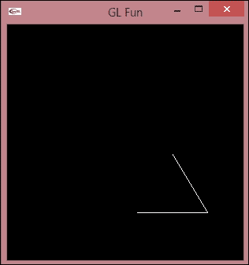

## 获取原语

基本对象，如点和线，被称为原语。如果只用点和线来创建一切将会非常困难，所以 OpenGL 定义了其他原语形状，你可以使用它们来创建更复杂的对象。

在本节中，我们将深入底层，了解 OpenGL 如何在屏幕上创建更逼真的图像。可能会让你惊讶的是，一个单一的几何图形被用来创建从最简单到最复杂的图形。所以，卷起袖子，准备变得有点油腻。

### 任何名字的三角形

你见过地理圆顶吗？尽管圆顶看起来是球形的，但它实际上是由三角形的组合构成的。结果是三角形很容易组合在一起，这样你就可以在物体上添加一点曲率。每个三角形可以以轻微的角度附着在其他的三角形上，这样你就可以用平面的三角形制作一个圆顶。此外，考虑这一点：三角形越小，最终结果就越令人信服！

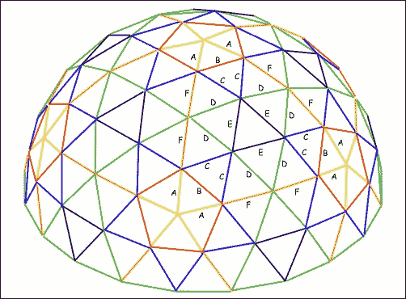

用来绘制所有现代图形的基本单位是谦逊的三角形。图形卡被特别设计成能够快速绘制三角形——非常小的三角形。典型的图形卡每秒可以绘制数百万个三角形。高端卡每秒可以达到数十亿个三角形。

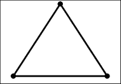

记得我们之前画点和线的时候吗？每个点有一个顶点，每条线有两个顶点。当然，每个三角形有三个顶点。

### 一个原始示例

是时候看看一些代码的实际效果了。在 GLFun 项目中 `drawLines` 函数之后添加以下代码：

```cpp
void drawSolidTriangle()
{
  glBegin(GL_TRIANGLES);

  glColor3f(0.0f, 0.0f, 1.0f);
  glVertex2f(0.1f, -0.6f);
  glVertex2f(0.7f, -0.6f);
  glVertex2f(0.4f, -0.1f);

  glEnd();
}
```

然后将 `update` 函数的中间行更改为调用 `drawSolidTriangle`：

```cpp
void update()
{
  glClear(GL_COLOR_BUFFER_BIT);
  drawSolidTriangle();
  glFlush();
}
```

运行程序，你会看到以下输出：

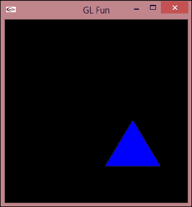

你可能会注意到 `drawSolidTriangle` 和 `drawPoints` 的代码之间有相似之处。仔细查看代码，你会看到三个 `glVertex` 函数定义了相同的三个点。然而，在这种情况下，我们告诉 OpenGL 绘制三角形而不是点。你也应该查看代码，确保你理解为什么三角形被渲染成蓝色。

让我们再看一个例子。在 `drawSolidTriangle` 函数下面添加以下代码：

```cpp
void drawGradientTriangle()
{
  glBegin(GL_TRIANGLES);

  glColor3f(1.0f, 0.0f, 0.0f);
  glVertex2f(0.3f, -0.4f);

  glColor3f(0.0f, 1.0f, 0.0f);
  glVertex2f(0.9f, -0.4f);

  glColor3f(0.0f, 0.0f, 1.0f);
  glVertex2f(0.6f, -0.9f);

  glEnd();
}
```

一定要在 `update` 函数的中间行中更改为调用 `drawGradientTriangle`：

```cpp
void update()
{
  glClear(GL_COLOR_BUFFER_BIT);
  drawGradientTriangle();
  glFlush();
}
```

运行程序，这就是你将看到的内容：

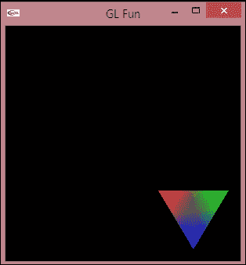

你会立刻注意到这个三角形填充的是渐变色而不是纯色。如果你仔细查看代码，你会看到每个顶点都被设置了不同的颜色。OpenGL 然后负责在每个顶点之间插值颜色。

### 从三角形到模型

三角形可以以无数种方式组合在一起，形成几乎任何可以想象到的形状。重要的是要理解三角形仅仅是几何学的一部分。三角形被用来构建物体的形状。我们把这些形状称为模型。

一次构建一个三角形来构建模型会非常耗时，因此 3D 图形程序，如**Maya**和**Blender**，允许你创建更复杂的形状（这些形状本身是由三角形构成的）模型。然后可以将这些模型加载到你的游戏中，并由 OpenGL 渲染。OpenGL 实际上将形成这些三角形的点列表直接发送到显卡，然后显卡在屏幕上创建图像。当我们开始处理 3D 游戏设计时，我们将看到这个过程在实际中的应用。

# 介绍纹理

游戏中的图像被称为纹理。纹理允许我们使用现实世界的图像来绘制我们的世界。想想要创建一条土路需要什么。你可以选择用正确的颜色为三角形上色，使整个场景看起来像土，或者你可以将实际的土图像（即纹理）应用到三角形上。你认为哪种方式看起来更逼真？

## 使用纹理填充三角形

假设你打算粉刷你的卧室。你可以选择用油漆给墙壁上色，或者你可以买一些壁纸并将其贴在墙上。使用图像为我们的三角形添加颜色，基本上就像用壁纸给我们的卧室墙壁上色一样。图像被应用到三角形上，使其外观比仅用颜色所能创造出的更加复杂：

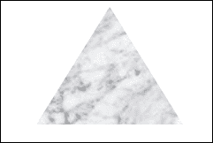

当我们想要变得非常巧妙时，我们使用纹理来填充三角形的内部而不是颜色。前一张图像中的三角形已经应用了大理石纹理。你可以想象使用这种技术来创建大理石地板。

记得我们之前一直在处理的汽车吗？它看起来并不像三角形，对吧？事实上，许多现实世界中的物体看起来更像矩形而不是三角形：


结果表明，我们在游戏中使用的所有纹理实际上都是矩形。想象一下，我们一直在处理的汽车实际上嵌入在一个不可见的矩形中，如下面的图像所示，以浅灰色表示：


大多数图形程序使用棋盘格背景来指示图像中透明的区域。


使用矩形来绘制我们所有的形状解决了你可能之前没有考虑过的一个大问题。如果你还记得，将汽车放置在精确的（5，5）位置非常重要。为了做到这一点，我们决定将汽车的左下角放置在点（5，5）。


看着汽车，实际上很难确定左下角的确切位置。是保险杠的左下角、轮胎还是其他地方？

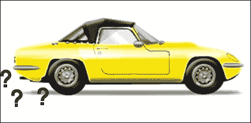

正如我们刚才讨论的那样，通过将汽车嵌入矩形中，问题立即得到解决。


## 参考问题

在处理纹理时，知道用作参考的点非常重要，通常被称为旋转中心点。在以下图像中，一个黑点被用来表示旋转中心点。旋转中心点影响两个关键问题。首先，旋转中心点决定了图像将在屏幕上的确切位置。其次，旋转中心点是图像旋转时围绕的点。

比较以下图像中描绘的两个场景：

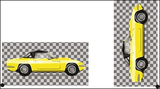

前面图像中汽车的旋转中心点被设置为图像的左下角。汽车已经逆时针旋转了 90 度。

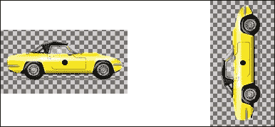

前面图像中汽车的旋转中心点被设置为图像的中心。汽车已经逆时针旋转了 90 度。注意旋转中心点不仅影响汽车的旋转方式，还影响旋转完成后与原始位置的关系。

## 在广场上闲逛

那么，你现在是不是感到困惑了？首先，我告诉你，用于创建图像的最基本形状是三角形，然后我告诉你，所有纹理实际上都是矩形。哪一个是正确的？

就在这时，你的高中几何老师默默地走进教室，走到刚刚神奇地出现在你墙上的黑板前，画出了以下这样的图：

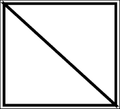

当然！你突然意识到两个三角形可以组合在一起形成一个矩形。事实上，这种排列非常有用，以至于我们给它起了一个名字：**四边形**。

当涉及到 2D 图形时，四边形是王者。

### 编码四边形

是时候看看一些代码了。在`GLFun`中的`drawGradientTriangle`函数下方添加以下代码：

```cpp
void drawQuad()
{
  glBegin(GL_QUADS);

  glColor3f(0.0f, 1.0f, 0.0f);
  glVertex2f(0.1f, -0.1f);
  glVertex2f(0.1f, -0.6f);
  glVertex2f(0.6f, -0.6f);
  glVertex2f(0.6f, -0.1f);

  glEnd();
}
```

如往常一样，将更新中的中间行改为调用`drawQuad`。运行程序，你将得到一个漂亮的绿色正方形，或者说是一个四边形！需要注意的是，点是从左上角开始定义的，然后逆时针顺序移动。

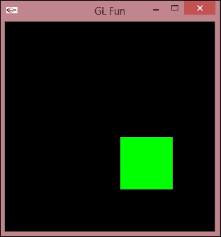

### 小贴士

点的定义顺序被称为*环绕*。默认情况下，逆时针环绕告诉 OpenGL，面向外的面被认为是正面。这有助于确定许多事情，例如是否应该照亮这个面。当我们开始 3D 工作时，这一点变得更加重要。实际上，GLUT 简化了我们的工作，使得在使用 GLUT 时，无论是顺时针还是逆时针环绕都不重要。

## 渲染纹理

渲染纹理包括两个步骤：加载图像和使用 OpenGL 原语渲染图像。我们本章的最终目标将是修改 GLFun，使其能够使用四边形渲染纹理。

### 加载纹理

我们的第一步是创建一个加载纹理的函数。实际上，这并不那么容易。所以，我将给你一个加载 24 位 BMP 文件的函数代码，我们将它视为一个黑盒，你可以在自己的代码中使用它。

将此代码添加到现有`GLFun`代码的顶部：

```cpp
  GLuint texture;
  #pragma warning(disable: 4996)
  bool loadTexture(const char* filename)
  {
    unsigned char header[54];
    unsigned char* data;
    int dataPos;
    int width;
    int height;
    int imageSize;

    FILE * file = fopen(filename, "rb");
    if (!file) return false;
    if (fread(header, 1, 54, file) != 54) return false;
    if (header[0] != 'B' || header[1] != 'M') return false;

    dataPos = *(int*)&(header[0x0A]);
    imageSize = *(int*)&(header[0x22]);
    width = *(int*)&(header[0x12]);
    height = *(int*)&(header[0x16]);

    if (imageSize == 0) imageSize = width*height * 3;
    if (dataPos == 0) dataPos = 54;

    data = new unsigned char[imageSize];
    fread(data, 1, imageSize, file);
    fclose(file);

    glGenTextures(1, &texture);
    glBindTexture(GL_TEXTURE_2D, texture);
    glTexImage2D(GL_TEXTURE_2D, 0, GL_RGB, width, height, 0, GL_RGB, GL_UNSIGNED_BYTE, data);
    glTexParameteri(GL_TEXTURE_2D, GL_TEXTURE_MAG_FILTER, GL_NEAREST);
    glTexParameteri(GL_TEXTURE_2D, GL_TEXTURE_MIN_FILTER, GL_NEAREST);
    return true;
  }
```

将以下代码行添加到`initGL`中：

```cpp
glEnable(GL_TEXTURE_2D);
glTexEnvf(GL_TEXTURE_ENV, GL_TEXTURE_ENV_MODE, GL_MODULATE);
```

我们不会逐行分析这段代码。简而言之，它打开图像文件，提取文件的前 54 个字节（bmp 头数据），并将文件的其余部分作为图像数据存储。进行了一些 OpenGL 调用，将这些数据分配给 OpenGL 纹理，然后完成。

你需要有一个调用加载纹理的函数，所以请将此行代码添加到`_tmain`中，在调用`initGL`之后：

```cpp
loadTexture("car.bmp"); 
```

当然，将`car.bmp`替换为你想要加载的文件。确保你已经将适当的图形文件放置在源代码文件夹中。

### 纹理包裹

为了在屏幕上显示纹理，OpenGL 将纹理映射到另一个原语上。这个过程被称为纹理包裹。由于纹理是矩形的，将其映射到四边形上是有意义的。

以下图像显示了 OpenGL 如何看到纹理：一个具有四个纹理坐标的矩形：


左上角是纹理坐标**0, 0**。右下角是纹理坐标**1, 1**。你应该能够识别其他角落的纹理坐标。

### 小贴士

如果将 OpenGL 数字转换为百分比可能会更容易理解，其中 0 表示零百分比，1 表示 100 百分比。例如，你可以将左下角视为纹理宽度的零百分比和纹理高度的百分之百。

为了渲染纹理，我们将其（或包裹）叠加到四边形上。所以，假设我们定义了以下四边形：

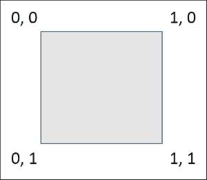

我们可以将纹理坐标映射到四边形坐标：

| 纹理坐标 | 映射到 | 四边形坐标 |
| --- | --- | --- |
| 0, 0 |   | 0, 0 |
| 1, 0 |   | 1, 0 |
| 1, 0 |   | 1, 0 |
| 0, 1 |   | 0, 1 |

以下图示展示了这一点：

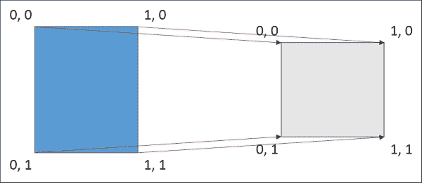

在最简单的情况下，纹理包裹是将纹理的角落映射到四边形的角落的过程。

### 小贴士

你将看到纹理包裹也被称为*uv*包裹。我一直试图弄清楚*uv*代表什么！以下是真实的故事：*x*和*y*已经被用来指代四边形坐标，我们需要有其他东西来称呼纹理坐标，所以某个聪明的人说：“让我们用 u 和 v！”

### 创建纹理四边形

现在，我们将编写代码来渲染一个纹理四边形。将以下函数添加到代码中：

```cpp
void drawTexture()
{
  glBindTexture(GL_TEXTURE_2D, texture);
  glBegin(GL_QUADS);
  glTexCoord2d(0.0, 0.0); glVertex2d(0.0, 0.0);
  glTexCoord2d(1.0, 0.0); glVertex2d(0.5, 0.0);
  glTexCoord2d(1.0, 1.0); glVertex2d(0.5, 0.5);
  glTexCoord2d(0.0, 1.0); glVertex2d(0.0, 0.5);
  glEnd();
}
```

这段代码的作用如下：

+   `glBindTexture(GL_TEXTURE_2D, texture)`: 即使在一个游戏中我们有成千上万的纹理，OpenGL 一次也只能处理一个纹理。`glBindTexture`的调用告诉 OpenGL 我们现在正在使用哪个纹理。每次创建纹理时，OpenGL 都会为该纹理分配一个数字，称为纹理句柄。

    当我们加载位图时，我们使用了`glGenTextures(1, &texture)`命令，该命令指示 OpenGL 生成一个纹理并将句柄保存到名为 texture 的变量中。然后我们将此值传递给`glBindTexture`函数，同时传递一个标志告诉 OpenGL 我们正在处理一个 2D 纹理。

+   `glTexCoord2d(0.0, 0.0); glVertex2d(0.0, 0.0)`: 我们将这两行放在一起，因为它们是协同工作的。你应该能认出`glVertex2d`的调用。这个函数告诉 OpenGL 如何将纹理包裹到四边形上（你也应该能认出我们正在绘制一个四边形，因为我们已经在上一行代码中设置了这一点）。

+   每次调用`glTexCoord2d`定义一个纹理坐标。紧接着的下一行代码将纹理坐标映射到四边形坐标。顺序至关重要：首先定义纹理坐标，然后定义相应的四边形坐标。

顺便说一句，别忘了在 update 中的中间代码行替换为以下代码行：

```cpp
drawTexture();
```

现在，运行程序！

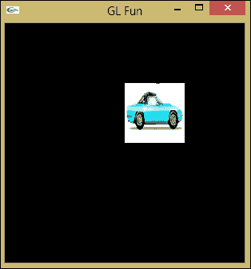

# 将碎片组合在一起

以下图像是一个组合，展示了我们迄今为止所涵盖的大部分概念。看看你是否能识别以下内容：

+   透明区域

+   三角形

+   顶点

+   轴心点

+   纹理

+   四边形

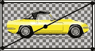

# 概述

本章介绍了在屏幕上显示图像所需的核心概念。我们首先讨论了 2D 游戏的 OpenGL 坐标系。坐标系允许你在屏幕上放置对象。随后讨论了相机，这是 OpenGL 查看屏幕上出现的对象的方式。

接下来，你学习了如何使用三角形和四边形来创建简单的图形，以及如何将这些纹理应用到这些原语上，以将 2D 图像渲染到屏幕上。

你最终可以在屏幕上看到 OpenGL 渲染的图像。正如他们所说，一张图片胜过千言万语！

在下一章中，你将学习如何通过动画的奇妙之处将你的静态摄影变成动态画面！
