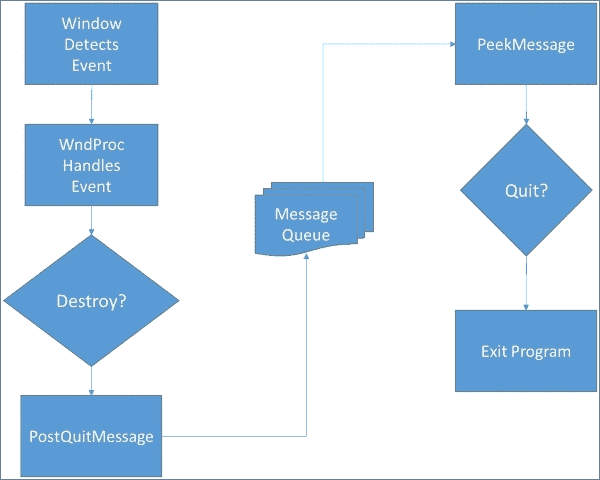

# 第四章. 控制狂

大多数游戏都是设计成交互式的。这意味着玩家必须有一些方式来控制游戏中的发生的事情。在上一章中，你编写了显示机器人和在屏幕上移动它的代码。现在，你将控制机器人！

本章将解释如何实现一个输入系统来控制游戏角色，并与游戏交互。包括以下主题：

+   **输入类型**：与你的游戏互动有许多方式。通常，为 PC 编写的游戏依赖于鼠标和键盘。直接触摸输入现在已成为移动和平板设备的标准，不久的将来，每台 PC 也将拥有触摸屏显示器。我们将介绍在游戏中接收输入的最常见方法。

+   **使用鼠标和键盘**：在本节中，你将编写代码来接收鼠标和键盘的输入，以控制游戏和我们的友好机器人。

+   **创建用户界面**：除了控制我们的机器人外，我们还需要一种与游戏交互的方式。你将学习如何创建一个屏幕上的界面，允许你控制游戏和选择游戏选项。

+   **控制角色**：我们希望我们的机器人能够行走、奔跑、跳跃和玩耍！你将学习如何使用鼠标和键盘来控制你的机器人在屏幕上的移动。

# 一便士作为你的输入

很可能在你的生活中，你曾经参与过一场看似单方面的对话。另一方一直在说话，你似乎无法插话。过了一会儿，这样的对话变得相当无聊！

如果一个不允许任何 **输入** 的电脑游戏也会发生同样的事情。输入是一组允许你控制游戏的技术。有许多方法可以实现输入系统，我们将在本章中介绍。

## 键盘输入

对于大多数计算机来说，最常见的形式是键盘。显然，键盘可以用来输入文本，但键盘也可以用来直接控制游戏。

以下是一些例子：

+   使用右箭头、左箭头、上箭头和下箭头键来控制角色（我们将使用这种方法）

+   使用 *W*、*A*、*S* 和 *D* 键来移动角色（这些键几乎在键盘上形成一个十字，分别作为向上、向左、向下和向右移动的好替代）

+   使用某些键执行预定义的操作，例如：

    +   使用 *Esc* 键或 *Q* 退出

    +   使用空格键或 *Enter 键* 发射投射物

这些只是几个例子。实际上，有些游戏似乎使用了键盘上的每一个键！

## 使用鼠标

鼠标已经存在很长时间了，所以在许多游戏中使用鼠标是合理的。鼠标可以用几种方式使用：

+   左右鼠标按钮可以执行特定操作。

+   滚轮可以推动并用作第三个按钮。

+   鼠标滚轮可以用来滚动。

+   可以跟踪鼠标指针的位置，并将其与任何之前的行为结合使用。当我们设计用户界面时，我们将使用左鼠标按钮和鼠标指针位置的组合来点击屏幕上的按钮。

## 触摸

越来越多的设备现在对触摸做出反应。许多输入系统将触摸处理得与鼠标非常相似：

+   单个触摸相当于使用左鼠标按钮

+   持续的单个触摸相当于使用右鼠标按钮

+   指针的位置可以像鼠标指针一样使用

然而，触摸的许多功能并不能轻易地等同于鼠标。例如，大多数触摸界面允许同时处理多个触摸。这个特性被称为多点触控。这导致了许多标准手势，包括：

+   滑动或轻扫（将一个或多个手指快速在屏幕上移动）

+   捏合（将两个手指合拢）

+   缩放（将两个手指分开）

不幸的是，我们不会在这个游戏中实现触摸，因为本书的目标设备是 PC。

## 其他输入

移动设备的出现随后是输入技术的爆炸式增长。其中一些更常见的包括：

+   加速度计，可用于跟踪设备的物理运动

+   地理定位，可用于检测设备的物理位置

+   指南针，可用于检测设备的方向

+   麦克风，可用于接受语音输入

还有许多其他的输入技术，并且有很多重叠。例如，大多数 PC 都有一个麦克风。同样，虽然移动市场上的许多游戏正在利用这些替代输入方法，但我们的游戏将仅限于键盘和鼠标。

# 有人正在监听

现在，是时候实际编写一些代码来实现我们游戏的输入了。结果证明，一些基本的输入已经被实现。这是因为 Windows 是一个**事件驱动**的操作系统，并且已经在寻找输入事件的发生。从简单的角度来看，Windows（或任何现代操作系统）的主要任务是监听**事件**，然后根据这些事件执行某些操作。

因此，无论何时你在键盘上按下一个键，都会触发一个事件，唤醒 Windows 并说：“嘿，有人按了键盘！”Windows 然后将该信息传递给任何可能正在监听键盘事件的程序。当你使用鼠标时，情况也是如此。

## WndProc 事件监听器

我们已经告诉我们的程序我们希望它监听事件。打开`RoboRacer.cpp`并定位到`WndProc`函数。`WndProc`是我们使用**Win32 项目模板**开始游戏时为我们创建的代码的一部分。`WndProc`被称为**回调函数**。

下面是如何实现回调函数的：

+   首先，将函数名称注册到操作系统中。在我们的例子中，这发生在`CreateGLWindow`中：

    ```cpp
    wc.lpfnWndProc = (WNDPROC)WndProc;
    ```

    这行代码告诉我们的窗口类将一个名为 `WndProc` 的函数注册为程序的事件处理器。

+   现在，任何被 Windows 捕获的事件都会传递给 `WndProc` 函数。`WndProc` 中的代码然后决定处理哪些事件。任何未被 `WndProc` 处理的事件都会被程序简单地忽略。

由于 `WndProc` 是为典型的 Windows 应用程序创建的，它包含了一些我们不需要的东西，同时也有一些我们可以使用的东西：

```cpp
LRESULT CALLBACK WndProc(HWND hWnd, UINT message, WPARAM wParam, LPARAM lParam)
{
  int wmId, wmEvent;
  PAINTSTRUCT ps;
  HDC hdc;

  switch (message)
  {
    case WM_COMMAND:
    wmId    = LOWORD(wParam);
    wmEvent = HIWORD(wParam);
    // Parse the menu selections:
    switch (wmId)
    {
      case IDM_ABOUT:
      DialogBox(hInstance, MAKEINTRESOURCE(IDD_ABOUTBOX), hWnd, About);
      break;
      case IDM_EXIT:
      DestroyWindow(hWnd);
      break;
      default:
      return DefWindowProc(hWnd, message, wParam, lParam);
    }
    break;
    case WM_PAINT:
    hdc = BeginPaint(hWnd, &ps);
    // TODO: Add any drawing code here...
    EndPaint(hWnd, &ps);
    break;
    case WM_DESTROY:
    PostQuitMessage(0);
    break;
    default:
    return DefWindowProc(hWnd, message, wParam, lParam);
  }
  return 0;
}
```

主要的工作由 `switch` 完成，它处理各种窗口事件（所有以 **WM** 为前缀，它是 **Windows Message** 的缩写）：

+   可以忽略所有的 `WM_COMMAND` 事件。在一个典型的 Windows 应用程序中，你会创建一个菜单，然后将各种命令事件分配给当用户点击菜单上的命令时触发（例如，点击 **关于** 命令的 `IDM_ABOUT`）。游戏几乎从不使用标准的 Windows 菜单结构（因此，我们也不使用）。

+   我们也忽略了 `WM_PAINT` 事件。此事件在包含程序的窗口需要重绘时触发。然而，我们正在通过 `Render` 函数使用 OpenGL 不断重绘我们的窗口，因此我们不需要在这里添加代码。

+   我们已经处理了 `WM_DESTROY` 事件。当你在 Windows 右上角点击关闭图标（**X**）时，会触发此事件。我们的处理程序通过使用 `PostQuitMessage(0)` 发送自己的消息来响应。这告诉我们的程序是时候退出了。

## 处理消息队列

我们在第一章 *建立基础* 中讨论了 Windows 消息系统，但这次讨论需要回顾一下。如果你查看 `_wWinMain` 函数，你会看到这个设置主消息循环的代码块：

```cpp
bool done = false;
while (!done)
{
  if (PeekMessage(&msg, NULL, 0, 0, PM_REMOVE))
  {
    if (msg.message == WM_QUIT)
    {
      done = true;
    }
    else
    {
      TranslateMessage(&msg);
      DispatchMessage(&msg);
    }
  }
  else
  {
    int currentTime = glutGet(GLUT_ELAPSED_TIME);
    float deltaTime = (float)(currentTime - previousTime) / 1000;
    previousTime= currentTime;
    GameLoop(deltaTime);
  }
}
```

这个讨论的相关部分是 `PeekMessage` 的调用。`PeekMessage` 查询消息队列。在我们的情况下，如果已经通过 `PostQuitMessage` 发送了 `WM_QUIT` 消息，则 `done` 被设置为 `true`，`while` 循环退出，结束游戏。只要没有发送 `WM_QUIT`，`while` 循环就会继续，并调用 `GameLoop`。

事件驱动系统是处理大多数程序输入和其他动作的绝佳方式，但它不适合游戏。与游戏不同，大多数程序只是坐着等待某种输入发生。例如，文字处理程序等待按键、鼠标按钮点击或发出命令。在这种类型的系统中，每当发生事件时唤醒程序以处理事件是有意义的。

另一方面，游戏不会休眠！无论你是否按按钮，游戏仍在运行。此外，我们需要能够控制进程，以便只有在准备好处理输入时才处理输入。例如，我们不希望输入中断我们的渲染循环。

以下图示展示了当前 Windows 处理输入的方式：



## 处理鼠标和键盘输入

我们可以将 `WndProc` 扩展以处理所有输入事件。然而，这处理输入的方式非常低效，尤其是在实时程序中，如游戏。我们将让 Windows 处理用户关闭窗口的情况。对于其他所有情况，我们将创建自己的输入类，该类将直接轮询输入。

设计输入系统有许多不同的方法，我不会假设这是最好的系统。然而，我们的输入系统完成了两个重要的任务：

+   我们定义了一个一致的输入接口，用于处理鼠标和键盘输入。

+   我们通过在每一帧中直接轮询鼠标和键盘事件来处理输入（而不是等待 Windows 将它们发送给我们）。

## 创建输入类

创建一个名为 `Input` 的新类。然后，将以下代码添加到 `Input.h` 中：

```cpp
#pragma once
#include <Windows.h>

class Input
{
  public:
  enum Key
  {
    K_ESC = VK_ESCAPE,
    K_SPACE = VK_SPACE,
    K_LEFT = VK_LEFT,
    K_RIGHT = VK_RIGHT,
    K_UP = VK_UP,
    K_DOWN = VK_DOWN,
    K_W = 87,
    K_A = 65,
    K_S = 83,
    K_D = 68,
    K_Q = 81,
    K_ENTER = VK_RETURN,
    K_LB = VK_LBUTTON,
    K_RB = VK_RBUTTON

  };

  enum Command
  {
    CM_LEFT,
    CM_RIGHT,
    CM_STOP,
    CM_UP,
    CM_DOWN,
    CM_QUIT
  };

  #define KEYDOWN(vk_code) ((GetAsyncKeyState(vk_code) & 0x8000) ? 1 : 0)

  protected:
  Command m_command;
HWND m_hWnd;

  public:
  Input(const HWND m_hWnd);
  ~Input();

  void Update(const float p_detlaTime);

  const Command GetCommand() const { return m_command; }
};
```

就像我们所有的代码一样，让我们仔细看看这是如何设计的：

+   我们包含 `Windows.h`，因为我们想要访问 Windows API 虚拟键常量。这些常量被定义为表示键盘和鼠标上的特殊键。 

+   我们创建了 `Key` 枚举，以便我们可以轻松定义轮询我们想要处理的键的值。

+   我们创建了 `Command` 枚举，以便我们可以轻松地将输入映射到我们想要支持的命令操作。

+   我们定义了一个名为 `KEYDOWN` 的 C++宏，这极大地简化了我们的未来代码（详情见下一步）。

+   该类只有一个成员变量，`m_command`，它将用于存储最后请求的操作。

+   我们定义了三个成员函数：构造函数、析构函数、`Update` 和 `GetCommand`。

## 虚拟键码

为了理解我们的输入系统是如何工作的，你必须首先了解虚拟键码。键盘上有许多键。除了字母和数字之外，还有特殊键，包括 shift、control、escape、enter、箭头键和功能键。想出一个简单的方法来识别每个键是一项相当艰巨的任务！

Windows 使用两种技术来识别键；对于普通键（字母和数字），每个键都通过正在测试的值的 ASCII 码来识别。以下表格显示了我们在游戏中使用的键的 ASCII 值：

| ASCII 值 | 键 |
| --- | --- |
| 87 | *W* |
| 65 | *A* |
| 83 | *S* |
| 68 | *D* |
| 81 | *Q* |

对于特殊键，Windows 定义了整数常量，以便更容易地使用它们。这些被称为虚拟键码。以下表格显示了我们在游戏中将使用的虚拟键码：

| 虚拟键码 | 键 |
| --- | --- |
| `VK_ESC` | *Esc* |
| `VK_SPACE` | 空格键 |
| `VK_LEFT` | 左箭头 |
| `VK_RIGHT` | 向右箭头 |
| `VK_UP` | 向上箭头 |
| `VK_DOWN` | 向下箭头 |
| `VK_RETURN` | *Enter* |
| `VK_LBUTTON` | 左鼠标按钮 |
| `VK_RBUTTON` | 右鼠标按钮 |

注意，甚至还有鼠标按钮的虚拟键码！

## 查询输入

`GetAsyncKeyState`函数用于查询系统中的键盘和鼠标输入。以下是一个该命令的示例：

```cpp
if ( (getAsyncKeyState(VK_ESC) & 0x8000) == true ) 
{
  PostQuitMessage(0);
}
```

首先，我们传递一个虚拟键码（或 ASCII 值），然后我们使用十六进制值`8000`进行逻辑与操作，以去除我们不需要的信息。如果这个调用的结果是`true`，那么被查询的键正在被按下。

这是一个相当尴尬的命令，需要反复使用！因此，我们创建一个 C++宏来简化事情：

```cpp
#define KEYDOWN(vk_code) ((GetAsyncKeyState(vk_code) & 0x8000) ? 1 : 0)
```

`KEYDOWN`执行`GetAsyncKeyState`命令。该宏接受一个键码作为参数，如果该键被按下则返回`true`，如果该键没有被按下则返回`false`。

## 实现输入类

我们输入系统的所有实际工作都是在`Update`函数中完成的，所以让我们实现`Input`类。打开`Input.cpp`并输入以下代码：

```cpp
#include "stdafx.h"
#include "Input.h"

Input::Input(const HWND p_hWnd)
{
  m_command = Command::CM_STOP;
m_hWnd = p_hWnd;
}

Input::~Input()
{
}

void Input::Update(const float p_deltaTime)
{
  m_command = Command::CM_STOP;
  if (KEYDOWN(Key::K_LEFT) || KEYDOWN(Key::K_A))
  {
    m_command = Command::CM_LEFT;
  }
  if (KEYDOWN(Key::K_RIGHT) || KEYDOWN(Key::K_D))
  {
    m_command = Command::CM_RIGHT;
  }
  if (KEYDOWN(Key::K_UP) || KEYDOWN(Key::K_LB))
  {
    m_command = Command::CM_UP;
  }
  if (KEYDOWN(Key::K_DOWN) || KEYDOWN(Key::K_RB))
  {
    m_command = Command::CM_DOWN;
  }
  if (KEYDOWN(Key::K_ESC) || KEYDOWN(Key::K_Q))
  {
    m_command = Command::CM_QUIT;
  }
}
```

简而言之，`Update`函数查询我们想要同时检查的所有键，然后将这些键映射到我们在类头文件中定义的一个命令枚举。然后程序调用类的`GetCommand`方法来确定当前必须采取的操作。

如果你真的在注意听，那么你可能已经意识到我们只将单个命令结果存储到`m_command`中，但我们正在查询许多键。我们可以这样做的两个原因是：

+   这是一个无限简单的输入系统，要求很少

+   计算机以每秒 60 帧的速度循环输入，因此与玩家按键和释放按键的过程相比，这个过程是无限缓慢的。

基本上，最后检测到的按键将它的命令存储在`m_command`中，这对我们来说已经足够好了。

此外，请注意，我们将初始命令设置为`Input::Command::STOP`。因此，如果没有按键当前被按下，则`STOP`命令将是`m_command`的最终值。结果是，如果我们没有按键来使我们的机器人移动，那么它将停止。

## 将输入添加到游戏循环

现在我们有了输入类，我们将在我们的游戏中实现它。我们将通过将其添加到`Update`中来处理输入。这使我们能够完全控制何时以及如何处理输入。我们只依赖 Windows 事件监听器来告诉我们窗口是否已被关闭（这样我们仍然可以正确地关闭游戏）。

打开`RoboRacer.cpp`并修改`Update`函数，使其看起来像以下代码：

```cpp
void Update(const float p_deltaTime)
{
  inputManager->Update(p_deltaTime);
  ProcessInput (p_deltaTime);

  background->Update(p_deltaTime);
  robot_left->Update(p_deltaTime);
  robot_right->Update(p_deltaTime);
  robot_left_strip->Update(p_deltaTime);
  robot_right_strip->Update(p_deltaTime);
}
```

在此之前，我们的`Update`函数只更新了游戏精灵。如果你还记得，精灵的`Update`方法会修改精灵的位置。因此，在更新精灵之前执行输入是有意义的。`Input`类的`Update`方法查询系统输入，然后我们运行`ProcessInput`来决定要做什么。

## 处理我们的输入

在更新所有精灵之前，我们需要处理输入。记住，`Input` 类的 `Update` 方法只查询输入并存储一个命令。它实际上并没有改变任何东西。这是因为 `Input` 类无法访问我们的精灵。

首先，打开 `RoboRacer.cpp` 并包含 Input 头文件：

```cpp
include "Input.h"
```

我们需要添加一个变量来指向我们的 `Input` 类。在变量声明部分添加以下行：

```cpp
Input* inputManager;
```

然后，修改 `StartGame` 以实例化 `Input` 类：

```cpp
void StartGame()
{
  inputManager = new Input(hWnd);
  LoadTextures();
}
```

现在，我们将创建一个函数来处理输入。将以下函数添加到 `RoboRacer.cpp`：

```cpp
void ProcessInput (const float p_deltaTime);
{
  switch (inputManager->GetCommand())
  {
    case Input::Command::CM_STOP:
    player->SetVelocity(0.0f);
    background->SetVelocity(0.0f);
    break;

    case Input::Command::CM_LEFT:
    if (player == robot_right)
    {
      robot_right->IsActive(false);
      robot_right->IsVisible(false);
      robot_left->SetPosition(robot_right->GetPosition());
    }

    player = robot_left;
    player->IsActive(true);
    player->IsVisible(true);
    player->SetVelocity(-50.0f);
    background->SetVelocity(50.0f);
    break;

    case Input::Command::CM_RIGHT:
    if (player == robot_left)
    {
      robot_left->IsActive(false);
      robot_left->IsVisible(false);
      robot_right->SetPosition(robot_left->GetPosition());
    }

    player = robot_right;
    player->IsActive(true);
    player->IsVisible(true);
    player->SetVelocity(50.0f);
    background->SetVelocity(-50.0f);
    break;

    case Input::Command::CM_UP:
    player->Jump(Sprite::SpriteState::UP);
    break;

    case Input::Command::CM_DOWN:
    player->Jump(Sprite::SpriteState::DOWN);
    break;

    case Input::Command::CM_QUIT:
    PostQuitMessage(0);
    break;
  }
}
```

`ProcessInput` 是我们游戏实际发生更改的地方。尽管代码看起来很多，但实际上只发生了两件事：

+   我们使用 `inputManager->GetCommand()` 查询输入系统以获取最新的命令

+   根据该命令执行所需的操作

以下表格显示了我们所定义的命令，以及这些命令如何影响游戏：

| 命令 | 操作 |
| --- | --- |
| `CM_STOP` |

+   将 `player` 的速度设置为 `0`

+   将背景速度设置为 `0`

|

| `CM_LEFT` |
| --- |

+   如果 `player` 正在向右移动，则停用右侧精灵并使其不可见，并将左侧精灵设置为右侧精灵的位置

+   将 `player` 设置为左侧精灵

+   激活左侧精灵并使其可见

+   将左侧精灵的速度设置为 `-50`

+   将背景速度设置为 `50`

|

| `CM_RIGHT` |
| --- |

+   如果 `player` 正在向左移动，则停用左侧精灵并使其不可见，并将右侧精灵设置为左侧精灵的位置

+   将 `player` 设置为右侧精灵

+   激活右侧精灵并使其可见

+   将右侧精灵的速度设置为 `50`

+   将背景速度设置为 `-50`

|

| `CM_UP` |
| --- |

+   使用参数设置为 `UP` 调用精灵的 `Jump` 方法

|

| `CM_DOWN` |
| --- |

+   使用参数设置为 `DOWN` 调用精灵的 `Jump` 方法

|

| `CM_QUIT` |
| --- |

+   退出游戏

|

## 精灵类的更改

现在机器人可以跳跃了，我们需要向 `Sprite` 类添加一个新的方法来赋予机器人跳跃的能力：

首先，我们将在 Sprite.h 中添加一个枚举来跟踪精灵状态：

```cpp
 enum SpriteState
 {
  UP,
  DOWN
 };
```

接下来，我们需要一个新的成员变量来跟踪是否已点击元素。添加：

```cpp
 bool m_isClicked;
```

现在转到 Sprite.cpp 的构造函数并添加一行以初始化新变量：

```cpp
 m_isClicked = false;
```

将以下代码添加到 `Sprite.h`：

```cpp
void Jump(SpriteState p_state);
void IsClicked(const bool p_value) { m_isClicked = p_value; }
 const bool IsClicked() const { return m_isClicked; }
```

然后添加以下代码到 `Sprite.cpp`：

```cpp
void Sprite::Jump(SpriteState p_state)
{
  if (p_state == SpriteState::DOWN )
  {
    if (m_position.y < 470.0f) m_position.y += 75.0f;
  }
  else if (p_state == SpriteState::UP)
  {
    if (m_position.y >= 470.0f) m_position.y -= 75.0f;
  }
}
```

我们的机器人有点独特。当他跳跃时，他会停留在提升的水平上，直到我们告诉他下来。`Jump` 方法在玩家按下上箭头时将机器人向上移动 `75` 像素，当玩家按下下箭头时将其向下移动 `75` 像素。然而，我们想确保不允许双重跳跃向上或向下，因此我们在应用更改之前检查当前的 `y` 位置。

现在我们将使用输入来控制我们的机器人，我们不再需要像上一章那样设置初始速度。在 `LoadTextures` 中找到以下两行代码，并将它们删除：

```cpp
background->SetVelocity(-50.0f);
player->SetVelocity(50.0f);
```

运行游戏。现在你应该能够使用箭头键控制机器人，左右移动，上下移动。恭喜你，你已经成为了一个控制狂！

# 图形用户界面

现在是时候将我们的注意力转向图形用户界面，或称 GUI。GUI 允许我们控制游戏的其他元素，例如开始或停止游戏，或设置各种选项。

在本节中，你将学习如何在屏幕上创建可以被鼠标点击的按钮。我们将通过添加一个用于暂停游戏的按钮来保持简单。在此过程中，我们还将学习有关游戏状态的重要课程。

## 创建按钮

按钮不过是在屏幕上显示的纹理。然而，我们必须执行一些特殊的编码来检测按钮是否被点击。我们将添加此功能到精灵类中，以便我们的按钮由处理我们游戏中其他图像的同一类处理。

我们实际上将创建两个按钮：一个用于暂停，一个用于恢复。我使用了一个简单的图形程序创建了以下两个按钮：


我将这些按钮保存为 `pause.png` 和 `resume.png`，在 `resources` 文件夹中。

## 增强 Input 类

为了将 UI 集成到我们现有的 `Input` 类中，我们不得不添加一些额外的功能。我们将在 `Input` 类中添加一个动态数组来保存我们需要检查输入的 UI 元素列表。

首先，将以下行添加到 `Input.h` 的包含中：

```cpp
#include "Sprite.h"
```

我们需要包含 `Sprite` 类，以便在 `Input` 类中处理精灵。

接下来，我们添加一个新的命令。修改 `Command` 枚举，使其看起来像以下列表：

```cpp
enum Command
{
CM_INVALID,
CM_LEFT,
  CM_RIGHT,
  CM_STOP,
  CM_UP,
  CM_DOWN,
  CM_QUIT,
  CM_UI
};
```

我们添加了 `CM_UI`，如果任何 UI 元素被点击，它将被设置为当前命令。

现在，我们定义一个成员变量来保存 UI 元素列表。将以下行代码添加到 `Input.h` 的成员变量中：

```cpp
Sprite** m_uiElements;
unsigned int m_uiCount;
```

`m_uiElements` 将是我们元素的指针动态列表，而 `m_uiCount` 将跟踪列表中的元素数量。

对 `Input.h` 的最终修改是在公共方法中添加以下行：

```cpp
void AddUiElement(Sprite* m_pElement);
```

## 将 UI 元素添加到列表中

我们需要能够将元素列表添加到我们的 `Input` 类中，以便在输入处理过程中进行检查。

首先，我们必须为我们的元素列表分配内存。将以下行添加到 `Input.cpp` 中的 `Input` 构造函数中：

```cpp
m_uiElements = new Sprite*[10];
m_uiCount = 0;
```

我可能可以比这更聪明，但到目前为止，我们将分配足够的内存来保存 10 个 UI 元素。然后我们将 `m_uiCount` 初始化为 `0`。现在，我们需要将以下方法添加到 `Input.cpp` 中：

```cpp
void Input::AddUiElement(Sprite* p_element)
{
  m_uiElements[m_uiCount] = p_element;
  m_uiCount++;
}
```

此方法允许我们将 UI 元素添加到我们的列表中（内部，每个 UI 元素都是一个指向精灵的指针）。我们将元素添加到当前的`m_uiElements`数组索引处，然后增加`m_uiCount`。

## 检查每个 UI 元素

最终，Input 类将包含一个列表，其中包含它应该检查的所有 UI 元素。我们需要遍历这个列表，以查看是否有任何激活的元素被点击（如果我们想忽略特定的元素，我们只需将其激活标志设置为`false`）。

打开`Input.cpp`并在`Update`中添加以下代码（在现有代码之上）：

```cpp
for (unsigned int i = 0; i < m_uiCount; i++)
{
  Sprite* element = m_uiElements[i];
  if (element->IsActive() == true)
  {
    if (CheckForClick(element))
    {
      element->IsClicked(true);
      m_command = Input::Command::CM_UI;
      return;
    }
  }
}
```

此代码遍历`m_uiElements`数组中的每个项目。如果元素是激活的，则调用`CheckForClick`来查看此元素是否被点击。如果元素被点击，则将元素的`IsClicked`属性设置为`true`，并将`m_command`设置为`CM_UI`。

我们将此代码放在现有代码之上，因为我们希望检查 UI 的优先级高于检查游戏输入。注意在前面代码中，如果我们找到一个被点击的 UI 元素，我们会退出函数。

## 按下你的按钮

为了查看一个元素是否被点击，我们需要检查当鼠标指针在 UI 元素定义的区域内部时，左鼠标按钮是否按下。

首先，打开`Input.cpp`并添加以下代码：

```cpp
const bool Input::CheckForClick(Sprite* p_element) const
{
  if (KEYDOWN(Key::K_LB))
  {
    POINT cursorPosition;
    GetCursorPos(&cursorPosition);
    ScreenToClient(m_hWnd, &cursorPosition);
    float left = p_element->GetPosition().x;
    float right = p_element->GetPosition().x + p_element->GetSize().width;
    float top = p_element->GetPosition().y;
    float bottom = p_element->GetPosition().y + p_element->GetSize().height;

    if (cursorPosition.x >= left  &&
      cursorPosition.x <= right &&
    cursorPosition.y >= top &&
    cursorPosition.y <= bottom)
    {
      return true;
    }
    else
    {
      return false;
    }
  }
  return false;
}
```

下面是我们正在做的事情：

+   我们首先确保左鼠标按钮是按下的。

+   我们需要存储鼠标的当前位置。为此，我们创建一个名为`cursorPosition`的`POINT`，然后通过引用将其传递给`GetCursorPos`。这将把`cursorPosition`设置为屏幕坐标中的当前鼠标位置。

+   实际上我们需要客户端坐标中的鼠标位置（我们实际需要工作的区域，忽略窗口边框和杂项）。为了得到这个，我们将`cursorPosition`和当前窗口的句柄传递给`ScreenToClient`。

+   现在我们有了`cursorPosition`，我们想要测试它是否在界定我们的 UI 元素的矩形内部。我们计算精灵的左、右、上和下坐标。

+   最后，我们检查`cursorPosition`是否在 UI 元素的边界内。如果是，我们返回`true`；否则，我们返回`false`。

确保将以下声明添加到`Sprite.h`中：

```cpp
const bool CheckForClick(Sprite* p_element) const;
```

## 添加我们的暂停按钮

我们现在需要在我们的游戏中添加代码来创建和监控暂停和恢复按钮。

首先，我们将为我们的两个新精灵添加两个变量。将以下两行添加到`RoboRacer.cpp`的变量声明块中：

```cpp
Sprite* pauseButton;
Sprite* resumeButton;
```

然后，将以下行添加到`LoadTextures`（在`return`语句之前）：

```cpp
pauseButton = new Sprite(1);
pauseButton->SetFrameSize(75.0f, 38.0f);
pauseButton->SetNumberOfFrames(1);
pauseButton->SetPosition(5.0f, 5.0f);
pauseButton->AddTexture("resources/pauseButton.png");
pauseButton->IsVisible(true);
pauseButton->IsActive(true);
inputManager->AddUiElement(pauseButton);

resumeButton = new Sprite(1);
resumeButton->SetFrameSize(75.0f, 38.0f);
resumeButton->SetNumberOfFrames(1);
 resumeButton->SetPosition(80.0f, 5.0f);
resumeButton->AddTexture("resources/resumeButton.png");
inputManager->AddUiElement(resumeButton);
```

这段代码设置暂停和恢复精灵的方式与我们设置游戏中的其他精灵完全一样。只有暂停精灵被设置为激活和可见。

你会注意到一个重要的添加：我们通过调用`AddUiElement`将每个精灵添加到`Input`类中。这会将精灵添加到需要检查输入的 UI 元素列表中。

我们还必须在`RoboRacer.cpp`中的`Update`函数中添加代码：

```cpp
pauseButton->Update(p_deltaTime);
resumeButton->Update(p_deltaTime);
```

类似地，我们必须在`RoboRacer.cpp`中的`Render`函数中添加代码（在调用`SwapBuffers`之前）：

```cpp
pauseButton->Render();
resumeButton->Render();
```

就这样！如果你现在运行游戏，你应该会在左上角看到新的暂停按钮。不幸的是，它现在还没有做任何事情（除了将按钮从暂停改为恢复。在我们实际上能够暂停游戏之前，我们需要了解状态管理。

# 状态管理

想想看。如果我们想让我们的游戏暂停，那么我们必须设置某种类型的标志来告诉游戏我们想要它休息一下。我们可以设置一个布尔值：

```cpp
bool m_isPaused;
```

如果游戏暂停，我们将`m_isPaused`设置为`true`，如果游戏正在运行，则将其设置为`false`。

这种方法的缺点是，在实际游戏中可能会遇到很多特殊情况。在任何时候，游戏可能会是：

+   开始

+   结束

+   运行

+   暂停

这些只是**游戏状态**的一些示例。游戏状态是一种需要特殊处理的具体模式。由于可能有这么多状态，我们通常创建一个状态管理器来跟踪我们当前所处的状态。

## 创建状态管理器

状态管理器的最简单版本是从一个枚举开始，该枚举定义了所有游戏状态。打开`RoboRacer.cpp`，并在包含语句下方添加以下代码：

```cpp
enum GameState
{
  GS_Running,
  GS_Paused
};
```

然后转到变量声明块，并添加以下行：

```cpp
GameState m_gameState;
```

为了保持简单，我们将定义两个状态：运行和暂停。大型游戏将有许多更多状态。

枚举相对于布尔变量有一个很大的优点。首先，它们的目的通常更清晰。说游戏状态是`GS_Paused`或`GS_Running`比仅仅将布尔值设置为`true`或`false`要清晰得多。

另一个优点是枚举可以具有多个值。如果我们需要向我们的游戏添加另一个状态，只需向我们的`GameState`枚举列表中添加另一个值即可。

我们的游戏将以运行状态开始，因此请将以下代码行添加到`StartGame`函数中：

```cpp
m_gameState = GS_Running;
```

## 暂停游戏

想想看。当游戏暂停时，我们想做什么？我们仍然想在屏幕上看到东西，这意味着我们仍然想调用所有的渲染调用。然而，我们不想让东西改变位置或动画。我们也不希望处理游戏输入，尽管我们需要处理 UI 输入。

所有这些都应该让你思考更新调用。我们希望阻止除 UI 之外的所有更新的调用。修改`RoboRacer.cpp`中的`Update`函数，使其包含以下代码：

```cpp
void Update(const float p_deltaTime)
{
  inputManager->Update(p_deltaTime);
  ProcessInput(p_deltaTime);

  if (m_gameState == GS_Running)
  {
    background->Update(p_deltaTime);
    robot_left->Update(p_deltaTime);
    robot_right->Update(p_deltaTime);
    robot_left_strip->Update(p_deltaTime);
    robot_right_strip->Update(p_deltaTime);

    pauseButton->Update(p_deltaTime);
    resumeButton->Update(p_deltaTime);
  }
}
```

注意，我们只有在游戏状态为`GS_Running`时才会处理精灵更新。

我们将准备接受鼠标输入。首先，我们将设置一个计时器。在`RoboRacer2d.cpp`的变量声明中添加以下代码：

```cpp
float uiTimer;
const float UI_THRESHOLD = 0.2f;
```

然后将以下代码行添加到`StartGame`中：

```cpp
 uiTimer = 0.0f;
```

时间将被用来为鼠标输入添加一小段延迟。如果没有延迟，鼠标的每次点击都会被记录多次，而不是一次。

我们仍然需要处理输入，但不是所有的输入。前往`RoboRacer.cpp`中的`ProcessInput`函数，并做出以下更改：

```cpp
void ProcessInput(const float p_deltaTime)
{
 Input::Command command = inputManager->GetCommand();
 if (m_gameState == GS_Paused) command = Input::Command::CM_UI;

 uiTimer += p_deltaTime;
 if (uiTimer > UI_THRESHOLD)
 {
  uiTimer = 0.0f;
  switch (command)
  {
  case Input::Command::CM_STOP:
   player->SetVelocity(0.0f);
   background->SetVelocity(0.0f);
   break;

  case Input::Command::CM_LEFT:
   if (player == robot_right)
   {
    robot_right->IsActive(false);
    robot_right->IsVisible(false);
    robot_left->SetPosition(robot_right->GetPosition());
   }

   player = robot_left;
   player->IsActive(true);
   player->IsVisible(true);
   player->SetVelocity(-50.0f);
   background->SetVelocity(50.0f);
   break;

  case Input::Command::CM_RIGHT:
   if (player == robot_left)
   {
    robot_left->IsActive(false);
    robot_left->IsVisible(false);
    robot_right->SetPosition(robot_left->GetPosition());
   }

   player = robot_right;
   player->IsActive(true);
   player->IsVisible(true);
   player->SetVelocity(50.0f);
   background->SetVelocity(-50.0f);
   break;

  case Input::Command::CM_UP:
   player->Jump(Sprite::SpriteState::UP);
   break;

  case Input::Command::CM_DOWN:
   player->Jump(Sprite::SpriteState::DOWN);
   break;

  case Input::Command::CM_QUIT:
   PostQuitMessage(0);
   break;

  case Input::Command::CM_UI:
   if (pauseButton->IsClicked())
   {
    pauseButton->IsClicked(false);
    pauseButton->IsVisible(false);
    pauseButton->IsActive(false);

    resumeButton->IsVisible(true);
    resumeButton->IsActive(true);
    m_gameState = GS_Paused;
   }

   if (resumeButton->IsClicked())
   {
    resumeButton->IsClicked(false);
    resumeButton->IsVisible(false);
    resumeButton->IsActive(false);

    pauseButton->IsVisible(true);
    pauseButton->IsActive(true);
    m_gameState = GS_Running;
   }
  }
 }
  command = Input::Command::CM_INVALID;
}
```

看看第二行。如果游戏处于暂停状态，它将命令设置为`CM_UI`。这意味着在游戏暂停期间，只会处理 UI 命令。这是一种黑客行为吗？也许吧，但它完成了工作！

我们只需要做两个更改。当按下暂停按钮时，我们需要将游戏状态更改为`GS_Paused`，而当按下继续按钮时，我们需要将游戏状态更改为`GS_Running`。这些更改已经在前面代码中的`CS_UI`案例中完成！

当你现在运行程序时，你会看到当你点击暂停按钮时游戏会暂停。当你点击继续按钮时，一切都会重新开始。

# 摘要

再次强调，你已经走得很远了！我们实现了一个基本的输入类，然后修改了我们的精灵类以处理 UI。这种统一的方法允许一个类既可以处理作为游戏对象的精灵，也可以处理作为用户界面一部分的精灵。检查按钮是否被按下的相同方法，也可以用于游戏对象的碰撞检测。然后你学习了如何创建状态机来处理游戏可能处于的各种状态。

在下一章中，我们将学习如何检测游戏对象之间的碰撞。
