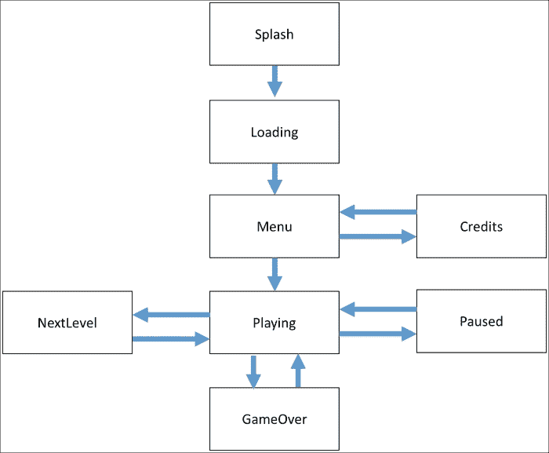
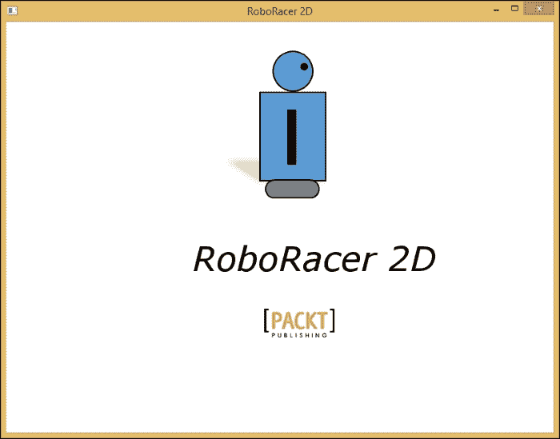
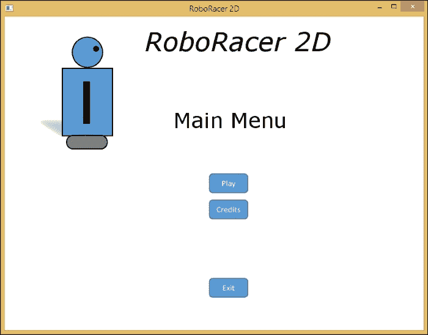
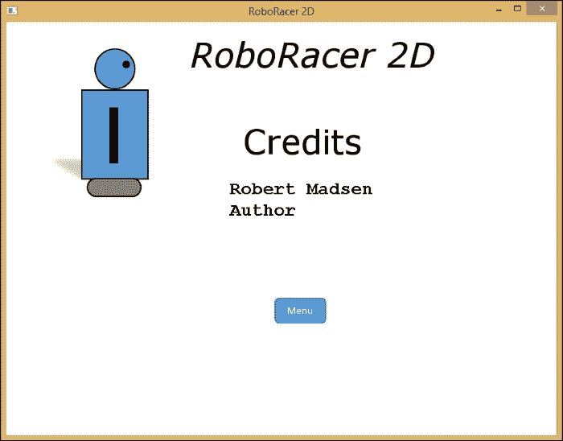
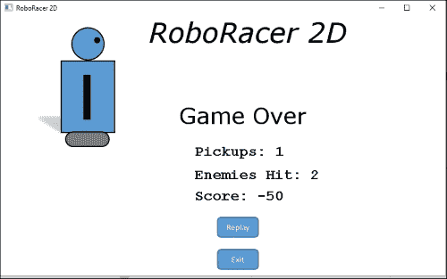
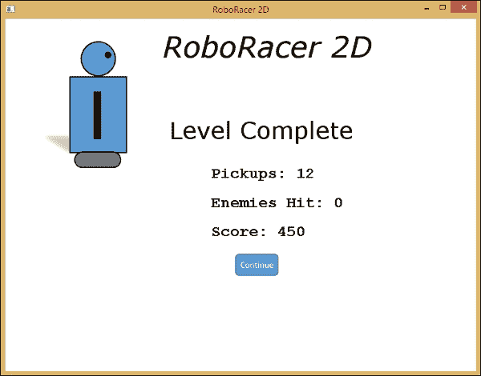

# 第六章. 精炼银色

我相信您和我一样，对您在游戏上取得的进展感到兴奋。它几乎准备好发布了，对吧？嗯，还不完全是！在游戏准备好发布之前，还有很多工作要做，这正是本章的主题。

许多人有一个很好的游戏想法，也有很多像您这样的热情的程序员实际上将他们的游戏编码到了我们现在所达到的程度。不幸的是，这就是许多项目失败的地方。由于某种原因，许多第一次尝试编写游戏的程序员没有花时间真正完成他们的游戏。还有很多事情要做，才能使您的游戏看起来更专业：

+   **游戏状态**：当您学习如何暂停游戏时，我们已经稍微提到了游戏状态。本章将继续讨论如何使用游戏状态来管理游戏在游戏过程中的各个阶段。

+   **启动画面**：大多数游戏在游戏开始之前会显示一个或多个屏幕。这些屏幕被称为启动画面，通常显示参与游戏制作的公司的标志和名称。启动画面表明您在精炼游戏方面已经做得很好。

+   **菜单屏幕**：大多数游戏都是以供玩家选择的菜单开始的。我们将在启动画面之后创建一个简单的菜单，为玩家提供一些选项。

+   **得分和统计数据**：您可能已经注意到，我们的游戏目前还没有得分。虽然设计一个不涉及得分的游戏是可能的，但大多数玩家想知道他们在游戏中的表现。

+   **胜利和失败**：同样，虽然确实存在一些游戏没有胜利或失败的情况，但大多数游戏都有胜利或失败的条件，这标志着游戏的结束。

+   **游戏进度**：大多数游戏允许玩家在达到某些目标之前继续玩游戏。许多游戏被分解成一系列关卡，每个关卡都比前一个关卡稍微难一些。您将学习如何将这种进度添加到您的游戏中。

+   **致谢**：每个人都喜欢为自己的工作获得认可！就像电影一样，包含一个显示参与游戏制作的所有人员及其角色的屏幕是传统的。我将向你展示如何创建一个简单的致谢屏幕。

# 游戏状态

记得我们在第四章中编码暂停按钮的时候吗，*控制狂*？我们必须添加一些代码来告诉游戏它是处于活动状态还是暂停状态。实际上，我们定义了以下枚举：

```cpp
enum GameState
{
  GS_Running,
  GS_Paused
};
```

这些`枚举`定义了两个游戏状态：`GS_Running`和`GS_Paused`。然后我们在`StartGame`函数中将默认游戏状态设置为`GS_Running`：

```cpp
void StartGame()
{
  inputManager = new Input(hWnd);
  LoadTextures();
  m_gameState = GS_Running;

  srand(time(NULL));
  pickupSpawnThreshold = 5.0f;
  pickupSpawnTimer = 0.0f;
}
```

只要游戏状态设置为`GS_Running`，游戏就会继续循环通过游戏循环，处理更新，并渲染场景。然而，当你点击暂停按钮时，游戏状态就会设置为`GS_Paused`。当游戏暂停时，我们不再更新游戏对象（即机器人、拾取物和敌人），但我们仍然继续渲染场景并处理用户界面（UI），以便可以点击按钮。

## 状态机

用于设置和控制游戏状态的机制被称为**状态机**。状态机为游戏设置单独且不同的阶段（或**状态**）。每个状态定义了在每个状态下应该发生或不应发生的一定规则。例如，我们的简单状态机有两个状态，以下矩阵展示了这些规则：

|   | GS_Running | GS_Paused |
| --- | --- | --- |
| **输入** | 所有输入 | 仅 UI 输入 |
| **对象更新** | 所有对象 | 仅 UI 对象 |
| **碰撞检测** | 所有可碰撞对象 | 无需检查碰撞 |
| **生成** | 所有可生成对象 | 不需要生成 |
| **渲染** | 所有对象 | 所有对象 |

状态机还定义了从一个状态到另一个状态的转换。以下是一个简单的图，展示了我们当前状态机的转换过程：


这个状态图相当简单。如果你处于运行状态，那么切换到暂停状态是合法的。如果你处于暂停状态，那么切换到运行状态也是合法的。正如我们将看到的，大多数游戏比这要复杂得多！

## 我们为什么需要状态机？

初看之下，你可能想知道我们为什么甚至需要状态机。例如，你可以设置几个布尔标志（可能一个叫`running`，另一个叫`paused`），然后像使用枚举一样将它们插入到代码中。

考虑到我们当前的游戏只有两个状态，这个解决方案可能可行，但即使如此，如果你选择使用布尔值，它也会开始变得复杂。例如，要将状态从运行更改为暂停，我必须始终确保正确设置这两个布尔值：

```cpp
running = false;
paused = true;
```

当我从运行状态切换到暂停状态时，我必须再次设置这两个布尔值：

```cpp
running = true;
paused = false;
```

想象一下，如果我忘记更改这两个布尔值，游戏处于同时运行和暂停的状态，会发生什么问题！然后想象一下，如果我的游戏有三个、四个或十个状态，这会变得多么复杂！

使用枚举不是设置状态机的唯一方法，但它确实在使用布尔值时具有立即的优势：

+   枚举与其值相关联的描述性名称（例如，`GS_Paused`），而布尔值只有`true`和`false`。

+   枚举已经互斥。为了使一组布尔值互斥，我必须将一个设置为`true`，而将所有其他设置为`false`。

接下来考虑为什么我们需要状态机的原因是它简化了游戏控制的编码。大多数游戏都有几个游戏状态，我们能够轻松地管理哪些代码在哪个状态下运行是很重要的。大多数游戏常见的游戏状态示例包括：

+   加载

+   开始

+   运行

+   暂停

+   结束

+   游戏胜利

+   游戏失败

+   游戏结束

+   下一个等级

+   退出

当然，这只是一个代表性的列表，每个程序员都会为自己的游戏状态选择自己的名称。但我认为你已经明白了：游戏可以处于很多状态，这意味着能够管理每个状态发生的事情是很重要的。如果玩家在游戏暂停时角色死亡，他们往往会感到愤怒！

## 规划状态

我们将扩展我们的简单状态机，以包括几个更多的游戏状态。这将帮助我们更好地组织游戏的处理，并更好地定义在任何特定时间应该运行哪些过程。

下表显示了我们将为我们的游戏定义的游戏状态：

| 状态 | 描述 |
| --- | --- |
| 加载 | 游戏正在加载，应显示启动画面 |
| 菜单 | 主菜单正在显示 |
| 运行 | 游戏正在积极运行 |
| 暂停 | 游戏已暂停 |
| 下一个等级 | 游戏正在加载下一个等级 |
| 游戏结束 | 游戏结束，正在显示统计数据 |
| 信用 | 显示信用屏幕 |

这里是我们的状态图机器：

|   | 启动画面 | 加载 | 菜单 | 运行 | 暂停 | 下一个 | 游戏结束 | 信用 |
| --- | --- | --- | --- | --- | --- | --- | --- | --- |
| **输入** | 无 | 无 | UI | 所有 | UI | UI | UI | UI |
| **更新** | 启动画面 | 启动画面 | UI | 所有 | UI | UI | UI | UI |
| **碰撞检测** | 无 | 无 | 无 | 所有 | 无 | 无 | 无 | 无 |
| **生成** | 无 | 无 | 无 | 所有 | 无 | 无 | 无 | 无 |
| **渲染** | 启动画面 | 启动画面 | 菜单 | 游戏 | 游戏 | 游戏 | 游戏结束 | 信用 |

最后，这是我们的状态图：



结果表明，我们的状态图也将作为 UI 图。UI 图是程序中所有屏幕及其相互交互的图。结果是，每次我们想要在我们的游戏中切换到不同的屏幕时，我们也在切换到不同的屏幕。这并不完全是这样——当游戏暂停时，它不会启动一个全新的屏幕。然而，UI 图和状态图之间通常有非常紧密的相关性。

观察状态图，你可以很容易地看到合法的状态变化与非法的状态变化。例如，从播放状态变为暂停状态是合法的，但你不能从播放状态变为信用状态。

在此结构到位的情况下，它将指导我们实现我们想要添加到游戏中的所有最终润色功能。

## 定义新状态

扩展我们的游戏状态机的第一步是添加所需的`enums`。用以下代码替换`GameState enum`代码：

```cpp
enum GameState
{
  GS_Splash,
  GS_Loading,
  GS_Menu,
  GS_Credits,
  GS_Running,
  GS_NextLevel,
  GS_Paused,
  GS_GameOver,
};
```

随着我们实现本章中涵盖的润色功能，我们将实现使用这些游戏状态的代码。

## 实现状态机

为了让我们的状态机产生任何效果，我们需要修改代码，使得关键决策基于游戏状态。有三个函数受到游戏状态的重大影响：

+   **更新**：一些游戏状态更新游戏对象，而其他游戏状态只更新 UI 或特定的精灵

+   **渲染**：不同的游戏状态渲染不同的项目

+   **输入**：一些游戏状态接受所有输入，而其他游戏状态只处理 UI 输入

因此，我们将更改`Update`、`Render`和`ProcessInput`函数，这应该不会令人惊讶。

首先，让我们修改`Update`函数。将`RoboRacer2D.cpp`中的`Update`函数修改为以下代码：

```cpp
void Update(const float p_deltaTime)
{
 switch (m_gameState)
 {
 case GameState::GS_Splash:
 case GameState::GS_Loading:
 {
 }
 break;
 case GameState::GS_Menu:
 {
  inputManager->Update(p_deltaTime);
  ProcessInput(p_deltaTime);
 }
 break;

 case GameState::GS_Credits:
 {
  inputManager->Update(p_deltaTime);
  ProcessInput(p_deltaTime);
 }
 break;
 case GameState::GS_Running:
 {
  inputManager->Update(p_deltaTime);
  ProcessInput(p_deltaTime);
  CheckBoundaries(player);
  CheckBackground();
  background->Update(p_deltaTime);
  robot_left->Update(p_deltaTime);
  robot_right->Update(p_deltaTime);
  robot_left_strip->Update(p_deltaTime);
  robot_right_strip->Update(p_deltaTime);
  pauseButton->Update(p_deltaTime);
  resumeButton->Update(p_deltaTime);
  pickup->Update(p_deltaTime);
  SpawnPickup(p_deltaTime);
  SpawnEnemy(p_deltaTime);
  enemy->Update(p_deltaTime);
  CheckCollisions();
 }
 break;
 case GameState::GS_Paused:
 {
  inputManager->Update(p_deltaTime);
  ProcessInput(p_deltaTime);
 }
 break;
 case GameState::GS_NextLevel:
 {
  inputManager->Update(p_deltaTime);
  ProcessInput(p_deltaTime);
 }
 break;
 case GameState::GS_GameOver:
 {
  inputManager->Update(p_deltaTime);
  ProcessInput(p_deltaTime);
 }
 break;
 }
}
```

如您所见，我们现在使用`switch`语句来处理每个游戏状态。这比使用`if`语句可读性要好得多，并且使代码结构更加清晰。如果我们需要添加另一个游戏状态，我们只需在`switch`语句中添加另一个`case`。

注意到每个`case`都有其代码来运行特定于该游戏状态的代码。一些代码行是重复的（几乎每个状态都有一些输入），但这为了清晰度而付出的微小代价。`GS_Running`需要做最多的工作，而`GS_Loading`需要做最少的工作。随着我们添加润色功能，我们将在每个开关中添加代码。

现在，让我们升级`Render`函数。用以下代码替换`Render`函数：

```cpp
switch (m_gameState)
 {
 case GameState::GS_Splash:
 case GameState::GS_Loading:
 {
 }
 break;
 case GameState::GS_Menu:
 {
 }
 break;
 case GameState::GS_Credits:
 {
 }
 break;
 case GameState::GS_Running:
 case GameState::GS_Paused:
 {
  background->Render();
  robot_left->Render();
  robot_right->Render();
  robot_left_strip->Render();
  robot_right_strip->Render();
  pauseButton->Render();
  resumeButton->Render();
  pickup->Render();
  enemy->Render();
  DrawScore();
 }
 break;
 case GameState::GS_NextLevel:
 {
 }
 break;
 case GameState::GS_GameOver:
 {
 }
 break;
 }

  SwapBuffers(hDC);
}
```

在这种情况下，我们需要做一些无论游戏状态如何都需要完成的工作。我们需要清除 OpenGL 缓冲区，并将矩阵设置为单位矩阵。然后我们根据游戏状态决定要渲染哪些项目，最后交换缓冲区。

如果您仔细观察，`GS_Running`和`GS_Paused`渲染相同的项目。这是因为暂停和渲染按钮渲染在游戏屏幕的顶部，所以即使我们在暂停时，我们仍然需要渲染整个游戏。随着我们添加润色功能，我们将为每个开关添加代码。

最后，我们需要将我们的状态机应用到`ProcessInput`函数上。由于该函数非常长，我仅显示函数的上部行。将所有在`uiTimer += p_deltaTime;`语句之上的行更改为以下代码：

```cpp
Replace highlighted code with:

 switch (m_gameState)
 {
 case GameState::GS_Splash:
 case GameState::GS_Loading:
 {
 return;
 }
 break;
 case GameState::GS_Menu:
 case GameState::GS_Credits:
 case GameState::GS_Paused:
 case GameState::GS_NextLevel:
 case GameState::GS_GameOver:
 {
 command = Input::Command::CM_UI;
 }
 break;
 case GameState::GS_Running:
 {
 }
 break;
 }

}

uiTimer += p_deltaTime;
```

首先，我们获取最新的命令。然后，根据游戏状态，我们执行以下操作：

+   如果我们仍然处于加载状态，则忽略并返回

+   如果游戏状态是菜单、暂停、下一级或游戏结束，则将命令重置为仅处理 UI 命令

+   如果我们处于运行游戏状态，则保持命令不变

这正是我们在先前版本中做的，只是先前版本中我们只处理了两个游戏状态。一旦处理了命令，我们就继续到`uiTimer += p_deltaTime;`（此行之后的内容与先前版本相同）。

# 制作启动画面

启动菜单为你的游戏增添了一丝格调，同时也做了一点炫耀。通常，启动画面会展示你的公司标志。实际上，许多游戏项目由多个工作室共同制作，因此经常会有多个启动画面。我们将只使用一个！

尽快让启动画面运行起来非常重要，所以我们将在执行任何其他加载之前先做这件事。启动画面的部分功能是在游戏的其他部分加载时，给玩家一些漂亮的东西来看。

## 创建启动画面

创建一个定义你游戏的启动画面取决于你。为了方便，我们在本章的代码资源包中包含了一个名为`splash.png`的启动画面。确保将`splash.png`复制到你的项目中。启动画面的唯一要求是它必须是 800 x 600 像素，与我们的游戏屏幕分辨率相同。

## 定义启动画面

与游戏中所有图像一样，我们将启动画面实现为一个精灵。在`RoboRacer2D.cpp`的顶部声明启动精灵：

```cpp
Sprite* splashScreen;
```

我们还希望为启动画面定义一些计时器：

```cpp
float splashDisplayTimer;
float splashDisplayThreshold;
```

由于我们希望将启动画面单独定义，我们将创建一个单独的函数来加载它。使用以下代码创建`LoadSplash`函数：

```cpp
void LoadSplash()
{
  m_gameState = GameState::GS_Splash;

  splashScreen = new Sprite(1);
  splashScreen->SetFrameSize(800.0f, 600.0f);
  splashScreen->SetNumberOfFrames(1);
  splashScreen->AddTexture("resources/splash.png", false);
  splashScreen->IsActive(true);
  splashScreen->IsVisible(true);
}
```

我们不会对`StartGame`函数进行重大修改。我们只将加载启动画面，并推迟加载其他游戏资源。这将尽快让启动画面显示出来。将`StartGame`函数修改为以下代码：

```cpp
void StartGame()
{
 LoadSplash();
 inputManager = new Input(hWnd);

 uiTimer = 0.0f;
 srand(time(NULL));

 pickupSpawnThreshold = 3.0f;
 pickupSpawnTimer = 0.0f;

 enemySpawnThreshold = 7.0f;
 enemySpawnTimer = 0.0f;

 splashDisplayTimer = 0.0f;
 splashDisplayThreshold = 5.0f;

}
```

注意，我们在这里只加载启动画面资源并设置了一些变量。我们还设置了启动画面计时器，以确保它至少显示五秒钟。

接下来，修改`Update`函数中的`GS_Splash`情况，使其看起来像以下代码：

```cpp
 switch (m_gameState)
 {
 case GameState::GS_Splash:
 case GameState::GS_Loading:
 {
  splashScreen->Update(p_deltaTime);
  splashDisplayTimer += p_deltaTime;
  if (splashDisplayTimer > splashDisplayThreshold)
  {
   m_gameState = GameState::GS_Menu;
  }
 }
 break;
```

此代码更新启动画面计时器。当计时器超过我们的阈值时，游戏状态将变为`GS_Menu`。我们将定义加载下一个菜单的代码。

修改`Render`函数中的`GS_Splash`情况，使其看起来像以下代码：

```cpp
case GameState::GS_Loading:
splashScreen->Render();
break;
```

### 提示

由于启动精灵只是一个静态图像，你可能想知道为什么我们要更新启动精灵。虽然更新对我们的当前代码没有影响，但考虑一下我想实现一个动态、动画启动画面的情况。

## 加载我们的资源

如果你一直在注意，你应该意识到我们从`StartGame`函数中移除了`LoadTextures`调用。相反，我们将在`GameLoop`函数中加载纹理。将`GameLoop`修改为以下代码：

```cpp
void GameLoop(const float p_deltatTime)
{
  if (m_gameState == GameState::GS_Splash)
 {
 LoadTextures();
 m_gameState = GameState::GS_Loading;
 }
  Update(p_deltatTime);
  Render();
}
```

如果你记得，`GameLoop`每帧都会被调用。我们需要`GameLoop`运行以显示我们的启动屏幕，我们已经加载了它。但在第一次调用`GameLoop`时，我们还没有加载其他资源。

我们检查游戏状态是否为`GS_Splash`。如果是，我们调用加载纹理，并立即将游戏状态更改为`GS_Loading`。如果我们没有更改游戏状态，那么游戏将尝试在每一帧加载纹理，这将是非常糟糕的事情！这是我们在状态机中定义不同游戏状态的另一个实际例子。

### 小贴士

在某种意义上，我们还没有创建一个真正的启动屏幕。这是因为我们的启动屏幕仍然依赖于 Windows 和 OpenGL 在启动屏幕可以加载和渲染之前进行初始化。真正的启动屏幕使用一段不依赖于所有这些初始化的代码片段，以便它们可以在其他所有内容之前加载。不幸的是，这个层面的细节超出了我们书籍的范围。有时，启动屏幕将在单独的线程上运行，以便它独立于启动代码。



当你运行游戏时，你应该看到启动屏幕显示，但随后没有其他动作发生。这是因为我们在`Update`函数中将游戏状态更改为`GS_Menu`，而我们还没有为该游戏状态编写代码！如果你想测试你的启动屏幕，将`Update`函数中的`m_gameState = GameState::GS_Menu`更改为`m_gameState = GameState::GS_Running`。只是别忘了在继续之前将其改回。

### 小贴士

改变游戏状态的能力让你能够重新引导游戏流程。这在尝试编写新的游戏状态但尚未准备好在游戏中运行时非常有用。一旦新的游戏状态编写完成，你就可以将其连接到游戏中。

# 菜单上有什么？

主菜单在很多应用程序中可能已经消失了，但在游戏中它们仍然存在且运行良好。主菜单在游戏加载后给玩家一个决定做什么的机会。我们将创建一个简单的菜单，允许玩家开始游戏、显示信用信息或退出游戏。

## 创建菜单

我们将使用两个组件构建菜单。首先，我们将加载一个图像作为背景。接下来，我们将加载额外的图像作为 UI 按钮。这些图像共同创建一个屏幕，允许玩家导航我们的游戏。

我们将首先定义一个精灵来表示菜单。将以下代码行添加到`RoboRacer2D.cpp`中的变量声明部分：

```cpp
Sprite* menuScreen;
```

接下来，我们将在`LoadTextures`函数中实例化菜单。将以下代码添加到`LoadTextures`：

```cpp
  menuScreen = new Sprite(1);
  menuScreen->SetFrameSize(800.0f, 600.0f);
  menuScreen->SetNumberOfFrames(1);
  menuScreen->AddTexture("resources/mainmenu.png", false);
  menuScreen->IsActive(true);
  menuScreen->IsVisible(true);
```

确保你已经从书籍网站下载了`menu.png`纹理，或者你已经创建了自己的 800x600 像素的背景。

现在，我们必须修改`Update`和`Render`函数。将`Update`中的`GS_Menu`情况修改为以下代码：

```cpp
case GameState::GS_Menu:
 {
  menuScreen->Update(p_deltaTime);
  inputManager->Update(p_deltaTime);
  ProcessInput(p_deltaTime);
 }
 break;
```

接下来，修改`Render`函数中的`GS_Menu`情况：

```cpp
case GameState::GS_Menu:
{
  menuScreen->Render();
}
break;
```

如果你现在运行游戏，启动屏幕应该显示五秒钟，然后是菜单屏幕。

## 定义菜单按钮

我们接下来的任务是向菜单屏幕添加玩家可以点击的按钮。这些按钮的工作方式将与我们已经创建的暂停和继续按钮类似。

我们将首先为按钮声明变量。将以下声明添加到`RoboRacer2D.cpp`中的变量部分：

```cpp
Sprite* playButton;
Sprite* creditsButton;
Sprite* exitButton;
```

这三个指针将管理主菜单上的三个按钮。接下来，将以下代码添加到`LoadTextures`中以实例化按钮：

```cpp
playButton = new Sprite(1);
playButton->SetFrameSize(75.0f, 38.0f);
playButton->SetNumberOfFrames(1);
playButton->SetPosition(390.0f, 300.0f);
playButton->AddTexture("resources/playButton.png");
playButton->IsVisible(true);
playButton->IsActive(false);
inputManager->AddUiElement(playButton);

creditsButton = new Sprite(1);
creditsButton->SetFrameSize(75.0f, 38.0f);
creditsButton->SetNumberOfFrames(1);
creditsButton->SetPosition(390.0f, 350.0f);
creditsButton->AddTexture("resources/creditsButton.png");
creditsButton->IsVisible(true);
creditsButton->IsActive(false);
inputManager->AddUiElement(creditsButton);

exitButton = new Sprite(1);
exitButton->SetFrameSize(75.0f, 38.0f);
exitButton->SetNumberOfFrames(1);
exitButton->SetPosition(390.0f, 500.0f);
exitButton->AddTexture("resources/exitButton.png");
exitButton->IsVisible(true);
exitButton->IsActive(false);
inputManager->AddUiElement(exitButton);
```

这段代码基本上与我们用来实例化暂停和继续按钮的代码相同。唯一的小区别是我们将所有三个按钮都设置为可见。我们的代码已经强制这些按钮只有在游戏状态`GS_Menu`时才会渲染。

我们确实希望将按钮设置为不活动状态。这样，`input`类就会忽略它们，直到我们想要激活它们。

就像我们所有的对象一样，我们现在需要将它们连接到`Update`和`Render`函数。将`Update`函数中的`GS_Menu`情况更改为以下代码：

```cpp
 case GameState::GS_Menu:
 {
  menuScreen->Update(p_deltaTime);
  playButton->IsActive(true);
  creditsButton->IsActive(true);
  exitButton->IsActive(true);
  playButton->Update(p_deltaTime);
  creditsButton->Update(p_deltaTime);
  exitButton->Update(p_deltaTime);
  inputManager->Update(p_deltaTime);
  ProcessInput(p_deltaTime);
 }
 break;
```

这是我们将菜单上的按钮设置为活动状态的地方。我们希望确保在游戏状态`GS_Menu`时菜单上的按钮是活动的。

接下来，将`Render`函数中的`GS_Menu`情况更改为以下代码：

```cpp
case GameState::GS_Menu:
 {
  menuScreen->Render();
  playButton->Render();
  creditsButton->Render();
  exitButton->Render();
 }
 break;
```

为了让按钮真正做些事情，我们需要将以下代码添加到`ProcessInput`中的`CM_UI`情况：

```cpp
if (playButton->IsClicked())
{
  playButton->IsClicked(false);
  exitButton->IsActive(false);
  playButton->IsActive(false);
  creditsButton->IsActive(false);
  m_gameState = GameState::GS_Running;
}

if (creditsButton->IsClicked())
{
  creditsButton->IsClicked(false);
  exitButton->IsActive(false);
  playButton->IsActive(false);
  creditsButton->IsActive(false);
  m_gameState = GameState::GS_Credits;
}

if (exitButton->IsClicked())
{
  playButton->IsClicked(false);
  exitButton->IsActive(false);
  playButton->IsActive(false);
  creditsButton->IsActive(false);
  PostQuitMessage(0);
}
```

注意，如果点击了播放按钮或信用按钮（如果点击了退出按钮，我们只需发送退出消息）。注意，我们必须进行一些按钮管理，当我们不再处于`GS_Menu`游戏状态时，将菜单上的按钮设置为不活动状态。这是因为我们的输入类会检查所有活动的按钮。如果按钮保持活动状态，则意味着即使它们没有显示在屏幕上，仍然可以被点击。

我们不必将按钮设置为不可见。这是因为改变状态将自动停止这些按钮的更新或渲染。菜单屏幕也是如此。一旦游戏状态改变，它将不会渲染或更新。这是利用状态机的重大优势之一。



如果你现在运行程序，主菜单将显示。如果你点击播放按钮，游戏将开始。如果你点击退出按钮，游戏将退出。我们将接下来实现信用屏幕。

# 获得一些信用

每个人都喜欢为自己的辛勤工作获得认可！大多数游戏都会实现一个信用屏幕，显示每个参与创建游戏的人的名字和职能。对于 AAA 级游戏，这个列表可能和电影列表一样长。对于小型独立游戏，这个列表可能只有三个人。

## 创建信用屏幕

与主菜单类似，信用屏幕将基于背景图像和可点击的按钮。我们还需要在屏幕上添加文本。

让我们从在 `RoboRacer2D.cpp` 的变量部分声明我们的屏幕指针开始。添加以下声明：

```cpp
Sprite* creditsScreen;
```

然后，我们在 `LoadTextures` 中实例化信用屏幕：

```cpp
creditsScreen = new Sprite(1);
creditsScreen->SetFrameSize(800.0f, 600.0f);
creditsScreen->SetNumberOfFrames(1);
creditsScreen->AddTexture("resources/credits.png", false);
creditsScreen->IsActive(false);
creditsScreen->IsVisible(true);
```

接下来，我们将信用屏幕连接到 `Update`：

```cpp
 case GameState::GS_Credits:
 {
  creditsScreen->Update(p_deltaTime);
  inputManager->Update(p_deltaTime);
  ProcessInput(p_deltaTime);
 }
 break;
```

我们还更新了 `Render`：

```cpp
 case GameState::GS_Credits:
 {
  creditsScreen->Render();
 }
 break;
```

## 返回主菜单

现在，我们需要添加一个按钮，允许我们从信用屏幕返回主菜单。我们首先在变量声明部分声明指针：

```cpp
Sprite* menuButton;
```

我们然后在 `LoadTextures` 中实例化按钮：

```cpp
menuButton = new Sprite(1);
menuButton->SetFrameSize(75.0f, 38.0f);
menuButton->SetNumberOfFrames(1);
menuButton->SetPosition(390.0f, 400.0f);
menuButton->AddTexture("resources/menuButton.png");
menuButton->IsVisible(true);
menuButton->IsActive(false);
inputManager->AddUiElement(menuButton);
```

让我们在 `Update` 中添加按钮：

```cpp
case GameState::GS_Credits:
 {
  creditsScreen->Update(p_deltaTime);
  menuButton->IsActive(true);
  menuButton->Update(p_deltaTime);
  inputManager->Update(p_deltaTime);
  ProcessInput(p_deltaTime);
 }
 break;
```

我们还更新了 `Render`：

```cpp
 case GameState::GS_Credits:
 {
  creditsScreen->Render();
  menuButton->Render();
 }
 break;
```

与菜单按钮类似，我们现在需要在 `ProcessInput` 中的 `Input::Command::CM_UI:` 情况中添加代码来处理点击菜单按钮：

```cpp
if (menuButton->IsClicked())
{
  menuButton->IsClicked(false);
  menuButton->IsActive(false);
  m_gameState = GameState::GS_Menu;
}
```

当菜单按钮被点击时，我们将游戏状态改回菜单，并将菜单按钮设置为不活动。由于我们已经编写的代码，菜单屏幕将自动显示。



# 与字体一起工作

到目前为止，我们已经在现有的纹理中嵌入任何需要的文本。然而，有时我们可能希望代码决定要显示的文本。例如，在我们的信用屏幕上，我们不想为参与创建游戏的每个人的名字制作图形。

## 创建字体

我们需要一种方法将文本直接渲染到屏幕上，这意味着我们还需要一种方法来定义在渲染文本时想要使用的字体。首先，我们需要添加一个全局变量，作为我们字体的句柄。将以下行添加到代码中的变量声明部分：

```cpp
GLuint fontBase;
```

现在，我们需要添加以下代码来创建字体：

```cpp
GLvoid BuildFont(GLvoid)
{
  HFONT newFont;
  HFONT tempFont;

  fontBase = glGenLists(96);

  tempFont = CreateFont(-26, // Height
  0,                        // Width
  0,                        // Escapement
  0,                        // Orientation
  FW_BOLD,                  // Weight
  FALSE,                    // Italic
  FALSE,                    // Underline
  FALSE,                    // Strikeout
  ANSI_CHARSET,         // Character Set
  OUT_TT_PRECIS,            // Output Precision
  CLIP_DEFAULT_PRECIS, // Clipping Precision
  ANTIALIASED_QUALITY,// Output Quality
  FF_DONTCARE | DEFAULT_PITCH, // Family/Pitch
  "Courier New");           // Font Name

  newFont = (HFONT)SelectObject(hDC, tempFont);
  wglUseFontBitmaps(hDC, 32, 96, fontBase);
  SelectObject(hDC, newFont);
  DeleteObject(tempFont);
}
```

此代码使用三个主要元素创建字体。

首先，我们使用 `glGenLists` 创建 96 个显示列表来存储我们字体的每个字母。显示列表基本上是一个可以存储渲染数据的缓冲区。接下来，我们调用 `CreateFont` 创建一个 Windows 字体。`CreateFont` 函数的参数指定了我们想要创建的字体的类型。最后，我们使用 `wglUseFontBitmaps` 将我们创建的新字体分配给之前创建的字体句柄。

一个小技巧是我们必须创建一个具有所有属性的临时 `HFONT` 对象，称为 `tempFont`，然后将 `tempFont` 分配给 `newFont` 并删除 `tempFont`。

当程序关闭时，我们想要删除显示列表，所以添加以下实用函数：

```cpp
GLvoid KillFont(GLvoid)
{
  glDeleteLists(fontBase, 96);
}
```

此代码简单地使用 `glDeleteLists` 删除我们创建来存储字体的显示列表。

## 绘制文本

现在我们有了字体，我们需要一个函数将文本渲染到屏幕上。将以下函数添加到代码中：

```cpp
void DrawText(const char* p_text, const float p_x, const float p_y, const float r, const float g, const float b)
{
 glBindTexture(GL_TEXTURE_2D, 0);
 glColor3f(r, g, b);

 glRasterPos2f(p_x, p_y);
 if (p_text != NULL)
 {
  glPushAttrib(GL_LIST_BIT);
  glListBase(fontBase - 32);
  glCallLists(strlen(p_text), GL_UNSIGNED_BYTE, p_text);
  glPopAttrib();
 }
 glColor3f(1.0f, 1.0f, 1.0f);

}
```

此代码接受一个字符串和一个 *x* 和 *y* 位置，并在该位置绘制文本。它还接受 `r`、`g` 和 `b` 参数来定义文本颜色：

+   `glBindTexture`(GL_TEXTURE_2D, 0): 这告诉 OpenGL 我们将要处理 2D 纹理（即字体）`glColor3f(r, g, b)`: 这设置字体的颜色。

+   `glRasterPos2f`: 这用于设置屏幕上的当前绘制位置。

+   `glPushAttrib(GL_LIST_BIT)`: 这告诉 OpenGL 我们将使用显示列表进行渲染。

+   `glListBase`: 这将设置列表的当前起始位置。我们减去 32，因为空格的 ASCII 值是 32，我们不使用 ASCII 值较低的字符。

+   `glCallLists`: 这用于检索文本中每个字符的列表。

+   `glPopAttrib`: 这将 OpenGL 属性返回到其先前值。

现在，我们准备绘制我们的致谢文本：

```cpp
void DrawCredits()
{
 float startX = 325.0f;
 float startY = 250.0f;
 float spaceY = 30.0f;
 DrawText("Robert Madsen", startX, startY, 0.0f, 0.0f, 1.0f);
 DrawText("Author", startX, startY + spaceY, 0.0f, 0.0f, 1.0f);
}
```

首先，我们设置屏幕上想要绘制的位置，然后我们使用`DrawText`函数进行实际绘制。第一行是我（一种微妙的放纵），第二行是给你的！

## 链接字体支持

我们还有一些账务任务要完成，以便使字体支持工作。首先，修改`GameLoop`代码，添加高亮行：

```cpp
if (m_gameState == GameState::GS_Splash)
{
 BuildFont();
  LoadTextures();
  m_gameState = GameState::GS_Loading;
}
```

这将在游戏启动时创建我们的字体。

接下来，在`Render`函数中的`m_gameState`开关的`GS_Credits`情况中填写：

```cpp
 case GameState::GS_Credits:
 {
  creditsScreen->Update(p_deltaTime);
  menuButton->IsActive(true);
  menuButton->Update(p_deltaTime);
  inputManager->Update(p_deltaTime);
  ProcessInput(p_deltaTime);
 }
 break;
```

当游戏状态变为`GS_Credits`时，这将绘制致谢文本。恭喜！你终于可以得到你应得的荣誉了！

# 等级提升！

游戏中的很多乐趣在于尝试提高分数。良好的游戏设计的一部分是使游戏具有挑战性，但不要过于挑战，以至于玩家无法得分或提高。

大多数玩家在玩游戏的过程中也会变得更好，所以如果游戏难度不增加，玩家最终会感到无聊，因为玩家将不再面临挑战。

我们将首先在屏幕上简单地显示分数，以便玩家可以看到他们的表现。然后我们将讨论用于不断增加游戏难度、从而稳步增加挑战的技术。

## 显示分数

当我们创建致谢屏幕时，我们已经学习了如何在屏幕上显示文本。现在，我们将使用相同的技术来显示分数。

如果你记得，我们已经有了一个跟踪分数的机制。每个精灵都有一个值属性。对于拾取物，我们分配一个正值，以便玩家每次拾取都能得分。对于敌人，我们分配一个负值，以便玩家每次与敌人碰撞都会失去分数。我们将当前分数存储在玩家的值属性中。

将以下代码添加到`RoboRacer2D.cpp`以创建`DrawScore`函数：

```cpp
void DrawScore()
{
 char score[50];
 sprintf_s(score, 50, "Score: %i", player->GetValue());
 DrawText(score, 350.0f, 25.0f, 0.0f, 0.0f, 1.0f);
}
```

这段代码的工作方式与之前创建的`DrawCredits`函数相同。首先，我们创建一个包含当前分数和标题的字符串，然后我们使用`DrawText`来渲染文本。

我们还需要将其连接到主游戏中。修改`Render`函数中的`m_gameState`开关的`GS_Running`情况，使用高亮行：

```cpp
 case GameState::GS_Running:
 case GameState::GS_Paused:
 {
  background->Render();
  robot_left->Render();
  robot_right->Render();
  robot_left_strip->Render();
  robot_right_strip->Render();
  pauseButton->Render();
  resumeButton->Render();
  pickup->Render();
  enemy->Render();
  DrawScore();
 }
 break;
```

得分将在游戏运行时和游戏暂停时都显示。

## 游戏进度

为了给游戏添加进度，我们需要建立某些阈值。对于我们的游戏，我们将设置三个阈值：

+   每个关卡将持续两分钟

+   如果玩家在一个关卡中收到的拾取物品少于五个，游戏将结束，并显示游戏结束屏幕。

+   如果玩家收到了五个或更多的拾取物品，那么关卡结束，将显示下一级屏幕。

对于玩家成功完成的每个关卡，我们将使游戏变得更难。我们可以以多种方式增加每个关卡的难度：

+   增加拾取物品的生成时间

+   减少机器人的速度

为了保持简单，我们只会做其中之一。我们将为每个关卡增加拾取物品生成时间的阈值 0.25 秒。随着拾取物品生成频率的降低，玩家最终会收到过多的拾取物品，游戏将结束。

## 定义游戏关卡

让我们设置关卡进度的代码。我们将首先定义一个计时器来跟踪已经过去的时间。将以下声明添加到`RoboRacer2D.cpp`中：

```cpp
float levelTimer;
float levelMaxTime;
float pickupSpawnAdjustment;

int pickupsReceived;
int pickupsThreshold;
int enemiesHit;
```

我们将在`StartGame`函数中初始化变量：

```cpp
levelTimer = 0.0f;
levelMaxTime = 30.0f;
pickupSpawnAdjustment = 0.25f;

pickupsReceived = 0;
pickupsThreshold = 5;
enemiesHit =0;
```

我们正在设置一个计时器，它将运行 120 秒，即两分钟。两分钟后，关卡将结束，拾取物品的生成时间将增加 0.25 秒。我们还将检查玩家是否收到了五个拾取物品。如果没有，游戏将结束。

为了处理关卡进度的逻辑，让我们添加一个名为`NextLevel`的新函数，通过添加以下代码：

```cpp
void NextLevel()
{
 if (pickupsReceived < pickupsThreshold)
 {
  m_gameState = GameState::GS_GameOver;
 }
 else
 {
  pickupSpawnThreshold += pickupSpawnAdjustment;
  levelTimer = 0.0f;
  m_gameState = GameState::GS_NextLevel;
 }
}
```

如前所述，我们检查机器人拾取的物品数量是否少于拾取阈值。如果是这样，我们将游戏状态更改为`GS_GameOver`。否则，我们将重置关卡计时器，重置收到的拾取物品计数器，增加拾取物品生成计时器，并将游戏状态重置为`GS_Running`。

我们仍然需要添加一些代码来更新关卡计时器并检查关卡是否结束。将以下代码添加到`Update`函数中的`GS_Running`情况：

```cpp
levelTimer += p_deltaTime;
if (levelTimer > levelMaxTime)
{
  NextLevel();
}
```

此代码更新关卡计时器。如果计时器超过我们的阈值，则调用`NextLevel`以查看接下来会发生什么。

最后，我们需要在`CheckCollisions`中添加两行代码来计算玩家收到的拾取物品数量。将以下高亮显示的代码行添加到`CheckCollisions`中：

```cpp
if (player->IntersectsCircle(pickup))
{
  pickup->IsVisible(false);
  pickup->IsActive(false);
  player->SetValue(player->GetValue() + pickup->GetValue());
  pickupSpawnTimer = 0.0f;
 pickupsReceived++;
}

 if (player->IntersectsRect(enemy))
 {
  enemy->IsVisible(false);
  enemy->IsActive(false);
  player->SetValue(player->GetValue() + enemy->GetValue());
  enemySpawnTimer = 0.0f;
  enemiesHit++;
 }
```

## 游戏统计数据

如果玩家能够在每个关卡之间看到自己的表现，那将很棒。让我们添加一个功能来显示玩家的统计数据：

```cpp
void DrawStats()
{
 char pickupsStat[50];
 char enemiesStat[50];
 char score[50];
 sprintf_s(pickupsStat, 50, "Enemies Hit: %i", enemiesHit);
 sprintf_s(enemiesStat, 50, "Pickups: %i", pickupsReceived);
 sprintf_s(score, 50, "Score: %i", player->GetValue());
 DrawText(enemiesStat, 350.0f, 270.0f, 0.0f, 0.0f, 1.0f);
 DrawText(pickupsStat, 350.0f, 320.0f, 0.0f, 0.0f, 1.0f);
 DrawText(score, 350.0f, 370.0f, 0.0f, 0.0f, 1.0f);
}
```

我们现在将把这个功能连接到下一级屏幕。

## 下一级屏幕

现在我们已经有了检测关卡结束的逻辑，是时候实现我们的下一级屏幕了。到目前为止，这个过程应该已经变得很自然，所以让我们尝试一个简化的方法：

1.  声明一个指向屏幕的指针：

    ```cpp
    Sprite* nextLevelScreen;
    ```

1.  在`LoadTextures`中实例化精灵：

    ```cpp
    nextLevelScreen = new Sprite(1);
    nextLevelScreen->SetFrameSize(800.0f, 600.0f);
    nextLevelScreen->SetNumberOfFrames(1);
    nextLevelScreen->AddTexture("resources/level.png", false);
    nextLevelScreen->IsActive(true);
    nextLevelScreen->IsVisible(true);
    ```

1.  修改`Update`函数中的`GS_NextLevel`情况：

    ```cpp
     case GameState::GS_NextLevel:
     {
      nextLevelScreen->Update(p_deltaTime);
      continueButton->IsActive(true);
      continueButton->Update(p_deltaTime);
      inputManager->Update(p_deltaTime);
      ProcessInput(p_deltaTime);
      break;
     }
    ```

1.  修改 `Render` 函数中的 `GS_NextLevel` 情况，使其看起来像以下代码：

    ```cpp
     case GameState::GS_NextLevel:
     {
      nextLevelScreen->Render();
      DrawStats();
      continueButton->Render();
     }
     break;
    ```

## 继续游戏

现在，我们需要添加一个按钮，允许玩家继续游戏。同样，你已经这样做了很多次，所以我们将使用一种简化的方法：

1.  声明按钮指针：

    ```cpp
    Sprite* continueButton;
    ```

1.  在 `LoadTextures` 中实例化按钮：

    ```cpp
    continueButton = new Sprite(1);
    continueButton->SetFrameSize(75.0f, 38.0f);
    continueButton->SetNumberOfFrames(1);
    continueButton->SetPosition(390.0f, 400.0f);
    continueButton->AddTexture("resources/continueButton.png");
    continueButton->IsVisible(true);
    continueButton->IsActive(false);
    inputManager->AddUiElement(continueButton);
    ```

1.  将此代码添加到 `Update` 中：

    ```cpp
     case GameState::GS_NextLevel:
     {
      nextLevelScreen->Update(p_deltaTime);
     continueButton->IsActive(true);
     continueButton->Update(p_deltaTime);
      inputManager->Update(p_deltaTime);
      ProcessInput(p_deltaTime);
     }
     break;
    ```

1.  将此代码添加到 `Render` 中：

    ```cpp
     case GameState::GS_NextLevel:
     {
      nextLevelScreen->Render();
      DrawStats();
     continueButton->Render();
     }
     break;
    ```

1.  将此代码添加到 `ProcessInput` 中：

    ```cpp
    if (continueButton->IsClicked())
    {
      continueButton->IsClicked(false);
      continueButton->IsActive(false);
      m_gameState = GameState::GS_Running;
    pickupsReceived = 0;
    enemiesHit = 0;
    }
    ```

点击继续按钮只是将游戏状态改回 `GS_Running`。当调用 `NextLevel` 时，等级计算已经发生。

# 游戏结束

正如俗话所说，所有美好的事物都必须结束。如果玩家没有达到拾取阈值，游戏将结束，并显示游戏结束界面。玩家可以选择重新玩游戏或退出。

## 游戏结束界面

我们最后的屏幕是游戏结束界面。到现在，这个过程应该已经变得很自然，所以让我们尝试一种简化的方法：

1.  声明屏幕指针：

    ```cpp
    Sprite* gameOverScreen;
    ```

1.  在 `LoadTextures` 中实例化精灵：

    ```cpp
    gameOverScreen = new Sprite(1);
    gameOverScreen->SetFrameSize(800.0f, 600.0f);
    gameOverScreen->SetNumberOfFrames(1);
    gameOverScreen->AddTexture("resources/gameover.png", false);
    gameOverScreen->IsActive(true);
    gameOverScreen->IsVisible(true);
    ```

1.  将 `Update` 函数中的 `GS_GameOver` 情况修改为以下代码：

    ```cpp
     case GameState::GS_GameOver:
     {
      gameOverScreen->Update(p_deltaTime);
      replayButton->IsActive(true);
      replayButton->Update(p_deltaTime);
      exitButton->IsActive(true);
      exitButton->Update(p_deltaTime);
      inputManager->Update(p_deltaTime);
      ProcessInput(p_deltaTime);
     }
     break;
    ```

1.  将以下代码添加到 `Render` 中：

    ```cpp
     case GameState::GS_GameOver:
     {
      gameOverScreen->Render();
      replayButton->Render();
      DrawStats();
     }
     break;
    ```

作为额外奖励，我们还将绘制游戏统计信息在游戏结束界面上。



## 重新玩游戏

我们需要一种方法来将游戏重置到其初始状态。所以，让我们创建一个函数来做这件事：

```cpp
void RestartGame()
{
   player->SetValue(0);
 robot_right->SetValue(0);
 robot_left->SetValue(0);

pickupSpawnThreshold = 5.0f;
  pickupSpawnTimer = 0.0f;
  enemySpawnThreshold = 7.0f;
  enemySpawnTimer = 0.0f;
  splashDisplayTimer = 0.0f;
  splashDisplayThreshold = 5.0f;

  levelTimer = 0.0f;

  pickupsReceived = 0;
  pickupsThreshold = 5;
pickupsReceived = 0;

  pickup->IsVisible(false);
  enemy->IsVisible(false);

  background->SetVelocity(0.0f);
  robot_left->SetPosition(screen_width / 2.0f - 50.0f, screen_height - 130.0f);
  robot_left->IsVisible(false);

  robot_right->SetPosition(screen_width / 2.0f - 50.0f, screen_height - 130.0f);

  player = robot_right;
  player->IsActive(true);
  player->IsVisible(true);
  player->SetVelocity(0.0f);
}
```

接下来，我们需要添加一个按钮，允许玩家重新玩游戏。同样，由于你已经这样做了很多次，我们将使用一种简化的方法：

1.  声明按钮指针：

    ```cpp
    Sprite* replayButton;
    ```

1.  在 `LoadTextures` 中实例化按钮：

    ```cpp
    replayButton = new Sprite(1);
    replayButton->SetFrameSize(75.0f, 38.0f);
    replayButton->SetNumberOfFrames(1);
    replayButton->SetPosition(390.0f, 400.0f);
    replayButton->AddTexture("resources/replayButton.png");
    replayButton->IsVisible(true);
    replayButton->IsActive(false);
    inputManager->AddUiElement(replayButton);
    ```

1.  将以下代码添加到 `Update` 中：

    ```cpp
    case GameState::GS_GameOver:
     {
      gameOverScreen->Update(p_deltaTime);
      replayButton->IsActive(true);
      replayButton->Update(p_deltaTime);
      exitButton->IsActive(true);
      exitButton->Update(p_deltaTime);
      inputManager->Update(p_deltaTime);
      ProcessInput(p_deltaTime);
     }
     break;
    ```

1.  将以下代码添加到 `Render` 中：

    ```cpp
     case GameState::GS_GameOver:
     {
      gameOverScreen->Render();
      replayButton->Render();
      DrawStats();
     }
     break;
    ```

1.  将以下代码添加到 `ProcessInput` 中：

    ```cpp
    if (replayButton->IsClicked())
    {
      replayButton->IsClicked(false);
      replayButton->IsActive(false);
      exitButton->IsActive(false);
      RestartGame();
      m_gameState = GameState::GS_Running;
    }
    ```

注意我们如何在 `Update` 函数中重复使用退出按钮。此外，如果玩家想要重新玩游戏，当玩家点击重玩按钮时，我们将调用 `RestartGame` 函数。这将重置所有游戏变量，并允许玩家从头开始。



# 概述

在本章中，我们涵盖了大量的内容。本章的重点是向游戏中添加所有最终元素，使其成为一个真正精致的游戏。这涉及到添加很多屏幕和按钮，为了管理所有这些，我们引入了一个更高级的状态机。状态机就像交通指挥官，根据游戏状态将游戏路由到正确的例程。

在下一章中，我们将向我们的游戏添加音效和音乐！
