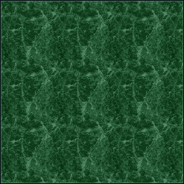
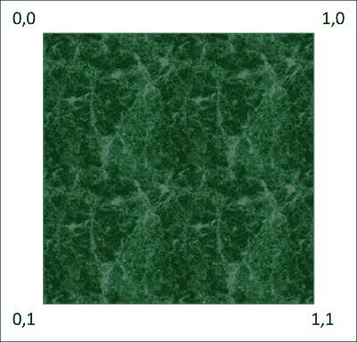
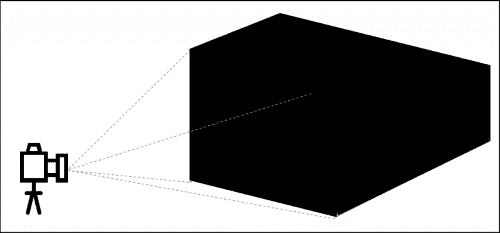
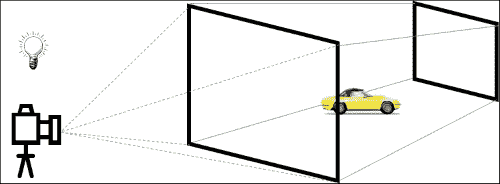
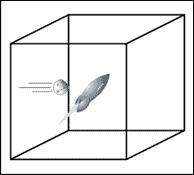
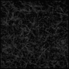
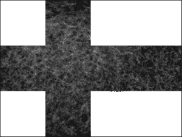
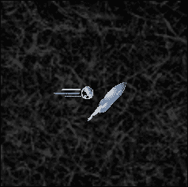
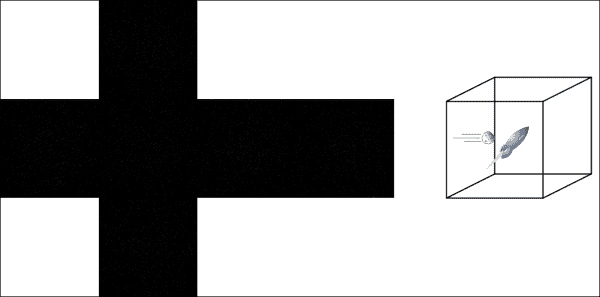

# 第十二章. 征服宇宙

恭喜！你已经走到这一步了。如果你正在阅读这一章，那么你已经创建了两个游戏——一个 2D 游戏和一个 3D 游戏。当然，它们可能不会卖出去并让你赚一百万美元，但你已经完成了比 90%试图玩游戏的人更多的游戏。

还有更多东西要学习，我们不可能在一本书中涵盖所有内容。本章将简要介绍几个更多的话题，并希望至少为您提供足够的信息，以便在完成本书后进一步实验。实际上，我们将设置一个框架，让您可以玩游戏，所以我们将称之为游乐场。

我们将涵盖的主题包括以下内容：

+   **游乐场**：我们将首先设置一个模板，您可以在尝试不同功能时反复使用。这个模板也将是您想要创建的任何未来游戏的良好起点。

+   **纹理映射**：到目前为止，我们只处理了颜色，而不是纹理。仅使用颜色制作逼真的游戏会相当困难。事实证明，我们可以将纹理应用到我们的模型上，使它们更加逼真。我们将学习在简单的 3D 形状上进行纹理映射的基本知识。

+   **光照**：到目前为止，我们使用了 OpenGL 提供的默认光照。大多数时候，我们希望对光照有更多的控制。我们将讨论各种光照类型及其使用方法。

+   **天空盒**：游戏宇宙不可能永远继续下去。我们经常使用一种称为天空盒的设备来包围我们的游戏世界，使其看起来比实际更大。我们将学习如何将天空盒添加到我们的太空游戏中。

+   **物理**：在现实世界中，物体根据物理定律弹跳、下落并做其他事情。我们将讨论物体如何相互交互以及与宇宙其他部分的关系。

+   **人工智能**：许多游戏都有敌人或武器试图摧毁玩家。这些敌人通常由某种形式的人工智能（AI）控制。我们将讨论一些简单的 AI 形式，并学习游戏如何控制游戏中的对象。

+   **下一步是什么**：最后，我将给你一些建议，告诉你如何在完成这本书后继续提高你的技能。我们将讨论游戏引擎和额外的学习主题。

# 一个有趣的框架

现在，是时候创建我们的游乐场了。在我们开始编码之前，让我们决定我们想要设置的基本功能：

+   Visual Studio 项目

+   Windows 环境

+   OpenGL 环境

+   游戏循环

到此为止，我们就要做这些了。我们的想法是设置一个基本的模板，您可以用它来开始任何游戏或实验项目。我们不希望在这个基本框架中包含太多内容，所以现在我们将省略声音、输入、精灵和模型加载。这些可以在需要时添加。

## 设置 Visual Studio 项目

开始一个新的空白项目，并将其命名为`FunWith3D`。确保在项目的**属性**、**配置属性**、**链接器**、**输入**、**附加依赖项**属性中添加正确的库：

```cpp
glu32.lib;opengl32.lib;SOIL.lib;
```

我们将包含 SOIL 库，因为它在加载图像方面非常有用。你需要从我们的`SpaceRacer3D.cpp`项目文件夹中复制以下文件：

+   `glut.h`

+   `glut32.lib`

+   `glut32.dll`

+   `SOIL.h`

+   `SOIL.lib`

将以下库添加到**属性**、**配置属性**、**输入**和**附加依赖项**中：

+   `glut32.lib`

+   `SOIL.lib`

## 设置 Windows 环境

创建一个新的 C++文件，并将其命名为`FunWith3D.cpp`。然后添加以下代码：

```cpp
#include <windows.h>
#include <stdio.h>
#include "glut.h"
#include "SOIL.h"

const int screenWidth = 1024;
const int screenHeight = 768;

// Global Variables:
HINSTANCE hInstance = NULL;
HDC hDC = NULL;
HGLRC hRC = NULL;
HWND hWnd = NULL;

bool fullscreen = false;

// Forward declarations of functions included in this code module:
LRESULT CALLBACK WndProc(HWND, UINT, WPARAM, LPARAM);
```

现在，从上一个项目中打开`SpaceRacer3D.cpp`并复制以下函数：

+   `WinMain`

+   `WndProc`

这些是 Windows 执行其操作所需的头文件和两个函数。所有这些代码在前面的章节中都有解释，所以在这里我不会再重复解释。实际上，你可以节省一些打字时间，直接从我们之前的项目中复制这段代码。

## 设置 OpenGL 环境

现在，是时候设置 OpenGL 了。从 SpaceRacer3D 中复制以下函数，并在`WndProc`声明之后添加它们：

+   `ReSizeGLScene`

+   `InitGL`

+   `KillGLWindow`

+   `CreateGLWindow`

## 设置游戏循环

现在，我们添加定义我们的游戏循环的函数。在刚刚添加的 OpenGL 代码之后添加这些函数：

```cpp
void StartGame()
{
}
void Update(const float p_deltaTime)
{
}

void Enable2D()
{
  glColor3f(1.0f, 1.0f, 1.0f);
  glEnable(GL_TEXTURE_2D);

  glMatrixMode(GL_PROJECTION);
  glPushMatrix();
  glLoadIdentity();
  glOrtho(0, screenWidth, screenHeight, 0, 0, 1);

  glMatrixMode(GL_MODELVIEW);
  glPushMatrix();
  glLoadIdentity();

  glPushAttrib(GL_DEPTH_BUFFER_BIT);
  glDisable(GL_DEPTH_TEST);
}

void Disable2D()
{
  glPopAttrib();

  glMatrixMode(GL_PROJECTION);
  glPopMatrix();

  glMatrixMode(GL_MODELVIEW);
  glPopMatrix();

  glDisable(GL_TEXTURE_2D);
}

void Render2D()
{
  Enable2D();
  //Add your 2D rendering here
  Disable2D();
}

void Render3D()
{
  //Add your 3D rendering here
}

void Render()
{
  glClear(GL_COLOR_BUFFER_BIT | GL_DEPTH_BUFFER_BIT);
  Render3D();
  Render2D();
  SwapBuffers(hDC);
}
void EndGame()
{
}

void GameLoop(const float p_deltatTime)
{
  Update(p_deltatTime);
  Render();
}
```

为了与其他我们编写的代码保持一致，你需要在项目的**属性**、**配置属性**、**C/C++**、**预处理器**和**预处理器定义**属性中添加以下预编译指令：

+   `_USE_MATH_DEFINES`

+   `_CRT_SECURE_NO_WARNINGS`

恭喜！你现在有一个可以用于任何未来项目和实验的框架。你刚刚也成功回顾了我们整本书中一直在使用的 OpenGL 和游戏代码。

你会注意到我还保留了代码，这样你就可以在 3D 或 2D 中渲染！总的来说，你现在有一个小而有效的游戏引擎起点。我建议你保存包含此解决方案和项目的文件夹的副本。然后，当你准备好开始一个新项目时，你可以简单地复制解决方案文件夹，给它另一个名字，然后就可以开始了。我们将以此作为本章中编写任何代码的基础。

### 小贴士

为了节省空间并使我们的小型游乐场保持简单，我没有包含一些关键特性，例如输入、精灵、模型和声音。如果你觉得这些中的任何一个是你的游乐场中必不可少的，那么这将是你第一次练习。一般来说，你只需将相关文件和/或代码从 SpaceRacer3D 的最后一个版本复制到你的项目文件夹中。

# 纹理映射

到目前为止，我们所有的形状和模型都使用了颜色，但当我们开始将纹理应用于模型时，一个全新的世界等待着我们。将 2D 纹理添加到 3D 模型称为 **纹理映射**，在某些情况下也称为 **纹理包裹**。让我们看看添加一些纹理到我们的 3D 模型需要什么。我们将从一个简单的立方体开始。

首先，使用你喜欢的图像编辑软件创建一个 256 x 256 像素的正方形，并给它添加某种纹理。我将使用以下这个：



将此纹理保存为位图（BMP）。我们将使用位图而不是 PNG，因为位图的内部数据结构恰好与 OpenGL 期望的数据结构相匹配。换句话说，这更容易！

我总是为我的图片创建一个名为 resources 的文件夹。将它们作为资源包含在 Visual Studio 项目中也是一个好主意（在 **Solution Explorer** 面板中右键点击 **Resources** 文件夹，然后选择 **Add Existing…**，然后导航到图片）。

## 加载纹理

如果你还记得，我们为之前的项目创建了一个精灵类。我们使用 `Sprite` 类的 `AddTexture` 方法来调用 SOIL 库以加载图片。我们不会使用 `Sprite` 类来处理这些纹理。`Sprite` 类有很多方法和属性，这些并不适用于纹理化 3D 模型，因此我们将为这个用途编写自己的纹理加载器。在渲染函数上方某处添加以下代码：

```cpp
void LoadTexture(const char* filepath, GLsizei height, GLsizei width, unsigned int colordepth, GLuint &texture)
{
  unsigned char* data;
  FILE* file;

  file = fopen(filepath, "r");
  data = (unsigned char*)malloc(width * height * colordepth);
  fread(data, width * height * colordepth, 1, file);
  fclose(file);

  texture = SOIL_load_OGL_texture(filepath, SOIL_LOAD_AUTO, SOIL_CREATE_NEW_ID, 0);
  glBindTexture(GL_TEXTURE_2D, texture);
  glTexImage2D(GL_TEXTURE_2D, 0, colordepth == 3 ? GL_RGB:GL_RGBA, width, height, 0, colordepth == 3 ? GL_RGB:GL_RGBA, GL_UNSIGNED_BYTE, data);
  glTexParameteri(GL_TEXTURE_2D, GL_TEXTURE_MIN_FILTER, GL_LINEAR);
  glTexParameteri(GL_TEXTURE_2D, GL_TEXTURE_MAG_FILTER, GL_LINEAR);
  free(data);
}
```

`LoadTexture` 的目的是将纹理加载到内存中，并将其设置为 3D 对象的纹理映射。为了完成这个任务，我们实际上需要将纹理加载两次。首先，我们直接打开文件，将其作为二进制文件读入名为 `data` 的缓冲区。我们使用 `char` 数据类型，因为我们想将二进制数据存储为无符号整数，而 `char` 在此方面做得非常好。因此，我们的前几行代码：

+   定义数据数组

+   创建文件句柄

+   为数据分配内存

+   将文件读入数据缓冲区

+   关闭文件（但不是缓冲区）

现在，再次读取图片，但这次我们使用 SOIL 库将其作为 OpenGL 纹理读取，并使用 SOIL 加载纹理并将其分配给由 `texture` 引用的 OpenGL。

然后，我们对其执行一些复杂的 OpenGL 操作，将其设置为模型纹理：

+   `GL_BindTexture` 简单地告诉 OpenGL 我们想要这个纹理成为当前纹理，我们将应用随后的设置。

+   `glTexImage2D` 告诉 OpenGL 如何解释我们读取的数据。我们告诉 OpenGL 将数据视为 RGB 或 RGBA 类型的 2D 纹理（由 `colordepth` 参数控制），并且数据以无符号整数存储（因此，使用 `char` 数据类型）。

+   下两个函数，都是对`glTexParameteri`的调用，告诉 OpenGL 如何处理纹理，当它靠近或远离相机时。它们都设置为使用线性过滤来处理这种细节级别。

+   最后，由于不再需要，我们关闭数据缓冲区。

我们已经设置了`LoadTexture`函数，以便根据您的需求调用它。在我们的例子中，我们首先将设置一个指向此纹理的句柄。在代码顶部，将此行添加到全局变量部分：

```cpp
GLuint texMarble;
```

接下来，我们将加载纹理的调用放置在`StartGame`函数中：

```cpp
LoadTexture("resources/marble.bmp", 256, 256, 4, texMarble);
```

此调用告诉程序：

+   文件的位置

+   图像的宽度和高度

+   图像的色彩深度（在本例中`4` = RGBA）

+   OpenGL 纹理句柄

## 渲染立方体

现在我们已经设置了一个纹理，但我们需要一个模型来纹理化。为了使事情简单，我们将使用四边形来创建一个立方体，并将大理石纹理应用到立方体的每个面上。

在我们开始之前，我们需要添加三个变量来跟踪旋转。将这些行添加到全局变量部分：

```cpp
float xrot = 1.0f;
float yrot = 1.0f;
float zrot = 1.0f;
```

现在，在`LoadTexture`函数下方创建以下函数：

```cpp
int DrawTexturedCube(GLvoid)
{
  glEnable(GL_TEXTURE_2D);

  glLoadIdentity();
  glTranslatef(0.0f, 0.0f, -5.0f);

  glRotatef(xrot, 1.0f, 0.0f, 0.0f);
  glRotatef(yrot, 0.0f, 1.0f, 0.0f);
  glRotatef(zrot, 0.0f, 0.0f, 1.0f);

  glBindTexture(GL_TEXTURE_2D, texMarble);

  glBegin(GL_QUADS);
  // Font Face
  glTexCoord2f(0.0f, 0.0f); glVertex3f(-1.0f, -1.0f, 1.0f);
  glTexCoord2f(1.0f, 0.0f); glVertex3f(1.0f, -1.0f, 1.0f);
  glTexCoord2f(1.0f, 1.0f); glVertex3f(1.0f, 1.0f, 1.0f);
  glTexCoord2f(0.0f, 1.0f); glVertex3f(-1.0f, 1.0f, 1.0f);
  // Back Face
  glTexCoord2f(1.0f, 0.0f); glVertex3f(-1.0f, -1.0f, -1.0f);
  glTexCoord2f(1.0f, 1.0f); glVertex3f(-1.0f, 1.0f, -1.0f);
  glTexCoord2f(0.0f, 1.0f); glVertex3f(1.0f, 1.0f, -1.0f);
  glTexCoord2f(0.0f, 0.0f); glVertex3f(1.0f, -1.0f, -1.0f);
  // Top Face
  glTexCoord2f(0.0f, 1.0f); glVertex3f(-1.0f, 1.0f, -1.0f);
  glTexCoord2f(0.0f, 0.0f); glVertex3f(-1.0f, 1.0f, 1.0f);
  glTexCoord2f(1.0f, 0.0f); glVertex3f(1.0f, 1.0f, 1.0f);
  glTexCoord2f(1.0f, 1.0f); glVertex3f(1.0f, 1.0f, -1.0f);
  // Bottom Face
  glTexCoord2f(1.0f, 1.0f); glVertex3f(-1.0f, -1.0f, -1.0f);
  glTexCoord2f(0.0f, 1.0f); glVertex3f(1.0f, -1.0f, -1.0f);
  glTexCoord2f(0.0f, 0.0f); glVertex3f(1.0f, -1.0f, 1.0f);
  glTexCoord2f(1.0f, 0.0f); glVertex3f(-1.0f, -1.0f, 1.0f);
  // Right face
  glTexCoord2f(1.0f, 0.0f); glVertex3f(1.0f, -1.0f, -1.0f);
  glTexCoord2f(1.0f, 1.0f); glVertex3f(1.0f, 1.0f, -1.0f);
  glTexCoord2f(0.0f, 1.0f); glVertex3f(1.0f, 1.0f, 1.0f);
  glTexCoord2f(0.0f, 0.0f); glVertex3f(1.0f, -1.0f, 1.0f);
  // Left Face
  glTexCoord2f(0.0f, 0.0f); glVertex3f(-1.0f, -1.0f, -1.0f);
  glTexCoord2f(1.0f, 0.0f); glVertex3f(-1.0f, -1.0f, 1.0f);
  glTexCoord2f(1.0f, 1.0f); glVertex3f(-1.0f, 1.0f, 1.0f);
  glTexCoord2f(0.0f, 1.0f); glVertex3f(-1.0f, 1.0f, -1.0f);
  glEnd();

  xrot += 0.01f;
  yrot += 0.02f;
  zrot += 0.03f;
  return TRUE;
}
```

这段代码与我们在前一章中用来绘制立方体的代码非常相似。然而，当我们绘制那个立方体时，我们对每个顶点应用了颜色。现在，我们将纹理应用到每个面上。首先，我们设置一些事情：

1.  我们首先使用`glEnable(GL_TEXTURE_2D)`来启用 2D 纹理。在我们的初始设置中，我们禁用了 2D 纹理。如果我们在这里不启用它们，那么我们的纹理将不会显示出来！

1.  接下来，我们使用`glLoadIdentity()`来初始化当前矩阵。

1.  我们调用`glTranslatef(0.0f, 0.0f, -5.0f)`将相机向后移动（这样我们就会在立方体外面）。

1.  三次调用`glRotate3f`将为我们旋转立方体。

1.  然后，我们使用`glBindTexture(GL_TEXTURE_2D, texMarble)`来通知 OpenGL，在接下来的绘制操作中，我们将使用由`texMarble`引用的纹理。

完成此设置后，我们就可以开始绘图了：

1.  我们从`glBegin(GL_QUADS)`开始，告诉 OpenGL 我们将绘制四边形。

1.  现在，每个调用都成对出现。首先是一个`glTexCoord2f`的调用，然后是一个`glVertex3f`的调用。`glTexCoord2f`的调用告诉 OpenGL 将纹理的哪一部分放置在由`glVertex3f`指定的位置。这样，我们可以将纹理中的任何点映射到四边形中的任何点。OpenGL 负责确定纹理的哪些部分位于顶点之间。

1.  当我们完成立方体的绘制后，我们发出`glEnd()`命令。

1.  最后三行更新旋转变量。

1.  最后，我们必须在`Render3D`函数中调用`DrawTexturedCube`：

    ```cpp
    DrawTexturedCube();
    ```

1.  运行程序，看看立方体在纹理的华丽中！！渲染立方体

## 映射操作

我需要向您解释更多关于纹理映射的工作原理。看看`DrawTexturedCube`中的这四行代码：

```cpp
glTexCoord2f(0.0f, 0.0f); glVertex3f(-1.0f, -1.0f, 1.0f);
glTexCoord2f(1.0f, 0.0f); glVertex3f(1.0f, -1.0f, 1.0f);
glTexCoord2f(1.0f, 1.0f); glVertex3f(1.0f, 1.0f, 1.0f);
glTexCoord2f(0.0f, 1.0f); glVertex3f(-1.0f, 1.0f, 1.0f);
```

这四行定义了一个四边形。每个顶点由一个纹理坐标（`glTexCoord2f`）和一个顶点坐标（`glVertex3f`）组成。当 OpenGL 查看纹理时，它看到的是：



不论纹理在像素中有多大，在纹理坐标中，纹理正好是一单位宽和一单位高。所以，前面代码的第一行告诉 OpenGL 将纹理的点（**0,0**）（左上角）映射到定义的下一个顶点（在这个例子中是四边形的左上角）。你会注意到第三行将纹理坐标（**1,1**）映射到四边形的右下角。实际上，我们正在将纹理拉伸到四边形的面上！然而，OpenGL 也会调整映射，使得纹理看起来不会模糊，所以这并不是真正发生的事情。相反，你将看到一些平铺效果。

# 让有光吧！

到目前为止，我们还没有担心过光照。实际上，我们只是假设光线会存在，这样我们才能看到我们的图像。OpenGL 有一个光照设置，它会均匀地照亮一切。这个设置默认是开启的，直到我们告诉 OpenGL 我们想要处理光照。

想象一下如果没有光照，我们的场景会是什么样子。实际上，这有一天会发生。你将一切设置好并准备就绪，你将运行程序，然后你会得到一个又大又黑的什么都没有！怎么了？你忘记打开灯了！就像下面的图片所示：



就像现实生活一样，如果你没有光源，你将什么也看不到。OpenGL 有许多类型的光源。一种常见的光源是**环境光**。环境光似乎同时从所有方向照射过来，就像阳光充满房间一样。



光照在 3D 游戏中非常重要，大多数游戏都有多个光源来增加游戏的真实感。

## 定义光源

让我们接管并定义我们自己的光源。将以下代码行添加到 `DrawTexturedCube` 函数的顶部：

```cpp
glEnable(GL_LIGHTING);
GLfloat ambientLight[] = { 0.0f, 0.0f, 1.0f, 1.0f };
glLightModelfv(GL_LIGHT_MODEL_AMBIENT, ambientLight);
glEnable(GL_COLOR_MATERIAL);
glColorMaterial(GL_FRONT, GL_AMBIENT);
```

运行程序，然后回来查看发生了什么：

+   `glEnable(GL_LIGHTING)` 告诉 OpenGL 我们现在想要控制光照。记住：一旦启用光照，就由你来决定了。实际上，如果你启用了光照但没有定义任何光源，那么你将得到一个完全黑色的场景。

+   接下来，我们为我们的光源定义一个颜色。在这种情况下，我们正在创建一束蓝色光。

+   现在我们通过 `glLightModelfv` 告诉 OpenGL 我们想要使用哪种类型的光照。在这种情况下，我们正在开启一种蓝色，环境光。

+   光需要有材料来反射。因此，我们使用 `glEnable(GL_COLOR_MATERIAL)` 来告诉 OpenGL 使用一个会反射颜色的材料。

+   调用`glColorMaterial(GL_FRONT, GL_AMBIENT)`告诉 OpenGL，这个材质的前面应该像环境光一样反射光线。记住，环境光来自所有方向。

当然，你已经看到了结果。我们的立方体是蓝色的！尝试不同的颜色。我们只有时间对光照进行浅尝辄止。你还将想要了解漫反射光照。漫反射光随着距离的增大而减弱。使用漫反射光时，你不仅设置颜色，还要在某个位置放置光源。

# 天空盒

虽然空间可能是无限的，但你的计算机不是，所以必须有一个边界。这个边界被称为天空盒。

想象我们的宇宙飞船正在太空中飞行！空间很大。虽然我们可以在我们的宇宙中放置一些行星和小行星，让宇宙飞船有东西可以与之交互，但我们当然不会为每一颗星星建模。这就是我们的宇宙看起来像的：



这看起来相当空旷，对吧？你可能在我们的游戏 SpaceRacer3D 中已经注意到了这一点。当然，我们可以添加一些自己的物体——更多的小行星，添加一大堆星星——在一个真正的游戏中，我们会这样做。但是，在开始出现性能问题时，你可以添加到游戏中的物体数量总是有限的。

对于真正遥远的物体，例如遥远的星星，我们通过使用二维纹理来模拟。例如，我们的游戏可以使用星纹理来模拟太空中的星星和星云，如下面的图片所示：



现在，由于一个立方体有六个面，我们真正想要的是六个纹理。一个典型天空盒看起来类似于以下图片：



并不需要太多的想象力就能看到这个纹理如何被包裹在立方体上并覆盖所有尺寸的侧面。这创造了一个覆盖天空盒封装的所有空间的图像，给人一种被星星和星云包围的错觉，如下面的图片所示：



下面的插图展示了从另一个角度应用到天空盒上的纹理：



包含飞船和小行星的立方体代表游戏世界。飞船和小行星是这个世界中的真实物体。左边的图像是一个包含星星的纹理。

现在，想象星纹理被包裹在立方体上，这就是你的整个宇宙，由星星、飞船和小行星组成。包裹在立方体上的星纹理就是天空盒。

# 高级主题

不幸的是，对于最后两个主题，我们只有时间给予它们一个荣誉的提及。我包括它们是因为你将要听到这些主题，你需要知道这些术语的含义。

## 游戏物理

**游戏物理**是定义游戏宇宙内物体如何相互作用的规则。例如，在 SpaceRacer3D 中，飞船只是简单地穿过小行星。然而，可能会有许多其他结果：

+   飞船和小行星可能会相互弹跳（反弹）

+   飞船可能会被小行星吸进去，随着飞船靠近，力量会逐渐增加（重力）

+   当飞船靠近小行星时，小行星可能会对飞船产生推力（反向重力）

这些效果都会被编程到游戏中。每个效果也会创造不同类型的游戏体验。一个被称为基于物理的游戏的整个游戏类型，仅仅定义了一个游戏宇宙中的物理定律，然后让事物相互作用，看看会发生什么。

## 人工智能

**人工智能**，或**人工智能**，是一套规则，定义了由计算机控制的字符或物体如何行为。人工智能通常应用于敌人和其他**非玩家角色**（**NPC**），以在游戏中赋予它们逼真的外观。人工智能的一些例子包括：

+   一个自动检测到敌人靠近并爆炸的雷区

+   一种制导导弹，无论飞船如何导航，都会锁定并靠近太空船

+   一个敌人角色检测到玩家靠近并躲在岩石后面

人工智能通常被认为是游戏编程中最困难的领域之一。一些算法相当简单（例如，制导导弹只需要知道飞船的位置来追踪它），而其他算法则非常复杂（例如，躲在岩石后面）。有些游戏甚至为你提供了一个 AI 对手来对抗。

# 未来

你确实已经走了很长的路。如果你在阅读这些文字，尤其是如果你在过程中编写了所有代码，那么你已经取得了巨大的成就，但还有许多东西要学习。我鼓励你找到其他书籍，永远不要停止学习。阻止你成为伟大游戏程序员的唯一因素是你自己！

# 摘要

如同往常，我们在本章中涵盖了大量的主题。你学习了如何将纹理映射到物体上，然后你学习了如何打开灯光。你学习了天空盒如何被用来使你的世界看起来比实际更大。你还仅仅尝到了物理和人工智能的滋味，这些主题可以轻易地填满整本书。不要停止，直到你让这本书中的每一行代码为你所用，然后开始改变代码，让它变得不同和令人惊叹。

祝你好运！
