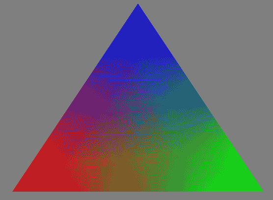
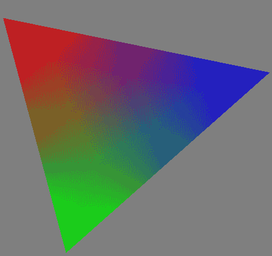

# 第二章：与 GLSL 程序一起工作

在本章中，我们将介绍以下食谱：

+   使用顶点属性和顶点缓冲区对象向着色器发送数据

+   获取活动顶点输入属性和位置的列表

+   使用统一变量向着色器发送数据

+   获取活动统一变量的列表

+   使用统一块和统一缓冲区对象

+   使用程序管线

+   获取调试信息

+   构建一个 C++着色器程序类

# 简介

在第一章“GLSL 入门”中，我们介绍了编译、链接和导出着色器程序的基础知识。在本章中，我们将介绍着色器程序与主机 OpenGL 程序之间通信的技术。更具体地说，我们将主要关注输入。着色器程序的输入通常通过属性和统一变量来实现。在本章中，我们将看到这些类型变量使用的几个示例。我们还将介绍混合和匹配着色器程序阶段的食谱，以及创建 C++着色器程序对象的食谱。

本章不会涉及着色器输出。显然，着色器程序将它们的输出发送到默认帧缓冲区，但还有几种其他技术可以接收着色器输出。例如，使用自定义帧缓冲区对象允许我们将着色器输出存储到纹理或其他缓冲区。一种称为变换反馈的技术允许将顶点着色器输出存储到任意缓冲区。你将在本书后面的部分看到这些输出技术的许多示例。

# 使用顶点属性和顶点缓冲区对象向着色器发送数据

顶点着色器对每个顶点调用一次。其主要任务是处理与顶点相关的数据，并将其（以及可能的其他信息）传递到管道的下一阶段。为了给我们的顶点着色器提供一些可以操作的数据，我们必须有一种方式向着色器提供（每个顶点的）输入。通常，这包括顶点位置、法向量以及纹理坐标（以及其他内容）。在 OpenGL 的早期版本（3.0 之前），每个顶点信息在管道中都有一个特定的*通道*。它通过`glVertex`、`glTexCoord`和`glNormal`等函数提供给着色器（或者使用客户端顶点数组中的`glVertexPointer`、`glTexCoordPointer`或`glNormalPointer`）。然后着色器通过内置变量如`gl_Vertex`和`gl_Normal`访问这些值。这种功能在 OpenGL 3.0 中被弃用，并在之后的版本中删除。相反，现在必须使用*通用顶点属性*来提供顶点信息，通常与（顶点）*缓冲对象*一起使用。程序员现在可以自由定义一组任意的顶点属性，将其作为输入提供给顶点着色器。例如，为了实现法线贴图，程序员可能会决定应该提供位置、法向量和切向量作为每个顶点的附加信息。在 OpenGL 4 中，很容易将这些定义为输入属性集。这为我们提供了很大的灵活性，可以以任何适合我们应用的方式定义顶点信息，但对于习惯于旧方法的人来说可能需要一些适应。

在顶点着色器中，使用`in` GLSL 限定符定义了每个顶点的输入属性。例如，为了定义一个名为`VertexColor`的三分量向量输入属性，我们使用以下代码：

```cpp
in vec3 VertexColor; 
```

当然，这个属性的数据必须由 OpenGL 程序提供。为此，我们使用顶点缓冲对象。缓冲对象包含输入属性的值。在主要的 OpenGL 程序中，我们建立缓冲区和输入属性之间的连接，并定义如何*遍历*数据。然后，在渲染时，OpenGL 从缓冲区中为每个顶点着色器的调用提取输入属性的数据。

对于这个示例，我们将绘制一个三角形。我们的顶点属性将是位置和颜色。我们将使用片段着色器将每个顶点的颜色在三角形上混合，以产生一个类似于以下所示图像的效果。三角形的顶点是红色、绿色和蓝色，三角形的内部是这三种颜色的混合。这些颜色可能在打印的文本中不可见，但阴影的变化应该表明了混合：



# 准备工作

我们将从一个空的 OpenGL 程序开始，并使用以下着色器：

顶点着色器（`basic.vert.glsl`）:

```cpp
#version 460 

layout (location=0) in vec3 VertexPosition; 
layout (location=1) in vec3 VertexColor; 

out vec3 Color; 

void main() 
{ 
  Color = VertexColor; 

  gl_Position = vec4(VertexPosition,1.0); 
}
```

属性是顶点着色器的输入变量。在前面的代码中，有两个输入属性：`VertexPosition`和`VertexColor`。它们使用`in` GLSL 关键字指定。不用担心`layout`前缀，我们稍后会讨论这一点。我们的主 OpenGL 程序需要为每个顶点提供这两个属性的数据。我们将通过将我们的多边形数据映射到这些变量来实现这一点。

它还有一个输出变量，名为`Color`，该变量被发送到片段着色器。在这种情况下，`Color`只是`VertexColor`的一个未更改的副本。此外，请注意，`VertexPosition`属性只是简单地扩展并传递给内置的`gl_Position`输出变量以进行进一步处理。

片段着色器（`basic.frag.glsl`）：

```cpp
#version 460 

in vec3 Color;
out vec4 FragColor; 

void main() {
  FragColor = vec4(Color, 1.0); 
} 
```

该着色器只有一个输入变量，即`Color`。它链接到顶点着色器中的相应输出变量，并将包含一个基于顶点值的插值值。我们只需简单地扩展并复制此颜色到`FragColor`输出变量（有关片段着色器输出变量的更多信息，请参阅后续配方）。

编写代码来编译和链接这些着色器到着色器程序中（请参阅*编译着色器*和*链接着色器程序*配方）。在以下代码中，我将假设着色器程序的句柄为`programHandle`。

# 如何做到这一点...

使用以下步骤设置缓冲区对象并渲染三角形：

1.  创建一个全局（或私有实例）变量来保存我们的顶点数组对象句柄：

```cpp
GLuint vaoHandle;
```

1.  在初始化函数中，我们为每个属性创建并填充顶点缓冲区对象：

```cpp
float positionData[] = { 
      -0.8f, -0.8f, 0.0f, 
      0.8f, -0.8f, 0.0f, 
      0.0f,  0.8f, 0.0f }; 
float colorData[] = { 
      1.0f, 0.0f, 0.0f, 
      0.0f, 1.0f, 0.0f, 
      0.0f, 0.0f, 1.0f }; 

// Create and populate the buffer objects 
GLuint vboHandles[2]; 
glGenBuffers(2, vboHandles); 
GLuint positionBufferHandle = vboHandles[0]; 
GLuint colorBufferHandle = vboHandles[1]; 

// Populate the position buffer 
glBindBuffer(GL_ARRAY_BUFFER, positionBufferHandle); 
glBufferData(GL_ARRAY_BUFFER, 9 * sizeof(float), 
       positionData, GL_STATIC_DRAW); 

// Populate the color buffer 
glBindBuffer(GL_ARRAY_BUFFER, colorBufferHandle); 
glBufferData(GL_ARRAY_BUFFER, 9 * sizeof(float), colorData, 
       GL_STATIC_DRAW);
```

1.  创建并定义一个顶点数组对象，该对象定义了缓冲区与输入属性之间的关系（有关另一种有效于 OpenGL 4.3 及以后版本的方法，请参阅*更多内容...*）：

```cpp
// Create and set-up the vertex array object 
glGenVertexArrays( 1, &vaoHandle ); 
glBindVertexArray(vaoHandle); 

// Enable the vertex attribute arrays 
glEnableVertexAttribArray(0);  // Vertex position 
glEnableVertexAttribArray(1);  // Vertex color 

// Map index 0 to the position buffer 
glBindBuffer(GL_ARRAY_BUFFER, positionBufferHandle); 
glVertexAttribPointer(0, 3, GL_FLOAT, GL_FALSE, 0, NULL); 

// Map index 1 to the color buffer 
glBindBuffer(GL_ARRAY_BUFFER, colorBufferHandle); 
glVertexAttribPointer(1, 3, GL_FLOAT, GL_FALSE, 0, NULL);
```

1.  在渲染函数中，绑定到顶点数组对象并调用`glDrawArrays`以启动渲染：

```cpp
glBindVertexArray(vaoHandle); 
glDrawArrays(GL_TRIANGLES, 0, 3 ); 
```

# 它是如何工作的...

顶点属性是我们顶点着色器的输入变量。在给定的顶点着色器中，我们的两个属性是`VertexPosition`和`VertexColor`。主 OpenGL 程序通过将每个（活动）输入变量与一个通用属性索引关联来引用顶点属性。这些通用索引是介于`0`和`GL_MAX_VERTEX_ATTRIBS - 1`之间的简单整数。我们可以使用`layout`限定符来指定这些索引与属性之间的关系。例如，在我们的顶点着色器中，我们使用`layout`限定符将`VertexPosition`分配给属性索引`0`，将`VertexColor`分配给属性索引`1`：

```cpp
layout (location = 0) in vec3 VertexPosition; 
layout (location = 1) in vec3 VertexColor; 
```

我们通过引用相应的通用顶点属性索引来在我们的 OpenGL 代码中引用顶点属性。

并非严格必要显式指定属性变量和通用属性索引之间的映射，因为 OpenGL 在程序链接时会自动将活动顶点属性映射到通用索引。然后我们可以查询这些映射并确定与着色器输入变量对应的索引。然而，显式指定映射可能更清晰，正如我们在本例中所做的那样。

第一步涉及设置一对缓冲区对象以存储我们的位置和颜色数据。与大多数 OpenGL 对象一样，我们首先创建对象，并通过调用`glGenBuffers`获取两个缓冲区的句柄。然后，我们将每个句柄分配给单独的描述性变量，以使以下代码更清晰。

对于每个缓冲区对象，我们首先通过调用`glBindBuffer`将缓冲区绑定到`GL_ARRAY_BUFFER`绑定点。`glBindBuffer`的第一个参数是目标绑定点。在这种情况下，由于数据本质上是一个通用数组，我们使用`GL_ARRAY_BUFFER`。其他类型的目标（如`GL_UNIFORM_BUFFER`或`GL_ELEMENT_ARRAY_BUFFER`）的示例将在后续示例中看到。

一旦我们的缓冲区对象被绑定，我们可以通过调用`glBufferData`来填充缓冲区，其中包含我们的顶点/颜色数据。此函数的第二个和第三个参数是数组的尺寸以及包含数据的数组的指针。让我们关注第一个和最后一个参数。第一个参数指示目标缓冲区对象。第三个参数提供的数据被复制到绑定到此绑定点的缓冲区中。最后一个参数提供了一个 OpenGL 如何使用数据的提示，以便它可以确定如何最好地在内部管理缓冲区。有关此参数的完整详细信息，请参阅 OpenGL 文档。在我们的情况下，数据只指定一次，不会修改，并且将被多次用于绘图操作，因此这种使用模式最适合`GL_STATIC_DRAW`值。

现在我们已经设置了缓冲区对象，我们将它们绑定在一起形成一个**顶点数组对象**（**VAO**）。VAO 包含关于我们缓冲区中的数据与输入顶点属性之间连接的信息。我们使用`glGenVertexArrays`函数创建一个 VAO。这为我们提供了对新对象的句柄，我们将其存储在`vaoHandle`（全局）变量中。然后，通过调用`glEnableVertexAttribArray`启用通用顶点属性索引`0`和`1`。这样做表示将访问和使用属性值进行渲染。

下一步是建立缓冲区对象和通用顶点属性索引之间的连接：

```cpp
// Map index 0 to the position buffer 
glBindBuffer(GL_ARRAY_BUFFER, positionBufferHandle); 
glVertexAttribPointer( 0, 3, GL_FLOAT, GL_FALSE, 0, NULL ); 
```

首先，我们将缓冲对象绑定到`GL_ARRAY_BUFFER`绑定点，然后调用`glVertexAttribPointer`，这告诉 OpenGL 数据应该使用哪个通用索引，缓冲对象中存储的数据格式，以及它在绑定到`GL_ARRAY_BUFFER`绑定点的缓冲对象中的位置。

第一个参数是通用属性索引。第二个参数是每个顶点属性组件的数量（1、2、3 或 4）。在这种情况下，我们提供三维数据，因此我们希望每个顶点有三个组件。第三个参数是缓冲区中每个组件的数据类型。第四个是一个布尔值，指定数据是否应该自动归一化（对于有符号整数值映射到[-1, 1]或对于无符号整数值映射到[0, 1]）。第五个参数是步长，表示连续属性之间的字节偏移量。由于我们的数据是紧密打包的，我们可以使用零值。最后一个参数是一个指针，它不被视为指针！相反，其值被解释为从缓冲区开始到缓冲区中第一个属性的字节偏移量。在这种情况下，在第一个元素之前，两个缓冲区中都没有额外的数据，所以我们使用零值。

`glVertexAttribPointer`函数将（在 VAO 的状态中）存储当前绑定到`GL_ARRAY_BUFFER`绑定点的缓冲区的指针。当另一个缓冲区绑定到该绑定点时，它不会改变指针的值。

VAO 存储了与缓冲对象和通用顶点属性之间的关系相关的所有 OpenGL 状态，以及缓冲对象中数据格式的信息。这使得我们可以在渲染时快速返回所有这些状态。

VAO（顶点数组对象）是一个极其重要的概念，但理解起来可能有些棘手。重要的是要记住，VAO 的状态主要与启用的属性及其与缓冲对象的关系相关联。它不一定跟踪缓冲区绑定。例如，它不会记住绑定到`GL_ARRAY_BUFFER`绑定点的具体内容。我们只绑定到这个点是为了通过`glVertexAttribPointer`设置指针。

一旦我们设置了 VAO（这是一个一次性操作），我们就可以发出绘制命令来渲染我们的对象。在我们的渲染函数中，我们使用`glClear`清除颜色缓冲区，绑定到顶点数组对象，并调用`glDrawArrays`来绘制我们的三角形。`glDrawArrays`函数通过遍历每个启用的属性数组缓冲区来初始化原语渲染，并将数据传递到我们的顶点着色器。第一个参数是渲染模式（在这种情况下，我们正在绘制三角形），第二个参数是启用数组中的起始索引，第三个参数是要渲染的索引数（对于单个三角形是三个顶点）。

总结一下，我们遵循了以下步骤：

1.  确保在顶点着色器中使用 `layout` 限定符指定每个属性的通用顶点属性索引。

1.  为每个属性创建和填充缓冲区对象。

1.  通过在适当的缓冲区绑定时调用 `glVertexAttribPointer` 来创建和定义顶点数组对象。

1.  在渲染时，绑定到顶点数组对象并调用 `glDrawArrays` 或其他适当的渲染函数（例如，`glDrawElements`）。

# 还有更多...

在下一节中，我们将讨论一些关于先前技术的细节、扩展和替代方案。

# 分离属性格式。

使用 OpenGL 4.3，我们有另一种（可以说是更好的）指定顶点数组对象状态（属性格式、启用的属性和缓冲区）的方法。在先前的例子中，`glVertexAttribPointer` 函数做了两件重要的事情。首先，它间接指定了包含属性数据的缓冲区是当前绑定到 `GL_ARRAY_BUFFER` 的缓冲区。其次，它指定了该数据的格式（类型、偏移量、步长等）。

将这两个关注点分别放入它们自己的函数中可能更清晰。这正是 OpenGL 4.3 中实现的方式。例如，为了实现先前 *如何做...* 部分的第 3 步相同的功能，我们会使用以下代码：

```cpp
glGenVertexArrays(1, &vaoHandle); 
glBindVertexArray(vaoHandle); 
glEnableVertexAttribArray(0); 
glEnableVertexAttribArray(1); 

glBindVertexBuffer(0, positionBufferHandle, 0, sizeof(GLfloat)*3); 
glBindVertexBuffer(1, colorBufferHandle, 0, sizeof(GLfloat)*3); 

glVertexAttribFormat(0, 3, GL_FLOAT, GL_FALSE, 0); 
glVertexAttribBinding(0, 0); 
glVertexAttribFormat(1, 3, GL_FLOAT, GL_FALSE, 0); 
glVertexAttribBinding(1, 1); 
```

上一段代码的前四行与第一个例子中的完全相同。我们创建并绑定到 VAO，然后启用属性 `0` 和 `1`。接下来，我们使用 `glBindVertexBuffer` 将我们的两个缓冲区绑定到顶点缓冲区绑定点内的两个不同索引。注意，我们不再使用 `GL_ARRAY_BUFFER` 绑定点。相反，我们现在有一个专门用于顶点缓冲区的新绑定点。这个绑定点有几个索引（通常从 0 到 15），因此我们可以将多个缓冲区绑定到这个点。`glBindVertexBuffer` 的第一个参数指定了顶点缓冲区绑定点内的索引。在这里，我们将位置缓冲区绑定到索引 `0`，将颜色缓冲区绑定到索引 `1`。

顶点缓冲区绑定点内的索引不必与属性位置相同。

`glBindVertexBuffer` 的其他参数如下。第二个参数是要绑定的缓冲区，第三个参数是从缓冲区开始到数据开始的偏移量，第四个参数是步长，即缓冲区内连续元素之间的距离。与 `glVertexAttribPointer` 不同，我们在这里不能使用 `0` 值来表示紧密打包的数据，因为 OpenGL 没有更多信息无法确定数据的大小，因此我们需要在这里明确指定它。

接下来，我们调用 `glVertexAttribFormat` 来指定属性数据的格式。注意，这次，这已经与存储数据的缓冲区解耦。我们只是指定了期望此属性应具有的格式。参数与 `glVertexAttribPointer` 的前四个参数相同。

`glVertexAttribBinding`函数指定了绑定到顶点缓冲区绑定点的缓冲区与属性之间的关系。第一个参数是属性位置，第二个参数是顶点缓冲区绑定点内的索引。在这个例子中，它们是相同的，但它们不需要是相同的。

还要注意，顶点缓冲区绑定点的缓冲区绑定（由`glBindVertexBuffer`指定）是 VAO 状态的一部分，与绑定到`GL_ARRAY_BUFFER`不同。

这个版本可以说是更清晰、更容易理解。它去除了 VAO 中管理的*不可见*指针的混淆之处，并通过`glVertexAttribBinding`使属性与缓冲区之间的关系更加清晰。此外，它还分离了实际上不需要组合的关心点。

# 片段着色器输出

你可能已经注意到，我在片段着色器中忽略了关于`FragColor`输出变量的任何说明。这个变量接收每个片段（像素）的最终输出颜色。像顶点输入变量一样，这个变量需要与一个适当的位置关联。当然，我们通常希望它与后台颜色缓冲区链接，默认情况下（在双缓冲系统中）是“颜色编号”零。（可以通过使用`glDrawBuffers`来改变颜色编号与渲染缓冲区之间的关系。）在这个程序中，我们依赖于链接器会自动将我们的唯一片段输出变量链接到颜色编号零。为了明确这样做，我们可以在片段着色器中使用布局限定符：

```cpp
layout (location = 0) out vec4 FragColor;
```

我们可以为片段着色器定义多个输出变量，从而使我们能够渲染到多个输出缓冲区。这对于像延迟渲染（见第六章，*图像处理和屏幕空间技术*）这样的专用算法非常有用。

# 不使用布局限定符指定属性索引

如果你不想在顶点着色器代码中添加`layout`限定符（或者你使用的是不支持它们的 OpenGL 版本），你可以在 OpenGL 程序中定义属性索引。我们可以通过在链接着色器程序之前调用`glBindAttribLocation`来实现这一点。例如，我们会在链接步骤之前向主 OpenGL 程序添加以下代码：

```cpp
glBindAttribLocation(programHandle, 0, "VertexPosition"); 
glBindAttribLocation(programHandle, 1, "VertexColor"); 
```

这将指示链接器，`VertexPosition`应对应于通用属性索引`0`，而`VertexColor`对应于索引`1`。

类似地，我们可以在不使用布局限定符的情况下指定片段着色器输出变量的颜色编号。我们通过在链接着色器程序之前调用`glBindFragDataLocation`来实现这一点：

```cpp
glBindFragDataLocation(programHandle, 0, "FragColor"); 
```

这将告诉链接器将`FragColor`输出变量绑定到颜色编号`0`。

# 使用元素数组

通常情况下，我们需要以非线性方式遍历我们的顶点数组。换句话说，我们可能想要在数据中“跳转”而不是仅仅从开始到结束移动。例如，我们可能想要绘制一个立方体，其中顶点数据仅由八个位置组成（立方体的角）。为了绘制立方体，我们需要绘制 12 个三角形（每个面两个），每个三角形由三个顶点组成。所有所需的位置数据都在原始的八个位置中，但为了绘制所有三角形，我们需要跳转并至少使用每个位置三次。

为了在顶点数组中跳转，我们可以利用元素数组。元素数组是另一个缓冲区，它定义了遍历顶点数组时使用的索引。有关使用元素数组的详细信息，请参阅 OpenGL 文档中的`glDrawElements`函数（[`www.opengl.org/sdk/docs/man`](http://www.opengl.org/sdk/docs/man)）。

# 交错数组

在这个例子中，我们使用了两个缓冲区（一个用于颜色，一个用于位置）。相反，我们也可以只使用一个缓冲区并将所有数据合并。一般来说，可以将多个属性的数据合并到一个缓冲区中。多个属性的数据可以在数组中交错，这样给定顶点的所有数据都将在缓冲区中分组在一起。这样做只需要仔细使用`glVertexAttribPointer`或`glBindVertexBuffer`的`stride`参数。请参阅完整文档以获取详细信息（[`www.opengl.org/sdk/docs/man`](http://www.opengl.org/sdk/docs/man)）。

关于何时使用交错数组以及何时使用单独数组的决定高度依赖于具体情况。由于数据是同时访问且在内存中更接近（所谓的**引用局部性**），交错数组可能会带来更好的结果，从而实现更好的缓存性能。

# 参见

+   示例代码中的`chapter02/scenebasic_attrib.cpp`文件

# 获取活动顶点输入属性和位置的列表

如前所述，顶点着色器中的输入变量在程序链接时与通用的顶点属性索引相链接。如果我们需要指定关系，我们可以在着色器中使用布局限定符，或者在链接之前调用`glBindAttribLocation`。

然而，可能更倾向于让链接器自动创建映射，并在程序链接完成后查询它们。在这个例子中，我们将看到一个简单的示例，该示例打印出所有活动属性及其索引。

# 准备工作

从一个编译并链接了着色器对的 OpenGL 程序开始。您可以使用前一个示例中的着色器。

如前所述，我们将假设着色器程序的句柄存储在一个名为`programHandle`的变量中。

# 如何实现...

在链接和启用着色器程序后，使用以下代码来显示活动属性列表：

1.  首先查询活动属性的数目：

```cpp
GLint numAttribs; 
glGetProgramInterfaceiv(programHandle, GL_PROGRAM_INPUT,
        GL_ACTIVE_RESOURCES, &numAttribs);
```

1.  遍历每个属性，查询名称长度、类型和属性位置，并将结果打印到标准输出：

```cpp
GLenum properties[] = {GL_NAME_LENGTH, GL_TYPE, GL_LOCATION};

std::cout << "Active attributes" << std::endl; 
for( int i = 0; i < numAttribs; ++i ) { 
  GLint results[3]; 
  glGetProgramResourceiv(programHhandle, GL_PROGRAM_INPUT,
        i, 3, properties, 3, NULL, results); 

  GLint nameBufSize = results[0] + 1; 
  char * name = new char[nameBufSize]; 
  glGetProgramResourceName(programHandle, 
       GL_PROGRAM_INPUT, i, nameBufSize, NULL, name);  
  printf("%-5d %s (%s)n", results[2], name, 
  getTypeString(results[1])); 
  delete [] name; 
}
```

# 它是如何工作的...

在步骤 1 中，我们通过调用`glGetProgramInterfaceiv`来查询活动属性的数目。第一个参数是程序对象的句柄，第二个参数（`GL_PROGRAM_INPUT`）表示我们正在查询程序输入变量（顶点属性）的信息。第三个参数（`GL_ACTIVE_RESOURCES`）表示我们想要得到活动资源的数目。结果存储在最后一个参数`numAttribs`指向的位置。

现在我们已经得到了属性的数目，接下来我们查询每个属性的信息。属性的索引从`0`到`numAttribs-1`。我们遍历这些索引，并对每个索引调用`glGetProgramResourceiv`来获取名称长度、类型和位置。我们通过一个名为`properties`的`GLenum`值数组来指定我们想要接收的信息。第一个参数是程序对象的句柄，第二个是我们要查询的资源（`GL_PROGRAM_INPUT`）。第三个是属性的索引，第四个是`properties`数组中的值数，这是第五个参数。`properties`数组包含`GLenum`值，这些值指定了我们想要接收的具体属性。在这个例子中，数组包含`GL_NAME_LENGTH`、`GL_TYPE`和`GL_LOCATION`，这表示我们想要得到属性名称的长度、属性的数据类型以及它的位置。第六个参数是接收结果的缓冲区的大小；第七个参数是一个指向整数的指针，该整数将接收写入的结果数目。如果该参数是`NULL`，则不提供任何信息。最后，最后一个参数是一个指向`GLint`数组的指针，该数组将接收结果。`properties`数组中的每个项对应于`results`数组中的相同索引。

接下来，我们通过分配一个缓冲区来存储名称并调用`glGetProgramResourceName`来检索属性名称。`results`数组的第一元素包含名称的长度，因此我们分配一个大小为该数组的数组，并额外分配一个字符以确保安全。OpenGL 文档说明，从`glGetProgramResourceiv`返回的大小包括空终止符，但为了确保这一点，我们留出一些额外的空间。在我的测试中，我发现这对于最新的 NVIDIA 驱动程序是必要的。

最后，通过调用`glGetProgramResourceName`获取名称，然后将信息打印到屏幕上。我们打印属性的位置、名称和类型。位置在`results`数组的第三个元素中，类型在第二个元素中。注意`getTypeString`函数的使用。这是一个简单的自定义函数，它只返回数据类型的字符串表示。数据类型由 OpenGL 定义的常量表示，例如`GL_FLOAT`、`GL_FLOAT_VEC2`或`GL_FLOAT_VEC3`。`getTypeString`函数仅包含一个大的`switch`语句，返回与参数值对应的人类可读字符串（请参阅本书示例代码中`glslprogram.cpp`的源代码）。

当在先前的配方中的着色器上运行先前代码的输出如下所示：

```cpp
    Active attributes:
    1    VertexColor (vec3)
    0    VertexPosition (vec3)
```

# 更多内容...

应注意，为了使顶点着色器输入变量被视为活动状态，它必须在顶点着色器中使用。换句话说，如果 GLSL 链接器确定变量在程序执行期间可能被访问，则该变量被视为活动状态。如果一个变量在着色器中声明但未使用，则前述代码不会显示该变量，因为它不被视为活动状态，并且实际上被 OpenGL 忽略。

前述代码仅适用于 OpenGL 4.3 及更高版本。或者，您可以使用`glGetProgramiv`、`glGetActiveAttrib`和`glGetAttribLocation`函数实现类似的结果。

# 参见

+   示例代码中的`chapter02/scenebasic_attrib.cpp`文件

+   *编译着色器*的配方

+   *链接着色器程序*的配方

+   *使用顶点属性和顶点缓冲对象向着色器发送数据*的配方

# 使用统一变量向着色器发送数据

顶点属性提供了一种向着色器提供输入的方法；第二种技术是统一变量。统一变量旨在用于与每个顶点属性相比相对不经常变化的数据。实际上，使用统一变量设置每个顶点的属性是不可能的。例如，统一变量非常适合用于建模、视图和投影变换的矩阵。

在着色器内部，统一变量是只读的。它们的值只能通过 OpenGL API 从外部更改。然而，它们可以在声明时在着色器内部初始化，通过将它们分配给一个常量值。

统一变量可以出现在着色器程序中的任何着色器中，并且始终用作输入变量。它们可以在程序中的一个或多个着色器中声明，但如果一个变量在多个着色器中声明，其类型必须在所有着色器中相同。换句话说，统一变量在整个着色器程序中保存在一个共享的统一命名空间中。

在这个食谱中，我们将绘制本章之前食谱中相同的三角形；然而，这次，我们将使用统一矩阵变量旋转三角形：



# 准备工作

我们将使用以下顶点着色器：

```cpp
#version 430 

layout (location = 0) in vec3 VertexPosition; 
layout (location = 1) in vec3 VertexColor; 

out vec3 Color; 

uniform mat4 RotationMatrix; 

void main() { 
  Color = VertexColor; 
  gl_Position = RotationMatrix * vec4(VertexPosition,1.0); 
} 
```

注意，`RotationMatrix`变量是使用统一限定符声明的。我们将通过 OpenGL 程序提供这个变量的数据。`RotationMatrix`变量也用于在将`VertexPosition`分配给默认输出位置变量`gl_Position`之前对其进行变换。

我们将使用与之前食谱相同的片段着色器：

```cpp
#version 460 

in vec3 Color; 

layout (location = 0) out vec4 FragColor; 

void main() { 
  FragColor = vec4(Color, 1.0); 
} 
```

在主 OpenGL 代码中，我们确定旋转矩阵并将其发送到着色器的统一变量。为了创建我们的旋转矩阵，我们将使用 GLM 库（参见*使用 GLM 进行数学*食谱）。在主 OpenGL 代码中，添加以下包含语句：

```cpp
#include <glm/glm.hpp> 
#include <glm/gtc/matrix_transform.hpp> 
```

我们还假设已经编写了编译和链接着色器以及创建颜色三角形顶点数组对象的代码。我们假设顶点数组对象的句柄是`vaoHandle`，程序对象的句柄是`programHandle`。

# 如何实现...

在渲染方法中，使用以下代码：

```cpp
glClear(GL_COLOR_BUFFER_BIT); 

glm::mat4 rotationMatrix = glm::rotate(glm::mat4(1.0f), angle, 
       glm::vec3(0.0f,0.0f,1.0f));
GLuint location = glGetUniformLocation(programHandle,
       "RotationMatrix"); 

if( location >= 0 ) { 
  glUniformMatrix4fv(location, 1, GL_FALSE, glm::value_ptr(rotationMatrix)); 
} 

glBindVertexArray(vaoHandle); 
glDrawArrays(GL_TRIANGLES, 0, 3 ); 
```

# 它是如何工作的...

设置统一变量值的步骤包括找到变量的位置，并使用`glUniform`函数之一将该值分配到该位置。

在这个例子中，我们首先清除颜色缓冲区，然后使用 GLM 创建一个旋转矩阵。接下来，通过调用`glGetUniformLocation`查询统一变量的位置。这个函数接收着色程序对象的句柄和统一变量的名称，并返回其位置。如果统一变量不是一个活动的统一变量，该函数返回`-1`。

在每一帧中查询统一变量的位置是不高效的。一个更高效的方法是在着色器编译阶段缓存位置，并在这里使用它。

然后，我们使用`glUniformMatrix4fv`将值分配给统一变量的位置。第一个参数是统一变量的位置。第二个是正在分配的矩阵数量（注意，统一变量可能是一个数组）。第三个是一个布尔值，指示在加载到统一变量时矩阵是否应该被转置。对于 GLM 矩阵，不需要转置，所以我们在这里使用`GL_FALSE`。如果您使用数组实现矩阵，并且数据是按行主序排列的，您可能需要为这个参数使用`GL_TRUE`。最后一个参数是指向统一变量数据的指针。

# 更多内容...

当然，统一变量可以是任何有效的 GLSL 类型，包括数组或结构体等复杂类型。OpenGL 提供了一个带有常用后缀的 `glUniform` 函数，适用于每种类型。例如，要将值分配给 `vec3` 类型的变量，可以使用 `glUniform3f` 或 `glUniform3fv`。

对于数组，可以使用以 `v` 结尾的函数在数组内部初始化多个值。请注意，如果需要，可以使用 `[]` 操作符查询统一数组的特定元素的位置。例如，要查询 `MyArray` 的第二个元素的位置：

```cpp
GLuint location = 
   glGetUniformLocation( programHandle, "MyArray[1]" );
```

对于结构体，结构体的成员必须单独初始化。与数组一样，可以使用类似以下方式查询结构体成员的位置：

```cpp
GLuint location = 
   glGetUniformLocation( programHandle, "MyMatrices.Rotation" );
```

当结构变量是 `MyMatrices` 且结构体成员是 `Rotation` 时。

# 参见：

+   示例代码中的 `chapter02/scenebasic_uniform.cpp` 文件

+   *编译着色器* 配方

+   *链接着色器程序* 配方

+   *使用顶点属性和顶点缓冲对象发送数据到着色器* 的配方

# 获取活动统一变量列表

虽然查询单个统一变量位置的过程很简单，但可能存在一些情况下生成所有活动统一变量的列表是有用的。例如，有人可能会选择创建一组变量来存储每个统一变量的位置，并在程序链接后分配它们的值。这将避免在设置统一变量值时查询统一变量位置的需要，从而创建略微更高效的代码。

列出统一变量的过程与列出属性的过程非常相似（参见 *获取活动顶点输入属性和位置列表* 配方），因此本配方将引导读者回顾先前的配方以获取详细解释。

# 准备工作

从一个基本的 OpenGL 程序开始，该程序编译并链接一个着色器程序。在接下来的配方中，我们将假设程序句柄存储在一个名为 `programHandle` 的变量中。

# 如何操作...

在链接并启用着色器程序后，使用以下代码来显示活动统一变量的列表：

1.  首先查询活动统一变量的数量：

```cpp
GLint numUniforms = 0; 
glGetProgramInterfaceiv( handle, GL_UNIFORM, 
   GL_ACTIVE_RESOURCES, &numUniforms);
```

1.  遍历每个统一索引并查询名称长度、类型、位置和块索引：

```cpp
GLenum properties[] = {GL_NAME_LENGTH, GL_TYPE, 
   GL_LOCATION, GL_BLOCK_INDEX}; 

std::cout << "Active uniforms" << std::endl; 
for( int i = 0; i < numUniforms; ++i ) { 
  GLint results[4]; 
  glGetProgramResourceiv(handle, GL_UNIFORM, i, 4, 
       properties, 4, NULL, results); 
  if( results[3] != -1 )  
        continue;    // Skip uniforms in blocks  
  GLint nameBufSize = results[0] + 1; 
  char * name = new char[nameBufSize]; 
  glGetProgramResourceName(handle, GL_UNIFORM, i, 
       nameBufSize, NULL, name);
  printf("%-5d %s (%s)n", results[2], name, 
       getTypeString(results[1])); 
  delete [] name; 
} 
```

# 它是如何工作的...

该过程与 *获取活动顶点输入属性和位置列表* 配方中显示的过程非常相似。我将专注于主要差异。

第一也是最明显的是，我们在`glGetProgramResourceiv`和`glGetProgramInterfaceiv`中查询的接口使用`GL_UNIFORM`而不是`GL_PROGRAM_INPUT`。其次，我们查询块索引（在`properties`数组中使用`GL_BLOCK_INDEX`）。这样做的原因是某些统一变量包含在统一块中（见*使用统一块和统一缓冲对象*配方）。对于这个例子，我们只想了解不在块中的统一变量的信息。如果统一变量不在块中，块索引将是`-1`，所以我们跳过任何没有块索引为`-1`的统一变量。

再次，我们使用`getTypeString`函数将类型值转换为人类可读的字符串（见示例代码）。

当从这个先前的配方中的着色器程序运行时，我们看到了以下输出：

```cpp
    Active uniforms:
    0    RotationMatrix (mat4)
```

# 还有更多...

与顶点属性一样，除非 GLSL 链接器确定它将在着色器中使用，否则统一变量不被视为活动状态。

之前的代码仅适用于 OpenGL 4.3 及以后版本。或者，您可以使用`glGetProgramiv`、`glGetActiveUniform`、`glGetUniformLocation`和`glGetActiveUniformName`函数实现类似的结果。

# 参见

+   示例代码中的`chapter02/scenebasic_uniform.cpp`文件

+   *使用统一变量将数据发送到着色器*配方

# 使用统一块和统一缓冲对象

如果你的程序涉及多个使用相同统一变量的着色器程序，必须为每个程序分别管理变量。统一位置在程序链接时生成，因此统一位置可能会从一个程序变化到下一个程序。这些统一变量的数据可能需要重新生成并应用到新的位置。

统一块被设计用来简化程序间统一数据的共享。使用统一块，可以创建一个缓冲对象来存储所有统一变量的值，并将缓冲绑定到统一块上。当改变程序时，只需将相同的缓冲对象重新绑定到新程序中相应的块。

统一块简单地说是在称为统一块的语法结构内定义的一组统一变量。例如，在这个配方中，我们将使用以下统一块：

```cpp
uniform BlobSettings { 
  vec4 InnerColor; 
  vec4 OuterColor; 
  float RadiusInner; 
  float RadiusOuter; 
}; 
```

这定义了一个名为`BlobSettings`的块，其中包含四个统一变量。使用这种类型的块定义，块内的变量仍然是全局作用域的一部分，不需要用块名称限定。

用于存储统一变量数据的缓冲对象通常被称为**统一缓冲对象**。我们将看到统一缓冲对象只是一个绑定到特定位置的缓冲对象。

对于这个菜谱，我们将使用一个简单的示例来演示统一缓冲对象和统一块的使用。我们将绘制一个带有纹理坐标的四边形（两个三角形），并使用我们的片段着色器用模糊圆圈填充四边形。圆圈在中心是实色，但在边缘逐渐过渡到背景色，如图所示：


# 准备工作

从一个绘制两个三角形以形成一个四边形的 OpenGL 程序开始。在顶点属性位置 `0` 提供位置，在顶点属性位置 `1` 提供纹理坐标（每个方向从 0 到 1）（参见 *使用顶点属性和顶点缓冲对象向着色器发送数据* 菜谱）。

我们将使用以下顶点着色器：

```cpp
#version 430 

layout (location = 0) in vec3 VertexPosition; 
layout (location = 1) in vec3 VertexTexCoord; 

out vec3 TexCoord; 

void main() { 
  TexCoord = VertexTexCoord; 
  gl_Position = vec4(VertexPosition,1.0); 
} 
```

片段着色器包含统一块，并负责绘制我们的

模糊圆圈：

```cpp
#version 430 

in vec3 TexCoord; 
layout (location = 0) out vec4 FragColor; 

layout (binding = 0) uniform BlobSettings { 
  vec4 InnerColor; 
  vec4 OuterColor; 
  float RadiusInner; 
  float RadiusOuter; 
}; 

void main() { 
  float dx = TexCoord.x - 0.5; 
  float dy = TexCoord.y - 0.5; 
  float dist = sqrt(dx * dx + dy * dy); 
  FragColor =
    mix( InnerColor, OuterColor,
       smoothstep( RadiusInner, RadiusOuter, dist )); 
} 
```

注意名为 `BlobSettings` 的统一块。该块内的变量定义了模糊圆圈的参数。`OuterColor` 变量定义了圆圈外的颜色。`InnerColor` 是圆圈内的颜色。`RadiusInner` 是定义圆圈中实色部分（模糊边缘内部）的半径，以及圆心到模糊边界内边缘的距离。`RadiusOuter` 是圆的模糊边界的边缘（当颜色等于 `OuterColor` 时）。

主函数内的代码计算纹理坐标到位于 (`0.5`, `0.5`) 的四边形中心的距离。然后使用该距离通过 `smoothstep` 函数计算颜色。当第三个参数的值位于前两个参数的值之间时，该函数提供一个在 0.0 和 1.0 之间平滑变化的值。否则，它返回 `0.0` 或 `1.0`，具体取决于 `dist` 是否小于第一个或大于第二个。然后使用 `mix` 函数根据 `smoothstep` 函数返回的值在 `InnerColor` 和 `OuterColor` 之间进行线性插值。

# 如何做到这一点...

在 OpenGL 程序中，在链接着色器程序后，使用以下步骤将数据分配给片段着色器中的统一块：

1.  使用 `glGetUniformBlockIndex` 获取统一块的索引：

```cpp
GLuint blockIndex = glGetUniformBlockIndex(programHandle, 
   "BlobSettings");
```

1.  为缓冲区分配空间以包含统一块的数据。我们使用 `glGetActiveUniformBlockiv` 获取大小：

```cpp
GLint blockSize; 
glGetActiveUniformBlockiv(programHandle, blockIndex,
        GL_UNIFORM_BLOCK_DATA_SIZE, &blockSize); 

GLubyte * blockBuffer; 
blockBuffer = (GLubyte *) malloc(blockSize); 
```

1.  查询块中每个变量的偏移量。为此，我们首先找到块中每个变量的索引：

```cpp
const GLchar *names[] = { "InnerColor", "OuterColor",
       "RadiusInner", "RadiusOuter" }; 
GLuint indices[4]; 
glGetUniformIndices(programHandle, 4, names, indices); 

GLint offset[4]; 
glGetActiveUniformsiv(programHandle, 4, indices, 
       GL_UNIFORM_OFFSET, offset);
```

1.  将数据放置在缓冲区中适当的偏移量：

```cpp
// Store data within the buffer at the appropriate offsets 
GLfloat outerColor[] = {0.0f, 0.0f, 0.0f, 0.0f}; 
GLfloat innerColor[] = {1.0f, 1.0f, 0.75f, 1.0f}; 
GLfloat innerRadius = 0.25f, outerRadius = 0.45f; 

memcpy(blockBuffer + offset[0], innerColor, 
       4 * sizeof(GLfloat));
memcpy(blockBuffer + offset[1], outerColor, 
       4 * sizeof(GLfloat));
memcpy(blockBuffer + offset[2], &innerRadius, 
       sizeof(GLfloat));
memcpy(blockBuffer + offset[3], &outerRadius, 
       sizeof(GLfloat));
```

1.  创建缓冲对象并将数据复制到其中：

```cpp
GLuint uboHandle; 
glGenBuffers( 1, &uboHandle ); 
glBindBuffer( GL_UNIFORM_BUFFER, uboHandle ); 
glBufferData( GL_UNIFORM_BUFFER, blockSize, blockBuffer, 
       GL_DYNAMIC_DRAW );
```

1.  将缓冲对象绑定到由片段着色器中的绑定布局限定符指定的索引处的统一缓冲区绑定点（`0`）：

```cpp
glBindBufferBase(GL_UNIFORM_BUFFER, 0, uboHandle); 
```

# 它是如何工作的...

哎呀！这似乎是很多工作！然而，真正的优势在于使用多个程序时，相同的缓冲区对象可以用于每个程序。让我们逐个步骤地看一下。

首先，我们通过调用`glGetUniformBlockIndex`来获取均匀块的索引，然后通过调用`glGetActiveUniformBlockiv`来查询块的大小。在获取大小之后，我们分配一个名为`blockBuffer`的临时缓冲区来存储我们块的数据。

均匀块内数据布局是实现的依赖，实现可能使用不同的填充和/或字节对齐。因此，为了准确地布局我们的数据，我们需要查询块中每个变量的偏移量。这是通过两个步骤完成的。首先，我们通过调用`glGetUniformIndices`查询块中每个变量的索引。这个函数接受一个`names`变量数组（第三个参数）并返回变量在`indices`数组（第四个参数）中的索引。然后，我们使用这些索引通过调用`glGetActiveUniformsiv`查询偏移量。当第四个参数是`GL_UNIFORM_OFFSET`时，这个函数返回指向第五个参数所指向的数组的每个变量的偏移量。这个函数也可以用来查询大小和类型，然而，在这种情况下我们选择不这样做，以保持代码简单（尽管不那么通用）。

下一步是填充我们的临时缓冲区`blockBuffer`，以包含均匀数据的适当偏移量。在这里，我们使用标准库函数`memcpy`来完成这个任务。

现在临时缓冲区已经填充了具有适当布局的数据，我们可以创建我们的缓冲区对象并将数据复制到缓冲区对象中。我们调用`glGenBuffers`来生成缓冲区句柄，然后通过调用`glBindBuffer`将缓冲区绑定到`GL_UNIFORM_BUFFER`绑定点。在调用`glBufferData`时，在缓冲区对象内分配空间并复制数据。我们在这里使用`GL_DYNAMIC_DRAW`作为使用提示，因为均匀数据在渲染过程中可能会被频繁更改。当然，这完全取决于具体情况。

最后，我们通过调用`glBindBufferBase`将缓冲区对象与均匀块关联起来。这个函数绑定到缓冲区绑定点内的一个索引。某些绑定点也被称为**索引缓冲区目标**。这意味着目标实际上是一个目标数组，而`glBindBufferBase`允许我们在数组中绑定到一个索引。在这种情况下，我们将其绑定到片段着色器中布局限定符中指定的索引：`layout (binding = 0)`（见*准备就绪*）。这两个索引必须匹配。

你可能想知道为什么我们使用 `glBindBuffer` 和 `glBindBufferBase` 与 `GL_UNIFORM_BUFFER`。这些不是在两个不同上下文中使用的相同绑定点吗？答案是 `GL_UNIFORM_BUFFER` 点可以在每个函数中使用，但含义略有不同。使用 `glBindBuffer` 时，我们绑定到一个可以用于填充或修改缓冲区的点，但不能用作着色器的数据源。当我们使用 `glBindBufferBase` 时，我们绑定到一个位置索引，该索引可以直接由着色器使用。当然，这有点令人困惑。

# 还有更多...

如果需要在稍后的某个时间改变统一块的数据，可以使用 `glBufferSubData` 调用来替换缓冲区内的全部或部分数据。如果你这样做，别忘了首先将缓冲区绑定到通用绑定点 `GL_UNIFORM_BUFFER`。

# 使用统一块实例名称

统一块可以有一个可选的实例名称。例如，对于我们的 `BlobSettings` 块，我们可能使用了实例名称 `Blob`，如下所示：

```cpp
uniform BlobSettings { 
  vec4 InnerColor; 
  vec4 OuterColor; 
  float RadiusInner; 
  float RadiusOuter; 
} Blob;
```

在这种情况下，块内的变量被放置在一个由实例名称限定的命名空间中。因此，我们的着色器代码需要使用实例名称作为前缀来引用它们。例如：

```cpp
FragColor =
    mix( Blob.InnerColor, Blob.OuterColor,
        smoothstep( Blob.RadiusInner, Blob.RadiusOuter, dist ) 
  ); 
```

此外，当查询变量索引时，我们还需要在 OpenGL 代码中对变量名称（使用 `BlobSettings` 块名称）进行限定：

```cpp
const GLchar *names[] = { "BlobSettings.InnerColor",  
      "BlobSettings.OuterColor", "BlobSettings. RadiusInner", 
      "BlobSettings.RadiusOuter" }; 
GLuint indices[4]; 
glGetUniformIndices(programHandle, 4, names, indices); 
```

# 使用统一块布局限定符

由于统一缓冲区对象内部的数据布局是依赖于实现的，这要求我们查询变量偏移量。然而，可以通过请求 OpenGL 使用标准布局 `std140` 来避免这种情况。这是通过在声明统一块时使用布局限定符来实现的。例如：

```cpp
layout( std140 ) uniform BlobSettings { 

}; 
```

`std140` 布局在 OpenGL 规范文档中有详细描述（可在 [`www.opengl.org`](http://www.opengl.org) 获取）。

布局限定符的其他选项，适用于统一块布局，包括 `packed` 和 `shared`。`packed` 限定符简单地表示实现可以自由优化内存，以任何它认为必要的方式（基于变量使用或其他标准）。使用 `packed` 限定符时，我们仍然需要查询每个变量的偏移量。`shared` 限定符保证在多个程序和程序阶段之间，只要统一块声明没有改变，布局将保持一致。如果你计划在多个程序和/或程序阶段之间使用相同的缓冲区对象，使用 `shared` 选项是一个好主意。

值得一提的还有另外两个布局限定符：`row_major` 和 `column_major`。这些限定符定义了在统一块中的矩阵类型变量内部数据排序。

一个块可以使用多个（非冲突的）限定符。例如，为了定义一个同时具有 `row_major` 和 `shared` 限定符的块，我们会使用以下语法：

```cpp
layout( row_major, shared ) uniform BlobSettings { 
   // ...
}; 
```

# 参见

+   示例代码中的`chapter02/scenebasic_uniformblock.cpp`文件

+   使用统一变量将数据发送到着色器的配方

# 使用程序管线

程序管线对象作为**可分离着色器对象**扩展的一部分被引入，并在 OpenGL 4.1 版本中成为核心功能。它们允许程序员混合和匹配来自多个**可分离**着色器程序的着色器阶段。为了了解这是如何工作的以及为什么它可能有用，让我们通过一个假设的例子来探讨。

假设我们有一个顶点着色器和两个片段着色器。假设顶点着色器中的代码将能够与两个片段着色器正确地工作。我可以简单地创建两个不同的着色器程序，重用包含顶点着色器的 OpenGL 着色器对象。然而，如果顶点着色器有很多统一变量，那么每次我在两个着色器程序之间切换时，我可能需要重置一些或所有这些统一变量。这是因为统一变量是着色器程序状态的一部分，所以在一个程序中对统一变量的更改不会传递到另一个程序，即使两个程序共享同一个着色器对象。统一信息存储在着色器程序对象中，而不是着色器对象中。

着色器程序对象包括活动统一变量的值；这些信息不会存储在着色器对象中。

使用可分离的着色器对象，我们可以创建包含一个或多个着色器阶段的着色器程序。在扩展之前，我们被要求至少包含一个顶点着色器和片段着色器。这样的程序被称为可分离的，因为它们不一定与特定的其他阶段链接。它们可以在不同时间分离并链接到不同的阶段。可分离程序可以只包含一个阶段（或根据需要包含更多）。

使用**程序管线**，我们可以创建混合和匹配可分离程序阶段的管线。这使我们能够在切换其他阶段时避免丢失给定着色器阶段的统一变量状态。例如，在前面的场景中，我们有一个顶点着色器（着色器 A）和两个片段着色器（B 和 C），我们可以创建三个着色器程序，每个程序包含一个单一阶段。然后，我们可以创建两个管线。第一个管线将使用程序 A 中的顶点着色器和程序 B 中的片段着色器，第二个管线将使用程序 A 中的顶点着色器和程序 C 中的片段着色器。我们可以在两个管线之间切换，而不会丢失着色器阶段 A 中的任何统一变量状态，因为我们实际上并没有切换着色器程序——我们在两个管线中使用了同一个着色器程序（包含阶段 A）。

# 准备工作

对于这个配方，我们将继续使用前面的例子。我们需要一个单一的顶点着色器和两个兼容的片段着色器。让我们假设文件名是`separable.vert.glsl`、`separable1.frag.glsl`和`separable2.frag.glsl`。

可分离的着色器要求你在使用其任何成员（例如`gl_Position`）时重新声明内置的`gl_PerVertex`输出块。由于你几乎总是需要使用其成员之一，你很可能需要将以下内容添加到你的顶点着色器中：

```cpp
out gl_PerVertex {
  vec4 gl_Position;
  float gl_PointSize;
  float gl_ClipDistance[];
};
```

# 如何做...

首先通过将着色器文件加载到`std::string`中开始：

```cpp
std::string vertCode  = loadShaderCode("separable.vert.glsl");
std::string fragCode1 = loadShaderCode("separable1.frag.glsl");
std::string fragCode2 = loadShaderCode("separable2.frag.glsl");
```

接下来，我们将使用`glCreateShaderProgramv`为每个创建一个着色器程序：

```cpp
GLuint programs[3];
const GLchar * codePtrs = {vertCode.c_str(), fragCode1.c_str(),  
  fragCode2.c_str()};
programs[0] = glCreateShaderProgramv(GL_VERTEX_SHADER, 1, codePtrs);
programs[1] = glCreateShaderProgramv(GL_FRAGMENT_SHADER, 1, codePtrs + 1);
programs[2] = glCreateShaderProgramv(GL_FRAGMENT_SHADER, 1, codePtrs + 2);

// Check for errors...
```

现在，我们将创建两个程序管线。第一个将使用顶点着色器和第一个片段着色器，第二个将使用顶点着色器和第二个片段着色器：

```cpp
GLuint pipelines[2];
glCreateProgramPipelines(2, pipelines);
// First pipeline
glUseProgramStages(pipelines[0], GL_VERTEX_SHADER_BIT, programs[0]);
glUseProgramStages(pipelines[0], GL_FRAGMENT_SHADER_BIT, programs[1]);
// Second pipeline
glUseProgramStages(pipelines[1], GL_VERTEX_SHADER_BIT, programs[0]);
glUseProgramStages(pipelines[1], GL_FRAGMENT_SHADER_BIT, programs[2]);
```

在可分离的着色器中设置统一变量时，建议使用`glProgramUniform`而不是`glUniform`。在使用可分离的着色器和程序管线时，确定哪个着色器阶段受`glUniform`函数的影响可能有点繁琐和棘手。`glProgramUniform`函数允许我们直接指定目标程序。例如，在这里，我们将设置顶点着色器程序（由两个管线共享）中的统一变量：

```cpp
GLint location = glGetUniformLocation(programs[0], uniformName);
glProgramUniform3f(programs[0], location, 0, 1, 0);
```

为了渲染，我们首先需要确保当前没有绑定任何程序。如果有程序通过`glUseProgram`绑定，它将忽略任何程序管线：

```cpp
glUseProgram(0);
```

现在，我们可以使用我们之前设置的管线：

```cpp
glBindProgramPipeline(pipelines[0]);
// Draw...
glBindProgramPipeline(pipelines[1]);
// Draw...
```

# 它是如何工作的...

`glCreateShaderProgramv`函数提供了一个简单的方法来创建一个由单个阶段组成的可分离着色器程序。我们传递着色器阶段和代码字符串到创建着色器对象的函数，编译它，创建一个可分离的程序，附加着色器，并链接程序，然后返回新着色器程序的名字。我们应在每次调用后立即检查错误。所有错误都会在程序信息日志中。*链接着色器程序*配方详细说明了如何检查错误。

一旦我们有了着色器程序，我们就创建管线。我们使用`glCreateProgramPipelines`创建了两个管线对象。然后，我们使用`glUseProgramStages`为每个管线设置阶段。`glUseProgramStages`的第一个参数是管线名称，第二个参数是一个位字符串，指示要使用的程序阶段，最后一个参数是程序名称。第二个参数的位字符串可以由`GL_VERTEX_SHADER_BIT`、`GL_FRAGMENT_SHADER_BIT`等组合而成。使用按位或运算符（`|`）组合位。

如前所述，当使用程序管线时，使用`glProgramUniform`而不是`glUniform`来设置统一变量是一个好主意。由于管线可能并且通常涉及多个程序，使用`glUniform`时很难确定受影响的程序。有一个名为`glActiveShaderProgram`的函数可以用来指定受`glUniform`调用影响的程序，或者你可以简单地使用`glUseProgram`。然而，没有必要为此烦恼，因为`glProgramUniform`使得它清晰简单。使用`glProgramUniform`，我们直接将目标程序作为第一个参数指定。

在使用管线渲染之前，确保没有程序当前通过`glUseProgram`绑定到 GL 上下文是很重要的。如果有，它将代替管线使用。因此，在渲染之前，你可能想要调用`glUseProgram(0)`以确保。

最后，我们使用`glBindProgramPipeline`在渲染之前启用我们的管线之一。在这个例子中，第一次绘制将使用顶点着色器和第一个片段着色器。第二次绘制将使用顶点着色器和第二个片段着色器。

# 更多内容...

在前面的例子中，我们使用了`glCreateShaderProgramv`来创建每个单阶段程序。然而，你也可以使用更熟悉的`glCreateProgram`来做同样的事情。实际上，如果你想创建一个包含多个阶段（比如，顶点着色器和几何着色器）的程序，你需要使用`glCreateProgram`。然而，由于我们想要与着色器管线一起使用它，因此使用`glProgramParameteri`将其指定为可分离程序是很重要的。以下是一个使用`glCreateProgram`创建单阶段程序的示例，假设`vertShader`是之前编译的顶点着色器对象的名称：

```cpp
GLuint program = glCreateProgram();
glProgramParameteri(program, GL_PROGRAM_SEPARABLE, GL_TRUE);

glAttachShader(program, vertShader);

glLinkProgram(program);
// Check for errors...
```

在链接之前，你可以附加多个着色器。

程序管线使得混合和匹配着色器阶段变得容易，同时保持统一状态。然而，增加的复杂性可能对于许多情况来说并不值得。如果你的着色器很复杂，有很多统一状态，并且你需要经常切换管线的一部分，这可能是一个好的替代方案。

# 参见

+   示例代码中的`chapter02/sceneseparable.cpp`文件

+   *链接着色器程序*菜谱

# 获取调试信息

在 OpenGL 的最近版本之前，获取调试信息传统的方式是调用`glGetError`。不幸的是，这是一个极其繁琐的方法来调试程序。如果函数被调用之前某个时刻发生了错误，`glGetError`函数会返回一个错误代码。

这意味着如果我们正在追踪一个错误，我们本质上需要在调用 OpenGL 函数的每个函数调用后调用`glGetError`，或者进行类似于二分查找的过程，在代码块前后调用它，然后将两个调用逐渐靠近，直到我们确定错误的来源。多么痛苦啊！

幸运的是，从 OpenGL 4.3 开始，我们现在支持一种更现代的调试方法。现在，我们可以注册一个调试回调函数，该函数将在发生错误或生成其他信息性消息时执行。不仅如此，我们还可以发送自己的自定义消息，由相同的回调函数处理，并且我们可以使用各种标准来过滤消息。

# 准备工作

创建一个具有调试上下文的 OpenGL 程序。虽然获取调试上下文不是强制性的，但我们可能无法获得像使用调试上下文时那样有信息性的消息。要使用 GLFW 创建启用调试的 OpenGL 上下文，请在创建窗口之前使用以下函数调用：

```cpp
glfwWindowHint(GLFW_OPENGL_DEBUG_CONTEXT, GL_TRUE); 
```

默认情况下，OpenGL 调试上下文将启用调试消息。然而，如果您需要显式启用调试消息，请使用以下调用：

```cpp
glEnable(GL_DEBUG_OUTPUT); 
```

# 如何做到这一点...

使用以下步骤：

1.  创建一个回调函数以接收调试消息。该函数必须符合 OpenGL 文档中描述的特定原型。在这个例子中，我们将使用以下原型：

```cpp
void debugCallback(GLenum source, GLenum type, GLuint id, 
       GLenum severity, GLsizei length, 
       const GLchar * message, const void * param) { 

    // Convert GLenum parameters to strings 
  printf("%s:%s%s: %sn", sourceStr, typeStr, 
       severityStr, id, message); 
}
```

1.  使用 `glDebugMessageCallback` 将我们的回调注册到 OpenGL：

```cpp
glDebugMessageCallback( debugCallback, nullptr ); 
```

1.  启用所有消息、所有来源、所有级别和所有 ID：

```cpp
glDebugMessageControl(GL_DONT_CARE, GL_DONT_CARE, 
       GL_DONT_CARE, 0, NULL, GL_TRUE);
```

# 它是如何工作的...

`debugCallback` 回调函数有几个参数，其中最重要的是调试消息本身（第六个参数，`message`）。在这个例子中，我们只是将消息打印到标准输出，但我们可以将其发送到日志文件或其他目的地。

`debugCallback` 的前四个参数描述了消息的来源、类型、ID 号和严重性。ID 号是针对消息的特定无符号整数。源、类型和严重性参数的可能值在以下表中描述。

源参数可以具有以下任何值：

| **来源** | **由谁生成** |
| --- | --- |
| `GL_DEBUG_SOURCE_API` | 调用 OpenGL API |
| `GL_DEBUG_SOURCE_WINDOW_SYSTEM` | 调用 Windows 系统 API |
| `GL_DEBUG_SOURCE_THIRD_PARTY` | 与 OpenGL 相关联的应用程序 |
| `GL_DEBUG_SOURCE_APPLICATION` | 应用程序本身 |
| `GL_DEBUG_SOURCE_OTHER` | 其他来源 |

类型参数可以具有以下任何值：

| **类型** | **描述** |
| --- | --- |
| `GL_DEBUG_TYPE_ERROR` | OpenGL API 的错误 |
| `GL_DEBUG_TYPE_DEPRECATED_BEHAVIOR` | 已弃用的行为 |
| `GL_DEBUG_TYPE_UNDEFINED_BEHAVIOR` | 未定义的行为 |
| `GL_DEBUG_TYPE_PORTABILITY` | 一些功能不可移植 |
| `GL_DEBUG_TYPE_PERFORMANCE` | 可能的性能问题 |
| `GL_DEBUG_TYPE_MARKER` | 一个注释 |
| `GL_DEBUG_TYPE_PUSH_GROUP` | 与调试组推送相关的消息 |
| `GL_DEBUG_TYPE_POP_GROUP` | 与调试组弹出相关的消息 |
| `GL_DEBUG_TYPE_OTHER` | 其他消息 |

严重性参数可以具有以下值：

| **严重性** | **含义** |
| --- | --- |
| `GL_DEBUG_SEVERITY_HIGH` | 错误或危险行为 |
| `GL_DEBUG_SEVERITY_MEDIUM` | 主要性能警告、其他警告或使用已弃用功能 |
| `GL_DEBUG_SEVERITY_LOW` | 冗余状态更改，不重要的未定义行为 |
| `GL_DEBUG_SEVERITY_NOTIFICATION` | 这是一个通知，而不是错误或性能问题 |

`length` 参数是消息字符串的长度，不包括空终止符。最后一个参数 `param` 是用户定义的指针。我们可以使用它来指向可能对回调函数有帮助的一些自定义对象。此参数可以使用 `glDebugMessageCallback` 的第二个参数设置。

在 `debugCallback` 中，我们将每个 `GLenum` 参数转换为字符串。由于空间限制，我这里没有展示所有代码，但可以在本书的示例代码中找到。然后我们将所有信息打印到标准输出。

对 `glDebugMessageCallback` 的调用将我们的回调函数注册到 OpenGL 调试系统中。第一个参数是我们回调函数的指针，第二个参数（在这个例子中为 `nullptr`）可以是我们想要传递到回调中的任何对象的指针。此指针作为每个对 `debugCallback` 的调用中的最后一个参数传递。

最后，对 `glDebugMessageControl` 的调用确定我们的消息过滤器。此函数可以用来选择性地打开或关闭任何组合的消息源、类型、ID 或严重性。在这个例子中，我们打开了所有内容。

# 还有更多...

OpenGL 还提供了对命名调试组栈的支持。这意味着我们可以记住所有调试消息过滤器设置在栈上，并在一些更改后返回。这可能很有用，例如，如果我们需要在某些代码部分过滤某些类型的消息，而在其他部分我们想要不同的消息集。

涉及的函数是 `glPushDebugGroup` 和 `glPopDebugGroup`。对 `glPushDebugGroup` 的调用会生成一个类型为 `GL_DEBUG_TYPE_PUSH_GROUP` 的调试消息，并保留我们的调试过滤器在栈上的当前状态。然后我们可以使用 `glDebugMessageControl` 来更改我们的过滤器，并使用 `glPopDebugGroup` 返回到原始状态。同样，`glPopDebugGroup` 函数会生成一个类型为 `GL_DEBUG_TYPE_POP_GROUP` 的调试消息。

# 构建一个 C++ 着色器程序类

如果你使用 C++，创建类来封装一些 OpenGL 对象可以非常方便。一个主要的例子是着色器程序对象。在这个菜谱中，我们将探讨一个 C++ 类的设计，该类可以用来管理着色器程序。

# 准备工作

对于这个，没有太多要准备的；你只需要一个支持 C++ 的构建环境。此外，我将假设你正在使用 GLM 来支持矩阵和向量；如果不是，只需省略涉及 GLM 类的函数。

# 如何操作...

首先，我们将使用自定义异常类来处理编译或链接过程中可能发生的错误：

```cpp
class GLSLProgramException : public std::runtime_error { 
public: 
  GLSLProgramException( const string & msg ) : 
       std::runtime_error(msg) { } 
};
```

我们将使用 `enum` 来表示各种着色器类型：

```cpp
namespace GLSLShader { 
  enum GLSLShaderType { 
        VERTEX = GL_VERTEX_SHADER,  
        FRAGMENT = GL_FRAGMENT_SHADER,  
        GEOMETRY = GL_GEOMETRY_SHADER,  
        TESS_CONTROL = GL_TESS_CONTROL_SHADER,
        TESS_EVALUATION = GL_TESS_EVALUATION_SHADER,  
        COMPUTE = GL_COMPUTE_SHADER 
  }; 
}; 
```

该程序类本身具有以下接口：

```cpp
class GLSLProgram  { 
private: 
  int  handle; 
  bool linked; 
  std::map<string, int> uniformLocations;
  GLint getUniformLocation(const char *);

  // A few other helper functions 

public: 
  GLSLProgram();
  ~GLSLProgram();

  // Make it non-copyable
  GLSLProgram(const GLSLProgram &) = delete;
  GLSLProgram & operator=(const GLSLProgram &) = delete; 

  void compileShader( const char * filename );  
  void compileShader( const char * filename, 
  GLSLShader::GLSLShaderType type );
  void compileShader( const string & source, 
       GLSLShader::GLSLShaderType type,
       const char * filename = nullptr );
  void link();
  void use();
  void validate();

  int    getHandle(); 
  bool   isLinked(); 

  void   bindAttribLocation( GLuint location, const char * name);  
  void   bindFragDataLocation( GLuint location, const char * name );  
  void   setUniform(const char *name, float x, float y, float z); 
  void   setUniform(const char *name, const glm::vec3 & v); 
  void   setUniform(const char *name, const glm::vec4 & v); 
  void   setUniform(const char *name, const glm::mat4 & m); 
  void   setUniform(const char *name, const glm::mat3 & m); 
  void   setUniform(const char *name, float val ); 
  void   setUniform(const char *name, int val ); 
  void   setUniform(const char *name, bool val );

  void findUniformLocations();
  // ... 
};
```

代码下载提示

本文本中所有菜谱的完整源代码可在 GitHub 上找到，地址为 [`github.com/PacktPublishing/OpenGL-4-Shading-Language-Cookbook-Third-Edition`](https://github.com/PacktPublishing/OpenGL-4-Shading-Language-Cookbook-Third-Edition)。

您也可以从您在 [`www.packtpub.com`](http://www.packtpub.com) 的账户中下载您购买的所有 Packt 书籍的示例代码文件。如果您在其他地方购买了这本书，您可以访问 [`www.packtpub.com/support`](http://www.packtpub.com/support) 并注册以将文件直接通过电子邮件发送给您。

这些函数的实现中涉及的技术在本章前面的菜谱中有详细说明。由于篇幅限制，这里不包括代码（可在本书的 GitHub 仓库中找到），但下一节我们将讨论一些设计决策。

# 工作原理...

存储在 `GLSLProgram` 对象中的状态包括 OpenGL 着色器程序对象的句柄 (`handle`)，一个表示程序是否成功链接的 `bool` 变量 (`linked`)，以及 `map`，用于存储在发现时存储的 `uniform` 位置 (`uniformLocations`)。

如果编译失败，`compileShader` 重载将抛出 `GLSLProgramException`。第一个版本根据文件扩展名确定着色器的类型。在第二个版本中，调用者提供着色器类型，第三个版本用于编译着色器，从字符串中获取着色器的源代码。如果字符串是从文件中获取的，可以提供文件名作为第三个参数，这有助于提供更好的错误消息。

当发生错误时，`GLSLProgramException` 错误消息将包含着色器日志或程序日志的内容。

`getUniformLocation` 私有函数被 `setUniform` 函数用来查找统一变量的位置。它首先检查 `uniformLocations` 映射，如果找不到位置，则查询 OpenGL 以获取位置，并在返回之前将结果存储在映射中。`fileExists` 函数被 `compileShaderFromFile` 用来检查文件是否存在。

构造函数简单地初始化 `linked` 为 `false` 和 `handle` 为 `0`。当第一个着色器被编译时，将通过调用 `glCreateProgram` 来初始化 `handle` 变量。

`link` 函数简单地尝试通过调用 `glLinkProgram` 链接程序。然后它检查链接状态，如果成功，将 `linked` 变量设置为 `true` 并返回 `true`。否则，它获取程序日志（通过调用 `glGetProgramInfoLog`），将结果存储在 `GLSLProgramException` 中，并抛出异常。如果链接成功，它调用 `findUniformLocations`，获取所有活动统一变量的列表并将它们的地址存储在名为 `uniformLocations` 的映射表中，以它们的名称作为键。无论链接是否成功，它都会在返回或抛出异常之前断开并删除所有着色器对象。在这之后，它还会断开并删除着色器对象，因为它们不再需要。

`use` 函数如果程序已经成功链接，则简单地调用 `glUseProgram`，否则不执行任何操作。

`getHandle` 和 `isLinked` 函数是简单的 *getter* 函数，它们返回 OpenGL 程序对象的 `handle` 和 `linked` 变量的值。

`bindAttribLocation` 和 `bindFragDataLocation` 函数是 `glBindAttribLocation` 和 `glBindFragDataLocation` 的包装器。请注意，这些函数应该在程序链接之前调用。

`setUniform` 重载函数是围绕适当的 `glUniform` 函数的简单包装器。如前所述，当程序链接时，统一位置会被查询并存储，因此每个 `setUniform` 函数都会检查映射表以获取缓存的统一位置。

析构函数负责删除程序对象。

最后，`printActiveUniforms`、`printActiveUniformBlocks` 和 `printActiveAttribs` 函数对于调试目的很有用。它们只是简单地显示活动 `uniforms/attributes` 列表到标准输出。

以下是一个使用 `GLSLProgram` 类的简单示例：

```cpp
GLSLProgram prog; 

try { 
  prog.compileShader("myshader.vert.glsl"); 
  prog.compileShader("myshader.frag.glsl"); 
  prog.link(); 
  prog.validate(); 
  prog.use(); 
} catch( GLSLProgramException &e ) { 
  cerr << e.what() << endl; 
  exit(EXIT_FAILURE); 
} 

prog.setUniform("ModelViewMatrix", matrix); 
prog.setUniform("LightPosition", 1.0f, 1.0f, 1.0f); 
```

# 参见

+   示例代码中的 `ingredients/glslprogram.cpp` 文件

+   要查看完整的源代码，请访问本书的 GitHub 网站：[`github.com/PacktPublishing/OpenGL-4-Shading-Language-Cookbook-Third-Edition`](https://github.com/PacktPublishing/OpenGL-4-Shading-Language-Cookbook-Third-Edition)

+   本章中所有的配方
