# 第八章：阴影

在本章中，我们将涵盖以下配方：

+   使用阴影贴图渲染阴影

+   使用 PCF 抗锯齿阴影边缘

+   使用随机采样创建柔和的阴影边缘

+   使用阴影体积和几何着色器创建阴影

# 简介

阴影为场景增添了大量的真实感。没有阴影，很容易误判物体的相对位置，并且光照可能看起来不真实，因为光线似乎可以直接穿过物体。

阴影是真实场景的重要视觉线索，但在交互式应用程序中高效地产生阴影可能具有挑战性。在实时图形中创建阴影最流行的技术之一是**阴影贴图**算法（也称为**深度阴影**）。在本章中，我们将探讨围绕阴影贴图算法的几个配方。我们将从基本算法开始，并在第一个配方中详细讨论它。然后，我们将探讨几种改进基本算法产生的阴影外观的技术。

我们还将探讨一种称为阴影体积的阴影的替代技术。阴影体积产生几乎完美的硬边缘阴影，但不适合创建具有柔和边缘的阴影。

# 使用阴影贴图渲染阴影

产生阴影最常见且最受欢迎的技术被称为阴影贴图。在其基本形式中，算法涉及两个遍历。在第一次遍历中，场景从光源的角度渲染。这次遍历的深度信息被保存到一个称为**阴影贴图**的纹理中。这个贴图将帮助提供从光源视角看物体可见性的信息。换句话说，阴影贴图存储了从光源到其可以看到的任何物体的距离（实际上是伪深度）。任何比贴图中存储的相应深度更接近光源的东西都会被照亮；其他所有东西都必须处于阴影中。

在第二次遍历中，场景以正常方式渲染，但每个片段的深度（从光源的角度看）首先与阴影贴图进行测试，以确定该片段是否处于阴影中。然后根据测试结果对片段进行不同的着色。如果片段处于阴影中，则仅使用环境光照进行着色；否则，以正常方式着色。

以下图像显示了使用基本阴影贴图技术产生的阴影示例：

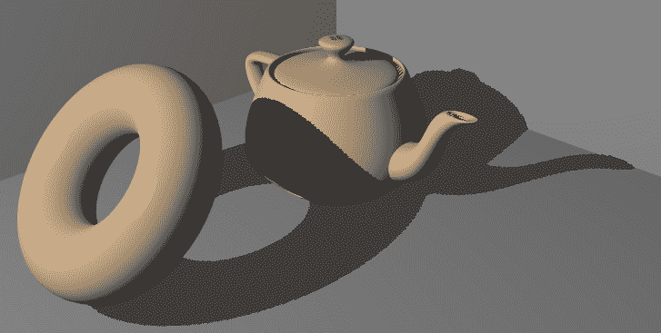

让我们详细查看算法的每个步骤。

第一步是创建阴影图。我们设置视图矩阵，使得我们渲染的场景就像相机位于光源的位置，并且朝向产生阴影的对象。我们设置投影矩阵，使得视图视锥体包围所有可能产生阴影的对象以及阴影将出现的地方。然后我们正常渲染场景，并将深度缓冲区中的信息存储在纹理中。这个纹理被称为阴影图（或简单地称为深度图）。我们可以将其（大致上）视为从光源到各种表面位置的距离集合。

技术上，这些是深度值，而不是距离。深度值不是一个真正的距离（从原点），但在深度测试的目的上可以大致如此处理。

以下图表示了基本阴影映射设置的示例。左侧图显示了光线的位置及其相关的透视视锥体。右侧图显示了相应的阴影图。阴影图中的灰度强度对应于深度值（越暗越近）：

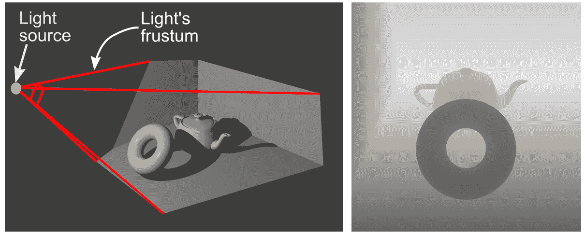

一旦我们创建了阴影图并将该图存储在纹理中，我们再次从相机的视角渲染场景。这次，我们使用一个片段着色器，根据与阴影图的深度测试结果来着色每个片段。首先将片段的位置转换到光源的坐标系中，并使用光源的投影矩阵进行投影。然后结果进行偏置（为了获得有效的纹理坐标）并测试与阴影图。如果片段的深度大于阴影图中存储的深度，那么在片段和光源之间必须有一些表面。因此，该片段处于阴影中，并且仅使用环境光照进行着色。否则，片段必须对光源有清晰的视角，因此它被正常着色。

这里关键的部分是将片段的 3D 坐标转换为适合在阴影图中查找的坐标。由于阴影图只是一个 2D 纹理，我们需要坐标范围从零到一的点，这些点位于光线的视锥体内。光线视图矩阵将世界坐标中的点转换到光线的坐标系中。光线的投影矩阵将视锥体内的点转换到**齐次裁剪坐标**。

这些被称为裁剪坐标，因为当位置在这些坐标中定义时，内置的裁剪功能就会发生。透视（或正交）视锥体内的点通过投影矩阵变换到以原点为中心、每边长度为二的（齐次）空间。这个空间被称为 **规范视体积**。术语 *齐次* 意味着在它们被第四个坐标除之前，这些坐标不一定被认为是真正的笛卡尔位置。有关齐次坐标的详细信息，请参阅您喜欢的计算机图形学教科书。

裁剪坐标中位置的 *x* 和 *y* 分量大致是我们需要访问阴影图的部分。*z* 坐标包含我们可以用于与阴影图比较的深度信息。然而，在我们能够使用这些值之前，我们需要做两件事。首先，我们需要对它们进行偏差，使它们范围从零到一（而不是从 -1 到 1），其次，我们需要应用 **透视除法**（关于这一点稍后讨论）。

要将裁剪坐标的值转换为适合与阴影图一起使用的范围，我们需要将 *x*、*y* 和 *z* 坐标范围从零到一（对于光线视锥体内的点）。存储在 OpenGL 深度缓冲区（以及我们的阴影图中）的深度只是一个介于零到一之间的固定或浮点值（通常是）。零值对应于透视视锥体的近平面，一值对应于远平面上的点。因此，如果我们想用我们的 *z* 坐标与这个深度缓冲区进行准确比较，我们需要适当地缩放和转换它。

在裁剪坐标（经过透视除法后）中，*z* 坐标范围从 -1 到 1。是视口变换（以及其他事情）将深度转换为零到一的范围。顺便提一下，如果需要，我们可以通过 `glDepthRange` 函数配置视口变换，以便使用其他范围（例如 0 到 100）的深度值。

当然，*x* 和 *y* 分量也需要在零到一之间进行偏差，因为这是纹理访问的适当范围。

我们可以使用以下 *偏差* 矩阵来改变我们的裁剪坐标：

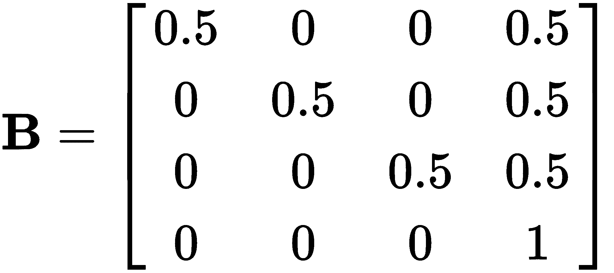

这个矩阵将缩放和转换我们的坐标，使得 *x*、*y* 和 *z* 分量在经过透视除法后范围从 0 到 1。现在，将偏差矩阵与光视图 (*V[l]*) 和投影 (*P[l]*) 矩阵结合起来，我们得到以下方程，用于将世界坐标 (*W*) 中的位置转换为可用于阴影图访问的齐次位置 (*Q*)：

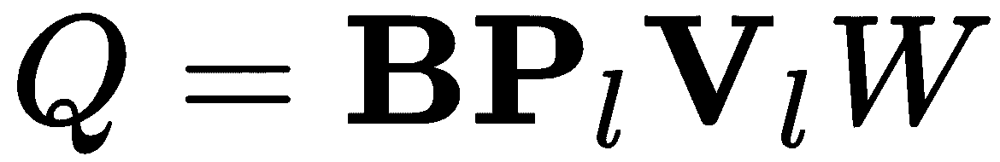

最后，在我们能够直接使用 *Q* 的值之前，我们需要除以第四个 (*w*) 分量。这一步有时被称为 **透视除法**。这会将位置从齐次值转换为真正的笛卡尔位置，并且在使用透视投影矩阵时始终是必需的。

透视除法在光栅化之前由 OpenGL 管道自动执行。然而，由于我们正在处理一个未由管道变换的值，我们需要手动执行除法。

在以下方程中，我们将定义一个包含模型矩阵 (*M*) 的阴影矩阵 (*S*)，这样我们就可以直接从对象坐标 (*C*) 转换（注意 *W = MC*，因为模型矩阵将对象坐标作为世界坐标）：

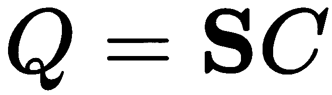

在这里，*S* 是阴影矩阵，是模型矩阵与所有先前矩阵的乘积：

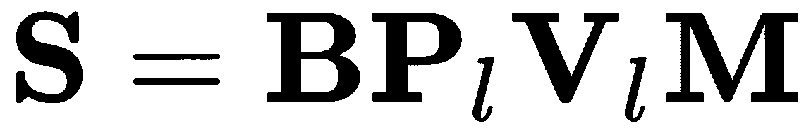

在这个菜谱中，为了保持简单和清晰，我们将只介绍基本的阴影映射算法，而不包括任何通常的改进。我们将在接下来的菜谱中在此基础上构建。在我们进入代码之前，我们应该注意，结果可能不会令人满意。这是因为基本的阴影映射算法存在显著的走样伪影。尽管如此，当与许多抗走样技术之一结合使用时，它仍然是一种有效的技术。我们将在接下来的菜谱中查看一些这些技术。

# 准备工作

位置应在顶点属性零中提供，法线在顶点属性一中提供。应声明并分配 ADS 着色模型的常量变量，以及标准变换矩阵的常量。`ShadowMatrix` 变量应设置为从对象坐标转换为阴影映射坐标的矩阵（前述方程中的 *S*）。

常量变量 `ShadowMap` 是阴影映射纹理的句柄，应分配给纹理单元零。

# 如何做...

要创建一个使用阴影映射技术创建阴影的 OpenGL 应用程序，请执行以下步骤。我们将首先设置一个 **帧缓冲对象** (**FBO**) 来包含阴影映射纹理，然后继续到所需的着色器代码：

1.  在主 OpenGL 程序中，设置一个仅包含深度缓冲区的 FBO。声明一个名为 `shadowFBO` 的 `GLuint` 变量来存储此 `framebuffer` 的句柄。深度缓冲区存储应是一个纹理对象。您可以使用以下类似代码来完成此操作：

```cpp
GLfloat border[]={1.0f,0.0f,0.0f,0.0f}; 

//The shadowmap texture 
GLuint depthTex; 
glGenTextures(1,&depthTex); 
glBindTexture(GL_TEXTURE_2D,depthTex); 
glTexStorage2D(GL_TEXTURE_2D, 1, GL_DEPTH_COMPONENT24, 
               shadowMapWidth, shadowMapHeight); 
glTexParameteri(GL_TEXTURE_2D,GL_TEXTURE_MAG_FILTER, 
                GL_NEAREST); 
glTexParameteri(GL_TEXTURE_2D,GL_TEXTURE_MIN_FILTER, 
                GL_NEAREST); 
glTexParameteri(GL_TEXTURE_2D,GL_TEXTURE_WRAP_S, 
                GL_CLAMP_TO_BORDER); 
glTexParameteri(GL_TEXTURE_2D,GL_TEXTURE_WRAP_T, 
                GL_CLAMP_TO_BORDER); 
glTexParameterfv(GL_TEXTURE_2D,GL_TEXTURE_BORDER_COLOR, 
                 border); 

glTexParameteri(GL_TEXTURE_2D,GL_TEXTURE_COMPARE_MODE, 
                GL_COMPARE_REF_TO_TEXTURE); 
glTexParameteri(GL_TEXTURE_2D,GL_TEXTURE_COMPARE_FUNC, 
                GL_LESS); 

//Assign the shadow map to texture unit 0 
glActiveTexture(GL_TEXTURE0); 
glBindTexture(GL_TEXTURE_2D,depthTex); 

//Create and set up the FBO 
glGenFramebuffers(1,&shadowFBO); 
glBindFramebuffer(GL_FRAMEBUFFER,shadowFBO); 
glFramebufferTexture2D(GL_FRAMEBUFFER,GL_DEPTH_ATTACHMENT, 
                       GL_TEXTURE_2D,depthTex,0); 
GLenum drawBuffers[]={GL_NONE}; 
glDrawBuffers(1,drawBuffers); 
// Revert to the default framebuffer for now 
glBindFramebuffer(GL_FRAMEBUFFER,0); 
```

1.  使用以下代码作为顶点着色器：

```cpp
layout (location=0) in vec3 VertexPosition; 
layout (location=1) in vec3 VertexNormal; 

out vec3 Normal;     
out vec3 Position;    

// Coordinate to be used for shadow map lookup 
out vec4 ShadowCoord; 

uniform mat4 ModelViewMatrix; 
uniform mat3 NormalMatrix; 
uniform mat4 MVP; 
uniform mat4 ShadowMatrix; 

void main() {
    Position = (ModelViewMatrix *  
                vec4(VertexPosition,1.0)).xyz; 
    Normal = normalize( NormalMatrix * VertexNormal ); 

    // ShadowMatrix converts from modeling coordinates 
    // to shadow map coordinates. 
    ShadowCoord =ShadowMatrix * vec4(VertexPosition,1.0); 

    gl_Position = MVP * vec4(VertexPosition,1.0); 
}
```

1.  使用以下代码作为片段着色器：

```cpp
// Declare any uniforms needed for your shading model 
uniform sampler2DShadow ShadowMap; 

in vec3 Position; 
in vec3 Normal; 
in vec4 ShadowCoord; 

layout (location = 0) out vec4 FragColor; 

vec3 diffAndSpec() {
   // Compute only the diffuse and specular components of 
   // the shading model. 
} 

subroutine void RenderPassType(); 
subroutine uniform RenderPassType RenderPass; 

subroutine (RenderPassType) 
void shadeWithShadow() {
  vec3 ambient = ...; // compute ambient component here 
  vec3 diffSpec = diffAndSpec(); 

  // Do the shadow-map look-up 
  float shadow = textureProj(ShadowMap, ShadowCoord); 

  // If the fragment is in shadow, use ambient light only. 
  FragColor = vec4(diffSpec * shadow + ambient, 1.0); 
} 
subroutine (RenderPassType) 
void recordDepth() {
    // Do nothing, depth will be written automatically 
} 

void main() { 
  // This will call either shadeWithShadow or recordDepth 
  RenderPass(); 
} 
```

在主 OpenGL 程序中渲染时，执行以下步骤。对于第一遍：

1.  设置视口、视图和投影矩阵，使其适用于光源。

1.  绑定包含阴影图的`framebuffer`（`shadowFBO`）。

1.  清除深度缓冲区。

1.  选择子例程`recordDepth`函数。

1.  启用正面剔除。

1.  绘制场景。

对于第二次传递：

1.  选择适合场景的视口、视图和投影矩阵。

1.  绑定到默认的 framebuffer。

1.  禁用剔除（或切换到背面剔除）。

1.  选择子例程函数`shadeWithShadow`。

1.  绘制场景。

# 它是如何工作的...

上述代码的第一部分演示了如何为我们的阴影图纹理创建一个 FBO。该 FBO 仅包含一个连接到其深度缓冲区附加的纹理。代码的前几行创建了阴影图纹理。纹理是通过使用具有`GL_DEPTH_COMPONENT24`内部格式的`glTexStorage2D`函数分配的。

我们在这里使用`GL_NEAREST`作为`GL_TEXTURE_MAG_FILTER`和`GL_TEXTURE_MIN_FILTER`，尽管也可以使用`GL_LINEAR`，并且可能提供稍微更好的视觉效果。我们在这里使用`GL_NEAREST`是为了能够清楚地看到锯齿伪影，并且性能会略有提高。

接下来，将`GL_TEXTURE_WRAP_*`模式设置为`GL_CLAMP_TO_BORDER`。当一个片段被发现完全位于阴影图（光线的视锥体之外）之外时，该片段的纹理坐标将大于一或小于零。当这种情况发生时，我们需要确保这些点不被视为处于阴影中。当使用`GL_CLAMP_TO_BORDER`时，从纹理查找返回的值（对于 0-1 范围之外的坐标）将是边界值。默认的边界值是`(0,0,0,0)`。当纹理包含深度分量时，第一个分量被视为深度值。在这里，零值将不起作用，因为零深度对应于近平面上的点。因此，所有位于光视锥体之外的点都将被视为处于阴影中！相反，我们使用`glTexParameterfv`函数将边界颜色设置为`(1,0,0,0)`，这对应于最大可能的深度。

下两个对`glTexParameteri`的调用影响特定于深度纹理的设置。第一个调用将`GL_TEXTURE_COMPARE_MODE`设置为`GL_COMPARE_REF_TO_TEXTURE`。当此设置启用时，纹理访问的结果是比较的结果，而不是从纹理中检索的颜色值。纹理坐标的第三个分量（`p`分量）与纹理中位置`(s,t)`的值进行比较。比较的结果作为一个单精度浮点值返回。所使用的比较函数由`GL_TEXTURE_COMPARE_FUNC`的值确定，该值在下一行设置。在这种情况下，我们将其设置为`GL_LESS`，这意味着如果纹理坐标的`p`值小于存储在`(s,t)`的值，则结果将是`1.0`。（其他选项包括`GL_LEQUAL`、`GL_ALWAYS`、`GL_GEQUAL`等。）

接下来的几行创建并设置了 FBO。使用 `glFramebufferTexture2D` 函数将阴影贴图纹理附加到 FBO 上作为深度附加。有关 FBO 的更多详细信息，请参阅第五章 *渲染到纹理* 的配方，*使用纹理*。

顶点着色器相当简单。它将顶点位置和法线到相机坐标转换，并通过输出变量 `Position` 和 `Normal` 将它们传递到片段着色器。顶点位置也使用 `ShadowMatrix` 转换为阴影贴图坐标。这就是我们在上一节中提到的矩阵 *S*。它将位置从对象坐标转换为阴影坐标。结果通过 `ShadowCoord` 输出变量发送到片段着色器。

与往常一样，位置也被转换为裁剪坐标并分配给内置的 `gl_Position` 输出变量。

在片段着色器中，我们为每个遍历提供不同的功能。在主函数中，我们调用 `RenderPass`，这是一个子例程均匀函数，它将调用 `recordDepth` 或 `shadeWithShadow`。对于第一次遍历（阴影贴图生成），执行 `recordDepth` 子例程函数。这个函数什么都不做！这是因为我们只需要将深度写入深度缓冲区。OpenGL 会自动完成这项工作（假设顶点着色器正确设置了 `gl_Position`），因此片段着色器没有需要执行的操作。

在第二次遍历期间，执行 `shadeWithShadow` 函数。我们计算着色模型的漫反射分量并将其结果存储在 `ambient` 变量中。然后，我们计算漫反射和镜面分量并将它们存储在 `diffuseAndSpec` 变量中。

下一步是阴影映射算法的关键。我们使用内置的 `textureProj` 纹理访问函数来访问 `ShadowMap` 阴影贴图纹理。在用纹理坐标访问纹理之前，`textureProj` 函数会将纹理坐标的前三个分量除以第四个分量。记住，这正是将齐次位置（`ShadowCoord`）转换为真实笛卡尔位置所需要的。

在进行这个视角分割之后，`textureProj` 函数将使用结果来访问纹理。由于这个纹理的采样器类型是 `sampler2DShadow`，它被视为包含深度值的纹理，并且它不是从纹理中返回一个值，而是返回一个比较的结果。`ShadowCoord` 的前两个分量用于访问纹理内的深度值。然后，该值与 `ShadowCoord` 的第三个分量的值进行比较。

当使用类型为 `sampler2DShadow` 的采样器时，我们需要使用 `vec3` 作为查找坐标，因为我们需要一个 2D 位置和一个深度。

当`GL_NEAREST`是插值模式（正如我们案例中那样）时，结果将是`1.0`或`0.0`。由于我们将比较函数设置为`GL_LESS`，这将返回`1.0`，但仅当`ShadowCoord`的第三个分量的值小于在采样位置的深度纹理中的值时。然后将此结果存储在`shadow`变量中。最后，我们将一个值赋给输出变量`FragColor`。阴影图比较的结果（`shadow`）乘以漫反射和镜面反射分量，然后将结果添加到环境分量。如果`shadow`是`0.0`，这意味着比较失败，意味着在片段和光源之间有东西。因此，片段只被环境光着色。否则，`shadow`是`1.0`，片段被所有三个着色分量着色。

在渲染阴影图时，请注意我们剪裁了正面。这是为了避免当正面被包含在阴影图中时可能发生的 z 冲突。请注意，这仅在我们网格完全封闭的情况下有效。如果背面暴露，您可能需要使用另一种技术（使用`glPolygonOffset`）来避免这种情况。我将在下一节中详细谈谈这一点。

# 还有更多...

阴影映射技术存在许多具有挑战性的问题。让我们看看其中最紧迫的几个。

# 混叠

如前所述，此算法在阴影边缘经常出现严重的混叠伪影。这是因为当进行深度比较时，阴影图实际上被投影到场景中。如果投影导致图放大，就会出现混叠伪影。

以下图像显示了阴影边缘的混叠：

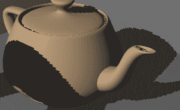

最简单的解决方案是简单地增加阴影图的大小。然而，由于内存、CPU 速度或其他限制，这可能不可行。有许多技术可以提高阴影映射算法产生的阴影质量，例如分辨率匹配阴影图、级联阴影图、方差阴影图、透视阴影图等。在接下来的菜谱中，我们将探讨一些帮助您软化并抗锯齿阴影边缘的方法。

# 仅对阴影图渲染背面

在创建阴影图时，我们只渲染背面。这是因为如果我们渲染正面，某些面上的点将与阴影图的深度几乎相同，这可能导致应该完全照亮的面之间光与影的波动。以下图像显示了这种效果的一个示例：

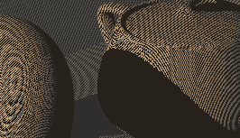

由于导致此问题的面中大多数是面向光源的面，我们通过仅在阴影图传递期间渲染背面来避免大部分问题。当然，这只有在你的网格完全封闭的情况下才能正确工作。如果不是这样，可以使用`glPolygonOffset`来帮助解决这个问题，通过将几何体的深度从阴影图中的深度偏移。实际上，即使在生成阴影图时仅渲染背面，类似的艺术效果也可能出现在远离光源的面上（阴影图中的背面，但摄像机视角的正面）。因此，在生成阴影图时，经常结合正面剔除和`glPolygonOffset`。

# 参见

+   示例代码中的`chapter08/sceneshadowmap.cpp`文件

+   *渲染到纹理*配方在第五章，*使用纹理*

+   *使用 PCF 抗走样阴影边缘*配方

+   *使用随机采样创建软阴影边缘*配方

# 使用 PCF 抗走样阴影边缘

处理阴影边缘走样的一种简单且常见的技术被称为**百分比更近过滤**（**PCF**）。这个名字来源于在片段周围采样区域并确定该区域中靠近光源（在阴影中）的部分所占的百分比。然后，这个百分比被用来缩放片段接收的着色量（漫反射和镜面反射）。整体效果是模糊阴影的边缘。

基本技术最早由 Reeves 等人于 1987 年发表在一篇论文中（*SIGGRAPH 会议录，第 21 卷，第 4 期，1987 年 7 月*）。该概念涉及将片段的扩展范围转换到阴影空间，在该区域内采样几个位置，并计算比片段深度更近的百分比。然后，该结果被用来衰减着色。如果增加此滤波区域的大小，它可以产生模糊阴影边缘的效果。

PCF 算法的一种常见变体仅涉及在阴影图中采样附近固定数量的纹理元素。这些纹理元素中靠近光源的比例被用来衰减阴影的着色。这会产生模糊阴影边缘的效果。虽然结果可能不是物理上准确的，但人眼看起来并不令人反感。

以下图像展示了使用 PCF（右）和不使用 PCF（左）渲染的阴影。注意，右图中的阴影边缘更模糊，走样现象不太明显：

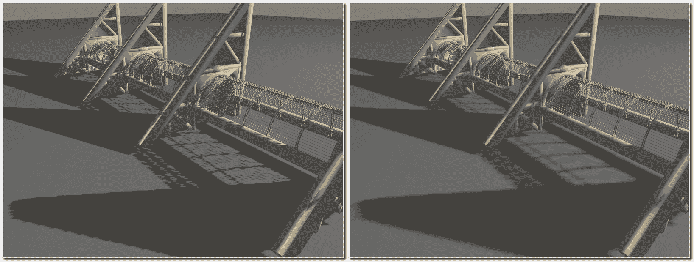

在这个配方中，我们将使用后一种技术，并在阴影图中片段位置周围采样固定数量的纹理元素。我们将计算结果的平均值，并使用该结果来缩放漫反射和镜面反射分量。

我们将利用 OpenGL 对 PCF 的内建支持，通过在深度纹理上使用线性过滤来实现。当使用这种纹理进行线性过滤时，硬件可以自动采样四个附近的纹理元素（执行四个深度比较）并平均结果（这些细节的实现取决于具体实现）。因此，当启用线性过滤时，`textureProj`函数的结果可以在 0.0 和 1.0 之间。

我们还将利用纹理访问偏移的内建函数。OpenGL 提供了`textureProjOffset`纹理访问函数，它有一个第三个参数（偏移量），在查找/比较之前添加到纹理元素坐标中。

# 准备工作

从之前*使用阴影图渲染阴影*配方中提供的着色器和 FBO 开始。我们只需对那里展示的代码进行一些小的修改。

# 如何实现...

要将 PCF 技术添加到阴影映射算法中，请按照以下步骤操作：

1.  在设置阴影图 FBO 时，确保使用线性过滤在深度纹理上。用以下代码替换相应的行：

```cpp
glTexParameteri(GL_TEXTURE_2D, GL_TEXTURE_MAG_FILTER,  
                GL_LINEAR); 
glTexParameteri(GL_TEXTURE_2D, GL_TEXTURE_MIN_FILTER,      
                GL_LINEAR); 
```

1.  在片段着色器中的`shadeWithShadow`函数中，使用以下代码：

```cpp
subroutine (RenderPassType) 
void shadeWithShadow() {
  vec3 ambient = vec3(0.2); 
  vec3 diffSpec = diffAndSpec(); 

  // The sum of the comparisons with nearby texels 
  float sum = 0; 

  // Sum contributions from texels around ShadowCoord 
  sum += textureProjOffset(ShadowMap, ShadowCoord,  
                           ivec2(-1,-1)); 
  sum += textureProjOffset(ShadowMap, ShadowCoord,  
                           ivec2(-1,1)); 
  sum += textureProjOffset(ShadowMap, ShadowCoord,  
                           ivec2(1,1)); 
  sum += textureProjOffset(ShadowMap, ShadowCoord,  
                           ivec2(1,-1)); 
  float shadow = sum * 0.25; 

  FragColor = vec4(ambient + diffSpec * shadow,1.0); 
} 
```

# 它是如何工作的...

第一步是在阴影图纹理上启用线性过滤。当启用时，OpenGL 驱动程序可以在纹理内重复四个附近的纹理元素的深度比较。四个比较的结果将被平均并返回。

在片段着色器中，我们使用`textureProjOffset`函数来采样围绕`ShadowCoord`最近的纹理元素（对角线方向）的四个纹理元素。第三个参数是偏移量。在查找发生之前，它被添加到纹理元素的坐标（而不是纹理坐标）中。

由于启用了线性过滤，每次查找都会采样额外的四个纹理元素，总共 16 个纹理元素。然后将结果平均并存储在变量 shadow 中。

如前所述，`shadow`的值用于衰减光照模型的漫反射和镜面反射分量。

# 还有更多...

Pixar 的 Fabio Pellacini 撰写了一份关于 PCF 技术的优秀调查报告，可以在由 Randima Fernando 编辑的《GPU Gems》的第十一章*阴影图抗锯齿*中找到，Addison-Wesley Professional，2004 年。如果需要更多细节，我强烈推荐阅读这一章，虽然篇幅不长，但信息丰富。

由于其简单性和效率，PCF 技术是抗锯齿由阴影映射产生的阴影边缘的极其常见的方法。由于它具有模糊边缘的效果，它也可以用来模拟柔和的阴影。然而，必须随着模糊边缘（半影）的大小增加样本数量，以避免某些伪影。这当然可能成为计算上的障碍。在下一个配方中，我们将探讨一种通过随机采样更大区域来产生柔和阴影的技术。

半影是阴影区域中只有部分光源被遮挡的部分。

# 参见

+   示例代码中的`chapter08/scenepcf.cpp`文件

+   *使用阴影图渲染阴影*的食谱

# 使用随机采样创建软阴影边缘

基本的阴影映射算法与 PCF 结合可以产生具有软边缘的阴影。然而，如果我们希望具有较大宽度（以近似真实软阴影）的模糊边缘，则需要大量的样本。此外，当着色位于大阴影中心或完全在阴影之外的片段时，会有大量的无效工作量。对于这些片段，所有附近的阴影图纹理单元都将评估为相同的值。因此，访问和平均这些纹理单元的工作基本上是无效的。

本食谱中介绍的技术基于由 Matt Pharr 和 Randima Fernando 编辑的*GPU Gems 2*中出版的一章，Addison-Wesley Professional，2005 年。（第十七章由 Yury Uralsky 撰写。）它提供了一种方法，可以解决上述两个问题，以创建具有各种宽度的软边缘阴影，同时避免在阴影内部和外部区域不必要的纹理访问。

基本思想如下：

+   我们不是使用一组固定的偏移量在片段位置（阴影图空间）周围采样纹理单元，而是使用随机的圆形偏移模式。

+   此外，我们首先对圆的边缘进行采样，以确定片段是否位于完全在阴影内部或外部的区域

以下图表是可能的阴影图样本集的可视化。十字准线的中心是片段在阴影图中的位置，每个**x**是一个样本。样本在围绕片段位置的圆形网格内随机分布（每个网格单元一个样本）：

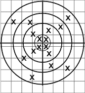

此外，我们通过一组预计算的样本模式来改变样本位置。我们在渲染之前计算随机样本偏移并将其存储在纹理中。然后，在片段着色器中，首先通过访问偏移纹理来获取一组偏移量，并使用这些偏移量来改变片段在阴影图中的位置。结果以类似于基本 PCF 算法的方式平均在一起。以下图表显示了使用 PCF 算法（左）和本食谱中描述的随机采样技术（右）产生的阴影之间的差异：

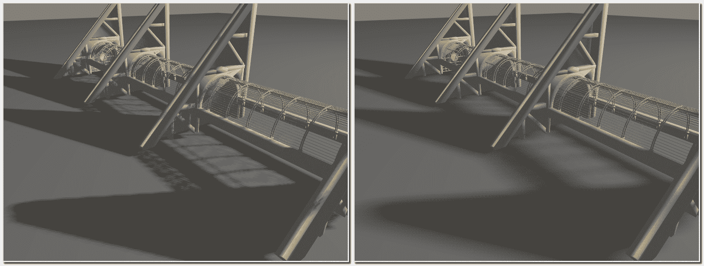

我们将偏移量存储在一个三维纹理中（*n* x *n* x *d*）。前两个维度的大小是任意的，第三个维度包含偏移量。每个（*s*,*t*）位置包含一个大小为*d*的随机偏移量列表，这些偏移量打包成一个 RGBA 颜色。纹理中的每个 RGBA 颜色包含两个 2D 偏移量。*R*和*G*通道包含第一个偏移量，而*B*和*A*通道包含第二个。因此，每个（*s*,*t*）位置包含总共*2*d*个偏移量。

例如，位置（1, 1, 3）包含位置（1,1）的第六个和第七个偏移量。给定（*s*,*t*）处的所有值构成一个完整的偏移量集。我们将根据片段的屏幕坐标旋转纹理。偏移纹理中的位置将由屏幕坐标除以纹理大小的余数确定。例如，如果片段的坐标是（10.0,10.0）且纹理的大小是（4,4），那么我们使用位于偏移纹理位置（2,2）的偏移量集。

# 准备工作

从*使用阴影图渲染阴影*配方中提供的代码开始。需要设置三个额外的统一变量。它们如下：

+   `OffsetTexSize`：这给出了偏移纹理的宽度、高度和深度。注意，深度与每个片段的样本数除以二相同。

+   `OffsetTex`：这是包含偏移纹理的纹理单元的句柄。

+   `Radius`：这是以像素为单位的模糊半径除以阴影图纹理的大小（假设是正方形阴影图）。这可以被认为是阴影的柔和度。

# 如何操作...

要修改阴影映射算法并使用这种随机采样技术，请执行以下步骤。我们将在主 OpenGL 程序中构建偏移纹理，并在片段着色器中使用它：

1.  在主 OpenGL 程序中使用以下代码创建偏移纹理。这只需要在程序初始化期间执行一次：

```cpp
void buildOffsetTex(int size, int samplesU, int samplesV) {
  int samples = samplesU * samplesV; 
  int bufSize = size * size * samples * 2; 
  float *data = new float[bufSize]; 

  for( int i = 0; i< size; i++ ) { 
    for(int j = 0; j < size; j++ ) { 
      for( int k = 0; k < samples; k += 2 ) { 
        int x1,y1,x2,y2; 
        x1 = k % (samplesU); 
        y1 = (samples - 1 - k) / samplesU; 
        x2 = (k+1) % samplesU; 
        y2 = (samples - 1 - k - 1) / samplesU; 

        glm::vec4 v; 
        // Center on grid and jitter 
        v.x = (x1 + 0.5f) + jitter(); 
        v.y = (y1 + 0.5f) + jitter(); 
        v.z = (x2 + 0.5f) + jitter(); 
        v.w = (y2 + 0.5f) + jitter(); 
        // Scale between 0 and 1 
        v.x /= samplesU; 
        v.y /= samplesV; 
        v.z /= samplesU; 
        v.w /= samplesV; 
        // Warp to disk 
        int cell = ((k/2) * size * size + j *  
                    size + i) * 4; 
        data[cell+0] = glm::sqrt(v.y) * glm::cos(glm::two_pi<float>
        ()*v.x); 
        data[cell+1] = glm::sqrt(v.y) * glm::sin(glm::two_pi<float>
        ()*v.x); 
        data[cell+2] = glm::sqrt(v.w) * glm::cos(glm::two_pi<float>
        ()*v.z); 
        data[cell+3] = glm::sqrt(v.w) * glm::sin(glm::two_pi<float>
        ()*v.z); 
      } 
    } 
  } 

  glActiveTexture(GL_TEXTURE1); 
  GLuint texID; 
  glGenTextures(1, &texID); 

  glBindTexture(GL_TEXTURE_3D, texID); 
  glTexStorage3D(GL_TEXTURE_3D, 1, GL_RGBA32F, size, size, 
                 samples/2); 
  glTexSubImage3D(GL_TEXTURE_3D, 0, 0, 0, 0, size, size,  
                 samples/2, GL_RGBA, GL_FLOAT, data); 
  glTexParameteri(GL_TEXTURE_3D, GL_TEXTURE_MAG_FILTER,  
                    GL_NEAREST); 
  glTexParameteri(GL_TEXTURE_3D, GL_TEXTURE_MIN_FILTER,  
                    GL_NEAREST); 

  delete [] data; 
} 

// Return random float between -0.5 and 0.5 
float jitter() { 
  static std::default_random_engine generator;
  static std::uniform_real_distribution<float> distrib(-0.5f, 0.5f); 
  return distrib(generator); 
}
```

1.  将以下统一变量添加到片段着色器中：

```cpp
uniform sampler3D OffsetTex; 
uniform vec3 OffsetTexSize; // (width, height, depth) 
uniform float Radius;
```

1.  在片段着色器中使用以下代码为`shadeWithShadow`函数：

```cpp
subroutine (RenderPassType) 
void shadeWithShadow() {
  vec3 ambient = vec3(0.2); 
  vec3 diffSpec = diffAndSpec(); 

  ivec3 offsetCoord; 
  offsetCoord.xy = ivec2( mod( gl_FragCoord.xy,  
                         OffsetTexSize.xy ) ); 

  float sum = 0.0; 
  int samplesDiv2 = int(OffsetTexSize.z); 
  vec4 sc = ShadowCoord; 

  for( int i = 0 ; i< 4; i++ ) { 
    offsetCoord.z = i; 
    vec4 offsets = texelFetch(OffsetTex,offsetCoord,0) *  
                       Radius * ShadowCoord.w; 

    sc.xy = ShadowCoord.xy + offsets.xy; 
    sum += textureProj(ShadowMap, sc); 
    sc.xy = ShadowCoord.xy + offsets.zw; 
    sum += textureProj(ShadowMap, sc); 
  } 
  float shadow = sum / 8.0; 

  if( shadow != 1.0 && shadow != 0.0 ) { 
    for( int i = 4; i< samplesDiv2; i++ ) { 
      offsetCoord.z = i; 
      vec4 offsets =  
        texelFetch(OffsetTex, offsetCoord,0) * 
                   Radius * ShadowCoord.w; 

      sc.xy = ShadowCoord.xy + offsets.xy; 
      sum += textureProj(ShadowMap, sc); 
      sc.xy = ShadowCoord.xy + offsets.zw; 
      sum += textureProj(ShadowMap, sc); 
    } 
    shadow = sum / float(samplesDiv2 * 2.0); 
  } 
  FragColor = vec4(diffSpec * shadow + ambient, 1.0); 
}
```

# 工作原理...

`buildOffsetTex`函数创建我们的随机偏移量的三维纹理。第一个参数`texSize`定义了纹理的宽度和高度。为了创建前面的图像，我使用了`8`的值。第二个和第三个参数`samplesU`和`samplesV`定义了`u`和`v`方向上的样本数。我分别使用了`4`和`8`，总共 32 个样本。`u`和`v`方向是任意轴，用于定义偏移量的网格。为了理解这一点，请看以下图表：

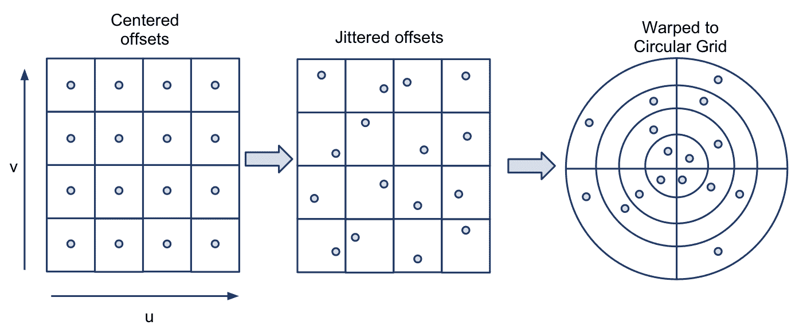

偏移量最初被定义为位于大小为`samplesU` x `samplesV`（前图中为 4 x 4）的网格中心。偏移量的坐标被缩放，使得整个网格适合单位立方体（边长`1`），原点位于左下角。然后，每个样本从其位置随机抖动到网格单元内的随机位置。最后，抖动的偏移量被扭曲，使其围绕原点并位于右侧所示的圆形网格内。

最后一步可以通过使用*v*坐标作为原点的距离，以及使用*u*坐标作为从 0 到 360 度缩放的角来实现。以下方程应该可以做到这一点：

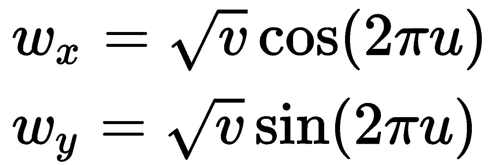

在这里，*w*是扭曲坐标。我们剩下的是一组围绕原点的偏移量，其最大距离为 1.0。此外，我们还生成数据，使得第一个样本是围绕圆的外边缘的样本，向内移动到中心。这将帮助我们避免在完全在阴影内部或外部工作时进行过多的采样。

当然，我们也以这种方式打包样本，使得单个 texel 包含两个样本。这并非绝对必要，但这样做是为了节省内存空间。然而，这确实使得代码变得更加复杂。

在片段着色器中，我们首先分别计算阴影模型的漫反射和镜面反射分量之外的漫反射分量。我们根据片段的屏幕坐标（`gl_FragCoord`）访问偏移量纹理。我们这样做是通过取片段位置和偏移量纹理大小的模。结果是存储在`offsetCoord`的前两个分量中。这将为我们提供每个附近像素的不同偏移量集。`offsetCoord`的第三个分量将用于访问一对样本。样本的数量是纹理深度除以二。这存储在`samplesDiv2`中。我们使用`texelFetch`函数访问样本。这个函数允许我们使用整数 texel 坐标而不是通常的 0-1 范围内的归一化纹理坐标来访问 texel。

偏移量被检索并乘以`Radius`以及`ShadowCoord`的`w`分量。乘以`Radius`只是简单地缩放偏移量，使其范围从`0.0`到`Radius`。通常，我们希望半径代表纹理空间中的一个小区域，因此像`5/width`（其中`width`是阴影图的宽度）这样的值是合适的。我们乘以`w`分量，因为`ShadowCoord`仍然是一个齐次坐标，我们的目标是使用偏移量来平移`ShadowCoord`。为了正确地做到这一点，我们需要将偏移量乘以`w`分量。另一种思考方式是，当进行透视除法时，`w`分量将被消除。

接下来，我们使用偏移来转换`ShadowCoord`并访问阴影图，使用`textureProj`进行深度比较。我们对存储在 texel 中的两个样本都这样做，一次用于偏移的前两个分量，再次用于后两个分量。结果被添加到`sum`中。

第一个循环对前八个样本重复此操作。如果前八个样本都是`0.0`或`1.0`，则我们假设所有样本都将相同（样本区域完全在或不在阴影中）。在这种情况下，我们跳过其余样本的评估。否则，我们评估后续样本并计算整体平均值。最后，得到的平均值（阴影）用于衰减光照模型的漫反射和镜面反射分量。

# 还有更多...

使用包含一组随机偏移的小纹理可以帮助比使用具有恒定偏移集的标准 PCF 技术更好地模糊阴影边缘。然而，由于纹理是有限的，偏移每几个像素就会重复，因此在阴影边缘仍可能出现重复图案的伪影。我们可以通过在片段着色器中也使用偏移的随机旋转来改进这一点，或者简单地计算着色器内的随机偏移。

还应注意的是，这种边缘模糊可能并不适用于所有阴影边缘。例如，直接相邻于遮挡物、即产生阴影的边缘不应被模糊。这些可能并不总是可见的，但在某些情况下可能会变得可见，例如当遮挡物是一个窄物体时。这种效果是使物体看起来像是在表面上方悬浮。不幸的是，对此并没有简单的解决方案。

# 参见

+   示例代码中的`chapter08/scenejitter.cpp`文件

+   *使用阴影图渲染阴影*的配方

# 使用阴影体积和几何着色器创建阴影

正如我们在前面的配方中发现的，阴影图的主要问题之一是走样。这个问题本质上归结为这样一个事实：我们在渲染场景时，对阴影图（图）的采样频率（分辨率）与我们使用的频率不同。为了最小化走样，我们可以模糊阴影边缘（如前述配方所示），或者尝试以更接近投影屏幕空间中相应分辨率的频率采样阴影图。有许多技术有助于后者；有关更多详细信息，我推荐阅读《实时阴影》这本书。

用于阴影生成的另一种技术称为**阴影体积**。阴影体积方法完全避免了困扰阴影图的走样问题。使用阴影体积，你可以得到像素完美的硬阴影，而没有阴影图中的走样伪影。以下图像显示了使用阴影体积技术生成的阴影场景：

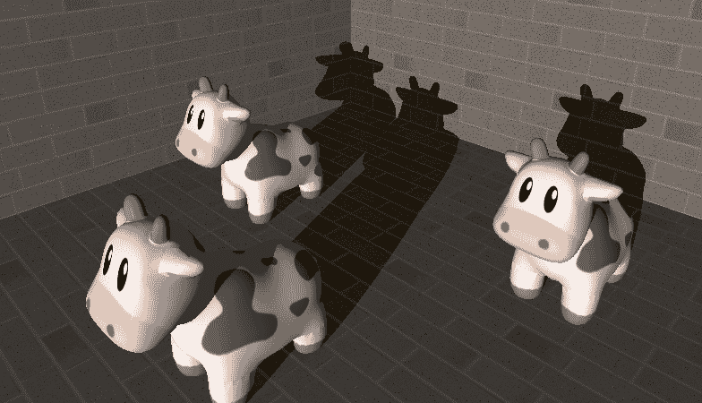

阴影体积技术通过使用模板缓冲区来屏蔽阴影区域来工作。我们通过绘制实际阴影体积的边界（更多内容将在下文中介绍）来实现这一点。阴影体积是光源被物体遮挡的空间区域。例如，以下图表显示了三角形（左侧）和球体（右侧）的阴影体积表示：

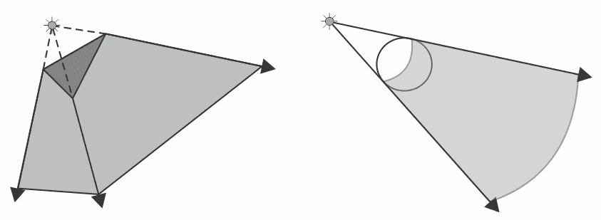

阴影体积的边界由通过将物体的边缘延伸到光源形成的四边形组成。对于一个单独的三角形，边界将包括从每个边缘延伸出的三个四边形，以及每个端点的三角形盖。一个盖是三角形本身，另一个放置在离光源一定距离的地方。对于由许多三角形组成的物体，例如前面的球体，体积可以通过所谓的**轮廓边缘**来定义。这些是位于或接近阴影体积与被光照物体部分之间的边。一般来说，轮廓边缘与一个面向光源的三角形和另一个背向光源的三角形相邻。要绘制阴影体积，需要找到所有的轮廓边缘并为每个边缘绘制扩展的四边形。体积的盖可以通过创建一个包含所有轮廓边缘点的闭合多边形（或三角形扇）来确定，同样在体积的远端也是如此。

阴影体积技术的工作方式如下。想象一条从相机位置发出并穿过近平面上的一个像素的射线。假设我们跟随那条射线并跟踪一个计数器，每次它进入阴影体积时计数器增加，每次它离开阴影体积时计数器减少。如果我们停止计数直到碰到表面，那么如果我们的计数非零，该表面的点被遮挡（在阴影中），否则，该表面被光源照亮。以下图表展示了这个想法的一个例子：

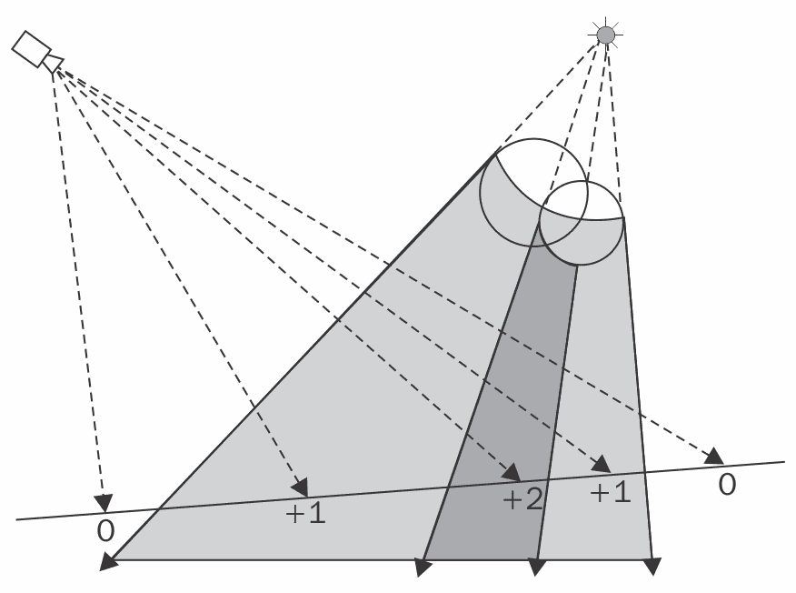

大约水平的线代表一个正在接收阴影的表面。数字代表每个相机射线的计数器。例如，最右侧的射线值为**+1**，因为这个值是因为射线在从相机到表面的过程中进入了两个体积并离开了一个体积：*1 + 1 - 1 = 1*。最右侧的射线在表面上的值为**0**，因为它进入了并离开了两个阴影体积：*1 + 1 - 1 - 1 = 0*。

理论上听起来不错，但我们如何在 OpenGL 中追踪光线？好消息是，我们不必这样做。模板缓冲区正好提供了我们所需要的东西。使用模板缓冲区，我们可以根据是否将正面或背面渲染到每个像素中来增加/减少每个像素的计数器。因此，我们可以绘制所有阴影体积的边界，然后对于每个像素，当正面渲染到该像素时增加模板缓冲区的计数器，当它是背面时减少。

关键在于意识到渲染图像中的每个像素代表一个视线（如前图所示）。因此，对于给定的像素，模板缓冲区中的值就是我们实际通过该像素追踪光线时得到的值。深度测试有助于在达到表面时停止追踪。

这只是一个关于阴影体积的快速介绍；完整的讨论超出了本书的范围。更多细节，可以参考 Eisemann 等人所著的*实时阴影*。

在这个配方中，我们将使用几何着色器绘制阴影体积。而不是在 CPU 端计算阴影体积，我们将正常渲染几何体，并让几何着色器生成阴影体积。在第七章的*使用几何和细分着色器*配方中，我们看到了几何着色器如何为每个三角形提供相邻信息。有了相邻信息，我们可以确定三角形是否有轮廓边缘。如果一个三角形面向光源，而相邻的三角形背向光源，那么共享的边可以被认为是轮廓边缘，并用于创建阴影体积的多边形。

整个过程分为三个步骤。具体如下：

1.  正常渲染场景，但将着色后的颜色写入两个独立的缓冲区。我们将存储环境分量在一个缓冲区中，而将漫反射和镜面分量在另一个缓冲区中。

1.  设置模板缓冲区，使得模板测试始终通过，正面导致增加，背面导致减少。使深度缓冲区为只读，并仅渲染投射阴影的对象。在这个过程中，几何着色器将生成阴影体积，并且只有阴影体积将被渲染到片段着色器中。

1.  设置模板缓冲区，使得当值为零时测试成功。绘制一个填充整个屏幕的四边形，并在模板测试成功时将第一步中两个缓冲区的值合并。

这只是一个高级视图，其中有很多细节。让我们在下一节中逐一介绍。

# 准备工作

我们将首先创建我们的缓冲区。我们将使用一个具有深度附加组件和两个颜色附加组件的帧缓冲对象。环境分量可以存储在渲染缓冲区中（而不是纹理），因为我们将其快速复制（复制）到默认帧缓冲区，而不是作为纹理读取它。*漫反射+镜面反射*分量将存储在纹理中。

创建环境缓冲区（`ambBuf`）、深度缓冲区（`depthBuf`）和纹理（`diffSpecTex`），然后设置 FBO：

```cpp
glGenFramebuffers(1, &colorDepthFBO); 
glBindFramebuffer(GL_FRAMEBUFFER, colorDepthFBO); 
glFramebufferRenderbuffer(GL_FRAMEBUFFER, GL_DEPTH_ATTACHMENT,  
                          GL_RENDERBUFFER, depthBuf); 
glFramebufferRenderbuffer(GL_FRAMEBUFFER, GL_COLOR_ATTACHMENT0,  
                          GL_RENDERBUFFER, ambBuf); 
glFramebufferTexture2D(GL_FRAMEBUFFER, GL_COLOR_ATTACHMENT1,  
                       GL_TEXTURE_2D, diffSpecTex, 0); 
```

设置绘制缓冲区，以便我们可以写入颜色附加组件：

```cpp
GLenum drawBuffers[] = {GL_COLOR_ATTACHMENT0,  
                        GL_COLOR_ATTACHMENT1}; 
glDrawBuffers(2, drawBuffers); 
```

# 如何实现...

对于第一次遍历，启用我们之前设置的帧缓冲对象，并正常渲染场景。在片段着色器中，将环境分量和*漫反射+镜面反射*分量发送到不同的输出：

```cpp
layout( location = 0 ) out vec4 Ambient; 
layout( location = 1 ) out vec4 DiffSpec; 

void shade( ) {
  // Compute the shading model, and separate out the ambient 
  // component. 
  Ambient = ...;   // Ambient 
  DiffSpec = ...;  // Diffuse + specular 
} 
void main() { shade(); } 
```

在第二次遍历中，我们将渲染我们的阴影体积。我们希望设置模板缓冲区，使得测试总是成功，并且正面导致增加，背面导致减少：

```cpp
glClear(GL_STENCIL_BUFFER_BIT); 
glEnable(GL_STENCIL_TEST); 
glStencilFunc(GL_ALWAYS, 0, 0xffff); 
glStencilOpSeparate(GL_FRONT, GL_KEEP, GL_KEEP, GL_INCR_WRAP); 
glStencilOpSeparate(GL_BACK, GL_KEEP, GL_KEEP, GL_DECR_WRAP);
```

在这个遍历中，我们还想使用第一次遍历的深度缓冲区，但我们想使用默认的帧缓冲区，因此我们需要从第一次遍历中使用的 FBO 复制深度缓冲区。我们还将复制颜色数据，其中应包含环境分量：

```cpp
glBindFramebuffer(GL_READ_FRAMEBUFFER, colorDepthFBO);  
glBindFramebuffer(GL_DRAW_FRAMEBUFFER,0); 
glBlitFramebuffer(0,0,width,height,0,0,width,height, 
           GL_DEPTH_BUFFER_BIT|GL_COLOR_BUFFER_BIT, GL_NEAREST); 
```

我们不希望在这次遍历中写入深度缓冲区或颜色缓冲区，因为我们的唯一目标是更新模板缓冲区，所以我们将禁用对这些缓冲区的写入：

```cpp
glColorMask(GL_FALSE, GL_FALSE, GL_FALSE, GL_FALSE);  
glDepthMask(GL_FALSE); 
```

接下来，我们使用相邻信息渲染产生阴影的对象。在几何着色器中，我们确定轮廓边缘，并只输出定义阴影体积边界的四边形：

```cpp
layout( triangles_adjacency ) in; 
layout( triangle_strip, max_vertices = 18 ) out; 

in vec3 VPosition[]; 
in vec3 VNormal[]; 

uniform vec4 LightPosition;  // Light position (eye coords) 
uniform mat4 ProjMatrix;     // Proj. matrix (infinite far plane) 

bool facesLight( vec3 a, vec3 b, vec3 c ) {
  vec3 n = cross( b - a, c - a ); 
  vec3 da = LightPosition.xyz - a; 
  vec3 db = LightPosition.xyz - b; 
  vec3 dc = LightPosition.xyz - c; 
  return dot(n, da) > 0 || dot(n, db) > 0 || dot(n, dc) > 0;  
} 

void emitEdgeQuad( vec3 a, vec3 b ) { 
  gl_Position = ProjMatrix * vec4(a, 1); 
  EmitVertex();   
  gl_Position = ProjMatrix * vec4(a - LightPosition.xyz, 0); 
  EmitVertex(); 
  gl_Position = ProjMatrix * vec4(b, 1); 
  EmitVertex(); 
  gl_Position = ProjMatrix * vec4(b - LightPosition.xyz, 0); 
  EmitVertex(); 
  EndPrimitive(); 
} 

void main() {
  if( facesLight(VPosition[0], VPosition[2], VPosition[4]) ) { 
    if( ! facesLight(VPosition[0],VPosition[1],VPosition[2]) )  
       emitEdgeQuad(VPosition[0],VPosition[2]); 
    if( ! facesLight(VPosition[2],VPosition[3],VPosition[4]) )  
       emitEdgeQuad(VPosition[2],VPosition[4]); 
    if( ! facesLight(VPosition[4],VPosition[5],VPosition[0]) )  
       emitEdgeQuad(VPosition[4],VPosition[0]); 
  } 
} 
```

在第三次遍历中，我们将设置我们的模板缓冲区，使得测试仅在缓冲区中的值等于零时通过：

```cpp
glStencilFunc(GL_EQUAL, 0, 0xffff); 
glStencilOp(GL_KEEP, GL_KEEP, GL_KEEP); 
```

我们希望启用混合，以便当模板测试成功时，我们的环境分量与*漫反射+镜面反射*结合：

```cpp
glEnable(GL_BLEND);           
glBlendFunc(GL_ONE,GL_ONE); 
```

在这次遍历中，我们只绘制一个填充屏幕的四边形，并输出*漫反射+镜面反射*值。如果模板测试成功，该值将与环境分量结合，该分量已经在缓冲区中（我们之前使用`glBlitFramebuffer`复制过来）：

```cpp
layout(binding = 0) uniform sampler2D DiffSpecTex; 
layout(location = 0) out vec4 FragColor; 

void main() { 
  vec4 diffSpec = texelFetch(DiffSpecTex, ivec2(gl_FragCoord), 0); 
  FragColor = vec4(diffSpec.xyz, 1); 
} 
```

# 它是如何工作的...

第一次遍历相当直接。我们正常绘制整个场景，除了我们将环境颜色与漫反射和镜面反射颜色分开，并将结果发送到不同的缓冲区。

第二次遍历是算法的核心。在这里，我们只渲染产生阴影的对象，并让几何着色器生成阴影体积。多亏了几何着色器，我们实际上并没有渲染产生阴影的对象，而只是渲染了阴影体积。然而，在这个遍历之前，我们需要做一些设置。我们使用`glStencilOpSeparate`设置模板测试，以便在渲染前表面时递增，在渲染后表面时递减，并且使用`glStencilFunc`配置模板测试始终成功。我们还使用`glBlitFramebuffer`将深度缓冲区和（环境）颜色缓冲区从第一次遍历中使用的 FBO 复制过来。由于我们只想渲染不被几何体遮挡的阴影体积，我们使用`glDepthMask`使深度缓冲区只读。最后，我们使用`glColorMask`禁用颜色缓冲区的写入，因为我们不希望在这个遍历中错误地覆盖任何内容。

几何着色器负责生成轮廓阴影体积。由于我们正在使用邻接信息进行渲染（参见第七章中关于使用几何和细分着色器的配方“使用几何着色器绘制轮廓线”，[fab663d4-e210-417c-aa3b-2c4c307ec913.xhtml]，*使用几何和细分着色器*），几何着色器可以访问定义当前正在渲染的三角形及其三个相邻三角形的六个顶点。顶点编号从 0 到 5，在本例中通过名为`VPosition`的输入数组提供。顶点 0、2 和 4 定义当前三角形，其余的顶点定义相邻的三角形，如下面的图所示：

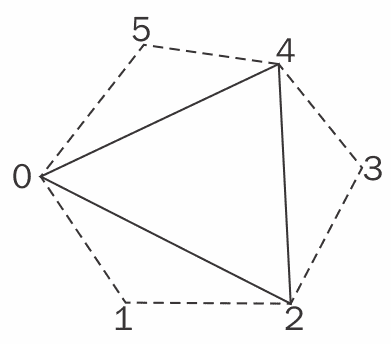

几何着色器首先测试主三角形（**0**，**2**，**4**）是否面向光源。我们通过计算三角形的法线（`n`）和每个顶点到光源的向量来完成。然后，我们计算 n 与每个光源方向向量（`da`，`db`，和`dc`）的点积。如果这三个中的任何一个为正，则三角形面向光源。如果我们发现三角形（**0**，**2**，**4**）面向光源，那么我们就以相同的方式测试相邻的每个三角形。如果一个相邻的三角形不面向光源，那么它们之间的边就是轮廓边，可以用作阴影体积的面的边。

我们在`emitEdgeQuad`函数中创建一个阴影体积面。点`a`和`b`定义了轮廓边缘，阴影体积面的一个边缘。面的其他两个顶点通过从光源延伸`a`和`b`来确定。在这里，我们使用一个由齐次坐标启用的数学技巧。我们通过在扩展顶点的`w`坐标中使用零来将面延伸到无穷远。这实际上定义了一个齐次向量，有时称为无穷远点。`x`、`y`和`z`坐标定义了一个指向光源方向上的向量，而`w`值被设置为`0`。最终结果是，我们得到了一个延伸到无穷远、远离光源的四边形。

这只会在我们使用一个可以考虑到以这种方式定义的点的修改后的投影矩阵时才能正常工作。本质上，我们想要一个远平面设置为无穷远的投影矩阵。GLM 通过`infinitePerspective`函数提供了这样的投影矩阵。

我们在这里不需要担心绘制阴影体积的端盖。我们不需要远端的端盖，因为我们已经使用了之前描述的齐次技巧，物体本身将作为近端的端盖。

在第三次也是最后一次遍历中，我们使用`glStencilFunc`将模板测试重置为当模板缓冲区中的值等于零时通过。在这里，当模板测试成功时，我们希望将环境光与*漫反射+镜面反射*颜色相加，因此我们启用混合，并将源和目标混合函数设置为`GL_ONE`。我们只渲染一个填充整个屏幕的四边形，并输出包含我们的*漫反射+镜面反射*颜色的纹理中的值。模板测试将负责丢弃处于阴影中的片段，OpenGL 的混合支持将输出与通过测试的片段的环境光混合。（记住，我们之前使用`glBlitFramebuffer`复制了环境光。）

# 还有更多...

这里描述的技术通常被称为**Z-pass 技术**。它有一个致命的缺陷。如果相机位于阴影体积内，这种技术就会失效，因为模板缓冲区中的计数至少会错一位。一个常见的解决方案是基本上反转问题，并从无穷远处向视点追踪一条射线。这被称为**Z-fail 技术**或**Carmack 的逆向**。

这里的*失败*和*通过*指的是在深度测试通过或失败时我们是否进行计数。

使用 Z-fail 时必须小心，因为绘制阴影体积的端盖非常重要。然而，这种技术与 Z-pass 非常相似。不是在深度测试通过时递增/递减，而是在深度测试失败时递增/递减。这实际上*追踪*了一条从无穷远处向视点回溯的射线。

我还应该指出，前面的代码不足以处理退化三角形（边几乎平行的三角形）或非封闭网格。在这种情况下可能需要小心处理。例如，为了更好地处理退化三角形，我们可以使用另一种确定三角形法向量的技术。我们还可以添加额外的代码来处理网格的边，或者简单地始终使用封闭网格。

# 参见

+   示例代码中的`chapter08/sceneshadowvolume.cpp`文件

+   在第七章的*使用几何着色器绘制轮廓线**配方中，*使用几何和细分着色器*
