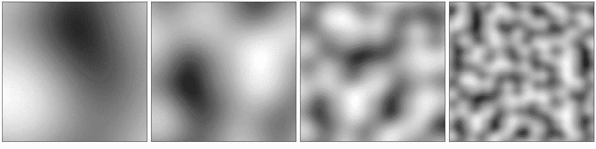
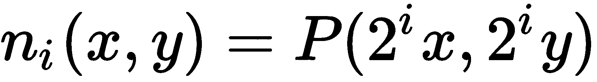
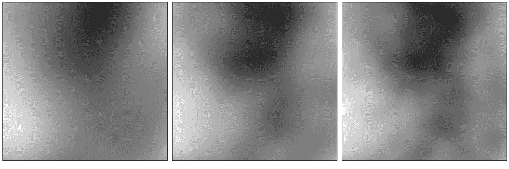
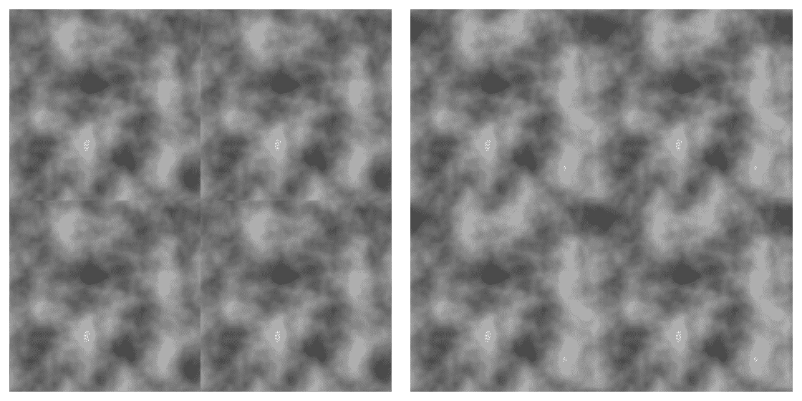
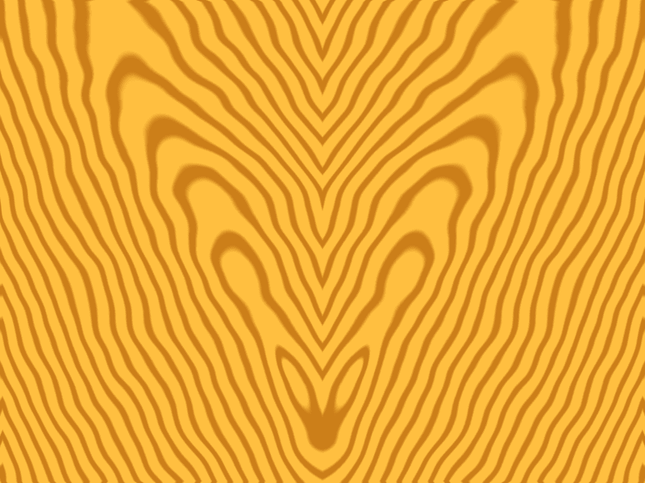
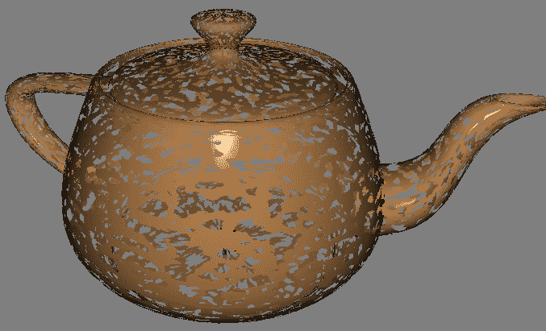
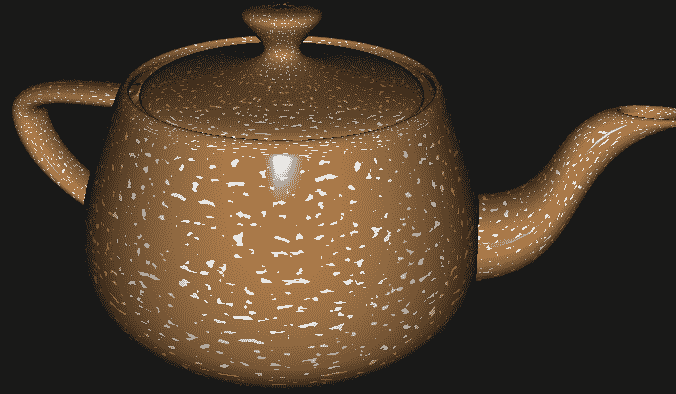
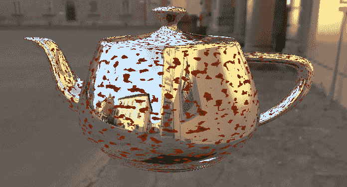
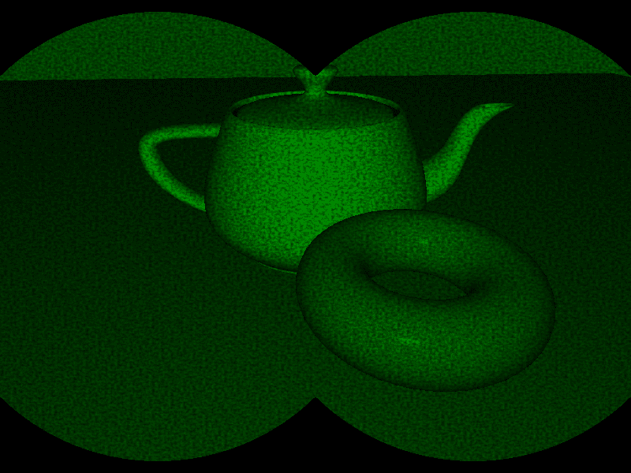

# 第九章：在着色器中使用噪声

在本章中，我们将涵盖以下食谱：

+   使用 GLM 创建噪声纹理

+   创建无缝噪声纹理

+   创建类似云的效果

+   创建木纹效果

+   创建碎片化效果

+   创建喷溅效果

+   创建生锈金属效果

+   创建夜视效果

# 简介

使用着色器创建看起来平滑的表面很容易，但这并不总是我们想要的目标。如果我们想要创建看起来逼真的对象，我们需要模拟真实表面的不完美。这包括刮痕、锈迹、凹痕和侵蚀。令人惊讶的是，使表面看起来真的经历了这些自然过程是多么具有挑战性。同样，我们有时想要尽可能真实地表示自然表面，如木纹或自然现象，如云，而不给人以它们是合成的或表现出重复模式或结构的印象。

自然界中的大多数效果或模式都表现出一定程度的随机性和非线性。因此，你可能想象我们可以通过简单地使用随机数据来生成它们。然而，如伪随机数生成器生成的随机数据在计算机图形学中并不很有用。有两个主要原因：

+   首先，我们需要可重复的数据，这样对象在动画的每一帧中都会以相同的方式渲染。（我们可以通过为每一帧使用适当的种子值来实现这一点，但这只解决了问题的一半。）

+   第二，为了模拟大多数这些自然现象，我们实际上需要连续的数据，但仍然具有随机的外观。连续数据更准确地表示了许多这些自然材料和现象。纯随机数据不具有这种连续性属性。每个值与前面的值没有依赖关系。

多亏了 Ken Perlin 的开创性工作，我们有了**噪声**（在计算机图形学中的应用）的概念。他的工作将噪声定义为具有以下某些特性的函数：

+   这是一个连续函数

+   它是可重复的（从相同的输入生成相同的输出）

+   它可以定义任何数量的维度

+   它没有任何规则模式，给人一种随机的外观

这样的噪声函数是计算机图形学中的一个宝贵工具，它可以用来创建一系列无穷无尽的有趣效果。例如，在本章中，我们将使用噪声来创建云、木材、碎片化以及其他效果。

**Perlin 噪声**是由 Ken Perlin 最初定义的噪声函数（见[`mrl.nyu.edu/~perlin/doc/oscar.html`](http://mrl.nyu.edu/~perlin/doc/oscar.html)）。关于 Perlin 噪声背后的详细讨论超出了本书的范围。

要在着色器中使用 Perlin 噪声，我们有以下三个主要选择：

+   我们可以使用内置的 GLSL 噪声函数

+   我们可以创建自己的 GLSL 噪声函数

+   我们可以使用纹理图来存储预计算的噪声数据

在撰写本书时，GLSL 噪声函数尚未在部分商业 OpenGL 驱动程序中实现，因此不能保证可用，所以我决定在本章中不使用它们。由于创建自己的噪声函数超出了本书的范围，并且因为列表中的第三个选项在现代硬件上提供了最佳性能，本章中的配方将使用第三种方法（使用预计算的噪声纹理）。

许多书籍使用 3D 噪声纹理而不是 2D 纹理，以提供另一个维度，该维度可供着色器使用。为了保持简单，并专注于使用表面纹理坐标，我选择在本章的配方中使用 2D 噪声纹理。如果需要，应该可以轻松地将这些配方扩展到使用 3D 噪声源。

我们将从两个配方开始，展示如何使用 GLM 生成噪声纹理。然后，我们将继续展示几个使用噪声纹理来产生自然和人工效果（如木纹、云、电干扰、飞溅和侵蚀）的例子。

本章中的配方旨在为您提供一个实验的起点。它们绝对不是实现任何这些效果的最终方法。一个

计算机图形学最令人兴奋的元素之一就是其创造性。尝试调整这些配方中的着色器以产生类似的结果，然后尝试创建你自己的效果。最重要的是，享受乐趣！

有关此主题的更多信息，请参阅 Ken Musgrave 等人所著的《纹理和建模：过程方法》一书。

# 使用 GLM 创建噪声纹理

要创建一个用作噪声源的纹理，我们需要一种生成噪声值的方法。从头开始实现一个合适的噪声生成器可能是一项相当艰巨的任务。幸运的是，GLM 提供了一些简单易用的噪声生成函数。

在这个配方中，我们将使用 GLM 生成一个使用**Perlin**噪声生成器创建的 2D 噪声值纹理。GLM 可以通过`glm::perlin`函数生成 2D、3D 和 4D Perlin 噪声。

使用 Perlin 噪声是一种常见的做法，通过将噪声函数的值与增加的频率和减少的振幅相加。每个频率通常被称为**八度**（频率的两倍）。例如，在以下图像中，我们展示了在四个不同八度下采样的 2D Perlin 噪声函数的结果。采样频率从左到右增加。

以下图像中最左侧的图像是在基本频率下采样的函数，而每个右侧的图像都显示了在左侧图像频率的两倍下采样的函数：



用数学术语来说，如果我们的相干 2D Perlin 噪声函数是 *P(x, y)*，那么每个前面的图像代表以下方程：



这里，*i* = 0, 1, 2, 和 3 从左到右。

如前所述，常见的做法是将倍频相加以获得最终结果。我们将每个倍频添加到前面的方程中，并按某个因子降低振幅。因此，对于 *N* 个倍频，我们有以下和：


*a* 和 *b* 是可调常数。以下图像显示了 2, 3, 和 4 个倍频（从左到右）的和，其中 *a* = 1 和 *b* = 2：



包含更高倍频的噪声总和将比只包含更低倍频的噪声具有更多的高频变化。然而，有可能快速达到超过用于存储噪声数据的缓冲区分辨率的频率，因此必须小心不要进行不必要的计算。

实际上，这既是艺术也是科学。前面的方程可以作为起点；请随意调整它，直到得到期望的效果。

我们将在单个 2D 纹理中存储四个噪声值。我们将使用第一个分量（红色通道）存储一个倍频的 Perlin 噪声，绿色通道存储两个倍频，蓝色通道存储三个倍频，alpha 通道存储四个倍频。

# 准备工作

确保你已经安装了 GLM 库并将其放置在包含路径中。

# 如何实现...

要使用 GLM 创建 2D 噪声纹理，请执行以下步骤：

1.  包含包含噪声函数的 GLM 头文件：

```cpp
#include <glm/gtc/noise.hpp> 
```

1.  使用前面的方程生成噪声数据：

```cpp
GLubyte *data = new GLubyte[ width * height * 4 ]; 

float xFactor = 1.0f / (width - 1); 
float yFactor = 1.0f / (height - 1); 

for( int row = 0; row < height; row++ ) { 
  for( int col = 0 ; col < width; col++ ) { 
    float x = xFactor * col; 
    float y = yFactor * row; 
    float sum = 0.0f; 
    float freq = a; 
    float scale = b; 

    // Compute the sum for each octave 
    for( int oct = 0; oct < 4; oct++ ) { 
      glm::vec2 p(x * freq, y * freq); 
      float val = glm::perlin(p) / scale; 
      sum += val; 
      float result = (sum + 1.0f)/ 2.0f; 

      // Store in texture buffer 
      data[((row * width + col) * 4) + oct] =  
                   (GLubyte) ( result * 255.0f ); 
      freq *= 2.0f;   // Double the frequency 
      scale *= b;     // Next power of b 
    } 
  } 
} 
```

1.  将数据加载到 OpenGL 纹理中：

```cpp
GLuint texID; 
glGenTextures(1, &texID); 

glBindTexture(GL_TEXTURE_2D, texID); 
glTexStorage2D(GL_TEXTURE_2D, 1, GL_RGBA8, width, height); 
glTexSubImage2D(GL_TEXTURE_2D,0,0,0,width,height,
   GL_RGBA,GL_UNSIGNED_BYTE,data); 

delete [] data; 
```

# 它是如何工作的...

GLM 库通过 `glm::perlin` 函数提供 2D、3D 和 4D 相干噪声。它返回大约在-1 和 1 之间的浮点数。我们首先分配一个名为 `data` 的缓冲区来存储生成的噪声值。

接下来，我们遍历每个 texel 并计算 `x` 和 `y` 坐标（归一化）。然后，我们遍历倍频。在这里，我们计算前面方程的和，将第一个项存储在第一个分量中，前两个项在第二个分量中，依此类推。该值被缩放到 0 到 1 的范围内，然后乘以 255 并转换为字节。

下几行代码应该很熟悉。使用 `glTexStorage2D` 分配纹理内存，并使用 `glTexSubImage2D` 将数据加载到 GPU 内存中。

最后，删除名为 `data` 的数组，因为它不再需要。

# 更多内容...

与使用无符号字节值相比，我们可以通过使用浮点纹理在我们的噪声数据中获得更高的分辨率。如果效果需要高度精细的细节，这可能会提供更好的结果。为了实现这一点，需要相对较少的代码更改。只需使用内部格式 `GL_RGBA32F` 而不是 `GL_RGBA`，使用 `GL_FLOAT` 类型，并且在将噪声值存储在数组中时不要乘以 255。

GLM 还通过`glm::perlin`函数的重载提供了周期性的 Perlin 噪声。这使得创建无缝拼接的噪声纹理变得容易。我们将在下一个配方中看到如何使用它。

# 参见

+   示例代码中的`chapter09/noisetex.cpp`文件

+   关于连贯噪声的一般信息，请参阅 Mike Bailey 和 Steve Cunningham 合著的《图形**着色器**》一书

+   第五章中的*应用 2D 纹理*配方，*使用纹理*

+   *创建无缝噪声纹理*的配方

# 创建无缝噪声纹理

拥有一个拼接良好的噪声纹理特别有用。如果我们仅仅创建一个噪声纹理作为噪声值的有限切片，那么这些值将不会在纹理的边界处平滑地环绕。如果纹理坐标超出零到一的范围内，这可能会导致渲染表面出现硬边（拼接线）。

幸运的是，GLM 提供了一个周期性的 Perlin 噪声变体，可以用来创建无缝噪声纹理。

以下图像显示了常规（左）和周期性（右）四频带 Perlin 噪声的示例。注意，在左边的图像中，拼接线清晰可见，而在右边的图像中则被隐藏：



在这个例子中，我们将修改前一个配方的代码以生成无缝噪声纹理。

# 准备工作

对于这个配方，我们将从上一个*使用 GLM 创建噪声纹理*配方中的代码开始。

# 如何操作...

按照以下方式修改前一个配方中的代码。

在最内层循环中，我们不会调用`glm::perlin`，而是调用提供周期性 Perlin 噪声的重载。你需要替换以下语句：

```cpp
float val = glm::perlin(p) / scale; 
```

用以下内容替换它：

```cpp
float val = 0.0f; 
if( periodic ) { 
  val = glm::perlin(p, glm::vec2(freq)) / scale; 
} else { 
  val = glm::perlin(p) / scale; 
} 
```

# 工作原理...

`glm::perlin`的第二个参数决定了噪声值在`x`和`y`方向上的周期。我们使用`freq`作为周期，因为我们为每个频带在每个范围内从`0`到`freq`采样噪声。

# 参见

+   示例代码中的`chapter09/noisetex.cpp`文件

+   *使用 GLM 创建噪声纹理*配方

# 创建类似云的效果

要创建一个类似天空带有云的纹理，我们可以使用噪声值作为天空颜色和云颜色之间的混合因子。由于云通常具有大规模结构，使用低频噪声是有意义的。然而，大规模结构通常具有更高的频率变化，因此可能需要一些高频噪声的贡献。

以下图像显示了本配方中技术生成云的示例：


为了创建这种效果，我们取噪声值的余弦值，并将结果用作云颜色之间的混合因子。

# 准备工作

设置你的程序以生成无缝噪声纹理，并通过`NoiseTex`均匀采样器变量将其提供给着色器。

片段着色器中有两种制服可以从 OpenGL 程序中分配：

+   `SkyColor`：背景天空颜色

+   `CloudColor`：云彩的颜色

# 如何做到这一点...

要构建一个使用噪声纹理创建类似云彩效果的着色器程序，请执行以下步骤：

1.  设置您的顶点着色器，通过`TexCoord`变量将纹理坐标传递给片段着色器。

1.  使用以下代码作为片段着色器：

```cpp
#define PI 3.14159265 

layout( binding=0 ) uniform sampler2D NoiseTex; 

uniform vec4 SkyColor = vec4( 0.3, 0.3, 0.9, 1.0 ); 
uniform vec4 CloudColor = vec4( 1.0, 1.0, 1.0, 1.0 ); 

in vec2 TexCoord; 

layout ( location = 0 ) out vec4 FragColor; 

void main() {
  vec4 noise = texture(NoiseTex, TexCoord); 
  float t = (cos( noise.g * PI ) + 1.0) / 2.0; 
  vec4 color = mix( SkyColor, CloudColor, t ); 
  FragColor = vec4( color.rgb , 1.0 ); 
} 
```

# 它是如何工作的...

我们首先从噪声纹理（`noise`变量）中检索噪声值。绿色通道包含两个八度噪声，所以我们使用该通道中存储的值（`noise.g`）。您可以随意尝试其他通道，并确定哪种看起来更适合您。

我们使用余弦函数来使云彩和天空颜色之间的过渡更加尖锐。噪声值将在零和一之间，该值的余弦将在-1 和 1 之间，所以我们添加 1.0 并除以 2.0。存储在`t`中的结果应该再次在零和一之间。如果没有这个余弦变换，云彩看起来在天空上分布得有点太散。然而，如果这是期望的效果，可以移除余弦并直接使用噪声值。

接下来，我们使用`t`的值混合天空颜色和云彩颜色。结果被用作最终输出片段颜色。

# 更多内容...

如果您想要更少的云彩和更多的天空，您可以在使用`t`值混合云彩和天空颜色之前将其值进行平移和钳位。例如，您可以使用以下代码：

```cpp
float t = (cos( noise.g * PI ) + 1.0 ) / 2.0; 
t = clamp( t - 0.25, 0.0, 1.0 ); 
```

这导致余弦项向下（向负值）移动，而`clamp`函数将所有负值设置为零。这会增加天空的量，并减少云彩的大小和强度。

# 参见

+   示例代码中的`chapter09/scenesky.cpp`文件

+   关于云彩生成的进一步阅读：[`vterrain.org/Atmosphere/Clouds/`](http://vterrain.org/Atmosphere/Clouds/)

+   *创建无缝噪声纹理*配方

# 创建木纹效果

要创建木纹效果，我们可以首先创建一个具有完美圆柱形生长环的虚拟“树干”。然后，我们将切下一块树干，并使用噪声纹理中的噪声扰动生长环。

以下图显示了我们的虚拟*树干*。它与*y*轴对齐，并向所有方向无限延伸。生长环与*y*轴的整数距离对齐。每个环都被赋予较深的颜色，环之间是较浅的颜色。每个生长环跨越整数距离周围的狭窄距离：


要进行“切片”，我们只需根据纹理坐标定义原木空间的二维区域。最初，纹理坐标定义一个坐标范围从零到一的方形区域。我们假设该区域与 x-y 平面对齐，因此 *s* 坐标对应于 *x*，*t* 坐标对应于 *y*，而 *z* 的值为零。然后我们可以以任何适合我们的方式变换这个区域，以创建任意二维切片。在定义切片后，我们将根据到 *y* 轴的距离确定颜色。然而，在这样做之前，我们将基于噪声纹理中的一个值扰动这个距离。结果看起来与真实木材相似。以下图像显示了此示例：


# 准备工作

设置你的程序以生成噪声纹理，并通过 `NoiseTex` 常量变量使其对着色器可用。片段着色器中有三个可以从 OpenGL 程序分配的常量。它们如下所示：

+   `LightWoodColor`：最浅的木色

+   `DarkWoodColor`：最深的木色

+   `Slice`：一个定义虚拟“原木”切片的矩阵，并将默认由纹理坐标定义的区域变换为其他任意矩形区域

# 如何做到这一点...

要创建一个使用噪声纹理生成木纹效果的着色器程序，请执行以下步骤：

1.  设置你的顶点着色器，通过 `TexCoord` 变量将纹理坐标传递给片段着色器。

1.  使用以下代码进行片段着色器：

```cpp
layout(binding=0) uniform sampler2D NoiseTex; 

uniform vec4 DarkWoodColor = vec4( 0.8, 0.5, 0.1, 1.0 ); 
uniform vec4 LightWoodColor = vec4( 1.0, 0.75, 0.25, 1.0 ); 
uniform mat4 Slice; 

in vec2 TexCoord; 

layout ( location = 0 ) out vec4 FragColor; 

void main() {
  // Transform the texture coordinates to define the 
  // "slice" of the log. 
  vec4 cyl = Slice * vec4( TexCoord.st, 0.0, 1.0 ); 

  // The distance from the log's y axis. 
  float dist = length(cyl.xz); 

  // Perturb the distance using the noise texture 
  vec4 noise = texture(NoiseTex, TexCoord); 
  dist += noise.b; 

  // Determine the color as a mixture of the light and  
  // dark wood colors. 
  float t = 1.0 - abs( fract( dist ) * 2.0 - 1.0 ); 
  t = smoothstep( 0.2, 0.5, t ); 
  vec4 color = mix( DarkWoodColor, LightWoodColor, t ); 

  FragColor = vec4( color.rgb , 1.0 ); 
}
```

# 它是如何工作的...

片段着色器中 `main` 函数的第一行将纹理坐标扩展为具有零 *z* 坐标的 3D（齐次）值（s, t, 0, 1），然后通过 `Slice` 矩阵变换该值。这个矩阵可以缩放、平移和/或旋转纹理坐标，以定义虚拟 *原木* 的二维区域。

一种可视化这个方法是将切片想象成一个嵌入在原木中的二维单位正方形，其左下角位于原点。然后使用矩阵将这个正方形在原木内进行变换，以定义一个穿过原木的切片。例如，我可能只将正方形平移（-0.5, -0.5, -0.5）并在 *x* 和 *y* 方向上缩放 20 倍，以得到穿过原木中间的切片。

接下来，使用内置的 `length` 函数（`length(cyl.xz)`）确定到 *y* 轴的距离。这将用来确定我们距离生长环有多近。如果我们处于生长环之间，颜色将是浅木色；当我们接近生长环时，颜色将变深。然而，在确定颜色之前，我们使用以下代码行通过噪声纹理中的一个值稍微扰动这个距离：

```cpp
dist += noise.b; 
```

下一步只是一个基于我们离整数有多近来确定颜色的数值技巧。我们首先取距离的分数部分（`fract(dist)`），乘以二，减去一，然后取绝对值。由于`fract(dist)`是一个介于零和一之间的值，乘以二，减去一，然后取绝对值将得到一个同样介于零和一之间的值。然而，这个值将在`dist`为 0.0 时为 1.0，当`dist`为 0.5 时为 0.0，当`dist`为 1.0 时又回到 1.0（一个`v`形状）。

我们然后通过从一减去`v`来反转它，并将结果存储在`t`中。接下来，我们使用`smoothstep`函数在亮色和暗色之间创建一个相对尖锐的过渡。换句话说，我们希望在`t`小于 0.2 时得到暗色，在`t`大于 0.5 时得到亮色，并在两者之间有一个平滑的过渡。结果用于通过 GLSL 的`mix`函数混合亮色和暗色。

`smoothstep(a, b, x)`函数的工作方式如下。当`x <= a`时返回`0.0`，当`x >= b`时返回`1.0`，当`x`在`a`和`b`之间时使用 Hermite 插值在 0 和 1 之间。

所有这些的结果是在整数距离周围出现一条狭窄的深色带，中间是浅色，并且颜色过渡快速而平滑。最后，我们只需将最终颜色应用到碎片上。

# 更多内容...

一对书匹配的木板是从同一根原木上切割出来然后粘合在一起的一对。结果是更大的木板，从一侧到另一侧的纹理具有对称性。我们可以通过镜像纹理坐标来近似这种效果。例如，我们可以用以下代码替换前面`main`函数的第一行：

```cpp
vec2 tc = TexCoord; 
if( tc.s > 0.5 ) tc.s = 1.0 - tc.s; 
vec4 cyl = Slice * vec4( tc, 0.0, 1.0 ); 
```

以下图像显示了结果示例：



# 参见

+   示例代码中的`chapter09/scenewood.cpp`文件

+   使用 GLM 创建噪声纹理的配方

# 创建分解效果

使用 GLSL 的`discard`关键字与噪声结合来模拟侵蚀或衰变是直接的。我们可以简单地丢弃与噪声值高于或低于某个阈值对应的碎片。以下图像显示了具有这种效果的茶壶。

当与纹理坐标对应的噪声值超出某个阈值范围时，丢弃碎片：



# 准备工作

设置你的 OpenGL 程序以向着色器提供位置、法线和纹理坐标。确保将纹理坐标传递到片段着色器。设置实现所选着色模型的任何 uniforms。

创建一个无缝噪声纹理（见*创建无缝噪声纹理*），并将其放置在适当的纹理通道中。

以下 uniforms 在片段着色器中定义，并且应该通过 OpenGL 程序设置：

+   `NoiseTex`：噪声纹理

+   `LowThreshold`: 如果噪声值低于此值，则片段将被丢弃

+   `HighThreshold`: 如果噪声值高于此值，则片段将被丢弃

# 如何操作...

要创建一个提供分解效果的着色器程序，请执行以下步骤：

1.  创建一个顶点着色器，通过`TexCoord`输出变量将纹理坐标发送到片段着色器。它还应该通过`Position`和`Normal`变量将位置和法线传递给片段着色器。

1.  使用以下代码作为片段着色器：

```cpp
// Insert uniforms needed for the Phong shading model 

layout(binding=0) uniform sampler2D NoiseTex; 

in vec4 Position; 
in vec3 Normal; 
in vec2 TexCoord; 

uniform float LowThreshold; 
uniform float HighThreshold; 

layout ( location = 0 ) out vec4 FragColor; 

vec3 phongModel() { 
  // Compute Phong shading model... 
} 
void main() 
{ 
  // Get the noise value at TexCoord 
  vec4 noise = texture( NoiseTex, TexCoord ); 

  // If the value is outside the threshold, discard 
  if( noise.a < LowThreshold || noise.a > HighThreshold) 
    discard; 

  // Color the fragment using the shading model 
  vec3 color = phongModel(); 
  FragColor = vec4( color , 1.0 ); 
} 
```

# 它是如何工作的...

片段着色器首先从噪声纹理（`NoiseTex`）中检索噪声值，并将结果存储在`noise`变量中。我们希望噪声具有大量高频波动，所以我们选择四倍频噪声，它存储在 alpha 通道（`noise.a`）中。

如果噪声值低于`LowThreshold`或高于`HighThreshold`，则丢弃片段。由于`discard`关键字会导致着色器执行停止，如果丢弃片段，则着色器的其余部分将不会执行。

由于它可能影响早期深度测试，丢弃操作可能会对性能产生影响。

最后，我们计算着色模型并将结果应用于片段。

# 参见

+   示例代码中的`chapter09/scenedecay.cpp`文件

+   *创建无缝噪声纹理*配方

# 创建喷溅效果

使用高频噪声，很容易在物体表面创建随机喷溅油漆的效果。以下图像显示了此效果的示例：



我们使用噪声纹理来改变物体的颜色，在基本颜色和喷漆颜色之间有一个尖锐的过渡。我们将使用基本颜色或喷漆颜色作为着色模型的漫反射反射率。如果噪声值高于某个阈值，我们将使用喷漆颜色；否则，我们将使用物体的基本颜色。

# 准备工作

从使用 Phong 着色模型（或您喜欢的任何模型）的基本渲染设置开始。包括纹理坐标并将它们传递给片段着色器。

有几个统一变量定义了喷溅油漆的参数：

+   `PaintColor`: 喷溅油漆的颜色

+   `Threshold`: 喷溅出现的最小噪声值

创建一个高频噪声的噪声纹理。

通过`NoiseTex`统一采样器变量使噪声纹理对片段着色器可用。

# 如何操作...

要创建一个生成喷溅效果的着色器程序，请执行以下步骤：

1.  创建一个顶点着色器，通过`TexCoord`输出变量将纹理坐标发送到片段着色器。它还应该通过`Position`和`Normal`变量将位置和法线传递给片段着色器。

1.  使用以下代码作为片段着色器：

```cpp
// Uniforms for the Phong shading model 
...

// The noise texture 
layout(binding=0) uniform sampler2D NoiseTex; 
// Input from the vertex shader 
in vec4 Position; 
in vec3 Normal; 
in vec2 TexCoord; 

// The paint-spatter uniforms 
uniform vec3 PaintColor = vec3(1.0); 
uniform float Threshold = 0.65; 

layout ( location = 0 ) out vec4 FragColor; 

vec3 phongModel(vec3 kd) { 
  // Evaluate the Phong shading model 
} 

void main() { 
  vec4 noise = texture( NoiseTex, TexCoord ); 
  vec3 color = Material.Kd; 
  if( noise.g> Threshold ) color = PaintColor; 
  FragColor = vec4( phongModel(color) , 1.0 ); 
} 
```

# 它是如何工作的...

片段着色器的主要功能是从`NoiseTex`中检索噪声值并将其存储在`noise`变量中。接下来的两行将变量`color`设置为基本漫反射率(`Material.Kd`)或`PaintColor`，具体取决于噪声值是否大于阈值值(`Threshold`)。这将导致两种颜色之间的急剧过渡，喷溅的大小将与噪声的频率相关。

最后，使用`color`作为漫反射率评估 Phong 着色模型。结果应用于片段。

# 还有更多...

如*使用 GLM 创建噪声纹理*配方中所示，使用较低频率的噪声会导致喷溅更大且分布更广。较低的阈值也会增加大小，但不会扩散到表面，但随着阈值的降低，它开始看起来更均匀，更像随机喷溅。

# 参见

+   示例代码中的`chapter09/scenepaint.cpp`文件

+   *创建无缝噪声纹理*配方

# 创建锈蚀金属效果

此配方结合了一个噪声纹理和第五章中介绍的反射效果，*使用纹理*来创建简单的锈蚀金属效果。



这种技术与之前的配方*创建喷溅效果*非常相似。我们将使用我们的噪声纹理来调制茶壶的反射。如果噪声值高于某个阈值，我们将使用锈色，否则，我们将使用反射颜色。

# 准备工作

我们将第五章中*使用纹理*的配方中描述的*使用立方体贴图模拟反射*技术与噪声纹理相结合。从该配方中的着色器开始。

# 如何做到这一点...

在片段着色器中，我们将访问我们的噪声纹理，如果值低于阈值值`Threshold`，我们将使用反射颜色（来自立方体贴图），否则，我们将使用锈色：

```cpp
in vec3 ReflectDir;
in vec2 TexCoord;

uniform samplerCube CubeMapTex;
uniform sampler2D NoiseTex;

uniform float ReflectFactor;
uniform vec4 MaterialColor;

layout( location = 0 ) out vec4 FragColor;

uniform float Threshold = 0.58;

void main() {
    // Access the noise texture
    float noise = texture( NoiseTex, TexCoord ).a;
    float scale = floor( noise + (1 - Threshold) );

    // Access the cube map texture
    vec3 cubeMapColor = texture(CubeMapTex, ReflectDir).rgb;

    // Gamma correct
    cubeMapColor = pow(cubeMapColor, vec3(1.0/2.2));

    vec3 rustColor = mix( MaterialColor.rgb, vec3(0.01), noise.a );

    FragColor = vec4( mix( cubeMapColor, rustColor, scale), 1);
}
```

# 它是如何工作的...

我们首先访问噪声纹理，并将其值存储在变量`noise`中。变量`scale`将存储一个零或一的值。我们使用`floor`函数将`noise`的值小于`Threshold`时设置为零，否则设置为 一。

接下来，我们访问立方体贴图以获取反射颜色并应用伽玛校正。

我们通过将`MaterialColor`与深色（几乎为黑色）混合来计算`rustColor`，使用噪声纹理作为比例。这应该会给锈色带来一些额外的变化。

最后，我们使用`scale`将`cubeMapColor`与`rustColor`混合，并将结果应用于片段。由于`scale`的值将是零或一，因此我们将得到反射颜色和锈色之间的尖锐过渡。

# 参见

+   示例代码中的`chapter09/scenerust.cpp`文件

# 创建夜视效果

噪声可以用来模拟静态或其他类型的电子干扰效果。这个配方是一个有趣的例子。我们将通过添加一些噪声来模拟信号中的随机静态，以创建夜视镜的外观。为了好玩，我们还将以经典的 *双筒望远镜* 视图勾勒场景。以下图片展示了这个例子：



我们将作为第二次遍历将夜视效果应用于渲染的场景。第一次遍历将场景渲染到纹理中（见第五章，*使用纹理*），第二次遍历将应用夜视效果。

# 准备中

为第一次遍历创建一个 **帧缓冲对象**（**FBO**）。将纹理附加到 FBO 的第一个颜色附加项。有关如何操作的更多信息，请参阅第五章，*使用纹理*。

创建并分配所需的任何着色模型统一变量。设置片段着色器中定义的以下统一变量：

+   `Width`: 视口宽度（以像素为单位）

+   `Height`: 视口高度（以像素为单位）

+   `Radius`: 双筒望远镜效果中每个圆的半径（以像素为单位）

+   `RenderTex`: 包含第一次遍历渲染的纹理

+   `NoiseTex`: 噪声纹理

+   `RenderPass`: 用于选择每个遍历功能性的子程序统一变量

创建一个具有高频噪声的噪声纹理，并通过 `NoiseTex` 使其可用于着色器。将纹理与通过 `RenderTex` 可用的 FBO 关联。

# 如何做到这一点...

要创建生成夜视效果的着色器程序，执行以下步骤：

1.  设置你的顶点着色器，通过 `Position`、`Normal` 和 `TexCoord` 变量分别传递位置、法线和纹理坐标。

1.  使用以下代码作为片段着色器：

```cpp
in vec3 Position; 
in vec3 Normal; 
in vec2 TexCoord; 

uniform int Width; 
uniform int Height; 
uniform float Radius; 
layout(binding=0) uniform sampler2D RenderTex; 
layout(binding=1) uniform sampler2D NoiseTex; 

subroutine vec4 RenderPassType(); 
subroutine uniform RenderPassType RenderPass; 

// Define any uniforms needed for the shading model. 

layout( location = 0 ) out vec4 FragColor; 

vec3 phongModel( vec3 pos, vec3 norm ) {
  // Compute the Phong shading model 
} 

// Returns the relative luminance of the color value 
float luminance( vec3 color ) { 
  return dot( color.rgb, vec3(0.2126, 0.7152, 0.0722) ); 
} 

subroutine (RenderPassType) 
vec4 pass1() {
  return vec4(phongModel( Position, Normal ),1.0); 
} 

subroutine( RenderPassType ) 
vec4 pass2() {
  vec4 noise = texture(NoiseTex, TexCoord); 
  vec4 color = texture(RenderTex, TexCoord); 
  float green = luminance( color.rgb ); 

  float dist1 = length(gl_FragCoord.xy - 
       vec2(Width*0.25, Height*0.5));  
       float dist2 = length(gl_FragCoord.xy - 
       vec2(3.0*Width*0.25, Height*0.5)); 
  if( dist1 > Radius && dist2 > Radius ) green = 0.0; 

  return vec4(0.0, green * clamp(noise.a + 0.25, 0.0, 1.0),
       0.0 ,1.0); 
} 

void main() {
  // This will call either pass1() or pass2() 
  FragColor = RenderPass(); 
} 
```

1.  在你的 OpenGL 程序的渲染函数中，执行以下步骤：

    1.  绑定到用于将场景渲染到纹理的 FBO。

    1.  通过 `RenderPass` 选择片段着色器中的 `pass1` 子程序函数。

    1.  渲染场景。

    1.  绑定到默认的 FBO。

    1.  通过 `RenderPass` 选择片段着色器中的 `pass2` 子程序函数。

    1.  使用纹理坐标（每个方向的范围为 0 到 1）绘制一个填充视口的单个四边形。

# 它是如何工作的...

片段着色器被分成两个子程序函数，每个遍历一个。在 `pass1` 函数中，我们只是将 Phong 着色模型应用于片段。结果写入 FBO，其中包含用于第二次遍历的纹理。

在第二次遍历中，执行 `pass2` 函数。我们首先检索一个噪声值（`noise`），以及来自第一次遍历的渲染纹理中的颜色（`color`）。然后，我们计算颜色的 `luminance` 值并将其存储在 `green` 变量中。这最终将被用作最终颜色的绿色分量。

我们在这里使用相同的纹理坐标，假设噪声纹理与渲染纹理大小相同。使用较小的噪声纹理并在表面上进行平铺会更节省空间。

下一步涉及确定片段是否位于**双目**镜头内。我们计算到左侧镜头中心的距离（`dist1`），它位于视口从上到下的中间位置，从左到右的四分之一处。右侧镜头位于相同的垂直位置，但从左到右的三分之四处。右侧镜头中心的距离存储在`dist2`中。如果`dist1`和`dist2`都大于虚拟镜头的半径，则将`green`设置为`0`。

最后，我们返回最终颜色，它只有`green`分量；其他两个设置为零。`green`的值乘以噪声值，以便向图像添加一些噪声，以模拟信号中的随机干扰。我们将噪声值加`0.25`并将其夹在零和一之间，以使整体图像变亮。我发现如果噪声值没有以这种方式偏置，它看起来会稍微暗一些。

# 还有更多...

如果噪声在动画的每一帧中变化，以模拟不断变化的干扰，这将使这个着色器更加有效。我们可以通过以时间依赖的方式修改用于访问噪声纹理的纹理坐标来大致实现这一点。请参阅以下*参见*部分中提到的博客文章以获取示例。

# 参见

+   示例代码中的`chapter09/scenenightvision.cpp`文件

+   第五章中的**将渲染输出到纹理**配方，*使用纹理*

+   **使用 GLM 创建噪声纹理**配方

+   这个配方灵感来源于 Wojciech Toman 的一篇博客文章（现已不再公开可用）
