# 第十章：处理图

图表以图形格式展示信息。在图表中，某些信息被绘制出来，然后通过线条或条形连接这些绘制点。每个绘制点被称为**顶点**（复数形式为 vertices），连接它们的线条被称为**边**。图表能够以易于理解的方式展示大量数据。因此，在比较大量或巨大的数据时，图表通常更受欢迎。

图可以在多个应用中使用，包括显示某种传输路线或数据包的流动。图也可以用来表示两个城市或站点之间的一种连接，其中站点可以用顶点表示，路线可以用边表示。在社交媒体上，甚至可以将朋友以图的形式连接起来，其中每个人可以表示为一个顶点，他们之间的边确保他们是朋友。同样，图可以用来表示不同的网络。

在本章中，我们将学习如何使用不同的数据结构来表示图。我们还将学习遍历图并从图中创建最小生成树。为了能够做到这一点，我们将查看以下食谱：

+   创建有向图的邻接矩阵表示

+   创建无向图的邻接矩阵表示

+   创建有向图的邻接表表示

+   执行图的广度优先遍历

+   执行图的深度优先遍历

+   使用普里姆算法创建最小生成树

+   使用克鲁斯卡尔算法创建最小生成树

在我们开始食谱之前，让我们快速介绍两种主要的图类型。

# 图表类型

根据方向，图可以分为两种类型：有向和无向。让我们简要回顾一下这两种类型。

# 有向图

在有向图中，边清楚地显示了从一个顶点到另一个顶点的方向。有向图中的边通常表示为（v1，v2），这意味着边是从顶点 v1 指向顶点 v2。换句话说，（v1，v2）对表示 v1 是起始顶点，v2 是结束顶点。有向图在现实世界的应用中非常有用，并被用于**万维网**（**WWW**）、谷歌的 PageRank 算法等。考虑以下有向图：


图 10.1

在这里，你可以看到顶点**a**和**b**之间的边。因为边是从顶点**a**指向**b**，所以顶点**a**被认为是起始顶点，顶点**b**被认为是结束顶点。这条边可以表示为（**a**，**b**）。同样，从顶点**a**到顶点**c**也存在一条边，它可以表示为（**a**，**c**）。因此，我们可以说前面的图有以下顶点集：

```cpp
(V) - { a,b,c,d,e}
```

此外，该图有以下一组边：

```cpp
(E) - {(a,b), (a,c), (c,d), (c,e), (d,b), (d,e), (e,a), (e,b)}
```

# 无向图

无向图是一种在顶点之间存在边，但没有特定方向标识的图——也就是说，边的末端没有箭头。因此，我们无法知道哪个是起始顶点，哪个是结束顶点。无向图在现实世界的应用中非常广泛，例如 Facebook 和神经网络。

在无向图中，两个顶点**a**和**b**之间的边意味着它们中的任何一个都可以是起始顶点或结束顶点。这样的边可以写成(**a**,**b**)，即从**a**到**b**，也可以写成(**b**,**a**)，即从**b**到**a**。以下图显示了无向图：

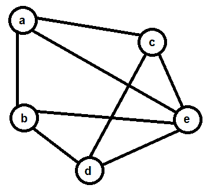

图 10.2

因此，对于这个无向图，以下是一组顶点：

```cpp
(V) - { a,b,c,d,e}
```

此外，该图将包含以下一组边：

```cpp
(E) - {(a,b), (b,a), (a,c), (c,a), (a,e), (e,a), (b,e), (e,b), (b,d), (d,b), (c,d), (d,c), (c,e), (e,c)}
```

现在，让我们从这些方法开始。

# 创建有向图的邻接矩阵表示法

邻接矩阵是一个用于表示图的方阵。矩阵的行和列按照图中的顶点进行标记。因此，如果图顶点是**1**、**2**、...**5**，那么邻接矩阵的行和列将标记为**1**、**2**、...**5**。最初，矩阵用所有零（0）填充。然后，如果顶点`i`和`j`之间存在边，则将`mat[i][j]`位置的 0 替换为 1（其中`i`和`j`指的是顶点）。例如，如果从顶点**2**到顶点**3**存在边，那么在`mat[2][3]`索引位置，0 的值将被替换为**1**。简而言之，邻接矩阵的元素表示图中顶点对是否相邻。

考虑以下有向图：


图 10.3

其邻接矩阵表示法如下：

```cpp
5,5          1              2              3              4              5
-----------------------------------------------------------------------------
1            0              1              1              0              0
2            0              0              0              0              0
3            0              0              0              1              1
4            0              1              0              0              1
5            1              1              0              0              0
```

第一行和第一列代表顶点。如果两个顶点之间存在边，则它们各自行和列的交点处将有一个`1`值。它们之间没有边的情况将用`0`表示。邻接矩阵中非零元素的数量表示有向图中边的数量。

使用邻接矩阵表示法有以下两个缺点：

+   这种表示法需要*n²*个元素来表示具有*n*个顶点的图。如果一个有向图有*e*条边，那么矩阵中的(*n²-e*)个元素将是零。因此，对于边数非常少的图，矩阵会变得非常稀疏。

+   平行边不能由邻接矩阵表示。

在这个方法中，我们将学习如何制作有向图的邻接矩阵表示法。

# 如何做到这一点...

执行以下步骤以创建图的邻接矩阵表示法：

1.  询问用户图中顶点的数量。

1.  定义一个等于顶点数的正方形矩阵。

1.  将矩阵的所有元素初始化为 0。

1.  请用户输入边。对于用户输入的每条边（`i`,`j`），在`mat[i][j]`索引位置替换 0。

1.  一旦所有边都输入完毕，显示邻接矩阵的所有元素。

创建图邻接矩阵表示的代码如下：

```cpp
//adjmatdirect.c

#include <stdio.h>

#define max 10
int main() {
  static int edg[max][max], i, j, v1, v2, numb;
  printf("How many vertices are there? ");
  scanf("%d", & numb);
  printf("We assume that the vertices are numbered from : ");
  for (i = 1; i <= numb; i++) printf("%d ", i);
  printf("\nEnter the edges of the graph. Like 1 4 if there is an \n");
  printf("edge between vertex 1 and 4\. Enter 0 0 when over\n");
  for (i = 1; i <= numb * (numb - 1); i++) {
    /* The for loop will run for at most numb*(numb-1) times because, 
       the number of edges are at most numb*(numb-1) where numb is 
       the number of vertices */
    scanf("%d %d", & v1, & v2);
    if (v1 == 0 && v2 == 0) break;
    edg[v1][v2] = 1;
  }
  printf("\nThe adjacency matrix for the graph is \n");
  for (i = 1; i <= numb; i++) printf("\t%d", i);
  printf("\n-----------------------------------------------------\n");
  for (i = 1; i <= numb; i++) {
    printf("%d |\t", i);
    for (j = 1; j <= numb; j++) {
      printf("%d\t", edg[i][j]);
    }
    printf("\n");
  }
  return 0;
}
```

现在，让我们深入了解代码，以更好地理解它。

# 它是如何工作的...

假设用户将在本程序中指定的有向图不会超过 10 个顶点，定义一个名为`max`的宏，其值为`10`，以及一个名为`edg`的二维矩阵，由最大行数和最大列数组成。然而，如果你认为用户可以指定超过 10 个顶点的图，你可以始终增加宏的大小。

为了初始化`edg`矩阵的所有元素为 0，将其定义为静态矩阵。之后，将提示用户指定图中顶点的数量。假设用户输入 5 来表示图中存在 5 个顶点，那么这个值将被分配给`numb`变量。

为了使食谱易于理解，我们假设顶点按顺序编号为 1 到 5。将提示用户指定顶点之间的边。这意味着如果顶点 1 和 3 之间存在边，则用户应输入边为 1,3。表示这些边的输入顶点随后被分配给 v1 和 v2 顶点。因为用户被要求指定图的边，并在完成时输入`0 0`，所以在将边分配给 v1 和 v2 顶点时，我们首先确保顶点不是 0 和 0。如果是，程序将停止请求更多边，并转到显示邻接矩阵的语句。如果边的顶点不是零，则在二维`edg`矩阵的`[v1][v2]`索引位置分配一个值，1。因此，如果顶点 1 和 2 之间存在边，则将在`edg[1][2]`索引位置分配值 1，替换最初那里的值 0。

当所有图的边都输入完毕后，用户将输入顶点作为`0 0`来表示所有边都已输入。在这种情况下，将执行嵌套的`for`循环，并在屏幕上显示`edg`矩阵的所有元素。

程序使用 GCC 编译，如下面的截图所示。因为没有错误出现在编译过程中，这意味着`adjmatdirect.c`程序已成功编译成`adjmatdirect.exe`文件。在执行文件时，将提示用户指定顶点数及其边。一旦输入了顶点和边，程序将显示图的邻接矩阵表示（请参阅下面的截图）：

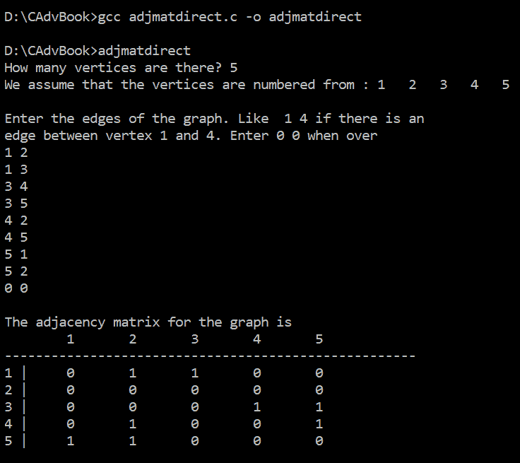

图 10.4

现在，让我们探索如何对无向图做同样的事情。

# 创建无向图的邻接矩阵表示

在这个食谱的代码中增加一条语句，就可以使用相同的程序来创建无向图的邻接矩阵表示。

# 如何做...

我们参考的是前面食谱中的相同图；然而，这次没有边：

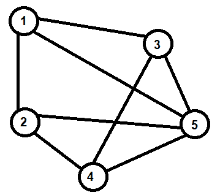

图 10.5

它的邻接矩阵表示如下：

```cpp
5,5          1              2              3              4              5
----------------------------------------------------------------------------
1            0              1              1              0              1
2            1              0              0              1              1
3            1              0              0              1              1
4            0              1              1              0              1
5            1              1              1              1              0
```

有向图和无向图的程序之间唯一的区别是，在后者中，边被简单地重复。也就是说，如果 a 和 b 之间存在边，那么它被认为是两条边：一条从 a 到 b，另一条从 b 到 a。

创建无向图邻接矩阵表示的程序如下：

```cpp
//adjmatundirect.c

#include <stdio.h>

#define max 10

int main() {
  static int edg[max][max], i, j, v1, v2, numb;
  printf("How many vertices are there? ");
  scanf("%d", & numb);
  printf("We assume that the vertices are numbered from : ");
  for (i = 1; i <= numb; i++) printf("%d ", i);
  printf("\nEnter the edges of the graph. Like 1 4 if there is an \n");
  printf("edge between vertex 1 and 4\. Enter 0 0 when over\n");
  for (i = 1; i <= numb * (numb - 1); i++) {
    /* The for loop will run for at most numb*(numb-1) times because, the 
       number of edges are at most numb*(numb-1) where numb is the number 
       of vertices */
    scanf("%d %d", & v1, & v2);
    if (v1 == 0 && v2 == 0) break;
    edg[v1][v2] = 1;
    edg[v2][v1] = 1;
  }
  printf("\nThe adjacency matrix for the graph is \n");
  for (i = 1; i <= numb; i++) printf("\t%d", i);
  printf("\n----------------------------------------------------------\n");
  for (i = 1; i <= numb; i++) {
    printf("%d |\t", i);
    for (j = 1; j <= numb; j++) {
      printf("%d\t", edg[i][j]);
    }
    printf("\n");
  }
  return 0;
}
```

# 它是如何工作的...

当你将前面的程序与有向图的程序进行比较时，你会注意到只增加了一条额外的语句（加粗标记）：

```cpp
edg[v2][v1]=1;
```

即，在`v1`到`v2`的边的情况下，还假设了反向边，即从`v2`到`v1`。

程序使用 GCC 编译，如下所示截图。因为没有错误出现在编译过程中，这意味着`adjmatundirect.c`程序已成功编译成`adjmatundirect.exe`文件。正如预期的那样，运行该文件时，用户将被提示指定顶点的数量和它们的边。一旦输入了顶点的数量和边的数量，程序将显示无向图的邻接矩阵表示，如下所示截图：

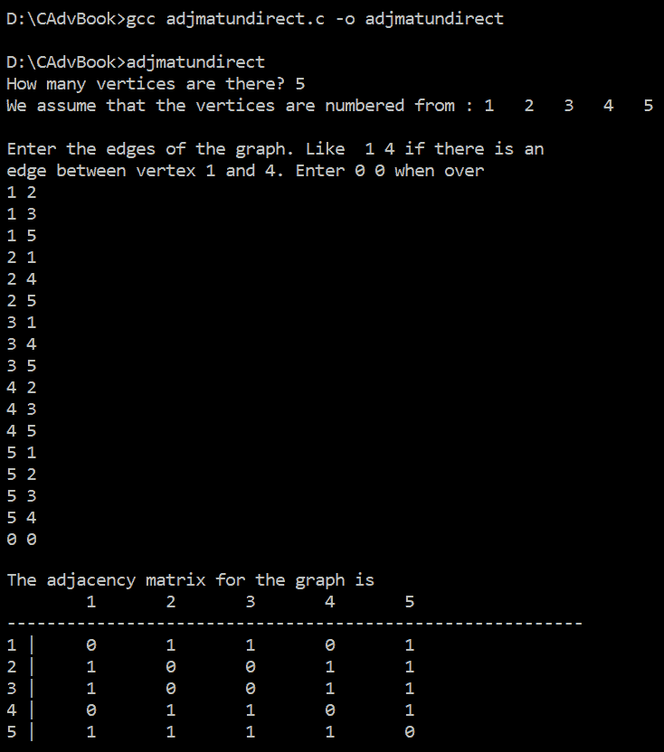

图 10.6

现在，让我们继续到下一个食谱！

# 创建有向图的邻接表表示

在邻接表表示中，使用链表来表示顶点的相邻顶点。也就是说，为每个顶点的相邻顶点创建一个单独的链表，最后，图中所有顶点都连接起来。因为使用了链表，所以这种表示图的方式在内存使用上更加优化。

考虑以下有向图：


图 10.7

它的邻接表表示如下：

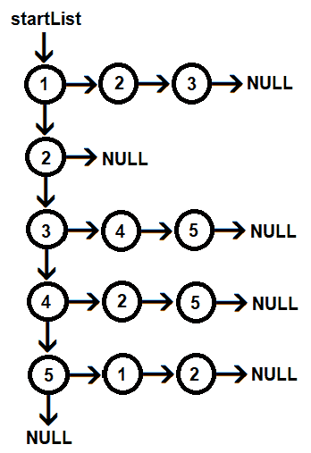

图 10.8

你可以在前面的图中看到，顶点**1**的相邻顶点以链表的形式连接。因为顶点**2**没有相邻顶点，所以它的指针指向**NULL**。同样，顶点**3**的相邻顶点，即顶点**4**和**5**，以链表的形式连接到顶点**3**。一旦创建了整个图的顶点的所有链表，所有顶点都通过链接连接起来。

在这个食谱中，我们将学习如何创建有向图的邻接表表示。

# 如何实现...

按照以下步骤创建图的邻接表表示：

1.  定义一个名为`node`的结构，它包含三个成员。一个成员`nme`用于存储图的顶点；另一个成员`vrt`用于连接图的顶点；最后，`edg`用于连接顶点的相邻顶点。

1.  询问用户指定图中顶点的数量。

1.  创建一个链表，其中每个节点的`nme`成员包含图的顶点。

1.  使用`vrt`指针将表示图中顶点的所有节点相互连接。

1.  一旦输入所有顶点，用户将被提示输入图的边。用户可以输入任意数量的边，并且为了表示所有边都已输入，用户可以输入`0 0`作为边。

1.  当进入一个边，例如，`b`，使用一个`temp1`指针，并将其设置为指向顶点`a`。

1.  创建一个新的节点称为`newNode`，并将顶点名称`b`分配给`newNode`的`nme`成员。

1.  使用另一个指针，称为`temp2`，并将其设置为指向连接到顶点`a`的最后一个节点。一旦`temp2`到达顶点`a`的末尾，`temp2`节点的`edg`成员被设置为指向`newNode`，从而在`a`和`b`之间建立一条边。

创建有向图的邻接表表示的程序如下：

```cpp
//adjlistdirect.c

#include <stdlib.h>
#include <stdio.h>

struct node {
  char nme;
  struct node * vrt;
  struct node * edg;
};

int main() {
  int numb, i, j, noe;
  char v1, v2;
  struct node * startList, * newNode, * temp1, * temp2;
  printf("How many vertices are there ? ");
  scanf("%d", & numb);
  startList = NULL;
  printf("Enter all vertices names\n");
  for (i = 1; i <= numb; i++) {
    if (startList == NULL) {
      newNode = malloc(sizeof(struct node));
      scanf(" %c", & newNode - > nme); /* There is a space before %c */
      startList = newNode;
      temp1 = newNode;
      newNode - > vrt = NULL;
      newNode - > edg = NULL;
    } else {
      newNode = malloc(sizeof(struct node));
      scanf(" %c", & newNode - > nme);
      /* There is a space before %c */
      newNode - > vrt = NULL;
      newNode - > edg = NULL;
      temp1 - > vrt = newNode;
      temp1 = newNode;
    }
  }
  printf("Enter the edges between vertices. Enter v1 v2, if there is an edge\n");
  printf("between v1 and v2\. Enter 0 0 if over\n");
  noe = numb * (numb - 1);
  for (j = 1; j <= noe; j++) {
    scanf(" %c %c", & v1, & v2);
    /* There is a space before %c */
    if (v1 == '0' && v2 == '0') break;
    temp1 = startList;
    while (temp1 != NULL && temp1 - > nme != v1)
      temp1 = temp1 - > vrt;
    if (temp1 == NULL) {
      printf("Sorry no vertex exist by this name\n");
      break;
    }
    temp2 = temp1;
    while (temp2 - > edg != NULL) temp2 = temp2 - > edg;
    newNode = malloc(sizeof(struct node));
    newNode - > nme = v2;
    temp2 - > edg = newNode;
    newNode - > edg = NULL;
    newNode - > vrt = NULL;
  }
  printf("\nAdjacency List representation of Graph is\n");
  temp1 = startList;
  while (temp1 != NULL) {
    printf("%c\t", temp1 - > nme);
    temp2 = temp1 - > edg;
    while (temp2 != NULL) {
      printf("%c\t", temp2 - > nme);
      temp2 = temp2 - > edg;
    }
    printf("\n");
    temp1 = temp1 - > vrt;
  }
}
```

现在，让我们幕后了解代码，以更好地理解它。

# 它是如何工作的...

假设我们正在处理以下有向图：


图 10.9

该图的邻接表表示如下：


图 10.10

我们定义一个名为“node”的结构，包含以下三个成员：

+   `nme`：这是用于存储顶点。

+   `vrt`：一个指向连接图中所有顶点的指针。

+   `edg`：一个连接当前顶点所连接的所有顶点的指针：

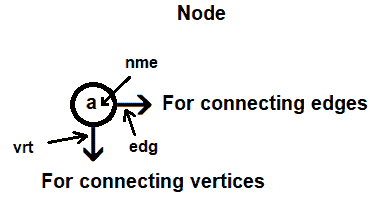

图 10.11

用户被提示指定顶点的数量。假设用户输入值为 5，则 5 的值将被分配给`numb`变量。定义一个`startList`指针为`NULL`。整个邻接表将通过这个`startList`指针访问，并且它将被设置为指向图的第一个顶点。首先，用户被要求输入顶点的名称。

初始时，`startList`指针为`NULL`，因此创建了一个新节点`newNode`，并将用户输入的顶点名称，例如`a`，分配给`newNode`的`nme`成员。`startList`指针被设置为指向`newNode`。为了使用`newNode`连接更多顶点，将`temp1`指针设置为指向`newNode`。最初，两个指针`vrt`和`edg`也都设置为`NULL`。在`for`循环的第一次迭代之后，图中的节点将如下所示：


图 10.12

在`for`循环的第二次迭代中，因为`startList`指针不再为`NULL`，将执行`else`块，并再次创建一个新节点，称为`newNode`。接下来，将顶点名称分配给`newNode`的命名成员。再次，将`newNode`的`vrt`和`edg`指针设置为`NULL`。为了将`newNode`连接到前面的顶点，我们将借助`temp1`指针。将`temp1`指针指向的节点的`vrt`指针设置为指向`newNode`，如下所示：

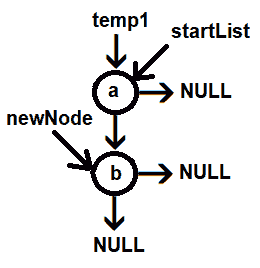

图 10.13

然后，将`temp1`指针设置为指向`newNode`，并对其余顶点重复此过程。本质上，`temp1`指针用于连接更多顶点。在`for`循环结束时，节点将如下所示连接：

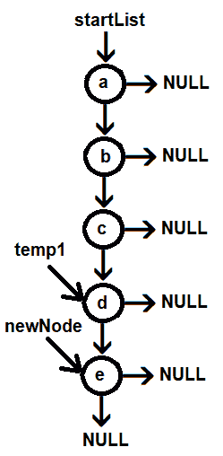

图 10.14

一旦所有图的顶点都输入完毕，用户将被要求指定顶点之间的边。此外，当所有图的边都输入完毕时，用户需要输入`0 0`。假设用户输入`a b`来表示从顶点`a`到顶点`b`存在一条边。顶点分别被分配给`v1`和`v2`变量。我们首先确保`v1`和`v2`中的数据不是 0。如果是，这意味着所有图的边都已输入，程序将跳转到显示邻接表开始的语句。

然后，为了连接顶点`a`和`b`，首先，将`temp1`指针设置为指向`startList`。`temp1`指针被设置为找到其`nme`成员等于变量`v1`中输入的顶点的节点，即`a`。`temp1`指针已经指向顶点`a`。之后，你需要找到与`temp1`连接的最后一个节点。`temp2`指针用于找到由`temp1`指针指向的节点的最后一个连接节点。因为这是顶点`a`的第一个输入边，所以`temp2`指针指向的节点的`edg`成员已经是`NULL`。因此，创建一个新的节点称为`newNode`，并将变量`v2`中的顶点名称，即`b`，分配给`newNode`的`nme`变量。`newNode`的`edg`和`vrt`成员被设置为`NULL`，如下所示：


图 10.15

将`temp2`的`edg`成员设置为指向`newNode`，如下所示：

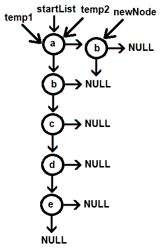

图 10.16

该过程会重复应用于用户输入的其余边。

程序使用 GCC 编译，如下所示。因为没有错误出现在编译过程中，这意味着`adjlistdirect.c`程序已成功编译成`adjlistdirect.exe`文件。在执行可执行文件时，用户将被提示指定顶点的数量及其边。一旦输入了顶点和边，程序将显示有向图的邻接表表示，如下所示截图：


图 10.17

现在，让我们继续下一个菜谱！

# 执行图的广度优先遍历

图的遍历是指按照一个良好的定义顺序访问图的每个顶点正好一次。为了确保图中的每个顶点只被访问一次，并知道哪些顶点已经被访问，最好的方法是标记它们。我们还将在此菜谱中查看如何标记顶点。

广度优先遍历倾向于创建非常短而宽的树。它通过层来操作顶点，即首先评估离起始点最近的顶点，最后评估最远的顶点。因此，它被称为树的层遍历。图的广度优先遍历在寻找两个位置（顶点）之间的最短路径（即边数最少的路径）方面非常流行。它也用于查找网页的链接页面、广播信息等。

在这个菜谱中，我们将学习如何执行图的广度优先遍历。

# 如何操作...

按照以下步骤执行图的广度优先遍历：

1.  将图的第一顶点添加到队列中。任何顶点都可以作为起始顶点。

1.  然后，重复以下*步骤 3*到*8*，直到队列为空。

1.  从队列中取出顶点并将其存储在一个变量中，例如 `v`。

1.  将其标记为已访问（标记是为了确保这个顶点不应再次被遍历）。

1.  显示标记的顶点。

1.  找出顶点 `v` 的相邻顶点，然后对每个顶点执行 *步骤 7* 到 *8*。

1.  如果 `v` 的任何相邻顶点未被标记，则将其标记为已访问。

1.  将相邻顶点添加到队列中。

1.  退出。

图的广度优先遍历程序如下：

```cpp
//breadthfirsttrav.c

#include <stdlib.h>
#include <stdio.h>

#define max 20

enum Setmarked {
  Y,
  N
};
struct node {
  char nme;
  struct node * vrt;
  struct node * edg;
  enum Setmarked marked;
};

struct node * que[max];
int rear = -1, front = -1;
void queue(struct node * paramNode);
struct node * dequeue();

int main() {
  int numb, i, j, noe;
  char v1, v2;
  struct node * startList, * newNode, * temp1, * temp2, * temp3;
  printf("How many vertices are there ?");
  scanf("%d", & numb);
  startList = NULL;
  printf("Enter all vertices names\n");
  for (i = 1; i <= numb; i++) {
    if (startList == NULL) {
      newNode = malloc(sizeof(struct node));
      scanf(" %c", & newNode - > nme);
      /* There is a space before %c */
      startList = newNode;
      temp1 = newNode;
      newNode - > vrt = NULL;
      newNode - > edg = NULL;
      newNode - > marked = N;
    } else {
      newNode = malloc(sizeof(struct node));
      scanf(" %c", & newNode - > nme);
      /* There is a space before %c */
      newNode - > vrt = NULL;
      newNode - > edg = NULL;
      newNode - > marked = N;
      temp1 - > vrt = newNode;
      temp1 = newNode;
    }
  }
  printf("Enter the edges between vertices. Enter v1 v2, if there is an edge\n");
  printf("between v1 and v2\. Enter 0 0 if over\n");
  noe = numb * (numb - 1);
  for (j = 1; j <= noe; j++) {
    scanf(" %c %c", & v1, & v2);
    /* There is a space before %c */
    if (v1 == '0' && v2 == '0') break;
    temp1 = startList;
    while (temp1 != NULL && temp1 - > nme != v1)
      temp1 = temp1 - > vrt;
    if (temp1 == NULL) {
      printf("Sorry no vertex exist by this name\n");
      break;
    }
    temp2 = temp1;
    while (temp2 - > edg != NULL) temp2 = temp2 - > edg;
    newNode = malloc(sizeof(struct node));
    newNode - > nme = v2;
    temp2 - > edg = newNode;
    newNode - > edg = NULL;
    newNode - > vrt = NULL;
  }
  printf("\nAdjacency List representation of Graph is\n");
  temp1 = startList;
  while (temp1 != NULL) {
    printf("%c\t", temp1 - > nme);
    temp2 = temp1 - > edg;
    while (temp2 != NULL) {
      printf("%c\t", temp2 - > nme);
      temp2 = temp2 - > edg;
    }
    printf("\n");
    temp1 = temp1 - > vrt;
  }
  printf("\nBreadth First traversal of the graph is \n");
  temp1 = startList;
  if (temp1 == NULL)
    printf("Sorry no vertices in the graph\n");
  else
    queue(temp1);
  while (rear != -1) {
    temp3 = dequeue();
    temp1 = startList;
    while (temp1 - > nme != temp3 - > nme) temp1 = temp1 - > vrt;
    temp3 = temp1;
    if (temp3 - > marked == N) {
      printf("%c\t", temp3 - > nme);
      temp3 - > marked = Y;
      temp2 = temp3 - > edg;
      while (temp2 != NULL) {
        queue(temp2);
        temp2 = temp2 - > edg;
      }
    }
  }
  return 0;
}

void queue(struct node * paramNode) {
  rear++;
  que[rear] = paramNode;
  if (front == -1) front = 0;
}

struct node * dequeue() {
  struct node * tempNode;
  if (front == rear) {
    tempNode = que[front];
    front = -1;
    rear = -1;
  } else {
    tempNode = que[front];
    front++;
  }
  return (tempNode);
}
```

现在，让我们深入了解代码，以更好地理解它。

# 它是如何工作的...

我们正在使用之前菜谱中创建的邻接表表示的有向图，*创建有向图的邻接表表示*：


图 10.18

`temp1` 指针被设置为指向 `startList`。也就是说，`temp1` 正在指向具有顶点 `a` 的节点。如果 `temp1` 不是 `NULL`，则由 `temp1` 指针指向的节点被添加到队列中。当前为 -1 的尾变量被增加到 0，并将 `a` 节点添加到 `que` 节点数组中的索引位置 `0`。因为当前前索引位置值为 -1，所以前指针也被设置为 0，如下所示：


图 10.19

此后，调用 dequeue 函数从队列中删除一个节点。不出所料，`que[0]` 索引位置的节点，即 `a`，被返回，因为 **front** 和 **rear** 的值相同，所以 **front** 和 **rear** 索引的值被设置为 -1，以指示队列再次为空。

包含顶点 `a` 的节点从队列中返回，并分配给 `temp3` 指针。`temp1` 指针被设置为指向 `startList` 指针。`temp3` 节点的标记成员，即顶点 `a`，最初被设置为 `N`。节点中存储在 `nme` 成员中的顶点名称被显示，即顶点 `a` 在屏幕上显示。

在显示顶点 `a` 后，其标记成员被设置为 `Y` 以指示节点已被访问且不应再次遍历。下一步是找到顶点 `a` 的相邻顶点。为此，将 `temp2` 指针设置为指向 `temp3` 的 `edg` 指针所指向的位置。`temp3` 的 `edg` 指针指向顶点 `b`，因此 `temp2` 被设置为指向顶点 `b`。再次重复该过程。如果 `temp2` 不是 `NULL`，则 `b` 节点被排队，即被添加到 `que[0]` 索引位置。因为所有连接到顶点 `a` 的节点都必须排队，所以 `temp2` 指针被设置为指向其 `edg` 指针所指向的位置。节点 `b`（在邻接表中）的 `edg` 指针指向节点 `c`，因此节点 `c` 也被插入到队列中的 `que[1]` 索引位置，如下所示：


图 10.20

在队列中，节点 `b` 和 `c` 存在。现在，再次调用出队函数；从队列中移除节点 `b`，并将 `temp3` 指针设置为指向它。`temp1` 指针最初设置为指向 `startList`，然后通过使用其 `vrt` 指针，将 `temp1` 指针设置为指向顶点 `b`。因为节点 `b` 的标记成员是 `N`，其顶点名称 `b` 显示在屏幕上，随后将其标记成员设置为 `Y`。将 `temp2` 指针设置为指向节点 `b` 的 `edg` 成员所指向的位置。节点 `b` 的 `edg` 成员指向 `NULL`，因此访问队列中的下一个节点，即从队列中移除节点 `c` 并将 `temp3` 指针设置为指向它。因为队列再次为空，所以将 `front` 和 `rear` 变量的值设置为 -1。

再次，将 `temp1` 指针设置为指向顶点 `c`，并在屏幕上显示 `c` 节点，即遍历它并设置其标记成员为 `Y`。因此，到目前为止，节点 `a`、`b` 和 `c` 已在屏幕上显示。将连接到 `c` 的 `edg` 成员的节点添加到队列中，即节点 `d` 被添加到队列的 `que[0]` 索引位置。此外，访问节点 `d` 的 `edg` 指针所指向的节点，即节点 `e` 也被排队或换句话说，添加到 `que[1]` 索引位置如下：


图 10.21

从队列中移除节点 `d` 并显示（遍历）。访问它们 `edg` 成员所指向的节点，如果其中任何一个被标记，则将 `N` 添加到队列中。整个过程重复进行，直到队列为空。在屏幕上显示顶点的顺序形成图的广度优先遍历。

程序使用 GCC 编译，如以下截图所示。因为在编译过程中没有出现错误，这意味着 `breadthfirsttrav.c` 程序已成功编译成 `breadthfirsttrav.exe` 文件。执行文件时，用户将被提示指定图中的顶点数量，然后输入顶点名称。之后，用户被要求输入图的边，并在完成后输入 `0 0`。输入图的边后，将显示图的邻接表表示，然后显示图的广度优先遍历，如以下截图所示：

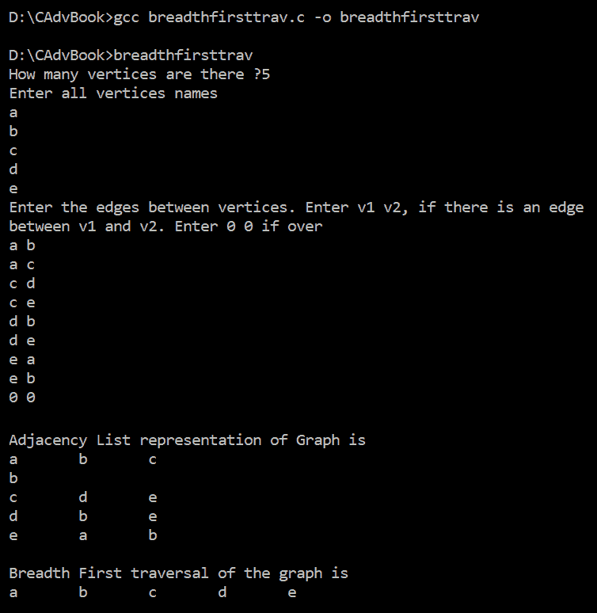

图 10.22

现在，让我们继续下一个菜谱！

# 执行图的深度优先遍历

在深度优先遍历（也称为深度优先搜索）中，通过取一条路径并尽可能深入地沿着该路径遍历，访问图中的所有节点。到达末端后，返回，选择另一条路径，然后重复该过程。

在这个菜谱中，我们将学习如何执行图的深度优先遍历。

# 如何做到这一点...

按以下步骤进行图的深度优先遍历：

1.  将图的第一个顶点推入栈中。您可以选择图的任何顶点作为起始顶点。

1.  然后，重复以下*步骤 3*到*7*，直到栈为空。

1.  从栈中弹出顶点并按任何名称调用它，例如，`v`。

1.  将弹出的顶点标记为已访问。这种标记是为了确保该顶点不应再次遍历。

1.  显示标记的顶点。

1.  找出`v`顶点的邻接顶点，然后对每个顶点执行*步骤 7*。

1.  如果`v`的任何邻接顶点未标记，则将其标记为已访问并将它们推入栈中。

1.  退出。

图的深度优先遍历程序如下：

```cpp
//depthfirsttrav.c

#include <stdlib.h>
#include <stdio.h>
#define max 20

enum Setmarked {Y,N};
struct node {
  char nme;
  struct node * vrt;
  struct node * edg;
  enum Setmarked marked;
};

struct node * stack[max];
int top = -1;
void push(struct node * h);
struct node * pop();

int main() {
  int numb, i, j, noe;
  char v1, v2;
  struct node * startList, * newNode, * temp1, * temp2, * temp3;
  printf("How many vertices are there ?");
  scanf("%d", & numb);
  startList = NULL;
  printf("Enter all vertices names\n");
  for (i = 1; i <= numb; i++) {
    if (startList == NULL) {
      newNode = malloc(sizeof(struct node));
      scanf(" %c", & newNode - > nme);
      /* There is a white space before %c */
      startList = newNode;
      temp1 = newNode;
      newNode - > vrt = NULL;
      newNode - > edg = NULL;
      newNode - > marked = N;
    } else {
      newNode = malloc(sizeof(struct node));
      scanf(" %c", & newNode - > nme);
      /* There is a white space before %c */
      newNode - > vrt = NULL;
      newNode - > edg = NULL;
      newNode - > marked = N;
      temp1 - > vrt = newNode;
      temp1 = newNode;
    }
  }
  printf("Enter the edges between vertices. Enter v1 v2, if there is an edge\n");
  printf("between v1 and v2\. Enter 0 0 if over\n");
  noe = numb * (numb - 1);
  for (j = 1; j <= noe; j++) {
    scanf(" %c %c", & v1, & v2);
    /* There is a white space before %c */
    if (v1 == '0' && v2 == '0') break;
    temp1 = startList;
    while (temp1 != NULL && temp1 - > nme != v1)
      temp1 = temp1 - > vrt;
    if (temp1 == NULL) {
      printf("Sorry no vertex exist by this name\n");
      break;
    }
    temp2 = temp1;
    while (temp2 - > edg != NULL) temp2 = temp2 - > edg;
    newNode = malloc(sizeof(struct node));
    newNode - > nme = v2;
    temp2 - > edg = newNode;
    newNode - > edg = NULL;
    newNode - > vrt = NULL;
  }
  printf("\nAdjacency List representation of Graph is\n");
  temp1 = startList;
  while (temp1 != NULL) {
    printf("%c\t", temp1 - > nme);
    temp2 = temp1 - > edg;
    while (temp2 != NULL) {
      printf("%c\t", temp2 - > nme);
      temp2 = temp2 - > edg;
    }
    printf("\n");
    temp1 = temp1 - > vrt;
  }
  printf("\nDepth First traversal of the graph is \n");
  temp1 = startList;
  if (temp1 == NULL)
    printf("Sorry no vertices in the graph\n");
  else
    push(temp1);
  while (top >= 0) {
    temp3 = pop();
    temp1 = startList;
    while (temp1 - > nme != temp3 - > nme) temp1 = temp1 - > vrt;
    temp3 = temp1;
    if (temp3 - > marked == N) {
      printf("%c\t", temp3 - > nme);
      temp3 - > marked = Y;
      temp2 = temp3 - > edg;
      while (temp2 != NULL) {
        push(temp2);
        temp2 = temp2 - > edg;
      }
    }
  }
  return 0;
}

void push(struct node * h) {
  top++;
  stack[top] = h;
}

struct node * pop() {
  return (stack[top--]);
}
```

现在，让我们深入了解代码，以更好地理解它。

# 它是如何工作的...

我们使用从上一个菜谱中创建的**有向图的邻接表表示**：

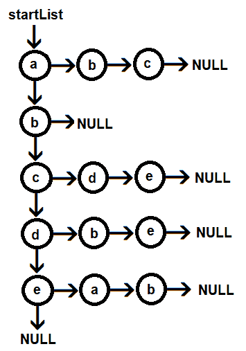

图 10.23

将`temp1`指针设置为指向`startList`，即节点`a`，我们假设它是图的起始顶点。然后我们确保如果`temp1`不是`NULL`，则`temp1`指针指向的节点被推入栈中。初始值为-1 的`top`值增加到 0，节点`a`被添加到节点栈的索引位置**0**，如下所示：


图 10.24

此后，调用`pop`函数从栈中删除节点。返回`stack[0]`索引位置的节点，并将`top`的值再次减少到-1。

包含顶点`a`的节点被返回到`temp3`指针。将`temp1`指针设置为指向`startList`指针。`temp3`节点的标记成员，即顶点`a`，最初设置为`N`。节点中存储的顶点名称`nme`成员被显示，即顶点`a`被显示在屏幕上。显示顶点`a`后，其标记成员被设置为`Y`以指示该节点已被访问且不应再次遍历。将`temp2`指针设置为指向`temp3`的`edg`指针指向的位置。`temp3`的`edg`指针指向顶点`b`，因此`temp2`被设置为指向顶点`b`。再次重复该过程，即我们检查`temp2`是否不是`NULL`，然后将节点`b`推入栈的`stack[0]`索引位置。因为所有连接到顶点`a`的节点都必须推入栈中，所以将`temp2`指针设置为指向其`edg`指针指向的位置。节点`b`（在邻接表中）的`edg`指针指向节点`c`，因此节点`c`也被推入栈的`stack[1]`索引位置，如下所示：


图 10.25

在栈中，存在节点 `b` 和 `c`。现在，再次调用 `pop` 函数，从栈中弹出节点 `c`，并将 `temp3` 指针设置为指向它。`temp1` 指针最初设置为指向 `startList`，然后通过使用其 `vrt` 指针，将 `temp1` 指针设置为指向顶点 `c`。因为节点 `c` 的标记成员是 *N*，所以其顶点名称 `c` 在屏幕上显示，并将其标记成员设置为 `Y`。因此，到目前为止，节点 `a` 和 `c` 已在屏幕上显示。

将 `temp2` 指针设置为指向节点 `c` 的 `edg` 成员所指向的位置。节点 `c` 的 `edg` 成员指向节点 `d`，因此将节点 `d` 推入栈中，并访问节点 `c` 的下一个相邻节点。节点 `c` 的下一个相邻节点是节点 `e`，它也被按如下方式推入栈中：

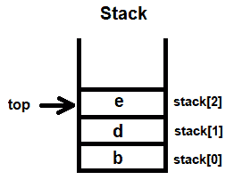

图 10.26

再次，从栈中弹出的最顶层节点是节点 `e`，将 `temp3` 指针设置为指向它。再次，将 `temp1` 指针设置为指向顶点 `e`，并在屏幕上显示节点 `e`，即进行遍历。然后，将其标记成员设置为 `Y`，并将连接到 `e` 的 `edg` 成员的节点推入栈中，即节点 `a` 被推入栈中，随后是节点 `b`，如下所示：


图 10.27

弹出节点 `b`，并将 `temp3` 指针设置为指向它。将 `temp1` 指针设置为指向节点 `b`。因为节点 `b` 的标记成员是 `N`，表示它尚未被遍历，所以在屏幕上显示顶点 `b` 并将其标记成员设置为 `Y`。由于顶点 `b` 没有相邻成员，栈中的下一个节点 `a` 被弹出。因为顶点 `a` 已经被访问，所以从栈中弹出的下一个节点是节点 `d`。重复此过程，显示的顶点序列被认为是图的深度遍历。

程序使用 GCC 编译，如下截图所示。因为没有在编译过程中出现错误，这意味着 `depthfirsttrav.c` 程序已成功编译成 `depthfirsttrav.exe` 文件。执行该文件时，用户将被提示指定图中顶点的数量，然后输入顶点的名称。之后，用户被要求输入图的边，完成输入后输入 `0 0`。输入图的边后，将显示图的邻接表表示，然后是图的深度优先遍历，如下截图所示：

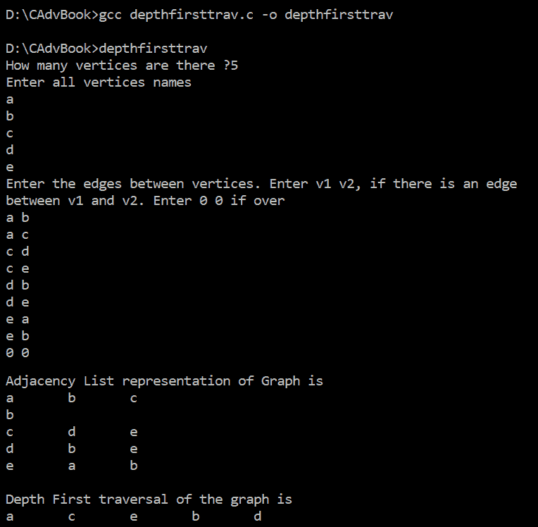

图 10.28

现在，让我们继续下一个菜谱！

# 使用 Prim 算法创建最小生成树

在这个菜谱中，我们将学习如何创建最小生成树。具有*n*个节点的图的 minimum spanning tree 将有*n*个节点。在一个加权连通图中，每个图的边被分配一个非负数，称为“边的权重”。然后，将图中的任何生成树分配一个通过将树中边的权重相加得到的总权重。一个图的 minimum spanning tree 是一个总权重尽可能小的生成树。

有多种技术可以用来为加权图创建最小生成树。其中一种方法称为 Prim 算法。

Prim 算法是贪心算法类别的一部分，其中顶点通过具有最低权重的边连接。最初选择一个任意节点作为树的根节点。在无向图中，任何节点都可以被认为是树的根节点，与其相邻的节点作为其子节点。然后，将图中的节点逐个添加到树中，直到包含图中的所有节点。在每次添加到树中的图节点都是通过最小权重的弧与树的节点相邻。最小权重的弧成为连接新节点到树的树弧。当图中的所有节点都已添加到树中时，可以说已经为图创建了一个最小生成树。

# 如何做...

按照以下步骤实现 Prim 算法：

1.  从图中选择任何顶点作为最小生成树的根。它可以是一个任意顶点。

1.  从顶点（或树中的顶点）找到到图中其他顶点的所有边。从那些顶点中，选择具有最小权重的边，并将该顶点添加到树中。

1.  重复*步骤 2*，直到将图中的所有顶点添加到最小生成树中。

考虑以下加权图：


图 10.29

现在，为了得到这个图的最小生成树，我们从顶点`a`（你可以将任何顶点视为图的起始顶点）开始连接顶点。从起始顶点开始，选择具有最低权重的最近顶点，然后重复此过程，直到所有顶点都连接起来。这样，我们得到以下最小生成树：

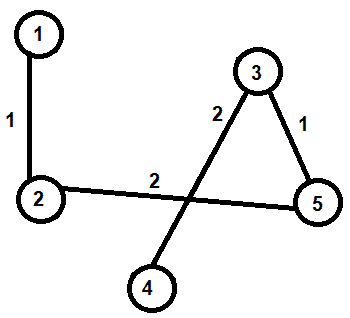

图 10.30

上述图被称为树，因为它是无环的；它被称为生成树，因为它覆盖了每个顶点。

最小生成树中的边数是*v-1*，其中*v*是顶点的数量。

使用 Prim 算法创建最小生成树的程序如下：

```cpp
//prims.c

#include <stdlib.h>
#include <stdio.h>
#define max 20 
struct node
{
 int nme;
 int wt;
 struct node *vrt;
 struct node *edg;
 };

struct node *startList;

struct lst
{
 int u,v;
 int wt;
 struct lst *next;
}lst; 

struct lst *pq=NULL;
struct lst *tr=NULL;
void addpqu(int a, int b, int w);
void maketree();
void disptree();
struct lst *delet();
int visited[max];
int n,nov=0; 

int main()
{
 int i,j,noe,w;
 int a,b;
 struct node *newNode,*temp1,*temp2;
 printf ("How many vertices are there ?");
 scanf("%d",&n);
 printf("The vertices are named\n");
 for(i=1;i<=n;i++)printf("%d\t",i);
 printf("for convenience \n");
 startList=NULL;
 for(i=1;i<=n;i++)
 {
     if (startList==NULL)
     {
         newNode =malloc(sizeof (struct node));
         newNode->nme=i;
         startList=newNode;
         temp1=newNode;
         newNode->vrt=NULL;
         newNode->edg=NULL;
     }
     else
     {
         newNode=malloc(sizeof (struct node));
         newNode->nme=i;
         newNode->vrt=NULL;
         newNode->edg=NULL;
         temp1->vrt=newNode;
         temp1=newNode;
     }
 }
 printf("Enter the edges between vertices. Enter 1 3, if there is an edge\n");
 printf("between 1 and 3\. Enter 0 0 if over\n");
 noe=n*(n-1);
 for(j=1;j<=noe;j++)
 {
     printf("Enter edge ");
     scanf("%d %d",&a,&b);
     if(a==0 && b==0)break;
     printf("Enter weight ");
     scanf("%d",&w);
     temp1=startList;
     while(temp1!=NULL && temp1->nme!=a)
     {
         temp1=temp1->vrt;
     }
     if(temp1==NULL)
     {
         printf("Sorry no vertex exist by this name\n");
         break;
     }
     temp2=temp1;
     while(temp2->edg!=NULL)temp2=temp2->edg;
     newNode=malloc(sizeof (struct node));
     newNode->nme=b;
     newNode->wt=w;
     temp2->edg=newNode;
     newNode->edg=NULL;
     newNode->vrt=NULL;
     temp1=startList;
     while(temp1!=NULL && temp1->nme!=b)
         temp1=temp1->vrt;
     if(temp1==NULL)
     {
         printf("Sorry no vertex exist by this name\n");
         break;
     }
     temp2=temp1;
     while(temp2->edg!=NULL)temp2=temp2->edg;
     newNode=malloc(sizeof (struct node));
     newNode->nme=a;
     newNode->wt=w;
     temp2->edg=newNode;
     newNode->edg=NULL;
     newNode->vrt=NULL;
}
printf ("Adjacency List representation of Graph is\n");
temp1=startList;
while (temp1!=NULL)
{
     printf ("%d\t",temp1->nme);
     temp2=temp1->edg;
     while(temp2!=NULL)
     {
         printf("%d\t",temp2->nme);
         temp2=temp2->edg;
     }
     printf("\n");
     temp1=temp1->vrt;
}
temp1=startList;
temp2=temp1->edg;
while(temp2!=NULL)
{
    addpqu(temp1->nme,temp2->nme, temp2->wt);
    temp2=temp2->edg;
}
maketree();
disptree();
return 0;
}

void addpqu(int a, int b, int w)
{
 struct lst *lstNode,*findloc1,*findloc2;
 lstNode=malloc(sizeof(struct lst));
 lstNode->u=a;
 lstNode->v=b;
 lstNode->wt=w;
 lstNode->next=NULL;
 if(pq==NULL)
 {
     pq = lstNode;
 }
 else
 {
     if(lstNode->wt < pq->wt)
     {
         lstNode->next=pq;
         pq=lstNode;
     }
     else
     {
         findloc1=pq;
         while((findloc1!=NULL) && (findloc1->wt <= lstNode->wt))
         {
             findloc2=findloc1;
             findloc1=findloc1->next;
         }
         findloc2->next=lstNode;
         lstNode->next=findloc1;
     }
  }
} 

struct lst *delet()
{
 struct lst *tempNode;
 if (pq !=NULL)
 {
     tempNode=pq;
     pq=pq->next;
     return tempNode;
 }
 else
     return NULL;
 } 

void maketree()
{
 struct lst *lstNode,*tempNode1,*tempNode2;
 struct node *x,*y;
 int i,j;
 while(nov <n)
 {
     nxt: lstNode=delet();
     for(i=1;i<=nov;i++)
     {
         if(visited[i]==lstNode->u)
         {
             for(j=1;j<=nov;j++)
                 if(visited[j]==lstNode->v) goto nxt;
         }
     }
     for(i=1;i<=nov;i++)
         if(visited[i]==lstNode->u) goto rpt;
     nov++;
     visited[nov]=lstNode->u;
     rpt: for(i=1;i<=nov;i++)
     {
         if(visited[i]==lstNode->v) goto rptt;
     }
     nov++;
     visited[nov]=lstNode->v;
     rptt: lstNode->next=NULL;
     if (tr==NULL)
     {
         tr=lstNode;
         tempNode1=tr;
     }
     else
     {
         tempNode1->next=lstNode;
         tempNode1=lstNode;
     }
     x=startList;
     while(x->nme!=lstNode->v)x=x->vrt;
     y=x->edg;
     pq=NULL;
     while(y!=NULL)
     {
         addpqu(x->nme,y->nme, y->wt);
         y=y->edg;
     }
  }
}

void disptree()
{
 struct lst *t;
 t=tr;
 printf("Minimal Spanning tree with Prims Algorithm is \n");
 while(t!=NULL)
 {
     printf("%d %d\n",t->u,t->v);
     t=t->next;
 }
} 

```

现在，让我们深入了解代码，以更好地理解它。

# 它是如何工作的...

用户被提示指定顶点的数量。假设用户输入`5`，则`5`的值将被分配给变量`n`。为了方便，顶点将被自动命名为`1`、`2`、`3`、`4`和`5`。定义了一个节点类型的`startList`指针，并初始设置为`NULL`。`startList`指针将指向从图中创建的邻接链表的第一节点。

定义了两个结构：一个称为`node`，另一个称为`lst`。`node`结构用于创建图的邻接表表示，而`lst`结构用于创建最小生成树。定义了两个`lst`类型的指针，`pq`和`tr`，并定义为`NULL`。

要创建邻接链表表示，第一步是创建一个节点链表，其中每个节点代表图中的一个顶点。因为图中包含五个顶点，所以设置了一个`for`循环执行五次。在`for`循环内，创建了一个名为`newNode`的节点，并将顶点号`1`分配给其`nme`成员。将`startList`指针设置为指向`newNode`。`newNode`的`vrt`和`edg`成员被设置为`NULL`。`temp1`指针也设置为指向`newNode`。`startList`指针将始终指向链表的第一节点，而`temp1`指针将用于连接其他节点，即其他顶点。

在`for`循环的下一个迭代中，再次创建一个新的节点，称为`newNode`，并将顶点号`2`分配给它。`newNode`的`vrt`和`edg`成员被设置为`NULL`。为了与现有顶点连接，将`temp1`的`vrt`成员设置为指向`newNode`。之后，将`temp1`设置为指向`NewNode`。`for`循环将执行与顶点数量相等的时间，即五个，因此创建了包含各自顶点号的五个节点。当`for`循环结束时，顶点将被创建，并如下所示：

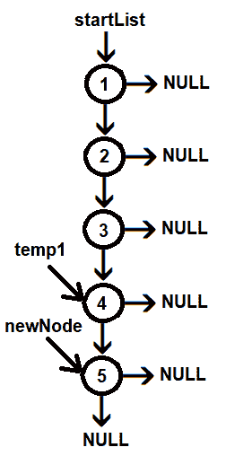

图 10.31

一旦创建了顶点，下一步就是询问用户顶点之间的边。具有*n*个顶点的图最多可以有*n * (n-1)*条边。因为顶点数量是五个，所以节点，即边的数量变量，被初始化为*5*4=20*。设置了一个`for`循环，`j`，从 1 执行到 20，要求用户输入边及其相应的权重。假设用户输入的边为`1 2`，分别被分配给`a`和`b`变量；输入的权重是`1`，被分配给`w`变量。

要创建此边，将`temp1`指针设置为指向`startList`。要创建一个(*1*,*2*)边，将`temp1`指针设置为指向其`nme`成员等于 1 的节点。目前，`temp1`已经指向顶点`1`。下一步是在顶点`1`的末尾添加顶点`2`。为了找到顶点的末尾，我们将使用另一个名为`temp2`的指针。首先，将`temp2`指针设置为指向`temp1`指针指向的节点。然后，使用其`edg`指针，将`temp2`设置为指向顶点`1`的最后一个节点。然后，创建一个新的节点，称为`newNode`，并将值`2`分配给其`nme`成员。将`w`变量中的权重`1`分配给`newNode`的`wt`成员。将`newNode`的`edge`和`vrt`指针设置为`NULL`。最后，将`temp2`的`edg`成员设置为指向`newNode`。因此，现在顶点`1`和`2`已经连接在一起了。

这是一个无向图，边(*1*,*2*)也可以表示从`2`到`1`的边。因此，我们需要一个从顶点`2`到`1`的边。将`temp1`指针设置为指向`startList`。使用其`vrt`指针，将`temp1`指针移动到顶点`2`。

当`temp1`到达顶点`2`时，下一步是将`temp2`指针设置为指向顶点`2`的最后一个节点。完成此操作后，创建一个新的节点，称为`newNode`，并将值`1`分配给其`nme`成员。此外，将`w`变量中的权重分配给`newNode`的`wt`成员。为了连接包含顶点`2`和`1`的这些节点，将`temp2`的边指针设置为指向`newNode`。将`newNode`的`edg`和`vrt`指针设置为`NULL`。因此，现在顶点`2`和`1`也连接在一起了。

# 显示邻接链表

在输入所有边及其权重后，必须显示邻接表。为此，设置一个名为`temp1`的指针指向`startList`。一个`while`循环将执行，直到`temp1`指针达到`NULL`。因此，`temp1`指针最初将指向顶点`1`。之后，通过第二个指针`temp2`的帮助，访问并显示`temp1`指针的所有边（即顶点`1`）。显示顶点`1`的所有边后，利用`vrt`成员，将`temp1`指针设置为指向下一个顶点，即顶点`2`。再次，将`temp2`指针设置为指向顶点`2`，并使用其`edg`成员显示顶点`2`的所有边。对于图中的所有顶点，重复此过程。

邻接表将如下所示：

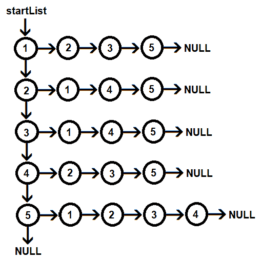

图 10.32

# 创建最小生成树

为了构建最小生成树，我们需要按顶点边的权重顺序调整。将`temp1`指针设置为指向`startList`，即顶点`1`。将`temp2`指针设置为指向`temp1`的`edg`指针所指向的位置，即顶点`2`。

现在，直到`temp2`变为`NULL`，调用`addpqu`函数，并将顶点`1`、`2`及其权重`1`传递给它。在`addpqu`函数中，创建了一个名为`lstNode`的`lst`类型结构。将顶点`1`和`2`及其权重`1`分别分配给其`u`、`v`和`wt`成员。将`lstNode`的下一个指针设置为`NULL`。另外，设置一个指针`pq`指向`lstNode`。

然后，将`temp2`指针设置为指向其`edg`指针所指向的位置，即顶点`3`。再次调用`addpqu`函数，并将顶点`1`、`3`和权重`3`传递给它。在`addpqu`函数中，再次创建一个新的节点，称为`lstNode`，并将顶点`1`、`3`和权重`3`分别分配给其`u`、`v`和`wt`成员。将`lstNode`的下一个指针设置为`NULL`。

因为节点必须按其权重升序排列，所以比较`lstNode`的`wt`成员和前一个节点`pq`的`wt`成员。`lstNode`的`wt`成员是`3`，大于`pq`节点的`wt`成员`1`。因此，使用两个指针`findloc1`和`findloc2`的帮助。一个指针设置为指向`lstNode`的权重，并与`pq`节点进行比较。

让我们选择一个顶点`1`并将其添加到最小生成树中：


图 10.33

现在，从顶点`1`出发，有边通向顶点`3`、`2`和`5`，但权重最低的是通向顶点`2`的边。因此，顶点`2`也被添加到最小生成树中：


图 10.34

再次，从最小生成树中的顶点`1`和`2`出发，我们寻找通向其他顶点的所有边。我们发现边（**1**，**5**）和（**2**，**5**）具有相同的权重，因此我们可以选择任一顶点。让我们将边（**2**，**5**）添加到最小生成树中：

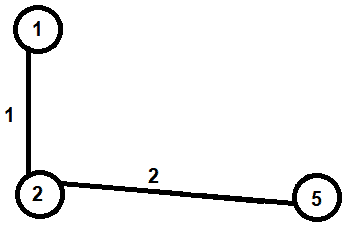

图 10.35

从最小生成树中的顶点`1`、`2`和`5`出发，我们寻找具有最低权重的边。边（**5**，**3**）具有最低的权重`1`，因此边（**5**，**3**）被添加到最小生成树中：

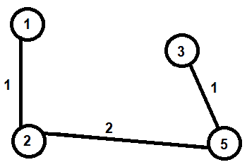

图 10.36

现在，我们需要从现有的最小生成树中的顶点中找到通向顶点`4`的边。边（**3**，**4**）具有最低的权重，因此被添加到最小生成树中：


图 10.37

编译并运行程序后，你应该得到一个类似于以下屏幕截图的输出：

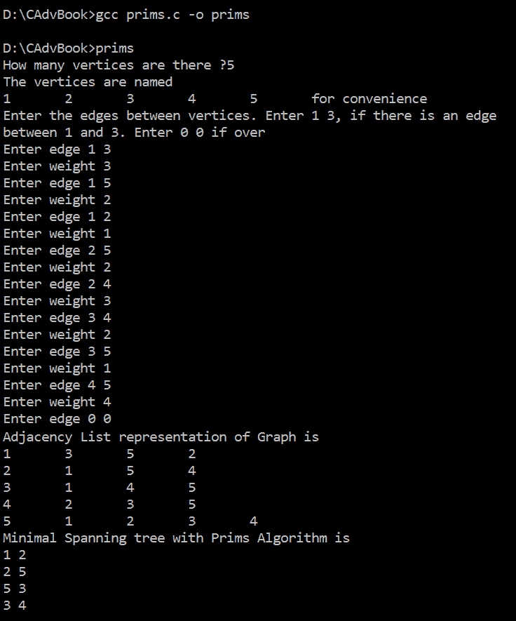

图 10.38

现在，让我们继续下一个菜谱！

# 使用克鲁斯卡尔算法创建最小生成树

在这个菜谱中，我们将学习如何使用克鲁斯卡尔算法制作最小生成树。

无向图的最小/最小生成树是由连接图中所有顶点的最低总成本的边形成的树。如果且仅当图是连通的，最小生成树才存在。如果存在任何两个顶点之间的路径，则称图是连通的。

在这里，图中的节点最初被认为是具有一个节点的**n**个不同的部分树。算法的每一步，两个不同的部分树通过图中的一条边连接成一个部分树。当只有一个部分树存在时（例如，经过**n-1**次这样的步骤后），它就是一个最小生成树。

使用最低成本的连接弧连接两个不同的树。为此，可以根据权重将弧放置在优先队列中。然后检查权重最低的弧是否连接了两个不同的树。为了确定弧（x，y）是否连接了两个不同的树，我们可以在每个节点中实现一个父字段来表示树。然后，我们可以遍历 x 和 y 的所有祖先以获得连接它们的树的根。如果两个树的根是同一个节点，并且 x 和 y 已经在同一个树中，那么弧（x，y）将被丢弃，然后检查下一个最低权重的弧。

# 如何做到这一点...

按照以下步骤使用克鲁斯卡尔算法创建最小生成树：

1.  按照边的权重升序对边列表进行排序。

1.  从边列表的顶部（权重最小的边）取出边。

1.  从边列表中删除这条边。

1.  使用给定的边连接两个顶点。如果通过连接顶点，在图中形成了一个环，那么就丢弃这条边。

1.  重复先前的**步骤 2**到**4**，直到添加了**n-1**条边或边列表完整。

使用克鲁斯卡尔算法创建最小生成树的程序如下：

```cpp
//kruskal.c

#include <stdlib.h>
#include <stdio.h>
#define max 20

struct node
{
 int nme;
 int wt;
 struct node *v;
 struct node *e;
}; 

typedef struct lst
{
 int u,v;
 int wt;
 struct lst *nxt;
}lst; 

lst *pq=NULL;
lst *tr=NULL;
void addpqu(int a, int b, int w);
void maketree();
void disptree();
lst *delet();
int parent[max]; 

int main()
{
 int n,i,j,noe,w;
 int a,b;
 struct node *adj,*newNode,*p,*q;
 printf ("How many vertices are there ? ");
 scanf("%d",&n);
 for(i=1;i<=n;i++)parent[i]=0;
 printf("The vertices are named\n");
 for(i=1;i<=n;i++)printf("%d\t",i);
 printf("for convenience \n");
 for(i=1;i<=n;i++)
 {
     if (i==1)
     {
         newNode =malloc(sizeof (struct node));
         newNode->nme=i;
         adj=newNode;
         p=newNode;
         newNode->v=NULL;
         newNode->e=NULL;
     }
     else
     {
         newNode=malloc(sizeof (struct node));
         newNode->nme=i;
         newNode->v=NULL;
         newNode->e=NULL;
         p->v=newNode;
         p=newNode;
     }
 }
 printf("Enter the edges between vertices. Enter 1 3, if there is an edge\n");
 printf("between 1 and 3\. Enter 0 0 if over\n");
 noe=n*(n-1);
 for(j=1;j<=noe;j++)
 {
     printf("Enter edge: ");
     scanf("%d %d",&a,&b);
     if(a==0 && b==0)break;
     printf("Enter weight: ");
     scanf("%d",&w);
     p=adj;
     while(p!=NULL && p->nme!=a)
         p=p->v;
     if(p==NULL)
     {
         printf("Sorry no vertex exist by this name\n");
         break;
     }
     q=p;
     while(q->e!=NULL)q=q->e;
     newNode=malloc(sizeof (struct node));
     newNode->nme=b;
     newNode->wt=w;
     q->e=newNode;
     newNode->e=NULL;
     newNode->v=NULL;
     addpqu(a,b,w);
 }
 printf ("Adjacency List representation of Graph is\n");
 p=adj;
 while (p!=NULL)
 {
     printf ("%d\t",p->nme);
     q=p->e;
     while(q!=NULL)
     {
         printf("%d\t",q->nme);
         q=q->e;
     }
     printf("\n");
     p=p->v;
 }
 maketree();
 disptree();
 return 0;
} 

void addpqu(int a, int b, int w)
{
 lst *newNode,*k,*h;
 newNode=(lst *)malloc(sizeof(lst));
 newNode->u=a;
 newNode->v=b;
 newNode->wt=w;
 newNode->nxt=NULL;
 if(pq==NULL)
     pq = newNode;
 else
 {
     if(newNode->wt < pq->wt)
     {
         newNode->nxt=pq;
         pq=newNode;
     }
     else
     {
         k=pq;
         while((k!=NULL) &&(k->wt <= newNode->wt))
         {
             h=k;
             k=k->nxt;
         }
         h->nxt=newNode;
         newNode->nxt=k;
     }
   }
 } 

lst *delet()
{
 lst *q;
 if (pq !=NULL)
 {
     q=pq;
     pq=pq->nxt;
     return q;
 }
 else
     return NULL;
 } 

void maketree()
{
 lst *newNode,*p;
 int x,y,r1,r2;
 newNode=delet();
 while(newNode !=NULL)
 {
     newNode->nxt=NULL;
     x=newNode->u;
     y=newNode->v;
     while(x>0)
     {
         r1=x;
         x=parent[x];
     }
     while(y>0)
     {
         r2=y;
         y=parent[y];
     }
     if(r1 !=r2)
     {
         parent[r2]=r1;
         if (tr==NULL)
         {
             tr=newNode;
             p=tr;
         }
         else
         {
             p->nxt=newNode;
             p=newNode;
         }
     }
     newNode=delet();
   }
 } 

void disptree()
{
 lst *t;
 t=tr;
 printf("Minimal Spanning tree with Kruskal Algorithm is \n");
 while(t!=NULL)
 {
     printf("%d %d\n",t->u,t->v);
     t=t->nxt;
 }
}
```

现在，让我们深入了解代码，以便更好地理解。

# 它是如何工作的...

考虑以下无向图：

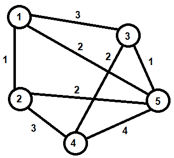

图 10.39

因为图有五个顶点，所以最小生成树将有四条边。克鲁斯卡尔算法的第一步是将图的边按照它们的权重升序排序：

```cpp
Weight   Src    Dest
 1        1      2
 1        3      5
 2        1      5
 2        2      5
 2        3      4
 3        1      3
 3        2      4
 4        4      5
```

现在，我们将从先前的表中逐条取出一条边，如果它不会形成环，我们将它包含在最小生成树中。我们首先从边（**1**，**2**）开始。这条边中没有环；因此，它被包含在以下最小生成树中：


图 10.40

表中的下一个边是（**3**，**5**）。这条边也不会形成环，所以它被包含在最小生成树中：

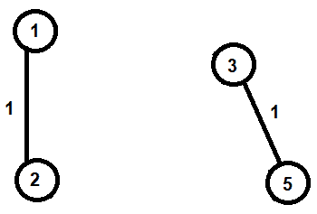

图 10.41

接下来，选择边缘（**1**，**5**）。同样，这个边缘也没有形成循环，所以它被包含在最小生成树中：


图 10.42

表格中的下一个边缘是（**2**，**5**），但它确实形成了一个循环，所以被舍弃了。表格中的下一个边缘是（**3**，**4**）。边缘（**3**，**4**）没有形成循环；因此，它被添加到最小生成树中：

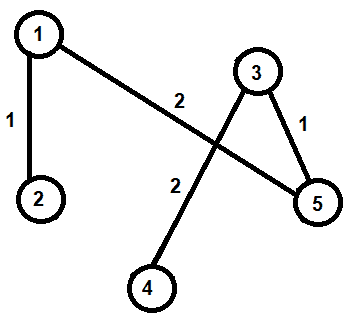

图 10.43

顶点的数量是 5，所以边的数量将是*v-1*，即 4，我们已经有 4 条边，所以我们的最小生成树是完整的。

在编译并运行`kruskal.c`程序后，我们得到一个类似于以下截图的输出：


图 3.44

如您所见，我们在输出中使用了克鲁斯卡尔算法得到了邻接表表示和最小生成树。
