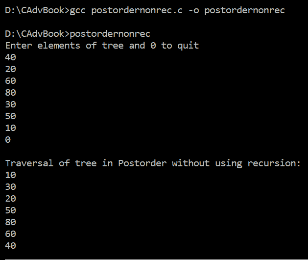

# 第十一章：高级数据结构与算法

在本章中，我们将学习高级数据结构和算法。我们将学习如何使用栈、循环链表、双向链表和二叉树等结构及其遍历。

在本章中，我们将介绍以下食谱：

+   使用单链表实现栈

+   实现双向或双向链表

+   实现循环链表

+   递归地实现二叉搜索树并进行中序遍历

+   非递归地遍历二叉树的后序

在我们深入研究食谱之前，了解我们将在本章以及本书其他食谱中使用的一些结构和相关术语对我们来说将是有帮助的。

# 栈

栈是一种数据结构，其中所有插入和删除操作都在一端进行。进行插入和删除操作的一端称为**栈顶**（**tos**）。栈也称为**下推列表**或**后进先出**（**LIFO**）；也就是说，最后添加到栈中的项目将添加到所有较早项目的顶部，并将是第一个被取出的项目。

可以在栈上执行的操作如下：

+   **Push**：这是将值推入栈中。在将值推入栈之前，栈顶的值会增加以指向新位置，新值可以推入该位置。

+   **Pop**：这是弹出或获取栈中的值。栈顶的值或被顶指针指向的值从栈中取出。

+   **Peep**：这显示了栈顶的值，即栈所指向的值，而不从栈中取出该值。

# 双向链表（双向链表）

在双向或双向链表中，结构中使用两个指针，其中一个指针指向正向，另一个指针指向反向。这两个指针使我们能够以两种方式遍历链表，即以**先进先出**（**FIFO**）顺序以及后进先出（**LIFO**）顺序。在单链表中，遍历只能在一个方向上进行。双向链表的节点看起来如下：


如前图所示，有两个指针，`next`和`prev`（你可以给这些指针起任何你喜欢的名字）。`next`指针指向下一个节点，而`prev`指针指向其前一个节点。为了在两个方向上遍历双向链表，我们将使用另外两个称为`startList`和`endList`的指针。`startList`指针被设置为指向第一个节点，而`endList`指针被设置为指向最后一个节点，以便在两个方向上遍历双向链表。

要按 FIFO 顺序遍历，我们从 `startList` 指针指向的节点开始遍历，借助 `next` 指针进一步移动。要按 LIFO 顺序遍历链表，我们从 `endList` 指针指向的节点开始遍历链表，然后借助 `prev` 指针向后移动。

由某些节点组成的双向链表可能看起来如下：


注意，第一个节点的 `prev` 指针和最后一个节点的 `next` 指针被设置为 `NULL`。这些 `NULL` 值有助于终止遍历过程。

# 循环链表

在线性链表中，节点一个接一个地连接，除了第一个节点外，每个节点都有一个唯一的 predecessor 和 successor。最后一个节点被设置为指向 `NULL` 以指示链表的结束。但在循环链表的情况下，最后一个节点的下一个指针指向第一个节点，而不是指向 `NULL`。换句话说，循环链表没有 `NULL` 指针，如下面的图所示：


循环链表相对于线性链表的优势在于，循环链表允许指针向反方向移动。在现实世界的应用中，循环链表被用于多个地方。例如，它可以在操作系统调度 CPU 时以轮询方式使用，它可以在歌曲播放列表中使用，也可以用于跟踪游戏中的用户。

# 二叉树

一棵树中所有节点都可以有两个孩子或兄弟（最多）的树称为二叉树。二叉树有以下特点：

+   一棵树在级别 *l* 上最多有 2^l 个节点。

+   如果一个二叉树在级别 *l* 上有 *m* 个节点，它在级别 *l+1* 上最多有 *2m* 个节点。

+   一棵树包含 *2d* 个叶子节点，因此有 *2d-1* 个非叶子节点，其中 *d* 是它的深度。

+   一个包含 *n* 个内部节点的二叉树有 (*n+1*) 个外部节点。

+   一个包含 *n* 个节点的二叉树恰好有 *n+1* 个 `NULL` 链接（见下面的截图）：


# 二叉搜索树

二叉搜索树是一种树，其中搜索一个元素的搜索时间是 `O(log2n)`（这比在二叉树中搜索一个元素的 `O(n)` 快）。但为了支持 `O(log2n)` 的搜索，我们需要向二叉树添加一个特殊属性：我们将所有值小于根节点值的节点放入其左子树，所有值大于根节点值的节点放入其右子树。

# 遍历树

遍历意味着访问树中的节点。遍历二叉树有三种方式：前序、中序和后序。由于遍历二叉树需要访问根节点及其左右子节点，这三种遍历方式仅在访问顺序上有所不同。使用递归方法定义的树遍历方法如下：

对于前序遍历，这些是步骤：

1.  访问根节点

1.  以前序遍历遍历左子树

1.  以前序遍历遍历右子树

在前序遍历中，首先访问二叉树的根节点。

对于中序遍历，这些是步骤：

1.  以中序遍历遍历左子树

1.  访问根节点

1.  以中序遍历遍历右子树

对于后序遍历，这些是步骤：

1.  以后序遍历遍历左子树

1.  以后序遍历遍历右子树

现在我们已经对这个章节中将要讨论的结构有了全面的介绍，我们可以开始我们的旅程。

# 使用单链表实现栈

在这个菜谱中，我们将学习如何实现一个具有 LIFO 结构的栈。LIFO 意味着最后添加到栈中的元素将是第一个被移除的。栈是任何编译器和操作系统中非常重要的组件。栈用于分支操作、递归以及许多其他系统级任务。栈可以使用数组以及通过链表实现。在这个菜谱中，我们将学习如何使用单链表实现栈。

# 如何做到这一点...

按照以下步骤使用链表实现栈：

1.  定义一个名为`node`的结构。在这个结构中，除了用于存储栈内容的成员变量外，还定义了一个指针，该指针指向下一个节点。

1.  将`top`指针初始化为`NULL`以指示栈当前为空。

1.  显示菜单并询问用户是否要从栈中压入或弹出值。用户可以输入 1 表示他们想要将值压入栈中，或输入 2 表示他们想要从栈中弹出值。如果用户输入`1`，转到*步骤 4*。如果他们输入`2`，转到*步骤 9*。如果他们输入`3`，则表示他们想要退出程序，因此转到*步骤 13*。

1.  为新节点分配内存。

1.  询问用户要压入的值并将该值分配给节点的数据成员。

1.  调用`push`函数，将新节点的下一个指针设置为指向`top`。

1.  将`top`指针设置为指向其`next`指针指向的位置。

1.  转到*步骤 3*以显示菜单。

1.  检查`top`指针是否为`NULL`。如果是，则显示消息`栈为空`并转到*步骤 3*以显示菜单。如果`top`不是`NULL`，转到下一步。

1.  设置一个临时指针`temp`，使其指向`top`指向的节点。

1.  将`top`指针设置为指向其`next`指针指向的位置。

1.  将`temp`所指向的节点作为出栈节点返回，并显示该出栈节点的数据成员。

1.  退出程序。

使用链表实现栈的程序如下：

```cpp
//stacklinkedlist.c

#include<stdio.h>

#include <stdlib.h>

struct node {
  int data;
  struct node * next;
};

void push(struct node * NewNode, struct node ** Top);
struct node * pop(struct node ** Top);

int main() {
  struct node * newNode, * top, * recNode;
  int n = 0;
  top = NULL;
  while (n != 3) {
    printf("\n1\. Pushing an element into the stack\n");
    printf("2\. Popping out an element from the stack\n");
    printf("3\. Quit\n");
    printf("Enter your choice 1/2/3:");
    scanf("%d", & n);
    switch (n) {
    case 1:
      newNode = (struct node * ) malloc(sizeof(struct node));
      printf("Enter the value to push: ");
      scanf("%d", & newNode - > data);
      push(newNode, & top);
      printf("Value %d is pushed to stack\n", newNode - > data);
      break;
    case 2:
      recNode = pop( & top);
      if (recNode == NULL) printf("Stack is empty\n");
      else
        printf("The value popped is %d\n", recNode - > data);
      break;
    }
  }
  return 0;
}
void push(struct node * NewNode, struct node ** Top) {
  NewNode - > next = * Top;
  * Top = NewNode;
}

struct node * pop(struct node ** Top) {
  struct node * temp;
  if ( * Top == NULL) return (NULL);
  else {
    temp = * Top;
    ( * Top) = ( * Top) - > next;
    return (temp);
  }
}
```

现在，让我们深入了解幕后，以便我们可以理解代码。

# 它是如何工作的...

首先，定义一个结构体，称为节点，它由两个成员组成：一个是数据，另一个是名为`next`的指针。因为我们希望我们的栈只存储整数值，所以结构体的数据成员被定义为整数，用于存储整数，而下一个指针用于连接其他节点。最初，`top`指针被设置为`NULL`。

设置一个`while`循环来执行，循环内显示菜单。菜单设置为显示三个选项：1，将值推入栈中；2，从栈中弹出；3，退出。直到用户在菜单中输入 3，`while`循环将继续执行并继续显示菜单，提示用户输入所需的选项。如果用户输入 1 以将值推入栈中，则通过`newNode`创建一个新的节点。提示用户输入要推入栈中的值。假设用户输入的数据是 10。在这里，该值将被分配给`newNode`的数据成员，如下所示：


此后，调用`push`函数，并将`newNode`和`top`指针传递给它。在`push`函数中，将`newNode`的下一个指针设置为指向`top`指针，此时`top`指针为`NULL`，然后设置`top`指针指向 X，如下所示：


`top`指针必须始终指向最后一个插入的节点。因此，它被设置为指向`newNode`。完成`push`函数后，控制权返回到`main`函数，此时菜单将再次显示。

假设用户输入 1 以将另一个值推入栈中。再次，通过`newNode`创建一个新的节点。要求用户输入要推入的值。假设用户输入 20，则值 20 将被分配给`newNode`的数据成员。调用`push`函数，并将`newNode`和`top`指针传递给它。在这里，`top`指针指向之前推入的节点，如下所示：


在`push`函数中，将`newNode`的下一个指针设置为指向`top`指针所指向的节点，如下所示：


然后，将`top`指针设置为指向`newNode`，如下所示：


执行`push`函数后，菜单将再次显示。假设用户想要从栈中*pop*出一个值。为此，他们将在菜单中输入 2。将调用`pop`函数，并将栈顶指针传递给它。在`pop`函数中，确保`top`指针不是`NULL`，因为如果是，这意味着栈已经为空；无法从空栈中弹出值。要从栈中获取值，我们将使用一个名为`temp`的临时指针。`temp`指针被设置为指向由`top`指针指向的节点：


此后，`top`指针将移动到下一个节点，即其`next`指针所指向的节点。由`temp`指针指向的节点将被返回到`main`函数：


在`main`函数中，`pop`函数返回的节点被分配给`recNode`。首先，确认`recNode`不是`NULL`。然后，在屏幕上显示其数据成员的值。因此，20 将在屏幕上显示。

执行`pop`函数后，菜单将再次显示，询问用户输入所需的选项。假设用户按下 2 以从栈中弹出另一个值。再次调用`pop`函数。在`pop`函数中，我们检查`top`指针是否不是`NULL`并且它指向一个节点。因为`top`指针指向一个节点并且不是`NULL`，所以设置一个临时指针`temp`指向由`top`指针指向的节点：


此后，将`top`指针设置为指向其`next`指针所指向的位置。`top`的`next`指针指向`NULL`，因此`top`指针将被设置为`NULL`，而由`temp`指针指向的节点将被返回到`main`函数。

在`main`函数中，从`pop`函数返回的节点被分配给`recNode`指针。确认`recNode`不是指向`NULL`后，在屏幕上显示`recNode`的数据成员的值。因此，值 10 将出现在屏幕上。执行`pop`函数后，屏幕上再次显示菜单。

假设用户想要再次弹出栈。但在这个时候，我们知道栈是空的。当用户在菜单上按下 `2` 时，将调用 `pop` 函数。然而，由于 `top` 指针的值为 `NULL`，`pop` 函数将返回一个 `NULL` 值给 `main` 函数。在 `main` 函数中，`pop` 函数返回的 `NULL` 值被分配给 `recNode` 指针。由于 `recNode` 指针被分配 `NULL`，屏幕上会显示一条消息“栈为空”。再次，菜单将显示，提示用户输入选择。输入 `3` 后，程序将终止。

程序使用 GCC 编译。因为没有错误出现在编译过程中，这意味着 `stacklinkedlist.c` 程序已成功编译成 `stacklinkedlist.exe` 文件。执行该文件后，我们得到一个菜单，提示我们从栈中压入或弹出，如下面的截图所示：


当从栈中弹出时，你必须已经注意到栈是一个后进先出（LIFO）结构，最后压入的值是第一个被弹出的。

现在，让我们继续下一个菜谱！

# 实现双向或双向链表

在这个菜谱中，我们将学习如何创建双向链表以及如何以先进先出（FIFO）和后进先出（LIFO）的顺序遍历其元素。正如我们在本章引言中解释的那样，双向链表的节点由两个指针组成：一个指向前方，而另一个指向后方。指向前方的指针通常称为 `next`，用于指向下一个节点。另一个指向后方的指针通常称为 `prev`，用于指向前一个节点。

先进先出（FIFO）顺序的遍历意味着双向链表的元素以它们被添加到列表中的顺序显示。遍历是通过使用节点的 `next` 指针完成的。

后进先出（LIFO）顺序的遍历意味着元素以反向或倒序显示，并且这种遍历是通过 `prev` 指针完成的。

# 如何做这件事...

在这个双向链表中，我将使用两个指针，`startList` 和 `endList`，其中 `startList` 将指向第一个节点，而 `endList` 将指向最后一个节点。`startList` 指针将帮助以先进先出（FIFO）的顺序遍历列表，而 `endList` 指针将帮助以后进先出（LIFO）的顺序遍历它。按照以下步骤创建双向链表并双向遍历：

1.  定义一个名为 `node` 的结构体。为了存储双向链表的内容，在节点结构体中定义一个数据成员。定义两个指针，分别称为 `next` 和 `prev`。

1.  显示一个菜单，显示四个选项：`1`，创建双向链表；`2`，以 LIFO 顺序显示列表元素；`3`，以 FIFO 顺序显示元素；以及`4`，退出。如果用户输入 1，转到*步骤 3*。如果用户输入 2，转到*步骤 10*。如果用户输入 3，转到*步骤 15*。最后，如果用户输入 4，则意味着他们想要退出程序，因此转到*步骤 19*。

1.  将`startList`指针初始化为`NULL`。

1.  为新节点分配内存。

1.  询问用户要添加到双向链表中的值。用户输入的值分配给节点的数据成员。

1.  将节点的`next`和`prev`指针设置为`NULL`。

1.  如果这个节点是双向链表的第一个节点，将`startList`指针设置为指向新节点。如果这个节点不是第一个节点，不要干扰`startList`指针，让它指向它当前指向的节点。

1.  如果这是双向链表的第一个节点，将`endList`指针设置为指向新节点。如果不是第一个节点，执行以下步骤：

    1.  将新节点的`next`指针设置为`NULL`。

    1.  将新节点的`prev`指针设置为指向`endList`指向的节点。

    1.  将`endList`的`next`指针设置为指向新节点。

    1.  将`endList`设置为指向新节点。

1.  询问用户是否需要向双向链表添加更多元素。如果用户想要添加更多，转到*步骤 4*；否则，通过转到*步骤 2*来显示菜单。

1.  要以 LIFO 顺序显示链表，让`temp`指针指向`endList`指向的节点。

1.  让*步骤 12*和*步骤 13*运行，直到`temp`指针达到`NULL`。

1.  显示`temp`指针指向的节点的数据成员。

1.  将`temp`指针设置为指向其`prev`指针指向的位置。

1.  双向链表的内容以 LIFO 顺序显示。现在，转到*步骤 2*以再次显示菜单。

1.  让`temp`指针指向`startList`指针指向的节点。

1.  如果`temp`指针不是`NULL`，显示`temp`指针指向的节点的数据成员。

1.  让`temp`指向其`next`指针指向的节点。

1.  如果`temp`已达到`NULL`，这意味着双向链表的所有节点都已遍历。现在，可以通过跳转到*步骤 2*来显示菜单。如果`temp`未达到`NULL`，则转到*步骤 16*以显示双向链表的其余元素。

1.  退出程序。

实现双向或双向链表的程序如下：

```cpp
//doublylinkedlist.c

#include <stdio.h>

#include <stdlib.h>

#include <string.h>

struct node {
  int data;
  struct node * next, * prev;
};

struct node * startList, * endList;
void createdoubly();
void list_lifo();
void list_fifo();

int main() {
  int n = 0;
  while (n != 4) {
    printf("\n1\. Creating a doubly linked list\n");
    printf("2\. Displaying elements in L.I.F.O. order\n");
    printf("3\. Displaying elements in F.I.F.O. order\n");
    printf("4\. Quit\n");
    printf("Enter your choice 1/2/3/4: ");
    scanf("%d", & n);
    switch (n) {
    case 1:
      createdoubly();
      break;
    case 2:
      list_lifo();
      break;
    case 3:
      list_fifo();
      break;
    }
  }
  return 0;
}

void createdoubly() {
  char k[10];
  struct node * newNode;
  startList = NULL;
  strcpy(k, "yes");
  while (strcmp(k, "yes") == 0 || strcmp(k, "Yes") == 0) {
    if (startList == NULL) {
      newNode = (struct node * ) malloc(sizeof(struct node));
      printf("Enter the value to add: ");
      scanf("%d", & newNode - > data);
      newNode - > next = NULL;
      newNode - > prev = NULL;
      startList = newNode;
      endList = startList;
    } else {
      newNode = (struct node * ) malloc(sizeof(struct node));
      printf("Enter the value to add: ");
      scanf("%d", & newNode - > data);
      newNode - > next = NULL;
      newNode - > prev = endList;
      endList - > next = newNode;
      endList = newNode;
    }
    printf("Want to add more yes/no? ");
    scanf("%s", k);
  }
  printf("Doubly linked list is created\n");
}
void list_lifo() {
  struct node * temp;
  temp = endList;
  if (temp != NULL) {
    printf("The elements of the doubly linked list in L.I.F.O. order :\n");
    while (temp != NULL) {
      printf("%d\n", temp - > data);
      temp = temp - > prev;
    }
  } else
    printf("The doubly linked list is empty\n");
}

void list_fifo() {
  struct node * temp;
  temp = startList;
  printf("The elements of the doubly linked list in F.I.F.O. order: \n");
  while (temp != NULL) {
    printf("%d\n", temp - > data);
    temp = temp - > next;
  }
}
```

现在，让我们幕后看看，以便我们可以理解代码。

# 如何工作...

在实现双链表时，定义了一个结构体，称为节点，它由一个名为 `data` 的整数和两个指针 `next` 和 `prev` 组成。因为双链表可以从两端遍历——即正向或反向——所以需要两个指针。`next` 指针将指向它后面的节点，而 `prev` 指针将指向它前面的节点。

屏幕上显示了一个菜单，显示四个选项：`1`，用于创建双链表；`2`，用于以 LIFO 顺序显示双链表中的元素；`3`，用于以 FIFO 顺序显示元素；以及 `4`，用于退出程序。

假设用户输入了 1。`createdoubly` 函数将被调用。在这个函数中，`startList` 指针被设置为 `NULL`，一个字符串变量 `k` 被分配了 `yes` 字符串。设置了一个 `while` 循环，在 `k` 被分配了 `yes` 时执行。在这里，用户可以在被提示继续时输入 `yes`，以继续向双链表添加更多元素。`startList` 指针将被设置为指向双链表的第一个节点，而 `endList` 指针将被设置为指向最后一个节点。

添加第一个节点的过程与添加其余节点的过程不同。因此，在代码中创建了 `if else` 块。当创建第一个节点时 `startList` 是 `NULL`，将执行 `if` 块；否则，将执行 `else` 块。在 `if` 块中，创建了一个名为 `newNode` 的新节点。用户被要求输入双链表的值。假设用户输入了值 10；这将分配给 `newNode` 的数据成员，并且 `newNode` 的 `next` 和 `prev` 指针将被设置为 `NULL`：


`startList` 指针被设置为指向 `newNode`，而 `endList` 指针也被设置为指向 `newNode`：


`endList` 不会停留在第一个节点上；相反，它将继续前进并指向这个双链表的最后一个节点。在执行 `if` 块之后，用户会被询问是否需要添加更多节点。如果用户输入 `yes`，`while` 循环将再次执行。现在，`startList` 不是 `NULL`，而是指向 `newNode`；因此，将执行 `else` 块，而不是 `if` 块。在 `else` 块中，创建了一个名为 `newNode` 的新节点。用户被提示输入要添加到双链表中的值。假设用户输入了值 20，这个值将被分配给 `newNode` 的数据成员：


`newNode` 的 `prev` 指针被设置为指向 `endList`，而 `newNode` 的 `next` 指针被设置为 `NULL`。`endList` 的 `next` 指针被设置为指向 `newNode`，如下所示：


之后，`endList`指针被设置为指向`newNode`，但`startList`指针将保持指向第一个节点，如下所示：


再次询问用户是否想要向双链表添加更多元素。假设用户不想向列表添加更多元素，因此他们输入的文本是`no`。文本`no`将被分配给`k`，因此`while`循环将终止。`createdoubly`函数结束，控制将返回到`main`函数。在`main`函数中，将显示上述四个选项的菜单。

假设用户输入 2 以按 LIFO 顺序显示双链表的元素。在这里，将调用`list_lifo`函数。在`list_lifo`函数中，使用了一个名为`temp`的临时指针，并将其设置为指向由`endList`指针所指向的最后节点：


一个`while`循环被设置为执行，直到`temp`指针达到`NULL`。`temp`指针所指向的节点数据成员中的值将在屏幕上显示。在这里，屏幕上将显示一个值为 20。之后，`temp`指针被设置为指向其`prev`指针所指向的节点：


再次检查`temp`指针的值。因为`temp`指针不是`NULL`，所以`while`循环将再次执行。在`while`循环内，`temp`指针所指向的节点数据成员中的值将在屏幕上显示。在这里，屏幕上将显示一个值为 10。之后，`temp`指针被设置为指向其`prev`指针所指向的节点。`temp`的`prev`指针指向`NULL`，因此`temp`指针被设置为指向`NULL`。现在，因为`temp`指向`NULL`，`while`循环将终止，`list_lifo`函数结束，控制返回到`main`函数。

在`main`函数中，将再次显示菜单，询问用户输入所需的选项。现在，假设用户输入 3 以按 FIFO 顺序显示双链表的元素。输入 3 后，将调用`list_fifo`函数。在`list_fifo`函数中，`temp`指针被设置为指向由`startList`指针所指向的节点，如前所述。`while`循环被设置为执行，直到`temp`指针指向`NULL`。因为`temp`不是`NULL`，所以`temp`指针所指向的节点数据成员中的值将在屏幕上显示。在这里，屏幕上将显示一个值为 10。之后，`temp`指针被设置为指向其`next`指针所指向的节点，如下所示：


因为 `temp` 指针仍然没有指向 `NULL`，所以 `while` 循环将再次执行。在 `while` 循环内部，显示由 `temp` 指针指向的节点中的数据成员的值；将显示一个值为 20 的值。再次，将 `temp` 指针设置为指向其下一个指针指向的节点。`temp` 的下一个指针指向一个 `NULL` 指针，因此 `temp` 将指向 `NULL`。因为 `temp` 指针指向 `NULL`，所以 `while` 循环将终止；因此，`list_fifo` 函数结束，控制返回到 `main` 函数。在这里，菜单再次显示，询问用户输入所需的选项。假设用户输入 4 以退出程序。输入 4 后，程序将终止。

使用 GCC 编译程序。因为没有在编译时出现错误，这意味着 `doublylinkedlist.c` 程序已成功编译成 `doublylinkedlist.exe` 文件。执行该文件时，我们得到一个菜单，要求用户输入创建双链表和遍历双链表（按 LIFO 和 FIFO 顺序）的选项。通过这样做，我们得到以下输出：


前面的截图显示了使用遍历其元素按 FIFO 和 LIFO 顺序的双向链表的好处。

# 实现循环链表

在这个菜谱中，我们将学习如何实现循环链表。线性链表和循环链表之间的区别在于，线性链表的最后一个节点指向 `NULL`，而循环链表的最后一个节点的指针指向第一个节点，因此允许指针以反向方向遍历。

# 如何做到这一点...

按照以下步骤实现循环链表：

1.  定义一个名为 `node` 的结构体。为了在循环链表中存储数据，定义节点结构体中的一个数据成员。除了数据成员外，还定义一个指针，该指针将指向下一个节点。

1.  一个名为 `startList` 的指针被初始化为 `NULL`。`startList` 指针将指定循环链表的起始位置。

1.  显示一个菜单，并要求用户按下 `1` 以向循环链表中添加元素，`2` 以显示循环链表中的元素，以及 `3` 以退出程序。如果用户输入 1，则转到 *步骤 4*。如果他们输入 2，则转到 *步骤 16*。如果他们输入 3，则意味着他们想要退出程序，因此转到 *步骤 23*。

1.  提示用户指定他们想要添加到循环链表中的数字数量。设置一个循环，执行指定次数；也就是说，*步骤 5* 到 *步骤 14* 将重复指定次数。

1.  为新节点分配内存。

1.  询问用户要添加到循环链表中的值。用户输入的值被分配给节点的数据成员。

1.  如果 `startList` 是 `NULL`——也就是说，如果是循环链表的第一个节点——则让 `startList` 指针指向一个新节点。

1.  要使链表看起来是循环的，让 `startList` 的下一个指针指向 `startList`。

1.  如果 `startList` 不是 `NULL`——也就是说，如果不是循环链表的第一个节点——则遵循 *步骤 10* 到 *步骤 14*。

1.  让 `temp` 指针指向 `startList`。

1.  直到 `temp` 的 `next` 指针等于 `startList`，让 `temp` 指针指向其下一个指针指向的位置；也就是说，设置 `temp` 指针，使其指向循环链表的最后一个节点。

1.  一旦 `temp` 指针达到循环链表的最后一个节点，将 `temp` 的下一个指针设置为指向新节点。

1.  然后，将 `temp` 指针设置为指向新节点。

1.  将 `temp` 的下一个指针设置为指向 `startLIst`。

1.  跳转到 *步骤 3* 来显示菜单。

1.  上一步确保 `startList` 不是 `NULL`。如果 `startList` 是 `NULL`，这意味着循环链表为空。在这种情况下，会显示一条消息，通知用户循环链表为空。然后，控制跳转到 *步骤 3* 来显示菜单。

1.  如果 `startList` 不是 `NULL`，则在屏幕上显示由 `startList` 指针指向的节点的数据成员。

1.  设置一个临时指针 `temp`，使其指向 `startList` 的下一个指针指向的位置。

1.  重复 *步骤 20* 和 *步骤 21*，直到 `temp` 指针达到由 `startList` 指针指向的节点。

1.  显示由 `temp` 数据成员指向的节点的内容。

1.  将 `temp` 指针设置为指向其下一个指针指向的位置。

1.  跳转到 *步骤 3* 来显示菜单。

1.  终止程序。

实现循环链表的程序如下：

```cpp
//circularlinkedlist.c

#include <stdio.h>

#include <stdlib.h>

struct node {
  int data;
  struct node * next;
};

struct node * startList = NULL;

void addlist(struct node ** h);
void disp();

int main() {
  struct node * newNode;
  int n = 0, i, k;
  while (n != 3) {
    printf("\n1\. Adding elements to the circular linked list\n");
    printf("2\. Displaying elements of the circular linked list\n");
    printf("3\. Quit\n");
    printf("Enter your choice 1/2/3: ");
    scanf("%d", & n);
    switch (n) {
    case 1:
      printf("How many values are there ");
      scanf("%d", & k);
      printf("Enter %d values\n", k);
      for (i = 1; i <= k; i++) {
        newNode = (struct node * ) malloc(sizeof(struct node));
        scanf("%d", & newNode - > data);
        addlist( & newNode);
      }
      printf("Values added in Circular Linked List \n");
      break;
    case 2:
      disp();
      break;
    }
  }
  return 0;
}

void addlist(struct node ** NewNode) {
  struct node * temp;
  if (startList == NULL) {
    startList = * NewNode;
    startList - > next = startList;
  } else {
    temp = startList;
    while (temp - > next != startList)
      temp = temp - > next;
    temp - > next = * NewNode;
    temp = * NewNode;
    temp - > next = startList;
  }
}

void disp() {
  struct node * temp;
  if (startList == NULL)
    printf("The circular linked list is empty\n");
  else {
    printf("Following are the elements in circular linked list:\n");
    printf("%d\n", startList - > data);
    temp = startList - > next;
    while (temp != startList) {
      printf("%d\n", temp - > data);
      temp = temp - > next;
    }
  }
}
```

现在，让我们幕后看看，以便我们可以理解代码。

# 它是如何工作的...

定义了一个结构，称为节点，它由两个成员组成：一个整数和一个名为 `next` 的指针。我正在创建一个由整数组成的循环链表，这就是为什么我选择了整数成员。然而，你可以使用你想要的任何数量的成员，以及任何数据类型。

我们定义了一个名为 `startList` 的指针，并将其初始化为 `NULL`。`startList` 指针将用于指向循环链表的第一个节点。

屏幕上显示一个菜单，显示三个选项：`1`，向循环链表中添加元素；`2`，显示循环链表中的元素；`3`，退出。显然，第一步是向循环链表中添加元素。假设用户输入 1。输入 1 后，用户将被要求指定他们想在列表中输入多少个值。用户输入的限制将被分配给一个名为`k`的变量。假设用户想在列表中输入五个元素，将设置一个`for`循环运行五次。在`for`循环中，创建一个名为`newNode`的新节点。用户输入的值被分配给`newNode`的数据成员。假设用户输入的值是 10，它将被分配给`newNode`的数据成员，如下所示：


将调用`addlist`函数并将`newNode`作为参数传递给它。在`addlist`函数中，确认它是否是循环链表的第一个节点；也就是说，如果`startList`是`NULL`，则将其设置为指向`newNode`：


为了使其成为一个循环链表，将`startList`的下一个指针设置为指向`startList`本身：


`addlist`函数结束。控制权返回到主函数并继续执行`for`循环。在`for`循环中，创建一个`newNode`节点。用户输入的值被分配给`newNode`的数据成员。假设用户输入的值是 20，它将被分配给`newNode`的数据成员：


再次调用`addlist`函数并将`newNode`传递给它。在`addlist`函数中，因为`startList`指针不再是`NULL`，所以将执行`else`块。在`else`块中，设置一个临时指针`temp`指向`startList`。设置一个`while`循环，直到`temp`的下一个指针指向`startList`；也就是说，直到`temp`指针到达循环链表的最后一个节点，`temp`指针将不断移动，以便指向它的下一个节点。因为循环链表中只有一个节点，所以`temp`指针已经指向列表的最后一个节点：


一旦`temp`指针到达循环链表的最后一个节点，将`temp`的下一个指针设置为指向`newNode`：


此后，将`temp`指针设置为指向`newNode`：


最后，为了使链表看起来是循环的，将`temp`的下一个指针设置为指向`startList`：


此过程将重复应用于环形链表的其余三个元素。假设输入的其他三个元素是 30、40 和 50，环形链表将如下所示：


在创建环形链表后，用户将再次看到显示菜单。假设用户想要显示环形链表的元素，他们将根据菜单选项输入一个值。输入值后，将调用`disp`函数。在`disp`函数中，确保`startList`指针是`NULL`。如果`startList`指针是`NULL`，则表示环形链表为空。在这种情况下，`disp`函数将在显示环形链表为空的消息后终止。如果`startList`指针不为空，则显示由`startList`指针指向的节点数据成员中的值；即屏幕上显示 10 的值。设置一个临时指针`temp`，使其指向由`startList`的下一个指针指向的节点：


设置一个`while`循环，直到`temp`指针达到由`startList`指针指向的节点。在`while`循环中，显示由`temp`指针指向的节点数据成员；即屏幕上显示 20 的值。之后，将`temp`指针设置为指向其下一个指针指向的节点。这样，`while`循环将继续执行并显示环形链表的所有元素。当`while`循环结束时，`disp`函数也结束。控制返回到`main`函数，菜单将再次显示。要退出程序，用户必须输入 3。输入 3 后，程序将终止。

使用 GCC 编译程序。因为没有错误出现在编译过程中，这意味着`circularlinkedlist.c`程序已成功编译成`circularlinkedlist.exe`文件。执行文件后，我们得到一个菜单，它不仅可以向环形链表添加元素，还可以显示它们。通过这样做，我们得到以下截图所示的输出：


哇！我们已经成功实现了环形链表。现在，让我们继续下一个菜谱！

# 递归地创建二叉搜索树并对其进行中序遍历

在这个菜谱中，我们将要求用户输入一些数字，并从这些数字构建一个二叉树。一旦创建了二叉树，就执行其中序遍历。这些步骤将分为两个部分：创建二叉树和中序遍历二叉树。

# 如何操作... – 二叉树

按照以下步骤创建二叉树：

1.  创建一个具有以下结构的节点：用于存储树元素的`data`，一个指向树右子节点的`right`指针，以及一个指向树左子节点的`left`指针。

1.  创建树的`root`节点。为此，为新节点分配内存空间，并将`root`指针设置为指向它。

1.  提示用户输入树元素。用户输入的值被分配给`root`节点的数据成员。

1.  `root`节点的`left`和`right`指针被设置为`NULL`。

1.  根节点已创建。接下来，提示用户指定树中的元素数量。

1.  重复*步骤 7*到*步骤 22*，直到用户指定的元素数量。

1.  为新节点分配内存空间，并将`new`指针设置为指向它。

1.  提示用户输入树元素。用户输入的树元素被分配给新节点的数据成员。

1.  新节点的`left`和`right`指针被设置为`NULL`。

1.  要将根节点连接到新节点，我们需要找到一个可以连接的位置。为此，设置`temp`指针，使其指向根节点。比较新节点和`temp`节点的数据成员中的值。

1.  如果`new ->data > temp->data`，转到*步骤 12*；否则，转到*步骤 16*。

1.  如果`temp`的右链接是`NULL`——也就是说，如果`temp`节点的右侧没有子节点——则，新节点被添加到`temp`节点的右链接。

1.  新节点被添加为`temp`节点的右子节点。跳转到*步骤 7*以添加更多树元素。

1.  如果根的右链接不是`NULL`，则将`temp`指针设置为指向`temp`的`right`指针指向的位置。

1.  转到*步骤 11*进行更多比较。

1.  如果`new->data < root->data`，转到*步骤 17*；否则，转到*步骤 21*。

1.  如果节点的左链接是`NULL`——也就是说，在`temp`节点的左侧没有子节点——则新节点被添加到左链接。

1.  新节点被添加为`temp`节点的左子节点。跳转到*步骤 7*以添加更多树元素。

1.  如果根的左链接不是`NULL`，则将`temp`指针设置为指向其`left`指针指向的位置。

1.  转到*步骤 11*进行更多比较。

1.  如果`new->data = temp->data`，这意味着新节点中的值是重复的，不能添加到树中。

1.  转到*步骤 7*以添加更多树元素。

1.  对于中序遍历，我们将遵循下一节提供的算法。`inorder`函数被递归调用，并将二叉树的根节点传递给此函数。

# 如何实现... – 树的中序遍历

因为它是递归形式，所以函数将被递归调用。函数如下：

```cpp
inorder(node)
```

在这里，`inorder`是将被递归调用的函数，`node`是传递给它的二叉树节点。最初，节点将是二叉树的根，需要执行中序遍历。遵循以下步骤：

1.  如果节点是`NULL`，则转到*步骤 2*；否则，返回调用函数。

1.  使用相同的函数（即`inorder`函数）并传入节点的左子节点作为参数：

```cpp
call inorder(node->leftchild)
```

1.  显示节点中的内容：

```cpp
display node->info
```

1.  使用相同的函数本身（即`inorder`函数）并传入节点的右子节点作为参数：

```cpp
   call inorder(node->rightchild)
```

创建二叉搜索树并在其中进行中序遍历的程序如下：

```cpp
//binarysearchtree.c

#include <stdio.h>

#include <stdlib.h>

#define max 20
struct tree {
  int data;
  struct tree * right;
  struct tree * left;
};
void build(int Arr[], int Len);
struct tree * makeroot(int val);
void rightchild(struct tree * rootNode, int val);
void leftchild(struct tree * rootNode, int val);
void travino(struct tree * node);
int main() {
  int arr[max], i, len;
  printf("How many elements are there for making the binary search tree? ");
  scanf("%d", & len);
  printf("Enter %d elements in array \n", len);
  for (i = 0; i < len; i++)
    scanf("%d", & arr[i]);
  build(arr, len);
  return 0;
}

void build(int Arr[], int Len) {
  struct tree * temp, * rootNode;
  int j;
  rootNode = makeroot(Arr[0]);
  for (j = 1; j < Len; j++) {
    temp = rootNode;
    while (1) {
      if (Arr[j] < temp - > data) {
        if (temp - > left != NULL) {
          temp = temp - > left;
          continue;
        }
        leftchild(temp, Arr[j]);
      }
      if (Arr[j] > temp - > data) {
        if (temp - > right != NULL) {
          temp = temp - > right;
          continue;
        }
        rightchild(temp, Arr[j]);
      }
      break;
    }
  }
  printf("Binary Search Tree is created\n");
  printf("The inorder traversal of the tree is as follows:\n");
  travino(rootNode);
}

struct tree * makeroot(int val) {
  struct tree * rootNode;
  rootNode = (struct tree * ) malloc(sizeof(struct tree));
  rootNode - > data = val;
  rootNode - > right = NULL;
  rootNode - > left = NULL;
  return rootNode;
}

void leftchild(struct tree * rootNode, int val) {
  struct tree * newNode;
  newNode = (struct tree * ) malloc(sizeof(struct tree));
  newNode - > data = val;
  newNode - > left = NULL;
  newNode - > right = NULL;
  rootNode - > left = newNode;
}

void rightchild(struct tree * rootNode, int val) {
  struct tree * newNode;
  newNode = (struct tree * ) malloc(sizeof(struct tree));
  newNode - > data = val;
  newNode - > left = NULL;
  newNode - > right = NULL;
  rootNode - > right = newNode;
}

void travino(struct tree * node) {
  if (node != NULL) {
    travino(node - > left);
    printf("%d\t", node - > data);
    travino(node - > right);
  }
}
```

现在，让我们深入了解代码背后的工作原理。

# 工作原理... – 二叉树

我们创建了一个名为`tree`的结构，它包含以下成员：

+   `data`：用于存储整数数据的整数成员。在这里，我们假设我们的树只包含整数元素。

+   `right`和`left`指针：这些用于分别指向左子节点和右子节点。

在内部，树将通过一个数组来维护；定义了一个大小为 20 的整数数组。为了我们的目的，让我们假设用户不会为树输入超过 20 个元素。然而，你可以始终将宏的大小增加到任何你想要的更大的数字。

提示用户指定他们想要为树输入的元素数量。假设用户想要为树输入七个元素；这里，值 7 将被分配给`len`变量。提示用户输入七个整数，他们输入的值将被分配到`arr`数组中，如下面的截图所示：


调用`build`函数，并将包含树元素的数组`arr`及其长度`len`传递给它。在`build`函数中，我们需要创建一个树的根节点。为了创建树的根节点，调用`makeroot`函数并将数组`arr`的第一个元素作为参数传递给它。在`makeroot`函数中，创建一个名为`rootNode`的节点，并将第一个数组元素的值分配给其数据成员。因为此时树的根节点没有指向任何其他节点，所以根节点的左右子节点被设置为`NULL`：


`makeroot` 函数结束，并将 `rootNode` 返回给 `build` 函数。在 `build` 函数中，一个 `temp` 指针被设置为指向 `rootNode`。从索引 1 开始的所有数组元素都与 `temp` 节点的数据成员进行比较，即根节点。如果数组元素小于 `temp` 节点的数据成员，则该数组元素将被添加为根节点的左子节点。同样，如果数组元素大于 `temp` 节点的数据成员，它将被添加为根节点的右子节点，例如，如果第二个数组元素是 20，而根节点是 40。因为 20 小于 40，所以会检查 `temp` 节点的 `left` 指针是否为 `NULL`。因为 `temp` 的 `left` 指针是 `NULL`，所以调用 `leftchild` 函数并将 20 传递给它。在 `leftchild` 函数中，创建了一个名为 `newNode` 的新节点。在这里，第二个数组元素（20）被分配给 `newNode` 的数据成员。`newNode` 的 `left` 和 `right` 指针被设置为 `NULL`。`temp` 的 `left` 指针被设置为指向 `newNode`，如下所示：


控制返回到 `build` 函数，其中 `for` 循环将选择下一个数组元素以构建树。假设下一个数组元素是 60。再次，设置一个 `temp` 指针指向根节点。将值 60 与根节点 40 进行比较。因为数组元素的值 60 大于根节点 40，所以检查根节点的右子节点。因为根节点的右子节点是 `NULL`，所以调用 `rightchild` 函数并将 `temp` 指针和数组元素 60 传递给它。在 `rightchild` 函数中，创建了一个名为 `newNode` 的新节点并将值 60 传递给它，该值被分配给其数据成员。`newNode` 的 `left` 和 `right` 指针被设置为 `NULL`。将 `rootNode` 的 `right` 指针设置为指向 `newNode`，如下所示：


完成后，`rightchild` 函数的控制返回到 `build` 函数，其中 `for` 循环选择下一个数组元素以构建树。下一个数组元素是 80。设置一个临时指针 `temp` 指向根节点。将根节点 40 与要添加的新元素 80 进行比较。因为 80 大于 40，所以检查 `temp` 节点的右子节点。`temp` 节点的 `right` 指针不是 `NULL`，因此将 `temp` 指针设置为指向其右节点，如下所示：


现在，再次检查 `temp` 的 `right` 指针。此过程会重复进行，直到找到 `temp` 的 `right` 指针为 `NULL`。60 的 `right` 指针是 `NULL`，因此调用 `rightchild` 函数，并将 `temp`、60 和新元素 80 传递给它。在 `rightchild` 函数中，创建了一个新节点，称为 `newNode`，并将值 80 分配给它。`newNode` 的左右指针设置为 `NULL`。将 `temp` 的 `right` 指针设置为指向 `newNode`，如下所示：


完成对 `rightchild` 函数的调用后，控制权跳回到 `build` 函数，其中 `for` 循环选择下一个数组元素以构建树。使用完所有数组元素后，二叉搜索树将如下所示：


一旦创建了二叉搜索树，就调用 `travino` 函数对二叉树进行中序遍历，并将根节点传递给它。

# 它是如何工作的... – 树的中序遍历

`travino` 函数是一个递归函数。首先，它确保提供的节点不是 `NULL`。如果节点不是 `NULL`，则对 `travino` 函数进行递归调用，使用节点的左子节点。检查节点以确保它不是 `NULL`。如果不是，再次对 `travino` 函数进行递归调用，使用其左子节点。如果节点是 `NULL`，则在屏幕上显示节点数据成员中的值，并对 `travino` 函数进行递归调用，使用节点的右子节点。此过程会重复进行，直到屏幕上显示的所有节点都已访问。

中序遍历描述为 *L*,*V*,*R*，如下所示：

+   L 表示访问左子节点

+   V 表示访问显示其内容的节点

+   R 表示访问右子节点

在二叉树的每个节点上，应用 LVR 操作，从根节点开始。我们的二叉树已经创建，如下所示。在节点 40 上，应用了三个操作—L、V 和 R。L 表示访问其左子节点，因此我们移动到节点 40 的左子节点，但节点左边的两个操作，V 和 R，仍然需要在该节点上完成。因此，节点 40 被推入栈中，V 和 R 附着于其上：


节点 40 的左子节点是节点 20。再次，在节点 20，应用了三个操作——L、V 和 R。首先，访问 L（左子节点）。只剩下两个操作，V 和 R。因此，再次将节点 20 推入栈中，V 和 R 附加在其上。节点 20 的左子节点是节点 10。再次在这个节点上应用 L、V 和 R。由于它的左子节点是`NULL`，第二个操作 V 被应用；也就是说，节点被显示，或者我们可以说是被遍历。之后，我们转到它的右子节点。节点 10 的右子节点是`NULL`，并且由于在这个节点上已经应用了三个操作（L、V 和 R），因此它没有被推入栈中：


现在，节点 20 从栈中弹出。它的两个操作，V 和 R，待执行。首先，它被访问（显示），然后我们转到它的右子节点：


节点 20 的右子节点是 30。再次，在节点 30，应用了三个操作——L、V 和 R。首先，访问 L（左子节点）。由于它没有左子节点，第二个操作 V 被应用；也就是说，节点 30 被访问（显示），然后我们转到它的右子节点。它也没有右子节点，并且由于在这个节点上已经应用了三个操作（L、V 和 R），因此 30 没有被推入栈中：


现在，节点 40 从栈中弹出。它的两个操作，V 和 R，待执行。首先，它被访问（显示），然后我们转到它的右子节点。节点 40 的右子节点是节点 60。在节点 60，应用了三个操作——L、V 和 R。首先，访问 L（左子节点）。V 和 R 被保留。在这里，节点 60 被推入栈中，V 和 R 附加在其上：


节点 60 的左子节点是节点 50。再次在这个节点上应用 L、V 和 R。由于它的左子节点是`NULL`，第二个操作 V 被应用；也就是说，节点 50 被显示，或者我们可以说是被遍历。之后，我们转到它的右子节点。节点 50 的右子节点是`NULL`，并且由于在这个节点上已经应用了三个操作（L、V 和 R），因此它没有被推入栈中：


现在，节点 60 从栈中弹出。它的两个操作，V 和 R，待执行。首先，它被访问（显示），然后我们转到它的右子节点。因此，访问过的节点将是 10、20、30、40、50 和 60。

节点 60 的右子节点是 80。再次，在节点 80，应用了三个操作——L、V 和 R。首先，访问 L（它的左子节点）。由于它没有左子节点，第二个操作 V 被应用；也就是说，节点 80 被访问（显示），然后我们转到它的右子节点。它也没有右子节点，并且由于在这个节点上已经应用了三个操作（L、V 和 R），因此 80 没有被推入栈中。

因此，树的最终中序遍历是 10、20、30、40、50、60 和 80。

程序使用 GCC 编译器以下语句编译：

```cpp
D:\CAdvBook>GCC binarysearchtree.c - binarysearchtree
```

如以下截图所示，编译时没有出现错误。这意味着 `binarysearchtree.c` 程序已成功编译成名为 `binarysearchtree.exe` 的 `.exe` 文件。让我们运行可执行文件并输入一些元素以创建二叉树并查看其中序遍历。通过这样做，我们得到以下输出：


# 以非递归方式对二叉树进行后序遍历

在本菜谱中，我们将通过非递归函数调用以非递归方式对二叉树进行后序遍历。这将通过非递归调用函数来实现。

# 开始使用

要创建二叉树，请参考 *递归创建二叉搜索树并对其进行中序遍历* 的菜谱。我们将对在本菜谱中创建的同一二叉树执行后序遍历。

# 如何实现...

对于二叉树的后序遍历，我们需要在每个树节点上应用三个任务—L、R 和 V。这些任务如下：

+   L 表示访问左链接

+   R 表示访问右链接

+   V 表示访问节点

要找出 L、R 和 V 之间哪些任务待处理，哪些已执行，我们将使用两个栈：一个用于存储节点，另一个用于存储整数值 0 或 1。让我们回顾一下 0 和 1 的含义：

+   值 0 表示 L 任务已完成，而 R 和 V 任务在该节点上待处理。

+   值 1 表示节点上的 L 和 R 任务已完成，而 V 任务待处理。

按照以下步骤执行后序树遍历：

1.  设置一个临时节点 `temp` 指向树的根节点。

1.  将 `temp` 所指向的节点推入 `nodeArray`，并将值 0 推入 `valueArray`。`valueArray` 中的整数 0 表示 R 和 V 任务在该节点上待处理。

1.  使 `temp` 节点指向其 `left` 指针所指向的节点。

1.  如果 `temp` 没有指向 `NULL`，则转到 *步骤 2*。

1.  如果 `temp` 达到 `NULL`，则转到 *步骤 6*。

1.  从 `nodeArray` 中弹出节点。

1.  从 `valueArray` 中弹出整数。

1.  如果弹出的整数值是 1，则访问显示节点数据成员的节点。然后，转到 *步骤 6*。

1.  如果弹出的整数值是 0，则转到 *步骤 10*。

1.  将节点推入 `nodeArray`。

1.  将整数 1 推入 `valueArray` 以表示 L 和 R 操作已完成，而 V 操作待处理。

1.  使 `temp` 指针指向其 `right` 指针所指向的位置。

1.  如果 `temp` 指针没有达到 `NULL`，则转到 *步骤 2*。

1.  如果 `temp` 指针达到 `NULL`，则转到 *步骤 6*。

创建二叉搜索树并在非递归方式遍历它的程序如下：

```cpp
//postordernonrec.c

#include <stdio.h>

#include <stdlib.h>

struct tree {
  int data;
  struct tree * right;
  struct tree * left;
};

struct stackstruc {
  int valueArray[15];
  struct tree * nodeArray[15];
};

struct stackstruc stack;
int top = -1;

struct tree * makeroot(int val);
void rightchild(struct tree * rootNode, int val);
void leftchild(struct tree * rootNode, int val);
void nontravpost(struct tree * node);
void pushNode(struct tree * node, int val);
struct tree * popNode();
int popVal();

int main() {
  struct tree * temp, * rootNode;
  int val;
  printf("Enter elements of tree and 0 to quit\n");
  scanf("%d", & val);
  rootNode = makeroot(val);
  scanf("%d", & val);
  while (val != 0) {
    temp = rootNode;
    while (1) {
      if (val < temp - > data) {
        if (temp - > left != NULL) {
          temp = temp - > left;
          continue;
        }
        leftchild(temp, val);
      }
      if (val > temp - > data) {
        if (temp - > right != NULL) {
          temp = temp - > right;
          continue;
        }
        rightchild(temp, val);
      }
      break;
    }
    scanf("%d", & val);
  }
  printf("\nTraversal of tree in Postorder without using recursion: \n");
  nontravpost(rootNode);
}

struct tree * makeroot(int val) {
  struct tree * rootNode;
  rootNode = (struct tree * ) malloc(sizeof(struct tree));
  rootNode - > data = val;
  rootNode - > right = NULL;
  rootNode - > left = NULL;
  return rootNode;
}

void leftchild(struct tree * rootNode, int val) {
  struct tree * newNode;
  newNode = (struct tree * ) malloc(sizeof(struct tree));
  newNode - > data = val;
  newNode - > left = NULL;
  newNode - > right = NULL;
  rootNode - > left = newNode;
}

void rightchild(struct tree * rootNode, int val) {
  struct tree * newNode;
  newNode = (struct tree * ) malloc(sizeof(struct tree));
  newNode - > data = val;
  newNode - > left = NULL;
  newNode - > right = NULL;
  rootNode - > right = newNode;
}

void nontravpost(struct tree * node) {
  struct tree * temp;
  int val;
  temp = node;
  while (1) {
    while (temp != NULL) {
      pushNode(temp, 0);
      temp = temp - > left;
    }
    while (top >= 0) {
      temp = popNode();
      val = popVal();
      if (val == 0) {
        if (temp - > right != NULL) {
          pushNode(temp, 1);
          temp = temp - > right;
          break;
        }
      }
      printf("%d\n", temp - > data);
      continue;
    }
    if ((temp == NULL) || (top < 0)) break;
    else continue;
  }
}

void pushNode(struct tree * node, int val) {
  top++;
  stack.nodeArray[top] = node;
  stack.valueArray[top] = val;
}

struct tree * popNode() {
  return (stack.nodeArray[top]);
}

int popVal() {
  return (stack.valueArray[top--]);
}
```

现在，让我们深入了解代码背后的原理。

# 它是如何工作的...

后序遍历需要将 L、R 和 V 任务应用于二叉树的每个节点。在这里，L 表示访问左子树，R 表示访问右子树，V 表示访问显示其内容的节点。

问题是，我们如何知道已经对一个节点执行了哪些任务，以及哪些任务尚未执行？为了做到这一点，我们将使用两个数组，`nodeArray`和`valueArray`。`nodeArray`包含要执行任务的节点，而`valueArray`用于指示相应节点上留下的任务。`valueArray`可以有以下两个值：

+   **值 0**：这表示已遍历节点的左链接，并且有两个任务待完成：遍历由其`right`指针指向的节点和访问节点。

+   **值 1**：这表示由其`right`指针指向的节点已被遍历。只有访问节点的任务尚未完成。

一旦创建了二叉搜索树，就会调用`nontravpost`函数进行二叉树的后序遍历，并将根节点作为参数传递给函数。`nontravpost`函数是一个非递归函数。

设置一个临时指针`temp`指向根节点。设置一个`while`循环，直到`temp`不是`NULL`为止。在`while`循环中，会调用`pushNode`函数，并将`temp`指向的节点及其值 0 传递给它。

在`pushNode`函数中，初始化为-1 的`top`值递增到 0，并将节点 40 和值 0 推入由`top`（索引位置，0）指向的`nodeArray`和`valueArray`数组中：


`pushNode`函数结束，控制跳转回`nontravpost`函数，其中`temp`指针被设置为指向其左侧节点。`temp`的`left`指针指向节点 20，因此`temp`现在指向节点 20。`while`循环将继续执行，直到`temp`指针达到`NULL`指针。再次强调，在`while`循环中，会调用`pushNode`函数，并将节点 20 和值 0 传递给它。在`pushNode`函数中，`top`指针的值递增到 1，并将节点 20 和值 0 推入`nodeArray[1]`和`valueArray[1]`数组索引位置，如下所示：


此过程会重复进行，直到`temp`节点的左侧节点。在节点 20 的左侧是节点 10。在推入节点 10 后，`nodeArray`和`valueArray`数组将如下所示：


因为`temp`已经达到`NULL`指针，第一个`while`循环将终止，并且当`top`的值大于或等于 0 时，将执行下一个`while`循环。调用`popNode`函数，该函数返回由`top`索引指向的`nodeArray`数组中的节点。当前`top`索引的值为 2，因此访问索引位置`nodeArray[2]`处的节点，即 10，并将其返回给`nontravpost`函数。在`nontravpost`函数中，节点 10 将被分配给`temp`指针。接下来，调用`popVal`函数，该函数返回由`top`索引指向的`valueArray`数组中的值。这发生在`valueArray[2]`索引位置。即，`popVal`函数从`valueArray[2]`索引位置返回值 0，并将其分配给`val`变量。此时`top`的值减少到 1。因为`val`变量中的值是 0，`nontravpost`函数中执行了一个`if`块。该`if`块检查由`temp`指针指向的节点的右子节点是否不是`NULL`；如果是，则调用`pushNode`函数，并将由`temp`指向的节点，即 10 和整数值 1，作为参数传递给它。

在`pushNode`函数中，`top`的值增加至 2，节点 10 和值 1 分别被推入`nodeArray[2]`和`valueArray[2]`索引位置：


执行`pushNode`函数后，控制权跳回`nontravpost`函数，其中`temp`指针被设置为指向其`right`指针指向的位置。但是，因为`temp`的右指针是`NULL`，`while`循环将中断，并将由`temp`指向的节点（即 10）的数据成员显示在屏幕上。

再次，`while`循环将执行，`popNode`和`popVal`函数将执行以弹出节点 20 和值 0。节点 20 将由`temp`指针指向。因为被弹出的值是 0，所以搜索由`temp`指向的节点的右指针。如果节点 20 的右指针指向节点 30，则调用`pushNode`函数，并将节点 20 及其值 1 推入：


接下来，将`temp`指针设置为指向其`right`指针指向的位置，即节点 30。调用`pushNode`函数，并将节点 30 和整数值 0 分别推入`nodeArray`和`valueArray`数组：


此过程将重复进行，直到栈为空。

使用以下语句使用 GCC 编译程序：

```cpp
D:\CAdvBook>GCC postordernonrec.c - postordernonrec
```

如果编译过程中没有出现错误，那么`postordernonrec.c`程序已成功编译成`postordernonrec.exe`文件。让我们运行这个文件，并输入一些新元素来构建一个二叉树，并使用非递归方法获取其后序遍历。通过这样做，我们将得到以下输出：



# 参见

要了解如何使用数组实现队列和循环队列，以及如何使用循环队列实现出队操作，请访问此链接中的*附录 B*：[`github.com/PacktPublishing/Practical-C-Programming/blob/master/Appendix%20B.pdf`](https://github.com/PacktPublishing/Practical-C-Programming/blob/master/Appendix%20B.pdf)。
