# 第十六章：低级编程

有时，为了获得精确的结果并克服编程语言的限制，您需要控制 CPU 寄存器的内容在位级别。在这种情况下，您可以利用以下两个东西：位运算符和汇编语言编程。

在本章中，我们将学习如何执行以下操作，以便在 C 中进行底层编程：

+   使用位运算符将二进制数转换为十进制

+   使用位运算符将十进制转换为二进制

+   使用位掩码将十进制数转换为二进制

+   使用 C 中的内联汇编语言进行乘法

+   使用 C 中的汇编代码进行除法

# 位运算符简介

我们将任何数字输入任何变量时，都是内部以二进制位的形式存储。为了执行位级操作，C 提供了以下位运算符。

# &（二进制与）

如果两个操作数都是 1，则结果为二进制 1。如果任一位是 0，那么&操作的结果为 0。

假设操作数 A 的值为 1010，操作数 B 的值为 0111，那么 A&B 的结果如下：

| A | 1010 |
| --- | --- |
| B | 0111 |
| A&B | 0010 |

# |（二进制或）

如果任一操作数为 1，则结果为二进制 1。如果两个位都是 0，那么|操作的结果为 0。

假设操作数 A 的值为 1010，操作数 B 的值为 0111，那么 A|B 的结果如下：

| A | 1010 |
| --- | --- |
| B | 0111 |
| A | B | 1111 |

# ^（二进制异或）

如果任一操作数为 1 但不是两者都为 1，则结果为二进制 1。如果两个位都是 0 或都是 1，则^操作的结果为 0。

假设操作数 A 的值为 1010，操作数 B 的值为 0111，那么 A^B 的结果如下：

| A | 1010 |
| --- | --- |
| B | 0111 |
| A^B | 1111 |

# ~（二进制补码）

这将反转操作数的二进制位。也就是说，二进制位 1 将转换为 0，反之亦然。假设操作数 A 的值为 1010，那么~A 的结果如下：

| A | 1010 |
| --- | --- |
| ~A | 0101 |

# <<（二进制左移）

这将操作数的二进制位向左移动指定的位数，并在最低有效位之后创建的空位用 0 填充。

假设操作数 A 的值为 00001010，那么将 A 左移 2 位（A<<2）将得到以下结果：

| A | 00001010 |
| --- | --- |
| A<<2 | 00101000 |

在每次左移时，操作数的值乘以 2 的幂。也就是说，如果操作数左移 2 位，那么它乘以 2 x 2，即 4。

# >>（二进制右移）

这个操作将操作数的二进制位向右移动指定的位数，并在最高有效位之后创建的空位用 0 填充。

假设操作数 A 的值为 00001010，那么将 A 右移 2 位（A>>2）将得到以下结果：

| A | 00001010 |
| --- | --- |
| A>>2 | 00000010 |

你可以看到，在右移时，最低有效位被丢弃。在每次右移时，操作数的值被除以 2 的幂。也就是说，如果操作数向右移动 2 位，这意味着它被除以 2 x 2，即 4。

让我们继续通过制作一些实际的工作食谱来获取一些实际知识。第一个食谱是下一个。

# 使用位运算符将二进制数转换为十进制数

在这个过程中，你将学习如何将二进制数转换为十进制数。

# 如何操作...

要将二进制数转换为十进制数，执行以下步骤：

1.  输入一个二进制数。

1.  将模 10 (`% 10`) 操作符应用于二进制数的二进制数字，以隔离二进制数的最后一位。

1.  将在 *步骤 2* 中隔离的二进制数字左移，乘以 2 的幂。

1.  将前一次乘法的结果加到将要存储结果的变量中，即十进制数。我们可以称这个变量为 `dec`。

1.  二进制数的最后一位被截断。

1.  重复 *步骤 2* 到 *步骤 4*，直到二进制数字的所有位都处理完毕。

1.  在 `dec` 变量中显示十进制数。

将二进制数转换为十进制数的程序如下：

```cpp
binintodec.c
#include <stdio.h>
void main()
{
    int num,bin,temp,dec=0,topower=0;

    printf("Enter the binary number: ");
    scanf("%d",&bin);
    temp=bin;
    while(bin >0)
    {
        num=bin %10;
        num=num<<topower;
        dec=dec+num;
        topower++;
        bin=bin/10;
    }    
    printf("The decimal of %d is %d\n",temp,dec);
}
```

现在，让我们深入了解代码，以更好地理解它。

# 它是如何工作的...

你将被提示输入一个二进制数。你输入的数字将被分配给 `bin` 变量。二进制数临时分配给一个名为 `temp` 的变量。执行一个 `while` 循环，直到 `bin` 变量中的二进制数变为 0。

假设输入到 `bin` 变量的二进制数是 `1101`。然后，我们将对 `bin` 变量中的二进制数字应用 `mod` (`%`) 操作符，以隔离其最后一位。实际上，`%` 操作符除以指定的数字并返回余数。也就是说，当 `1 1 0 1` 应用 `% 10` 时，它将返回 `1`，然后分配给 `num` 变量。

`topower` 变量初始化为 `0`。`topower` 变量的目的是将数字左移，即乘以 `2` 的幂。`num` 变量中的二进制数字 `1` 被添加到另一个名为 `dec` 的变量中。`topower` 变量的值增加至 `1`。`bin` 变量中的二进制数 `1 1 0 1` 通过除以 `10` 并去除小数部分被截断为 `1 1 0`。

再次，整个过程重复进行。通过应用 `%10` 操作符，`bin` 变量中的最后一个数字被隔离；也就是说，`0` 将从 `1 1 0` 中隔离出来并分配给 `num` 变量。二进制数字 `0` 向左移动 `1` 位，变成 `0 0`。因此，`0` 的值被加到 `dec` 变量的值上；也就是说，`dec` 变量的值保持为 `1`。`topower` 的值增加至 `2`。通过除以 `10`，`bin` 变量中二进制数字 `1 1 0` 的最后一个数字被移除；因此，`bin` 变量中的二进制数字将变为 `1 1`。

再次，将 `1 1` 应用 `%10`；余数将是 `1`，它将被分配给 `num` 变量。二进制位 `1` 向左移动了 2 位，变成了 `1 0 0`。二进制值 `1 0 0` 代表 `4`，然后将其加到 `dec` 变量中的值上。`dec` 变量中的值原本是 `1`，加上 `4` 后，`dec` 变量中的总和将变为 `5`。再次，`topower` 变量中的值将增加，使其值变为 `3`。`bin` 变量中二进制位 (`1 1`) 的最后一位将被除以 10 截断。因此，`bin` 变量中的数字将变为 `1`。

再次，`%10` 被应用于 `bin` 变量中的二进制位 `1`。因此，`1` 将被分配给 `num` 变量。`num` 变量中的二进制位 `1` 向左移动了 3 位，变成了 `1 0 0 0`。二进制值 `1 0 0 0` 代表 `8`，然后将其加到 `dec` 变量中的值上。`dec` 变量当前的值是 `5`。加上 `8` 后，`dec` 变量中的值将变为 `13`。`topower` 变量的值增加至 `4`。`bin` 变量中的二进制值 `1` 除以 `10`，变成了 `0`。`while` 循环将终止，`dec` 变量中的十进制值 `13` 将显示在屏幕上。

整个过程可以如下表示：

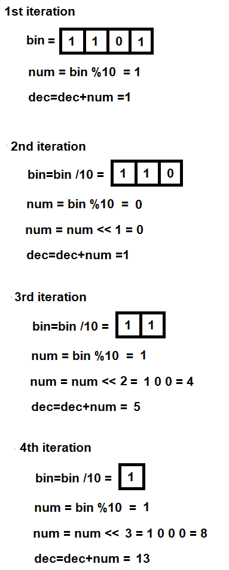

图 16.1

让我们使用 GCC 编译 `binintodec.c` 程序如下：

```cpp
D:\CBook>gcc binintodec.c -o binintodec
```

如果你没有错误或警告，这意味着 `binintodec.c` 程序已编译成可执行文件，`binintodec.exe`。让我们按照以下方式运行这个可执行文件：

```cpp
D:\CBook>binintodec
Enter the binary number: 1101
The decimal of 1101 is 13
```

哇！我们已经成功使用位运算符将二进制数转换为十进制数。现在，让我们继续下一个菜谱！

# 使用位运算符将十进制转换为二进制

在这个菜谱中，我们将学习如何通过使用位运算符将十进制数转换为二进制数。位运算符在数字的二进制位上操作，使我们能够进行精确的操纵，以满足我们的需求。

# 如何做到这一点…

要通过使用位运算符将十进制数转换为二进制数，执行以下步骤：

1.  输入一个十进制数。这个数字以二进制位的形式内部存储。

1.  通过在输入的十进制数和值 `1` 之间应用逻辑与操作来隔离十进制数的最低有效位。

1.  *步骤 2* 得到的最低有效位被存储在数组中。

1.  将十进制数的二进制位向右移动 1 位。向右移动时，第二位最低有效位将变成最低有效位。

1.  重复 *步骤 2* 到 *4*，直到将十进制数的所有二进制位放入数组中。

1.  分配给数组的二进制位是输入的十进制数的二进制版本。将二进制位显示在数组中以获得结果。

使用位运算符将十进制数转换为二进制数的程序如下：

```cpp
convertintobin.c
#include <stdio.h>
void main()
{
    int num,i,x,temp;
    int p[10];
    printf("Enter Decimal Number : ");
    scanf("%d",&num);
    temp=num;
    x=0;
    while(num > 0)
    {
        if((num & 1) == 0 )
        {
            p[x]=0;                                                            x++;
        }
        else
        {
            p[x]=1;
            x++;
        }
        num = num >> 1;
    }
    printf("Binary of %d is ",temp);
    for(i=x-1;i>=0;i--)printf("%d",p[i]);
}
```

现在，让我们看看幕后。

# 它是如何工作的...

你将被提示输入一个十进制数。你输入的数字将被分配给`num`变量。`num`变量中输入的值暂时分配给另一个变量`temp`。设置一个`while`循环，直到`num`的值变为`0`时执行。应用逻辑 AND 操作以隔离数字的每个二进制位。例如，如果变量`num`中输入的值是`13`，那么，在内部，它将以以下二进制格式存储：

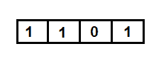

图 16.2

现在，通过应用 AND 操作来隔离最低有效位。也就是说，`13`的二进制数字与`1`进行 AND 操作如下。AND 操作意味着在`13`的二进制数字和`1`上应用 AND 操作：


图 16.3

对二进制数字**`1`**和**`1`**进行 AND 操作的结果是`1`。如果任一二进制数字是`0`，那么 AND 操作的结果将是`0`。因此，`num`与`1`的 AND 操作的结果将是**`1`**，然后将被存储到数组`p`的索引位置`0`，如图下所示：

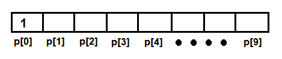

图 16.4

之后，将`num`变量中的数字右移 1 位。在右移时，最低有效位`1`将被移除，并在最高有效位添加一个`0`。再次，`num`变量中的新二进制数字集与`1`进行 AND 操作，即，在`num`变量中的新二进制数字集和`1`之间应用 AND 操作。`num`与**`1`**的 AND 操作的结果将是`0`，然后将其分配给数组`p`的索引位置`1`；即，`0`将被分配到`p[1]`位置，如图所示：

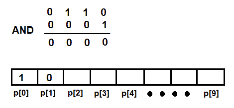

图 16.5

再次，将`num`变量的数字右移 1 位。再次，最低有效位，`0`，将被移除，并在最高有效位添加一个`0`。再次，`num`变量中的新二进制数字集与`1`进行 AND 操作，如图*图 16.6(a)*所示。`num`变量与`1`进行 AND 操作的结果将是`1`，然后将其分配给数组`p`的索引位置`2`。之后，再次将`num`变量中的数字右移 1 位。`num`变量中的最高有效位`1`将被移除，并在最高有效位位置添加一个`0`位。`num`中的二进制数字再次与`1`进行 AND 操作。这里的 AND 操作意味着在`num`的二进制数字和`1`之间应用 AND 操作。AND 操作的结果将是`1`，然后将被分配给数组`p`的索引位置`p[3]`（*图 16.6(b)*）：

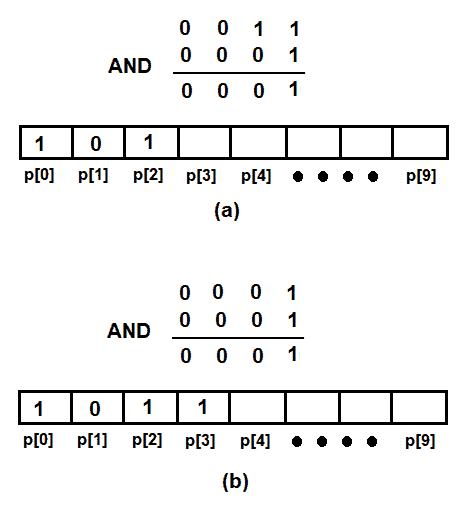

图 16.6 (a) 和 (b)

现在，分配给数组`p`的二进制位是分配给变量`num`的数字的二进制转换。只需以相反的顺序显示数组`p`中的二进制位即可得到结果。因此，`1 1 0 1`是`13`的二进制转换。

让我们使用 GCC 编译`convertintobin.c`程序，如下所示：

```cpp
D:\CBook>gcc convertintobin.c -o convertintobin
```

如果没有错误或警告，这意味着`convertintobin.c`程序已编译成可执行文件`convertintobin.exe`。让我们按照以下方式运行这个可执行文件：

```cpp
D:\CBook>convertintobin
Enter Decimal Number : 13
Binary of 13 is 1101
```

哇！我们已经成功使用位运算符将十进制数转换为二进制数。现在，让我们继续下一个菜谱！

# 使用位掩码将十进制数转换为二进制数

在这个菜谱中，我们将学习如何通过掩码寄存器的一些位将十进制数转换为二进制数。掩码意味着隔离或分离出所需的二进制位。掩码隐藏了不需要的二进制位，只使所需的二进制位可见。

# 如何做到这一点...

要使用位掩码将十进制数转换为二进制数，请执行以下步骤：

1.  输入一个十进制值。输入的十进制数以二进制位的形式内部存储。

1.  将一个由一个数字`1`后跟 31 个零组成的数字赋值给一个名为`mask`的变量。

1.  逐个掩码十进制数的一位二进制数，从最高位开始。在输入的十进制数的二进制数和`mask`变量的二进制数之间应用 AND 操作。

1.  将`mask`变量中的二进制位右移`1`位，使其变为`0 1`后跟 30 个零。

1.  重复此过程。在输入的十进制数和`mask`变量之间应用 AND 操作，并将结果二进制位显示在屏幕上。当`mask`变量中的值变为`0`时，重复此过程。

将十进制数转换为二进制数的位掩码程序如下：

```cpp
decintobin.c
#include <stdio.h>
void main()
{
    int i, totbits;
    unsigned mask,num;
    printf("Enter decimal value: ");
    scanf("%d", &num);
    totbits=32;
    mask = 1 << (totbits - 1);
    for(i = 0; i < totbits; i++)
    {
        if((num & mask) == 0 )
            printf("0");
        else
            printf("1");
        mask >>= 1;
    }
}
```

现在，让我们看看幕后。

# 它是如何工作的...

您将被提示输入一个十进制值。您输入的十进制值将被分配给`num`变量。让我们假设您输入了一个值为`13`。此值将以以下形式作为二进制位的形式在`num`变量中内部存储：

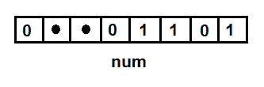

图 16.7

我们将设置`totbits`变量为`32`位，因为 C 语言中的`int`数据类型由`32`位组成，我们必须掩码`num`变量中的每个位以显示其二进制版本。我们将定义一个`mask`变量并将其赋值为`1`。为了使`mask`变量中的`1`值显示为`10000...00`，即`1`后跟 31 个零，我们将`1`左移`31`位，如下所示：

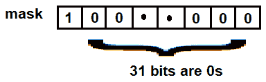

图 16.8

现在，我们将执行一个 `for` 循环 `32` 次，以屏蔽或隔离 `num` 变量中的每个位并显示它。在 `for` 循环中，我们将对 `num` 和 `mask` 变量应用 AND 操作。因此，这两个变量的每个二进制位都将进行 AND 操作。我们知道，在 AND 操作中，只有当两个位都是 `1` 时，输出才是 `1`。如果任一位是 `0`，AND 操作将返回 `0`。

*图 16.9* 显示了在 `num` 和 `mask` 变量上应用 AND 操作：

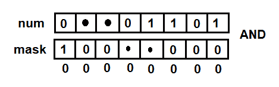

图 16.9

因此，返回值是 `0`。之后，我们将 `mask` 变量的二进制位向右移动 `1` 位，使其变成 `0 1` 后面跟着 30 个零。再次，当在 `num` 和 `mask` 变量之间应用 AND 操作时，结果将是 `0`（参见图），然后显示在屏幕上。所以，到目前为止，屏幕上显示的是 `0 0`：

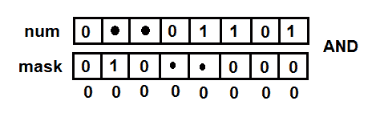

图 16.10

再次，我们将 `mask` 变量的二进制位向右移动 `1` 位，使其变成 `0 0 1` 后面跟着 29 个零。再次，当在 `num` 和 `mask` 变量之间应用 AND 操作时，结果将是 `0`，然后显示在屏幕上。

下一个 `25` 位的过程和输出将相同；也就是说，屏幕上会有 28 个零。之后，当我们对 `mask` 变量的二进制位应用另一个右移操作时，它将变成 `1 0 0 0`。在 `num` 和 `mask` 变量之间应用 AND 操作后，我们将得到一个输出 `1`，然后显示在屏幕上。所以，到目前为止，屏幕上有 28 个零后面跟着 `1` 位：

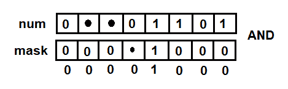

图 16.11

随着我们不断重复这个程序，我们将得到 *图 16.12* 中显示的输出。屏幕上会有 28 个零，后面跟着 `1 1` 位 (*图 16.12 (a)*)。再次重复后，屏幕上会有 28 个零，后面跟着 `1 1 0` 位 (*图 16.12 (b)*)。在 `for` 循环的最终执行中，分配给 `num` 变量的数字的最终二进制版本将是 28 个零，后面跟着 `1 1 0 1` (*图 16.12 (c)*):

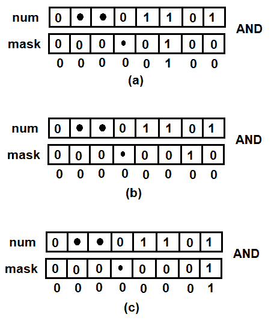

图 16.12 (a), (b), 和 (c)

让我们使用 GCC 按以下步骤编译 `decintobin.c` 程序：

```cpp
D:\CBook>gcc decintobin.c -o decintobin
```

如果你没有错误或警告，这意味着 `decintobin.c` 程序已编译成可执行文件，`decintobin.exe`。让我们按照以下步骤运行这个可执行文件：

```cpp
D:\CBook>decintobin
Enter decimal value: 13
00000000000000000000000000001101
```

哇！我们已经成功使用位屏蔽将十进制数字转换为二进制。

# 汇编语言编程简介

x86 处理器有八个 32 位通用寄存器。其中一些通用寄存器的名称是 EAX、EBX、ECX 和 EDX。这些寄存器可以在子部分中使用。例如，EAX 的最低 2 个字节可以用作 16 位寄存器 AX。再次，AX 的最低字节可以用作 8 位寄存器 AL，而 AX 的最高字节可以用作 8 位寄存器 AH。同样，BX 寄存器可以用作 BH 和 BL 寄存器，依此类推。

我们将在本章中编写内联汇编代码，因为这段代码在代码生成期间很容易与 C 代码集成。因此，编译器会对 C 和汇编代码进行优化，以生成高效的对象代码。

使用内联汇编代码的语法如下：

```cpp
asm [volatile] (
asm statements
: output statements
: input statements
);
```

`asm`语句被引号包围，输出和输入以`"约束"（名称）对的形式呈现，由逗号分隔。约束可以是以下任何一种：

| **约束** | **用法** |
| --- | --- |
| `g` | 编译器将决定用于变量的寄存器 |
| `r` | 将数据加载到任何可用的寄存器 |
| `a` | 将数据加载到`eax`寄存器 |
| `b` | 将数据加载到`ebx`寄存器 |
| `c` | 将数据加载到`ecx`寄存器 |
| `d` | 将数据加载到`edx`寄存器 |
| `f` | 将数据加载到浮点寄存器 |
| `D` | 将数据加载到`edi`寄存器 |
| `S` | 将数据加载到`esi`寄存器 |

输出和输入通过数字引用。

# 使用 C 中的内联汇编语言乘以两个数字

在这个菜谱中，我们将学习如何使用 C 中的内联汇编语言来乘以两个数字。通过使用内联汇编代码，我们可以更好地控制 CPU 寄存器，在位级别上操作它们的值，并利用 C 的优势。

# 如何做到这一点...

要使用 C 中的内联汇编语言乘以两个数字，请执行以下步骤：

1.  将要乘的两个值加载到`eax`和`ebx`寄存器

1.  将`eax`和`ebx`寄存器的内容相乘，并将结果存储在`eax`寄存器中

1.  在屏幕上显示`eax`寄存器的内容

使用内联汇编代码乘以两个数字的程序如下：

```cpp
#include <stdio.h>
#include <stdint.h>
int main(int argc, char **argv)
{
    int32_t var1=10, var2=20, multi = 0;
    asm volatile ("imull %%ebx,%%eax;"
        : "=a" (multi)          
        : "a" (var1), "b" (var2) 
    );
    printf("Multiplication = %d\n", multi);
    return 0;
}
```

现在，让我们看看幕后。

# 它是如何工作的...

让我们将我们想要乘的两个数字分配给两个整数变量，`var1`和`var2`。然后，我们将`var1`变量的内容加载到`eax`寄存器，将`var2`变量的内容加载到`ebx`寄存器。我们将乘以`eax`和`ebx`寄存器的内容，并将结果存储在`eax`寄存器中。

`eax`寄存器的内容被分配给`multi`变量。这个变量中包含两个变量的乘积，其内容将在屏幕上显示。

让我们使用 GCC 编译`multiasm.c`程序，如下所示：

```cpp
D:\CBook>gcc multiasm.c -o multiasm
```

如果你没有错误或警告，这意味着`multiasm.c`程序已编译成可执行文件，`multiasm.exe`。让我们按照以下步骤运行这个可执行文件：

```cpp
D:\CBook>multiasm
Multiplication = 200
```

哇！我们已经成功使用 C 语言中的内联汇编语言乘以两个数。现在，让我们继续下一个菜谱！

# 使用 C 语言中的汇编代码进行两个数的除法

在这个菜谱中，我们将学习如何使用 C 语言中的内联汇编语言除以两个数。汇编语言为我们提供了更好的对 CPU 寄存器的控制，因此我们必须手动将除数和被除数放入各自的寄存器中。此外，在除法之后，商和余数将自动保存在各自的寄存器中。

# 如何做到这一点…

要使用 C 语言中的汇编代码除以两个数，请执行以下步骤：

1.  将被除数加载到`eax`寄存器中。

1.  将除数加载到`ebx`寄存器中。

1.  将`edx`寄存器初始化为零。

1.  执行`divl`汇编语句，将`eax`寄存器的内容除以`ebx`寄存器的内容。通过这种方式进行除法，商将被分配给任何可用的寄存器，余数将被分配给`ebx`寄存器。

1.  从可用寄存器中检索商，从`ebx`寄存器中检索余数，并在屏幕上显示。

使用内联汇编代码除以两个数字的程序如下：

```cpp
asmdivide.c
#include <stdio.h>
void main() {
    int var1=19,var2=4, var3=0, remainder, quotient;
    asm("divl %%ebx;"
        "movl %%edx, %0"
        : "=b" (remainder) , "=r" (quotient)
        : "a" (var1), "b" (var2), "d" (var3) 
    );
    printf ("On dividing %d by %d, you get %d quotient and %d remainder\n", var1, var2, quotient, remainder);
}
```

现在，让我们看看幕后。

# 它是如何工作的...

让我们将要除以的两个数分配给两个变量`var1`和`var2`。将被除数分配给`var1`，除数分配给`var2`。之后，我们将从`var1`变量中将被除数加载到`eax`寄存器中，并将除数从`var2`变量中加载到`ebx`寄存器中。

`edx`寄存器必须初始化为零。为此，我们将一个`var3`变量初始化为零。从`var3`，零值被加载到`edx`寄存器中。然后，我们将执行`divl`汇编语句，将`eax`寄存器的内容除以`ebx`寄存器的内容。通过这种方式进行除法，商将被分配给任何可用的寄存器，余数将被分配给`ebx`寄存器。

从可用寄存器中将商加载到名为`quotient`的变量中，将`ebx`寄存器中的余数加载到另一个名为`remainder`的变量中。最后，在屏幕上显示商和余数的值。

让我们使用 GCC 按照以下步骤编译`asmdivide.c`程序：

```cpp
D:\CBook>gcc asmdivide.c -o asmdivide
```

如果你没有错误或警告，这意味着`asmdivide.c`程序已编译成可执行文件，`asmdivide.exe`。让我们按照以下步骤运行这个可执行文件：

```cpp
D:\CBook>asmdivide
On dividing 19 by 4, you get 4 quotient and 3 remainder
```

哇！我们已经成功使用 C 语言中的汇编代码除以两个数。
