# 第十七章：嵌入式软件和物联网

当涉及到更高效、更精确地执行特定任务时，嵌入式系统更受欢迎。它们作为独立组件工作，并且可以组合成更大的设备。互联网是一个庞大且无穷无尽的信息来源；因此，**物联网（IoT**）在使嵌入式设备更智能、以便远程管理和控制方面发挥着重要作用。

在本章中，我们将深入探讨以下与嵌入式软件和物联网相关的食谱：

+   在嵌入式 C 中切换微控制器的端口（闪烁 LED）

+   在嵌入式 C 中增加端口的值

+   使用 Arduino 切换输出引脚的电压（闪烁 LED）

+   使用 Arduino 从串行端口获取输入

+   使用 LM35 传感器通过 Arduino 感知温度

# 技术要求

对于 C 语言嵌入式编程，我们将使用 Keil MDK，它为广泛的基于 ARM Cortex-M 的微控制器设备提供了一个软件开发环境。MDK 提供了非常易于使用的µVision IDE、Arm C/C++编译器和其他库。您可以从以下 URL 下载 Keil MDK：[`www.keil.com/download/`](https://www.keil.com/download/)。让我们看看以下步骤：

1.  下载以下三个可执行文件。您可能找不到完全相同的文件名，但它们将大致相似：

    +   `mdk526.exe`：这为 ARM 设备提供了一个开发环境。

    +   `c251v560.exe`：这为所有 80251 设备提供了开发工具。

    +   `c51v959.exe`：这为所有 8051 设备提供了开发工具。

1.  逐个双击这些可执行文件，并按照设置对话框安装这三个 Keil 产品。

在成功安装这些产品后，您将在桌面上找到一个名为 Keil uVision5 的图标。该图标代表**集成开发环境（IDE**），它使我们能够编写、编辑、调试和编译程序。编译器将源代码转换为 HEX 文件，然后可以将其烧录到目标芯片上。

为了与 Arduino 一起工作，您必须购买 Arduino 板并从[`www.arduino.cc/en/main/software`](https://www.arduino.cc/en/main/software)下载 Arduino IDE。

在编写本章时，可用的最新 Arduino IDE 版本是 1.8.8。下载的可执行文件将是`arduino-1.8.8-windows.exe`。将 Arduino 板连接到您的 PC，并简单地双击可执行文件以安装 Arduino IDE。安装成功后，您将在桌面上找到 Arduino IDE 图标。

# 嵌入式系统简介

嵌入式系统是由计算机硬件和软件的组合，旨在在更大的设备中执行特定功能。在工业、汽车、医疗程序、家用电器和移动设备中使用的重型设备都使用了嵌入式系统。大多数嵌入式系统使用 RISC 家族微控制器，例如 PIC 16F84、Atmel 8051 或 Motorola 68HC11。可以将多个输入和输出设备连接到嵌入式系统的微控制器上，例如液晶显示屏、键盘、打印机、传感器。这些设备可以控制多个其他设备，如风扇、电机、灯泡、洗衣机、烤箱、空调控制器、汽车、打印机等等。

要编程微控制器以执行特定任务，需要通过连接到插槽将微控制器与 PC 连接。可以使用汇编程序或嵌入式 C 来编写和烧录程序到微控制器上。程序可以存储在微控制器的 **EPROM**（缩写为 **Erasable Programmable Read-Only Memory**）。它是一种内部、只读内存，当暴露在紫外光源下时可以编程和擦除。我们将使用 Keil 等软件用嵌入式 C 开发嵌入式系统应用程序。

# 物联网（IoT）简介

物联网（IoT）是一个由硬件和软件系统或设备组成的架构，这些设备通过 WiFi、以太网等多种方式连接到互联网。当 Web API 和其他协议结合使用时，提供了一个环境，允许智能嵌入式设备连接到互联网。因此，它使我们能够从远程地区访问数据，并通过互联网控制或触发各种设备上的某些操作。换句话说，物联网是一个相互关联的嵌入式计算设备系统，这些设备具有通过网络传输数据并采取必要行动的能力。Arduino 被认为是嵌入式物联网的最佳起点。为了使 Arduino 能够作为物联网设备工作，需要 Android 和以太网盾。

让我们快速了解一下 Arduino。

# Arduino 简介

Arduino 是一个包括 Atmel 微控制器系列和标准硬件的架构。Arduino 的引脚图如下：

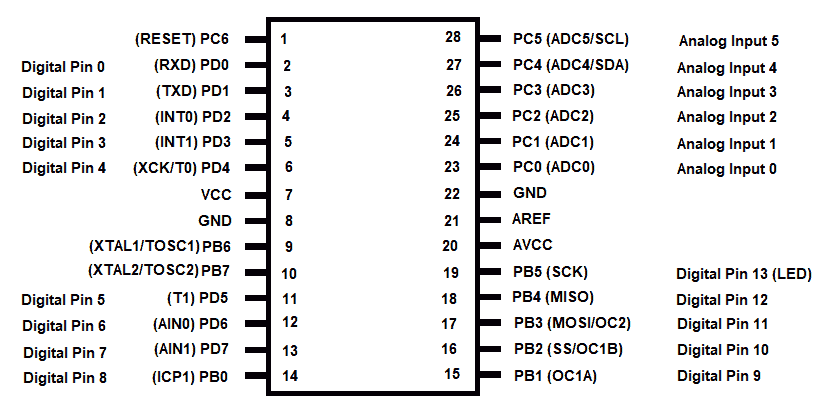

Arduino 包含 14 个数字引脚，可以与 5V 操作：

+   引脚 **0**（**RXD**）和 **1**（**TXD**）是用于传输 TTL 串行数据的串行引脚。

+   引脚 **2** 和 **3** 是外部中断引脚，用于激活中断。

+   引脚 **3**、**5**、**6**、**9**、**10** 和 **11** 用于提供 PWM 输出。

+   引脚 **10**、**11**、**12** 和 **13** 是 **SPI** 引脚（缩写为 **Serial Peripheral Interface**）。命名为 **SS**、**MOSI**、**MISO** 和 **SCK**，这些引脚用于 SPI 通信。

+   引脚 **13** 是 LED 引脚。当向该引脚提供高数字值时，LED 会发光。

+   模拟引脚 **4** 和 **5** 分别称为 **SDA** 和 **SCL**，用于 **TWI**（代表 **Two-Wire Interface**）的通信。

+   **AREF**（代表 **Analog Reference**）引脚用于连接到外部电源的某些参考电压。

+   **RESET**（或 **RST**）引脚用于重置微控制器。

就软件而言，Arduino 随附一个 IDE，我们可以使用它来编写和编辑应用程序，甚至可以将其上传以执行特定任务。此 IDE 包括对 C 和 C++ 编程语言的编程支持，并包含几个库，使软件开发者的工作变得相当容易。此外，IDE 提供通信窗口，以便将数据输入板以及获取输出。

Arduino 板提供端口以连接 LCD、继电器等设备到其输出引脚，并提供输入引脚以从传感器、继电器等设备输入信息。Arduino 板可以通过 USB 或连接 9V 电池供电。

在使用 Arduino 编程时，我们将使用以下函数：

+   `Serial.begin()` 用于在建立 Arduino 板与 PC 之间的通信时设置数据速率。为了通过串行数据传输与计算机通信，我们首先需要设置每秒的比特率（波特率）。我们可以使用任何波特率，例如 300、600、1200、2400、4800、9600、14400、19200、28800、38400、57600 或 115200。

+   `Serial.println()` 用于以人类可读的格式向串行端口显示消息。它在串行监视器上显示消息，后跟换行符。您需要按 *Ctrl* + *Shift* + *M* 打开串行监视器。

+   `Serial.available()` 检查从串行端口读取的字节数据是否可用。本质上，要从串行端口读取的数据存储在串行接收缓冲区中，此方法检查数据是否已到达此缓冲区。此方法返回可读取的字节数：

+   `Serial.read()` 读取传入的串行数据并返回可用的第一个字节。如果没有可读数据，该方法返回 `-1`。

+   `analogRead()` 从指定的模拟引脚读取值。Arduino 板包含一个多通道、10 位模数转换器。因此，它将输入电压映射到 0 和工作电压（5V 或 3.3V）之间的整数值，介于 0 和 1023 之间。

例如，如果您使用的是 5V Arduino，并且传感器连接到其模拟引脚，那么以下公式用于将 10 位模拟读数转换为温度：

```cpp
Voltage at pin in milli volts = Reading from ADC * 5000/1024
```

此公式将 ADC 的 0-1023 数字转换为 0-5000 mV。

如果您使用的是 3.3V Arduino，那么以下公式用于将模拟读数转换为温度：

```cpp
Voltage at pin in milli volts = Reading from ADC * 3300/1024
```

此公式将 ADC 的 0-1023 数字转换为 0-3300 mV。

为了将前一个公式中检索到的毫伏数转换为温度，使用以下公式：

```cpp
Centigrade temperature = Analog voltage in mV / 10
```

这就结束了我们对嵌入式系统和物联网的介绍。现在，我们将回顾完成本章菜谱所需的软件和硬件。之后，我们将开始第一个菜谱。

# 在嵌入式 C 中切换微控制器的端口（闪烁 LED）

在这个菜谱中，我们将学习如何向连接到 LED 的特定端口发送高电平和低电平信号，并使 LED 闪烁。这个练习背后的想法是学习如何控制连接到微控制器特定端口的设备。

# 如何做到这一点...

要在嵌入式 C 中切换微控制器的端口，请执行以下步骤：

1.  我们将使用 Keil 执行这个菜谱；双击 Keil uVision5 图标以激活 IDE。

1.  通过点击“项目 | 新 uVision 项目”选项创建一个新项目。

1.  当提示时，指定项目名称以及你想要创建新项目的文件夹。

1.  给新项目命名为`LedBlinkProject`，然后点击“保存”按钮。

1.  将打开设备选择窗口，并提示你选择一个设备。

1.  从设备组合框中选择“Legacy Device Database [no RTE]”选项。你将在左下角的窗格中看到设备列表（参看以下截图）。

1.  点击 Microchip 节点以展开它并显示其中的设备列表。

1.  因为我们想要编程 Atmel 微控制器，从 Microchip 节点中选择 AT89C51 设备。所选设备的描述将出现在右侧的描述窗格中。点击“确定”以继续：

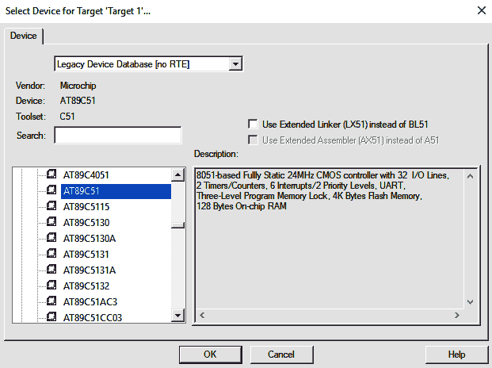

1.  你将被询问是否要将`STARTUP.A51`文件复制到项目文件夹中（参看以下截图）。启动文件将用于运行项目，因此点击“是”按钮添加文件并继续：


1.  IDE 将显示如下。您可以在 IDE 中看到三个窗口：项目工作区、编辑窗口和输出窗口。此外，您还可以看到在项目空间下创建的 Target1 节点：

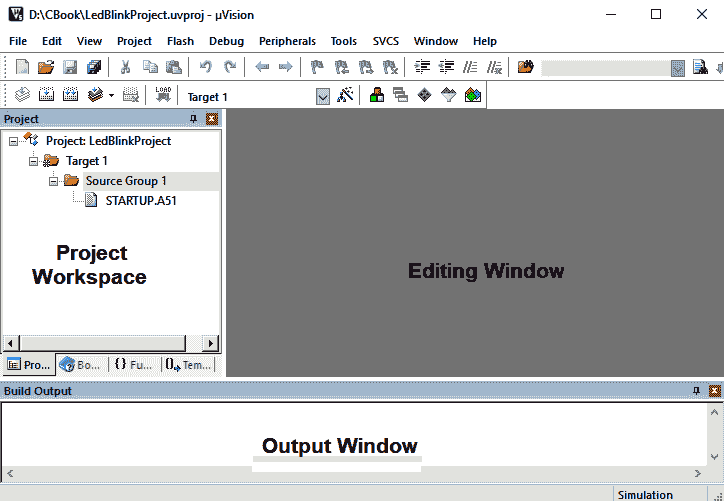

1.  添加一个 C 文件。在 Target1 节点下的 Source Group1 上右键单击，然后点击“向组‘Source Group 1’添加新项”选项。从列表框中选择“C 文件 (.c)”选项。指定文件名为`blinkingLed`（或任何其他名称），然后点击“添加”按钮（参看以下截图）：


1.  `blinkingLed.c`文件已添加到 Source Group 1。在编辑窗口中输入以下代码：

```cpp
#include<reg52.h>   

sbit LED = P1⁰;          
void Delay(int);
void main (void)
{
    while(1)               
    {
        LED = 0;           
        Delay(500);
        LED = 1;           
        Delay(500);
    }
}

void Delay(int n)
{
    int i,j;
    for(i=0;i<n;i++)
    {
        for(j=0;j<100;j++);
    }
}
```

1.  在输入代码后，点击工具栏中的保存图标以保存`blinkingLed.c`文件。

现在，让我们幕后了解代码，以便更好地理解。

# 它是如何工作的...

我们将定义一个名为`LED`的`sbit`类型变量。`sbit`类型定义了一个**特殊功能寄存器**（**SFR**）内的位。我们将设置`LED`变量来表示端口`P1`的 0 位。然后，我们将定义`Delay`函数的原型，该函数接受一个整型参数但不返回任何内容。在`main`函数中，我们将执行一个无限循环中的`while`循环。在`while`循环中，我们将`LED`变量设置为`0`，即向端口`P1`的 0 位发送低信号。

此后，我们将通过两个嵌套循环引入延迟。延迟后，我们将`LED`变量的值设置为`1`，即向端口`P1`的 0 位发送高信号。如果 LED 连接到端口`1`的 0 位，LED 将发光，经过一些延迟后熄灭。再次经过一些延迟后，LED 将再次发光；因此，我们得到了一个闪烁的 LED。

按*F7*键或点击构建按钮以开始编译代码。如果没有错误，您可以继续下一步。您可以选择生成 HEX 文件以注入到所需的硬件中，或者可以使用模拟技术来查看程序是否给出了预期的输出。为了生成 HEX 文件，右键单击“Target1”节点并选择“为‘Target 1’选项”。我们将得到一个显示不同选项的对话框。点击输出选项卡，并勾选**创建 HEX 文件**框（参见图表）。此外，点击设备选项卡以确认所选设备是 AT89C51。然后，点击确定按钮：

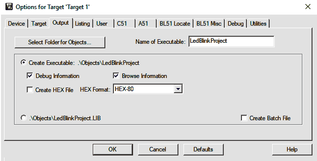

图 5.5

Keil 的内置**调试**选项可用于代码模拟。为此，请点击调试|开始/停止调试会话；或者，您可以按*Ctrl* + *F5*作为快捷键，或者点击工具栏中的**开始/停止调试会话**图标（它以 d 的形式出现）。Keil 工具的免费版本有一个条件，即运行代码的大小不应超过 2 KB。您将看到一个对话框，指示运行代码的上限为 2 KB：

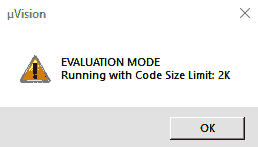

图 5.6

点击确定按钮继续。现在，项目工作区窗口显示了大多数 SFR 以及 GPRs，即 r0 到 r7，如下所示：

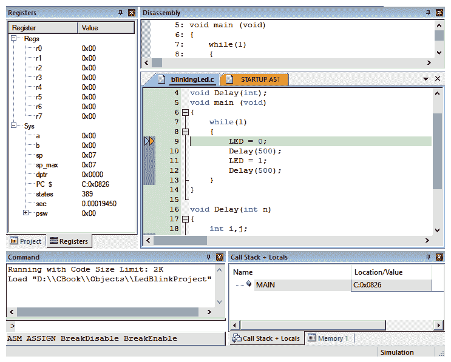

图 5.7

从工具栏中点击运行图标或按*F5*键。要查看端口的输出，请转到“外围设备”|“选择 I/O 端口”|“端口 1”。您将在“端口 1”上看到闪烁的 LED，如下面的截图所示。您可以看到，在“端口 1”的`bit0`中有一个低信号，在同一个位上有一个高信号：

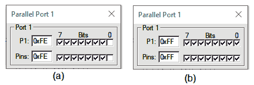

图 5.8

Voilà！我们已经成功使用微控制器端口创建了一个闪烁的 LED。现在，让我们继续下一个菜谱！

# 在嵌入式 C 中递增端口的值

在本教程中，我们将学习如何在微控制器的特定端口上显示从 0 到 255 的值，并使值像计数器一样递增。

# 如何操作...

在嵌入式 C 中递增端口的值，请执行以下步骤：

1.  启动 Keil uVision5 IDE。

1.  通过点击“新建项目 | 新建 uVision 项目”选项来创建一个新项目。

1.  当提示时，指定项目名称和文件夹位置。让我们将新项目命名为`CounterApp`；点击“保存”。

1.  将打开设备选择窗口，并提示你选择一个设备。从设备组合框中选择“Legacy Device Database [no RTE]”。

1.  你将在左下角的窗格中看到设备列表。点击 Microchip 节点以展开它并显示其中的设备列表。

1.  从 Microchip 节点中选择 AT89C51 设备。所选设备的描述将出现在右侧的描述面板中。点击“确定”以继续操作。

1.  系统会询问你是否要将`STARTUP.A51`文件复制到项目文件夹中。点击“是”以添加文件并继续操作。

1.  IDE 将打开并显示三个窗口：左侧的“项目工作区”，右侧的“编辑窗口”，以及底部的“输出窗口”。你将在项目空间下看到创建的 Target1。

1.  通过在 Target1 节点下的源组 1 上右键单击并点击“添加新项到组‘源组 1’”来添加一个 C 文件。

1.  从列表框中选择“C 文件 (.c)”选项。指定文件名为`showcounter`，然后点击“添加”。

1.  `showcounter.c`文件将被添加到源组 1。在编辑窗口中输入以下代码：

```cpp
#include<stdio.h>
#include<reg52.h>
void delay(void);        
void main()
{
    unsigned char i; 
    i=0x00;                   
    while(++i)
    {
         P3=i;                                  
         delay();            
    }             
}

void delay(void)
{
    int j;
    int i;
    for(i=0;i<1000;i++)
    {
        for(j=0;j<10000;j++)
        {
        }
    }
}
```

1.  输入代码后，点击工具栏中的保存图标以保存`showcounter.c`文件。

现在，让我们深入了解这些步骤。

# 它是如何工作的...

我们将定义一个无符号字符类型的变量`i`；无符号字符类型的变量可以存储 256 位，而有符号字符类型的变量只能存储 128 位。`i`变量被分配了十六进制值`0`。我们将设置一个无限循环的`while`循环。在`while`循环的每次迭代中，`i`变量的值将递增`1`。在`while`循环内部，我们将`i`变量的值，即`0`，分配给端口`P3`。

我们将通过使用两个嵌套的`for`循环来引入延迟。然后，我们再次执行`while`循环，递增`i`变量的值，使其变为`1`。再次，我们将`i`变量的值分配给端口`P3`以进行显示。然后，我们再次引入一些延迟，并再次执行`while`循环。这个过程将无限循环；因此，端口`P3`将重复显示从`0`到`255`的计数器。

按*F7*或点击构建按钮来编译代码。如果没有错误，您可以继续到下一步；否则，首先调试代码。为了通过仿真查看代码的输出，我们将使用 Keil 的内置仿真调试选项。为此，点击调试 | 开始/停止调试会话。或者，您可以按*Ctrl* + *F5*作为快捷键，或者点击工具栏中的开始/停止调试会话图标（它以 D 的形式出现）。

在 Keil 的免费版本中，有一个条件是运行代码的大小不应超过 2 KB，因此您将得到一个对话框，指示运行代码的上限为 2 KB。点击确定继续。项目工作区窗口显示了大多数 SFR 以及从 r0 到 r7 的 GPR。从工具栏中点击运行图标或按*F5*键。您可以在外围设备 | 选择 I/O 端口 | 端口 3 下看到端口的输出。您将看到端口的位显示从`0`到`255`的计数器。

在以下屏幕截图，**(a**)显示了设置为`5`值的位。5 的二进制值是 101，因此，相应地，第一和第三位被设置为高电平信号，其余位被设置为低电平信号。同样，**(b**)显示了显示计数器值为 10 的位。端口的位将被设置为从 0 到 255 的值：

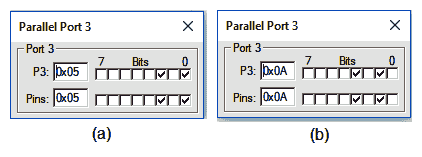

图 5.9

哇！我们已经成功使用嵌入式 C 创建了一个计数器。现在，让我们继续下一个菜谱！

# 使用 Arduino 在输出引脚上切换电压（闪烁 LED）

在这个菜谱中，我们将学习如何制作一个连接到 Arduino 板输出引脚的 LED 闪烁。

# 如何操作...

要使连接到 Arduino 板输出引脚的 LED 闪烁，请执行以下步骤：

1.  打开 Arduino IDE。Arduino 会打开一个显示默认内容的文件，如下所示：

```cpp
void setup() {
// put your setup code here, to run once:
}

void loop() {
// put your main code here, to run repeatedly:

}
```

1.  将 Arduino 板连接到电脑。

1.  从工具菜单中选择端口，确认是否显示 COM3（Arduino/Genuino Uno）或您连接到电脑的 Arduino 板。此外，确认工具菜单中的板选项是否指示连接到电脑的 Arduino 板。在我的情况下，板选项将显示 Arduino/Genuino Uno。

1.  记住，LED 有极性；因此，只有当它们正确连接时才会发光。长腿是正极，应该连接到 Arduino 板上的数字引脚。我使用 Arduino 板的第 13 个引脚作为输出，所以将 LED 的长腿连接到 Arduino 板的第 13 个引脚（参见图 5.10）。然后，将 LED 的短腿（负极）连接到 Arduino 板的 GND。

1.  在编辑器窗口中输入以下程序：

```cpp
int Led = 13;

void setup() {
pinMode(Led, OUTPUT);
}

void loop() {
digitalWrite(Led, HIGH);
                 delay(1000);
                digitalWrite(Led, LOW);
                delay(1000);
}
```

6. 通过点击文件 | 另存为保存应用程序。在提示时指定应用程序名称。选择所需的文件夹位置并指定应用程序名称。让我们将应用程序命名为`ArduinoLedBlink`。将创建一个具有指定应用程序名称（`ArduinoLedBlink`）的文件夹，并在`ArduinoLedBlink`文件夹内创建一个名为`ArduinoLedBlink.ino`的应用程序。

7. 通过点击工具栏中的上传图标将应用程序上传到 Arduino。

现在，让我们深入了解这些步骤。

# 它是如何工作的...

我们将首先定义一个`Led`变量并将其设置为表示 Arduino 的 13 号引脚。通过调用`pinMode`函数，`Led`变量将被指示为输出引脚，即它将连接到输出设备以进行显示或执行某些任务。

在`loop`函数中，我们将调用`digitalWrite`方法向变量`Led`发送一个高电平信号。这样做，连接到输出引脚 13 的 LED 将打开。之后，我们将引入 1,000 毫秒的时间延迟。

再次，我们将调用`digitalWrite`方法并发送一个低电平信号，这次发送到变量`Led`。结果，连接到输出引脚 13 的 LED 将关闭。同样，我们将引入 1,000 毫秒的延迟。`loop`函数中的命令将无限执行，使连接的 LED 保持闪烁。

将程序上传到 Arduino 后，连接到 Arduino 13 号引脚的 LED 将开始闪烁，如下所示：

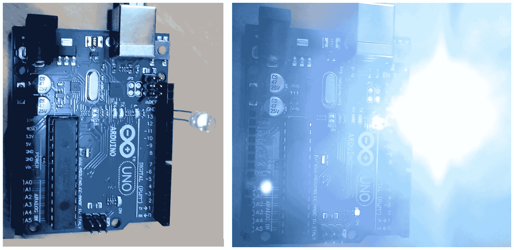

图 5.10

哇！我们已经成功地在 Arduino 板上的一个输出引脚上切换电压，使 LED 闪烁。

现在，让我们继续下一个菜谱！

# 使用 Arduino 从串行端口获取输入

在这个菜谱中，我们将把一个 LED 连接到 Arduino 板，并提示用户按下`0`或`1`。用户可以通过串行端口输入一个值。如果用户输入的值是`0`，它将关闭 LED；如果输入的值是`1`，它将使 LED 发光。

# 如何做到这一点…

要使用 Arduino 从串行端口获取输入，请执行以下步骤：

1.  调用 Arduino IDE。Arduino 将以显示其默认内容的文件打开，如下所示：

```cpp
void setup() {
// put your setup code here, to run once:

}

void loop() {
// put your main code here, to run repeatedly:

}
```

1.  将 Arduino 板连接到您的电脑。

1.  从工具菜单中选择端口，并确认它是否显示 COM3（Arduino/Genuino Uno）或您连接到电脑的 Arduino 板。此外，确认工具菜单中的板选项是否指示连接到电脑的 Arduino 板。在我的情况下，板选项将显示 Arduino/Genuino Uno。

1.  我们将把 LED 连接到 Arduino 的输出引脚 13。由于 LED 有极性并且需要正确连接，我们将把 LED 的长腿（也称为正极引脚）连接到 Arduino 板上的第 13 个数字引脚。此外，我们将把 LED 的短腿（也称为负极引脚）连接到 Arduino 板上的 GND。

1.  在编辑器窗口中输入以下程序：

```cpp
int Led = 13;
void setup() {
                pinMode(Led,OUTPUT);
                Serial.begin(9600);
                Serial.println("Enter 0 to switch Off LED and 1 to 
                  switch it On");
}

void loop() {
if(Serial.available())
                {
                                int input=Serial.read();
                                input=input-48;
                                if(input==0)
                                {
                                                Serial.println("LED 
                                                  is OFF");
                                                digitalWrite(Led,LOW);
                                 }
                                else if(input==1)
                                 {
                                                Serial.println("LED 
                                                  is ON");
                                                digitalWrite(Led,HIGH);
                                }
                                else
                                {

Serial.println("Enter 0 to switch Off
 LED and 1 to switch it On");
                                 }
                }
}
```

1.  通过点击文件 | 另存为选项保存应用程序。在提示时指定应用程序名称。让我们将应用程序命名为`ArduinoTakinginput`。将创建一个具有指定应用程序名称的文件夹，并在`ArduinoLedBlink`文件夹中创建一个名为`ArduinoTakinginput.ino`的应用程序文件。

1.  通过点击工具栏中的上传图标将应用程序上传到 Arduino（参考以下截图）：

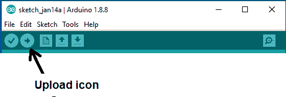

现在，让我们深入了解背后的步骤。

# 它是如何工作的...

我们将定义一个`Led`变量并将其设置为表示 Arduino 的 13 号引脚。通过调用`pinMode`函数，`Led`变量被声明为输出引脚，因此我们将使用它来连接到输出设备以执行所需操作。在本应用中，输出设备将是一个 LED。

由于我们希望我们的 PC 通过串行通信与 Arduino 通信，我们需要以每秒比特数来设置数据速率。因此，我们将调用`Serial.begin`函数将串行数据传输速度设置为 9,600 比特每秒（然而，可以是任何波特率）。之后，我们将在串行端口上以人类可读的格式显示一条消息，通知用户按下`0`可以关闭连接的 LED，按下`1`可以打开 LED。

在 Arduino 的`loop`函数中，我们将调用`Serial.available`函数来检查串行端口是否有可读数据。也就是说，将检查串行接收缓冲区以查看是否有数据或字节可供读取。只有当用户按下任何键时，数据才会出现在串行接收缓冲区中。这也意味着在用户按下任何键之前不会出现任何输出。当用户按下任何键时，该字节将进入串行接收缓冲区，`Serial.available`函数将返回布尔值`true`。因此，`if`块将执行。

在`if`块中，我们将调用`Serial.read`函数从串行端口读取串行数据。从串行端口读取的数据或字节将被分配给变量`input`。读取的字节始终是 ASCII 格式。用户应按下`0`或`1`；它们的 ASCII 值分别是 48 和 49。因此，如果用户按下`0`，其 ASCII 值 48 将被分配给变量`input`。如果用户按下`1`，其 ASCII 值 49 将被分配给变量`input`。

为了得到用户输入的实际数值，我们从变量输入中减去 48 的值。如果用户按下 `0`，将执行一个指定的 `if` 块。在该 `if` 块内，我们将调用 `Serial.println` 函数来显示消息 *LED is OFF* 以通知用户。我们还将调用 `digitalWrite` 方法向连接 LED 的输出引脚 13 发送低电平信号。因此，如果 LED 正在发光，它将被关闭。

如果用户按下 `1`，则将执行另一个 `if` 块；在这种情况下，我们将调用 `Serial.println` 函数来显示消息 *LED 是开启的*。我们还将调用 `digitalWrite` 函数向输出引脚 13 发送高电平信号，使 LED 发光。如果用户没有按下 `0` 或 `1`，我们将显示一条消息，要求他们只按下 `0` 或 `1`。

将程序上传到 Arduino 后，我们可以按 *Ctrl* + *Shift* + *M* 打开串行监视器。在串行监视器中，我们将得到以下消息：*输入 0 以关闭 LED 并输入 1 以开启它*（参见图 5.11 中的第一个对话框）。在串行监视器中按下 `0` 后，我们将得到消息 LED is OFF，并且，你将再次被提示输入 `0` 或 `1`（参见图 5.11 中的第二个对话框）。除了串行监视器中的消息外，连接到 Arduino 板 13^(th) 引脚的 LED 也会关闭（如果它之前是发光的）。按下 `1` 时，串行监视器中将显示消息 LED is ON。此外，将出现一条消息提示我们输入 `0` 或 `1`（参见图 5.11 中的第三个对话框）。此外，连接到 Arduino 板的 LED 将发光：

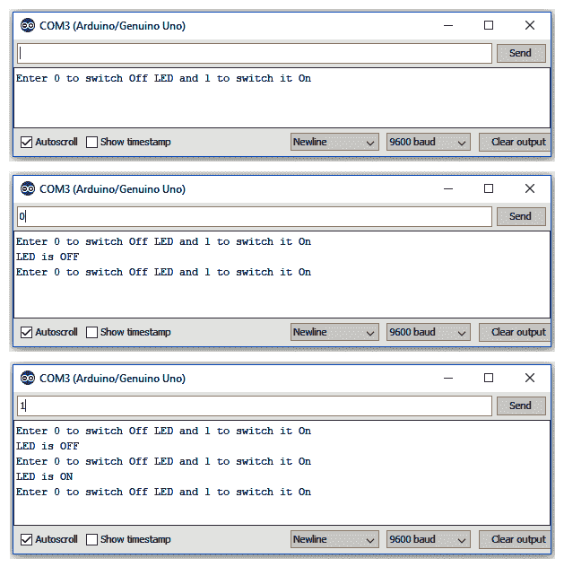

图 5.11

Voilà！我们已经成功使用 Arduino 通过串行端口输入使 LED 开关。

现在，让我们继续下一个菜谱！

# 使用 LM35 传感器通过 Arduino 感知温度

在这个菜谱中，我们将学习如何使用连接到 Arduino 板的 LM35 传感器来感知温度，并将温度以摄氏度和华氏度显示。

# 准备就绪…

对于这个菜谱，我们需要以下三个组件：一个面包板、Arduino Uno R3 和一个 LM35 传感器。

LM35 是一个温度传感器，其输出电压与摄氏温度成线性比例。它不需要任何外部校准或调整即可提供准确的温度。它有三个端子，**Vs**、**Vout** 和 **Ground**，如下所示：

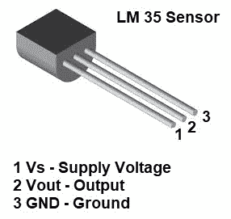

图 5.12

我们将按照以下方式将 LM35 传感器连接到 Arduino 板：

1.  将 +Vs 端口连接到 Arduino 板上的 +5v。

1.  将 Vout 端口连接到 Arduino 板上的 Analog0 或 A0。

1.  将 GND 端口与 Arduino 上的 GND 端口连接。

以下图表使这一点更清晰：

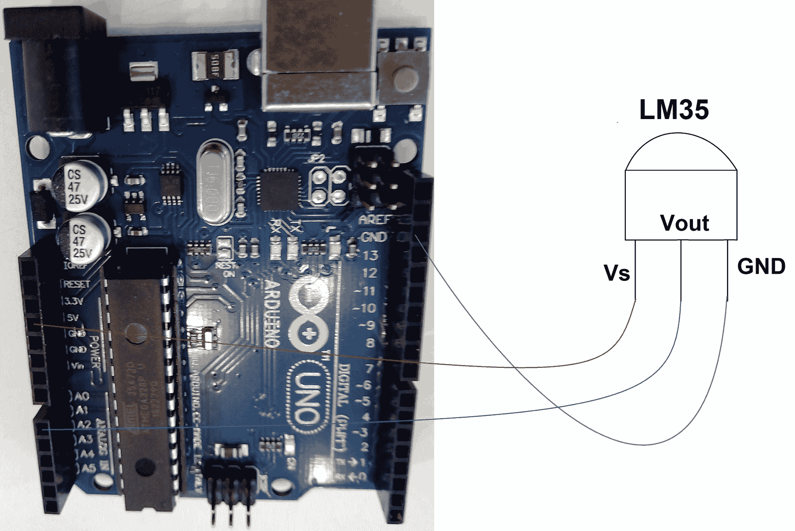

图 5.13

现在 LM35 传感器已连接到 Arduino 板，让我们执行以下步骤。

# 如何做到这一点...

要使用连接到 Arduino 板的 LM35 传感器检测温度，请执行以下步骤：

1.  调用 Arduino IDE。Arduino 将以显示其默认内容的文件打开，如下所示：

```cpp
void setup() {
// put your setup code here, to run once:
}

void loop() {
// put your main code here, to run repeatedly:

}
```

1.  将 Arduino 板连接到 PC。

1.  在工具菜单中，选择端口并确认是否显示 COM3（Arduino/Genuino Uno）或您连接到 PC 的任何 Arduino 板。此外，确认工具菜单中的板选项是否指示连接到您的 PC 的 Arduino 板。在我的情况下，板选项将显示 Arduino/Genuino Uno。

1.  将以下程序输入到编辑器窗口中：

```cpp
float voltage;
int tempPin = 0;

void setup() {
   Serial.begin(9600);
}

void loop() {
   voltage = analogRead(tempPin);
   float tempInCelsius = voltage * 0.48828125;
   float tempinFahrenheit = (tempInCelsius*9)/5 + 32;
   Serial.print("Temperature in Celsius is: ");
   Serial.print(tempInCelsius);
   Serial.print("*C");
   Serial.println();
   Serial.print("Temperature in Fahrenheit is: ");
   Serial.print(tempinFahrenheit);
   Serial.print("*F");
   Serial.println();
   delay(1000);
}
```

1.  通过点击 File | Save As 选项保存应用程序。在提示时指定应用程序名称。让我们将其命名为`SensorApp`。将创建一个名为`SensorApp`的文件夹，在该文件夹中，将创建一个名为`SensorApp.ino`的应用程序文件。

1.  通过点击工具栏中的上传图标将应用程序上传到 Arduino。

# 它是如何工作的...

我们定义一个名为`voltage`的浮点变量和一个名为`tempPin`的整型变量；我们将后者设置为表示 Arduino 的 0 号引脚。为了使我们的 PC 通过串行通信与 Arduino 通信，我们需要以每秒比特数来设置数据速率。因此，我们将调用`Serial.begin`函数将串行数据传输速度设置为 9,600 比特每秒（然而，可以是任何波特率）。

在`loop`函数中，我们将调用`analogRead`函数从指定的模拟引脚读取值，0。回想一下，Arduino 板包含一个多通道、10 位模拟到数字转换器，它将 0 到工作电压（5V 或 3.3V）之间的输入电压映射到 0 到 1023 之间的整数值。从模拟引脚 0 读取的值被分配给`voltage`变量。

我们使用 5V Arduino 板，并且 LM35 传感器已经连接到其模拟引脚。我们将使用以下公式将 10 位模拟读数转换为温度：

```cpp
Voltage at pin in milliVolts = Reading from ADC * 5000/1024
```

此公式将 ADC 中的数字 0-1023 转换为 0-5000 mV。要将此公式检索到的毫伏数转换为温度，我们将使用另一个公式：

```cpp
Centigrade temperature = Analog voltage in mV / 10
```

可以将前面提到的两个公式重写如下：

```cpp
Centigrade temperature = Reading from ADC * 0.48828125;
```

使用此公式，将读取到电压变量的值转换为摄氏度温度，并分配给`tempInCelsius`变量。要将摄氏度（°C）温度转换为华氏度（°F），使用以下公式：

```cpp
F=(C*9)/5+32
```

使用此公式，将`tempInCelsius`变量中找到的摄氏度温度转换为华氏度，并分配给`tempinFahrenheit`变量。

通过调用，将摄氏度（°C）和华氏度（°F）的温度显示到串行端口。可以通过打开串行监视器来查看温度读数。按*Ctrl* + *Shift* + *M*打开串行监视器并显示温度。您还可以按下您的拇指上的 LM35 传感器来观察温度的升降。

我们将通过调用`delay`函数在每次温度显示之间引入 1,000 毫秒的延迟。也就是说，应用程序将以 1,000 毫秒的延迟无限期地显示摄氏度和华氏度的温度。

在将程序上传到 Arduino 后，我们可以按*Ctrl* + *Shift* + *M*打开串行监视器。在串行监视器中，我们将得到摄氏度和华氏度的温度读数。您将每隔 1,000 毫秒连续获得温度读数：

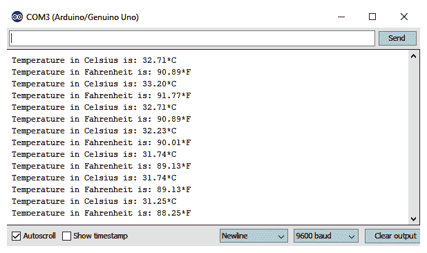

图 5.14

在下面的照片中，您可以看到 LM35 传感器连接到 Arduino 板上。您可以按下您的拇指上的 LM35 传感器来观察温度读数的上升：

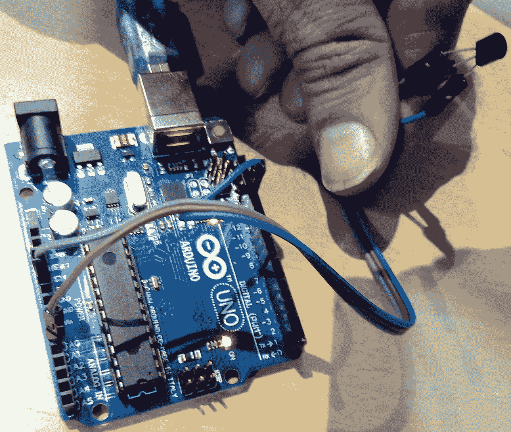

图 5.15

哇！我们已成功使用 Arduino 和 LM35 传感器创建了一个温度传感器。
