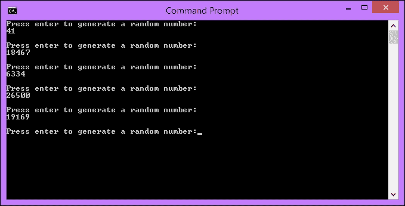
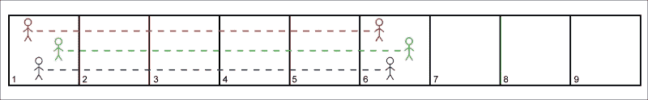
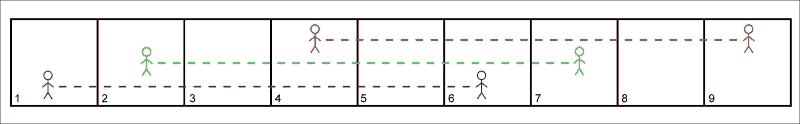
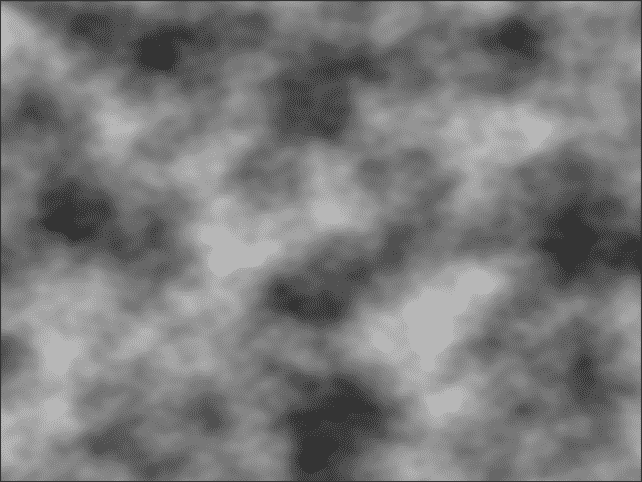
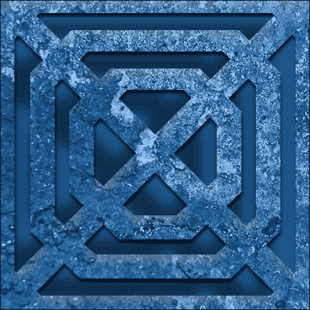

# 第一章：程序生成简介

当你在 PC 上加载一张图片、iPod 上的一首歌曲，或者 Kindle 上的一本书时，你是从存储中加载它。那张图片、歌曲和书已经作为一个整体存在，每当你想要访问它时，你就会获取整个之前创建的东西。在音乐或视频的情况下，你可以分块流式传输，但它仍然作为一个整体存在于存储中。让我们将这与从家具店购买现成的桌子进行比较。你得到整个桌子作为一个单一的东西，就是这样；你有了一张桌子。

现在，让我们想象一下，你不是买一个成品桌子，而是买了一个平装的桌子。你得到的不是一个预制的桌子，而是你需要建造一个桌子的所有零件，以及如何做的说明。当你回家后，你可以按照这些说明来建造桌子。如果你愿意，你甚至可以偏离说明，创造出与其他人不同的独特桌子。

让我们在游戏开发的背景下使用这个类比，将购买桌子替换为加载关卡。在第一种情况下，我们加载了整个关卡，因为它是预先构建好的。然而，在第二个例子中，我们得到了所有需要建造关卡的零件，并按照自己选择的顺序将它们组合在一起。

通过算法或程序创建某物的过程，而不是已经存在的东西，被称为**程序生成**。桌子是通过按照算法将其零件组合而成的。游戏关卡也是如此。这几乎可以扩展到任何东西。例如，音乐、图像、游戏和文本都可以通过程序生成。

在本章中，我们将涵盖以下主题：

+   程序生成与随机生成

+   在 C++中生成伪随机数

+   种子

+   程序生成的利与弊

+   罗格式游戏的简史

+   如何实现程序生成

# 程序生成与随机生成

在我们继续之前，我想先做一个区分。在这本书中，我们将大量讨论程序生成和随机生成。这些术语经常被互换使用，但它们并不是同一回事。因此，让我们花一点时间来定义它们。

## 程序生成

程序生成是使用算法创建内容的过程。这本身没有随机元素。如果用于生成内容的函数、表达式、算法和输入保持不变，那么你总是会得到相同的结果。这是因为计算机是确定性的，这是我们很快会讨论的内容。程序生成本身并不具有随机性。

## 随机生成

当我们给这些算法不同的输入或改变它们的表达时，就会引入随机性。这种变化是导致输出多样性的原因。当有人说某物是程序生成时，他们通常是指利用随机性进行程序生成。

# 引入随机性

计算机是**确定性**的机器。这意味着如果你给它们相同的输入，并执行相同的操作，每次都会得到相同的输出。就桌子的例子而言，每个人都得到相同的零件，遵循相同的说明，因此建造出相同的桌子。

再次以游戏的背景来说，如果每个人都得到相同的资产和算法来组合它们，我们都会得到相同的游戏和体验。有时，这是目标。然而，在我们的情况下，我们希望创建不可预测和动态的游戏系统。因此，我们需要在程序生成中引入一定的随机元素。

## 伪随机数生成

随机数生成只是随机选择一个数字的过程。对我们来说这很简单，但对计算机来说是一项更艰巨的任务。事实上，计算机要生成一个真正的随机数是不可能的，除非有特殊的硬件。你马上就会明白为什么会这样。

下一个最好的选择是伪随机数生成。单词*pseudo*的字面意思是*不真实*。因此，伪随机数生成可以被认为是假随机数生成。这些数字看起来是随机的，但实际上是复杂方程和算法的结果，事实上可以提前计算出来。

请记住，并非所有的伪随机数生成器都是一样的。对于诸如普通模拟和游戏之类的应用程序，可以使用相当线性的算法，并且非常适用。然而，伪随机数生成也用于诸如**密码学**之类的应用程序，将使用更复杂的算法，以便无法通过先前输出创建的模式来确定结果。

我们作为开发者使用的伪随机数生成器属于第一类，并且非常适用。幸运的是，C++提供了多种生成普通伪随机数的方法。在本书的过程中，我们将使用`std::rand()`和`std::srand()`，它们都是标准 C++函数，包含在`<cstdlib>`库中。

### 提示

学习如何阅读和从文档中提取信息是一项我认为经常被忽视的技能。有了众多优秀的论坛，很容易直接去谷歌寻找解决方案，但首先，一定要阅读文档。[`www.cplusplus.com`](http://www.cplusplus.com)是一个很好的 C++参考，SFML 在[`www.sfml-dev.org/documentation/`](http://www.sfml-dev.org/documentation/)上有完整的文档。

## 为什么计算机不能生成真正的随机数

我们现在知道计算机不能生成随机数，而是生成伪随机数。让我们看看为什么会这样。

这样做的原因与两台计算机在给定相同输入和操作的情况下会达到相同输出的原因相同；计算机是确定性的。计算机产生的一切都是算法或方程的结果。它们只不过是高度复杂的计算器。因此，你不能要求它们表现得不可预测。

真正的随机数可以生成，但你需要利用机器外部的系统。例如，在[`www.random.org/`](https://www.random.org/) **你可以**使用大气噪音生成真正的随机数。还有其他类似的系统，但除非你为安全目的生成随机数，否则普通伪随机数生成就足够了。

## 在 C++中生成随机数

让我们通过编写一个小程序来生成一些伪随机数来开始编码。为此，我们将使用`std::rand()`函数。它在`0`到`RAND_MAX`之间生成一个伪随机整数。`RAND_MAX`变量是在`<cstdlib>`中定义的常量。它的值将取决于你使用的库。在标准库实现中，它的值至少为 32767。

### 提示

如果你已经熟悉这个主题，可以直接跳到名为种子的子章节。

你可以从 Packt 网站[`www.packtpub.com/support`](http://www.packtpub.com/support)下载这个程序的代码。它将出现在`Examples`文件夹中，项目名称是`random_numbers`：

```cpp
// Random number generation
// This program will generate a random number each time we press enter.

#include <iostream>

using namespace std;

int main()
{
  while (true)
  {
    cout << "Press enter to generate a random number:";
    cin.get();

    // Generate a random integer.
    int randomInteger = rand();

    cout << randomInteger << endl << endl;
  }

  return 0;
}
```

### 提示

下载示例代码

您可以从[`www.packtpub.com`](http://www.packtpub.com)的帐户中下载您购买的所有 Packt Publishing 图书的示例代码文件。如果您在其他地方购买了这本书，您可以访问[`www.packtpub.com/support`](http://www.packtpub.com/support)并注册，以便直接通过电子邮件接收文件。

这是一个非常简单的控制台应用程序，每次按 Enter 键时都会调用`std::rand()`。这会返回伪随机数，并将其传递给`std::cout`以显示它。就是这么简单！



## 在范围内生成随机数

先前的代码生成了介于`0`和`RAND_MAX`之间的数字。这很好，但通常我们希望更多地控制这一点，以便在特定范围内生成数字。为此，我们将使用**模运算符**。

### 提示

在 C++中，模运算符是%符号。这在不同的语言之间有所不同，但通常是*%*或*Mod*。

取模运算符返回两个数字之间的除法余数。因此，9 mod 2 是 1，因为 2 可以整除 9 四次，剩下 1。我们可以利用这个来创建伪随机数生成的范围。让我们生成一个介于 0 和 249 之间的数字。

为此，我们需要进行以下更改：

```cpp
// Generate a random integer.
//int randomInteger = rand();
int randomInteger = rand() % 250;

```

现在运行程序几次，您会看到所有的结果都限制在我们刚刚定义的范围内。所以现在我们可以生成一个介于 0 和 n 之间的数字，但是如果我们不希望我们的范围从 0 开始怎么办？为此，我们需要对生成数字的行进行一次更改：

```cpp
// Generate a random integer.
//int randomInteger = rand() % 250;
int randomInteger = rand() % 201 + 50;

```

记住，我们在模运算中使用的数字将生成一个介于 0 和 n-1 之间的数字，然后我们之后添加的数字将增加该数量的范围。因此，在这里，我们生成一个介于 0 和 200 之间的数字，然后增加 50 来获得一个介于 50 和 250 之间的数字。

### 提示

如果您对我们在这里所做的事情背后的数学不太了解，请前往 Khan Academy。这是一个学习的绝佳资源，有很多优秀的与数学相关的材料。

运行程序并注意生成的前五个数字。在我的情况下，它们是 91、226、153、219 和 124。现在再次运行。您会注意到发生了一些奇怪的事情；我们收到了完全相同的数字。

它们是以伪随机的方式生成的，对吧？也许这只是一个偶然。让我们再次运行它，看看我们得到了什么。你会再次得到相同的结果。要理解这里发生了什么，我们需要看一下**种子**。

# 种子

我们刚刚创建了一个生成伪随机数的程序，但每次运行它时，我们都会得到相同的结果。我们知道这些数字是复杂方程和算法的结果，那为什么它们是相同的呢？这是因为每次运行程序时，我们都从相同的种子开始。

## 定义种子

种子为算法提供了一个起点。因此，在前面的例子中，是的，我们正在使用复杂的算法来生成数字，但我们每次都从相同的点开始算法。无论算法有多复杂，如果您从相同的点开始，并执行相同的操作，您将得到相同的结果。

想象一下，我们有三个人，每个人都要走 5 步相同的路径。如果他们都从同一个方块开始，他们最终会到达同一个方块：



现在，在下一个图表中，我们给这三个人不同的起始位置。即使他们做的动作与之前相同，并且在同一路径上，但由于他们从不同的位置开始，他们的结果是不同的：



在这个类比中，路径是算法，起始方块是种子。通过改变种子，我们可以从相同的动作中获得不同的结果。

你很可能以前使用过种子，甚至都不知道。像 Minecraft 和乐高世界这样的游戏，在生成世界之前，会给你设置一个种子的选项。如果你的朋友生成了一个看起来很棒的世界，他们可以获取他们的种子并给你。当你自己输入那个种子时，你就像你的朋友一样从同一个位置启动算法，最终得到相同的世界。

## 使用种子

现在我们知道了种子是什么，让我们修复上一个例子，以便我们不再生成相同的数字。为此，我们将使用`std::srand()`函数。它类似于`std::rand()`，但它需要一个参数。这个参数用于设置算法的种子。我们将在进入 while 循环之前调用`std::srand()`。

### 提示

您只需要在应用程序运行时设置一次种子。一旦调用了`std::srand()`，所有后续对`std::rand()`的调用都将基于更新后的初始种子。

更新后的代码应该是这样的：

```cpp
// Random number generation
// This program will generate a random number each time we press enter.

#include <iostream>

using namespace std;

int main()
{
  // Here we will call srand() to set the seed for future rand() calls.
  srand(100);

  while (true)
  {
    cout << "Press enter to generate a random number:";
    cin.get();

    // Generate a random integer.
    int randomInteger = rand() % 201 + 50;

    cout << randomInteger << endl << endl;
  }

  return 0;
}
```

现在当我们运行这段代码时，我们得到了不同的结果！我得到了 214、60、239、71 和 233。如果你的数字和我的不完全匹配，不要担心；它们都是 CPU 和供应商特定的。那么如果我们再次运行程序会发生什么呢？我们改变了种子。所以我们应该再次得到不同的数字，对吗？

不完全正确。我们调用了`std::srand()`并设置了一个新的种子，但每次运行程序时，我们又设置了相同的种子。我们每次都从相同的位置启动算法，所以看到了相同的结果。我们真正想做的是在运行时随机生成一个种子，这样算法总是从一个新的位置开始。

## 在运行时生成随机种子

有许多方法可以实现这一点，您的用例将决定哪种方法适合。对于我们作为游戏开发者来说，通常一些相对琐碎的东西，比如当前系统时间，就足够了。

这意味着如果你在完全相同的时间运行程序，你会得到相同的结果，但这几乎永远不会成为我们的问题。C++为我们提供了一个很好的函数来获取当前时间，`time()`，它位于`<ctime>`中。

让我们最后一次更新程序，并将`time()`作为参数传递给`std::srand()`，以便在每次运行时生成唯一的数字：

```cpp
// Here we will call srand() to set the seed for future rand() calls.
//srand(100);
srand(time(nullptr));

```

现在，每次运行程序，我们都会得到唯一的数字！你可能已经注意到，如果连续多次运行程序，第一个数字总是与上次运行非常相似。这是因为在运行之间时间变化不大。这意味着起始点彼此接近，结果也反映了这一点。

## 控制随机性是生成随机数的关键

生成随机数的过程是创建过程生成游戏内容的重要组成部分。有许多生成随机数据的方法，比如噪声地图和其他外部系统，但在本书中，我们将坚持使用这些简单的 C++函数。

我们希望系统足够可预测，以便我们作为开发者控制它们，但它们也应该足够动态，以便为玩家创建变化。这种平衡很难实现，有时游戏会做错。在本章的后面，我们将看一些在将过程生成纳入游戏项目时需要注意的事项，以避免出现这种情况。

# 在游戏中使用过程生成

现在我们知道了过程生成是什么，以及它是我们添加的随机元素，让我们能够创建动态系统，让我们来看一些游戏中如何使用它的例子。它可以被利用的方式有无数种，以下只是一些主要的实现方式。

## 节省空间

俗话说，需要是发明之母。作为今天的开发者，我们被我们可以使用的硬件宠坏了。即使是今天最基本的机器也会有一个 500 GB 大小的硬盘作为标准。考虑到仅仅几十年前，那将是 MB 而不是 GB，这是相当奢侈的。

游戏分发在当时也是一个非常不同的游戏。今天，我们要么在物理光盘上购买游戏，蓝光光盘每层提供了惊人的 25 GB，要么从互联网上下载，那里根本没有大小限制。记住这一点，现在考虑一下大多数**任天堂娱乐系统**（**NES**）游戏的大小仅为 128 到 384 KB！这些存储限制意味着游戏开发人员必须将大量内容放入一个小空间，程序生成是一个很好的方法。

由于过去无法构建大型关卡并存储它们，游戏被设计为通过算法构建它们的关卡和资源。你会把所有需要的资源放在存储介质上，然后让软件在玩家端组装关卡。

希望现在早期的桌子类比更容易理解了。就像平装家具更容易运输，然后可以在家里组装一样。随着硬件的发展，这已经不再是一个问题，但对于早期有存储问题的开发者来说，这是一个很好的解决方案。

## 地图生成

在现代视频游戏中，程序生成最突出的用途之一是生成游戏地图和地形。它可以被广泛使用，从生成简单的 2D 地图到完整的 3D 世界和地形。

在程序生成 3D 地形时，诸如**Perlin 噪声**生成的噪声图被用来表示通过产生具有高低浓度区域的图像来代表随机分布。这些数据，浓度和强度的变化，可以以许多方式使用。在生成地形时，它通常用于确定任意位置的高度。



复杂的 3D 地形的程序生成超出了本书的范围。然而，我们将在本书的后面生成 2D 地牢。

### 提示

如果你想探索 3D 地形生成，请阅读诸如“分形地形生成”、“高度图”和“噪声生成”之类的术语。这将让你走上正确的道路。

# 纹理创建

程序生成的另一个突出例子是纹理的创建。与地形生成类似，纹理的程序生成使用噪声来创建变化。然后可以用来创建不同的纹理。不同的图案和方程也被用来创建更受控制的噪声，形成可识别的图案。

像这样程序性地生成纹理意味着你可以在没有任何存储开销的情况下拥有无限数量的可能纹理。从有限的初始资源池中，可以生成无尽的组合，下面的图像就是一个例子：



Perlin 噪声只是许多常用于程序生成的算法之一。研究这些算法超出了本书的范围，但如果你想进一步探索程序生成的用途，这将是一个很好的起点。

## 动画

传统上，游戏动画是由动画师创建的，然后导出为一个动画文件，可以直接在游戏中使用。这个文件将存储模型的每个部分在动画期间经历的各种动作。然后在运行时应用到游戏角色上。玩家当前的状态将决定应该播放哪种动画。例如，当你按下*A*键跳跃时，玩家将变为跳跃状态，并触发跳跃动画。这个系统运行良好，但非常死板。每一步、跳跃和翻滚都是相同的。

然而，程序生成可以用来创建实时的、动态的动画。通过获取角色骨骼的当前位置，并计算施加在它上面的多个力，可以计算出一个新的位置。程序动画最突出的例子是布娃娃物理效果。

## 声音

尽管不如前面的例子常见，程序生成也被用来创建游戏音效。这通常是通过操纵现有的声音来实现的。例如，声音可以被空间化，意味着当用户听到时，它似乎是来自特定位置。

在某种程度上，可以合成短暂的、一次性的音效，但由于它所带来的好处与实施它所需的工作量相比很少，它很少被使用。加载预制的声音会更容易得多。

### 注意

Sfxr 是一个小程序，可以从头开始生成随机音效。它的源代码是可用的。因此，如果你对声音合成感兴趣，它将作为一个很好的起点。你可以在[`github.com/grimfang4/sfxr`](https://github.com/grimfang4/sfxr)找到这个项目。

# 程序生成的好处

我们已经看了一些程序生成在游戏中的关键用途。现在让我们来看看它的一些最重要的好处。

## 可以创建更大的游戏

如果你的游戏世界是手工建造的，由于种种原因，它将有大小限制。每个物体都需要手动放置，每个纹理/模型都需要手工制作，等等。所有这些都需要时间和金钱。即使是最大的手工制作游戏世界的大小，比如《巫师 3：狂猎》和《侠盗猎车手 V》中所见的那样，也远远不及程序生成的世界可以实现的规模。

如果一个游戏正确地利用程序生成，理论上，世界的大小是没有限制的。例如，《无人之境》是一个设定在一个无限的、程序生成的银河系中的科幻游戏。然而，当你开始制作真正巨大的地图时，硬件成为了一个限制因素。生成的区域需要保存到磁盘中以便重新访问，这很快就会累积起来。例如，要在《我的世界》中生成最大的世界，你将需要大约 409PB 的存储空间来存储关卡数据！

## 程序生成可以用来降低预算。

制作游戏是昂贵的。非常昂贵。事实上，大多数 AAA 游戏的制作成本高达数千万，甚至数亿美元。在这么高的预算下，任何节省金钱的选择都是受欢迎的。程序生成可以做到这一点。

假设我们正在制作一个需要 100 种砖块纹理的游戏。传统上，你需要让你的艺术家创建每一块砖。虽然它们会有最高质量，但这将耗费时间和金钱。另外，通过利用程序生成技术，你可以让一个艺术家创建一些资源，并使用它们来生成你需要使用的资源。

这只是一个例子，建模、设计等也是如此。以这种方式使用程序生成有利有弊，但这是一个有效的选择。

## 游戏玩法的多样性增加

如果你的游戏世界是手工制作的，那么玩家的体验将是固定的。每个人都会收集相同的物品，地形都是一样的，因此整体体验也将是一样的。程序生成游戏的显著特点是体验不同。游戏中有一种未知的感觉，每次玩都会有一些新的东西等着你去发现。

## 增加了可重复性

让我们从上一点继续。如果一个游戏是线性的，没有任何程序生成，那么在玩过一次游戏后挑战就消失了。你知道情节，你知道敌人会在哪里，除非它有一个惊人的故事或机制，否则你不会想再玩一次游戏。

然而，如果你的游戏利用程序生成，那么每次运行游戏时挑战都是新的。游戏总是在不断发展；环境总是新的。如果你看看那些具有最大重玩价值的游戏，它们往往是给玩家最大控制权的游戏。大多数这类游戏都会利用某种形式的程序生成来实现。

# 程序生成的缺点

和任何事物一样，事情都有两面性。程序生成为游戏带来了无数可能性和增强，但在实施时也需要考虑一些因素。

## 对硬件的负担更重

正如我们现在所知，程序生成是通过运行算法来创建内容。这些算法可能非常复杂，需要大量的计算能力。如果你开发的游戏大量使用程序生成，你需要确保普通消费者的 PC 或游戏机能够满足其需求。

例如，如果你选择在开放世界游戏中以程序方式生成树木，那么每当该区域需要生成时，CPU 和 GPU 的负担都会很大。性能较差的电脑可能无法胜任，因此游戏可能会出现卡顿。

## 世界可能会感到重复

另一个潜在的缺点是世界可能会感到重复。如果你允许游戏系统生成非常大的世界，但使用了少量和基本的算法，那么必然会生成很多重复的区域。模式和重复的区域会很容易被发现，这将大大降低游戏的质量。

## 你牺牲了质量控制

计算机可能比我们人类更快地进行数字计算，但有一件事我们绝对比计算机优秀，那就是创造力。无论程序算法有多么神奇，都无法取代人类的触感。经验丰富的设计师为项目带来的微小变化和细微差别都会因此而牺牲。

这也意味着你无法保证所有玩家都能获得相同的游戏质量。有些玩家可能会生成一个非常棒的地图，有利于游戏进行，而其他人可能生成一个明显阻碍游戏进行的地图。

## 你可能会生成一个无法玩的世界

在前一点的极端情况下，可能会生成一个完全无法玩的关卡。这种风险取决于你的程序内容生成得有多好，但这一点应该始终被考虑。

在生成 3D 地形地图时，你可能会意外生成一个对玩家来说太高无法攀爬的地形，或者封锁了需要进入的区域。2D 地图也是如此。在本书的后面，我们将随机生成地牢房间。例如，我们需要确保每个房间都有有效的入口和出口。

## 很难编写固定的游戏事件

继续前面的观点，程序生成是不确定的。如果你周围的整个世界都是纯粹通过程序和随机生成的，那么几乎不可能编写固定的游戏事件。

游戏事件是预先编写的事件，而程序生成的本质是创建未经脚本的世界。让这两者共同工作是一个艰巨的挑战。因此，游戏往往会同时使用程序生成和预先制作的游戏开发。通过这样，你可以得到固定的游戏事件和时刻，这些是驱动叙事所需要的，而在所有这些之间，你可以为玩家创造一个独特和开放的世界，让他们自由地探索和互动。

# Rogue-like 游戏的简要历史

由于我们将实现我们所学的内容在一个类似 Rogue 的游戏中，让我们花一点时间来看看它们的历史。了解你所做的事情的起源总是很好的！

Rogue 是一款地牢爬行游戏，最初由*Michael Toy*和*Glenn Wichman*开发，并于 1980 年首次发布。地牢的每个级别都是随机生成的，其中包括对象的位置。Rogue 定义了地牢爬行类型，并成为许多后续游戏的灵感来源。这就是为什么我们称这种类型的游戏为**roguelikes**，因为它们确实像 Rogue！

自从诞生以来，程序生成一直是 Roguelike 游戏的关键元素。这就是为什么我选择这种类型的游戏来介绍这个主题。我们将一起重新创建定义这种类型游戏的标志性特征，并以非常实际和动手的方式来处理程序生成。

# 我们将如何实现程序生成

在书的开头，我简要概述了每一章和我们将在其中涵盖的内容。现在我们已经了解了程序生成是什么，让我们具体看看一些我们将实施它的方式，因为我们努力创建我们自己的 Roguelike 游戏。这个列表并不详尽。

## 填充环境

当我们第一次加载游戏时，我们的对象将处于固定位置。我们将通过实现本章学到的关于随机数生成的知识来开始我们的努力，以在随机位置生成我们的对象。

在本章的最后，有一些可选的练习，包括在不同范围的集合中生成数字。如果你还不熟悉，我建议完成它们，因为我们将依靠它来实现这一点。

## 创建独特的游戏对象

程序生成的我个人最喜欢的一个方面是创建独特的对象和物品。知道游戏中有各种各样的物品是很棒的。知道这些物品甚至还不存在，而且可能性是无限的，更好！

我们将从简单地随机初始化对象的成员变量开始，然后逐步提供我们对象独特的精灵和属性。我们还将研究创建动态类，可以从单个基类创建高度独特的对象。

# 创建独特的艺术

使用程序生成从头开始生成纹理和材料是一个非常庞大的主题。有很多方法可以实现这一点。传统上，我们使用像 Perlin 噪声这样的基础函数，然后用图案和颜色进行扩展。我们不会深入探讨这个话题。相反，我们将使用**Simple and Fast Multimedia Library** (**SFML**)的内置图像处理功能，在运行时创建独特的纹理。

从简单的方法开始，我们将改变图像属性，如大小、颜色和比例，以创建现有资产的变化。然后，我们将使用渲染纹理来动态组合多个精灵组件，以创建我们敌人的独特资产。

# 音频操作

与图形一样，SFML 提供了许多函数，允许我们修改声音。因此，我们将使用这些来改变声音效果的音调和音量，以创建变化。然后，我们将使用高级函数来创建 3D 空间化声音，通过我们的音频为场景带来深度。

## 行为和机械

不仅是静态物品和资源可以通过程序生成，为了增加游戏玩法的多样性，我们将使用一些程序技术来创建动态的游戏机制。具体来说，我们将创建一个系统，为玩家生成一个随机目标，并在达成目标时提供一个随机奖励。

我们还将给我们的敌人一些基本的**人工智能**（**AI**），以**A 星**（**A***）寻路的形式，让它们能够在关卡中追逐玩家。

## 地牢生成

在书的最后，一旦我们熟练掌握了使用**随机数生成器**（**RNG**）和程序系统，以及我们的游戏项目，我们将实现 roguelike 的定义特征；随机生成的地牢。

我已经多次提到程序生成可以用来创建理论上无尽的游戏世界。因此，我们将实现一个系统，我们访问的每个房间都是随机生成的，并且我们将使用我们在后面章节学到的图形操作技术为每个楼层赋予独特的感觉。

# 基于组件的设计

程序生成就是关于创建动态系统、对象和数据。因此，我们希望拥有最灵活的游戏框架，以便很好地整合这一点。实现这一点的方法之一是组件化设计。因此，最后，我们将快速地看一下它，将我们的项目分解为更多基于组件的方法。

# 完整的游戏

这些是我们将要实现的主要系统变化。中间会有很多内容，但这些例子将涵盖我们将使用的主要机制和技能。当我们到达书的末尾时，你将拥有一个完全可用的 roguelike 游戏，其中包括一个无尽的随机生成地牢，随机生成的物品出现在随机位置，地牢层中的程序纹理，以及随机敌人，所有这些都是使用灵活的基于组件的架构实现的。

你不仅会学习实现程序生成在你自己的游戏中所需的技能，还会看到它们如何在彼此的背景下运作。孤立的练习很好，但没有什么比在一个真实的例子上工作更好。

# 练习

为了让你测试本章内容的知识，这里有一些练习供你做。它们对本书的其余部分并不是必需的，但做这些练习将帮助你评估所学内容的优势和劣势。

1.  使用`std::rand()`函数和取模运算符（%），更新`random_numbers.cpp`以生成落在以下范围内的数字：

+   0 到 1000

+   150 到 600

+   198 到 246

1.  想出一种在运行时生成随机种子的新方法。有很多方法可以做到这一点。所以要有创意！在我的解决方案中，前几个数字总是相似的。看看你是否能生成一个减轻这一点的随机种子。

1.  看看你的游戏收藏，找出哪些地方使用了程序生成。

1.  以下哪些是程序生成的例子？

+   加载一首歌

+   布娃娃物理

+   在运行时创建独特的对象

# 摘要

在本章中，我们了解到程序生成是通过使用算法来创建内容。这个概念可以应用于所有数字媒体，并且在游戏中用于创建动态系统和环境。程序生成带来了更大的游戏、多样性和动态性；但控制力较小，可能会影响性能，因为它对硬件要求较高。现代游戏中程序生成最流行的用途包括地形生成、纹理创建和程序动画。

在下一章中，我们将看一下本书提供的项目。当我们学习创建程序化系统时，我们将在一个真实的游戏项目中实现它们，最终目标是创建一个使用程序生成的游戏，这是一个大量利用程序生成的类型。我们将回顾游戏模板，我们将使用的 SFML 模块，并设置项目。然后，我们将在您的系统上编译它。

如果您熟悉 C++游戏开发并且以前使用过 SFML，您可能已经熟悉下一章中介绍的概念。如果是这种情况，请随意浏览本章，直接进入第三章*使用 C++数据类型的 RNG*的编程。
