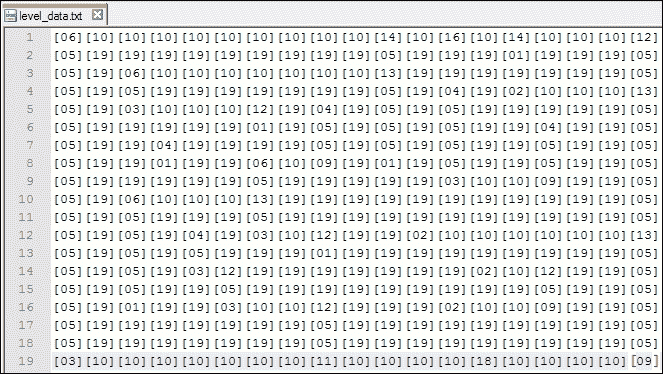
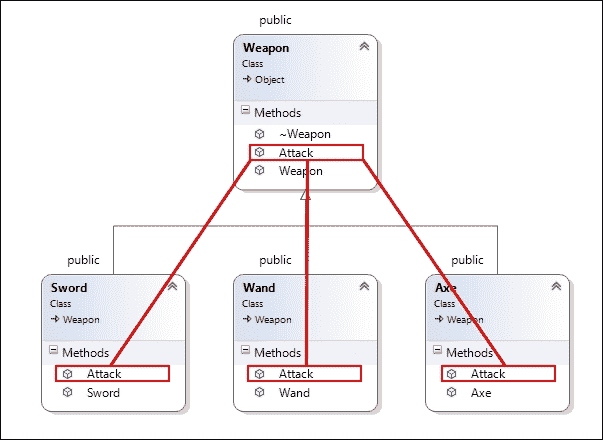
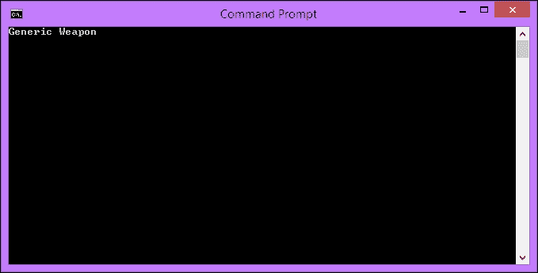
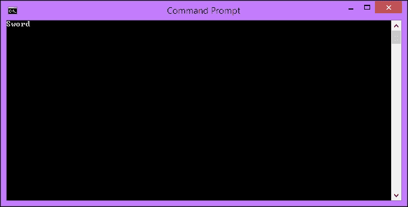
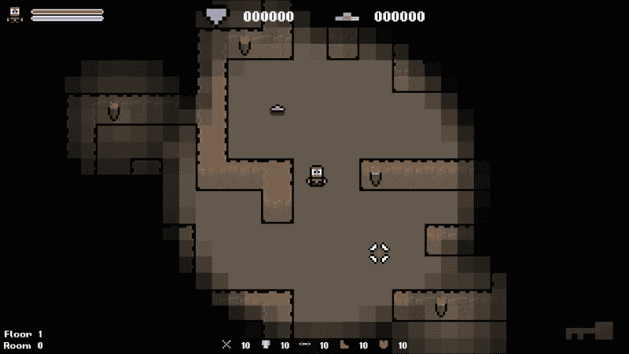
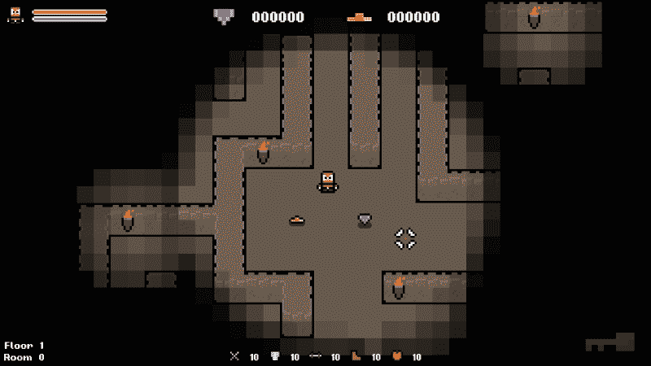

# 第二章：项目设置和分解

在我们自己实现过程生成之前，我们将快速浏览一下本书提供的游戏模板。未来，重点将放在我们创建的过程系统上，而不是底层模板和引擎。因此，在开始之前，熟悉模板和引擎将是有益的。

我们还将看一下**Simple Fast Multimedia Library**（**SFML**），这是我们将要使用的框架。

在本章中，我们将涵盖以下主题：

+   选择**集成开发环境**（**IDE**）

+   提供的游戏模板的分解

+   SFML 概述

+   多态

+   项目设置和第一次编译

+   对象管道

# 选择 IDE

在做任何事情之前，您需要一个可靠的 C++ IDE。您可能已经有自己喜欢使用的 IDE。如果您已经有一个，那很好。但如果没有，这是我喜欢的两个 IDE 的简要摘要。

## Microsoft Visual Studio

Microsoft Visual Studio 是微软的行业标准 IDE。它支持多种语言，并提供大量的测试和兼容性工具。它还与许多微软服务绑定在一起，使其成为 Windows PC 上开发的首选。使用 Microsoft Visual Studio 的优缺点如下：

**优点：**

+   它有许多免费版本可用

+   Microsoft Visual Studio 支持多种语言

+   它得到了微软的广泛支持

+   它具有高度可定制的环境，可通过可停靠窗口进行定制

+   它具有智能代码补全功能

+   它与许多微软功能集成

**缺点：**

+   其完整版本非常昂贵

+   其免费版本受限

+   仅适用于 Windows PC

### 提示

Microsoft Visual Studio 和其他许多微软技术可供学生免费使用。有关更多信息，请访问[`www.dreamspark.com/Student/`](https://www.dreamspark.com/Student/)。

## Code::Blocks

Code::Blocks IDE 是一个免费、开源、跨平台的 IDE，用于 C、C++和 Fortran 编程语言的开发。它建立在插件架构之上，意味着可以通过安装各种插件来高度定制，以创建最适合您需求的 IDE。

**优点：**

+   它是免费的

+   它适用于所有操作系统

+   通过安装插件，它可以高度定制

+   它支持多个容器

+   它具有智能代码补全功能

**缺点：**

+   与 Microsoft Visual Studio 提供的功能和工具相比，它具有较少的功能和工具

这两个 IDE 都具有我们在 C++中创建游戏所需的功能。因此，一切都取决于个人偏好。我建议使用 Visual Studio，并且这是我在整本书中将使用的 IDE。

## 其他 IDE

Visual Studio 和 Code::Blocks 只是众多可用的 IDE 中的两个例子。如果您不喜欢这两个，以下是一些备选的跨平台 IDE。它们都能够开发 C++代码：

+   NetBeans（Windows、Mac OS X 和 Linux）

+   Eclipse（Windows、Mac OS X 和 Linux）

+   Code Lite（Windows、Mac OS X 和 Linux）

## 构建系统

使用构建系统是使用 IDE 的替代方法。这些系统将构建过程与您使用的 IDE 或代码编辑器分离，使您对过程有更多控制。构建系统允许您自动化构建过程的各个方面。它可能是一些简单的事情，比如递增构建号，或者高级的事情，比如自动化单元测试。

有许多可用的构建系统，包括以下内容：

+   Make

+   CMake

+   MSBuild

+   Gradle

我们不会在书中涵盖这些系统的设置或使用。因此，请前往每个系统的相关网站查找文档和使用说明。

### 提示

有关构建系统及其提供的好处的更多信息，请访问[`www.cs.virginia.edu/~dww4s/articles/build_systems.html#make`](http://www.cs.virginia.edu/~dww4s/articles/build_systems.html#make)。

# 分解游戏模板

学习的最佳方式是通过实践。例子很好，但没有什么比真正投入并在一个真正的游戏中工作更好。提供的游戏模板将允许我们在一个真正的游戏中实现我们将要学习的系统，而不是它们成为一系列孤立的练习。

熟悉这个模板不仅会帮助使本书中的代码示例更清晰，还会使每章末尾的练习更容易。这也将使您能够在项目完成后使用所学知识来实现自己的系统。

## 下载模板

在开始之前，请下载游戏模板，以便在浏览一些关键点时可以使用源代码。模板可在 Packt Publishing 官方网站[`www.packtpub.com/support`](http://www.packtpub.com/support)上下载。

我们很快会设置它，但现在让我们快速查看一些其关键特性。

## 类图

项目下载包中包含了我们解决方案的完整类图像。如果您在任何时候对模板的结构有任何疑问，请参考该图表。

类图是查看软件完整结构的好方法。随着游戏变得越来越大，继承结构变得越来越复杂。如果您有可用的工具，定期查看类图并保持其结构是一个好主意。这将帮助您确定您的结构需要哪些工作，以及哪些不需要。

### 提示

在 Microsoft Visual Studio 中创建图表受限于专业版或更高版本。但是，有各种免费工具可用，例如 Doxygen [`www.stack.nl/~dimitri/doxygen/index.html`](http://www.stack.nl/~dimitri/doxygen/index.html)和 ArgoUML [`argouml.tigris.org/`](http://argouml.tigris.org/)，它们可以从源代码创建 UML 图表。

## 对象层次结构

模板中的所有对象都遵循一组继承层次结构。所有类的基础是`Object`类。这提供了一个`sprite`，一个`position`，一个`Update()`虚函数和一个`Draw()`虚函数。

所有类都从这个基类扩展，通过覆盖这些虚拟函数来实现它们自己的行为。在我们的`main`游戏类中，我们为主要基类创建容器，将所有物品和敌人分组到可以轻松迭代的单个集合中：

```cpp
std::vector<std::unique_ptr<Item>> m_items;
std::vector<std::unique_ptr<Enemy>> m_enemies;
```

基类指针的向量使我们能够利用多态性，并将从相同父类继承的所有类存储在单个数据结构中。如果您对多态性不熟悉，不要担心。在本章的末尾，我们将研究多态性和对象管道，以将对象添加到游戏中。

### 提示

我们在 C++11 中使用`std::unique_ptr`智能指针而不是原始指针。有关智能指针及其好处的更多信息，请访问[`msdn.microsoft.com/en-us/library/hh279674.aspx`](https://msdn.microsoft.com/en-us/library/hh279674.aspx)。

## 级别数据

提供的游戏模板是一个`roguelike`模板。鉴于此，级别被描述为一个网格。在这种情况下，表示网格的最佳方式是使用 2D 数组，并且为了存储我们需要的所有信息，我们将使用名为`Tile`的自定义数据类型，如下所示：

```cpp
/**
 * A struct that defines the data values our tiles need.
 */ 
struct Tile {
TILE type;         // The type of tile this is.

int columnIndex;   // The column index of the tile.

int rowIndex;      // The row index of the tile.

sf::Sprite sprite; // The tile sprite.

int H;             // Heuristic / movement cost to goal.

int G;             // Movement cost. (Total of entire path)

int F;             // Estimated cost for full path. (G + H)

Tile* parentNode;  // Node to reach this node.
};
```

这个`struct`允许我们拥有一个`Tile`类型的单个 2D 数组，可以存储每个瓦片需要的所有信息。在创建这种类型的游戏时，这种方法非常常见。该数组位于`Level`类中，在游戏开始时实例化。它封装了与级别相关的所有数据。

目前，级别数据存储在一个简单的文本文件中，在运行时通过对定义所有瓦片类型的枚举进行简单查找来解析。我们将在本章末尾的示例中进行这方面的工作。

以下屏幕截图显示了级别数据是如何保存的：



## 碰撞

碰撞是基于您当前所站的瓦片的`ID`。每当玩家开始移动时，将计算成功移动后他们将处于的位置。然后使用这个位置来计算他们所在的网格“瓦片”。然后使用这个瓦片来确定应执行什么操作；操作可能涉及执行阻塞移动、拾取物品或受到伤害。

### 注意

这种类型的碰撞可能导致子弹穿过纸的问题，但鉴于游戏的速度，这在我们的情况下不是问题。如果您不知道这个问题是什么，请在网上查找；它可能在以后的项目中让您出乎意料！

## 输入

输入是通过自定义的静态`Input`类处理的。它的工作方式很像 SFML 提供的`Input`类，但它将多个可能的输入组合成一个调用。例如，当检查左键是否按下时，它将检查*A*键、左箭头键、左*D*-Pad 和模拟摇杆。如果使用标准的`Input`类来完成这个任务，您将不得不分别检查所有四个。提供的`Input`类简化了这一过程。

在`input.h`中定义了一个公共的键码枚举，并包含以下用于轮询输入的值：

```cpp
/**
 * An enum denoting all possible input keys.
 */
enum class KEY
{
  KEY_LEFT,
  KEY_RIGHT,
  KEY_UP,
  KEY_DOWN,
  KEY_ATTACK,
  KEY_ESC
};
```

要检查输入，我们只需静态调用`Inputs IsKeyPressed(KEY keycode)`，传递前面提到的有效键码之一。

# SFML 简单快速多媒体库

虽然您可能有 C++的经验，但可能没有 SFML 的先验经验。没关系，本书不假设任何先验经验，所以现在让我们简要地浏览一下它

## 定义 SFML

**SFML**，简称**Simple and Fast Multimedia Library**，是一个软件开发库，提供了对多个系统组件的简单访问。它是用 C++编写的，并分为以下简洁的模块：

+   系统

+   窗口

+   图形

+   音频

+   网络

使用这种架构，您可以轻松地选择如何使用 SFML，从简单的窗口管理器到使用 OpenGL，再到完整的多媒体库，能够制作完整的视频游戏和多媒体软件。

## 为什么我们会使用 SFML

SFML 既是免费的、开源的，又有一个充满活力的社区。在官方网站上有活跃的论坛和一系列优秀的教程，为那些希望学习的人提供了丰富的资源。使用 SFML 的另一个引人注目的原因是它是用 C++编写的，并且有许多其他语言的绑定，这意味着您几乎可以用任何您喜欢的语言编程。您可能会发现您希望使用的语言已经有了绑定！

SFML 最吸引人的特点是它是一个多平台库。使用 SFML 编写的应用程序可以在大多数常见操作系统上编译和运行，包括 Windows、Linux 和 Mac OS X，在撰写本书时，Android 和 iOS 版本即将上市。

### 提示

为了使您的应用程序跨各种平台兼容，请记住您还必须确保您的本地代码或其他使用的库（如果有的话）也是跨平台兼容的。

## 学习 SFML

在本书的过程中，我们将研究 SFML 的特点和功能，以实现我们的过程系统，但不会更多。我们不会深入研究这个库，因为那需要一整本书。幸运的是，Packt Publishing 出版了一些专门针对这个问题的好书：

+   SFML 游戏开发网址[`www.packtpub.com/game-development/sfml-game-development`](https://www.packtpub.com/game-development/sfml-game-development)

+   SFML 基础位于[`www.packtpub.com/game-development/sfml-essentials`](https://www.packtpub.com/game-development/sfml-essentials)

+   SFML 蓝图位于[`www.packtpub.com/game-development/sfml-blueprints`](https://www.packtpub.com/game-development/sfml-blueprints)

如果您想了解更多关于 SFML 的信息，那么这些书是一个很好的起点。官方 SFML 网站上也有一些很棒的教程和活跃的论坛。访问[`www.sfml-dev.org/learn.php`](http://www.sfml-dev.org/learn.php)获取更多信息。

## 替代方案

虽然 SFML 是跨平台游戏开发的一个很好的选择，但并不是唯一的选择。有许多出色的库可供选择，每个都有自己的方法和风格。因此，虽然我们将在这个项目中使用 SFML，但建议您为下一个项目四处寻找。您可能会遇到您新的最喜欢的库。

以下是一些建议供将来参考：

+   SDL2 位于[`www.libsdl.org/download-2.0.php`](https://www.libsdl.org/download-2.0.php)

+   Allegro 位于[`liballeg.org/`](http://liballeg.org/)

+   MonoGame 位于[`www.monogame.net/downloads/`](http://www.monogame.net/downloads/)

# 多态

在开始游戏模板之前，我们将看一下多态。这是面向对象编程的一个重要特性，我们将在许多我们将创建的过程系统中充分利用它。因此，重要的是您不仅要对它有一个扎实的理解，还要了解用于实现它的技术和潜在的陷阱。

### 提示

如果您已经对多态有很好的理解，可以跳过本节，或者访问[`msdn.microsoft.com/en-us/library/z165t2xk(v=vs.90)`](https://msdn.microsoft.com/en-us/library/z165t2xk(v=vs.90))以深入讨论该主题。

多态是通过独立实现的共同接口访问不同对象的能力。这是一个非常正式的定义。因此，让我们将其分解为用于实现它的各种技术和特性。值得注意的是，虽然多态是游戏行业的标准方法，但它仍然是编程的其他学派之一。

## 继承

继承可能是实现多态的关键组成部分。继承是通过继承其变量和函数来扩展现有类，然后添加自己的内容。

让我们看一个典型的游戏示例。假设我们有一个有三种不同武器的游戏：剑、魔杖和斧头。这些类将共享一些公共变量，如攻击力、耐久度和攻击速度。创建三个单独的类并将这些信息添加到每个类中将是一种浪费，因此我们将创建一个包含所有共享信息的父类。然后，子类将继承这些值并按照自己的方式使用它们。

继承创建了一个“是一个”关系。这意味着由于斧头是从武器继承而来，斧头就是一种武器。在父类中创建一个共同接口，并通过子类以独特的方式实现它的概念是实现多态的关键。

### 注意

通过接口，我指的是父类传递给子类的函数和变量集合。

下图以简单的类图形式说明了这种情况：



在各个武器中突出显示的`Attack()`函数都是从**Weapon**类中定义的单个`Attack()`函数继承而来的。

### 提示

为了保持适当的封装和范围，重要的是给予我们的变量和函数正确的可见性修饰符。如果您对此不确定，或者需要一个快速提醒，可以访问[`msdn.microsoft.com/en-us/library/kktasw36.aspx`](https://msdn.microsoft.com/en-us/library/kktasw36.aspx)。

## 虚函数

继续使用通用武器示例，我们现在有一个父类，提供了许多函数和变量，所有子类都将继承。为了能够表示与父类不同的行为，我们需要能够重写父函数。这是通过使用虚函数实现的。

虚函数是可以被实现类重写的函数。为了实现这一点，父类必须将函数标记为虚函数。只需在函数声明前加上 virtual 关键字即可：

```cpp
Virtual void Attack();
```

在子类中，我们可以通过提供自己的定义来重写该函数，前提是两个函数的签名相同。这种重写是自动完成的，但是 C++11 引入了`override`关键字，用于明确指示函数将重写父类的函数。override 关键字是可选的，但被认为是良好的实践，并且建议使用。使用方法如下：

```cpp
Void Attack() override;
```

C++11 还引入了`final`关键字。该关键字用于指定不能在派生类中重写的虚函数。它也可以应用于不能被继承的类。您可以如下使用 final 关键字：

```cpp
Void Attack() final;
```

在这种情况下，`Attack()`函数无法被继承类重写。

## 纯虚函数

我们刚刚介绍的虚函数允许继承类*可选*地重写函数。重写是可选的，因为如果在子类中找不到默认实现，父类将提供默认实现。

然而，纯虚函数不提供默认实现。因此，它必须由继承类实现。此外，如果一个类包含纯虚函数，它就变成了抽象类。这意味着它无法被实例化，只有继承类可以，前提是它们为纯虚函数提供了实现。如果一个类从抽象类继承，并且没有为纯虚函数提供实现，那么该类也变成了抽象类。

声明纯虚函数的语法如下：

```cpp
Virtual void Attack() = 0;
```

在`Weapon`父类的例子中，它被`Sword`，`Axe`和`Wand`继承，将`Weapon`设为抽象类是有意义的。我们永远不会实例化`Weapon`对象；它的唯一目的是为其子类提供一个公共接口。由于每个子类都需要有一个`Attack()`函数，因此在`Weapon`中将`Attack()`函数设为纯虚函数是有意义的，因为我们知道每个子类都会实现它。

## 指针和对象切片

多态谜题的最后一部分是指针的使用。考虑以下两行代码：

```cpp
Weapon myWeapon = Sword();
Std::unique_ptr<Weapon> myWeapon = std::make_unique<Sword>();
```

在第一行中，我们没有使用指针；在第二行中，我们使用了指针。这似乎是一个小差别，但它产生了极其不同的结果。为了正确演示这一点，我们将看一个定义了多种武器的小程序。

### 提示

如果`Weapon`类包含一个纯虚函数，前面代码的第一行将无法编译，因为它是抽象的，无法实例化。

您可以从 Packt Publishing 网站下载此程序的代码。它将在`Examples`文件夹中，项目名称为`polymorphism_example`：

```cpp
#include <iostream>

// We're using namespace std here to avoid having to fully qualify everything with std::
using namespace std;

int main()
{

  // Here we define a base Weapon struct.
  // It provides a single data type, and a method to return it.
  struct Weapon
  {
    string itemType = "Generic Weapon";

    virtual string GetItemType()
    {
      return itemType;
    }
  };

  // Here we inherit from the generic Weapon struct to make a specific Sword struct.
  // We override the GetItemType() function to change the itemType variable before returning it.
  struct Sword : public Weapon
  {
    string GetItemType() override
    {
      itemType = "Sword";
      return itemType;
    }
  };

  Weapon myWeapon = Sword();

  // output the type of item that weapon is then wait.
  cout << myWeapon.GetItemType().c_str() << endl;
  std::cin.get();

  return 0;
}
```

在这段代码中，我们创建了一个基本结构`Weapon`。然后我们从中继承，创建了一个名为`Sword`的具体实现。基本`Weapon`结构定义了`GetItemType()`函数，而`Sword`重写它以更改并返回物品类型。这是一个很简单的继承和多态的例子，但有一些重要的事情我们需要知道，否则可能会让我们困惑。

目前，代码中`Weapon`对象是这样实例化的：

```cpp
Weapon myWeapon = Sword()
```

让我们运行代码，看看我们得到了什么：



尽管我们为`myWeapon`分配了一个`Sword`对象，但它是一个`Weapon`对象。这里发生了什么？问题在于`myWeapon`被赋予了一个固定类型的武器。当我们尝试为它分配一个`Sword`对象时，它被传递给`Weapon`的`copy`构造函数并被切割，只留下一个`Weapon`对象。因此，当我们调用`GetItemType()`函数时，我们调用的是`Weapon`中的函数。

### 提示

有关对象切割的更深入解释，请访问[`www.bogotobogo.com/cplusplus/slicing.php`](http://www.bogotobogo.com/cplusplus/slicing.php)。

有两种方法可以链接 SFML：**静态**和**动态**库。静态库是编译到可执行文件中的库。这意味着您的可执行文件会更大，但您不必担心在运行时获取库。动态库不会链接到可执行文件中，这会导致可执行文件更小，但会创建依赖关系。

```cpp
  // Create our weapon object.
  //Weapon myWeapon = Sword();
 std::unique_ptr<Weapon> myWeapon = std::make_unique<Sword>();

```

### 提示

像`unique_ptr`这样的智能指针需要`include <memory>`。所以不要忘记将其添加到文件的顶部。

既然我们现在把`myWeapon`改成了指针，我们还需要改变以下内容：

```cpp
// Output the type of item that weapon is then wait.
//cout << myWeapon.GetItemType().c_str() << endl;
cout << myWeapon->GetItemType().c_str() << endl;

```

在使用指针时，我们需要使用`->`运算符来访问它的变量和函数。现在，让我们重新运行代码，看看输出是什么：



下载 SFML

由于`myWeapon`现在是指向`Weapon`对象的指针，我们避免了对象切割。由于`Sword`是从`Weapon`派生出来的，指向内存中的`Sword`并不是问题。它们共享一个公共接口，因此我们实现了这种重写行为。回到最初的定义，多态性是通过独立实现的公共接口访问不同对象的能力。

# 接下来，您需要为您的编译器选择正确的软件包。如果您使用 Microsoft Visual Studio，您只需要选择与您版本匹配的年份，如果您使用 Code::Blocks，或者其他任何 IDE，选择您正在使用的**GNU 编译器集合（GCC）**的版本。

本书提供了一个专门为本书创建的`roguelike`游戏的模板。它被设计为接收我们将要涵盖的工作，并且在本书结束时，您将拥有一个完全功能的 roguelike 游戏，实现了您将学到的一切。现在我们已经复习了我们对多态性的理解，让我们开始设置模板。第一步是下载并链接 SFML。

### 提示

所提供的项目链接了 SMFL 32 位 Windows 库。这应该适合大多数系统。如果这与您的系统兼容，您可以跳过以下步骤。

## 下载 SFML

SFML 有许多不同的预编译软件包可用。例如，在撰写本书时的最新版本仅在 Windows 上就有 12 个软件包可用，因此重要的是您为您的系统下载正确的软件包。以下步骤将帮助您下载并设置 SFML：

1.  访问[`www.sfml-dev.org/download.php`](http://www.sfml-dev.org/download.php)查找 SFML 下载页面。除非您特别需要针对 64 位机器，否则选择 32 位库。32 位程序在 64 位机器上可以正常工作。

1.  这一次，我们按照预期调用了`Sword`结构中的重写函数，这归结为我们如何定义`myWeapon`。

1.  一旦确定了适合您系统的正确版本，请下载并提取`.zip`文件的内容到您想要保存 SFML 的位置。这个位置与您的项目无关；它们不需要共享一个目录。

### 提示

如果您希望或需要这样做，可以自己构建 SFML 以创建自定义软件包。有关如何执行此操作的说明，请访问[`github.com/SFML/SFML`](https://github.com/SFML/SFML)。

## 为了避免这种情况并充分利用多态性，我们需要使用指针。让我们对代码进行以下更改：

链接 SFML

### 提示

有关`static`和`dynamic`库之间的区别的更多信息，请访问[`www.learncpp.com/cpp-tutorial/a1-static-and-dynamic-libraries/`](http://www.learncpp.com/cpp-tutorial/a1-static-and-dynamic-libraries/)。

我们将进行动态链接，这意味着要运行游戏，您将需要`.dll`文件。

为此，首先从 SFML 源中将游戏需要的`DLL`文件复制到项目的可执行位置。将所有文件从`<sfml-install-path/bin>`复制到`<project-location/Debug>`。

接下来，我们必须告诉编译器 SFML 头文件在哪里，链接器输出库在哪里。头文件是`.hpp`文件，库是`.lib`文件。这一步根据您使用的 IDE 有所不同。

在 Microsoft Visual Studio 中，将以下内容添加到项目的属性中：

+   SFML 头文件的路径（`<sfml-install-path>/include`）到**C/C++** | **General** | **Additional Include Directories**

+   SFML 库的路径（`<sfml-install-path>/lib`）到**Linker** | **General** | **Additional Library Directories**

在 Code::Blocks 中，将以下内容添加到项目的**Build Options**和**Search Directories**选项卡：

+   SFML 头文件的路径（`<sfml-install-path>/include`）到`Compiler`搜索目录

+   SFML 库的路径（`<sfml-install-path>/lib`）到`Linker`搜索目录

### 提示

这些路径在`Debug`和`Release`配置中是相同的。因此，它们可以全局设置为项目。

最后一步是将我们的项目链接到正在使用的 SFML 库。SFML 由五个模块组成，但我们不会使用所有模块。我们使用`System`，`Windows`，`Graphics`和`Audio`。因此，我们只需要链接到这些库。与上一步不同，项目配置很重要。`Debug`和`Release`配置有单独的库。因此，您需要确保链接正确的库。

在`Debug`配置中，我们需要添加以下库：

+   `sfml-system-d.lib`

+   `sfml-window-d.lib`

+   `sfml-graphics-d.lib`

+   `sfml-audio-d.lib`

现在，对于**Release**配置做同样的事情。但是，从每个中删除`-d`。例如，在**Debug**配置中添加`sfml-system-d.lib`，在**Release**配置中添加`sfml-system.lib`。

要将它们添加到 Microsoft Visual Studio 中，必须通过导航到**Linker** | **Input** | **Additional Dependencies**将它们添加到项目的属性中。

要将它们添加到 Code::Blocks 中，必须在**Linker Settings**选项卡下的项目构建选项的**Link Libraries**列表中添加它们。

### 提示

如果您对此设置有任何疑问，请访问[`www.sfml-dev.org/learn.php`](http://www.sfml-dev.org/learn.php)获取完整的详细信息以及图片。

## 运行项目

现在 SFML 已链接到我们的项目，我们应该准备进行第一次构建。以下截图显示了我们目前空白的地牢游戏：



目前，我们有一个可以运行的应用程序，在一个固定的房间中生成一个玩家。第一个任务涉及添加一个项目。

## 添加一个项目

我们创建的所有项目都需要继承自基类`Item`，因为所有游戏项目都存储在`std::unique_ptr<Item>`类型的单个向量中。通过这种数据结构，我们可以利用多态性，并将所有项目子类存储在一个结构中；通过这种方式，我们可以更新和绘制每个项目。

要添加到这个向量中，只需通过唯一指针实例化一个新项目。然后，使用`.push_back()`方法将其添加到向量中。由于我们使用的是唯一指针，因此必须使用`std::move()`来实现。

### 提示

如果您不清楚为什么我们在这里必须使用`std::move`，请在互联网上搜索唯一指针。

在`Game::PopulateLevel`函数中，让我们添加一个宝石项目，如下所示：

```cpp
// Create a gem object.
std::unique_ptr<Gem> gem = std::make_unique<Gem>();

// Set the gem position.
gem->SetPosition(sf::Vector2f(m_screenCenter.x + 50.f, m_screenCenter.y));

// Add the gem to our collection of all objects.
m_items.push_back(std::move(gem));

```

我们所要做的就是通过一个独特的指针创建一个新对象，给它一个位置，然后使用 `std::move` 函数将其添加到关卡中所有物品的列表中。简单！

## 更新和绘制

一旦物品被添加到所有对象的向量中，它将自动更新：

```cpp
// Update all items.
UpdateItems(playerPosition);
```

这个函数遍历所有的物品，检查它们是否被收集；如果不是，就更新它们。每个对象的 `Update()` 函数都有一个名为 `timeDelta` 的参数。这是一个包含自上次更新以来经过的时间的浮点数。它在主游戏循环中用于保持游戏逻辑固定在 60 fps。

### 提示

要了解更多关于主游戏循环的信息，请访问 [`gafferongames.com/game-physics/fix-your-timestep/`](http://gafferongames.com/game-physics/fix-your-timestep/)，这是一个关于这个主题的很棒的文章。

物品的绘制方式类似；它们的容器只是在 `Game::Draw` 函数中进行迭代。循环如下：

```cpp
// Have all objects draw themselves. 
for (const auto& item : m_items) 
{ 
    item->Draw(m_window, timeDelta); 
}
```

`m_window` 变量是一个指向渲染窗口的指针。因此，我们将它传递给每个对象，以便它可以用它来绘制自己。

现在，如果你运行游戏，你会看到房间里的宝石和金子，就像下面的截图所示：



# 练习

为了帮助你测试本章内容的知识，这里有一些练习题供你练习。它们对于本书的其余部分并不是必要的，但是练习它们将有助于你评估所涵盖材料的优势和劣势。

1.  为你的游戏创建一个名称，并更改主窗口的文本以反映这一变化。

1.  考虑以下代码：

```cpp
class A
{
public:
    int x;
protected:
    int y;
private:
    int z;
};

class B : protected A
{

};
```

`B` 类中 `x`、`y` 和 `z` 的可见性是什么？

1.  在关卡中添加更多物品。

# 总结

在本章中，我们做了一些准备工作，以便开始编写游戏并创建程序系统。我们看了看将要使用的软件和库，以及我们将扩展的游戏模板。我们还快速学习了多态性和实现它的技术。

我们现在准备开始创建我们自己的程序系统。我们刚刚介绍的基础工作并不是非常令人兴奋，但对于理解我们将要涉及的工作至关重要。在下一章中，我们将利用我们在 C++ 数据类型中学到的关于随机数生成的知识来生成随机物品，并给我们的玩家随机属性。
