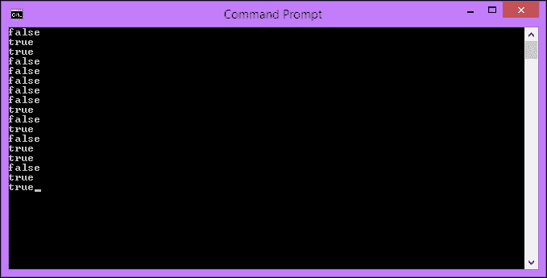
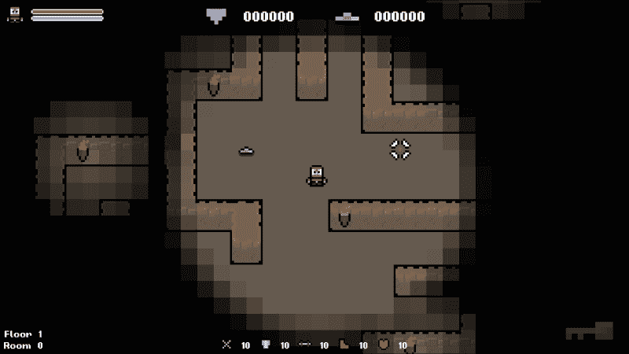
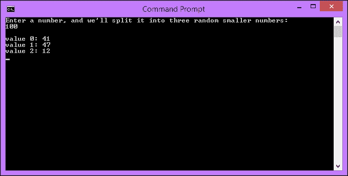
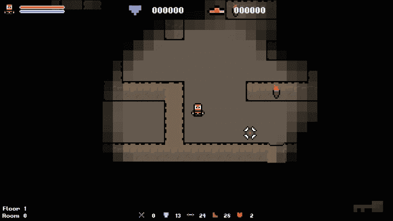
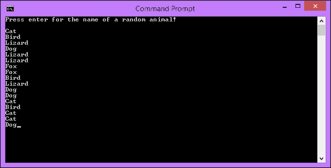
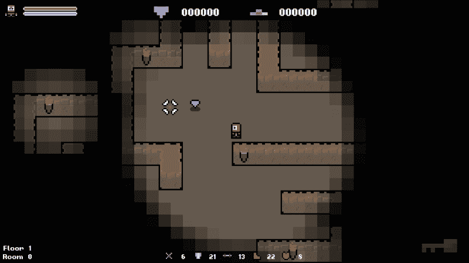
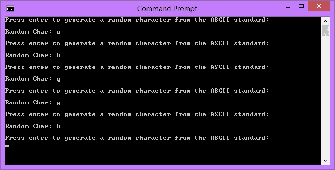
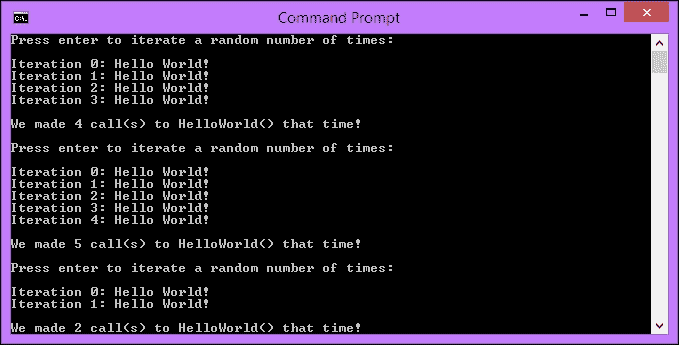
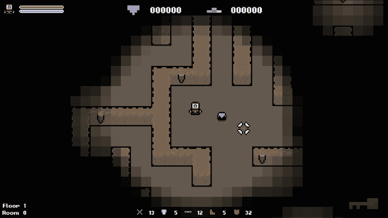

# 第三章：使用 C++数据类型进行 RNG

在第一章中，*程序化生成简介*，我们了解到伪随机数生成是随机程序生成的核心。请记住，程序化系统本质上不是随机的，我们需要引入随机性。为了开始我们的旅程，我们将研究一系列不同的 C++数据类型，并使用随机数生成器（RNG）在运行时为它们赋予随机值。在随机但仍受控的方式下使用核心 C++数据类型的能力将成为我们未来所有系统的基础。

在本章中，我们将涵盖以下主题：

+   设置游戏种子

+   枚举器

+   随机设置布尔值

+   访问数组中的随机元素

+   生成随机字符串

+   随机数分布

# 设置游戏种子

在做任何事情之前，我们需要设置游戏种子。如果没有种子，我们每次运行游戏时都会得到相同的结果。正如我们所学的，这只需要我们调用`std::srand()`函数并传递一个随机参数作为种子。我们将使用当前系统时间作为我们的种子，对我们的目的来说已经足够随机了。

我们对`std::srand()`函数的调用是任意的，只要在对`std::rand()`函数的任何调用之前调用它即可。文件`main.cpp`包含了函数`main()`，这是应用程序的入口点。我们将在这里调用`std::srand()`函数。

我们更新后的`main()`函数现在应该是这样的：

```cpp
// Entry point of the application.
int main()
{
    // Set a random seed.
    std:: srand(static_cast<unsigned int>(time(nullptr)));

    // Create the main game object.
    Game game;

    // Create a Boolean that we can store out result it.
    bool result;

    // Initialize and run the game object.
    result = game.Initialize();

    if (result)
    {
        game.Run();
    }

    // Shutdown and release the game object.
    game.Shutdown();

    // Exit the application.
    return 0;
}
```

现在每次运行游戏时，我们都会设置一个随机种子，因此我们对`std::rand()`的调用会产生唯一的结果。

### 提示

如果您希望游戏在运行之间保持一致，可以使用硬编码的值作为种子。只是不要忘记改回来，否则以后会想为什么事情不随机！

# 随机设置布尔值

也许最简单的数据类型是谦卑的布尔值。只有两种状态，true 和 false，应该不难随机设置！当表示为整数时，这两种状态具有以下属性：

+   False = 0 或更低

+   True = 1 或更高

因此，要随机分配一个布尔值，我们只需要生成数字 0 或 1。 

## 生成 0 到 1 之间的数字

在第一章中，*程序化生成简介*，我们介绍了在特定范围内生成随机数。现在我们将把它用起来。使用`std::rand()`函数，我们将生成一个介于 0 和 1 之间的数字：

```cpp
std::rand() % 2;
```

### 提示

请记住，`std::rand()`生成一个介于`0`和`RAND_MAX`之间的数字。然后我们计算该结果除以 2 的余数。这样就只剩下了 0 和 1 的范围。

`bool`不一定要用`true`或`false`关键字设置。您可以将整数赋给`bool`，其状态将由整数的值决定，使用前面规定的规则。小于 1 的任何数字都是 false，大于 0 的任何数字都是 true。这意味着我们可以直接将结果传递给 bool：

```cpp
bool myBool = std::rand() % 2;
```

将这些放在一起，我们可以创建一个简单的控制台应用程序，每次用户按下*Enter*键时都会随机输出 true 或 false。

您可以从 Packt Publishing 网站下载此程序的代码。它将在`Examples`文件夹中，项目名称为`random_boolean`：

```cpp
#include <iostream>

using namespace std;

int main()
{
  // Loop forever.
  while (true)
{
    // Generate a number between 0 and 1.
    bool myBool = rand() % 2;
    if (myBool)
    {
        cout << "true";
    }
    else
    {
        cout << "false";
    }
    return 0;
}
```

这段代码的输出结果如下：



每次我们按下*Enter*键，我们都会得到一个随机的布尔值。即使是这种简单的随机生成也可以让我们开始构建我们的程序化地牢游戏。让我们立即将其应用到房间创建时物品的生成上。

### 提示

请记住，在这个小例子应用程序中，我们没有随机设置种子。因此，每次运行程序时，该程序将生成相同的值序列。

## 选择物品是否生成

当前，当我们启动游戏时，宝石和黄金物品总是会生成。让我们使用这个随机布尔赋值来决定是否创建这两个物品。为了实现这一点，我们将封装它们的生成代码在一个`if`语句中，其参数将是我们随机布尔赋值的结果。

`Game::PopulateLevel`方法是我们生成物品的地方。我们将用以下代码替换当前的代码：

```cpp
// Populate the level with items.
void Game::PopulateLevel()
{
    // A Boolean variable used to determine if an object should be spawned.bool canSpawn;

    // Spawn gold.
    canSpawn = std::rand() % 2;
    if (canSpawn)
    {
       std::unique_ptr<Gold> gold = std::make_unique<Gold>();
       gold->SetPosition(sf::Vector2f(m_screenCenter.x - 50.f, m_screenCenter.y));
       m_items.push_back(std::move(gold));
    }

    // Spawn a gem.
    canSpawn = std::rand() % 2;
    if (canSpawn)
    {
       std::unique_ptr<Gem> gem = std::make_unique<Gem>();
       gem->SetPosition(sf::Vector2f(m_screenCenter.x + 50.f, m_screenCenter.y));
       m_items.push_back(std::move(gem));
    }
}
```

现在，每次我们运行游戏，宝石和黄金是否生成都是随机的。



这是一个简单的改变，但是创建程序生成游戏的第一步。没有单一的算法或函数可以使游戏程序化。这是一系列小技巧的集合，比如这样的技巧可以使系统在运行时不可预测和确定。

# 随机数分配

让我们在随机数生成的基础上分配随机数字。我们首先生成 0 到 100 之间的`n`个数字。如果我们把它们加在一起，我们就得到一个随机总数，其中我们的每个单独的数字代表了一个百分比。然后我们可以取得我们目标数字的百分比来得到一个随机部分。以下代码演示了这一点，并会让它更清晰。

您可以从 Packt 网站下载此程序的代码。它将在`Examples`文件夹中，项目名称为`random_distribution`：

```cpp
#include <iostream>

using namespace std;

// Entry method of the application.
int main()
{
  // Create and initialize our variables.
  int upperLimit = 0;

  // Output instructions.
  cout << "Enter a number, and we'll split it into three random smaller numbers:" << endl;
  cin >> upperLimit;
  cout << endl;

  float number1Bias = rand() % 101;
  float number2Bias = rand() % 101;
  float number3Bias = rand() % 101;

  float total = number1Bias + number2Bias + number3Bias;

  // Output the numbers.
  cout << upperLimit * (number1Bias / total) << endl;
  cout << upperLimit * (number2Bias / total) << endl;
  cout << upperLimit * (number3Bias / total) << endl;

  // Pause so we can see output.
  cin.get();
  cin.get();

  // Exit function.
  return 0;
}
```

这种方法确保了数字的每个部分都是完全随机的。需要考虑一个轻微的舍入误差，但这对我们的应用程序不是问题。



让我们不浪费时间，将这项新技能应用到游戏中！

# 给玩家随机属性

这种随机分配数字的经典方式是给玩家随机属性。传统上，游戏中的角色会获得`n`个属性点，由玩家来分配。由于我们正在制作一个程序生成游戏，我们将随机分配它们，以创建程序生成的角色属性。

为此，我们需要将以前的代码与玩家属性变量的赋值连接起来。我们的玩家属性目前是固定的，并且是以下方式分配的：

```cpp
m_attack = 10;
m_defense = 10;
m_strength = 10;
m_dexterity = 10;
m_stamina = 10;
```

让我们用以下代码替换它来随机分配属性。我们还会给玩家添加一个变量，这样我们就可以改变玩家有多少`stat`点可以分配。

首先，将以下变量添加到玩家中，并不要忘记将其添加到我们的初始化列表中：

```cpp
int m_statPoints;
```

现在让我们使用这个来给我们的玩家随机属性：

```cpp
// Randomly distribute other stat.
m_statPoints = 50;

float attackBias = std::rand() % 101;
float defenseBias = std::rand() % 101;
float strengthBias = std::rand() % 101;
float dexterityBias = std::rand() % 101;
float staminaBias = std::rand() % 101;

float total = attackBias + defenseBias + strengthBias + dexterityBias + staminaBias;

m_attack += m_statPoints * (attackBias / total);
m_defense += m_statPoints * (defenseBias / total);
m_strength += m_statPoints * (strengthBias / total);
m_dexterity += m_statPoints * (dexterityBias / total);
m_stamina += m_statPoints * (staminaBias / total);
```

每次我们加载游戏时，我们的玩家的属性点都是随机分配的。这种随机分配一定数量的方法可以用在很多其他地方，比如在玩家之间分享战利品，或者在多个实体之间分配伤害。



# 访问集合中的随机元素

当我们有类似对象的集合时，它们通常存储在数组和向量等结构中。通常在处理这些结构时，我们访问特定的元素，它们的统一性和顺序使它们有用。

要访问特定的元素，我们只需提供它在集合中的索引。因此，要访问数组的一个随机元素，我们只需提供一个随机索引，这只是生成一个随机数的简单情况。

让我们看一个例子。在下面的例子中，我们创建了一个字符串向量，其中我们填充了动物的名字。每次我们按回车键，我们通过生成一个 0 到向量大小之间的数字来访问向量的一个随机元素。

您可以从 Packt 网站下载此程序的代码。它将在`Examples`文件夹中，项目名称为`random_element`：

```cpp
#include <iostream>
#include <vector>

using namespace std;

// Entry method of the application.
int main()
{
  // Create and populate an array of animals.
  vector<string> animals = { "Dog", "Cat", "Bird", "Fox", "Lizard" };

  // Output the instructions.
  cout << "Press enter for the name of a random animal!" << endl;

  // Loop forever.
  while (true)
  {
    // Wait for user input.
    cin.get();

    // Generate a random index.
    int randomIndex;
    randomIndex = rand() % animals.size();

    // Output the name of the randomly selected animal.
    cout << animals[randomIndex].c_str();
  }

  // Exit function.
  return 0;
}
```

输出如下：



访问集合的随机元素是创建程序系统的一个很好的工具。在游戏中的任何地方，只要有一个对象，您都可以创建一个备用的数组或向量，并在运行时随机选择一个。仅凭这一点，您就可以创建一个高度随机化的游戏，每次运行都是独一无二的。

# 生成随机物品

目前，当我们加载游戏时，设置物品会被生成。我们需要添加一些随机性，一个简单的`switch`语句就足够了。在可能的情况下，我们总是希望添加选项来创建随机和程序生成的内容。

要随机生成我们的物品，我们需要生成一个介于`0`和我们拥有的物品数量之间的随机数，然后在`switch`语句中使用它。如前所述，没有一种方法可以进行程序生成，因此还有其他方法可以实现这一点。

让我们添加数字生成和`switch`语句来选择要生成的物品。更新后的`Game::PopulateLevel`函数应该如下所示：

```cpp
// Populate the level with items.
void Game::PopulateLevel()
{
    // A Boolean variable used to determine if an object should be spawned.
    bool canSpawn;

    // Spawn an item.
    canSpawn = std::rand() % 2;
    if (canSpawn)
    {
        int itemIndex = std::rand() % 2;
        std::unique_ptr<Item> item;
        switch (itemIndex)
        {
            case 0:
                item = std::make_unique<Gold>();
            break;

            case 1:
                item = std::make_unique<Gem>();
            break;
        }
        item->SetPosition(sf::Vector2f(m_screenCenter.x, m_screenCenter.y));
        m_items.push_back(std::move(item));
    }
}
```

现在我们可以看到，当我们运行游戏时，如果可以生成一个物品，它将是金色物品或宝石。我们在游戏中有很多物品，在下一章中，我们将扩展此系统以包括它们所有，从一个函数中填充整个级别：



# 生成随机字符

由于我们已经介绍了从固定词汇表生成随机字符串，让我们看看如何生成随机字符。`char`数据类型是一个单个的，一个字节的字符。

字符串实际上只是一个以空字符结尾的字符序列，所以下面的代码行产生了完全相同的结果：

```cpp
Stirng myStringLiteral = "hello";
string myString = { 'h', 'e', 'l', 'l', 'o', '\0' };
```

同样，以下代码在语义上是正确的：

```cpp
char myCharArray[6] = { 'h', 'e', 'l', 'l', 'o', '\0' };
string stringVersion = myCharArray;
```

由于`char`是一个字节，它具有 0 到 255 的可能整数表示。每个这些十进制值代表一个不同的字符。在 ASCII 表中可以找到查找表。例如，字符*a*的十进制值为`97`。我们可以在分配`char`时使用这些整数，如下所示：

```cpp
char myChar = 97;
```

### 提示

在 C++中，`char`的最大十进制值是 255。如果超过这个值，它将溢出并通过表格循环。例如，将 char 值设置为 353 将导致字符*a*。 ASCII 表可以在[`www.asciitable.com/`](http://www.asciitable.com/)找到。

因此，要生成一个随机字符，我们需要生成一个介于 0 和 255 之间的数字，这是我们现在非常熟悉的。

您可以从 Packt 网站下载此程序的代码。它将在`Examples`文件夹中，项目名称为`random_character`：

```cpp
#include <iostream>

using namespace std;

// Entry method of the application.
int main()
{
  // Loop forever.
  while (true)
  {
    // Output instructions.
    cout << "Press enter to generate a random character from the ASCII standard:" << endl;

    // Pause for user input.
    cin.get();

    // The ASCII characters range from 0 - 127 in decimal.
    int randInt = rand() % 128;

    // To turn that into a char, we can just assign the int.
    char randChar = randInt;

    // Output the random char.
    cout << "Random Char: " << randChar << "\n" << endl;
  }

  // Exit function.
  return 0;
}
```

通过这段代码，我们从整个 ASCII 表中生成一个随机字符。要在更具体的范围内生成字符，我们只需要限制我们生成的数字范围。

例如，查看 ASCII 表可以看到小写字母表从 97 开始，直到 122。让我们调整随机数生成器，只生成这个范围内的值：

```cpp
// The ASCII characters range from 0 - 127 in decimal.
//int randInt = rand() % 128;
int randInt = std::rand() % 128;
int randInt = std::rand() % 26 + 97;

```

现在我们可以看到输出只是小写字母表中的字母，如下面的屏幕截图所示：



# 重复循环

生成随机数的另一个用途是循环执行一定次数的代码。例如，当我们生成物品时，我们对生成代码进行单独调用。如果我们只想每次生成一个物品，这是可以的，但是当我们想生成随机数量的物品时怎么办。

我们需要随机调用我们的代码，稍后我们将把它封装在自己的函数中，这可以通过`for`循环实现。在`for`循环中，我们指定循环迭代的次数，所以我们可以生成一个随机数来代替使用固定值。每次运行代码时，都会生成一个新的随机数，循环每次的大小都会不同。

您可以从[`www.packtpub.com/support`](http://www.packtpub.com/support)下载此程序的代码。它将在`Chapter 3`文件夹中，名为`random_loops.cpp`：

```cpp
// Include our dependencies.
#include <iostream>
#include <ctime>

// We include std so we don't have to fully qualify everything.
using namespace std;

void HelloWorld();

// Entry method of the application.
int main()
{
  // First we give the application a random seed.
  srand(time(nullptr));

  // Loop forever.
  while (true)
  {
    // Output the welcome message.
    cout << "Press enter to iterate a random number of times:" << endl;

    // Pause for user input.
    cin.get();

    // Generate a random number between 1 and 10.
    int iterations = rand() % 10 + 1;

    // Now loop that number of times.
    for (int i = 0; i < iterations; i++)
    {
      cout << "Iteration " << i << ": ";
      HelloWorld();
    }

    // Output ending message.
    cout << endl << "We made " << iterations << " call(s) to HelloWorld() that time!" << endl << endl;
  }

  // Exit function.
  return 0;
}

// Outputs the text Hello World!.
void HelloWorld()
{
  cout << "Hello World!" << endl;
}
```

输出显示在以下截图中：



# 生成随机数量的物品

在我们的`Game::PopulateLevel`函数中生成物品，并且能够随机调用函数的次数，让我们更新代码，以便在游戏开始时生成随机数量的物品。

为了实现这一点，我们只需要像在上一个练习中一样创建相同的循环，并将我们的生成代码封装在其中。让我们用以下代码更新`Game::PopulateLevel`：

```cpp
// Populate the level with items.
void Game::PopulateLevel()
{
  // A Boolean variable used to determine if an object should be spawned.
  bool canSpawn;

 // Generate a random number between 1 and 10.
 int iterations = std::rand() % 10 + 1;

 // Now loop that number of times.
 for (int i = 0; i < iterations; i++)
 {
 // Spawn an item.
 canSpawn = std::rand() % 2;

    if (canSpawn)
    {
      int itemIndex = std::rand() % 2;
      std::unique_ptr<Item> item;

      switch (itemIndex)
      {
      case 0:
        item = std::make_unique<Gold>();
        break;

      case 1:
        item = std::make_unique<Gem>();
        break;
      }

      item->SetPosition(sf::Vector2f(m_screenCenter.x, m_screenCenter.y));
      m_items.push_back(std::move(item));
    }
  }
}
```

现在当我们运行代码时，会生成一堆物品。它们目前是在彼此之上生成的，但不用担心，我们将在下一章中解决这个问题！



# 练习

为了让您测试本章内容的知识，这里有一些练习题，您应该完成。它们对本书的其余部分并不是必不可少的，但通过完成它们，您可以评估自己在所涵盖材料上的优势和劣势。

1.  为随机字符串生成器添加更多选项。尝试创建一个使用两个随机单词的生成器。

1.  修改随机字符生成程序，以便生成大写字母 A-Z 和小写字母 a-z 的字符。

1.  玩家目前是在水平中的固定位置生成的。创建一组可能的生成坐标，并在运行时随机选择它们，以便生成位置有所变化。

# 总结

在本章中，我们已经了解了一系列 C++数据类型，并将 RNG 与它们的使用结合起来。以随机但受控的方式使用这些数据类型的能力是实现随机程序系统的关键。记住，程序生成只是根据计算结果创建内容。这并不是自然而然的随机，我们必须像本章中所做的那样引入随机性。我们对游戏所做的增加很小，但是是创建程序生成游戏的第一步。当我们运行游戏时，每次都会有一点不同。

在下一章中，我们将通过在地图周围的随机位置生成物品和敌人来进一步开发我们的水平。程序生成的环境是程序生成游戏中的一个重要部分，将游戏对象生成在随机位置是实现这一目标的重要一步。
