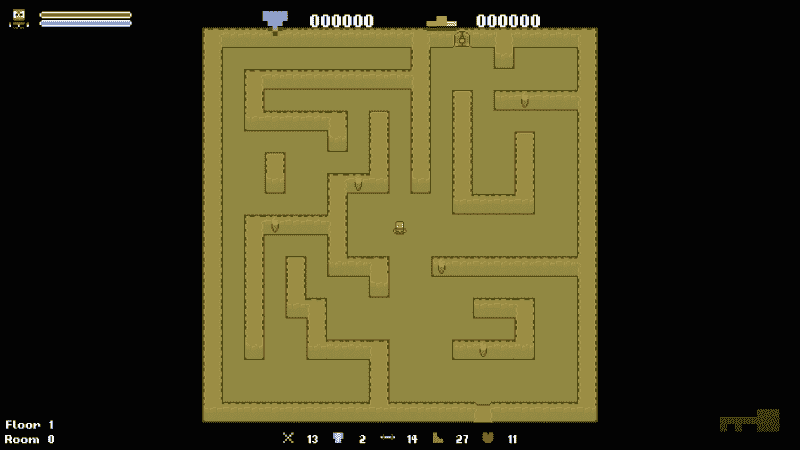
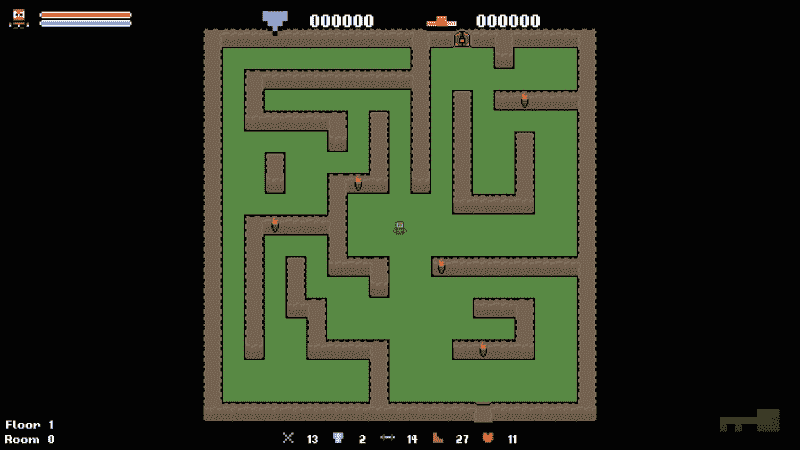
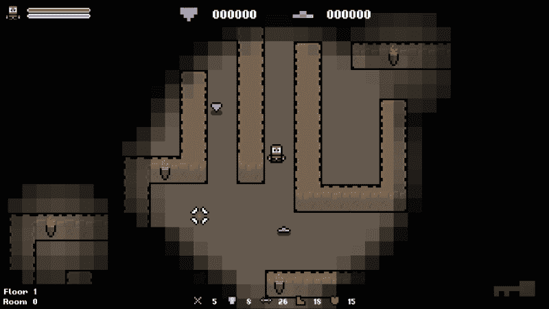
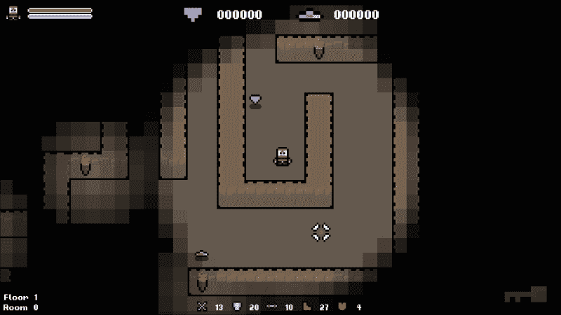
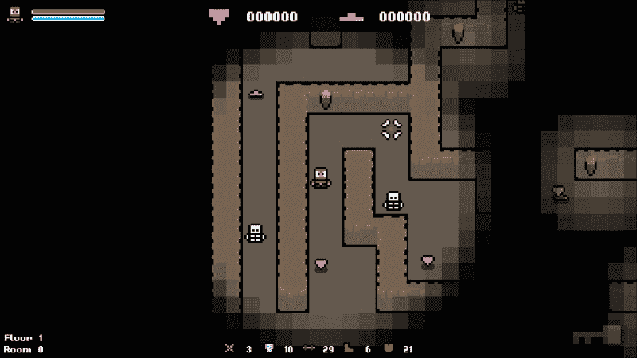
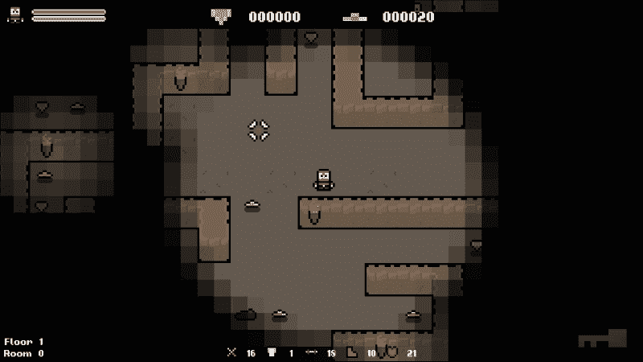

# 第四章：程序化填充游戏环境

现在我们已经熟悉了使用核心 C++数据类型的**随机数生成器**（**RNG**），让我们看看如何创建一个高度随机化的环境。这将包括随机生成和定位物品、敌人等。在本章中，我们还将触及随机地图生成，然后在本书末尾直面挑战。

物体生成的方式在很大程度上取决于你的级别数据的基础设施。对于大多数 2D 游戏，你可以采取与本章演示的类似的方法，如果不是完全相同的方法。然而，3D 游戏需要更多的工作，因为有一个额外的维度需要处理，但原则仍然是有效的。

在本章中，我们将涵盖以下主题：

+   在程序化填充环境时的障碍

+   定义生成区域

+   随机选择游戏`tile`

+   在随机位置生成物品

+   程序化生成环境的变化

# 潜在障碍

随机生成游戏环境并不像看起来那么简单。不仅仅是在级别范围内生成一个随机数。虽然这在技术上可能有效，但那里没有控制，因此生成的环境将有许多缺陷。物体可能重叠，位于无法到达的地方，或者按照不好的顺序布置。为了生成有意义且可玩的级别，需要更多的控制。

## 保持在一个级别的范围内

我相信我们都玩过一个物品生成在我们触及不到的地方的游戏。当在地图周围随机生成物体时，物体生成在触及不到的地方是非常令人恼火的。因此，建立准确的边界以内可以生成物体是很重要的。

正如你所想象的，这项任务的复杂性将与你的环境的复杂性相匹配。对我们来说，我们的级别被描述为一个简单的 2D 数组。因此，计算边界是相当容易的。

## 避免物体重叠

即使你完美地定义了你的级别边界，你还没有成功。环境通常不是空的，大部分都充满了风景和其他游戏对象。在选择随机生成坐标时，重要的是要考虑这些对象，以免在其中生成对象，再次将物品推出玩家的触及范围之外。

同样，我们不必太担心这一点，因为我们将有简单的没有风景的级别。

## 创建有意义的级别

说来话长，级别必须是有意义的。即使我们避免生成玩家无法触及的物品，也不会互相重叠，但如果它们都生成在一个遥远的角落，那也不好。

我们需要在我们的 RNG 操作的范围内创建合适的参数，以便我们对结果保持适当的控制。这是程序化生成游戏的一个主要陷阱。一次又一次，你会看到一个级别并不合理，因为算法产生了一个奇怪的结果。

# 级别瓦片

在我们开始使用“级别”网格之前，我们需要知道它是如何设置的！我们的“级别”被描述为一个自定义类型`Tile`的 2D 数组，这是在`Level.h`中定义的一个`struct`：

```cpp
// A struct that defines the data values our tiles need.
struct Tile
{
TILE type;          // The type of tile this is.
int columnIndex;    // The column index of the tile.
int rowIndex;       // The row index of the tile.
sf::Sprite sprite;  // The tile sprite.
int H;              // Heuristic / movement cost to goal.
int G;              // Movement cost. (Total of entire path)
int F;              // Estimated cost for full path. (G + H)
Tile* parentNode;   // Node to reach this node.
};
```

现在不要担心最后四个值；当我们到达寻路部分时，我们会在稍后使用它们！现在，我们只需要知道每个`tile`结构存储其类型，在 2D 数组中的位置和其精灵。所有可能的`tile`类型都在`Util.h`中的枚举器中定义，如下所示：

```cpp
// All possible tiles.
enum class TILE {
  WALL_SINGLE,
  WALL_TOP_END,
  WALL_SIDE_RIGHT_END,
  WALL_BOTTOM_LEFT,
  WALL_BOTTOM_END,
  WALL_SIDE,
  WALL_TOP_LEFT,
  WALL_SIDE_LEFT_T,
  WALL_SIDE_LEFT_END,
  WALL_BOTTOM_RIGHT,
  WALL_TOP,
  WALL_BOTTOM_T,
  WALL_TOP_RIGHT,
  WALL_SIDE_RIGHT_T,
  WALL_TOP_T,
  WALL_INTERSECTION,
  WALL_DOOR_LOCKED,
  WALL_DOOR_UNLOCKED,
  WALL_ENTRANCE,
  FLOOR,
  FLOOR_ALT,
  EMPTY,
  COUNT
};
```

这给每个`tile`类型一个字符串常量。因此，我们可以使用这些值而不是使用模糊的数字。有了这个，让我们开始吧。

# 定义生成区域

现在我们知道了前方的障碍，以及级别数据是如何存储的，让我们看看如何在我们的`roguelike`对象中随机生成物品的位置。

## 计算级别边界

第一步是计算级别边界。由于我们正在制作一个 2D`roguelike`对象，描述为一个 2D 数组，我们需要确定适合生成物品的 tile。如果这是为了一个 3D 游戏，你还需要考虑第三个轴。虽然我们可以找到地图的左上角点并计算到右下角的距离，但这几乎肯定会引起问题。

我们之前提到过，重要的是物品生成在有效的级别区域内。如果我们采用这种简单的方法，就有可能在墙壁上生成物品。以下伪代码显示了如何实现这一点：

```cpp
  for (int i = 0; i < GRID_WIDTH; ++i)
  {
    for (int j = 0; j < GRID_HEIGHT; ++j)
    {
      m_grid[i][j].markAsSpawnable();
    }
  }
```

如果我们在游戏中使用这种简单的方法，下面的截图显示了生成区域：



正如我们所看到的，所创建的生成区域超出了可玩级别区域，尽管它在技术上是在级别边界内。

## 检查底层游戏网格

在我们的情况下，最简单的方法是检查底层游戏网格。由于级别网格中的每个地板 tile 都有一个唯一的 tile 类型，表示它是什么类型的 tile，我们可以遍历级别网格，并只标记具有有效类型的 tile 作为可能的生成位置。前面的伪代码已经被修改和更新，以便进行这个检查：

```cpp
for (int i = 0; i < GRID_WIDTH; ++i)
{
    for (int j = 0; j < GRID_HEIGHT; ++j)
    {
        if (m_grid[i][j].type == TILE::FLOOR || m_grid[i][j].type == TILE::FLOOR_ALT)
        { 
            m_grid[i][j].markAsSpawnable();
        }
    }
}
```

如果我们进行这样的检查，我们最终会得到以下可能的生成区域：



如您所见，这是一个更好的生成物品区域。下一步是在这个区域内选择一个点作为生成位置。

# 选择一个合适的游戏 tile

现在，为了找到合适的 tile，我们将生成随机的生成坐标。我们知道所有具有`TILE::FLOOR`或`TILE::FLOOR_ALT`类型的 tile 都是地板 tile。因此，我们可以随机选择一个 tile，并推断它是否适合生成物品。

为了避免自己进行这些检查，项目提供了`Level::IsFloor`函数。它相当不言自明；你可以传递一个 tile 或其索引，如果它是一个地板 tile，它将返回 true。从现在开始，我们将使用它来检查生成物品的 tile 是否有效。

## 随机选择一个 tile

我们将首先看的功能是从底层网格中选择一个值。在我们的情况下，级别数据是用 2D 数组描述的。因此，我们只需要生成一个随机列和一个行索引。

### 提示

记住，这个范围是行数和列数-1，因为所有索引都从 0 开始。如果我们有一个有 10 行和 10 列的网格，那么它们的编号是 0 到 9，总共是 10。

以下是一些伪代码，用于生成一个具有 10 行和 10 列的 2D 数组的随机索引：

```cpp
// Generate random indices.
int randomColumn = std::rand() % 10;
int randomRow = std::rand() % 10;

// Get the tile of the random tile.
Tile* tile = m_level.GetTile(randomColumn, randomRow);
```

要从级别中获取`Tile`对象，我们只需要调用`Level::GetTile`函数并传递随机生成的索引。

## 检查一个 tile 是否合适

要检查一个`tile`是否有效，我们可以使用之前看过的`Level::IsFloor`函数。以下伪代码将实现这一点：

```cpp
// Get the type of the random tile.
Tile* tile = m_level.GetTile(1, 1);

// Check if the tile is a floor tile.
if (m_level.IsFloor(*tile))
{
  // tile is valid
}
```

## 转换为绝对位置

现在我们可以在游戏网格中选择一个有效的`tile`，我们需要将该位置转换为绝对屏幕位置。要将索引转换为相对于网格的位置，我们只需要将它们乘以游戏中一个 tile 的宽度。在我们的情况下，tile 的大小是 50 个方形像素。例如，如果我们在网格中的位置是`[1][6]`，相对于网格的位置将是 50*300。

现在我们只需要将网格的位置添加到这些值中，使它们成为相对于我们窗口的绝对坐标。将网格位置转换为绝对位置的做法将会派上用场。所以让我们将这种行为封装在自己的函数中。

在`Level.h`中，添加以下代码：

```cpp
/**
 * Returns the position of a tile on the screen.
 */
sf::Vector2f GetActualTileLocation(int columnIndex, int rowIndex);
```

在`Level.cpp`中，添加以下函数的定义：

```cpp
sf::Vector2f Level::GetActualTileLocation(int columnIndex, int rowIndex)
{
    sf::Vector2f location;

    location.x = m_origin.x + (columnIndex * TILE_SIZE) + (TILE_SIZE / 2);
    location.y = m_origin.y + (rowIndex * TILE_SIZE) + (TILE_SIZE / 2);

    return location;
}
```

# 在随机位置生成物品

现在，让我们将所有这些内容联系起来，在地图中随机生成物品。以下是我们将采取的步骤的快速概述：

1.  从**level**数据中选择一个随机“瓷砖”。

1.  检查这个瓷砖是否是“地板”瓷砖。如果不是，返回到步骤 1。

1.  将瓷砖位置转换为绝对位置并将其提供给物品。

第一步是在**level**数据中选择一个随机瓷砖。在本章的前面，我们已经介绍了如何实现这一点：

```cpp
// Declare the variables we need.
int columnIndex(0), rowIndex(0);
Tile tileType;

// Generate a random index for the row and column.
columnIndex = std::rand() % GRID_WIDTH;
rowIndex = std::rand() % GRID_HEIGHT;

// Get the tile type.
tileType = m_level.GetTileType(columnIndex, rowIndex);
```

现在我们需要检查随机选择的瓷砖是否适合生成物品。我们知道可以通过检查瓷砖的类型来做到这一点，但我们需要将其纳入某种循环中，以便如果随机选择的瓷砖不合适，它将再次尝试。为了实现这一点，我们将随机选择瓷砖的代码包装在一个`while`语句中，如下所示：

```cpp
// Declare the variables we need.
int columnIndex(0), rowIndex(0);

// Loop until we select a floor tile.
while (!m_level.IsFloor(columnIndex, rowIndex))
{
    // Generate a random index for the row and column.
    columnIndex = std::rand() % GRID_WIDTH;
    rowIndex = std::rand() % GRID_HEIGHT;
}
```

### 提示

值得注意的是，在这里使用 while 循环并不适合所有类型的游戏。在我们的游戏中，可以生成物品的区域比不能生成的区域更多。因此，可以很容易地找到有效位置。如果情况不是这样，适合生成位置很少，那么 while 循环可能会无限期地阻塞游戏，因为它在循环中寻找区域。请极度谨慎地使用 while 语句。

现在，此代码将循环，直到找到一个合适但仍然随机的“瓷砖”，我们可以在其中生成物品。这非常有用，很可能会被多次重复使用。因此，我们将为该代码创建一个名为`Level::GetRandomSpawnLocation`的专用函数，如下所示：

```cpp
/**
 * Returns a valid spawn location from the currently loaded level
 */
sf::Vector2f GetRandomSpawnLocation();
```

现在，将以下代码添加到新函数的主体中：

```cpp
// Returns a valid spawn location from the currently loaded level.
sf::Vector2f Level::GetRandomSpawnLocation()
{
    // Declare the variables we need.
    int rowIndex(0), columnIndex(0);

    // Loop until we select a floor tile.
    while (!m_level.IsFloor(columnIndex, rowIndex))
    {
        // Generate a random index for the row and column.
        columnIndex = std::rand() % GRID_WIDTH;
        rowIndex = std::rand() % GRID_HEIGHT;
    }

    // Convert the tile position to absolute position.
    sf::Vector2f tileLocation(m_level.GetActualTileLocation(columnIndex, rowIndex));

    // Create a random offset.
    tileLocation.x += std::rand() % 21 - 10;
    tileLocation.y += std::rand() % 21 - 10;

    return tileLocation;
}
```

请注意，在函数的结尾，我们添加了一个`return`语句。当找到合适的“瓷砖”时，我们使用之前添加的函数获取绝对位置，然后返回该值。我们还对物品的坐标添加了随机偏移量，以便它们不都固定在所在“瓷砖”的中心位置。

现在我们有一个函数，它将返回在级别中适合生成位置的绝对坐标。非常方便！最后一步是将此函数合并到`Game::PopulateLevel`生成函数中。

目前，我们已经手动设置了物品的位置。要使用新函数，只需用`Level::GetRandomSpawnLocation()`函数的结果替换固定值：

```cpp
    item->SetPosition(sf::Vector2f(m_screenCenter.x, m_screenCenter.y));
    item->SetPosition(m_level.GetRandomSpawnLocation());
    m_items.push_back(std::move(item));
}
```

现在，每次创建物品时，其位置将随机生成。如果现在运行游戏，我们将看到物品随机分布在级别中，但只在有效的瓷砖上，玩家可以到达的瓷砖上：



## 扩展生成系统

在上一章中，我们介绍了枚举器的使用；我们将在这里充分利用它。我们将把物品“生成”代码分解为自己专用的函数。这将使我们更好地控制如何填充级别。我们还将扩展此系统以包括所有物品和敌人！

## 使用枚举器表示对象类型

构建此系统的第一步是查看物品。在`Util.h`中，所有物品类型都在以下枚举器中描述：

```cpp
// Spawnable items.
enum class ITEM {
  HEART,
  GEM,
  GOLD,
  POTION,
  KEY,
  COUNT
};
```

在决定生成哪些物品时，我们将从这些枚举值中选择随机值。

## 可选参数

在此系统中，我们将使用的另一种技术是使用可选参数。默认情况下，该函数将在随机位置生成物品，但有时我们可能希望使用固定位置覆盖此行为。这可以通过使用可选参数来实现。

考虑以下函数声明：

```cpp
void TestFunction(OBJECT object, sf::Vector2f position);
```

从此声明创建的`TestFunction()`函数需要传递需要生成坐标。我们可以只传递等于`{0.f, 0.f}`的`sf::Vector`值并忽略这些值，但这有点混乱。

可选参数是在函数声明中给定默认值的参数。如果在函数调用中没有提供这些参数，将使用默认值。让我们以以下方式重写相同的函数声明，这次利用可选参数：

```cpp
void TestFunction(OBJECT object, sf::Vector2f position = { -1.f, -1.f } );
```

### 提示

另一种方法是创建两个不同的函数。一个函数带有参数，另一个函数没有；您可以给它们不同的名称以突出差异。

现在，`position`变量的默认值是`{-1.f, -1.f}`。因此，如果在函数调用中没有传递值，将使用这些默认值。这是我们需要生成函数的行为。因此，考虑到这一点，让我们声明一个名为`Game::SpawnItem`的新函数，如下所示：

```cpp
/**
 * Spawns a given item in the level.
 */
void SpawnItem(ITEM itemType, sf::Vector2f position = { -1.f, -1.f });
```

设置了默认值后，现在需要确定是否应该使用它们。为了检查这一点，我们只需评估`position`变量的*x*和*y*值。如果*x*和*y*保持为`-1.f`，那么我们知道用户没有覆盖它们，并且希望随机生成值。然而，如果*x*和*y*不是`-1.f`，那么它们已经被覆盖，我们应该使用它们。

### 提示

我使用`-1.f`作为默认参数，因为它是一个无效的生成坐标。默认参数应该让您轻松确定它们是否已被覆盖。

以下代码将选择一个随机的生成位置：

```cpp
// Choose a random, unused spawn location if not overridden.
sf::Vector2f spawnLocation;
if ((position.x >= 0.f) || (position.y >= 0.f))
{
    spawnLocation = position;
}
else
{
    spawnLocation = m_level.GetRandomSpawnLocation();
}
```

由于`position`变量是可选的，以下函数调用都是有效的：

```cpp
SpawnITem(GOLD);
SpawnITem(GOLD, 100.f, 100.f);
```

## 完整的生成函数

现在，让我们把所有这些放在一起，创建`SpawnItem()`函数，如下所示：

```cpp
// Spawns a given object type at a random location within the map. Has the option to explicitly set a spawn location.
void Game::SpawnItem(ITEM itemType, sf::Vector2f position)
{
    std::unique_ptr<Item> item;

    int objectIndex = 0;

    // Choose a random, unused spawn location.
    sf::Vector2f spawnLocation;

    if ((position.x >= 0.f) || (position.y >= 0.f))
    {
        spawnLocation = position;
    }
    else
    {
        spawnLocation = m_level.GetRandomSpawnLocation();
    }

    // Check which type of object is being spawned.
    switch (itemType)
    {
        case ITEM::POTION:
            item = std::make_unique<Potion>();
        break;

        case ITEM::GEM:
            item = std::make_unique<Gem>();
        break;

        case ITEM::GOLD:
            item = std::make_unique<Gold>();
        break;

        case ITEM::KEY:
            item = std::make_unique<Key>();
        break;

        case ITEM::HEART:
            item = std::make_unique<Heart>();
        break;
    }

    // Set the item position.
    item->SetPosition(spawnLocation);

    // Add the item to the list of all items.
    m_items.push_back(std::move(item));
}
```

为了测试新函数，我们可以以以下方式更新`Game::PopulateLevel`函数：

```cpp
if (canSpawn)
{
  int itemIndex = std::rand() % 2;
 SpawnItem(static_cast<ITEM>(itemIndex));
  std::unique_ptr<Item> item;

  switch (itemIndex)
  {
  case 0:
    item = std::make_unique<Gold>();
    break;

  case 1:
    item = std::make_unique<Gem>();
    break;
  }

  item->SetPosition(sf::Vector2f(m_screenCenter.x, m_screenCenter.y));
  item->SetPosition(m_level.GetRandomSpawnLocation());
  m_items.push_back(std::move(item));
}
```

这可能看起来是为了一个看似不影响游戏玩法的小改变而做了很多工作，但这是重要的。软件应该以易于维护和可扩展的方式构建。现在这个系统已经建立，我们可以通过一个函数调用生成一个物品。太棒了！

游戏的快速运行确认了代码按预期工作，并且我们迈出了朝着完全程序化的环境迈出了一大步，如下截图所示：



## 更新生成代码

现在`Game::SpawnItem`函数已经启动运行，让我们稍微重构一下`Game::PopulatelLevel`函数。在`Game.h`中，让我们声明以下静态`const`：

```cpp
static int const MAX_ITEM_SPAWN_COUNT = 50;
```

我们可以使用这个常量来代替`for`循环的硬编码限制。这样做的目的是从代码中删除所有硬编码的值。如果我们在这里硬编码一个值而不使用`const`，每次想要更改值时都必须手动更改。这既耗时又容易出错。使用`const`，我们只需更改它的值，这将影响到它被使用的每个实例。

现在我们已经熟悉了函数的功能，可以整理一些变量，如下所示：

```cpp
// Populate the level with items.
void Game::PopulateLevel()
{
    // Spawn items.
    for (int i = 0; i < MAX_ITEM_SPAWN_COUNT; i++)
    {
        if (std::rand() % 2)
        {
            SpawnItem(static_cast<ITEM>(std::rand() % 2));
        }
    }
}
```

整理好了这些，现在我们可以将这种方法扩展到生成敌人到关卡中！

## 随机生成敌人

现在我们可以生成游戏中的物品，让我们使用相同的系统来生成敌人！我们将首先定义一个`Game::SpawnEnemy`函数，如下所示：

```cpp
/**
 * Spawns a given enemy in the level.
 */
void SpawnEnemy(ENEMY enemyType, sf::Vector2f position = { -1.f, -1.f });
```

另外，声明另一个静态`const`来限制我们可以生成的敌人的最大数量：

```cpp
  static int const MAX_ENEMY_SPAWN_COUNT = 20;
```

有了这个声明，我们现在可以添加函数的定义。它将类似于`Game::SpawnItem`函数，只是不再通过物品枚举中的值进行切换，而是创建在以下枚举中定义的敌人：

```cpp
// Enemy types.
enum class ENEMY {
  SLIME,
  HUMANOID,
  COUNT
};
```

让我们添加这个定义：

```cpp
// Spawns a given number of enemies in the level.
void Game::SpawnEnemy(ENEMY enemyType, sf::Vector2f position)
{
    // Spawn location of enemy.
    sf::Vector2f spawnLocation;

    // Choose a random, unused spawn location.
    if ((position.x >= 0.f) || (position.y >= 0.f))
    {
        spawnLocation = position;
    }
    else
    {
        spawnLocation = m_level.GetRandomSpawnLocation();
    }

    // Create the enemy.
    std::unique_ptr<Enemy> enemy;

    switch (enemyType)
    {
        case ENEMY::SLIME:
            enemy = std::make_unique<Slime>();
        break;
        case ENEMY::HUMANOID:
            enemy = std::make_unique<Humanoid>();
        break;
    }

    // Set spawn location.
    enemy->SetPosition(spawnLocation);

    // Add to list of all enemies.
    m_enemies.push_back(std::move(enemy));
}
```

现在，要调用这个函数，我们需要回到`Game::Populate`函数，并添加另一个循环，以类似于创建物品的方式创建敌人：

```cpp
// Populate the level with items.
void Game::PopulateLevel()
{
    // Spawn items.
    for (int i = 0; i < MAX_ITEM_SPAWN_COUNT; i++)
    {
        if (std::rand() % 2)
        {
            SpawnItem(static_cast<ITEM>(std::rand() % 2));
        }
    }

    // Spawn enemies.
    for (int i = 0; i < MAX_ENEMY_SPAWN_COUNT; i++)
    {
        if (std::rand() % 2)
        {
            SpawnEnemy(static_cast<ENEMY>(std::rand() % static_cast<int>(ENEMY::COUNT)));
        }
    }
}
```

有了这个，物品和敌人将在整个级别随机生成。这个系统非常灵活和简单。要添加另一个物品或敌人，我们只需要将其添加到相关的枚举器中，并添加相应的`switch`语句。这是在生成程序内容和系统时所需要的灵活方法。

让我们运行游戏，看看填充的级别：



# 生成随机瓷砖

环境特征的生成将在这里简要介绍，因为本书的最后一章专门讨论了程序生成游戏地图。这是我们的最终目标。因此，为了开始，我们将生成一些表面的环境特征，以备后来随机生成级别。

添加一个新的`tile`到游戏中将大大增加级别的多样性。程序生成的一个问题是环境可能会感觉过于不自然和通用。因此，这将有助于避免这种情况。

让我们将以下声明添加到`Game.h`中：

```cpp
/**
 * Spawns a given number of a certain tile at random locations in the level.
 */
void SpawnRandomTiles(TILE tileType, int count);
```

这个函数有两个参数。一个允许我们指定我们想要生成的`tile`索引，另一个允许我们指定数量。我们本可以跳过创建一个函数，直接在`Game::PopulateLevel`函数中硬编码行为，这样也可以工作，但不能用于其他用途。

然而，通过我们的方法，我们可以轻松地重用代码，指定需要使用的`tile`和我们希望生成的瓷砖数量。如果我们使用随机数来确定这些值，我们甚至可以在系统中获得更多的程序生成和随机性。在编写程序系统时，始终牢记这一点，并尽量避免使用硬编码的值。即使最终可能不会使用，也要创建选项。

## 添加一个新的游戏瓷砖

下一步是在级别对象中添加新的`tile`资源，`Level::AddTile()`函数就是这样做的。在`Game::Initialize`中，我们将调用这个函数并添加一个新的`tile`，如下所示：

```cpp
// Add the new tile type to level.
m_level.AddTile("../resources/tiles/spr_tile_floor_alt.png", TILE::FLOOR_ALT);
```

这个函数有两个参数，即`resource`的`path`和`tile`应该具有的`ID`参数值。在这种情况下，我们使用`TILE::FLOOR_ALT`值。

## 选择一个随机瓷砖

如果我们要在级别中随机生成瓷砖，我们需要首先在游戏网格中选择一个随机的地板瓷砖。幸运的是，我们已经编写了代码来做到这一点；它在`Level::GetRandomSpawnLocation()`函数中。因此，我们可以使用这段代码并将其添加到新的函数中。我们还为需要创建的瓷砖数量创建了一个参数。因此，我们将把所有内容都放在一个`for`循环中，以便正确重复这个过程的次数。

让我们给这个函数一个定义，如下所示：

```cpp
// Spawns a given number of a given tile randomly in the level.
void Game::SpawnRandomTiles(TILE tileType, int count)
{
    // Declare the variables we need.
    int rowIndex(0), columnIndex(0), tileIndex(0);

    // Loop the number of tiles we need.
    for (int i = 0; i < count; i++)
    {
        // Declare the variables we need.
        int columnIndex(0), rowIndex(0);

        // Loop until we select a floor tile.
        while (!m_level.IsFloor(columnIndex, rowIndex))
        {
            // Generate a random index for the row and column.
            columnIndex = std::rand() % GRID_WIDTH;
            rowIndex = std::rand() % GRID_HEIGHT;
        }

        // Now we change the selected tile.
        m_level.SetTile(columnIndex, rowIndex, tileType);
    }
}
```

一旦我们找到一个有效的地板瓷砖，我们就可以将其类型更新为传递的类型。

## 实现 SpawnRandomTiles 函数

最后一步是调用`Game::SpawnRandomTiles`。这个函数依赖于已经存在的级别网格。因此，我们将在`Game::Initialize`函数的末尾调用它，如下所示：

```cpp
// Change a selection of random tiles to the cracked tile sprite.
SpawnRandomTiles(TILE::FLOOR_ALT, 15);
```

### 提示

我在这里硬编码了参数，但为了使它更随机，你可以生成随机数来代替它们。我把这留作本章的一个练习！

现在只需运行游戏，看看我们的工作在下面的截图中的效果。我们可以看到，原来地板是单一瓷砖的地方，现在是随机分布的破碎瓷砖，我们可以通过我们设计的函数来控制精灵和它们的数量：



# 练习

为了帮助你测试本章内容的知识，这里有一些练习，你应该去做。它们对本书的其余部分并不是必须的，但是做这些练习将帮助你评估自己在所学内容上的优势和劣势：

1.  向游戏中添加一个新物品。然后，将其与生成系统连接起来，以便它可以与现有物品随机生成。

1.  向游戏中添加你自己的`tile`。将其与生成代码连接起来，并更改底层级别网格，使玩家无法穿过它。

1.  检查在调用`Game::SpawnRandomTiles()`时我们创建的瓦片数量是否是硬编码的：

```cpp
// change a selection of random tiles to the cracked tile sprite
this->SpawnRandomTiles(tileIndex, 15);
```

在运行时使用 RNG 生成一个计数。

1.  现在我们有了 Game::SpawnItem 函数，更新我们的敌人物品掉落以使用它。

1.  由于我们现在有一个函数来计算实际的瓦片位置，更新我们的火炬生成代码，这样我们就不需要自己进行位置计算了。

# 总结

在本章中，我们实现了 RNG 来在关卡中以程序方式生成合适的生成位置，并将这一行为封装在自己的函数中。然后我们使用这个函数在地图周围的随机位置生成物品和敌人。

在下一章中，我们将讨论创建独特的、随机生成的游戏对象。在运行时，某些物品将以程序方式生成，这意味着可能会有几乎无限数量的可能组合。在前几章中，我们介绍了用于实现这一点的技能和技术，现在是时候把它们整合起来，建立我们自己的程序系统！
