# 第六章：程序生成艺术

游戏的艺术是其定义特征之一。通常是我们首先吸引我们的东西，也是让我们着迷的驱动力之一；出色的美学效果可以走很远。鉴于此，我们希望确保这个领域尽可能丰富、多样和沉浸。

然而，艺术在财务上昂贵且耗时。不仅如此，在硬件层面也很昂贵！游戏纹理可以达到 4K 大小，创建一千个 4K 纹理并将它们存储在传统游戏媒体上并不容易。幸运的是，在创建艺术时可以采用各种程序生成技术来帮助解决其中的一些问题。

在本章中，我们将涵盖以下主题：

+   程序生成如何与艺术结合使用

+   程序生成艺术的优缺点

+   使用 SFML 精灵修改器

+   保存修改后的精灵

+   通过程序创建精灵

# 程序生成如何与艺术结合使用

游戏艺术是程序生成的一个很好的候选对象。手工创建它在开发者投入和硬件层面上都很昂贵，并且可以通过程序进行操纵。然而，像一切事物一样，它有一系列的优点和缺点。因此，在我们开始之前，让我们先来看看它们。

## 使用精灵效果和修改器

程序生成可以与游戏艺术结合的最简单方式可能是通过使用内置函数来操纵现有的精灵和模型。例如，大多数游戏引擎和框架都会提供一些编辑图形的功能，如颜色、透明度和比例修改器。

将这些功能与随机数生成器（RNG）结合使用是开始生成随机游戏艺术的一种简单快速的方法。例如，Simple and Fast Multimedia Library（SFML）提供了改变精灵颜色和大小的功能。即使只使用这些功能，我们也可以在运行时生成各种不同的纹理。如下截图所示：

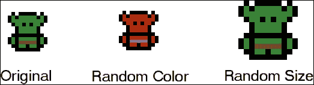

## 组合多个纹理

从简单修改现有纹理的方式升级，是将多个纹理组合在一起创建新的纹理。加入一些随机数生成器，你就可以轻松地创建大量的精灵。在本章中，我们将使用这种技术为我们的敌人随机生成盔甲！

我们将从一个基本的敌人精灵开始，随机选择一些盔甲，并将其绘制在原始图像上，以创建一个随机精灵！稍后再详细介绍，但现在先看看它会是什么样子：

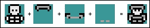

## 从头开始创建纹理

创建程序纹理的最复杂方式是使用算法从头开始创建它们。诸如 Perlin 噪声之类的算法可以用来创建自然外观的纹理基础，然后可以使用诸如图像乘法之类的技术来创建各种程序纹理。

例如，可以将基本的 Perlin 噪声纹理、白噪声纹理和纯色结合起来创建程序纹理，如下所示：

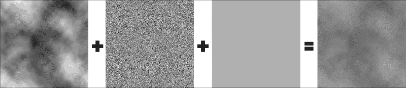

采用这种方法，对生成第一和第二个纹理的算法进行更改将导致不同的最终纹理。这种技术可以用来为游戏创建无尽的独特纹理，而不会产生存储问题。

### 提示

这种类型的程序图像创建超出了本书的范围。如果你希望进一步深入了解，请阅读有关纹理合成和 Perlin 噪声等算法的资料。

## 创建复杂的动画

计算能力的增长也催生了程序动画。传统上，动画游戏资源，如角色，会由动画师在 3D 动画软件中制作动画。然后，游戏引擎在运行时加载这个动画例程，并应用于给定的模型以使其移动。

由于计算机现在能够进行比以往更多的计算，程序动画变得越来越受欢迎。现在很多游戏中都使用布娃娃身体，这是程序动画的一个很好的例子。与播放一组固定的动画例程不同，身体的信息，如重量、速度和刚度，被用来计算身体应该处于的位置，以创建逼真和动态的运动。

# 程序生成艺术的好处

游戏艺术的程序生成为我们开发人员和玩家带来了一系列好处。从其多功能性，到成本效益和节省时间，让我们来看看其中的一些好处。

## 多功能性

程序生成游戏艺术的主要好处是多功能性。游戏艺术的制作成本很高，因此对于给定项目来说，会有一定的限制。虽然让艺术家为我们的游戏创建成千上万种纹理会很好，但这是不可行的。相反，我们可以创建一些资源，利用程序技术将这些资源转化为成千上万种可能的纹理，并为游戏带来多样性和丰富性。

## 廉价生产

在前面的观点上进行扩展，由于我们不必支付艺术家手工创建所有这些纹理，程序生成为我们节省了时间和金钱。在本章中，我们将要处理的示例是为我们的敌人提供随机护甲。将有三种类型的护甲，每种有三个等级，敌人所拥有的护甲的组合也将是随机的。可能的组合数量是巨大的，让艺术家手工创建它们将是昂贵的。

## 它需要很少的存储空间

继续以给予敌人护甲的例子，即使我们可以让艺术家手工制作所有的精灵，它们将如何被存储？虽然对于在线游戏来说这不是太大的问题，因为游戏和下载大小通常没有限制，但是那些需要传统媒体（如光盘）发行的游戏必须明智地利用空间。在这方面，纹理是一种昂贵的资源。因此，创建一些资源并通过程序从中创建纹理可以缓解这些问题。

# 程序生成艺术的缺点

好处与坏处并存，程序生成的艺术也不例外。虽然它灵活并节省空间，但它也有一些缺点。

## 缺乏控制

第一个缺点是应用程序不可知的，这是程序生成的一个整体缺点；它带来的失控。如果你通过程序生成艺术，你会失去一个熟练艺术家所能赋予的触感。内容可能缺乏特色，由于是确定性过程的结果，而不是创造性的过程，可能会感觉非常僵硬。一个好的程序算法可以在一定程度上缓解这个问题，但很难生成感觉和看起来像一个有才华的艺术家所创作的自然内容。

## 可重复性

程序生成艺术的另一个潜在问题是，事物可能会显得非常重复和不自然。内容将通过算法产生，输出的变化是使用术语的差异的结果。鉴于此，每个算法都有可能产生的内容范围。如果算法的操作范围太小，纹理将会重复，并且可能会感到不自然和重复使用，尽管程序生成被用来缓解这个问题！这完全取决于算法的质量和使用方式。

## 性能重

程序生成艺术通常涉及大量的读取和复制纹理，这些通常是昂贵的操作，特别是如果你使用高分辨率纹理。以敌人盔甲为例，如果我们手动创建精灵，我们只需要加载纹理，这是一个单一的操作。如果我们程序生成一个精灵，我们必须加载每个组件，编辑它们，并重新渲染它们以创建一个新的纹理。

# 使用 SFML 精灵修改器

现在我们已经确定了程序生成艺术的一些优点和缺点，开始吧！我们将首先看一下的天真方法是简单地使用`sprite`修改器，如`color`和`alpha`来改变现有的精灵。使用这种方法，我们将使用 SFML 提供的内置精灵修改器。大多数引擎和框架都会有类似的函数，如果没有，你也可以自己创建！

## SFML 中颜色的工作原理

让我们从最简单的程序生成精灵的方法开始，在运行时为它生成一个独特的颜色。在 SFML 中，颜色简单地是四个`uint8`值的集合，每个颜色通道一个，还有一个 alpha 通道：

```cpp
sf::Color::Color  (
Uint8   red,
Uint8   green,
Uint8   blue,
Uint8   alpha = 255
)
```

SFML 中的每个`sf::Sprite`都有一个`sf::Color`成员变量。这个颜色值与纹理中像素的颜色值相乘，得到最终的颜色。下图演示了这一点：


在上图中，我们可以看到最左边的原始图像。此外，我们还可以看到精灵设置了各种颜色时的结果图像。

### 提示

为了获得最佳效果，最好从单色灰色基础纹理开始，以便颜色调制到达正确的颜色。

`sf::Color`类型还有一个*alpha*值，用于确定对象的不透明度。alpha 通道越低，对象就越透明。通过这个值，你可以改变对象的不透明度，如下图所示：

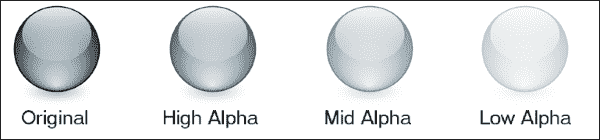

了解了 SFML 如何处理颜色，让我们通过为史莱姆角色生成一个随机精灵，并在程序中设置它的颜色和 alpha 值来将其付诸实践。

### 提示

要了解更多关于 SFML 如何处理颜色的信息，请阅读[`www.sfml-dev.org/learn.php`](http://www.sfml-dev.org/learn.php)上找到的 SFML 文档。要了解更多详细信息，请前往 SFML 使用的图形 API OpenGL 文档。

## 创建随机颜色的精灵

在 SFML 中，精灵对象有一个名为`setColor()`的成员函数。这个函数接受一个`sf::Color`对象，并将其设置为在绘制时与精灵纹理相乘的值。我们知道`sf::Color`本质上只是四个`uint8`值，每个值的范围是 0 到 255。鉴于此，要生成一个随机颜色，我们可以为这些颜色通道生成随机值，或者随机选择 SFML 预定义颜色中的一个。

史莱姆敌人是一个很好的选择，因为它在许多颜色下都会看起来很棒，而基础精灵是一种沉闷的灰色。将颜色与这个精灵相乘将起到很好的效果。当我们设置史莱姆精灵时，我们将使用这两种方法随机给它一个颜色。让我们从选择预定义颜色开始。

### 随机选择预设颜色

SFML 带有以下预定义颜色：

```cpp
sf::Color black       = sf::Color::Black;
sf::Color white       = sf::Color::White;
sf::Color red         = sf::Color::Red;
sf::Color green       = sf::Color::Green;
sf::Color blue        = sf::Color::Blue;
sf::Color yellow      = sf::Color::Yellow;
sf::Color magenta     = sf::Color::Magenta;
sf::Color cyan        = sf::Color::Cyan;
sf::Color transparent = sf::Color::Transparent;
```

这些在`Color.hpp`中定义，并涵盖了最受欢迎的颜色。首先的问题是我们需要一种随机选择的方法。为此，我们可以创建一个匹配颜色值的枚举器，生成一个随机索引，然后使用它来将枚举器值与匹配的预定义颜色相匹配。当我们看代码时，这将变得更清晰。

我们将首先在`Util.h`文件中添加以下枚举器定义：

```cpp
// Colors provided by SFML.
enum class COLOR {
  BLACK,
  WHITE,
  RED,
  GREEN,
  BLUE,
  YELLOW,
  MAGENTA,
  CYAN,
  TRANSPARENT,
  COUNT
};
```

对于每个预定义颜色，我们已经为`enum`添加了相应的值，确保它以`COUNT`结尾。有了这个定义，我们只需要计算 0 到`COLOR::COUNT`之间的数字，然后在`switch`语句中使用它。这是我们现在已经使用了几次的方法，所以我们应该对它很熟悉。

跳转到史莱姆敌人的构造函数，我们将从生成一个随机索引开始：

```cpp
int colorIndex = std::rand() % static_cast<int>(COLOR::COUNT);
```

现在，我们只需要切换`colorIndex`值并设置相应的颜色：

```cpp
switch (colorIndex)
{
case static_cast<int>(COLOR::BLACK):
  m_sprite.setColor(sf::Color::Black);
  break;

case static_cast<int>(COLOR::BLUE):
  m_sprite.setColor(sf::Color::Blue);
  break;
```

这应该对我们定义的每个枚举值进行继续。现在，你会看到每个生成到游戏中的史莱姆敌人都有不同的预定义颜色：

随机选择预设颜色

### 随机生成颜色

第二个选项，给了我们更多的控制权，就是随机生成我们自己的颜色。这种方法给了我们更广泛的可能性范围，同时也让我们可以访问 alpha 通道；然而，我们失去了一些控制。当从预定义颜色中选择时，我们知道我们最终会得到一种令人愉悦的颜色，这是我们无法保证当为每个通道生成我们自己的值时。尽管如此，让我们看看我们将如何做。

我们知道`sf:color`有四个通道（r、g、b 和 a），每个值都在 0 到 255 之间。为了生成随机颜色，我们需要为 r、g 和 b 通道生成值；a 是 alpha 通道，它将允许我们改变精灵的不透明度。

首先，我们将定义变量并为 r、g 和 b 通道生成随机值，如下所示：

```cpp
int r, g, b, a;

r = std::rand() % 256;
g = std::rand() % 256;
b = std::rand() % 256;
```

对于 alpha 通道，我们希望在数字生成方面更加精确。alpha 值为 0 太低了；我们几乎看不到精灵。因此，我们将生成一个在 100 到 255 范围内的数字，如下所示：

```cpp
a = std::rand() % 156 + 100;
```

现在我们有了这些值，我们需要创建一个`sf::color`对象，将`r`、`g`、`b`和`a`值传递给`color`构造函数：

```cpp
sf::Color color(r, g, b, a);
```

最后一步是调用`sf::sprite::setColor()`，传递新的颜色。完整的代码如下，应该放在史莱姆敌人的构造函数中：

```cpp
// Choose the random sprite color and set it.
int r, g, b, a;

r = std::rand() % 256;
g = std::rand() % 256;
b = std::rand() % 256;
a = std::rand() % 156 + 100;
sf::Color color(r, g, b, 255);

m_sprite.setColor(color);
```

现在，如果我们运行游戏，我们应该会得到三个非常不同颜色的史莱姆，每个都有不同程度的不透明度，如下截图所示：

随机生成颜色

## 生成随机颜色

我们将要玩耍的最后一个精灵修改器是缩放。使用`sf::Sprite::setScale()`函数，我们可以设置精灵的水平和垂直缩放。默认缩放为 1，所以如果我们使用值为 2 进行缩放，精灵将变大一倍。同样，如果我们设置为 0.5 的缩放，它将变小一半。鉴于此，我们需要生成接近 1 的浮点数。0.5 到 1.5 的范围应该给我们足够的大小差异！

所以，我们需要生成一个浮点数，但`std::rand()`函数只会生成一个整数值。别担心！我们可以使用一个简单的技巧来得到一个浮点数！我们只需要生成一个 5 到 15 之间的数字，然后除以 10 得到浮点值：

```cpp
float scale;
scale = (std::rand() % 11 + 5) / 10.f;
```

现在随机比例值已经生成，我们现在只需要调用`sf::sprite::setScale()`函数，并使用`scale`变量作为缩放值。完整的代码如下：

```cpp
// Generate a random scale between 0.5 and 1.5 and set it.
float scale;
scale = (std::rand() % 11 + 5) / 10.f;

m_sprite.setScale(sf::Vector2f(scale, scale));
```

运行游戏后，你会看到史莱姆敌人有不同的颜色，它们的大小也不同：

生成随机大小的精灵

# 保存修改后的精灵

在我们的游戏中，每次运行游戏时，我们都将生成新的精灵。我们希望每次运行都是独一无二的，所以一旦我们生成了一个精灵并使用它，我们就可以让它离开。然而有时，你可能想保留一个精灵。例如，你可能想创建一个随机的 NPC 并在整个游戏中保持相同的角色。

到目前为止，我们用来创建图像的两种数据类型是`sf::Sprite`和`sf::Texture`。这些类让我们通过一组预定义的成员函数与图像交互。它非常适用于标准绘图和简单的图像操作，但我们无法访问原始图像信息。这就是`sf::Image`发挥作用的地方！

## 将纹理传递到图像

`Sf::Image`是一个用于加载、操作和保存图像的类。与其他数据类型不同，`sf::Image`为我们提供了原始图像数据，允许我们与图像中的每个像素交互。我们稍后将使用更多这方面的功能，但现在，我们对`sf::Image::saveToFile`函数感兴趣。

通过这个函数，我们可以将图像保存到文件；我们只需要将纹理放入图像中。幸运的是，有一个函数可以做到这一点！`sf::Texture`类有一个名为`copyToImage`的函数，它将纹理中的原始图像数据复制到图像中。所以，我们应该能够将纹理复制到图像并保存它，对吗？好吧，让我们试试看。

在`Slime::Slime`中，在我们修改了精灵之后，让我们添加以下调试代码：

```cpp
// Save the sprite to file.
sf::Image img = m_sprite.getTexture()->copyToImage();
img.saveToFile("../resources/test.png");
```

如果你看一下我们创建的文件并将其与原始图像进行比较，你会发现有些奇怪的地方：

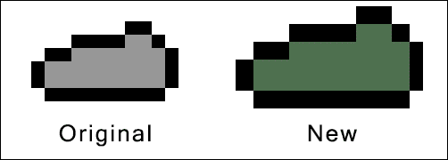

我们对精灵所做的修改不会编辑纹理。相反，每次绘制对象时都会进行修改。当我们像这样输出纹理时，我们只是输出了放入的相同精灵！为了保存通过精灵修改所做的更改，我们还需要利用`sf::RenderTexture`类。

## 绘制到 RenderTexture 类

由于精灵修改不会应用到纹理上，我们需要以某种方式捕捉一旦渲染完成的精灵。再次，SFML 通过其`sf::RenderTexture`类来解决这个问题。这个类允许我们渲染到纹理而不是屏幕，解决了修改不会应用到纹理上的问题。

首先，我们需要创建一个`sf::RenderTexture`对象。为此，我们需要知道我们将要绘制的区域的大小，并且在这里有一些需要记住的事情。我们正在改变对象的大小。因此，如果我们只是获取纹理的大小，它要么太大要么太小。相反，我们需要获取纹理的大小并将其乘以我们应用于精灵的相同比例值。

让我们写一些代码来使事情更清晰。我们将首先创建`sf::RenderTarget`对象，如下所示：

```cpp
// Create a RenderTarget.
sf::RenderTexture texture;

int textureWidth(m_sprite.getTexture()->getSize().x);
int textureHeight(m_sprite.getTexture()->getSize().y);
texture.create(textureWidth * scale, textureHeight * scale);
```

正如你所看到的，我们将获取纹理的大小并将其乘以我们修改精灵的相同比例。

最后，我们将对象绘制到渲染视图中，如下所示：

```cpp
// Draw the sprite to our RenderTexture.
texture.draw(m_sprite);
```

## 保存图像到文件

从这一点开始，代码与我们的第一次尝试相同，但有一点修改。因为精灵是动画的，我们改变了它的原点和`textureRect`属性，以将其切割成子部分以便动画角色。为了看到整个纹理，这需要恢复。此外，当我们调用`sf::Texture::copyToImage`时，精灵会垂直翻转。在保存文件之前，我们需要将其翻转回来。

以下是用于保存修改后 slime 纹理的完整代码示例：

```cpp
// Create a RenderTarget.
sf::RenderTexture texture;

int textureWidth(m_sprite.getTexture()->getSize().x);
int textureHeight(m_sprite.getTexture()->getSize().y);
texture.create(textureWidth * scale, textureHeight * scale);

// Revert changes the animation made.
m_sprite.setOrigin(sf::Vector2f(0.f, 0.f));
m_sprite.setTextureRect(sf::IntRect(0, 0, textureWidth, textureHeight));

// Draw the sprite to our RenderTexture.
texture.draw(m_sprite);

// Copy the texture to an image and flip it.
sf::Image img = texture.getTexture().copyToImage();
img.flipVertically();

// Save the sprite to file.
img.saveToFile("../resources/test.png");
```

### 提示

完成后不要忘记删除这段代码，因为保存文件很昂贵，而且会搞乱动画！

现在，如果你运行游戏并查看文件，你会看到我们所做的修改。

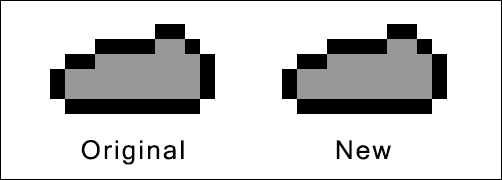

# 以程序方式创建敌人精灵

拥有渲染到`sf::RenderTexture`并存储结果的能力打开了无限的可能性。其中之一是组合多个精灵以创建新的、更多功能的精灵。我们可以多次绘制到`sf::RenderTexture`类，并且精灵将重叠。这是一种非常有用的技术，可以用来生成大量的精灵变化，而无需进行大量工作。这在以下截图中显示：


使用这种方法，我们将为我们的敌人创建随机盔甲。我们将有三件盔甲；头部、躯干和腿部。对于每个部分，我们还将有三种变化；青铜、银和金。这本身就给我们提供了大量可能的组合。然后，让我们考虑到我们需要这个对于每个角色，我们有两个，每个角色有八个精灵。这是一个巨大的纹理数量。完全不可能手动创建所有这些。

## 将精灵分解为组件

我们将创建的盔甲精灵将直接放在默认的敌人动画上。在这里需要考虑的最重要的事情是，当它们在彼此上方绘制时，它们的大小和位置将对齐。

当创建一个`sf::RenderTexture`类时，我们定义一个大小。然后绘制到它的一切将相对于这个区域的左上角定位。如果我们的精灵大小不同，当我们开始绘制时，它们将不对齐。以下示例已经将它们的背景变暗，以便我们可以看到这一点。在第一个示例中，精灵已经被裁剪，我们可以看到这使它们在彼此上方叠放时不对齐：

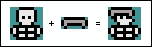

在第二个示例中，精灵的大小相同，并且都相对于它们将被绘制在其上的精灵定位。因此，它们将很好地对齐：

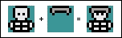

我们将为每个敌人创建盔甲，因此对于每个敌人动画，我们需要创建一个匹配的盔甲精灵。这已经完成了以节省时间，您会注意到这些精灵只有灰色版本。为了节省更多时间，我们将使用精灵修改器来改变颜色。

这是骷髅行走精灵条上的盔甲叠加精灵的示例：

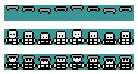

## 绘制设置

在我们编写任何关于生成盔甲的代码之前，我们需要改变`Humanoid`类处理其纹理的方式。由于我们将创建的纹理对于类的每个实例都是独一无二的，并且只会被使用一次，所以没有必要将**Texture**管理器填满它们。相反，我们将创建自己的纹理数组，并覆盖默认的绘制行为以使用新的纹理！

我们将从在`Humanoid.h`中定义纹理数组开始，如下所示：

```cpp
  /**
   * An array of modified textures.
   */
  sf::Texture m_textures[static_cast<int>(ANIMATION_STATE::COUNT)];
```

现在，在`Humanoid`构造函数中，我们需要用默认的敌人纹理填充这个数组。这是因为我们将覆盖默认的绘制行为以使用修改后的精灵数组覆盖默认的精灵。只有在生成盔甲时才会创建修改后的精灵。因此，我们需要确保我们有默认的精灵作为后备。我们将用默认精灵填充数组，然后如果我们生成盔甲，就覆盖它们。

将以下代码添加到`Humanoid::Humanoid`中。然后，我们的准备工作就完成了，我们可以开始了：

```cpp
// Copy textures.
for (int i = 0; i < static_cast<int>(ANIMATION_STATE::COUNT); ++i)
{
  m_textures[i] = TextureManager::GetTexture(m_textureIDs[i]);
}
```

## 随机选择精灵组件

我们的敌人可以拥有三种可能的盔甲部件；头部、躯干和腿部，我们希望我们的敌人拥有这些类型的混合。因此，让我们给每个敌人一次生成这些部件的机会。这意味着拥有更多装备的敌人生成的可能性更小，这正是我们想要的；一个全副武装的骷髅应该是一个罕见的生成！

### 提示

不要忘记游戏机制的平衡。在创建程序化系统时，很容易专注于技术，而忽视平衡。设计系统时一定要牢记这一点。您可以访问[`www.paranoidproductions.com/`](http://www.paranoidproductions.com/)，这里包含了很多关于这个主题的信息。

让我们开始创建一个函数，将所有这些行为放进去。护甲是设计用来覆盖哥布林和骷髅精灵的。因此，我们可以将它放在`Humanoid`类中，并为两种变体生成护甲！

让我们声明`Humanoid::GenerateArmor`函数，如下所示：

```cpp
private:
 /**
  * Generates random armor for the humanoid.
  */
void GenerateArmor();
```

我们需要做的第一件事是创建我们将要绘制的`sf::RenderTexture`对象。我们将为每个精灵使用两个纹理：一个用于护甲，一个用于最终图像。我们将首先绘制护甲，然后将其绘制在默认敌人精灵上，以创建最终纹理。

让我们给新函数一个主体并设置对象：

```cpp
// Randomly generates armor.
void Humanoid::GenerateArmor()
{
    // Create arrays of textures.
    const int textureCount = static_cast<int>(ANIMATION_STATE::COUNT);
    sf::RenderTexture armorTextures[textureCount];
    sf::RenderTexture finalTextures[textureCount];
    sf::Image renderImage;
    // Setup all render textures.
    for (int i = 0; i < static_cast<int>(ANIMATION_STATE::COUNT); ++i)
    {
        sf::Vector2u textureSize = m_textures[i].getSize();
        armorTextures[i].create(textureSize.x, textureSize.y);
        finalTextures[i].create(textureSize.x, textureSize.y);
    }
```

现在我们可以添加代码来选择敌人将拥有哪些护甲。我们说过每个物品都有 20%的生成几率。因此，我们需要生成一个从 0 到 4（包括 4）的数字。这样一来，结果为 0 的概率就是 20%。因此，我们可以使用这个来确定是否应该生成该护甲物品：

```cpp
// Create variables to determine what armor be created.
int hasHelmet(0), hasTorso(0), hasLegs(0);

hasHelmet = std::rand() % 5;
hasTorso = std::rand() % 5;
hasLegs = std::rand() % 5;

// Spawn helmet.
if (hasHelmet == 0)
{
}

// spawn torso.
if (hasTorso == 0)
{
}

// spawn legs.
if (hasLegs == 0)
{
}
```

现在我们已经随机选择了敌人将拥有的护甲物品（如果有的话），我们可以将注意力转向通过编辑精灵来创建不同的护甲等级。这需要大量的代码来实现。因此，从这一点开始，我们将只关注头盔选项。

## 加载默认护甲纹理

首先，我们需要加载默认的护甲纹理。每个敌人有八种可能的动画状态，这意味着我们需要加载所有八种头盔对应的纹理。我们将以与在构造函数中加载默认精灵类似的方式来做，创建一个纹理数组，并使用动画状态的枚举作为索引，如下所示：

```cpp
// Spawn helmet.
if (hasHelmet == 0)
{
  // Load the default helmet textures.
  int defaultHelmetTextureIDs[static_cast<int>(ANIMATION_STATE::COUNT)];

  defaultHelmetTextureIDs[static_cast<int>(ANIMATION_STATE::WALK_UP)] = TextureManager::AddTexture("../resources/armor/helmet/spr_helmet_walk_front.png");
  defaultHelmetTextureIDs[static_cast<int>(ANIMATION_STATE::WALK_DOWN)] = TextureManager::AddTexture("../resources/armor/helmet/spr_helmet_walk_front.png");
  defaultHelmetTextureIDs[static_cast<int>(ANIMATION_STATE::WALK_RIGHT)] = TextureManager::AddTexture("../resources/armor/helmet/spr_helmet_walk_side.png");
  defaultHelmetTextureIDs[static_cast<int>(ANIMATION_STATE::WALK_LEFT)] = TextureManager::AddTexture("../resources/armor/helmet/spr_helmet_walk_side.png");
  defaultHelmetTextureIDs[static_cast<int>(ANIMATION_STATE::IDLE_UP)] = TextureManager::AddTexture("../resources/armor/helmet/spr_helmet_idle_front.png");
  defaultHelmetTextureIDs[static_cast<int>(ANIMATION_STATE::IDLE_DOWN)] = TextureManager::AddTexture("../resources/armor/helmet/spr_helmet_idle_front.png");
  defaultHelmetTextureIDs[static_cast<int>(ANIMATION_STATE::IDLE_RIGHT)] = TextureManager::AddTexture("../resources/armor/helmet/spr_helmet_idle_side.png");
  defaultHelmetTextureIDs[static_cast<int>(ANIMATION_STATE::IDLE_LEFT)] = TextureManager::AddTexture("../resources/armor/helmet/spr_helmet_idle_side.png");
```

默认精灵加载完毕后，我们现在可以选择它们属于哪种护甲等级，因此，我们需要对它们应用什么颜色进行选择。

## 选择护甲等级

每种类型将有三种护甲等级，即黄金、白银和青铜。因此，我们需要决定使用哪种等级。我们可以采取一种天真的方法，从 0 到 2 生成一个数字，但这并不理想。每个等级的生成机会都是相同的，即 33%。

让我们在选择护甲等级时更加狡猾，使白银比青铜更加稀有，黄金更加稀有。为了做到这一点，我们仍然会使用`std::rand()`函数，但我们会更加聪明地使用结果。首先，我们需要决定每种生成的可能性。假设我们希望其中 50%是青铜，35%是白银，15%是黄金。

这些百分比看起来不错，很好处理，因为它们总和为 100。为了复制它们的机会，我们需要生成一个从 1 到 100 的数字，并且我们可以用它来获得期望的百分比：

+   我们有 50%的机会生成一个介于 1 到 50 之间的数字，因为它代表了总可能范围的一半（50/100）

+   我们有 35%的机会生成一个在 51 到 85 范围内的数字，因为这个范围包括了 100 个可能值中的 35 个（35/100）

+   最后，我们有 15%的机会生成一个在 86 到 100 范围内的数字，因为这个范围包括了 100 个可能值中的 15 个（15/100）

让我们将以下代码添加到我们的函数中，继续从上一段代码加载默认纹理：

```cpp
// Generate random number to determine tier.
sf::Color tierColor;
int tierValue = std::rand() % 100 + 1;

// Select which tier armor should be created.
if (tierValue < 51)
{
    tierColor = sf::Color(110, 55, 28, 255); // Bronze.
}
else if (tierValue < 86)
{
    tierColor = sf::Color(209, 208, 201, 255); // Silver.
}
else
{
    tierColor = sf::Color(229, 192, 21, 255); // Gold.
}
```

### 注意

我们使用了`std::rand() % 100 + 1`，而不是`std::rand() % 100`。虽然它们在技术上做的是一样的事情，但第一个生成了一个从 1 到 100 的数字，而后一个生成了一个从 0 到 99 的数字。第一个使我们更容易处理。

我们创建了一个简单的`if`语句，定义了我们之前确定的每个范围。然而，当我们来到金色的`if`语句时，就没有必要了，因为我们已经定义了其他范围。因此，我们现在知道剩下的任何东西都在 86 到 100 的范围内。因此，我们可以简单地使用一个`else`语句，节省了一个评估。

在这个阶段，我们已经随机选择了一个头盔，加载了默认精灵，并选择了一个阶级。

## 渲染盔甲纹理

下一步是编辑盔甲纹理并将其覆盖在默认敌人纹理上。目前，每种盔甲类型我们只有一个灰色精灵。我们需要使用本章前面学到的精灵修改技巧来创建青铜和金色版本。我们可以将灰色保留为银色！

完成此操作所需的流程如下：

+   加载默认头盔纹理

+   使用我们之前设置的`tierColor`变量编辑颜色

+   在`armorTextures`数组中绘制修改后的盔甲纹理

我们需要对敌人的每个动画都这样做。因此，我们将`armorTextures`数组封装在一个`for`循环中，迭代`ANIMATION_STATE`枚举的每个值，如下所示：

```cpp
// Render helmet to armor texture.
for (int i = 0; i < static_cast<int>(ANIMATION_STATE::COUNT); ++i)
{
  // Load the default helmet texture and set its color.
  sf::Sprite tempSprite;
  tempSprite.setTexture(TextureManager::GetTexture(defaultHelmetTextureIDs[i]));
  tempSprite.setColor(tierColor);

  // Flip the texture vertically.
  sf::Vector2u size = armorTextures[i].getTexture().getSize();
  tempSprite.setTextureRect(sf::IntRect(0, size.y, size.x, -size.y));

  // Draw the texture.
  armorTextures[i].draw(tempSprite);
}}
```

`armorTextures`数组现在包含所有头盔精灵，并且它们的颜色已经设置为随机的阶级值。现在我们需要对躯干和腿做完全相同的事情，再次绘制相同的`armorTextures`数组，以便我们可以构建盔甲纹理。这留作本章末尾的练习。现在，让我们看看如何将这些组合在一起创建最终纹理。

## 渲染最终纹理

现在盔甲纹理已经创建，我们需要将它们渲染在默认敌人纹理的上方，以创建最终图像。我们在构造函数中创建了所有默认纹理的副本，所以我们只需要在上面绘制我们新创建的盔甲纹理，然后保存为最终纹理。需要记住的一件事是`sf::Texture::copyToImage`函数会垂直翻转图像。因此，在保存最终版本之前，我们需要将其翻转回来。

让我们添加这最后一部分代码。这段代码需要放在所有盔甲已生成的后面，因此将是`Humanoid::GenerateArmor`函数中的最后一块代码：

```cpp
// Create the final render texture.
for (int i = 0; i < static_cast<int>(ANIMATION_STATE::COUNT); ++i)
{
    sf::Sprite baseSprite, armorSprite;

    // Draw the default texture.
    baseSprite.setTexture(m_textures[i]);
    finalTextures[i].draw(baseSprite);

    // Draw armor on top.
    armorSprite.setTexture(armorTextures[i].getTexture());
    finalTextures[i].draw(armorSprite);

    // Flip the texture vertically.
    sf::Image img = finalTextures[i].getTexture().copyToImage();
    img.flipVertically();

    // Store the resulting texture.
    m_textures[i].loadFromImage(img);
}
```

现在这个函数已经完成，剩下的就是在我们的构造函数末尾调用它：

```cpp
    . . .
    // Copy textures.
    for (int i = 0; i < static_cast<int>(ANIMATION_STATE::COUNT); ++i)
    {
        m_textures[i] = TextureManager::GetTexture(m_textureIDs[i]);
    }

    // Generate armor.
    GenerateArmor();
}
```

## 覆盖默认绘制行为

我们对象的动画代码位于基类`Object`中。当纹理需要更新时，它会去`m_textureIDs`变量中获取正确的纹理，从`TextureManager`类中。由于我们已经创建了自己的纹理并将它们存储在新的`m_textures`数组中，我们需要覆盖这个默认行为以提供我们自己的纹理。

首先，我们需要通过在`Humanoid.h`中添加以下声明来覆盖更新函数：

```cpp
/**
* Overrides the update event of enemy.
* @param timeDelta The time that has elapsed since the last update.
*/
void Update(float timeDelta) override;
```

我们仍然需要调用父类的实现，因为那里是动画逻辑所在。但是，一旦完成了这一点，我们需要在绘制之前提供我们自己的纹理。幸运的是，这很容易做到：

```cpp
// Overrides the update event of enemy.
void Humanoid::Update(float timeDelta)
{
    // Call parent functionality.
    Enemy::Update(timeDelta);

    // Update the texture with our custom textures.
    m_sprite.setTexture(m_textures[m_currentTextureIndex]);
}
```

## 调试和测试

在运行游戏之前，让我们添加一些调试代码来看看我们的工作。之前，我们介绍了如何将纹理保存为图像文件。所以，让我们在这里使用它来保存我们将创建的所有程序精灵。

让我们使用以下代码更新创建最终纹理的循环：

```cpp
// Save the texture to disk.
if ((hasHelmet == 0) || (hasTorso == 0) || (hasLegs == 0))
{
  std::stringstream stream;
  stream << "../resources/test_" << i << ".png";
  img.saveToFile(stream.str());
}
```

这段代码所做的一切就是在生成一件盔甲时将纹理保存到资源文件夹中。如果你运行游戏几次，记住每个骷髅只有 20%的几率调用这段代码，并前往`resources`文件夹，你会看到以下精灵：

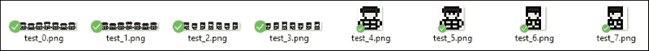

这些就是程序生成的精灵！在我的例子中，它是一个骷髅，带有一个我们不必绘制的随机层级的随机一部分盔甲。我们绘制了组成部分，进行了一些程序编辑，并以编程方式将它们组合在一起！

好了，经过这一切，是时候测试代码了。如果一切顺利，当你运行游戏时，你应该会看到一些带头盔的骷髅和哥布林！请记住，每个敌人只有 20%的几率戴着头盔。如果你运气不好，可能需要运行几次游戏才能看到它：

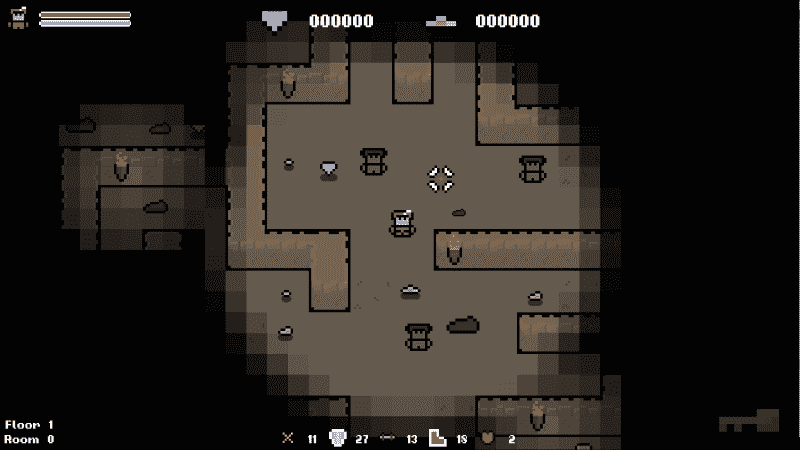

在继续之前，您可以删除我们刚刚添加的用于保存精灵的调试代码。这纯粹是为了调试目的。本章末尾的练习之一是完成代码，并为躯干和腿部盔甲选项添加相同的行为，但请随意进一步进行。实验！

# 编辑游戏瓦片

我们将要看的最终系统将为本书后面要介绍的内容奠定基础。我们将创建一个系统，使地牢的每一层都成为一个独特的环境，实现我们对游戏瓦片的精灵修改的了解。

游戏的目标是尽可能通过尽可能多的楼层，获得尽可能高的分数。在第九章中，*程序生成地牢*，我们将看看如何程序生成地牢，并且在每五层之后，我们将改变主题。让我们创建一个函数，以后在书中使用它来完成这个目标。

解决这个问题的最佳方法是向`Level`对象添加一个函数，设置所有瓦片精灵的颜色。这将是一个公共函数，因为我们将从主游戏类中调用它。

让我们从在`Level`头文件中定义`sf::color`函数开始，如下所示：

```cpp
public:
  /**
   * Sets the overlay color of the level tiles.
   * @param tileColor The new tile overlay color
   */
  void SetColor(sf::Color tileColor);
```

这个函数的定义非常简单。它只是迭代网格中的所有精灵，将它们的颜色设置为传递的参数：

```cpp
// Sets the overlay color of the level tiles.
void Level::SetColor(sf::Color tileColor)
{
  for (int i = 0; i < GRID_WIDTH; ++i)
  {
    for (int j = 0; j < GRID_HEIGHT; ++j)
    {
      m_grid[i][j].sprite.setColor(tileColor);
    }
  }
}
```

有了这个，我们实际上已经完成了。就是这样！我们将在本章后面使用这个函数，但让我们在这里测试一下。我们在`Game.cpp`中初始化`Level`对象，所以一旦我们加载了纹理，我们就可以调用`Level::SetColor`函数，并设置关卡的主题。

让我们用以下测试代码更新`Game::Initialize`函数：

```cpp
// Set the color of the tiles
m_level.SetColor(sf::Color::Magenta);
```

有了这个，我们可以看到一旦我们正确实现了功能，关卡会是什么样子。让我们运行游戏，看看会发生什么：

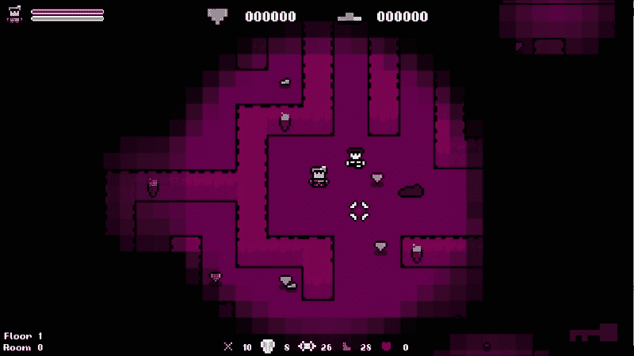

`Level`瓦片现在都有一个应用于构成环境的所有精灵的环境颜色，这样我们就可以为我们的关卡创建独特的外观和感觉。就像我之前提到的，我们将在以后以编程方式生成随机关卡时使用这个系统。现在，我们可以删除调试代码，坐等系统准备好使用！

# 练习

为了帮助你测试本章内容的知识，这里有一些练习，你应该通过它们进行练习。它们对于本书的其余部分并不是必要的，但通过它们的练习，可以帮助你评估自己在所涵盖材料中的优势和劣势：

1.  给哥布林敌人一个稍微随机的颜色和比例，每次生成一个。

1.  通过完成躯干和腿部盔甲的条件，完成为人形生物程序生成盔甲的代码。

1.  尝试以更简洁的方式生成盔甲。我们使用了两种纹理；也许有一种方法只使用一种。看看你能否改进这个函数。

# 总结

在本章中，我们学习了如何程序生成游戏艺术。我们采取了一个天真的方法开始，简单地使用内置的精灵修改器和随机数生成器，然后算法地生成我们自己的图像。生成程序艺术是一个广阔的主题，你可以写一本关于这个主题的书。希望这一章对你介绍了这个主题。

在下一章中，我们将看一下艺术的表兄弟音频。现在我们的艺术是通过程序生成的，我们将使用类似的技术来创造声音的变化。我们还将使用 SFML 的音频功能来创建专门的 3D 声音，从而为关卡带来更多的深度。
