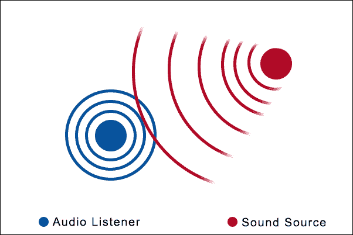
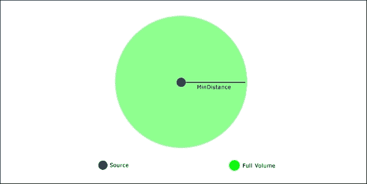
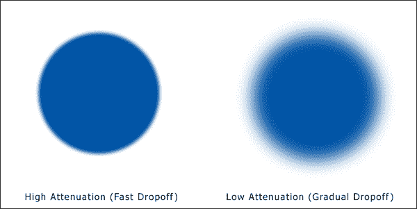

# 第七章：程序修改音频

现在我们的游戏艺术已经接受了程序处理，让我们把注意力转向它的邻居，声音。优秀的声音对于一个好游戏至关重要。想想超级马里奥跳跃的声音有多具有标志性，或者吃豆人中吃豆鬼的声音！出色的配乐和游戏音效帮助玩家沉浸在我们作为游戏开发者创造的世界中。这是一个需要正确完成的领域，这里需要足够的多样性，以便你的玩家不会厌倦一遍又一遍地听到相同的音效。

我们可以手动创建大量的声音效果变体，但这不是程序化的方式！相反，我们将在运行时随机修改声音，以便每次播放时都创建略有不同的声音。然后，我们将利用 SFML 的音频功能创建空间化的 3D 声音，从而为游戏增添更多的深度和沉浸感。

从头开始程序生成音频是一个非常复杂的任务。我们在这个领域的工作将会相对简短，真正局限于对现有声音进行程序化修改，而不是完全创作它们。不过，这将作为一个向音频采用程序化方法的良好介绍。

在本章中，我们将涵盖以下主题：

+   SFML 音频

+   `sf::sound` 和 `sf::music` 之间的区别

+   修改现有的音效

+   创建空间化的 3D 声音

# SFML 音频简介

SFML 有自己专门的音频模块，提供了许多有用的函数，我们可以用来修改声音。SFML 中有两种主要的声音类型：`sf::Sound` 和 `sf::Music`。我们将很快详细介绍这两种类型之间的区别。它还提供了许多函数来编辑声音的属性，如音调和音量。我们将使用这些函数给我们的声音效果增加一些变化。

## sf::Sound 与 sf::Music

在开始处理音频之前，我们需要看一下 `sf::Sound` 和 `sf::Music` 之间的区别：

+   `Sf::Sound` 适用于像拾取物品或脚步声这样的短声音剪辑。声音会完整地加载到内存中，并且准备好播放，没有延迟。

+   `Sf::Music` 用于更长、更大的声音文件，并不会加载到内存中；它在使用时会被流式传输。

这可能看起来是一个细微的差别，但使用正确的类型非常重要。例如，如果我们将游戏的音乐加载到一个 `sf::Sound` 对象中，游戏会使用大量内存！

## sf::SoundBuffer

在 SFML 中创建精灵时，我们创建一个包含比例和位置等信息的 `sf::Sprite` 对象。纹理本身存储在一个 `sf::Texture` 对象中，精灵对象持有对它的引用。`sf::Sound` 类的工作方式与此类似，一个 `sf::SoundBuffer` 对象持有实际的声音，而 `sf::Sound` 只是持有对它的引用。

以下代码显示了如何加载声音：

```cpp
sf::SoundBuffer buffer;
buffer.loadFromFile("sound.wav");

sf::Sound sound;
sound.setBuffer(buffer);
sound.play();
```

`sf::SoundBuffer` 对象必须保持活跃的时间与 `sf::Sound` 对象一样长。如果 `sf::SoundBuffer` 在持有对它引用的 `sf::Sound` 对象之前就超出了作用域，我们将会收到一个错误，因为它会尝试播放一个不再存在的声音。

另外，由于我们只持有对声音缓冲区的引用，它可以在多个声音对象中使用。要播放声音，我们只需调用 `sf::Sound::play`，这将在单独的线程中运行声音。

# 选择一个随机的主音轨

目前，游戏没有声音或音乐。在整本书的过程中，我们一直在频繁地运行游戏，一遍又一遍地听着相同的音轨会变得非常乏味。因此，我们一直等到现在才把它放进去。添加声音是一个非常简单的过程。因此，我们将完整地介绍这个过程。

首先，我们将添加一个主音乐轨，作为游戏的基础。但是，我们不会固定一条音轨，而是添加多种可能性，并在启动时随机选择一种。

让我们首先以通常的方式在枚举器中定义所有可能性。将以下代码添加到`Util.h`中：

```cpp
// Music tracks.
enum class MUSIC_TRACK {
    ALT_1,
    ALT_2,
    ALT_3,
    ALT_4,
    COUNT
};
```

根据`enum`显示，我们将有四个可能的音轨。这些已经包含在`/resources/music/`文件夹中。因此，我们所要做的就是随机选择一条音轨并在游戏开始时加载它。由于我们希望这首音乐立即开始，我们将在`Game`类的构造函数中插入实现这一点的代码。

我们现在已经几次从枚举器中选择了一个随机值，所以应该很熟悉了。我们将生成一个 1 到`MUSIC_TRACK_COUNT`（包括）之间的数字，但是，与其像通常那样将其转换为枚举器类型，我们将把它留在整数形式。这背后的原因很快就会显而易见。

现在，让我们将以下代码添加到`Game::Game`中：

```cpp
// Setup the main game music.
int trackIndex = std::rand() % static_cast<int>(MUSIC_TRACK::COUNT) + 1;
```

现在，我们之所以没有转换为`enum`类型，是因为在加载声音时我们可以很聪明。我们有四个音乐曲目可供选择，它们的名称如下：

+   `msc_main_track_1.wav`

+   `msc_main_track_2.wav`

+   `msc_main_track_3.wav`

+   `msc_main_track_4.wav`

请注意，它们名称中唯一不同的是它们的编号。我们已经生成了 1 到 4 之间的一个数字。因此，我们可以简单地使用这个索引来加载正确的音轨，而不是创建一个`switch`语句，如下所示：

```cpp
// Load the music track.
m_music.openFromFile("../resources/music/msc_main_track_" + std::to_string(trackIndex) + ".wav");
```

现在，当我们调用`m_music.play()`时，声音将被流式传输。最后，通过调用这个函数来完成：

```cpp
m_music.play();
```

如果我们现在运行游戏，我们将听到四个随机选择的音轨中的一个正在播放！

# 添加音效

现在，我们已经有了游戏的主要音乐，让我们把一些音效加入其中！我们已经介绍了`sf::Sound,sf::SoundBuffer`以及如何播放声音，所以我们已经准备好开始了。

我们的游戏中将会有一些音效。一个用于敌人的死亡，一个用于我们被击中，一个用于每个拾取，以及一个用于我们稍后将要播放的火炬的声音。

我们将首先在`Game.h`中为每个声音定义`sf::Sound`变量：

```cpp
/**
 * Torch sound.
 */
sf::Sound m_fireSound;

/**
 * Gem pickup sound.
 */
sf::Sound m_gemPickupSound;

/**
 * Coin pickup sound.
 */
sf::Sound m_coinPickupSound;

/**
* Key collect sound.
*/
sf::Sound m_keyPickupSound;

/**
 * Enemy die sound.
 */
sf::Sound m_enemyDieSound;

/**
 * Player hit sound.
 */
sf::Sound m_playerHitSound;
```

现在，让我们在`Game::Initialize`中初始化这些声音，如下所示：

```cpp
// Load all game sounds.
int soundBufferId;

// Load torch sound.
soundBufferId = SoundBufferManager::AddSoundBuffer("../resources/sounds/snd_fire.wav");
m_fireSound.setBuffer(SoundBufferManager::GetSoundBuffer(soundBufferId));
m_fireSound.setLoop(true);
m_fireSound.play();

// Load enemy die sound.
soundBufferId = SoundBufferManager::AddSoundBuffer("../resources/sounds/snd_enemy_dead.wav");
m_enemyDieSound.setBuffer(SoundBufferManager::GetSoundBuffer(soundBufferId));

// Load gem pickup sound.
soundBufferId = SoundBufferManager::AddSoundBuffer("../resources/sounds/snd_gem_pickup.wav");
m_gemPickupSound.setBuffer(SoundBufferManager::GetSoundBuffer(soundBufferId));

// Load coin pickup sound.
soundBufferId = SoundBufferManager::AddSoundBuffer("../resources/sounds/snd_coin_pickup.wav");
m_coinPickupSound.setBuffer(SoundBufferManager::GetSoundBuffer(soundBufferId));

// Load key pickup sound.
soundBufferId = SoundBufferManager::AddSoundBuffer("../resources/sounds/snd_key_pickup.wav");
m_keyPickupSound.setBuffer(SoundBufferManager::GetSoundBuffer(soundBufferId));

// Load player hit sound.
soundBufferId = SoundBufferManager::AddSoundBuffer("../resources/sounds/snd_player_hit.wav");
m_playerHitSound.setBuffer(SoundBufferManager::GetSoundBuffer(soundBufferId));
```

音效初始化后，我们只需在需要时调用`sf::Sound::play`来播放声音。我们在`Game::UpdateItems`函数中处理物品拾取。因此，我们将把这段代码放在那里：

```cpp
// check what type of object it was
switch (m_items[i]->GetType())
{
    case ITEM_GOLD:    
    {
        // Get the amount of gold.
        int goldValue = dynamic_cast<Gold&>(item).GetGoldValue();

        // Add to the gold total.
        m_goldTotal += goldValue;

        // Check if we have an active level goal regarding gold.
        if (m_activeGoal)
        {
            m_goldGoal -= goldValue;
        }

        // Play gold collect sound effect
 m_coinPickupSound.play();
    }
    break;

    case ITEM_GEM:
    {
        // Get the score of the gem.
        int scoreValue = dynamic_cast<Gem&>(item).GetScoreValue();

        // Add to the score total
        m_scoreTotal += scoreValue;

        // Check if we have an active level goal.
        if (m_activeGoal)
        --m_gemGoal;

 // Play the gem pickup sound
 m_gemPickupSound.play();
    }
    break;
}
```

这段代码只涵盖了金币和宝石的拾取。对于所有其他拾取和需要播放声音的情况，比如敌人死亡和玩家受到伤害时，需要做同样的事情。

# 编辑音效

添加了音效后，我们现在可以对它们进行修改以创建多样性。SFML 提供了许多我们可以操作声音的方式，其中包括以下内容：

+   音调

+   音量

+   位置

我们将从最简单的开始：音调。然后，我们将通过创建空间化声音来涵盖音量和位置。每次播放声音效果时，这些值将被随机设置。在我们深入研究之前，让我们创建一个函数来封装声音的修改和播放。这将使我们免于在整个类中重复代码。

# 播放声音函数

与敌人和物品的碰撞在主游戏类中进行处理。因此，我们将在这里放置播放音效的函数。将以下函数声明添加到`Game.h`中：

```cpp
/**
 * Plays the given sound effect, with randomized parameters./
 */
void PlaySound(sf::Sound& sound, sf::Vector2f position = { 0.f, 0.f });
```

这个函数接受两个参数：我们将要播放的声音作为引用传递，以避免昂贵的复制，我们还包括一个参数，用于指定我们想要播放声音的位置。请注意，我们给位置参数一个默认值`{ 0.f, 0.f }`。因此，如果我们希望这样做，它可以被忽略。当我们创建空间化声音时，我们将详细介绍这个参数的作用。

让我们暂时给这个类一个基本的主体，简单地播放通过参数传递的声音：

```cpp
// Plays the given sound effect, with randomized parameters.
void Game::PlaySound(sf::Sound& sound, sf::Vector2f position)
{
    // Play the sound.
    sound.play();
}
```

请注意，如果游戏规模更大，我们有许多声音，将值得将播放声音的行为封装在管理它们的同一类中。这将确保所有与声音的交互都通过一个公共类进行，并保持我们的代码有组织性。

## 音频听众

SFML 带有一个静态听众类。这个类充当了关卡中的耳朵，因此在一个场景中只有一个听众。由于这是一个静态类，我们从不实例化它，并且通过它的静态函数与它交互，比如`sf::Listener::setPosition`。

我所说的“在关卡中的耳朵”，是指在这个位置听到关卡中的所有声音。这就是我们创建 3D 声音的方式。例如，如果声音的来源在听众的右侧，那么在右扬声器中会听到更多声音。看一下下面的图表：



在这个图表中，蓝色圆圈代表音频听众的位置，红色圆圈代表声音的位置。你可以看到，由于声音的来源在听众的右侧，我们可以利用这一点来确定声音应该从右扬声器中听到的比从左扬声器中听到的更多。这就是空间化声音的创建方式，我们将在本章后面详细讨论。

对于我们不希望声音被空间化的情况，SFML 给了我们`sf::Sound::setRelativeToListener`函数。这是一个不言自明的函数；声音的位置是相对于听众的位置而不是在场景中的绝对位置。我们将其设置为`true`，并给声音一个位置`{0.f, 0.f, 0.f}`，将其放在听众的正上方。

关于前面的图表，这意味着蓝色的音频听众将直接放在红色的声源的正上方，这意味着它不是空间化的。这是我们希望捡起声音的行为。对于每个声音，我们需要调用这个函数，将`true`作为参数传递。

让我们更新代码来改变这一点：

```cpp
// Load gem pickup sound.
soundBufferId = SoundBufferManager::AddSoundBuffer("../resources/sounds/snd_gem_pickup.wav");
m_gemPickupSound.setBuffer(SoundBufferManager::GetSoundBuffer(soundBufferId));
m_gemPickupSound.setRelativeToListener(true);
// Load coin pickup sound.
soundBufferId = SoundBufferManager::AddSoundBuffer("../resources/sounds/snd_coin_pickup.wav");
m_coinPickupSound.setBuffer(SoundBufferManager::GetSoundBuffer(soundBufferId));
m_coinPickupSound.setRelativeToListener(true);

// Load key pickup sound.
soundBufferId = SoundBufferManager::AddSoundBuffer("../resources/sounds/snd_key_pickup.wav");
m_keyPickupSound.setBuffer(SoundBufferManager::GetSoundBuffer(soundBufferId));
m_keyPickupSound.setRelativeToListener(true);

// Load player hit sound.
soundBufferId = SoundBufferManager::AddSoundBuffer("../resources/sounds/snd_player_hit.wav");
m_playerHitSound.setBuffer(SoundBufferManager::GetSoundBuffer(soundBufferId));
m_playerHitSound.setRelativeToListener(true); 

```

与玩家位置相同的位置产生的声音需要这个。例如，物品只有在敌人占据相同空间时才会被捡起。你永远不会从远处捡起物品，所以声音永远不会被空间化。

## 创建音调波动

音调是听到声音的感知频率。SFML 提供了一种增加或减少声音音调的方法，它通过增加/减少播放速度来实现。播放得更快，声音就会听起来更高。默认值为 1，因此生成一个小于或大于 1 的数字将给我们带来音调的波动。

我们将把这个行为添加到我们的新的`Game::PlaySound`函数中。首先，我们将生成一个介于 0.95 和 1.05 之间的数字，设置音调，并播放声音，如下所示：

```cpp
// Plays the given sound effect, with randomized parameters.
void Game::PlaySound(sf::Sound& sound, sf::Vector2f position)
{
 // Generate and set a random pitch.
 float pitch = (rand() % 11 + 95) / 100.f;
 sound.setPitch(pitch);

    // Play the sound.
    sound.play();
}
```

现在，每当我们想要一个声音有这种音调波动时，我们需要通过这个函数播放它，而不是直接播放。这适用于所有的捡起声音。所以，让我们实现这个改变：

```cpp
// check what type of object it was
switch (m_items[i]->GetType())
{
    case ITEM_GOLD:
    {
        // Get the amount of gold.
        int goldValue = dynamic_cast<Gold&>(item).GetGoldValue();

        // Add to the gold total.
        m_goldTotal += goldValue;

        // Check if we have an active level goal regarding gold.
        if (m_activeGoal)
        {
            m_goldGoal -= goldValue;
        }

 // Play gold collect sound effect
 PlaySound(m_coinPickupSound);
    }
    break;

    case ITEM_GEM:
    {
        // Get the score of the gem.
        int scoreValue = dynamic_cast<Gem&>(item).GetScoreValue();

        // Add to the score total
        m_scoreTotal += scoreValue;

        // Check if we have an active level goal.
        if (m_activeGoal)
        {
            --m_gemGoal;
        }

 // Play the gem pickup sound
 PlaySound(m_gemPickupSound);
    }
    break;
}
```

如果我们现在玩游戏并捡起一些物品，我们会听到每次捡起声音都略有不同，给声音效果带来了一些变化。如果你希望在捡起钥匙、敌人死亡和玩家受到攻击时播放的声音也有音调波动，确保它们也通过这个函数播放，而不是直接播放。

# 3D 声音-空间化

现在让我们看看如何创建一些 3D 音频来为游戏场景增加深度。当我们走过一个火炬时，我们希望听到它从我们身边经过，我们希望能够听到敌人从一个方向向我们走来。空间化允许我们做到这一点，SFML 有很好的功能来帮助我们实现这一点。

## 音频听众

我们已经定义了音频听者是什么以及它是如何用来创建空间化音频的。作为实现这一目标的第一步，我们需要在每次更新后设置听者的位置，确保关卡中的所有声音都是从玩家的视角听到的。

在每个游戏更新的开始，我们重新计算玩家的位置。在这之后，我们可以将听者类的位置更新到这个新位置。记住`sf::Listener`是一个静态类，我们不需要实例化它。我们所需要做的就是静态调用`sf::Listener::setPosition`。

让我们将这个附加到`Game::Update`函数中，如下所示：

```cpp
// Update the player.
m_player.Update(timeDelta, m_level);

// Store the player position as it's used many times.
sf::Vector2f playerPosition = m_player.GetPosition();

// Move the audio listener to the players location.
sf::Listener::setPosition(playerPosition.x, playerPosition.y, 0.f);

// If the player is attacking create a projectile.
if (m_player.IsAttacking())
{
```

继续前进，我们现在可以确保听者处于正确的位置，以便我们创建 3D 声音。

## 最小距离

最小距离是玩家在听到声音的全音量之前可以接近声源的最近距离。想象它是围绕声源的一个圆圈。这个圆圈的半径是`MinDistance`，如下图所示：



在我们的情况下，声音的最小距离在游戏过程中不会改变，这意味着我们可以在加载声音时在`Game::Initialize`函数中设置它们的值一次。我们在这里使用的值是个人偏好的问题，但我发现最小距离为`80.f`效果很好。让我们设置这些值。

对`Game::Initialize`函数进行以下修改：

```cpp
// Load torch sound.
soundBufferId = SoundBufferManager::AddSoundBuffer("../resources/sounds/snd_fire.wav");
m_fireSound.setBuffer(SoundBufferManager::GetSoundBuffer(soundBufferId));
m_fireSound.setLoop(true);
m_fireSound.setMinDistance(80.f);
m_fireSound.play();

// Load enemy die sound.
soundBufferId = SoundBufferManager::AddSoundBuffer("../resources/sounds/snd_enemy_dead.wav");
m_enemyDieSound.setBuffer(SoundBufferManager::GetSoundBuffer(soundBufferId));
m_enemyDieSound.setMinDistance(80.f); 

```

## 衰减

衰减基本上意味着“减少”或“使某物变小”。在音频的上下文中，它是声音随着我们远离声源而变得更安静的速率。当我们超出最小距离时，这就会生效，并用于计算声音的音量。

在下图中，渐变代表声音的音量。左边的图显示了高衰减，声音下降得非常快，而右边的图显示了低衰减，声音下降得更平稳：



现在，让我们给我们的两个声音一个衰减值，就像我们在最小距离上做的那样。同样，这里使用的值取决于您，但我发现一个`5.f`的衰减值，略高于默认值，可以创建一个不错的淡出效果。

对`Game::Initialize`函数进行以下修改：

```cpp
// Load torch sound.
soundBufferId = SoundBufferManager::AddSoundBuffer("../resources/sounds/snd_fire.wav");
m_fireSound.setBuffer(SoundBufferManager::GetSoundBuffer(soundBufferId));
m_fireSound.setLoop(true);
m_fireSound.setAttenuation(5.f);
m_fireSound.setMinDistance(80.f);
m_fireSound.play();

// Load enemy die sound.
soundBufferId = SoundBufferManager::AddSoundBuffer("../resources/sounds/snd_enemy_dead.wav");
m_enemyDieSound.setBuffer(SoundBufferManager::GetSoundBuffer(soundBufferId));
m_enemyDieSound.setAttenuation(5.f);
m_enemyDieSound.setMinDistance(80.f);
```

如果我们现在运行游戏，我们会看到当我们靠近火炬时，它们会变得更响亮，当我们走开时，它们会变得更安静。然而，它们并不是 3D 的。为此，我们需要更新声音的源！

## 声音的位置

声音的位置就是它在场景中的位置。正是这个位置和听者的位置被用来创建 3D 效果，并确定声音应该从哪个扬声器播放出来。

### 提示

要使用空间定位，您的声音需要是**单声道**（只有一个声道）。这个项目提供的声音是这样的，但是如果您要添加自己的声音，您需要记住这一点！具有多个声道的声音已经明确决定如何使用扬声器。

现在我们已经设置了衰减和最小距离，我们现在可以设置声音的正确位置，这样我们就可以听到 3D 效果。游戏中有两种声音将会是 3D 的：火炬的声音和敌人被杀死时的声音。由于关卡中有多个火炬，我们在这里有一些工作要做。我们将从两者中较简单的一个开始：敌人被杀死时的声音。

### 固定位置

首先，我们需要更新`Game::PlaySound`函数。目前它只生成一个随机音调，但我们需要它设置位置。您可能还记得，我们通过给位置参数一个默认值`{0.f, 0.f }`来使其成为可选参数。当我们传递一个位置并覆盖默认值时，这意味着我们想要利用 3D 声音。当我们留空时，这意味着我们不想这样做，声音将相对于听者。因此，`{0.f, 0.f, 0.f}`正是我们需要的。

让我们连接`Game::PlaySound`中的位置参数，并使用它来设置声音的位置，如下所示：

```cpp
// Plays the given sound effect, with randomized parameters.
void Game::PlaySound(sf::Sound& sound, sf::Vector2f position)
{
    // Generate and set a random pitch.
    float pitch = (rand() % 11 + 95) / 100.f;
    sound.setPitch(pitch);

 // Set the position of the sound.
 sound.setPosition(position.x, position.y, 0.f);

    // Play the sound.
    sound.play();
}
```

声音的位置在三维空间中运作，但由于我们正在处理二维声音，我们可以将*Z*值保留为`0.f`。现在，当我们确定敌人已被杀死时，我们只需调用此函数并传递正确的声音和敌人的位置，因为声音就是来自那里，如下所示：

```cpp
// 1 in 5 change of spawning potion.
else if ((std::rand() % 5) == 1)
{
    position.x += std::rand() % 31 - 15;
    position.y += std::rand() % 31 - 15;
    SpawnItem(ITEM::POTION, position);
}

// Play enemy kill sound.
PlaySound(m_enemyDieSound, enemy.GetPosition());

// Delete enemy.
enemyIterator = m_enemies.erase(enemyIterator);
```

现在是再次运行游戏并听听我们的成果的时候了。当我们杀死敌人时，我们可以听到他们离得越远，声音就越微弱。此外，如果我们向右边杀死一个敌人，我们会听到声音来自那个方向！为了完成我们的声音工作，让我们将相同的技术应用到火炬上，真正为关卡的音频增加一些深度。

### 注意

3D 声音的清晰度将取决于您的设置。例如，耳机可以让您轻松地听到不同方向的声音，而笔记本电脑扬声器可能就不那么清晰了。

### 移动位置

我们将为最后一个区域添加 3D 声音的是关卡中的火炬。当我们在关卡中走动时，能够在远处微弱地听到火炬的声音，或者当我们走过时在耳机中近距离地听到。然而，存在一个小问题。我们知道声音的空间化是在声音和听者相距一定距离时实现的。但是如果我们有一个需要来自多个位置的声音怎么办？我们可以为每个火炬设置一个声音，但这样很浪费。相反，我们将计算哪个火炬离玩家最近，并将其用作声源。

作为我们主要的更新函数的一部分，我们需要查看所有的火炬，并确定哪一个离玩家最近。当玩家在关卡中走动时，声源会切换，给我们一种每个火炬都发出自己的声音的印象，而实际上我们只有一个声源。

我们已经有一个函数来找到两个对象之间的距离，即`Game::DistanceBetweenPoints`。有了这个，我们可以遍历所有的火炬，并使用这个函数来获取到玩家的距离。让我们更新`Game::Update`函数以包括这个计算，如下所示：

```cpp
// Update all projectiles.
UpdateProjectiles(timeDelta);

// Find which torch is nearest the player.
auto torches = m_level.GetTorches();

// If there are torches.
if (!torches->empty())
{
 // Store the first torch as the current closest.
 std::shared_ptr<Torch> nearestTorch = torches->front();
 float lowestDistanceToPlayer = DistanceBetweenPoints(playerPosition, nearestTorch->GetPosition());

 for (std::shared_ptr<Torch> torch : *torches)
 {
 // Get the distance to the player.
 float distanceToPlayer = DistanceBetweenPoints(playerPosition, torch->GetPosition());
 if (distanceToPlayer < lowestDistanceToPlayer)
 {
 lowestDistanceToPlayer = distanceToPlayer;
 nearestTorch = torch;
 }
 }
}

// Check if the player has moved grid square.
Tile* playerCurrentTile = m_level.GetTile(playerPosition);
```

正如您所看到的，对于关卡中的每个火炬，我们都会计算它离玩家有多远。如果它比我们上次检查的火炬更近，我们就将其标记为最近的。当这段代码完成时，我们最终得到了存储在名为`nearestTorch`的共享指针中的最近的火炬。

确定了最近的火炬后，我们可以使用它的位置作为火焰声音的位置。现在，对于其余的声音，我们一直在使用新的`Game::PlaySound`函数，但这里不适用。我们的火焰声音已经在循环播放，我们不需要重新开始它。我们只需要设置它的位置，所以我们会直接这样做。

让我们再次更新那段代码：

```cpp
    // Get the distance to the player.
    float distanceToPlayer = DistanceBetweenPoints(playerPosition, torch->GetPosition());
    if (distanceToPlayer < lowestDistanceToPlayer)
        {
            lowestDistanceToPlayer = distanceToPlayer;
            nearestTorch = torch;
        }
    }

 m_fireSound.setPosition(nearestTorch->GetPosition().x, nearestTorch->GetPosition().y, 0.0f);
}

// Check if the player has moved grid square.
Tile* playerCurrentTile = m_level.GetTile(playerPosition);
```

让我们最后一次运行项目！现在我们应该听到一个随机的音乐曲目，一些我们的音效将以不断变化的音调播放，火炬和敌人死亡的声音将被空间化。

# 练习

为了帮助您测试对本章内容的理解，这里有一些练习供您练习。它们对本书的其余部分并不是必不可少的，但是练习它们将有助于您评估所涵盖材料的优势和劣势：

1.  将更多的曲目添加到主曲目列表中。

1.  在“关卡”中添加一个空间化的声音，当门打开时能听到。当玩家收集到“关卡”的钥匙时，能听到背景中门滑动打开的声音将帮助他们找到它。

1.  在“关卡”中添加一些大气的音效；这些音效应该是空间化的，并且必须在随机的时间间隔内播放。到目前为止我们还没有涉及到这样的内容，所以这可能是一个挑战。

# 总结

在本章中，我们使用了 SFML 内置的音频修改器来对我们的音效进行修改。我们还利用这些修改器来创建空间化的 3D 声音，为我们的游戏场景增添了更多的深度。

在下一章中，我们将运用到目前为止学到的一切来创建复杂的程序行为和机制，包括寻路和独特的关卡目标。我们将赋予我们的敌人智能，让他们穿越关卡并追逐玩家，我们还将为玩家创建一个独特的关卡目标，并为其提供独特的奖励。
