# 第八章：程序行为和机制

到目前为止，我们的工作重点一直是资源的程序生成。让我们利用所学的知识，扩展到程序生成行为和游戏机制。虽然创建*程序生成的游戏行为*听起来很新奇，但你在玩的每个游戏中都会遇到它；**人工智能**（**AI**）。游戏中的 AI 是根据当前因素在运行时计算行为。这绝对算作程序生成！以前在接触大型主题时，我曾评论过整本书都可以专门讨论这个主题。嗯，对于 AI，你需要整个图书馆。对于我们的项目，我们将研究寻路；让敌人能够在我们的关卡中智能地追逐玩家。

我们将要看的另一个方面是机制的程序生成，特别是生成独特的游戏目标。一个很好的例子是游戏任务。你有多少次遇到过一个任务说，“杀死 X 只动物，给我 Y 只毛皮？”大概有一千次吧！我们可以使用程序生成在这里增加一些变化。我们可以为我们的地牢的每个房间/楼层生成随机目标，使其不那么静态。

在这一章中，我们将涵盖以下主题：

+   A*寻路算法

+   生成独特的游戏任务

# 寻路简介

我们将首先着手解决最大的任务：实现一种寻路算法，使敌人能够在地图周围智能移动。在这样做之前，让我们先来看看寻路算法的整体情况，它们的作用以及实现方式！这个背景将帮助你更清晰地了解前面的任务，并展示我们拥有的丰富选择。

## 什么是寻路算法？

**寻路算法**是一种计算从一个位置到另一个位置的最佳路径的算法。一个好的算法会考虑地形和其他几个因素，以确保移动是智能的，不会产生任何奇怪的行为。还记得上次玩游戏时 NPC 一直走向墙壁的情况吗？这就是寻路错误产生的奇怪行为。每当敌人在游戏中绕着物体跑来找你时，这就是这种算法的结果，它们对于创造具有挑战性且自然的游戏玩法至关重要。

例如，在下图中，绿色圆圈是一个 NPC，它必须到达红色圆圈：

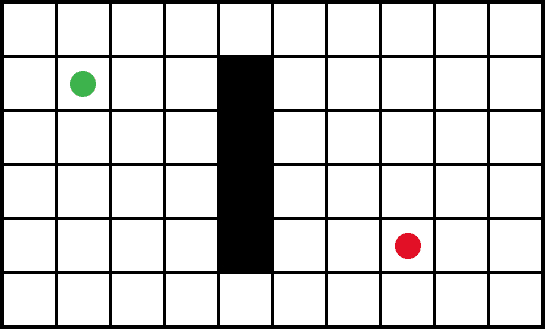

在这个例子中，NPC 不能直接朝着目标点前进，因为它会被困在墙壁里。相反，我们需要考虑墙壁并绕过它，如下图所示：

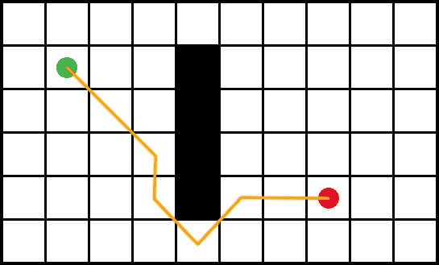

你可以看到 NPC 在这里聪明地避开了墙壁，同时尽可能高效地到达了目标。这就是寻路的本质，也是我们在本章的第一部分中要实现的内容。让我们来看看箭头后面发生了什么。

## Dijkstra 算法

和任何事物一样，寻路可以有多种实现方式，也可以使用多种常见算法来实现。不同的算法有不同的特点，虽然它们的最终产品可能看起来相似，但它们的实现方式是不同的。游戏中最常见的寻路算法是**A***，这是 Dijkstra 算法的扩展。

Dijkstra 算法是由 Edsger Dijkstra 于 1959 年创建的。它是一种最佳优先搜索算法，即它首先访问值最小的节点，以产生可能的最短路径。从起点开始，它向外辐射，依次检查每个节点，直到找到目标。你可以想象，这既耗费资源，又可能需要很长时间才能找到终点节点。

下图显示了 Dijkstra 算法在寻找终节点时需要搜索大部分可用节点：

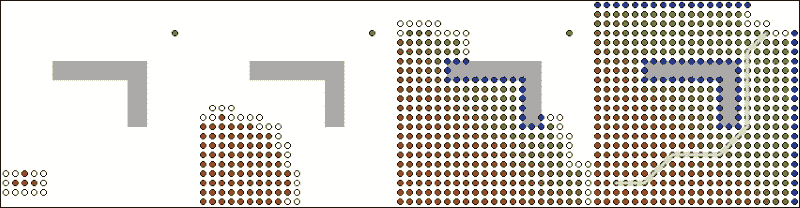

### A*算法

A*是 Dijkstra 算法的扩展。它的目标是通过引入启发式来帮助引导搜索来减少找到终节点所需的时间。**启发式**（或启发式技术）只是一种使用实用方法来解决问题的方法，它并不完美，但足够。例如，试错是一种基本的启发式。虽然不完美，但您将使用试错方法找到问题的解决方案。

就 A*而言，我们的启发式正在考虑已经走过的距离，以引导搜索朝着终节点。再看一下前面显示 Dijkstra 算法的图表。现在，看看 A*在以下图表中解决的相同路径查找问题：

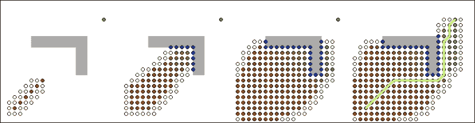

很明显，A*实现倾向于目标位置，因此快速找到了目标节点。此外，看看每个算法必须查看多少节点才能找到目标。Dijkstra 算法实际上访问了每个节点，而在 A*中，由于启发式，访问的节点明显更少。

# A*的分解

在我们开始编写自己的 A*实现之前，将算法分解为其关键领域并独立查看每个领域对我们有好处。

## 代表节点的级别

当我们查看 A*时，最重要的理解领域可能是算法将如何查看我们的级别。虽然我们看到瓦片，但路径查找算法只看到节点。在这种情况下，节点只是表示实体可以在级别内移动到的有效位置。

节点的定义因游戏而异。例如，在我们的游戏中，级别已经被描述为瓦片的 2D 数组。因此，网格中的每个瓦片将充当节点。然而，在 3D 游戏中，我们没有这个网格，因此使用导航网格来创建可以表示为节点的表面。

### 提示

Valve 在其开发者维基页面上有一篇关于导航网格的很棒的文章。因此，如果您想了解更多有关此主题的信息，请访问[`developer.valvesoftware.com/wiki/Navigation_Meshes`](https://developer.valvesoftware.com/wiki/Navigation_Meshes)。

以下图像显示了级别如何分割为其核心的 2D 瓦片数组。这些瓦片中的每一个将在 A*算法中用作节点。玩家可以移动到的有效位置（地板瓦片）用绿色标记，应该避免的瓦片（墙壁、障碍等）用橙色标记。

结果绿色是算法将尝试并找到路径的有效节点区域。

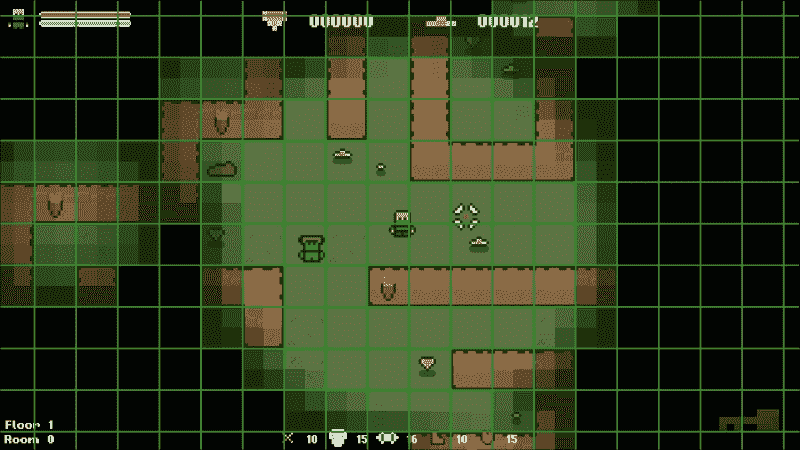

## 开放和关闭列表

一旦节点被识别，它们将存储到以下两个列表中：

+   **开放列表**：此列表包含所有等待成为算法主题的节点。当我们进入一些代码时，这将更有意义，但算法一次操作一个节点，开放列表是此队列。

+   **关闭列表**：此列表只包含已经通过算法的所有节点。一旦节点被添加到此列表中，它将被忽略，直到算法完成。

## H、G 和 F 的成本

阅读 A*路径查找算法时，您将遇到 3 个字母：H、G 和 F。这些是算法中至关重要的值，但它们并不是非常描述性的。因此，让我们花一点时间看看每个值是什么以及它在计算路径中扮演的角色。

### H 值

H 值，通常称为启发式，是从当前位置到目标节点的估计成本。级别中的每个节点都有一个 H 值，在路径规划算法开始时计算，然后在后续计算中使用。这个值有助于引导搜索朝着目标节点，而不是在所有方向上均匀分布。如何计算这个值取决于具体的实现方式，但一个常见的方法被称为**曼哈顿距离**。我们很快会介绍这到底是什么。

### G 值

G 值是从起始节点到当前节点的当前移动成本。这是根据具体实现方式计算的。然而，与 H 值一样，常见的方法是曼哈顿距离，我们将使用这种方法。算法迭代时，每次建立两个节点之间的连接时，该单独移动的移动成本将被添加到迄今为止整个路径的移动成本中。这样，随着路径的建立，每个节点都知道它之前的整个路径有多长。

### F 值

F 值只是 H 值和 G 值的总和。这个值用于确定算法下一个使用的节点。这个值越低，完整路径的估计值就越低。因此，算法优先考虑这些节点。这种行为是使 Dijkstra 算法，因此 A*算法成为最佳优先搜索算法的原因。

## 曼哈顿距离

路径规划算法的核心是计算两点之间的距离。如前所述，这是根据具体的实现方式来完成的，但有一种常见且廉价的方法称为曼哈顿距离（也称为出租车几何），这是我们将要使用的方法。

它正式定义为通过取它们的笛卡尔坐标的绝对差的和来计算两点之间的距离。

这听起来有点复杂，但实际上很简单。笛卡尔坐标只是一种相对于两个固定的垂直轴的位置的表示方式（即使这似乎不熟悉，我们在学校都学过），而绝对值只是表示我们忽略一个数字的符号。

看一下以下图表：

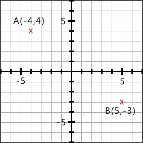

我们在图表上有两个点：**A(-4,4)**和**B(5,-3)**。以下伪代码计算了两者之间的曼哈顿距离：

```cpp
// Calculate the absolute difference in X.
diffX = abs(-4 – 5) = 9;

// Calculate the absolute difference in Y.
diffY = abs(4 - -3) = 7;

// Add them to get the Manhattan distance.
manhattenDistance = 9 + 7 = 16;
```

就是这么简单！

## 节点的父节点

路径规划的另一个关键方面是节点的父节点概念。A*算法通过建立节点链来工作。一旦找到目标节点，我们就会沿着这条链返回，得到最终路径。当确定两个节点之间的最短路径时，节点 A 将被分配为节点 B 的父节点。

例如，以下截图显示了骷髅敌人找到了通往玩家的有效路径的情况：

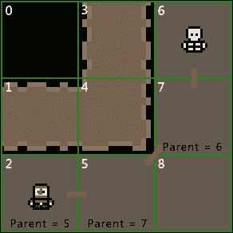

让我们想象一种情况，找到两个节点之间的路径。例如，节点**6**和**7**之间的路径。然后，将第一个节点设置为第二个节点的父节点，在这种情况下，节点**6**被设置为节点**7**的父节点。这样，每个节点都知道它来自哪里。当算法找到目标节点时（在我们的例子中，是节点**2**），我们可以使用这个父节点层次结构从目标节点向起始节点工作，得到最终的最短路径。在这种情况下，骷髅和玩家之间的最短路径是**6**，**7**，**5**，**2**。

## 伪算法

总结算法的分解，让我们看一个伪代码实现：

1.  如果可能的话，预先计算 H 值。

1.  将起始节点添加到开放列表中。

1.  在开放列表中找到具有最低 F 值的节点。

1.  从开放列表中删除该节点，并将其添加到关闭列表中。

1.  对于所有相邻的节点，执行以下步骤：

+   如果节点是目标节点，则将其父节点设置为当前节点并存储最终路径。

+   如果节点在关闭列表中，则忽略它并转到步骤 3。

+   如果节点不在关闭列表和开放列表中，则将其父节点设置为当前节点，并计算其 G 和 F 值。

+   如果节点不在关闭列表中，但在开放列表中，则检查它与当前节点之间的路径是否比当前路径更快。

这是 A*算法的简化版本。希望这个分解给一些步骤提供了上下文。让我们开始编码吧！

# 编写 A*寻路算法

通过对 A*的基本原理的理解，让我们开始在游戏中实现它。这将允许敌人在级别中跟随我们的玩家，而不受其拓扑结构的影响。

对于这样一个复杂的算法，有一个视觉表示发生了什么是非常有帮助的。在适当的地方，我们将看一下使用以下示例发生了什么的视觉表示：

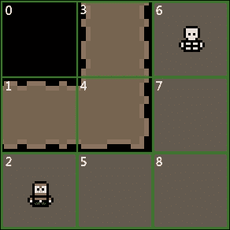

## 瓦片数据类型

让我们先快速看一下在`Level.h`中定义的`Tile`结构。正如我们所见，一个节点包含了相当多的值。在实现中，级别瓦片将充当节点。因此，节点所需的所有信息都在其类型中定义：

```cpp
// The level tile/node type.
struct Tile {
    TILE type;          // The type of tile this is.
    int columnIndex;    // The column index of the tile.
    int rowIndex;       // The row index of the tile.
    sf::Sprite sprite;  // The tile sprite.
    int H;              // Heuristic / movement cost to goal.
    int G;              // Movement cost. (Total of entire path).
    int F;              // Estimated cost for full path. (G + H).
    Tile* parentNode;   // Node to reach this node.
};
```

在本章的其余部分，节点与瓦片是同义词。因此，如果它们可以互换使用，不用担心。但是，请记住，在每个 A*实现中，节点的使用将取决于游戏。

## 创建支持函数

在我们实现算法本身之前，我们需要创建一些支持算法所需的函数和变量。请注意，这些是特定于实现的，并不是 A*算法的一部分。

### Level 类

我们需要做一些基础工作的第一个类是`Level`类。我们需要一个函数来重置节点/瓦片中的所有变量，因为我们需要这些值在每次运行算法时都重置回它们的默认值。

在`Level.h`中添加以下函数声明：

```cpp
public:
/**
* Resets the A* data of all level tiles.
*/
void ResetNodes();
```

还要在`Level.cpp`中添加以下定义：

```cpp
// Resets the A* data of all tiles.
void Level::ResetNodes()
{
    for (int i = 0; i < GRID_WIDTH; ++i)
    {
        for (int j = 0; j < GRID_HEIGHT; ++j)
        {
            m_grid[i][j].parentNode = nullptr;
            m_grid[i][j].H = 0;
            m_grid[i][j].G = 0;
            m_grid[i][j].F = 0;
        }
    }
}
```

您可以看到，我们在这里所做的一切都是迭代级别网格中的每个瓦片，并重置我们将在 A*计算中使用的所有变量。

### 敌人类

接下来，我们需要在`Enemy`类中创建一个运行算法的函数。在`Enemy.h`中添加以下函数声明：

```cpp
public:
/**
* Recalculates the target position of the enemy.
*/
void UpdatePathfinding(Level& level, sf::Vector2fplayerPosition);
```

您可以看到，这个函数接受对级别的引用，主要玩家位置，并且是公共的。我们需要这个函数是公共的，这样我们才能从主游戏类中调用它。这是为了效率，稍后会更清楚为什么。我们将传递对级别对象的引用，因为敌人将需要访问级别信息，并且需要计算目标位置的玩家位置。

我们还需要在`Enemy.h`中添加以下变量：

```cpp
private:
/**
* The target positions of the enemy.
*/
std::vector<sf::Vector2f> m_targetPositions;

/**
* The current target of the enemy.
*/
sf::Vector2f m_currentTarget;
```

完成这项工作后，我们可以在`Enemy.cpp`中为`Enemy::UpdatePathFinding`添加空的函数定义：

```cpp
// Updates the target position of the enemy.
void Enemy::UpdatePathfinding(Level& level, sf::Vector2f playerPosition)
{
    // . . .
```

从这一点开始，所有的代码都将附加到这个函数中。有相当多的内容！

## 变量声明

函数中的第一步将是声明我们将使用的所有变量：

```cpp
    // Create all variables.
    std::vector<Tile*> openList;
    std::vector<Tile*> closedList;
    std::vector<Tile*> pathList;
    std::vector<Tile*>::iterator position;
    Tile* currentNode;
```

`openList`和`closedList`变量用于管理节点。`openList`变量中的节点正在等待检查，`closedList`变量中的节点已经被检查，从现在开始应该被忽略。当我们在实现中遇到它们时，将会详细解释。`pathList`变量将存储最终路径中的所有节点。

位置变量是一个迭代器，将用于查找和删除我们的向量中的值。最后，`currentNode`变量用于跟踪我们当前正在处理的节点。

下一步是重置所有节点。每次运行函数时，我们需要节点具有它们的默认值。为了实现这一点，我们将调用刚刚创建的`Level::ResetNodes`函数，如下所示：

```cpp
// Reset all nodes.
level.ResetNodes();
```

设置的最后一步将是识别起点和终点节点，标记我们正在寻找的路径的起点和终点。起始节点将是敌人的位置。终点节点，也就是我们的目标，是玩家的位置：

```cpp
// Store the start and goal nodes.
Tile* startNode = level.GetTile(m_position);
Tile* goalNode = level.GetTile(playerPosition);
```

`Level::GetTile`函数返回给定位置的瓦片，因此我们可以使用它来获取节点。一旦我们确定了这些节点，我们将进行快速检查，以确保它们不是相同的节点。如果是，它们之间就没有有效的路径，我们可以简单地清除当前路径并退出函数，如下所示：

```cpp
// Check we have a valid path to find. If not we can just end the function as there's no path to find.
if (startNode == goalNode)
{
    // Clear the vector of target positions.
    m_targetPositions.clear();

    // Exit the function.
    return;
}
```

此时，我们已经声明了将要使用的所有变量，重置了所有节点的默认值，并确定了我们正在处理有效路径。是时候进入算法的主体部分了！

## 预先计算 H 值

我们 A*算法实现的下一步是计算级别中每个节点的 H 值。请记住，H 值是从起始节点到目标节点的路径的估计成本。

我们将使用曼哈顿距离。因此，对于级别中的每个瓦片，我们需要计算到目标节点的距离，如下所示：

```cpp
// Pre-compute our H cost (estimated cost to goal) for each node.
for (int i = 0; i < level.GetSize().x; ++i)
{
    for (int j = 0; j < level.GetSize().y; ++j)
    {
        int rowOffset, heightOffset;
        Tile* node = level.GetTile(i, j);

        heightOffset = abs(node->rowIndex - goalNode->rowIndex);
        rowOffset = abs(node->columnIndex - goalNode-> columnIndex);

        node->H = heightOffset + rowOffset;
    }
}
```

## 定义主循环

我们现在将定义算法实际发生的主循环，但在这样做之前，我们需要快速将起始节点添加到开放节点列表中，如下所示：

```cpp
// Add the start node to the open list.
openList.push_back(startNode);
```

开放列表是算法留下的所有节点的列表。只要此列表中有值，算法就应该运行。因此，我们将定义此行为以创建主循环，如下所示：

```cpp
// While we have values to check in the open list.
while (!openList.empty())
{
```

算法的下一步是决定我们将在下一个操作的节点。您可能记得 F 值用于此目的。开放列表包含所有等待检查的节点。因此，我们需要遍历这个向量并找到具有最低 F 值（完整路径的估计成本）的节点：

```cpp
// Find the node in the open list with the lowest F value and mark it as current.
int lowestF = INT_MAX;

for (Tile* tile : openList)
{
    if (tile->F < lowestF)
    {
        lowestF = tile->F;
        currentNode = tile;
    }
}
```

这段代码非常简单。我们最初将`lowestF`设置为`INT_MAX`，这是一个包含`int`的最大值的宏，因为我们可以确保没有任何 F 值会接近那个值。当我们确定具有较小 F 值的节点时，我们更新`lowestF`值，并标记该节点为下一个需要操作的节点。

一旦我们确定了具有最低 F 值的节点，我们就将其从`openList`中删除，并将其添加到`closedList`向量中，以确保我们不会再次操作相同的节点，如下所示：

```cpp
// Remove the current node from the open list and add it to the closed list.
position = std::find(openList.begin(), openList.end(), currentNode);
if (position != openList.end())
    openList.erase(position);

closedList.push_back(currentNode);
```

这就是迭代器变量发挥作用的地方。迭代器只是具有迭代一系列元素的能力的对象。要从向量中删除项目，我们调用`std::find()`，传递向量的开始、结束和我们要查找的值。如果找到该值，`std::find()`将返回指向该元素的迭代器。如果未找到该值，它将返回一个指向虚构元素的迭代器，该元素将跟随向量中的最后一个元素。然后，我们在`openList`中调用 erase，传递此迭代器值以找到正确的元素。

## 查找相邻节点

现在选择了下一个节点并将其分配给`currentNode`变量后，是时候识别所有相邻节点了。这是另一个将根据每个特定实现而有所不同的领域。

在我们的情况下，级别被定义为 2D 网格。因此，很容易获取周围的节点：

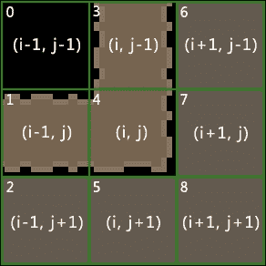

您可以从前面的图表中看到，列和行索引`i`和`j`分别从-1 到 1，围绕中间的瓷砖。我们可以利用这一点来获取我们想要检查的周围节点。我们只对有效的地板节点感兴趣，所以在获取它们时，我们可以执行这些检查。

让我们在函数中实现这一点，如下所示：

```cpp
// Find all valid adjacent nodes.
std::vector<Tile*> adjacentTiles;

Tile* node;

// Top.
node = level.GetTile(currentNode->columnIndex, currentNode-> rowIndex - 1);
if ((node != nullptr) && (level.IsFloor(*node)))
{
    adjacentTiles.push_back(level.GetTile(currentNode-> columnIndex, currentNode->rowIndex - 1));
}

// Right.
node = level.GetTile(currentNode->columnIndex + 1, currentNode-> rowIndex);
if ((node != nullptr) && (level.IsFloor(*node)))
{
    adjacentTiles.push_back(level.GetTile(currentNode->columnIndex + 1, currentNode->rowIndex));
}

// Bottom.
node = level.GetTile(currentNode->columnIndex, currentNode-> rowIndex + 1);
if ((node != nullptr) && (level.IsFloor(*node)))
{
    adjacentTiles.push_back(level.GetTile(currentNode-> columnIndex, currentNode->rowIndex + 1));
}

// Left.
node = level.GetTile(currentNode->columnIndex - 1, currentNode-> rowIndex);
if ((node != nullptr) && (level.IsFloor(*node)))
{
    adjacentTiles.push_back(level.GetTile(currentNode->columnIndex - 1, currentNode->rowIndex));
}
```

在这段代码中，我们得到了周围的 4 个节点，确保它们都是有效的地板砖。只有在这种情况下，它们才会被添加到需要检查的相邻节点列表中。有了这些确定的节点，现在我们需要循环遍历每个节点。`for`循环将允许我们这样做：

```cpp
// For all adjacent nodes.
for (Tile* node : adjacentTiles)
{
```

当我们到达目标节点时，算法结束。因此，每次选择相邻节点时，我们都可以检查是否已经到达目标节点。有了目标节点存储在一个变量中，这是一个简单的检查：

```cpp
// If the node is our goal node.
if (node == goalNode)
{
```

由于我们通过最低的 F 值选择节点，第一次到达目标节点时，我们知道我们已经走过了最短的可能路径。在继续寻找这条路径之前，我们首先需要将目标节点的父节点设置为当前节点：

```cpp
// Parent the goal node to current.
node->parentNode = currentNode;
```

接下来，我们需要构建一个包含从起始节点到目标节点的所有节点的列表。没有固定的方法来做这个，但我们将使用`while`语句。当节点有父节点时，将节点添加到列表中，然后将节点设置为其父节点。让我们为此添加代码：

```cpp
// Store the current path.
while (node->parentNode != nullptr)
{
    pathList.push_back(node);
    node = node->parentNode;
}
```

通过这种方式，我们从目标节点到起始节点构建了一个完整的路径。请注意，结果路径是反向的，但我们稍后会解决这个问题！

现在，最后一步是退出主循环。我们目前嵌套在一个`while`循环和一个`for`循环中。为了退出这个循环，我们需要清空开放列表并调用`break`。`break`组件将我们从`for`循环中踢出来，现在开放列表为空，我们也退出了`while`循环：

```cpp
    // Empty the open list and break out of our for loop.
    openList.clear();
    break;
}
else
{
```

现在，这一切都完成了，我们已经找到了目标节点，存储了从起点到目标的节点路径，并退出了主循环。这一切都是找到目标节点的结果。现在我们需要把注意力转向我们没有找到目标节点的情况。

## 计算 G 和 F 成本

如果一个节点在关闭列表中，那么它已经成为算法的主题。所有相邻节点都已经被检查并计算了它们的 G 和 F 值。如果是这种情况，我们可以简单地忽略这个节点：

```cpp
// If the node is not in the closed list.
position = std::find(closedList.begin(), closedList.end(), node);
if (position == closedList.end())
{
```

确保节点不在关闭列表中后，我们接下来检查开放列表：

```cpp
// If the node is not in the open list.
position = std::find(openList.begin(), openList.end(), node);
if (position == openList.end())
{
```

与之前的检查不同，如果我们的节点在开放列表中，我们不会忽略它。如果节点不在开放列表中，那么这是算法第一次遇到它。如果是这种情况，我们需要执行以下操作：

1.  将节点添加到开放列表中。

1.  将`parent`设置为`currentNode`（在检查 F 值时，它是最后一个节点）。

1.  计算它的 G 值。

1.  计算它的 F 值。

我们将首先将其添加到开放列表中并设置其父节点；这些都是快速简单的任务：

```cpp
// Add the node to the open list.
openList.push_back(node);

// Set the parent of the node to the current node.
node->parentNode = currentNode;
```

### 计算 G 和 F 成本

您可能还记得 G 成本是从起始节点到该节点的移动总成本。在我们的网格中，我们可以朝四个方向移动，不会对角线移动，所以每次移动成本为`10`。这个值是特定于实现而不是算法。这是两个节点之间移动的成本，`10`只是一个很好的数值。

### 提示

我们之所以不使用对角线，只是为了更容易地进行演示。本章末尾的一个练习是添加对角线移动，我强烈建议您尝试一下！

由于我们知道节点之间的移动成本是`10`，现在我们需要将`currentNode`的 G 成本加到其中以得到最终值。`currentNode`的 G 成本是到目前为止的路径成本，所以将最后的移动成本加到其中，新节点就得到了从起始节点到自身的路径总成本：

```cpp
// Calculate G (total movement cost so far) cost.
node->G = currentNode->G + 10;
```

最后，我们需要计算节点的 F 成本，这只是它的 G 和 H 成本的总和。我们刚刚计算了 G 成本，并且在算法开始时预先计算了 H 成本。所需的只是一个简单的加法：

```cpp
// Calculate the F (total movement cost + heuristic) cost.
node->F = node->G + node->H;
```

## 检查更优越的路径

算法的最后一步是检查节点是否已经在开放列表中，如果是的话，我们已经生成了它的 G 和 F 值。然而，现在我们需要检查它们是否是最低可能的值。

在下图中，节点**7**是节点**8**的父节点，节点**8**是节点**5**的父节点：

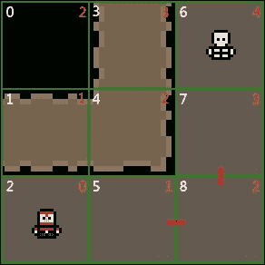

这导致了从节点**7**到**8**到**5**的移动成本为`30`。然而，这并不是最短的路径。从**7**到**5**的移动成本，假设我们允许对角线移动，是`14`。如果我们从路径中去掉**8**，总移动成本就是`24`，低于当前的 30。在这种情况下，我们将**7**作为**5**的父节点，而不是**8**。由于我们不使用对角线移动，这个例子不适用，除非你自己添加对角线移动。

希望这能展示出我们正在寻找更优越的路径，如下图所示：

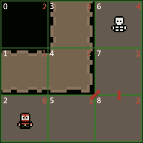

我们可以看到，节点**5**的移动成本更低，它是**7**的父节点。这创建了一个比之前更短的对角线路径。

让我们在函数中添加一些代码来包含这个行为：

```cpp
}
else
{
    // Check if this path is quicker that the other.
    int tempG = currentNode->G + 10;

    // Check if tempG is faster than the other. I.e, whether it's faster to go A->C->B that A->C.
    if (tempG < node->G)
    {
        // Re-parent node to this one.
        node->parentNode = currentNode;
    }
}}}}}
```

## 创建最终路径

A*算法的最后一部分是将节点列表转换为敌人可以跟随的有效路径。在为 A*算法做准备的工作中，我们向`Enemy`类添加了以下变量：

```cpp
/**
* The target positions of the enemy.
*/
std::vector<sf::Vector2f> m_targetPositions;
```

这个向量将保存一个目标位置列表，我们将从最终路径的节点中获取。然而，在这之前，我们需要确保清空它。这样做是为了确保每次运行寻路算法时，玩家都有一组新的坐标移动到。让我们清空这个向量。同样，这段代码只是追加到`Enemy::UpdatePathFinding`函数中，如下所示：

```cpp
// Clear the vector of target positions.
m_targetPositions.clear();
```

现在，为了将瓦片转换为目标位置，我们将遍历最终节点的向量，获取它们的实际位置，并将它们添加到`m_targetPositions`向量中，如下所示：

```cpp
// Store the node locations as the enemies target locations.
for (Tile* tile : pathList)
{
    m_targetPositions.push_back(level.GetActualTileLocation(tile-> columnIndex, tile->rowIndex));
}
```

我们还需要做最后一件事，这很容易被忽视。当我们找到目标节点并创建最终路径列表时，我们将它们从目标节点存储回起始节点。这意味着最终路径是反向的。`Enemy::UpdatePathFinding`函数的最后一步是将`m_targetPositions`向量反转以纠正这个问题，并添加最终的闭合括号：

```cpp
// Store the node locations as the enemies target locations.
for (Tile* tile : pathList)
{
    m_targetPositions.push_back(level.GetActualTileLocation(tile-> columnIndex, tile->rowIndex));
}

// Reverse the target position as we read them from goal to origin and we need them the other way around.
std::reverse(m_targetPositions.begin(), m_targetPositions.end());

```

就是这样！我们完成了。A*算法已经完成。基础敌人类有一个函数，可以创建一个目标位置的向量，并以最快的路径将敌人带到玩家那里。下一步是使敌人能够跟随这条路径！

### 提示

如果你想进一步探索寻路，可以前往[`qiao.github.io/PathFinding.js/visual/`](https://qiao.github.io/PathFinding.js/visual/)。这是一个很棒的应用，可以可视化一系列流行的寻路算法。

# 在游戏中实现 A*

现在我们有了一个可以计算最短路径的函数，我们需要将这个行为整合到游戏中。

## 使敌人能够跟随路径

现在我们需要让敌人按照寻路算法生成的目标位置向量进行移动。我们需要敌人不断地跟随这条路径，所以我们将重写它的基类`Update`函数，因为它在每个游戏的 tick 期间被调用。这将会是相当简单的代码；如果向量中有位置，就以固定的速度朝着它移动。当到达位置时，我们就从向量中移除它。当向量为空时，我们就知道敌人已经到达目的地。

我们将从在`Enemy.h`中添加函数声明开始：

```cpp
public:
/**
 * Overrides the default Update function in Enemy
 */
void Update(float timeDelta) override;
```

现在我们可以添加代码来跟随路径。就像我们刚才说的，如果目标位置的向量中有值，就以固定的速度朝向它移动。我们通过创建和标准化移动向量来实现这一点。

### 提示

我们不会涵盖这种移动背后的数学原理。所以，如果你想了解更多，请查看[`www.fundza.com/vectors/normalize/`](http://www.fundza.com/vectors/normalize/)以获取概述。

以下代码用于创建和标准化移动向量：

```cpp
// Updates the enemy.
void Enemy::Update(float timeDelta)
{
    // Move towards current target location.
    if (!m_targetPositions.empty())
    {
        sf::Vector2f targetLocation = m_targetPositions.front();
        m_velocity = sf::Vector2f(targetLocation.x - m_position.x, targetLocation.y - m_position.y);

        if (abs(m_velocity.x) < 10.f && abs(m_velocity.y) < 10.f)
        {
            m_targetPositions.erase(m_targetPositions.begin());
        }
        else
        {
            float length = sqrt(m_velocity.x * m_velocity.x + m_velocity.y * m_velocity.y);
            m_velocity.x /= length;
            m_velocity.y /= length;

            m_position.x += m_velocity.x * (m_speed * timeDelta);
            m_position.y += m_velocity.y * (m_speed * timeDelta);

            m_sprite.setPosition(m_position);
        }
    }

    // Call character update.
    Entity::Update(timeDelta);
}
```

你还可以看到在函数的最后我们调用了`Entity::Update`。动画代码就在这个函数中。我们需要确保它仍然被调用！

## 调用寻路行为

将寻路整合到游戏中的最后一步是在我们想要生成新路径时调用`Enemy::UpdatePathFinding`函数。敌人在每次游戏更新时都会更新，但我们不希望那么频繁地更新路径。

尽管 A*是一个高效的算法，但我们仍然希望尽可能少地调用它。路径只有在玩家移动到新的瓷砖时才会改变，所以在此之前更新寻路是没有意义的。为了实现这一点，我们需要能够告诉上次更新时玩家所在的瓷砖，以及本次更新时玩家所在的瓷砖。让我们在`Game.h`中添加以下变量，并确保在类初始化器中给它一个默认值：

```cpp
/**
 * The last tile that the player was on.
 */
Tile* m_playerPreviousTile;
```

在`Game::Update`函数中，我们现在可以检查玩家是否移动到了一个瓷砖上，如果是这样，就调用关卡中所有敌人的`Enemy::UpdatePathFinding`函数，如下所示：

```cpp
// Check if the player has moved grid square.
Tile* playerCurrentTile = m_level.GetTile(playerPosition);

if (m_playerPreviousTile != playerCurrentTile)
{
    // Store the new tile.
    m_playerPreviousTile = playerCurrentTile;

    // Update path finding for all enemies if within range of the player.
    for (const auto& enemy : m_enemies)
    {
        if (DistanceBetweenPoints(enemy->GetPosition(), playerPosition) < 300.f)
            enemy->UpdatePathfinding(m_level, playerPosition);
    }
}
```

就是这样！我们现在可以测试游戏了。我们应该看到敌人在关卡中跟随我们，而不是像静止的物体一样站着，如下面的截图所示：

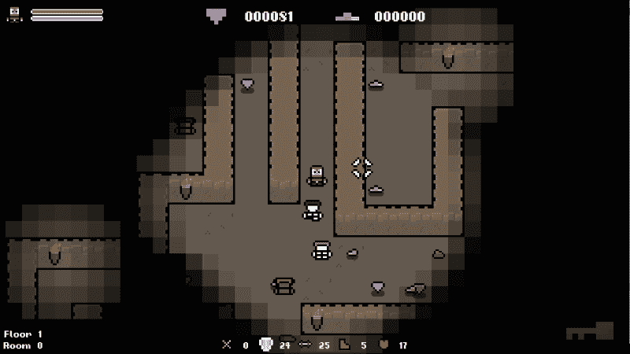

## 查看我们的路径

我们已经让代码运行起来了，这很棒，但让我们添加一些调试代码，以便我们可以看到敌人正在生成的路径。我不会详细介绍这段代码，因为它只是为了演示目的。它基本上只在目标位置的向量中的每个点上绘制一个精灵。

在`Enemy.h`中，我们将声明以下变量和函数：

```cpp
public:
/**
 * Override the default draw function.
 */
void Draw(sf::RenderWindow& window, float timeDelta) override;

private:
/**
 * Debug sprite for path
 */
sf::Sprite m_pathSprite;

/**
 * Debug font for the path
 */
sf::Font m_font;

/**
 * Debug text for the path
 */
sf::Text m_text;
```

在`Enemy::Enemy`中，我们将设置调试精灵和字体，如下所示：

```cpp
// Set the sprite.
int textureID = TextureManager::AddTexture("../resources/spr_path.png");
m_pathSprite.setTexture(TextureManager::GetTexture(textureID));

// Set the sprite origin.
sf::Vector2u spriteSize = m_pathSprite.getTexture()->getSize();
m_pathSprite.setOrigin(sf::Vector2f(static_cast<float>(spriteSize.x / 2), static_cast<float>(spriteSize.y / 2)));

// Set the font.
m_font.loadFromFile("../resources/fonts/04B_03__.TTF");

// Set the text.
m_text.setFont(m_font);
m_text.setCharacterSize(12);
```

此外，我们将为名为`Enemy::Draw`的新绘制函数添加一个主体：

```cpp
// Override the default draw function.
void Enemy::Draw(sf::RenderWindow& window, float timeDelta)
{
    Object::Draw(window, timeDelta);

    // DEBUG Draw the current path
    for (int i = 0; i < m_targetPositions.size(); i++)
    {
        // draw the path sprite
        m_pathSprite.setPosition(m_targetPositions[i]);
        window.draw(m_pathSprite);

        // set the path index
        std::ostringstream ss;
        ss << i;
        std::string str(ss.str());
        m_text.setString(str);
        m_text.setPosition(m_targetPositions[i]);
        window.draw(m_text);
    }
}
```

这段代码将显示敌人的 A*算法找到的路径，帮助我们可视化 A*算法的操作。让我们运行游戏并看一下。记住，当你完成时，你需要删除这个调试代码，因为它会影响性能。下面的截图显示了我们敌人的路径：

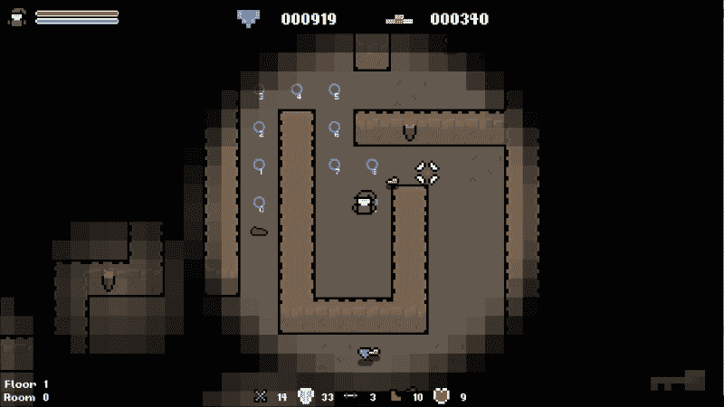

# 程序生成的关卡目标

在本章中，我们要构建的最终系统是生成随机化的关卡目标。在每个关卡中，我们必须找到钥匙、找到出口，并杀死所有挡路的敌人。通过添加玩家也可以完成的随机目标，让游戏增加更多的玩法和挑战。每次进入一个关卡，我们将可能给玩家一个可选任务，如果完成了，将获得随机奖励。

## 变量和函数声明

创建此系统的第一步是声明我们将需要的变量和函数。我们将封装生成目标行为到自己的函数中。首先，我们需要在`Game.h`中声明以下`private`函数：

```cpp
private:
/**
 * Generates a level goal.
 */
void GenerateLevelGoal();
```

考虑到我们想要生成的目标类型（杀死敌人、收集黄金和宝石），我们需要变量来保存这些值。让我们在`Game.h`中也声明以下`private`变量：

```cpp
private:
/**
 * The value of gold remaining for the current goal.
 */
int m_goldGoal;

/**
 * The value of gems remaining for the current goal.
 */
int m_gemGoal;

/**
 * The number of kills remaining for the current goal.
 */
int m_killGoal;
```

最后，我们将要能够判断我们是否有一个活动目标，并将目标绘制到屏幕上。我们将声明一个布尔值来跟踪我们是否有一个目标，以及一个字符串对象来存储当前目标的描述：

```cpp
/**
 * A string describing the current level goal.
 */
sf::String m_goalString;

/**
 * A boolean denoting if a goal is currently active.
 */
bool m_activeGoal;
```

## 生成随机目标

现在我们可以生成随机目标。我们有三种类型可用，即黄金、宝石和敌人。因此，首先我们需要选择要创建的目标中的哪一个。

通过在`Game.cpp`中添加以下代码，让`Game::GenerateLevelGoal`具有实体：

```cpp
// Generates a random level goal.
void Game::GenerateLevelGoal()
{
    std::ostringstream ss;

    // Reset our goal variables.
    m_killGoal = 0;
    m_goldGoal = 0;
    m_gemGoal = 0;

    // Choose which type of goal is to be generated.
    int goalType = rand() % 3;

    switch (goalType)
    {
        case 0:    // Kill X Enemies
        break;

        case 1:    // Collect X Gold
        break;

        case 2:    // Collect X Gems
        break;
    }
}
```

我们首先定义了一个流对象，稍后我们将使用它，并将目标变量重置为`0`。这样做是为了确保每次调用此函数时目标都是全新的。然后，我们生成一个介于`0`和`2`之间的数字，并在`switch`语句中使用它。

对于每种情况，我们需要生成一个随机数作为目标值，并将其设置为适当的变量。我们还需要构造一个描述目标的字符串，并将其存储在`m_goalString`变量中，如下所示：

```cpp
switch (goalType)
{
case 0:        // Kill X Enemies
    m_killGoal = rand() % 6 + 5;

    // Create the string describing the goal.
    ss << "Current Goal: Kill " << m_killGoal << " enemies" << "!" << std::endl;
    break;

case 1:        // Collect X Gold
    m_goldGoal = rand() % 51 + 50;

    // Create the string describing the goal.
    ss << "Current Goal: Collect " << m_goldGoal << " gold" << "!" << std::endl;
    break;

case 2:        // Collect X Gems
    m_gemGoal = rand() % 6 + 5;

    // Create the string describing the goal.
    ss << "Current Goal: Collect " << m_gemGoal << " gems" << "!" << std::endl;
    break;
}

// Store our string.
m_goalString = ss.str();
```

完成后，我们的目标基本上已经创建。现在我们需要通过将`m_activeGoal`变量设置为`true`来激活目标：

```cpp
    // Set the goal as active.
    m_activeGoal = true;
}
```

完成的函数看起来像这样：

```cpp
// Generates a random level goal.
void Game::GenerateLevelGoal()
{
    std::ostringstream ss;

    // Choose which type of goal is to be generated.
    int goalType = rand() % 3;

    switch (goalType)
    {
    case 0:        // Kill X Enemies
        m_killGoal = rand() % 6 + 5;

        // Create the string describing the goal.
        ss << "Current Goal: Kill " << m_killGoal << " enemies" << "!" << std::endl;
        break;

    case 1:        // Collect X Gold
        m_goldGoal = rand() % 51 + 50;

        // Create the string describing the goal.
        ss << "Current Goal: Collect " << m_goldGoal << " gold" << "!" << std::endl;
        break;

    case 2:        // Collect X Gems
        m_gemGoal = rand() % 6 + 5;

        // Create the string describing the goal.
        ss << "Current Goal: Collect " << m_gemGoal << " gems" << "!" << std::endl;
        break;
    }

// Store our string.
m_goalString = ss.str();

    // Set the goal as active.
    m_activeGoal = true;
}
```

在下一章中，当我们把注意力转向关卡时，我们将适当地连接这个函数，但现在，我们可以通过在`Game::Game`中调用它来测试它。添加以下调试代码，以便我们可以测试该函数：

```cpp
// DEBUG: Generate a level goal.
GenerateLevelGoal();
```

## 检查目标是否完成

现在我们可以在调用函数时生成随机的关卡目标。我们现在需要将游戏玩法与这些目标连接起来，以便我们可以知道其中一个是否已经完成。每当我们处理与目标相关的动作时，我们需要检查是否有活动目标，并做出相应的响应。

从击杀计数开始，当我们确定敌人已被击败时，我们将检查是否有活动目标，如果是这样，我们会递减`m_killGoal`变量，如下所示：

```cpp
// If the enemy is dead remove it.
if (enemy.IsDead())
{
    enemyIterator = m_enemies.erase(enemyIterator);

    // If we have an active goal decrement killGoal.
 if (m_activeGoal)
 {
 --m_killGoal;
 }
}
```

其他关卡目标也采用相同的方法。在对象拾取代码中，当我们拾取黄金或宝石时，我们将检查是否有活动的关卡目标，如果是这样，我们会递减相应的值，如下所示：

```cpp
switch (m_items[i]->GetType())
{
case GAME_OBJECT::GOLD:
{
    // cast the item to a gold type
    Gold& gold = dynamic_cast<Gold&>(*m_items[i]);

    . . .

    // Check if we have an active level goal.
 if (m_activeGoal)
 {
 m_goldGoal -= gold.GetGoldValue();
 }
}
break;

case GAME_OBJECT::GEM:
{
    // cast the item to a gem type
    Gem& gem = dynamic_cast<Gem&>(*m_items[i]);

    . . .

    // Check if we have an active level goal.
 if (m_activeGoal)
    {
 --m_gemGoal;
    }
}
break;

. . .
```

完成后，游戏中的动作现在已经与目标计数器连接起来。接下来，我们需要实际检查是否已经实现了目标。我们将把这段代码放在`Game::Update`的最后，以确保所有其他动作都已执行。

检查我们是否实现了目标很简单。首先，我们检查是否有一个活动目标。然后，我们检查所有计数器变量是否小于或等于`0`。如果是这样，那么我们知道我们已将适当的计数器减少到`0`。通过这种方法，其他值将下降到负值，但我们不会收集足够的战利品来解决这个问题。让我们在`Game::Update`的末尾添加这段代码：

```cpp
// Check if we have completed an active goal.
if (m_activeGoal)
{
    if ((m_gemGoal <= 0) &&
        (m_goldGoal <= 0) &&
        (m_killGoal <= 0))
    {
        m_scoreTotal += std::rand() % 1001 + 1000;
        m_activeGoal = false;
    }
}
```

完成后，大部分目标系统已经建立起来。您可以看到，如果我们确定目标是活动的，并且所有计数器都为 0 或更低，我们会奖励玩家。我们还将`m_activeGoal`变量设置为`false`，以显示目标现在已经实现。

## 在屏幕上绘制目标

现在的最后一步是在屏幕上绘制我们的目标！我们有一个`bool`变量，表示我们是否有一个活动目标，当我们生成目标时，我们将其描述存储在一个字符串变量中。绘制它就像调用`Game::DrawText`并传递描述一样简单，但我们只会在`m_activeGoal`变量为`true`时这样做。

现在是时候通过在`Game::Draw`中添加以下内容来完成这个系统了：

```cpp
// Draw the level goal if active.
if (m_activeGoal)
{
    DrawString(m_goalString, sf::Vector2f(m_window.getSize().x / 2, m_window.getSize().y - 75), 30);
}
```

现在，如果您运行游戏，您将看到每次显示一个独特的目标：

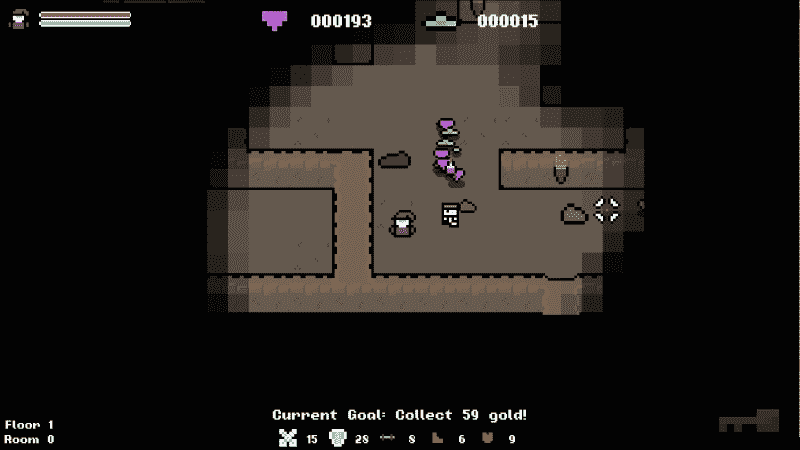

我们可以在这里结束一天，但我们可以做得更好！由于定义关卡目标的字符串只存储一次，当我们创建它时，它不会随着我们朝着目标努力而更新自身。让我们来解决这个问题！如果我们回到`Game::Update`并找到我们是否已经实现了目标的检查点，我们可以在这里进行一些修改来实现这一点。

目前，我们会检查是否已经实现了活动目标，但只有在实现了目标时才会执行操作。这是我们更新字符串的机会。我们只需要确定设置了哪种类型的目标，这可以通过检查我们的目标变量的值来实现，并以与我们在`Game::GenerateLevelGoal`中所做的相同方式重建字符串。

```cpp
// Check if we have completed an active goal.
if (m_activeGoal)
{
    if ((m_gemGoal <= 0) &&
        (m_goldGoal <= 0) &&
        (m_killGoal <= 0))
    {
        m_scoreTotal += std::rand() % 1001 + 1000;
        m_activeGoal = false;
    }
    else
    {
        std::ostringstream ss;

        if (m_goldGoal > 0)
            ss << "Current Goal: Collect " << m_goldGoal << " gold" << "!" << std::endl;
        else if (m_gemGoal > 0)
            ss << "Current Goal: Collect " << m_gemGoal << " gem" << "!" << std::endl;
        else if (m_killGoal > 0)
            ss << "Current Goal: Kill " << m_killGoal << " enemies" << "!" << std::endl;

        m_goalString = ss.str();
    }
}
```

现在，当我们有一个活动目标时，屏幕上的字符串会随着我们朝着目标努力而更新！

# 练习

为了帮助你测试本章内容的知识，这里有一些练习，你应该进行练习。它们对于本书的其余部分并不是必不可少的，但是进行练习将帮助你评估所涵盖材料的优势和劣势。

1.  在计算路径查找时，我们目前不允许对角线移动。更新算法，使其允许对角线移动。为了帮助你入门，当计算 G 成本时，你需要确定我们是对角线移动还是直线移动。

1.  目前，敌人会在整个关卡中追逐我们。修改函数，使敌人只在一定距离内追逐玩家。

1.  目前，我们的敌人以固定速度移动，并且不考虑我们在早期章节生成的速度变量。在游戏中整合速度变量，使敌人以正确的速度移动。

# 总结

在本章中，我们将我们的努力扩展到程序行为和机制，而不仅仅是资源。具体来说，我们实现了 A*路径查找算法，为敌人提供一些智能和在关卡周围的自然移动，并创建了随机关卡目标。希望这已经很好地证明了程序生成不仅仅局限于资源；它可以用于游戏的每个方面。

在下一章中，我们将实现可能是 roguelike 游戏最具标志性的特征：程序生成的关卡。到目前为止，我们一直在使用相同的固定关卡，所以是时候开始程序生成它们了！我们还将在关卡之间创建一些差异，并实现我们刚刚创建的目标生成器！
