# 第九章：程序地牢生成

也许是地牢游戏最具标志性和定义性的特征之一就是它们的程序生成关卡。这是导致该类型游戏具有可重复性的主要特征之一。它使游戏保持新鲜和具有挑战性，让玩家保持警惕。

在本书的过程中，我们从简单生成单个数字逐步实现了复杂的程序行为，比如路径查找。现在是时候展示我们的杰作了：程序生成我们的关卡。除此之外，我们还将使用我们在第六章中创建的函数来使关卡更加独特，*程序生成艺术*。

在本章中，我们将涵盖以下主题：

+   程序设计关卡的好处

+   迷宫生成

+   房间生成

+   瓦片映射

# 程序设计关卡的好处

游戏关卡和环境的程序生成带来了许多好处，不仅对玩家有益，对开发者也有益。在使用之前了解技术的优缺点总是好事。因此，在我们实施之前，让我们先看看它为游戏带来的一些最大好处。

## 可重复性

程序生成关卡最明显的好处是它们的多样性和给游戏带来的可重复性。每次运行，环境都会发生变化。这意味着玩家无法学习物品和敌人的位置，这保持了挑战的新鲜感，给玩家理由一次又一次地玩游戏。

## 减少开发时间

程序生成的一个普遍好处是它节省的开发时间。在我们的地牢游戏中，我们将拥有无数个独特的关卡。如果我们手动创建关卡，这是不可能的。我们最多只能限制在一百个关卡。

利用这样的程序生成可以减轻开发者的工作量，节省时间和金钱，并扩大了可能性的范围。

## 更大的游戏世界

记住，程序生成本身并不是随机的。我们通过在算法和计算中使用随机值和术语来引入随机性。鉴于此，我们可以在关卡设计中使用程序生成来共享关卡，而无需实际存储它们。

许多随机生成世界的游戏允许你输入一个世界种子。有了这个值，两台不同机器上的人可以生成相同的关卡。通过这种方法，你可以生成一个理论上无限的关卡，确保所有玩家生成相同的关卡。此外，你只需要存储世界种子，而不是潜在的数百兆字节的世界数据。

# 考虑因素

和一切一样，都有两面性。因此，尽管程序生成关卡带来了好处，但也需要考虑和妥协。

## 控制的缺失

控制的缺失是程序生成的一个常见陷阱，但在生成关卡时可能比其他情况更为突出。游戏关卡是我们讲述故事和尝试游戏机制的竞技场。因此，它们通常由专门的关卡设计师手工制作。将这项工作交给算法会导致严重的控制丧失。

拥有简单机制和故事的游戏通常会表现得不错，但如果你有复杂的机制或者想以特定方式讲述故事，程序生成关卡可能需要你放弃更多的控制权。算法永远无法复制经验丰富的专业人员带来的小细节。

## 所需的计算能力

还需要考虑的一个问题是所需的计算能力。在我们的情况下，情况并不那么糟糕。我们只需要生成一个小尺寸的 2D 数组。然而，如果您在大规模生成 3D 地形，这个成本就变得更加重要，需要加以考虑。

想象一下，我们需要处理一个 1000x1000 的关卡网格。每次生成关卡时都会有大量的计算需要进行，我们需要确保所有玩家的硬件都能够应对！随着计算能力的稳步增加，这变得不再是一个问题。事实上，这就是游戏变得非常复杂和动态的原因。我们有实现它所需的硬件，但我们仍然需要意识到其限制。

## 适用性

最后的考虑只是您的游戏是否会受益于程序生成。仅仅因为在游戏中可能可以实现它，并不意味着它就应该存在。如果您不需要大量的关卡，并且有复杂的机制和系统，那么可能不值得实现它。最好花时间精心制作一些您知道会非常有效的关卡。

这是一个需要牢记的好点。不要被游戏的技术性和代码的精彩所迷惑。最重要的是，您的游戏需要有趣和引人入胜。始终优先考虑游戏性。

# 地牢生成概述

地牢生成是一个广泛的主题，有各种可能的实现方式，每种实现方式都有其自身的特点。然而，在不同算法的细微差别之下，地牢生成通常涉及生成房间和迷宫，以及将两者整合在一起，如下图所示：

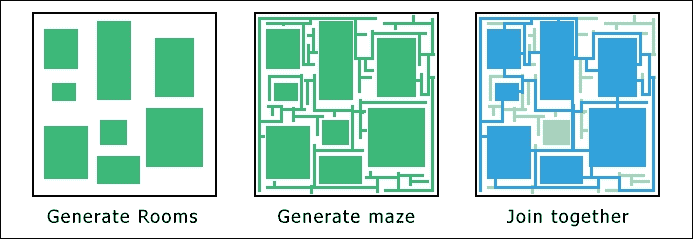

程序生成地牢与我们在路径查找上所做的工作并没有太大的不同。它关键在于将关卡视为节点并对其进行操作。在我们实现之前，我们将其分解为之前确定的三个主要阶段，即生成房间、生成迷宫以及将它们整合在一起。

## 生成房间

地牢是一系列相互连接的房间，它们的生成是许多系统中的第一步。这背后没有复杂的算法；我们只是选择一个房间大小，并在关卡中放置一些房间。这个关卡的特性将由房间的数量、大小以及它们的放置方式等因素决定，如下图所示：

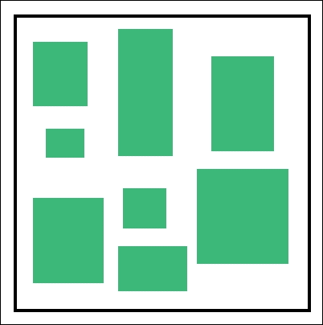

## 生成迷宫

地牢生成的另一个重要步骤是在可玩区域生成迷宫，将关卡变成一系列相连的走廊。然后这些走廊可以连接现有的房间，或者在其中雕刻房间以创建开放区域。有许多算法用于生成这样的迷宫，我们将使用流行的**递归回溯**算法。别担心，我们很快就会详细了解这个算法！以下截图显示了这样一个迷宫的示例：

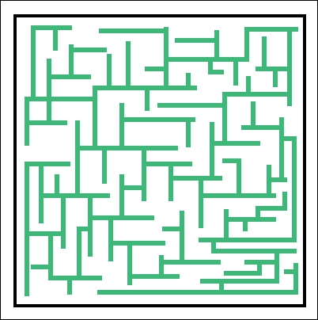

## 连接房间和迷宫

如果您选择先生成房间，然后创建迷宫来连接它们，最后一步是将它们整合在一起。目前，迷宫会直接经过所有的房间，但幸运的是，将它们连接起来是一项简单的任务。我们只需要查看每个房间的周围，并向有效的相邻路径添加连接块，如下图所示：

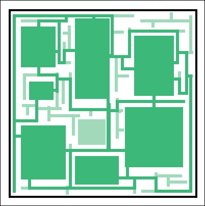

在我们的实现中，实际上我们要以另一种方式来做。我们将生成一个迷宫，然后在其中开辟出开放区域。这种方法创建了更多开放和迷宫般的区域，而第一种方法则创建了相互连接的封闭房间。

# 递归回溯法

递归回溯法，顾名思义，涉及递归调用一个函数，在游戏网格中的两个瓦片之间雕刻通道。通过选择随机方向来雕刻这条路径，算法在解决递归之前尽可能远地雕刻其路径，然后回到起始节点。

以下是一个这样的算法的伪代码：

1.  选择随机方向并连接到相邻节点，如果它尚未被访问。这个节点成为当前节点（一个递归调用）。

1.  如果每个方向上的相邻单元格都已经被访问过，那么返回到上一个单元格（从上一个递归调用中返回）。

1.  如果你回到了起始节点，算法就完成了。

正如我们所看到的，实际上并没有太多的东西！唯一的陷阱是你需要将整个迷宫保存在内存中。对于大型迷宫，这种方法可能效率低下，甚至可能根本不可能！然而，对于我们的实现，它将完美地工作。

# 程序化生成地下城

现在是时候将这个理论付诸实践，在我们的游戏中实现程序化地下城生成。我们将把`Level`类从从文本文件加载其数据转移到在运行时生成数据，并且我们还将覆盖将正确的精灵应用到随机关卡中的瓦片上。

正如我们所确定的，一种处理这个问题的方法是在整个游戏区域生成一个迷宫，然后生成房间来雕刻出一些更大的开放区域。这种方法不仅生成了更紧密、更交织的关卡，而且还省去了我们连接迷宫和房间的步骤，使我们只需两个步骤就能生成出色的关卡：

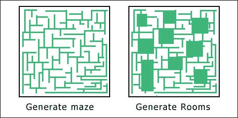

## 改变我们看待迷宫的方式

在我们编写任何代码之前，我们将对项目进行一些更改，以便我们可以轻松地看到整个关卡。目前，视图是放大的，并且光线挡住了关卡。我们希望在处理算法时能够看到整个迷宫。所以让我们做一些改变。

我们要做的第一件事是禁用主游戏视图，而是使用**UI**视图来绘制所有东西。**Game**视图以原始大小的两倍绘制所有东西，而 UI 视图以 1:1 的比例绘制东西。通过禁用对**Game**视图的更改，我们将看到更多的关卡。

更新以下代码：

```cpp
case GAME_STATE::PLAYING:
{
  // Set the main game view.
  //m_window.setView(m_views[static_cast<int>(VIEW::MAIN)]);
```

我们在这里所做的一切就是注释掉了设置主游戏视图的那一行。现在让我们对负责在关卡中绘制光线的代码做同样的操作：

```cpp
// Draw level light.
//for (const sf::Sprite& sprite : m_lightGrid)
//{
//  m_window.draw(sprite);
//}
```

这两个改变大大改变了关卡的外观，将帮助我们在工作时看到迷宫：

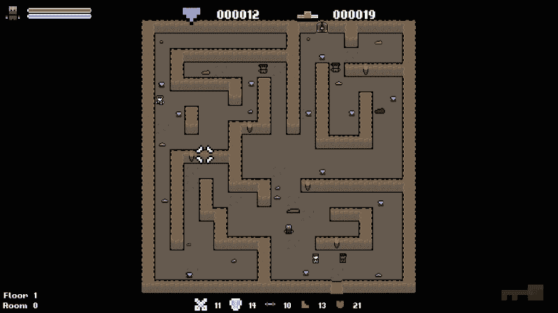

## 更新游戏和关卡类

在我们开始实现迷宫生成器之前，我们需要定义一些我们将要使用的函数。首先，我们的关卡目前是从`Level::LoadLevelFromFile`函数中加载的。我们需要为新代码创建一个合适的函数。让我们删除`Level::LoadLevelFromFile`函数，并在`Level.h`中加入以下代码：

```cpp
public:
/**
 * Generates a random level.
 */
void GenerateLevel();
```

我们将需要在`Game`类中添加一个类似的函数，它将封装所有生成随机关卡的代码，因此请确保您也在`Game.h`中添加相同的函数声明。我们有一些与生成关卡相关的函数，所有这些函数都可以封装在这个函数中。我们需要添加以下内容：

+   调用`Level::GenerateLevel`：这使得在关卡中放置钥匙成为可能

+   调用`Game::PopulateLevel`：这有助于生成一个随机的关卡目标

注意其中一个项目是向级别添加一个钥匙。该项目已经存在于我们的解决方案中，所有支持代码也都存在，因此我们很快就能够在级别中生成一个。

让我们把这个函数添加到`Game.cpp`中：

```cpp
// Generates a new level.
void Game::GenerateLevel()
{
  // Generate a new level.
  m_level.GenerateLevel();

  // Add a key to the level.
  SpawnItem(ITEM::KEY);

  // Populate the level with items.
  PopulateLevel();

  // 1 in 3 change of creating a level goal.
  if (((std::rand() % 3) == 0) && (!m_activeGoal))
  {
    GenerateLevelGoal();
  }
}
```

我们在第八章*程序行为和机制*中创建了`Goal::GenerateLevelGoal`函数。因此，这就是我们实际实现它的地方。每次生成新的关卡时，我们都有三分之一的机会生成一个目标，如果当前没有活动的目标的话。

既然我们现在有了能够随机生成我们的关卡的函数，并且已经添加了钥匙，让我们快速添加代码，以便在玩家到达门时生成新的关卡。我们已经准备好了 if 语句，我们只需要添加行为：

```cpp
. . .

if (playerTile.type == TILE::WALL_DOOR_UNLOCKED)
{
	// Clear all current items.
	m_items.clear();

	// Clear all current enemies.
	m_enemies.clear();

	// Generate a new room.
	GenerateLevel();

	// Set the key as not collected.
	m_keyUiSprite->setColor(sf::Color(255, 255, 255, 60));
}

. . .
```

现在这个已经完成了，我们唯一剩下的事情就是调用我们的`Game::GenerateLevel`函数，而不是我们已经弃用的`Level::LoadLevelFromFile`，并删除设置玩家位置和调用`Game::PopulateLevel`的代码。我们的新的`Game::GenerateLevel`函数将处理所有这些。让我们更新`Game::Initialize`中的以下代码：

```cpp
// Load the level.
//m_level.LoadLevelFromFile("../resources/data/level_data.txt");

// Set the position of the player.
//m_player.SetPosition(sf::Vector2f(1155.f, 940.f));

// Populate level.
//PopulateLevel();

// Generate a level.
GenerateLevel();
```

现在代码已经更新，我们现在可以把注意力转向地牢生成算法。

## 生成迷宫

创建随机地牢的第一阶段是在整个游戏区域生成一个迷宫。我们已经介绍了我们将使用的递归回溯方法。但是，我们需要在此之前做一些准备工作。

### 生成迷宫之前的准备

递归回溯算法通过在两个节点之间建立通道来工作。鉴于此，我们需要迷宫处于这样的位置，即网格中的所有节点都被墙壁包围，也就是说，看起来像这样：

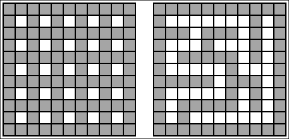

阴影方块代表墙砖，空白方块代表地板空间。您将在左侧网格中看到每个地板砖都被四面墙壁包围。右侧的砖块显示了算法运行后网格的样子，打破这些墙壁以创建路径。我们的任务是使网格看起来像左侧的那个！

当您查看左侧的网格时，您会发现所有阴影砖块都具有奇数索引；只有具有偶数列和行索引的砖块是空白的。这样很容易创建这个网格。我们需要循环遍历所有砖块，如果两个索引都是偶数，我们就留下空白。否则，我们将其转换为墙砖。

让我们开始定义`Level::GenerateLevel`函数，通过实现这个来开始：

```cpp
// Generates a random level.
void Level::GenerateLevel()
{
    // Create the initial grid pattern.
    for (int i = 0; i < GRID_WIDTH; ++i)
    {
        for (int j = 0; j < GRID_HEIGHT; ++j)
        {
            if ((i % 2 != 0) && (j % 2 != 0))
            {
                // Odd tiles, nothing.
                m_grid[i][j].type = TILE::EMPTY;
            }
            else
            {
                m_grid[i][j].type = TILE::WALL_TOP;
                m_grid[i][j].sprite.setTexture(TextureManager::GetTexture(m_textureIDs[static_cast<int>(TILE::WALL_TOP)]));
            }
            // Set the position.
            m_grid[i][j].sprite.setPosition(m_origin.x + (TILE_SIZE * i), m_origin.y + (TILE_SIZE * j));
        }
    }
}
```

在运行游戏之前，我们需要快速禁用任何使用级别网格的代码。这包括我们对`Game::PopulateLevel`的调用以及在`Game::GenerateLevel`中放置钥匙。还包括在`Game::Initialize`中对`Game::SpawnRandomTiles`的调用。这些函数依赖于级别网格的设置，但现在还没有设置！如果不禁用这些，游戏将因为寻找地板瓦片而挂起！完成后我们会重新启用它们。

如果现在运行游戏，您将看到我们有一个看起来像左侧图像的网格。第一步完成了！

下面的截图显示了我们现在运行游戏时的结果：

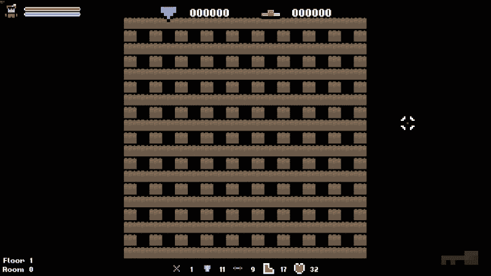

### 开辟通道

现在，棋盘格模式已经创建，是时候实现算法的主体部分了。以下是递归回溯算法的工作原理的提醒：

1.  选择一个随机方向，并与相邻节点建立连接（如果尚未访问）。这个节点成为当前节点（递归调用）。

1.  如果每个方向的所有相邻单元格都已经被访问过，则返回到上一个单元格（从先前的递归调用返回）。

1.  如果回到起始节点，则算法完成。

我们知道这个算法是递归的，所以让我们从声明包含算法的函数开始。由于这个函数将在两个节点之间创建路径，我们将把它称为`CreatePath`：

```cpp
private:
/**
 * Creates a path between two nodes in the recursive backtracker algorithm.
 */
void CreatePath(int columnIndex, int rowIndex);
```

从算法分解的第一个点开始，我们需要识别我们正在处理的节点并选择一个随机方向。获取正确的节点很容易，为了选择一个随机方向，我们将使用一个数组。我们可以定义一个`sf::vector2i`数组，定义所有可能的方向。例如，`{-2, 0}`将表示向左移动一个瓷砖，因为我们将把列索引减 2。

记住，由于棋盘格的模式，我们必须每次移动两个瓷砖。直接相邻的瓷砖是一堵墙，所以我们需要再走一步才能到达我们想要处理的瓷砖。然后我们需要打乱方向数组，这样算法就不会倾向于任何一个特定的方向。例如，如果我们不这样做，它将总是首先检查北方，导致很多向北的通道！

让我们开始定义`Level::CreatePath`函数，将以下内容添加到`Level.cpp`中：

```cpp
// Create a path between two tiles in the level grid.
void Level::CreatePath(int columnIndex, int rowIndex)
{
  // Store the current tile.
  Tile* currentTile = &m_grid[columnIndex][rowIndex];

  // Create a list of possible directions and sort randomly.
  sf::Vector2i directions[] = { { 0, -2 }, { 2, 0 }, { 0, 2 }, { -2, 0 } };
  std::random_shuffle(std::begin(directions), std::end(directions));
```

接下来，我们遍历这些方向，并检查是否可以找到任何尚未被访问的有效瓷砖。如果一个瓷砖存在于网格中，并且你可以根据它是否为空来判断它是否已经被访问。

让我们通过将以下代码附加到打开函数的定义来添加这个功能：

```cpp
// For each direction.
for (int i = 0; i < 4; ++i)
{
  // Get the new tile position.
  int dx = currentTile->columnIndex + directions[i].x;
  int dy = currentTile->rowIndex + directions[i].y;

  // If the tile is valid.
  if (TileIsValid(dx, dy))
  {
    // Store the tile.
    Tile* tile = &m_grid[dx][dy];

    // If the tile has not yet been visited.
    if (tile->type == TILE::EMPTY)
    {
```

如果代码到达这一点，我们知道我们正在看一个新的瓷砖，因为它既有效又当前为空。为了创建到它的路径，我们需要拆掉我们之间的墙，并将墙和我们的新瓷砖都改为地板瓷砖。现在我们再次调用`Level::CreatPath`，传递新瓷砖的索引作为参数。递归就发生在这里，算法继续前进。

让我们完成函数的定义，使用以下代码来实现这一点：

```cpp
  // Mark the tile as floor.
  tile->type = TILE::FLOOR;
  tile->sprite.setTexture(TextureManager::GetTexture(m_textureIDs[static_cast<int>(TILE::FLOOR)]));

  // Knock that wall down.
  int ddx = currentTile->columnIndex + (directions[i].x / 2);
  int ddy = currentTile->rowIndex + (directions[i].y / 2);

  Tile* wall = &m_grid[ddx][ddy];
  wall->type = TILE::FLOOR;
  wall->sprite.setTexture(TextureManager::GetTexture(m_textureIDs[static_cast<int>(TILE::FLOOR)]));

  // Recursively call the function with the new tile.
  CreatePath(dx, dy);
}}}}
```

让我们明确一下这里到底发生了什么。每当识别到一个空瓷砖时，就会对`Level::CarvePath`进行递归调用，并传递该瓷砖的索引。当它这样做时，它会通过关卡，逐渐深入递归。

当所有方向都被检查并且没有有效的瓷砖时，`Level::CreatePath`的当前调用将返回，允许上一次调用检查其剩余的方向。随着这个过程的继续，算法会沿着路径返回，直到它到达起始节点，此时节点已经被访问。

希望函数中的注释清楚地说明了哪一部分在做什么。现在这一步完成后，我们现在可以在`Level::GenerateLevel`函数中调用它，就在我们设置网格之后：

```cpp
// Generates a random level.
void Level::GenerateLevel()
{
  // Create the initial grid pattern.
  for (int i = 0; i < GRID_WIDTH; ++i)
  {

 // Make the first call to CarvePassage, starting the recursive backtracker algorithm.
 CreatePath(1, 1);
}
```

让我们再次编译项目，看看我们有什么：

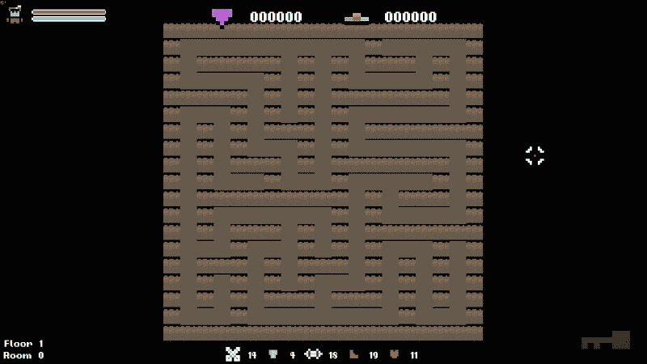

我们有迷宫了！对于一些游戏来说，这已经足够了，但我们不想要所有的单瓷砖路径。我们想要更多的开放区域，这样我们就可以与敌人战斗！你还会看到瓷砖精灵看起来非常奇怪。现在不要担心它，我们一旦添加了房间就会修复它！

## 添加房间

之前，我们学到了添加房间是一个简单的任务。现在我们可以亲自看到这一点。我们的目标是添加一些开放区域，最简单的方法是选择一些随机位置，并将周围的瓷砖转换为地板瓷砖。为了保持`Level`类的整洁，我们将把这种行为包含在它自己的函数中。在`Level.h`中添加以下函数声明：

`private`：

```cpp
/**
 * Adds a given number of randomly sized rooms to the level to create some open space.
 */
void CreateRooms(int roomCount);
```

在我们不断努力编写通用和可扩展的代码的过程中，我们添加了一个参数来表示我们想要创建多少个房间，这样我们可以随意变化它。

让我们直接开始定义这个函数。首先，我们需要一个循环，每次迭代都要添加一个我们希望添加的房间。在`Level.cpp`中添加以下方法定义：

```cpp
// Adds a given number of randomly sized rooms to the level to create some open space.
void Level::CreateRooms(int roomCount)
{
  for (int i = 0; i < roomCount; ++i)
  {
```

现在我们可以创建我们的房间了。第一个任务是决定我们想要它们有多大。通过尝试算法，我发现拥有更多数量的较小房间效果很好。和往常一样，我们将通过使房间的大小落在一个随机范围内来增加一些随机性：

```cpp
// Generate a room size.
int roomWidth = std::rand() % 2 + 1;
int roomHeight = std::rand() % 2 + 1;
```

这将生成宽度和高度为 1 或 2 的房间。我知道这听起来很小，但相信我。它确实非常有效！

接下来，我们需要为这个房间在关卡中选择一个位置。我们将选择一个随机点并围绕它建造房间。为此，我们需要生成一个随机瓷砖索引，然后创建嵌套的`for`循环来迭代 2D 数组，从而描述房间：

```cpp
// Choose a random starting location.
int startI = std::rand() % (GRID_WIDTH - 2) + 1;
int startY = std::rand() % (GRID_HEIGHT - 2) + 1;

for (int j = -1; j < roomWidth; ++j)
{
  for (int z = -1; z < roomHeight; ++z)
  {
```

在生成起始位置时，你可以看到我们小心翼翼地没有包括任何方向上的外边缘。这些是关卡的挡墙，应该保持不变。

函数的最后部分现在只涉及将房间瓷砖变成地板瓷砖。首先，我们通过调用`Level::TileIsValid`来检查我们是否超出了边界。然后，我们确保新的标题不位于网格的外边缘；外部行/列都应该是墙，以限制关卡。如果这两个条件都满足，我们可以使用以下代码将其变成地板块：

```cpp
int newI = startI + j;
int newY = startY + z;

// Check if the tile is valid.
if (TileIsValid(newI, newY))
{
  // Check if the tile is not on an outer wall.
  if ((newI != 0) && (newI != (GRID_WIDTH - 1)) && (newY != 0) && (newY != (GRID_HEIGHT - 1)))
  {
    m_grid[newI][newY].type = TILE::FLOOR;
    m_grid[newI][newY].sprite.setTexture(TextureManager::GetTexture(m_textureIDs[static_cast<int>(TILE::FLOOR)]));
  }
}}}}}
```

现在是时候调用这个函数了。目前在`Level::GenerateLevel`中，我们设置了我们的网格，然后进行了第一次调用`Level::CreatePath`来启动递归算法。当这个初始调用返回时，我们知道迷宫已经完全生成。在这个阶段，我们将创建房间。

让我们在第一次调用`Level::CreatePath`之后立即追加一个对新的`Level::CreateRooms`函数的调用：

```cpp
. . .

// Make the first call to CarvePassage, starting the recursive backtracker algorithm.
CreatePath(1, 1);

// Add some rooms to the level to create some open space.
CreateRooms(10);

```

现在是时候进行另一个构建，这样我们就可以看到我们的工作。希望现在我们的关卡中有一个随机的迷宫，以及一些更大的开放区域，可以让玩家更自由地战斗：

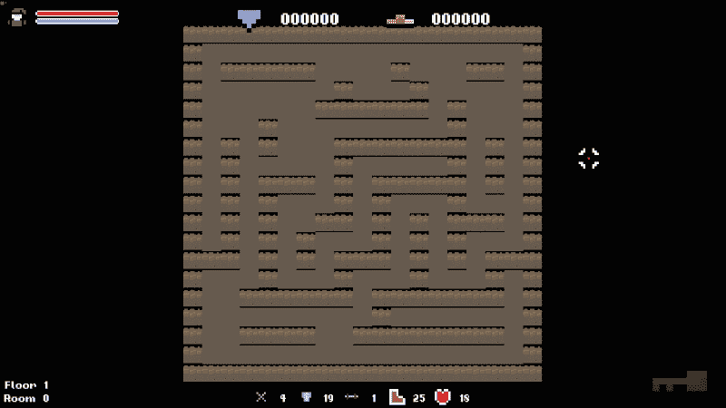

# 选择瓷砖纹理

到目前为止，我们一直在从文本文件中加载一个预构建的关卡。这个关卡文件已经知道需要使用哪些纹理以及它们应该被使用的位置，但由于我们现在是通过程序生成它们，情况就不一样了。我们需要决定哪些瓷砖应该有哪些精灵。

## if/else 方法

这种方法的常见方式就是简单地创建一个庞大的`if/else`语句。原则上，这是一个简单的任务；通过一系列的`if`语句来定义每个瓷砖并设置正确的瓷砖。然而，在现实中，你最终会得到一堆复杂的代码，非常难以阅读。

想象一种情况，你有一个包含五十种可能变体的瓷砖集。为了选择哪个瓷砖放在哪里，需要的代码量将是疯狂的。幸运的是，这个问题有一个更简单的解决方案，这是我最喜欢的一个优雅解决问题的例子。 

## 位运算瓷砖地图

在我们的游戏中，我们关注四个方向，即上、下、左和右。因此，当我们需要计算瓷砖纹理时，我们只需要在这四个方向上进行检查：

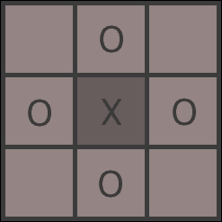

在前面的图表中，你可以看到标有 0 的瓷砖是用来确定给瓷砖 X 的纹理的。这就是优雅解决方案的地方。如果我们从顶部瓷砖开始，从最低有效位开始计数，将瓷砖读入二进制数，我们得到 4 位二进制数，0000。如果瓷砖是墙，我们将相应的位设置为 1。如果瓷砖是地板，我们将其保持为 0。

如果我们将这个应用到围绕瓷砖 X 的四个可能的瓷砖位置，我们可以计算每个瓷砖的值：

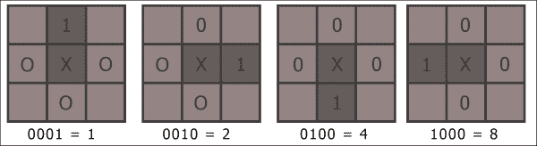

希望这张图能让事情更清晰。从顶部瓷砖开始，顺时针阅读，我们将瓷砖的值输入到一个位整数中，从最不重要的数字到最重要的数字。这使得周围每个瓷砖都有一个不同的值，我们可以通过以下图像来可视化这一点：

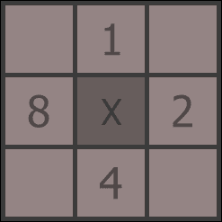

## 计算瓷砖的值

在决定我们需要的瓷砖纹理时，我们评估了围绕目标瓷砖的瓷砖，并在有墙壁的地方存储了我们在前面图像中识别出的值。一个真实的例子将帮助你可视化这个过程。假设我们需要找到瓷砖 X 的正确纹理：

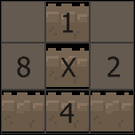

在这种情况下，瓷砖的值将按以下方式计算：

1 + 4 = 5

使用这种方法，X 的每种可能的瓷砖方向都通过一个从 0 到 15 的唯一值表示。如此优雅简单！

## 将瓷砖值映射到纹理

这个谜题的最后一块是将这些值映射到纹理上。在`Util.h`中，你会看到以下枚举器定义了所有类型：

```cpp
// Tiles.
enum class TILE {
  WALL_SINGLE,
  WALL_TOP_END,
  WALL_SIDE_RIGHT_END,
  WALL_BOTTOM_LEFT,
  WALL_BOTTOM_END,
  WALL_SIDE,
  WALL_TOP_LEFT,
  WALL_SIDE_LEFT_T,
  WALL_SIDE_LEFT_END,
  WALL_BOTTOM_RIGHT,
  WALL_TOP,
  WALL_BOTTOM_T,
  WALL_TOP_RIGHT,
  WALL_SIDE_RIGHT_T,
  WALL_TOP_T,
  WALL_INTERSECTION,
  WALL_DOOR_LOCKED,
  WALL_DOOR_UNLOCKED,
  WALL_ENTRANCE,
  FLOOR,
  FLOOR_ALT,
  EMPTY,
  COUNT
};
```

虽然这些瓷砖的顺序可能看起来有些随机，但它们实际上是按照非常特定的顺序排列的。枚举器从 0 开始计数。因此，我们可以看到第一个值`WALL_SINGLE`的值为 0。回到我们的图表，我们可以看到这是正确的，因为这就是我们在没有周围瓷砖的情况下需要的纹理。

再举一个随机的例子，`WALL_TOP`值为 10。如果我们看一下网格，这意味着目标瓷砖的右侧和左侧的瓷砖都是墙。2 + 8 = 10。没错！对于所有可能的瓷砖，我计算出了它们的位掩码值，并确保它们的枚举器值匹配。

## 计算瓷砖纹理

让我们在项目中实现这个。首先，我们将在我们的`Level`头文件中声明一个函数，我们可以将这个行为封装起来：

```cpp
/**
 * Calculates the correct texture for each tile in the level.
 */
void CalculateTextures();
```

对于函数的主体，我们希望首先迭代所有的瓷砖，识别哪些是墙。正是这些瓷砖需要计算正确的纹理：

```cpp
// Calculates the correct texture for each tile in the level.
void Level::CalculateTextures()
{
  // For each tile in the grid.
  for (int i = 0; i < GRID_WIDTH; ++i)
  {
    for (int j = 0; j < GRID_HEIGHT; ++j)
    {
      // Check that the tile is a wall block.
      if (IsWall(i, j))
      {
        // Calculate bit mask.
        int value = 0;

        // Store the current type as default.
        TILE type = m_grid[i][j].type;
```

现在我们看看我们周围的瓷砖，使用我们之前计算的值，来得出瓷砖的最终值。我们按顺序检查每个瓷砖，再次从顶部开始，顺时针旋转，并根据适当的数量增加值，如果那里有墙的话：

```cpp
// Top.
if (IsWall(i, j - 1))
{
  value += 1;
}

// Right.
if (IsWall(i + 1, j))
{
  value += 2;
}

// Bottom.
if (IsWall(i, j + 1))
{
  value += 4;
}

// Left.
if (IsWall(i - 1, j))
{
  value += 8;
}
```

在这个阶段剩下的就是为瓷砖分配正确的纹理和 ID。我们之前讨论过如何设置枚举器，表示瓷砖类型与这个值直接对应，所以我们可以简单地使用纹理值作为瓷砖类型和纹理的索引：

```cpp
// Set the new type.
m_grid[i][j].type = static_cast<TILE>(value);
m_grid[i][j].sprite.setTexture(TextureManager::GetTexture(m_textureIDs[value]));
}}}}
```

有了这个函数就完成了。最后一步是确保我们在`Level::GenerateLevel`函数中添加一个调用，就在我们生成了房间之后，如下所示：

```cpp
  . . .
  // Add some rooms to the level to create some open space.
  CreateRooms(10);

 // Finally, give each tile the correct texture.
 CalculateTextures();
}
```

让我们不浪费任何时间，开始构建我们的游戏：

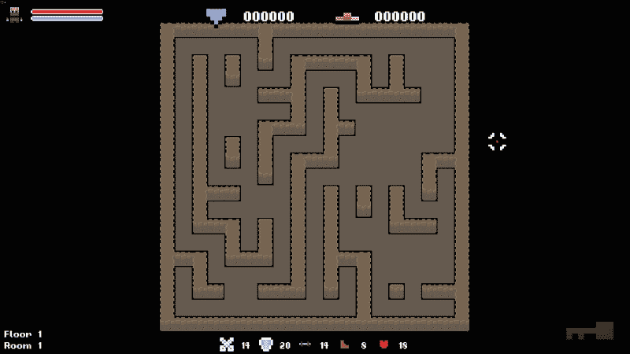

看起来多棒啊！多次运行它，看看生成的不同迷宫。我们生成一个迷宫，雕刻一些更大的区域，并解决纹理。程序生成的地牢。虽然这很棒，但我们可以做得更好。我们的迷宫缺乏特色和个性。所以让我们为环境引入一些审美的变化。

## 创建独特的地板主题

在第六章中，*程序生成艺术*，我们花了一些时间研究程序生成精灵。我们还创建了一个名为`Level::SetColor`的函数，它允许我们为地牢中的所有瓷砖设置覆盖颜色。让我们利用这一点，为地牢的每一层创建独特的感觉。

让我们创建每个都有独特审美的不同地板。每 5 层我们可以生成一个新的随机颜色，并将其应用到我们的地牢。我们的`Level`类已经有了以下变量：

```cpp
/**
 * The floor number that the player is currently on.
 */
int m_floorNumber;

/**
 * The room number that the player is currently in.
 */
int m_roomNumber;
```

我们可以使用这些来跟踪我们生成了多少个房间，以及何时应该更改效果。首先，我们必须跟踪我们在哪个楼层和房间。在`Level::GenerateLevel`函数的末尾，我们将首先递增`m_roomNumber`变量。当它为`5`时，我们可以递增`m_floorNumber`并生成一个新的颜色叠加；不要忘记重置房间计数器：

```cpp
    . . .

    // Calculate the correct texture for each tile.
    CalculateTextures();

 // Increment our room/floor count and generate new effect if necessary.
 m_roomNumber++;

 // Move to next floor.
 if (m_roomNumber == 5)
 {
 m_roomNumber = 0;
 m_floorNumber++;
 }
}
```

正如我们在第六章中学到的，*程序生成艺术*，要生成新颜色，我们需要生成三个介于 0 和 255 之间的随机值。这些值是组成颜色的红色、绿色和蓝色通道。第四个值是 alpha，表示精灵的透明度。

重要的是要记住，如果我们生成接近 0 的颜色值，我们将得到白色，如果我们在另一端走得太远，颜色将会太暗。因此，我们不会在 0 到 255 的范围内生成任何数字，而是略微限制，以便我们始终获得可用的颜色。alpha 值将每次设置为 255，因为我们不希望任何瓦片是透明的。

我们将生成一个随机颜色，然后调用`Level::SetColor`，将新生成的值传递给它。这将赋予关卡独特的美学：

```cpp
// Increment our room/floor count and generate new effect if necessary.
m_roomNumber++;

if (m_roomNumber == 5)
{
  // Move to next floor.
  m_roomNumber = 0;
  m_floorNumber++;

 // Generate a random color and apply it to the level tiles.
 sf::Uint8 r = std::rand() % 101 + 100;
 sf::Uint8 g = std::rand() % 101 + 100;
 sf::Uint8 b = std::rand() % 101 + 100;

 SetColor(sf::Color(r, g, b, 255));
}
```

### 提示

这是我们第二次想要生成随机颜色。鉴于此，将其抽象为自己的函数可能是一个不错的选择。作为一个简短的练习，将此代码抽象为自己的函数，并相应地更新游戏代码。

在我们运行游戏并查看结果之前，我们需要再做一些更改。当前，随机关卡颜色仅在我们第一次移动楼层时设置。我们需要在生成关卡时执行相同的代码。我们可以在关卡的构造函数中执行此操作。让我们简单地将以下代码附加到`Level::Level`中：

```cpp
. . .

// Store the column and row information for each node.
for (int i = 0; i < GRID_WIDTH; ++i)
{
    for (int j = 0; j < GRID_HEIGHT; ++j)
    {
        auto cell = &m_grid[i][j];
        cell->columnIndex = i;
        cell->rowIndex = j;
    }
}

// Generate a random color and apply it to the level tiles.
sf::Uint8 r = std::rand() % 101 + 100;
sf::Uint8 g = std::rand() % 101 + 100;
sf::Uint8 b = std::rand() % 101 + 100;

SetColor(sf::Color(r, g, b, 255));

```

现在我们准备再次运行游戏。我们可以看到当我们的关卡是随机颜色时，当我们通过 5 个关卡时，我们知道这种颜色将会改变！

让我们运行游戏，看看它的表现：

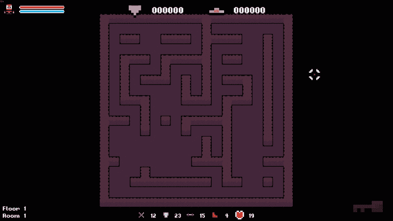

## 添加入口和出口点

由于我们不再从预定义的关卡数据中加载关卡，我们需要为每个房间计算有效的入口和出口点。由于整个关卡是一个迷宫，我们可以在迷宫底部随机生成一个入口点，并使玩家的目标是找到顶部的出口。多个通道和死胡同将使玩家不断搜索！

我们已经在我们的墙枚举器中定义了这些瓦片，所以只需在关卡中找到它们的位置。和往常一样，我们将首先声明一个函数，其中将包含此行为。将执行单个任务的代码块封装在函数中总是一个好主意。这不仅使行为和责任清晰，还使代码更具可重用性。

让我们在`Level.h`中声明以下函数：

```cpp
private:
/**
 * Generates an entry and exit point for the given level.
 */
void GenerateEntryExit();
```

现在，对于方法体，我们希望首先确定适合的起始和结束瓦片的索引。由于我们将在顶部和底部行放置瓦片，因此我们只需要生成一个索引，即列。行的索引分别为 0 和`GRID_HEIGHT-1`。

为此，我们将随机选择一个列索引，并检查该位置是否适合作为入口节点。对于入口节点，我们需要确保上方没有瓦片。同样，对于出口节点，我们需要确保下方没有东西：

```cpp
// Generates an entry and exit point for the given level.
void Level::GenerateEntryExit()
{
  // Calculates new start and end locations within the level.
  int startI, endI;
  startI = endI = -1;

  while (startI == -1)
  {
    int index = std::rand() % GRID_WIDTH;

    if (m_grid[index][GRID_HEIGHT - 1].type == TILE::WALL_TOP)
    {
      startI = index;
    }
  }

  while (endI == -1)
  {
    int index = std::rand() % GRID_HEIGHT;

    if (m_grid[index][0].type == TILE::WALL_TOP)
    {
      endI = index;
    }
}
```

### 提示

像这样使用`while`循环需要极度谨慎。如果不存在有效的瓦片，程序将挂起并崩溃。在这种情况下，由于算法的工作方式，我们可以确保始终存在有效的瓦片。

现在我们已经确定了起点和终点节点，剩下的就是将节点设置为正确类型的瓦片。入口节点需要设置为`TILE::WALL_ENTRANCE`，出口节点必须设置为`TILE::WALL_DOOR_LOCKED`，如下所示：

```cpp
  // Set the tile textures for the entrance and exit tiles.
  SetTile(startI, GRID_HEIGHT - 1, TILE::WALL_ENTRANCE);
  SetTile(endI, 0, TILE::WALL_DOOR_LOCKED);
}
```

现在这个函数已经完成，我们只需要在生成关卡后调用它。我们将在`Level::GenreateLevel`函数的末尾调用它，就在我们计算纹理之后：

```cpp
    . . .

        // Generate a random color and apply it to the level tiles.
        sf::Uint8 r = std::rand() % 101 + 100;
        sf::Uint8 g = std::rand() % 101 + 100;
        sf::Uint8 b = std::rand() % 101 + 100;

        SetColor(sf::Color(r, g, b, 255));
    }

 // Add entrance and exit tiles to the level.
 GenerateEntryExit();
}
```

## 设置玩家的生成位置

现在我们已经确定了入口和出口节点，我们需要相应地移动我们的玩家。生成起始节点的代码位于 level 类中，所以我们需要添加一个函数来返回这个起始位置。我们可以在游戏类中生成入口和出口节点，但这样设计很差。最好将代码放在它应该放置的地方，并创建`getter`和`setter`方法来访问它。

然而，在我们返回生成位置之前，我们实际上需要计算它！为了这样做，我们需要知道入口节点在哪里。一旦`Level::GenerateEntryExit`函数返回了这些信息，它就丢失了。我们可以遍历瓦片的底部行来找到它，但那样效率低下。相反，我们将在`Level`类中创建一个变量来保存这些信息，并在`Level::GenerateEntryExit`中计算生成位置。

让我们首先在`Level.h`中声明这些变量，如下所示：

```cpp
/**
 * The spawn location for the current level.
 */
sf::Vector2f m_spawnLocation;
```

现在，我们知道每个关卡的入口都会在底部的某个地方。这意味着要计算生成位置，我们只需要找到正好在上面的瓦片的绝对位置。`Level`类已经有一个函数来获取瓦片的绝对位置，所以只需要调用一次该函数并传递正确的瓦片即可。

当我们在这里时，我们需要偷偷加入一点类似的代码。我们需要存储新出口的位置，以便`Level::UnlockDoor`函数知道要更改哪个瓦片。`Level`类已经有了这个信息的变量，所以我们将偷偷加入一个简单的一行代码。

让我们将这个行为追加到`Level::GenerateEntryExit`函数的末尾，如下所示：

```cpp
  // Set the tile textures for the entrance and exit tiles.
  SetTile(startI, GRID_HEIGHT - 1, TILE::WALL_ENTRANCE);
  SetTile(endI, 0, TILE::WALL_DOOR_LOCKED);

 // Save the location of the exit door.
 m_doorTileIndices = sf::Vector2i(endI, 0);

 // Calculate the spawn location.
 m_spawnLocation = GetActualTileLocation(startI, GRID_HEIGHT - 2);
}
```

现在我们只需要一个非常简单的`getter`函数来返回玩家的生成位置，不要忘记声明：

```cpp
// Returns the spawn location for the current level.
sf::Vector2f Level::SpawnLocation()
{
  return m_spawnLocation;
}
```

现在是时候将这个生成位置应用到玩家身上了。`Game::GenerateLevel`是我们生成关卡的函数，所以我们将在这里设置玩家的位置。在调用`Level::GenerateLevel`之后，我们可以获取生成位置，知道它将被更新，并将这个值作为玩家的位置。

我们现在也可以取消注释生成钥匙的代码，我们对`Game::PopulateLevel`的调用，以及我们对`Game::SpawnRandomTiles`的调用。现在我们的关卡已经设置好了，这些函数将按预期工作。让我们取消注释那些代码，并更新`Game::GenerateLevel`如下：

```cpp
// Generates a new level.
void Game::GenerateLevel()
{
  // Generate a new level.
  m_level.GenerateLevel();

  // Add a key to the level.
  SpawnItem(ITEM::KEY);

  // Populate the level with items.
  PopulateLevel();

  // 1 in 3 change of creating a level goal.
  if (((std::rand() % 3) == 0) && (!m_activeGoal))
  {
    GenerateLevelGoal();
  }

 // Moves the player to the start.
 m_player.SetPosition(m_level.SpawnLocation());
}
```

是时候测试代码了。现在当我们运行游戏时，我们应该不仅能看到一个看起来很棒的迷宫，还能看到底部有一个入口，我们的玩家直接在上面，顶部有一个出口：

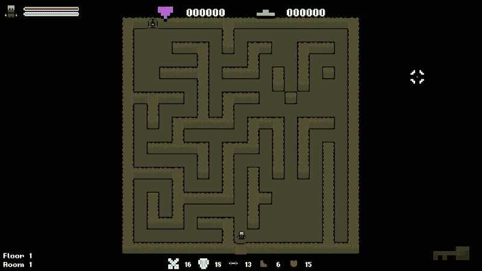

## 撤销调试更改

我们的地牢生成工作现在已经完成了！让我们快速撤销我们对代码所做的调试更改。我们需要取消注释启用游戏视图和照明代码的行；这两行都在`Game::Draw`函数中：

```cpp
. . .

case GAME_STATE::Playing:
{
  // Set the main game view.
  //m_window.setView(m_views[static_cast<int>(VIEW::MAIN)]);

 // Set the main game view.
 m_window.setView(m_views[static_cast<int>(VIEW::MAIN)]);

  // Draw level light.
  //for (const sf::Sprite& sprite : m_lightGrid)
  //{
  //  m_window.draw(sprite);
  //}

 // Draw level light.
 for (const sf::Sprite& sprite : m_lightGrid)
 {
 m_window.draw(sprite);
 }

```

### 提示

与其像这样添加或删除调试代码，不如创建一个可以在 DEBUG 模式下切换的`dev`模式。

# 练习

为了帮助你测试本章内容的知识，这里有一些练习题供你练习。它们对于本书的其余部分并不是必要的，但是练习它们将帮助你评估你在所学内容中的优势和劣势：

1.  有许多不同的算法可用于生成迷宫，例如随机的 Prim 算法和 Kruskal 算法。选择其中一个算法，尝试用你自己的实现替换递归回溯实现。

1.  我们使用了相当小的关卡尺寸。尝试增加关卡的大小，并改变生成的关卡的特征。增加房间的数量、它们的大小等等。

1.  你可能已经注意到我们的火炬不见了！因为我们不再从关卡文件中加载关卡，我们需要自己添加它们。火炬应该放置在`TILE::WALL_TOP`类型的瓦片上。尝试自己创建这个函数。如果遇到困难，你可以看看下一章的代码，找到开始的提示。

# 总结

在本章中，我们学习了我们的游戏如何在运行时生成自己的关卡数据，而不是之前从文本文件中加载预定义的关卡数据。这为游戏带来了很高的可重玩性，确保游戏性保持新鲜和具有挑战性。我们还使用了在前几章中定义的函数，为我们的关卡增添更多特色；我们使用了精灵效果为每个楼层创造了独特的感觉。我们的游戏现在几乎所有方面都是程序生成的，我们已经完成了一个完整的 Roguelike 项目。

现在我们的模板项目工作已经完成，我们将在最后一章中来看一下基于组件的设计。程序生成的关键在于灵活性。因此，我们希望使用最灵活的架构。基于组件的架构可以实现这一点。对这种设计方法有很好的理解将有助于您进步并构建更大、更灵活的系统。
