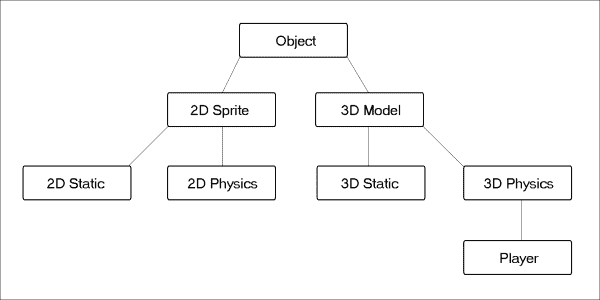
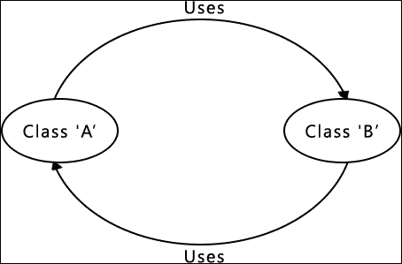
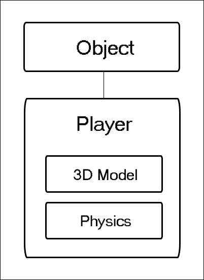
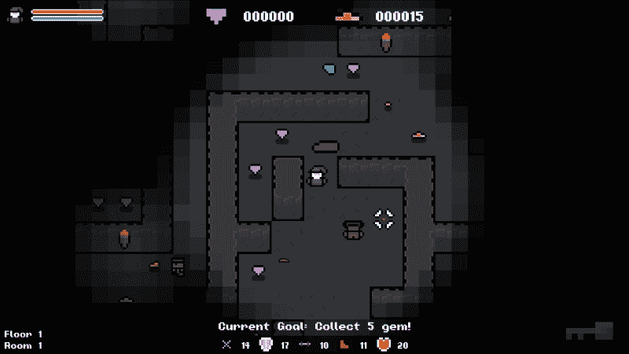
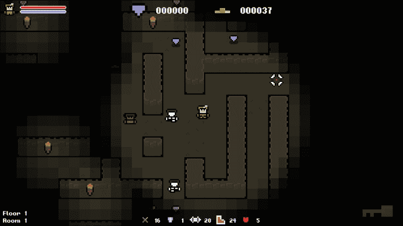

# 第十章：基于组件的架构

过程化游戏系统本质上非常灵活。因此，它们所实现的框架和基础设施需要具有相同的特性。基于组件的系统，如 Unity 游戏引擎，在这方面表现出色，并且通常比传统的基于继承的系统提供更多的灵活性。

在构建像游戏引擎这样的大型动态系统时，传统的基于继承的方法会带来问题。继承结构变得混乱，对象变得越来越大，因为它们需要做更多的事情。结果，行为变得不够封装。基于组件的方法解决了这些问题，因此为了完成我们的工作，我们将稍微分支一下，看看基于组件的系统是什么，为什么它与过程生成相辅相成，以及我们如何改进现有的引擎以从中受益。

在本章中，我们将涵盖以下主题：

+   传统继承方法的问题

+   基于组件的方法的利弊

+   理解基于组件的架构

+   实施基于组件的系统

### 提示

如果你对 Unity 引擎不熟悉，请访问[`unity3d.com/`](https://unity3d.com/)并了解一下。它是行业领先的游戏引擎之一，采用了基于组件的方法。最好的部分是它完全免费！

# 理解基于组件的架构

基于组件的架构，也称为基于组件的设计和模块化编程，是一种旨在将行为分解为简洁、可重用组件的软件设计方法。我们在一定程度上已经在面向对象的设计中做到了这一点，但基于组件的架构将其推向了更深的层次。例如，如果一个对象，如精灵或 3D 模型需要某种行为，它将通过对象拥有的组件来定义，而不是从“基础”类继承而来。

## 传统基于继承的方法的问题

在我们深入讨论基于组件的方法的利弊之前，让我们先看看传统的基于继承的方法带来的问题。正是这些问题我们将要解决。

### 复杂的继承结构

假设我们有一个简单的“玩家”对象，需要一个 3D 模型，并受到游戏物理的影响。让我们看看可能需要创建这个对象的继承结构：



从这个图表中可以看出，即使是这个简单的场景也可能导致复杂的继承结构。如果你现在用整个游戏引擎来替换这个简单的例子，你可以想象继承结构会变得多么复杂和难以管理。

这是传统继承设计的一个主要缺陷；随着系统变得越来越大，对象在继承树中变得越来越复杂和纠缠不清。当我们试图创建一个过程化系统时，这种复杂性并不会帮助我们。我们希望一个尽可能灵活的系统。

### 循环依赖

复杂继承结构可能出现的另一个问题是循环依赖。这是指类 A 依赖于类 B，而类 B 又依赖于类 A，依此类推。下面的图表应该能更清楚地说明这一点：



虽然循环依赖可以通过适当的程序结构来避免，但随着系统变得越来越大，这变得越来越困难。随着继承树的增长，依赖关系也会增加，并且可能在系统内部造成真正的问题。通过消除复杂的继承，我们也消除了混乱依赖的风险。

## 基于组件的架构的好处

作为开发人员，我们总是在权衡利弊。了解一种方法的优缺点是至关重要的，这样我们才能做出关于它是否适合解决方案的知情决定。由于我们已经确定了基于继承的方法存在一些缺陷，并且希望通过基于组件的方法来解决这些问题，让我们熟悉一下它的一些优缺点。

### 避免复杂的继承结构

我们之前确定了一个假设的游戏情况，并看了一下典型的基于继承的方法可能是什么样子。让我们看看如果采用基于组件的方法，同样的例子会是什么样子：



很明显，这个解决方案比基于继承的等价物要简单得多，也更整洁。它不是从父级获取其行为，从而创建一系列依赖关系，而是被分解成简洁的组件，可以简单地附加到一个对象上。

### 代码被分解成高度可重用的块

基于组件的架构的另一个好处是一旦代码封装在组件中，代码的高重用价值。一旦封装，行为可以通过简单地附加组件来轻松赋予对象。这不仅避免了重复的代码，还使得通过组合多个组件轻松构建复杂对象变得容易。这就是它适用于过程生成的地方。我们可以像乐高一样用这些可重用的组件程序地组装对象。

### 易维护和可扩展

由于代码是可重用的，这也使得维护变得非常容易。如果一组对象都从同一个源获取它们的行为，那么只需要进行一次编辑，就会影响它们所有。

基于组件的系统也更容易扩展。由于我们的组件是简洁的单独模块，没有复杂的依赖关系，我们可以随意添加它们。如果我们想要新的行为，我们不必担心诸如“它将放在哪里？”，“它将依赖于什么？”，“它将继承自什么？”等问题。我们只需构建新组件并在需要时使用它。

## 基于组件的架构的缺点

现在是时候看看争论的对立面了。尽管基于组件的设计确实带来了一系列巨大的好处，但也有一些需要考虑的事情。

### 代码可能变得过于分散

在一定程度上，这就是基于组件的设计的目标：将代码分解成可管理的块。但这可能走得太远了。如果对象和功能被分解得太细，那么我们最终会发现代码库散布在数百个小组件中，变得一团糟。永远记住这一点。是的，我们确实希望将我们的代码分解成可管理和可重用的组件；只是不要过度使用！

### 不必要的开销

在前面的基础上，如果代码被分解成太多小组件，那么我们将看到无用的开销增加。如果一个项目包含许多组件，我们将经常发现自己在其中来回进行任务。虽然添加一个组件可能会使代码更易于管理和维护，但在使用时也会引入开销。

### 使用复杂

组件的最终缺点就是它们的使用，因为它可能比传统的对象模型更复杂。我们不是直接访问成员函数，而是必须通过它们所属的组件。如果一个对象中有 20 个组件，那么我们必须记住变量在哪里，需要使用哪个组件。虽然这并不是什么高深的科学，但肯定比拥有直接拥有所有行为和数据的单个对象更复杂。

## 概述

希望现在清楚了基于组件的设计如何比传统的基于继承的方法更有利于过程化设计。过程生成的关键在于灵活性，当系统增长到一定规模时，基于继承的系统可能无法提供这种灵活性。通过允许我们将代码分解为可重用的对象，基于组件的设计保持了代码的灵活性，并且没有依赖性，这样我们就可以随意移动组件。

# 设计组件系统

基于组件的系统可以以多种方式实现。因此，在编写任何代码之前，让我们看看一些可能性。目标是将可重用的行为分解为简洁的组件，并能够轻松地向现有对象添加和删除它们。所有对象共享一个名为对象的公共基类，因此我们将为该类添加向其添加组件和从中删除组件的功能。然后我们可以确保它将传播到项目中所有后续的类中。

有许多实现基于组件的方法的方式，没有单一的正确答案。例如，我们可以创建一个函数来单独添加或删除每个组件。下面是一个例子：

```cpp
bool	AttachSpriteComponent(SpriteComponent spriteCompontent);
bool	AttachInputComponent(InputComponent inputComponent);
```

虽然这将使事情变得简单，但是在类中会有很多重复的代码。而且，每次添加一个组件，我们都需要创建两个匹配的函数：一个用于获取组件，一个用于设置组件。这有点麻烦！

另一种方法是简单地将组件值公开。因此，我们可以直接通过它们所属的对象访问组件，而不是通过函数与组件交互：

```cpp
Object object;
object.spriteComponent = SpriteComponent();
```

尽管这是一个吸引人的选择，因为这会让我们的生活变得简单千百倍，但是公开变量通常不是一个好主意。通常需要将变量公开以使代码工作，这通常表明系统架构存在缺陷。如果你发现这种情况，问题的原因应该得到解决。

如果我们看一个现有的基于组件的游戏引擎，比如 Unity，我们可以看到他们是如何解决这个问题的。以下代码演示了如何从 Unity 对象中获取一个组件。这是直接从 Unity 文档中摘取的：

```cpp
// Disable the spring on the HingeJoint component.
HingeJoint hinge = GetComponent<HingeJoint>();
hinge.useSpring = false;
```

我们可以看到定义了一个名为`GetComponent`的函数，并提供了一个类型来返回相应的组件。我们可以使用枚举器创建一个类似的系统，以表示类型，允许用户通过参数指定组件类型，然后在`switch`语句中使用它来返回正确的变量。假设我们创建了一个`AttachComponent`函数，用以下声明来向对象添加一个组件：

```cpp
void AttachComponent(COMPONENT_TYPE type, Component component);
```

在函数定义中，我们有类似于这样的东西：

```cpp
void Object::AttachComponent(COMPONENT_TYPE type, Component component)
{
    switch (type)
    {
        case SOME_TYPE:
            m_someTypeVariable = component;
        break;
. . .
```

如果用户传递了匹配的类型和组件，这种方法就可以正常工作，但是这并不能保证。例如，用户可以指定一个移动组件，但实际上传递了一个音频组件，这将是不好的！我们将通过模板来解决这个问题！

# C++模板

C++模板允许我们定义与通用类型一起工作的函数和类。这允许函数或类接受任何类型，而且只需要编写一次。这正是我们想要的。我们希望为组件定义一个单一的获取/设置函数，并使用模板使其通用和灵活。

让我们看一个模板的实际例子，以更好地了解它们是如何工作的。

## 使用模板

假设我们需要一个函数来添加两个数字，并且我们希望支持一系列类型。为了实现这一点，我们可以为我们想要支持的每种类型声明一个函数，如下所示：

```cpp
int Add(int value1, int value2)
{
	return value1 + value2;
}

double Add(double value1, double value2)
{
    return value1, value2;
}
```

看看这两个函数，它们唯一不同的是它们的返回和参数类型。如果我们能够说“不用担心类型，我会在后面给你”，然后只有一个函数，那该有多好呀？这就是模板的作用！

## 模板声明

C++模板允许我们定义具有通用类型的函数，并在调用函数时指定类型。这是一个非常有用的功能，可以创建灵活和可重用的代码，而不是有多个几乎相同的函数定义。如果使用模板，前面的例子只需要一个函数：

```cpp
template<typename T>
T Add(T value1, T value2)
{
    T value;
    Value = value1 + value2;
    return value;
}
```

### 注意

模板参数可以使用**typename**或**class**关键字。这两个关键字完全可以互换使用并起到相同的作用。但是，它们可以用作提示来表示参数类型。如果参数是类，则使用**class**，对于所有其他类型（int、char*等），使用**typename**。

以下语法用于声明模板：

```cpp
template<template-parameters> function-declaration;
```

在声明中，我们创建了一个名为`T`的模板参数。这给了我们一个模糊的数据类型，可以在函数声明中使用，直到稍后在调用模板时设置实际类型。通用的`T`类型可以像普通类型一样使用：指定返回类型、创建变量和设置参数类型。

### 提示

模板参数的名称可以是任何你喜欢的，尽管最常见的是**TYPE**或**T**。

模板还可以定义多个类型。例如，假设一个函数需要使用两种不同的数据类型。我们可以使用以下模板：

```cpp
template<typename T1, typename T2>
bool AreEqual(T1 value1, T2 value2)
{
    return value1==value2;
}
```

最后，模板也可以与普通数据类型一起使用，它们不必是模糊的：

```cpp
template<typename T, int I>
T IntegerMultiply(T value1)
{
    return value1 / value2;
}
```

## 使用模板

有了定义的模板，让我们看看如何使用它们。我们给模板指定了模糊的类型，因此调用它们的一种方式是明确告诉模板我们想要使用的类型。这是通过在函数/类调用后的<>括号中传递类型来完成的：

```cpp
float floatValue = Add<float>(1.f, 2.f);
bool isEqual = AreEqual<double, int>(5.0, 5);
int intValue = IntegerMultiply<float, 2>(1.f);
```

前两个是直接的；我们为每个模板参数分配了一个类型。然而，最后一个略有不同。由于第二个类型是固定的，所以不需要在尖括号中指定它。相反，我们可以像普通参数一样使用它，传递我们想要使用的值。这样，括号中只剩下一个参数：通用类型值。

需要注意的重要事情是，模板参数的值是在编译时确定的。这意味着对于模板的每个不同实例化，都会创建一个唯一的函数。在最后的例子中，**int**的值被传递为模板函数，这意味着创建了一个硬编码为乘以值 2 的函数。

假设我们调用了`IntegerMultiple`两次：

```cpp
int intValue = IntegerMultiply<float, 2>(1.f);
int intValue = IntegerMultiply<float, 10>(1.f);
```

尽管我们调用了相同的模板，编译器将创建两个不同版本的`IntegerMultiply`。一个版本将始终乘以 2，另一个版本将始终乘以 10。因此，第二个模板的参数，整数，必须是常量表达式。以下代码将导致编译错误：

```cpp
int a = 10;
int intValue = IntegerMultiply<float, a>(1.f);
```

当编译器可以解析类型时，这些函数也可以在尖括号中不明确表示类型的情况下调用。为了发生这种情况，关于类型的歧义必须不存在。例如，以下调用是可以的：

```cpp
float floatValue = Add(1.f, 2.f);
bool isEqual = AreEqual(5.0, 5);
```

在这些调用中，模板中的每个模糊类型都被赋予一个单一类型。因此，编译器可以自动推断**T**的类型。然而，考虑一种不同的参数传递的情况：

```cpp
float floatValue = Add(1.f, 2);
```

**T**现在有两个可能的值，这意味着编译器无法推断类型，将导致错误。

## 模板特化

现在我们对模板的一般工作原理有了了解，让我们来看看模板特化。我们已经知道可以使用通用类型定义模板，并在调用函数时稍后定义它们。如果所有可能的实现共享相同的行为，那就没问题，但如果我们想要根据类型的不同行为呢？

假设我们想要使用`Add`函数与字符串类型。我们想要传入两个单词，但当这种情况发生时，我们想要在它们之间放一个空格。默认的模板函数无法实现这一点，因此我们必须为这种情况专门设置。要为模板设置专门的内容，我们只需创建一个声明，其中用固定的类型替换模糊的类型，这在我们的情况下是`std::string`：

```cpp
template<>
std::string Add<std::string>(std::string value1, std::string  value2)
{
    std::string result;
    result = value1 + " " + value2;
    return result;
}
```

现在，当调用`template`函数并指定`std::string`类型时，它将使用这个定义而不是通用的定义。有了这个，我们仍然可以使用模板，但为某些类型提供特定的实现。非常方便。

### 提示

如果您想了解更多关于 C++模板的知识，请访问[`www.cplusplus.com/doc/tutorial/templates/`](http://www.cplusplus.com/doc/tutorial/templates/)。这是一个很棒的网站，它对这个主题有一些很棒的信息。

# 函数重载

与模板有些相似，函数重载是我们可以使代码和类更加灵活的另一种方式。在本书的过程中，我们已经使用了重载函数，但它们是由代码库提供的。因此，让我们快速看一下它们。

当我们定义函数时，我们设置了固定的参数类型。这里有一个例子：

```cpp
void DoStuff(T parameter);
```

有了这个定义，我们只能传递`T`类型的参数。如果我们想要选择参数呢？如果我们想要能够传递`T`类型或`Y`类型的参数呢。好吧，我们可以重新定义函数，设置相同的返回类型和名称，但使用唯一的参数：

```cpp
void DoStuff(T parameter);
void DoStuff(Y parameter);
```

现在我们有两个具有不同参数的函数声明。当我们调用`DoStuff`时，我们可以选择传递哪个参数。另外，使用函数重载，每个声明都有自己的函数体，就像模板特化一样。虽然在表面上相似，但函数重载和模板特化的工作方式不同，不过这超出了本书的范围。目前，我们只需要对它们有一个基本的理解，就可以开始了！

### 提示

与模板一样，要了解更多关于函数重载的内容，请访问[`www.cplusplus.com/doc/tutorial/functions2/`](http://www.cplusplus.com/doc/tutorial/functions2/)。

# 创建一个基础组件

理论已经讲解完毕，让我们将其实现到我们的项目中。本章的主要信息迄今为止一直是使用组件来避免混乱的继承，但我们仍然需要*一些*继承，因为我们需要使用多态！

每个对象都能够持有一系列组件，因此我们将它们存储在一个单一的`generic`容器中。为了做到这一点，我们需要利用多态性，确保所有组件都继承自一个共同的基类。现在我们要实现这个基类。

让我们向项目中添加一个新的类，并将其命名为`Component`。我们将把实现留给你来完成`.cpp`：

```cpp
#ifndef COMPONENT_H
#define COMPONENT_H

class Component
{
public:

    /**
    * Default Constructor.
    */
    Component();

    /**
    * Create a virtual function so the class is polymorphic.
    */
    virtual void Update(float timeDelta) {};
};
#endif
```

请注意，我们在这里添加了一个`virtual update`函数，因为一个类必须至少有一个`virtual`函数才能是多态的。有了`Component`基类创建后，我们现在可以添加`get`和`set`组件的函数，它们将驻留在基础`Object`类中，以便所有对象都可以使用它们。

# 组件函数

如果我们考虑我们想要的行为，我们需要能够给一个对象赋予任何给定类型的组件。我们还需要能够稍后获取相同的组件。我们将称这些函数为`AttachComponent`和`GetComponent`。

在本章的前面，我们确定了如何使用模板来创建具有通用类型的函数，并在需要时给它们提供真实值。我们将使用模板和多态性来创建这两个函数。

## 附加组件

我们要编写的第一个函数将用于将给定类型的组件附加到`Object`类。由于我们已经确定要将所有组件存储在单个通用容器中，因此这个函数将是一个相对简单的模板。我们唯一需要注意的是我们不应该添加相同的组件两次！

让我们首先定义容器，因为那是我们将存储对象的地方。由于我们需要利用多态性，我们不能存储实际对象。因此，我们将使用共享指针，以便我们可以轻松地传递它们。

让我们首先在`Object.h`中定义通用容器。不要忘记`#include`我们的新组件类，以便 Object 可以看到它：

```cpp
private:
/**
 * A collection of all components the object has attached.
 */
std::vector<std::shared_ptr<Component>> m_components;
```

现在是实际的`AttachComponent`方法的时候了。我们可以采取一个天真的方法，只是将新组件附加到“通用”容器。问题在于我们可能会添加多个相同类型的组件，这不是我们想要的。在将组件添加到集合之前，我们将首先检查是否已经存在相同类型的组件，为此，我们将使用`std::dynamic_pointer_cast`函数。

这个函数让我们在指针之间进行转换，并在失败时返回空指针。这非常方便，当与模板结合使用时，我们可以创建一个单一的函数，它将接受任何组件类型，创建一个组件，检查是否已经存在相同类型的组件，如果存在，它将覆盖它。我们将在头文件中内联定义这个模板函数。让我们将以下代码添加到`Object.h`中：

```cpp
/**
 * Attaches a component to the object.
 */
template <typename T>
std::shared_ptr<T> AttachComponent()
{
    // First we'll create the component.
    std::shared_ptr<T> newComponent = std::make_shared<T>();

    // Check that we don't already have a component of this type.
    for (std::shared_ptr<Component>& exisitingComponent : m_components)
    {
        if (std::dynamic_pointer_cast<T>(exisitingComponent))
        {
            // If we do replace it.
            exisitingComponent = newComponent;
            return newComponent;
        }
    }

    // The component is the first of its type so add it.
    m_components.push_back(newComponent);

    // Return the new component.
    return newComponent;
};
```

使用模板，我们可以操作通用的`T`类型，这允许我们执行转换以检查类型是否匹配。如果它们匹配，我们用新的组件覆盖旧的组件；如果不匹配，我们只是将其添加到我们的集合中。完成后，如果用户想要，我们还会返回新的组件。

就是这样，使用这种模板的美妙之处在于系统的可扩展性。无论我们添加了 1000 个组件，这个函数都能够将它们附加到任何对象。

## 返回一个组件

我们需要创建的下一个模板是用于返回给定组件的函数。同样，让我们考虑一下我们将在何处需要通用类型。该函数将需要返回组件类型，因此需要是通用的，并且我们还需要找到正确的组件类型。因此，我们将像上一个函数一样在指针转换中使用通用类型。

让我们在`Object`的头文件中定义这个模板：

```cpp
/**
* Gets a component from the object.
*/
template <typename T>
std::shared_ptr<T> GetComponent()
{
    // Check that we don't already have a component of this type.
    for (std::shared_ptr<Component> exisitingComponent : m_components)
    {
        if (std::dynamic_pointer_cast<T>(exisitingComponent))
        {
            return std::dynamic_pointer_cast<T>(exisitingComponent);
        }
    }

    return nullptr;
};
```

有了这个，我们可以将任何组件添加到任何对象并返回正确的类型。最棒的部分是两个简单的函数提供了所有这些功能！模板是多么棒！

如果你想在我们继续之前测试这段代码，你可以这样做。在`Game::Initialize`函数的末尾，添加以下行：

```cpp
m_player.AttachComponent<Component>();
m_player.AttachComponent<Component>();

std::shared_ptr<Component> component = m_player.GetComponent<Component>();
```

如果您使用**断点**并在运行时查看值，您会发现这段代码做了以下几件事情：

+   它向通用容器添加一个新的`Component`对象

+   它试图添加第二个`Component`对象；所以它代替了当前的

+   它意识到我们想要类型为`Component`的组件；所以它返回它

# 创建一个变换组件

有了附加和返回组件的能力，让我们构建并添加我们的第一个组件。我们先从一个简单的开始。目前，所有对象默认都有一个由`Object`基类提供的位置。让我们将这个行为分解成自己的组件。

## 封装变换行为

由于我们正在将基于继承的方法转换为基于组件的方法，第一项任务是将`Object`类中的变换行为取出来。目前，这包括一个“单一”的位置变量和一个既“获取”又“设置”该值的函数。

让我们创建一个名为`TransformComponent`的新类，并将这个行为移到其中，如下所示：

```cpp
#ifndef TRANSFORMCOMPONENT_H
#define TRANSFORMCOMPONENT_H

#include "Component.h"

class TransformComponent : public Component
{
public:
    TransformComponent();
    void SetPosition(sf::Vector2f position);
    sf::Vector2f&  GetPosition();

private:
    sf::Vector2f  m_position;
};
#endif
```

我们还将从`Object.cpp`文件中获取函数定义，并将它们放在`TransformComponent.cpp`中，如下所示：

```cpp
#include "PCH.h"
#include "TransformComponent.h"

TransformComponent::TransformComponent() :
m_position({ 0.f, 0.f })
{
}

void TransformComponent::SetPosition(sf::Vector2f position)
{
    m_position = position;
}

sf::Vector2f& TransformComponent::GetPosition()
{
    return m_position;
}
```

现在我们有一个组件，它将为对象提供一个位置。我们需要做的最后一件事是在`Object`类中包含这个组件的头文件，以便所有扩展类都可以看到它。让我们在`Object.h`中添加以下代码：

```cpp
. . .

#ifndef OBJECT_H
#define OBJECT_H

#include "Component.h"
#include "TransformComponent.h"

class Object
{
public:

. . .
```

现在是时候将这个组件添加到对象中了！这是一个庞大的任务，留给你自己在空闲时间完成，但为了演示如何完成，我们将快速地将组件添加到`player`类中。

## 向玩家添加一个 transform 组件

由于我们将附加和获取组件的两个函数放在了基类`Object`中，我们可以直接从 player 中调用`AttachComponent`。我们将在构造函数中执行此操作，因为我们需要在逻辑之前设置好组件。让我们前往`Player::Player`并将以下代码添加到其中：

```cpp
// Add a transform component.
AttachComponent<TransformComponent>();
```

就是这样！`player`现在拥有我们添加到 transform 组件的所有数据和功能，当我们想要使用它时，我们可以简单地通过这个新组件进行。你可能记得我们曾经将开销标识为基于组件的设计的潜在缺点之一。现在我们可以看到，将行为移入组件中引入了开销。

## 使用 transform 组件

这个谜题的最后一部分将是看看我们如何使用新的组件。以前，如果我们想要获取玩家的位置，我们只需要使用以下代码：

```cpp
// Get the position.
sf::Vector2f playerPos = m_position;

// Set the position.
m_position = sf::Vector2f(100.f, 100.f);
```

由于这些值现在属于`transform`组件，我们需要做一个小改变，并通过`component`来访问这些值，如下所示：

```cpp
// Get the transform component.
auto transformComponent = GetComponent<TransformComponent>();

// Get the position.
sf::Vector2f position = transformComponent->GetPosition();

// Set the position.
transformComponent->SetPosition(sf::Vector2f(100.f, 100.f));
```

由于这些函数是公共的，我们可以在任何地方调用它们。例如，如果我们在游戏类中想要获取玩家对象的位置，我们会这样做：

```cpp
sf::Vector2f position = m_player.GetComponent<TransformComponent>()->GetPosition();
```

## 更新游戏代码

有了这个架构，并且了解了`transform`组件的工作原理，现在是时候更新游戏代码，以利用新的组件。这将需要一些改变。因此，我们不会在本章中详细介绍它们；这留给你来完成！

每个具有位置的对象都需要添加一个`transform`组件，并且现在需要通过组件访问这些位置变量的地方。如果你在任何时候遇到困难，请参考之前的代码示例。如果你自己运行项目并进行这些更改，请确保在完成后运行项目，以确保一切仍然正常运行：



尽管外表看起来可能相同，但我们知道底层系统现在更加灵活、可维护和可扩展。让我们创建更多的组件！

# 创建一个 SpriteComponent

我们接下来要做的是一个`SpriteComponent`。这将为`object`提供一个`static`或`animated`的精灵。这是一个经常被许多对象重复使用的行为，因此是一个很好的候选项，可以移入一个组件中。

## 封装精灵行为

目前，所有与动画相关的行为都是从基类`Object`继承的。以下代码包括了我们将从`Object`中提取出来的所有与精灵和动画相关的函数和变量，放入它自己的类中：

```cpp
public:
    virtual void Draw(sf::RenderWindow &window, float timeDelta);
    bool SetSprite(sf::Texture& texture, bool isSmooth, int frames = 1, int frameSpeed = 0);
    sf::Sprite& GetSprite();
    int GetFrameCount() const;
    bool IsAnimated();
    void SetAnimated(bool isAnimated);

protected:

    sf::Sprite m_sprite;

private:

    void NextFrame();

private:

    int m_animationSpeed;
    bool m_isAnimated;
    int m_frameCount;
    int m_currentFrame;
    int m_frameWidth;
    int m_frameHeight;
```

目前，我们创建的每个对象都具有这些变量和函数，但并不一定需要它们，这是一种浪费。有了我们的`component`，我们可以给一个对象赋予这种行为，而不必担心继承。

让我们从项目中创建一个新的类，并将其命名为`SpriteComponent`，确保它扩展了基类`Component`。

### 提示

保持一个清晰的项目很重要。创建文件夹，并将你的类组织成逻辑组！

现在，我们可以添加所有从`Object`中提取出来的函数和变量：

```cpp
#ifndef SPRITECOMPONENT_H
#define SPRITECOMPONENT_H

#include <SFML/Graphics.hpp>
#include "Component.h"

class SpriteComponent : public Component
{
public:
    SpriteComponent();

    virtual void Draw(sf::RenderWindow &window, float timeDelta);
    bool SetSprite(sf::Texture& texture, bool isSmooth, int frames = 1, int frameSpeed = 0);
    sf::Sprite& GetSprite();
    int GetFrameCount() const;
    bool IsAnimated();
    void SetAnimated(bool isAnimated);

private:

    void NextFrame();

private:
sf::Sprite m_sprite;
    int m_animationSpeed;
    bool m_isAnimated;
    int m_frameCount;
    int m_currentFrame;
    int m_frameWidth;
    int m_frameHeight;
};
#endif
```

在这里，我们对我们使用的`public`/`protected`/`private`修饰符进行了一些微小的更改。以前，由于继承关系，许多函数和变量都被赋予了`protected`关键字，暴露给子类。由于我们正在摆脱继承，所有这些现在都被移动到`private`中。

现在我们只需要在构造函数的初始化列表中初始化变量，并在`SpriteComponenet.cpp`中添加函数的定义。同样，这些可以直接从`Object`类中提取并移植过来。还要记得在`Object.h`中包含这个类：

```cpp
. . .

#ifndef OBJECT_H
#define OBJECT_H

#include "Component.h"
#include "TransformComponent.h"
#include "SpriteComponent.h"

class Object
{
public:

. . .
```

类完成并包含了头文件，我们现在可以实现这个组件了！

## 向玩家类添加精灵组件

让我们继续使用玩家类来演示，给这个类添加一个`sprite`组件。我们之前决定最好的地方是在构造函数中。所以，在我们创建`transform`组件之后，让我们在`Player::Player`中添加以下代码：

```cpp
    . . .

    // Add a transform component.
    AttachComponent<TransformComponent>();

 // Add a sprite component.
 AttachComponent<SpriteComponent>();
}
```

## 更新后的绘图管道

现在我们的`objects`能够接收`sprite`组件，我们需要更新绘图管道以便能够使用它们。目前，我们在主游戏循环中循环遍历所有对象，依次绘制每个对象。然而，现在对象本身不再负责绘制，`sprite`组件负责（如果有的话）。在`main draw`循环中，我们需要检查它们是否附加了 sprite 组件，如果有，就调用组件的`Draw`函数。`GetComponent`函数如果没有找到组件则返回`nullprt`，这样很容易检查：

```cpp
. . .

// Draw all objects.
for (const auto& item : m_items)
{
    //item->Draw(m_window, timeDelta);

 auto spriteComponent = item->GetComponent<SpriteComponent>();

 if (spriteComponent)
 {
 spriteComponent->Draw(m_window, timeDelta);
    }
}

. . .
```

随着绘图管道的更新，让我们快速看一下如何使用`component`。

## 更新游戏代码

再次来了大工程！在每个使用精灵的场合，我们需要更新代码以通过`sprite`组件进行。与上一个组件一样，这会给代码带来许多变化，因此这是另一个需要您自行完成的任务。

本章末尾还建议您尝试将这个组件分成多种类型：一种用于`static`精灵，另一种用于`animated`精灵。这将使代码更加封装和高效，因为当前这个组件即使不需要动画也提供了动画。

如果您尝试了这个，希望没有发生什么灾难，您仍然能够编译没有问题。如果一切顺利，我们将看不到任何新东西，但这是件好事！



# 创建音频组件

我们要创建的最后一个组件是一个`audio`组件。现在，这是我们将从头开始创建的第一个组件。然而，我们之前对前两个组件的经验应该使得这个组件很容易实现。

## 定义音频组件的行为

这与我们过去的组件略有不同。我们不是封装现有的行为，而是需要定义它。我们将创建一个简单的`audio`组件，我们唯一的行为是能够播放一个音效。为此，我们需要一个变量来保存音频对象，一个设置音频缓冲区的函数，以及一个播放音频的函数。

在用于设置音频缓冲区的函数中，我们将使用函数重载。如果我们考虑如何使用这个函数，我们可能要么传递一个已经创建的音频缓冲区到组件中，要么传递一个路径并在使用之前创建它。我们在本章前面讨论过函数重载，这是一个典型的使用案例。我们定义相同的函数名和返回类型，但参数类型不同。

让我们将这个新的`AudioComponent`类添加到项目中，如下所示：

```cpp
#ifndef AUDIOCOMPONENT_H
#define AUDIOCOMPONENT_H

#include "SFML/Audio.hpp"
#include "Component.h"

class AudioComponent
{
public:
    AudioComponent();

    void Play();
    bool SetSoundBuffer(sf::SoundBuffer& buffer);
    bool SetSoundBuffer(std::string filePath);

private:
    sf::Sound m_sound;
};
#endif
```

再次，我们将把这个类作为一个练习留给你来完成，并为这些函数提供定义。完成这个类之后，我们不要忘记把这个类包含在`Object.h`文件中，这样所有的对象都可以看到并使用它。

```cpp
. . .

#ifndef OBJECT_H
#define OBJECT_H

#include "Component.h"
#include "TransformComponent.h"
#include "SpriteComponent.h"
#include "AudioComponent.h"

class Object

. . .
```

## 向玩家类添加音频组件

最后一步是实际将我们的组件连接到对象上。我们之前已经介绍过这个过程，只需要在`AttachComponent`函数中添加一个调用，指定`AudioComponent`作为类型。为了演示这一点，让我们在玩家身上添加一个音频组件，以及精灵和变换组件：

```cpp
    . . .

    // Add a transform component.
    AttachComponent<TransformComponent>();

    // Add a sprite component.
    AttachComponent<SpriteComponent>();

    // Add an audio component.
    AttachComponent<AudioComponent>();
}
```

## 使用音频组件

使用`音频`组件非常简单。我们给它一个声音缓冲区，这可以是一个预先构建的，也可以是需要加载的文件路径，然后调用`AudioComponent::Play`函数。让我们给玩家他们自己的攻击声音，而不是将其保存在`main`游戏类中。在给玩家添加`音频`组件之后，让我们设置它将使用的声音：

```cpp
    . . .

    // Add an audio component.
    AttachComponent<AudioComponent>();

    // Set the player's attack sound.
    GetComponent<AudioComponent>()->SetSoundBuffer("../resources/sounds/snd_player_hit.wav");
}
```

在`main`类中，当我们检测到与玩家的碰撞时，我们现在通过这个组件播放声音，而不是直接播放：

```cpp
. . .

// Check for collision with player.
if (enemyTile == playerTile)
{
    if (m_player.CanTakeDamage())
    {
        m_player.Damage(10);
        //PlaySound(m_playerHitSound);
        m_player.GetComponent<AudioComponent>()->Play();
    }
}

. . .
```

你可以看到将这个行为添加到对象中是多么容易，而且将它添加到尽可能多的对象中也不需要太多工作！如果我们想要做出改变，我们只需要改变`组件`类，它就会影响所有的子类。太棒了！

# 练习

为了帮助你测试本章内容的知识，这里有一些练习题供你练习。它们对于本书的其余部分并不是必须的，但是练习它们会帮助你评估你在所学内容中的优势和劣势。

1.  将游戏输入从一个固定的`static`类移动到一个组件中。

1.  将`SpriteComponent`分成两个单独的组件；一个提供静态精灵，一个提供动画精灵。

1.  创建一个封装特定行为的`组件`并在游戏中使用它。

# 总结

在本章中，我们深入研究了基于组件的架构，包括在创建过程系统时带来的主要优势，以及如何通过模板的使用来实现它。本章概述的方法只是许多可能实现之一，因此我鼓励您尝试不同的方法。它的即插即用性使其非常灵活，这是在创建过程系统时我们寻求的一个重要特征。

在下一章中，我们将回顾项目和我们所涵盖的主题，因为我们即将结束本书。对于我们使用的每个过程生成领域，我们还将确定一些跳跃点，以便您希望更深入地探索该主题。
